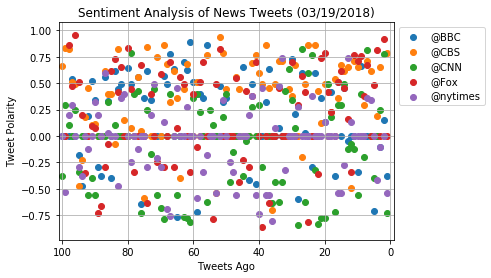
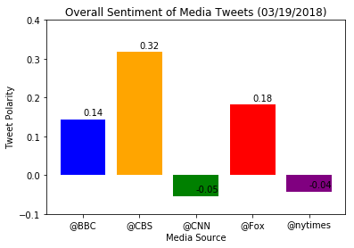

```python
# Dependencies
import tweepy
import json
import pandas as pd
import numpy as np
import matplotlib.pyplot as plt
import pandas as pd
import time
import seaborn as sns
from textblob import TextBlob, Word, Blobber
from vaderSentiment.vaderSentiment import SentimentIntensityAnalyzer
analyzer = SentimentIntensityAnalyzer()
```


```python
 # Twitter API Keys
consumer_key = 'oDpg15izr8Qh35vKgC9RLj3GF'
consumer_secret = 'ZAFP9oWiXTDrqCCWITcwQvhhdcFGV4Tx7YOUq7V5KorH95hBdC'
access_token = '30794710-8QKpZKrXJa7YCa9jfvIZTwG6R7iCsm5cUfCyAkIRn'
access_token_secret = '1km8ZHRki9QXuSVoKRK14y6HgvDAuNWOwRq3L0VO1c3hg'
```


```python
#Setup Tweepy API Authentication
auth = tweepy.OAuthHandler(consumer_key, consumer_secret)
auth.set_access_token(access_token, access_token_secret)
api = tweepy.API(auth, parser=tweepy.parsers.JSONParser())
```


```python
# Target Twitter Accounts
news_org = ["@BBC", "@CBS", "@CNN", "@Fox", "@nytimes"]
counter = 1
sentiments =[]
```


```python
# # Variables for holding sentiments
# compound_list = []
# positive_list = []
# negative_list = []
# neutral_list = []

# #loop through 5 pages of tweets (total 100 tweets)
# for x in range(5):
    

#     # Get all tweets from home feed
#     public_tweets = api.user_timeline(news_org)

#     # Loop through all tweets
#     for tweet in public_tweets:

#         # Run Vader Analysis on each tweet
#         compound = analyzer.polarity_scores(tweet["text"])["compound"]
#         pos = analyzer.polarity_scores(tweet["text"])["pos"]
#         neu = analyzer.polarity_scores(tweet["text"])["neu"]
#         neg = analyzer.polarity_scores(tweet["text"])["neg"]

#         # Add each value to the appropriate list
#         compound_list.append(compound)
#         positive_list.append(pos)
#         negative_list.append(neg)
#         neutral_list.append(neu)

```


```python
for org in news_org:
    public_tweets = api.user_timeline(org, count=100)
    tweetnumber = 1       
    for tweet in public_tweets:
        print("Tweet %s: %s" % (counter, tweet["text"]))
        compound = analyzer.polarity_scores(tweet["text"])["compound"]
        pos = analyzer.polarity_scores(tweet["text"])["pos"]
        neu = analyzer.polarity_scores(tweet["text"])["neu"]
        neg = analyzer.polarity_scores(tweet["text"])["neg"]
        tweets_ago = tweetnumber
        sentiments.append({"Media Source": org,
                           "Text":tweet["text"],
                           "Date": tweet["created_at"],
                           "Compound": compound,
                           "Positive": pos,
                           "Neutral": neu,
                           "Negative": neg,
                           "Tweet Count": tweetnumber})
        tweetnumber +=1
        counter +=1
```

    Tweet 1: Follow the dramatic and deadly series of events that took place at two funerals in Belfast in March 1988. 
    
    The Fun… https://t.co/y3MZaR8hsi
    Tweet 2: Leonardo DiCaprio stars in the true story of a con man who cashed fake cheques worth millions. 
    
    Catch Me If You Ca… https://t.co/HWShPj9ngi
    Tweet 3: 😂📸 @AlanCarr learned the hard way that you only get one shot at a school photo. #LiveAtTheApollo 
    
    https://t.co/fv5JmcRgz4
    Tweet 4: 🎤Pop band @FifthHarmony have announced they're taking a break to pursue solo careers 🎶https://t.co/tLOR7h1gZy https://t.co/5c77Cfjfp6
    Tweet 5: Murder. Innocence. Lies. 
    
    @AgathaChristie classic, #OrdealByInnocence, comes to @BBCOne soon.
    https://t.co/qfJThHowXC
    Tweet 6: Here are the latest snow scenes from around the UK. ❄️📸 https://t.co/eTBGkQ4MPU https://t.co/txRHxkOn5C
    Tweet 7: 'Flabbergasted'. 🎶This is the incredible moment when eight London teenagers heard a live opera singer for the first… https://t.co/jNki4Z61SE
    Tweet 8: Meet the dancing slum kids tipped for stardom by Rihanna 🎶
    https://t.co/R61fzQGIzd https://t.co/wGcvBKmdaZ
    Tweet 9: RT @bbcgetinspired: The Nation's Billion Steps Challenge is here! 🙌 
    
    Yesterday we did an amazing 431 million steps – can we do even better…
    Tweet 10: 💭 "There's always that voice in the back of your head that says you're not good enough". 
    
     💪 @CarrieHFletcher on b… https://t.co/0AsBxFFiQA
    Tweet 11: RT @BBCRadioScot: This must have been some buzz! 🐝🐝🐝 https://t.co/0gqtbQBN1i
    Tweet 12: Where are the UK's youngest and oldest city populations? https://t.co/eIU7UzqHBS https://t.co/vdXMTDluuX
    Tweet 13: RT @BBCSport: This 102-shot badminton rally will leave you exhausted... https://t.co/LFC4r4iwiz
    Tweet 14: Have you got a passion for plants? 🌿🌸🌱🍃🌷
    
    Test your knowledge of all things foliage in this quiz. 👉… https://t.co/evogV5ljAc
    Tweet 15: RT @BBCSport: 🎉 The Commonwealth Games are almost upon us! 🎉
    
    Scotland's Lynsey Sharp has given us the inside track on preparing for succes…
    Tweet 16: The oldest dog that the Dogs Trust has ever looked after has been given a new home. ❤️️🐶https://t.co/h0WQHkfMEf https://t.co/ixb7gesOIj
    Tweet 17: RT @BBCR1: Desperately searching for any signs of spring like... 🌸
    
    #MondayMotivation https://t.co/9jo3h4C7bu
    Tweet 18: RT @BBCRadioWales: ❄️ Snowy Cardiff! ⛄️ 
    
    What’s it like for you?
    
    #ButePark 
    #Cardiff 
    #MiniBeast
    #Snow https://t.co/O8gY1qjHVE
    Tweet 19: RT @BBCNews: Stem cell transplant "game changer" for MS patients https://t.co/BGWtdtXUAP
    Tweet 20: RT @BBCBreakfast: Anyone want to play a game of spot Tracey's feet? Our floor manager Tracey had to dive behind the sofa to avoid being on…
    Tweet 21: 'Who wants a normal life?' We should all be a little more like @chessmartinez. 👏💖 #LiveAtTheApollo
    
    https://t.co/VddL8zWJfS
    Tweet 22: RT @BBCWthrWatchers: Some incredible photos sent in last night of the #Auroraborealis from Skye Woody, Cumbrian stargazer and DJStewie.  Di…
    Tweet 23: Beautiful spring blossom in south-west China has been captured by drone https://t.co/WTo7JjiKXw
    Tweet 24: 🤔 Should we still be worried about the hole in the ozone layer?
    
    🌤 @SimonOKing and @clarenasir investigate in their… https://t.co/SZV3Df9y0t
    Tweet 25: 🏃💪 @LesDennis, @SimplySusannah, @Tameka_Empson and Miles Jupp embark on a muscle-grinding mission to regain their f… https://t.co/B1rXaalmk2
    Tweet 26: 👎💌 Fans of K-Pop boyband member @IBGDRGN have been asked to stop sending fan mail to the army base where he's doing… https://t.co/ojtDZ3gMfb
    Tweet 27: Saoirse Ronan stars as Eilis, a young girl who jumps at the chance of a better life when she emigrates to New York.… https://t.co/NtHAfh6cjZ
    Tweet 28: Ruth Ellis was only 28 when she became the last woman hanged to death in the UK. 
    
    #TheRuthEllisFiles | Watch on… https://t.co/5kUIFtom7t
    Tweet 29: RT @BBC_TopGear: 840bhp goes a little like this…
    
    @Matt_LeBlanc takes the Dodge Challenger SRT #Demon to the drag strip in this Sunday’s @T…
    Tweet 30: RT @bbcthree: Be honest, do you think you'll be this fit at 81? https://t.co/Eca0uGCF6b
    Tweet 31: 🍎🗑 How much food do you throw away? If you're a typical Brit, you probably think it's hardly any.
    
    You're in denial… https://t.co/0bSCbRrZJr
    Tweet 32: ❤️️📸Zun Lee wants his photography to give a balanced and nuanced portrayal of black fatherhood.
    
    👉… https://t.co/LodRrr27fd
    Tweet 33: 🤰 A doctor explains why you can get pregnant and give birth without having a baby bump. 
    👉 https://t.co/nVrSpQoTOT https://t.co/iEEOjZdBKL
    Tweet 34: RT @BBCEngland: A number of runners have held their own half-marathon in Reading after the official event was called off due to the snowy w…
    Tweet 35: RT @BBCSport: They’ve done it! Gold for GB’s Menna Fitzpatrick and Jen Kehoe in the visually impaired slalom at the Winter Paralympics. And…
    Tweet 36: 📱🚗 Why a rise in electric cars could also mean a hike in the cost of your next phone. https://t.co/6i5xFQgRIW
    Tweet 37: RT @BBC6Music: ✏️ Which song has the greatest opening line?
    Tweet 38: 🎤Pop music is awash with those that released one hit album and never followed it up. Here are 7 huge artists that o… https://t.co/4ukT9drcdG
    Tweet 39: 🍔😲 Would you eat a burger pie?  
    #BackInTimeForTea https://t.co/zGWzJwdSlM
    Tweet 40: RT @BBCOne: If food is the language of love... https://t.co/5hnYovE94o
    Tweet 41: Ever wondered why David Bowie wore an eye patch?
    
    Strange things artists have worn on stage and the reasons why. 
    👉… https://t.co/8zSBXQkLvy
    Tweet 42: 🍞🥖 Want to learn how to bake bread?
    
    These easy to follow recipes and step-by-step videos will have you baking ever… https://t.co/iXEmj5WJdD
    Tweet 43: “I regret spending £50,000 on my wedding.” https://t.co/6PxJsDf9dn https://t.co/eJdx7KMmmK
    Tweet 44: How to be 20 on the inside, even when you’re 80 on the outside... https://t.co/KB2mqpkrIB
    Tweet 45: RT @BBCNews: Snow and ice are bringing disruption to many parts of the UK - but they're not stopping everyone from having fun 🐶❄️
    
    https://…
    Tweet 46: RT @bbc5live: The beast from the east is back ❄️🌨️
    
    You've been in touch this morning with your #uksnow pics, here are just a few...
    
    What'…
    Tweet 47: These seven celebrities are about to go on the journey of a lifetime... #Pilgrimage
    https://t.co/m45UBXJew2
    Tweet 48: Can we just take a moment to discuss Eddie Redmanyne's coats?https://t.co/odVkhWyRKs
    Tweet 49: Ouch! 😂🔥@GordonRamsay's daughter is hilarious... 
    https://t.co/0dqwntX5uj
    Tweet 50: 🐜1⃣2⃣3⃣Sir David Attenborough explores whether there is counting in the natural world. 
    
    David Attenborough's Natur… https://t.co/Q4H4uXR4pt
    Tweet 51: One of the writers for The Simpsons has told @BBCNewsbeat Stephen Hawking was such a big fan of the show - he'd sho… https://t.co/Jjer3V4cYk
    Tweet 52: 🎓📚 'The moment I gave Reese Witherspoon my Legally Blonde dissertation... and yes, it was scented.'
    👉… https://t.co/z8x5mqqKoW
    Tweet 53: RT @BBCWorld: Blossom in south-west China captured by drone https://t.co/gIDKUn1La6
    Tweet 54: This year, over 250 landmarks across the globe are going green for #StPatricksDay! 🍀 https://t.co/TlWqU0TXQT https://t.co/i4sW4OaGrQ
    Tweet 55: RT @BBCRadio3: "Even if we found a complete theory of the universe, it wouldn't remove the need for music" - #StephenHawking
    https://t.co/t…
    Tweet 56: ⛷❤️ George has autism and other health conditions - but his love of skiing is helping him take on the outside world. https://t.co/kfCzRzkcNY
    Tweet 57: RT @5liveSport: 'My mates didn't know I was playing @realmadrid'
    
    @ManUtd's @carras16 tells @ColinMurray his friends keep him grounded…
    
    'A…
    Tweet 58: Yes, Gary Oldman and @BBCEastEnders' Big Mo are brother and sister. 
    
    But do you know these other celeb family ties… https://t.co/dtzMwD3nBB
    Tweet 59: RT @BBCOne: .@NiallOfficial won't let fame get to his head - Ireland won't allow it. 
    
    Happy #StPatricksDay 🍀 https://t.co/OrWR94HStF
    Tweet 60: ♻️🗑 This shop encourages you to bring your own container from home to save on single-use plastic waste. https://t.co/TdHJSycKtO
    Tweet 61: 🇮🇪 🍀 Celebrate #StPatricksDay in true Irish style with these delicious recipes! 👉https://t.co/2MCMlz6K0B https://t.co/k18P3Syx2N
    Tweet 62: From scrambled eggs to chilli-spiced crisps: here are six great ways to cook with kale. 😋👉https://t.co/lqKD1h83Iv https://t.co/yWESBJm62q
    Tweet 63: RT @BBCTwo: Happy #StPatricksDay! Check out what's lurking beneath the calm waters of Ireland's west coast... 🇮🇪🦈 https://t.co/6MQgyLTlIr
    Tweet 64: 🎶🐦 Did you know that bullfinches can learn to sing a tune by mimicking humans?
    
    🔊 Sound on for this one!  https://t.co/44OFulioZp
    Tweet 65: RT @BBCEngland: Stephen Hawking's PhD thesis has been viewed 250,000 times online since news of his death broke on Wednesday, the Universit…
    Tweet 66: Ready to get active?
    🏃 Here are 5 ways you can get involved in #SportRelief2018. 
    👉 https://t.co/wmKUWBDBjp https://t.co/xr7g5Hw4PK
    Tweet 67: RT @BBCR1: This guy just raised over a million pounds for @sportrelief 🙌🏻
    
    Congratulations on completing a truly mammoth task @gregjames, w…
    Tweet 68: 💪😲⚽️ Keepy-uppy the good work! https://t.co/lFtKEBxjNJ
    Tweet 69: ❤️🎧 Bradley has never let Asperger's hold him back from doing what he loves. https://t.co/5JFvIXeDSZ
    Tweet 70: Running for the door on a Friday afternoon like...
    #FridayFeeling https://t.co/optoQcK1TV
    Tweet 71: 🔊🎵Jarvis Cocker describes the dream-like experience of visiting La Monte Young's Dreamhouse.… https://t.co/O9u7sPRL5m
    Tweet 72: RT @BBCR1: The gruelling task of climbing Ben Nevis in underway for @gregjames after cycling 180 miles in a day and a half!
    
    Don't know abo…
    Tweet 73: Prepare to get that warm fuzzy feeling - the man who photobombed his wife 11 years before he met her:… https://t.co/iZBJ8dEKhz
    Tweet 74: 🤔🎨 Why are soap bubbles such gorgeous colours? https://t.co/ppaXTcvWRZ
    Tweet 75: RT @BBCNewsPR: Get ready to make the headlines. 
    
    Try out our new BBC iReporter game, putting you in the heart of the newsroom #BBCSchoolRe…
    Tweet 76: 😂 Fights, funerals, and giant furry heads... @BBCThree lifts the lid on the lives of English football's mascots
    👉… https://t.co/gEYxoetlah
    Tweet 77: RT @BBCRadio2: It's with a heavy heart that today we announce, after 18 fantastic years, @realLynnBowles is leaving Radio 2. 😢
    
    @realkenbru…
    Tweet 78: Are you getting enough sleep? This simple test will tell you... 🥄😴#WorldSleepDay https://t.co/SP28dsdLSf
    Tweet 79: RT @bbcthree: the dancing in taylor swift's new video seems pretty familiar 
    
    CC @ChrisLilley https://t.co/MfA9usnqSb
    Tweet 80: RT @BBCEngland: Oscar-winning British short film The Silent Child is to be shown on BBC One on Good Friday, giving UK viewers the first cha…
    Tweet 81: RT @BBCScotlandNews: Meet Chloe - the five-year-old girl changing perceptions of Down's syndrome https://t.co/UNylRgDoY0 https://t.co/4ZjpI…
    Tweet 82: RT @BBCWales: 🌼 Daffodils dance in the spring sunshine above Tenby harbour
    
    📷 #Photooftheday » https://t.co/kNBVDzoYrZ https://t.co/OEQQWR7…
    Tweet 83: 💪 After having his leg amputated, @MarkSmithBB is now training to become the world's strongest disabled man. https://t.co/BXlGp09hya
    Tweet 84: 🌸🌻🌺
    Take a look at some of the strangest, scariest and most wonderful plants on the planet, and find out what makes… https://t.co/AMFIAuRcxW
    Tweet 85: 😬🛰🌏 Brace yourselves... a Chinese space station could be about to crash into earth. https://t.co/cPFxyUhRsq
    Tweet 86: Why were Ansel Adams photographs of America so important? #Civilisations https://t.co/8krOMxDz9C
    Tweet 87: At a time in China when artists were persecuted, this painter secretly created beautiful landscapes. #Civilisations https://t.co/ApGgOkXX2w
    Tweet 88: 70% of children growing up in poverty in Scotland have a parent who is in work. https://t.co/NPY8FbCaf4
    Tweet 89: No time in the mornings? 
    🍯🍎 Pop these in the fridge the night before to feed the family breakfast almost instantly… https://t.co/FtuewpoBva
    Tweet 90: 🎨🖼️ Meet the amazing 84-year-old who’s never had an art lesson but painted a life-size replica of a Canaletto maste… https://t.co/X39YxKuxKe
    Tweet 91: RT @BBCR1: .@CHVRCHES covering @The1975's 'Somebody Else' in the Live Lounge is so stunning 🌹 https://t.co/djNHaPKlLi
    Tweet 92: Tiny cookery. It's like regular cookery, but smaller. https://t.co/9Q0R2CiUVi
    Tweet 93: 🚢🎞 Stars of the silver screen all at sea. 
    📸👉 https://t.co/YJ7PzhblOE https://t.co/PnHxJNmeok
    Tweet 94: BBC Economics Editor @bbckamal travels back to his old school to talk about real news, and it’s opposite, fake news… https://t.co/CAKG8AbVn8
    Tweet 95: RT @BBCr4today: Can you spot fake news? #BBCSchoolReport and John Humphrys are here to help... Play the game 👉 https://t.co/ulq1aviwP9 #r4t…
    Tweet 96: RT @BBCR1: The bike is back.
    The lycra is BACK.
    
    @GregJames' #Gregathlon for @SportRelief is back on the road to Ben Nevis! Today's challen…
    Tweet 97: RT @BBCSpringwatch: 😍🐭 This adorable little wood mouse hit the jackpot when it came across this larder of tasty hedgehog food! Watch how it…
    Tweet 98: RT @BBCTwo: 🆕 CONFIRMED: The final series of #Episodes starts Friday 30 March on @BBCTwo! @matt_leblanc @stephenmangan 📺🙌 https://t.co/PeBz…
    Tweet 99: Meet the Maasai woman standing up to female genital mutilation. https://t.co/CWUQB81bUz
    Tweet 100: 🧀🐮 A farm dairy in south west Scotland believes it is leading the way for what it describes as 'ethical' cheese.
    👉… https://t.co/VyfVlaVR0u
    Tweet 101: RT @YandR_CBS: Forever evolving, Forever inspiring, Forever Young and Restless. ❤️ Get ready to celebrate 45 years of #YR starting in just…
    Tweet 102: New start times in East/Central Time Zones: #60Minutes 7:37ET/6:37CT #Instinct series premiere 8:37ET/7:37CT… https://t.co/xT3YKqmu2M
    Tweet 103: Spend your Sunday streaming Second Round games LIVE with a FREE trial of CBS All Access! https://t.co/3P85rXLy4b https://t.co/zbWfirD9Ju
    Tweet 104: RT @instinctcbs: TONIGHT, Dr. Dylan Reinhart rewrites the book on abnormal behavior. Don't miss the premiere of #Instinct at 8/7c! https://…
    Tweet 105: If any duo knows how to rock the stage, it's @FLAGALine. The Vocal Duo Of The Year nominee will perform live at the… https://t.co/FknabB8NQp
    Tweet 106: How is your bracket looking after last night? Stream Second Round games LIVE today with a FREE trial of CBS All Acc… https://t.co/25JlIpgwog
    Tweet 107: Where better to spend #StPatricksDay than the place everybody knows your name? It’s just your luck that every singl… https://t.co/Fom5wmdENL
    Tweet 108: Stars @JakeMcDorman and Nik Dodani will join the cast in the upcoming revival of Murphy Brown coming to CBS.… https://t.co/JCAx29lo0i
    Tweet 109: RT @thegoodfight: Go behind the scenes with costume designer @DanLawsonStyle in "Behind The Style," a new weekly video series all about the…
    Tweet 110: The games have just begun! Continue to stream First Round games LIVE today with a FREE trial of CBS All Access:… https://t.co/YTGsJ48zYP
    Tweet 111: RT @TheTalkCBS: You asked, we answered! The fun never ends when the ladies #KeepTalking and answer your fan questions 🗣💬➡️ https://t.co/ie1…
    Tweet 112: RT @instinctcbs: Dr. Dylan Reinhart is lured back into the field from his life of quiet academia when a certain serial killer makes things…
    Tweet 113: Stream First Round games LIVE today starting at 12PM ET with a FREE trial of CBS All Access! https://t.co/3P85rXLy4b https://t.co/vZow3YD8cb
    Tweet 114: RT @CBSSports: It's the most wonderful time of the year. #MarchMadness https://t.co/e4c9qohqSR
    Tweet 115: Give these ladies some love! @Lauren_Alaina, @DBradbery, @carlypearce, and @RaeLynn are nominated for New Female Vo… https://t.co/IVhwURfJ3S
    Tweet 116: RT @ManWithAPlan: Hungry for more #ManWithAPlan bloopers and behind-the-scenes videos featuring cast like @matt_leblanc, @thelizasnyder, @k…
    Tweet 117: Music stars @MileyCyrus, @edsheeran, @ladygaga, and more will honor the legendary @eltonofficial and his hit songs… https://t.co/UzxARCCLnI
    Tweet 118: RT @thegoodfight: The verdict is in. The new season of #TheGoodFight is 🔥🔥🔥! Stream it now on CBS All Access: https://t.co/FkYSNSXlRb https…
    Tweet 119: RT @MadamSecretary: In less than an hour, #MadamSecretary's Keith Carradine will be taking over the @MadamSecretary Twitter page! Tweet alo…
    Tweet 120: RT @DierksBentley: Take and post a photo of the woman in your life who inspires you daily! Use the hashtag #WomanAmenACM in your post for a…
    Tweet 121: RT @MomCBS: If you missed guest star @KChenoweth in the latest episode of #Mom, not to worry! Watch now: https://t.co/RlvXoGOZ0l https://t.…
    Tweet 122: Give a round of applause to @KelseaBallerini, @MirandaLambert, @Reba, @MarenMorris, and @CarrieUnderwood, the five… https://t.co/Ncp1BTXx6N
    Tweet 123: RT @thegoodfight: Smart, sexy, and sophisticated. See what's coming this season on #TheGoodFight. https://t.co/CuKhx2G50P https://t.co/ygTI…
    Tweet 124: RT @BlueBloods_CBS: Even stand-up guys fall down sometimes. #BlueBloods is new tonight at 10/9c! https://t.co/UOlDm22wWW
    Tweet 125: Today and every day we celebrate the women in our lives who empower and inspire us. Share a story about an influent… https://t.co/9rVtqrElvT
    Tweet 126: Take and post a photo of the woman in your life who inspires you daily! Use the hashtag #WomanAmenACM in your post… https://t.co/7ShhvE48zy
    Tweet 127: RT @thegoodfight: Meticulously constructed. Soapy &amp; sexy. Intoxicating, savage television. 🔥 Here's what critics are saying about #TheGoodF…
    Tweet 128: This just in! @Jason_Aldean, @mirandalambert, @LukeBryanOnline, and many more are set to perform at the 53rd Academ… https://t.co/mfxw2VxzU4
    Tweet 129: Meet the ensemble of talented actors slated to join $1, a new mystery series coming to CBS All Access:… https://t.co/QoyYv7vxwg
    Tweet 130: Will @Jason_Aldean, @garthbrooks, @LukeBryanOnline, @ChrisStapleton, or @KeithUrban be named Entertainer Of The Yea… https://t.co/rMD8zjeX3s
    Tweet 131: RT @thegoodfight: It feels good to be back. 👠💄🔥 The season 2 premiere of #TheGoodFight is now streaming, exclusively on CBS All Access: htt…
    Tweet 132: RT @thegoodfight: Tomorrow, #TheGoodFight is back. Stream the season 2 premiere only on CBS All Access: https://t.co/tNFR8LBJO2 https://t.c…
    Tweet 133: Who are the trailblazing women in your life that inspire you? Join CBS and the ANA's #SeeHer initiative, celebratin… https://t.co/M0KqZ41Bes
    Tweet 134: Join @maria_bello, @aishatyler and @TeaLeoni in celebrating the accomplishments of women who have contributed to th… https://t.co/MefESBeFL3
    Tweet 135: In honor of Women's History Month, CBS and the Association of National Advertisers' (ANA) #SeeHer initiative will p… https://t.co/2wtYxKJVuO
    Tweet 136: RT @ZoeListerJones: Tonight’s an all new Life In Pieces and it’s directed by my ride or die @nataliaanderson!!!… https://t.co/2LPfmyLWrY
    Tweet 137: RT @MarenMorris: Hot damn! Woke up from my post-wisdom teeth haze to find out I’m up for 4 @ACMawards ! So honored, especially for the Dear…
    Tweet 138: RT @KelseaBallerini: Ohhhhh goodness. Incredible. Thank you thank you thank you. #female https://t.co/1ZTYjNfQeF
    Tweet 139: RT @KeithUrban: ACMs...... HOLY SMOKES!!!!! MAD LOVE TO U ALL THIS MORNING  FOR THESE INCREDIBLE NOMINATIONS. I’M EXTREMELY GRATEFUL!!!!!!!…
    Tweet 140: RT @ACMawards: Congratulations to this year’s #ACMawards Video of the Year nominees:
    “Black” - @DierksBentley
    “It Ain’t My Fault” - @Brothe…
    Tweet 141: RT @ACMawards: Please give a round of applause to this year’s #ACMawards Entertainer of the Year nominees: @Jason_Aldean, @GarthBrooks, @Lu…
    Tweet 142: .@ChrisStapleton, @ThomasRhett, @mirandalambert and more are all nominated for awards at Country Music's Party of t… https://t.co/Vm1vXRUDYJ
    Tweet 143: The Queen of Country, @Reba, is returning to host the 53rd #ACMawards on Sunday, April 15 at 8/7c. Here are a few o… https://t.co/Iqzz6Gql01
    Tweet 144: RT @survivorcbs: It’s time! #Survivor https://t.co/YPk6cGWrUA
    Tweet 145: RT @CBSThisMorning: TOMORROW: The nominees for the 2018 @ACMawards will be announced live by the one-and-only, @Reba! 
    
    Watch on @CBS in ou…
    Tweet 146: RT @thegoodfight: From the set design and costumes to hair and makeup, the production quality is truly next-level. Take a peek inside the u…
    Tweet 147: RT @LivinBiblically: The fun continues on Facebook! The #LivingBiblically cast is live to talk about tonight’s premiere. Tune in here: http…
    Tweet 148: RT @KevinCanWaitCBS: Can you get all the way through these #KevinCanWait bloopers without laughing?! @KevinJames,@LeahRemini and the rest o…
    Tweet 149: RT @ACMawards: That’s right! @Reba is headed to @CBSThisMorning on Thursday, March 1 to announce this year’s #ACMAwards' nominees. Tune in…
    Tweet 150: RT @ScorpionCBS: You can't hack your way to a 197 IQ, but you are well on your way with these Genius Facts from #TeamScorpion! 💻 You can be…
    Tweet 151: RT @SuperiorDonuts: You can always count on @DavidKoechner for a laugh! Did your favorite Tush moment make the list? Catch a new #SuperiorD…
    Tweet 152: RT @TheTalkCBS: TODAY: We loved them together then &amp; we love seeing them together now! Welcome back to the show @THESaraGilbert​'s good fri…
    Tweet 153: RT @thegoodfight: As foundations begin to crumble, our characters struggle to make sense of this new dystopian world. The cast teases what'…
    Tweet 154: #LivingBiblically's @linzkraft and @jrfergjr appeared on @KCBS's Facebook Live this morning, talking all about what… https://t.co/4RebcHuuMQ
    Tweet 155: RT @CBSSports: Introducing CBS Sports HQ, a New 24/7 Direct-to-Consumer Streaming Network for Sports News, Highlights, &amp; Analysis.
    
    Stream…
    Tweet 156: RT @CBSBigBrother: It’s down to the final 5 celebrity Houseguests, and anyone could take home the grand prize! Tune in NOW to watch the #BB…
    Tweet 157: RT @startrekcbs: Binge the entire first season of #StarTrekDiscovery. All episodes now streaming exclusively on CBS All Access: https://t.c…
    Tweet 158: RT @thegoodfight: #TheGoodFight returns in 1 week. Season 2 premieres Sunday, March 4. https://t.co/nomCao1GWp https://t.co/BOn6bOe9Tb
    Tweet 159: RT @thegoodfight: This is our new favorite thing. Christine Baranski debuted #TheGoodFight the Musical on @colbertlateshow last night! 🎵🎤…
    Tweet 160: RT @LivinBiblically: Confession time: have YOU ever hit the "close door" button in an elevator while somebody was approaching? The cast of…
    Tweet 161: RT @CBSEyeSpeak: Mark your calendars! #CBSEyeSpeak kicks off March 14 with The EYE Speak Summit. Follow our page for more details! https://…
    Tweet 162: RT @CBSEyeSpeak: Proud to announce a new CBS initiative, promoting female empowerment and developing the next generation of leaders through…
    Tweet 163: RT @LivinBiblically: When you're living by the Bible, it's good to have a priest and a rabbi on call (provided they answer their phones, th…
    Tweet 164: RT @thegoodfight: Chicago lawyers are being hunted and the world is going insane. 
    
    The new season of #TheGoodFight premieres Sunday, March…
    Tweet 165: Ready for some larger than life competition? This new series from @MarkBurnettTV will premiere in summer 2018.… https://t.co/gDXHLdIJ5v
    Tweet 166: With tournament dreams on the line, make sure to stream these college basketball matchups on CBS All Access:… https://t.co/SGkYUZrQWB
    Tweet 167: RT @LivinBiblically: While Chip's sticking to the Bible's original rules, the cast of #LivingBiblically has given them a more modern makeov…
    Tweet 168: Casting News! Peter Mark Kendall, Michael Gaston, Greg Wise, Rade Šerbedžija, Zack Pearlman, and Keye Chen join the… https://t.co/GFob2KrD8H
    Tweet 169: RT @BullCBS: The verdict is in...#Bull is the perfect Valentine! ❤️ Happy #ValentinesDay! https://t.co/poEejI4AnC
    Tweet 170: RT @NoActivityCBS: Car 27 reporting: Season 2 of #NoActivity coming soon!
    
    Binge season one now on CBS All Access: https://t.co/yvxoQMeyhN…
    Tweet 171: RT @LivinBiblically: Against all odds (and the advice of his God Squad), Chip is determined to live life by the Good Book. Think you could…
    Tweet 172: RT @thegoodfight: Christine Baranski reflects upon the spectacular metamorphosis of her character in #TheGoodFight's first season. Revisit…
    Tweet 173: RT @startrekcbs: Binge the entire first season of #StarTrekDiscovery. All 15 episodes now streaming on CBS All Access: https://t.co/lKLaptP…
    Tweet 174: RT @SuperiorDonuts: Looking for a #Valentine? Tush is here to help you land your dream date just in time for the day of love! #SuperiorDonu…
    Tweet 175: RT @CBSBigBrother: The pressure is on as the Houseguests battle each other for victory in the first HOH competition. Stream the season prem…
    Tweet 176: RT @startrekcbs: Sunday, this season's epic journey reaches its final reckoning. Catch up before the season finale: https://t.co/4Ea5wpmAep…
    Tweet 177: Are you a sucker for jaw-dropping talent competitions? Announcing The World's Best, a first-of-its-kind new global… https://t.co/fagCMklm2Z
    Tweet 178: RT @BullCBS: Tonight, one of these 3 TAC employees will end up incarcerated. Who do you think it will be? Tune into a new episode of #Bull…
    Tweet 179: RT @thegoodfight: There's no season like lawyer season. #TheGoodFight returns March 4, exclusively on CBS All Access. https://t.co/XAlrg1nB…
    Tweet 180: RT @thegoodfight: The acclaimed series returns in 1 month. #TheGoodFight is back Sunday, March 4. https://t.co/5BNLTYRd8p https://t.co/yInP…
    Tweet 181: .@KeshaRose's emotional performance with @CyndiLauper, @AndraDayMusic, @BebeRexha and @Camila_Cabello brought the a… https://t.co/qpgS2e9ir0
    Tweet 182: Broadway legend Patti LuPone paid tribute to Sir Andrew Lloyd Webber with a show-stopping rendition of the iconic s… https://t.co/GxqLtUzhFP
    Tweet 183: Relive an entire night's worth of big wins, live performances and many more inspiring moments from The 60th Annual… https://t.co/CH7mJ4Y3QT
    Tweet 184: RT @swatcbs: ✨@TheTalkCBS' @TheRealEve and @ShemarMoore brought some serious heat to the GRAMMYs red carpet: https://t.co/WYTITKkLQd https:…
    Tweet 185: The all-star collaboration between @Rihanna, @DJKhaled and @brysontiller brought the party to the #GRAMMYs with a s… https://t.co/jTv5QbtgUp
    Tweet 186: RT @TheTalkCBS: All the #redcarpet looks from the 60th annual #GRAMMYs! Did you catch @TheRealEve's sparkly two-piece suit? Diamond accents…
    Tweet 187: Go backstage with the celebs and see which stars celebrated the big night together! Here are the moments you missed… https://t.co/rgQTXRQyLg
    Tweet 188: 🎶 @DearEvanHansen star Ben Platt gave a soaring performance of a classic Broadway hit. Watch him perform 'Somewhere… https://t.co/HcuizFWo02
    Tweet 189: 🎸 @LittleBigTown, @U2, @BrunoMars and @Pink are just a few of the superstar performers that lit up the stage at The… https://t.co/2v0MNYMItG
    Tweet 190: Don't miss country stars Emmylou Harris and @ChrisStapleton perform a moving rendition of @TomPetty's classic song,… https://t.co/GxoIW97XIu
    Tweet 191: RT @survivorcbs: Get excited! 🙌 It’s finally time to meet the castaways of #Survivor: Ghost Island ☠ https://t.co/xQQ8ROhKbM https://t.co/P…
    Tweet 192: Country stars @EricChurch, @BrothersOsborne and @MarenMorris performed a touching tribute dedicated to the victims… https://t.co/YCIq9i70fd
    Tweet 193: Missed the Man vs. Beast #SuperBowlCommercials showdown? Catch up now to find out which entertaining ad was named t… https://t.co/SlyO0n7yMX
    Tweet 194: RT @rikimae: Ok, that one makes me cry #superbowlcommercials
    Tweet 195: If this doesn’t make you cry, nothing will. #SuperBowlCommercials https://t.co/UjFf3xr4so
    Tweet 196: RT @maverickkr: #superbowlcommercials the frogs were great, I'd forgotten about that one.
    Tweet 197: If you haven't voted yet, it's not too late! Choose your favorite here: https://t.co/s4pEIF5IX8… https://t.co/VCa1YHDyYy
    Tweet 198: RT @5691e44f3b66446: I am having so much fun ...the commercials are awesome #superbowlcommercials
    Tweet 199: RT @LittleShelbyMae: Love watching the #superbowlcommercials all the animal ones are my favorite!!
    Tweet 200: RT @PatHale915: Doritos time machine was great!   #superbowlcommercials
    Tweet 201: The Cambridge Analytica scandal has done immense damage to the Facebook brand, sources across the company believe… https://t.co/k32dEHDbfS
    Tweet 202: RT @TheLeadCNN: We're celebrating 5 years of #TheLead with @jaketapper! Thank you to all of our viewers for watching! 📺 https://t.co/3NmZOk…
    Tweet 203: Trump lawyer Michael Cohen jokes about Stormy Daniels, saying he might take "an extended vacation on her dime"; A l… https://t.co/pTf3j0iLUk
    Tweet 204: With just days before a potential shutdown, negotiations continue on a must-pass spending bill… https://t.co/qmINUShnrI
    Tweet 205: An anti-abortion, conservative Democrat fights for survival in the Illinois primary https://t.co/IsSkwVA69D https://t.co/3Nv9Gdt00P
    Tweet 206: What you need to know about Facebook's data debacle https://t.co/ngPqheWSSq https://t.co/G7X2Inay7b
    Tweet 207: The Supreme Court just gave Democrats a much better chance of retaking the House in 2018 | Analysis by @CillizzaCNN… https://t.co/ENTEP3LgMq
    Tweet 208: Republicans are bluntly warning President Trump to lay off his attacks on special counsel Robert Mueller, but there… https://t.co/lBBpwb5d1E
    Tweet 209: President Trump's lawyers recently provided the special counsel's office with documents in an attempt to limit the… https://t.co/hvD3zJposE
    Tweet 210: Senator Warner says it was "more than a little bit fishy" that former FBI Deputy Director Andrew McCabe was fired 3… https://t.co/ZD7Fqa0RWu
    Tweet 211: RT @CNNSitRoom: Facebook is under intense pressure to answer questions after it admitted that a company linked to President Trump's campaig…
    Tweet 212: Rep. Adam Schiff on Trump attacking special counsel Robert Mueller on Twitter: The President seems to be testing th… https://t.co/fkEcFAG4M8
    Tweet 213: RT @TheLeadCNN: "What you have is like the ‘Survivor’ meets ‘The Apprentice’ meets ‘Game of Thrones.’ It is the most insane scenario ... th…
    Tweet 214: Sen. Jeanne Shaheen: If President Trump has nothing to hide, then he should be interested in seeing this investigat… https://t.co/CwcznrIfm2
    Tweet 215: Sen. Jeanne Shaheen: I’ve been disappointed more Republican lawmakers aren’t speaking out to protect special counse… https://t.co/FQIXvLkvWF
    Tweet 216: Sen. Jeanne Shaheen: I’ve been disappointed more Republican lawmakers aren’t speaking out to protect special counse… https://t.co/4XVMG61Kt0
    Tweet 217: "[Trump] has been extremely consistent. He hates this investigation," and "he is scared of this investigation." - T… https://t.co/DzZka7zHAD
    Tweet 218: RT @TheLeadCNN: Austin, Texas authorities say the 4th bomb that went off overnight is the most sophisticated yet https://t.co/uqdA06osou ht…
    Tweet 219: US President Trump has yet to congratulate Russian President Vladimir Putin on his election, and a phone call betwe… https://t.co/WclI7Tljht
    Tweet 220: Uber has removed its self-driving cars from the road after a self-driving Uber SUV struck and killed a pedestrian i… https://t.co/gODSZocjLN
    Tweet 221: Authorities are speaking in Tempe, Arizona, about the self-driving Uber SUV that struck and killed a woman. Watch o… https://t.co/2WJR68WqSC
    Tweet 222: At least four people have died following head-on crashes in Hyundai and Kia cars in which the airbags did not deplo… https://t.co/NYc6ZPBVDp
    Tweet 223: The Turpin siblings, allegedly tortured for years by their parents, are out of hospitals but still regularly in tou… https://t.co/KyDF93PMYn
    Tweet 224: The Federal Reserve is all but certain to lift interest rates when Jerome Powell leads his first meeting as chairma… https://t.co/HIQRM5w4Bx
    Tweet 225: Opponents of abortion will come to the Supreme Court on Tuesday to challenge a California law they say is an uncons… https://t.co/3m0Rs9PvG4
    Tweet 226: Facebook sinks nearly 7% as the user data controversy sparks the company's worst day in four years.… https://t.co/uAmoZ6NeSv
    Tweet 227: Lin-Manuel Miranda and Ben Platt, two of Broadway's most popular voices, join forces for a song to benefit March Fo… https://t.co/Elnp81GDIl
    Tweet 228: "We can't execute our way out of this epidemic": President Trump's proposal to impose the death penalty on drug tra… https://t.co/ZfqIlAFlN4
    Tweet 229: Mississippi Gov. Phil Bryant has signed into law a bill that prevents women from getting abortions after 15 weeks o… https://t.co/rgTyLZc5Y4
    Tweet 230: Facebook's value plunges $37 billion on news that data firm Cambridge Analytica, which had ties to Trump's campaign… https://t.co/28hLoRGydA
    Tweet 231: 1 sentence that explains the wacky and super dysfunctional world of Donald Trump | Analysis by @CillizzaCNN… https://t.co/IzXZIlCluO
    Tweet 232: A member of Congress has extended an opportunity for former FBI deputy director Andrew McCabe to continue working i… https://t.co/lab9t9ApWC
    Tweet 233: Democratic Rep. Tom Suozzi is facing criticism after comments he made last week were interpreted as a suggestion of… https://t.co/xLoJTQaweT
    Tweet 234: The Dow drops 336 points as Facebook has its worst day in four years https://t.co/tritlMlisj https://t.co/UWnMhHktFw
    Tweet 235: Time's Up, the female-led organization formed in the aftermath of the Harvey Weinstein scandal, has called for an i… https://t.co/2NoqT04pRF
    Tweet 236: Lena Dunham talks about the "ups and downs" of life after having a hysterectomy due to her painful struggle with en… https://t.co/LaQ1Rjgypz
    Tweet 237: Representatives of North Korea, South Korea and the US are set to meet in Finland https://t.co/Z7nMAv39iR https://t.co/LtP275u89K
    Tweet 238: RT @CNNnewsroom: "Donald Trump's tweets contain multitudes and usually multitudes of things that aren't accurate" - CNN's Chris Cillizza re…
    Tweet 239: The Supreme Court has denied a request from Pennsylvania Republicans to block new congressional maps that could til… https://t.co/BsCfRZSkY7
    Tweet 240: Sweden helping negotiate release of Americans held in North Korea https://t.co/TlH5k0D4gN https://t.co/GRlNWV23Rw
    Tweet 241: President Donald Trump announced that his administration will push a "large-scale" ad campaign aimed at combating t… https://t.co/jzMkmjU6MA
    Tweet 242: Cambridge Analytica has agreed to a digital forensic audit of its servers and systems in an attempt to show that it… https://t.co/RvHxunH1b8
    Tweet 243: It's official: "Sex and the City" star Cynthia Nixon has announced that she is officially throwing her hat in the N… https://t.co/q9yji208A1
    Tweet 244: Passengers within two seats or one row of someone with a respiratory illness have an 80% or greater possibility of… https://t.co/DRFyRwJ3xV
    Tweet 245: Pres. Trump: "We're also taking action to prevent addiction by addressing the problem of over-prescribing, and our… https://t.co/fteSO5nggE
    Tweet 246: Companies use fingerprints and digital behavior to ID employees https://t.co/GBgYHvVE9B https://t.co/bI7BQTIlvt
    Tweet 247: RT @CNNPolitics: Trump announces an anti-opioid commercial campaign directed at children: “It’s the least expensive thing we can do, where…
    Tweet 248: Expect more trouble from Putin after the election, says CNN's National Security Analyst | @CNNOpinion… https://t.co/2GQ3lphWNX
    Tweet 249: President Trump: "I'm repeating my call on Congress to block funds for sanctuary cities and to close the deadly loo… https://t.co/sRwiXeqrBU
    Tweet 250: President Trump: The Southern US border must be secured; "The second part of our initiative is to reduce the supply… https://t.co/dMoENUJP5U
    Tweet 251: President Trump: "We can have all the blue-ribbon committees we want, but if we don't get tough on the drug dealers… https://t.co/wry6l9yIi9
    Tweet 252: 96-year-old style icon Iris Apfel has become the oldest person ever to be immortalized as a Barbie doll… https://t.co/UAUsJaRrtM
    Tweet 253: President Trump speaks at a New Hampshire event. https://t.co/MEQA7aPK8y
    
    Watch CNN: https://t.co/UYpqI3w42L 
    
    Watc… https://t.co/LeVAA7Xsd5
    Tweet 254: Miami Heat star @DwyaneWade on his efforts to support Florida school shooting victims and survivors: “I do more tha… https://t.co/WwH4iyXH7L
    Tweet 255: President Trump has signed an executive order banning US citizens from buying Venezuela's newly created cryptocurre… https://t.co/b5Y2IsH4LH
    Tweet 256: President Trump and Melania Trump are making remarks in New Hampshire on combatting the opioid crisis. Watch on Fac… https://t.co/A4oFKR403E
    Tweet 257: What you need to know about Facebook's data debacle https://t.co/6qgcwcQMNO https://t.co/JiIf44mBHU
    Tweet 258: Mark Zuckerberg's net worth dropped $5 billion following news that data firm Cambridge Analytica, which had ties to… https://t.co/9AD7ms4uAi
    Tweet 259: President Trump will hire an attorney to join his personal legal team who has alleged the President is being framed… https://t.co/HVrnkUFv20
    Tweet 260: Two things can -- and likely are -- true about the possibility of President Trump facing a serious primary in 2020.… https://t.co/jKMflOlz70
    Tweet 261: "President Trump is acting guilty as hell going after Mueller," says Democratic Sen. Chris Van Hollen… https://t.co/tTx9TcCVAI
    Tweet 262: JUST IN: Uber has removed its self-driving cars from the road after a self-driving Uber SUV struck and killed a ped… https://t.co/RMoFwN2CC9
    Tweet 263: SXSW bomb threat forces cancellation of The Roots concert https://t.co/kCbOVNUTIP https://t.co/od0545Ux4H
    Tweet 264: Fred Meyer stores will phase out all sales of guns and ammunition, according to its parent company, Kroger… https://t.co/r10zEcALBk
    Tweet 265: A massive bushfire has engulfed a small town in southeastern Australia, destroying more than 100 buildings and forc… https://t.co/uDbVlgR2eP
    Tweet 266: The data scientist who gathered info on millions of Facebook users for a firm tied to Trump's campaign says he'd be… https://t.co/s1PD8fpOMA
    Tweet 267: Special counsel Robert Mueller has provided lawyers for President Trump a list of questions as part of ongoing nego… https://t.co/rYDHFMp47A
    Tweet 268: A real estate investment startup co-founded by Jared Kushner skirted New York City laws and earned his company more… https://t.co/uPe1LLXUlR
    Tweet 269: A 9-year-old boy shot and killed his 13-year-old sister after they got into an argument over a video game controlle… https://t.co/M9RVwVatyC
    Tweet 270: RT @CNNweather: The severe storm risk has been UPGRADED to MODERATE meaning significant tornadoes, very large hail, and damaging winds are…
    Tweet 271: A Cirque du Soleil performer died Saturday night after he fell during a performance in Tampa, Florida… https://t.co/0nYTl5bCzn
    Tweet 272: Every job is safe in the White House — until it's not, writes Alice Stewart for @CNNOpinion https://t.co/hNeFFq6UZT https://t.co/Nwfe8JYnUy
    Tweet 273: In 1999, there were more than 2 million pay phones across America. 100,000 are left today. https://t.co/eJgOJtrM3c https://t.co/8bKq0lDY04
    Tweet 274: 9/11 hero who saved hundreds dies of cancer at age 45 https://t.co/867SmwNNsE https://t.co/poyiJf663n
    Tweet 275: "I do more than dribble": Miami Heat star Dwyane Wade defends his activism in the wake of the Florida school shooti… https://t.co/t92E3SLVOR
    Tweet 276: The Cambridge Analytica scandal has done immense damage to the Facebook brand, sources across the company believe… https://t.co/SB81VqUcwE
    Tweet 277: President Trump may not be able to fire Robert Mueller. So he's doing the next best thing. | Analysis by… https://t.co/D51NhkBqPk
    Tweet 278: Austin Police Chief Brian Manley: “We are clearly dealing with what we expect to be a serial bomber at this point”… https://t.co/RcMekTIQzv
    Tweet 279: Former FBI Director James Comey's book is already a best seller, with President Trump's help https://t.co/XwDviZepni https://t.co/RLRPj3sPoP
    Tweet 280: Police chief: There are "similarities" in all four bombs that have exploded in Austin since March 2 https://t.co/cCAhHjRSqP
    Tweet 281: Officials in Austin, Texas are holding a briefing after 4 bombings in less than 3 weeks: https://t.co/UYpqI3w42L … https://t.co/LsjH8I0Nit
    Tweet 282: Walmart is partnering up with Handy to offer TV mounting and furniture assembly https://t.co/MqCVMg5463 https://t.co/UcNUCPGfxD
    Tweet 283: Four bombings in less than 3 weeks have left Austin, Texas, on edge https://t.co/rJrmIQsYy5
    
    Police are planning to… https://t.co/GjVmxg8xhl
    Tweet 284: RT @CNNweather: Snow on the first day of Spring?! Yes, another nor'easter is possible beginning Tuesday. Severe storms will also impact the…
    Tweet 285: This single mother and her four children were living out of their car. Then a cop decided he had to do something.… https://t.co/Xo0DC5KTki
    Tweet 286: A Washington, DC, council member apologized after receiving backlash for comments he made in a video implying Washi… https://t.co/W3g5D0Wv5C
    Tweet 287: A helicopter carrying Ivanka Trump and Jared Kushner had to return to an airport in Washington on Thursday after on… https://t.co/C9HeASieJm
    Tweet 288: Ex-data firm worker: We got "into the hearts and minds of American voters in a way that had never been done before"… https://t.co/Fx9er9wYfB
    Tweet 289: The election that handed victory to Russia's Vladimir Putin was "overly controlled" and "lacked genuine competition… https://t.co/w2NMEeTg4n
    Tweet 290: President Trump tweets "WITCH HUNT," continuing his attack on special counsel Robert Mueller https://t.co/ySrPpGkkdN https://t.co/3u5XhBPlOf
    Tweet 291: Last night, an explosion injured two men in Austin, Texas. It's the fourth in the city this month. Here's what we k… https://t.co/6RHgxPUvis
    Tweet 292: Police have identified the six people who died when a pedestrian bridge crumbled on Thursday west of downtown Miami… https://t.co/B0Zu0r0eji
    Tweet 293: A low-pressure system moving across the Southeast today is expected to develop into yet another nor'easter beginnin… https://t.co/qChoiQGHRs
    Tweet 294: On this day in 1918, Congress passed the Standard Time Act that established time zones and daylight saving time. Bu… https://t.co/IEvJDeNcpO
    Tweet 295: RT @NewDay: "How can we move on -- as adults, as parents -- when we know our kids are not safe at school?" Miami Heat star @DwyaneWade asks…
    Tweet 296: 9/11 hero who saved hundreds dies of cancer at age 45 https://t.co/lDJaYv3qLs https://t.co/qRY4IADVB6
    Tweet 297: Former Trump campaign adviser Michael Caputo says President Trump sitting down with Robert Mueller would be a "situ… https://t.co/oFZUyzSiJt
    Tweet 298: Miami Heat star @DwyaneWade on his efforts to support Florida school shooting victims and survivors: “I do more tha… https://t.co/IRUNOQh5MC
    Tweet 299: CIA Director Mike Pompeo will meet with outgoing Secretary of State Rex Tillerson at the State Department on Monday… https://t.co/HBzzKtG44H
    Tweet 300: Patients who visit emergency rooms are getting hit with sky-high bills. Spending on an ER visit in the US rose to $… https://t.co/k0bv2PWwj6
    Tweet 301: RT @cssconfau: Guess what?
    
    Even if you aren’t here, you can watch all the talks LIVE! 😱
    
    Tune into the live stream here. #cssconfau18 
    
    ht…
    Tweet 302: @amyngyn hahaha. I actually never been, but I’ve heard the bar is great. :)
    Tweet 303: @amyngyn Loui Bar?
    Tweet 304: RT @LJKenward: Hey friends! 👋 Who's hiring Junior Devs at the moment? I have some awesome people from the @juniordev_io Community currently…
    Tweet 305: Don’t forget about the Community Social today! EVERYONE IS WELCOME (even if you don’t hold a CSSConf or JSConf tick… https://t.co/6c79TcKFCi
    Tweet 306: Toxic tech industry creates a fake vision of what each of us (especially minorities) have to be and achieve to be ”… https://t.co/yfXZ5nxCJ7
    Tweet 307: @amyngyn I never introduce myself. The focus is on content, not myself. Also I don’t feel like I need to justify my cred. :)
    Tweet 308: Today I got kissed by a dingo. 💁🏻‍♀️ https://t.co/FDQsVw2anl
    Tweet 309: @Sareh88 Thank you, Sareh! That’s very kind. ❤️
    Tweet 310: @meelijane https://t.co/Y5wM3nCdsH in Northcote. I’ve tested many and this one is orders of magnitude better than everywhere else. :)
    Tweet 311: One of many reasons why I love my yoga studio so much is how meditative the practice is and how all the instructors… https://t.co/VXfSqdo6bk
    Tweet 312: @IvanaMcConnell I can only help ruin your bank account further, sorry. 😂
    Tweet 313: RT @slamup: people love to say
    
         no child is born 
         with hate in their heart
    
    which is all very
    romantic
    
    but from the moment
    a bla…
    Tweet 314: @evanderkoogh Nope, we are at full capacity of the venue. :)
    Tweet 315: RT @cssconfau: Come and celebrate with us at pre CSSConf and JSConf AU community social!
    
    📅 Monday, March 19, 6pm onwards
    📍Stomping Ground…
    Tweet 316: @noahmp Heh, dang :) worth asking nonetheless.
    Tweet 317: @noahmp 👋🏻 is this a SF-based role?
    Tweet 318: RT @mbrockenbrough: Here's a point worth making every so often. The patriarchy isn't men. It's a system that prefers them. Wanting to disma…
    Tweet 319: @madalynrose Thank you so much ☺️ looking forward to meeting you! 🌺
    Tweet 320: @andymcmillan Thanks, Andy! You are an inspiration for me too! 💙
    Tweet 321: @evanderkoogh Hey Erwin! Thanks so much. We can chat during the events. :)
    Tweet 322: I don’t know what or who I’m most disappointed with to allow community work put my career in the background (again)… https://t.co/khOCa8rLHV
    Tweet 323: This time was supposed to be split between the conference and product work that would set me up for looking for a j… https://t.co/mOoFPPnV5w
    Tweet 324: Over the last 6+ months, I’ve sacrificed all the time I had to run CSSConf and JSConf AU. I’ve set the highest stan… https://t.co/QRvns2lJs8
    Tweet 325: RT @katebevan: LAYDEEZ!!!! Worried that VPNs are too hard for your fluffy ladybrain??? Never fear, a fuckwitted BroCo called @keepsafe is h…
    Tweet 326: @sarah_edo thank you! 😳
    Tweet 327: I can’t wait to come back to lovey Portland and see what wonderful thing @andymcmillan and @waxpancake are preparin… https://t.co/3rfz3ShOEU
    Tweet 328: @jennwrites thank you! I miss you too 😭❤️
    Tweet 329: To the young woman wearing a “the future is female” tee:
    
    The
    Future
    Is
    Intersectional
    Tweet 330: Cannot agree with this more. I constantly get asked for free diversity, inclusion, community or general workplace a… https://t.co/M9hOz6A980
    Tweet 331: @pat @coryannj @kckal Oh, I have not seen it. Will register. 👍🏻
    Tweet 332: Four days to go. https://t.co/RYxiCmMEFp
    Tweet 333: Ellen already had a lasting impact on diversity and inclusion spanning beyond the tech industry. 
    
    I can’t wait to… https://t.co/1QFSP6DHyQ
    Tweet 334: @jordwalsh 👋🏻 interesting! Would you be able to email me more details? hi at https://t.co/vah0lKcYeo. 📬
    Tweet 335: My last two weeks were spent in email. Conference organiser life. https://t.co/h5hlszzyjv
    Tweet 336: This video with Jeff Goldblum is everything. https://t.co/vo5HSwuOUP
    Tweet 337: Accepting talk proposals for conferences on a rolling basis: no no no no.
    
    First come first serve doesn’t work for inclusion.
    Tweet 338: If you are in Melbourne on Monday, March 19, we’re opening @cssconfau, @jsconfau and @decompressau with a Community… https://t.co/OyPVisZXYn
    Tweet 339: Australia is racist as hell. https://t.co/EIRFzejhsi
    Tweet 340: RT @sarahmei: 📢 PSA: when you're building a diverse team, you're looking for culture _add_, not culture _fit_. Hire people who bring a pers…
    Tweet 341: RT @piamancini: ok I need help. I really really want to hire a kickass developer who also happens to be a woman (backend pref.) What are th…
    Tweet 342: @piamancini Hey Pia! Thanks for reaching out 👋🏻 Unfortunately, software engineering isn’t my background; I’m a FE d… https://t.co/1IEwNKyc9q
    Tweet 343: RT @EricaJoy: 📢 PSA: There are no "diverse" applicants
    People aren't diverse, teams are
    You're not hiring a diverse person, you're building…
    Tweet 344: RT @SashaLaundy: What I keep telling myself this week: 
    👉🏻 In work, a new thing I don't know how to do means progress. 
    👉🏻 In the gym, a ha…
    Tweet 345: No underrepresented groups want to thrive and partake in exclusionary platform StackOverflow is.
    
    Tweet your hot ta… https://t.co/xfKjCfUtwJ
    Tweet 346: @erikalleigh I just block them. 😎
    Tweet 347: @jaffathecake Jake, I really admire your ability to try to have a serious conversation with inclusion deniers and mansplainers. 😂
    Tweet 348: @modernserf and thongs! I cannot grasp the diversity
    Tweet 349: @heydonworks Ohhh, this tweet so gold
    Tweet 350: RT @vaurorapub: For women in tech who need a break from talking about women in tech sometimes: here are some of the ways I get out of doing…
    Tweet 351: Do I know anyone working at @zapier?
    Tweet 352: Thank heavens for my career hotline with a few great women in tech.
    
    Sadly, we all share the same thoughts about th… https://t.co/KTzemdT7OG
    Tweet 353: I must say I’m pretty speechless. https://t.co/s4lvmWyE23
    Tweet 354: The tech industry, saving humanity from disease, poverty and injustice. https://t.co/wkmxj8c4Wy
    Tweet 355: I’m running a 4-day conference next week aka I have been listening to bird sounds on @noisli for the last eight hours.
    Tweet 356: PREACH @adblanche! 
    
    White women have a lot of homework to do. 
    
    https://t.co/PWeBC6MsXG
    Tweet 357: @brianleroux Brian, we both know that best talent lives in SF and NYC. there is no tech outside of those two regions.
    Tweet 358: @coryannj I love how the tech industry is cocky enough to believe they’re the solution to all humanity problems
    Tweet 359: ”Willing to relocate to San Francisco”. 
    
    We can’t have inclusive technology if jobs are constrained to cities whic… https://t.co/NCFLDermIF
    Tweet 360: 👋🏻 I have a bit of availability for diversity and inclusion consulting during April and May. I can help run inclusi… https://t.co/t4sbNrXUDV
    Tweet 361: RT @pangopup: 'Why sexism over how women look harms their leadership chances' https://t.co/v1YyNfpz3Z
    Tweet 362: RT @WBJenna: Have you heard about the @PineappleMedia Fellowship for Underrepresented Voices in Podcasting?
    
    -A full-time, producer-in-resi…
    Tweet 363: @coryannj Have you read Lean Out? Pretty much sums up most of my concerns with the approach. So flawed. I have a co… https://t.co/fpihGPPNkb
    Tweet 364: To be honest, all I want is a @sailorhg clothing line. https://t.co/iobZVLnosX
    Tweet 365: RT @incantatricks: Society expects women to be everything and want nothing.
    
    We have to be masters at self-improvement, conversation, emoti…
    Tweet 366: RT @ChloeCondon: Hey ladies, come work in tech. We have no bathroom lines 🚽💁🏼‍♀️ https://t.co/01stO97NKd
    Tweet 367: Friends: excited for the long weekend!
    Me: https://t.co/vPjwIGbbM4
    Tweet 368: RT @lrnrd: THIS THREAD 🍿🔥🙏🏻👏💯 https://t.co/vhfH4ETTC0
    Tweet 369: RT @ChloeCondon: Booth recruiter 🧔: ...and we really value diversity!
    
    Me 👧🏼: Do you have any women's sized shirts?
    
    🧔: Unfortunately no, t…
    Tweet 370: Amazing hosts for upcoming @CSSconfeu 💖 https://t.co/pmtGtflroP
    Tweet 371: Still wondering what companies that have less than 10% women (let alone POC) across the entire organisation (not on… https://t.co/yIyuV9WkMS
    Tweet 372: Women’s Day isn’t an arbitrary date. 
    
    It should be an ongoing celebration, empowerment and inclusion of all women… https://t.co/5EJ63WQXL6
    Tweet 373: RT @butwhoiskat: I’ll be speaking (for the first time) next Thursday, at WDYK, on the ethics of design.
    
    Wanna come support me?
    
    https://t.…
    Tweet 374: @Double_Days Hey! Unfortunately, that’s not me :)
    Tweet 375: RT @void_daddy_: the future isnt female. the future is nonbinary it's genderfluid it's queer and it's trans it's natives rising up against…
    Tweet 376: RT @soniagupta504: I'm starting to really understand the importance of psychological safety on developer teams. 
    
    With it, you have a team…
    Tweet 377: RT @vboykis: Somewhere in the multiverse, this HN exists. https://t.co/bdk0sZeucF
    Tweet 378: @ohhoe blocked because the truth was too stingy, the follow up james damore story
    Tweet 379: RT @triketora: such a useful resource for founders to be able to find the anti-harassment policies and points of contact for the vc firms t…
    Tweet 380: Hi friends! I’m looking for new opportunities to put my multidisciplinary skills to good use within a diverse organ… https://t.co/Chl7QaEgSe
    Tweet 381: @ANZ_AU You can email me at hi@thefox.is.
    Tweet 382: @Mandy_Kerr Back at you, Mandy! You’re amazing! ✨
    Tweet 383: @happycrappie thank you!
    Tweet 384: RT @shailjapatel: Read women.
    Cite women.
    Credit women.
    
    Teach women.
    Publish women.
    Present women.
    
    Acknowledge women.
    Award women.
    Amplif…
    Tweet 385: RT @EricaJoy: Men! Celebrate #InternationalWomensDay by taking direct action:
    🌟 Tell the women you work with how much you get paid.
    🌟 If yo…
    Tweet 386: Another release of @jsconfeu tickets is happening in a few minutes and you don’t want to miss out. https://t.co/MX1CYi6kiK
    Tweet 387: Everything about this—”the absence of no is not consent.”
    
    https://t.co/58usW9cFxH
    Tweet 388: Don’t try to shame me for your lack of professionalism and overconfident behaviour. 
    
    Tl:dr; don’t work for @ANZ_AU.
    Tweet 389: I told her how offensive and exclusionary those things were. Her reply:
    
    ”I'm disappointed with your interpretation… https://t.co/diQiVBdLF0
    Tweet 390: I got emailed by someone at @ANZ_AU who not only insinuated that I’m after ”fancy titles” after I said I want to dr… https://t.co/kpCyQY3i1z
    Tweet 391: @theroyals hey, thanks but that doesn’t sound like me, and I find a bunch of the language on your site problematic.
    Tweet 392: I think I’m going to collect “the best” team pages and toxic statements I see when looking for a new role. Already seen so many.
    
    🤢
    Tweet 393: @Catharz Thanks! I’ve interviewed in the past, but unfortunately, it didn’t fulfil my requirements on diversity and inclusion.
    Tweet 394: @s_mcleod 👋🏻 thanks! unfortunately, I think I’m mostly looking to steer away from traditional front-end roles to so… https://t.co/VJ18W89w3A
    Tweet 395: @stephenbelanger 👋🏻 Elastic has been recommended to me several times now. I would be keen to chat to someone. Would… https://t.co/YOKEU5HWVf
    Tweet 396: @mikerapp haha, please feel free to. I was inspired by wonderful @lrnrd :)
    Tweet 397: @d2kagw @camplexer 👋🏻  sure! would you be able to drop a line at hi@thefox.is with more details, please?
    Tweet 398: @breskeby hey, thanks! unfortunately, I don’t want to pursue the path of a front/JS developer so it wouldn’t be a good fit :)
    Tweet 399: @superhighfives Which park is this?!
    Tweet 400: RT @KevinQ: The worst places for poor white children are almost all better than the best places for poor black children.
    
    https://t.co/EPZt…
    Tweet 401: Evening Briefing: Here's what you need to know at the end of the day https://t.co/tQvejB0Xpm
    Tweet 402: RT @nicoleperlroth: NEW: Facebook's security officer @alexstamos is leaving the company amid disagreements with Facebook execs over how to…
    Tweet 403: Alex Stamos is said to be leaving Facebook after internal disagreements over how the social network should deal wit… https://t.co/2tbsL4WojM
    Tweet 404: Breaking News: A Facebook executive who urged transparency on Russian disinformation is said to be leaving after cl… https://t.co/iFVb6BY6j7
    Tweet 405: RT @UpshotNYT: The Supreme Court today refused to Intervene in the Pa. redistricting case. That means these districts are holding up, and D…
    Tweet 406: Photographers find new ways to frame the natural world https://t.co/dSKQ3jE90n https://t.co/2oMSS8Vyi9
    Tweet 407: RT @julieturkewitz: Tweeting some of the reaction to our story today: "I have long thought the absence of Native Americans from any form of…
    Tweet 408: Al Pacino and Michelle Pfeiffer will reunite for a 35th anniversary screening of "Scarface" at the Tribeca Film Fes… https://t.co/CHjotO0oT8
    Tweet 409: “Send some girls around to the candidate’s house.”
    
    As part of a monthslong investigation into Cambridge Analytica,… https://t.co/YP7xSJ59Gx
    Tweet 410: RT @readercenter: A @nytimes article published today on race and the income gap led to a big discussion among our readers. Submit a questio…
    Tweet 411: Catharine MacKinnon: "People have asked me for 40 years how not to get sued for sexual harassment. Well, a good fir… https://t.co/aiuh7NXSzK
    Tweet 412: Justin Verlander brought value to the Astros last season, when he joined in a trade and helped them win the World S… https://t.co/8yl93W3HoA
    Tweet 413: “Everyone in Austin is in the process of trying to figure out exactly how nervous to be. Are these bombings targete… https://t.co/5Pg0Ep4PRR
    Tweet 414: Read our report on how servers and bartenders weigh harassing behavior from customers against the tips they need to… https://t.co/N9dFagqWIa
    Tweet 415: Our report on the sexual harassment endured by restaurant servers drew 1,200 responses from readers: on money, powe… https://t.co/VnCiSwIYgy
    Tweet 416: RT @nytimestravel: Do you see Wakanda as a series of magical neighborhoods floating in midair? Would the magnetic levitation subway in trav…
    Tweet 417: “Send some girls around to the candidate’s house”: As part of a monthslong investigation into Cambridge Analytica,… https://t.co/FMEWKpKCUa
    Tweet 418: However, the firm’s employees, who often overlap, had contact in 2014 and 2015 with executives from Lukoil, the Rus… https://t.co/8Q90TwYuIH
    Tweet 419: Alexander Nix, a director of SCL Group, a British political and defense contractor, and chief executive of its Amer… https://t.co/CZMF8buD3n
    Tweet 420: Facebook is defending its protection of user information after Cambridge Analytica harvested private information fr… https://t.co/ynmgpzkUa8
    Tweet 421: Christopher Wylie, who oversaw Cambridge’s data collection until 2014, said of his former company, “For them, this… https://t.co/lGYdQTfkLz
    Tweet 422: The New York Times and The Observer of London reported how Cambridge Analytica, a political data firm closely tied… https://t.co/iu6g0OHg5T
    Tweet 423: Here’s what you need to know about how a political data firm tied to President Trump’s campaign gained access to pr… https://t.co/zvnAIgGXbv
    Tweet 424: "Nipped waists have long represented femininity," @AlexanderFury writes. "What does it say about the contemporary m… https://t.co/30rkCxLYYD
    Tweet 425: RT @NYTmag: These are chicks of the endangered Akikiki bird, a small bird native to the forests of Kauai, Hawaii. https://t.co/Wx1KGuzIk7 h…
    Tweet 426: The Australian comic Hannah Gadsby calls out Louis C.K., Harvey Weinstein and Bill Clinton, but her real target is… https://t.co/9lsfWqknha
    Tweet 427: The fourth bombing in Austin demonstrated a higher level of sophistication than the previous 3, as well as a “signi… https://t.co/uLMo7jGk5b
    Tweet 428: This video is the first piece in a series about these residents. Their stories offer a look at how people are confr… https://t.co/NLB5u8MLra
    Tweet 429: In the 6 months since Harvey, The New York Times followed several families in the Cinco Ranch community as they str… https://t.co/naAH2tvhPx
    Tweet 430: The homes in Cinco Ranch sat on land that had been designed to flood — a fact that wasn’t widely publicized when a… https://t.co/qAwdPWE5WV
    Tweet 431: After Hurricane Harvey swamped Houston, some residents of one suburban area were shocked to learn that the flooding… https://t.co/QYRyJRcO7D
    Tweet 432: RT @tiffkhsu: Claire's, where I and all of my friends and all of their friends got ears pierced as teenagers, is filing for Chapter 11 bank…
    Tweet 433: Does New York want another celebrity in public office? The actress Cynthia Nixon hopes so: She just entered the rac… https://t.co/tmzrIs6quF
    Tweet 434: RT @julieturkewitz: For much of our country's history, native people weren't permitted to vote. Now there are a historic number of indigeno…
    Tweet 435: 4 bombings this month in Austin, including one on Sunday night, have killed 2 people and injured 4. Here's what we… https://t.co/bqa42mRTn7
    Tweet 436: Another reader reacts to the news that a woman died after being hit by a self-driving Uber car… https://t.co/z1uax6tzgG
    Tweet 437: A New York Times reader reacts to the news that a woman died after being hit by a self-driving Uber car… https://t.co/1Tm0f1qpdM
    Tweet 438: You'll probably need to do a little shopping to make this traditional dish. But it's well worth it. https://t.co/8sjpx5xcn7
    Tweet 439: RT @NYTSports: Tyronn Lue: “I have had chest pains and other troubling symptoms." He's stepping away from the Cavs with just 13 games left…
    Tweet 440: Andrew McCabe, the former FBI deputy director, was fired late Friday night — on the eve of his retirement. Here’s w… https://t.co/WgdgoA0WtP
    Tweet 441: Stuffed ham is one of America’s most regionally specific dishes. People in Southern Maryland cherish it. https://t.co/g2tDQy5xWK
    Tweet 442: One NYT reader embraces the practice of flirting for tips https://t.co/bzmsCpF0sp https://t.co/35aiorjdej
    Tweet 443: RT @jasondhorowitz: Luigi Di Maio, 31, and Italy's potential next leader, was living at home “until five years ago,” his mother tells me. M…
    Tweet 444: President Trump is planning to hire a lawyer who’s pushed theories on Fox News that Trump was framed by the FBI and… https://t.co/W8oVqa5D2I
    Tweet 445: The change of a single word in the new tax law means the MLB, NBA and other sports franchises could now face capita… https://t.co/NBcgIvPN2X
    Tweet 446: Breaking News: A woman died after being hit by a self-driving Uber car in Tempe, Arizona. It’s the first known pede… https://t.co/KqD9AUqOm5
    Tweet 447: RT @nytopinion: I am a junior in high school, and I regularly shoot guns, for target practice and hunting, writes Dakota Hanchett https://t…
    Tweet 448: Britain will have a transition period after the country withdraws from the EU — as long as a deal can be struck to… https://t.co/j3M7RRrd5d
    Tweet 449: What we know about the Austin bombings https://t.co/EfHgpraY8B
    Tweet 450: The Austin police chief sent an unusual public message to the unknown bomber or bombers on Sunday: "We assure you t… https://t.co/BYmbbRdr6n
    Tweet 451: RT @NYTMetro: Prewar walk-up, airy loft, garden flat or sky-high glass-and-steel cube — we took a look at the history of the New York City…
    Tweet 452: After we published an article examining how servers endure harassing behavior for tips, readers wrote in with their… https://t.co/2zaaCSwtzd
    Tweet 453: In her early 20s, Mary Ewing Outerbridge brought tennis to the U.S. in the 1870s, establishing what may have been A… https://t.co/vqkNjr5uhs
    Tweet 454: Michael Ferro stepped down as the chairman of Tronc, just weeks after he helped negotiate the sale of The Los Angel… https://t.co/2ctT8mAELY
    Tweet 455: YouTube announced it would enlist Wikipedia’s help to deal with the proliferation of conspiracy theories and misinf… https://t.co/BRgKu7qgmR
    Tweet 456: RT @nhannahjones: An absolutely devastating new study about race and black males. Sons of wealthy black parents no better off than sons of…
    Tweet 457: There’s never been a Native American congresswoman. That could change in 2018. https://t.co/sWz8dv2SQ5
    Tweet 458: RT @NYTNational: “Rules don’t matter for them. For them, this is a war, and it’s all fair," said a founder of Cambridge Analytica, a firm t…
    Tweet 459: “Our community never should have been developed. It’s hundreds and hundreds of houses. Now we are proof that we nee… https://t.co/jlC1TJJ7JE
    Tweet 460: After Hurricane Harvey, thousands of homes in a Houston suburb were deliberately flooded by the federal government.… https://t.co/x3cwgQEQkr
    Tweet 461: In Opinion 
    
    Op-Ed columnist @CharlesMBlow writes: "How are international agreements supposed to be negotiated when… https://t.co/iS7FGbJfIZ
    Tweet 462: Andrew Cuomo suggested that his name "was never mentioned" during his former aide's corruption trial. That is incor… https://t.co/FlXRhzCHHl
    Tweet 463: New York’s school system is complex and deeply political. Its next leader has only modest big-district experience,… https://t.co/x5UZ6mPYcp
    Tweet 464: How do you find a person when all you have is half of a smiling face in an old photo? You turn to social media. https://t.co/F20iRGe0yG
    Tweet 465: Morning Briefing: Here's what you need to know to start your day https://t.co/ZoTLlxQP9f https://t.co/8lBjSG6F6I
    Tweet 466: Some aides view the weekend's attacks on Robert Mueller and the FBI as a particularly disturbing taste of what they… https://t.co/dlWTNJK5wk
    Tweet 467: We also wanted to hear from you. Readers described the pressure to tolerate harassing behavior in order to earn tip… https://t.co/4c3MxgNyIS
    Tweet 468: Among his credentials, Luigi Di Maio was the treasurer of his elementary school class and the president of his high… https://t.co/2ENENcK6pD
    Tweet 469: RT @nytimesarts: No one listener can choose a definitive “best of” SXSW; it’s impossible to hear more than a small percentage of the perfor…
    Tweet 470: Kate McKinnon as Education Secretary Betsy DeVos: "Look, I may not be very good on camera, but behind the scenes, m… https://t.co/bfafJqEzAm
    Tweet 471: Black boys raised in America, even in the wealthiest families and living in some of the most well-to-do neighborhoo… https://t.co/OGBKVIcK2J
    Tweet 472: 4 easy ways to cut down your sugar intake https://t.co/y33BxQJCnl
    Tweet 473: When asked if women were equal to men, Prince Mohammed said: "Absolutely. We are all human beings and there is no d… https://t.co/CwcBNofidf
    Tweet 474: NCAA men's tournament: Xavier, Michigan State, Cincinnati, North Carolina and Auburn exit much earlier than many ex… https://t.co/2qZgXNxJh3
    Tweet 475: Morning Briefing: Here's what you need to know to start your day https://t.co/9gvaeEZbMx https://t.co/w1K9nD6AA5
    Tweet 476: President Trump ignored the advice of his own lawyers and lashed out at Robert Mueller on Twitter. Here's how top R… https://t.co/yeK5eb5OXV
    Tweet 477: Britain's National Health Service is paying French doctors to perform some operations on its behalf https://t.co/4wWCaNjTMu
    Tweet 478: Austin was struck by a fourth explosion just hours after a televised appeal to the bomber https://t.co/4v1JYlYVts https://t.co/JyCFz78CLb
    Tweet 479: "Mr. President, the American people will hear my story very soon," James Comey tweeted Twitter on Saturday, in what… https://t.co/muUnhrU7Tx
    Tweet 480: Trump called the firing of McCabe, the deputy FBI director, a "great day for democracy." McCabe says it's further e… https://t.co/ja3hDRB5UH
    Tweet 481: A Republican candidate in Maine dropped out after he was excoriated for calling one Parkland shooting survivor a "s… https://t.co/iDP2y5kasj
    Tweet 482: Trump's attack on Robert Mueller, a longtime Republican and former FBI director appointed by George W. Bush, drew i… https://t.co/USv58YxIVL
    Tweet 483: Morning Briefing: Here's what you need to know to start your day https://t.co/buVWCNvtZQ https://t.co/XfAJQ3k1Vc
    Tweet 484: As the list of endangered animals grows longer, we may soon be faced with an impossible decision: which ones to sav… https://t.co/qxinyIbkFc
    Tweet 485: Britain should seek to postpone Brexit if talks drag on during the next few months, an influential committee of law… https://t.co/VgIKFxrTxX
    Tweet 486: RT @LizziePaton: Black models with very dark skin walked at many of the blockbuster shows this season, more so than ever before. Why now -…
    Tweet 487: Britain says it has proof that Russia has been stockpiling and researching lethal nerve agents for the purpose of a… https://t.co/sYsWVnTiCJ
    Tweet 488: Russian voters came out in smaller numbers than the Kremlin had hoped, but the result showed that Vladimir Putin en… https://t.co/LAi3vnNSAT
    Tweet 489: "After 50 meters she was just gone, baby, gone," said a man who swam after Daphne, a huge inflatable duck, as it wa… https://t.co/JbRuiKyKD2
    Tweet 490: Cambridge Analytica, a voter-profiling company, harvested private information from the Facebook profiles of more th… https://t.co/LgoFfnxjHd
    Tweet 491: RT @nytimesworld: On Monday morning, the situation in an Australian town hit by bushfires was still "dangerous and dynamic" https://t.co/Ni…
    Tweet 492: American and British lawmakers called on Facebook to explain how a political data firm tied to the Trump campaign h… https://t.co/uWEL6pePty
    Tweet 493: RT @nytimesworld: Parents are left to grieve, again, after another school kidnapping in Nigeria. In Dapchi, one father said he would rather…
    Tweet 494: When asked if women were equal to men, Prince Mohammed said: "Absolutely. We are all human beings and there is no d… https://t.co/BHwvmVtvTp
    Tweet 495: RT @nytimesworld: “The coaches try to educate the athletes in all ways, not only in wrestling,” said a wrestler in the Dagestan region of R…
    Tweet 496: Are there any keepsakes that you just can’t bear to throw away from your wedding or relationship? Share them with u… https://t.co/O6Zxtu7Hkn
    Tweet 497: 4 Easy Ways to Cut Down Your Sugar Intake https://t.co/cC6VPwBrfz
    Tweet 498: Police lying persists, even amid an explosion of video evidence that has allowed the public to test officers’ credi… https://t.co/JcUR5Jk0Gi
    Tweet 499: RT @NYTmag: An hour before she goes to bed, @juliascribe turns off all the lights and her devices for the night, and lights a candle or two…


```python
#Create DataFrame

news_sentiments = pd.DataFrame.from_dict(sentiments)
news_sentiments
```


<div>
<style>
    .dataframe thead tr:only-child th {
        text-align: right;
    }

    .dataframe thead th {
        text-align: left;
    }

    .dataframe tbody tr th {
        vertical-align: top;
    }
</style>
<table border="1" class="dataframe">
  <thead>
    <tr style="text-align: right;">
      <th></th>
      <th>Compound</th>
      <th>Date</th>
      <th>Media Source</th>
      <th>Negative</th>
      <th>Neutral</th>
      <th>Positive</th>
      <th>Text</th>
      <th>Tweet Count</th>
    </tr>
  </thead>
  <tbody>
    <tr>
      <th>0</th>
      <td>-0.3818</td>
      <td>Mon Mar 19 19:33:04 +0000 2018</td>
      <td>@BBC</td>
      <td>0.110</td>
      <td>0.890</td>
      <td>0.000</td>
      <td>Follow the dramatic and deadly series of event...</td>
      <td>1</td>
    </tr>
    <tr>
      <th>1</th>
      <td>0.1531</td>
      <td>Mon Mar 19 18:33:05 +0000 2018</td>
      <td>@BBC</td>
      <td>0.116</td>
      <td>0.709</td>
      <td>0.175</td>
      <td>Leonardo DiCaprio stars in the true story of a...</td>
      <td>2</td>
    </tr>
    <tr>
      <th>2</th>
      <td>-0.1027</td>
      <td>Mon Mar 19 18:03:01 +0000 2018</td>
      <td>@BBC</td>
      <td>0.080</td>
      <td>0.920</td>
      <td>0.000</td>
      <td>😂📸 @AlanCarr learned the hard way that you onl...</td>
      <td>3</td>
    </tr>
    <tr>
      <th>3</th>
      <td>0.0000</td>
      <td>Mon Mar 19 17:30:08 +0000 2018</td>
      <td>@BBC</td>
      <td>0.000</td>
      <td>1.000</td>
      <td>0.000</td>
      <td>🎤Pop band @FifthHarmony have announced they're...</td>
      <td>4</td>
    </tr>
    <tr>
      <th>4</th>
      <td>-0.7096</td>
      <td>Mon Mar 19 17:00:05 +0000 2018</td>
      <td>@BBC</td>
      <td>0.414</td>
      <td>0.442</td>
      <td>0.144</td>
      <td>Murder. Innocence. Lies. \n\n@AgathaChristie c...</td>
      <td>5</td>
    </tr>
    <tr>
      <th>5</th>
      <td>0.0000</td>
      <td>Mon Mar 19 16:33:29 +0000 2018</td>
      <td>@BBC</td>
      <td>0.000</td>
      <td>1.000</td>
      <td>0.000</td>
      <td>Here are the latest snow scenes from around th...</td>
      <td>6</td>
    </tr>
    <tr>
      <th>6</th>
      <td>0.0000</td>
      <td>Mon Mar 19 15:02:02 +0000 2018</td>
      <td>@BBC</td>
      <td>0.000</td>
      <td>1.000</td>
      <td>0.000</td>
      <td>'Flabbergasted'. 🎶This is the incredible momen...</td>
      <td>7</td>
    </tr>
    <tr>
      <th>7</th>
      <td>0.0000</td>
      <td>Mon Mar 19 14:30:08 +0000 2018</td>
      <td>@BBC</td>
      <td>0.000</td>
      <td>1.000</td>
      <td>0.000</td>
      <td>Meet the dancing slum kids tipped for stardom ...</td>
      <td>8</td>
    </tr>
    <tr>
      <th>8</th>
      <td>0.6588</td>
      <td>Mon Mar 19 13:44:55 +0000 2018</td>
      <td>@BBC</td>
      <td>0.000</td>
      <td>0.788</td>
      <td>0.212</td>
      <td>RT @bbcgetinspired: The Nation's Billion Steps...</td>
      <td>9</td>
    </tr>
    <tr>
      <th>9</th>
      <td>-0.3412</td>
      <td>Mon Mar 19 13:03:04 +0000 2018</td>
      <td>@BBC</td>
      <td>0.112</td>
      <td>0.888</td>
      <td>0.000</td>
      <td>💭 "There's always that voice in the back of yo...</td>
      <td>10</td>
    </tr>
    <tr>
      <th>10</th>
      <td>0.0000</td>
      <td>Mon Mar 19 12:55:17 +0000 2018</td>
      <td>@BBC</td>
      <td>0.000</td>
      <td>1.000</td>
      <td>0.000</td>
      <td>RT @BBCRadioScot: This must have been some buz...</td>
      <td>11</td>
    </tr>
    <tr>
      <th>11</th>
      <td>0.0000</td>
      <td>Mon Mar 19 12:30:05 +0000 2018</td>
      <td>@BBC</td>
      <td>0.000</td>
      <td>1.000</td>
      <td>0.000</td>
      <td>Where are the UK's youngest and oldest city po...</td>
      <td>12</td>
    </tr>
    <tr>
      <th>12</th>
      <td>-0.0516</td>
      <td>Mon Mar 19 11:50:58 +0000 2018</td>
      <td>@BBC</td>
      <td>0.107</td>
      <td>0.893</td>
      <td>0.000</td>
      <td>RT @BBCSport: This 102-shot badminton rally wi...</td>
      <td>13</td>
    </tr>
    <tr>
      <th>13</th>
      <td>0.4588</td>
      <td>Mon Mar 19 11:33:04 +0000 2018</td>
      <td>@BBC</td>
      <td>0.000</td>
      <td>0.857</td>
      <td>0.143</td>
      <td>Have you got a passion for plants? 🌿🌸🌱🍃🌷\n\nTe...</td>
      <td>14</td>
    </tr>
    <tr>
      <th>14</th>
      <td>0.0000</td>
      <td>Mon Mar 19 10:53:19 +0000 2018</td>
      <td>@BBC</td>
      <td>0.000</td>
      <td>1.000</td>
      <td>0.000</td>
      <td>RT @BBCSport: 🎉 The Commonwealth Games are alm...</td>
      <td>15</td>
    </tr>
    <tr>
      <th>15</th>
      <td>0.5106</td>
      <td>Mon Mar 19 10:33:03 +0000 2018</td>
      <td>@BBC</td>
      <td>0.000</td>
      <td>0.837</td>
      <td>0.163</td>
      <td>The oldest dog that the Dogs Trust has ever lo...</td>
      <td>16</td>
    </tr>
    <tr>
      <th>16</th>
      <td>-0.3818</td>
      <td>Mon Mar 19 09:58:24 +0000 2018</td>
      <td>@BBC</td>
      <td>0.191</td>
      <td>0.809</td>
      <td>0.000</td>
      <td>RT @BBCR1: Desperately searching for any signs...</td>
      <td>17</td>
    </tr>
    <tr>
      <th>17</th>
      <td>0.4199</td>
      <td>Mon Mar 19 09:58:15 +0000 2018</td>
      <td>@BBC</td>
      <td>0.000</td>
      <td>0.843</td>
      <td>0.157</td>
      <td>RT @BBCRadioWales: ❄️ Snowy Cardiff! ⛄️ \n\nWh...</td>
      <td>18</td>
    </tr>
    <tr>
      <th>18</th>
      <td>0.0000</td>
      <td>Mon Mar 19 09:58:10 +0000 2018</td>
      <td>@BBC</td>
      <td>0.000</td>
      <td>1.000</td>
      <td>0.000</td>
      <td>RT @BBCNews: Stem cell transplant "game change...</td>
      <td>19</td>
    </tr>
    <tr>
      <th>19</th>
      <td>0.1280</td>
      <td>Mon Mar 19 09:57:58 +0000 2018</td>
      <td>@BBC</td>
      <td>0.079</td>
      <td>0.789</td>
      <td>0.133</td>
      <td>RT @BBCBreakfast: Anyone want to play a game o...</td>
      <td>20</td>
    </tr>
    <tr>
      <th>20</th>
      <td>0.3642</td>
      <td>Mon Mar 19 09:32:02 +0000 2018</td>
      <td>@BBC</td>
      <td>0.000</td>
      <td>0.848</td>
      <td>0.152</td>
      <td>'Who wants a normal life?' We should all be a ...</td>
      <td>21</td>
    </tr>
    <tr>
      <th>21</th>
      <td>0.0000</td>
      <td>Mon Mar 19 09:27:50 +0000 2018</td>
      <td>@BBC</td>
      <td>0.000</td>
      <td>1.000</td>
      <td>0.000</td>
      <td>RT @BBCWthrWatchers: Some incredible photos se...</td>
      <td>22</td>
    </tr>
    <tr>
      <th>22</th>
      <td>0.5994</td>
      <td>Mon Mar 19 08:45:02 +0000 2018</td>
      <td>@BBC</td>
      <td>0.000</td>
      <td>0.738</td>
      <td>0.262</td>
      <td>Beautiful spring blossom in south-west China h...</td>
      <td>23</td>
    </tr>
    <tr>
      <th>23</th>
      <td>-0.2960</td>
      <td>Mon Mar 19 08:02:00 +0000 2018</td>
      <td>@BBC</td>
      <td>0.109</td>
      <td>0.891</td>
      <td>0.000</td>
      <td>🤔 Should we still be worried about the hole in...</td>
      <td>24</td>
    </tr>
    <tr>
      <th>24</th>
      <td>0.0000</td>
      <td>Sun Mar 18 20:30:11 +0000 2018</td>
      <td>@BBC</td>
      <td>0.000</td>
      <td>1.000</td>
      <td>0.000</td>
      <td>🏃💪 @LesDennis, @SimplySusannah, @Tameka_Empson...</td>
      <td>25</td>
    </tr>
    <tr>
      <th>25</th>
      <td>0.0258</td>
      <td>Sun Mar 18 20:03:04 +0000 2018</td>
      <td>@BBC</td>
      <td>0.086</td>
      <td>0.824</td>
      <td>0.090</td>
      <td>👎💌 Fans of K-Pop boyband member @IBGDRGN have ...</td>
      <td>26</td>
    </tr>
    <tr>
      <th>26</th>
      <td>0.5994</td>
      <td>Sun Mar 18 19:33:04 +0000 2018</td>
      <td>@BBC</td>
      <td>0.000</td>
      <td>0.803</td>
      <td>0.197</td>
      <td>Saoirse Ronan stars as Eilis, a young girl who...</td>
      <td>27</td>
    </tr>
    <tr>
      <th>27</th>
      <td>-0.5994</td>
      <td>Sun Mar 18 18:44:02 +0000 2018</td>
      <td>@BBC</td>
      <td>0.163</td>
      <td>0.837</td>
      <td>0.000</td>
      <td>Ruth Ellis was only 28 when she became the las...</td>
      <td>28</td>
    </tr>
    <tr>
      <th>28</th>
      <td>0.2040</td>
      <td>Sun Mar 18 18:34:14 +0000 2018</td>
      <td>@BBC</td>
      <td>0.077</td>
      <td>0.772</td>
      <td>0.151</td>
      <td>RT @BBC_TopGear: 840bhp goes a little like thi...</td>
      <td>29</td>
    </tr>
    <tr>
      <th>29</th>
      <td>0.7331</td>
      <td>Sun Mar 18 17:18:12 +0000 2018</td>
      <td>@BBC</td>
      <td>0.000</td>
      <td>0.660</td>
      <td>0.340</td>
      <td>RT @bbcthree: Be honest, do you think you'll b...</td>
      <td>30</td>
    </tr>
    <tr>
      <th>...</th>
      <td>...</td>
      <td>...</td>
      <td>...</td>
      <td>...</td>
      <td>...</td>
      <td>...</td>
      <td>...</td>
      <td>...</td>
    </tr>
    <tr>
      <th>469</th>
      <td>-0.2051</td>
      <td>Mon Mar 19 12:50:04 +0000 2018</td>
      <td>@nytimes</td>
      <td>0.083</td>
      <td>0.917</td>
      <td>0.000</td>
      <td>Kate McKinnon as Education Secretary Betsy DeV...</td>
      <td>71</td>
    </tr>
    <tr>
      <th>470</th>
      <td>0.4939</td>
      <td>Mon Mar 19 12:40:03 +0000 2018</td>
      <td>@nytimes</td>
      <td>0.000</td>
      <td>0.856</td>
      <td>0.144</td>
      <td>Black boys raised in America, even in the weal...</td>
      <td>72</td>
    </tr>
    <tr>
      <th>471</th>
      <td>0.2023</td>
      <td>Mon Mar 19 12:30:14 +0000 2018</td>
      <td>@nytimes</td>
      <td>0.175</td>
      <td>0.583</td>
      <td>0.242</td>
      <td>4 easy ways to cut down your sugar intake http...</td>
      <td>73</td>
    </tr>
    <tr>
      <th>472</th>
      <td>-0.2960</td>
      <td>Mon Mar 19 12:20:06 +0000 2018</td>
      <td>@nytimes</td>
      <td>0.091</td>
      <td>0.909</td>
      <td>0.000</td>
      <td>When asked if women were equal to men, Prince ...</td>
      <td>74</td>
    </tr>
    <tr>
      <th>473</th>
      <td>0.0000</td>
      <td>Mon Mar 19 12:11:04 +0000 2018</td>
      <td>@nytimes</td>
      <td>0.000</td>
      <td>1.000</td>
      <td>0.000</td>
      <td>NCAA men's tournament: Xavier, Michigan State,...</td>
      <td>75</td>
    </tr>
    <tr>
      <th>474</th>
      <td>0.0000</td>
      <td>Mon Mar 19 12:00:04 +0000 2018</td>
      <td>@nytimes</td>
      <td>0.000</td>
      <td>1.000</td>
      <td>0.000</td>
      <td>Morning Briefing: Here's what you need to know...</td>
      <td>76</td>
    </tr>
    <tr>
      <th>475</th>
      <td>-0.1280</td>
      <td>Mon Mar 19 11:50:04 +0000 2018</td>
      <td>@nytimes</td>
      <td>0.095</td>
      <td>0.830</td>
      <td>0.075</td>
      <td>President Trump ignored the advice of his own ...</td>
      <td>77</td>
    </tr>
    <tr>
      <th>476</th>
      <td>0.0000</td>
      <td>Mon Mar 19 11:40:04 +0000 2018</td>
      <td>@nytimes</td>
      <td>0.000</td>
      <td>1.000</td>
      <td>0.000</td>
      <td>Britain's National Health Service is paying Fr...</td>
      <td>78</td>
    </tr>
    <tr>
      <th>477</th>
      <td>-0.2500</td>
      <td>Mon Mar 19 11:30:11 +0000 2018</td>
      <td>@nytimes</td>
      <td>0.118</td>
      <td>0.882</td>
      <td>0.000</td>
      <td>Austin was struck by a fourth explosion just h...</td>
      <td>79</td>
    </tr>
    <tr>
      <th>478</th>
      <td>0.0000</td>
      <td>Mon Mar 19 11:20:11 +0000 2018</td>
      <td>@nytimes</td>
      <td>0.000</td>
      <td>1.000</td>
      <td>0.000</td>
      <td>"Mr. President, the American people will hear ...</td>
      <td>80</td>
    </tr>
    <tr>
      <th>479</th>
      <td>0.4019</td>
      <td>Mon Mar 19 11:10:08 +0000 2018</td>
      <td>@nytimes</td>
      <td>0.098</td>
      <td>0.735</td>
      <td>0.167</td>
      <td>Trump called the firing of McCabe, the deputy ...</td>
      <td>81</td>
    </tr>
    <tr>
      <th>480</th>
      <td>0.3612</td>
      <td>Mon Mar 19 11:00:14 +0000 2018</td>
      <td>@nytimes</td>
      <td>0.000</td>
      <td>0.872</td>
      <td>0.128</td>
      <td>A Republican candidate in Maine dropped out af...</td>
      <td>82</td>
    </tr>
    <tr>
      <th>481</th>
      <td>-0.4767</td>
      <td>Mon Mar 19 10:45:02 +0000 2018</td>
      <td>@nytimes</td>
      <td>0.147</td>
      <td>0.853</td>
      <td>0.000</td>
      <td>Trump's attack on Robert Mueller, a longtime R...</td>
      <td>83</td>
    </tr>
    <tr>
      <th>482</th>
      <td>0.0000</td>
      <td>Mon Mar 19 10:30:03 +0000 2018</td>
      <td>@nytimes</td>
      <td>0.000</td>
      <td>1.000</td>
      <td>0.000</td>
      <td>Morning Briefing: Here's what you need to know...</td>
      <td>84</td>
    </tr>
    <tr>
      <th>483</th>
      <td>0.0000</td>
      <td>Mon Mar 19 10:14:05 +0000 2018</td>
      <td>@nytimes</td>
      <td>0.000</td>
      <td>1.000</td>
      <td>0.000</td>
      <td>As the list of endangered animals grows longer...</td>
      <td>85</td>
    </tr>
    <tr>
      <th>484</th>
      <td>0.0258</td>
      <td>Mon Mar 19 10:00:07 +0000 2018</td>
      <td>@nytimes</td>
      <td>0.154</td>
      <td>0.729</td>
      <td>0.117</td>
      <td>Britain should seek to postpone Brexit if talk...</td>
      <td>86</td>
    </tr>
    <tr>
      <th>485</th>
      <td>0.5994</td>
      <td>Mon Mar 19 09:50:05 +0000 2018</td>
      <td>@nytimes</td>
      <td>0.000</td>
      <td>0.860</td>
      <td>0.140</td>
      <td>RT @LizziePaton: Black models with very dark s...</td>
      <td>87</td>
    </tr>
    <tr>
      <th>486</th>
      <td>0.0000</td>
      <td>Mon Mar 19 09:40:07 +0000 2018</td>
      <td>@nytimes</td>
      <td>0.000</td>
      <td>1.000</td>
      <td>0.000</td>
      <td>Britain says it has proof that Russia has been...</td>
      <td>88</td>
    </tr>
    <tr>
      <th>487</th>
      <td>0.2023</td>
      <td>Mon Mar 19 09:30:07 +0000 2018</td>
      <td>@nytimes</td>
      <td>0.000</td>
      <td>0.917</td>
      <td>0.083</td>
      <td>Russian voters came out in smaller numbers tha...</td>
      <td>89</td>
    </tr>
    <tr>
      <th>488</th>
      <td>0.3182</td>
      <td>Mon Mar 19 09:15:12 +0000 2018</td>
      <td>@nytimes</td>
      <td>0.000</td>
      <td>0.901</td>
      <td>0.099</td>
      <td>"After 50 meters she was just gone, baby, gone...</td>
      <td>90</td>
    </tr>
    <tr>
      <th>489</th>
      <td>0.0000</td>
      <td>Mon Mar 19 09:00:11 +0000 2018</td>
      <td>@nytimes</td>
      <td>0.000</td>
      <td>1.000</td>
      <td>0.000</td>
      <td>Cambridge Analytica, a voter-profiling company...</td>
      <td>91</td>
    </tr>
    <tr>
      <th>490</th>
      <td>-0.1280</td>
      <td>Mon Mar 19 08:44:03 +0000 2018</td>
      <td>@nytimes</td>
      <td>0.131</td>
      <td>0.759</td>
      <td>0.110</td>
      <td>RT @nytimesworld: On Monday morning, the situa...</td>
      <td>92</td>
    </tr>
    <tr>
      <th>491</th>
      <td>0.0000</td>
      <td>Mon Mar 19 08:31:03 +0000 2018</td>
      <td>@nytimes</td>
      <td>0.000</td>
      <td>1.000</td>
      <td>0.000</td>
      <td>American and British lawmakers called on Faceb...</td>
      <td>93</td>
    </tr>
    <tr>
      <th>492</th>
      <td>-0.3818</td>
      <td>Mon Mar 19 08:17:04 +0000 2018</td>
      <td>@nytimes</td>
      <td>0.110</td>
      <td>0.890</td>
      <td>0.000</td>
      <td>RT @nytimesworld: Parents are left to grieve, ...</td>
      <td>94</td>
    </tr>
    <tr>
      <th>493</th>
      <td>-0.2960</td>
      <td>Mon Mar 19 08:04:05 +0000 2018</td>
      <td>@nytimes</td>
      <td>0.091</td>
      <td>0.909</td>
      <td>0.000</td>
      <td>When asked if women were equal to men, Prince ...</td>
      <td>95</td>
    </tr>
    <tr>
      <th>494</th>
      <td>0.0000</td>
      <td>Mon Mar 19 07:44:02 +0000 2018</td>
      <td>@nytimes</td>
      <td>0.000</td>
      <td>1.000</td>
      <td>0.000</td>
      <td>RT @nytimesworld: “The coaches try to educate ...</td>
      <td>96</td>
    </tr>
    <tr>
      <th>495</th>
      <td>0.2960</td>
      <td>Mon Mar 19 07:22:20 +0000 2018</td>
      <td>@nytimes</td>
      <td>0.000</td>
      <td>0.905</td>
      <td>0.095</td>
      <td>Are there any keepsakes that you just can’t be...</td>
      <td>97</td>
    </tr>
    <tr>
      <th>496</th>
      <td>0.2023</td>
      <td>Mon Mar 19 07:04:11 +0000 2018</td>
      <td>@nytimes</td>
      <td>0.175</td>
      <td>0.583</td>
      <td>0.242</td>
      <td>4 Easy Ways to Cut Down Your Sugar Intake http...</td>
      <td>98</td>
    </tr>
    <tr>
      <th>497</th>
      <td>-0.5267</td>
      <td>Mon Mar 19 06:46:55 +0000 2018</td>
      <td>@nytimes</td>
      <td>0.152</td>
      <td>0.848</td>
      <td>0.000</td>
      <td>Police lying persists, even amid an explosion ...</td>
      <td>99</td>
    </tr>
    <tr>
      <th>498</th>
      <td>0.0000</td>
      <td>Mon Mar 19 06:29:26 +0000 2018</td>
      <td>@nytimes</td>
      <td>0.000</td>
      <td>1.000</td>
      <td>0.000</td>
      <td>RT @NYTmag: An hour before she goes to bed, @j...</td>
      <td>100</td>
    </tr>
  </tbody>
</table>
<p>499 rows × 8 columns</p>
</div>


```python
# .dataframe thead th {
#     text-align: left;
# }
# .dataframe tbody tr th {
#     vertical-align: top;
# }
```


```python
#Export DataFrame to csv.
news_sentiments.to_csv("Sentiment Analysis of News Tweets.csv", index=False)
```


```python
#Plot scatterplot graph


# Set  x limit,
plt.xlim(101, -1)

#plot scatterplot using a for loop.
for org in news_org:
    dataframe = news_sentiments.loc[news_sentiments["Media Source"] == org]
    plt.scatter(dataframe["Tweet Count"],dataframe["Compound"],label = org)
    
#Add legend
plt.legend(bbox_to_anchor = (1,1))

#Add title, x axis label, and y axis label.
plt.title("Sentiment Analysis of News Tweets (03/19/2018)")
plt.xlabel("Tweets Ago")
plt.ylabel("Tweet Polarity")

#Set a grid on the plot.
plt.grid()

plt.savefig("Sentiment Analysis of News Tweets")
plt.show()
```





```python
avg_sentiment = news_sentiments.groupby("Media Source")["Compound"].mean()
avg_sentiment
```


    Media Source
    @BBC        0.144423
    @CBS        0.317317
    @CNN       -0.053578
    @Fox        0.182310
    @nytimes   -0.041983
    Name: Compound, dtype: float64


```python
#Plot bar graph

x_axis = np.arange(len(avg_sentiment))
xlabels = avg_sentiment.index
count = 0
for sentiment in avg_sentiment:
    plt.text(count, sentiment+.01, str(round(sentiment,2)))
    count = count + 1
plt.bar(x_axis, avg_sentiment, tick_label = xlabels, color = ['blue', 'orange', 'green', 'red', 'purple'])
plt.title("Overall Sentiment of Media Tweets (03/19/2018)")
plt.xlabel("Media Source")
plt.ylabel("Tweet Polarity")
plt.ylim(-.1, .4)
plt.savefig("Overall Sentiment of Media Tweets")
plt.show()
```





# Analysis
1. Overall, the tweets for these outlets for this time period are more negative than poistive. 
2. CNN and NY Times both have slghtly negative scores of -0.05 and -0.04, respectively. While these scores are the most negative, they are also the closest to 0 i.e. more neutral than the other outlets.  
3. CBS has the most positive sentiment of the media sources analyzed in this data, while closer to neutral than positive.

