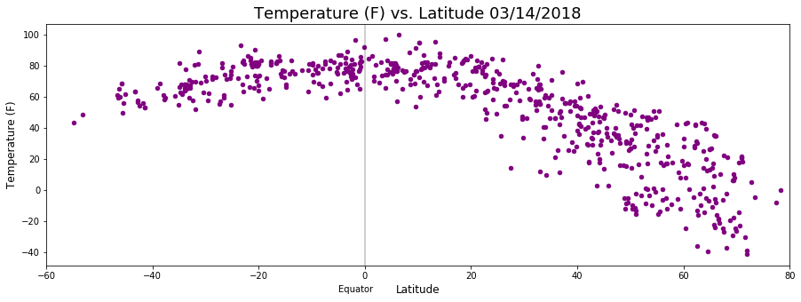
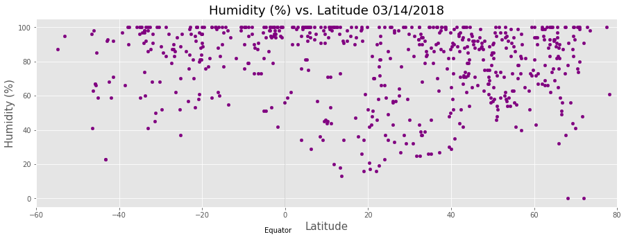
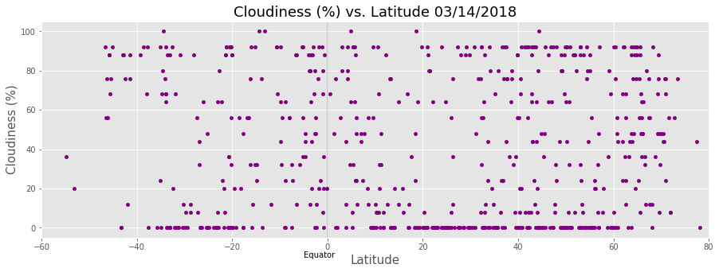
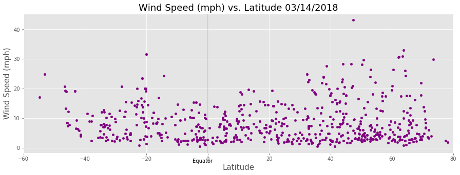

```python
import matplotlib.pyplot as plt
from citipy import citipy as cp
import numpy as np
import pandas as pd
import requests as req
import json
import random
import seaborn as sns
import openweathermapy.core as owm
import cartopy.crs as ccrs
from config import api_key
import time
```


```python
#generate random lat and long list

latitude = []
longitude = []

for my_lat in np.random.randint(-90,90,1800):
    latitude.append(my_lat)

for my_long in np.random.randint(-180,180,1800):
    longitude.append(my_long)
```


```python
#Create variable called latitude_and_Longitude and store all random latitudes and longitudes generated
lat_long = tuple(zip(latitude,longitude))
```


```python
#use citipy library to find the nearest city for all latitudes and longitudes
cities = []
country = []

for lat,long in lat_long:
    city = cp.nearest_city(lat,long)
    
    cityName = city.city_name
    
    cities.append(cityName)
    
    country.append(city.country_code)
```


```python
#Print number of different cities generated
print('The number of randomly generated cities equals {}.'.format(len(set(cities))))
```

    The number of randomly generated cities equals 702.


```python
#create dataframe to store random cities generated with citipy plus add cols for other info

df_countries = pd.DataFrame({'Cities': cities,
              'Country': country})

df_countries['Latitude'] = ''
df_countries['Longitude'] = ''
df_countries['Temperature (F)'] = ''
df_countries['Humidity (%)'] = ''
df_countries['Cloudiness (%)'] = ''
df_countries['Wind Speed (mph)'] = ''
df_countries.head()
```


<div>
<style>
    .dataframe thead tr:only-child th {
        text-align: right;
    }

    .dataframe thead th {
        text-align: left;
    }

    .dataframe tbody tr th {
        vertical-align: top;
    }
</style>
<table border="1" class="dataframe">
  <thead>
    <tr style="text-align: right;">
      <th></th>
      <th>Cities</th>
      <th>Country</th>
      <th>Latitude</th>
      <th>Longitude</th>
      <th>Temperature (F)</th>
      <th>Humidity (%)</th>
      <th>Cloudiness (%)</th>
      <th>Wind Speed (mph)</th>
    </tr>
  </thead>
  <tbody>
    <tr>
      <th>0</th>
      <td>vanimo</td>
      <td>pg</td>
      <td></td>
      <td></td>
      <td></td>
      <td></td>
      <td></td>
      <td></td>
    </tr>
    <tr>
      <th>1</th>
      <td>shingu</td>
      <td>jp</td>
      <td></td>
      <td></td>
      <td></td>
      <td></td>
      <td></td>
      <td></td>
    </tr>
    <tr>
      <th>2</th>
      <td>longyearbyen</td>
      <td>sj</td>
      <td></td>
      <td></td>
      <td></td>
      <td></td>
      <td></td>
      <td></td>
    </tr>
    <tr>
      <th>3</th>
      <td>bredasdorp</td>
      <td>za</td>
      <td></td>
      <td></td>
      <td></td>
      <td></td>
      <td></td>
      <td></td>
    </tr>
    <tr>
      <th>4</th>
      <td>busselton</td>
      <td>au</td>
      <td></td>
      <td></td>
      <td></td>
      <td></td>
      <td></td>
      <td></td>
    </tr>
  </tbody>
</table>
</div>


```python
#drop all dupes and na's 
df_countries = df_countries.drop_duplicates(subset=['Cities'],keep='first')
df_countries = df_countries.dropna()
len(df_countries)
```


    702


```python
#loop through all rows and fill in values for blank columns

for index,row in df_countries.iterrows():
    city_name = row['Cities']
    Country_id = row['Country']
    
#api call for cities 
    api_url = "http://api.openweathermap.org/data/2.5/forecast" \
    "?q={},{}&units=IMPERIAL&mode=json&APPID={}".format(city_name,Country_id,api_key)
    
    country_info = req.get(api_url).json()

    print(api_url)
    try:
        df_countries.set_value(index,'Latitude',country_info['city']['coord']['lat'])
        df_countries.set_value(index,'Longitude',country_info['city']['coord']['lon'])
        df_countries.set_value(index,'Temperature (F)',country_info['list'][0]['main']['temp'])
        df_countries.set_value(index,'Humidity (%)',country_info['list'][0]['main']['humidity'])
        df_countries.set_value(index,'Cloudiness (%)',country_info['list'][0]['clouds']['all'])
        df_countries.set_value(index,'Wind Speed (mph)',country_info['list'][0]['wind']['speed'])
        
    except KeyError:
        df_countries.set_value(index,'Latitude',np.nan)
        df_countries.set_value(index,'Longitude',np.nan)
        df_countries.set_value(index,'Temperature (F)',np.nan)
        df_countries.set_value(index,'Humidity (%)',np.nan)
        df_countries.set_value(index,'Cloudiness (%)',np.nan)
        df_countries.set_value(index,'Wind Speed (mph)',np.nan)
        
        print('Missing weather information...skip')
```

    http://api.openweathermap.org/data/2.5/forecast?q=vanimo,pg&units=IMPERIAL&mode=json&APPID=b285894511a23e046de446ad3cd973c8
    http://api.openweathermap.org/data/2.5/forecast?q=shingu,jp&units=IMPERIAL&mode=json&APPID=b285894511a23e046de446ad3cd973c8
    http://api.openweathermap.org/data/2.5/forecast?q=longyearbyen,sj&units=IMPERIAL&mode=json&APPID=b285894511a23e046de446ad3cd973c8
    http://api.openweathermap.org/data/2.5/forecast?q=bredasdorp,za&units=IMPERIAL&mode=json&APPID=b285894511a23e046de446ad3cd973c8
    http://api.openweathermap.org/data/2.5/forecast?q=busselton,au&units=IMPERIAL&mode=json&APPID=b285894511a23e046de446ad3cd973c8
    http://api.openweathermap.org/data/2.5/forecast?q=limbang,my&units=IMPERIAL&mode=json&APPID=b285894511a23e046de446ad3cd973c8
    http://api.openweathermap.org/data/2.5/forecast?q=georgetown,sh&units=IMPERIAL&mode=json&APPID=b285894511a23e046de446ad3cd973c8
    http://api.openweathermap.org/data/2.5/forecast?q=ushuaia,ar&units=IMPERIAL&mode=json&APPID=b285894511a23e046de446ad3cd973c8
    http://api.openweathermap.org/data/2.5/forecast?q=aswan,eg&units=IMPERIAL&mode=json&APPID=b285894511a23e046de446ad3cd973c8
    http://api.openweathermap.org/data/2.5/forecast?q=rikitea,pf&units=IMPERIAL&mode=json&APPID=b285894511a23e046de446ad3cd973c8
    http://api.openweathermap.org/data/2.5/forecast?q=fairbanks,us&units=IMPERIAL&mode=json&APPID=b285894511a23e046de446ad3cd973c8
    http://api.openweathermap.org/data/2.5/forecast?q=paradwip,in&units=IMPERIAL&mode=json&APPID=b285894511a23e046de446ad3cd973c8
    Missing weather information...skip
    http://api.openweathermap.org/data/2.5/forecast?q=poronaysk,ru&units=IMPERIAL&mode=json&APPID=b285894511a23e046de446ad3cd973c8
    http://api.openweathermap.org/data/2.5/forecast?q=illoqqortoormiut,gl&units=IMPERIAL&mode=json&APPID=b285894511a23e046de446ad3cd973c8
    Missing weather information...skip
    http://api.openweathermap.org/data/2.5/forecast?q=turukhansk,ru&units=IMPERIAL&mode=json&APPID=b285894511a23e046de446ad3cd973c8
    http://api.openweathermap.org/data/2.5/forecast?q=tasiilaq,gl&units=IMPERIAL&mode=json&APPID=b285894511a23e046de446ad3cd973c8
    http://api.openweathermap.org/data/2.5/forecast?q=bethel,us&units=IMPERIAL&mode=json&APPID=b285894511a23e046de446ad3cd973c8
    http://api.openweathermap.org/data/2.5/forecast?q=tuktoyaktuk,ca&units=IMPERIAL&mode=json&APPID=b285894511a23e046de446ad3cd973c8
    http://api.openweathermap.org/data/2.5/forecast?q=butaritari,ki&units=IMPERIAL&mode=json&APPID=b285894511a23e046de446ad3cd973c8
    http://api.openweathermap.org/data/2.5/forecast?q=mataura,pf&units=IMPERIAL&mode=json&APPID=b285894511a23e046de446ad3cd973c8
    Missing weather information...skip
    http://api.openweathermap.org/data/2.5/forecast?q=freeport,us&units=IMPERIAL&mode=json&APPID=b285894511a23e046de446ad3cd973c8
    http://api.openweathermap.org/data/2.5/forecast?q=valparaiso,cl&units=IMPERIAL&mode=json&APPID=b285894511a23e046de446ad3cd973c8
    http://api.openweathermap.org/data/2.5/forecast?q=vitim,ru&units=IMPERIAL&mode=json&APPID=b285894511a23e046de446ad3cd973c8
    http://api.openweathermap.org/data/2.5/forecast?q=ilulissat,gl&units=IMPERIAL&mode=json&APPID=b285894511a23e046de446ad3cd973c8
    http://api.openweathermap.org/data/2.5/forecast?q=leshan,cn&units=IMPERIAL&mode=json&APPID=b285894511a23e046de446ad3cd973c8
    http://api.openweathermap.org/data/2.5/forecast?q=avarua,ck&units=IMPERIAL&mode=json&APPID=b285894511a23e046de446ad3cd973c8
    http://api.openweathermap.org/data/2.5/forecast?q=bowen,au&units=IMPERIAL&mode=json&APPID=b285894511a23e046de446ad3cd973c8
    http://api.openweathermap.org/data/2.5/forecast?q=zile,tr&units=IMPERIAL&mode=json&APPID=b285894511a23e046de446ad3cd973c8
    http://api.openweathermap.org/data/2.5/forecast?q=castro,cl&units=IMPERIAL&mode=json&APPID=b285894511a23e046de446ad3cd973c8
    http://api.openweathermap.org/data/2.5/forecast?q=fushun,cn&units=IMPERIAL&mode=json&APPID=b285894511a23e046de446ad3cd973c8
    http://api.openweathermap.org/data/2.5/forecast?q=guerrero negro,mx&units=IMPERIAL&mode=json&APPID=b285894511a23e046de446ad3cd973c8
    http://api.openweathermap.org/data/2.5/forecast?q=akureyri,is&units=IMPERIAL&mode=json&APPID=b285894511a23e046de446ad3cd973c8
    http://api.openweathermap.org/data/2.5/forecast?q=tuatapere,nz&units=IMPERIAL&mode=json&APPID=b285894511a23e046de446ad3cd973c8
    http://api.openweathermap.org/data/2.5/forecast?q=honningsvag,no&units=IMPERIAL&mode=json&APPID=b285894511a23e046de446ad3cd973c8
    http://api.openweathermap.org/data/2.5/forecast?q=fortuna,us&units=IMPERIAL&mode=json&APPID=b285894511a23e046de446ad3cd973c8
    http://api.openweathermap.org/data/2.5/forecast?q=souillac,mu&units=IMPERIAL&mode=json&APPID=b285894511a23e046de446ad3cd973c8
    http://api.openweathermap.org/data/2.5/forecast?q=severo-kurilsk,ru&units=IMPERIAL&mode=json&APPID=b285894511a23e046de446ad3cd973c8
    http://api.openweathermap.org/data/2.5/forecast?q=victoria,sc&units=IMPERIAL&mode=json&APPID=b285894511a23e046de446ad3cd973c8
    http://api.openweathermap.org/data/2.5/forecast?q=seoul,kr&units=IMPERIAL&mode=json&APPID=b285894511a23e046de446ad3cd973c8
    http://api.openweathermap.org/data/2.5/forecast?q=nanortalik,gl&units=IMPERIAL&mode=json&APPID=b285894511a23e046de446ad3cd973c8
    http://api.openweathermap.org/data/2.5/forecast?q=nikolskoye,ru&units=IMPERIAL&mode=json&APPID=b285894511a23e046de446ad3cd973c8
    http://api.openweathermap.org/data/2.5/forecast?q=clyde river,ca&units=IMPERIAL&mode=json&APPID=b285894511a23e046de446ad3cd973c8
    http://api.openweathermap.org/data/2.5/forecast?q=provideniya,ru&units=IMPERIAL&mode=json&APPID=b285894511a23e046de446ad3cd973c8
    http://api.openweathermap.org/data/2.5/forecast?q=laguna,br&units=IMPERIAL&mode=json&APPID=b285894511a23e046de446ad3cd973c8
    Missing weather information...skip
    http://api.openweathermap.org/data/2.5/forecast?q=vila franca do campo,pt&units=IMPERIAL&mode=json&APPID=b285894511a23e046de446ad3cd973c8
    http://api.openweathermap.org/data/2.5/forecast?q=adrar,dz&units=IMPERIAL&mode=json&APPID=b285894511a23e046de446ad3cd973c8
    http://api.openweathermap.org/data/2.5/forecast?q=belyy yar,ru&units=IMPERIAL&mode=json&APPID=b285894511a23e046de446ad3cd973c8
    http://api.openweathermap.org/data/2.5/forecast?q=maniitsoq,gl&units=IMPERIAL&mode=json&APPID=b285894511a23e046de446ad3cd973c8
    http://api.openweathermap.org/data/2.5/forecast?q=wewak,pg&units=IMPERIAL&mode=json&APPID=b285894511a23e046de446ad3cd973c8
    http://api.openweathermap.org/data/2.5/forecast?q=emba,kz&units=IMPERIAL&mode=json&APPID=b285894511a23e046de446ad3cd973c8
    Missing weather information...skip
    http://api.openweathermap.org/data/2.5/forecast?q=nishihara,jp&units=IMPERIAL&mode=json&APPID=b285894511a23e046de446ad3cd973c8
    http://api.openweathermap.org/data/2.5/forecast?q=belushya guba,ru&units=IMPERIAL&mode=json&APPID=b285894511a23e046de446ad3cd973c8
    Missing weather information...skip
    http://api.openweathermap.org/data/2.5/forecast?q=ponta do sol,pt&units=IMPERIAL&mode=json&APPID=b285894511a23e046de446ad3cd973c8
    http://api.openweathermap.org/data/2.5/forecast?q=rawson,ar&units=IMPERIAL&mode=json&APPID=b285894511a23e046de446ad3cd973c8
    http://api.openweathermap.org/data/2.5/forecast?q=hovd,mn&units=IMPERIAL&mode=json&APPID=b285894511a23e046de446ad3cd973c8
    http://api.openweathermap.org/data/2.5/forecast?q=male,mv&units=IMPERIAL&mode=json&APPID=b285894511a23e046de446ad3cd973c8
    http://api.openweathermap.org/data/2.5/forecast?q=port elizabeth,za&units=IMPERIAL&mode=json&APPID=b285894511a23e046de446ad3cd973c8
    http://api.openweathermap.org/data/2.5/forecast?q=brae,gb&units=IMPERIAL&mode=json&APPID=b285894511a23e046de446ad3cd973c8
    http://api.openweathermap.org/data/2.5/forecast?q=hobart,au&units=IMPERIAL&mode=json&APPID=b285894511a23e046de446ad3cd973c8
    http://api.openweathermap.org/data/2.5/forecast?q=perth,au&units=IMPERIAL&mode=json&APPID=b285894511a23e046de446ad3cd973c8
    http://api.openweathermap.org/data/2.5/forecast?q=bereda,so&units=IMPERIAL&mode=json&APPID=b285894511a23e046de446ad3cd973c8
    Missing weather information...skip
    http://api.openweathermap.org/data/2.5/forecast?q=torbay,ca&units=IMPERIAL&mode=json&APPID=b285894511a23e046de446ad3cd973c8
    http://api.openweathermap.org/data/2.5/forecast?q=atuona,pf&units=IMPERIAL&mode=json&APPID=b285894511a23e046de446ad3cd973c8
    http://api.openweathermap.org/data/2.5/forecast?q=fare,pf&units=IMPERIAL&mode=json&APPID=b285894511a23e046de446ad3cd973c8
    http://api.openweathermap.org/data/2.5/forecast?q=xiaoweizhai,cn&units=IMPERIAL&mode=json&APPID=b285894511a23e046de446ad3cd973c8
    http://api.openweathermap.org/data/2.5/forecast?q=geraldton,au&units=IMPERIAL&mode=json&APPID=b285894511a23e046de446ad3cd973c8
    http://api.openweathermap.org/data/2.5/forecast?q=hermanus,za&units=IMPERIAL&mode=json&APPID=b285894511a23e046de446ad3cd973c8
    http://api.openweathermap.org/data/2.5/forecast?q=derzhavinsk,kz&units=IMPERIAL&mode=json&APPID=b285894511a23e046de446ad3cd973c8
    http://api.openweathermap.org/data/2.5/forecast?q=tecoanapa,mx&units=IMPERIAL&mode=json&APPID=b285894511a23e046de446ad3cd973c8
    http://api.openweathermap.org/data/2.5/forecast?q=taolanaro,mg&units=IMPERIAL&mode=json&APPID=b285894511a23e046de446ad3cd973c8
    Missing weather information...skip
    http://api.openweathermap.org/data/2.5/forecast?q=qaanaaq,gl&units=IMPERIAL&mode=json&APPID=b285894511a23e046de446ad3cd973c8
    http://api.openweathermap.org/data/2.5/forecast?q=sao filipe,cv&units=IMPERIAL&mode=json&APPID=b285894511a23e046de446ad3cd973c8
    http://api.openweathermap.org/data/2.5/forecast?q=hilo,us&units=IMPERIAL&mode=json&APPID=b285894511a23e046de446ad3cd973c8
    http://api.openweathermap.org/data/2.5/forecast?q=albany,au&units=IMPERIAL&mode=json&APPID=b285894511a23e046de446ad3cd973c8
    http://api.openweathermap.org/data/2.5/forecast?q=barra patuca,hn&units=IMPERIAL&mode=json&APPID=b285894511a23e046de446ad3cd973c8
    http://api.openweathermap.org/data/2.5/forecast?q=leh,in&units=IMPERIAL&mode=json&APPID=b285894511a23e046de446ad3cd973c8
    http://api.openweathermap.org/data/2.5/forecast?q=ahome,mx&units=IMPERIAL&mode=json&APPID=b285894511a23e046de446ad3cd973c8
    http://api.openweathermap.org/data/2.5/forecast?q=iqaluit,ca&units=IMPERIAL&mode=json&APPID=b285894511a23e046de446ad3cd973c8
    http://api.openweathermap.org/data/2.5/forecast?q=puerto ayora,ec&units=IMPERIAL&mode=json&APPID=b285894511a23e046de446ad3cd973c8
    http://api.openweathermap.org/data/2.5/forecast?q=bluff,nz&units=IMPERIAL&mode=json&APPID=b285894511a23e046de446ad3cd973c8
    http://api.openweathermap.org/data/2.5/forecast?q=samusu,ws&units=IMPERIAL&mode=json&APPID=b285894511a23e046de446ad3cd973c8
    Missing weather information...skip
    http://api.openweathermap.org/data/2.5/forecast?q=vaini,to&units=IMPERIAL&mode=json&APPID=b285894511a23e046de446ad3cd973c8
    http://api.openweathermap.org/data/2.5/forecast?q=yar-sale,ru&units=IMPERIAL&mode=json&APPID=b285894511a23e046de446ad3cd973c8
    http://api.openweathermap.org/data/2.5/forecast?q=honiara,sb&units=IMPERIAL&mode=json&APPID=b285894511a23e046de446ad3cd973c8
    http://api.openweathermap.org/data/2.5/forecast?q=nabire,id&units=IMPERIAL&mode=json&APPID=b285894511a23e046de446ad3cd973c8
    http://api.openweathermap.org/data/2.5/forecast?q=havoysund,no&units=IMPERIAL&mode=json&APPID=b285894511a23e046de446ad3cd973c8
    http://api.openweathermap.org/data/2.5/forecast?q=sentyabrskiy,ru&units=IMPERIAL&mode=json&APPID=b285894511a23e046de446ad3cd973c8
    Missing weather information...skip
    http://api.openweathermap.org/data/2.5/forecast?q=afsin,tr&units=IMPERIAL&mode=json&APPID=b285894511a23e046de446ad3cd973c8
    http://api.openweathermap.org/data/2.5/forecast?q=saint anthony,ca&units=IMPERIAL&mode=json&APPID=b285894511a23e046de446ad3cd973c8
    Missing weather information...skip
    http://api.openweathermap.org/data/2.5/forecast?q=vestmanna,fo&units=IMPERIAL&mode=json&APPID=b285894511a23e046de446ad3cd973c8
    http://api.openweathermap.org/data/2.5/forecast?q=kapaa,us&units=IMPERIAL&mode=json&APPID=b285894511a23e046de446ad3cd973c8
    http://api.openweathermap.org/data/2.5/forecast?q=dikson,ru&units=IMPERIAL&mode=json&APPID=b285894511a23e046de446ad3cd973c8
    http://api.openweathermap.org/data/2.5/forecast?q=ostrovnoy,ru&units=IMPERIAL&mode=json&APPID=b285894511a23e046de446ad3cd973c8
    http://api.openweathermap.org/data/2.5/forecast?q=arshan,ru&units=IMPERIAL&mode=json&APPID=b285894511a23e046de446ad3cd973c8
    Missing weather information...skip
    http://api.openweathermap.org/data/2.5/forecast?q=punta arenas,cl&units=IMPERIAL&mode=json&APPID=b285894511a23e046de446ad3cd973c8
    http://api.openweathermap.org/data/2.5/forecast?q=fort-shevchenko,kz&units=IMPERIAL&mode=json&APPID=b285894511a23e046de446ad3cd973c8
    http://api.openweathermap.org/data/2.5/forecast?q=uniontown,us&units=IMPERIAL&mode=json&APPID=b285894511a23e046de446ad3cd973c8
    http://api.openweathermap.org/data/2.5/forecast?q=lavrentiya,ru&units=IMPERIAL&mode=json&APPID=b285894511a23e046de446ad3cd973c8
    http://api.openweathermap.org/data/2.5/forecast?q=yulara,au&units=IMPERIAL&mode=json&APPID=b285894511a23e046de446ad3cd973c8
    http://api.openweathermap.org/data/2.5/forecast?q=carnarvon,au&units=IMPERIAL&mode=json&APPID=b285894511a23e046de446ad3cd973c8
    http://api.openweathermap.org/data/2.5/forecast?q=mvuma,zw&units=IMPERIAL&mode=json&APPID=b285894511a23e046de446ad3cd973c8
    http://api.openweathermap.org/data/2.5/forecast?q=maku,ir&units=IMPERIAL&mode=json&APPID=b285894511a23e046de446ad3cd973c8
    http://api.openweathermap.org/data/2.5/forecast?q=kavieng,pg&units=IMPERIAL&mode=json&APPID=b285894511a23e046de446ad3cd973c8
    http://api.openweathermap.org/data/2.5/forecast?q=thompson,ca&units=IMPERIAL&mode=json&APPID=b285894511a23e046de446ad3cd973c8
    http://api.openweathermap.org/data/2.5/forecast?q=dunedin,nz&units=IMPERIAL&mode=json&APPID=b285894511a23e046de446ad3cd973c8
    http://api.openweathermap.org/data/2.5/forecast?q=faya,td&units=IMPERIAL&mode=json&APPID=b285894511a23e046de446ad3cd973c8
    Missing weather information...skip
    http://api.openweathermap.org/data/2.5/forecast?q=yellowknife,ca&units=IMPERIAL&mode=json&APPID=b285894511a23e046de446ad3cd973c8
    http://api.openweathermap.org/data/2.5/forecast?q=pacific grove,us&units=IMPERIAL&mode=json&APPID=b285894511a23e046de446ad3cd973c8
    http://api.openweathermap.org/data/2.5/forecast?q=yanam,in&units=IMPERIAL&mode=json&APPID=b285894511a23e046de446ad3cd973c8
    http://api.openweathermap.org/data/2.5/forecast?q=san cristobal,ec&units=IMPERIAL&mode=json&APPID=b285894511a23e046de446ad3cd973c8
    http://api.openweathermap.org/data/2.5/forecast?q=conway,us&units=IMPERIAL&mode=json&APPID=b285894511a23e046de446ad3cd973c8
    http://api.openweathermap.org/data/2.5/forecast?q=esperance,au&units=IMPERIAL&mode=json&APPID=b285894511a23e046de446ad3cd973c8
    http://api.openweathermap.org/data/2.5/forecast?q=barrow,us&units=IMPERIAL&mode=json&APPID=b285894511a23e046de446ad3cd973c8
    http://api.openweathermap.org/data/2.5/forecast?q=marawi,sd&units=IMPERIAL&mode=json&APPID=b285894511a23e046de446ad3cd973c8
    http://api.openweathermap.org/data/2.5/forecast?q=kavaratti,in&units=IMPERIAL&mode=json&APPID=b285894511a23e046de446ad3cd973c8
    http://api.openweathermap.org/data/2.5/forecast?q=grindavik,is&units=IMPERIAL&mode=json&APPID=b285894511a23e046de446ad3cd973c8
    http://api.openweathermap.org/data/2.5/forecast?q=ust-kut,ru&units=IMPERIAL&mode=json&APPID=b285894511a23e046de446ad3cd973c8
    http://api.openweathermap.org/data/2.5/forecast?q=zhangye,cn&units=IMPERIAL&mode=json&APPID=b285894511a23e046de446ad3cd973c8
    http://api.openweathermap.org/data/2.5/forecast?q=mar del plata,ar&units=IMPERIAL&mode=json&APPID=b285894511a23e046de446ad3cd973c8
    http://api.openweathermap.org/data/2.5/forecast?q=grand gaube,mu&units=IMPERIAL&mode=json&APPID=b285894511a23e046de446ad3cd973c8
    http://api.openweathermap.org/data/2.5/forecast?q=salalah,om&units=IMPERIAL&mode=json&APPID=b285894511a23e046de446ad3cd973c8
    http://api.openweathermap.org/data/2.5/forecast?q=east london,za&units=IMPERIAL&mode=json&APPID=b285894511a23e046de446ad3cd973c8
    http://api.openweathermap.org/data/2.5/forecast?q=galle,lk&units=IMPERIAL&mode=json&APPID=b285894511a23e046de446ad3cd973c8
    http://api.openweathermap.org/data/2.5/forecast?q=saint-philippe,re&units=IMPERIAL&mode=json&APPID=b285894511a23e046de446ad3cd973c8
    http://api.openweathermap.org/data/2.5/forecast?q=boffa,gn&units=IMPERIAL&mode=json&APPID=b285894511a23e046de446ad3cd973c8
    http://api.openweathermap.org/data/2.5/forecast?q=intipuca,sv&units=IMPERIAL&mode=json&APPID=b285894511a23e046de446ad3cd973c8
    http://api.openweathermap.org/data/2.5/forecast?q=lumby,ca&units=IMPERIAL&mode=json&APPID=b285894511a23e046de446ad3cd973c8
    http://api.openweathermap.org/data/2.5/forecast?q=hambantota,lk&units=IMPERIAL&mode=json&APPID=b285894511a23e046de446ad3cd973c8
    http://api.openweathermap.org/data/2.5/forecast?q=kununurra,au&units=IMPERIAL&mode=json&APPID=b285894511a23e046de446ad3cd973c8
    http://api.openweathermap.org/data/2.5/forecast?q=tooele,us&units=IMPERIAL&mode=json&APPID=b285894511a23e046de446ad3cd973c8
    http://api.openweathermap.org/data/2.5/forecast?q=agadir,ma&units=IMPERIAL&mode=json&APPID=b285894511a23e046de446ad3cd973c8
    http://api.openweathermap.org/data/2.5/forecast?q=marshalltown,us&units=IMPERIAL&mode=json&APPID=b285894511a23e046de446ad3cd973c8
    http://api.openweathermap.org/data/2.5/forecast?q=zhanakorgan,kz&units=IMPERIAL&mode=json&APPID=b285894511a23e046de446ad3cd973c8
    http://api.openweathermap.org/data/2.5/forecast?q=tsihombe,mg&units=IMPERIAL&mode=json&APPID=b285894511a23e046de446ad3cd973c8
    Missing weather information...skip
    http://api.openweathermap.org/data/2.5/forecast?q=porto novo,cv&units=IMPERIAL&mode=json&APPID=b285894511a23e046de446ad3cd973c8
    http://api.openweathermap.org/data/2.5/forecast?q=tiksi,ru&units=IMPERIAL&mode=json&APPID=b285894511a23e046de446ad3cd973c8
    http://api.openweathermap.org/data/2.5/forecast?q=cherskiy,ru&units=IMPERIAL&mode=json&APPID=b285894511a23e046de446ad3cd973c8
    http://api.openweathermap.org/data/2.5/forecast?q=aykhal,ru&units=IMPERIAL&mode=json&APPID=b285894511a23e046de446ad3cd973c8
    http://api.openweathermap.org/data/2.5/forecast?q=manokwari,id&units=IMPERIAL&mode=json&APPID=b285894511a23e046de446ad3cd973c8
    http://api.openweathermap.org/data/2.5/forecast?q=ghanzi,bw&units=IMPERIAL&mode=json&APPID=b285894511a23e046de446ad3cd973c8
    http://api.openweathermap.org/data/2.5/forecast?q=lakatoro,vu&units=IMPERIAL&mode=json&APPID=b285894511a23e046de446ad3cd973c8
    http://api.openweathermap.org/data/2.5/forecast?q=kaitangata,nz&units=IMPERIAL&mode=json&APPID=b285894511a23e046de446ad3cd973c8
    http://api.openweathermap.org/data/2.5/forecast?q=beringovskiy,ru&units=IMPERIAL&mode=json&APPID=b285894511a23e046de446ad3cd973c8
    http://api.openweathermap.org/data/2.5/forecast?q=mucurapo,tt&units=IMPERIAL&mode=json&APPID=b285894511a23e046de446ad3cd973c8
    http://api.openweathermap.org/data/2.5/forecast?q=waingapu,id&units=IMPERIAL&mode=json&APPID=b285894511a23e046de446ad3cd973c8
    http://api.openweathermap.org/data/2.5/forecast?q=port blair,in&units=IMPERIAL&mode=json&APPID=b285894511a23e046de446ad3cd973c8
    http://api.openweathermap.org/data/2.5/forecast?q=egvekinot,ru&units=IMPERIAL&mode=json&APPID=b285894511a23e046de446ad3cd973c8
    http://api.openweathermap.org/data/2.5/forecast?q=pisco,pe&units=IMPERIAL&mode=json&APPID=b285894511a23e046de446ad3cd973c8
    http://api.openweathermap.org/data/2.5/forecast?q=yining,cn&units=IMPERIAL&mode=json&APPID=b285894511a23e046de446ad3cd973c8
    http://api.openweathermap.org/data/2.5/forecast?q=bengkulu,id&units=IMPERIAL&mode=json&APPID=b285894511a23e046de446ad3cd973c8
    Missing weather information...skip
    http://api.openweathermap.org/data/2.5/forecast?q=pevek,ru&units=IMPERIAL&mode=json&APPID=b285894511a23e046de446ad3cd973c8
    http://api.openweathermap.org/data/2.5/forecast?q=berbera,so&units=IMPERIAL&mode=json&APPID=b285894511a23e046de446ad3cd973c8
    http://api.openweathermap.org/data/2.5/forecast?q=bambous virieux,mu&units=IMPERIAL&mode=json&APPID=b285894511a23e046de446ad3cd973c8
    http://api.openweathermap.org/data/2.5/forecast?q=kropotkin,ru&units=IMPERIAL&mode=json&APPID=b285894511a23e046de446ad3cd973c8
    http://api.openweathermap.org/data/2.5/forecast?q=barhi,in&units=IMPERIAL&mode=json&APPID=b285894511a23e046de446ad3cd973c8
    http://api.openweathermap.org/data/2.5/forecast?q=labytnangi,ru&units=IMPERIAL&mode=json&APPID=b285894511a23e046de446ad3cd973c8
    http://api.openweathermap.org/data/2.5/forecast?q=vostok,ru&units=IMPERIAL&mode=json&APPID=b285894511a23e046de446ad3cd973c8
    http://api.openweathermap.org/data/2.5/forecast?q=faanui,pf&units=IMPERIAL&mode=json&APPID=b285894511a23e046de446ad3cd973c8
    http://api.openweathermap.org/data/2.5/forecast?q=healdsburg,us&units=IMPERIAL&mode=json&APPID=b285894511a23e046de446ad3cd973c8
    http://api.openweathermap.org/data/2.5/forecast?q=jamestown,sh&units=IMPERIAL&mode=json&APPID=b285894511a23e046de446ad3cd973c8
    http://api.openweathermap.org/data/2.5/forecast?q=nizhneyansk,ru&units=IMPERIAL&mode=json&APPID=b285894511a23e046de446ad3cd973c8
    Missing weather information...skip
    http://api.openweathermap.org/data/2.5/forecast?q=pangnirtung,ca&units=IMPERIAL&mode=json&APPID=b285894511a23e046de446ad3cd973c8
    http://api.openweathermap.org/data/2.5/forecast?q=samarai,pg&units=IMPERIAL&mode=json&APPID=b285894511a23e046de446ad3cd973c8
    http://api.openweathermap.org/data/2.5/forecast?q=port lincoln,au&units=IMPERIAL&mode=json&APPID=b285894511a23e046de446ad3cd973c8
    http://api.openweathermap.org/data/2.5/forecast?q=nouadhibou,mr&units=IMPERIAL&mode=json&APPID=b285894511a23e046de446ad3cd973c8
    http://api.openweathermap.org/data/2.5/forecast?q=brooks,ca&units=IMPERIAL&mode=json&APPID=b285894511a23e046de446ad3cd973c8
    http://api.openweathermap.org/data/2.5/forecast?q=ushibuka,jp&units=IMPERIAL&mode=json&APPID=b285894511a23e046de446ad3cd973c8
    http://api.openweathermap.org/data/2.5/forecast?q=khatanga,ru&units=IMPERIAL&mode=json&APPID=b285894511a23e046de446ad3cd973c8
    http://api.openweathermap.org/data/2.5/forecast?q=falam,mm&units=IMPERIAL&mode=json&APPID=b285894511a23e046de446ad3cd973c8
    http://api.openweathermap.org/data/2.5/forecast?q=syamzha,ru&units=IMPERIAL&mode=json&APPID=b285894511a23e046de446ad3cd973c8
    http://api.openweathermap.org/data/2.5/forecast?q=canutama,br&units=IMPERIAL&mode=json&APPID=b285894511a23e046de446ad3cd973c8
    http://api.openweathermap.org/data/2.5/forecast?q=petropavlovsk-kamchatskiy,ru&units=IMPERIAL&mode=json&APPID=b285894511a23e046de446ad3cd973c8
    http://api.openweathermap.org/data/2.5/forecast?q=mrirt,ma&units=IMPERIAL&mode=json&APPID=b285894511a23e046de446ad3cd973c8
    Missing weather information...skip
    http://api.openweathermap.org/data/2.5/forecast?q=quatre cocos,mu&units=IMPERIAL&mode=json&APPID=b285894511a23e046de446ad3cd973c8
    http://api.openweathermap.org/data/2.5/forecast?q=auki,sb&units=IMPERIAL&mode=json&APPID=b285894511a23e046de446ad3cd973c8
    http://api.openweathermap.org/data/2.5/forecast?q=vila,vu&units=IMPERIAL&mode=json&APPID=b285894511a23e046de446ad3cd973c8
    Missing weather information...skip
    http://api.openweathermap.org/data/2.5/forecast?q=gaurnadi,bd&units=IMPERIAL&mode=json&APPID=b285894511a23e046de446ad3cd973c8
    http://api.openweathermap.org/data/2.5/forecast?q=borogontsy,ru&units=IMPERIAL&mode=json&APPID=b285894511a23e046de446ad3cd973c8
    http://api.openweathermap.org/data/2.5/forecast?q=barentsburg,sj&units=IMPERIAL&mode=json&APPID=b285894511a23e046de446ad3cd973c8
    Missing weather information...skip
    http://api.openweathermap.org/data/2.5/forecast?q=bilibino,ru&units=IMPERIAL&mode=json&APPID=b285894511a23e046de446ad3cd973c8
    http://api.openweathermap.org/data/2.5/forecast?q=loutros,gr&units=IMPERIAL&mode=json&APPID=b285894511a23e046de446ad3cd973c8
    http://api.openweathermap.org/data/2.5/forecast?q=husavik,is&units=IMPERIAL&mode=json&APPID=b285894511a23e046de446ad3cd973c8
    http://api.openweathermap.org/data/2.5/forecast?q=hinton,ca&units=IMPERIAL&mode=json&APPID=b285894511a23e046de446ad3cd973c8
    http://api.openweathermap.org/data/2.5/forecast?q=airai,pw&units=IMPERIAL&mode=json&APPID=b285894511a23e046de446ad3cd973c8
    Missing weather information...skip
    http://api.openweathermap.org/data/2.5/forecast?q=awjilah,ly&units=IMPERIAL&mode=json&APPID=b285894511a23e046de446ad3cd973c8
    http://api.openweathermap.org/data/2.5/forecast?q=chapleau,ca&units=IMPERIAL&mode=json&APPID=b285894511a23e046de446ad3cd973c8
    http://api.openweathermap.org/data/2.5/forecast?q=fevralsk,ru&units=IMPERIAL&mode=json&APPID=b285894511a23e046de446ad3cd973c8
    Missing weather information...skip
    http://api.openweathermap.org/data/2.5/forecast?q=saldanha,za&units=IMPERIAL&mode=json&APPID=b285894511a23e046de446ad3cd973c8
    http://api.openweathermap.org/data/2.5/forecast?q=epernay,fr&units=IMPERIAL&mode=json&APPID=b285894511a23e046de446ad3cd973c8
    http://api.openweathermap.org/data/2.5/forecast?q=sangar,ru&units=IMPERIAL&mode=json&APPID=b285894511a23e046de446ad3cd973c8
    http://api.openweathermap.org/data/2.5/forecast?q=broken hill,au&units=IMPERIAL&mode=json&APPID=b285894511a23e046de446ad3cd973c8
    http://api.openweathermap.org/data/2.5/forecast?q=qianan,cn&units=IMPERIAL&mode=json&APPID=b285894511a23e046de446ad3cd973c8
    http://api.openweathermap.org/data/2.5/forecast?q=gladstone,au&units=IMPERIAL&mode=json&APPID=b285894511a23e046de446ad3cd973c8
    http://api.openweathermap.org/data/2.5/forecast?q=ouro fino,br&units=IMPERIAL&mode=json&APPID=b285894511a23e046de446ad3cd973c8
    http://api.openweathermap.org/data/2.5/forecast?q=urumqi,cn&units=IMPERIAL&mode=json&APPID=b285894511a23e046de446ad3cd973c8
    Missing weather information...skip
    http://api.openweathermap.org/data/2.5/forecast?q=batemans bay,au&units=IMPERIAL&mode=json&APPID=b285894511a23e046de446ad3cd973c8
    http://api.openweathermap.org/data/2.5/forecast?q=saint-joseph,re&units=IMPERIAL&mode=json&APPID=b285894511a23e046de446ad3cd973c8
    http://api.openweathermap.org/data/2.5/forecast?q=xining,cn&units=IMPERIAL&mode=json&APPID=b285894511a23e046de446ad3cd973c8
    http://api.openweathermap.org/data/2.5/forecast?q=cape town,za&units=IMPERIAL&mode=json&APPID=b285894511a23e046de446ad3cd973c8
    http://api.openweathermap.org/data/2.5/forecast?q=haines junction,ca&units=IMPERIAL&mode=json&APPID=b285894511a23e046de446ad3cd973c8
    http://api.openweathermap.org/data/2.5/forecast?q=itarema,br&units=IMPERIAL&mode=json&APPID=b285894511a23e046de446ad3cd973c8
    http://api.openweathermap.org/data/2.5/forecast?q=sorland,no&units=IMPERIAL&mode=json&APPID=b285894511a23e046de446ad3cd973c8
    http://api.openweathermap.org/data/2.5/forecast?q=kamenskoye,ru&units=IMPERIAL&mode=json&APPID=b285894511a23e046de446ad3cd973c8
    Missing weather information...skip
    http://api.openweathermap.org/data/2.5/forecast?q=beira,mz&units=IMPERIAL&mode=json&APPID=b285894511a23e046de446ad3cd973c8
    http://api.openweathermap.org/data/2.5/forecast?q=moree,au&units=IMPERIAL&mode=json&APPID=b285894511a23e046de446ad3cd973c8
    http://api.openweathermap.org/data/2.5/forecast?q=cap-aux-meules,ca&units=IMPERIAL&mode=json&APPID=b285894511a23e046de446ad3cd973c8
    http://api.openweathermap.org/data/2.5/forecast?q=kloulklubed,pw&units=IMPERIAL&mode=json&APPID=b285894511a23e046de446ad3cd973c8
    http://api.openweathermap.org/data/2.5/forecast?q=dinsor,so&units=IMPERIAL&mode=json&APPID=b285894511a23e046de446ad3cd973c8
    Missing weather information...skip
    http://api.openweathermap.org/data/2.5/forecast?q=hasaki,jp&units=IMPERIAL&mode=json&APPID=b285894511a23e046de446ad3cd973c8
    http://api.openweathermap.org/data/2.5/forecast?q=mys shmidta,ru&units=IMPERIAL&mode=json&APPID=b285894511a23e046de446ad3cd973c8
    Missing weather information...skip
    http://api.openweathermap.org/data/2.5/forecast?q=manitouwadge,ca&units=IMPERIAL&mode=json&APPID=b285894511a23e046de446ad3cd973c8
    http://api.openweathermap.org/data/2.5/forecast?q=saleaula,ws&units=IMPERIAL&mode=json&APPID=b285894511a23e046de446ad3cd973c8
    Missing weather information...skip
    http://api.openweathermap.org/data/2.5/forecast?q=marzuq,ly&units=IMPERIAL&mode=json&APPID=b285894511a23e046de446ad3cd973c8
    Missing weather information...skip
    http://api.openweathermap.org/data/2.5/forecast?q=ancud,cl&units=IMPERIAL&mode=json&APPID=b285894511a23e046de446ad3cd973c8
    http://api.openweathermap.org/data/2.5/forecast?q=new norfolk,au&units=IMPERIAL&mode=json&APPID=b285894511a23e046de446ad3cd973c8
    http://api.openweathermap.org/data/2.5/forecast?q=lesogorsk,ru&units=IMPERIAL&mode=json&APPID=b285894511a23e046de446ad3cd973c8
    http://api.openweathermap.org/data/2.5/forecast?q=prieska,za&units=IMPERIAL&mode=json&APPID=b285894511a23e046de446ad3cd973c8
    http://api.openweathermap.org/data/2.5/forecast?q=port alfred,za&units=IMPERIAL&mode=json&APPID=b285894511a23e046de446ad3cd973c8
    http://api.openweathermap.org/data/2.5/forecast?q=narsaq,gl&units=IMPERIAL&mode=json&APPID=b285894511a23e046de446ad3cd973c8
    http://api.openweathermap.org/data/2.5/forecast?q=chokurdakh,ru&units=IMPERIAL&mode=json&APPID=b285894511a23e046de446ad3cd973c8
    http://api.openweathermap.org/data/2.5/forecast?q=krasnoselkup,ru&units=IMPERIAL&mode=json&APPID=b285894511a23e046de446ad3cd973c8
    Missing weather information...skip
    http://api.openweathermap.org/data/2.5/forecast?q=hithadhoo,mv&units=IMPERIAL&mode=json&APPID=b285894511a23e046de446ad3cd973c8
    http://api.openweathermap.org/data/2.5/forecast?q=luau,ao&units=IMPERIAL&mode=json&APPID=b285894511a23e046de446ad3cd973c8
    http://api.openweathermap.org/data/2.5/forecast?q=mahebourg,mu&units=IMPERIAL&mode=json&APPID=b285894511a23e046de446ad3cd973c8
    http://api.openweathermap.org/data/2.5/forecast?q=cidreira,br&units=IMPERIAL&mode=json&APPID=b285894511a23e046de446ad3cd973c8
    http://api.openweathermap.org/data/2.5/forecast?q=saskylakh,ru&units=IMPERIAL&mode=json&APPID=b285894511a23e046de446ad3cd973c8
    http://api.openweathermap.org/data/2.5/forecast?q=qibili,tn&units=IMPERIAL&mode=json&APPID=b285894511a23e046de446ad3cd973c8
    Missing weather information...skip
    http://api.openweathermap.org/data/2.5/forecast?q=kyabe,td&units=IMPERIAL&mode=json&APPID=b285894511a23e046de446ad3cd973c8
    http://api.openweathermap.org/data/2.5/forecast?q=akhmim,eg&units=IMPERIAL&mode=json&APPID=b285894511a23e046de446ad3cd973c8
    http://api.openweathermap.org/data/2.5/forecast?q=cervo,es&units=IMPERIAL&mode=json&APPID=b285894511a23e046de446ad3cd973c8
    http://api.openweathermap.org/data/2.5/forecast?q=manadhoo,mv&units=IMPERIAL&mode=json&APPID=b285894511a23e046de446ad3cd973c8
    http://api.openweathermap.org/data/2.5/forecast?q=hofn,is&units=IMPERIAL&mode=json&APPID=b285894511a23e046de446ad3cd973c8
    http://api.openweathermap.org/data/2.5/forecast?q=san quintin,mx&units=IMPERIAL&mode=json&APPID=b285894511a23e046de446ad3cd973c8
    Missing weather information...skip
    http://api.openweathermap.org/data/2.5/forecast?q=omsukchan,ru&units=IMPERIAL&mode=json&APPID=b285894511a23e046de446ad3cd973c8
    http://api.openweathermap.org/data/2.5/forecast?q=cap malheureux,mu&units=IMPERIAL&mode=json&APPID=b285894511a23e046de446ad3cd973c8
    http://api.openweathermap.org/data/2.5/forecast?q=lasa,cn&units=IMPERIAL&mode=json&APPID=b285894511a23e046de446ad3cd973c8
    Missing weather information...skip
    http://api.openweathermap.org/data/2.5/forecast?q=ahuimanu,us&units=IMPERIAL&mode=json&APPID=b285894511a23e046de446ad3cd973c8
    http://api.openweathermap.org/data/2.5/forecast?q=ust-kuyga,ru&units=IMPERIAL&mode=json&APPID=b285894511a23e046de446ad3cd973c8
    http://api.openweathermap.org/data/2.5/forecast?q=puro,ph&units=IMPERIAL&mode=json&APPID=b285894511a23e046de446ad3cd973c8
    http://api.openweathermap.org/data/2.5/forecast?q=kirakira,sb&units=IMPERIAL&mode=json&APPID=b285894511a23e046de446ad3cd973c8
    http://api.openweathermap.org/data/2.5/forecast?q=ormara,pk&units=IMPERIAL&mode=json&APPID=b285894511a23e046de446ad3cd973c8
    http://api.openweathermap.org/data/2.5/forecast?q=stolin,by&units=IMPERIAL&mode=json&APPID=b285894511a23e046de446ad3cd973c8
    http://api.openweathermap.org/data/2.5/forecast?q=cochrane,ca&units=IMPERIAL&mode=json&APPID=b285894511a23e046de446ad3cd973c8
    http://api.openweathermap.org/data/2.5/forecast?q=puerto cabezas,ni&units=IMPERIAL&mode=json&APPID=b285894511a23e046de446ad3cd973c8
    http://api.openweathermap.org/data/2.5/forecast?q=te anau,nz&units=IMPERIAL&mode=json&APPID=b285894511a23e046de446ad3cd973c8
    http://api.openweathermap.org/data/2.5/forecast?q=dingle,ie&units=IMPERIAL&mode=json&APPID=b285894511a23e046de446ad3cd973c8
    http://api.openweathermap.org/data/2.5/forecast?q=cayenne,gf&units=IMPERIAL&mode=json&APPID=b285894511a23e046de446ad3cd973c8
    http://api.openweathermap.org/data/2.5/forecast?q=ust-nera,ru&units=IMPERIAL&mode=json&APPID=b285894511a23e046de446ad3cd973c8
    http://api.openweathermap.org/data/2.5/forecast?q=raudeberg,no&units=IMPERIAL&mode=json&APPID=b285894511a23e046de446ad3cd973c8
    http://api.openweathermap.org/data/2.5/forecast?q=vista hermosa,co&units=IMPERIAL&mode=json&APPID=b285894511a23e046de446ad3cd973c8
    http://api.openweathermap.org/data/2.5/forecast?q=manzhouli,cn&units=IMPERIAL&mode=json&APPID=b285894511a23e046de446ad3cd973c8
    http://api.openweathermap.org/data/2.5/forecast?q=rafaela,ar&units=IMPERIAL&mode=json&APPID=b285894511a23e046de446ad3cd973c8
    http://api.openweathermap.org/data/2.5/forecast?q=vestmannaeyjar,is&units=IMPERIAL&mode=json&APPID=b285894511a23e046de446ad3cd973c8
    http://api.openweathermap.org/data/2.5/forecast?q=margate,za&units=IMPERIAL&mode=json&APPID=b285894511a23e046de446ad3cd973c8
    http://api.openweathermap.org/data/2.5/forecast?q=san patricio,mx&units=IMPERIAL&mode=json&APPID=b285894511a23e046de446ad3cd973c8
    http://api.openweathermap.org/data/2.5/forecast?q=gold coast,au&units=IMPERIAL&mode=json&APPID=b285894511a23e046de446ad3cd973c8
    http://api.openweathermap.org/data/2.5/forecast?q=luderitz,na&units=IMPERIAL&mode=json&APPID=b285894511a23e046de446ad3cd973c8
    http://api.openweathermap.org/data/2.5/forecast?q=imphal,in&units=IMPERIAL&mode=json&APPID=b285894511a23e046de446ad3cd973c8
    http://api.openweathermap.org/data/2.5/forecast?q=claveria,ph&units=IMPERIAL&mode=json&APPID=b285894511a23e046de446ad3cd973c8
    http://api.openweathermap.org/data/2.5/forecast?q=sandakan,my&units=IMPERIAL&mode=json&APPID=b285894511a23e046de446ad3cd973c8
    http://api.openweathermap.org/data/2.5/forecast?q=cravo norte,co&units=IMPERIAL&mode=json&APPID=b285894511a23e046de446ad3cd973c8
    http://api.openweathermap.org/data/2.5/forecast?q=khajuraho,in&units=IMPERIAL&mode=json&APPID=b285894511a23e046de446ad3cd973c8
    http://api.openweathermap.org/data/2.5/forecast?q=la ronge,ca&units=IMPERIAL&mode=json&APPID=b285894511a23e046de446ad3cd973c8
    http://api.openweathermap.org/data/2.5/forecast?q=touros,br&units=IMPERIAL&mode=json&APPID=b285894511a23e046de446ad3cd973c8
    http://api.openweathermap.org/data/2.5/forecast?q=ardakan,ir&units=IMPERIAL&mode=json&APPID=b285894511a23e046de446ad3cd973c8
    http://api.openweathermap.org/data/2.5/forecast?q=norman wells,ca&units=IMPERIAL&mode=json&APPID=b285894511a23e046de446ad3cd973c8
    http://api.openweathermap.org/data/2.5/forecast?q=melivoia,gr&units=IMPERIAL&mode=json&APPID=b285894511a23e046de446ad3cd973c8
    http://api.openweathermap.org/data/2.5/forecast?q=yumen,cn&units=IMPERIAL&mode=json&APPID=b285894511a23e046de446ad3cd973c8
    http://api.openweathermap.org/data/2.5/forecast?q=parkes,au&units=IMPERIAL&mode=json&APPID=b285894511a23e046de446ad3cd973c8
    http://api.openweathermap.org/data/2.5/forecast?q=lebu,cl&units=IMPERIAL&mode=json&APPID=b285894511a23e046de446ad3cd973c8
    http://api.openweathermap.org/data/2.5/forecast?q=cabo san lucas,mx&units=IMPERIAL&mode=json&APPID=b285894511a23e046de446ad3cd973c8
    http://api.openweathermap.org/data/2.5/forecast?q=kruisfontein,za&units=IMPERIAL&mode=json&APPID=b285894511a23e046de446ad3cd973c8
    http://api.openweathermap.org/data/2.5/forecast?q=mujiayingzi,cn&units=IMPERIAL&mode=json&APPID=b285894511a23e046de446ad3cd973c8
    http://api.openweathermap.org/data/2.5/forecast?q=pitimbu,br&units=IMPERIAL&mode=json&APPID=b285894511a23e046de446ad3cd973c8
    http://api.openweathermap.org/data/2.5/forecast?q=chuy,uy&units=IMPERIAL&mode=json&APPID=b285894511a23e046de446ad3cd973c8
    http://api.openweathermap.org/data/2.5/forecast?q=fagernes,no&units=IMPERIAL&mode=json&APPID=b285894511a23e046de446ad3cd973c8
    http://api.openweathermap.org/data/2.5/forecast?q=mau,in&units=IMPERIAL&mode=json&APPID=b285894511a23e046de446ad3cd973c8
    http://api.openweathermap.org/data/2.5/forecast?q=tangping,cn&units=IMPERIAL&mode=json&APPID=b285894511a23e046de446ad3cd973c8
    http://api.openweathermap.org/data/2.5/forecast?q=ribeira grande,pt&units=IMPERIAL&mode=json&APPID=b285894511a23e046de446ad3cd973c8
    http://api.openweathermap.org/data/2.5/forecast?q=kalga,ru&units=IMPERIAL&mode=json&APPID=b285894511a23e046de446ad3cd973c8
    http://api.openweathermap.org/data/2.5/forecast?q=acara,br&units=IMPERIAL&mode=json&APPID=b285894511a23e046de446ad3cd973c8
    Missing weather information...skip
    http://api.openweathermap.org/data/2.5/forecast?q=beloha,mg&units=IMPERIAL&mode=json&APPID=b285894511a23e046de446ad3cd973c8
    http://api.openweathermap.org/data/2.5/forecast?q=tortoli,it&units=IMPERIAL&mode=json&APPID=b285894511a23e046de446ad3cd973c8
    http://api.openweathermap.org/data/2.5/forecast?q=nushki,pk&units=IMPERIAL&mode=json&APPID=b285894511a23e046de446ad3cd973c8
    http://api.openweathermap.org/data/2.5/forecast?q=sernur,ru&units=IMPERIAL&mode=json&APPID=b285894511a23e046de446ad3cd973c8
    http://api.openweathermap.org/data/2.5/forecast?q=katsuura,jp&units=IMPERIAL&mode=json&APPID=b285894511a23e046de446ad3cd973c8
    http://api.openweathermap.org/data/2.5/forecast?q=hobyo,so&units=IMPERIAL&mode=json&APPID=b285894511a23e046de446ad3cd973c8
    http://api.openweathermap.org/data/2.5/forecast?q=amderma,ru&units=IMPERIAL&mode=json&APPID=b285894511a23e046de446ad3cd973c8
    Missing weather information...skip
    http://api.openweathermap.org/data/2.5/forecast?q=erenhot,cn&units=IMPERIAL&mode=json&APPID=b285894511a23e046de446ad3cd973c8
    http://api.openweathermap.org/data/2.5/forecast?q=priargunsk,ru&units=IMPERIAL&mode=json&APPID=b285894511a23e046de446ad3cd973c8
    http://api.openweathermap.org/data/2.5/forecast?q=upernavik,gl&units=IMPERIAL&mode=json&APPID=b285894511a23e046de446ad3cd973c8
    http://api.openweathermap.org/data/2.5/forecast?q=bambanglipuro,id&units=IMPERIAL&mode=json&APPID=b285894511a23e046de446ad3cd973c8
    http://api.openweathermap.org/data/2.5/forecast?q=talara,pe&units=IMPERIAL&mode=json&APPID=b285894511a23e046de446ad3cd973c8
    http://api.openweathermap.org/data/2.5/forecast?q=lamu,ke&units=IMPERIAL&mode=json&APPID=b285894511a23e046de446ad3cd973c8
    http://api.openweathermap.org/data/2.5/forecast?q=maragogi,br&units=IMPERIAL&mode=json&APPID=b285894511a23e046de446ad3cd973c8
    http://api.openweathermap.org/data/2.5/forecast?q=roald,no&units=IMPERIAL&mode=json&APPID=b285894511a23e046de446ad3cd973c8
    http://api.openweathermap.org/data/2.5/forecast?q=abu samrah,qa&units=IMPERIAL&mode=json&APPID=b285894511a23e046de446ad3cd973c8
    Missing weather information...skip
    http://api.openweathermap.org/data/2.5/forecast?q=esil,kz&units=IMPERIAL&mode=json&APPID=b285894511a23e046de446ad3cd973c8
    http://api.openweathermap.org/data/2.5/forecast?q=staryy saltiv,ua&units=IMPERIAL&mode=json&APPID=b285894511a23e046de446ad3cd973c8
    Missing weather information...skip
    http://api.openweathermap.org/data/2.5/forecast?q=cukai,my&units=IMPERIAL&mode=json&APPID=b285894511a23e046de446ad3cd973c8
    http://api.openweathermap.org/data/2.5/forecast?q=nuuk,gl&units=IMPERIAL&mode=json&APPID=b285894511a23e046de446ad3cd973c8
    http://api.openweathermap.org/data/2.5/forecast?q=glenwood springs,us&units=IMPERIAL&mode=json&APPID=b285894511a23e046de446ad3cd973c8
    http://api.openweathermap.org/data/2.5/forecast?q=mount gambier,au&units=IMPERIAL&mode=json&APPID=b285894511a23e046de446ad3cd973c8
    http://api.openweathermap.org/data/2.5/forecast?q=xiongzhou,cn&units=IMPERIAL&mode=json&APPID=b285894511a23e046de446ad3cd973c8
    http://api.openweathermap.org/data/2.5/forecast?q=carutapera,br&units=IMPERIAL&mode=json&APPID=b285894511a23e046de446ad3cd973c8
    http://api.openweathermap.org/data/2.5/forecast?q=carballo,es&units=IMPERIAL&mode=json&APPID=b285894511a23e046de446ad3cd973c8
    http://api.openweathermap.org/data/2.5/forecast?q=kahului,us&units=IMPERIAL&mode=json&APPID=b285894511a23e046de446ad3cd973c8
    http://api.openweathermap.org/data/2.5/forecast?q=gushikawa,jp&units=IMPERIAL&mode=json&APPID=b285894511a23e046de446ad3cd973c8
    http://api.openweathermap.org/data/2.5/forecast?q=hihifo,to&units=IMPERIAL&mode=json&APPID=b285894511a23e046de446ad3cd973c8
    Missing weather information...skip
    http://api.openweathermap.org/data/2.5/forecast?q=coos bay,us&units=IMPERIAL&mode=json&APPID=b285894511a23e046de446ad3cd973c8
    http://api.openweathermap.org/data/2.5/forecast?q=villaviciosa,es&units=IMPERIAL&mode=json&APPID=b285894511a23e046de446ad3cd973c8
    http://api.openweathermap.org/data/2.5/forecast?q=sitka,us&units=IMPERIAL&mode=json&APPID=b285894511a23e046de446ad3cd973c8
    http://api.openweathermap.org/data/2.5/forecast?q=mairana,bo&units=IMPERIAL&mode=json&APPID=b285894511a23e046de446ad3cd973c8
    http://api.openweathermap.org/data/2.5/forecast?q=arraial do cabo,br&units=IMPERIAL&mode=json&APPID=b285894511a23e046de446ad3cd973c8
    http://api.openweathermap.org/data/2.5/forecast?q=khed brahma,in&units=IMPERIAL&mode=json&APPID=b285894511a23e046de446ad3cd973c8
    http://api.openweathermap.org/data/2.5/forecast?q=buribay,ru&units=IMPERIAL&mode=json&APPID=b285894511a23e046de446ad3cd973c8
    http://api.openweathermap.org/data/2.5/forecast?q=songling,cn&units=IMPERIAL&mode=json&APPID=b285894511a23e046de446ad3cd973c8
    http://api.openweathermap.org/data/2.5/forecast?q=lagoa,pt&units=IMPERIAL&mode=json&APPID=b285894511a23e046de446ad3cd973c8
    http://api.openweathermap.org/data/2.5/forecast?q=aklavik,ca&units=IMPERIAL&mode=json&APPID=b285894511a23e046de446ad3cd973c8
    http://api.openweathermap.org/data/2.5/forecast?q=ranfurly,nz&units=IMPERIAL&mode=json&APPID=b285894511a23e046de446ad3cd973c8
    http://api.openweathermap.org/data/2.5/forecast?q=zyryanka,ru&units=IMPERIAL&mode=json&APPID=b285894511a23e046de446ad3cd973c8
    http://api.openweathermap.org/data/2.5/forecast?q=tashara,ru&units=IMPERIAL&mode=json&APPID=b285894511a23e046de446ad3cd973c8
    http://api.openweathermap.org/data/2.5/forecast?q=tagusao,ph&units=IMPERIAL&mode=json&APPID=b285894511a23e046de446ad3cd973c8
    http://api.openweathermap.org/data/2.5/forecast?q=ariquemes,br&units=IMPERIAL&mode=json&APPID=b285894511a23e046de446ad3cd973c8
    http://api.openweathermap.org/data/2.5/forecast?q=det udom,th&units=IMPERIAL&mode=json&APPID=b285894511a23e046de446ad3cd973c8
    http://api.openweathermap.org/data/2.5/forecast?q=mithi,pk&units=IMPERIAL&mode=json&APPID=b285894511a23e046de446ad3cd973c8
    http://api.openweathermap.org/data/2.5/forecast?q=kaoma,zm&units=IMPERIAL&mode=json&APPID=b285894511a23e046de446ad3cd973c8
    http://api.openweathermap.org/data/2.5/forecast?q=saint-augustin,ca&units=IMPERIAL&mode=json&APPID=b285894511a23e046de446ad3cd973c8
    http://api.openweathermap.org/data/2.5/forecast?q=shaartuz,tj&units=IMPERIAL&mode=json&APPID=b285894511a23e046de446ad3cd973c8
    Missing weather information...skip
    http://api.openweathermap.org/data/2.5/forecast?q=bandarbeyla,so&units=IMPERIAL&mode=json&APPID=b285894511a23e046de446ad3cd973c8
    http://api.openweathermap.org/data/2.5/forecast?q=iracoubo,gf&units=IMPERIAL&mode=json&APPID=b285894511a23e046de446ad3cd973c8
    http://api.openweathermap.org/data/2.5/forecast?q=berlevag,no&units=IMPERIAL&mode=json&APPID=b285894511a23e046de446ad3cd973c8
    http://api.openweathermap.org/data/2.5/forecast?q=padang,id&units=IMPERIAL&mode=json&APPID=b285894511a23e046de446ad3cd973c8
    http://api.openweathermap.org/data/2.5/forecast?q=leningradskiy,ru&units=IMPERIAL&mode=json&APPID=b285894511a23e046de446ad3cd973c8
    http://api.openweathermap.org/data/2.5/forecast?q=sibolga,id&units=IMPERIAL&mode=json&APPID=b285894511a23e046de446ad3cd973c8
    http://api.openweathermap.org/data/2.5/forecast?q=paamiut,gl&units=IMPERIAL&mode=json&APPID=b285894511a23e046de446ad3cd973c8
    http://api.openweathermap.org/data/2.5/forecast?q=nicoya,cr&units=IMPERIAL&mode=json&APPID=b285894511a23e046de446ad3cd973c8
    http://api.openweathermap.org/data/2.5/forecast?q=necochea,ar&units=IMPERIAL&mode=json&APPID=b285894511a23e046de446ad3cd973c8
    http://api.openweathermap.org/data/2.5/forecast?q=kodiak,us&units=IMPERIAL&mode=json&APPID=b285894511a23e046de446ad3cd973c8
    http://api.openweathermap.org/data/2.5/forecast?q=ajdabiya,ly&units=IMPERIAL&mode=json&APPID=b285894511a23e046de446ad3cd973c8
    http://api.openweathermap.org/data/2.5/forecast?q=redmond,us&units=IMPERIAL&mode=json&APPID=b285894511a23e046de446ad3cd973c8
    http://api.openweathermap.org/data/2.5/forecast?q=puerto colombia,co&units=IMPERIAL&mode=json&APPID=b285894511a23e046de446ad3cd973c8
    http://api.openweathermap.org/data/2.5/forecast?q=kracheh,kh&units=IMPERIAL&mode=json&APPID=b285894511a23e046de446ad3cd973c8
    Missing weather information...skip
    http://api.openweathermap.org/data/2.5/forecast?q=sobolevo,ru&units=IMPERIAL&mode=json&APPID=b285894511a23e046de446ad3cd973c8
    http://api.openweathermap.org/data/2.5/forecast?q=curup,id&units=IMPERIAL&mode=json&APPID=b285894511a23e046de446ad3cd973c8
    http://api.openweathermap.org/data/2.5/forecast?q=komsomolskiy,ru&units=IMPERIAL&mode=json&APPID=b285894511a23e046de446ad3cd973c8
    http://api.openweathermap.org/data/2.5/forecast?q=middle island,kn&units=IMPERIAL&mode=json&APPID=b285894511a23e046de446ad3cd973c8
    Missing weather information...skip
    http://api.openweathermap.org/data/2.5/forecast?q=chakwal,pk&units=IMPERIAL&mode=json&APPID=b285894511a23e046de446ad3cd973c8
    http://api.openweathermap.org/data/2.5/forecast?q=trat,th&units=IMPERIAL&mode=json&APPID=b285894511a23e046de446ad3cd973c8
    http://api.openweathermap.org/data/2.5/forecast?q=conde,br&units=IMPERIAL&mode=json&APPID=b285894511a23e046de446ad3cd973c8
    http://api.openweathermap.org/data/2.5/forecast?q=tolosa,es&units=IMPERIAL&mode=json&APPID=b285894511a23e046de446ad3cd973c8
    http://api.openweathermap.org/data/2.5/forecast?q=ayagoz,kz&units=IMPERIAL&mode=json&APPID=b285894511a23e046de446ad3cd973c8
    http://api.openweathermap.org/data/2.5/forecast?q=tynda,ru&units=IMPERIAL&mode=json&APPID=b285894511a23e046de446ad3cd973c8
    http://api.openweathermap.org/data/2.5/forecast?q=scarborough,tt&units=IMPERIAL&mode=json&APPID=b285894511a23e046de446ad3cd973c8
    http://api.openweathermap.org/data/2.5/forecast?q=coihaique,cl&units=IMPERIAL&mode=json&APPID=b285894511a23e046de446ad3cd973c8
    http://api.openweathermap.org/data/2.5/forecast?q=port hardy,ca&units=IMPERIAL&mode=json&APPID=b285894511a23e046de446ad3cd973c8
    http://api.openweathermap.org/data/2.5/forecast?q=shouguang,cn&units=IMPERIAL&mode=json&APPID=b285894511a23e046de446ad3cd973c8
    http://api.openweathermap.org/data/2.5/forecast?q=lhokseumawe,id&units=IMPERIAL&mode=json&APPID=b285894511a23e046de446ad3cd973c8
    http://api.openweathermap.org/data/2.5/forecast?q=kailua,us&units=IMPERIAL&mode=json&APPID=b285894511a23e046de446ad3cd973c8
    http://api.openweathermap.org/data/2.5/forecast?q=atar,mr&units=IMPERIAL&mode=json&APPID=b285894511a23e046de446ad3cd973c8
    http://api.openweathermap.org/data/2.5/forecast?q=ipixuna,br&units=IMPERIAL&mode=json&APPID=b285894511a23e046de446ad3cd973c8
    http://api.openweathermap.org/data/2.5/forecast?q=flin flon,ca&units=IMPERIAL&mode=json&APPID=b285894511a23e046de446ad3cd973c8
    http://api.openweathermap.org/data/2.5/forecast?q=tazovskiy,ru&units=IMPERIAL&mode=json&APPID=b285894511a23e046de446ad3cd973c8
    http://api.openweathermap.org/data/2.5/forecast?q=bathsheba,bb&units=IMPERIAL&mode=json&APPID=b285894511a23e046de446ad3cd973c8
    http://api.openweathermap.org/data/2.5/forecast?q=ponta delgada,pt&units=IMPERIAL&mode=json&APPID=b285894511a23e046de446ad3cd973c8
    http://api.openweathermap.org/data/2.5/forecast?q=kandi,bj&units=IMPERIAL&mode=json&APPID=b285894511a23e046de446ad3cd973c8
    http://api.openweathermap.org/data/2.5/forecast?q=sembe,cg&units=IMPERIAL&mode=json&APPID=b285894511a23e046de446ad3cd973c8
    http://api.openweathermap.org/data/2.5/forecast?q=tabas,ir&units=IMPERIAL&mode=json&APPID=b285894511a23e046de446ad3cd973c8
    http://api.openweathermap.org/data/2.5/forecast?q=killybegs,ie&units=IMPERIAL&mode=json&APPID=b285894511a23e046de446ad3cd973c8
    http://api.openweathermap.org/data/2.5/forecast?q=imisli,az&units=IMPERIAL&mode=json&APPID=b285894511a23e046de446ad3cd973c8
    Missing weather information...skip
    http://api.openweathermap.org/data/2.5/forecast?q=sao felix do xingu,br&units=IMPERIAL&mode=json&APPID=b285894511a23e046de446ad3cd973c8
    http://api.openweathermap.org/data/2.5/forecast?q=prudentopolis,br&units=IMPERIAL&mode=json&APPID=b285894511a23e046de446ad3cd973c8
    http://api.openweathermap.org/data/2.5/forecast?q=staryy krym,ua&units=IMPERIAL&mode=json&APPID=b285894511a23e046de446ad3cd973c8
    http://api.openweathermap.org/data/2.5/forecast?q=diffa,ne&units=IMPERIAL&mode=json&APPID=b285894511a23e046de446ad3cd973c8
    http://api.openweathermap.org/data/2.5/forecast?q=muravlenko,ru&units=IMPERIAL&mode=json&APPID=b285894511a23e046de446ad3cd973c8
    http://api.openweathermap.org/data/2.5/forecast?q=ondorhaan,mn&units=IMPERIAL&mode=json&APPID=b285894511a23e046de446ad3cd973c8
    Missing weather information...skip
    http://api.openweathermap.org/data/2.5/forecast?q=tilichiki,ru&units=IMPERIAL&mode=json&APPID=b285894511a23e046de446ad3cd973c8
    http://api.openweathermap.org/data/2.5/forecast?q=jiutai,cn&units=IMPERIAL&mode=json&APPID=b285894511a23e046de446ad3cd973c8
    http://api.openweathermap.org/data/2.5/forecast?q=fagersta,se&units=IMPERIAL&mode=json&APPID=b285894511a23e046de446ad3cd973c8
    http://api.openweathermap.org/data/2.5/forecast?q=nome,us&units=IMPERIAL&mode=json&APPID=b285894511a23e046de446ad3cd973c8
    http://api.openweathermap.org/data/2.5/forecast?q=lodwar,ke&units=IMPERIAL&mode=json&APPID=b285894511a23e046de446ad3cd973c8
    http://api.openweathermap.org/data/2.5/forecast?q=bolshaya chernigovka,ru&units=IMPERIAL&mode=json&APPID=b285894511a23e046de446ad3cd973c8
    Missing weather information...skip
    http://api.openweathermap.org/data/2.5/forecast?q=manicaragua,cu&units=IMPERIAL&mode=json&APPID=b285894511a23e046de446ad3cd973c8
    http://api.openweathermap.org/data/2.5/forecast?q=nayudupeta,in&units=IMPERIAL&mode=json&APPID=b285894511a23e046de446ad3cd973c8
    http://api.openweathermap.org/data/2.5/forecast?q=abu kamal,sy&units=IMPERIAL&mode=json&APPID=b285894511a23e046de446ad3cd973c8
    http://api.openweathermap.org/data/2.5/forecast?q=bulgan,mn&units=IMPERIAL&mode=json&APPID=b285894511a23e046de446ad3cd973c8
    http://api.openweathermap.org/data/2.5/forecast?q=ust-koksa,ru&units=IMPERIAL&mode=json&APPID=b285894511a23e046de446ad3cd973c8
    http://api.openweathermap.org/data/2.5/forecast?q=asau,tv&units=IMPERIAL&mode=json&APPID=b285894511a23e046de446ad3cd973c8
    Missing weather information...skip
    http://api.openweathermap.org/data/2.5/forecast?q=college,us&units=IMPERIAL&mode=json&APPID=b285894511a23e046de446ad3cd973c8
    http://api.openweathermap.org/data/2.5/forecast?q=songjianghe,cn&units=IMPERIAL&mode=json&APPID=b285894511a23e046de446ad3cd973c8
    http://api.openweathermap.org/data/2.5/forecast?q=vao,nc&units=IMPERIAL&mode=json&APPID=b285894511a23e046de446ad3cd973c8
    http://api.openweathermap.org/data/2.5/forecast?q=grand-lahou,ci&units=IMPERIAL&mode=json&APPID=b285894511a23e046de446ad3cd973c8
    http://api.openweathermap.org/data/2.5/forecast?q=montego bay,jm&units=IMPERIAL&mode=json&APPID=b285894511a23e046de446ad3cd973c8
    http://api.openweathermap.org/data/2.5/forecast?q=sao jose da coroa grande,br&units=IMPERIAL&mode=json&APPID=b285894511a23e046de446ad3cd973c8
    http://api.openweathermap.org/data/2.5/forecast?q=tasbuget,kz&units=IMPERIAL&mode=json&APPID=b285894511a23e046de446ad3cd973c8
    Missing weather information...skip
    http://api.openweathermap.org/data/2.5/forecast?q=najran,sa&units=IMPERIAL&mode=json&APPID=b285894511a23e046de446ad3cd973c8
    http://api.openweathermap.org/data/2.5/forecast?q=tonneins,fr&units=IMPERIAL&mode=json&APPID=b285894511a23e046de446ad3cd973c8
    http://api.openweathermap.org/data/2.5/forecast?q=tura,ru&units=IMPERIAL&mode=json&APPID=b285894511a23e046de446ad3cd973c8
    http://api.openweathermap.org/data/2.5/forecast?q=hamilton,bm&units=IMPERIAL&mode=json&APPID=b285894511a23e046de446ad3cd973c8
    http://api.openweathermap.org/data/2.5/forecast?q=atasu,kz&units=IMPERIAL&mode=json&APPID=b285894511a23e046de446ad3cd973c8
    http://api.openweathermap.org/data/2.5/forecast?q=tubuala,pa&units=IMPERIAL&mode=json&APPID=b285894511a23e046de446ad3cd973c8
    http://api.openweathermap.org/data/2.5/forecast?q=tommot,ru&units=IMPERIAL&mode=json&APPID=b285894511a23e046de446ad3cd973c8
    http://api.openweathermap.org/data/2.5/forecast?q=acin,af&units=IMPERIAL&mode=json&APPID=b285894511a23e046de446ad3cd973c8
    Missing weather information...skip
    http://api.openweathermap.org/data/2.5/forecast?q=yamada,jp&units=IMPERIAL&mode=json&APPID=b285894511a23e046de446ad3cd973c8
    http://api.openweathermap.org/data/2.5/forecast?q=de-kastri,ru&units=IMPERIAL&mode=json&APPID=b285894511a23e046de446ad3cd973c8
    http://api.openweathermap.org/data/2.5/forecast?q=teya,ru&units=IMPERIAL&mode=json&APPID=b285894511a23e046de446ad3cd973c8
    http://api.openweathermap.org/data/2.5/forecast?q=marystown,ca&units=IMPERIAL&mode=json&APPID=b285894511a23e046de446ad3cd973c8
    http://api.openweathermap.org/data/2.5/forecast?q=pocone,br&units=IMPERIAL&mode=json&APPID=b285894511a23e046de446ad3cd973c8
    http://api.openweathermap.org/data/2.5/forecast?q=koshurnikovo,ru&units=IMPERIAL&mode=json&APPID=b285894511a23e046de446ad3cd973c8
    http://api.openweathermap.org/data/2.5/forecast?q=rabat,ma&units=IMPERIAL&mode=json&APPID=b285894511a23e046de446ad3cd973c8
    http://api.openweathermap.org/data/2.5/forecast?q=sarangani,ph&units=IMPERIAL&mode=json&APPID=b285894511a23e046de446ad3cd973c8
    http://api.openweathermap.org/data/2.5/forecast?q=olafsvik,is&units=IMPERIAL&mode=json&APPID=b285894511a23e046de446ad3cd973c8
    Missing weather information...skip
    http://api.openweathermap.org/data/2.5/forecast?q=yarmouth,ca&units=IMPERIAL&mode=json&APPID=b285894511a23e046de446ad3cd973c8
    http://api.openweathermap.org/data/2.5/forecast?q=mbengwi,cm&units=IMPERIAL&mode=json&APPID=b285894511a23e046de446ad3cd973c8
    http://api.openweathermap.org/data/2.5/forecast?q=cockburn town,bs&units=IMPERIAL&mode=json&APPID=b285894511a23e046de446ad3cd973c8
    http://api.openweathermap.org/data/2.5/forecast?q=gat,ly&units=IMPERIAL&mode=json&APPID=b285894511a23e046de446ad3cd973c8
    Missing weather information...skip
    http://api.openweathermap.org/data/2.5/forecast?q=havre-saint-pierre,ca&units=IMPERIAL&mode=json&APPID=b285894511a23e046de446ad3cd973c8
    http://api.openweathermap.org/data/2.5/forecast?q=karratha,au&units=IMPERIAL&mode=json&APPID=b285894511a23e046de446ad3cd973c8
    http://api.openweathermap.org/data/2.5/forecast?q=hornepayne,ca&units=IMPERIAL&mode=json&APPID=b285894511a23e046de446ad3cd973c8
    http://api.openweathermap.org/data/2.5/forecast?q=ketchikan,us&units=IMPERIAL&mode=json&APPID=b285894511a23e046de446ad3cd973c8
    http://api.openweathermap.org/data/2.5/forecast?q=shwebo,mm&units=IMPERIAL&mode=json&APPID=b285894511a23e046de446ad3cd973c8
    http://api.openweathermap.org/data/2.5/forecast?q=challans,fr&units=IMPERIAL&mode=json&APPID=b285894511a23e046de446ad3cd973c8
    http://api.openweathermap.org/data/2.5/forecast?q=diego de almagro,cl&units=IMPERIAL&mode=json&APPID=b285894511a23e046de446ad3cd973c8
    http://api.openweathermap.org/data/2.5/forecast?q=shaowu,cn&units=IMPERIAL&mode=json&APPID=b285894511a23e046de446ad3cd973c8
    http://api.openweathermap.org/data/2.5/forecast?q=ambilobe,mg&units=IMPERIAL&mode=json&APPID=b285894511a23e046de446ad3cd973c8
    http://api.openweathermap.org/data/2.5/forecast?q=saint george,bm&units=IMPERIAL&mode=json&APPID=b285894511a23e046de446ad3cd973c8
    http://api.openweathermap.org/data/2.5/forecast?q=terra roxa,br&units=IMPERIAL&mode=json&APPID=b285894511a23e046de446ad3cd973c8
    http://api.openweathermap.org/data/2.5/forecast?q=abilene,us&units=IMPERIAL&mode=json&APPID=b285894511a23e046de446ad3cd973c8
    http://api.openweathermap.org/data/2.5/forecast?q=muisne,ec&units=IMPERIAL&mode=json&APPID=b285894511a23e046de446ad3cd973c8
    http://api.openweathermap.org/data/2.5/forecast?q=ayan,ru&units=IMPERIAL&mode=json&APPID=b285894511a23e046de446ad3cd973c8
    Missing weather information...skip
    http://api.openweathermap.org/data/2.5/forecast?q=inirida,co&units=IMPERIAL&mode=json&APPID=b285894511a23e046de446ad3cd973c8
    http://api.openweathermap.org/data/2.5/forecast?q=guderup,dk&units=IMPERIAL&mode=json&APPID=b285894511a23e046de446ad3cd973c8
    http://api.openweathermap.org/data/2.5/forecast?q=aksha,ru&units=IMPERIAL&mode=json&APPID=b285894511a23e046de446ad3cd973c8
    http://api.openweathermap.org/data/2.5/forecast?q=sola,vu&units=IMPERIAL&mode=json&APPID=b285894511a23e046de446ad3cd973c8
    http://api.openweathermap.org/data/2.5/forecast?q=sistranda,no&units=IMPERIAL&mode=json&APPID=b285894511a23e046de446ad3cd973c8
    http://api.openweathermap.org/data/2.5/forecast?q=deputatskiy,ru&units=IMPERIAL&mode=json&APPID=b285894511a23e046de446ad3cd973c8
    http://api.openweathermap.org/data/2.5/forecast?q=chapais,ca&units=IMPERIAL&mode=json&APPID=b285894511a23e046de446ad3cd973c8
    http://api.openweathermap.org/data/2.5/forecast?q=sao joao da barra,br&units=IMPERIAL&mode=json&APPID=b285894511a23e046de446ad3cd973c8
    http://api.openweathermap.org/data/2.5/forecast?q=talnakh,ru&units=IMPERIAL&mode=json&APPID=b285894511a23e046de446ad3cd973c8
    http://api.openweathermap.org/data/2.5/forecast?q=lorengau,pg&units=IMPERIAL&mode=json&APPID=b285894511a23e046de446ad3cd973c8
    http://api.openweathermap.org/data/2.5/forecast?q=makakilo city,us&units=IMPERIAL&mode=json&APPID=b285894511a23e046de446ad3cd973c8
    http://api.openweathermap.org/data/2.5/forecast?q=oda,gh&units=IMPERIAL&mode=json&APPID=b285894511a23e046de446ad3cd973c8
    http://api.openweathermap.org/data/2.5/forecast?q=aguada de pasajeros,cu&units=IMPERIAL&mode=json&APPID=b285894511a23e046de446ad3cd973c8
    http://api.openweathermap.org/data/2.5/forecast?q=waitati,nz&units=IMPERIAL&mode=json&APPID=b285894511a23e046de446ad3cd973c8
    http://api.openweathermap.org/data/2.5/forecast?q=okhotsk,ru&units=IMPERIAL&mode=json&APPID=b285894511a23e046de446ad3cd973c8
    http://api.openweathermap.org/data/2.5/forecast?q=mangan,in&units=IMPERIAL&mode=json&APPID=b285894511a23e046de446ad3cd973c8
    http://api.openweathermap.org/data/2.5/forecast?q=havelock,us&units=IMPERIAL&mode=json&APPID=b285894511a23e046de446ad3cd973c8
    http://api.openweathermap.org/data/2.5/forecast?q=taoudenni,ml&units=IMPERIAL&mode=json&APPID=b285894511a23e046de446ad3cd973c8
    http://api.openweathermap.org/data/2.5/forecast?q=araioses,br&units=IMPERIAL&mode=json&APPID=b285894511a23e046de446ad3cd973c8
    http://api.openweathermap.org/data/2.5/forecast?q=bubaque,gw&units=IMPERIAL&mode=json&APPID=b285894511a23e046de446ad3cd973c8
    http://api.openweathermap.org/data/2.5/forecast?q=leshukonskoye,ru&units=IMPERIAL&mode=json&APPID=b285894511a23e046de446ad3cd973c8
    http://api.openweathermap.org/data/2.5/forecast?q=prince rupert,ca&units=IMPERIAL&mode=json&APPID=b285894511a23e046de446ad3cd973c8
    http://api.openweathermap.org/data/2.5/forecast?q=yomitan,jp&units=IMPERIAL&mode=json&APPID=b285894511a23e046de446ad3cd973c8
    Missing weather information...skip
    http://api.openweathermap.org/data/2.5/forecast?q=rio grande,br&units=IMPERIAL&mode=json&APPID=b285894511a23e046de446ad3cd973c8
    http://api.openweathermap.org/data/2.5/forecast?q=sambava,mg&units=IMPERIAL&mode=json&APPID=b285894511a23e046de446ad3cd973c8
    http://api.openweathermap.org/data/2.5/forecast?q=buraydah,sa&units=IMPERIAL&mode=json&APPID=b285894511a23e046de446ad3cd973c8
    http://api.openweathermap.org/data/2.5/forecast?q=port augusta,au&units=IMPERIAL&mode=json&APPID=b285894511a23e046de446ad3cd973c8
    http://api.openweathermap.org/data/2.5/forecast?q=grand river south east,mu&units=IMPERIAL&mode=json&APPID=b285894511a23e046de446ad3cd973c8
    Missing weather information...skip
    http://api.openweathermap.org/data/2.5/forecast?q=subiaco,it&units=IMPERIAL&mode=json&APPID=b285894511a23e046de446ad3cd973c8
    http://api.openweathermap.org/data/2.5/forecast?q=araouane,ml&units=IMPERIAL&mode=json&APPID=b285894511a23e046de446ad3cd973c8
    http://api.openweathermap.org/data/2.5/forecast?q=santa cruz,cr&units=IMPERIAL&mode=json&APPID=b285894511a23e046de446ad3cd973c8
    http://api.openweathermap.org/data/2.5/forecast?q=nipawin,ca&units=IMPERIAL&mode=json&APPID=b285894511a23e046de446ad3cd973c8
    http://api.openweathermap.org/data/2.5/forecast?q=chumikan,ru&units=IMPERIAL&mode=json&APPID=b285894511a23e046de446ad3cd973c8
    http://api.openweathermap.org/data/2.5/forecast?q=juifang,tw&units=IMPERIAL&mode=json&APPID=b285894511a23e046de446ad3cd973c8
    Missing weather information...skip
    http://api.openweathermap.org/data/2.5/forecast?q=marcona,pe&units=IMPERIAL&mode=json&APPID=b285894511a23e046de446ad3cd973c8
    Missing weather information...skip
    http://api.openweathermap.org/data/2.5/forecast?q=namatanai,pg&units=IMPERIAL&mode=json&APPID=b285894511a23e046de446ad3cd973c8
    http://api.openweathermap.org/data/2.5/forecast?q=umzimvubu,za&units=IMPERIAL&mode=json&APPID=b285894511a23e046de446ad3cd973c8
    Missing weather information...skip
    http://api.openweathermap.org/data/2.5/forecast?q=kuruman,za&units=IMPERIAL&mode=json&APPID=b285894511a23e046de446ad3cd973c8
    http://api.openweathermap.org/data/2.5/forecast?q=concepcion,py&units=IMPERIAL&mode=json&APPID=b285894511a23e046de446ad3cd973c8
    http://api.openweathermap.org/data/2.5/forecast?q=yerofey pavlovich,ru&units=IMPERIAL&mode=json&APPID=b285894511a23e046de446ad3cd973c8
    http://api.openweathermap.org/data/2.5/forecast?q=shimoda,jp&units=IMPERIAL&mode=json&APPID=b285894511a23e046de446ad3cd973c8
    http://api.openweathermap.org/data/2.5/forecast?q=djougou,bj&units=IMPERIAL&mode=json&APPID=b285894511a23e046de446ad3cd973c8
    http://api.openweathermap.org/data/2.5/forecast?q=mingguang,cn&units=IMPERIAL&mode=json&APPID=b285894511a23e046de446ad3cd973c8
    http://api.openweathermap.org/data/2.5/forecast?q=musoma,tz&units=IMPERIAL&mode=json&APPID=b285894511a23e046de446ad3cd973c8
    http://api.openweathermap.org/data/2.5/forecast?q=logumkloster,dk&units=IMPERIAL&mode=json&APPID=b285894511a23e046de446ad3cd973c8
    http://api.openweathermap.org/data/2.5/forecast?q=tizimin,mx&units=IMPERIAL&mode=json&APPID=b285894511a23e046de446ad3cd973c8
    http://api.openweathermap.org/data/2.5/forecast?q=walvis bay,na&units=IMPERIAL&mode=json&APPID=b285894511a23e046de446ad3cd973c8
    http://api.openweathermap.org/data/2.5/forecast?q=sisimiut,gl&units=IMPERIAL&mode=json&APPID=b285894511a23e046de446ad3cd973c8
    http://api.openweathermap.org/data/2.5/forecast?q=aitape,pg&units=IMPERIAL&mode=json&APPID=b285894511a23e046de446ad3cd973c8
    http://api.openweathermap.org/data/2.5/forecast?q=sagua la grande,cu&units=IMPERIAL&mode=json&APPID=b285894511a23e046de446ad3cd973c8
    http://api.openweathermap.org/data/2.5/forecast?q=maldonado,uy&units=IMPERIAL&mode=json&APPID=b285894511a23e046de446ad3cd973c8
    http://api.openweathermap.org/data/2.5/forecast?q=skegness,gb&units=IMPERIAL&mode=json&APPID=b285894511a23e046de446ad3cd973c8
    http://api.openweathermap.org/data/2.5/forecast?q=sovetskiy,ru&units=IMPERIAL&mode=json&APPID=b285894511a23e046de446ad3cd973c8
    http://api.openweathermap.org/data/2.5/forecast?q=vagamo,no&units=IMPERIAL&mode=json&APPID=b285894511a23e046de446ad3cd973c8
    http://api.openweathermap.org/data/2.5/forecast?q=kasongo-lunda,cd&units=IMPERIAL&mode=json&APPID=b285894511a23e046de446ad3cd973c8
    http://api.openweathermap.org/data/2.5/forecast?q=reinosa,es&units=IMPERIAL&mode=json&APPID=b285894511a23e046de446ad3cd973c8
    http://api.openweathermap.org/data/2.5/forecast?q=roma,au&units=IMPERIAL&mode=json&APPID=b285894511a23e046de446ad3cd973c8
    http://api.openweathermap.org/data/2.5/forecast?q=machinga,mw&units=IMPERIAL&mode=json&APPID=b285894511a23e046de446ad3cd973c8
    http://api.openweathermap.org/data/2.5/forecast?q=mandalgovi,mn&units=IMPERIAL&mode=json&APPID=b285894511a23e046de446ad3cd973c8
    http://api.openweathermap.org/data/2.5/forecast?q=sawtell,au&units=IMPERIAL&mode=json&APPID=b285894511a23e046de446ad3cd973c8
    http://api.openweathermap.org/data/2.5/forecast?q=meulaboh,id&units=IMPERIAL&mode=json&APPID=b285894511a23e046de446ad3cd973c8
    http://api.openweathermap.org/data/2.5/forecast?q=distraccion,co&units=IMPERIAL&mode=json&APPID=b285894511a23e046de446ad3cd973c8
    http://api.openweathermap.org/data/2.5/forecast?q=sturgeon falls,ca&units=IMPERIAL&mode=json&APPID=b285894511a23e046de446ad3cd973c8
    http://api.openweathermap.org/data/2.5/forecast?q=vikhorevka,ru&units=IMPERIAL&mode=json&APPID=b285894511a23e046de446ad3cd973c8
    http://api.openweathermap.org/data/2.5/forecast?q=richards bay,za&units=IMPERIAL&mode=json&APPID=b285894511a23e046de446ad3cd973c8
    http://api.openweathermap.org/data/2.5/forecast?q=matara,lk&units=IMPERIAL&mode=json&APPID=b285894511a23e046de446ad3cd973c8
    http://api.openweathermap.org/data/2.5/forecast?q=tevaitoa,pf&units=IMPERIAL&mode=json&APPID=b285894511a23e046de446ad3cd973c8
    http://api.openweathermap.org/data/2.5/forecast?q=sinnamary,gf&units=IMPERIAL&mode=json&APPID=b285894511a23e046de446ad3cd973c8
    http://api.openweathermap.org/data/2.5/forecast?q=amozoc,mx&units=IMPERIAL&mode=json&APPID=b285894511a23e046de446ad3cd973c8
    Missing weather information...skip
    http://api.openweathermap.org/data/2.5/forecast?q=socorro,us&units=IMPERIAL&mode=json&APPID=b285894511a23e046de446ad3cd973c8
    http://api.openweathermap.org/data/2.5/forecast?q=evreux,fr&units=IMPERIAL&mode=json&APPID=b285894511a23e046de446ad3cd973c8
    http://api.openweathermap.org/data/2.5/forecast?q=preobrazheniye,ru&units=IMPERIAL&mode=json&APPID=b285894511a23e046de446ad3cd973c8
    http://api.openweathermap.org/data/2.5/forecast?q=hargeysa,so&units=IMPERIAL&mode=json&APPID=b285894511a23e046de446ad3cd973c8
    http://api.openweathermap.org/data/2.5/forecast?q=fayaoue,nc&units=IMPERIAL&mode=json&APPID=b285894511a23e046de446ad3cd973c8
    http://api.openweathermap.org/data/2.5/forecast?q=biak,id&units=IMPERIAL&mode=json&APPID=b285894511a23e046de446ad3cd973c8
    http://api.openweathermap.org/data/2.5/forecast?q=tukums,lv&units=IMPERIAL&mode=json&APPID=b285894511a23e046de446ad3cd973c8
    http://api.openweathermap.org/data/2.5/forecast?q=axim,gh&units=IMPERIAL&mode=json&APPID=b285894511a23e046de446ad3cd973c8
    http://api.openweathermap.org/data/2.5/forecast?q=ndago,tz&units=IMPERIAL&mode=json&APPID=b285894511a23e046de446ad3cd973c8
    http://api.openweathermap.org/data/2.5/forecast?q=shetpe,kz&units=IMPERIAL&mode=json&APPID=b285894511a23e046de446ad3cd973c8
    http://api.openweathermap.org/data/2.5/forecast?q=sao paulo de olivenca,br&units=IMPERIAL&mode=json&APPID=b285894511a23e046de446ad3cd973c8
    http://api.openweathermap.org/data/2.5/forecast?q=bertinoro,it&units=IMPERIAL&mode=json&APPID=b285894511a23e046de446ad3cd973c8
    http://api.openweathermap.org/data/2.5/forecast?q=ixtapa,mx&units=IMPERIAL&mode=json&APPID=b285894511a23e046de446ad3cd973c8
    http://api.openweathermap.org/data/2.5/forecast?q=anadyr,ru&units=IMPERIAL&mode=json&APPID=b285894511a23e046de446ad3cd973c8
    http://api.openweathermap.org/data/2.5/forecast?q=wajid,so&units=IMPERIAL&mode=json&APPID=b285894511a23e046de446ad3cd973c8
    http://api.openweathermap.org/data/2.5/forecast?q=kranea elassonos,gr&units=IMPERIAL&mode=json&APPID=b285894511a23e046de446ad3cd973c8
    http://api.openweathermap.org/data/2.5/forecast?q=kumluca,tr&units=IMPERIAL&mode=json&APPID=b285894511a23e046de446ad3cd973c8
    http://api.openweathermap.org/data/2.5/forecast?q=usinsk,ru&units=IMPERIAL&mode=json&APPID=b285894511a23e046de446ad3cd973c8
    http://api.openweathermap.org/data/2.5/forecast?q=uhlove,ua&units=IMPERIAL&mode=json&APPID=b285894511a23e046de446ad3cd973c8
    http://api.openweathermap.org/data/2.5/forecast?q=tidore,id&units=IMPERIAL&mode=json&APPID=b285894511a23e046de446ad3cd973c8
    Missing weather information...skip
    http://api.openweathermap.org/data/2.5/forecast?q=sur,om&units=IMPERIAL&mode=json&APPID=b285894511a23e046de446ad3cd973c8
    http://api.openweathermap.org/data/2.5/forecast?q=grajau,br&units=IMPERIAL&mode=json&APPID=b285894511a23e046de446ad3cd973c8
    Missing weather information...skip
    http://api.openweathermap.org/data/2.5/forecast?q=balsas,br&units=IMPERIAL&mode=json&APPID=b285894511a23e046de446ad3cd973c8
    http://api.openweathermap.org/data/2.5/forecast?q=tessalit,ml&units=IMPERIAL&mode=json&APPID=b285894511a23e046de446ad3cd973c8
    http://api.openweathermap.org/data/2.5/forecast?q=charters towers,au&units=IMPERIAL&mode=json&APPID=b285894511a23e046de446ad3cd973c8
    http://api.openweathermap.org/data/2.5/forecast?q=taltal,cl&units=IMPERIAL&mode=json&APPID=b285894511a23e046de446ad3cd973c8
    http://api.openweathermap.org/data/2.5/forecast?q=chunian,pk&units=IMPERIAL&mode=json&APPID=b285894511a23e046de446ad3cd973c8
    http://api.openweathermap.org/data/2.5/forecast?q=trelew,ar&units=IMPERIAL&mode=json&APPID=b285894511a23e046de446ad3cd973c8
    http://api.openweathermap.org/data/2.5/forecast?q=srednekolymsk,ru&units=IMPERIAL&mode=json&APPID=b285894511a23e046de446ad3cd973c8
    http://api.openweathermap.org/data/2.5/forecast?q=bokhan,ru&units=IMPERIAL&mode=json&APPID=b285894511a23e046de446ad3cd973c8
    http://api.openweathermap.org/data/2.5/forecast?q=mamallapuram,in&units=IMPERIAL&mode=json&APPID=b285894511a23e046de446ad3cd973c8
    http://api.openweathermap.org/data/2.5/forecast?q=port hedland,au&units=IMPERIAL&mode=json&APPID=b285894511a23e046de446ad3cd973c8
    http://api.openweathermap.org/data/2.5/forecast?q=svetlogorsk,ru&units=IMPERIAL&mode=json&APPID=b285894511a23e046de446ad3cd973c8
    http://api.openweathermap.org/data/2.5/forecast?q=constitucion,mx&units=IMPERIAL&mode=json&APPID=b285894511a23e046de446ad3cd973c8
    http://api.openweathermap.org/data/2.5/forecast?q=oskemen,kz&units=IMPERIAL&mode=json&APPID=b285894511a23e046de446ad3cd973c8
    http://api.openweathermap.org/data/2.5/forecast?q=launceston,au&units=IMPERIAL&mode=json&APPID=b285894511a23e046de446ad3cd973c8
    http://api.openweathermap.org/data/2.5/forecast?q=mafra,br&units=IMPERIAL&mode=json&APPID=b285894511a23e046de446ad3cd973c8
    http://api.openweathermap.org/data/2.5/forecast?q=zhanatas,kz&units=IMPERIAL&mode=json&APPID=b285894511a23e046de446ad3cd973c8
    Missing weather information...skip
    http://api.openweathermap.org/data/2.5/forecast?q=hami,cn&units=IMPERIAL&mode=json&APPID=b285894511a23e046de446ad3cd973c8
    http://api.openweathermap.org/data/2.5/forecast?q=fort pierce,us&units=IMPERIAL&mode=json&APPID=b285894511a23e046de446ad3cd973c8
    http://api.openweathermap.org/data/2.5/forecast?q=sioux lookout,ca&units=IMPERIAL&mode=json&APPID=b285894511a23e046de446ad3cd973c8
    http://api.openweathermap.org/data/2.5/forecast?q=marhaura,in&units=IMPERIAL&mode=json&APPID=b285894511a23e046de446ad3cd973c8
    http://api.openweathermap.org/data/2.5/forecast?q=dalby,au&units=IMPERIAL&mode=json&APPID=b285894511a23e046de446ad3cd973c8
    http://api.openweathermap.org/data/2.5/forecast?q=sampit,id&units=IMPERIAL&mode=json&APPID=b285894511a23e046de446ad3cd973c8
    http://api.openweathermap.org/data/2.5/forecast?q=quesnel,ca&units=IMPERIAL&mode=json&APPID=b285894511a23e046de446ad3cd973c8
    http://api.openweathermap.org/data/2.5/forecast?q=mandera,ke&units=IMPERIAL&mode=json&APPID=b285894511a23e046de446ad3cd973c8
    http://api.openweathermap.org/data/2.5/forecast?q=buenos aires,hn&units=IMPERIAL&mode=json&APPID=b285894511a23e046de446ad3cd973c8
    http://api.openweathermap.org/data/2.5/forecast?q=alibag,in&units=IMPERIAL&mode=json&APPID=b285894511a23e046de446ad3cd973c8
    http://api.openweathermap.org/data/2.5/forecast?q=dalvik,is&units=IMPERIAL&mode=json&APPID=b285894511a23e046de446ad3cd973c8
    http://api.openweathermap.org/data/2.5/forecast?q=baculin,ph&units=IMPERIAL&mode=json&APPID=b285894511a23e046de446ad3cd973c8
    http://api.openweathermap.org/data/2.5/forecast?q=campbell river,ca&units=IMPERIAL&mode=json&APPID=b285894511a23e046de446ad3cd973c8
    http://api.openweathermap.org/data/2.5/forecast?q=matagami,ca&units=IMPERIAL&mode=json&APPID=b285894511a23e046de446ad3cd973c8
    http://api.openweathermap.org/data/2.5/forecast?q=santa isabel,mx&units=IMPERIAL&mode=json&APPID=b285894511a23e046de446ad3cd973c8
    http://api.openweathermap.org/data/2.5/forecast?q=pakxan,la&units=IMPERIAL&mode=json&APPID=b285894511a23e046de446ad3cd973c8
    http://api.openweathermap.org/data/2.5/forecast?q=grand island,us&units=IMPERIAL&mode=json&APPID=b285894511a23e046de446ad3cd973c8
    http://api.openweathermap.org/data/2.5/forecast?q=mogadishu,so&units=IMPERIAL&mode=json&APPID=b285894511a23e046de446ad3cd973c8
    http://api.openweathermap.org/data/2.5/forecast?q=kalianget,id&units=IMPERIAL&mode=json&APPID=b285894511a23e046de446ad3cd973c8
    http://api.openweathermap.org/data/2.5/forecast?q=joao pinheiro,br&units=IMPERIAL&mode=json&APPID=b285894511a23e046de446ad3cd973c8
    http://api.openweathermap.org/data/2.5/forecast?q=dharchula,in&units=IMPERIAL&mode=json&APPID=b285894511a23e046de446ad3cd973c8
    http://api.openweathermap.org/data/2.5/forecast?q=iquique,cl&units=IMPERIAL&mode=json&APPID=b285894511a23e046de446ad3cd973c8
    http://api.openweathermap.org/data/2.5/forecast?q=paita,pe&units=IMPERIAL&mode=json&APPID=b285894511a23e046de446ad3cd973c8
    http://api.openweathermap.org/data/2.5/forecast?q=guelengdeng,td&units=IMPERIAL&mode=json&APPID=b285894511a23e046de446ad3cd973c8
    Missing weather information...skip
    http://api.openweathermap.org/data/2.5/forecast?q=dali,cn&units=IMPERIAL&mode=json&APPID=b285894511a23e046de446ad3cd973c8
    http://api.openweathermap.org/data/2.5/forecast?q=fort nelson,ca&units=IMPERIAL&mode=json&APPID=b285894511a23e046de446ad3cd973c8
    http://api.openweathermap.org/data/2.5/forecast?q=newport,us&units=IMPERIAL&mode=json&APPID=b285894511a23e046de446ad3cd973c8
    http://api.openweathermap.org/data/2.5/forecast?q=ust-kamchatsk,ru&units=IMPERIAL&mode=json&APPID=b285894511a23e046de446ad3cd973c8
    Missing weather information...skip
    http://api.openweathermap.org/data/2.5/forecast?q=trincomalee,lk&units=IMPERIAL&mode=json&APPID=b285894511a23e046de446ad3cd973c8
    http://api.openweathermap.org/data/2.5/forecast?q=kargasok,ru&units=IMPERIAL&mode=json&APPID=b285894511a23e046de446ad3cd973c8
    http://api.openweathermap.org/data/2.5/forecast?q=reefton,nz&units=IMPERIAL&mode=json&APPID=b285894511a23e046de446ad3cd973c8
    Missing weather information...skip
    http://api.openweathermap.org/data/2.5/forecast?q=chitral,pk&units=IMPERIAL&mode=json&APPID=b285894511a23e046de446ad3cd973c8
    http://api.openweathermap.org/data/2.5/forecast?q=bennington,us&units=IMPERIAL&mode=json&APPID=b285894511a23e046de446ad3cd973c8
    http://api.openweathermap.org/data/2.5/forecast?q=gori,ge&units=IMPERIAL&mode=json&APPID=b285894511a23e046de446ad3cd973c8
    http://api.openweathermap.org/data/2.5/forecast?q=okato,nz&units=IMPERIAL&mode=json&APPID=b285894511a23e046de446ad3cd973c8
    http://api.openweathermap.org/data/2.5/forecast?q=nyurba,ru&units=IMPERIAL&mode=json&APPID=b285894511a23e046de446ad3cd973c8
    http://api.openweathermap.org/data/2.5/forecast?q=the valley,ai&units=IMPERIAL&mode=json&APPID=b285894511a23e046de446ad3cd973c8
    http://api.openweathermap.org/data/2.5/forecast?q=mangit,uz&units=IMPERIAL&mode=json&APPID=b285894511a23e046de446ad3cd973c8
    http://api.openweathermap.org/data/2.5/forecast?q=azare,ng&units=IMPERIAL&mode=json&APPID=b285894511a23e046de446ad3cd973c8
    http://api.openweathermap.org/data/2.5/forecast?q=mandurah,au&units=IMPERIAL&mode=json&APPID=b285894511a23e046de446ad3cd973c8
    http://api.openweathermap.org/data/2.5/forecast?q=natal,br&units=IMPERIAL&mode=json&APPID=b285894511a23e046de446ad3cd973c8
    http://api.openweathermap.org/data/2.5/forecast?q=klaksvik,fo&units=IMPERIAL&mode=json&APPID=b285894511a23e046de446ad3cd973c8
    http://api.openweathermap.org/data/2.5/forecast?q=tadine,nc&units=IMPERIAL&mode=json&APPID=b285894511a23e046de446ad3cd973c8
    http://api.openweathermap.org/data/2.5/forecast?q=muzhi,ru&units=IMPERIAL&mode=json&APPID=b285894511a23e046de446ad3cd973c8
    http://api.openweathermap.org/data/2.5/forecast?q=seydisehir,tr&units=IMPERIAL&mode=json&APPID=b285894511a23e046de446ad3cd973c8
    http://api.openweathermap.org/data/2.5/forecast?q=namibe,ao&units=IMPERIAL&mode=json&APPID=b285894511a23e046de446ad3cd973c8
    http://api.openweathermap.org/data/2.5/forecast?q=tuburan,ph&units=IMPERIAL&mode=json&APPID=b285894511a23e046de446ad3cd973c8
    http://api.openweathermap.org/data/2.5/forecast?q=galesong,id&units=IMPERIAL&mode=json&APPID=b285894511a23e046de446ad3cd973c8
    http://api.openweathermap.org/data/2.5/forecast?q=fairview,ca&units=IMPERIAL&mode=json&APPID=b285894511a23e046de446ad3cd973c8
    http://api.openweathermap.org/data/2.5/forecast?q=malakal,sd&units=IMPERIAL&mode=json&APPID=b285894511a23e046de446ad3cd973c8
    Missing weather information...skip
    http://api.openweathermap.org/data/2.5/forecast?q=meyungs,pw&units=IMPERIAL&mode=json&APPID=b285894511a23e046de446ad3cd973c8
    Missing weather information...skip
    http://api.openweathermap.org/data/2.5/forecast?q=kerki,tm&units=IMPERIAL&mode=json&APPID=b285894511a23e046de446ad3cd973c8
    Missing weather information...skip
    http://api.openweathermap.org/data/2.5/forecast?q=witu,ke&units=IMPERIAL&mode=json&APPID=b285894511a23e046de446ad3cd973c8
    http://api.openweathermap.org/data/2.5/forecast?q=fort saint john,ca&units=IMPERIAL&mode=json&APPID=b285894511a23e046de446ad3cd973c8
    Missing weather information...skip
    http://api.openweathermap.org/data/2.5/forecast?q=chagda,ru&units=IMPERIAL&mode=json&APPID=b285894511a23e046de446ad3cd973c8
    Missing weather information...skip
    http://api.openweathermap.org/data/2.5/forecast?q=macomer,it&units=IMPERIAL&mode=json&APPID=b285894511a23e046de446ad3cd973c8
    http://api.openweathermap.org/data/2.5/forecast?q=maraa,br&units=IMPERIAL&mode=json&APPID=b285894511a23e046de446ad3cd973c8
    http://api.openweathermap.org/data/2.5/forecast?q=saint-pierre,pm&units=IMPERIAL&mode=json&APPID=b285894511a23e046de446ad3cd973c8
    http://api.openweathermap.org/data/2.5/forecast?q=attawapiskat,ca&units=IMPERIAL&mode=json&APPID=b285894511a23e046de446ad3cd973c8
    Missing weather information...skip
    http://api.openweathermap.org/data/2.5/forecast?q=atlantic city,us&units=IMPERIAL&mode=json&APPID=b285894511a23e046de446ad3cd973c8
    Missing weather information...skip
    http://api.openweathermap.org/data/2.5/forecast?q=aketi,cd&units=IMPERIAL&mode=json&APPID=b285894511a23e046de446ad3cd973c8
    http://api.openweathermap.org/data/2.5/forecast?q=aksarka,ru&units=IMPERIAL&mode=json&APPID=b285894511a23e046de446ad3cd973c8
    http://api.openweathermap.org/data/2.5/forecast?q=doha,kw&units=IMPERIAL&mode=json&APPID=b285894511a23e046de446ad3cd973c8
    Missing weather information...skip
    http://api.openweathermap.org/data/2.5/forecast?q=uruzgan,af&units=IMPERIAL&mode=json&APPID=b285894511a23e046de446ad3cd973c8
    http://api.openweathermap.org/data/2.5/forecast?q=kendari,id&units=IMPERIAL&mode=json&APPID=b285894511a23e046de446ad3cd973c8
    http://api.openweathermap.org/data/2.5/forecast?q=artyk,ru&units=IMPERIAL&mode=json&APPID=b285894511a23e046de446ad3cd973c8
    Missing weather information...skip
    http://api.openweathermap.org/data/2.5/forecast?q=samalaeulu,ws&units=IMPERIAL&mode=json&APPID=b285894511a23e046de446ad3cd973c8
    Missing weather information...skip
    http://api.openweathermap.org/data/2.5/forecast?q=moussoro,td&units=IMPERIAL&mode=json&APPID=b285894511a23e046de446ad3cd973c8
    http://api.openweathermap.org/data/2.5/forecast?q=vieira de leiria,pt&units=IMPERIAL&mode=json&APPID=b285894511a23e046de446ad3cd973c8
    http://api.openweathermap.org/data/2.5/forecast?q=ivanovo,ru&units=IMPERIAL&mode=json&APPID=b285894511a23e046de446ad3cd973c8
    http://api.openweathermap.org/data/2.5/forecast?q=pandan,ph&units=IMPERIAL&mode=json&APPID=b285894511a23e046de446ad3cd973c8
    http://api.openweathermap.org/data/2.5/forecast?q=liverpool,ca&units=IMPERIAL&mode=json&APPID=b285894511a23e046de446ad3cd973c8
    http://api.openweathermap.org/data/2.5/forecast?q=westport,ie&units=IMPERIAL&mode=json&APPID=b285894511a23e046de446ad3cd973c8
    http://api.openweathermap.org/data/2.5/forecast?q=athy,ie&units=IMPERIAL&mode=json&APPID=b285894511a23e046de446ad3cd973c8
    http://api.openweathermap.org/data/2.5/forecast?q=tabasco,mx&units=IMPERIAL&mode=json&APPID=b285894511a23e046de446ad3cd973c8
    http://api.openweathermap.org/data/2.5/forecast?q=kamennomostskiy,ru&units=IMPERIAL&mode=json&APPID=b285894511a23e046de446ad3cd973c8
    http://api.openweathermap.org/data/2.5/forecast?q=anjar,in&units=IMPERIAL&mode=json&APPID=b285894511a23e046de446ad3cd973c8
    http://api.openweathermap.org/data/2.5/forecast?q=arvin,us&units=IMPERIAL&mode=json&APPID=b285894511a23e046de446ad3cd973c8
    http://api.openweathermap.org/data/2.5/forecast?q=ust-ordynskiy,ru&units=IMPERIAL&mode=json&APPID=b285894511a23e046de446ad3cd973c8
    http://api.openweathermap.org/data/2.5/forecast?q=tambura,sd&units=IMPERIAL&mode=json&APPID=b285894511a23e046de446ad3cd973c8
    Missing weather information...skip
    http://api.openweathermap.org/data/2.5/forecast?q=cartagena del chaira,co&units=IMPERIAL&mode=json&APPID=b285894511a23e046de446ad3cd973c8
    http://api.openweathermap.org/data/2.5/forecast?q=taian,cn&units=IMPERIAL&mode=json&APPID=b285894511a23e046de446ad3cd973c8
    Missing weather information...skip
    http://api.openweathermap.org/data/2.5/forecast?q=tautira,pf&units=IMPERIAL&mode=json&APPID=b285894511a23e046de446ad3cd973c8
    http://api.openweathermap.org/data/2.5/forecast?q=coquimbo,cl&units=IMPERIAL&mode=json&APPID=b285894511a23e046de446ad3cd973c8
    http://api.openweathermap.org/data/2.5/forecast?q=bolshiye uki,ru&units=IMPERIAL&mode=json&APPID=b285894511a23e046de446ad3cd973c8
    Missing weather information...skip
    http://api.openweathermap.org/data/2.5/forecast?q=labuhan,id&units=IMPERIAL&mode=json&APPID=b285894511a23e046de446ad3cd973c8
    http://api.openweathermap.org/data/2.5/forecast?q=tucumcari,us&units=IMPERIAL&mode=json&APPID=b285894511a23e046de446ad3cd973c8
    http://api.openweathermap.org/data/2.5/forecast?q=yeppoon,au&units=IMPERIAL&mode=json&APPID=b285894511a23e046de446ad3cd973c8
    http://api.openweathermap.org/data/2.5/forecast?q=ambon,id&units=IMPERIAL&mode=json&APPID=b285894511a23e046de446ad3cd973c8
    http://api.openweathermap.org/data/2.5/forecast?q=sharjah,ae&units=IMPERIAL&mode=json&APPID=b285894511a23e046de446ad3cd973c8
    http://api.openweathermap.org/data/2.5/forecast?q=nenjiang,cn&units=IMPERIAL&mode=json&APPID=b285894511a23e046de446ad3cd973c8
    http://api.openweathermap.org/data/2.5/forecast?q=erdenet,mn&units=IMPERIAL&mode=json&APPID=b285894511a23e046de446ad3cd973c8
    http://api.openweathermap.org/data/2.5/forecast?q=vila velha,br&units=IMPERIAL&mode=json&APPID=b285894511a23e046de446ad3cd973c8
    http://api.openweathermap.org/data/2.5/forecast?q=hachinohe,jp&units=IMPERIAL&mode=json&APPID=b285894511a23e046de446ad3cd973c8
    http://api.openweathermap.org/data/2.5/forecast?q=puerto montt,cl&units=IMPERIAL&mode=json&APPID=b285894511a23e046de446ad3cd973c8
    http://api.openweathermap.org/data/2.5/forecast?q=turka,ru&units=IMPERIAL&mode=json&APPID=b285894511a23e046de446ad3cd973c8
    http://api.openweathermap.org/data/2.5/forecast?q=poum,nc&units=IMPERIAL&mode=json&APPID=b285894511a23e046de446ad3cd973c8
    http://api.openweathermap.org/data/2.5/forecast?q=mount barker,au&units=IMPERIAL&mode=json&APPID=b285894511a23e046de446ad3cd973c8
    http://api.openweathermap.org/data/2.5/forecast?q=vardo,no&units=IMPERIAL&mode=json&APPID=b285894511a23e046de446ad3cd973c8
    http://api.openweathermap.org/data/2.5/forecast?q=goderich,sl&units=IMPERIAL&mode=json&APPID=b285894511a23e046de446ad3cd973c8
    Missing weather information...skip
    http://api.openweathermap.org/data/2.5/forecast?q=sorong,id&units=IMPERIAL&mode=json&APPID=b285894511a23e046de446ad3cd973c8
    http://api.openweathermap.org/data/2.5/forecast?q=sao gabriel da cachoeira,br&units=IMPERIAL&mode=json&APPID=b285894511a23e046de446ad3cd973c8
    http://api.openweathermap.org/data/2.5/forecast?q=alta floresta,br&units=IMPERIAL&mode=json&APPID=b285894511a23e046de446ad3cd973c8
    http://api.openweathermap.org/data/2.5/forecast?q=ituni,gy&units=IMPERIAL&mode=json&APPID=b285894511a23e046de446ad3cd973c8
    Missing weather information...skip
    http://api.openweathermap.org/data/2.5/forecast?q=changji,cn&units=IMPERIAL&mode=json&APPID=b285894511a23e046de446ad3cd973c8
    http://api.openweathermap.org/data/2.5/forecast?q=caravelas,br&units=IMPERIAL&mode=json&APPID=b285894511a23e046de446ad3cd973c8
    http://api.openweathermap.org/data/2.5/forecast?q=lakes entrance,au&units=IMPERIAL&mode=json&APPID=b285894511a23e046de446ad3cd973c8
    http://api.openweathermap.org/data/2.5/forecast?q=othonoi,gr&units=IMPERIAL&mode=json&APPID=b285894511a23e046de446ad3cd973c8
    Missing weather information...skip
    http://api.openweathermap.org/data/2.5/forecast?q=marsani,ro&units=IMPERIAL&mode=json&APPID=b285894511a23e046de446ad3cd973c8
    http://api.openweathermap.org/data/2.5/forecast?q=nioki,cd&units=IMPERIAL&mode=json&APPID=b285894511a23e046de446ad3cd973c8
    http://api.openweathermap.org/data/2.5/forecast?q=vrangel,ru&units=IMPERIAL&mode=json&APPID=b285894511a23e046de446ad3cd973c8
    http://api.openweathermap.org/data/2.5/forecast?q=kuche,cn&units=IMPERIAL&mode=json&APPID=b285894511a23e046de446ad3cd973c8
    Missing weather information...skip
    http://api.openweathermap.org/data/2.5/forecast?q=kalanguy,ru&units=IMPERIAL&mode=json&APPID=b285894511a23e046de446ad3cd973c8
    http://api.openweathermap.org/data/2.5/forecast?q=ostrogozhsk,ru&units=IMPERIAL&mode=json&APPID=b285894511a23e046de446ad3cd973c8
    http://api.openweathermap.org/data/2.5/forecast?q=khonuu,ru&units=IMPERIAL&mode=json&APPID=b285894511a23e046de446ad3cd973c8
    Missing weather information...skip
    http://api.openweathermap.org/data/2.5/forecast?q=el balyana,eg&units=IMPERIAL&mode=json&APPID=b285894511a23e046de446ad3cd973c8
    Missing weather information...skip
    http://api.openweathermap.org/data/2.5/forecast?q=dwarka,in&units=IMPERIAL&mode=json&APPID=b285894511a23e046de446ad3cd973c8
    http://api.openweathermap.org/data/2.5/forecast?q=mehamn,no&units=IMPERIAL&mode=json&APPID=b285894511a23e046de446ad3cd973c8
    http://api.openweathermap.org/data/2.5/forecast?q=puerto del rosario,es&units=IMPERIAL&mode=json&APPID=b285894511a23e046de446ad3cd973c8
    http://api.openweathermap.org/data/2.5/forecast?q=metro,id&units=IMPERIAL&mode=json&APPID=b285894511a23e046de446ad3cd973c8
    http://api.openweathermap.org/data/2.5/forecast?q=puerto escondido,mx&units=IMPERIAL&mode=json&APPID=b285894511a23e046de446ad3cd973c8
    http://api.openweathermap.org/data/2.5/forecast?q=east wenatchee,us&units=IMPERIAL&mode=json&APPID=b285894511a23e046de446ad3cd973c8
    http://api.openweathermap.org/data/2.5/forecast?q=coxim,br&units=IMPERIAL&mode=json&APPID=b285894511a23e046de446ad3cd973c8
    http://api.openweathermap.org/data/2.5/forecast?q=armeria,mx&units=IMPERIAL&mode=json&APPID=b285894511a23e046de446ad3cd973c8
    http://api.openweathermap.org/data/2.5/forecast?q=estelle,us&units=IMPERIAL&mode=json&APPID=b285894511a23e046de446ad3cd973c8
    http://api.openweathermap.org/data/2.5/forecast?q=tigil,ru&units=IMPERIAL&mode=json&APPID=b285894511a23e046de446ad3cd973c8
    http://api.openweathermap.org/data/2.5/forecast?q=tromso,no&units=IMPERIAL&mode=json&APPID=b285894511a23e046de446ad3cd973c8
    http://api.openweathermap.org/data/2.5/forecast?q=simao,cn&units=IMPERIAL&mode=json&APPID=b285894511a23e046de446ad3cd973c8
    http://api.openweathermap.org/data/2.5/forecast?q=isangel,vu&units=IMPERIAL&mode=json&APPID=b285894511a23e046de446ad3cd973c8
    http://api.openweathermap.org/data/2.5/forecast?q=popondetta,pg&units=IMPERIAL&mode=json&APPID=b285894511a23e046de446ad3cd973c8
    http://api.openweathermap.org/data/2.5/forecast?q=tomatlan,mx&units=IMPERIAL&mode=json&APPID=b285894511a23e046de446ad3cd973c8
    http://api.openweathermap.org/data/2.5/forecast?q=troitskiy,ru&units=IMPERIAL&mode=json&APPID=b285894511a23e046de446ad3cd973c8
    http://api.openweathermap.org/data/2.5/forecast?q=kez,ru&units=IMPERIAL&mode=json&APPID=b285894511a23e046de446ad3cd973c8
    http://api.openweathermap.org/data/2.5/forecast?q=lewisville,us&units=IMPERIAL&mode=json&APPID=b285894511a23e046de446ad3cd973c8
    http://api.openweathermap.org/data/2.5/forecast?q=cheremukhovo,ru&units=IMPERIAL&mode=json&APPID=b285894511a23e046de446ad3cd973c8
    http://api.openweathermap.org/data/2.5/forecast?q=rastolita,ro&units=IMPERIAL&mode=json&APPID=b285894511a23e046de446ad3cd973c8
    http://api.openweathermap.org/data/2.5/forecast?q=ugoofaaru,mv&units=IMPERIAL&mode=json&APPID=b285894511a23e046de446ad3cd973c8
    http://api.openweathermap.org/data/2.5/forecast?q=ila,ng&units=IMPERIAL&mode=json&APPID=b285894511a23e046de446ad3cd973c8
    http://api.openweathermap.org/data/2.5/forecast?q=talah,tn&units=IMPERIAL&mode=json&APPID=b285894511a23e046de446ad3cd973c8
    Missing weather information...skip
    http://api.openweathermap.org/data/2.5/forecast?q=zyryanskoye,ru&units=IMPERIAL&mode=json&APPID=b285894511a23e046de446ad3cd973c8
    http://api.openweathermap.org/data/2.5/forecast?q=nioro,ml&units=IMPERIAL&mode=json&APPID=b285894511a23e046de446ad3cd973c8
    Missing weather information...skip
    http://api.openweathermap.org/data/2.5/forecast?q=zhumadian,cn&units=IMPERIAL&mode=json&APPID=b285894511a23e046de446ad3cd973c8
    http://api.openweathermap.org/data/2.5/forecast?q=sarh,td&units=IMPERIAL&mode=json&APPID=b285894511a23e046de446ad3cd973c8
    http://api.openweathermap.org/data/2.5/forecast?q=niksic,me&units=IMPERIAL&mode=json&APPID=b285894511a23e046de446ad3cd973c8
    http://api.openweathermap.org/data/2.5/forecast?q=stellenbosch,za&units=IMPERIAL&mode=json&APPID=b285894511a23e046de446ad3cd973c8
    http://api.openweathermap.org/data/2.5/forecast?q=lephepe,bw&units=IMPERIAL&mode=json&APPID=b285894511a23e046de446ad3cd973c8
    Missing weather information...skip
    http://api.openweathermap.org/data/2.5/forecast?q=espinosa,br&units=IMPERIAL&mode=json&APPID=b285894511a23e046de446ad3cd973c8
    http://api.openweathermap.org/data/2.5/forecast?q=buritis,br&units=IMPERIAL&mode=json&APPID=b285894511a23e046de446ad3cd973c8
    http://api.openweathermap.org/data/2.5/forecast?q=bariri,br&units=IMPERIAL&mode=json&APPID=b285894511a23e046de446ad3cd973c8
    http://api.openweathermap.org/data/2.5/forecast?q=porto santo,pt&units=IMPERIAL&mode=json&APPID=b285894511a23e046de446ad3cd973c8
    http://api.openweathermap.org/data/2.5/forecast?q=mergui,mm&units=IMPERIAL&mode=json&APPID=b285894511a23e046de446ad3cd973c8
    Missing weather information...skip
    http://api.openweathermap.org/data/2.5/forecast?q=lapeer,us&units=IMPERIAL&mode=json&APPID=b285894511a23e046de446ad3cd973c8
    http://api.openweathermap.org/data/2.5/forecast?q=progreso,mx&units=IMPERIAL&mode=json&APPID=b285894511a23e046de446ad3cd973c8
    http://api.openweathermap.org/data/2.5/forecast?q=khandyga,ru&units=IMPERIAL&mode=json&APPID=b285894511a23e046de446ad3cd973c8
    http://api.openweathermap.org/data/2.5/forecast?q=suruc,tr&units=IMPERIAL&mode=json&APPID=b285894511a23e046de446ad3cd973c8
    http://api.openweathermap.org/data/2.5/forecast?q=cangucu,br&units=IMPERIAL&mode=json&APPID=b285894511a23e046de446ad3cd973c8
    http://api.openweathermap.org/data/2.5/forecast?q=toliary,mg&units=IMPERIAL&mode=json&APPID=b285894511a23e046de446ad3cd973c8
    Missing weather information...skip
    http://api.openweathermap.org/data/2.5/forecast?q=darhan,mn&units=IMPERIAL&mode=json&APPID=b285894511a23e046de446ad3cd973c8
    http://api.openweathermap.org/data/2.5/forecast?q=caucaia,br&units=IMPERIAL&mode=json&APPID=b285894511a23e046de446ad3cd973c8
    http://api.openweathermap.org/data/2.5/forecast?q=novyy urgal,ru&units=IMPERIAL&mode=json&APPID=b285894511a23e046de446ad3cd973c8
    http://api.openweathermap.org/data/2.5/forecast?q=pilar,py&units=IMPERIAL&mode=json&APPID=b285894511a23e046de446ad3cd973c8
    http://api.openweathermap.org/data/2.5/forecast?q=gbarnga,lr&units=IMPERIAL&mode=json&APPID=b285894511a23e046de446ad3cd973c8
    http://api.openweathermap.org/data/2.5/forecast?q=sebina,bw&units=IMPERIAL&mode=json&APPID=b285894511a23e046de446ad3cd973c8
    http://api.openweathermap.org/data/2.5/forecast?q=belmonte,br&units=IMPERIAL&mode=json&APPID=b285894511a23e046de446ad3cd973c8
    http://api.openweathermap.org/data/2.5/forecast?q=praia da vitoria,pt&units=IMPERIAL&mode=json&APPID=b285894511a23e046de446ad3cd973c8


```python
#display countries dataframe df_countries after openweathermap api calls 
#df_countries.head()
len(df_countries)
```


    702


```python
df_countries['Latitude'].dtype
```


    dtype('O')


```python
df_countries['Longitude'].dtype
```


    dtype('O')


```python
df_countries['Temperature (F)'].dtype
```


    dtype('O')


```python
df_countries['Humidity (%)'].dtype
```


    dtype('O')


```python
df_countries['Cloudiness (%)'].dtype
```


    dtype('O')


```python
df_countries['Wind Speed (mph)'].dtype
```


    dtype('O')


```python
#change all data recieved from openweathermap api to numerical data
df_countries['Latitude'] = pd.to_numeric(df_countries['Latitude'])
df_countries['Longitude'] = pd.to_numeric(df_countries['Longitude'])
df_countries['Temperature (F)'] = pd.to_numeric(df_countries['Temperature (F)'])
df_countries['Humidity (%)'] = pd.to_numeric(df_countries['Humidity (%)'])
df_countries['Cloudiness (%)'] = pd.to_numeric(df_countries['Cloudiness (%)'])
df_countries['Wind Speed (mph)'] = pd.to_numeric(df_countries['Wind Speed (mph)'])
```


```python
#df_countries.head()
```


```python
df_countries.style.set_properties(**{'text-align': 'center'})
#df_countries.head()
#why does this only work when I don't display the dataframe?
```


<style  type="text/css" >
    #T_348c52f4_27c3_11e8_acec_38c98623293arow0_col0 {
            text-align:  center;
        }    #T_348c52f4_27c3_11e8_acec_38c98623293arow0_col1 {
            text-align:  center;
        }    #T_348c52f4_27c3_11e8_acec_38c98623293arow0_col2 {
            text-align:  center;
        }    #T_348c52f4_27c3_11e8_acec_38c98623293arow0_col3 {
            text-align:  center;
        }    #T_348c52f4_27c3_11e8_acec_38c98623293arow0_col4 {
            text-align:  center;
        }    #T_348c52f4_27c3_11e8_acec_38c98623293arow0_col5 {
            text-align:  center;
        }    #T_348c52f4_27c3_11e8_acec_38c98623293arow0_col6 {
            text-align:  center;
        }    #T_348c52f4_27c3_11e8_acec_38c98623293arow0_col7 {
            text-align:  center;
        }    #T_348c52f4_27c3_11e8_acec_38c98623293arow1_col0 {
            text-align:  center;
        }    #T_348c52f4_27c3_11e8_acec_38c98623293arow1_col1 {
            text-align:  center;
        }    #T_348c52f4_27c3_11e8_acec_38c98623293arow1_col2 {
            text-align:  center;
        }    #T_348c52f4_27c3_11e8_acec_38c98623293arow1_col3 {
            text-align:  center;
        }    #T_348c52f4_27c3_11e8_acec_38c98623293arow1_col4 {
            text-align:  center;
        }    #T_348c52f4_27c3_11e8_acec_38c98623293arow1_col5 {
            text-align:  center;
        }    #T_348c52f4_27c3_11e8_acec_38c98623293arow1_col6 {
            text-align:  center;
        }    #T_348c52f4_27c3_11e8_acec_38c98623293arow1_col7 {
            text-align:  center;
        }    #T_348c52f4_27c3_11e8_acec_38c98623293arow2_col0 {
            text-align:  center;
        }    #T_348c52f4_27c3_11e8_acec_38c98623293arow2_col1 {
            text-align:  center;
        }    #T_348c52f4_27c3_11e8_acec_38c98623293arow2_col2 {
            text-align:  center;
        }    #T_348c52f4_27c3_11e8_acec_38c98623293arow2_col3 {
            text-align:  center;
        }    #T_348c52f4_27c3_11e8_acec_38c98623293arow2_col4 {
            text-align:  center;
        }    #T_348c52f4_27c3_11e8_acec_38c98623293arow2_col5 {
            text-align:  center;
        }    #T_348c52f4_27c3_11e8_acec_38c98623293arow2_col6 {
            text-align:  center;
        }    #T_348c52f4_27c3_11e8_acec_38c98623293arow2_col7 {
            text-align:  center;
        }    #T_348c52f4_27c3_11e8_acec_38c98623293arow3_col0 {
            text-align:  center;
        }    #T_348c52f4_27c3_11e8_acec_38c98623293arow3_col1 {
            text-align:  center;
        }    #T_348c52f4_27c3_11e8_acec_38c98623293arow3_col2 {
            text-align:  center;
        }    #T_348c52f4_27c3_11e8_acec_38c98623293arow3_col3 {
            text-align:  center;
        }    #T_348c52f4_27c3_11e8_acec_38c98623293arow3_col4 {
            text-align:  center;
        }    #T_348c52f4_27c3_11e8_acec_38c98623293arow3_col5 {
            text-align:  center;
        }    #T_348c52f4_27c3_11e8_acec_38c98623293arow3_col6 {
            text-align:  center;
        }    #T_348c52f4_27c3_11e8_acec_38c98623293arow3_col7 {
            text-align:  center;
        }    #T_348c52f4_27c3_11e8_acec_38c98623293arow4_col0 {
            text-align:  center;
        }    #T_348c52f4_27c3_11e8_acec_38c98623293arow4_col1 {
            text-align:  center;
        }    #T_348c52f4_27c3_11e8_acec_38c98623293arow4_col2 {
            text-align:  center;
        }    #T_348c52f4_27c3_11e8_acec_38c98623293arow4_col3 {
            text-align:  center;
        }    #T_348c52f4_27c3_11e8_acec_38c98623293arow4_col4 {
            text-align:  center;
        }    #T_348c52f4_27c3_11e8_acec_38c98623293arow4_col5 {
            text-align:  center;
        }    #T_348c52f4_27c3_11e8_acec_38c98623293arow4_col6 {
            text-align:  center;
        }    #T_348c52f4_27c3_11e8_acec_38c98623293arow4_col7 {
            text-align:  center;
        }    #T_348c52f4_27c3_11e8_acec_38c98623293arow5_col0 {
            text-align:  center;
        }    #T_348c52f4_27c3_11e8_acec_38c98623293arow5_col1 {
            text-align:  center;
        }    #T_348c52f4_27c3_11e8_acec_38c98623293arow5_col2 {
            text-align:  center;
        }    #T_348c52f4_27c3_11e8_acec_38c98623293arow5_col3 {
            text-align:  center;
        }    #T_348c52f4_27c3_11e8_acec_38c98623293arow5_col4 {
            text-align:  center;
        }    #T_348c52f4_27c3_11e8_acec_38c98623293arow5_col5 {
            text-align:  center;
        }    #T_348c52f4_27c3_11e8_acec_38c98623293arow5_col6 {
            text-align:  center;
        }    #T_348c52f4_27c3_11e8_acec_38c98623293arow5_col7 {
            text-align:  center;
        }    #T_348c52f4_27c3_11e8_acec_38c98623293arow6_col0 {
            text-align:  center;
        }    #T_348c52f4_27c3_11e8_acec_38c98623293arow6_col1 {
            text-align:  center;
        }    #T_348c52f4_27c3_11e8_acec_38c98623293arow6_col2 {
            text-align:  center;
        }    #T_348c52f4_27c3_11e8_acec_38c98623293arow6_col3 {
            text-align:  center;
        }    #T_348c52f4_27c3_11e8_acec_38c98623293arow6_col4 {
            text-align:  center;
        }    #T_348c52f4_27c3_11e8_acec_38c98623293arow6_col5 {
            text-align:  center;
        }    #T_348c52f4_27c3_11e8_acec_38c98623293arow6_col6 {
            text-align:  center;
        }    #T_348c52f4_27c3_11e8_acec_38c98623293arow6_col7 {
            text-align:  center;
        }    #T_348c52f4_27c3_11e8_acec_38c98623293arow7_col0 {
            text-align:  center;
        }    #T_348c52f4_27c3_11e8_acec_38c98623293arow7_col1 {
            text-align:  center;
        }    #T_348c52f4_27c3_11e8_acec_38c98623293arow7_col2 {
            text-align:  center;
        }    #T_348c52f4_27c3_11e8_acec_38c98623293arow7_col3 {
            text-align:  center;
        }    #T_348c52f4_27c3_11e8_acec_38c98623293arow7_col4 {
            text-align:  center;
        }    #T_348c52f4_27c3_11e8_acec_38c98623293arow7_col5 {
            text-align:  center;
        }    #T_348c52f4_27c3_11e8_acec_38c98623293arow7_col6 {
            text-align:  center;
        }    #T_348c52f4_27c3_11e8_acec_38c98623293arow7_col7 {
            text-align:  center;
        }    #T_348c52f4_27c3_11e8_acec_38c98623293arow8_col0 {
            text-align:  center;
        }    #T_348c52f4_27c3_11e8_acec_38c98623293arow8_col1 {
            text-align:  center;
        }    #T_348c52f4_27c3_11e8_acec_38c98623293arow8_col2 {
            text-align:  center;
        }    #T_348c52f4_27c3_11e8_acec_38c98623293arow8_col3 {
            text-align:  center;
        }    #T_348c52f4_27c3_11e8_acec_38c98623293arow8_col4 {
            text-align:  center;
        }    #T_348c52f4_27c3_11e8_acec_38c98623293arow8_col5 {
            text-align:  center;
        }    #T_348c52f4_27c3_11e8_acec_38c98623293arow8_col6 {
            text-align:  center;
        }    #T_348c52f4_27c3_11e8_acec_38c98623293arow8_col7 {
            text-align:  center;
        }    #T_348c52f4_27c3_11e8_acec_38c98623293arow9_col0 {
            text-align:  center;
        }    #T_348c52f4_27c3_11e8_acec_38c98623293arow9_col1 {
            text-align:  center;
        }    #T_348c52f4_27c3_11e8_acec_38c98623293arow9_col2 {
            text-align:  center;
        }    #T_348c52f4_27c3_11e8_acec_38c98623293arow9_col3 {
            text-align:  center;
        }    #T_348c52f4_27c3_11e8_acec_38c98623293arow9_col4 {
            text-align:  center;
        }    #T_348c52f4_27c3_11e8_acec_38c98623293arow9_col5 {
            text-align:  center;
        }    #T_348c52f4_27c3_11e8_acec_38c98623293arow9_col6 {
            text-align:  center;
        }    #T_348c52f4_27c3_11e8_acec_38c98623293arow9_col7 {
            text-align:  center;
        }    #T_348c52f4_27c3_11e8_acec_38c98623293arow10_col0 {
            text-align:  center;
        }    #T_348c52f4_27c3_11e8_acec_38c98623293arow10_col1 {
            text-align:  center;
        }    #T_348c52f4_27c3_11e8_acec_38c98623293arow10_col2 {
            text-align:  center;
        }    #T_348c52f4_27c3_11e8_acec_38c98623293arow10_col3 {
            text-align:  center;
        }    #T_348c52f4_27c3_11e8_acec_38c98623293arow10_col4 {
            text-align:  center;
        }    #T_348c52f4_27c3_11e8_acec_38c98623293arow10_col5 {
            text-align:  center;
        }    #T_348c52f4_27c3_11e8_acec_38c98623293arow10_col6 {
            text-align:  center;
        }    #T_348c52f4_27c3_11e8_acec_38c98623293arow10_col7 {
            text-align:  center;
        }    #T_348c52f4_27c3_11e8_acec_38c98623293arow11_col0 {
            text-align:  center;
        }    #T_348c52f4_27c3_11e8_acec_38c98623293arow11_col1 {
            text-align:  center;
        }    #T_348c52f4_27c3_11e8_acec_38c98623293arow11_col2 {
            text-align:  center;
        }    #T_348c52f4_27c3_11e8_acec_38c98623293arow11_col3 {
            text-align:  center;
        }    #T_348c52f4_27c3_11e8_acec_38c98623293arow11_col4 {
            text-align:  center;
        }    #T_348c52f4_27c3_11e8_acec_38c98623293arow11_col5 {
            text-align:  center;
        }    #T_348c52f4_27c3_11e8_acec_38c98623293arow11_col6 {
            text-align:  center;
        }    #T_348c52f4_27c3_11e8_acec_38c98623293arow11_col7 {
            text-align:  center;
        }    #T_348c52f4_27c3_11e8_acec_38c98623293arow12_col0 {
            text-align:  center;
        }    #T_348c52f4_27c3_11e8_acec_38c98623293arow12_col1 {
            text-align:  center;
        }    #T_348c52f4_27c3_11e8_acec_38c98623293arow12_col2 {
            text-align:  center;
        }    #T_348c52f4_27c3_11e8_acec_38c98623293arow12_col3 {
            text-align:  center;
        }    #T_348c52f4_27c3_11e8_acec_38c98623293arow12_col4 {
            text-align:  center;
        }    #T_348c52f4_27c3_11e8_acec_38c98623293arow12_col5 {
            text-align:  center;
        }    #T_348c52f4_27c3_11e8_acec_38c98623293arow12_col6 {
            text-align:  center;
        }    #T_348c52f4_27c3_11e8_acec_38c98623293arow12_col7 {
            text-align:  center;
        }    #T_348c52f4_27c3_11e8_acec_38c98623293arow13_col0 {
            text-align:  center;
        }    #T_348c52f4_27c3_11e8_acec_38c98623293arow13_col1 {
            text-align:  center;
        }    #T_348c52f4_27c3_11e8_acec_38c98623293arow13_col2 {
            text-align:  center;
        }    #T_348c52f4_27c3_11e8_acec_38c98623293arow13_col3 {
            text-align:  center;
        }    #T_348c52f4_27c3_11e8_acec_38c98623293arow13_col4 {
            text-align:  center;
        }    #T_348c52f4_27c3_11e8_acec_38c98623293arow13_col5 {
            text-align:  center;
        }    #T_348c52f4_27c3_11e8_acec_38c98623293arow13_col6 {
            text-align:  center;
        }    #T_348c52f4_27c3_11e8_acec_38c98623293arow13_col7 {
            text-align:  center;
        }    #T_348c52f4_27c3_11e8_acec_38c98623293arow14_col0 {
            text-align:  center;
        }    #T_348c52f4_27c3_11e8_acec_38c98623293arow14_col1 {
            text-align:  center;
        }    #T_348c52f4_27c3_11e8_acec_38c98623293arow14_col2 {
            text-align:  center;
        }    #T_348c52f4_27c3_11e8_acec_38c98623293arow14_col3 {
            text-align:  center;
        }    #T_348c52f4_27c3_11e8_acec_38c98623293arow14_col4 {
            text-align:  center;
        }    #T_348c52f4_27c3_11e8_acec_38c98623293arow14_col5 {
            text-align:  center;
        }    #T_348c52f4_27c3_11e8_acec_38c98623293arow14_col6 {
            text-align:  center;
        }    #T_348c52f4_27c3_11e8_acec_38c98623293arow14_col7 {
            text-align:  center;
        }    #T_348c52f4_27c3_11e8_acec_38c98623293arow15_col0 {
            text-align:  center;
        }    #T_348c52f4_27c3_11e8_acec_38c98623293arow15_col1 {
            text-align:  center;
        }    #T_348c52f4_27c3_11e8_acec_38c98623293arow15_col2 {
            text-align:  center;
        }    #T_348c52f4_27c3_11e8_acec_38c98623293arow15_col3 {
            text-align:  center;
        }    #T_348c52f4_27c3_11e8_acec_38c98623293arow15_col4 {
            text-align:  center;
        }    #T_348c52f4_27c3_11e8_acec_38c98623293arow15_col5 {
            text-align:  center;
        }    #T_348c52f4_27c3_11e8_acec_38c98623293arow15_col6 {
            text-align:  center;
        }    #T_348c52f4_27c3_11e8_acec_38c98623293arow15_col7 {
            text-align:  center;
        }    #T_348c52f4_27c3_11e8_acec_38c98623293arow16_col0 {
            text-align:  center;
        }    #T_348c52f4_27c3_11e8_acec_38c98623293arow16_col1 {
            text-align:  center;
        }    #T_348c52f4_27c3_11e8_acec_38c98623293arow16_col2 {
            text-align:  center;
        }    #T_348c52f4_27c3_11e8_acec_38c98623293arow16_col3 {
            text-align:  center;
        }    #T_348c52f4_27c3_11e8_acec_38c98623293arow16_col4 {
            text-align:  center;
        }    #T_348c52f4_27c3_11e8_acec_38c98623293arow16_col5 {
            text-align:  center;
        }    #T_348c52f4_27c3_11e8_acec_38c98623293arow16_col6 {
            text-align:  center;
        }    #T_348c52f4_27c3_11e8_acec_38c98623293arow16_col7 {
            text-align:  center;
        }    #T_348c52f4_27c3_11e8_acec_38c98623293arow17_col0 {
            text-align:  center;
        }    #T_348c52f4_27c3_11e8_acec_38c98623293arow17_col1 {
            text-align:  center;
        }    #T_348c52f4_27c3_11e8_acec_38c98623293arow17_col2 {
            text-align:  center;
        }    #T_348c52f4_27c3_11e8_acec_38c98623293arow17_col3 {
            text-align:  center;
        }    #T_348c52f4_27c3_11e8_acec_38c98623293arow17_col4 {
            text-align:  center;
        }    #T_348c52f4_27c3_11e8_acec_38c98623293arow17_col5 {
            text-align:  center;
        }    #T_348c52f4_27c3_11e8_acec_38c98623293arow17_col6 {
            text-align:  center;
        }    #T_348c52f4_27c3_11e8_acec_38c98623293arow17_col7 {
            text-align:  center;
        }    #T_348c52f4_27c3_11e8_acec_38c98623293arow18_col0 {
            text-align:  center;
        }    #T_348c52f4_27c3_11e8_acec_38c98623293arow18_col1 {
            text-align:  center;
        }    #T_348c52f4_27c3_11e8_acec_38c98623293arow18_col2 {
            text-align:  center;
        }    #T_348c52f4_27c3_11e8_acec_38c98623293arow18_col3 {
            text-align:  center;
        }    #T_348c52f4_27c3_11e8_acec_38c98623293arow18_col4 {
            text-align:  center;
        }    #T_348c52f4_27c3_11e8_acec_38c98623293arow18_col5 {
            text-align:  center;
        }    #T_348c52f4_27c3_11e8_acec_38c98623293arow18_col6 {
            text-align:  center;
        }    #T_348c52f4_27c3_11e8_acec_38c98623293arow18_col7 {
            text-align:  center;
        }    #T_348c52f4_27c3_11e8_acec_38c98623293arow19_col0 {
            text-align:  center;
        }    #T_348c52f4_27c3_11e8_acec_38c98623293arow19_col1 {
            text-align:  center;
        }    #T_348c52f4_27c3_11e8_acec_38c98623293arow19_col2 {
            text-align:  center;
        }    #T_348c52f4_27c3_11e8_acec_38c98623293arow19_col3 {
            text-align:  center;
        }    #T_348c52f4_27c3_11e8_acec_38c98623293arow19_col4 {
            text-align:  center;
        }    #T_348c52f4_27c3_11e8_acec_38c98623293arow19_col5 {
            text-align:  center;
        }    #T_348c52f4_27c3_11e8_acec_38c98623293arow19_col6 {
            text-align:  center;
        }    #T_348c52f4_27c3_11e8_acec_38c98623293arow19_col7 {
            text-align:  center;
        }    #T_348c52f4_27c3_11e8_acec_38c98623293arow20_col0 {
            text-align:  center;
        }    #T_348c52f4_27c3_11e8_acec_38c98623293arow20_col1 {
            text-align:  center;
        }    #T_348c52f4_27c3_11e8_acec_38c98623293arow20_col2 {
            text-align:  center;
        }    #T_348c52f4_27c3_11e8_acec_38c98623293arow20_col3 {
            text-align:  center;
        }    #T_348c52f4_27c3_11e8_acec_38c98623293arow20_col4 {
            text-align:  center;
        }    #T_348c52f4_27c3_11e8_acec_38c98623293arow20_col5 {
            text-align:  center;
        }    #T_348c52f4_27c3_11e8_acec_38c98623293arow20_col6 {
            text-align:  center;
        }    #T_348c52f4_27c3_11e8_acec_38c98623293arow20_col7 {
            text-align:  center;
        }    #T_348c52f4_27c3_11e8_acec_38c98623293arow21_col0 {
            text-align:  center;
        }    #T_348c52f4_27c3_11e8_acec_38c98623293arow21_col1 {
            text-align:  center;
        }    #T_348c52f4_27c3_11e8_acec_38c98623293arow21_col2 {
            text-align:  center;
        }    #T_348c52f4_27c3_11e8_acec_38c98623293arow21_col3 {
            text-align:  center;
        }    #T_348c52f4_27c3_11e8_acec_38c98623293arow21_col4 {
            text-align:  center;
        }    #T_348c52f4_27c3_11e8_acec_38c98623293arow21_col5 {
            text-align:  center;
        }    #T_348c52f4_27c3_11e8_acec_38c98623293arow21_col6 {
            text-align:  center;
        }    #T_348c52f4_27c3_11e8_acec_38c98623293arow21_col7 {
            text-align:  center;
        }    #T_348c52f4_27c3_11e8_acec_38c98623293arow22_col0 {
            text-align:  center;
        }    #T_348c52f4_27c3_11e8_acec_38c98623293arow22_col1 {
            text-align:  center;
        }    #T_348c52f4_27c3_11e8_acec_38c98623293arow22_col2 {
            text-align:  center;
        }    #T_348c52f4_27c3_11e8_acec_38c98623293arow22_col3 {
            text-align:  center;
        }    #T_348c52f4_27c3_11e8_acec_38c98623293arow22_col4 {
            text-align:  center;
        }    #T_348c52f4_27c3_11e8_acec_38c98623293arow22_col5 {
            text-align:  center;
        }    #T_348c52f4_27c3_11e8_acec_38c98623293arow22_col6 {
            text-align:  center;
        }    #T_348c52f4_27c3_11e8_acec_38c98623293arow22_col7 {
            text-align:  center;
        }    #T_348c52f4_27c3_11e8_acec_38c98623293arow23_col0 {
            text-align:  center;
        }    #T_348c52f4_27c3_11e8_acec_38c98623293arow23_col1 {
            text-align:  center;
        }    #T_348c52f4_27c3_11e8_acec_38c98623293arow23_col2 {
            text-align:  center;
        }    #T_348c52f4_27c3_11e8_acec_38c98623293arow23_col3 {
            text-align:  center;
        }    #T_348c52f4_27c3_11e8_acec_38c98623293arow23_col4 {
            text-align:  center;
        }    #T_348c52f4_27c3_11e8_acec_38c98623293arow23_col5 {
            text-align:  center;
        }    #T_348c52f4_27c3_11e8_acec_38c98623293arow23_col6 {
            text-align:  center;
        }    #T_348c52f4_27c3_11e8_acec_38c98623293arow23_col7 {
            text-align:  center;
        }    #T_348c52f4_27c3_11e8_acec_38c98623293arow24_col0 {
            text-align:  center;
        }    #T_348c52f4_27c3_11e8_acec_38c98623293arow24_col1 {
            text-align:  center;
        }    #T_348c52f4_27c3_11e8_acec_38c98623293arow24_col2 {
            text-align:  center;
        }    #T_348c52f4_27c3_11e8_acec_38c98623293arow24_col3 {
            text-align:  center;
        }    #T_348c52f4_27c3_11e8_acec_38c98623293arow24_col4 {
            text-align:  center;
        }    #T_348c52f4_27c3_11e8_acec_38c98623293arow24_col5 {
            text-align:  center;
        }    #T_348c52f4_27c3_11e8_acec_38c98623293arow24_col6 {
            text-align:  center;
        }    #T_348c52f4_27c3_11e8_acec_38c98623293arow24_col7 {
            text-align:  center;
        }    #T_348c52f4_27c3_11e8_acec_38c98623293arow25_col0 {
            text-align:  center;
        }    #T_348c52f4_27c3_11e8_acec_38c98623293arow25_col1 {
            text-align:  center;
        }    #T_348c52f4_27c3_11e8_acec_38c98623293arow25_col2 {
            text-align:  center;
        }    #T_348c52f4_27c3_11e8_acec_38c98623293arow25_col3 {
            text-align:  center;
        }    #T_348c52f4_27c3_11e8_acec_38c98623293arow25_col4 {
            text-align:  center;
        }    #T_348c52f4_27c3_11e8_acec_38c98623293arow25_col5 {
            text-align:  center;
        }    #T_348c52f4_27c3_11e8_acec_38c98623293arow25_col6 {
            text-align:  center;
        }    #T_348c52f4_27c3_11e8_acec_38c98623293arow25_col7 {
            text-align:  center;
        }    #T_348c52f4_27c3_11e8_acec_38c98623293arow26_col0 {
            text-align:  center;
        }    #T_348c52f4_27c3_11e8_acec_38c98623293arow26_col1 {
            text-align:  center;
        }    #T_348c52f4_27c3_11e8_acec_38c98623293arow26_col2 {
            text-align:  center;
        }    #T_348c52f4_27c3_11e8_acec_38c98623293arow26_col3 {
            text-align:  center;
        }    #T_348c52f4_27c3_11e8_acec_38c98623293arow26_col4 {
            text-align:  center;
        }    #T_348c52f4_27c3_11e8_acec_38c98623293arow26_col5 {
            text-align:  center;
        }    #T_348c52f4_27c3_11e8_acec_38c98623293arow26_col6 {
            text-align:  center;
        }    #T_348c52f4_27c3_11e8_acec_38c98623293arow26_col7 {
            text-align:  center;
        }    #T_348c52f4_27c3_11e8_acec_38c98623293arow27_col0 {
            text-align:  center;
        }    #T_348c52f4_27c3_11e8_acec_38c98623293arow27_col1 {
            text-align:  center;
        }    #T_348c52f4_27c3_11e8_acec_38c98623293arow27_col2 {
            text-align:  center;
        }    #T_348c52f4_27c3_11e8_acec_38c98623293arow27_col3 {
            text-align:  center;
        }    #T_348c52f4_27c3_11e8_acec_38c98623293arow27_col4 {
            text-align:  center;
        }    #T_348c52f4_27c3_11e8_acec_38c98623293arow27_col5 {
            text-align:  center;
        }    #T_348c52f4_27c3_11e8_acec_38c98623293arow27_col6 {
            text-align:  center;
        }    #T_348c52f4_27c3_11e8_acec_38c98623293arow27_col7 {
            text-align:  center;
        }    #T_348c52f4_27c3_11e8_acec_38c98623293arow28_col0 {
            text-align:  center;
        }    #T_348c52f4_27c3_11e8_acec_38c98623293arow28_col1 {
            text-align:  center;
        }    #T_348c52f4_27c3_11e8_acec_38c98623293arow28_col2 {
            text-align:  center;
        }    #T_348c52f4_27c3_11e8_acec_38c98623293arow28_col3 {
            text-align:  center;
        }    #T_348c52f4_27c3_11e8_acec_38c98623293arow28_col4 {
            text-align:  center;
        }    #T_348c52f4_27c3_11e8_acec_38c98623293arow28_col5 {
            text-align:  center;
        }    #T_348c52f4_27c3_11e8_acec_38c98623293arow28_col6 {
            text-align:  center;
        }    #T_348c52f4_27c3_11e8_acec_38c98623293arow28_col7 {
            text-align:  center;
        }    #T_348c52f4_27c3_11e8_acec_38c98623293arow29_col0 {
            text-align:  center;
        }    #T_348c52f4_27c3_11e8_acec_38c98623293arow29_col1 {
            text-align:  center;
        }    #T_348c52f4_27c3_11e8_acec_38c98623293arow29_col2 {
            text-align:  center;
        }    #T_348c52f4_27c3_11e8_acec_38c98623293arow29_col3 {
            text-align:  center;
        }    #T_348c52f4_27c3_11e8_acec_38c98623293arow29_col4 {
            text-align:  center;
        }    #T_348c52f4_27c3_11e8_acec_38c98623293arow29_col5 {
            text-align:  center;
        }    #T_348c52f4_27c3_11e8_acec_38c98623293arow29_col6 {
            text-align:  center;
        }    #T_348c52f4_27c3_11e8_acec_38c98623293arow29_col7 {
            text-align:  center;
        }    #T_348c52f4_27c3_11e8_acec_38c98623293arow30_col0 {
            text-align:  center;
        }    #T_348c52f4_27c3_11e8_acec_38c98623293arow30_col1 {
            text-align:  center;
        }    #T_348c52f4_27c3_11e8_acec_38c98623293arow30_col2 {
            text-align:  center;
        }    #T_348c52f4_27c3_11e8_acec_38c98623293arow30_col3 {
            text-align:  center;
        }    #T_348c52f4_27c3_11e8_acec_38c98623293arow30_col4 {
            text-align:  center;
        }    #T_348c52f4_27c3_11e8_acec_38c98623293arow30_col5 {
            text-align:  center;
        }    #T_348c52f4_27c3_11e8_acec_38c98623293arow30_col6 {
            text-align:  center;
        }    #T_348c52f4_27c3_11e8_acec_38c98623293arow30_col7 {
            text-align:  center;
        }    #T_348c52f4_27c3_11e8_acec_38c98623293arow31_col0 {
            text-align:  center;
        }    #T_348c52f4_27c3_11e8_acec_38c98623293arow31_col1 {
            text-align:  center;
        }    #T_348c52f4_27c3_11e8_acec_38c98623293arow31_col2 {
            text-align:  center;
        }    #T_348c52f4_27c3_11e8_acec_38c98623293arow31_col3 {
            text-align:  center;
        }    #T_348c52f4_27c3_11e8_acec_38c98623293arow31_col4 {
            text-align:  center;
        }    #T_348c52f4_27c3_11e8_acec_38c98623293arow31_col5 {
            text-align:  center;
        }    #T_348c52f4_27c3_11e8_acec_38c98623293arow31_col6 {
            text-align:  center;
        }    #T_348c52f4_27c3_11e8_acec_38c98623293arow31_col7 {
            text-align:  center;
        }    #T_348c52f4_27c3_11e8_acec_38c98623293arow32_col0 {
            text-align:  center;
        }    #T_348c52f4_27c3_11e8_acec_38c98623293arow32_col1 {
            text-align:  center;
        }    #T_348c52f4_27c3_11e8_acec_38c98623293arow32_col2 {
            text-align:  center;
        }    #T_348c52f4_27c3_11e8_acec_38c98623293arow32_col3 {
            text-align:  center;
        }    #T_348c52f4_27c3_11e8_acec_38c98623293arow32_col4 {
            text-align:  center;
        }    #T_348c52f4_27c3_11e8_acec_38c98623293arow32_col5 {
            text-align:  center;
        }    #T_348c52f4_27c3_11e8_acec_38c98623293arow32_col6 {
            text-align:  center;
        }    #T_348c52f4_27c3_11e8_acec_38c98623293arow32_col7 {
            text-align:  center;
        }    #T_348c52f4_27c3_11e8_acec_38c98623293arow33_col0 {
            text-align:  center;
        }    #T_348c52f4_27c3_11e8_acec_38c98623293arow33_col1 {
            text-align:  center;
        }    #T_348c52f4_27c3_11e8_acec_38c98623293arow33_col2 {
            text-align:  center;
        }    #T_348c52f4_27c3_11e8_acec_38c98623293arow33_col3 {
            text-align:  center;
        }    #T_348c52f4_27c3_11e8_acec_38c98623293arow33_col4 {
            text-align:  center;
        }    #T_348c52f4_27c3_11e8_acec_38c98623293arow33_col5 {
            text-align:  center;
        }    #T_348c52f4_27c3_11e8_acec_38c98623293arow33_col6 {
            text-align:  center;
        }    #T_348c52f4_27c3_11e8_acec_38c98623293arow33_col7 {
            text-align:  center;
        }    #T_348c52f4_27c3_11e8_acec_38c98623293arow34_col0 {
            text-align:  center;
        }    #T_348c52f4_27c3_11e8_acec_38c98623293arow34_col1 {
            text-align:  center;
        }    #T_348c52f4_27c3_11e8_acec_38c98623293arow34_col2 {
            text-align:  center;
        }    #T_348c52f4_27c3_11e8_acec_38c98623293arow34_col3 {
            text-align:  center;
        }    #T_348c52f4_27c3_11e8_acec_38c98623293arow34_col4 {
            text-align:  center;
        }    #T_348c52f4_27c3_11e8_acec_38c98623293arow34_col5 {
            text-align:  center;
        }    #T_348c52f4_27c3_11e8_acec_38c98623293arow34_col6 {
            text-align:  center;
        }    #T_348c52f4_27c3_11e8_acec_38c98623293arow34_col7 {
            text-align:  center;
        }    #T_348c52f4_27c3_11e8_acec_38c98623293arow35_col0 {
            text-align:  center;
        }    #T_348c52f4_27c3_11e8_acec_38c98623293arow35_col1 {
            text-align:  center;
        }    #T_348c52f4_27c3_11e8_acec_38c98623293arow35_col2 {
            text-align:  center;
        }    #T_348c52f4_27c3_11e8_acec_38c98623293arow35_col3 {
            text-align:  center;
        }    #T_348c52f4_27c3_11e8_acec_38c98623293arow35_col4 {
            text-align:  center;
        }    #T_348c52f4_27c3_11e8_acec_38c98623293arow35_col5 {
            text-align:  center;
        }    #T_348c52f4_27c3_11e8_acec_38c98623293arow35_col6 {
            text-align:  center;
        }    #T_348c52f4_27c3_11e8_acec_38c98623293arow35_col7 {
            text-align:  center;
        }    #T_348c52f4_27c3_11e8_acec_38c98623293arow36_col0 {
            text-align:  center;
        }    #T_348c52f4_27c3_11e8_acec_38c98623293arow36_col1 {
            text-align:  center;
        }    #T_348c52f4_27c3_11e8_acec_38c98623293arow36_col2 {
            text-align:  center;
        }    #T_348c52f4_27c3_11e8_acec_38c98623293arow36_col3 {
            text-align:  center;
        }    #T_348c52f4_27c3_11e8_acec_38c98623293arow36_col4 {
            text-align:  center;
        }    #T_348c52f4_27c3_11e8_acec_38c98623293arow36_col5 {
            text-align:  center;
        }    #T_348c52f4_27c3_11e8_acec_38c98623293arow36_col6 {
            text-align:  center;
        }    #T_348c52f4_27c3_11e8_acec_38c98623293arow36_col7 {
            text-align:  center;
        }    #T_348c52f4_27c3_11e8_acec_38c98623293arow37_col0 {
            text-align:  center;
        }    #T_348c52f4_27c3_11e8_acec_38c98623293arow37_col1 {
            text-align:  center;
        }    #T_348c52f4_27c3_11e8_acec_38c98623293arow37_col2 {
            text-align:  center;
        }    #T_348c52f4_27c3_11e8_acec_38c98623293arow37_col3 {
            text-align:  center;
        }    #T_348c52f4_27c3_11e8_acec_38c98623293arow37_col4 {
            text-align:  center;
        }    #T_348c52f4_27c3_11e8_acec_38c98623293arow37_col5 {
            text-align:  center;
        }    #T_348c52f4_27c3_11e8_acec_38c98623293arow37_col6 {
            text-align:  center;
        }    #T_348c52f4_27c3_11e8_acec_38c98623293arow37_col7 {
            text-align:  center;
        }    #T_348c52f4_27c3_11e8_acec_38c98623293arow38_col0 {
            text-align:  center;
        }    #T_348c52f4_27c3_11e8_acec_38c98623293arow38_col1 {
            text-align:  center;
        }    #T_348c52f4_27c3_11e8_acec_38c98623293arow38_col2 {
            text-align:  center;
        }    #T_348c52f4_27c3_11e8_acec_38c98623293arow38_col3 {
            text-align:  center;
        }    #T_348c52f4_27c3_11e8_acec_38c98623293arow38_col4 {
            text-align:  center;
        }    #T_348c52f4_27c3_11e8_acec_38c98623293arow38_col5 {
            text-align:  center;
        }    #T_348c52f4_27c3_11e8_acec_38c98623293arow38_col6 {
            text-align:  center;
        }    #T_348c52f4_27c3_11e8_acec_38c98623293arow38_col7 {
            text-align:  center;
        }    #T_348c52f4_27c3_11e8_acec_38c98623293arow39_col0 {
            text-align:  center;
        }    #T_348c52f4_27c3_11e8_acec_38c98623293arow39_col1 {
            text-align:  center;
        }    #T_348c52f4_27c3_11e8_acec_38c98623293arow39_col2 {
            text-align:  center;
        }    #T_348c52f4_27c3_11e8_acec_38c98623293arow39_col3 {
            text-align:  center;
        }    #T_348c52f4_27c3_11e8_acec_38c98623293arow39_col4 {
            text-align:  center;
        }    #T_348c52f4_27c3_11e8_acec_38c98623293arow39_col5 {
            text-align:  center;
        }    #T_348c52f4_27c3_11e8_acec_38c98623293arow39_col6 {
            text-align:  center;
        }    #T_348c52f4_27c3_11e8_acec_38c98623293arow39_col7 {
            text-align:  center;
        }    #T_348c52f4_27c3_11e8_acec_38c98623293arow40_col0 {
            text-align:  center;
        }    #T_348c52f4_27c3_11e8_acec_38c98623293arow40_col1 {
            text-align:  center;
        }    #T_348c52f4_27c3_11e8_acec_38c98623293arow40_col2 {
            text-align:  center;
        }    #T_348c52f4_27c3_11e8_acec_38c98623293arow40_col3 {
            text-align:  center;
        }    #T_348c52f4_27c3_11e8_acec_38c98623293arow40_col4 {
            text-align:  center;
        }    #T_348c52f4_27c3_11e8_acec_38c98623293arow40_col5 {
            text-align:  center;
        }    #T_348c52f4_27c3_11e8_acec_38c98623293arow40_col6 {
            text-align:  center;
        }    #T_348c52f4_27c3_11e8_acec_38c98623293arow40_col7 {
            text-align:  center;
        }    #T_348c52f4_27c3_11e8_acec_38c98623293arow41_col0 {
            text-align:  center;
        }    #T_348c52f4_27c3_11e8_acec_38c98623293arow41_col1 {
            text-align:  center;
        }    #T_348c52f4_27c3_11e8_acec_38c98623293arow41_col2 {
            text-align:  center;
        }    #T_348c52f4_27c3_11e8_acec_38c98623293arow41_col3 {
            text-align:  center;
        }    #T_348c52f4_27c3_11e8_acec_38c98623293arow41_col4 {
            text-align:  center;
        }    #T_348c52f4_27c3_11e8_acec_38c98623293arow41_col5 {
            text-align:  center;
        }    #T_348c52f4_27c3_11e8_acec_38c98623293arow41_col6 {
            text-align:  center;
        }    #T_348c52f4_27c3_11e8_acec_38c98623293arow41_col7 {
            text-align:  center;
        }    #T_348c52f4_27c3_11e8_acec_38c98623293arow42_col0 {
            text-align:  center;
        }    #T_348c52f4_27c3_11e8_acec_38c98623293arow42_col1 {
            text-align:  center;
        }    #T_348c52f4_27c3_11e8_acec_38c98623293arow42_col2 {
            text-align:  center;
        }    #T_348c52f4_27c3_11e8_acec_38c98623293arow42_col3 {
            text-align:  center;
        }    #T_348c52f4_27c3_11e8_acec_38c98623293arow42_col4 {
            text-align:  center;
        }    #T_348c52f4_27c3_11e8_acec_38c98623293arow42_col5 {
            text-align:  center;
        }    #T_348c52f4_27c3_11e8_acec_38c98623293arow42_col6 {
            text-align:  center;
        }    #T_348c52f4_27c3_11e8_acec_38c98623293arow42_col7 {
            text-align:  center;
        }    #T_348c52f4_27c3_11e8_acec_38c98623293arow43_col0 {
            text-align:  center;
        }    #T_348c52f4_27c3_11e8_acec_38c98623293arow43_col1 {
            text-align:  center;
        }    #T_348c52f4_27c3_11e8_acec_38c98623293arow43_col2 {
            text-align:  center;
        }    #T_348c52f4_27c3_11e8_acec_38c98623293arow43_col3 {
            text-align:  center;
        }    #T_348c52f4_27c3_11e8_acec_38c98623293arow43_col4 {
            text-align:  center;
        }    #T_348c52f4_27c3_11e8_acec_38c98623293arow43_col5 {
            text-align:  center;
        }    #T_348c52f4_27c3_11e8_acec_38c98623293arow43_col6 {
            text-align:  center;
        }    #T_348c52f4_27c3_11e8_acec_38c98623293arow43_col7 {
            text-align:  center;
        }    #T_348c52f4_27c3_11e8_acec_38c98623293arow44_col0 {
            text-align:  center;
        }    #T_348c52f4_27c3_11e8_acec_38c98623293arow44_col1 {
            text-align:  center;
        }    #T_348c52f4_27c3_11e8_acec_38c98623293arow44_col2 {
            text-align:  center;
        }    #T_348c52f4_27c3_11e8_acec_38c98623293arow44_col3 {
            text-align:  center;
        }    #T_348c52f4_27c3_11e8_acec_38c98623293arow44_col4 {
            text-align:  center;
        }    #T_348c52f4_27c3_11e8_acec_38c98623293arow44_col5 {
            text-align:  center;
        }    #T_348c52f4_27c3_11e8_acec_38c98623293arow44_col6 {
            text-align:  center;
        }    #T_348c52f4_27c3_11e8_acec_38c98623293arow44_col7 {
            text-align:  center;
        }    #T_348c52f4_27c3_11e8_acec_38c98623293arow45_col0 {
            text-align:  center;
        }    #T_348c52f4_27c3_11e8_acec_38c98623293arow45_col1 {
            text-align:  center;
        }    #T_348c52f4_27c3_11e8_acec_38c98623293arow45_col2 {
            text-align:  center;
        }    #T_348c52f4_27c3_11e8_acec_38c98623293arow45_col3 {
            text-align:  center;
        }    #T_348c52f4_27c3_11e8_acec_38c98623293arow45_col4 {
            text-align:  center;
        }    #T_348c52f4_27c3_11e8_acec_38c98623293arow45_col5 {
            text-align:  center;
        }    #T_348c52f4_27c3_11e8_acec_38c98623293arow45_col6 {
            text-align:  center;
        }    #T_348c52f4_27c3_11e8_acec_38c98623293arow45_col7 {
            text-align:  center;
        }    #T_348c52f4_27c3_11e8_acec_38c98623293arow46_col0 {
            text-align:  center;
        }    #T_348c52f4_27c3_11e8_acec_38c98623293arow46_col1 {
            text-align:  center;
        }    #T_348c52f4_27c3_11e8_acec_38c98623293arow46_col2 {
            text-align:  center;
        }    #T_348c52f4_27c3_11e8_acec_38c98623293arow46_col3 {
            text-align:  center;
        }    #T_348c52f4_27c3_11e8_acec_38c98623293arow46_col4 {
            text-align:  center;
        }    #T_348c52f4_27c3_11e8_acec_38c98623293arow46_col5 {
            text-align:  center;
        }    #T_348c52f4_27c3_11e8_acec_38c98623293arow46_col6 {
            text-align:  center;
        }    #T_348c52f4_27c3_11e8_acec_38c98623293arow46_col7 {
            text-align:  center;
        }    #T_348c52f4_27c3_11e8_acec_38c98623293arow47_col0 {
            text-align:  center;
        }    #T_348c52f4_27c3_11e8_acec_38c98623293arow47_col1 {
            text-align:  center;
        }    #T_348c52f4_27c3_11e8_acec_38c98623293arow47_col2 {
            text-align:  center;
        }    #T_348c52f4_27c3_11e8_acec_38c98623293arow47_col3 {
            text-align:  center;
        }    #T_348c52f4_27c3_11e8_acec_38c98623293arow47_col4 {
            text-align:  center;
        }    #T_348c52f4_27c3_11e8_acec_38c98623293arow47_col5 {
            text-align:  center;
        }    #T_348c52f4_27c3_11e8_acec_38c98623293arow47_col6 {
            text-align:  center;
        }    #T_348c52f4_27c3_11e8_acec_38c98623293arow47_col7 {
            text-align:  center;
        }    #T_348c52f4_27c3_11e8_acec_38c98623293arow48_col0 {
            text-align:  center;
        }    #T_348c52f4_27c3_11e8_acec_38c98623293arow48_col1 {
            text-align:  center;
        }    #T_348c52f4_27c3_11e8_acec_38c98623293arow48_col2 {
            text-align:  center;
        }    #T_348c52f4_27c3_11e8_acec_38c98623293arow48_col3 {
            text-align:  center;
        }    #T_348c52f4_27c3_11e8_acec_38c98623293arow48_col4 {
            text-align:  center;
        }    #T_348c52f4_27c3_11e8_acec_38c98623293arow48_col5 {
            text-align:  center;
        }    #T_348c52f4_27c3_11e8_acec_38c98623293arow48_col6 {
            text-align:  center;
        }    #T_348c52f4_27c3_11e8_acec_38c98623293arow48_col7 {
            text-align:  center;
        }    #T_348c52f4_27c3_11e8_acec_38c98623293arow49_col0 {
            text-align:  center;
        }    #T_348c52f4_27c3_11e8_acec_38c98623293arow49_col1 {
            text-align:  center;
        }    #T_348c52f4_27c3_11e8_acec_38c98623293arow49_col2 {
            text-align:  center;
        }    #T_348c52f4_27c3_11e8_acec_38c98623293arow49_col3 {
            text-align:  center;
        }    #T_348c52f4_27c3_11e8_acec_38c98623293arow49_col4 {
            text-align:  center;
        }    #T_348c52f4_27c3_11e8_acec_38c98623293arow49_col5 {
            text-align:  center;
        }    #T_348c52f4_27c3_11e8_acec_38c98623293arow49_col6 {
            text-align:  center;
        }    #T_348c52f4_27c3_11e8_acec_38c98623293arow49_col7 {
            text-align:  center;
        }    #T_348c52f4_27c3_11e8_acec_38c98623293arow50_col0 {
            text-align:  center;
        }    #T_348c52f4_27c3_11e8_acec_38c98623293arow50_col1 {
            text-align:  center;
        }    #T_348c52f4_27c3_11e8_acec_38c98623293arow50_col2 {
            text-align:  center;
        }    #T_348c52f4_27c3_11e8_acec_38c98623293arow50_col3 {
            text-align:  center;
        }    #T_348c52f4_27c3_11e8_acec_38c98623293arow50_col4 {
            text-align:  center;
        }    #T_348c52f4_27c3_11e8_acec_38c98623293arow50_col5 {
            text-align:  center;
        }    #T_348c52f4_27c3_11e8_acec_38c98623293arow50_col6 {
            text-align:  center;
        }    #T_348c52f4_27c3_11e8_acec_38c98623293arow50_col7 {
            text-align:  center;
        }    #T_348c52f4_27c3_11e8_acec_38c98623293arow51_col0 {
            text-align:  center;
        }    #T_348c52f4_27c3_11e8_acec_38c98623293arow51_col1 {
            text-align:  center;
        }    #T_348c52f4_27c3_11e8_acec_38c98623293arow51_col2 {
            text-align:  center;
        }    #T_348c52f4_27c3_11e8_acec_38c98623293arow51_col3 {
            text-align:  center;
        }    #T_348c52f4_27c3_11e8_acec_38c98623293arow51_col4 {
            text-align:  center;
        }    #T_348c52f4_27c3_11e8_acec_38c98623293arow51_col5 {
            text-align:  center;
        }    #T_348c52f4_27c3_11e8_acec_38c98623293arow51_col6 {
            text-align:  center;
        }    #T_348c52f4_27c3_11e8_acec_38c98623293arow51_col7 {
            text-align:  center;
        }    #T_348c52f4_27c3_11e8_acec_38c98623293arow52_col0 {
            text-align:  center;
        }    #T_348c52f4_27c3_11e8_acec_38c98623293arow52_col1 {
            text-align:  center;
        }    #T_348c52f4_27c3_11e8_acec_38c98623293arow52_col2 {
            text-align:  center;
        }    #T_348c52f4_27c3_11e8_acec_38c98623293arow52_col3 {
            text-align:  center;
        }    #T_348c52f4_27c3_11e8_acec_38c98623293arow52_col4 {
            text-align:  center;
        }    #T_348c52f4_27c3_11e8_acec_38c98623293arow52_col5 {
            text-align:  center;
        }    #T_348c52f4_27c3_11e8_acec_38c98623293arow52_col6 {
            text-align:  center;
        }    #T_348c52f4_27c3_11e8_acec_38c98623293arow52_col7 {
            text-align:  center;
        }    #T_348c52f4_27c3_11e8_acec_38c98623293arow53_col0 {
            text-align:  center;
        }    #T_348c52f4_27c3_11e8_acec_38c98623293arow53_col1 {
            text-align:  center;
        }    #T_348c52f4_27c3_11e8_acec_38c98623293arow53_col2 {
            text-align:  center;
        }    #T_348c52f4_27c3_11e8_acec_38c98623293arow53_col3 {
            text-align:  center;
        }    #T_348c52f4_27c3_11e8_acec_38c98623293arow53_col4 {
            text-align:  center;
        }    #T_348c52f4_27c3_11e8_acec_38c98623293arow53_col5 {
            text-align:  center;
        }    #T_348c52f4_27c3_11e8_acec_38c98623293arow53_col6 {
            text-align:  center;
        }    #T_348c52f4_27c3_11e8_acec_38c98623293arow53_col7 {
            text-align:  center;
        }    #T_348c52f4_27c3_11e8_acec_38c98623293arow54_col0 {
            text-align:  center;
        }    #T_348c52f4_27c3_11e8_acec_38c98623293arow54_col1 {
            text-align:  center;
        }    #T_348c52f4_27c3_11e8_acec_38c98623293arow54_col2 {
            text-align:  center;
        }    #T_348c52f4_27c3_11e8_acec_38c98623293arow54_col3 {
            text-align:  center;
        }    #T_348c52f4_27c3_11e8_acec_38c98623293arow54_col4 {
            text-align:  center;
        }    #T_348c52f4_27c3_11e8_acec_38c98623293arow54_col5 {
            text-align:  center;
        }    #T_348c52f4_27c3_11e8_acec_38c98623293arow54_col6 {
            text-align:  center;
        }    #T_348c52f4_27c3_11e8_acec_38c98623293arow54_col7 {
            text-align:  center;
        }    #T_348c52f4_27c3_11e8_acec_38c98623293arow55_col0 {
            text-align:  center;
        }    #T_348c52f4_27c3_11e8_acec_38c98623293arow55_col1 {
            text-align:  center;
        }    #T_348c52f4_27c3_11e8_acec_38c98623293arow55_col2 {
            text-align:  center;
        }    #T_348c52f4_27c3_11e8_acec_38c98623293arow55_col3 {
            text-align:  center;
        }    #T_348c52f4_27c3_11e8_acec_38c98623293arow55_col4 {
            text-align:  center;
        }    #T_348c52f4_27c3_11e8_acec_38c98623293arow55_col5 {
            text-align:  center;
        }    #T_348c52f4_27c3_11e8_acec_38c98623293arow55_col6 {
            text-align:  center;
        }    #T_348c52f4_27c3_11e8_acec_38c98623293arow55_col7 {
            text-align:  center;
        }    #T_348c52f4_27c3_11e8_acec_38c98623293arow56_col0 {
            text-align:  center;
        }    #T_348c52f4_27c3_11e8_acec_38c98623293arow56_col1 {
            text-align:  center;
        }    #T_348c52f4_27c3_11e8_acec_38c98623293arow56_col2 {
            text-align:  center;
        }    #T_348c52f4_27c3_11e8_acec_38c98623293arow56_col3 {
            text-align:  center;
        }    #T_348c52f4_27c3_11e8_acec_38c98623293arow56_col4 {
            text-align:  center;
        }    #T_348c52f4_27c3_11e8_acec_38c98623293arow56_col5 {
            text-align:  center;
        }    #T_348c52f4_27c3_11e8_acec_38c98623293arow56_col6 {
            text-align:  center;
        }    #T_348c52f4_27c3_11e8_acec_38c98623293arow56_col7 {
            text-align:  center;
        }    #T_348c52f4_27c3_11e8_acec_38c98623293arow57_col0 {
            text-align:  center;
        }    #T_348c52f4_27c3_11e8_acec_38c98623293arow57_col1 {
            text-align:  center;
        }    #T_348c52f4_27c3_11e8_acec_38c98623293arow57_col2 {
            text-align:  center;
        }    #T_348c52f4_27c3_11e8_acec_38c98623293arow57_col3 {
            text-align:  center;
        }    #T_348c52f4_27c3_11e8_acec_38c98623293arow57_col4 {
            text-align:  center;
        }    #T_348c52f4_27c3_11e8_acec_38c98623293arow57_col5 {
            text-align:  center;
        }    #T_348c52f4_27c3_11e8_acec_38c98623293arow57_col6 {
            text-align:  center;
        }    #T_348c52f4_27c3_11e8_acec_38c98623293arow57_col7 {
            text-align:  center;
        }    #T_348c52f4_27c3_11e8_acec_38c98623293arow58_col0 {
            text-align:  center;
        }    #T_348c52f4_27c3_11e8_acec_38c98623293arow58_col1 {
            text-align:  center;
        }    #T_348c52f4_27c3_11e8_acec_38c98623293arow58_col2 {
            text-align:  center;
        }    #T_348c52f4_27c3_11e8_acec_38c98623293arow58_col3 {
            text-align:  center;
        }    #T_348c52f4_27c3_11e8_acec_38c98623293arow58_col4 {
            text-align:  center;
        }    #T_348c52f4_27c3_11e8_acec_38c98623293arow58_col5 {
            text-align:  center;
        }    #T_348c52f4_27c3_11e8_acec_38c98623293arow58_col6 {
            text-align:  center;
        }    #T_348c52f4_27c3_11e8_acec_38c98623293arow58_col7 {
            text-align:  center;
        }    #T_348c52f4_27c3_11e8_acec_38c98623293arow59_col0 {
            text-align:  center;
        }    #T_348c52f4_27c3_11e8_acec_38c98623293arow59_col1 {
            text-align:  center;
        }    #T_348c52f4_27c3_11e8_acec_38c98623293arow59_col2 {
            text-align:  center;
        }    #T_348c52f4_27c3_11e8_acec_38c98623293arow59_col3 {
            text-align:  center;
        }    #T_348c52f4_27c3_11e8_acec_38c98623293arow59_col4 {
            text-align:  center;
        }    #T_348c52f4_27c3_11e8_acec_38c98623293arow59_col5 {
            text-align:  center;
        }    #T_348c52f4_27c3_11e8_acec_38c98623293arow59_col6 {
            text-align:  center;
        }    #T_348c52f4_27c3_11e8_acec_38c98623293arow59_col7 {
            text-align:  center;
        }    #T_348c52f4_27c3_11e8_acec_38c98623293arow60_col0 {
            text-align:  center;
        }    #T_348c52f4_27c3_11e8_acec_38c98623293arow60_col1 {
            text-align:  center;
        }    #T_348c52f4_27c3_11e8_acec_38c98623293arow60_col2 {
            text-align:  center;
        }    #T_348c52f4_27c3_11e8_acec_38c98623293arow60_col3 {
            text-align:  center;
        }    #T_348c52f4_27c3_11e8_acec_38c98623293arow60_col4 {
            text-align:  center;
        }    #T_348c52f4_27c3_11e8_acec_38c98623293arow60_col5 {
            text-align:  center;
        }    #T_348c52f4_27c3_11e8_acec_38c98623293arow60_col6 {
            text-align:  center;
        }    #T_348c52f4_27c3_11e8_acec_38c98623293arow60_col7 {
            text-align:  center;
        }    #T_348c52f4_27c3_11e8_acec_38c98623293arow61_col0 {
            text-align:  center;
        }    #T_348c52f4_27c3_11e8_acec_38c98623293arow61_col1 {
            text-align:  center;
        }    #T_348c52f4_27c3_11e8_acec_38c98623293arow61_col2 {
            text-align:  center;
        }    #T_348c52f4_27c3_11e8_acec_38c98623293arow61_col3 {
            text-align:  center;
        }    #T_348c52f4_27c3_11e8_acec_38c98623293arow61_col4 {
            text-align:  center;
        }    #T_348c52f4_27c3_11e8_acec_38c98623293arow61_col5 {
            text-align:  center;
        }    #T_348c52f4_27c3_11e8_acec_38c98623293arow61_col6 {
            text-align:  center;
        }    #T_348c52f4_27c3_11e8_acec_38c98623293arow61_col7 {
            text-align:  center;
        }    #T_348c52f4_27c3_11e8_acec_38c98623293arow62_col0 {
            text-align:  center;
        }    #T_348c52f4_27c3_11e8_acec_38c98623293arow62_col1 {
            text-align:  center;
        }    #T_348c52f4_27c3_11e8_acec_38c98623293arow62_col2 {
            text-align:  center;
        }    #T_348c52f4_27c3_11e8_acec_38c98623293arow62_col3 {
            text-align:  center;
        }    #T_348c52f4_27c3_11e8_acec_38c98623293arow62_col4 {
            text-align:  center;
        }    #T_348c52f4_27c3_11e8_acec_38c98623293arow62_col5 {
            text-align:  center;
        }    #T_348c52f4_27c3_11e8_acec_38c98623293arow62_col6 {
            text-align:  center;
        }    #T_348c52f4_27c3_11e8_acec_38c98623293arow62_col7 {
            text-align:  center;
        }    #T_348c52f4_27c3_11e8_acec_38c98623293arow63_col0 {
            text-align:  center;
        }    #T_348c52f4_27c3_11e8_acec_38c98623293arow63_col1 {
            text-align:  center;
        }    #T_348c52f4_27c3_11e8_acec_38c98623293arow63_col2 {
            text-align:  center;
        }    #T_348c52f4_27c3_11e8_acec_38c98623293arow63_col3 {
            text-align:  center;
        }    #T_348c52f4_27c3_11e8_acec_38c98623293arow63_col4 {
            text-align:  center;
        }    #T_348c52f4_27c3_11e8_acec_38c98623293arow63_col5 {
            text-align:  center;
        }    #T_348c52f4_27c3_11e8_acec_38c98623293arow63_col6 {
            text-align:  center;
        }    #T_348c52f4_27c3_11e8_acec_38c98623293arow63_col7 {
            text-align:  center;
        }    #T_348c52f4_27c3_11e8_acec_38c98623293arow64_col0 {
            text-align:  center;
        }    #T_348c52f4_27c3_11e8_acec_38c98623293arow64_col1 {
            text-align:  center;
        }    #T_348c52f4_27c3_11e8_acec_38c98623293arow64_col2 {
            text-align:  center;
        }    #T_348c52f4_27c3_11e8_acec_38c98623293arow64_col3 {
            text-align:  center;
        }    #T_348c52f4_27c3_11e8_acec_38c98623293arow64_col4 {
            text-align:  center;
        }    #T_348c52f4_27c3_11e8_acec_38c98623293arow64_col5 {
            text-align:  center;
        }    #T_348c52f4_27c3_11e8_acec_38c98623293arow64_col6 {
            text-align:  center;
        }    #T_348c52f4_27c3_11e8_acec_38c98623293arow64_col7 {
            text-align:  center;
        }    #T_348c52f4_27c3_11e8_acec_38c98623293arow65_col0 {
            text-align:  center;
        }    #T_348c52f4_27c3_11e8_acec_38c98623293arow65_col1 {
            text-align:  center;
        }    #T_348c52f4_27c3_11e8_acec_38c98623293arow65_col2 {
            text-align:  center;
        }    #T_348c52f4_27c3_11e8_acec_38c98623293arow65_col3 {
            text-align:  center;
        }    #T_348c52f4_27c3_11e8_acec_38c98623293arow65_col4 {
            text-align:  center;
        }    #T_348c52f4_27c3_11e8_acec_38c98623293arow65_col5 {
            text-align:  center;
        }    #T_348c52f4_27c3_11e8_acec_38c98623293arow65_col6 {
            text-align:  center;
        }    #T_348c52f4_27c3_11e8_acec_38c98623293arow65_col7 {
            text-align:  center;
        }    #T_348c52f4_27c3_11e8_acec_38c98623293arow66_col0 {
            text-align:  center;
        }    #T_348c52f4_27c3_11e8_acec_38c98623293arow66_col1 {
            text-align:  center;
        }    #T_348c52f4_27c3_11e8_acec_38c98623293arow66_col2 {
            text-align:  center;
        }    #T_348c52f4_27c3_11e8_acec_38c98623293arow66_col3 {
            text-align:  center;
        }    #T_348c52f4_27c3_11e8_acec_38c98623293arow66_col4 {
            text-align:  center;
        }    #T_348c52f4_27c3_11e8_acec_38c98623293arow66_col5 {
            text-align:  center;
        }    #T_348c52f4_27c3_11e8_acec_38c98623293arow66_col6 {
            text-align:  center;
        }    #T_348c52f4_27c3_11e8_acec_38c98623293arow66_col7 {
            text-align:  center;
        }    #T_348c52f4_27c3_11e8_acec_38c98623293arow67_col0 {
            text-align:  center;
        }    #T_348c52f4_27c3_11e8_acec_38c98623293arow67_col1 {
            text-align:  center;
        }    #T_348c52f4_27c3_11e8_acec_38c98623293arow67_col2 {
            text-align:  center;
        }    #T_348c52f4_27c3_11e8_acec_38c98623293arow67_col3 {
            text-align:  center;
        }    #T_348c52f4_27c3_11e8_acec_38c98623293arow67_col4 {
            text-align:  center;
        }    #T_348c52f4_27c3_11e8_acec_38c98623293arow67_col5 {
            text-align:  center;
        }    #T_348c52f4_27c3_11e8_acec_38c98623293arow67_col6 {
            text-align:  center;
        }    #T_348c52f4_27c3_11e8_acec_38c98623293arow67_col7 {
            text-align:  center;
        }    #T_348c52f4_27c3_11e8_acec_38c98623293arow68_col0 {
            text-align:  center;
        }    #T_348c52f4_27c3_11e8_acec_38c98623293arow68_col1 {
            text-align:  center;
        }    #T_348c52f4_27c3_11e8_acec_38c98623293arow68_col2 {
            text-align:  center;
        }    #T_348c52f4_27c3_11e8_acec_38c98623293arow68_col3 {
            text-align:  center;
        }    #T_348c52f4_27c3_11e8_acec_38c98623293arow68_col4 {
            text-align:  center;
        }    #T_348c52f4_27c3_11e8_acec_38c98623293arow68_col5 {
            text-align:  center;
        }    #T_348c52f4_27c3_11e8_acec_38c98623293arow68_col6 {
            text-align:  center;
        }    #T_348c52f4_27c3_11e8_acec_38c98623293arow68_col7 {
            text-align:  center;
        }    #T_348c52f4_27c3_11e8_acec_38c98623293arow69_col0 {
            text-align:  center;
        }    #T_348c52f4_27c3_11e8_acec_38c98623293arow69_col1 {
            text-align:  center;
        }    #T_348c52f4_27c3_11e8_acec_38c98623293arow69_col2 {
            text-align:  center;
        }    #T_348c52f4_27c3_11e8_acec_38c98623293arow69_col3 {
            text-align:  center;
        }    #T_348c52f4_27c3_11e8_acec_38c98623293arow69_col4 {
            text-align:  center;
        }    #T_348c52f4_27c3_11e8_acec_38c98623293arow69_col5 {
            text-align:  center;
        }    #T_348c52f4_27c3_11e8_acec_38c98623293arow69_col6 {
            text-align:  center;
        }    #T_348c52f4_27c3_11e8_acec_38c98623293arow69_col7 {
            text-align:  center;
        }    #T_348c52f4_27c3_11e8_acec_38c98623293arow70_col0 {
            text-align:  center;
        }    #T_348c52f4_27c3_11e8_acec_38c98623293arow70_col1 {
            text-align:  center;
        }    #T_348c52f4_27c3_11e8_acec_38c98623293arow70_col2 {
            text-align:  center;
        }    #T_348c52f4_27c3_11e8_acec_38c98623293arow70_col3 {
            text-align:  center;
        }    #T_348c52f4_27c3_11e8_acec_38c98623293arow70_col4 {
            text-align:  center;
        }    #T_348c52f4_27c3_11e8_acec_38c98623293arow70_col5 {
            text-align:  center;
        }    #T_348c52f4_27c3_11e8_acec_38c98623293arow70_col6 {
            text-align:  center;
        }    #T_348c52f4_27c3_11e8_acec_38c98623293arow70_col7 {
            text-align:  center;
        }    #T_348c52f4_27c3_11e8_acec_38c98623293arow71_col0 {
            text-align:  center;
        }    #T_348c52f4_27c3_11e8_acec_38c98623293arow71_col1 {
            text-align:  center;
        }    #T_348c52f4_27c3_11e8_acec_38c98623293arow71_col2 {
            text-align:  center;
        }    #T_348c52f4_27c3_11e8_acec_38c98623293arow71_col3 {
            text-align:  center;
        }    #T_348c52f4_27c3_11e8_acec_38c98623293arow71_col4 {
            text-align:  center;
        }    #T_348c52f4_27c3_11e8_acec_38c98623293arow71_col5 {
            text-align:  center;
        }    #T_348c52f4_27c3_11e8_acec_38c98623293arow71_col6 {
            text-align:  center;
        }    #T_348c52f4_27c3_11e8_acec_38c98623293arow71_col7 {
            text-align:  center;
        }    #T_348c52f4_27c3_11e8_acec_38c98623293arow72_col0 {
            text-align:  center;
        }    #T_348c52f4_27c3_11e8_acec_38c98623293arow72_col1 {
            text-align:  center;
        }    #T_348c52f4_27c3_11e8_acec_38c98623293arow72_col2 {
            text-align:  center;
        }    #T_348c52f4_27c3_11e8_acec_38c98623293arow72_col3 {
            text-align:  center;
        }    #T_348c52f4_27c3_11e8_acec_38c98623293arow72_col4 {
            text-align:  center;
        }    #T_348c52f4_27c3_11e8_acec_38c98623293arow72_col5 {
            text-align:  center;
        }    #T_348c52f4_27c3_11e8_acec_38c98623293arow72_col6 {
            text-align:  center;
        }    #T_348c52f4_27c3_11e8_acec_38c98623293arow72_col7 {
            text-align:  center;
        }    #T_348c52f4_27c3_11e8_acec_38c98623293arow73_col0 {
            text-align:  center;
        }    #T_348c52f4_27c3_11e8_acec_38c98623293arow73_col1 {
            text-align:  center;
        }    #T_348c52f4_27c3_11e8_acec_38c98623293arow73_col2 {
            text-align:  center;
        }    #T_348c52f4_27c3_11e8_acec_38c98623293arow73_col3 {
            text-align:  center;
        }    #T_348c52f4_27c3_11e8_acec_38c98623293arow73_col4 {
            text-align:  center;
        }    #T_348c52f4_27c3_11e8_acec_38c98623293arow73_col5 {
            text-align:  center;
        }    #T_348c52f4_27c3_11e8_acec_38c98623293arow73_col6 {
            text-align:  center;
        }    #T_348c52f4_27c3_11e8_acec_38c98623293arow73_col7 {
            text-align:  center;
        }    #T_348c52f4_27c3_11e8_acec_38c98623293arow74_col0 {
            text-align:  center;
        }    #T_348c52f4_27c3_11e8_acec_38c98623293arow74_col1 {
            text-align:  center;
        }    #T_348c52f4_27c3_11e8_acec_38c98623293arow74_col2 {
            text-align:  center;
        }    #T_348c52f4_27c3_11e8_acec_38c98623293arow74_col3 {
            text-align:  center;
        }    #T_348c52f4_27c3_11e8_acec_38c98623293arow74_col4 {
            text-align:  center;
        }    #T_348c52f4_27c3_11e8_acec_38c98623293arow74_col5 {
            text-align:  center;
        }    #T_348c52f4_27c3_11e8_acec_38c98623293arow74_col6 {
            text-align:  center;
        }    #T_348c52f4_27c3_11e8_acec_38c98623293arow74_col7 {
            text-align:  center;
        }    #T_348c52f4_27c3_11e8_acec_38c98623293arow75_col0 {
            text-align:  center;
        }    #T_348c52f4_27c3_11e8_acec_38c98623293arow75_col1 {
            text-align:  center;
        }    #T_348c52f4_27c3_11e8_acec_38c98623293arow75_col2 {
            text-align:  center;
        }    #T_348c52f4_27c3_11e8_acec_38c98623293arow75_col3 {
            text-align:  center;
        }    #T_348c52f4_27c3_11e8_acec_38c98623293arow75_col4 {
            text-align:  center;
        }    #T_348c52f4_27c3_11e8_acec_38c98623293arow75_col5 {
            text-align:  center;
        }    #T_348c52f4_27c3_11e8_acec_38c98623293arow75_col6 {
            text-align:  center;
        }    #T_348c52f4_27c3_11e8_acec_38c98623293arow75_col7 {
            text-align:  center;
        }    #T_348c52f4_27c3_11e8_acec_38c98623293arow76_col0 {
            text-align:  center;
        }    #T_348c52f4_27c3_11e8_acec_38c98623293arow76_col1 {
            text-align:  center;
        }    #T_348c52f4_27c3_11e8_acec_38c98623293arow76_col2 {
            text-align:  center;
        }    #T_348c52f4_27c3_11e8_acec_38c98623293arow76_col3 {
            text-align:  center;
        }    #T_348c52f4_27c3_11e8_acec_38c98623293arow76_col4 {
            text-align:  center;
        }    #T_348c52f4_27c3_11e8_acec_38c98623293arow76_col5 {
            text-align:  center;
        }    #T_348c52f4_27c3_11e8_acec_38c98623293arow76_col6 {
            text-align:  center;
        }    #T_348c52f4_27c3_11e8_acec_38c98623293arow76_col7 {
            text-align:  center;
        }    #T_348c52f4_27c3_11e8_acec_38c98623293arow77_col0 {
            text-align:  center;
        }    #T_348c52f4_27c3_11e8_acec_38c98623293arow77_col1 {
            text-align:  center;
        }    #T_348c52f4_27c3_11e8_acec_38c98623293arow77_col2 {
            text-align:  center;
        }    #T_348c52f4_27c3_11e8_acec_38c98623293arow77_col3 {
            text-align:  center;
        }    #T_348c52f4_27c3_11e8_acec_38c98623293arow77_col4 {
            text-align:  center;
        }    #T_348c52f4_27c3_11e8_acec_38c98623293arow77_col5 {
            text-align:  center;
        }    #T_348c52f4_27c3_11e8_acec_38c98623293arow77_col6 {
            text-align:  center;
        }    #T_348c52f4_27c3_11e8_acec_38c98623293arow77_col7 {
            text-align:  center;
        }    #T_348c52f4_27c3_11e8_acec_38c98623293arow78_col0 {
            text-align:  center;
        }    #T_348c52f4_27c3_11e8_acec_38c98623293arow78_col1 {
            text-align:  center;
        }    #T_348c52f4_27c3_11e8_acec_38c98623293arow78_col2 {
            text-align:  center;
        }    #T_348c52f4_27c3_11e8_acec_38c98623293arow78_col3 {
            text-align:  center;
        }    #T_348c52f4_27c3_11e8_acec_38c98623293arow78_col4 {
            text-align:  center;
        }    #T_348c52f4_27c3_11e8_acec_38c98623293arow78_col5 {
            text-align:  center;
        }    #T_348c52f4_27c3_11e8_acec_38c98623293arow78_col6 {
            text-align:  center;
        }    #T_348c52f4_27c3_11e8_acec_38c98623293arow78_col7 {
            text-align:  center;
        }    #T_348c52f4_27c3_11e8_acec_38c98623293arow79_col0 {
            text-align:  center;
        }    #T_348c52f4_27c3_11e8_acec_38c98623293arow79_col1 {
            text-align:  center;
        }    #T_348c52f4_27c3_11e8_acec_38c98623293arow79_col2 {
            text-align:  center;
        }    #T_348c52f4_27c3_11e8_acec_38c98623293arow79_col3 {
            text-align:  center;
        }    #T_348c52f4_27c3_11e8_acec_38c98623293arow79_col4 {
            text-align:  center;
        }    #T_348c52f4_27c3_11e8_acec_38c98623293arow79_col5 {
            text-align:  center;
        }    #T_348c52f4_27c3_11e8_acec_38c98623293arow79_col6 {
            text-align:  center;
        }    #T_348c52f4_27c3_11e8_acec_38c98623293arow79_col7 {
            text-align:  center;
        }    #T_348c52f4_27c3_11e8_acec_38c98623293arow80_col0 {
            text-align:  center;
        }    #T_348c52f4_27c3_11e8_acec_38c98623293arow80_col1 {
            text-align:  center;
        }    #T_348c52f4_27c3_11e8_acec_38c98623293arow80_col2 {
            text-align:  center;
        }    #T_348c52f4_27c3_11e8_acec_38c98623293arow80_col3 {
            text-align:  center;
        }    #T_348c52f4_27c3_11e8_acec_38c98623293arow80_col4 {
            text-align:  center;
        }    #T_348c52f4_27c3_11e8_acec_38c98623293arow80_col5 {
            text-align:  center;
        }    #T_348c52f4_27c3_11e8_acec_38c98623293arow80_col6 {
            text-align:  center;
        }    #T_348c52f4_27c3_11e8_acec_38c98623293arow80_col7 {
            text-align:  center;
        }    #T_348c52f4_27c3_11e8_acec_38c98623293arow81_col0 {
            text-align:  center;
        }    #T_348c52f4_27c3_11e8_acec_38c98623293arow81_col1 {
            text-align:  center;
        }    #T_348c52f4_27c3_11e8_acec_38c98623293arow81_col2 {
            text-align:  center;
        }    #T_348c52f4_27c3_11e8_acec_38c98623293arow81_col3 {
            text-align:  center;
        }    #T_348c52f4_27c3_11e8_acec_38c98623293arow81_col4 {
            text-align:  center;
        }    #T_348c52f4_27c3_11e8_acec_38c98623293arow81_col5 {
            text-align:  center;
        }    #T_348c52f4_27c3_11e8_acec_38c98623293arow81_col6 {
            text-align:  center;
        }    #T_348c52f4_27c3_11e8_acec_38c98623293arow81_col7 {
            text-align:  center;
        }    #T_348c52f4_27c3_11e8_acec_38c98623293arow82_col0 {
            text-align:  center;
        }    #T_348c52f4_27c3_11e8_acec_38c98623293arow82_col1 {
            text-align:  center;
        }    #T_348c52f4_27c3_11e8_acec_38c98623293arow82_col2 {
            text-align:  center;
        }    #T_348c52f4_27c3_11e8_acec_38c98623293arow82_col3 {
            text-align:  center;
        }    #T_348c52f4_27c3_11e8_acec_38c98623293arow82_col4 {
            text-align:  center;
        }    #T_348c52f4_27c3_11e8_acec_38c98623293arow82_col5 {
            text-align:  center;
        }    #T_348c52f4_27c3_11e8_acec_38c98623293arow82_col6 {
            text-align:  center;
        }    #T_348c52f4_27c3_11e8_acec_38c98623293arow82_col7 {
            text-align:  center;
        }    #T_348c52f4_27c3_11e8_acec_38c98623293arow83_col0 {
            text-align:  center;
        }    #T_348c52f4_27c3_11e8_acec_38c98623293arow83_col1 {
            text-align:  center;
        }    #T_348c52f4_27c3_11e8_acec_38c98623293arow83_col2 {
            text-align:  center;
        }    #T_348c52f4_27c3_11e8_acec_38c98623293arow83_col3 {
            text-align:  center;
        }    #T_348c52f4_27c3_11e8_acec_38c98623293arow83_col4 {
            text-align:  center;
        }    #T_348c52f4_27c3_11e8_acec_38c98623293arow83_col5 {
            text-align:  center;
        }    #T_348c52f4_27c3_11e8_acec_38c98623293arow83_col6 {
            text-align:  center;
        }    #T_348c52f4_27c3_11e8_acec_38c98623293arow83_col7 {
            text-align:  center;
        }    #T_348c52f4_27c3_11e8_acec_38c98623293arow84_col0 {
            text-align:  center;
        }    #T_348c52f4_27c3_11e8_acec_38c98623293arow84_col1 {
            text-align:  center;
        }    #T_348c52f4_27c3_11e8_acec_38c98623293arow84_col2 {
            text-align:  center;
        }    #T_348c52f4_27c3_11e8_acec_38c98623293arow84_col3 {
            text-align:  center;
        }    #T_348c52f4_27c3_11e8_acec_38c98623293arow84_col4 {
            text-align:  center;
        }    #T_348c52f4_27c3_11e8_acec_38c98623293arow84_col5 {
            text-align:  center;
        }    #T_348c52f4_27c3_11e8_acec_38c98623293arow84_col6 {
            text-align:  center;
        }    #T_348c52f4_27c3_11e8_acec_38c98623293arow84_col7 {
            text-align:  center;
        }    #T_348c52f4_27c3_11e8_acec_38c98623293arow85_col0 {
            text-align:  center;
        }    #T_348c52f4_27c3_11e8_acec_38c98623293arow85_col1 {
            text-align:  center;
        }    #T_348c52f4_27c3_11e8_acec_38c98623293arow85_col2 {
            text-align:  center;
        }    #T_348c52f4_27c3_11e8_acec_38c98623293arow85_col3 {
            text-align:  center;
        }    #T_348c52f4_27c3_11e8_acec_38c98623293arow85_col4 {
            text-align:  center;
        }    #T_348c52f4_27c3_11e8_acec_38c98623293arow85_col5 {
            text-align:  center;
        }    #T_348c52f4_27c3_11e8_acec_38c98623293arow85_col6 {
            text-align:  center;
        }    #T_348c52f4_27c3_11e8_acec_38c98623293arow85_col7 {
            text-align:  center;
        }    #T_348c52f4_27c3_11e8_acec_38c98623293arow86_col0 {
            text-align:  center;
        }    #T_348c52f4_27c3_11e8_acec_38c98623293arow86_col1 {
            text-align:  center;
        }    #T_348c52f4_27c3_11e8_acec_38c98623293arow86_col2 {
            text-align:  center;
        }    #T_348c52f4_27c3_11e8_acec_38c98623293arow86_col3 {
            text-align:  center;
        }    #T_348c52f4_27c3_11e8_acec_38c98623293arow86_col4 {
            text-align:  center;
        }    #T_348c52f4_27c3_11e8_acec_38c98623293arow86_col5 {
            text-align:  center;
        }    #T_348c52f4_27c3_11e8_acec_38c98623293arow86_col6 {
            text-align:  center;
        }    #T_348c52f4_27c3_11e8_acec_38c98623293arow86_col7 {
            text-align:  center;
        }    #T_348c52f4_27c3_11e8_acec_38c98623293arow87_col0 {
            text-align:  center;
        }    #T_348c52f4_27c3_11e8_acec_38c98623293arow87_col1 {
            text-align:  center;
        }    #T_348c52f4_27c3_11e8_acec_38c98623293arow87_col2 {
            text-align:  center;
        }    #T_348c52f4_27c3_11e8_acec_38c98623293arow87_col3 {
            text-align:  center;
        }    #T_348c52f4_27c3_11e8_acec_38c98623293arow87_col4 {
            text-align:  center;
        }    #T_348c52f4_27c3_11e8_acec_38c98623293arow87_col5 {
            text-align:  center;
        }    #T_348c52f4_27c3_11e8_acec_38c98623293arow87_col6 {
            text-align:  center;
        }    #T_348c52f4_27c3_11e8_acec_38c98623293arow87_col7 {
            text-align:  center;
        }    #T_348c52f4_27c3_11e8_acec_38c98623293arow88_col0 {
            text-align:  center;
        }    #T_348c52f4_27c3_11e8_acec_38c98623293arow88_col1 {
            text-align:  center;
        }    #T_348c52f4_27c3_11e8_acec_38c98623293arow88_col2 {
            text-align:  center;
        }    #T_348c52f4_27c3_11e8_acec_38c98623293arow88_col3 {
            text-align:  center;
        }    #T_348c52f4_27c3_11e8_acec_38c98623293arow88_col4 {
            text-align:  center;
        }    #T_348c52f4_27c3_11e8_acec_38c98623293arow88_col5 {
            text-align:  center;
        }    #T_348c52f4_27c3_11e8_acec_38c98623293arow88_col6 {
            text-align:  center;
        }    #T_348c52f4_27c3_11e8_acec_38c98623293arow88_col7 {
            text-align:  center;
        }    #T_348c52f4_27c3_11e8_acec_38c98623293arow89_col0 {
            text-align:  center;
        }    #T_348c52f4_27c3_11e8_acec_38c98623293arow89_col1 {
            text-align:  center;
        }    #T_348c52f4_27c3_11e8_acec_38c98623293arow89_col2 {
            text-align:  center;
        }    #T_348c52f4_27c3_11e8_acec_38c98623293arow89_col3 {
            text-align:  center;
        }    #T_348c52f4_27c3_11e8_acec_38c98623293arow89_col4 {
            text-align:  center;
        }    #T_348c52f4_27c3_11e8_acec_38c98623293arow89_col5 {
            text-align:  center;
        }    #T_348c52f4_27c3_11e8_acec_38c98623293arow89_col6 {
            text-align:  center;
        }    #T_348c52f4_27c3_11e8_acec_38c98623293arow89_col7 {
            text-align:  center;
        }    #T_348c52f4_27c3_11e8_acec_38c98623293arow90_col0 {
            text-align:  center;
        }    #T_348c52f4_27c3_11e8_acec_38c98623293arow90_col1 {
            text-align:  center;
        }    #T_348c52f4_27c3_11e8_acec_38c98623293arow90_col2 {
            text-align:  center;
        }    #T_348c52f4_27c3_11e8_acec_38c98623293arow90_col3 {
            text-align:  center;
        }    #T_348c52f4_27c3_11e8_acec_38c98623293arow90_col4 {
            text-align:  center;
        }    #T_348c52f4_27c3_11e8_acec_38c98623293arow90_col5 {
            text-align:  center;
        }    #T_348c52f4_27c3_11e8_acec_38c98623293arow90_col6 {
            text-align:  center;
        }    #T_348c52f4_27c3_11e8_acec_38c98623293arow90_col7 {
            text-align:  center;
        }    #T_348c52f4_27c3_11e8_acec_38c98623293arow91_col0 {
            text-align:  center;
        }    #T_348c52f4_27c3_11e8_acec_38c98623293arow91_col1 {
            text-align:  center;
        }    #T_348c52f4_27c3_11e8_acec_38c98623293arow91_col2 {
            text-align:  center;
        }    #T_348c52f4_27c3_11e8_acec_38c98623293arow91_col3 {
            text-align:  center;
        }    #T_348c52f4_27c3_11e8_acec_38c98623293arow91_col4 {
            text-align:  center;
        }    #T_348c52f4_27c3_11e8_acec_38c98623293arow91_col5 {
            text-align:  center;
        }    #T_348c52f4_27c3_11e8_acec_38c98623293arow91_col6 {
            text-align:  center;
        }    #T_348c52f4_27c3_11e8_acec_38c98623293arow91_col7 {
            text-align:  center;
        }    #T_348c52f4_27c3_11e8_acec_38c98623293arow92_col0 {
            text-align:  center;
        }    #T_348c52f4_27c3_11e8_acec_38c98623293arow92_col1 {
            text-align:  center;
        }    #T_348c52f4_27c3_11e8_acec_38c98623293arow92_col2 {
            text-align:  center;
        }    #T_348c52f4_27c3_11e8_acec_38c98623293arow92_col3 {
            text-align:  center;
        }    #T_348c52f4_27c3_11e8_acec_38c98623293arow92_col4 {
            text-align:  center;
        }    #T_348c52f4_27c3_11e8_acec_38c98623293arow92_col5 {
            text-align:  center;
        }    #T_348c52f4_27c3_11e8_acec_38c98623293arow92_col6 {
            text-align:  center;
        }    #T_348c52f4_27c3_11e8_acec_38c98623293arow92_col7 {
            text-align:  center;
        }    #T_348c52f4_27c3_11e8_acec_38c98623293arow93_col0 {
            text-align:  center;
        }    #T_348c52f4_27c3_11e8_acec_38c98623293arow93_col1 {
            text-align:  center;
        }    #T_348c52f4_27c3_11e8_acec_38c98623293arow93_col2 {
            text-align:  center;
        }    #T_348c52f4_27c3_11e8_acec_38c98623293arow93_col3 {
            text-align:  center;
        }    #T_348c52f4_27c3_11e8_acec_38c98623293arow93_col4 {
            text-align:  center;
        }    #T_348c52f4_27c3_11e8_acec_38c98623293arow93_col5 {
            text-align:  center;
        }    #T_348c52f4_27c3_11e8_acec_38c98623293arow93_col6 {
            text-align:  center;
        }    #T_348c52f4_27c3_11e8_acec_38c98623293arow93_col7 {
            text-align:  center;
        }    #T_348c52f4_27c3_11e8_acec_38c98623293arow94_col0 {
            text-align:  center;
        }    #T_348c52f4_27c3_11e8_acec_38c98623293arow94_col1 {
            text-align:  center;
        }    #T_348c52f4_27c3_11e8_acec_38c98623293arow94_col2 {
            text-align:  center;
        }    #T_348c52f4_27c3_11e8_acec_38c98623293arow94_col3 {
            text-align:  center;
        }    #T_348c52f4_27c3_11e8_acec_38c98623293arow94_col4 {
            text-align:  center;
        }    #T_348c52f4_27c3_11e8_acec_38c98623293arow94_col5 {
            text-align:  center;
        }    #T_348c52f4_27c3_11e8_acec_38c98623293arow94_col6 {
            text-align:  center;
        }    #T_348c52f4_27c3_11e8_acec_38c98623293arow94_col7 {
            text-align:  center;
        }    #T_348c52f4_27c3_11e8_acec_38c98623293arow95_col0 {
            text-align:  center;
        }    #T_348c52f4_27c3_11e8_acec_38c98623293arow95_col1 {
            text-align:  center;
        }    #T_348c52f4_27c3_11e8_acec_38c98623293arow95_col2 {
            text-align:  center;
        }    #T_348c52f4_27c3_11e8_acec_38c98623293arow95_col3 {
            text-align:  center;
        }    #T_348c52f4_27c3_11e8_acec_38c98623293arow95_col4 {
            text-align:  center;
        }    #T_348c52f4_27c3_11e8_acec_38c98623293arow95_col5 {
            text-align:  center;
        }    #T_348c52f4_27c3_11e8_acec_38c98623293arow95_col6 {
            text-align:  center;
        }    #T_348c52f4_27c3_11e8_acec_38c98623293arow95_col7 {
            text-align:  center;
        }    #T_348c52f4_27c3_11e8_acec_38c98623293arow96_col0 {
            text-align:  center;
        }    #T_348c52f4_27c3_11e8_acec_38c98623293arow96_col1 {
            text-align:  center;
        }    #T_348c52f4_27c3_11e8_acec_38c98623293arow96_col2 {
            text-align:  center;
        }    #T_348c52f4_27c3_11e8_acec_38c98623293arow96_col3 {
            text-align:  center;
        }    #T_348c52f4_27c3_11e8_acec_38c98623293arow96_col4 {
            text-align:  center;
        }    #T_348c52f4_27c3_11e8_acec_38c98623293arow96_col5 {
            text-align:  center;
        }    #T_348c52f4_27c3_11e8_acec_38c98623293arow96_col6 {
            text-align:  center;
        }    #T_348c52f4_27c3_11e8_acec_38c98623293arow96_col7 {
            text-align:  center;
        }    #T_348c52f4_27c3_11e8_acec_38c98623293arow97_col0 {
            text-align:  center;
        }    #T_348c52f4_27c3_11e8_acec_38c98623293arow97_col1 {
            text-align:  center;
        }    #T_348c52f4_27c3_11e8_acec_38c98623293arow97_col2 {
            text-align:  center;
        }    #T_348c52f4_27c3_11e8_acec_38c98623293arow97_col3 {
            text-align:  center;
        }    #T_348c52f4_27c3_11e8_acec_38c98623293arow97_col4 {
            text-align:  center;
        }    #T_348c52f4_27c3_11e8_acec_38c98623293arow97_col5 {
            text-align:  center;
        }    #T_348c52f4_27c3_11e8_acec_38c98623293arow97_col6 {
            text-align:  center;
        }    #T_348c52f4_27c3_11e8_acec_38c98623293arow97_col7 {
            text-align:  center;
        }    #T_348c52f4_27c3_11e8_acec_38c98623293arow98_col0 {
            text-align:  center;
        }    #T_348c52f4_27c3_11e8_acec_38c98623293arow98_col1 {
            text-align:  center;
        }    #T_348c52f4_27c3_11e8_acec_38c98623293arow98_col2 {
            text-align:  center;
        }    #T_348c52f4_27c3_11e8_acec_38c98623293arow98_col3 {
            text-align:  center;
        }    #T_348c52f4_27c3_11e8_acec_38c98623293arow98_col4 {
            text-align:  center;
        }    #T_348c52f4_27c3_11e8_acec_38c98623293arow98_col5 {
            text-align:  center;
        }    #T_348c52f4_27c3_11e8_acec_38c98623293arow98_col6 {
            text-align:  center;
        }    #T_348c52f4_27c3_11e8_acec_38c98623293arow98_col7 {
            text-align:  center;
        }    #T_348c52f4_27c3_11e8_acec_38c98623293arow99_col0 {
            text-align:  center;
        }    #T_348c52f4_27c3_11e8_acec_38c98623293arow99_col1 {
            text-align:  center;
        }    #T_348c52f4_27c3_11e8_acec_38c98623293arow99_col2 {
            text-align:  center;
        }    #T_348c52f4_27c3_11e8_acec_38c98623293arow99_col3 {
            text-align:  center;
        }    #T_348c52f4_27c3_11e8_acec_38c98623293arow99_col4 {
            text-align:  center;
        }    #T_348c52f4_27c3_11e8_acec_38c98623293arow99_col5 {
            text-align:  center;
        }    #T_348c52f4_27c3_11e8_acec_38c98623293arow99_col6 {
            text-align:  center;
        }    #T_348c52f4_27c3_11e8_acec_38c98623293arow99_col7 {
            text-align:  center;
        }    #T_348c52f4_27c3_11e8_acec_38c98623293arow100_col0 {
            text-align:  center;
        }    #T_348c52f4_27c3_11e8_acec_38c98623293arow100_col1 {
            text-align:  center;
        }    #T_348c52f4_27c3_11e8_acec_38c98623293arow100_col2 {
            text-align:  center;
        }    #T_348c52f4_27c3_11e8_acec_38c98623293arow100_col3 {
            text-align:  center;
        }    #T_348c52f4_27c3_11e8_acec_38c98623293arow100_col4 {
            text-align:  center;
        }    #T_348c52f4_27c3_11e8_acec_38c98623293arow100_col5 {
            text-align:  center;
        }    #T_348c52f4_27c3_11e8_acec_38c98623293arow100_col6 {
            text-align:  center;
        }    #T_348c52f4_27c3_11e8_acec_38c98623293arow100_col7 {
            text-align:  center;
        }    #T_348c52f4_27c3_11e8_acec_38c98623293arow101_col0 {
            text-align:  center;
        }    #T_348c52f4_27c3_11e8_acec_38c98623293arow101_col1 {
            text-align:  center;
        }    #T_348c52f4_27c3_11e8_acec_38c98623293arow101_col2 {
            text-align:  center;
        }    #T_348c52f4_27c3_11e8_acec_38c98623293arow101_col3 {
            text-align:  center;
        }    #T_348c52f4_27c3_11e8_acec_38c98623293arow101_col4 {
            text-align:  center;
        }    #T_348c52f4_27c3_11e8_acec_38c98623293arow101_col5 {
            text-align:  center;
        }    #T_348c52f4_27c3_11e8_acec_38c98623293arow101_col6 {
            text-align:  center;
        }    #T_348c52f4_27c3_11e8_acec_38c98623293arow101_col7 {
            text-align:  center;
        }    #T_348c52f4_27c3_11e8_acec_38c98623293arow102_col0 {
            text-align:  center;
        }    #T_348c52f4_27c3_11e8_acec_38c98623293arow102_col1 {
            text-align:  center;
        }    #T_348c52f4_27c3_11e8_acec_38c98623293arow102_col2 {
            text-align:  center;
        }    #T_348c52f4_27c3_11e8_acec_38c98623293arow102_col3 {
            text-align:  center;
        }    #T_348c52f4_27c3_11e8_acec_38c98623293arow102_col4 {
            text-align:  center;
        }    #T_348c52f4_27c3_11e8_acec_38c98623293arow102_col5 {
            text-align:  center;
        }    #T_348c52f4_27c3_11e8_acec_38c98623293arow102_col6 {
            text-align:  center;
        }    #T_348c52f4_27c3_11e8_acec_38c98623293arow102_col7 {
            text-align:  center;
        }    #T_348c52f4_27c3_11e8_acec_38c98623293arow103_col0 {
            text-align:  center;
        }    #T_348c52f4_27c3_11e8_acec_38c98623293arow103_col1 {
            text-align:  center;
        }    #T_348c52f4_27c3_11e8_acec_38c98623293arow103_col2 {
            text-align:  center;
        }    #T_348c52f4_27c3_11e8_acec_38c98623293arow103_col3 {
            text-align:  center;
        }    #T_348c52f4_27c3_11e8_acec_38c98623293arow103_col4 {
            text-align:  center;
        }    #T_348c52f4_27c3_11e8_acec_38c98623293arow103_col5 {
            text-align:  center;
        }    #T_348c52f4_27c3_11e8_acec_38c98623293arow103_col6 {
            text-align:  center;
        }    #T_348c52f4_27c3_11e8_acec_38c98623293arow103_col7 {
            text-align:  center;
        }    #T_348c52f4_27c3_11e8_acec_38c98623293arow104_col0 {
            text-align:  center;
        }    #T_348c52f4_27c3_11e8_acec_38c98623293arow104_col1 {
            text-align:  center;
        }    #T_348c52f4_27c3_11e8_acec_38c98623293arow104_col2 {
            text-align:  center;
        }    #T_348c52f4_27c3_11e8_acec_38c98623293arow104_col3 {
            text-align:  center;
        }    #T_348c52f4_27c3_11e8_acec_38c98623293arow104_col4 {
            text-align:  center;
        }    #T_348c52f4_27c3_11e8_acec_38c98623293arow104_col5 {
            text-align:  center;
        }    #T_348c52f4_27c3_11e8_acec_38c98623293arow104_col6 {
            text-align:  center;
        }    #T_348c52f4_27c3_11e8_acec_38c98623293arow104_col7 {
            text-align:  center;
        }    #T_348c52f4_27c3_11e8_acec_38c98623293arow105_col0 {
            text-align:  center;
        }    #T_348c52f4_27c3_11e8_acec_38c98623293arow105_col1 {
            text-align:  center;
        }    #T_348c52f4_27c3_11e8_acec_38c98623293arow105_col2 {
            text-align:  center;
        }    #T_348c52f4_27c3_11e8_acec_38c98623293arow105_col3 {
            text-align:  center;
        }    #T_348c52f4_27c3_11e8_acec_38c98623293arow105_col4 {
            text-align:  center;
        }    #T_348c52f4_27c3_11e8_acec_38c98623293arow105_col5 {
            text-align:  center;
        }    #T_348c52f4_27c3_11e8_acec_38c98623293arow105_col6 {
            text-align:  center;
        }    #T_348c52f4_27c3_11e8_acec_38c98623293arow105_col7 {
            text-align:  center;
        }    #T_348c52f4_27c3_11e8_acec_38c98623293arow106_col0 {
            text-align:  center;
        }    #T_348c52f4_27c3_11e8_acec_38c98623293arow106_col1 {
            text-align:  center;
        }    #T_348c52f4_27c3_11e8_acec_38c98623293arow106_col2 {
            text-align:  center;
        }    #T_348c52f4_27c3_11e8_acec_38c98623293arow106_col3 {
            text-align:  center;
        }    #T_348c52f4_27c3_11e8_acec_38c98623293arow106_col4 {
            text-align:  center;
        }    #T_348c52f4_27c3_11e8_acec_38c98623293arow106_col5 {
            text-align:  center;
        }    #T_348c52f4_27c3_11e8_acec_38c98623293arow106_col6 {
            text-align:  center;
        }    #T_348c52f4_27c3_11e8_acec_38c98623293arow106_col7 {
            text-align:  center;
        }    #T_348c52f4_27c3_11e8_acec_38c98623293arow107_col0 {
            text-align:  center;
        }    #T_348c52f4_27c3_11e8_acec_38c98623293arow107_col1 {
            text-align:  center;
        }    #T_348c52f4_27c3_11e8_acec_38c98623293arow107_col2 {
            text-align:  center;
        }    #T_348c52f4_27c3_11e8_acec_38c98623293arow107_col3 {
            text-align:  center;
        }    #T_348c52f4_27c3_11e8_acec_38c98623293arow107_col4 {
            text-align:  center;
        }    #T_348c52f4_27c3_11e8_acec_38c98623293arow107_col5 {
            text-align:  center;
        }    #T_348c52f4_27c3_11e8_acec_38c98623293arow107_col6 {
            text-align:  center;
        }    #T_348c52f4_27c3_11e8_acec_38c98623293arow107_col7 {
            text-align:  center;
        }    #T_348c52f4_27c3_11e8_acec_38c98623293arow108_col0 {
            text-align:  center;
        }    #T_348c52f4_27c3_11e8_acec_38c98623293arow108_col1 {
            text-align:  center;
        }    #T_348c52f4_27c3_11e8_acec_38c98623293arow108_col2 {
            text-align:  center;
        }    #T_348c52f4_27c3_11e8_acec_38c98623293arow108_col3 {
            text-align:  center;
        }    #T_348c52f4_27c3_11e8_acec_38c98623293arow108_col4 {
            text-align:  center;
        }    #T_348c52f4_27c3_11e8_acec_38c98623293arow108_col5 {
            text-align:  center;
        }    #T_348c52f4_27c3_11e8_acec_38c98623293arow108_col6 {
            text-align:  center;
        }    #T_348c52f4_27c3_11e8_acec_38c98623293arow108_col7 {
            text-align:  center;
        }    #T_348c52f4_27c3_11e8_acec_38c98623293arow109_col0 {
            text-align:  center;
        }    #T_348c52f4_27c3_11e8_acec_38c98623293arow109_col1 {
            text-align:  center;
        }    #T_348c52f4_27c3_11e8_acec_38c98623293arow109_col2 {
            text-align:  center;
        }    #T_348c52f4_27c3_11e8_acec_38c98623293arow109_col3 {
            text-align:  center;
        }    #T_348c52f4_27c3_11e8_acec_38c98623293arow109_col4 {
            text-align:  center;
        }    #T_348c52f4_27c3_11e8_acec_38c98623293arow109_col5 {
            text-align:  center;
        }    #T_348c52f4_27c3_11e8_acec_38c98623293arow109_col6 {
            text-align:  center;
        }    #T_348c52f4_27c3_11e8_acec_38c98623293arow109_col7 {
            text-align:  center;
        }    #T_348c52f4_27c3_11e8_acec_38c98623293arow110_col0 {
            text-align:  center;
        }    #T_348c52f4_27c3_11e8_acec_38c98623293arow110_col1 {
            text-align:  center;
        }    #T_348c52f4_27c3_11e8_acec_38c98623293arow110_col2 {
            text-align:  center;
        }    #T_348c52f4_27c3_11e8_acec_38c98623293arow110_col3 {
            text-align:  center;
        }    #T_348c52f4_27c3_11e8_acec_38c98623293arow110_col4 {
            text-align:  center;
        }    #T_348c52f4_27c3_11e8_acec_38c98623293arow110_col5 {
            text-align:  center;
        }    #T_348c52f4_27c3_11e8_acec_38c98623293arow110_col6 {
            text-align:  center;
        }    #T_348c52f4_27c3_11e8_acec_38c98623293arow110_col7 {
            text-align:  center;
        }    #T_348c52f4_27c3_11e8_acec_38c98623293arow111_col0 {
            text-align:  center;
        }    #T_348c52f4_27c3_11e8_acec_38c98623293arow111_col1 {
            text-align:  center;
        }    #T_348c52f4_27c3_11e8_acec_38c98623293arow111_col2 {
            text-align:  center;
        }    #T_348c52f4_27c3_11e8_acec_38c98623293arow111_col3 {
            text-align:  center;
        }    #T_348c52f4_27c3_11e8_acec_38c98623293arow111_col4 {
            text-align:  center;
        }    #T_348c52f4_27c3_11e8_acec_38c98623293arow111_col5 {
            text-align:  center;
        }    #T_348c52f4_27c3_11e8_acec_38c98623293arow111_col6 {
            text-align:  center;
        }    #T_348c52f4_27c3_11e8_acec_38c98623293arow111_col7 {
            text-align:  center;
        }    #T_348c52f4_27c3_11e8_acec_38c98623293arow112_col0 {
            text-align:  center;
        }    #T_348c52f4_27c3_11e8_acec_38c98623293arow112_col1 {
            text-align:  center;
        }    #T_348c52f4_27c3_11e8_acec_38c98623293arow112_col2 {
            text-align:  center;
        }    #T_348c52f4_27c3_11e8_acec_38c98623293arow112_col3 {
            text-align:  center;
        }    #T_348c52f4_27c3_11e8_acec_38c98623293arow112_col4 {
            text-align:  center;
        }    #T_348c52f4_27c3_11e8_acec_38c98623293arow112_col5 {
            text-align:  center;
        }    #T_348c52f4_27c3_11e8_acec_38c98623293arow112_col6 {
            text-align:  center;
        }    #T_348c52f4_27c3_11e8_acec_38c98623293arow112_col7 {
            text-align:  center;
        }    #T_348c52f4_27c3_11e8_acec_38c98623293arow113_col0 {
            text-align:  center;
        }    #T_348c52f4_27c3_11e8_acec_38c98623293arow113_col1 {
            text-align:  center;
        }    #T_348c52f4_27c3_11e8_acec_38c98623293arow113_col2 {
            text-align:  center;
        }    #T_348c52f4_27c3_11e8_acec_38c98623293arow113_col3 {
            text-align:  center;
        }    #T_348c52f4_27c3_11e8_acec_38c98623293arow113_col4 {
            text-align:  center;
        }    #T_348c52f4_27c3_11e8_acec_38c98623293arow113_col5 {
            text-align:  center;
        }    #T_348c52f4_27c3_11e8_acec_38c98623293arow113_col6 {
            text-align:  center;
        }    #T_348c52f4_27c3_11e8_acec_38c98623293arow113_col7 {
            text-align:  center;
        }    #T_348c52f4_27c3_11e8_acec_38c98623293arow114_col0 {
            text-align:  center;
        }    #T_348c52f4_27c3_11e8_acec_38c98623293arow114_col1 {
            text-align:  center;
        }    #T_348c52f4_27c3_11e8_acec_38c98623293arow114_col2 {
            text-align:  center;
        }    #T_348c52f4_27c3_11e8_acec_38c98623293arow114_col3 {
            text-align:  center;
        }    #T_348c52f4_27c3_11e8_acec_38c98623293arow114_col4 {
            text-align:  center;
        }    #T_348c52f4_27c3_11e8_acec_38c98623293arow114_col5 {
            text-align:  center;
        }    #T_348c52f4_27c3_11e8_acec_38c98623293arow114_col6 {
            text-align:  center;
        }    #T_348c52f4_27c3_11e8_acec_38c98623293arow114_col7 {
            text-align:  center;
        }    #T_348c52f4_27c3_11e8_acec_38c98623293arow115_col0 {
            text-align:  center;
        }    #T_348c52f4_27c3_11e8_acec_38c98623293arow115_col1 {
            text-align:  center;
        }    #T_348c52f4_27c3_11e8_acec_38c98623293arow115_col2 {
            text-align:  center;
        }    #T_348c52f4_27c3_11e8_acec_38c98623293arow115_col3 {
            text-align:  center;
        }    #T_348c52f4_27c3_11e8_acec_38c98623293arow115_col4 {
            text-align:  center;
        }    #T_348c52f4_27c3_11e8_acec_38c98623293arow115_col5 {
            text-align:  center;
        }    #T_348c52f4_27c3_11e8_acec_38c98623293arow115_col6 {
            text-align:  center;
        }    #T_348c52f4_27c3_11e8_acec_38c98623293arow115_col7 {
            text-align:  center;
        }    #T_348c52f4_27c3_11e8_acec_38c98623293arow116_col0 {
            text-align:  center;
        }    #T_348c52f4_27c3_11e8_acec_38c98623293arow116_col1 {
            text-align:  center;
        }    #T_348c52f4_27c3_11e8_acec_38c98623293arow116_col2 {
            text-align:  center;
        }    #T_348c52f4_27c3_11e8_acec_38c98623293arow116_col3 {
            text-align:  center;
        }    #T_348c52f4_27c3_11e8_acec_38c98623293arow116_col4 {
            text-align:  center;
        }    #T_348c52f4_27c3_11e8_acec_38c98623293arow116_col5 {
            text-align:  center;
        }    #T_348c52f4_27c3_11e8_acec_38c98623293arow116_col6 {
            text-align:  center;
        }    #T_348c52f4_27c3_11e8_acec_38c98623293arow116_col7 {
            text-align:  center;
        }    #T_348c52f4_27c3_11e8_acec_38c98623293arow117_col0 {
            text-align:  center;
        }    #T_348c52f4_27c3_11e8_acec_38c98623293arow117_col1 {
            text-align:  center;
        }    #T_348c52f4_27c3_11e8_acec_38c98623293arow117_col2 {
            text-align:  center;
        }    #T_348c52f4_27c3_11e8_acec_38c98623293arow117_col3 {
            text-align:  center;
        }    #T_348c52f4_27c3_11e8_acec_38c98623293arow117_col4 {
            text-align:  center;
        }    #T_348c52f4_27c3_11e8_acec_38c98623293arow117_col5 {
            text-align:  center;
        }    #T_348c52f4_27c3_11e8_acec_38c98623293arow117_col6 {
            text-align:  center;
        }    #T_348c52f4_27c3_11e8_acec_38c98623293arow117_col7 {
            text-align:  center;
        }    #T_348c52f4_27c3_11e8_acec_38c98623293arow118_col0 {
            text-align:  center;
        }    #T_348c52f4_27c3_11e8_acec_38c98623293arow118_col1 {
            text-align:  center;
        }    #T_348c52f4_27c3_11e8_acec_38c98623293arow118_col2 {
            text-align:  center;
        }    #T_348c52f4_27c3_11e8_acec_38c98623293arow118_col3 {
            text-align:  center;
        }    #T_348c52f4_27c3_11e8_acec_38c98623293arow118_col4 {
            text-align:  center;
        }    #T_348c52f4_27c3_11e8_acec_38c98623293arow118_col5 {
            text-align:  center;
        }    #T_348c52f4_27c3_11e8_acec_38c98623293arow118_col6 {
            text-align:  center;
        }    #T_348c52f4_27c3_11e8_acec_38c98623293arow118_col7 {
            text-align:  center;
        }    #T_348c52f4_27c3_11e8_acec_38c98623293arow119_col0 {
            text-align:  center;
        }    #T_348c52f4_27c3_11e8_acec_38c98623293arow119_col1 {
            text-align:  center;
        }    #T_348c52f4_27c3_11e8_acec_38c98623293arow119_col2 {
            text-align:  center;
        }    #T_348c52f4_27c3_11e8_acec_38c98623293arow119_col3 {
            text-align:  center;
        }    #T_348c52f4_27c3_11e8_acec_38c98623293arow119_col4 {
            text-align:  center;
        }    #T_348c52f4_27c3_11e8_acec_38c98623293arow119_col5 {
            text-align:  center;
        }    #T_348c52f4_27c3_11e8_acec_38c98623293arow119_col6 {
            text-align:  center;
        }    #T_348c52f4_27c3_11e8_acec_38c98623293arow119_col7 {
            text-align:  center;
        }    #T_348c52f4_27c3_11e8_acec_38c98623293arow120_col0 {
            text-align:  center;
        }    #T_348c52f4_27c3_11e8_acec_38c98623293arow120_col1 {
            text-align:  center;
        }    #T_348c52f4_27c3_11e8_acec_38c98623293arow120_col2 {
            text-align:  center;
        }    #T_348c52f4_27c3_11e8_acec_38c98623293arow120_col3 {
            text-align:  center;
        }    #T_348c52f4_27c3_11e8_acec_38c98623293arow120_col4 {
            text-align:  center;
        }    #T_348c52f4_27c3_11e8_acec_38c98623293arow120_col5 {
            text-align:  center;
        }    #T_348c52f4_27c3_11e8_acec_38c98623293arow120_col6 {
            text-align:  center;
        }    #T_348c52f4_27c3_11e8_acec_38c98623293arow120_col7 {
            text-align:  center;
        }    #T_348c52f4_27c3_11e8_acec_38c98623293arow121_col0 {
            text-align:  center;
        }    #T_348c52f4_27c3_11e8_acec_38c98623293arow121_col1 {
            text-align:  center;
        }    #T_348c52f4_27c3_11e8_acec_38c98623293arow121_col2 {
            text-align:  center;
        }    #T_348c52f4_27c3_11e8_acec_38c98623293arow121_col3 {
            text-align:  center;
        }    #T_348c52f4_27c3_11e8_acec_38c98623293arow121_col4 {
            text-align:  center;
        }    #T_348c52f4_27c3_11e8_acec_38c98623293arow121_col5 {
            text-align:  center;
        }    #T_348c52f4_27c3_11e8_acec_38c98623293arow121_col6 {
            text-align:  center;
        }    #T_348c52f4_27c3_11e8_acec_38c98623293arow121_col7 {
            text-align:  center;
        }    #T_348c52f4_27c3_11e8_acec_38c98623293arow122_col0 {
            text-align:  center;
        }    #T_348c52f4_27c3_11e8_acec_38c98623293arow122_col1 {
            text-align:  center;
        }    #T_348c52f4_27c3_11e8_acec_38c98623293arow122_col2 {
            text-align:  center;
        }    #T_348c52f4_27c3_11e8_acec_38c98623293arow122_col3 {
            text-align:  center;
        }    #T_348c52f4_27c3_11e8_acec_38c98623293arow122_col4 {
            text-align:  center;
        }    #T_348c52f4_27c3_11e8_acec_38c98623293arow122_col5 {
            text-align:  center;
        }    #T_348c52f4_27c3_11e8_acec_38c98623293arow122_col6 {
            text-align:  center;
        }    #T_348c52f4_27c3_11e8_acec_38c98623293arow122_col7 {
            text-align:  center;
        }    #T_348c52f4_27c3_11e8_acec_38c98623293arow123_col0 {
            text-align:  center;
        }    #T_348c52f4_27c3_11e8_acec_38c98623293arow123_col1 {
            text-align:  center;
        }    #T_348c52f4_27c3_11e8_acec_38c98623293arow123_col2 {
            text-align:  center;
        }    #T_348c52f4_27c3_11e8_acec_38c98623293arow123_col3 {
            text-align:  center;
        }    #T_348c52f4_27c3_11e8_acec_38c98623293arow123_col4 {
            text-align:  center;
        }    #T_348c52f4_27c3_11e8_acec_38c98623293arow123_col5 {
            text-align:  center;
        }    #T_348c52f4_27c3_11e8_acec_38c98623293arow123_col6 {
            text-align:  center;
        }    #T_348c52f4_27c3_11e8_acec_38c98623293arow123_col7 {
            text-align:  center;
        }    #T_348c52f4_27c3_11e8_acec_38c98623293arow124_col0 {
            text-align:  center;
        }    #T_348c52f4_27c3_11e8_acec_38c98623293arow124_col1 {
            text-align:  center;
        }    #T_348c52f4_27c3_11e8_acec_38c98623293arow124_col2 {
            text-align:  center;
        }    #T_348c52f4_27c3_11e8_acec_38c98623293arow124_col3 {
            text-align:  center;
        }    #T_348c52f4_27c3_11e8_acec_38c98623293arow124_col4 {
            text-align:  center;
        }    #T_348c52f4_27c3_11e8_acec_38c98623293arow124_col5 {
            text-align:  center;
        }    #T_348c52f4_27c3_11e8_acec_38c98623293arow124_col6 {
            text-align:  center;
        }    #T_348c52f4_27c3_11e8_acec_38c98623293arow124_col7 {
            text-align:  center;
        }    #T_348c52f4_27c3_11e8_acec_38c98623293arow125_col0 {
            text-align:  center;
        }    #T_348c52f4_27c3_11e8_acec_38c98623293arow125_col1 {
            text-align:  center;
        }    #T_348c52f4_27c3_11e8_acec_38c98623293arow125_col2 {
            text-align:  center;
        }    #T_348c52f4_27c3_11e8_acec_38c98623293arow125_col3 {
            text-align:  center;
        }    #T_348c52f4_27c3_11e8_acec_38c98623293arow125_col4 {
            text-align:  center;
        }    #T_348c52f4_27c3_11e8_acec_38c98623293arow125_col5 {
            text-align:  center;
        }    #T_348c52f4_27c3_11e8_acec_38c98623293arow125_col6 {
            text-align:  center;
        }    #T_348c52f4_27c3_11e8_acec_38c98623293arow125_col7 {
            text-align:  center;
        }    #T_348c52f4_27c3_11e8_acec_38c98623293arow126_col0 {
            text-align:  center;
        }    #T_348c52f4_27c3_11e8_acec_38c98623293arow126_col1 {
            text-align:  center;
        }    #T_348c52f4_27c3_11e8_acec_38c98623293arow126_col2 {
            text-align:  center;
        }    #T_348c52f4_27c3_11e8_acec_38c98623293arow126_col3 {
            text-align:  center;
        }    #T_348c52f4_27c3_11e8_acec_38c98623293arow126_col4 {
            text-align:  center;
        }    #T_348c52f4_27c3_11e8_acec_38c98623293arow126_col5 {
            text-align:  center;
        }    #T_348c52f4_27c3_11e8_acec_38c98623293arow126_col6 {
            text-align:  center;
        }    #T_348c52f4_27c3_11e8_acec_38c98623293arow126_col7 {
            text-align:  center;
        }    #T_348c52f4_27c3_11e8_acec_38c98623293arow127_col0 {
            text-align:  center;
        }    #T_348c52f4_27c3_11e8_acec_38c98623293arow127_col1 {
            text-align:  center;
        }    #T_348c52f4_27c3_11e8_acec_38c98623293arow127_col2 {
            text-align:  center;
        }    #T_348c52f4_27c3_11e8_acec_38c98623293arow127_col3 {
            text-align:  center;
        }    #T_348c52f4_27c3_11e8_acec_38c98623293arow127_col4 {
            text-align:  center;
        }    #T_348c52f4_27c3_11e8_acec_38c98623293arow127_col5 {
            text-align:  center;
        }    #T_348c52f4_27c3_11e8_acec_38c98623293arow127_col6 {
            text-align:  center;
        }    #T_348c52f4_27c3_11e8_acec_38c98623293arow127_col7 {
            text-align:  center;
        }    #T_348c52f4_27c3_11e8_acec_38c98623293arow128_col0 {
            text-align:  center;
        }    #T_348c52f4_27c3_11e8_acec_38c98623293arow128_col1 {
            text-align:  center;
        }    #T_348c52f4_27c3_11e8_acec_38c98623293arow128_col2 {
            text-align:  center;
        }    #T_348c52f4_27c3_11e8_acec_38c98623293arow128_col3 {
            text-align:  center;
        }    #T_348c52f4_27c3_11e8_acec_38c98623293arow128_col4 {
            text-align:  center;
        }    #T_348c52f4_27c3_11e8_acec_38c98623293arow128_col5 {
            text-align:  center;
        }    #T_348c52f4_27c3_11e8_acec_38c98623293arow128_col6 {
            text-align:  center;
        }    #T_348c52f4_27c3_11e8_acec_38c98623293arow128_col7 {
            text-align:  center;
        }    #T_348c52f4_27c3_11e8_acec_38c98623293arow129_col0 {
            text-align:  center;
        }    #T_348c52f4_27c3_11e8_acec_38c98623293arow129_col1 {
            text-align:  center;
        }    #T_348c52f4_27c3_11e8_acec_38c98623293arow129_col2 {
            text-align:  center;
        }    #T_348c52f4_27c3_11e8_acec_38c98623293arow129_col3 {
            text-align:  center;
        }    #T_348c52f4_27c3_11e8_acec_38c98623293arow129_col4 {
            text-align:  center;
        }    #T_348c52f4_27c3_11e8_acec_38c98623293arow129_col5 {
            text-align:  center;
        }    #T_348c52f4_27c3_11e8_acec_38c98623293arow129_col6 {
            text-align:  center;
        }    #T_348c52f4_27c3_11e8_acec_38c98623293arow129_col7 {
            text-align:  center;
        }    #T_348c52f4_27c3_11e8_acec_38c98623293arow130_col0 {
            text-align:  center;
        }    #T_348c52f4_27c3_11e8_acec_38c98623293arow130_col1 {
            text-align:  center;
        }    #T_348c52f4_27c3_11e8_acec_38c98623293arow130_col2 {
            text-align:  center;
        }    #T_348c52f4_27c3_11e8_acec_38c98623293arow130_col3 {
            text-align:  center;
        }    #T_348c52f4_27c3_11e8_acec_38c98623293arow130_col4 {
            text-align:  center;
        }    #T_348c52f4_27c3_11e8_acec_38c98623293arow130_col5 {
            text-align:  center;
        }    #T_348c52f4_27c3_11e8_acec_38c98623293arow130_col6 {
            text-align:  center;
        }    #T_348c52f4_27c3_11e8_acec_38c98623293arow130_col7 {
            text-align:  center;
        }    #T_348c52f4_27c3_11e8_acec_38c98623293arow131_col0 {
            text-align:  center;
        }    #T_348c52f4_27c3_11e8_acec_38c98623293arow131_col1 {
            text-align:  center;
        }    #T_348c52f4_27c3_11e8_acec_38c98623293arow131_col2 {
            text-align:  center;
        }    #T_348c52f4_27c3_11e8_acec_38c98623293arow131_col3 {
            text-align:  center;
        }    #T_348c52f4_27c3_11e8_acec_38c98623293arow131_col4 {
            text-align:  center;
        }    #T_348c52f4_27c3_11e8_acec_38c98623293arow131_col5 {
            text-align:  center;
        }    #T_348c52f4_27c3_11e8_acec_38c98623293arow131_col6 {
            text-align:  center;
        }    #T_348c52f4_27c3_11e8_acec_38c98623293arow131_col7 {
            text-align:  center;
        }    #T_348c52f4_27c3_11e8_acec_38c98623293arow132_col0 {
            text-align:  center;
        }    #T_348c52f4_27c3_11e8_acec_38c98623293arow132_col1 {
            text-align:  center;
        }    #T_348c52f4_27c3_11e8_acec_38c98623293arow132_col2 {
            text-align:  center;
        }    #T_348c52f4_27c3_11e8_acec_38c98623293arow132_col3 {
            text-align:  center;
        }    #T_348c52f4_27c3_11e8_acec_38c98623293arow132_col4 {
            text-align:  center;
        }    #T_348c52f4_27c3_11e8_acec_38c98623293arow132_col5 {
            text-align:  center;
        }    #T_348c52f4_27c3_11e8_acec_38c98623293arow132_col6 {
            text-align:  center;
        }    #T_348c52f4_27c3_11e8_acec_38c98623293arow132_col7 {
            text-align:  center;
        }    #T_348c52f4_27c3_11e8_acec_38c98623293arow133_col0 {
            text-align:  center;
        }    #T_348c52f4_27c3_11e8_acec_38c98623293arow133_col1 {
            text-align:  center;
        }    #T_348c52f4_27c3_11e8_acec_38c98623293arow133_col2 {
            text-align:  center;
        }    #T_348c52f4_27c3_11e8_acec_38c98623293arow133_col3 {
            text-align:  center;
        }    #T_348c52f4_27c3_11e8_acec_38c98623293arow133_col4 {
            text-align:  center;
        }    #T_348c52f4_27c3_11e8_acec_38c98623293arow133_col5 {
            text-align:  center;
        }    #T_348c52f4_27c3_11e8_acec_38c98623293arow133_col6 {
            text-align:  center;
        }    #T_348c52f4_27c3_11e8_acec_38c98623293arow133_col7 {
            text-align:  center;
        }    #T_348c52f4_27c3_11e8_acec_38c98623293arow134_col0 {
            text-align:  center;
        }    #T_348c52f4_27c3_11e8_acec_38c98623293arow134_col1 {
            text-align:  center;
        }    #T_348c52f4_27c3_11e8_acec_38c98623293arow134_col2 {
            text-align:  center;
        }    #T_348c52f4_27c3_11e8_acec_38c98623293arow134_col3 {
            text-align:  center;
        }    #T_348c52f4_27c3_11e8_acec_38c98623293arow134_col4 {
            text-align:  center;
        }    #T_348c52f4_27c3_11e8_acec_38c98623293arow134_col5 {
            text-align:  center;
        }    #T_348c52f4_27c3_11e8_acec_38c98623293arow134_col6 {
            text-align:  center;
        }    #T_348c52f4_27c3_11e8_acec_38c98623293arow134_col7 {
            text-align:  center;
        }    #T_348c52f4_27c3_11e8_acec_38c98623293arow135_col0 {
            text-align:  center;
        }    #T_348c52f4_27c3_11e8_acec_38c98623293arow135_col1 {
            text-align:  center;
        }    #T_348c52f4_27c3_11e8_acec_38c98623293arow135_col2 {
            text-align:  center;
        }    #T_348c52f4_27c3_11e8_acec_38c98623293arow135_col3 {
            text-align:  center;
        }    #T_348c52f4_27c3_11e8_acec_38c98623293arow135_col4 {
            text-align:  center;
        }    #T_348c52f4_27c3_11e8_acec_38c98623293arow135_col5 {
            text-align:  center;
        }    #T_348c52f4_27c3_11e8_acec_38c98623293arow135_col6 {
            text-align:  center;
        }    #T_348c52f4_27c3_11e8_acec_38c98623293arow135_col7 {
            text-align:  center;
        }    #T_348c52f4_27c3_11e8_acec_38c98623293arow136_col0 {
            text-align:  center;
        }    #T_348c52f4_27c3_11e8_acec_38c98623293arow136_col1 {
            text-align:  center;
        }    #T_348c52f4_27c3_11e8_acec_38c98623293arow136_col2 {
            text-align:  center;
        }    #T_348c52f4_27c3_11e8_acec_38c98623293arow136_col3 {
            text-align:  center;
        }    #T_348c52f4_27c3_11e8_acec_38c98623293arow136_col4 {
            text-align:  center;
        }    #T_348c52f4_27c3_11e8_acec_38c98623293arow136_col5 {
            text-align:  center;
        }    #T_348c52f4_27c3_11e8_acec_38c98623293arow136_col6 {
            text-align:  center;
        }    #T_348c52f4_27c3_11e8_acec_38c98623293arow136_col7 {
            text-align:  center;
        }    #T_348c52f4_27c3_11e8_acec_38c98623293arow137_col0 {
            text-align:  center;
        }    #T_348c52f4_27c3_11e8_acec_38c98623293arow137_col1 {
            text-align:  center;
        }    #T_348c52f4_27c3_11e8_acec_38c98623293arow137_col2 {
            text-align:  center;
        }    #T_348c52f4_27c3_11e8_acec_38c98623293arow137_col3 {
            text-align:  center;
        }    #T_348c52f4_27c3_11e8_acec_38c98623293arow137_col4 {
            text-align:  center;
        }    #T_348c52f4_27c3_11e8_acec_38c98623293arow137_col5 {
            text-align:  center;
        }    #T_348c52f4_27c3_11e8_acec_38c98623293arow137_col6 {
            text-align:  center;
        }    #T_348c52f4_27c3_11e8_acec_38c98623293arow137_col7 {
            text-align:  center;
        }    #T_348c52f4_27c3_11e8_acec_38c98623293arow138_col0 {
            text-align:  center;
        }    #T_348c52f4_27c3_11e8_acec_38c98623293arow138_col1 {
            text-align:  center;
        }    #T_348c52f4_27c3_11e8_acec_38c98623293arow138_col2 {
            text-align:  center;
        }    #T_348c52f4_27c3_11e8_acec_38c98623293arow138_col3 {
            text-align:  center;
        }    #T_348c52f4_27c3_11e8_acec_38c98623293arow138_col4 {
            text-align:  center;
        }    #T_348c52f4_27c3_11e8_acec_38c98623293arow138_col5 {
            text-align:  center;
        }    #T_348c52f4_27c3_11e8_acec_38c98623293arow138_col6 {
            text-align:  center;
        }    #T_348c52f4_27c3_11e8_acec_38c98623293arow138_col7 {
            text-align:  center;
        }    #T_348c52f4_27c3_11e8_acec_38c98623293arow139_col0 {
            text-align:  center;
        }    #T_348c52f4_27c3_11e8_acec_38c98623293arow139_col1 {
            text-align:  center;
        }    #T_348c52f4_27c3_11e8_acec_38c98623293arow139_col2 {
            text-align:  center;
        }    #T_348c52f4_27c3_11e8_acec_38c98623293arow139_col3 {
            text-align:  center;
        }    #T_348c52f4_27c3_11e8_acec_38c98623293arow139_col4 {
            text-align:  center;
        }    #T_348c52f4_27c3_11e8_acec_38c98623293arow139_col5 {
            text-align:  center;
        }    #T_348c52f4_27c3_11e8_acec_38c98623293arow139_col6 {
            text-align:  center;
        }    #T_348c52f4_27c3_11e8_acec_38c98623293arow139_col7 {
            text-align:  center;
        }    #T_348c52f4_27c3_11e8_acec_38c98623293arow140_col0 {
            text-align:  center;
        }    #T_348c52f4_27c3_11e8_acec_38c98623293arow140_col1 {
            text-align:  center;
        }    #T_348c52f4_27c3_11e8_acec_38c98623293arow140_col2 {
            text-align:  center;
        }    #T_348c52f4_27c3_11e8_acec_38c98623293arow140_col3 {
            text-align:  center;
        }    #T_348c52f4_27c3_11e8_acec_38c98623293arow140_col4 {
            text-align:  center;
        }    #T_348c52f4_27c3_11e8_acec_38c98623293arow140_col5 {
            text-align:  center;
        }    #T_348c52f4_27c3_11e8_acec_38c98623293arow140_col6 {
            text-align:  center;
        }    #T_348c52f4_27c3_11e8_acec_38c98623293arow140_col7 {
            text-align:  center;
        }    #T_348c52f4_27c3_11e8_acec_38c98623293arow141_col0 {
            text-align:  center;
        }    #T_348c52f4_27c3_11e8_acec_38c98623293arow141_col1 {
            text-align:  center;
        }    #T_348c52f4_27c3_11e8_acec_38c98623293arow141_col2 {
            text-align:  center;
        }    #T_348c52f4_27c3_11e8_acec_38c98623293arow141_col3 {
            text-align:  center;
        }    #T_348c52f4_27c3_11e8_acec_38c98623293arow141_col4 {
            text-align:  center;
        }    #T_348c52f4_27c3_11e8_acec_38c98623293arow141_col5 {
            text-align:  center;
        }    #T_348c52f4_27c3_11e8_acec_38c98623293arow141_col6 {
            text-align:  center;
        }    #T_348c52f4_27c3_11e8_acec_38c98623293arow141_col7 {
            text-align:  center;
        }    #T_348c52f4_27c3_11e8_acec_38c98623293arow142_col0 {
            text-align:  center;
        }    #T_348c52f4_27c3_11e8_acec_38c98623293arow142_col1 {
            text-align:  center;
        }    #T_348c52f4_27c3_11e8_acec_38c98623293arow142_col2 {
            text-align:  center;
        }    #T_348c52f4_27c3_11e8_acec_38c98623293arow142_col3 {
            text-align:  center;
        }    #T_348c52f4_27c3_11e8_acec_38c98623293arow142_col4 {
            text-align:  center;
        }    #T_348c52f4_27c3_11e8_acec_38c98623293arow142_col5 {
            text-align:  center;
        }    #T_348c52f4_27c3_11e8_acec_38c98623293arow142_col6 {
            text-align:  center;
        }    #T_348c52f4_27c3_11e8_acec_38c98623293arow142_col7 {
            text-align:  center;
        }    #T_348c52f4_27c3_11e8_acec_38c98623293arow143_col0 {
            text-align:  center;
        }    #T_348c52f4_27c3_11e8_acec_38c98623293arow143_col1 {
            text-align:  center;
        }    #T_348c52f4_27c3_11e8_acec_38c98623293arow143_col2 {
            text-align:  center;
        }    #T_348c52f4_27c3_11e8_acec_38c98623293arow143_col3 {
            text-align:  center;
        }    #T_348c52f4_27c3_11e8_acec_38c98623293arow143_col4 {
            text-align:  center;
        }    #T_348c52f4_27c3_11e8_acec_38c98623293arow143_col5 {
            text-align:  center;
        }    #T_348c52f4_27c3_11e8_acec_38c98623293arow143_col6 {
            text-align:  center;
        }    #T_348c52f4_27c3_11e8_acec_38c98623293arow143_col7 {
            text-align:  center;
        }    #T_348c52f4_27c3_11e8_acec_38c98623293arow144_col0 {
            text-align:  center;
        }    #T_348c52f4_27c3_11e8_acec_38c98623293arow144_col1 {
            text-align:  center;
        }    #T_348c52f4_27c3_11e8_acec_38c98623293arow144_col2 {
            text-align:  center;
        }    #T_348c52f4_27c3_11e8_acec_38c98623293arow144_col3 {
            text-align:  center;
        }    #T_348c52f4_27c3_11e8_acec_38c98623293arow144_col4 {
            text-align:  center;
        }    #T_348c52f4_27c3_11e8_acec_38c98623293arow144_col5 {
            text-align:  center;
        }    #T_348c52f4_27c3_11e8_acec_38c98623293arow144_col6 {
            text-align:  center;
        }    #T_348c52f4_27c3_11e8_acec_38c98623293arow144_col7 {
            text-align:  center;
        }    #T_348c52f4_27c3_11e8_acec_38c98623293arow145_col0 {
            text-align:  center;
        }    #T_348c52f4_27c3_11e8_acec_38c98623293arow145_col1 {
            text-align:  center;
        }    #T_348c52f4_27c3_11e8_acec_38c98623293arow145_col2 {
            text-align:  center;
        }    #T_348c52f4_27c3_11e8_acec_38c98623293arow145_col3 {
            text-align:  center;
        }    #T_348c52f4_27c3_11e8_acec_38c98623293arow145_col4 {
            text-align:  center;
        }    #T_348c52f4_27c3_11e8_acec_38c98623293arow145_col5 {
            text-align:  center;
        }    #T_348c52f4_27c3_11e8_acec_38c98623293arow145_col6 {
            text-align:  center;
        }    #T_348c52f4_27c3_11e8_acec_38c98623293arow145_col7 {
            text-align:  center;
        }    #T_348c52f4_27c3_11e8_acec_38c98623293arow146_col0 {
            text-align:  center;
        }    #T_348c52f4_27c3_11e8_acec_38c98623293arow146_col1 {
            text-align:  center;
        }    #T_348c52f4_27c3_11e8_acec_38c98623293arow146_col2 {
            text-align:  center;
        }    #T_348c52f4_27c3_11e8_acec_38c98623293arow146_col3 {
            text-align:  center;
        }    #T_348c52f4_27c3_11e8_acec_38c98623293arow146_col4 {
            text-align:  center;
        }    #T_348c52f4_27c3_11e8_acec_38c98623293arow146_col5 {
            text-align:  center;
        }    #T_348c52f4_27c3_11e8_acec_38c98623293arow146_col6 {
            text-align:  center;
        }    #T_348c52f4_27c3_11e8_acec_38c98623293arow146_col7 {
            text-align:  center;
        }    #T_348c52f4_27c3_11e8_acec_38c98623293arow147_col0 {
            text-align:  center;
        }    #T_348c52f4_27c3_11e8_acec_38c98623293arow147_col1 {
            text-align:  center;
        }    #T_348c52f4_27c3_11e8_acec_38c98623293arow147_col2 {
            text-align:  center;
        }    #T_348c52f4_27c3_11e8_acec_38c98623293arow147_col3 {
            text-align:  center;
        }    #T_348c52f4_27c3_11e8_acec_38c98623293arow147_col4 {
            text-align:  center;
        }    #T_348c52f4_27c3_11e8_acec_38c98623293arow147_col5 {
            text-align:  center;
        }    #T_348c52f4_27c3_11e8_acec_38c98623293arow147_col6 {
            text-align:  center;
        }    #T_348c52f4_27c3_11e8_acec_38c98623293arow147_col7 {
            text-align:  center;
        }    #T_348c52f4_27c3_11e8_acec_38c98623293arow148_col0 {
            text-align:  center;
        }    #T_348c52f4_27c3_11e8_acec_38c98623293arow148_col1 {
            text-align:  center;
        }    #T_348c52f4_27c3_11e8_acec_38c98623293arow148_col2 {
            text-align:  center;
        }    #T_348c52f4_27c3_11e8_acec_38c98623293arow148_col3 {
            text-align:  center;
        }    #T_348c52f4_27c3_11e8_acec_38c98623293arow148_col4 {
            text-align:  center;
        }    #T_348c52f4_27c3_11e8_acec_38c98623293arow148_col5 {
            text-align:  center;
        }    #T_348c52f4_27c3_11e8_acec_38c98623293arow148_col6 {
            text-align:  center;
        }    #T_348c52f4_27c3_11e8_acec_38c98623293arow148_col7 {
            text-align:  center;
        }    #T_348c52f4_27c3_11e8_acec_38c98623293arow149_col0 {
            text-align:  center;
        }    #T_348c52f4_27c3_11e8_acec_38c98623293arow149_col1 {
            text-align:  center;
        }    #T_348c52f4_27c3_11e8_acec_38c98623293arow149_col2 {
            text-align:  center;
        }    #T_348c52f4_27c3_11e8_acec_38c98623293arow149_col3 {
            text-align:  center;
        }    #T_348c52f4_27c3_11e8_acec_38c98623293arow149_col4 {
            text-align:  center;
        }    #T_348c52f4_27c3_11e8_acec_38c98623293arow149_col5 {
            text-align:  center;
        }    #T_348c52f4_27c3_11e8_acec_38c98623293arow149_col6 {
            text-align:  center;
        }    #T_348c52f4_27c3_11e8_acec_38c98623293arow149_col7 {
            text-align:  center;
        }    #T_348c52f4_27c3_11e8_acec_38c98623293arow150_col0 {
            text-align:  center;
        }    #T_348c52f4_27c3_11e8_acec_38c98623293arow150_col1 {
            text-align:  center;
        }    #T_348c52f4_27c3_11e8_acec_38c98623293arow150_col2 {
            text-align:  center;
        }    #T_348c52f4_27c3_11e8_acec_38c98623293arow150_col3 {
            text-align:  center;
        }    #T_348c52f4_27c3_11e8_acec_38c98623293arow150_col4 {
            text-align:  center;
        }    #T_348c52f4_27c3_11e8_acec_38c98623293arow150_col5 {
            text-align:  center;
        }    #T_348c52f4_27c3_11e8_acec_38c98623293arow150_col6 {
            text-align:  center;
        }    #T_348c52f4_27c3_11e8_acec_38c98623293arow150_col7 {
            text-align:  center;
        }    #T_348c52f4_27c3_11e8_acec_38c98623293arow151_col0 {
            text-align:  center;
        }    #T_348c52f4_27c3_11e8_acec_38c98623293arow151_col1 {
            text-align:  center;
        }    #T_348c52f4_27c3_11e8_acec_38c98623293arow151_col2 {
            text-align:  center;
        }    #T_348c52f4_27c3_11e8_acec_38c98623293arow151_col3 {
            text-align:  center;
        }    #T_348c52f4_27c3_11e8_acec_38c98623293arow151_col4 {
            text-align:  center;
        }    #T_348c52f4_27c3_11e8_acec_38c98623293arow151_col5 {
            text-align:  center;
        }    #T_348c52f4_27c3_11e8_acec_38c98623293arow151_col6 {
            text-align:  center;
        }    #T_348c52f4_27c3_11e8_acec_38c98623293arow151_col7 {
            text-align:  center;
        }    #T_348c52f4_27c3_11e8_acec_38c98623293arow152_col0 {
            text-align:  center;
        }    #T_348c52f4_27c3_11e8_acec_38c98623293arow152_col1 {
            text-align:  center;
        }    #T_348c52f4_27c3_11e8_acec_38c98623293arow152_col2 {
            text-align:  center;
        }    #T_348c52f4_27c3_11e8_acec_38c98623293arow152_col3 {
            text-align:  center;
        }    #T_348c52f4_27c3_11e8_acec_38c98623293arow152_col4 {
            text-align:  center;
        }    #T_348c52f4_27c3_11e8_acec_38c98623293arow152_col5 {
            text-align:  center;
        }    #T_348c52f4_27c3_11e8_acec_38c98623293arow152_col6 {
            text-align:  center;
        }    #T_348c52f4_27c3_11e8_acec_38c98623293arow152_col7 {
            text-align:  center;
        }    #T_348c52f4_27c3_11e8_acec_38c98623293arow153_col0 {
            text-align:  center;
        }    #T_348c52f4_27c3_11e8_acec_38c98623293arow153_col1 {
            text-align:  center;
        }    #T_348c52f4_27c3_11e8_acec_38c98623293arow153_col2 {
            text-align:  center;
        }    #T_348c52f4_27c3_11e8_acec_38c98623293arow153_col3 {
            text-align:  center;
        }    #T_348c52f4_27c3_11e8_acec_38c98623293arow153_col4 {
            text-align:  center;
        }    #T_348c52f4_27c3_11e8_acec_38c98623293arow153_col5 {
            text-align:  center;
        }    #T_348c52f4_27c3_11e8_acec_38c98623293arow153_col6 {
            text-align:  center;
        }    #T_348c52f4_27c3_11e8_acec_38c98623293arow153_col7 {
            text-align:  center;
        }    #T_348c52f4_27c3_11e8_acec_38c98623293arow154_col0 {
            text-align:  center;
        }    #T_348c52f4_27c3_11e8_acec_38c98623293arow154_col1 {
            text-align:  center;
        }    #T_348c52f4_27c3_11e8_acec_38c98623293arow154_col2 {
            text-align:  center;
        }    #T_348c52f4_27c3_11e8_acec_38c98623293arow154_col3 {
            text-align:  center;
        }    #T_348c52f4_27c3_11e8_acec_38c98623293arow154_col4 {
            text-align:  center;
        }    #T_348c52f4_27c3_11e8_acec_38c98623293arow154_col5 {
            text-align:  center;
        }    #T_348c52f4_27c3_11e8_acec_38c98623293arow154_col6 {
            text-align:  center;
        }    #T_348c52f4_27c3_11e8_acec_38c98623293arow154_col7 {
            text-align:  center;
        }    #T_348c52f4_27c3_11e8_acec_38c98623293arow155_col0 {
            text-align:  center;
        }    #T_348c52f4_27c3_11e8_acec_38c98623293arow155_col1 {
            text-align:  center;
        }    #T_348c52f4_27c3_11e8_acec_38c98623293arow155_col2 {
            text-align:  center;
        }    #T_348c52f4_27c3_11e8_acec_38c98623293arow155_col3 {
            text-align:  center;
        }    #T_348c52f4_27c3_11e8_acec_38c98623293arow155_col4 {
            text-align:  center;
        }    #T_348c52f4_27c3_11e8_acec_38c98623293arow155_col5 {
            text-align:  center;
        }    #T_348c52f4_27c3_11e8_acec_38c98623293arow155_col6 {
            text-align:  center;
        }    #T_348c52f4_27c3_11e8_acec_38c98623293arow155_col7 {
            text-align:  center;
        }    #T_348c52f4_27c3_11e8_acec_38c98623293arow156_col0 {
            text-align:  center;
        }    #T_348c52f4_27c3_11e8_acec_38c98623293arow156_col1 {
            text-align:  center;
        }    #T_348c52f4_27c3_11e8_acec_38c98623293arow156_col2 {
            text-align:  center;
        }    #T_348c52f4_27c3_11e8_acec_38c98623293arow156_col3 {
            text-align:  center;
        }    #T_348c52f4_27c3_11e8_acec_38c98623293arow156_col4 {
            text-align:  center;
        }    #T_348c52f4_27c3_11e8_acec_38c98623293arow156_col5 {
            text-align:  center;
        }    #T_348c52f4_27c3_11e8_acec_38c98623293arow156_col6 {
            text-align:  center;
        }    #T_348c52f4_27c3_11e8_acec_38c98623293arow156_col7 {
            text-align:  center;
        }    #T_348c52f4_27c3_11e8_acec_38c98623293arow157_col0 {
            text-align:  center;
        }    #T_348c52f4_27c3_11e8_acec_38c98623293arow157_col1 {
            text-align:  center;
        }    #T_348c52f4_27c3_11e8_acec_38c98623293arow157_col2 {
            text-align:  center;
        }    #T_348c52f4_27c3_11e8_acec_38c98623293arow157_col3 {
            text-align:  center;
        }    #T_348c52f4_27c3_11e8_acec_38c98623293arow157_col4 {
            text-align:  center;
        }    #T_348c52f4_27c3_11e8_acec_38c98623293arow157_col5 {
            text-align:  center;
        }    #T_348c52f4_27c3_11e8_acec_38c98623293arow157_col6 {
            text-align:  center;
        }    #T_348c52f4_27c3_11e8_acec_38c98623293arow157_col7 {
            text-align:  center;
        }    #T_348c52f4_27c3_11e8_acec_38c98623293arow158_col0 {
            text-align:  center;
        }    #T_348c52f4_27c3_11e8_acec_38c98623293arow158_col1 {
            text-align:  center;
        }    #T_348c52f4_27c3_11e8_acec_38c98623293arow158_col2 {
            text-align:  center;
        }    #T_348c52f4_27c3_11e8_acec_38c98623293arow158_col3 {
            text-align:  center;
        }    #T_348c52f4_27c3_11e8_acec_38c98623293arow158_col4 {
            text-align:  center;
        }    #T_348c52f4_27c3_11e8_acec_38c98623293arow158_col5 {
            text-align:  center;
        }    #T_348c52f4_27c3_11e8_acec_38c98623293arow158_col6 {
            text-align:  center;
        }    #T_348c52f4_27c3_11e8_acec_38c98623293arow158_col7 {
            text-align:  center;
        }    #T_348c52f4_27c3_11e8_acec_38c98623293arow159_col0 {
            text-align:  center;
        }    #T_348c52f4_27c3_11e8_acec_38c98623293arow159_col1 {
            text-align:  center;
        }    #T_348c52f4_27c3_11e8_acec_38c98623293arow159_col2 {
            text-align:  center;
        }    #T_348c52f4_27c3_11e8_acec_38c98623293arow159_col3 {
            text-align:  center;
        }    #T_348c52f4_27c3_11e8_acec_38c98623293arow159_col4 {
            text-align:  center;
        }    #T_348c52f4_27c3_11e8_acec_38c98623293arow159_col5 {
            text-align:  center;
        }    #T_348c52f4_27c3_11e8_acec_38c98623293arow159_col6 {
            text-align:  center;
        }    #T_348c52f4_27c3_11e8_acec_38c98623293arow159_col7 {
            text-align:  center;
        }    #T_348c52f4_27c3_11e8_acec_38c98623293arow160_col0 {
            text-align:  center;
        }    #T_348c52f4_27c3_11e8_acec_38c98623293arow160_col1 {
            text-align:  center;
        }    #T_348c52f4_27c3_11e8_acec_38c98623293arow160_col2 {
            text-align:  center;
        }    #T_348c52f4_27c3_11e8_acec_38c98623293arow160_col3 {
            text-align:  center;
        }    #T_348c52f4_27c3_11e8_acec_38c98623293arow160_col4 {
            text-align:  center;
        }    #T_348c52f4_27c3_11e8_acec_38c98623293arow160_col5 {
            text-align:  center;
        }    #T_348c52f4_27c3_11e8_acec_38c98623293arow160_col6 {
            text-align:  center;
        }    #T_348c52f4_27c3_11e8_acec_38c98623293arow160_col7 {
            text-align:  center;
        }    #T_348c52f4_27c3_11e8_acec_38c98623293arow161_col0 {
            text-align:  center;
        }    #T_348c52f4_27c3_11e8_acec_38c98623293arow161_col1 {
            text-align:  center;
        }    #T_348c52f4_27c3_11e8_acec_38c98623293arow161_col2 {
            text-align:  center;
        }    #T_348c52f4_27c3_11e8_acec_38c98623293arow161_col3 {
            text-align:  center;
        }    #T_348c52f4_27c3_11e8_acec_38c98623293arow161_col4 {
            text-align:  center;
        }    #T_348c52f4_27c3_11e8_acec_38c98623293arow161_col5 {
            text-align:  center;
        }    #T_348c52f4_27c3_11e8_acec_38c98623293arow161_col6 {
            text-align:  center;
        }    #T_348c52f4_27c3_11e8_acec_38c98623293arow161_col7 {
            text-align:  center;
        }    #T_348c52f4_27c3_11e8_acec_38c98623293arow162_col0 {
            text-align:  center;
        }    #T_348c52f4_27c3_11e8_acec_38c98623293arow162_col1 {
            text-align:  center;
        }    #T_348c52f4_27c3_11e8_acec_38c98623293arow162_col2 {
            text-align:  center;
        }    #T_348c52f4_27c3_11e8_acec_38c98623293arow162_col3 {
            text-align:  center;
        }    #T_348c52f4_27c3_11e8_acec_38c98623293arow162_col4 {
            text-align:  center;
        }    #T_348c52f4_27c3_11e8_acec_38c98623293arow162_col5 {
            text-align:  center;
        }    #T_348c52f4_27c3_11e8_acec_38c98623293arow162_col6 {
            text-align:  center;
        }    #T_348c52f4_27c3_11e8_acec_38c98623293arow162_col7 {
            text-align:  center;
        }    #T_348c52f4_27c3_11e8_acec_38c98623293arow163_col0 {
            text-align:  center;
        }    #T_348c52f4_27c3_11e8_acec_38c98623293arow163_col1 {
            text-align:  center;
        }    #T_348c52f4_27c3_11e8_acec_38c98623293arow163_col2 {
            text-align:  center;
        }    #T_348c52f4_27c3_11e8_acec_38c98623293arow163_col3 {
            text-align:  center;
        }    #T_348c52f4_27c3_11e8_acec_38c98623293arow163_col4 {
            text-align:  center;
        }    #T_348c52f4_27c3_11e8_acec_38c98623293arow163_col5 {
            text-align:  center;
        }    #T_348c52f4_27c3_11e8_acec_38c98623293arow163_col6 {
            text-align:  center;
        }    #T_348c52f4_27c3_11e8_acec_38c98623293arow163_col7 {
            text-align:  center;
        }    #T_348c52f4_27c3_11e8_acec_38c98623293arow164_col0 {
            text-align:  center;
        }    #T_348c52f4_27c3_11e8_acec_38c98623293arow164_col1 {
            text-align:  center;
        }    #T_348c52f4_27c3_11e8_acec_38c98623293arow164_col2 {
            text-align:  center;
        }    #T_348c52f4_27c3_11e8_acec_38c98623293arow164_col3 {
            text-align:  center;
        }    #T_348c52f4_27c3_11e8_acec_38c98623293arow164_col4 {
            text-align:  center;
        }    #T_348c52f4_27c3_11e8_acec_38c98623293arow164_col5 {
            text-align:  center;
        }    #T_348c52f4_27c3_11e8_acec_38c98623293arow164_col6 {
            text-align:  center;
        }    #T_348c52f4_27c3_11e8_acec_38c98623293arow164_col7 {
            text-align:  center;
        }    #T_348c52f4_27c3_11e8_acec_38c98623293arow165_col0 {
            text-align:  center;
        }    #T_348c52f4_27c3_11e8_acec_38c98623293arow165_col1 {
            text-align:  center;
        }    #T_348c52f4_27c3_11e8_acec_38c98623293arow165_col2 {
            text-align:  center;
        }    #T_348c52f4_27c3_11e8_acec_38c98623293arow165_col3 {
            text-align:  center;
        }    #T_348c52f4_27c3_11e8_acec_38c98623293arow165_col4 {
            text-align:  center;
        }    #T_348c52f4_27c3_11e8_acec_38c98623293arow165_col5 {
            text-align:  center;
        }    #T_348c52f4_27c3_11e8_acec_38c98623293arow165_col6 {
            text-align:  center;
        }    #T_348c52f4_27c3_11e8_acec_38c98623293arow165_col7 {
            text-align:  center;
        }    #T_348c52f4_27c3_11e8_acec_38c98623293arow166_col0 {
            text-align:  center;
        }    #T_348c52f4_27c3_11e8_acec_38c98623293arow166_col1 {
            text-align:  center;
        }    #T_348c52f4_27c3_11e8_acec_38c98623293arow166_col2 {
            text-align:  center;
        }    #T_348c52f4_27c3_11e8_acec_38c98623293arow166_col3 {
            text-align:  center;
        }    #T_348c52f4_27c3_11e8_acec_38c98623293arow166_col4 {
            text-align:  center;
        }    #T_348c52f4_27c3_11e8_acec_38c98623293arow166_col5 {
            text-align:  center;
        }    #T_348c52f4_27c3_11e8_acec_38c98623293arow166_col6 {
            text-align:  center;
        }    #T_348c52f4_27c3_11e8_acec_38c98623293arow166_col7 {
            text-align:  center;
        }    #T_348c52f4_27c3_11e8_acec_38c98623293arow167_col0 {
            text-align:  center;
        }    #T_348c52f4_27c3_11e8_acec_38c98623293arow167_col1 {
            text-align:  center;
        }    #T_348c52f4_27c3_11e8_acec_38c98623293arow167_col2 {
            text-align:  center;
        }    #T_348c52f4_27c3_11e8_acec_38c98623293arow167_col3 {
            text-align:  center;
        }    #T_348c52f4_27c3_11e8_acec_38c98623293arow167_col4 {
            text-align:  center;
        }    #T_348c52f4_27c3_11e8_acec_38c98623293arow167_col5 {
            text-align:  center;
        }    #T_348c52f4_27c3_11e8_acec_38c98623293arow167_col6 {
            text-align:  center;
        }    #T_348c52f4_27c3_11e8_acec_38c98623293arow167_col7 {
            text-align:  center;
        }    #T_348c52f4_27c3_11e8_acec_38c98623293arow168_col0 {
            text-align:  center;
        }    #T_348c52f4_27c3_11e8_acec_38c98623293arow168_col1 {
            text-align:  center;
        }    #T_348c52f4_27c3_11e8_acec_38c98623293arow168_col2 {
            text-align:  center;
        }    #T_348c52f4_27c3_11e8_acec_38c98623293arow168_col3 {
            text-align:  center;
        }    #T_348c52f4_27c3_11e8_acec_38c98623293arow168_col4 {
            text-align:  center;
        }    #T_348c52f4_27c3_11e8_acec_38c98623293arow168_col5 {
            text-align:  center;
        }    #T_348c52f4_27c3_11e8_acec_38c98623293arow168_col6 {
            text-align:  center;
        }    #T_348c52f4_27c3_11e8_acec_38c98623293arow168_col7 {
            text-align:  center;
        }    #T_348c52f4_27c3_11e8_acec_38c98623293arow169_col0 {
            text-align:  center;
        }    #T_348c52f4_27c3_11e8_acec_38c98623293arow169_col1 {
            text-align:  center;
        }    #T_348c52f4_27c3_11e8_acec_38c98623293arow169_col2 {
            text-align:  center;
        }    #T_348c52f4_27c3_11e8_acec_38c98623293arow169_col3 {
            text-align:  center;
        }    #T_348c52f4_27c3_11e8_acec_38c98623293arow169_col4 {
            text-align:  center;
        }    #T_348c52f4_27c3_11e8_acec_38c98623293arow169_col5 {
            text-align:  center;
        }    #T_348c52f4_27c3_11e8_acec_38c98623293arow169_col6 {
            text-align:  center;
        }    #T_348c52f4_27c3_11e8_acec_38c98623293arow169_col7 {
            text-align:  center;
        }    #T_348c52f4_27c3_11e8_acec_38c98623293arow170_col0 {
            text-align:  center;
        }    #T_348c52f4_27c3_11e8_acec_38c98623293arow170_col1 {
            text-align:  center;
        }    #T_348c52f4_27c3_11e8_acec_38c98623293arow170_col2 {
            text-align:  center;
        }    #T_348c52f4_27c3_11e8_acec_38c98623293arow170_col3 {
            text-align:  center;
        }    #T_348c52f4_27c3_11e8_acec_38c98623293arow170_col4 {
            text-align:  center;
        }    #T_348c52f4_27c3_11e8_acec_38c98623293arow170_col5 {
            text-align:  center;
        }    #T_348c52f4_27c3_11e8_acec_38c98623293arow170_col6 {
            text-align:  center;
        }    #T_348c52f4_27c3_11e8_acec_38c98623293arow170_col7 {
            text-align:  center;
        }    #T_348c52f4_27c3_11e8_acec_38c98623293arow171_col0 {
            text-align:  center;
        }    #T_348c52f4_27c3_11e8_acec_38c98623293arow171_col1 {
            text-align:  center;
        }    #T_348c52f4_27c3_11e8_acec_38c98623293arow171_col2 {
            text-align:  center;
        }    #T_348c52f4_27c3_11e8_acec_38c98623293arow171_col3 {
            text-align:  center;
        }    #T_348c52f4_27c3_11e8_acec_38c98623293arow171_col4 {
            text-align:  center;
        }    #T_348c52f4_27c3_11e8_acec_38c98623293arow171_col5 {
            text-align:  center;
        }    #T_348c52f4_27c3_11e8_acec_38c98623293arow171_col6 {
            text-align:  center;
        }    #T_348c52f4_27c3_11e8_acec_38c98623293arow171_col7 {
            text-align:  center;
        }    #T_348c52f4_27c3_11e8_acec_38c98623293arow172_col0 {
            text-align:  center;
        }    #T_348c52f4_27c3_11e8_acec_38c98623293arow172_col1 {
            text-align:  center;
        }    #T_348c52f4_27c3_11e8_acec_38c98623293arow172_col2 {
            text-align:  center;
        }    #T_348c52f4_27c3_11e8_acec_38c98623293arow172_col3 {
            text-align:  center;
        }    #T_348c52f4_27c3_11e8_acec_38c98623293arow172_col4 {
            text-align:  center;
        }    #T_348c52f4_27c3_11e8_acec_38c98623293arow172_col5 {
            text-align:  center;
        }    #T_348c52f4_27c3_11e8_acec_38c98623293arow172_col6 {
            text-align:  center;
        }    #T_348c52f4_27c3_11e8_acec_38c98623293arow172_col7 {
            text-align:  center;
        }    #T_348c52f4_27c3_11e8_acec_38c98623293arow173_col0 {
            text-align:  center;
        }    #T_348c52f4_27c3_11e8_acec_38c98623293arow173_col1 {
            text-align:  center;
        }    #T_348c52f4_27c3_11e8_acec_38c98623293arow173_col2 {
            text-align:  center;
        }    #T_348c52f4_27c3_11e8_acec_38c98623293arow173_col3 {
            text-align:  center;
        }    #T_348c52f4_27c3_11e8_acec_38c98623293arow173_col4 {
            text-align:  center;
        }    #T_348c52f4_27c3_11e8_acec_38c98623293arow173_col5 {
            text-align:  center;
        }    #T_348c52f4_27c3_11e8_acec_38c98623293arow173_col6 {
            text-align:  center;
        }    #T_348c52f4_27c3_11e8_acec_38c98623293arow173_col7 {
            text-align:  center;
        }    #T_348c52f4_27c3_11e8_acec_38c98623293arow174_col0 {
            text-align:  center;
        }    #T_348c52f4_27c3_11e8_acec_38c98623293arow174_col1 {
            text-align:  center;
        }    #T_348c52f4_27c3_11e8_acec_38c98623293arow174_col2 {
            text-align:  center;
        }    #T_348c52f4_27c3_11e8_acec_38c98623293arow174_col3 {
            text-align:  center;
        }    #T_348c52f4_27c3_11e8_acec_38c98623293arow174_col4 {
            text-align:  center;
        }    #T_348c52f4_27c3_11e8_acec_38c98623293arow174_col5 {
            text-align:  center;
        }    #T_348c52f4_27c3_11e8_acec_38c98623293arow174_col6 {
            text-align:  center;
        }    #T_348c52f4_27c3_11e8_acec_38c98623293arow174_col7 {
            text-align:  center;
        }    #T_348c52f4_27c3_11e8_acec_38c98623293arow175_col0 {
            text-align:  center;
        }    #T_348c52f4_27c3_11e8_acec_38c98623293arow175_col1 {
            text-align:  center;
        }    #T_348c52f4_27c3_11e8_acec_38c98623293arow175_col2 {
            text-align:  center;
        }    #T_348c52f4_27c3_11e8_acec_38c98623293arow175_col3 {
            text-align:  center;
        }    #T_348c52f4_27c3_11e8_acec_38c98623293arow175_col4 {
            text-align:  center;
        }    #T_348c52f4_27c3_11e8_acec_38c98623293arow175_col5 {
            text-align:  center;
        }    #T_348c52f4_27c3_11e8_acec_38c98623293arow175_col6 {
            text-align:  center;
        }    #T_348c52f4_27c3_11e8_acec_38c98623293arow175_col7 {
            text-align:  center;
        }    #T_348c52f4_27c3_11e8_acec_38c98623293arow176_col0 {
            text-align:  center;
        }    #T_348c52f4_27c3_11e8_acec_38c98623293arow176_col1 {
            text-align:  center;
        }    #T_348c52f4_27c3_11e8_acec_38c98623293arow176_col2 {
            text-align:  center;
        }    #T_348c52f4_27c3_11e8_acec_38c98623293arow176_col3 {
            text-align:  center;
        }    #T_348c52f4_27c3_11e8_acec_38c98623293arow176_col4 {
            text-align:  center;
        }    #T_348c52f4_27c3_11e8_acec_38c98623293arow176_col5 {
            text-align:  center;
        }    #T_348c52f4_27c3_11e8_acec_38c98623293arow176_col6 {
            text-align:  center;
        }    #T_348c52f4_27c3_11e8_acec_38c98623293arow176_col7 {
            text-align:  center;
        }    #T_348c52f4_27c3_11e8_acec_38c98623293arow177_col0 {
            text-align:  center;
        }    #T_348c52f4_27c3_11e8_acec_38c98623293arow177_col1 {
            text-align:  center;
        }    #T_348c52f4_27c3_11e8_acec_38c98623293arow177_col2 {
            text-align:  center;
        }    #T_348c52f4_27c3_11e8_acec_38c98623293arow177_col3 {
            text-align:  center;
        }    #T_348c52f4_27c3_11e8_acec_38c98623293arow177_col4 {
            text-align:  center;
        }    #T_348c52f4_27c3_11e8_acec_38c98623293arow177_col5 {
            text-align:  center;
        }    #T_348c52f4_27c3_11e8_acec_38c98623293arow177_col6 {
            text-align:  center;
        }    #T_348c52f4_27c3_11e8_acec_38c98623293arow177_col7 {
            text-align:  center;
        }    #T_348c52f4_27c3_11e8_acec_38c98623293arow178_col0 {
            text-align:  center;
        }    #T_348c52f4_27c3_11e8_acec_38c98623293arow178_col1 {
            text-align:  center;
        }    #T_348c52f4_27c3_11e8_acec_38c98623293arow178_col2 {
            text-align:  center;
        }    #T_348c52f4_27c3_11e8_acec_38c98623293arow178_col3 {
            text-align:  center;
        }    #T_348c52f4_27c3_11e8_acec_38c98623293arow178_col4 {
            text-align:  center;
        }    #T_348c52f4_27c3_11e8_acec_38c98623293arow178_col5 {
            text-align:  center;
        }    #T_348c52f4_27c3_11e8_acec_38c98623293arow178_col6 {
            text-align:  center;
        }    #T_348c52f4_27c3_11e8_acec_38c98623293arow178_col7 {
            text-align:  center;
        }    #T_348c52f4_27c3_11e8_acec_38c98623293arow179_col0 {
            text-align:  center;
        }    #T_348c52f4_27c3_11e8_acec_38c98623293arow179_col1 {
            text-align:  center;
        }    #T_348c52f4_27c3_11e8_acec_38c98623293arow179_col2 {
            text-align:  center;
        }    #T_348c52f4_27c3_11e8_acec_38c98623293arow179_col3 {
            text-align:  center;
        }    #T_348c52f4_27c3_11e8_acec_38c98623293arow179_col4 {
            text-align:  center;
        }    #T_348c52f4_27c3_11e8_acec_38c98623293arow179_col5 {
            text-align:  center;
        }    #T_348c52f4_27c3_11e8_acec_38c98623293arow179_col6 {
            text-align:  center;
        }    #T_348c52f4_27c3_11e8_acec_38c98623293arow179_col7 {
            text-align:  center;
        }    #T_348c52f4_27c3_11e8_acec_38c98623293arow180_col0 {
            text-align:  center;
        }    #T_348c52f4_27c3_11e8_acec_38c98623293arow180_col1 {
            text-align:  center;
        }    #T_348c52f4_27c3_11e8_acec_38c98623293arow180_col2 {
            text-align:  center;
        }    #T_348c52f4_27c3_11e8_acec_38c98623293arow180_col3 {
            text-align:  center;
        }    #T_348c52f4_27c3_11e8_acec_38c98623293arow180_col4 {
            text-align:  center;
        }    #T_348c52f4_27c3_11e8_acec_38c98623293arow180_col5 {
            text-align:  center;
        }    #T_348c52f4_27c3_11e8_acec_38c98623293arow180_col6 {
            text-align:  center;
        }    #T_348c52f4_27c3_11e8_acec_38c98623293arow180_col7 {
            text-align:  center;
        }    #T_348c52f4_27c3_11e8_acec_38c98623293arow181_col0 {
            text-align:  center;
        }    #T_348c52f4_27c3_11e8_acec_38c98623293arow181_col1 {
            text-align:  center;
        }    #T_348c52f4_27c3_11e8_acec_38c98623293arow181_col2 {
            text-align:  center;
        }    #T_348c52f4_27c3_11e8_acec_38c98623293arow181_col3 {
            text-align:  center;
        }    #T_348c52f4_27c3_11e8_acec_38c98623293arow181_col4 {
            text-align:  center;
        }    #T_348c52f4_27c3_11e8_acec_38c98623293arow181_col5 {
            text-align:  center;
        }    #T_348c52f4_27c3_11e8_acec_38c98623293arow181_col6 {
            text-align:  center;
        }    #T_348c52f4_27c3_11e8_acec_38c98623293arow181_col7 {
            text-align:  center;
        }    #T_348c52f4_27c3_11e8_acec_38c98623293arow182_col0 {
            text-align:  center;
        }    #T_348c52f4_27c3_11e8_acec_38c98623293arow182_col1 {
            text-align:  center;
        }    #T_348c52f4_27c3_11e8_acec_38c98623293arow182_col2 {
            text-align:  center;
        }    #T_348c52f4_27c3_11e8_acec_38c98623293arow182_col3 {
            text-align:  center;
        }    #T_348c52f4_27c3_11e8_acec_38c98623293arow182_col4 {
            text-align:  center;
        }    #T_348c52f4_27c3_11e8_acec_38c98623293arow182_col5 {
            text-align:  center;
        }    #T_348c52f4_27c3_11e8_acec_38c98623293arow182_col6 {
            text-align:  center;
        }    #T_348c52f4_27c3_11e8_acec_38c98623293arow182_col7 {
            text-align:  center;
        }    #T_348c52f4_27c3_11e8_acec_38c98623293arow183_col0 {
            text-align:  center;
        }    #T_348c52f4_27c3_11e8_acec_38c98623293arow183_col1 {
            text-align:  center;
        }    #T_348c52f4_27c3_11e8_acec_38c98623293arow183_col2 {
            text-align:  center;
        }    #T_348c52f4_27c3_11e8_acec_38c98623293arow183_col3 {
            text-align:  center;
        }    #T_348c52f4_27c3_11e8_acec_38c98623293arow183_col4 {
            text-align:  center;
        }    #T_348c52f4_27c3_11e8_acec_38c98623293arow183_col5 {
            text-align:  center;
        }    #T_348c52f4_27c3_11e8_acec_38c98623293arow183_col6 {
            text-align:  center;
        }    #T_348c52f4_27c3_11e8_acec_38c98623293arow183_col7 {
            text-align:  center;
        }    #T_348c52f4_27c3_11e8_acec_38c98623293arow184_col0 {
            text-align:  center;
        }    #T_348c52f4_27c3_11e8_acec_38c98623293arow184_col1 {
            text-align:  center;
        }    #T_348c52f4_27c3_11e8_acec_38c98623293arow184_col2 {
            text-align:  center;
        }    #T_348c52f4_27c3_11e8_acec_38c98623293arow184_col3 {
            text-align:  center;
        }    #T_348c52f4_27c3_11e8_acec_38c98623293arow184_col4 {
            text-align:  center;
        }    #T_348c52f4_27c3_11e8_acec_38c98623293arow184_col5 {
            text-align:  center;
        }    #T_348c52f4_27c3_11e8_acec_38c98623293arow184_col6 {
            text-align:  center;
        }    #T_348c52f4_27c3_11e8_acec_38c98623293arow184_col7 {
            text-align:  center;
        }    #T_348c52f4_27c3_11e8_acec_38c98623293arow185_col0 {
            text-align:  center;
        }    #T_348c52f4_27c3_11e8_acec_38c98623293arow185_col1 {
            text-align:  center;
        }    #T_348c52f4_27c3_11e8_acec_38c98623293arow185_col2 {
            text-align:  center;
        }    #T_348c52f4_27c3_11e8_acec_38c98623293arow185_col3 {
            text-align:  center;
        }    #T_348c52f4_27c3_11e8_acec_38c98623293arow185_col4 {
            text-align:  center;
        }    #T_348c52f4_27c3_11e8_acec_38c98623293arow185_col5 {
            text-align:  center;
        }    #T_348c52f4_27c3_11e8_acec_38c98623293arow185_col6 {
            text-align:  center;
        }    #T_348c52f4_27c3_11e8_acec_38c98623293arow185_col7 {
            text-align:  center;
        }    #T_348c52f4_27c3_11e8_acec_38c98623293arow186_col0 {
            text-align:  center;
        }    #T_348c52f4_27c3_11e8_acec_38c98623293arow186_col1 {
            text-align:  center;
        }    #T_348c52f4_27c3_11e8_acec_38c98623293arow186_col2 {
            text-align:  center;
        }    #T_348c52f4_27c3_11e8_acec_38c98623293arow186_col3 {
            text-align:  center;
        }    #T_348c52f4_27c3_11e8_acec_38c98623293arow186_col4 {
            text-align:  center;
        }    #T_348c52f4_27c3_11e8_acec_38c98623293arow186_col5 {
            text-align:  center;
        }    #T_348c52f4_27c3_11e8_acec_38c98623293arow186_col6 {
            text-align:  center;
        }    #T_348c52f4_27c3_11e8_acec_38c98623293arow186_col7 {
            text-align:  center;
        }    #T_348c52f4_27c3_11e8_acec_38c98623293arow187_col0 {
            text-align:  center;
        }    #T_348c52f4_27c3_11e8_acec_38c98623293arow187_col1 {
            text-align:  center;
        }    #T_348c52f4_27c3_11e8_acec_38c98623293arow187_col2 {
            text-align:  center;
        }    #T_348c52f4_27c3_11e8_acec_38c98623293arow187_col3 {
            text-align:  center;
        }    #T_348c52f4_27c3_11e8_acec_38c98623293arow187_col4 {
            text-align:  center;
        }    #T_348c52f4_27c3_11e8_acec_38c98623293arow187_col5 {
            text-align:  center;
        }    #T_348c52f4_27c3_11e8_acec_38c98623293arow187_col6 {
            text-align:  center;
        }    #T_348c52f4_27c3_11e8_acec_38c98623293arow187_col7 {
            text-align:  center;
        }    #T_348c52f4_27c3_11e8_acec_38c98623293arow188_col0 {
            text-align:  center;
        }    #T_348c52f4_27c3_11e8_acec_38c98623293arow188_col1 {
            text-align:  center;
        }    #T_348c52f4_27c3_11e8_acec_38c98623293arow188_col2 {
            text-align:  center;
        }    #T_348c52f4_27c3_11e8_acec_38c98623293arow188_col3 {
            text-align:  center;
        }    #T_348c52f4_27c3_11e8_acec_38c98623293arow188_col4 {
            text-align:  center;
        }    #T_348c52f4_27c3_11e8_acec_38c98623293arow188_col5 {
            text-align:  center;
        }    #T_348c52f4_27c3_11e8_acec_38c98623293arow188_col6 {
            text-align:  center;
        }    #T_348c52f4_27c3_11e8_acec_38c98623293arow188_col7 {
            text-align:  center;
        }    #T_348c52f4_27c3_11e8_acec_38c98623293arow189_col0 {
            text-align:  center;
        }    #T_348c52f4_27c3_11e8_acec_38c98623293arow189_col1 {
            text-align:  center;
        }    #T_348c52f4_27c3_11e8_acec_38c98623293arow189_col2 {
            text-align:  center;
        }    #T_348c52f4_27c3_11e8_acec_38c98623293arow189_col3 {
            text-align:  center;
        }    #T_348c52f4_27c3_11e8_acec_38c98623293arow189_col4 {
            text-align:  center;
        }    #T_348c52f4_27c3_11e8_acec_38c98623293arow189_col5 {
            text-align:  center;
        }    #T_348c52f4_27c3_11e8_acec_38c98623293arow189_col6 {
            text-align:  center;
        }    #T_348c52f4_27c3_11e8_acec_38c98623293arow189_col7 {
            text-align:  center;
        }    #T_348c52f4_27c3_11e8_acec_38c98623293arow190_col0 {
            text-align:  center;
        }    #T_348c52f4_27c3_11e8_acec_38c98623293arow190_col1 {
            text-align:  center;
        }    #T_348c52f4_27c3_11e8_acec_38c98623293arow190_col2 {
            text-align:  center;
        }    #T_348c52f4_27c3_11e8_acec_38c98623293arow190_col3 {
            text-align:  center;
        }    #T_348c52f4_27c3_11e8_acec_38c98623293arow190_col4 {
            text-align:  center;
        }    #T_348c52f4_27c3_11e8_acec_38c98623293arow190_col5 {
            text-align:  center;
        }    #T_348c52f4_27c3_11e8_acec_38c98623293arow190_col6 {
            text-align:  center;
        }    #T_348c52f4_27c3_11e8_acec_38c98623293arow190_col7 {
            text-align:  center;
        }    #T_348c52f4_27c3_11e8_acec_38c98623293arow191_col0 {
            text-align:  center;
        }    #T_348c52f4_27c3_11e8_acec_38c98623293arow191_col1 {
            text-align:  center;
        }    #T_348c52f4_27c3_11e8_acec_38c98623293arow191_col2 {
            text-align:  center;
        }    #T_348c52f4_27c3_11e8_acec_38c98623293arow191_col3 {
            text-align:  center;
        }    #T_348c52f4_27c3_11e8_acec_38c98623293arow191_col4 {
            text-align:  center;
        }    #T_348c52f4_27c3_11e8_acec_38c98623293arow191_col5 {
            text-align:  center;
        }    #T_348c52f4_27c3_11e8_acec_38c98623293arow191_col6 {
            text-align:  center;
        }    #T_348c52f4_27c3_11e8_acec_38c98623293arow191_col7 {
            text-align:  center;
        }    #T_348c52f4_27c3_11e8_acec_38c98623293arow192_col0 {
            text-align:  center;
        }    #T_348c52f4_27c3_11e8_acec_38c98623293arow192_col1 {
            text-align:  center;
        }    #T_348c52f4_27c3_11e8_acec_38c98623293arow192_col2 {
            text-align:  center;
        }    #T_348c52f4_27c3_11e8_acec_38c98623293arow192_col3 {
            text-align:  center;
        }    #T_348c52f4_27c3_11e8_acec_38c98623293arow192_col4 {
            text-align:  center;
        }    #T_348c52f4_27c3_11e8_acec_38c98623293arow192_col5 {
            text-align:  center;
        }    #T_348c52f4_27c3_11e8_acec_38c98623293arow192_col6 {
            text-align:  center;
        }    #T_348c52f4_27c3_11e8_acec_38c98623293arow192_col7 {
            text-align:  center;
        }    #T_348c52f4_27c3_11e8_acec_38c98623293arow193_col0 {
            text-align:  center;
        }    #T_348c52f4_27c3_11e8_acec_38c98623293arow193_col1 {
            text-align:  center;
        }    #T_348c52f4_27c3_11e8_acec_38c98623293arow193_col2 {
            text-align:  center;
        }    #T_348c52f4_27c3_11e8_acec_38c98623293arow193_col3 {
            text-align:  center;
        }    #T_348c52f4_27c3_11e8_acec_38c98623293arow193_col4 {
            text-align:  center;
        }    #T_348c52f4_27c3_11e8_acec_38c98623293arow193_col5 {
            text-align:  center;
        }    #T_348c52f4_27c3_11e8_acec_38c98623293arow193_col6 {
            text-align:  center;
        }    #T_348c52f4_27c3_11e8_acec_38c98623293arow193_col7 {
            text-align:  center;
        }    #T_348c52f4_27c3_11e8_acec_38c98623293arow194_col0 {
            text-align:  center;
        }    #T_348c52f4_27c3_11e8_acec_38c98623293arow194_col1 {
            text-align:  center;
        }    #T_348c52f4_27c3_11e8_acec_38c98623293arow194_col2 {
            text-align:  center;
        }    #T_348c52f4_27c3_11e8_acec_38c98623293arow194_col3 {
            text-align:  center;
        }    #T_348c52f4_27c3_11e8_acec_38c98623293arow194_col4 {
            text-align:  center;
        }    #T_348c52f4_27c3_11e8_acec_38c98623293arow194_col5 {
            text-align:  center;
        }    #T_348c52f4_27c3_11e8_acec_38c98623293arow194_col6 {
            text-align:  center;
        }    #T_348c52f4_27c3_11e8_acec_38c98623293arow194_col7 {
            text-align:  center;
        }    #T_348c52f4_27c3_11e8_acec_38c98623293arow195_col0 {
            text-align:  center;
        }    #T_348c52f4_27c3_11e8_acec_38c98623293arow195_col1 {
            text-align:  center;
        }    #T_348c52f4_27c3_11e8_acec_38c98623293arow195_col2 {
            text-align:  center;
        }    #T_348c52f4_27c3_11e8_acec_38c98623293arow195_col3 {
            text-align:  center;
        }    #T_348c52f4_27c3_11e8_acec_38c98623293arow195_col4 {
            text-align:  center;
        }    #T_348c52f4_27c3_11e8_acec_38c98623293arow195_col5 {
            text-align:  center;
        }    #T_348c52f4_27c3_11e8_acec_38c98623293arow195_col6 {
            text-align:  center;
        }    #T_348c52f4_27c3_11e8_acec_38c98623293arow195_col7 {
            text-align:  center;
        }    #T_348c52f4_27c3_11e8_acec_38c98623293arow196_col0 {
            text-align:  center;
        }    #T_348c52f4_27c3_11e8_acec_38c98623293arow196_col1 {
            text-align:  center;
        }    #T_348c52f4_27c3_11e8_acec_38c98623293arow196_col2 {
            text-align:  center;
        }    #T_348c52f4_27c3_11e8_acec_38c98623293arow196_col3 {
            text-align:  center;
        }    #T_348c52f4_27c3_11e8_acec_38c98623293arow196_col4 {
            text-align:  center;
        }    #T_348c52f4_27c3_11e8_acec_38c98623293arow196_col5 {
            text-align:  center;
        }    #T_348c52f4_27c3_11e8_acec_38c98623293arow196_col6 {
            text-align:  center;
        }    #T_348c52f4_27c3_11e8_acec_38c98623293arow196_col7 {
            text-align:  center;
        }    #T_348c52f4_27c3_11e8_acec_38c98623293arow197_col0 {
            text-align:  center;
        }    #T_348c52f4_27c3_11e8_acec_38c98623293arow197_col1 {
            text-align:  center;
        }    #T_348c52f4_27c3_11e8_acec_38c98623293arow197_col2 {
            text-align:  center;
        }    #T_348c52f4_27c3_11e8_acec_38c98623293arow197_col3 {
            text-align:  center;
        }    #T_348c52f4_27c3_11e8_acec_38c98623293arow197_col4 {
            text-align:  center;
        }    #T_348c52f4_27c3_11e8_acec_38c98623293arow197_col5 {
            text-align:  center;
        }    #T_348c52f4_27c3_11e8_acec_38c98623293arow197_col6 {
            text-align:  center;
        }    #T_348c52f4_27c3_11e8_acec_38c98623293arow197_col7 {
            text-align:  center;
        }    #T_348c52f4_27c3_11e8_acec_38c98623293arow198_col0 {
            text-align:  center;
        }    #T_348c52f4_27c3_11e8_acec_38c98623293arow198_col1 {
            text-align:  center;
        }    #T_348c52f4_27c3_11e8_acec_38c98623293arow198_col2 {
            text-align:  center;
        }    #T_348c52f4_27c3_11e8_acec_38c98623293arow198_col3 {
            text-align:  center;
        }    #T_348c52f4_27c3_11e8_acec_38c98623293arow198_col4 {
            text-align:  center;
        }    #T_348c52f4_27c3_11e8_acec_38c98623293arow198_col5 {
            text-align:  center;
        }    #T_348c52f4_27c3_11e8_acec_38c98623293arow198_col6 {
            text-align:  center;
        }    #T_348c52f4_27c3_11e8_acec_38c98623293arow198_col7 {
            text-align:  center;
        }    #T_348c52f4_27c3_11e8_acec_38c98623293arow199_col0 {
            text-align:  center;
        }    #T_348c52f4_27c3_11e8_acec_38c98623293arow199_col1 {
            text-align:  center;
        }    #T_348c52f4_27c3_11e8_acec_38c98623293arow199_col2 {
            text-align:  center;
        }    #T_348c52f4_27c3_11e8_acec_38c98623293arow199_col3 {
            text-align:  center;
        }    #T_348c52f4_27c3_11e8_acec_38c98623293arow199_col4 {
            text-align:  center;
        }    #T_348c52f4_27c3_11e8_acec_38c98623293arow199_col5 {
            text-align:  center;
        }    #T_348c52f4_27c3_11e8_acec_38c98623293arow199_col6 {
            text-align:  center;
        }    #T_348c52f4_27c3_11e8_acec_38c98623293arow199_col7 {
            text-align:  center;
        }    #T_348c52f4_27c3_11e8_acec_38c98623293arow200_col0 {
            text-align:  center;
        }    #T_348c52f4_27c3_11e8_acec_38c98623293arow200_col1 {
            text-align:  center;
        }    #T_348c52f4_27c3_11e8_acec_38c98623293arow200_col2 {
            text-align:  center;
        }    #T_348c52f4_27c3_11e8_acec_38c98623293arow200_col3 {
            text-align:  center;
        }    #T_348c52f4_27c3_11e8_acec_38c98623293arow200_col4 {
            text-align:  center;
        }    #T_348c52f4_27c3_11e8_acec_38c98623293arow200_col5 {
            text-align:  center;
        }    #T_348c52f4_27c3_11e8_acec_38c98623293arow200_col6 {
            text-align:  center;
        }    #T_348c52f4_27c3_11e8_acec_38c98623293arow200_col7 {
            text-align:  center;
        }    #T_348c52f4_27c3_11e8_acec_38c98623293arow201_col0 {
            text-align:  center;
        }    #T_348c52f4_27c3_11e8_acec_38c98623293arow201_col1 {
            text-align:  center;
        }    #T_348c52f4_27c3_11e8_acec_38c98623293arow201_col2 {
            text-align:  center;
        }    #T_348c52f4_27c3_11e8_acec_38c98623293arow201_col3 {
            text-align:  center;
        }    #T_348c52f4_27c3_11e8_acec_38c98623293arow201_col4 {
            text-align:  center;
        }    #T_348c52f4_27c3_11e8_acec_38c98623293arow201_col5 {
            text-align:  center;
        }    #T_348c52f4_27c3_11e8_acec_38c98623293arow201_col6 {
            text-align:  center;
        }    #T_348c52f4_27c3_11e8_acec_38c98623293arow201_col7 {
            text-align:  center;
        }    #T_348c52f4_27c3_11e8_acec_38c98623293arow202_col0 {
            text-align:  center;
        }    #T_348c52f4_27c3_11e8_acec_38c98623293arow202_col1 {
            text-align:  center;
        }    #T_348c52f4_27c3_11e8_acec_38c98623293arow202_col2 {
            text-align:  center;
        }    #T_348c52f4_27c3_11e8_acec_38c98623293arow202_col3 {
            text-align:  center;
        }    #T_348c52f4_27c3_11e8_acec_38c98623293arow202_col4 {
            text-align:  center;
        }    #T_348c52f4_27c3_11e8_acec_38c98623293arow202_col5 {
            text-align:  center;
        }    #T_348c52f4_27c3_11e8_acec_38c98623293arow202_col6 {
            text-align:  center;
        }    #T_348c52f4_27c3_11e8_acec_38c98623293arow202_col7 {
            text-align:  center;
        }    #T_348c52f4_27c3_11e8_acec_38c98623293arow203_col0 {
            text-align:  center;
        }    #T_348c52f4_27c3_11e8_acec_38c98623293arow203_col1 {
            text-align:  center;
        }    #T_348c52f4_27c3_11e8_acec_38c98623293arow203_col2 {
            text-align:  center;
        }    #T_348c52f4_27c3_11e8_acec_38c98623293arow203_col3 {
            text-align:  center;
        }    #T_348c52f4_27c3_11e8_acec_38c98623293arow203_col4 {
            text-align:  center;
        }    #T_348c52f4_27c3_11e8_acec_38c98623293arow203_col5 {
            text-align:  center;
        }    #T_348c52f4_27c3_11e8_acec_38c98623293arow203_col6 {
            text-align:  center;
        }    #T_348c52f4_27c3_11e8_acec_38c98623293arow203_col7 {
            text-align:  center;
        }    #T_348c52f4_27c3_11e8_acec_38c98623293arow204_col0 {
            text-align:  center;
        }    #T_348c52f4_27c3_11e8_acec_38c98623293arow204_col1 {
            text-align:  center;
        }    #T_348c52f4_27c3_11e8_acec_38c98623293arow204_col2 {
            text-align:  center;
        }    #T_348c52f4_27c3_11e8_acec_38c98623293arow204_col3 {
            text-align:  center;
        }    #T_348c52f4_27c3_11e8_acec_38c98623293arow204_col4 {
            text-align:  center;
        }    #T_348c52f4_27c3_11e8_acec_38c98623293arow204_col5 {
            text-align:  center;
        }    #T_348c52f4_27c3_11e8_acec_38c98623293arow204_col6 {
            text-align:  center;
        }    #T_348c52f4_27c3_11e8_acec_38c98623293arow204_col7 {
            text-align:  center;
        }    #T_348c52f4_27c3_11e8_acec_38c98623293arow205_col0 {
            text-align:  center;
        }    #T_348c52f4_27c3_11e8_acec_38c98623293arow205_col1 {
            text-align:  center;
        }    #T_348c52f4_27c3_11e8_acec_38c98623293arow205_col2 {
            text-align:  center;
        }    #T_348c52f4_27c3_11e8_acec_38c98623293arow205_col3 {
            text-align:  center;
        }    #T_348c52f4_27c3_11e8_acec_38c98623293arow205_col4 {
            text-align:  center;
        }    #T_348c52f4_27c3_11e8_acec_38c98623293arow205_col5 {
            text-align:  center;
        }    #T_348c52f4_27c3_11e8_acec_38c98623293arow205_col6 {
            text-align:  center;
        }    #T_348c52f4_27c3_11e8_acec_38c98623293arow205_col7 {
            text-align:  center;
        }    #T_348c52f4_27c3_11e8_acec_38c98623293arow206_col0 {
            text-align:  center;
        }    #T_348c52f4_27c3_11e8_acec_38c98623293arow206_col1 {
            text-align:  center;
        }    #T_348c52f4_27c3_11e8_acec_38c98623293arow206_col2 {
            text-align:  center;
        }    #T_348c52f4_27c3_11e8_acec_38c98623293arow206_col3 {
            text-align:  center;
        }    #T_348c52f4_27c3_11e8_acec_38c98623293arow206_col4 {
            text-align:  center;
        }    #T_348c52f4_27c3_11e8_acec_38c98623293arow206_col5 {
            text-align:  center;
        }    #T_348c52f4_27c3_11e8_acec_38c98623293arow206_col6 {
            text-align:  center;
        }    #T_348c52f4_27c3_11e8_acec_38c98623293arow206_col7 {
            text-align:  center;
        }    #T_348c52f4_27c3_11e8_acec_38c98623293arow207_col0 {
            text-align:  center;
        }    #T_348c52f4_27c3_11e8_acec_38c98623293arow207_col1 {
            text-align:  center;
        }    #T_348c52f4_27c3_11e8_acec_38c98623293arow207_col2 {
            text-align:  center;
        }    #T_348c52f4_27c3_11e8_acec_38c98623293arow207_col3 {
            text-align:  center;
        }    #T_348c52f4_27c3_11e8_acec_38c98623293arow207_col4 {
            text-align:  center;
        }    #T_348c52f4_27c3_11e8_acec_38c98623293arow207_col5 {
            text-align:  center;
        }    #T_348c52f4_27c3_11e8_acec_38c98623293arow207_col6 {
            text-align:  center;
        }    #T_348c52f4_27c3_11e8_acec_38c98623293arow207_col7 {
            text-align:  center;
        }    #T_348c52f4_27c3_11e8_acec_38c98623293arow208_col0 {
            text-align:  center;
        }    #T_348c52f4_27c3_11e8_acec_38c98623293arow208_col1 {
            text-align:  center;
        }    #T_348c52f4_27c3_11e8_acec_38c98623293arow208_col2 {
            text-align:  center;
        }    #T_348c52f4_27c3_11e8_acec_38c98623293arow208_col3 {
            text-align:  center;
        }    #T_348c52f4_27c3_11e8_acec_38c98623293arow208_col4 {
            text-align:  center;
        }    #T_348c52f4_27c3_11e8_acec_38c98623293arow208_col5 {
            text-align:  center;
        }    #T_348c52f4_27c3_11e8_acec_38c98623293arow208_col6 {
            text-align:  center;
        }    #T_348c52f4_27c3_11e8_acec_38c98623293arow208_col7 {
            text-align:  center;
        }    #T_348c52f4_27c3_11e8_acec_38c98623293arow209_col0 {
            text-align:  center;
        }    #T_348c52f4_27c3_11e8_acec_38c98623293arow209_col1 {
            text-align:  center;
        }    #T_348c52f4_27c3_11e8_acec_38c98623293arow209_col2 {
            text-align:  center;
        }    #T_348c52f4_27c3_11e8_acec_38c98623293arow209_col3 {
            text-align:  center;
        }    #T_348c52f4_27c3_11e8_acec_38c98623293arow209_col4 {
            text-align:  center;
        }    #T_348c52f4_27c3_11e8_acec_38c98623293arow209_col5 {
            text-align:  center;
        }    #T_348c52f4_27c3_11e8_acec_38c98623293arow209_col6 {
            text-align:  center;
        }    #T_348c52f4_27c3_11e8_acec_38c98623293arow209_col7 {
            text-align:  center;
        }    #T_348c52f4_27c3_11e8_acec_38c98623293arow210_col0 {
            text-align:  center;
        }    #T_348c52f4_27c3_11e8_acec_38c98623293arow210_col1 {
            text-align:  center;
        }    #T_348c52f4_27c3_11e8_acec_38c98623293arow210_col2 {
            text-align:  center;
        }    #T_348c52f4_27c3_11e8_acec_38c98623293arow210_col3 {
            text-align:  center;
        }    #T_348c52f4_27c3_11e8_acec_38c98623293arow210_col4 {
            text-align:  center;
        }    #T_348c52f4_27c3_11e8_acec_38c98623293arow210_col5 {
            text-align:  center;
        }    #T_348c52f4_27c3_11e8_acec_38c98623293arow210_col6 {
            text-align:  center;
        }    #T_348c52f4_27c3_11e8_acec_38c98623293arow210_col7 {
            text-align:  center;
        }    #T_348c52f4_27c3_11e8_acec_38c98623293arow211_col0 {
            text-align:  center;
        }    #T_348c52f4_27c3_11e8_acec_38c98623293arow211_col1 {
            text-align:  center;
        }    #T_348c52f4_27c3_11e8_acec_38c98623293arow211_col2 {
            text-align:  center;
        }    #T_348c52f4_27c3_11e8_acec_38c98623293arow211_col3 {
            text-align:  center;
        }    #T_348c52f4_27c3_11e8_acec_38c98623293arow211_col4 {
            text-align:  center;
        }    #T_348c52f4_27c3_11e8_acec_38c98623293arow211_col5 {
            text-align:  center;
        }    #T_348c52f4_27c3_11e8_acec_38c98623293arow211_col6 {
            text-align:  center;
        }    #T_348c52f4_27c3_11e8_acec_38c98623293arow211_col7 {
            text-align:  center;
        }    #T_348c52f4_27c3_11e8_acec_38c98623293arow212_col0 {
            text-align:  center;
        }    #T_348c52f4_27c3_11e8_acec_38c98623293arow212_col1 {
            text-align:  center;
        }    #T_348c52f4_27c3_11e8_acec_38c98623293arow212_col2 {
            text-align:  center;
        }    #T_348c52f4_27c3_11e8_acec_38c98623293arow212_col3 {
            text-align:  center;
        }    #T_348c52f4_27c3_11e8_acec_38c98623293arow212_col4 {
            text-align:  center;
        }    #T_348c52f4_27c3_11e8_acec_38c98623293arow212_col5 {
            text-align:  center;
        }    #T_348c52f4_27c3_11e8_acec_38c98623293arow212_col6 {
            text-align:  center;
        }    #T_348c52f4_27c3_11e8_acec_38c98623293arow212_col7 {
            text-align:  center;
        }    #T_348c52f4_27c3_11e8_acec_38c98623293arow213_col0 {
            text-align:  center;
        }    #T_348c52f4_27c3_11e8_acec_38c98623293arow213_col1 {
            text-align:  center;
        }    #T_348c52f4_27c3_11e8_acec_38c98623293arow213_col2 {
            text-align:  center;
        }    #T_348c52f4_27c3_11e8_acec_38c98623293arow213_col3 {
            text-align:  center;
        }    #T_348c52f4_27c3_11e8_acec_38c98623293arow213_col4 {
            text-align:  center;
        }    #T_348c52f4_27c3_11e8_acec_38c98623293arow213_col5 {
            text-align:  center;
        }    #T_348c52f4_27c3_11e8_acec_38c98623293arow213_col6 {
            text-align:  center;
        }    #T_348c52f4_27c3_11e8_acec_38c98623293arow213_col7 {
            text-align:  center;
        }    #T_348c52f4_27c3_11e8_acec_38c98623293arow214_col0 {
            text-align:  center;
        }    #T_348c52f4_27c3_11e8_acec_38c98623293arow214_col1 {
            text-align:  center;
        }    #T_348c52f4_27c3_11e8_acec_38c98623293arow214_col2 {
            text-align:  center;
        }    #T_348c52f4_27c3_11e8_acec_38c98623293arow214_col3 {
            text-align:  center;
        }    #T_348c52f4_27c3_11e8_acec_38c98623293arow214_col4 {
            text-align:  center;
        }    #T_348c52f4_27c3_11e8_acec_38c98623293arow214_col5 {
            text-align:  center;
        }    #T_348c52f4_27c3_11e8_acec_38c98623293arow214_col6 {
            text-align:  center;
        }    #T_348c52f4_27c3_11e8_acec_38c98623293arow214_col7 {
            text-align:  center;
        }    #T_348c52f4_27c3_11e8_acec_38c98623293arow215_col0 {
            text-align:  center;
        }    #T_348c52f4_27c3_11e8_acec_38c98623293arow215_col1 {
            text-align:  center;
        }    #T_348c52f4_27c3_11e8_acec_38c98623293arow215_col2 {
            text-align:  center;
        }    #T_348c52f4_27c3_11e8_acec_38c98623293arow215_col3 {
            text-align:  center;
        }    #T_348c52f4_27c3_11e8_acec_38c98623293arow215_col4 {
            text-align:  center;
        }    #T_348c52f4_27c3_11e8_acec_38c98623293arow215_col5 {
            text-align:  center;
        }    #T_348c52f4_27c3_11e8_acec_38c98623293arow215_col6 {
            text-align:  center;
        }    #T_348c52f4_27c3_11e8_acec_38c98623293arow215_col7 {
            text-align:  center;
        }    #T_348c52f4_27c3_11e8_acec_38c98623293arow216_col0 {
            text-align:  center;
        }    #T_348c52f4_27c3_11e8_acec_38c98623293arow216_col1 {
            text-align:  center;
        }    #T_348c52f4_27c3_11e8_acec_38c98623293arow216_col2 {
            text-align:  center;
        }    #T_348c52f4_27c3_11e8_acec_38c98623293arow216_col3 {
            text-align:  center;
        }    #T_348c52f4_27c3_11e8_acec_38c98623293arow216_col4 {
            text-align:  center;
        }    #T_348c52f4_27c3_11e8_acec_38c98623293arow216_col5 {
            text-align:  center;
        }    #T_348c52f4_27c3_11e8_acec_38c98623293arow216_col6 {
            text-align:  center;
        }    #T_348c52f4_27c3_11e8_acec_38c98623293arow216_col7 {
            text-align:  center;
        }    #T_348c52f4_27c3_11e8_acec_38c98623293arow217_col0 {
            text-align:  center;
        }    #T_348c52f4_27c3_11e8_acec_38c98623293arow217_col1 {
            text-align:  center;
        }    #T_348c52f4_27c3_11e8_acec_38c98623293arow217_col2 {
            text-align:  center;
        }    #T_348c52f4_27c3_11e8_acec_38c98623293arow217_col3 {
            text-align:  center;
        }    #T_348c52f4_27c3_11e8_acec_38c98623293arow217_col4 {
            text-align:  center;
        }    #T_348c52f4_27c3_11e8_acec_38c98623293arow217_col5 {
            text-align:  center;
        }    #T_348c52f4_27c3_11e8_acec_38c98623293arow217_col6 {
            text-align:  center;
        }    #T_348c52f4_27c3_11e8_acec_38c98623293arow217_col7 {
            text-align:  center;
        }    #T_348c52f4_27c3_11e8_acec_38c98623293arow218_col0 {
            text-align:  center;
        }    #T_348c52f4_27c3_11e8_acec_38c98623293arow218_col1 {
            text-align:  center;
        }    #T_348c52f4_27c3_11e8_acec_38c98623293arow218_col2 {
            text-align:  center;
        }    #T_348c52f4_27c3_11e8_acec_38c98623293arow218_col3 {
            text-align:  center;
        }    #T_348c52f4_27c3_11e8_acec_38c98623293arow218_col4 {
            text-align:  center;
        }    #T_348c52f4_27c3_11e8_acec_38c98623293arow218_col5 {
            text-align:  center;
        }    #T_348c52f4_27c3_11e8_acec_38c98623293arow218_col6 {
            text-align:  center;
        }    #T_348c52f4_27c3_11e8_acec_38c98623293arow218_col7 {
            text-align:  center;
        }    #T_348c52f4_27c3_11e8_acec_38c98623293arow219_col0 {
            text-align:  center;
        }    #T_348c52f4_27c3_11e8_acec_38c98623293arow219_col1 {
            text-align:  center;
        }    #T_348c52f4_27c3_11e8_acec_38c98623293arow219_col2 {
            text-align:  center;
        }    #T_348c52f4_27c3_11e8_acec_38c98623293arow219_col3 {
            text-align:  center;
        }    #T_348c52f4_27c3_11e8_acec_38c98623293arow219_col4 {
            text-align:  center;
        }    #T_348c52f4_27c3_11e8_acec_38c98623293arow219_col5 {
            text-align:  center;
        }    #T_348c52f4_27c3_11e8_acec_38c98623293arow219_col6 {
            text-align:  center;
        }    #T_348c52f4_27c3_11e8_acec_38c98623293arow219_col7 {
            text-align:  center;
        }    #T_348c52f4_27c3_11e8_acec_38c98623293arow220_col0 {
            text-align:  center;
        }    #T_348c52f4_27c3_11e8_acec_38c98623293arow220_col1 {
            text-align:  center;
        }    #T_348c52f4_27c3_11e8_acec_38c98623293arow220_col2 {
            text-align:  center;
        }    #T_348c52f4_27c3_11e8_acec_38c98623293arow220_col3 {
            text-align:  center;
        }    #T_348c52f4_27c3_11e8_acec_38c98623293arow220_col4 {
            text-align:  center;
        }    #T_348c52f4_27c3_11e8_acec_38c98623293arow220_col5 {
            text-align:  center;
        }    #T_348c52f4_27c3_11e8_acec_38c98623293arow220_col6 {
            text-align:  center;
        }    #T_348c52f4_27c3_11e8_acec_38c98623293arow220_col7 {
            text-align:  center;
        }    #T_348c52f4_27c3_11e8_acec_38c98623293arow221_col0 {
            text-align:  center;
        }    #T_348c52f4_27c3_11e8_acec_38c98623293arow221_col1 {
            text-align:  center;
        }    #T_348c52f4_27c3_11e8_acec_38c98623293arow221_col2 {
            text-align:  center;
        }    #T_348c52f4_27c3_11e8_acec_38c98623293arow221_col3 {
            text-align:  center;
        }    #T_348c52f4_27c3_11e8_acec_38c98623293arow221_col4 {
            text-align:  center;
        }    #T_348c52f4_27c3_11e8_acec_38c98623293arow221_col5 {
            text-align:  center;
        }    #T_348c52f4_27c3_11e8_acec_38c98623293arow221_col6 {
            text-align:  center;
        }    #T_348c52f4_27c3_11e8_acec_38c98623293arow221_col7 {
            text-align:  center;
        }    #T_348c52f4_27c3_11e8_acec_38c98623293arow222_col0 {
            text-align:  center;
        }    #T_348c52f4_27c3_11e8_acec_38c98623293arow222_col1 {
            text-align:  center;
        }    #T_348c52f4_27c3_11e8_acec_38c98623293arow222_col2 {
            text-align:  center;
        }    #T_348c52f4_27c3_11e8_acec_38c98623293arow222_col3 {
            text-align:  center;
        }    #T_348c52f4_27c3_11e8_acec_38c98623293arow222_col4 {
            text-align:  center;
        }    #T_348c52f4_27c3_11e8_acec_38c98623293arow222_col5 {
            text-align:  center;
        }    #T_348c52f4_27c3_11e8_acec_38c98623293arow222_col6 {
            text-align:  center;
        }    #T_348c52f4_27c3_11e8_acec_38c98623293arow222_col7 {
            text-align:  center;
        }    #T_348c52f4_27c3_11e8_acec_38c98623293arow223_col0 {
            text-align:  center;
        }    #T_348c52f4_27c3_11e8_acec_38c98623293arow223_col1 {
            text-align:  center;
        }    #T_348c52f4_27c3_11e8_acec_38c98623293arow223_col2 {
            text-align:  center;
        }    #T_348c52f4_27c3_11e8_acec_38c98623293arow223_col3 {
            text-align:  center;
        }    #T_348c52f4_27c3_11e8_acec_38c98623293arow223_col4 {
            text-align:  center;
        }    #T_348c52f4_27c3_11e8_acec_38c98623293arow223_col5 {
            text-align:  center;
        }    #T_348c52f4_27c3_11e8_acec_38c98623293arow223_col6 {
            text-align:  center;
        }    #T_348c52f4_27c3_11e8_acec_38c98623293arow223_col7 {
            text-align:  center;
        }    #T_348c52f4_27c3_11e8_acec_38c98623293arow224_col0 {
            text-align:  center;
        }    #T_348c52f4_27c3_11e8_acec_38c98623293arow224_col1 {
            text-align:  center;
        }    #T_348c52f4_27c3_11e8_acec_38c98623293arow224_col2 {
            text-align:  center;
        }    #T_348c52f4_27c3_11e8_acec_38c98623293arow224_col3 {
            text-align:  center;
        }    #T_348c52f4_27c3_11e8_acec_38c98623293arow224_col4 {
            text-align:  center;
        }    #T_348c52f4_27c3_11e8_acec_38c98623293arow224_col5 {
            text-align:  center;
        }    #T_348c52f4_27c3_11e8_acec_38c98623293arow224_col6 {
            text-align:  center;
        }    #T_348c52f4_27c3_11e8_acec_38c98623293arow224_col7 {
            text-align:  center;
        }    #T_348c52f4_27c3_11e8_acec_38c98623293arow225_col0 {
            text-align:  center;
        }    #T_348c52f4_27c3_11e8_acec_38c98623293arow225_col1 {
            text-align:  center;
        }    #T_348c52f4_27c3_11e8_acec_38c98623293arow225_col2 {
            text-align:  center;
        }    #T_348c52f4_27c3_11e8_acec_38c98623293arow225_col3 {
            text-align:  center;
        }    #T_348c52f4_27c3_11e8_acec_38c98623293arow225_col4 {
            text-align:  center;
        }    #T_348c52f4_27c3_11e8_acec_38c98623293arow225_col5 {
            text-align:  center;
        }    #T_348c52f4_27c3_11e8_acec_38c98623293arow225_col6 {
            text-align:  center;
        }    #T_348c52f4_27c3_11e8_acec_38c98623293arow225_col7 {
            text-align:  center;
        }    #T_348c52f4_27c3_11e8_acec_38c98623293arow226_col0 {
            text-align:  center;
        }    #T_348c52f4_27c3_11e8_acec_38c98623293arow226_col1 {
            text-align:  center;
        }    #T_348c52f4_27c3_11e8_acec_38c98623293arow226_col2 {
            text-align:  center;
        }    #T_348c52f4_27c3_11e8_acec_38c98623293arow226_col3 {
            text-align:  center;
        }    #T_348c52f4_27c3_11e8_acec_38c98623293arow226_col4 {
            text-align:  center;
        }    #T_348c52f4_27c3_11e8_acec_38c98623293arow226_col5 {
            text-align:  center;
        }    #T_348c52f4_27c3_11e8_acec_38c98623293arow226_col6 {
            text-align:  center;
        }    #T_348c52f4_27c3_11e8_acec_38c98623293arow226_col7 {
            text-align:  center;
        }    #T_348c52f4_27c3_11e8_acec_38c98623293arow227_col0 {
            text-align:  center;
        }    #T_348c52f4_27c3_11e8_acec_38c98623293arow227_col1 {
            text-align:  center;
        }    #T_348c52f4_27c3_11e8_acec_38c98623293arow227_col2 {
            text-align:  center;
        }    #T_348c52f4_27c3_11e8_acec_38c98623293arow227_col3 {
            text-align:  center;
        }    #T_348c52f4_27c3_11e8_acec_38c98623293arow227_col4 {
            text-align:  center;
        }    #T_348c52f4_27c3_11e8_acec_38c98623293arow227_col5 {
            text-align:  center;
        }    #T_348c52f4_27c3_11e8_acec_38c98623293arow227_col6 {
            text-align:  center;
        }    #T_348c52f4_27c3_11e8_acec_38c98623293arow227_col7 {
            text-align:  center;
        }    #T_348c52f4_27c3_11e8_acec_38c98623293arow228_col0 {
            text-align:  center;
        }    #T_348c52f4_27c3_11e8_acec_38c98623293arow228_col1 {
            text-align:  center;
        }    #T_348c52f4_27c3_11e8_acec_38c98623293arow228_col2 {
            text-align:  center;
        }    #T_348c52f4_27c3_11e8_acec_38c98623293arow228_col3 {
            text-align:  center;
        }    #T_348c52f4_27c3_11e8_acec_38c98623293arow228_col4 {
            text-align:  center;
        }    #T_348c52f4_27c3_11e8_acec_38c98623293arow228_col5 {
            text-align:  center;
        }    #T_348c52f4_27c3_11e8_acec_38c98623293arow228_col6 {
            text-align:  center;
        }    #T_348c52f4_27c3_11e8_acec_38c98623293arow228_col7 {
            text-align:  center;
        }    #T_348c52f4_27c3_11e8_acec_38c98623293arow229_col0 {
            text-align:  center;
        }    #T_348c52f4_27c3_11e8_acec_38c98623293arow229_col1 {
            text-align:  center;
        }    #T_348c52f4_27c3_11e8_acec_38c98623293arow229_col2 {
            text-align:  center;
        }    #T_348c52f4_27c3_11e8_acec_38c98623293arow229_col3 {
            text-align:  center;
        }    #T_348c52f4_27c3_11e8_acec_38c98623293arow229_col4 {
            text-align:  center;
        }    #T_348c52f4_27c3_11e8_acec_38c98623293arow229_col5 {
            text-align:  center;
        }    #T_348c52f4_27c3_11e8_acec_38c98623293arow229_col6 {
            text-align:  center;
        }    #T_348c52f4_27c3_11e8_acec_38c98623293arow229_col7 {
            text-align:  center;
        }    #T_348c52f4_27c3_11e8_acec_38c98623293arow230_col0 {
            text-align:  center;
        }    #T_348c52f4_27c3_11e8_acec_38c98623293arow230_col1 {
            text-align:  center;
        }    #T_348c52f4_27c3_11e8_acec_38c98623293arow230_col2 {
            text-align:  center;
        }    #T_348c52f4_27c3_11e8_acec_38c98623293arow230_col3 {
            text-align:  center;
        }    #T_348c52f4_27c3_11e8_acec_38c98623293arow230_col4 {
            text-align:  center;
        }    #T_348c52f4_27c3_11e8_acec_38c98623293arow230_col5 {
            text-align:  center;
        }    #T_348c52f4_27c3_11e8_acec_38c98623293arow230_col6 {
            text-align:  center;
        }    #T_348c52f4_27c3_11e8_acec_38c98623293arow230_col7 {
            text-align:  center;
        }    #T_348c52f4_27c3_11e8_acec_38c98623293arow231_col0 {
            text-align:  center;
        }    #T_348c52f4_27c3_11e8_acec_38c98623293arow231_col1 {
            text-align:  center;
        }    #T_348c52f4_27c3_11e8_acec_38c98623293arow231_col2 {
            text-align:  center;
        }    #T_348c52f4_27c3_11e8_acec_38c98623293arow231_col3 {
            text-align:  center;
        }    #T_348c52f4_27c3_11e8_acec_38c98623293arow231_col4 {
            text-align:  center;
        }    #T_348c52f4_27c3_11e8_acec_38c98623293arow231_col5 {
            text-align:  center;
        }    #T_348c52f4_27c3_11e8_acec_38c98623293arow231_col6 {
            text-align:  center;
        }    #T_348c52f4_27c3_11e8_acec_38c98623293arow231_col7 {
            text-align:  center;
        }    #T_348c52f4_27c3_11e8_acec_38c98623293arow232_col0 {
            text-align:  center;
        }    #T_348c52f4_27c3_11e8_acec_38c98623293arow232_col1 {
            text-align:  center;
        }    #T_348c52f4_27c3_11e8_acec_38c98623293arow232_col2 {
            text-align:  center;
        }    #T_348c52f4_27c3_11e8_acec_38c98623293arow232_col3 {
            text-align:  center;
        }    #T_348c52f4_27c3_11e8_acec_38c98623293arow232_col4 {
            text-align:  center;
        }    #T_348c52f4_27c3_11e8_acec_38c98623293arow232_col5 {
            text-align:  center;
        }    #T_348c52f4_27c3_11e8_acec_38c98623293arow232_col6 {
            text-align:  center;
        }    #T_348c52f4_27c3_11e8_acec_38c98623293arow232_col7 {
            text-align:  center;
        }    #T_348c52f4_27c3_11e8_acec_38c98623293arow233_col0 {
            text-align:  center;
        }    #T_348c52f4_27c3_11e8_acec_38c98623293arow233_col1 {
            text-align:  center;
        }    #T_348c52f4_27c3_11e8_acec_38c98623293arow233_col2 {
            text-align:  center;
        }    #T_348c52f4_27c3_11e8_acec_38c98623293arow233_col3 {
            text-align:  center;
        }    #T_348c52f4_27c3_11e8_acec_38c98623293arow233_col4 {
            text-align:  center;
        }    #T_348c52f4_27c3_11e8_acec_38c98623293arow233_col5 {
            text-align:  center;
        }    #T_348c52f4_27c3_11e8_acec_38c98623293arow233_col6 {
            text-align:  center;
        }    #T_348c52f4_27c3_11e8_acec_38c98623293arow233_col7 {
            text-align:  center;
        }    #T_348c52f4_27c3_11e8_acec_38c98623293arow234_col0 {
            text-align:  center;
        }    #T_348c52f4_27c3_11e8_acec_38c98623293arow234_col1 {
            text-align:  center;
        }    #T_348c52f4_27c3_11e8_acec_38c98623293arow234_col2 {
            text-align:  center;
        }    #T_348c52f4_27c3_11e8_acec_38c98623293arow234_col3 {
            text-align:  center;
        }    #T_348c52f4_27c3_11e8_acec_38c98623293arow234_col4 {
            text-align:  center;
        }    #T_348c52f4_27c3_11e8_acec_38c98623293arow234_col5 {
            text-align:  center;
        }    #T_348c52f4_27c3_11e8_acec_38c98623293arow234_col6 {
            text-align:  center;
        }    #T_348c52f4_27c3_11e8_acec_38c98623293arow234_col7 {
            text-align:  center;
        }    #T_348c52f4_27c3_11e8_acec_38c98623293arow235_col0 {
            text-align:  center;
        }    #T_348c52f4_27c3_11e8_acec_38c98623293arow235_col1 {
            text-align:  center;
        }    #T_348c52f4_27c3_11e8_acec_38c98623293arow235_col2 {
            text-align:  center;
        }    #T_348c52f4_27c3_11e8_acec_38c98623293arow235_col3 {
            text-align:  center;
        }    #T_348c52f4_27c3_11e8_acec_38c98623293arow235_col4 {
            text-align:  center;
        }    #T_348c52f4_27c3_11e8_acec_38c98623293arow235_col5 {
            text-align:  center;
        }    #T_348c52f4_27c3_11e8_acec_38c98623293arow235_col6 {
            text-align:  center;
        }    #T_348c52f4_27c3_11e8_acec_38c98623293arow235_col7 {
            text-align:  center;
        }    #T_348c52f4_27c3_11e8_acec_38c98623293arow236_col0 {
            text-align:  center;
        }    #T_348c52f4_27c3_11e8_acec_38c98623293arow236_col1 {
            text-align:  center;
        }    #T_348c52f4_27c3_11e8_acec_38c98623293arow236_col2 {
            text-align:  center;
        }    #T_348c52f4_27c3_11e8_acec_38c98623293arow236_col3 {
            text-align:  center;
        }    #T_348c52f4_27c3_11e8_acec_38c98623293arow236_col4 {
            text-align:  center;
        }    #T_348c52f4_27c3_11e8_acec_38c98623293arow236_col5 {
            text-align:  center;
        }    #T_348c52f4_27c3_11e8_acec_38c98623293arow236_col6 {
            text-align:  center;
        }    #T_348c52f4_27c3_11e8_acec_38c98623293arow236_col7 {
            text-align:  center;
        }    #T_348c52f4_27c3_11e8_acec_38c98623293arow237_col0 {
            text-align:  center;
        }    #T_348c52f4_27c3_11e8_acec_38c98623293arow237_col1 {
            text-align:  center;
        }    #T_348c52f4_27c3_11e8_acec_38c98623293arow237_col2 {
            text-align:  center;
        }    #T_348c52f4_27c3_11e8_acec_38c98623293arow237_col3 {
            text-align:  center;
        }    #T_348c52f4_27c3_11e8_acec_38c98623293arow237_col4 {
            text-align:  center;
        }    #T_348c52f4_27c3_11e8_acec_38c98623293arow237_col5 {
            text-align:  center;
        }    #T_348c52f4_27c3_11e8_acec_38c98623293arow237_col6 {
            text-align:  center;
        }    #T_348c52f4_27c3_11e8_acec_38c98623293arow237_col7 {
            text-align:  center;
        }    #T_348c52f4_27c3_11e8_acec_38c98623293arow238_col0 {
            text-align:  center;
        }    #T_348c52f4_27c3_11e8_acec_38c98623293arow238_col1 {
            text-align:  center;
        }    #T_348c52f4_27c3_11e8_acec_38c98623293arow238_col2 {
            text-align:  center;
        }    #T_348c52f4_27c3_11e8_acec_38c98623293arow238_col3 {
            text-align:  center;
        }    #T_348c52f4_27c3_11e8_acec_38c98623293arow238_col4 {
            text-align:  center;
        }    #T_348c52f4_27c3_11e8_acec_38c98623293arow238_col5 {
            text-align:  center;
        }    #T_348c52f4_27c3_11e8_acec_38c98623293arow238_col6 {
            text-align:  center;
        }    #T_348c52f4_27c3_11e8_acec_38c98623293arow238_col7 {
            text-align:  center;
        }    #T_348c52f4_27c3_11e8_acec_38c98623293arow239_col0 {
            text-align:  center;
        }    #T_348c52f4_27c3_11e8_acec_38c98623293arow239_col1 {
            text-align:  center;
        }    #T_348c52f4_27c3_11e8_acec_38c98623293arow239_col2 {
            text-align:  center;
        }    #T_348c52f4_27c3_11e8_acec_38c98623293arow239_col3 {
            text-align:  center;
        }    #T_348c52f4_27c3_11e8_acec_38c98623293arow239_col4 {
            text-align:  center;
        }    #T_348c52f4_27c3_11e8_acec_38c98623293arow239_col5 {
            text-align:  center;
        }    #T_348c52f4_27c3_11e8_acec_38c98623293arow239_col6 {
            text-align:  center;
        }    #T_348c52f4_27c3_11e8_acec_38c98623293arow239_col7 {
            text-align:  center;
        }    #T_348c52f4_27c3_11e8_acec_38c98623293arow240_col0 {
            text-align:  center;
        }    #T_348c52f4_27c3_11e8_acec_38c98623293arow240_col1 {
            text-align:  center;
        }    #T_348c52f4_27c3_11e8_acec_38c98623293arow240_col2 {
            text-align:  center;
        }    #T_348c52f4_27c3_11e8_acec_38c98623293arow240_col3 {
            text-align:  center;
        }    #T_348c52f4_27c3_11e8_acec_38c98623293arow240_col4 {
            text-align:  center;
        }    #T_348c52f4_27c3_11e8_acec_38c98623293arow240_col5 {
            text-align:  center;
        }    #T_348c52f4_27c3_11e8_acec_38c98623293arow240_col6 {
            text-align:  center;
        }    #T_348c52f4_27c3_11e8_acec_38c98623293arow240_col7 {
            text-align:  center;
        }    #T_348c52f4_27c3_11e8_acec_38c98623293arow241_col0 {
            text-align:  center;
        }    #T_348c52f4_27c3_11e8_acec_38c98623293arow241_col1 {
            text-align:  center;
        }    #T_348c52f4_27c3_11e8_acec_38c98623293arow241_col2 {
            text-align:  center;
        }    #T_348c52f4_27c3_11e8_acec_38c98623293arow241_col3 {
            text-align:  center;
        }    #T_348c52f4_27c3_11e8_acec_38c98623293arow241_col4 {
            text-align:  center;
        }    #T_348c52f4_27c3_11e8_acec_38c98623293arow241_col5 {
            text-align:  center;
        }    #T_348c52f4_27c3_11e8_acec_38c98623293arow241_col6 {
            text-align:  center;
        }    #T_348c52f4_27c3_11e8_acec_38c98623293arow241_col7 {
            text-align:  center;
        }    #T_348c52f4_27c3_11e8_acec_38c98623293arow242_col0 {
            text-align:  center;
        }    #T_348c52f4_27c3_11e8_acec_38c98623293arow242_col1 {
            text-align:  center;
        }    #T_348c52f4_27c3_11e8_acec_38c98623293arow242_col2 {
            text-align:  center;
        }    #T_348c52f4_27c3_11e8_acec_38c98623293arow242_col3 {
            text-align:  center;
        }    #T_348c52f4_27c3_11e8_acec_38c98623293arow242_col4 {
            text-align:  center;
        }    #T_348c52f4_27c3_11e8_acec_38c98623293arow242_col5 {
            text-align:  center;
        }    #T_348c52f4_27c3_11e8_acec_38c98623293arow242_col6 {
            text-align:  center;
        }    #T_348c52f4_27c3_11e8_acec_38c98623293arow242_col7 {
            text-align:  center;
        }    #T_348c52f4_27c3_11e8_acec_38c98623293arow243_col0 {
            text-align:  center;
        }    #T_348c52f4_27c3_11e8_acec_38c98623293arow243_col1 {
            text-align:  center;
        }    #T_348c52f4_27c3_11e8_acec_38c98623293arow243_col2 {
            text-align:  center;
        }    #T_348c52f4_27c3_11e8_acec_38c98623293arow243_col3 {
            text-align:  center;
        }    #T_348c52f4_27c3_11e8_acec_38c98623293arow243_col4 {
            text-align:  center;
        }    #T_348c52f4_27c3_11e8_acec_38c98623293arow243_col5 {
            text-align:  center;
        }    #T_348c52f4_27c3_11e8_acec_38c98623293arow243_col6 {
            text-align:  center;
        }    #T_348c52f4_27c3_11e8_acec_38c98623293arow243_col7 {
            text-align:  center;
        }    #T_348c52f4_27c3_11e8_acec_38c98623293arow244_col0 {
            text-align:  center;
        }    #T_348c52f4_27c3_11e8_acec_38c98623293arow244_col1 {
            text-align:  center;
        }    #T_348c52f4_27c3_11e8_acec_38c98623293arow244_col2 {
            text-align:  center;
        }    #T_348c52f4_27c3_11e8_acec_38c98623293arow244_col3 {
            text-align:  center;
        }    #T_348c52f4_27c3_11e8_acec_38c98623293arow244_col4 {
            text-align:  center;
        }    #T_348c52f4_27c3_11e8_acec_38c98623293arow244_col5 {
            text-align:  center;
        }    #T_348c52f4_27c3_11e8_acec_38c98623293arow244_col6 {
            text-align:  center;
        }    #T_348c52f4_27c3_11e8_acec_38c98623293arow244_col7 {
            text-align:  center;
        }    #T_348c52f4_27c3_11e8_acec_38c98623293arow245_col0 {
            text-align:  center;
        }    #T_348c52f4_27c3_11e8_acec_38c98623293arow245_col1 {
            text-align:  center;
        }    #T_348c52f4_27c3_11e8_acec_38c98623293arow245_col2 {
            text-align:  center;
        }    #T_348c52f4_27c3_11e8_acec_38c98623293arow245_col3 {
            text-align:  center;
        }    #T_348c52f4_27c3_11e8_acec_38c98623293arow245_col4 {
            text-align:  center;
        }    #T_348c52f4_27c3_11e8_acec_38c98623293arow245_col5 {
            text-align:  center;
        }    #T_348c52f4_27c3_11e8_acec_38c98623293arow245_col6 {
            text-align:  center;
        }    #T_348c52f4_27c3_11e8_acec_38c98623293arow245_col7 {
            text-align:  center;
        }    #T_348c52f4_27c3_11e8_acec_38c98623293arow246_col0 {
            text-align:  center;
        }    #T_348c52f4_27c3_11e8_acec_38c98623293arow246_col1 {
            text-align:  center;
        }    #T_348c52f4_27c3_11e8_acec_38c98623293arow246_col2 {
            text-align:  center;
        }    #T_348c52f4_27c3_11e8_acec_38c98623293arow246_col3 {
            text-align:  center;
        }    #T_348c52f4_27c3_11e8_acec_38c98623293arow246_col4 {
            text-align:  center;
        }    #T_348c52f4_27c3_11e8_acec_38c98623293arow246_col5 {
            text-align:  center;
        }    #T_348c52f4_27c3_11e8_acec_38c98623293arow246_col6 {
            text-align:  center;
        }    #T_348c52f4_27c3_11e8_acec_38c98623293arow246_col7 {
            text-align:  center;
        }    #T_348c52f4_27c3_11e8_acec_38c98623293arow247_col0 {
            text-align:  center;
        }    #T_348c52f4_27c3_11e8_acec_38c98623293arow247_col1 {
            text-align:  center;
        }    #T_348c52f4_27c3_11e8_acec_38c98623293arow247_col2 {
            text-align:  center;
        }    #T_348c52f4_27c3_11e8_acec_38c98623293arow247_col3 {
            text-align:  center;
        }    #T_348c52f4_27c3_11e8_acec_38c98623293arow247_col4 {
            text-align:  center;
        }    #T_348c52f4_27c3_11e8_acec_38c98623293arow247_col5 {
            text-align:  center;
        }    #T_348c52f4_27c3_11e8_acec_38c98623293arow247_col6 {
            text-align:  center;
        }    #T_348c52f4_27c3_11e8_acec_38c98623293arow247_col7 {
            text-align:  center;
        }    #T_348c52f4_27c3_11e8_acec_38c98623293arow248_col0 {
            text-align:  center;
        }    #T_348c52f4_27c3_11e8_acec_38c98623293arow248_col1 {
            text-align:  center;
        }    #T_348c52f4_27c3_11e8_acec_38c98623293arow248_col2 {
            text-align:  center;
        }    #T_348c52f4_27c3_11e8_acec_38c98623293arow248_col3 {
            text-align:  center;
        }    #T_348c52f4_27c3_11e8_acec_38c98623293arow248_col4 {
            text-align:  center;
        }    #T_348c52f4_27c3_11e8_acec_38c98623293arow248_col5 {
            text-align:  center;
        }    #T_348c52f4_27c3_11e8_acec_38c98623293arow248_col6 {
            text-align:  center;
        }    #T_348c52f4_27c3_11e8_acec_38c98623293arow248_col7 {
            text-align:  center;
        }    #T_348c52f4_27c3_11e8_acec_38c98623293arow249_col0 {
            text-align:  center;
        }    #T_348c52f4_27c3_11e8_acec_38c98623293arow249_col1 {
            text-align:  center;
        }    #T_348c52f4_27c3_11e8_acec_38c98623293arow249_col2 {
            text-align:  center;
        }    #T_348c52f4_27c3_11e8_acec_38c98623293arow249_col3 {
            text-align:  center;
        }    #T_348c52f4_27c3_11e8_acec_38c98623293arow249_col4 {
            text-align:  center;
        }    #T_348c52f4_27c3_11e8_acec_38c98623293arow249_col5 {
            text-align:  center;
        }    #T_348c52f4_27c3_11e8_acec_38c98623293arow249_col6 {
            text-align:  center;
        }    #T_348c52f4_27c3_11e8_acec_38c98623293arow249_col7 {
            text-align:  center;
        }    #T_348c52f4_27c3_11e8_acec_38c98623293arow250_col0 {
            text-align:  center;
        }    #T_348c52f4_27c3_11e8_acec_38c98623293arow250_col1 {
            text-align:  center;
        }    #T_348c52f4_27c3_11e8_acec_38c98623293arow250_col2 {
            text-align:  center;
        }    #T_348c52f4_27c3_11e8_acec_38c98623293arow250_col3 {
            text-align:  center;
        }    #T_348c52f4_27c3_11e8_acec_38c98623293arow250_col4 {
            text-align:  center;
        }    #T_348c52f4_27c3_11e8_acec_38c98623293arow250_col5 {
            text-align:  center;
        }    #T_348c52f4_27c3_11e8_acec_38c98623293arow250_col6 {
            text-align:  center;
        }    #T_348c52f4_27c3_11e8_acec_38c98623293arow250_col7 {
            text-align:  center;
        }    #T_348c52f4_27c3_11e8_acec_38c98623293arow251_col0 {
            text-align:  center;
        }    #T_348c52f4_27c3_11e8_acec_38c98623293arow251_col1 {
            text-align:  center;
        }    #T_348c52f4_27c3_11e8_acec_38c98623293arow251_col2 {
            text-align:  center;
        }    #T_348c52f4_27c3_11e8_acec_38c98623293arow251_col3 {
            text-align:  center;
        }    #T_348c52f4_27c3_11e8_acec_38c98623293arow251_col4 {
            text-align:  center;
        }    #T_348c52f4_27c3_11e8_acec_38c98623293arow251_col5 {
            text-align:  center;
        }    #T_348c52f4_27c3_11e8_acec_38c98623293arow251_col6 {
            text-align:  center;
        }    #T_348c52f4_27c3_11e8_acec_38c98623293arow251_col7 {
            text-align:  center;
        }    #T_348c52f4_27c3_11e8_acec_38c98623293arow252_col0 {
            text-align:  center;
        }    #T_348c52f4_27c3_11e8_acec_38c98623293arow252_col1 {
            text-align:  center;
        }    #T_348c52f4_27c3_11e8_acec_38c98623293arow252_col2 {
            text-align:  center;
        }    #T_348c52f4_27c3_11e8_acec_38c98623293arow252_col3 {
            text-align:  center;
        }    #T_348c52f4_27c3_11e8_acec_38c98623293arow252_col4 {
            text-align:  center;
        }    #T_348c52f4_27c3_11e8_acec_38c98623293arow252_col5 {
            text-align:  center;
        }    #T_348c52f4_27c3_11e8_acec_38c98623293arow252_col6 {
            text-align:  center;
        }    #T_348c52f4_27c3_11e8_acec_38c98623293arow252_col7 {
            text-align:  center;
        }    #T_348c52f4_27c3_11e8_acec_38c98623293arow253_col0 {
            text-align:  center;
        }    #T_348c52f4_27c3_11e8_acec_38c98623293arow253_col1 {
            text-align:  center;
        }    #T_348c52f4_27c3_11e8_acec_38c98623293arow253_col2 {
            text-align:  center;
        }    #T_348c52f4_27c3_11e8_acec_38c98623293arow253_col3 {
            text-align:  center;
        }    #T_348c52f4_27c3_11e8_acec_38c98623293arow253_col4 {
            text-align:  center;
        }    #T_348c52f4_27c3_11e8_acec_38c98623293arow253_col5 {
            text-align:  center;
        }    #T_348c52f4_27c3_11e8_acec_38c98623293arow253_col6 {
            text-align:  center;
        }    #T_348c52f4_27c3_11e8_acec_38c98623293arow253_col7 {
            text-align:  center;
        }    #T_348c52f4_27c3_11e8_acec_38c98623293arow254_col0 {
            text-align:  center;
        }    #T_348c52f4_27c3_11e8_acec_38c98623293arow254_col1 {
            text-align:  center;
        }    #T_348c52f4_27c3_11e8_acec_38c98623293arow254_col2 {
            text-align:  center;
        }    #T_348c52f4_27c3_11e8_acec_38c98623293arow254_col3 {
            text-align:  center;
        }    #T_348c52f4_27c3_11e8_acec_38c98623293arow254_col4 {
            text-align:  center;
        }    #T_348c52f4_27c3_11e8_acec_38c98623293arow254_col5 {
            text-align:  center;
        }    #T_348c52f4_27c3_11e8_acec_38c98623293arow254_col6 {
            text-align:  center;
        }    #T_348c52f4_27c3_11e8_acec_38c98623293arow254_col7 {
            text-align:  center;
        }    #T_348c52f4_27c3_11e8_acec_38c98623293arow255_col0 {
            text-align:  center;
        }    #T_348c52f4_27c3_11e8_acec_38c98623293arow255_col1 {
            text-align:  center;
        }    #T_348c52f4_27c3_11e8_acec_38c98623293arow255_col2 {
            text-align:  center;
        }    #T_348c52f4_27c3_11e8_acec_38c98623293arow255_col3 {
            text-align:  center;
        }    #T_348c52f4_27c3_11e8_acec_38c98623293arow255_col4 {
            text-align:  center;
        }    #T_348c52f4_27c3_11e8_acec_38c98623293arow255_col5 {
            text-align:  center;
        }    #T_348c52f4_27c3_11e8_acec_38c98623293arow255_col6 {
            text-align:  center;
        }    #T_348c52f4_27c3_11e8_acec_38c98623293arow255_col7 {
            text-align:  center;
        }    #T_348c52f4_27c3_11e8_acec_38c98623293arow256_col0 {
            text-align:  center;
        }    #T_348c52f4_27c3_11e8_acec_38c98623293arow256_col1 {
            text-align:  center;
        }    #T_348c52f4_27c3_11e8_acec_38c98623293arow256_col2 {
            text-align:  center;
        }    #T_348c52f4_27c3_11e8_acec_38c98623293arow256_col3 {
            text-align:  center;
        }    #T_348c52f4_27c3_11e8_acec_38c98623293arow256_col4 {
            text-align:  center;
        }    #T_348c52f4_27c3_11e8_acec_38c98623293arow256_col5 {
            text-align:  center;
        }    #T_348c52f4_27c3_11e8_acec_38c98623293arow256_col6 {
            text-align:  center;
        }    #T_348c52f4_27c3_11e8_acec_38c98623293arow256_col7 {
            text-align:  center;
        }    #T_348c52f4_27c3_11e8_acec_38c98623293arow257_col0 {
            text-align:  center;
        }    #T_348c52f4_27c3_11e8_acec_38c98623293arow257_col1 {
            text-align:  center;
        }    #T_348c52f4_27c3_11e8_acec_38c98623293arow257_col2 {
            text-align:  center;
        }    #T_348c52f4_27c3_11e8_acec_38c98623293arow257_col3 {
            text-align:  center;
        }    #T_348c52f4_27c3_11e8_acec_38c98623293arow257_col4 {
            text-align:  center;
        }    #T_348c52f4_27c3_11e8_acec_38c98623293arow257_col5 {
            text-align:  center;
        }    #T_348c52f4_27c3_11e8_acec_38c98623293arow257_col6 {
            text-align:  center;
        }    #T_348c52f4_27c3_11e8_acec_38c98623293arow257_col7 {
            text-align:  center;
        }    #T_348c52f4_27c3_11e8_acec_38c98623293arow258_col0 {
            text-align:  center;
        }    #T_348c52f4_27c3_11e8_acec_38c98623293arow258_col1 {
            text-align:  center;
        }    #T_348c52f4_27c3_11e8_acec_38c98623293arow258_col2 {
            text-align:  center;
        }    #T_348c52f4_27c3_11e8_acec_38c98623293arow258_col3 {
            text-align:  center;
        }    #T_348c52f4_27c3_11e8_acec_38c98623293arow258_col4 {
            text-align:  center;
        }    #T_348c52f4_27c3_11e8_acec_38c98623293arow258_col5 {
            text-align:  center;
        }    #T_348c52f4_27c3_11e8_acec_38c98623293arow258_col6 {
            text-align:  center;
        }    #T_348c52f4_27c3_11e8_acec_38c98623293arow258_col7 {
            text-align:  center;
        }    #T_348c52f4_27c3_11e8_acec_38c98623293arow259_col0 {
            text-align:  center;
        }    #T_348c52f4_27c3_11e8_acec_38c98623293arow259_col1 {
            text-align:  center;
        }    #T_348c52f4_27c3_11e8_acec_38c98623293arow259_col2 {
            text-align:  center;
        }    #T_348c52f4_27c3_11e8_acec_38c98623293arow259_col3 {
            text-align:  center;
        }    #T_348c52f4_27c3_11e8_acec_38c98623293arow259_col4 {
            text-align:  center;
        }    #T_348c52f4_27c3_11e8_acec_38c98623293arow259_col5 {
            text-align:  center;
        }    #T_348c52f4_27c3_11e8_acec_38c98623293arow259_col6 {
            text-align:  center;
        }    #T_348c52f4_27c3_11e8_acec_38c98623293arow259_col7 {
            text-align:  center;
        }    #T_348c52f4_27c3_11e8_acec_38c98623293arow260_col0 {
            text-align:  center;
        }    #T_348c52f4_27c3_11e8_acec_38c98623293arow260_col1 {
            text-align:  center;
        }    #T_348c52f4_27c3_11e8_acec_38c98623293arow260_col2 {
            text-align:  center;
        }    #T_348c52f4_27c3_11e8_acec_38c98623293arow260_col3 {
            text-align:  center;
        }    #T_348c52f4_27c3_11e8_acec_38c98623293arow260_col4 {
            text-align:  center;
        }    #T_348c52f4_27c3_11e8_acec_38c98623293arow260_col5 {
            text-align:  center;
        }    #T_348c52f4_27c3_11e8_acec_38c98623293arow260_col6 {
            text-align:  center;
        }    #T_348c52f4_27c3_11e8_acec_38c98623293arow260_col7 {
            text-align:  center;
        }    #T_348c52f4_27c3_11e8_acec_38c98623293arow261_col0 {
            text-align:  center;
        }    #T_348c52f4_27c3_11e8_acec_38c98623293arow261_col1 {
            text-align:  center;
        }    #T_348c52f4_27c3_11e8_acec_38c98623293arow261_col2 {
            text-align:  center;
        }    #T_348c52f4_27c3_11e8_acec_38c98623293arow261_col3 {
            text-align:  center;
        }    #T_348c52f4_27c3_11e8_acec_38c98623293arow261_col4 {
            text-align:  center;
        }    #T_348c52f4_27c3_11e8_acec_38c98623293arow261_col5 {
            text-align:  center;
        }    #T_348c52f4_27c3_11e8_acec_38c98623293arow261_col6 {
            text-align:  center;
        }    #T_348c52f4_27c3_11e8_acec_38c98623293arow261_col7 {
            text-align:  center;
        }    #T_348c52f4_27c3_11e8_acec_38c98623293arow262_col0 {
            text-align:  center;
        }    #T_348c52f4_27c3_11e8_acec_38c98623293arow262_col1 {
            text-align:  center;
        }    #T_348c52f4_27c3_11e8_acec_38c98623293arow262_col2 {
            text-align:  center;
        }    #T_348c52f4_27c3_11e8_acec_38c98623293arow262_col3 {
            text-align:  center;
        }    #T_348c52f4_27c3_11e8_acec_38c98623293arow262_col4 {
            text-align:  center;
        }    #T_348c52f4_27c3_11e8_acec_38c98623293arow262_col5 {
            text-align:  center;
        }    #T_348c52f4_27c3_11e8_acec_38c98623293arow262_col6 {
            text-align:  center;
        }    #T_348c52f4_27c3_11e8_acec_38c98623293arow262_col7 {
            text-align:  center;
        }    #T_348c52f4_27c3_11e8_acec_38c98623293arow263_col0 {
            text-align:  center;
        }    #T_348c52f4_27c3_11e8_acec_38c98623293arow263_col1 {
            text-align:  center;
        }    #T_348c52f4_27c3_11e8_acec_38c98623293arow263_col2 {
            text-align:  center;
        }    #T_348c52f4_27c3_11e8_acec_38c98623293arow263_col3 {
            text-align:  center;
        }    #T_348c52f4_27c3_11e8_acec_38c98623293arow263_col4 {
            text-align:  center;
        }    #T_348c52f4_27c3_11e8_acec_38c98623293arow263_col5 {
            text-align:  center;
        }    #T_348c52f4_27c3_11e8_acec_38c98623293arow263_col6 {
            text-align:  center;
        }    #T_348c52f4_27c3_11e8_acec_38c98623293arow263_col7 {
            text-align:  center;
        }    #T_348c52f4_27c3_11e8_acec_38c98623293arow264_col0 {
            text-align:  center;
        }    #T_348c52f4_27c3_11e8_acec_38c98623293arow264_col1 {
            text-align:  center;
        }    #T_348c52f4_27c3_11e8_acec_38c98623293arow264_col2 {
            text-align:  center;
        }    #T_348c52f4_27c3_11e8_acec_38c98623293arow264_col3 {
            text-align:  center;
        }    #T_348c52f4_27c3_11e8_acec_38c98623293arow264_col4 {
            text-align:  center;
        }    #T_348c52f4_27c3_11e8_acec_38c98623293arow264_col5 {
            text-align:  center;
        }    #T_348c52f4_27c3_11e8_acec_38c98623293arow264_col6 {
            text-align:  center;
        }    #T_348c52f4_27c3_11e8_acec_38c98623293arow264_col7 {
            text-align:  center;
        }    #T_348c52f4_27c3_11e8_acec_38c98623293arow265_col0 {
            text-align:  center;
        }    #T_348c52f4_27c3_11e8_acec_38c98623293arow265_col1 {
            text-align:  center;
        }    #T_348c52f4_27c3_11e8_acec_38c98623293arow265_col2 {
            text-align:  center;
        }    #T_348c52f4_27c3_11e8_acec_38c98623293arow265_col3 {
            text-align:  center;
        }    #T_348c52f4_27c3_11e8_acec_38c98623293arow265_col4 {
            text-align:  center;
        }    #T_348c52f4_27c3_11e8_acec_38c98623293arow265_col5 {
            text-align:  center;
        }    #T_348c52f4_27c3_11e8_acec_38c98623293arow265_col6 {
            text-align:  center;
        }    #T_348c52f4_27c3_11e8_acec_38c98623293arow265_col7 {
            text-align:  center;
        }    #T_348c52f4_27c3_11e8_acec_38c98623293arow266_col0 {
            text-align:  center;
        }    #T_348c52f4_27c3_11e8_acec_38c98623293arow266_col1 {
            text-align:  center;
        }    #T_348c52f4_27c3_11e8_acec_38c98623293arow266_col2 {
            text-align:  center;
        }    #T_348c52f4_27c3_11e8_acec_38c98623293arow266_col3 {
            text-align:  center;
        }    #T_348c52f4_27c3_11e8_acec_38c98623293arow266_col4 {
            text-align:  center;
        }    #T_348c52f4_27c3_11e8_acec_38c98623293arow266_col5 {
            text-align:  center;
        }    #T_348c52f4_27c3_11e8_acec_38c98623293arow266_col6 {
            text-align:  center;
        }    #T_348c52f4_27c3_11e8_acec_38c98623293arow266_col7 {
            text-align:  center;
        }    #T_348c52f4_27c3_11e8_acec_38c98623293arow267_col0 {
            text-align:  center;
        }    #T_348c52f4_27c3_11e8_acec_38c98623293arow267_col1 {
            text-align:  center;
        }    #T_348c52f4_27c3_11e8_acec_38c98623293arow267_col2 {
            text-align:  center;
        }    #T_348c52f4_27c3_11e8_acec_38c98623293arow267_col3 {
            text-align:  center;
        }    #T_348c52f4_27c3_11e8_acec_38c98623293arow267_col4 {
            text-align:  center;
        }    #T_348c52f4_27c3_11e8_acec_38c98623293arow267_col5 {
            text-align:  center;
        }    #T_348c52f4_27c3_11e8_acec_38c98623293arow267_col6 {
            text-align:  center;
        }    #T_348c52f4_27c3_11e8_acec_38c98623293arow267_col7 {
            text-align:  center;
        }    #T_348c52f4_27c3_11e8_acec_38c98623293arow268_col0 {
            text-align:  center;
        }    #T_348c52f4_27c3_11e8_acec_38c98623293arow268_col1 {
            text-align:  center;
        }    #T_348c52f4_27c3_11e8_acec_38c98623293arow268_col2 {
            text-align:  center;
        }    #T_348c52f4_27c3_11e8_acec_38c98623293arow268_col3 {
            text-align:  center;
        }    #T_348c52f4_27c3_11e8_acec_38c98623293arow268_col4 {
            text-align:  center;
        }    #T_348c52f4_27c3_11e8_acec_38c98623293arow268_col5 {
            text-align:  center;
        }    #T_348c52f4_27c3_11e8_acec_38c98623293arow268_col6 {
            text-align:  center;
        }    #T_348c52f4_27c3_11e8_acec_38c98623293arow268_col7 {
            text-align:  center;
        }    #T_348c52f4_27c3_11e8_acec_38c98623293arow269_col0 {
            text-align:  center;
        }    #T_348c52f4_27c3_11e8_acec_38c98623293arow269_col1 {
            text-align:  center;
        }    #T_348c52f4_27c3_11e8_acec_38c98623293arow269_col2 {
            text-align:  center;
        }    #T_348c52f4_27c3_11e8_acec_38c98623293arow269_col3 {
            text-align:  center;
        }    #T_348c52f4_27c3_11e8_acec_38c98623293arow269_col4 {
            text-align:  center;
        }    #T_348c52f4_27c3_11e8_acec_38c98623293arow269_col5 {
            text-align:  center;
        }    #T_348c52f4_27c3_11e8_acec_38c98623293arow269_col6 {
            text-align:  center;
        }    #T_348c52f4_27c3_11e8_acec_38c98623293arow269_col7 {
            text-align:  center;
        }    #T_348c52f4_27c3_11e8_acec_38c98623293arow270_col0 {
            text-align:  center;
        }    #T_348c52f4_27c3_11e8_acec_38c98623293arow270_col1 {
            text-align:  center;
        }    #T_348c52f4_27c3_11e8_acec_38c98623293arow270_col2 {
            text-align:  center;
        }    #T_348c52f4_27c3_11e8_acec_38c98623293arow270_col3 {
            text-align:  center;
        }    #T_348c52f4_27c3_11e8_acec_38c98623293arow270_col4 {
            text-align:  center;
        }    #T_348c52f4_27c3_11e8_acec_38c98623293arow270_col5 {
            text-align:  center;
        }    #T_348c52f4_27c3_11e8_acec_38c98623293arow270_col6 {
            text-align:  center;
        }    #T_348c52f4_27c3_11e8_acec_38c98623293arow270_col7 {
            text-align:  center;
        }    #T_348c52f4_27c3_11e8_acec_38c98623293arow271_col0 {
            text-align:  center;
        }    #T_348c52f4_27c3_11e8_acec_38c98623293arow271_col1 {
            text-align:  center;
        }    #T_348c52f4_27c3_11e8_acec_38c98623293arow271_col2 {
            text-align:  center;
        }    #T_348c52f4_27c3_11e8_acec_38c98623293arow271_col3 {
            text-align:  center;
        }    #T_348c52f4_27c3_11e8_acec_38c98623293arow271_col4 {
            text-align:  center;
        }    #T_348c52f4_27c3_11e8_acec_38c98623293arow271_col5 {
            text-align:  center;
        }    #T_348c52f4_27c3_11e8_acec_38c98623293arow271_col6 {
            text-align:  center;
        }    #T_348c52f4_27c3_11e8_acec_38c98623293arow271_col7 {
            text-align:  center;
        }    #T_348c52f4_27c3_11e8_acec_38c98623293arow272_col0 {
            text-align:  center;
        }    #T_348c52f4_27c3_11e8_acec_38c98623293arow272_col1 {
            text-align:  center;
        }    #T_348c52f4_27c3_11e8_acec_38c98623293arow272_col2 {
            text-align:  center;
        }    #T_348c52f4_27c3_11e8_acec_38c98623293arow272_col3 {
            text-align:  center;
        }    #T_348c52f4_27c3_11e8_acec_38c98623293arow272_col4 {
            text-align:  center;
        }    #T_348c52f4_27c3_11e8_acec_38c98623293arow272_col5 {
            text-align:  center;
        }    #T_348c52f4_27c3_11e8_acec_38c98623293arow272_col6 {
            text-align:  center;
        }    #T_348c52f4_27c3_11e8_acec_38c98623293arow272_col7 {
            text-align:  center;
        }    #T_348c52f4_27c3_11e8_acec_38c98623293arow273_col0 {
            text-align:  center;
        }    #T_348c52f4_27c3_11e8_acec_38c98623293arow273_col1 {
            text-align:  center;
        }    #T_348c52f4_27c3_11e8_acec_38c98623293arow273_col2 {
            text-align:  center;
        }    #T_348c52f4_27c3_11e8_acec_38c98623293arow273_col3 {
            text-align:  center;
        }    #T_348c52f4_27c3_11e8_acec_38c98623293arow273_col4 {
            text-align:  center;
        }    #T_348c52f4_27c3_11e8_acec_38c98623293arow273_col5 {
            text-align:  center;
        }    #T_348c52f4_27c3_11e8_acec_38c98623293arow273_col6 {
            text-align:  center;
        }    #T_348c52f4_27c3_11e8_acec_38c98623293arow273_col7 {
            text-align:  center;
        }    #T_348c52f4_27c3_11e8_acec_38c98623293arow274_col0 {
            text-align:  center;
        }    #T_348c52f4_27c3_11e8_acec_38c98623293arow274_col1 {
            text-align:  center;
        }    #T_348c52f4_27c3_11e8_acec_38c98623293arow274_col2 {
            text-align:  center;
        }    #T_348c52f4_27c3_11e8_acec_38c98623293arow274_col3 {
            text-align:  center;
        }    #T_348c52f4_27c3_11e8_acec_38c98623293arow274_col4 {
            text-align:  center;
        }    #T_348c52f4_27c3_11e8_acec_38c98623293arow274_col5 {
            text-align:  center;
        }    #T_348c52f4_27c3_11e8_acec_38c98623293arow274_col6 {
            text-align:  center;
        }    #T_348c52f4_27c3_11e8_acec_38c98623293arow274_col7 {
            text-align:  center;
        }    #T_348c52f4_27c3_11e8_acec_38c98623293arow275_col0 {
            text-align:  center;
        }    #T_348c52f4_27c3_11e8_acec_38c98623293arow275_col1 {
            text-align:  center;
        }    #T_348c52f4_27c3_11e8_acec_38c98623293arow275_col2 {
            text-align:  center;
        }    #T_348c52f4_27c3_11e8_acec_38c98623293arow275_col3 {
            text-align:  center;
        }    #T_348c52f4_27c3_11e8_acec_38c98623293arow275_col4 {
            text-align:  center;
        }    #T_348c52f4_27c3_11e8_acec_38c98623293arow275_col5 {
            text-align:  center;
        }    #T_348c52f4_27c3_11e8_acec_38c98623293arow275_col6 {
            text-align:  center;
        }    #T_348c52f4_27c3_11e8_acec_38c98623293arow275_col7 {
            text-align:  center;
        }    #T_348c52f4_27c3_11e8_acec_38c98623293arow276_col0 {
            text-align:  center;
        }    #T_348c52f4_27c3_11e8_acec_38c98623293arow276_col1 {
            text-align:  center;
        }    #T_348c52f4_27c3_11e8_acec_38c98623293arow276_col2 {
            text-align:  center;
        }    #T_348c52f4_27c3_11e8_acec_38c98623293arow276_col3 {
            text-align:  center;
        }    #T_348c52f4_27c3_11e8_acec_38c98623293arow276_col4 {
            text-align:  center;
        }    #T_348c52f4_27c3_11e8_acec_38c98623293arow276_col5 {
            text-align:  center;
        }    #T_348c52f4_27c3_11e8_acec_38c98623293arow276_col6 {
            text-align:  center;
        }    #T_348c52f4_27c3_11e8_acec_38c98623293arow276_col7 {
            text-align:  center;
        }    #T_348c52f4_27c3_11e8_acec_38c98623293arow277_col0 {
            text-align:  center;
        }    #T_348c52f4_27c3_11e8_acec_38c98623293arow277_col1 {
            text-align:  center;
        }    #T_348c52f4_27c3_11e8_acec_38c98623293arow277_col2 {
            text-align:  center;
        }    #T_348c52f4_27c3_11e8_acec_38c98623293arow277_col3 {
            text-align:  center;
        }    #T_348c52f4_27c3_11e8_acec_38c98623293arow277_col4 {
            text-align:  center;
        }    #T_348c52f4_27c3_11e8_acec_38c98623293arow277_col5 {
            text-align:  center;
        }    #T_348c52f4_27c3_11e8_acec_38c98623293arow277_col6 {
            text-align:  center;
        }    #T_348c52f4_27c3_11e8_acec_38c98623293arow277_col7 {
            text-align:  center;
        }    #T_348c52f4_27c3_11e8_acec_38c98623293arow278_col0 {
            text-align:  center;
        }    #T_348c52f4_27c3_11e8_acec_38c98623293arow278_col1 {
            text-align:  center;
        }    #T_348c52f4_27c3_11e8_acec_38c98623293arow278_col2 {
            text-align:  center;
        }    #T_348c52f4_27c3_11e8_acec_38c98623293arow278_col3 {
            text-align:  center;
        }    #T_348c52f4_27c3_11e8_acec_38c98623293arow278_col4 {
            text-align:  center;
        }    #T_348c52f4_27c3_11e8_acec_38c98623293arow278_col5 {
            text-align:  center;
        }    #T_348c52f4_27c3_11e8_acec_38c98623293arow278_col6 {
            text-align:  center;
        }    #T_348c52f4_27c3_11e8_acec_38c98623293arow278_col7 {
            text-align:  center;
        }    #T_348c52f4_27c3_11e8_acec_38c98623293arow279_col0 {
            text-align:  center;
        }    #T_348c52f4_27c3_11e8_acec_38c98623293arow279_col1 {
            text-align:  center;
        }    #T_348c52f4_27c3_11e8_acec_38c98623293arow279_col2 {
            text-align:  center;
        }    #T_348c52f4_27c3_11e8_acec_38c98623293arow279_col3 {
            text-align:  center;
        }    #T_348c52f4_27c3_11e8_acec_38c98623293arow279_col4 {
            text-align:  center;
        }    #T_348c52f4_27c3_11e8_acec_38c98623293arow279_col5 {
            text-align:  center;
        }    #T_348c52f4_27c3_11e8_acec_38c98623293arow279_col6 {
            text-align:  center;
        }    #T_348c52f4_27c3_11e8_acec_38c98623293arow279_col7 {
            text-align:  center;
        }    #T_348c52f4_27c3_11e8_acec_38c98623293arow280_col0 {
            text-align:  center;
        }    #T_348c52f4_27c3_11e8_acec_38c98623293arow280_col1 {
            text-align:  center;
        }    #T_348c52f4_27c3_11e8_acec_38c98623293arow280_col2 {
            text-align:  center;
        }    #T_348c52f4_27c3_11e8_acec_38c98623293arow280_col3 {
            text-align:  center;
        }    #T_348c52f4_27c3_11e8_acec_38c98623293arow280_col4 {
            text-align:  center;
        }    #T_348c52f4_27c3_11e8_acec_38c98623293arow280_col5 {
            text-align:  center;
        }    #T_348c52f4_27c3_11e8_acec_38c98623293arow280_col6 {
            text-align:  center;
        }    #T_348c52f4_27c3_11e8_acec_38c98623293arow280_col7 {
            text-align:  center;
        }    #T_348c52f4_27c3_11e8_acec_38c98623293arow281_col0 {
            text-align:  center;
        }    #T_348c52f4_27c3_11e8_acec_38c98623293arow281_col1 {
            text-align:  center;
        }    #T_348c52f4_27c3_11e8_acec_38c98623293arow281_col2 {
            text-align:  center;
        }    #T_348c52f4_27c3_11e8_acec_38c98623293arow281_col3 {
            text-align:  center;
        }    #T_348c52f4_27c3_11e8_acec_38c98623293arow281_col4 {
            text-align:  center;
        }    #T_348c52f4_27c3_11e8_acec_38c98623293arow281_col5 {
            text-align:  center;
        }    #T_348c52f4_27c3_11e8_acec_38c98623293arow281_col6 {
            text-align:  center;
        }    #T_348c52f4_27c3_11e8_acec_38c98623293arow281_col7 {
            text-align:  center;
        }    #T_348c52f4_27c3_11e8_acec_38c98623293arow282_col0 {
            text-align:  center;
        }    #T_348c52f4_27c3_11e8_acec_38c98623293arow282_col1 {
            text-align:  center;
        }    #T_348c52f4_27c3_11e8_acec_38c98623293arow282_col2 {
            text-align:  center;
        }    #T_348c52f4_27c3_11e8_acec_38c98623293arow282_col3 {
            text-align:  center;
        }    #T_348c52f4_27c3_11e8_acec_38c98623293arow282_col4 {
            text-align:  center;
        }    #T_348c52f4_27c3_11e8_acec_38c98623293arow282_col5 {
            text-align:  center;
        }    #T_348c52f4_27c3_11e8_acec_38c98623293arow282_col6 {
            text-align:  center;
        }    #T_348c52f4_27c3_11e8_acec_38c98623293arow282_col7 {
            text-align:  center;
        }    #T_348c52f4_27c3_11e8_acec_38c98623293arow283_col0 {
            text-align:  center;
        }    #T_348c52f4_27c3_11e8_acec_38c98623293arow283_col1 {
            text-align:  center;
        }    #T_348c52f4_27c3_11e8_acec_38c98623293arow283_col2 {
            text-align:  center;
        }    #T_348c52f4_27c3_11e8_acec_38c98623293arow283_col3 {
            text-align:  center;
        }    #T_348c52f4_27c3_11e8_acec_38c98623293arow283_col4 {
            text-align:  center;
        }    #T_348c52f4_27c3_11e8_acec_38c98623293arow283_col5 {
            text-align:  center;
        }    #T_348c52f4_27c3_11e8_acec_38c98623293arow283_col6 {
            text-align:  center;
        }    #T_348c52f4_27c3_11e8_acec_38c98623293arow283_col7 {
            text-align:  center;
        }    #T_348c52f4_27c3_11e8_acec_38c98623293arow284_col0 {
            text-align:  center;
        }    #T_348c52f4_27c3_11e8_acec_38c98623293arow284_col1 {
            text-align:  center;
        }    #T_348c52f4_27c3_11e8_acec_38c98623293arow284_col2 {
            text-align:  center;
        }    #T_348c52f4_27c3_11e8_acec_38c98623293arow284_col3 {
            text-align:  center;
        }    #T_348c52f4_27c3_11e8_acec_38c98623293arow284_col4 {
            text-align:  center;
        }    #T_348c52f4_27c3_11e8_acec_38c98623293arow284_col5 {
            text-align:  center;
        }    #T_348c52f4_27c3_11e8_acec_38c98623293arow284_col6 {
            text-align:  center;
        }    #T_348c52f4_27c3_11e8_acec_38c98623293arow284_col7 {
            text-align:  center;
        }    #T_348c52f4_27c3_11e8_acec_38c98623293arow285_col0 {
            text-align:  center;
        }    #T_348c52f4_27c3_11e8_acec_38c98623293arow285_col1 {
            text-align:  center;
        }    #T_348c52f4_27c3_11e8_acec_38c98623293arow285_col2 {
            text-align:  center;
        }    #T_348c52f4_27c3_11e8_acec_38c98623293arow285_col3 {
            text-align:  center;
        }    #T_348c52f4_27c3_11e8_acec_38c98623293arow285_col4 {
            text-align:  center;
        }    #T_348c52f4_27c3_11e8_acec_38c98623293arow285_col5 {
            text-align:  center;
        }    #T_348c52f4_27c3_11e8_acec_38c98623293arow285_col6 {
            text-align:  center;
        }    #T_348c52f4_27c3_11e8_acec_38c98623293arow285_col7 {
            text-align:  center;
        }    #T_348c52f4_27c3_11e8_acec_38c98623293arow286_col0 {
            text-align:  center;
        }    #T_348c52f4_27c3_11e8_acec_38c98623293arow286_col1 {
            text-align:  center;
        }    #T_348c52f4_27c3_11e8_acec_38c98623293arow286_col2 {
            text-align:  center;
        }    #T_348c52f4_27c3_11e8_acec_38c98623293arow286_col3 {
            text-align:  center;
        }    #T_348c52f4_27c3_11e8_acec_38c98623293arow286_col4 {
            text-align:  center;
        }    #T_348c52f4_27c3_11e8_acec_38c98623293arow286_col5 {
            text-align:  center;
        }    #T_348c52f4_27c3_11e8_acec_38c98623293arow286_col6 {
            text-align:  center;
        }    #T_348c52f4_27c3_11e8_acec_38c98623293arow286_col7 {
            text-align:  center;
        }    #T_348c52f4_27c3_11e8_acec_38c98623293arow287_col0 {
            text-align:  center;
        }    #T_348c52f4_27c3_11e8_acec_38c98623293arow287_col1 {
            text-align:  center;
        }    #T_348c52f4_27c3_11e8_acec_38c98623293arow287_col2 {
            text-align:  center;
        }    #T_348c52f4_27c3_11e8_acec_38c98623293arow287_col3 {
            text-align:  center;
        }    #T_348c52f4_27c3_11e8_acec_38c98623293arow287_col4 {
            text-align:  center;
        }    #T_348c52f4_27c3_11e8_acec_38c98623293arow287_col5 {
            text-align:  center;
        }    #T_348c52f4_27c3_11e8_acec_38c98623293arow287_col6 {
            text-align:  center;
        }    #T_348c52f4_27c3_11e8_acec_38c98623293arow287_col7 {
            text-align:  center;
        }    #T_348c52f4_27c3_11e8_acec_38c98623293arow288_col0 {
            text-align:  center;
        }    #T_348c52f4_27c3_11e8_acec_38c98623293arow288_col1 {
            text-align:  center;
        }    #T_348c52f4_27c3_11e8_acec_38c98623293arow288_col2 {
            text-align:  center;
        }    #T_348c52f4_27c3_11e8_acec_38c98623293arow288_col3 {
            text-align:  center;
        }    #T_348c52f4_27c3_11e8_acec_38c98623293arow288_col4 {
            text-align:  center;
        }    #T_348c52f4_27c3_11e8_acec_38c98623293arow288_col5 {
            text-align:  center;
        }    #T_348c52f4_27c3_11e8_acec_38c98623293arow288_col6 {
            text-align:  center;
        }    #T_348c52f4_27c3_11e8_acec_38c98623293arow288_col7 {
            text-align:  center;
        }    #T_348c52f4_27c3_11e8_acec_38c98623293arow289_col0 {
            text-align:  center;
        }    #T_348c52f4_27c3_11e8_acec_38c98623293arow289_col1 {
            text-align:  center;
        }    #T_348c52f4_27c3_11e8_acec_38c98623293arow289_col2 {
            text-align:  center;
        }    #T_348c52f4_27c3_11e8_acec_38c98623293arow289_col3 {
            text-align:  center;
        }    #T_348c52f4_27c3_11e8_acec_38c98623293arow289_col4 {
            text-align:  center;
        }    #T_348c52f4_27c3_11e8_acec_38c98623293arow289_col5 {
            text-align:  center;
        }    #T_348c52f4_27c3_11e8_acec_38c98623293arow289_col6 {
            text-align:  center;
        }    #T_348c52f4_27c3_11e8_acec_38c98623293arow289_col7 {
            text-align:  center;
        }    #T_348c52f4_27c3_11e8_acec_38c98623293arow290_col0 {
            text-align:  center;
        }    #T_348c52f4_27c3_11e8_acec_38c98623293arow290_col1 {
            text-align:  center;
        }    #T_348c52f4_27c3_11e8_acec_38c98623293arow290_col2 {
            text-align:  center;
        }    #T_348c52f4_27c3_11e8_acec_38c98623293arow290_col3 {
            text-align:  center;
        }    #T_348c52f4_27c3_11e8_acec_38c98623293arow290_col4 {
            text-align:  center;
        }    #T_348c52f4_27c3_11e8_acec_38c98623293arow290_col5 {
            text-align:  center;
        }    #T_348c52f4_27c3_11e8_acec_38c98623293arow290_col6 {
            text-align:  center;
        }    #T_348c52f4_27c3_11e8_acec_38c98623293arow290_col7 {
            text-align:  center;
        }    #T_348c52f4_27c3_11e8_acec_38c98623293arow291_col0 {
            text-align:  center;
        }    #T_348c52f4_27c3_11e8_acec_38c98623293arow291_col1 {
            text-align:  center;
        }    #T_348c52f4_27c3_11e8_acec_38c98623293arow291_col2 {
            text-align:  center;
        }    #T_348c52f4_27c3_11e8_acec_38c98623293arow291_col3 {
            text-align:  center;
        }    #T_348c52f4_27c3_11e8_acec_38c98623293arow291_col4 {
            text-align:  center;
        }    #T_348c52f4_27c3_11e8_acec_38c98623293arow291_col5 {
            text-align:  center;
        }    #T_348c52f4_27c3_11e8_acec_38c98623293arow291_col6 {
            text-align:  center;
        }    #T_348c52f4_27c3_11e8_acec_38c98623293arow291_col7 {
            text-align:  center;
        }    #T_348c52f4_27c3_11e8_acec_38c98623293arow292_col0 {
            text-align:  center;
        }    #T_348c52f4_27c3_11e8_acec_38c98623293arow292_col1 {
            text-align:  center;
        }    #T_348c52f4_27c3_11e8_acec_38c98623293arow292_col2 {
            text-align:  center;
        }    #T_348c52f4_27c3_11e8_acec_38c98623293arow292_col3 {
            text-align:  center;
        }    #T_348c52f4_27c3_11e8_acec_38c98623293arow292_col4 {
            text-align:  center;
        }    #T_348c52f4_27c3_11e8_acec_38c98623293arow292_col5 {
            text-align:  center;
        }    #T_348c52f4_27c3_11e8_acec_38c98623293arow292_col6 {
            text-align:  center;
        }    #T_348c52f4_27c3_11e8_acec_38c98623293arow292_col7 {
            text-align:  center;
        }    #T_348c52f4_27c3_11e8_acec_38c98623293arow293_col0 {
            text-align:  center;
        }    #T_348c52f4_27c3_11e8_acec_38c98623293arow293_col1 {
            text-align:  center;
        }    #T_348c52f4_27c3_11e8_acec_38c98623293arow293_col2 {
            text-align:  center;
        }    #T_348c52f4_27c3_11e8_acec_38c98623293arow293_col3 {
            text-align:  center;
        }    #T_348c52f4_27c3_11e8_acec_38c98623293arow293_col4 {
            text-align:  center;
        }    #T_348c52f4_27c3_11e8_acec_38c98623293arow293_col5 {
            text-align:  center;
        }    #T_348c52f4_27c3_11e8_acec_38c98623293arow293_col6 {
            text-align:  center;
        }    #T_348c52f4_27c3_11e8_acec_38c98623293arow293_col7 {
            text-align:  center;
        }    #T_348c52f4_27c3_11e8_acec_38c98623293arow294_col0 {
            text-align:  center;
        }    #T_348c52f4_27c3_11e8_acec_38c98623293arow294_col1 {
            text-align:  center;
        }    #T_348c52f4_27c3_11e8_acec_38c98623293arow294_col2 {
            text-align:  center;
        }    #T_348c52f4_27c3_11e8_acec_38c98623293arow294_col3 {
            text-align:  center;
        }    #T_348c52f4_27c3_11e8_acec_38c98623293arow294_col4 {
            text-align:  center;
        }    #T_348c52f4_27c3_11e8_acec_38c98623293arow294_col5 {
            text-align:  center;
        }    #T_348c52f4_27c3_11e8_acec_38c98623293arow294_col6 {
            text-align:  center;
        }    #T_348c52f4_27c3_11e8_acec_38c98623293arow294_col7 {
            text-align:  center;
        }    #T_348c52f4_27c3_11e8_acec_38c98623293arow295_col0 {
            text-align:  center;
        }    #T_348c52f4_27c3_11e8_acec_38c98623293arow295_col1 {
            text-align:  center;
        }    #T_348c52f4_27c3_11e8_acec_38c98623293arow295_col2 {
            text-align:  center;
        }    #T_348c52f4_27c3_11e8_acec_38c98623293arow295_col3 {
            text-align:  center;
        }    #T_348c52f4_27c3_11e8_acec_38c98623293arow295_col4 {
            text-align:  center;
        }    #T_348c52f4_27c3_11e8_acec_38c98623293arow295_col5 {
            text-align:  center;
        }    #T_348c52f4_27c3_11e8_acec_38c98623293arow295_col6 {
            text-align:  center;
        }    #T_348c52f4_27c3_11e8_acec_38c98623293arow295_col7 {
            text-align:  center;
        }    #T_348c52f4_27c3_11e8_acec_38c98623293arow296_col0 {
            text-align:  center;
        }    #T_348c52f4_27c3_11e8_acec_38c98623293arow296_col1 {
            text-align:  center;
        }    #T_348c52f4_27c3_11e8_acec_38c98623293arow296_col2 {
            text-align:  center;
        }    #T_348c52f4_27c3_11e8_acec_38c98623293arow296_col3 {
            text-align:  center;
        }    #T_348c52f4_27c3_11e8_acec_38c98623293arow296_col4 {
            text-align:  center;
        }    #T_348c52f4_27c3_11e8_acec_38c98623293arow296_col5 {
            text-align:  center;
        }    #T_348c52f4_27c3_11e8_acec_38c98623293arow296_col6 {
            text-align:  center;
        }    #T_348c52f4_27c3_11e8_acec_38c98623293arow296_col7 {
            text-align:  center;
        }    #T_348c52f4_27c3_11e8_acec_38c98623293arow297_col0 {
            text-align:  center;
        }    #T_348c52f4_27c3_11e8_acec_38c98623293arow297_col1 {
            text-align:  center;
        }    #T_348c52f4_27c3_11e8_acec_38c98623293arow297_col2 {
            text-align:  center;
        }    #T_348c52f4_27c3_11e8_acec_38c98623293arow297_col3 {
            text-align:  center;
        }    #T_348c52f4_27c3_11e8_acec_38c98623293arow297_col4 {
            text-align:  center;
        }    #T_348c52f4_27c3_11e8_acec_38c98623293arow297_col5 {
            text-align:  center;
        }    #T_348c52f4_27c3_11e8_acec_38c98623293arow297_col6 {
            text-align:  center;
        }    #T_348c52f4_27c3_11e8_acec_38c98623293arow297_col7 {
            text-align:  center;
        }    #T_348c52f4_27c3_11e8_acec_38c98623293arow298_col0 {
            text-align:  center;
        }    #T_348c52f4_27c3_11e8_acec_38c98623293arow298_col1 {
            text-align:  center;
        }    #T_348c52f4_27c3_11e8_acec_38c98623293arow298_col2 {
            text-align:  center;
        }    #T_348c52f4_27c3_11e8_acec_38c98623293arow298_col3 {
            text-align:  center;
        }    #T_348c52f4_27c3_11e8_acec_38c98623293arow298_col4 {
            text-align:  center;
        }    #T_348c52f4_27c3_11e8_acec_38c98623293arow298_col5 {
            text-align:  center;
        }    #T_348c52f4_27c3_11e8_acec_38c98623293arow298_col6 {
            text-align:  center;
        }    #T_348c52f4_27c3_11e8_acec_38c98623293arow298_col7 {
            text-align:  center;
        }    #T_348c52f4_27c3_11e8_acec_38c98623293arow299_col0 {
            text-align:  center;
        }    #T_348c52f4_27c3_11e8_acec_38c98623293arow299_col1 {
            text-align:  center;
        }    #T_348c52f4_27c3_11e8_acec_38c98623293arow299_col2 {
            text-align:  center;
        }    #T_348c52f4_27c3_11e8_acec_38c98623293arow299_col3 {
            text-align:  center;
        }    #T_348c52f4_27c3_11e8_acec_38c98623293arow299_col4 {
            text-align:  center;
        }    #T_348c52f4_27c3_11e8_acec_38c98623293arow299_col5 {
            text-align:  center;
        }    #T_348c52f4_27c3_11e8_acec_38c98623293arow299_col6 {
            text-align:  center;
        }    #T_348c52f4_27c3_11e8_acec_38c98623293arow299_col7 {
            text-align:  center;
        }    #T_348c52f4_27c3_11e8_acec_38c98623293arow300_col0 {
            text-align:  center;
        }    #T_348c52f4_27c3_11e8_acec_38c98623293arow300_col1 {
            text-align:  center;
        }    #T_348c52f4_27c3_11e8_acec_38c98623293arow300_col2 {
            text-align:  center;
        }    #T_348c52f4_27c3_11e8_acec_38c98623293arow300_col3 {
            text-align:  center;
        }    #T_348c52f4_27c3_11e8_acec_38c98623293arow300_col4 {
            text-align:  center;
        }    #T_348c52f4_27c3_11e8_acec_38c98623293arow300_col5 {
            text-align:  center;
        }    #T_348c52f4_27c3_11e8_acec_38c98623293arow300_col6 {
            text-align:  center;
        }    #T_348c52f4_27c3_11e8_acec_38c98623293arow300_col7 {
            text-align:  center;
        }    #T_348c52f4_27c3_11e8_acec_38c98623293arow301_col0 {
            text-align:  center;
        }    #T_348c52f4_27c3_11e8_acec_38c98623293arow301_col1 {
            text-align:  center;
        }    #T_348c52f4_27c3_11e8_acec_38c98623293arow301_col2 {
            text-align:  center;
        }    #T_348c52f4_27c3_11e8_acec_38c98623293arow301_col3 {
            text-align:  center;
        }    #T_348c52f4_27c3_11e8_acec_38c98623293arow301_col4 {
            text-align:  center;
        }    #T_348c52f4_27c3_11e8_acec_38c98623293arow301_col5 {
            text-align:  center;
        }    #T_348c52f4_27c3_11e8_acec_38c98623293arow301_col6 {
            text-align:  center;
        }    #T_348c52f4_27c3_11e8_acec_38c98623293arow301_col7 {
            text-align:  center;
        }    #T_348c52f4_27c3_11e8_acec_38c98623293arow302_col0 {
            text-align:  center;
        }    #T_348c52f4_27c3_11e8_acec_38c98623293arow302_col1 {
            text-align:  center;
        }    #T_348c52f4_27c3_11e8_acec_38c98623293arow302_col2 {
            text-align:  center;
        }    #T_348c52f4_27c3_11e8_acec_38c98623293arow302_col3 {
            text-align:  center;
        }    #T_348c52f4_27c3_11e8_acec_38c98623293arow302_col4 {
            text-align:  center;
        }    #T_348c52f4_27c3_11e8_acec_38c98623293arow302_col5 {
            text-align:  center;
        }    #T_348c52f4_27c3_11e8_acec_38c98623293arow302_col6 {
            text-align:  center;
        }    #T_348c52f4_27c3_11e8_acec_38c98623293arow302_col7 {
            text-align:  center;
        }    #T_348c52f4_27c3_11e8_acec_38c98623293arow303_col0 {
            text-align:  center;
        }    #T_348c52f4_27c3_11e8_acec_38c98623293arow303_col1 {
            text-align:  center;
        }    #T_348c52f4_27c3_11e8_acec_38c98623293arow303_col2 {
            text-align:  center;
        }    #T_348c52f4_27c3_11e8_acec_38c98623293arow303_col3 {
            text-align:  center;
        }    #T_348c52f4_27c3_11e8_acec_38c98623293arow303_col4 {
            text-align:  center;
        }    #T_348c52f4_27c3_11e8_acec_38c98623293arow303_col5 {
            text-align:  center;
        }    #T_348c52f4_27c3_11e8_acec_38c98623293arow303_col6 {
            text-align:  center;
        }    #T_348c52f4_27c3_11e8_acec_38c98623293arow303_col7 {
            text-align:  center;
        }    #T_348c52f4_27c3_11e8_acec_38c98623293arow304_col0 {
            text-align:  center;
        }    #T_348c52f4_27c3_11e8_acec_38c98623293arow304_col1 {
            text-align:  center;
        }    #T_348c52f4_27c3_11e8_acec_38c98623293arow304_col2 {
            text-align:  center;
        }    #T_348c52f4_27c3_11e8_acec_38c98623293arow304_col3 {
            text-align:  center;
        }    #T_348c52f4_27c3_11e8_acec_38c98623293arow304_col4 {
            text-align:  center;
        }    #T_348c52f4_27c3_11e8_acec_38c98623293arow304_col5 {
            text-align:  center;
        }    #T_348c52f4_27c3_11e8_acec_38c98623293arow304_col6 {
            text-align:  center;
        }    #T_348c52f4_27c3_11e8_acec_38c98623293arow304_col7 {
            text-align:  center;
        }    #T_348c52f4_27c3_11e8_acec_38c98623293arow305_col0 {
            text-align:  center;
        }    #T_348c52f4_27c3_11e8_acec_38c98623293arow305_col1 {
            text-align:  center;
        }    #T_348c52f4_27c3_11e8_acec_38c98623293arow305_col2 {
            text-align:  center;
        }    #T_348c52f4_27c3_11e8_acec_38c98623293arow305_col3 {
            text-align:  center;
        }    #T_348c52f4_27c3_11e8_acec_38c98623293arow305_col4 {
            text-align:  center;
        }    #T_348c52f4_27c3_11e8_acec_38c98623293arow305_col5 {
            text-align:  center;
        }    #T_348c52f4_27c3_11e8_acec_38c98623293arow305_col6 {
            text-align:  center;
        }    #T_348c52f4_27c3_11e8_acec_38c98623293arow305_col7 {
            text-align:  center;
        }    #T_348c52f4_27c3_11e8_acec_38c98623293arow306_col0 {
            text-align:  center;
        }    #T_348c52f4_27c3_11e8_acec_38c98623293arow306_col1 {
            text-align:  center;
        }    #T_348c52f4_27c3_11e8_acec_38c98623293arow306_col2 {
            text-align:  center;
        }    #T_348c52f4_27c3_11e8_acec_38c98623293arow306_col3 {
            text-align:  center;
        }    #T_348c52f4_27c3_11e8_acec_38c98623293arow306_col4 {
            text-align:  center;
        }    #T_348c52f4_27c3_11e8_acec_38c98623293arow306_col5 {
            text-align:  center;
        }    #T_348c52f4_27c3_11e8_acec_38c98623293arow306_col6 {
            text-align:  center;
        }    #T_348c52f4_27c3_11e8_acec_38c98623293arow306_col7 {
            text-align:  center;
        }    #T_348c52f4_27c3_11e8_acec_38c98623293arow307_col0 {
            text-align:  center;
        }    #T_348c52f4_27c3_11e8_acec_38c98623293arow307_col1 {
            text-align:  center;
        }    #T_348c52f4_27c3_11e8_acec_38c98623293arow307_col2 {
            text-align:  center;
        }    #T_348c52f4_27c3_11e8_acec_38c98623293arow307_col3 {
            text-align:  center;
        }    #T_348c52f4_27c3_11e8_acec_38c98623293arow307_col4 {
            text-align:  center;
        }    #T_348c52f4_27c3_11e8_acec_38c98623293arow307_col5 {
            text-align:  center;
        }    #T_348c52f4_27c3_11e8_acec_38c98623293arow307_col6 {
            text-align:  center;
        }    #T_348c52f4_27c3_11e8_acec_38c98623293arow307_col7 {
            text-align:  center;
        }    #T_348c52f4_27c3_11e8_acec_38c98623293arow308_col0 {
            text-align:  center;
        }    #T_348c52f4_27c3_11e8_acec_38c98623293arow308_col1 {
            text-align:  center;
        }    #T_348c52f4_27c3_11e8_acec_38c98623293arow308_col2 {
            text-align:  center;
        }    #T_348c52f4_27c3_11e8_acec_38c98623293arow308_col3 {
            text-align:  center;
        }    #T_348c52f4_27c3_11e8_acec_38c98623293arow308_col4 {
            text-align:  center;
        }    #T_348c52f4_27c3_11e8_acec_38c98623293arow308_col5 {
            text-align:  center;
        }    #T_348c52f4_27c3_11e8_acec_38c98623293arow308_col6 {
            text-align:  center;
        }    #T_348c52f4_27c3_11e8_acec_38c98623293arow308_col7 {
            text-align:  center;
        }    #T_348c52f4_27c3_11e8_acec_38c98623293arow309_col0 {
            text-align:  center;
        }    #T_348c52f4_27c3_11e8_acec_38c98623293arow309_col1 {
            text-align:  center;
        }    #T_348c52f4_27c3_11e8_acec_38c98623293arow309_col2 {
            text-align:  center;
        }    #T_348c52f4_27c3_11e8_acec_38c98623293arow309_col3 {
            text-align:  center;
        }    #T_348c52f4_27c3_11e8_acec_38c98623293arow309_col4 {
            text-align:  center;
        }    #T_348c52f4_27c3_11e8_acec_38c98623293arow309_col5 {
            text-align:  center;
        }    #T_348c52f4_27c3_11e8_acec_38c98623293arow309_col6 {
            text-align:  center;
        }    #T_348c52f4_27c3_11e8_acec_38c98623293arow309_col7 {
            text-align:  center;
        }    #T_348c52f4_27c3_11e8_acec_38c98623293arow310_col0 {
            text-align:  center;
        }    #T_348c52f4_27c3_11e8_acec_38c98623293arow310_col1 {
            text-align:  center;
        }    #T_348c52f4_27c3_11e8_acec_38c98623293arow310_col2 {
            text-align:  center;
        }    #T_348c52f4_27c3_11e8_acec_38c98623293arow310_col3 {
            text-align:  center;
        }    #T_348c52f4_27c3_11e8_acec_38c98623293arow310_col4 {
            text-align:  center;
        }    #T_348c52f4_27c3_11e8_acec_38c98623293arow310_col5 {
            text-align:  center;
        }    #T_348c52f4_27c3_11e8_acec_38c98623293arow310_col6 {
            text-align:  center;
        }    #T_348c52f4_27c3_11e8_acec_38c98623293arow310_col7 {
            text-align:  center;
        }    #T_348c52f4_27c3_11e8_acec_38c98623293arow311_col0 {
            text-align:  center;
        }    #T_348c52f4_27c3_11e8_acec_38c98623293arow311_col1 {
            text-align:  center;
        }    #T_348c52f4_27c3_11e8_acec_38c98623293arow311_col2 {
            text-align:  center;
        }    #T_348c52f4_27c3_11e8_acec_38c98623293arow311_col3 {
            text-align:  center;
        }    #T_348c52f4_27c3_11e8_acec_38c98623293arow311_col4 {
            text-align:  center;
        }    #T_348c52f4_27c3_11e8_acec_38c98623293arow311_col5 {
            text-align:  center;
        }    #T_348c52f4_27c3_11e8_acec_38c98623293arow311_col6 {
            text-align:  center;
        }    #T_348c52f4_27c3_11e8_acec_38c98623293arow311_col7 {
            text-align:  center;
        }    #T_348c52f4_27c3_11e8_acec_38c98623293arow312_col0 {
            text-align:  center;
        }    #T_348c52f4_27c3_11e8_acec_38c98623293arow312_col1 {
            text-align:  center;
        }    #T_348c52f4_27c3_11e8_acec_38c98623293arow312_col2 {
            text-align:  center;
        }    #T_348c52f4_27c3_11e8_acec_38c98623293arow312_col3 {
            text-align:  center;
        }    #T_348c52f4_27c3_11e8_acec_38c98623293arow312_col4 {
            text-align:  center;
        }    #T_348c52f4_27c3_11e8_acec_38c98623293arow312_col5 {
            text-align:  center;
        }    #T_348c52f4_27c3_11e8_acec_38c98623293arow312_col6 {
            text-align:  center;
        }    #T_348c52f4_27c3_11e8_acec_38c98623293arow312_col7 {
            text-align:  center;
        }    #T_348c52f4_27c3_11e8_acec_38c98623293arow313_col0 {
            text-align:  center;
        }    #T_348c52f4_27c3_11e8_acec_38c98623293arow313_col1 {
            text-align:  center;
        }    #T_348c52f4_27c3_11e8_acec_38c98623293arow313_col2 {
            text-align:  center;
        }    #T_348c52f4_27c3_11e8_acec_38c98623293arow313_col3 {
            text-align:  center;
        }    #T_348c52f4_27c3_11e8_acec_38c98623293arow313_col4 {
            text-align:  center;
        }    #T_348c52f4_27c3_11e8_acec_38c98623293arow313_col5 {
            text-align:  center;
        }    #T_348c52f4_27c3_11e8_acec_38c98623293arow313_col6 {
            text-align:  center;
        }    #T_348c52f4_27c3_11e8_acec_38c98623293arow313_col7 {
            text-align:  center;
        }    #T_348c52f4_27c3_11e8_acec_38c98623293arow314_col0 {
            text-align:  center;
        }    #T_348c52f4_27c3_11e8_acec_38c98623293arow314_col1 {
            text-align:  center;
        }    #T_348c52f4_27c3_11e8_acec_38c98623293arow314_col2 {
            text-align:  center;
        }    #T_348c52f4_27c3_11e8_acec_38c98623293arow314_col3 {
            text-align:  center;
        }    #T_348c52f4_27c3_11e8_acec_38c98623293arow314_col4 {
            text-align:  center;
        }    #T_348c52f4_27c3_11e8_acec_38c98623293arow314_col5 {
            text-align:  center;
        }    #T_348c52f4_27c3_11e8_acec_38c98623293arow314_col6 {
            text-align:  center;
        }    #T_348c52f4_27c3_11e8_acec_38c98623293arow314_col7 {
            text-align:  center;
        }    #T_348c52f4_27c3_11e8_acec_38c98623293arow315_col0 {
            text-align:  center;
        }    #T_348c52f4_27c3_11e8_acec_38c98623293arow315_col1 {
            text-align:  center;
        }    #T_348c52f4_27c3_11e8_acec_38c98623293arow315_col2 {
            text-align:  center;
        }    #T_348c52f4_27c3_11e8_acec_38c98623293arow315_col3 {
            text-align:  center;
        }    #T_348c52f4_27c3_11e8_acec_38c98623293arow315_col4 {
            text-align:  center;
        }    #T_348c52f4_27c3_11e8_acec_38c98623293arow315_col5 {
            text-align:  center;
        }    #T_348c52f4_27c3_11e8_acec_38c98623293arow315_col6 {
            text-align:  center;
        }    #T_348c52f4_27c3_11e8_acec_38c98623293arow315_col7 {
            text-align:  center;
        }    #T_348c52f4_27c3_11e8_acec_38c98623293arow316_col0 {
            text-align:  center;
        }    #T_348c52f4_27c3_11e8_acec_38c98623293arow316_col1 {
            text-align:  center;
        }    #T_348c52f4_27c3_11e8_acec_38c98623293arow316_col2 {
            text-align:  center;
        }    #T_348c52f4_27c3_11e8_acec_38c98623293arow316_col3 {
            text-align:  center;
        }    #T_348c52f4_27c3_11e8_acec_38c98623293arow316_col4 {
            text-align:  center;
        }    #T_348c52f4_27c3_11e8_acec_38c98623293arow316_col5 {
            text-align:  center;
        }    #T_348c52f4_27c3_11e8_acec_38c98623293arow316_col6 {
            text-align:  center;
        }    #T_348c52f4_27c3_11e8_acec_38c98623293arow316_col7 {
            text-align:  center;
        }    #T_348c52f4_27c3_11e8_acec_38c98623293arow317_col0 {
            text-align:  center;
        }    #T_348c52f4_27c3_11e8_acec_38c98623293arow317_col1 {
            text-align:  center;
        }    #T_348c52f4_27c3_11e8_acec_38c98623293arow317_col2 {
            text-align:  center;
        }    #T_348c52f4_27c3_11e8_acec_38c98623293arow317_col3 {
            text-align:  center;
        }    #T_348c52f4_27c3_11e8_acec_38c98623293arow317_col4 {
            text-align:  center;
        }    #T_348c52f4_27c3_11e8_acec_38c98623293arow317_col5 {
            text-align:  center;
        }    #T_348c52f4_27c3_11e8_acec_38c98623293arow317_col6 {
            text-align:  center;
        }    #T_348c52f4_27c3_11e8_acec_38c98623293arow317_col7 {
            text-align:  center;
        }    #T_348c52f4_27c3_11e8_acec_38c98623293arow318_col0 {
            text-align:  center;
        }    #T_348c52f4_27c3_11e8_acec_38c98623293arow318_col1 {
            text-align:  center;
        }    #T_348c52f4_27c3_11e8_acec_38c98623293arow318_col2 {
            text-align:  center;
        }    #T_348c52f4_27c3_11e8_acec_38c98623293arow318_col3 {
            text-align:  center;
        }    #T_348c52f4_27c3_11e8_acec_38c98623293arow318_col4 {
            text-align:  center;
        }    #T_348c52f4_27c3_11e8_acec_38c98623293arow318_col5 {
            text-align:  center;
        }    #T_348c52f4_27c3_11e8_acec_38c98623293arow318_col6 {
            text-align:  center;
        }    #T_348c52f4_27c3_11e8_acec_38c98623293arow318_col7 {
            text-align:  center;
        }    #T_348c52f4_27c3_11e8_acec_38c98623293arow319_col0 {
            text-align:  center;
        }    #T_348c52f4_27c3_11e8_acec_38c98623293arow319_col1 {
            text-align:  center;
        }    #T_348c52f4_27c3_11e8_acec_38c98623293arow319_col2 {
            text-align:  center;
        }    #T_348c52f4_27c3_11e8_acec_38c98623293arow319_col3 {
            text-align:  center;
        }    #T_348c52f4_27c3_11e8_acec_38c98623293arow319_col4 {
            text-align:  center;
        }    #T_348c52f4_27c3_11e8_acec_38c98623293arow319_col5 {
            text-align:  center;
        }    #T_348c52f4_27c3_11e8_acec_38c98623293arow319_col6 {
            text-align:  center;
        }    #T_348c52f4_27c3_11e8_acec_38c98623293arow319_col7 {
            text-align:  center;
        }    #T_348c52f4_27c3_11e8_acec_38c98623293arow320_col0 {
            text-align:  center;
        }    #T_348c52f4_27c3_11e8_acec_38c98623293arow320_col1 {
            text-align:  center;
        }    #T_348c52f4_27c3_11e8_acec_38c98623293arow320_col2 {
            text-align:  center;
        }    #T_348c52f4_27c3_11e8_acec_38c98623293arow320_col3 {
            text-align:  center;
        }    #T_348c52f4_27c3_11e8_acec_38c98623293arow320_col4 {
            text-align:  center;
        }    #T_348c52f4_27c3_11e8_acec_38c98623293arow320_col5 {
            text-align:  center;
        }    #T_348c52f4_27c3_11e8_acec_38c98623293arow320_col6 {
            text-align:  center;
        }    #T_348c52f4_27c3_11e8_acec_38c98623293arow320_col7 {
            text-align:  center;
        }    #T_348c52f4_27c3_11e8_acec_38c98623293arow321_col0 {
            text-align:  center;
        }    #T_348c52f4_27c3_11e8_acec_38c98623293arow321_col1 {
            text-align:  center;
        }    #T_348c52f4_27c3_11e8_acec_38c98623293arow321_col2 {
            text-align:  center;
        }    #T_348c52f4_27c3_11e8_acec_38c98623293arow321_col3 {
            text-align:  center;
        }    #T_348c52f4_27c3_11e8_acec_38c98623293arow321_col4 {
            text-align:  center;
        }    #T_348c52f4_27c3_11e8_acec_38c98623293arow321_col5 {
            text-align:  center;
        }    #T_348c52f4_27c3_11e8_acec_38c98623293arow321_col6 {
            text-align:  center;
        }    #T_348c52f4_27c3_11e8_acec_38c98623293arow321_col7 {
            text-align:  center;
        }    #T_348c52f4_27c3_11e8_acec_38c98623293arow322_col0 {
            text-align:  center;
        }    #T_348c52f4_27c3_11e8_acec_38c98623293arow322_col1 {
            text-align:  center;
        }    #T_348c52f4_27c3_11e8_acec_38c98623293arow322_col2 {
            text-align:  center;
        }    #T_348c52f4_27c3_11e8_acec_38c98623293arow322_col3 {
            text-align:  center;
        }    #T_348c52f4_27c3_11e8_acec_38c98623293arow322_col4 {
            text-align:  center;
        }    #T_348c52f4_27c3_11e8_acec_38c98623293arow322_col5 {
            text-align:  center;
        }    #T_348c52f4_27c3_11e8_acec_38c98623293arow322_col6 {
            text-align:  center;
        }    #T_348c52f4_27c3_11e8_acec_38c98623293arow322_col7 {
            text-align:  center;
        }    #T_348c52f4_27c3_11e8_acec_38c98623293arow323_col0 {
            text-align:  center;
        }    #T_348c52f4_27c3_11e8_acec_38c98623293arow323_col1 {
            text-align:  center;
        }    #T_348c52f4_27c3_11e8_acec_38c98623293arow323_col2 {
            text-align:  center;
        }    #T_348c52f4_27c3_11e8_acec_38c98623293arow323_col3 {
            text-align:  center;
        }    #T_348c52f4_27c3_11e8_acec_38c98623293arow323_col4 {
            text-align:  center;
        }    #T_348c52f4_27c3_11e8_acec_38c98623293arow323_col5 {
            text-align:  center;
        }    #T_348c52f4_27c3_11e8_acec_38c98623293arow323_col6 {
            text-align:  center;
        }    #T_348c52f4_27c3_11e8_acec_38c98623293arow323_col7 {
            text-align:  center;
        }    #T_348c52f4_27c3_11e8_acec_38c98623293arow324_col0 {
            text-align:  center;
        }    #T_348c52f4_27c3_11e8_acec_38c98623293arow324_col1 {
            text-align:  center;
        }    #T_348c52f4_27c3_11e8_acec_38c98623293arow324_col2 {
            text-align:  center;
        }    #T_348c52f4_27c3_11e8_acec_38c98623293arow324_col3 {
            text-align:  center;
        }    #T_348c52f4_27c3_11e8_acec_38c98623293arow324_col4 {
            text-align:  center;
        }    #T_348c52f4_27c3_11e8_acec_38c98623293arow324_col5 {
            text-align:  center;
        }    #T_348c52f4_27c3_11e8_acec_38c98623293arow324_col6 {
            text-align:  center;
        }    #T_348c52f4_27c3_11e8_acec_38c98623293arow324_col7 {
            text-align:  center;
        }    #T_348c52f4_27c3_11e8_acec_38c98623293arow325_col0 {
            text-align:  center;
        }    #T_348c52f4_27c3_11e8_acec_38c98623293arow325_col1 {
            text-align:  center;
        }    #T_348c52f4_27c3_11e8_acec_38c98623293arow325_col2 {
            text-align:  center;
        }    #T_348c52f4_27c3_11e8_acec_38c98623293arow325_col3 {
            text-align:  center;
        }    #T_348c52f4_27c3_11e8_acec_38c98623293arow325_col4 {
            text-align:  center;
        }    #T_348c52f4_27c3_11e8_acec_38c98623293arow325_col5 {
            text-align:  center;
        }    #T_348c52f4_27c3_11e8_acec_38c98623293arow325_col6 {
            text-align:  center;
        }    #T_348c52f4_27c3_11e8_acec_38c98623293arow325_col7 {
            text-align:  center;
        }    #T_348c52f4_27c3_11e8_acec_38c98623293arow326_col0 {
            text-align:  center;
        }    #T_348c52f4_27c3_11e8_acec_38c98623293arow326_col1 {
            text-align:  center;
        }    #T_348c52f4_27c3_11e8_acec_38c98623293arow326_col2 {
            text-align:  center;
        }    #T_348c52f4_27c3_11e8_acec_38c98623293arow326_col3 {
            text-align:  center;
        }    #T_348c52f4_27c3_11e8_acec_38c98623293arow326_col4 {
            text-align:  center;
        }    #T_348c52f4_27c3_11e8_acec_38c98623293arow326_col5 {
            text-align:  center;
        }    #T_348c52f4_27c3_11e8_acec_38c98623293arow326_col6 {
            text-align:  center;
        }    #T_348c52f4_27c3_11e8_acec_38c98623293arow326_col7 {
            text-align:  center;
        }    #T_348c52f4_27c3_11e8_acec_38c98623293arow327_col0 {
            text-align:  center;
        }    #T_348c52f4_27c3_11e8_acec_38c98623293arow327_col1 {
            text-align:  center;
        }    #T_348c52f4_27c3_11e8_acec_38c98623293arow327_col2 {
            text-align:  center;
        }    #T_348c52f4_27c3_11e8_acec_38c98623293arow327_col3 {
            text-align:  center;
        }    #T_348c52f4_27c3_11e8_acec_38c98623293arow327_col4 {
            text-align:  center;
        }    #T_348c52f4_27c3_11e8_acec_38c98623293arow327_col5 {
            text-align:  center;
        }    #T_348c52f4_27c3_11e8_acec_38c98623293arow327_col6 {
            text-align:  center;
        }    #T_348c52f4_27c3_11e8_acec_38c98623293arow327_col7 {
            text-align:  center;
        }    #T_348c52f4_27c3_11e8_acec_38c98623293arow328_col0 {
            text-align:  center;
        }    #T_348c52f4_27c3_11e8_acec_38c98623293arow328_col1 {
            text-align:  center;
        }    #T_348c52f4_27c3_11e8_acec_38c98623293arow328_col2 {
            text-align:  center;
        }    #T_348c52f4_27c3_11e8_acec_38c98623293arow328_col3 {
            text-align:  center;
        }    #T_348c52f4_27c3_11e8_acec_38c98623293arow328_col4 {
            text-align:  center;
        }    #T_348c52f4_27c3_11e8_acec_38c98623293arow328_col5 {
            text-align:  center;
        }    #T_348c52f4_27c3_11e8_acec_38c98623293arow328_col6 {
            text-align:  center;
        }    #T_348c52f4_27c3_11e8_acec_38c98623293arow328_col7 {
            text-align:  center;
        }    #T_348c52f4_27c3_11e8_acec_38c98623293arow329_col0 {
            text-align:  center;
        }    #T_348c52f4_27c3_11e8_acec_38c98623293arow329_col1 {
            text-align:  center;
        }    #T_348c52f4_27c3_11e8_acec_38c98623293arow329_col2 {
            text-align:  center;
        }    #T_348c52f4_27c3_11e8_acec_38c98623293arow329_col3 {
            text-align:  center;
        }    #T_348c52f4_27c3_11e8_acec_38c98623293arow329_col4 {
            text-align:  center;
        }    #T_348c52f4_27c3_11e8_acec_38c98623293arow329_col5 {
            text-align:  center;
        }    #T_348c52f4_27c3_11e8_acec_38c98623293arow329_col6 {
            text-align:  center;
        }    #T_348c52f4_27c3_11e8_acec_38c98623293arow329_col7 {
            text-align:  center;
        }    #T_348c52f4_27c3_11e8_acec_38c98623293arow330_col0 {
            text-align:  center;
        }    #T_348c52f4_27c3_11e8_acec_38c98623293arow330_col1 {
            text-align:  center;
        }    #T_348c52f4_27c3_11e8_acec_38c98623293arow330_col2 {
            text-align:  center;
        }    #T_348c52f4_27c3_11e8_acec_38c98623293arow330_col3 {
            text-align:  center;
        }    #T_348c52f4_27c3_11e8_acec_38c98623293arow330_col4 {
            text-align:  center;
        }    #T_348c52f4_27c3_11e8_acec_38c98623293arow330_col5 {
            text-align:  center;
        }    #T_348c52f4_27c3_11e8_acec_38c98623293arow330_col6 {
            text-align:  center;
        }    #T_348c52f4_27c3_11e8_acec_38c98623293arow330_col7 {
            text-align:  center;
        }    #T_348c52f4_27c3_11e8_acec_38c98623293arow331_col0 {
            text-align:  center;
        }    #T_348c52f4_27c3_11e8_acec_38c98623293arow331_col1 {
            text-align:  center;
        }    #T_348c52f4_27c3_11e8_acec_38c98623293arow331_col2 {
            text-align:  center;
        }    #T_348c52f4_27c3_11e8_acec_38c98623293arow331_col3 {
            text-align:  center;
        }    #T_348c52f4_27c3_11e8_acec_38c98623293arow331_col4 {
            text-align:  center;
        }    #T_348c52f4_27c3_11e8_acec_38c98623293arow331_col5 {
            text-align:  center;
        }    #T_348c52f4_27c3_11e8_acec_38c98623293arow331_col6 {
            text-align:  center;
        }    #T_348c52f4_27c3_11e8_acec_38c98623293arow331_col7 {
            text-align:  center;
        }    #T_348c52f4_27c3_11e8_acec_38c98623293arow332_col0 {
            text-align:  center;
        }    #T_348c52f4_27c3_11e8_acec_38c98623293arow332_col1 {
            text-align:  center;
        }    #T_348c52f4_27c3_11e8_acec_38c98623293arow332_col2 {
            text-align:  center;
        }    #T_348c52f4_27c3_11e8_acec_38c98623293arow332_col3 {
            text-align:  center;
        }    #T_348c52f4_27c3_11e8_acec_38c98623293arow332_col4 {
            text-align:  center;
        }    #T_348c52f4_27c3_11e8_acec_38c98623293arow332_col5 {
            text-align:  center;
        }    #T_348c52f4_27c3_11e8_acec_38c98623293arow332_col6 {
            text-align:  center;
        }    #T_348c52f4_27c3_11e8_acec_38c98623293arow332_col7 {
            text-align:  center;
        }    #T_348c52f4_27c3_11e8_acec_38c98623293arow333_col0 {
            text-align:  center;
        }    #T_348c52f4_27c3_11e8_acec_38c98623293arow333_col1 {
            text-align:  center;
        }    #T_348c52f4_27c3_11e8_acec_38c98623293arow333_col2 {
            text-align:  center;
        }    #T_348c52f4_27c3_11e8_acec_38c98623293arow333_col3 {
            text-align:  center;
        }    #T_348c52f4_27c3_11e8_acec_38c98623293arow333_col4 {
            text-align:  center;
        }    #T_348c52f4_27c3_11e8_acec_38c98623293arow333_col5 {
            text-align:  center;
        }    #T_348c52f4_27c3_11e8_acec_38c98623293arow333_col6 {
            text-align:  center;
        }    #T_348c52f4_27c3_11e8_acec_38c98623293arow333_col7 {
            text-align:  center;
        }    #T_348c52f4_27c3_11e8_acec_38c98623293arow334_col0 {
            text-align:  center;
        }    #T_348c52f4_27c3_11e8_acec_38c98623293arow334_col1 {
            text-align:  center;
        }    #T_348c52f4_27c3_11e8_acec_38c98623293arow334_col2 {
            text-align:  center;
        }    #T_348c52f4_27c3_11e8_acec_38c98623293arow334_col3 {
            text-align:  center;
        }    #T_348c52f4_27c3_11e8_acec_38c98623293arow334_col4 {
            text-align:  center;
        }    #T_348c52f4_27c3_11e8_acec_38c98623293arow334_col5 {
            text-align:  center;
        }    #T_348c52f4_27c3_11e8_acec_38c98623293arow334_col6 {
            text-align:  center;
        }    #T_348c52f4_27c3_11e8_acec_38c98623293arow334_col7 {
            text-align:  center;
        }    #T_348c52f4_27c3_11e8_acec_38c98623293arow335_col0 {
            text-align:  center;
        }    #T_348c52f4_27c3_11e8_acec_38c98623293arow335_col1 {
            text-align:  center;
        }    #T_348c52f4_27c3_11e8_acec_38c98623293arow335_col2 {
            text-align:  center;
        }    #T_348c52f4_27c3_11e8_acec_38c98623293arow335_col3 {
            text-align:  center;
        }    #T_348c52f4_27c3_11e8_acec_38c98623293arow335_col4 {
            text-align:  center;
        }    #T_348c52f4_27c3_11e8_acec_38c98623293arow335_col5 {
            text-align:  center;
        }    #T_348c52f4_27c3_11e8_acec_38c98623293arow335_col6 {
            text-align:  center;
        }    #T_348c52f4_27c3_11e8_acec_38c98623293arow335_col7 {
            text-align:  center;
        }    #T_348c52f4_27c3_11e8_acec_38c98623293arow336_col0 {
            text-align:  center;
        }    #T_348c52f4_27c3_11e8_acec_38c98623293arow336_col1 {
            text-align:  center;
        }    #T_348c52f4_27c3_11e8_acec_38c98623293arow336_col2 {
            text-align:  center;
        }    #T_348c52f4_27c3_11e8_acec_38c98623293arow336_col3 {
            text-align:  center;
        }    #T_348c52f4_27c3_11e8_acec_38c98623293arow336_col4 {
            text-align:  center;
        }    #T_348c52f4_27c3_11e8_acec_38c98623293arow336_col5 {
            text-align:  center;
        }    #T_348c52f4_27c3_11e8_acec_38c98623293arow336_col6 {
            text-align:  center;
        }    #T_348c52f4_27c3_11e8_acec_38c98623293arow336_col7 {
            text-align:  center;
        }    #T_348c52f4_27c3_11e8_acec_38c98623293arow337_col0 {
            text-align:  center;
        }    #T_348c52f4_27c3_11e8_acec_38c98623293arow337_col1 {
            text-align:  center;
        }    #T_348c52f4_27c3_11e8_acec_38c98623293arow337_col2 {
            text-align:  center;
        }    #T_348c52f4_27c3_11e8_acec_38c98623293arow337_col3 {
            text-align:  center;
        }    #T_348c52f4_27c3_11e8_acec_38c98623293arow337_col4 {
            text-align:  center;
        }    #T_348c52f4_27c3_11e8_acec_38c98623293arow337_col5 {
            text-align:  center;
        }    #T_348c52f4_27c3_11e8_acec_38c98623293arow337_col6 {
            text-align:  center;
        }    #T_348c52f4_27c3_11e8_acec_38c98623293arow337_col7 {
            text-align:  center;
        }    #T_348c52f4_27c3_11e8_acec_38c98623293arow338_col0 {
            text-align:  center;
        }    #T_348c52f4_27c3_11e8_acec_38c98623293arow338_col1 {
            text-align:  center;
        }    #T_348c52f4_27c3_11e8_acec_38c98623293arow338_col2 {
            text-align:  center;
        }    #T_348c52f4_27c3_11e8_acec_38c98623293arow338_col3 {
            text-align:  center;
        }    #T_348c52f4_27c3_11e8_acec_38c98623293arow338_col4 {
            text-align:  center;
        }    #T_348c52f4_27c3_11e8_acec_38c98623293arow338_col5 {
            text-align:  center;
        }    #T_348c52f4_27c3_11e8_acec_38c98623293arow338_col6 {
            text-align:  center;
        }    #T_348c52f4_27c3_11e8_acec_38c98623293arow338_col7 {
            text-align:  center;
        }    #T_348c52f4_27c3_11e8_acec_38c98623293arow339_col0 {
            text-align:  center;
        }    #T_348c52f4_27c3_11e8_acec_38c98623293arow339_col1 {
            text-align:  center;
        }    #T_348c52f4_27c3_11e8_acec_38c98623293arow339_col2 {
            text-align:  center;
        }    #T_348c52f4_27c3_11e8_acec_38c98623293arow339_col3 {
            text-align:  center;
        }    #T_348c52f4_27c3_11e8_acec_38c98623293arow339_col4 {
            text-align:  center;
        }    #T_348c52f4_27c3_11e8_acec_38c98623293arow339_col5 {
            text-align:  center;
        }    #T_348c52f4_27c3_11e8_acec_38c98623293arow339_col6 {
            text-align:  center;
        }    #T_348c52f4_27c3_11e8_acec_38c98623293arow339_col7 {
            text-align:  center;
        }    #T_348c52f4_27c3_11e8_acec_38c98623293arow340_col0 {
            text-align:  center;
        }    #T_348c52f4_27c3_11e8_acec_38c98623293arow340_col1 {
            text-align:  center;
        }    #T_348c52f4_27c3_11e8_acec_38c98623293arow340_col2 {
            text-align:  center;
        }    #T_348c52f4_27c3_11e8_acec_38c98623293arow340_col3 {
            text-align:  center;
        }    #T_348c52f4_27c3_11e8_acec_38c98623293arow340_col4 {
            text-align:  center;
        }    #T_348c52f4_27c3_11e8_acec_38c98623293arow340_col5 {
            text-align:  center;
        }    #T_348c52f4_27c3_11e8_acec_38c98623293arow340_col6 {
            text-align:  center;
        }    #T_348c52f4_27c3_11e8_acec_38c98623293arow340_col7 {
            text-align:  center;
        }    #T_348c52f4_27c3_11e8_acec_38c98623293arow341_col0 {
            text-align:  center;
        }    #T_348c52f4_27c3_11e8_acec_38c98623293arow341_col1 {
            text-align:  center;
        }    #T_348c52f4_27c3_11e8_acec_38c98623293arow341_col2 {
            text-align:  center;
        }    #T_348c52f4_27c3_11e8_acec_38c98623293arow341_col3 {
            text-align:  center;
        }    #T_348c52f4_27c3_11e8_acec_38c98623293arow341_col4 {
            text-align:  center;
        }    #T_348c52f4_27c3_11e8_acec_38c98623293arow341_col5 {
            text-align:  center;
        }    #T_348c52f4_27c3_11e8_acec_38c98623293arow341_col6 {
            text-align:  center;
        }    #T_348c52f4_27c3_11e8_acec_38c98623293arow341_col7 {
            text-align:  center;
        }    #T_348c52f4_27c3_11e8_acec_38c98623293arow342_col0 {
            text-align:  center;
        }    #T_348c52f4_27c3_11e8_acec_38c98623293arow342_col1 {
            text-align:  center;
        }    #T_348c52f4_27c3_11e8_acec_38c98623293arow342_col2 {
            text-align:  center;
        }    #T_348c52f4_27c3_11e8_acec_38c98623293arow342_col3 {
            text-align:  center;
        }    #T_348c52f4_27c3_11e8_acec_38c98623293arow342_col4 {
            text-align:  center;
        }    #T_348c52f4_27c3_11e8_acec_38c98623293arow342_col5 {
            text-align:  center;
        }    #T_348c52f4_27c3_11e8_acec_38c98623293arow342_col6 {
            text-align:  center;
        }    #T_348c52f4_27c3_11e8_acec_38c98623293arow342_col7 {
            text-align:  center;
        }    #T_348c52f4_27c3_11e8_acec_38c98623293arow343_col0 {
            text-align:  center;
        }    #T_348c52f4_27c3_11e8_acec_38c98623293arow343_col1 {
            text-align:  center;
        }    #T_348c52f4_27c3_11e8_acec_38c98623293arow343_col2 {
            text-align:  center;
        }    #T_348c52f4_27c3_11e8_acec_38c98623293arow343_col3 {
            text-align:  center;
        }    #T_348c52f4_27c3_11e8_acec_38c98623293arow343_col4 {
            text-align:  center;
        }    #T_348c52f4_27c3_11e8_acec_38c98623293arow343_col5 {
            text-align:  center;
        }    #T_348c52f4_27c3_11e8_acec_38c98623293arow343_col6 {
            text-align:  center;
        }    #T_348c52f4_27c3_11e8_acec_38c98623293arow343_col7 {
            text-align:  center;
        }    #T_348c52f4_27c3_11e8_acec_38c98623293arow344_col0 {
            text-align:  center;
        }    #T_348c52f4_27c3_11e8_acec_38c98623293arow344_col1 {
            text-align:  center;
        }    #T_348c52f4_27c3_11e8_acec_38c98623293arow344_col2 {
            text-align:  center;
        }    #T_348c52f4_27c3_11e8_acec_38c98623293arow344_col3 {
            text-align:  center;
        }    #T_348c52f4_27c3_11e8_acec_38c98623293arow344_col4 {
            text-align:  center;
        }    #T_348c52f4_27c3_11e8_acec_38c98623293arow344_col5 {
            text-align:  center;
        }    #T_348c52f4_27c3_11e8_acec_38c98623293arow344_col6 {
            text-align:  center;
        }    #T_348c52f4_27c3_11e8_acec_38c98623293arow344_col7 {
            text-align:  center;
        }    #T_348c52f4_27c3_11e8_acec_38c98623293arow345_col0 {
            text-align:  center;
        }    #T_348c52f4_27c3_11e8_acec_38c98623293arow345_col1 {
            text-align:  center;
        }    #T_348c52f4_27c3_11e8_acec_38c98623293arow345_col2 {
            text-align:  center;
        }    #T_348c52f4_27c3_11e8_acec_38c98623293arow345_col3 {
            text-align:  center;
        }    #T_348c52f4_27c3_11e8_acec_38c98623293arow345_col4 {
            text-align:  center;
        }    #T_348c52f4_27c3_11e8_acec_38c98623293arow345_col5 {
            text-align:  center;
        }    #T_348c52f4_27c3_11e8_acec_38c98623293arow345_col6 {
            text-align:  center;
        }    #T_348c52f4_27c3_11e8_acec_38c98623293arow345_col7 {
            text-align:  center;
        }    #T_348c52f4_27c3_11e8_acec_38c98623293arow346_col0 {
            text-align:  center;
        }    #T_348c52f4_27c3_11e8_acec_38c98623293arow346_col1 {
            text-align:  center;
        }    #T_348c52f4_27c3_11e8_acec_38c98623293arow346_col2 {
            text-align:  center;
        }    #T_348c52f4_27c3_11e8_acec_38c98623293arow346_col3 {
            text-align:  center;
        }    #T_348c52f4_27c3_11e8_acec_38c98623293arow346_col4 {
            text-align:  center;
        }    #T_348c52f4_27c3_11e8_acec_38c98623293arow346_col5 {
            text-align:  center;
        }    #T_348c52f4_27c3_11e8_acec_38c98623293arow346_col6 {
            text-align:  center;
        }    #T_348c52f4_27c3_11e8_acec_38c98623293arow346_col7 {
            text-align:  center;
        }    #T_348c52f4_27c3_11e8_acec_38c98623293arow347_col0 {
            text-align:  center;
        }    #T_348c52f4_27c3_11e8_acec_38c98623293arow347_col1 {
            text-align:  center;
        }    #T_348c52f4_27c3_11e8_acec_38c98623293arow347_col2 {
            text-align:  center;
        }    #T_348c52f4_27c3_11e8_acec_38c98623293arow347_col3 {
            text-align:  center;
        }    #T_348c52f4_27c3_11e8_acec_38c98623293arow347_col4 {
            text-align:  center;
        }    #T_348c52f4_27c3_11e8_acec_38c98623293arow347_col5 {
            text-align:  center;
        }    #T_348c52f4_27c3_11e8_acec_38c98623293arow347_col6 {
            text-align:  center;
        }    #T_348c52f4_27c3_11e8_acec_38c98623293arow347_col7 {
            text-align:  center;
        }    #T_348c52f4_27c3_11e8_acec_38c98623293arow348_col0 {
            text-align:  center;
        }    #T_348c52f4_27c3_11e8_acec_38c98623293arow348_col1 {
            text-align:  center;
        }    #T_348c52f4_27c3_11e8_acec_38c98623293arow348_col2 {
            text-align:  center;
        }    #T_348c52f4_27c3_11e8_acec_38c98623293arow348_col3 {
            text-align:  center;
        }    #T_348c52f4_27c3_11e8_acec_38c98623293arow348_col4 {
            text-align:  center;
        }    #T_348c52f4_27c3_11e8_acec_38c98623293arow348_col5 {
            text-align:  center;
        }    #T_348c52f4_27c3_11e8_acec_38c98623293arow348_col6 {
            text-align:  center;
        }    #T_348c52f4_27c3_11e8_acec_38c98623293arow348_col7 {
            text-align:  center;
        }    #T_348c52f4_27c3_11e8_acec_38c98623293arow349_col0 {
            text-align:  center;
        }    #T_348c52f4_27c3_11e8_acec_38c98623293arow349_col1 {
            text-align:  center;
        }    #T_348c52f4_27c3_11e8_acec_38c98623293arow349_col2 {
            text-align:  center;
        }    #T_348c52f4_27c3_11e8_acec_38c98623293arow349_col3 {
            text-align:  center;
        }    #T_348c52f4_27c3_11e8_acec_38c98623293arow349_col4 {
            text-align:  center;
        }    #T_348c52f4_27c3_11e8_acec_38c98623293arow349_col5 {
            text-align:  center;
        }    #T_348c52f4_27c3_11e8_acec_38c98623293arow349_col6 {
            text-align:  center;
        }    #T_348c52f4_27c3_11e8_acec_38c98623293arow349_col7 {
            text-align:  center;
        }    #T_348c52f4_27c3_11e8_acec_38c98623293arow350_col0 {
            text-align:  center;
        }    #T_348c52f4_27c3_11e8_acec_38c98623293arow350_col1 {
            text-align:  center;
        }    #T_348c52f4_27c3_11e8_acec_38c98623293arow350_col2 {
            text-align:  center;
        }    #T_348c52f4_27c3_11e8_acec_38c98623293arow350_col3 {
            text-align:  center;
        }    #T_348c52f4_27c3_11e8_acec_38c98623293arow350_col4 {
            text-align:  center;
        }    #T_348c52f4_27c3_11e8_acec_38c98623293arow350_col5 {
            text-align:  center;
        }    #T_348c52f4_27c3_11e8_acec_38c98623293arow350_col6 {
            text-align:  center;
        }    #T_348c52f4_27c3_11e8_acec_38c98623293arow350_col7 {
            text-align:  center;
        }    #T_348c52f4_27c3_11e8_acec_38c98623293arow351_col0 {
            text-align:  center;
        }    #T_348c52f4_27c3_11e8_acec_38c98623293arow351_col1 {
            text-align:  center;
        }    #T_348c52f4_27c3_11e8_acec_38c98623293arow351_col2 {
            text-align:  center;
        }    #T_348c52f4_27c3_11e8_acec_38c98623293arow351_col3 {
            text-align:  center;
        }    #T_348c52f4_27c3_11e8_acec_38c98623293arow351_col4 {
            text-align:  center;
        }    #T_348c52f4_27c3_11e8_acec_38c98623293arow351_col5 {
            text-align:  center;
        }    #T_348c52f4_27c3_11e8_acec_38c98623293arow351_col6 {
            text-align:  center;
        }    #T_348c52f4_27c3_11e8_acec_38c98623293arow351_col7 {
            text-align:  center;
        }    #T_348c52f4_27c3_11e8_acec_38c98623293arow352_col0 {
            text-align:  center;
        }    #T_348c52f4_27c3_11e8_acec_38c98623293arow352_col1 {
            text-align:  center;
        }    #T_348c52f4_27c3_11e8_acec_38c98623293arow352_col2 {
            text-align:  center;
        }    #T_348c52f4_27c3_11e8_acec_38c98623293arow352_col3 {
            text-align:  center;
        }    #T_348c52f4_27c3_11e8_acec_38c98623293arow352_col4 {
            text-align:  center;
        }    #T_348c52f4_27c3_11e8_acec_38c98623293arow352_col5 {
            text-align:  center;
        }    #T_348c52f4_27c3_11e8_acec_38c98623293arow352_col6 {
            text-align:  center;
        }    #T_348c52f4_27c3_11e8_acec_38c98623293arow352_col7 {
            text-align:  center;
        }    #T_348c52f4_27c3_11e8_acec_38c98623293arow353_col0 {
            text-align:  center;
        }    #T_348c52f4_27c3_11e8_acec_38c98623293arow353_col1 {
            text-align:  center;
        }    #T_348c52f4_27c3_11e8_acec_38c98623293arow353_col2 {
            text-align:  center;
        }    #T_348c52f4_27c3_11e8_acec_38c98623293arow353_col3 {
            text-align:  center;
        }    #T_348c52f4_27c3_11e8_acec_38c98623293arow353_col4 {
            text-align:  center;
        }    #T_348c52f4_27c3_11e8_acec_38c98623293arow353_col5 {
            text-align:  center;
        }    #T_348c52f4_27c3_11e8_acec_38c98623293arow353_col6 {
            text-align:  center;
        }    #T_348c52f4_27c3_11e8_acec_38c98623293arow353_col7 {
            text-align:  center;
        }    #T_348c52f4_27c3_11e8_acec_38c98623293arow354_col0 {
            text-align:  center;
        }    #T_348c52f4_27c3_11e8_acec_38c98623293arow354_col1 {
            text-align:  center;
        }    #T_348c52f4_27c3_11e8_acec_38c98623293arow354_col2 {
            text-align:  center;
        }    #T_348c52f4_27c3_11e8_acec_38c98623293arow354_col3 {
            text-align:  center;
        }    #T_348c52f4_27c3_11e8_acec_38c98623293arow354_col4 {
            text-align:  center;
        }    #T_348c52f4_27c3_11e8_acec_38c98623293arow354_col5 {
            text-align:  center;
        }    #T_348c52f4_27c3_11e8_acec_38c98623293arow354_col6 {
            text-align:  center;
        }    #T_348c52f4_27c3_11e8_acec_38c98623293arow354_col7 {
            text-align:  center;
        }    #T_348c52f4_27c3_11e8_acec_38c98623293arow355_col0 {
            text-align:  center;
        }    #T_348c52f4_27c3_11e8_acec_38c98623293arow355_col1 {
            text-align:  center;
        }    #T_348c52f4_27c3_11e8_acec_38c98623293arow355_col2 {
            text-align:  center;
        }    #T_348c52f4_27c3_11e8_acec_38c98623293arow355_col3 {
            text-align:  center;
        }    #T_348c52f4_27c3_11e8_acec_38c98623293arow355_col4 {
            text-align:  center;
        }    #T_348c52f4_27c3_11e8_acec_38c98623293arow355_col5 {
            text-align:  center;
        }    #T_348c52f4_27c3_11e8_acec_38c98623293arow355_col6 {
            text-align:  center;
        }    #T_348c52f4_27c3_11e8_acec_38c98623293arow355_col7 {
            text-align:  center;
        }    #T_348c52f4_27c3_11e8_acec_38c98623293arow356_col0 {
            text-align:  center;
        }    #T_348c52f4_27c3_11e8_acec_38c98623293arow356_col1 {
            text-align:  center;
        }    #T_348c52f4_27c3_11e8_acec_38c98623293arow356_col2 {
            text-align:  center;
        }    #T_348c52f4_27c3_11e8_acec_38c98623293arow356_col3 {
            text-align:  center;
        }    #T_348c52f4_27c3_11e8_acec_38c98623293arow356_col4 {
            text-align:  center;
        }    #T_348c52f4_27c3_11e8_acec_38c98623293arow356_col5 {
            text-align:  center;
        }    #T_348c52f4_27c3_11e8_acec_38c98623293arow356_col6 {
            text-align:  center;
        }    #T_348c52f4_27c3_11e8_acec_38c98623293arow356_col7 {
            text-align:  center;
        }    #T_348c52f4_27c3_11e8_acec_38c98623293arow357_col0 {
            text-align:  center;
        }    #T_348c52f4_27c3_11e8_acec_38c98623293arow357_col1 {
            text-align:  center;
        }    #T_348c52f4_27c3_11e8_acec_38c98623293arow357_col2 {
            text-align:  center;
        }    #T_348c52f4_27c3_11e8_acec_38c98623293arow357_col3 {
            text-align:  center;
        }    #T_348c52f4_27c3_11e8_acec_38c98623293arow357_col4 {
            text-align:  center;
        }    #T_348c52f4_27c3_11e8_acec_38c98623293arow357_col5 {
            text-align:  center;
        }    #T_348c52f4_27c3_11e8_acec_38c98623293arow357_col6 {
            text-align:  center;
        }    #T_348c52f4_27c3_11e8_acec_38c98623293arow357_col7 {
            text-align:  center;
        }    #T_348c52f4_27c3_11e8_acec_38c98623293arow358_col0 {
            text-align:  center;
        }    #T_348c52f4_27c3_11e8_acec_38c98623293arow358_col1 {
            text-align:  center;
        }    #T_348c52f4_27c3_11e8_acec_38c98623293arow358_col2 {
            text-align:  center;
        }    #T_348c52f4_27c3_11e8_acec_38c98623293arow358_col3 {
            text-align:  center;
        }    #T_348c52f4_27c3_11e8_acec_38c98623293arow358_col4 {
            text-align:  center;
        }    #T_348c52f4_27c3_11e8_acec_38c98623293arow358_col5 {
            text-align:  center;
        }    #T_348c52f4_27c3_11e8_acec_38c98623293arow358_col6 {
            text-align:  center;
        }    #T_348c52f4_27c3_11e8_acec_38c98623293arow358_col7 {
            text-align:  center;
        }    #T_348c52f4_27c3_11e8_acec_38c98623293arow359_col0 {
            text-align:  center;
        }    #T_348c52f4_27c3_11e8_acec_38c98623293arow359_col1 {
            text-align:  center;
        }    #T_348c52f4_27c3_11e8_acec_38c98623293arow359_col2 {
            text-align:  center;
        }    #T_348c52f4_27c3_11e8_acec_38c98623293arow359_col3 {
            text-align:  center;
        }    #T_348c52f4_27c3_11e8_acec_38c98623293arow359_col4 {
            text-align:  center;
        }    #T_348c52f4_27c3_11e8_acec_38c98623293arow359_col5 {
            text-align:  center;
        }    #T_348c52f4_27c3_11e8_acec_38c98623293arow359_col6 {
            text-align:  center;
        }    #T_348c52f4_27c3_11e8_acec_38c98623293arow359_col7 {
            text-align:  center;
        }    #T_348c52f4_27c3_11e8_acec_38c98623293arow360_col0 {
            text-align:  center;
        }    #T_348c52f4_27c3_11e8_acec_38c98623293arow360_col1 {
            text-align:  center;
        }    #T_348c52f4_27c3_11e8_acec_38c98623293arow360_col2 {
            text-align:  center;
        }    #T_348c52f4_27c3_11e8_acec_38c98623293arow360_col3 {
            text-align:  center;
        }    #T_348c52f4_27c3_11e8_acec_38c98623293arow360_col4 {
            text-align:  center;
        }    #T_348c52f4_27c3_11e8_acec_38c98623293arow360_col5 {
            text-align:  center;
        }    #T_348c52f4_27c3_11e8_acec_38c98623293arow360_col6 {
            text-align:  center;
        }    #T_348c52f4_27c3_11e8_acec_38c98623293arow360_col7 {
            text-align:  center;
        }    #T_348c52f4_27c3_11e8_acec_38c98623293arow361_col0 {
            text-align:  center;
        }    #T_348c52f4_27c3_11e8_acec_38c98623293arow361_col1 {
            text-align:  center;
        }    #T_348c52f4_27c3_11e8_acec_38c98623293arow361_col2 {
            text-align:  center;
        }    #T_348c52f4_27c3_11e8_acec_38c98623293arow361_col3 {
            text-align:  center;
        }    #T_348c52f4_27c3_11e8_acec_38c98623293arow361_col4 {
            text-align:  center;
        }    #T_348c52f4_27c3_11e8_acec_38c98623293arow361_col5 {
            text-align:  center;
        }    #T_348c52f4_27c3_11e8_acec_38c98623293arow361_col6 {
            text-align:  center;
        }    #T_348c52f4_27c3_11e8_acec_38c98623293arow361_col7 {
            text-align:  center;
        }    #T_348c52f4_27c3_11e8_acec_38c98623293arow362_col0 {
            text-align:  center;
        }    #T_348c52f4_27c3_11e8_acec_38c98623293arow362_col1 {
            text-align:  center;
        }    #T_348c52f4_27c3_11e8_acec_38c98623293arow362_col2 {
            text-align:  center;
        }    #T_348c52f4_27c3_11e8_acec_38c98623293arow362_col3 {
            text-align:  center;
        }    #T_348c52f4_27c3_11e8_acec_38c98623293arow362_col4 {
            text-align:  center;
        }    #T_348c52f4_27c3_11e8_acec_38c98623293arow362_col5 {
            text-align:  center;
        }    #T_348c52f4_27c3_11e8_acec_38c98623293arow362_col6 {
            text-align:  center;
        }    #T_348c52f4_27c3_11e8_acec_38c98623293arow362_col7 {
            text-align:  center;
        }    #T_348c52f4_27c3_11e8_acec_38c98623293arow363_col0 {
            text-align:  center;
        }    #T_348c52f4_27c3_11e8_acec_38c98623293arow363_col1 {
            text-align:  center;
        }    #T_348c52f4_27c3_11e8_acec_38c98623293arow363_col2 {
            text-align:  center;
        }    #T_348c52f4_27c3_11e8_acec_38c98623293arow363_col3 {
            text-align:  center;
        }    #T_348c52f4_27c3_11e8_acec_38c98623293arow363_col4 {
            text-align:  center;
        }    #T_348c52f4_27c3_11e8_acec_38c98623293arow363_col5 {
            text-align:  center;
        }    #T_348c52f4_27c3_11e8_acec_38c98623293arow363_col6 {
            text-align:  center;
        }    #T_348c52f4_27c3_11e8_acec_38c98623293arow363_col7 {
            text-align:  center;
        }    #T_348c52f4_27c3_11e8_acec_38c98623293arow364_col0 {
            text-align:  center;
        }    #T_348c52f4_27c3_11e8_acec_38c98623293arow364_col1 {
            text-align:  center;
        }    #T_348c52f4_27c3_11e8_acec_38c98623293arow364_col2 {
            text-align:  center;
        }    #T_348c52f4_27c3_11e8_acec_38c98623293arow364_col3 {
            text-align:  center;
        }    #T_348c52f4_27c3_11e8_acec_38c98623293arow364_col4 {
            text-align:  center;
        }    #T_348c52f4_27c3_11e8_acec_38c98623293arow364_col5 {
            text-align:  center;
        }    #T_348c52f4_27c3_11e8_acec_38c98623293arow364_col6 {
            text-align:  center;
        }    #T_348c52f4_27c3_11e8_acec_38c98623293arow364_col7 {
            text-align:  center;
        }    #T_348c52f4_27c3_11e8_acec_38c98623293arow365_col0 {
            text-align:  center;
        }    #T_348c52f4_27c3_11e8_acec_38c98623293arow365_col1 {
            text-align:  center;
        }    #T_348c52f4_27c3_11e8_acec_38c98623293arow365_col2 {
            text-align:  center;
        }    #T_348c52f4_27c3_11e8_acec_38c98623293arow365_col3 {
            text-align:  center;
        }    #T_348c52f4_27c3_11e8_acec_38c98623293arow365_col4 {
            text-align:  center;
        }    #T_348c52f4_27c3_11e8_acec_38c98623293arow365_col5 {
            text-align:  center;
        }    #T_348c52f4_27c3_11e8_acec_38c98623293arow365_col6 {
            text-align:  center;
        }    #T_348c52f4_27c3_11e8_acec_38c98623293arow365_col7 {
            text-align:  center;
        }    #T_348c52f4_27c3_11e8_acec_38c98623293arow366_col0 {
            text-align:  center;
        }    #T_348c52f4_27c3_11e8_acec_38c98623293arow366_col1 {
            text-align:  center;
        }    #T_348c52f4_27c3_11e8_acec_38c98623293arow366_col2 {
            text-align:  center;
        }    #T_348c52f4_27c3_11e8_acec_38c98623293arow366_col3 {
            text-align:  center;
        }    #T_348c52f4_27c3_11e8_acec_38c98623293arow366_col4 {
            text-align:  center;
        }    #T_348c52f4_27c3_11e8_acec_38c98623293arow366_col5 {
            text-align:  center;
        }    #T_348c52f4_27c3_11e8_acec_38c98623293arow366_col6 {
            text-align:  center;
        }    #T_348c52f4_27c3_11e8_acec_38c98623293arow366_col7 {
            text-align:  center;
        }    #T_348c52f4_27c3_11e8_acec_38c98623293arow367_col0 {
            text-align:  center;
        }    #T_348c52f4_27c3_11e8_acec_38c98623293arow367_col1 {
            text-align:  center;
        }    #T_348c52f4_27c3_11e8_acec_38c98623293arow367_col2 {
            text-align:  center;
        }    #T_348c52f4_27c3_11e8_acec_38c98623293arow367_col3 {
            text-align:  center;
        }    #T_348c52f4_27c3_11e8_acec_38c98623293arow367_col4 {
            text-align:  center;
        }    #T_348c52f4_27c3_11e8_acec_38c98623293arow367_col5 {
            text-align:  center;
        }    #T_348c52f4_27c3_11e8_acec_38c98623293arow367_col6 {
            text-align:  center;
        }    #T_348c52f4_27c3_11e8_acec_38c98623293arow367_col7 {
            text-align:  center;
        }    #T_348c52f4_27c3_11e8_acec_38c98623293arow368_col0 {
            text-align:  center;
        }    #T_348c52f4_27c3_11e8_acec_38c98623293arow368_col1 {
            text-align:  center;
        }    #T_348c52f4_27c3_11e8_acec_38c98623293arow368_col2 {
            text-align:  center;
        }    #T_348c52f4_27c3_11e8_acec_38c98623293arow368_col3 {
            text-align:  center;
        }    #T_348c52f4_27c3_11e8_acec_38c98623293arow368_col4 {
            text-align:  center;
        }    #T_348c52f4_27c3_11e8_acec_38c98623293arow368_col5 {
            text-align:  center;
        }    #T_348c52f4_27c3_11e8_acec_38c98623293arow368_col6 {
            text-align:  center;
        }    #T_348c52f4_27c3_11e8_acec_38c98623293arow368_col7 {
            text-align:  center;
        }    #T_348c52f4_27c3_11e8_acec_38c98623293arow369_col0 {
            text-align:  center;
        }    #T_348c52f4_27c3_11e8_acec_38c98623293arow369_col1 {
            text-align:  center;
        }    #T_348c52f4_27c3_11e8_acec_38c98623293arow369_col2 {
            text-align:  center;
        }    #T_348c52f4_27c3_11e8_acec_38c98623293arow369_col3 {
            text-align:  center;
        }    #T_348c52f4_27c3_11e8_acec_38c98623293arow369_col4 {
            text-align:  center;
        }    #T_348c52f4_27c3_11e8_acec_38c98623293arow369_col5 {
            text-align:  center;
        }    #T_348c52f4_27c3_11e8_acec_38c98623293arow369_col6 {
            text-align:  center;
        }    #T_348c52f4_27c3_11e8_acec_38c98623293arow369_col7 {
            text-align:  center;
        }    #T_348c52f4_27c3_11e8_acec_38c98623293arow370_col0 {
            text-align:  center;
        }    #T_348c52f4_27c3_11e8_acec_38c98623293arow370_col1 {
            text-align:  center;
        }    #T_348c52f4_27c3_11e8_acec_38c98623293arow370_col2 {
            text-align:  center;
        }    #T_348c52f4_27c3_11e8_acec_38c98623293arow370_col3 {
            text-align:  center;
        }    #T_348c52f4_27c3_11e8_acec_38c98623293arow370_col4 {
            text-align:  center;
        }    #T_348c52f4_27c3_11e8_acec_38c98623293arow370_col5 {
            text-align:  center;
        }    #T_348c52f4_27c3_11e8_acec_38c98623293arow370_col6 {
            text-align:  center;
        }    #T_348c52f4_27c3_11e8_acec_38c98623293arow370_col7 {
            text-align:  center;
        }    #T_348c52f4_27c3_11e8_acec_38c98623293arow371_col0 {
            text-align:  center;
        }    #T_348c52f4_27c3_11e8_acec_38c98623293arow371_col1 {
            text-align:  center;
        }    #T_348c52f4_27c3_11e8_acec_38c98623293arow371_col2 {
            text-align:  center;
        }    #T_348c52f4_27c3_11e8_acec_38c98623293arow371_col3 {
            text-align:  center;
        }    #T_348c52f4_27c3_11e8_acec_38c98623293arow371_col4 {
            text-align:  center;
        }    #T_348c52f4_27c3_11e8_acec_38c98623293arow371_col5 {
            text-align:  center;
        }    #T_348c52f4_27c3_11e8_acec_38c98623293arow371_col6 {
            text-align:  center;
        }    #T_348c52f4_27c3_11e8_acec_38c98623293arow371_col7 {
            text-align:  center;
        }    #T_348c52f4_27c3_11e8_acec_38c98623293arow372_col0 {
            text-align:  center;
        }    #T_348c52f4_27c3_11e8_acec_38c98623293arow372_col1 {
            text-align:  center;
        }    #T_348c52f4_27c3_11e8_acec_38c98623293arow372_col2 {
            text-align:  center;
        }    #T_348c52f4_27c3_11e8_acec_38c98623293arow372_col3 {
            text-align:  center;
        }    #T_348c52f4_27c3_11e8_acec_38c98623293arow372_col4 {
            text-align:  center;
        }    #T_348c52f4_27c3_11e8_acec_38c98623293arow372_col5 {
            text-align:  center;
        }    #T_348c52f4_27c3_11e8_acec_38c98623293arow372_col6 {
            text-align:  center;
        }    #T_348c52f4_27c3_11e8_acec_38c98623293arow372_col7 {
            text-align:  center;
        }    #T_348c52f4_27c3_11e8_acec_38c98623293arow373_col0 {
            text-align:  center;
        }    #T_348c52f4_27c3_11e8_acec_38c98623293arow373_col1 {
            text-align:  center;
        }    #T_348c52f4_27c3_11e8_acec_38c98623293arow373_col2 {
            text-align:  center;
        }    #T_348c52f4_27c3_11e8_acec_38c98623293arow373_col3 {
            text-align:  center;
        }    #T_348c52f4_27c3_11e8_acec_38c98623293arow373_col4 {
            text-align:  center;
        }    #T_348c52f4_27c3_11e8_acec_38c98623293arow373_col5 {
            text-align:  center;
        }    #T_348c52f4_27c3_11e8_acec_38c98623293arow373_col6 {
            text-align:  center;
        }    #T_348c52f4_27c3_11e8_acec_38c98623293arow373_col7 {
            text-align:  center;
        }    #T_348c52f4_27c3_11e8_acec_38c98623293arow374_col0 {
            text-align:  center;
        }    #T_348c52f4_27c3_11e8_acec_38c98623293arow374_col1 {
            text-align:  center;
        }    #T_348c52f4_27c3_11e8_acec_38c98623293arow374_col2 {
            text-align:  center;
        }    #T_348c52f4_27c3_11e8_acec_38c98623293arow374_col3 {
            text-align:  center;
        }    #T_348c52f4_27c3_11e8_acec_38c98623293arow374_col4 {
            text-align:  center;
        }    #T_348c52f4_27c3_11e8_acec_38c98623293arow374_col5 {
            text-align:  center;
        }    #T_348c52f4_27c3_11e8_acec_38c98623293arow374_col6 {
            text-align:  center;
        }    #T_348c52f4_27c3_11e8_acec_38c98623293arow374_col7 {
            text-align:  center;
        }    #T_348c52f4_27c3_11e8_acec_38c98623293arow375_col0 {
            text-align:  center;
        }    #T_348c52f4_27c3_11e8_acec_38c98623293arow375_col1 {
            text-align:  center;
        }    #T_348c52f4_27c3_11e8_acec_38c98623293arow375_col2 {
            text-align:  center;
        }    #T_348c52f4_27c3_11e8_acec_38c98623293arow375_col3 {
            text-align:  center;
        }    #T_348c52f4_27c3_11e8_acec_38c98623293arow375_col4 {
            text-align:  center;
        }    #T_348c52f4_27c3_11e8_acec_38c98623293arow375_col5 {
            text-align:  center;
        }    #T_348c52f4_27c3_11e8_acec_38c98623293arow375_col6 {
            text-align:  center;
        }    #T_348c52f4_27c3_11e8_acec_38c98623293arow375_col7 {
            text-align:  center;
        }    #T_348c52f4_27c3_11e8_acec_38c98623293arow376_col0 {
            text-align:  center;
        }    #T_348c52f4_27c3_11e8_acec_38c98623293arow376_col1 {
            text-align:  center;
        }    #T_348c52f4_27c3_11e8_acec_38c98623293arow376_col2 {
            text-align:  center;
        }    #T_348c52f4_27c3_11e8_acec_38c98623293arow376_col3 {
            text-align:  center;
        }    #T_348c52f4_27c3_11e8_acec_38c98623293arow376_col4 {
            text-align:  center;
        }    #T_348c52f4_27c3_11e8_acec_38c98623293arow376_col5 {
            text-align:  center;
        }    #T_348c52f4_27c3_11e8_acec_38c98623293arow376_col6 {
            text-align:  center;
        }    #T_348c52f4_27c3_11e8_acec_38c98623293arow376_col7 {
            text-align:  center;
        }    #T_348c52f4_27c3_11e8_acec_38c98623293arow377_col0 {
            text-align:  center;
        }    #T_348c52f4_27c3_11e8_acec_38c98623293arow377_col1 {
            text-align:  center;
        }    #T_348c52f4_27c3_11e8_acec_38c98623293arow377_col2 {
            text-align:  center;
        }    #T_348c52f4_27c3_11e8_acec_38c98623293arow377_col3 {
            text-align:  center;
        }    #T_348c52f4_27c3_11e8_acec_38c98623293arow377_col4 {
            text-align:  center;
        }    #T_348c52f4_27c3_11e8_acec_38c98623293arow377_col5 {
            text-align:  center;
        }    #T_348c52f4_27c3_11e8_acec_38c98623293arow377_col6 {
            text-align:  center;
        }    #T_348c52f4_27c3_11e8_acec_38c98623293arow377_col7 {
            text-align:  center;
        }    #T_348c52f4_27c3_11e8_acec_38c98623293arow378_col0 {
            text-align:  center;
        }    #T_348c52f4_27c3_11e8_acec_38c98623293arow378_col1 {
            text-align:  center;
        }    #T_348c52f4_27c3_11e8_acec_38c98623293arow378_col2 {
            text-align:  center;
        }    #T_348c52f4_27c3_11e8_acec_38c98623293arow378_col3 {
            text-align:  center;
        }    #T_348c52f4_27c3_11e8_acec_38c98623293arow378_col4 {
            text-align:  center;
        }    #T_348c52f4_27c3_11e8_acec_38c98623293arow378_col5 {
            text-align:  center;
        }    #T_348c52f4_27c3_11e8_acec_38c98623293arow378_col6 {
            text-align:  center;
        }    #T_348c52f4_27c3_11e8_acec_38c98623293arow378_col7 {
            text-align:  center;
        }    #T_348c52f4_27c3_11e8_acec_38c98623293arow379_col0 {
            text-align:  center;
        }    #T_348c52f4_27c3_11e8_acec_38c98623293arow379_col1 {
            text-align:  center;
        }    #T_348c52f4_27c3_11e8_acec_38c98623293arow379_col2 {
            text-align:  center;
        }    #T_348c52f4_27c3_11e8_acec_38c98623293arow379_col3 {
            text-align:  center;
        }    #T_348c52f4_27c3_11e8_acec_38c98623293arow379_col4 {
            text-align:  center;
        }    #T_348c52f4_27c3_11e8_acec_38c98623293arow379_col5 {
            text-align:  center;
        }    #T_348c52f4_27c3_11e8_acec_38c98623293arow379_col6 {
            text-align:  center;
        }    #T_348c52f4_27c3_11e8_acec_38c98623293arow379_col7 {
            text-align:  center;
        }    #T_348c52f4_27c3_11e8_acec_38c98623293arow380_col0 {
            text-align:  center;
        }    #T_348c52f4_27c3_11e8_acec_38c98623293arow380_col1 {
            text-align:  center;
        }    #T_348c52f4_27c3_11e8_acec_38c98623293arow380_col2 {
            text-align:  center;
        }    #T_348c52f4_27c3_11e8_acec_38c98623293arow380_col3 {
            text-align:  center;
        }    #T_348c52f4_27c3_11e8_acec_38c98623293arow380_col4 {
            text-align:  center;
        }    #T_348c52f4_27c3_11e8_acec_38c98623293arow380_col5 {
            text-align:  center;
        }    #T_348c52f4_27c3_11e8_acec_38c98623293arow380_col6 {
            text-align:  center;
        }    #T_348c52f4_27c3_11e8_acec_38c98623293arow380_col7 {
            text-align:  center;
        }    #T_348c52f4_27c3_11e8_acec_38c98623293arow381_col0 {
            text-align:  center;
        }    #T_348c52f4_27c3_11e8_acec_38c98623293arow381_col1 {
            text-align:  center;
        }    #T_348c52f4_27c3_11e8_acec_38c98623293arow381_col2 {
            text-align:  center;
        }    #T_348c52f4_27c3_11e8_acec_38c98623293arow381_col3 {
            text-align:  center;
        }    #T_348c52f4_27c3_11e8_acec_38c98623293arow381_col4 {
            text-align:  center;
        }    #T_348c52f4_27c3_11e8_acec_38c98623293arow381_col5 {
            text-align:  center;
        }    #T_348c52f4_27c3_11e8_acec_38c98623293arow381_col6 {
            text-align:  center;
        }    #T_348c52f4_27c3_11e8_acec_38c98623293arow381_col7 {
            text-align:  center;
        }    #T_348c52f4_27c3_11e8_acec_38c98623293arow382_col0 {
            text-align:  center;
        }    #T_348c52f4_27c3_11e8_acec_38c98623293arow382_col1 {
            text-align:  center;
        }    #T_348c52f4_27c3_11e8_acec_38c98623293arow382_col2 {
            text-align:  center;
        }    #T_348c52f4_27c3_11e8_acec_38c98623293arow382_col3 {
            text-align:  center;
        }    #T_348c52f4_27c3_11e8_acec_38c98623293arow382_col4 {
            text-align:  center;
        }    #T_348c52f4_27c3_11e8_acec_38c98623293arow382_col5 {
            text-align:  center;
        }    #T_348c52f4_27c3_11e8_acec_38c98623293arow382_col6 {
            text-align:  center;
        }    #T_348c52f4_27c3_11e8_acec_38c98623293arow382_col7 {
            text-align:  center;
        }    #T_348c52f4_27c3_11e8_acec_38c98623293arow383_col0 {
            text-align:  center;
        }    #T_348c52f4_27c3_11e8_acec_38c98623293arow383_col1 {
            text-align:  center;
        }    #T_348c52f4_27c3_11e8_acec_38c98623293arow383_col2 {
            text-align:  center;
        }    #T_348c52f4_27c3_11e8_acec_38c98623293arow383_col3 {
            text-align:  center;
        }    #T_348c52f4_27c3_11e8_acec_38c98623293arow383_col4 {
            text-align:  center;
        }    #T_348c52f4_27c3_11e8_acec_38c98623293arow383_col5 {
            text-align:  center;
        }    #T_348c52f4_27c3_11e8_acec_38c98623293arow383_col6 {
            text-align:  center;
        }    #T_348c52f4_27c3_11e8_acec_38c98623293arow383_col7 {
            text-align:  center;
        }    #T_348c52f4_27c3_11e8_acec_38c98623293arow384_col0 {
            text-align:  center;
        }    #T_348c52f4_27c3_11e8_acec_38c98623293arow384_col1 {
            text-align:  center;
        }    #T_348c52f4_27c3_11e8_acec_38c98623293arow384_col2 {
            text-align:  center;
        }    #T_348c52f4_27c3_11e8_acec_38c98623293arow384_col3 {
            text-align:  center;
        }    #T_348c52f4_27c3_11e8_acec_38c98623293arow384_col4 {
            text-align:  center;
        }    #T_348c52f4_27c3_11e8_acec_38c98623293arow384_col5 {
            text-align:  center;
        }    #T_348c52f4_27c3_11e8_acec_38c98623293arow384_col6 {
            text-align:  center;
        }    #T_348c52f4_27c3_11e8_acec_38c98623293arow384_col7 {
            text-align:  center;
        }    #T_348c52f4_27c3_11e8_acec_38c98623293arow385_col0 {
            text-align:  center;
        }    #T_348c52f4_27c3_11e8_acec_38c98623293arow385_col1 {
            text-align:  center;
        }    #T_348c52f4_27c3_11e8_acec_38c98623293arow385_col2 {
            text-align:  center;
        }    #T_348c52f4_27c3_11e8_acec_38c98623293arow385_col3 {
            text-align:  center;
        }    #T_348c52f4_27c3_11e8_acec_38c98623293arow385_col4 {
            text-align:  center;
        }    #T_348c52f4_27c3_11e8_acec_38c98623293arow385_col5 {
            text-align:  center;
        }    #T_348c52f4_27c3_11e8_acec_38c98623293arow385_col6 {
            text-align:  center;
        }    #T_348c52f4_27c3_11e8_acec_38c98623293arow385_col7 {
            text-align:  center;
        }    #T_348c52f4_27c3_11e8_acec_38c98623293arow386_col0 {
            text-align:  center;
        }    #T_348c52f4_27c3_11e8_acec_38c98623293arow386_col1 {
            text-align:  center;
        }    #T_348c52f4_27c3_11e8_acec_38c98623293arow386_col2 {
            text-align:  center;
        }    #T_348c52f4_27c3_11e8_acec_38c98623293arow386_col3 {
            text-align:  center;
        }    #T_348c52f4_27c3_11e8_acec_38c98623293arow386_col4 {
            text-align:  center;
        }    #T_348c52f4_27c3_11e8_acec_38c98623293arow386_col5 {
            text-align:  center;
        }    #T_348c52f4_27c3_11e8_acec_38c98623293arow386_col6 {
            text-align:  center;
        }    #T_348c52f4_27c3_11e8_acec_38c98623293arow386_col7 {
            text-align:  center;
        }    #T_348c52f4_27c3_11e8_acec_38c98623293arow387_col0 {
            text-align:  center;
        }    #T_348c52f4_27c3_11e8_acec_38c98623293arow387_col1 {
            text-align:  center;
        }    #T_348c52f4_27c3_11e8_acec_38c98623293arow387_col2 {
            text-align:  center;
        }    #T_348c52f4_27c3_11e8_acec_38c98623293arow387_col3 {
            text-align:  center;
        }    #T_348c52f4_27c3_11e8_acec_38c98623293arow387_col4 {
            text-align:  center;
        }    #T_348c52f4_27c3_11e8_acec_38c98623293arow387_col5 {
            text-align:  center;
        }    #T_348c52f4_27c3_11e8_acec_38c98623293arow387_col6 {
            text-align:  center;
        }    #T_348c52f4_27c3_11e8_acec_38c98623293arow387_col7 {
            text-align:  center;
        }    #T_348c52f4_27c3_11e8_acec_38c98623293arow388_col0 {
            text-align:  center;
        }    #T_348c52f4_27c3_11e8_acec_38c98623293arow388_col1 {
            text-align:  center;
        }    #T_348c52f4_27c3_11e8_acec_38c98623293arow388_col2 {
            text-align:  center;
        }    #T_348c52f4_27c3_11e8_acec_38c98623293arow388_col3 {
            text-align:  center;
        }    #T_348c52f4_27c3_11e8_acec_38c98623293arow388_col4 {
            text-align:  center;
        }    #T_348c52f4_27c3_11e8_acec_38c98623293arow388_col5 {
            text-align:  center;
        }    #T_348c52f4_27c3_11e8_acec_38c98623293arow388_col6 {
            text-align:  center;
        }    #T_348c52f4_27c3_11e8_acec_38c98623293arow388_col7 {
            text-align:  center;
        }    #T_348c52f4_27c3_11e8_acec_38c98623293arow389_col0 {
            text-align:  center;
        }    #T_348c52f4_27c3_11e8_acec_38c98623293arow389_col1 {
            text-align:  center;
        }    #T_348c52f4_27c3_11e8_acec_38c98623293arow389_col2 {
            text-align:  center;
        }    #T_348c52f4_27c3_11e8_acec_38c98623293arow389_col3 {
            text-align:  center;
        }    #T_348c52f4_27c3_11e8_acec_38c98623293arow389_col4 {
            text-align:  center;
        }    #T_348c52f4_27c3_11e8_acec_38c98623293arow389_col5 {
            text-align:  center;
        }    #T_348c52f4_27c3_11e8_acec_38c98623293arow389_col6 {
            text-align:  center;
        }    #T_348c52f4_27c3_11e8_acec_38c98623293arow389_col7 {
            text-align:  center;
        }    #T_348c52f4_27c3_11e8_acec_38c98623293arow390_col0 {
            text-align:  center;
        }    #T_348c52f4_27c3_11e8_acec_38c98623293arow390_col1 {
            text-align:  center;
        }    #T_348c52f4_27c3_11e8_acec_38c98623293arow390_col2 {
            text-align:  center;
        }    #T_348c52f4_27c3_11e8_acec_38c98623293arow390_col3 {
            text-align:  center;
        }    #T_348c52f4_27c3_11e8_acec_38c98623293arow390_col4 {
            text-align:  center;
        }    #T_348c52f4_27c3_11e8_acec_38c98623293arow390_col5 {
            text-align:  center;
        }    #T_348c52f4_27c3_11e8_acec_38c98623293arow390_col6 {
            text-align:  center;
        }    #T_348c52f4_27c3_11e8_acec_38c98623293arow390_col7 {
            text-align:  center;
        }    #T_348c52f4_27c3_11e8_acec_38c98623293arow391_col0 {
            text-align:  center;
        }    #T_348c52f4_27c3_11e8_acec_38c98623293arow391_col1 {
            text-align:  center;
        }    #T_348c52f4_27c3_11e8_acec_38c98623293arow391_col2 {
            text-align:  center;
        }    #T_348c52f4_27c3_11e8_acec_38c98623293arow391_col3 {
            text-align:  center;
        }    #T_348c52f4_27c3_11e8_acec_38c98623293arow391_col4 {
            text-align:  center;
        }    #T_348c52f4_27c3_11e8_acec_38c98623293arow391_col5 {
            text-align:  center;
        }    #T_348c52f4_27c3_11e8_acec_38c98623293arow391_col6 {
            text-align:  center;
        }    #T_348c52f4_27c3_11e8_acec_38c98623293arow391_col7 {
            text-align:  center;
        }    #T_348c52f4_27c3_11e8_acec_38c98623293arow392_col0 {
            text-align:  center;
        }    #T_348c52f4_27c3_11e8_acec_38c98623293arow392_col1 {
            text-align:  center;
        }    #T_348c52f4_27c3_11e8_acec_38c98623293arow392_col2 {
            text-align:  center;
        }    #T_348c52f4_27c3_11e8_acec_38c98623293arow392_col3 {
            text-align:  center;
        }    #T_348c52f4_27c3_11e8_acec_38c98623293arow392_col4 {
            text-align:  center;
        }    #T_348c52f4_27c3_11e8_acec_38c98623293arow392_col5 {
            text-align:  center;
        }    #T_348c52f4_27c3_11e8_acec_38c98623293arow392_col6 {
            text-align:  center;
        }    #T_348c52f4_27c3_11e8_acec_38c98623293arow392_col7 {
            text-align:  center;
        }    #T_348c52f4_27c3_11e8_acec_38c98623293arow393_col0 {
            text-align:  center;
        }    #T_348c52f4_27c3_11e8_acec_38c98623293arow393_col1 {
            text-align:  center;
        }    #T_348c52f4_27c3_11e8_acec_38c98623293arow393_col2 {
            text-align:  center;
        }    #T_348c52f4_27c3_11e8_acec_38c98623293arow393_col3 {
            text-align:  center;
        }    #T_348c52f4_27c3_11e8_acec_38c98623293arow393_col4 {
            text-align:  center;
        }    #T_348c52f4_27c3_11e8_acec_38c98623293arow393_col5 {
            text-align:  center;
        }    #T_348c52f4_27c3_11e8_acec_38c98623293arow393_col6 {
            text-align:  center;
        }    #T_348c52f4_27c3_11e8_acec_38c98623293arow393_col7 {
            text-align:  center;
        }    #T_348c52f4_27c3_11e8_acec_38c98623293arow394_col0 {
            text-align:  center;
        }    #T_348c52f4_27c3_11e8_acec_38c98623293arow394_col1 {
            text-align:  center;
        }    #T_348c52f4_27c3_11e8_acec_38c98623293arow394_col2 {
            text-align:  center;
        }    #T_348c52f4_27c3_11e8_acec_38c98623293arow394_col3 {
            text-align:  center;
        }    #T_348c52f4_27c3_11e8_acec_38c98623293arow394_col4 {
            text-align:  center;
        }    #T_348c52f4_27c3_11e8_acec_38c98623293arow394_col5 {
            text-align:  center;
        }    #T_348c52f4_27c3_11e8_acec_38c98623293arow394_col6 {
            text-align:  center;
        }    #T_348c52f4_27c3_11e8_acec_38c98623293arow394_col7 {
            text-align:  center;
        }    #T_348c52f4_27c3_11e8_acec_38c98623293arow395_col0 {
            text-align:  center;
        }    #T_348c52f4_27c3_11e8_acec_38c98623293arow395_col1 {
            text-align:  center;
        }    #T_348c52f4_27c3_11e8_acec_38c98623293arow395_col2 {
            text-align:  center;
        }    #T_348c52f4_27c3_11e8_acec_38c98623293arow395_col3 {
            text-align:  center;
        }    #T_348c52f4_27c3_11e8_acec_38c98623293arow395_col4 {
            text-align:  center;
        }    #T_348c52f4_27c3_11e8_acec_38c98623293arow395_col5 {
            text-align:  center;
        }    #T_348c52f4_27c3_11e8_acec_38c98623293arow395_col6 {
            text-align:  center;
        }    #T_348c52f4_27c3_11e8_acec_38c98623293arow395_col7 {
            text-align:  center;
        }    #T_348c52f4_27c3_11e8_acec_38c98623293arow396_col0 {
            text-align:  center;
        }    #T_348c52f4_27c3_11e8_acec_38c98623293arow396_col1 {
            text-align:  center;
        }    #T_348c52f4_27c3_11e8_acec_38c98623293arow396_col2 {
            text-align:  center;
        }    #T_348c52f4_27c3_11e8_acec_38c98623293arow396_col3 {
            text-align:  center;
        }    #T_348c52f4_27c3_11e8_acec_38c98623293arow396_col4 {
            text-align:  center;
        }    #T_348c52f4_27c3_11e8_acec_38c98623293arow396_col5 {
            text-align:  center;
        }    #T_348c52f4_27c3_11e8_acec_38c98623293arow396_col6 {
            text-align:  center;
        }    #T_348c52f4_27c3_11e8_acec_38c98623293arow396_col7 {
            text-align:  center;
        }    #T_348c52f4_27c3_11e8_acec_38c98623293arow397_col0 {
            text-align:  center;
        }    #T_348c52f4_27c3_11e8_acec_38c98623293arow397_col1 {
            text-align:  center;
        }    #T_348c52f4_27c3_11e8_acec_38c98623293arow397_col2 {
            text-align:  center;
        }    #T_348c52f4_27c3_11e8_acec_38c98623293arow397_col3 {
            text-align:  center;
        }    #T_348c52f4_27c3_11e8_acec_38c98623293arow397_col4 {
            text-align:  center;
        }    #T_348c52f4_27c3_11e8_acec_38c98623293arow397_col5 {
            text-align:  center;
        }    #T_348c52f4_27c3_11e8_acec_38c98623293arow397_col6 {
            text-align:  center;
        }    #T_348c52f4_27c3_11e8_acec_38c98623293arow397_col7 {
            text-align:  center;
        }    #T_348c52f4_27c3_11e8_acec_38c98623293arow398_col0 {
            text-align:  center;
        }    #T_348c52f4_27c3_11e8_acec_38c98623293arow398_col1 {
            text-align:  center;
        }    #T_348c52f4_27c3_11e8_acec_38c98623293arow398_col2 {
            text-align:  center;
        }    #T_348c52f4_27c3_11e8_acec_38c98623293arow398_col3 {
            text-align:  center;
        }    #T_348c52f4_27c3_11e8_acec_38c98623293arow398_col4 {
            text-align:  center;
        }    #T_348c52f4_27c3_11e8_acec_38c98623293arow398_col5 {
            text-align:  center;
        }    #T_348c52f4_27c3_11e8_acec_38c98623293arow398_col6 {
            text-align:  center;
        }    #T_348c52f4_27c3_11e8_acec_38c98623293arow398_col7 {
            text-align:  center;
        }    #T_348c52f4_27c3_11e8_acec_38c98623293arow399_col0 {
            text-align:  center;
        }    #T_348c52f4_27c3_11e8_acec_38c98623293arow399_col1 {
            text-align:  center;
        }    #T_348c52f4_27c3_11e8_acec_38c98623293arow399_col2 {
            text-align:  center;
        }    #T_348c52f4_27c3_11e8_acec_38c98623293arow399_col3 {
            text-align:  center;
        }    #T_348c52f4_27c3_11e8_acec_38c98623293arow399_col4 {
            text-align:  center;
        }    #T_348c52f4_27c3_11e8_acec_38c98623293arow399_col5 {
            text-align:  center;
        }    #T_348c52f4_27c3_11e8_acec_38c98623293arow399_col6 {
            text-align:  center;
        }    #T_348c52f4_27c3_11e8_acec_38c98623293arow399_col7 {
            text-align:  center;
        }    #T_348c52f4_27c3_11e8_acec_38c98623293arow400_col0 {
            text-align:  center;
        }    #T_348c52f4_27c3_11e8_acec_38c98623293arow400_col1 {
            text-align:  center;
        }    #T_348c52f4_27c3_11e8_acec_38c98623293arow400_col2 {
            text-align:  center;
        }    #T_348c52f4_27c3_11e8_acec_38c98623293arow400_col3 {
            text-align:  center;
        }    #T_348c52f4_27c3_11e8_acec_38c98623293arow400_col4 {
            text-align:  center;
        }    #T_348c52f4_27c3_11e8_acec_38c98623293arow400_col5 {
            text-align:  center;
        }    #T_348c52f4_27c3_11e8_acec_38c98623293arow400_col6 {
            text-align:  center;
        }    #T_348c52f4_27c3_11e8_acec_38c98623293arow400_col7 {
            text-align:  center;
        }    #T_348c52f4_27c3_11e8_acec_38c98623293arow401_col0 {
            text-align:  center;
        }    #T_348c52f4_27c3_11e8_acec_38c98623293arow401_col1 {
            text-align:  center;
        }    #T_348c52f4_27c3_11e8_acec_38c98623293arow401_col2 {
            text-align:  center;
        }    #T_348c52f4_27c3_11e8_acec_38c98623293arow401_col3 {
            text-align:  center;
        }    #T_348c52f4_27c3_11e8_acec_38c98623293arow401_col4 {
            text-align:  center;
        }    #T_348c52f4_27c3_11e8_acec_38c98623293arow401_col5 {
            text-align:  center;
        }    #T_348c52f4_27c3_11e8_acec_38c98623293arow401_col6 {
            text-align:  center;
        }    #T_348c52f4_27c3_11e8_acec_38c98623293arow401_col7 {
            text-align:  center;
        }    #T_348c52f4_27c3_11e8_acec_38c98623293arow402_col0 {
            text-align:  center;
        }    #T_348c52f4_27c3_11e8_acec_38c98623293arow402_col1 {
            text-align:  center;
        }    #T_348c52f4_27c3_11e8_acec_38c98623293arow402_col2 {
            text-align:  center;
        }    #T_348c52f4_27c3_11e8_acec_38c98623293arow402_col3 {
            text-align:  center;
        }    #T_348c52f4_27c3_11e8_acec_38c98623293arow402_col4 {
            text-align:  center;
        }    #T_348c52f4_27c3_11e8_acec_38c98623293arow402_col5 {
            text-align:  center;
        }    #T_348c52f4_27c3_11e8_acec_38c98623293arow402_col6 {
            text-align:  center;
        }    #T_348c52f4_27c3_11e8_acec_38c98623293arow402_col7 {
            text-align:  center;
        }    #T_348c52f4_27c3_11e8_acec_38c98623293arow403_col0 {
            text-align:  center;
        }    #T_348c52f4_27c3_11e8_acec_38c98623293arow403_col1 {
            text-align:  center;
        }    #T_348c52f4_27c3_11e8_acec_38c98623293arow403_col2 {
            text-align:  center;
        }    #T_348c52f4_27c3_11e8_acec_38c98623293arow403_col3 {
            text-align:  center;
        }    #T_348c52f4_27c3_11e8_acec_38c98623293arow403_col4 {
            text-align:  center;
        }    #T_348c52f4_27c3_11e8_acec_38c98623293arow403_col5 {
            text-align:  center;
        }    #T_348c52f4_27c3_11e8_acec_38c98623293arow403_col6 {
            text-align:  center;
        }    #T_348c52f4_27c3_11e8_acec_38c98623293arow403_col7 {
            text-align:  center;
        }    #T_348c52f4_27c3_11e8_acec_38c98623293arow404_col0 {
            text-align:  center;
        }    #T_348c52f4_27c3_11e8_acec_38c98623293arow404_col1 {
            text-align:  center;
        }    #T_348c52f4_27c3_11e8_acec_38c98623293arow404_col2 {
            text-align:  center;
        }    #T_348c52f4_27c3_11e8_acec_38c98623293arow404_col3 {
            text-align:  center;
        }    #T_348c52f4_27c3_11e8_acec_38c98623293arow404_col4 {
            text-align:  center;
        }    #T_348c52f4_27c3_11e8_acec_38c98623293arow404_col5 {
            text-align:  center;
        }    #T_348c52f4_27c3_11e8_acec_38c98623293arow404_col6 {
            text-align:  center;
        }    #T_348c52f4_27c3_11e8_acec_38c98623293arow404_col7 {
            text-align:  center;
        }    #T_348c52f4_27c3_11e8_acec_38c98623293arow405_col0 {
            text-align:  center;
        }    #T_348c52f4_27c3_11e8_acec_38c98623293arow405_col1 {
            text-align:  center;
        }    #T_348c52f4_27c3_11e8_acec_38c98623293arow405_col2 {
            text-align:  center;
        }    #T_348c52f4_27c3_11e8_acec_38c98623293arow405_col3 {
            text-align:  center;
        }    #T_348c52f4_27c3_11e8_acec_38c98623293arow405_col4 {
            text-align:  center;
        }    #T_348c52f4_27c3_11e8_acec_38c98623293arow405_col5 {
            text-align:  center;
        }    #T_348c52f4_27c3_11e8_acec_38c98623293arow405_col6 {
            text-align:  center;
        }    #T_348c52f4_27c3_11e8_acec_38c98623293arow405_col7 {
            text-align:  center;
        }    #T_348c52f4_27c3_11e8_acec_38c98623293arow406_col0 {
            text-align:  center;
        }    #T_348c52f4_27c3_11e8_acec_38c98623293arow406_col1 {
            text-align:  center;
        }    #T_348c52f4_27c3_11e8_acec_38c98623293arow406_col2 {
            text-align:  center;
        }    #T_348c52f4_27c3_11e8_acec_38c98623293arow406_col3 {
            text-align:  center;
        }    #T_348c52f4_27c3_11e8_acec_38c98623293arow406_col4 {
            text-align:  center;
        }    #T_348c52f4_27c3_11e8_acec_38c98623293arow406_col5 {
            text-align:  center;
        }    #T_348c52f4_27c3_11e8_acec_38c98623293arow406_col6 {
            text-align:  center;
        }    #T_348c52f4_27c3_11e8_acec_38c98623293arow406_col7 {
            text-align:  center;
        }    #T_348c52f4_27c3_11e8_acec_38c98623293arow407_col0 {
            text-align:  center;
        }    #T_348c52f4_27c3_11e8_acec_38c98623293arow407_col1 {
            text-align:  center;
        }    #T_348c52f4_27c3_11e8_acec_38c98623293arow407_col2 {
            text-align:  center;
        }    #T_348c52f4_27c3_11e8_acec_38c98623293arow407_col3 {
            text-align:  center;
        }    #T_348c52f4_27c3_11e8_acec_38c98623293arow407_col4 {
            text-align:  center;
        }    #T_348c52f4_27c3_11e8_acec_38c98623293arow407_col5 {
            text-align:  center;
        }    #T_348c52f4_27c3_11e8_acec_38c98623293arow407_col6 {
            text-align:  center;
        }    #T_348c52f4_27c3_11e8_acec_38c98623293arow407_col7 {
            text-align:  center;
        }    #T_348c52f4_27c3_11e8_acec_38c98623293arow408_col0 {
            text-align:  center;
        }    #T_348c52f4_27c3_11e8_acec_38c98623293arow408_col1 {
            text-align:  center;
        }    #T_348c52f4_27c3_11e8_acec_38c98623293arow408_col2 {
            text-align:  center;
        }    #T_348c52f4_27c3_11e8_acec_38c98623293arow408_col3 {
            text-align:  center;
        }    #T_348c52f4_27c3_11e8_acec_38c98623293arow408_col4 {
            text-align:  center;
        }    #T_348c52f4_27c3_11e8_acec_38c98623293arow408_col5 {
            text-align:  center;
        }    #T_348c52f4_27c3_11e8_acec_38c98623293arow408_col6 {
            text-align:  center;
        }    #T_348c52f4_27c3_11e8_acec_38c98623293arow408_col7 {
            text-align:  center;
        }    #T_348c52f4_27c3_11e8_acec_38c98623293arow409_col0 {
            text-align:  center;
        }    #T_348c52f4_27c3_11e8_acec_38c98623293arow409_col1 {
            text-align:  center;
        }    #T_348c52f4_27c3_11e8_acec_38c98623293arow409_col2 {
            text-align:  center;
        }    #T_348c52f4_27c3_11e8_acec_38c98623293arow409_col3 {
            text-align:  center;
        }    #T_348c52f4_27c3_11e8_acec_38c98623293arow409_col4 {
            text-align:  center;
        }    #T_348c52f4_27c3_11e8_acec_38c98623293arow409_col5 {
            text-align:  center;
        }    #T_348c52f4_27c3_11e8_acec_38c98623293arow409_col6 {
            text-align:  center;
        }    #T_348c52f4_27c3_11e8_acec_38c98623293arow409_col7 {
            text-align:  center;
        }    #T_348c52f4_27c3_11e8_acec_38c98623293arow410_col0 {
            text-align:  center;
        }    #T_348c52f4_27c3_11e8_acec_38c98623293arow410_col1 {
            text-align:  center;
        }    #T_348c52f4_27c3_11e8_acec_38c98623293arow410_col2 {
            text-align:  center;
        }    #T_348c52f4_27c3_11e8_acec_38c98623293arow410_col3 {
            text-align:  center;
        }    #T_348c52f4_27c3_11e8_acec_38c98623293arow410_col4 {
            text-align:  center;
        }    #T_348c52f4_27c3_11e8_acec_38c98623293arow410_col5 {
            text-align:  center;
        }    #T_348c52f4_27c3_11e8_acec_38c98623293arow410_col6 {
            text-align:  center;
        }    #T_348c52f4_27c3_11e8_acec_38c98623293arow410_col7 {
            text-align:  center;
        }    #T_348c52f4_27c3_11e8_acec_38c98623293arow411_col0 {
            text-align:  center;
        }    #T_348c52f4_27c3_11e8_acec_38c98623293arow411_col1 {
            text-align:  center;
        }    #T_348c52f4_27c3_11e8_acec_38c98623293arow411_col2 {
            text-align:  center;
        }    #T_348c52f4_27c3_11e8_acec_38c98623293arow411_col3 {
            text-align:  center;
        }    #T_348c52f4_27c3_11e8_acec_38c98623293arow411_col4 {
            text-align:  center;
        }    #T_348c52f4_27c3_11e8_acec_38c98623293arow411_col5 {
            text-align:  center;
        }    #T_348c52f4_27c3_11e8_acec_38c98623293arow411_col6 {
            text-align:  center;
        }    #T_348c52f4_27c3_11e8_acec_38c98623293arow411_col7 {
            text-align:  center;
        }    #T_348c52f4_27c3_11e8_acec_38c98623293arow412_col0 {
            text-align:  center;
        }    #T_348c52f4_27c3_11e8_acec_38c98623293arow412_col1 {
            text-align:  center;
        }    #T_348c52f4_27c3_11e8_acec_38c98623293arow412_col2 {
            text-align:  center;
        }    #T_348c52f4_27c3_11e8_acec_38c98623293arow412_col3 {
            text-align:  center;
        }    #T_348c52f4_27c3_11e8_acec_38c98623293arow412_col4 {
            text-align:  center;
        }    #T_348c52f4_27c3_11e8_acec_38c98623293arow412_col5 {
            text-align:  center;
        }    #T_348c52f4_27c3_11e8_acec_38c98623293arow412_col6 {
            text-align:  center;
        }    #T_348c52f4_27c3_11e8_acec_38c98623293arow412_col7 {
            text-align:  center;
        }    #T_348c52f4_27c3_11e8_acec_38c98623293arow413_col0 {
            text-align:  center;
        }    #T_348c52f4_27c3_11e8_acec_38c98623293arow413_col1 {
            text-align:  center;
        }    #T_348c52f4_27c3_11e8_acec_38c98623293arow413_col2 {
            text-align:  center;
        }    #T_348c52f4_27c3_11e8_acec_38c98623293arow413_col3 {
            text-align:  center;
        }    #T_348c52f4_27c3_11e8_acec_38c98623293arow413_col4 {
            text-align:  center;
        }    #T_348c52f4_27c3_11e8_acec_38c98623293arow413_col5 {
            text-align:  center;
        }    #T_348c52f4_27c3_11e8_acec_38c98623293arow413_col6 {
            text-align:  center;
        }    #T_348c52f4_27c3_11e8_acec_38c98623293arow413_col7 {
            text-align:  center;
        }    #T_348c52f4_27c3_11e8_acec_38c98623293arow414_col0 {
            text-align:  center;
        }    #T_348c52f4_27c3_11e8_acec_38c98623293arow414_col1 {
            text-align:  center;
        }    #T_348c52f4_27c3_11e8_acec_38c98623293arow414_col2 {
            text-align:  center;
        }    #T_348c52f4_27c3_11e8_acec_38c98623293arow414_col3 {
            text-align:  center;
        }    #T_348c52f4_27c3_11e8_acec_38c98623293arow414_col4 {
            text-align:  center;
        }    #T_348c52f4_27c3_11e8_acec_38c98623293arow414_col5 {
            text-align:  center;
        }    #T_348c52f4_27c3_11e8_acec_38c98623293arow414_col6 {
            text-align:  center;
        }    #T_348c52f4_27c3_11e8_acec_38c98623293arow414_col7 {
            text-align:  center;
        }    #T_348c52f4_27c3_11e8_acec_38c98623293arow415_col0 {
            text-align:  center;
        }    #T_348c52f4_27c3_11e8_acec_38c98623293arow415_col1 {
            text-align:  center;
        }    #T_348c52f4_27c3_11e8_acec_38c98623293arow415_col2 {
            text-align:  center;
        }    #T_348c52f4_27c3_11e8_acec_38c98623293arow415_col3 {
            text-align:  center;
        }    #T_348c52f4_27c3_11e8_acec_38c98623293arow415_col4 {
            text-align:  center;
        }    #T_348c52f4_27c3_11e8_acec_38c98623293arow415_col5 {
            text-align:  center;
        }    #T_348c52f4_27c3_11e8_acec_38c98623293arow415_col6 {
            text-align:  center;
        }    #T_348c52f4_27c3_11e8_acec_38c98623293arow415_col7 {
            text-align:  center;
        }    #T_348c52f4_27c3_11e8_acec_38c98623293arow416_col0 {
            text-align:  center;
        }    #T_348c52f4_27c3_11e8_acec_38c98623293arow416_col1 {
            text-align:  center;
        }    #T_348c52f4_27c3_11e8_acec_38c98623293arow416_col2 {
            text-align:  center;
        }    #T_348c52f4_27c3_11e8_acec_38c98623293arow416_col3 {
            text-align:  center;
        }    #T_348c52f4_27c3_11e8_acec_38c98623293arow416_col4 {
            text-align:  center;
        }    #T_348c52f4_27c3_11e8_acec_38c98623293arow416_col5 {
            text-align:  center;
        }    #T_348c52f4_27c3_11e8_acec_38c98623293arow416_col6 {
            text-align:  center;
        }    #T_348c52f4_27c3_11e8_acec_38c98623293arow416_col7 {
            text-align:  center;
        }    #T_348c52f4_27c3_11e8_acec_38c98623293arow417_col0 {
            text-align:  center;
        }    #T_348c52f4_27c3_11e8_acec_38c98623293arow417_col1 {
            text-align:  center;
        }    #T_348c52f4_27c3_11e8_acec_38c98623293arow417_col2 {
            text-align:  center;
        }    #T_348c52f4_27c3_11e8_acec_38c98623293arow417_col3 {
            text-align:  center;
        }    #T_348c52f4_27c3_11e8_acec_38c98623293arow417_col4 {
            text-align:  center;
        }    #T_348c52f4_27c3_11e8_acec_38c98623293arow417_col5 {
            text-align:  center;
        }    #T_348c52f4_27c3_11e8_acec_38c98623293arow417_col6 {
            text-align:  center;
        }    #T_348c52f4_27c3_11e8_acec_38c98623293arow417_col7 {
            text-align:  center;
        }    #T_348c52f4_27c3_11e8_acec_38c98623293arow418_col0 {
            text-align:  center;
        }    #T_348c52f4_27c3_11e8_acec_38c98623293arow418_col1 {
            text-align:  center;
        }    #T_348c52f4_27c3_11e8_acec_38c98623293arow418_col2 {
            text-align:  center;
        }    #T_348c52f4_27c3_11e8_acec_38c98623293arow418_col3 {
            text-align:  center;
        }    #T_348c52f4_27c3_11e8_acec_38c98623293arow418_col4 {
            text-align:  center;
        }    #T_348c52f4_27c3_11e8_acec_38c98623293arow418_col5 {
            text-align:  center;
        }    #T_348c52f4_27c3_11e8_acec_38c98623293arow418_col6 {
            text-align:  center;
        }    #T_348c52f4_27c3_11e8_acec_38c98623293arow418_col7 {
            text-align:  center;
        }    #T_348c52f4_27c3_11e8_acec_38c98623293arow419_col0 {
            text-align:  center;
        }    #T_348c52f4_27c3_11e8_acec_38c98623293arow419_col1 {
            text-align:  center;
        }    #T_348c52f4_27c3_11e8_acec_38c98623293arow419_col2 {
            text-align:  center;
        }    #T_348c52f4_27c3_11e8_acec_38c98623293arow419_col3 {
            text-align:  center;
        }    #T_348c52f4_27c3_11e8_acec_38c98623293arow419_col4 {
            text-align:  center;
        }    #T_348c52f4_27c3_11e8_acec_38c98623293arow419_col5 {
            text-align:  center;
        }    #T_348c52f4_27c3_11e8_acec_38c98623293arow419_col6 {
            text-align:  center;
        }    #T_348c52f4_27c3_11e8_acec_38c98623293arow419_col7 {
            text-align:  center;
        }    #T_348c52f4_27c3_11e8_acec_38c98623293arow420_col0 {
            text-align:  center;
        }    #T_348c52f4_27c3_11e8_acec_38c98623293arow420_col1 {
            text-align:  center;
        }    #T_348c52f4_27c3_11e8_acec_38c98623293arow420_col2 {
            text-align:  center;
        }    #T_348c52f4_27c3_11e8_acec_38c98623293arow420_col3 {
            text-align:  center;
        }    #T_348c52f4_27c3_11e8_acec_38c98623293arow420_col4 {
            text-align:  center;
        }    #T_348c52f4_27c3_11e8_acec_38c98623293arow420_col5 {
            text-align:  center;
        }    #T_348c52f4_27c3_11e8_acec_38c98623293arow420_col6 {
            text-align:  center;
        }    #T_348c52f4_27c3_11e8_acec_38c98623293arow420_col7 {
            text-align:  center;
        }    #T_348c52f4_27c3_11e8_acec_38c98623293arow421_col0 {
            text-align:  center;
        }    #T_348c52f4_27c3_11e8_acec_38c98623293arow421_col1 {
            text-align:  center;
        }    #T_348c52f4_27c3_11e8_acec_38c98623293arow421_col2 {
            text-align:  center;
        }    #T_348c52f4_27c3_11e8_acec_38c98623293arow421_col3 {
            text-align:  center;
        }    #T_348c52f4_27c3_11e8_acec_38c98623293arow421_col4 {
            text-align:  center;
        }    #T_348c52f4_27c3_11e8_acec_38c98623293arow421_col5 {
            text-align:  center;
        }    #T_348c52f4_27c3_11e8_acec_38c98623293arow421_col6 {
            text-align:  center;
        }    #T_348c52f4_27c3_11e8_acec_38c98623293arow421_col7 {
            text-align:  center;
        }    #T_348c52f4_27c3_11e8_acec_38c98623293arow422_col0 {
            text-align:  center;
        }    #T_348c52f4_27c3_11e8_acec_38c98623293arow422_col1 {
            text-align:  center;
        }    #T_348c52f4_27c3_11e8_acec_38c98623293arow422_col2 {
            text-align:  center;
        }    #T_348c52f4_27c3_11e8_acec_38c98623293arow422_col3 {
            text-align:  center;
        }    #T_348c52f4_27c3_11e8_acec_38c98623293arow422_col4 {
            text-align:  center;
        }    #T_348c52f4_27c3_11e8_acec_38c98623293arow422_col5 {
            text-align:  center;
        }    #T_348c52f4_27c3_11e8_acec_38c98623293arow422_col6 {
            text-align:  center;
        }    #T_348c52f4_27c3_11e8_acec_38c98623293arow422_col7 {
            text-align:  center;
        }    #T_348c52f4_27c3_11e8_acec_38c98623293arow423_col0 {
            text-align:  center;
        }    #T_348c52f4_27c3_11e8_acec_38c98623293arow423_col1 {
            text-align:  center;
        }    #T_348c52f4_27c3_11e8_acec_38c98623293arow423_col2 {
            text-align:  center;
        }    #T_348c52f4_27c3_11e8_acec_38c98623293arow423_col3 {
            text-align:  center;
        }    #T_348c52f4_27c3_11e8_acec_38c98623293arow423_col4 {
            text-align:  center;
        }    #T_348c52f4_27c3_11e8_acec_38c98623293arow423_col5 {
            text-align:  center;
        }    #T_348c52f4_27c3_11e8_acec_38c98623293arow423_col6 {
            text-align:  center;
        }    #T_348c52f4_27c3_11e8_acec_38c98623293arow423_col7 {
            text-align:  center;
        }    #T_348c52f4_27c3_11e8_acec_38c98623293arow424_col0 {
            text-align:  center;
        }    #T_348c52f4_27c3_11e8_acec_38c98623293arow424_col1 {
            text-align:  center;
        }    #T_348c52f4_27c3_11e8_acec_38c98623293arow424_col2 {
            text-align:  center;
        }    #T_348c52f4_27c3_11e8_acec_38c98623293arow424_col3 {
            text-align:  center;
        }    #T_348c52f4_27c3_11e8_acec_38c98623293arow424_col4 {
            text-align:  center;
        }    #T_348c52f4_27c3_11e8_acec_38c98623293arow424_col5 {
            text-align:  center;
        }    #T_348c52f4_27c3_11e8_acec_38c98623293arow424_col6 {
            text-align:  center;
        }    #T_348c52f4_27c3_11e8_acec_38c98623293arow424_col7 {
            text-align:  center;
        }    #T_348c52f4_27c3_11e8_acec_38c98623293arow425_col0 {
            text-align:  center;
        }    #T_348c52f4_27c3_11e8_acec_38c98623293arow425_col1 {
            text-align:  center;
        }    #T_348c52f4_27c3_11e8_acec_38c98623293arow425_col2 {
            text-align:  center;
        }    #T_348c52f4_27c3_11e8_acec_38c98623293arow425_col3 {
            text-align:  center;
        }    #T_348c52f4_27c3_11e8_acec_38c98623293arow425_col4 {
            text-align:  center;
        }    #T_348c52f4_27c3_11e8_acec_38c98623293arow425_col5 {
            text-align:  center;
        }    #T_348c52f4_27c3_11e8_acec_38c98623293arow425_col6 {
            text-align:  center;
        }    #T_348c52f4_27c3_11e8_acec_38c98623293arow425_col7 {
            text-align:  center;
        }    #T_348c52f4_27c3_11e8_acec_38c98623293arow426_col0 {
            text-align:  center;
        }    #T_348c52f4_27c3_11e8_acec_38c98623293arow426_col1 {
            text-align:  center;
        }    #T_348c52f4_27c3_11e8_acec_38c98623293arow426_col2 {
            text-align:  center;
        }    #T_348c52f4_27c3_11e8_acec_38c98623293arow426_col3 {
            text-align:  center;
        }    #T_348c52f4_27c3_11e8_acec_38c98623293arow426_col4 {
            text-align:  center;
        }    #T_348c52f4_27c3_11e8_acec_38c98623293arow426_col5 {
            text-align:  center;
        }    #T_348c52f4_27c3_11e8_acec_38c98623293arow426_col6 {
            text-align:  center;
        }    #T_348c52f4_27c3_11e8_acec_38c98623293arow426_col7 {
            text-align:  center;
        }    #T_348c52f4_27c3_11e8_acec_38c98623293arow427_col0 {
            text-align:  center;
        }    #T_348c52f4_27c3_11e8_acec_38c98623293arow427_col1 {
            text-align:  center;
        }    #T_348c52f4_27c3_11e8_acec_38c98623293arow427_col2 {
            text-align:  center;
        }    #T_348c52f4_27c3_11e8_acec_38c98623293arow427_col3 {
            text-align:  center;
        }    #T_348c52f4_27c3_11e8_acec_38c98623293arow427_col4 {
            text-align:  center;
        }    #T_348c52f4_27c3_11e8_acec_38c98623293arow427_col5 {
            text-align:  center;
        }    #T_348c52f4_27c3_11e8_acec_38c98623293arow427_col6 {
            text-align:  center;
        }    #T_348c52f4_27c3_11e8_acec_38c98623293arow427_col7 {
            text-align:  center;
        }    #T_348c52f4_27c3_11e8_acec_38c98623293arow428_col0 {
            text-align:  center;
        }    #T_348c52f4_27c3_11e8_acec_38c98623293arow428_col1 {
            text-align:  center;
        }    #T_348c52f4_27c3_11e8_acec_38c98623293arow428_col2 {
            text-align:  center;
        }    #T_348c52f4_27c3_11e8_acec_38c98623293arow428_col3 {
            text-align:  center;
        }    #T_348c52f4_27c3_11e8_acec_38c98623293arow428_col4 {
            text-align:  center;
        }    #T_348c52f4_27c3_11e8_acec_38c98623293arow428_col5 {
            text-align:  center;
        }    #T_348c52f4_27c3_11e8_acec_38c98623293arow428_col6 {
            text-align:  center;
        }    #T_348c52f4_27c3_11e8_acec_38c98623293arow428_col7 {
            text-align:  center;
        }    #T_348c52f4_27c3_11e8_acec_38c98623293arow429_col0 {
            text-align:  center;
        }    #T_348c52f4_27c3_11e8_acec_38c98623293arow429_col1 {
            text-align:  center;
        }    #T_348c52f4_27c3_11e8_acec_38c98623293arow429_col2 {
            text-align:  center;
        }    #T_348c52f4_27c3_11e8_acec_38c98623293arow429_col3 {
            text-align:  center;
        }    #T_348c52f4_27c3_11e8_acec_38c98623293arow429_col4 {
            text-align:  center;
        }    #T_348c52f4_27c3_11e8_acec_38c98623293arow429_col5 {
            text-align:  center;
        }    #T_348c52f4_27c3_11e8_acec_38c98623293arow429_col6 {
            text-align:  center;
        }    #T_348c52f4_27c3_11e8_acec_38c98623293arow429_col7 {
            text-align:  center;
        }    #T_348c52f4_27c3_11e8_acec_38c98623293arow430_col0 {
            text-align:  center;
        }    #T_348c52f4_27c3_11e8_acec_38c98623293arow430_col1 {
            text-align:  center;
        }    #T_348c52f4_27c3_11e8_acec_38c98623293arow430_col2 {
            text-align:  center;
        }    #T_348c52f4_27c3_11e8_acec_38c98623293arow430_col3 {
            text-align:  center;
        }    #T_348c52f4_27c3_11e8_acec_38c98623293arow430_col4 {
            text-align:  center;
        }    #T_348c52f4_27c3_11e8_acec_38c98623293arow430_col5 {
            text-align:  center;
        }    #T_348c52f4_27c3_11e8_acec_38c98623293arow430_col6 {
            text-align:  center;
        }    #T_348c52f4_27c3_11e8_acec_38c98623293arow430_col7 {
            text-align:  center;
        }    #T_348c52f4_27c3_11e8_acec_38c98623293arow431_col0 {
            text-align:  center;
        }    #T_348c52f4_27c3_11e8_acec_38c98623293arow431_col1 {
            text-align:  center;
        }    #T_348c52f4_27c3_11e8_acec_38c98623293arow431_col2 {
            text-align:  center;
        }    #T_348c52f4_27c3_11e8_acec_38c98623293arow431_col3 {
            text-align:  center;
        }    #T_348c52f4_27c3_11e8_acec_38c98623293arow431_col4 {
            text-align:  center;
        }    #T_348c52f4_27c3_11e8_acec_38c98623293arow431_col5 {
            text-align:  center;
        }    #T_348c52f4_27c3_11e8_acec_38c98623293arow431_col6 {
            text-align:  center;
        }    #T_348c52f4_27c3_11e8_acec_38c98623293arow431_col7 {
            text-align:  center;
        }    #T_348c52f4_27c3_11e8_acec_38c98623293arow432_col0 {
            text-align:  center;
        }    #T_348c52f4_27c3_11e8_acec_38c98623293arow432_col1 {
            text-align:  center;
        }    #T_348c52f4_27c3_11e8_acec_38c98623293arow432_col2 {
            text-align:  center;
        }    #T_348c52f4_27c3_11e8_acec_38c98623293arow432_col3 {
            text-align:  center;
        }    #T_348c52f4_27c3_11e8_acec_38c98623293arow432_col4 {
            text-align:  center;
        }    #T_348c52f4_27c3_11e8_acec_38c98623293arow432_col5 {
            text-align:  center;
        }    #T_348c52f4_27c3_11e8_acec_38c98623293arow432_col6 {
            text-align:  center;
        }    #T_348c52f4_27c3_11e8_acec_38c98623293arow432_col7 {
            text-align:  center;
        }    #T_348c52f4_27c3_11e8_acec_38c98623293arow433_col0 {
            text-align:  center;
        }    #T_348c52f4_27c3_11e8_acec_38c98623293arow433_col1 {
            text-align:  center;
        }    #T_348c52f4_27c3_11e8_acec_38c98623293arow433_col2 {
            text-align:  center;
        }    #T_348c52f4_27c3_11e8_acec_38c98623293arow433_col3 {
            text-align:  center;
        }    #T_348c52f4_27c3_11e8_acec_38c98623293arow433_col4 {
            text-align:  center;
        }    #T_348c52f4_27c3_11e8_acec_38c98623293arow433_col5 {
            text-align:  center;
        }    #T_348c52f4_27c3_11e8_acec_38c98623293arow433_col6 {
            text-align:  center;
        }    #T_348c52f4_27c3_11e8_acec_38c98623293arow433_col7 {
            text-align:  center;
        }    #T_348c52f4_27c3_11e8_acec_38c98623293arow434_col0 {
            text-align:  center;
        }    #T_348c52f4_27c3_11e8_acec_38c98623293arow434_col1 {
            text-align:  center;
        }    #T_348c52f4_27c3_11e8_acec_38c98623293arow434_col2 {
            text-align:  center;
        }    #T_348c52f4_27c3_11e8_acec_38c98623293arow434_col3 {
            text-align:  center;
        }    #T_348c52f4_27c3_11e8_acec_38c98623293arow434_col4 {
            text-align:  center;
        }    #T_348c52f4_27c3_11e8_acec_38c98623293arow434_col5 {
            text-align:  center;
        }    #T_348c52f4_27c3_11e8_acec_38c98623293arow434_col6 {
            text-align:  center;
        }    #T_348c52f4_27c3_11e8_acec_38c98623293arow434_col7 {
            text-align:  center;
        }    #T_348c52f4_27c3_11e8_acec_38c98623293arow435_col0 {
            text-align:  center;
        }    #T_348c52f4_27c3_11e8_acec_38c98623293arow435_col1 {
            text-align:  center;
        }    #T_348c52f4_27c3_11e8_acec_38c98623293arow435_col2 {
            text-align:  center;
        }    #T_348c52f4_27c3_11e8_acec_38c98623293arow435_col3 {
            text-align:  center;
        }    #T_348c52f4_27c3_11e8_acec_38c98623293arow435_col4 {
            text-align:  center;
        }    #T_348c52f4_27c3_11e8_acec_38c98623293arow435_col5 {
            text-align:  center;
        }    #T_348c52f4_27c3_11e8_acec_38c98623293arow435_col6 {
            text-align:  center;
        }    #T_348c52f4_27c3_11e8_acec_38c98623293arow435_col7 {
            text-align:  center;
        }    #T_348c52f4_27c3_11e8_acec_38c98623293arow436_col0 {
            text-align:  center;
        }    #T_348c52f4_27c3_11e8_acec_38c98623293arow436_col1 {
            text-align:  center;
        }    #T_348c52f4_27c3_11e8_acec_38c98623293arow436_col2 {
            text-align:  center;
        }    #T_348c52f4_27c3_11e8_acec_38c98623293arow436_col3 {
            text-align:  center;
        }    #T_348c52f4_27c3_11e8_acec_38c98623293arow436_col4 {
            text-align:  center;
        }    #T_348c52f4_27c3_11e8_acec_38c98623293arow436_col5 {
            text-align:  center;
        }    #T_348c52f4_27c3_11e8_acec_38c98623293arow436_col6 {
            text-align:  center;
        }    #T_348c52f4_27c3_11e8_acec_38c98623293arow436_col7 {
            text-align:  center;
        }    #T_348c52f4_27c3_11e8_acec_38c98623293arow437_col0 {
            text-align:  center;
        }    #T_348c52f4_27c3_11e8_acec_38c98623293arow437_col1 {
            text-align:  center;
        }    #T_348c52f4_27c3_11e8_acec_38c98623293arow437_col2 {
            text-align:  center;
        }    #T_348c52f4_27c3_11e8_acec_38c98623293arow437_col3 {
            text-align:  center;
        }    #T_348c52f4_27c3_11e8_acec_38c98623293arow437_col4 {
            text-align:  center;
        }    #T_348c52f4_27c3_11e8_acec_38c98623293arow437_col5 {
            text-align:  center;
        }    #T_348c52f4_27c3_11e8_acec_38c98623293arow437_col6 {
            text-align:  center;
        }    #T_348c52f4_27c3_11e8_acec_38c98623293arow437_col7 {
            text-align:  center;
        }    #T_348c52f4_27c3_11e8_acec_38c98623293arow438_col0 {
            text-align:  center;
        }    #T_348c52f4_27c3_11e8_acec_38c98623293arow438_col1 {
            text-align:  center;
        }    #T_348c52f4_27c3_11e8_acec_38c98623293arow438_col2 {
            text-align:  center;
        }    #T_348c52f4_27c3_11e8_acec_38c98623293arow438_col3 {
            text-align:  center;
        }    #T_348c52f4_27c3_11e8_acec_38c98623293arow438_col4 {
            text-align:  center;
        }    #T_348c52f4_27c3_11e8_acec_38c98623293arow438_col5 {
            text-align:  center;
        }    #T_348c52f4_27c3_11e8_acec_38c98623293arow438_col6 {
            text-align:  center;
        }    #T_348c52f4_27c3_11e8_acec_38c98623293arow438_col7 {
            text-align:  center;
        }    #T_348c52f4_27c3_11e8_acec_38c98623293arow439_col0 {
            text-align:  center;
        }    #T_348c52f4_27c3_11e8_acec_38c98623293arow439_col1 {
            text-align:  center;
        }    #T_348c52f4_27c3_11e8_acec_38c98623293arow439_col2 {
            text-align:  center;
        }    #T_348c52f4_27c3_11e8_acec_38c98623293arow439_col3 {
            text-align:  center;
        }    #T_348c52f4_27c3_11e8_acec_38c98623293arow439_col4 {
            text-align:  center;
        }    #T_348c52f4_27c3_11e8_acec_38c98623293arow439_col5 {
            text-align:  center;
        }    #T_348c52f4_27c3_11e8_acec_38c98623293arow439_col6 {
            text-align:  center;
        }    #T_348c52f4_27c3_11e8_acec_38c98623293arow439_col7 {
            text-align:  center;
        }    #T_348c52f4_27c3_11e8_acec_38c98623293arow440_col0 {
            text-align:  center;
        }    #T_348c52f4_27c3_11e8_acec_38c98623293arow440_col1 {
            text-align:  center;
        }    #T_348c52f4_27c3_11e8_acec_38c98623293arow440_col2 {
            text-align:  center;
        }    #T_348c52f4_27c3_11e8_acec_38c98623293arow440_col3 {
            text-align:  center;
        }    #T_348c52f4_27c3_11e8_acec_38c98623293arow440_col4 {
            text-align:  center;
        }    #T_348c52f4_27c3_11e8_acec_38c98623293arow440_col5 {
            text-align:  center;
        }    #T_348c52f4_27c3_11e8_acec_38c98623293arow440_col6 {
            text-align:  center;
        }    #T_348c52f4_27c3_11e8_acec_38c98623293arow440_col7 {
            text-align:  center;
        }    #T_348c52f4_27c3_11e8_acec_38c98623293arow441_col0 {
            text-align:  center;
        }    #T_348c52f4_27c3_11e8_acec_38c98623293arow441_col1 {
            text-align:  center;
        }    #T_348c52f4_27c3_11e8_acec_38c98623293arow441_col2 {
            text-align:  center;
        }    #T_348c52f4_27c3_11e8_acec_38c98623293arow441_col3 {
            text-align:  center;
        }    #T_348c52f4_27c3_11e8_acec_38c98623293arow441_col4 {
            text-align:  center;
        }    #T_348c52f4_27c3_11e8_acec_38c98623293arow441_col5 {
            text-align:  center;
        }    #T_348c52f4_27c3_11e8_acec_38c98623293arow441_col6 {
            text-align:  center;
        }    #T_348c52f4_27c3_11e8_acec_38c98623293arow441_col7 {
            text-align:  center;
        }    #T_348c52f4_27c3_11e8_acec_38c98623293arow442_col0 {
            text-align:  center;
        }    #T_348c52f4_27c3_11e8_acec_38c98623293arow442_col1 {
            text-align:  center;
        }    #T_348c52f4_27c3_11e8_acec_38c98623293arow442_col2 {
            text-align:  center;
        }    #T_348c52f4_27c3_11e8_acec_38c98623293arow442_col3 {
            text-align:  center;
        }    #T_348c52f4_27c3_11e8_acec_38c98623293arow442_col4 {
            text-align:  center;
        }    #T_348c52f4_27c3_11e8_acec_38c98623293arow442_col5 {
            text-align:  center;
        }    #T_348c52f4_27c3_11e8_acec_38c98623293arow442_col6 {
            text-align:  center;
        }    #T_348c52f4_27c3_11e8_acec_38c98623293arow442_col7 {
            text-align:  center;
        }    #T_348c52f4_27c3_11e8_acec_38c98623293arow443_col0 {
            text-align:  center;
        }    #T_348c52f4_27c3_11e8_acec_38c98623293arow443_col1 {
            text-align:  center;
        }    #T_348c52f4_27c3_11e8_acec_38c98623293arow443_col2 {
            text-align:  center;
        }    #T_348c52f4_27c3_11e8_acec_38c98623293arow443_col3 {
            text-align:  center;
        }    #T_348c52f4_27c3_11e8_acec_38c98623293arow443_col4 {
            text-align:  center;
        }    #T_348c52f4_27c3_11e8_acec_38c98623293arow443_col5 {
            text-align:  center;
        }    #T_348c52f4_27c3_11e8_acec_38c98623293arow443_col6 {
            text-align:  center;
        }    #T_348c52f4_27c3_11e8_acec_38c98623293arow443_col7 {
            text-align:  center;
        }    #T_348c52f4_27c3_11e8_acec_38c98623293arow444_col0 {
            text-align:  center;
        }    #T_348c52f4_27c3_11e8_acec_38c98623293arow444_col1 {
            text-align:  center;
        }    #T_348c52f4_27c3_11e8_acec_38c98623293arow444_col2 {
            text-align:  center;
        }    #T_348c52f4_27c3_11e8_acec_38c98623293arow444_col3 {
            text-align:  center;
        }    #T_348c52f4_27c3_11e8_acec_38c98623293arow444_col4 {
            text-align:  center;
        }    #T_348c52f4_27c3_11e8_acec_38c98623293arow444_col5 {
            text-align:  center;
        }    #T_348c52f4_27c3_11e8_acec_38c98623293arow444_col6 {
            text-align:  center;
        }    #T_348c52f4_27c3_11e8_acec_38c98623293arow444_col7 {
            text-align:  center;
        }    #T_348c52f4_27c3_11e8_acec_38c98623293arow445_col0 {
            text-align:  center;
        }    #T_348c52f4_27c3_11e8_acec_38c98623293arow445_col1 {
            text-align:  center;
        }    #T_348c52f4_27c3_11e8_acec_38c98623293arow445_col2 {
            text-align:  center;
        }    #T_348c52f4_27c3_11e8_acec_38c98623293arow445_col3 {
            text-align:  center;
        }    #T_348c52f4_27c3_11e8_acec_38c98623293arow445_col4 {
            text-align:  center;
        }    #T_348c52f4_27c3_11e8_acec_38c98623293arow445_col5 {
            text-align:  center;
        }    #T_348c52f4_27c3_11e8_acec_38c98623293arow445_col6 {
            text-align:  center;
        }    #T_348c52f4_27c3_11e8_acec_38c98623293arow445_col7 {
            text-align:  center;
        }    #T_348c52f4_27c3_11e8_acec_38c98623293arow446_col0 {
            text-align:  center;
        }    #T_348c52f4_27c3_11e8_acec_38c98623293arow446_col1 {
            text-align:  center;
        }    #T_348c52f4_27c3_11e8_acec_38c98623293arow446_col2 {
            text-align:  center;
        }    #T_348c52f4_27c3_11e8_acec_38c98623293arow446_col3 {
            text-align:  center;
        }    #T_348c52f4_27c3_11e8_acec_38c98623293arow446_col4 {
            text-align:  center;
        }    #T_348c52f4_27c3_11e8_acec_38c98623293arow446_col5 {
            text-align:  center;
        }    #T_348c52f4_27c3_11e8_acec_38c98623293arow446_col6 {
            text-align:  center;
        }    #T_348c52f4_27c3_11e8_acec_38c98623293arow446_col7 {
            text-align:  center;
        }    #T_348c52f4_27c3_11e8_acec_38c98623293arow447_col0 {
            text-align:  center;
        }    #T_348c52f4_27c3_11e8_acec_38c98623293arow447_col1 {
            text-align:  center;
        }    #T_348c52f4_27c3_11e8_acec_38c98623293arow447_col2 {
            text-align:  center;
        }    #T_348c52f4_27c3_11e8_acec_38c98623293arow447_col3 {
            text-align:  center;
        }    #T_348c52f4_27c3_11e8_acec_38c98623293arow447_col4 {
            text-align:  center;
        }    #T_348c52f4_27c3_11e8_acec_38c98623293arow447_col5 {
            text-align:  center;
        }    #T_348c52f4_27c3_11e8_acec_38c98623293arow447_col6 {
            text-align:  center;
        }    #T_348c52f4_27c3_11e8_acec_38c98623293arow447_col7 {
            text-align:  center;
        }    #T_348c52f4_27c3_11e8_acec_38c98623293arow448_col0 {
            text-align:  center;
        }    #T_348c52f4_27c3_11e8_acec_38c98623293arow448_col1 {
            text-align:  center;
        }    #T_348c52f4_27c3_11e8_acec_38c98623293arow448_col2 {
            text-align:  center;
        }    #T_348c52f4_27c3_11e8_acec_38c98623293arow448_col3 {
            text-align:  center;
        }    #T_348c52f4_27c3_11e8_acec_38c98623293arow448_col4 {
            text-align:  center;
        }    #T_348c52f4_27c3_11e8_acec_38c98623293arow448_col5 {
            text-align:  center;
        }    #T_348c52f4_27c3_11e8_acec_38c98623293arow448_col6 {
            text-align:  center;
        }    #T_348c52f4_27c3_11e8_acec_38c98623293arow448_col7 {
            text-align:  center;
        }    #T_348c52f4_27c3_11e8_acec_38c98623293arow449_col0 {
            text-align:  center;
        }    #T_348c52f4_27c3_11e8_acec_38c98623293arow449_col1 {
            text-align:  center;
        }    #T_348c52f4_27c3_11e8_acec_38c98623293arow449_col2 {
            text-align:  center;
        }    #T_348c52f4_27c3_11e8_acec_38c98623293arow449_col3 {
            text-align:  center;
        }    #T_348c52f4_27c3_11e8_acec_38c98623293arow449_col4 {
            text-align:  center;
        }    #T_348c52f4_27c3_11e8_acec_38c98623293arow449_col5 {
            text-align:  center;
        }    #T_348c52f4_27c3_11e8_acec_38c98623293arow449_col6 {
            text-align:  center;
        }    #T_348c52f4_27c3_11e8_acec_38c98623293arow449_col7 {
            text-align:  center;
        }    #T_348c52f4_27c3_11e8_acec_38c98623293arow450_col0 {
            text-align:  center;
        }    #T_348c52f4_27c3_11e8_acec_38c98623293arow450_col1 {
            text-align:  center;
        }    #T_348c52f4_27c3_11e8_acec_38c98623293arow450_col2 {
            text-align:  center;
        }    #T_348c52f4_27c3_11e8_acec_38c98623293arow450_col3 {
            text-align:  center;
        }    #T_348c52f4_27c3_11e8_acec_38c98623293arow450_col4 {
            text-align:  center;
        }    #T_348c52f4_27c3_11e8_acec_38c98623293arow450_col5 {
            text-align:  center;
        }    #T_348c52f4_27c3_11e8_acec_38c98623293arow450_col6 {
            text-align:  center;
        }    #T_348c52f4_27c3_11e8_acec_38c98623293arow450_col7 {
            text-align:  center;
        }    #T_348c52f4_27c3_11e8_acec_38c98623293arow451_col0 {
            text-align:  center;
        }    #T_348c52f4_27c3_11e8_acec_38c98623293arow451_col1 {
            text-align:  center;
        }    #T_348c52f4_27c3_11e8_acec_38c98623293arow451_col2 {
            text-align:  center;
        }    #T_348c52f4_27c3_11e8_acec_38c98623293arow451_col3 {
            text-align:  center;
        }    #T_348c52f4_27c3_11e8_acec_38c98623293arow451_col4 {
            text-align:  center;
        }    #T_348c52f4_27c3_11e8_acec_38c98623293arow451_col5 {
            text-align:  center;
        }    #T_348c52f4_27c3_11e8_acec_38c98623293arow451_col6 {
            text-align:  center;
        }    #T_348c52f4_27c3_11e8_acec_38c98623293arow451_col7 {
            text-align:  center;
        }    #T_348c52f4_27c3_11e8_acec_38c98623293arow452_col0 {
            text-align:  center;
        }    #T_348c52f4_27c3_11e8_acec_38c98623293arow452_col1 {
            text-align:  center;
        }    #T_348c52f4_27c3_11e8_acec_38c98623293arow452_col2 {
            text-align:  center;
        }    #T_348c52f4_27c3_11e8_acec_38c98623293arow452_col3 {
            text-align:  center;
        }    #T_348c52f4_27c3_11e8_acec_38c98623293arow452_col4 {
            text-align:  center;
        }    #T_348c52f4_27c3_11e8_acec_38c98623293arow452_col5 {
            text-align:  center;
        }    #T_348c52f4_27c3_11e8_acec_38c98623293arow452_col6 {
            text-align:  center;
        }    #T_348c52f4_27c3_11e8_acec_38c98623293arow452_col7 {
            text-align:  center;
        }    #T_348c52f4_27c3_11e8_acec_38c98623293arow453_col0 {
            text-align:  center;
        }    #T_348c52f4_27c3_11e8_acec_38c98623293arow453_col1 {
            text-align:  center;
        }    #T_348c52f4_27c3_11e8_acec_38c98623293arow453_col2 {
            text-align:  center;
        }    #T_348c52f4_27c3_11e8_acec_38c98623293arow453_col3 {
            text-align:  center;
        }    #T_348c52f4_27c3_11e8_acec_38c98623293arow453_col4 {
            text-align:  center;
        }    #T_348c52f4_27c3_11e8_acec_38c98623293arow453_col5 {
            text-align:  center;
        }    #T_348c52f4_27c3_11e8_acec_38c98623293arow453_col6 {
            text-align:  center;
        }    #T_348c52f4_27c3_11e8_acec_38c98623293arow453_col7 {
            text-align:  center;
        }    #T_348c52f4_27c3_11e8_acec_38c98623293arow454_col0 {
            text-align:  center;
        }    #T_348c52f4_27c3_11e8_acec_38c98623293arow454_col1 {
            text-align:  center;
        }    #T_348c52f4_27c3_11e8_acec_38c98623293arow454_col2 {
            text-align:  center;
        }    #T_348c52f4_27c3_11e8_acec_38c98623293arow454_col3 {
            text-align:  center;
        }    #T_348c52f4_27c3_11e8_acec_38c98623293arow454_col4 {
            text-align:  center;
        }    #T_348c52f4_27c3_11e8_acec_38c98623293arow454_col5 {
            text-align:  center;
        }    #T_348c52f4_27c3_11e8_acec_38c98623293arow454_col6 {
            text-align:  center;
        }    #T_348c52f4_27c3_11e8_acec_38c98623293arow454_col7 {
            text-align:  center;
        }    #T_348c52f4_27c3_11e8_acec_38c98623293arow455_col0 {
            text-align:  center;
        }    #T_348c52f4_27c3_11e8_acec_38c98623293arow455_col1 {
            text-align:  center;
        }    #T_348c52f4_27c3_11e8_acec_38c98623293arow455_col2 {
            text-align:  center;
        }    #T_348c52f4_27c3_11e8_acec_38c98623293arow455_col3 {
            text-align:  center;
        }    #T_348c52f4_27c3_11e8_acec_38c98623293arow455_col4 {
            text-align:  center;
        }    #T_348c52f4_27c3_11e8_acec_38c98623293arow455_col5 {
            text-align:  center;
        }    #T_348c52f4_27c3_11e8_acec_38c98623293arow455_col6 {
            text-align:  center;
        }    #T_348c52f4_27c3_11e8_acec_38c98623293arow455_col7 {
            text-align:  center;
        }    #T_348c52f4_27c3_11e8_acec_38c98623293arow456_col0 {
            text-align:  center;
        }    #T_348c52f4_27c3_11e8_acec_38c98623293arow456_col1 {
            text-align:  center;
        }    #T_348c52f4_27c3_11e8_acec_38c98623293arow456_col2 {
            text-align:  center;
        }    #T_348c52f4_27c3_11e8_acec_38c98623293arow456_col3 {
            text-align:  center;
        }    #T_348c52f4_27c3_11e8_acec_38c98623293arow456_col4 {
            text-align:  center;
        }    #T_348c52f4_27c3_11e8_acec_38c98623293arow456_col5 {
            text-align:  center;
        }    #T_348c52f4_27c3_11e8_acec_38c98623293arow456_col6 {
            text-align:  center;
        }    #T_348c52f4_27c3_11e8_acec_38c98623293arow456_col7 {
            text-align:  center;
        }    #T_348c52f4_27c3_11e8_acec_38c98623293arow457_col0 {
            text-align:  center;
        }    #T_348c52f4_27c3_11e8_acec_38c98623293arow457_col1 {
            text-align:  center;
        }    #T_348c52f4_27c3_11e8_acec_38c98623293arow457_col2 {
            text-align:  center;
        }    #T_348c52f4_27c3_11e8_acec_38c98623293arow457_col3 {
            text-align:  center;
        }    #T_348c52f4_27c3_11e8_acec_38c98623293arow457_col4 {
            text-align:  center;
        }    #T_348c52f4_27c3_11e8_acec_38c98623293arow457_col5 {
            text-align:  center;
        }    #T_348c52f4_27c3_11e8_acec_38c98623293arow457_col6 {
            text-align:  center;
        }    #T_348c52f4_27c3_11e8_acec_38c98623293arow457_col7 {
            text-align:  center;
        }    #T_348c52f4_27c3_11e8_acec_38c98623293arow458_col0 {
            text-align:  center;
        }    #T_348c52f4_27c3_11e8_acec_38c98623293arow458_col1 {
            text-align:  center;
        }    #T_348c52f4_27c3_11e8_acec_38c98623293arow458_col2 {
            text-align:  center;
        }    #T_348c52f4_27c3_11e8_acec_38c98623293arow458_col3 {
            text-align:  center;
        }    #T_348c52f4_27c3_11e8_acec_38c98623293arow458_col4 {
            text-align:  center;
        }    #T_348c52f4_27c3_11e8_acec_38c98623293arow458_col5 {
            text-align:  center;
        }    #T_348c52f4_27c3_11e8_acec_38c98623293arow458_col6 {
            text-align:  center;
        }    #T_348c52f4_27c3_11e8_acec_38c98623293arow458_col7 {
            text-align:  center;
        }    #T_348c52f4_27c3_11e8_acec_38c98623293arow459_col0 {
            text-align:  center;
        }    #T_348c52f4_27c3_11e8_acec_38c98623293arow459_col1 {
            text-align:  center;
        }    #T_348c52f4_27c3_11e8_acec_38c98623293arow459_col2 {
            text-align:  center;
        }    #T_348c52f4_27c3_11e8_acec_38c98623293arow459_col3 {
            text-align:  center;
        }    #T_348c52f4_27c3_11e8_acec_38c98623293arow459_col4 {
            text-align:  center;
        }    #T_348c52f4_27c3_11e8_acec_38c98623293arow459_col5 {
            text-align:  center;
        }    #T_348c52f4_27c3_11e8_acec_38c98623293arow459_col6 {
            text-align:  center;
        }    #T_348c52f4_27c3_11e8_acec_38c98623293arow459_col7 {
            text-align:  center;
        }    #T_348c52f4_27c3_11e8_acec_38c98623293arow460_col0 {
            text-align:  center;
        }    #T_348c52f4_27c3_11e8_acec_38c98623293arow460_col1 {
            text-align:  center;
        }    #T_348c52f4_27c3_11e8_acec_38c98623293arow460_col2 {
            text-align:  center;
        }    #T_348c52f4_27c3_11e8_acec_38c98623293arow460_col3 {
            text-align:  center;
        }    #T_348c52f4_27c3_11e8_acec_38c98623293arow460_col4 {
            text-align:  center;
        }    #T_348c52f4_27c3_11e8_acec_38c98623293arow460_col5 {
            text-align:  center;
        }    #T_348c52f4_27c3_11e8_acec_38c98623293arow460_col6 {
            text-align:  center;
        }    #T_348c52f4_27c3_11e8_acec_38c98623293arow460_col7 {
            text-align:  center;
        }    #T_348c52f4_27c3_11e8_acec_38c98623293arow461_col0 {
            text-align:  center;
        }    #T_348c52f4_27c3_11e8_acec_38c98623293arow461_col1 {
            text-align:  center;
        }    #T_348c52f4_27c3_11e8_acec_38c98623293arow461_col2 {
            text-align:  center;
        }    #T_348c52f4_27c3_11e8_acec_38c98623293arow461_col3 {
            text-align:  center;
        }    #T_348c52f4_27c3_11e8_acec_38c98623293arow461_col4 {
            text-align:  center;
        }    #T_348c52f4_27c3_11e8_acec_38c98623293arow461_col5 {
            text-align:  center;
        }    #T_348c52f4_27c3_11e8_acec_38c98623293arow461_col6 {
            text-align:  center;
        }    #T_348c52f4_27c3_11e8_acec_38c98623293arow461_col7 {
            text-align:  center;
        }    #T_348c52f4_27c3_11e8_acec_38c98623293arow462_col0 {
            text-align:  center;
        }    #T_348c52f4_27c3_11e8_acec_38c98623293arow462_col1 {
            text-align:  center;
        }    #T_348c52f4_27c3_11e8_acec_38c98623293arow462_col2 {
            text-align:  center;
        }    #T_348c52f4_27c3_11e8_acec_38c98623293arow462_col3 {
            text-align:  center;
        }    #T_348c52f4_27c3_11e8_acec_38c98623293arow462_col4 {
            text-align:  center;
        }    #T_348c52f4_27c3_11e8_acec_38c98623293arow462_col5 {
            text-align:  center;
        }    #T_348c52f4_27c3_11e8_acec_38c98623293arow462_col6 {
            text-align:  center;
        }    #T_348c52f4_27c3_11e8_acec_38c98623293arow462_col7 {
            text-align:  center;
        }    #T_348c52f4_27c3_11e8_acec_38c98623293arow463_col0 {
            text-align:  center;
        }    #T_348c52f4_27c3_11e8_acec_38c98623293arow463_col1 {
            text-align:  center;
        }    #T_348c52f4_27c3_11e8_acec_38c98623293arow463_col2 {
            text-align:  center;
        }    #T_348c52f4_27c3_11e8_acec_38c98623293arow463_col3 {
            text-align:  center;
        }    #T_348c52f4_27c3_11e8_acec_38c98623293arow463_col4 {
            text-align:  center;
        }    #T_348c52f4_27c3_11e8_acec_38c98623293arow463_col5 {
            text-align:  center;
        }    #T_348c52f4_27c3_11e8_acec_38c98623293arow463_col6 {
            text-align:  center;
        }    #T_348c52f4_27c3_11e8_acec_38c98623293arow463_col7 {
            text-align:  center;
        }    #T_348c52f4_27c3_11e8_acec_38c98623293arow464_col0 {
            text-align:  center;
        }    #T_348c52f4_27c3_11e8_acec_38c98623293arow464_col1 {
            text-align:  center;
        }    #T_348c52f4_27c3_11e8_acec_38c98623293arow464_col2 {
            text-align:  center;
        }    #T_348c52f4_27c3_11e8_acec_38c98623293arow464_col3 {
            text-align:  center;
        }    #T_348c52f4_27c3_11e8_acec_38c98623293arow464_col4 {
            text-align:  center;
        }    #T_348c52f4_27c3_11e8_acec_38c98623293arow464_col5 {
            text-align:  center;
        }    #T_348c52f4_27c3_11e8_acec_38c98623293arow464_col6 {
            text-align:  center;
        }    #T_348c52f4_27c3_11e8_acec_38c98623293arow464_col7 {
            text-align:  center;
        }    #T_348c52f4_27c3_11e8_acec_38c98623293arow465_col0 {
            text-align:  center;
        }    #T_348c52f4_27c3_11e8_acec_38c98623293arow465_col1 {
            text-align:  center;
        }    #T_348c52f4_27c3_11e8_acec_38c98623293arow465_col2 {
            text-align:  center;
        }    #T_348c52f4_27c3_11e8_acec_38c98623293arow465_col3 {
            text-align:  center;
        }    #T_348c52f4_27c3_11e8_acec_38c98623293arow465_col4 {
            text-align:  center;
        }    #T_348c52f4_27c3_11e8_acec_38c98623293arow465_col5 {
            text-align:  center;
        }    #T_348c52f4_27c3_11e8_acec_38c98623293arow465_col6 {
            text-align:  center;
        }    #T_348c52f4_27c3_11e8_acec_38c98623293arow465_col7 {
            text-align:  center;
        }    #T_348c52f4_27c3_11e8_acec_38c98623293arow466_col0 {
            text-align:  center;
        }    #T_348c52f4_27c3_11e8_acec_38c98623293arow466_col1 {
            text-align:  center;
        }    #T_348c52f4_27c3_11e8_acec_38c98623293arow466_col2 {
            text-align:  center;
        }    #T_348c52f4_27c3_11e8_acec_38c98623293arow466_col3 {
            text-align:  center;
        }    #T_348c52f4_27c3_11e8_acec_38c98623293arow466_col4 {
            text-align:  center;
        }    #T_348c52f4_27c3_11e8_acec_38c98623293arow466_col5 {
            text-align:  center;
        }    #T_348c52f4_27c3_11e8_acec_38c98623293arow466_col6 {
            text-align:  center;
        }    #T_348c52f4_27c3_11e8_acec_38c98623293arow466_col7 {
            text-align:  center;
        }    #T_348c52f4_27c3_11e8_acec_38c98623293arow467_col0 {
            text-align:  center;
        }    #T_348c52f4_27c3_11e8_acec_38c98623293arow467_col1 {
            text-align:  center;
        }    #T_348c52f4_27c3_11e8_acec_38c98623293arow467_col2 {
            text-align:  center;
        }    #T_348c52f4_27c3_11e8_acec_38c98623293arow467_col3 {
            text-align:  center;
        }    #T_348c52f4_27c3_11e8_acec_38c98623293arow467_col4 {
            text-align:  center;
        }    #T_348c52f4_27c3_11e8_acec_38c98623293arow467_col5 {
            text-align:  center;
        }    #T_348c52f4_27c3_11e8_acec_38c98623293arow467_col6 {
            text-align:  center;
        }    #T_348c52f4_27c3_11e8_acec_38c98623293arow467_col7 {
            text-align:  center;
        }    #T_348c52f4_27c3_11e8_acec_38c98623293arow468_col0 {
            text-align:  center;
        }    #T_348c52f4_27c3_11e8_acec_38c98623293arow468_col1 {
            text-align:  center;
        }    #T_348c52f4_27c3_11e8_acec_38c98623293arow468_col2 {
            text-align:  center;
        }    #T_348c52f4_27c3_11e8_acec_38c98623293arow468_col3 {
            text-align:  center;
        }    #T_348c52f4_27c3_11e8_acec_38c98623293arow468_col4 {
            text-align:  center;
        }    #T_348c52f4_27c3_11e8_acec_38c98623293arow468_col5 {
            text-align:  center;
        }    #T_348c52f4_27c3_11e8_acec_38c98623293arow468_col6 {
            text-align:  center;
        }    #T_348c52f4_27c3_11e8_acec_38c98623293arow468_col7 {
            text-align:  center;
        }    #T_348c52f4_27c3_11e8_acec_38c98623293arow469_col0 {
            text-align:  center;
        }    #T_348c52f4_27c3_11e8_acec_38c98623293arow469_col1 {
            text-align:  center;
        }    #T_348c52f4_27c3_11e8_acec_38c98623293arow469_col2 {
            text-align:  center;
        }    #T_348c52f4_27c3_11e8_acec_38c98623293arow469_col3 {
            text-align:  center;
        }    #T_348c52f4_27c3_11e8_acec_38c98623293arow469_col4 {
            text-align:  center;
        }    #T_348c52f4_27c3_11e8_acec_38c98623293arow469_col5 {
            text-align:  center;
        }    #T_348c52f4_27c3_11e8_acec_38c98623293arow469_col6 {
            text-align:  center;
        }    #T_348c52f4_27c3_11e8_acec_38c98623293arow469_col7 {
            text-align:  center;
        }    #T_348c52f4_27c3_11e8_acec_38c98623293arow470_col0 {
            text-align:  center;
        }    #T_348c52f4_27c3_11e8_acec_38c98623293arow470_col1 {
            text-align:  center;
        }    #T_348c52f4_27c3_11e8_acec_38c98623293arow470_col2 {
            text-align:  center;
        }    #T_348c52f4_27c3_11e8_acec_38c98623293arow470_col3 {
            text-align:  center;
        }    #T_348c52f4_27c3_11e8_acec_38c98623293arow470_col4 {
            text-align:  center;
        }    #T_348c52f4_27c3_11e8_acec_38c98623293arow470_col5 {
            text-align:  center;
        }    #T_348c52f4_27c3_11e8_acec_38c98623293arow470_col6 {
            text-align:  center;
        }    #T_348c52f4_27c3_11e8_acec_38c98623293arow470_col7 {
            text-align:  center;
        }    #T_348c52f4_27c3_11e8_acec_38c98623293arow471_col0 {
            text-align:  center;
        }    #T_348c52f4_27c3_11e8_acec_38c98623293arow471_col1 {
            text-align:  center;
        }    #T_348c52f4_27c3_11e8_acec_38c98623293arow471_col2 {
            text-align:  center;
        }    #T_348c52f4_27c3_11e8_acec_38c98623293arow471_col3 {
            text-align:  center;
        }    #T_348c52f4_27c3_11e8_acec_38c98623293arow471_col4 {
            text-align:  center;
        }    #T_348c52f4_27c3_11e8_acec_38c98623293arow471_col5 {
            text-align:  center;
        }    #T_348c52f4_27c3_11e8_acec_38c98623293arow471_col6 {
            text-align:  center;
        }    #T_348c52f4_27c3_11e8_acec_38c98623293arow471_col7 {
            text-align:  center;
        }    #T_348c52f4_27c3_11e8_acec_38c98623293arow472_col0 {
            text-align:  center;
        }    #T_348c52f4_27c3_11e8_acec_38c98623293arow472_col1 {
            text-align:  center;
        }    #T_348c52f4_27c3_11e8_acec_38c98623293arow472_col2 {
            text-align:  center;
        }    #T_348c52f4_27c3_11e8_acec_38c98623293arow472_col3 {
            text-align:  center;
        }    #T_348c52f4_27c3_11e8_acec_38c98623293arow472_col4 {
            text-align:  center;
        }    #T_348c52f4_27c3_11e8_acec_38c98623293arow472_col5 {
            text-align:  center;
        }    #T_348c52f4_27c3_11e8_acec_38c98623293arow472_col6 {
            text-align:  center;
        }    #T_348c52f4_27c3_11e8_acec_38c98623293arow472_col7 {
            text-align:  center;
        }    #T_348c52f4_27c3_11e8_acec_38c98623293arow473_col0 {
            text-align:  center;
        }    #T_348c52f4_27c3_11e8_acec_38c98623293arow473_col1 {
            text-align:  center;
        }    #T_348c52f4_27c3_11e8_acec_38c98623293arow473_col2 {
            text-align:  center;
        }    #T_348c52f4_27c3_11e8_acec_38c98623293arow473_col3 {
            text-align:  center;
        }    #T_348c52f4_27c3_11e8_acec_38c98623293arow473_col4 {
            text-align:  center;
        }    #T_348c52f4_27c3_11e8_acec_38c98623293arow473_col5 {
            text-align:  center;
        }    #T_348c52f4_27c3_11e8_acec_38c98623293arow473_col6 {
            text-align:  center;
        }    #T_348c52f4_27c3_11e8_acec_38c98623293arow473_col7 {
            text-align:  center;
        }    #T_348c52f4_27c3_11e8_acec_38c98623293arow474_col0 {
            text-align:  center;
        }    #T_348c52f4_27c3_11e8_acec_38c98623293arow474_col1 {
            text-align:  center;
        }    #T_348c52f4_27c3_11e8_acec_38c98623293arow474_col2 {
            text-align:  center;
        }    #T_348c52f4_27c3_11e8_acec_38c98623293arow474_col3 {
            text-align:  center;
        }    #T_348c52f4_27c3_11e8_acec_38c98623293arow474_col4 {
            text-align:  center;
        }    #T_348c52f4_27c3_11e8_acec_38c98623293arow474_col5 {
            text-align:  center;
        }    #T_348c52f4_27c3_11e8_acec_38c98623293arow474_col6 {
            text-align:  center;
        }    #T_348c52f4_27c3_11e8_acec_38c98623293arow474_col7 {
            text-align:  center;
        }    #T_348c52f4_27c3_11e8_acec_38c98623293arow475_col0 {
            text-align:  center;
        }    #T_348c52f4_27c3_11e8_acec_38c98623293arow475_col1 {
            text-align:  center;
        }    #T_348c52f4_27c3_11e8_acec_38c98623293arow475_col2 {
            text-align:  center;
        }    #T_348c52f4_27c3_11e8_acec_38c98623293arow475_col3 {
            text-align:  center;
        }    #T_348c52f4_27c3_11e8_acec_38c98623293arow475_col4 {
            text-align:  center;
        }    #T_348c52f4_27c3_11e8_acec_38c98623293arow475_col5 {
            text-align:  center;
        }    #T_348c52f4_27c3_11e8_acec_38c98623293arow475_col6 {
            text-align:  center;
        }    #T_348c52f4_27c3_11e8_acec_38c98623293arow475_col7 {
            text-align:  center;
        }    #T_348c52f4_27c3_11e8_acec_38c98623293arow476_col0 {
            text-align:  center;
        }    #T_348c52f4_27c3_11e8_acec_38c98623293arow476_col1 {
            text-align:  center;
        }    #T_348c52f4_27c3_11e8_acec_38c98623293arow476_col2 {
            text-align:  center;
        }    #T_348c52f4_27c3_11e8_acec_38c98623293arow476_col3 {
            text-align:  center;
        }    #T_348c52f4_27c3_11e8_acec_38c98623293arow476_col4 {
            text-align:  center;
        }    #T_348c52f4_27c3_11e8_acec_38c98623293arow476_col5 {
            text-align:  center;
        }    #T_348c52f4_27c3_11e8_acec_38c98623293arow476_col6 {
            text-align:  center;
        }    #T_348c52f4_27c3_11e8_acec_38c98623293arow476_col7 {
            text-align:  center;
        }    #T_348c52f4_27c3_11e8_acec_38c98623293arow477_col0 {
            text-align:  center;
        }    #T_348c52f4_27c3_11e8_acec_38c98623293arow477_col1 {
            text-align:  center;
        }    #T_348c52f4_27c3_11e8_acec_38c98623293arow477_col2 {
            text-align:  center;
        }    #T_348c52f4_27c3_11e8_acec_38c98623293arow477_col3 {
            text-align:  center;
        }    #T_348c52f4_27c3_11e8_acec_38c98623293arow477_col4 {
            text-align:  center;
        }    #T_348c52f4_27c3_11e8_acec_38c98623293arow477_col5 {
            text-align:  center;
        }    #T_348c52f4_27c3_11e8_acec_38c98623293arow477_col6 {
            text-align:  center;
        }    #T_348c52f4_27c3_11e8_acec_38c98623293arow477_col7 {
            text-align:  center;
        }    #T_348c52f4_27c3_11e8_acec_38c98623293arow478_col0 {
            text-align:  center;
        }    #T_348c52f4_27c3_11e8_acec_38c98623293arow478_col1 {
            text-align:  center;
        }    #T_348c52f4_27c3_11e8_acec_38c98623293arow478_col2 {
            text-align:  center;
        }    #T_348c52f4_27c3_11e8_acec_38c98623293arow478_col3 {
            text-align:  center;
        }    #T_348c52f4_27c3_11e8_acec_38c98623293arow478_col4 {
            text-align:  center;
        }    #T_348c52f4_27c3_11e8_acec_38c98623293arow478_col5 {
            text-align:  center;
        }    #T_348c52f4_27c3_11e8_acec_38c98623293arow478_col6 {
            text-align:  center;
        }    #T_348c52f4_27c3_11e8_acec_38c98623293arow478_col7 {
            text-align:  center;
        }    #T_348c52f4_27c3_11e8_acec_38c98623293arow479_col0 {
            text-align:  center;
        }    #T_348c52f4_27c3_11e8_acec_38c98623293arow479_col1 {
            text-align:  center;
        }    #T_348c52f4_27c3_11e8_acec_38c98623293arow479_col2 {
            text-align:  center;
        }    #T_348c52f4_27c3_11e8_acec_38c98623293arow479_col3 {
            text-align:  center;
        }    #T_348c52f4_27c3_11e8_acec_38c98623293arow479_col4 {
            text-align:  center;
        }    #T_348c52f4_27c3_11e8_acec_38c98623293arow479_col5 {
            text-align:  center;
        }    #T_348c52f4_27c3_11e8_acec_38c98623293arow479_col6 {
            text-align:  center;
        }    #T_348c52f4_27c3_11e8_acec_38c98623293arow479_col7 {
            text-align:  center;
        }    #T_348c52f4_27c3_11e8_acec_38c98623293arow480_col0 {
            text-align:  center;
        }    #T_348c52f4_27c3_11e8_acec_38c98623293arow480_col1 {
            text-align:  center;
        }    #T_348c52f4_27c3_11e8_acec_38c98623293arow480_col2 {
            text-align:  center;
        }    #T_348c52f4_27c3_11e8_acec_38c98623293arow480_col3 {
            text-align:  center;
        }    #T_348c52f4_27c3_11e8_acec_38c98623293arow480_col4 {
            text-align:  center;
        }    #T_348c52f4_27c3_11e8_acec_38c98623293arow480_col5 {
            text-align:  center;
        }    #T_348c52f4_27c3_11e8_acec_38c98623293arow480_col6 {
            text-align:  center;
        }    #T_348c52f4_27c3_11e8_acec_38c98623293arow480_col7 {
            text-align:  center;
        }    #T_348c52f4_27c3_11e8_acec_38c98623293arow481_col0 {
            text-align:  center;
        }    #T_348c52f4_27c3_11e8_acec_38c98623293arow481_col1 {
            text-align:  center;
        }    #T_348c52f4_27c3_11e8_acec_38c98623293arow481_col2 {
            text-align:  center;
        }    #T_348c52f4_27c3_11e8_acec_38c98623293arow481_col3 {
            text-align:  center;
        }    #T_348c52f4_27c3_11e8_acec_38c98623293arow481_col4 {
            text-align:  center;
        }    #T_348c52f4_27c3_11e8_acec_38c98623293arow481_col5 {
            text-align:  center;
        }    #T_348c52f4_27c3_11e8_acec_38c98623293arow481_col6 {
            text-align:  center;
        }    #T_348c52f4_27c3_11e8_acec_38c98623293arow481_col7 {
            text-align:  center;
        }    #T_348c52f4_27c3_11e8_acec_38c98623293arow482_col0 {
            text-align:  center;
        }    #T_348c52f4_27c3_11e8_acec_38c98623293arow482_col1 {
            text-align:  center;
        }    #T_348c52f4_27c3_11e8_acec_38c98623293arow482_col2 {
            text-align:  center;
        }    #T_348c52f4_27c3_11e8_acec_38c98623293arow482_col3 {
            text-align:  center;
        }    #T_348c52f4_27c3_11e8_acec_38c98623293arow482_col4 {
            text-align:  center;
        }    #T_348c52f4_27c3_11e8_acec_38c98623293arow482_col5 {
            text-align:  center;
        }    #T_348c52f4_27c3_11e8_acec_38c98623293arow482_col6 {
            text-align:  center;
        }    #T_348c52f4_27c3_11e8_acec_38c98623293arow482_col7 {
            text-align:  center;
        }    #T_348c52f4_27c3_11e8_acec_38c98623293arow483_col0 {
            text-align:  center;
        }    #T_348c52f4_27c3_11e8_acec_38c98623293arow483_col1 {
            text-align:  center;
        }    #T_348c52f4_27c3_11e8_acec_38c98623293arow483_col2 {
            text-align:  center;
        }    #T_348c52f4_27c3_11e8_acec_38c98623293arow483_col3 {
            text-align:  center;
        }    #T_348c52f4_27c3_11e8_acec_38c98623293arow483_col4 {
            text-align:  center;
        }    #T_348c52f4_27c3_11e8_acec_38c98623293arow483_col5 {
            text-align:  center;
        }    #T_348c52f4_27c3_11e8_acec_38c98623293arow483_col6 {
            text-align:  center;
        }    #T_348c52f4_27c3_11e8_acec_38c98623293arow483_col7 {
            text-align:  center;
        }    #T_348c52f4_27c3_11e8_acec_38c98623293arow484_col0 {
            text-align:  center;
        }    #T_348c52f4_27c3_11e8_acec_38c98623293arow484_col1 {
            text-align:  center;
        }    #T_348c52f4_27c3_11e8_acec_38c98623293arow484_col2 {
            text-align:  center;
        }    #T_348c52f4_27c3_11e8_acec_38c98623293arow484_col3 {
            text-align:  center;
        }    #T_348c52f4_27c3_11e8_acec_38c98623293arow484_col4 {
            text-align:  center;
        }    #T_348c52f4_27c3_11e8_acec_38c98623293arow484_col5 {
            text-align:  center;
        }    #T_348c52f4_27c3_11e8_acec_38c98623293arow484_col6 {
            text-align:  center;
        }    #T_348c52f4_27c3_11e8_acec_38c98623293arow484_col7 {
            text-align:  center;
        }    #T_348c52f4_27c3_11e8_acec_38c98623293arow485_col0 {
            text-align:  center;
        }    #T_348c52f4_27c3_11e8_acec_38c98623293arow485_col1 {
            text-align:  center;
        }    #T_348c52f4_27c3_11e8_acec_38c98623293arow485_col2 {
            text-align:  center;
        }    #T_348c52f4_27c3_11e8_acec_38c98623293arow485_col3 {
            text-align:  center;
        }    #T_348c52f4_27c3_11e8_acec_38c98623293arow485_col4 {
            text-align:  center;
        }    #T_348c52f4_27c3_11e8_acec_38c98623293arow485_col5 {
            text-align:  center;
        }    #T_348c52f4_27c3_11e8_acec_38c98623293arow485_col6 {
            text-align:  center;
        }    #T_348c52f4_27c3_11e8_acec_38c98623293arow485_col7 {
            text-align:  center;
        }    #T_348c52f4_27c3_11e8_acec_38c98623293arow486_col0 {
            text-align:  center;
        }    #T_348c52f4_27c3_11e8_acec_38c98623293arow486_col1 {
            text-align:  center;
        }    #T_348c52f4_27c3_11e8_acec_38c98623293arow486_col2 {
            text-align:  center;
        }    #T_348c52f4_27c3_11e8_acec_38c98623293arow486_col3 {
            text-align:  center;
        }    #T_348c52f4_27c3_11e8_acec_38c98623293arow486_col4 {
            text-align:  center;
        }    #T_348c52f4_27c3_11e8_acec_38c98623293arow486_col5 {
            text-align:  center;
        }    #T_348c52f4_27c3_11e8_acec_38c98623293arow486_col6 {
            text-align:  center;
        }    #T_348c52f4_27c3_11e8_acec_38c98623293arow486_col7 {
            text-align:  center;
        }    #T_348c52f4_27c3_11e8_acec_38c98623293arow487_col0 {
            text-align:  center;
        }    #T_348c52f4_27c3_11e8_acec_38c98623293arow487_col1 {
            text-align:  center;
        }    #T_348c52f4_27c3_11e8_acec_38c98623293arow487_col2 {
            text-align:  center;
        }    #T_348c52f4_27c3_11e8_acec_38c98623293arow487_col3 {
            text-align:  center;
        }    #T_348c52f4_27c3_11e8_acec_38c98623293arow487_col4 {
            text-align:  center;
        }    #T_348c52f4_27c3_11e8_acec_38c98623293arow487_col5 {
            text-align:  center;
        }    #T_348c52f4_27c3_11e8_acec_38c98623293arow487_col6 {
            text-align:  center;
        }    #T_348c52f4_27c3_11e8_acec_38c98623293arow487_col7 {
            text-align:  center;
        }    #T_348c52f4_27c3_11e8_acec_38c98623293arow488_col0 {
            text-align:  center;
        }    #T_348c52f4_27c3_11e8_acec_38c98623293arow488_col1 {
            text-align:  center;
        }    #T_348c52f4_27c3_11e8_acec_38c98623293arow488_col2 {
            text-align:  center;
        }    #T_348c52f4_27c3_11e8_acec_38c98623293arow488_col3 {
            text-align:  center;
        }    #T_348c52f4_27c3_11e8_acec_38c98623293arow488_col4 {
            text-align:  center;
        }    #T_348c52f4_27c3_11e8_acec_38c98623293arow488_col5 {
            text-align:  center;
        }    #T_348c52f4_27c3_11e8_acec_38c98623293arow488_col6 {
            text-align:  center;
        }    #T_348c52f4_27c3_11e8_acec_38c98623293arow488_col7 {
            text-align:  center;
        }    #T_348c52f4_27c3_11e8_acec_38c98623293arow489_col0 {
            text-align:  center;
        }    #T_348c52f4_27c3_11e8_acec_38c98623293arow489_col1 {
            text-align:  center;
        }    #T_348c52f4_27c3_11e8_acec_38c98623293arow489_col2 {
            text-align:  center;
        }    #T_348c52f4_27c3_11e8_acec_38c98623293arow489_col3 {
            text-align:  center;
        }    #T_348c52f4_27c3_11e8_acec_38c98623293arow489_col4 {
            text-align:  center;
        }    #T_348c52f4_27c3_11e8_acec_38c98623293arow489_col5 {
            text-align:  center;
        }    #T_348c52f4_27c3_11e8_acec_38c98623293arow489_col6 {
            text-align:  center;
        }    #T_348c52f4_27c3_11e8_acec_38c98623293arow489_col7 {
            text-align:  center;
        }    #T_348c52f4_27c3_11e8_acec_38c98623293arow490_col0 {
            text-align:  center;
        }    #T_348c52f4_27c3_11e8_acec_38c98623293arow490_col1 {
            text-align:  center;
        }    #T_348c52f4_27c3_11e8_acec_38c98623293arow490_col2 {
            text-align:  center;
        }    #T_348c52f4_27c3_11e8_acec_38c98623293arow490_col3 {
            text-align:  center;
        }    #T_348c52f4_27c3_11e8_acec_38c98623293arow490_col4 {
            text-align:  center;
        }    #T_348c52f4_27c3_11e8_acec_38c98623293arow490_col5 {
            text-align:  center;
        }    #T_348c52f4_27c3_11e8_acec_38c98623293arow490_col6 {
            text-align:  center;
        }    #T_348c52f4_27c3_11e8_acec_38c98623293arow490_col7 {
            text-align:  center;
        }    #T_348c52f4_27c3_11e8_acec_38c98623293arow491_col0 {
            text-align:  center;
        }    #T_348c52f4_27c3_11e8_acec_38c98623293arow491_col1 {
            text-align:  center;
        }    #T_348c52f4_27c3_11e8_acec_38c98623293arow491_col2 {
            text-align:  center;
        }    #T_348c52f4_27c3_11e8_acec_38c98623293arow491_col3 {
            text-align:  center;
        }    #T_348c52f4_27c3_11e8_acec_38c98623293arow491_col4 {
            text-align:  center;
        }    #T_348c52f4_27c3_11e8_acec_38c98623293arow491_col5 {
            text-align:  center;
        }    #T_348c52f4_27c3_11e8_acec_38c98623293arow491_col6 {
            text-align:  center;
        }    #T_348c52f4_27c3_11e8_acec_38c98623293arow491_col7 {
            text-align:  center;
        }    #T_348c52f4_27c3_11e8_acec_38c98623293arow492_col0 {
            text-align:  center;
        }    #T_348c52f4_27c3_11e8_acec_38c98623293arow492_col1 {
            text-align:  center;
        }    #T_348c52f4_27c3_11e8_acec_38c98623293arow492_col2 {
            text-align:  center;
        }    #T_348c52f4_27c3_11e8_acec_38c98623293arow492_col3 {
            text-align:  center;
        }    #T_348c52f4_27c3_11e8_acec_38c98623293arow492_col4 {
            text-align:  center;
        }    #T_348c52f4_27c3_11e8_acec_38c98623293arow492_col5 {
            text-align:  center;
        }    #T_348c52f4_27c3_11e8_acec_38c98623293arow492_col6 {
            text-align:  center;
        }    #T_348c52f4_27c3_11e8_acec_38c98623293arow492_col7 {
            text-align:  center;
        }    #T_348c52f4_27c3_11e8_acec_38c98623293arow493_col0 {
            text-align:  center;
        }    #T_348c52f4_27c3_11e8_acec_38c98623293arow493_col1 {
            text-align:  center;
        }    #T_348c52f4_27c3_11e8_acec_38c98623293arow493_col2 {
            text-align:  center;
        }    #T_348c52f4_27c3_11e8_acec_38c98623293arow493_col3 {
            text-align:  center;
        }    #T_348c52f4_27c3_11e8_acec_38c98623293arow493_col4 {
            text-align:  center;
        }    #T_348c52f4_27c3_11e8_acec_38c98623293arow493_col5 {
            text-align:  center;
        }    #T_348c52f4_27c3_11e8_acec_38c98623293arow493_col6 {
            text-align:  center;
        }    #T_348c52f4_27c3_11e8_acec_38c98623293arow493_col7 {
            text-align:  center;
        }    #T_348c52f4_27c3_11e8_acec_38c98623293arow494_col0 {
            text-align:  center;
        }    #T_348c52f4_27c3_11e8_acec_38c98623293arow494_col1 {
            text-align:  center;
        }    #T_348c52f4_27c3_11e8_acec_38c98623293arow494_col2 {
            text-align:  center;
        }    #T_348c52f4_27c3_11e8_acec_38c98623293arow494_col3 {
            text-align:  center;
        }    #T_348c52f4_27c3_11e8_acec_38c98623293arow494_col4 {
            text-align:  center;
        }    #T_348c52f4_27c3_11e8_acec_38c98623293arow494_col5 {
            text-align:  center;
        }    #T_348c52f4_27c3_11e8_acec_38c98623293arow494_col6 {
            text-align:  center;
        }    #T_348c52f4_27c3_11e8_acec_38c98623293arow494_col7 {
            text-align:  center;
        }    #T_348c52f4_27c3_11e8_acec_38c98623293arow495_col0 {
            text-align:  center;
        }    #T_348c52f4_27c3_11e8_acec_38c98623293arow495_col1 {
            text-align:  center;
        }    #T_348c52f4_27c3_11e8_acec_38c98623293arow495_col2 {
            text-align:  center;
        }    #T_348c52f4_27c3_11e8_acec_38c98623293arow495_col3 {
            text-align:  center;
        }    #T_348c52f4_27c3_11e8_acec_38c98623293arow495_col4 {
            text-align:  center;
        }    #T_348c52f4_27c3_11e8_acec_38c98623293arow495_col5 {
            text-align:  center;
        }    #T_348c52f4_27c3_11e8_acec_38c98623293arow495_col6 {
            text-align:  center;
        }    #T_348c52f4_27c3_11e8_acec_38c98623293arow495_col7 {
            text-align:  center;
        }    #T_348c52f4_27c3_11e8_acec_38c98623293arow496_col0 {
            text-align:  center;
        }    #T_348c52f4_27c3_11e8_acec_38c98623293arow496_col1 {
            text-align:  center;
        }    #T_348c52f4_27c3_11e8_acec_38c98623293arow496_col2 {
            text-align:  center;
        }    #T_348c52f4_27c3_11e8_acec_38c98623293arow496_col3 {
            text-align:  center;
        }    #T_348c52f4_27c3_11e8_acec_38c98623293arow496_col4 {
            text-align:  center;
        }    #T_348c52f4_27c3_11e8_acec_38c98623293arow496_col5 {
            text-align:  center;
        }    #T_348c52f4_27c3_11e8_acec_38c98623293arow496_col6 {
            text-align:  center;
        }    #T_348c52f4_27c3_11e8_acec_38c98623293arow496_col7 {
            text-align:  center;
        }    #T_348c52f4_27c3_11e8_acec_38c98623293arow497_col0 {
            text-align:  center;
        }    #T_348c52f4_27c3_11e8_acec_38c98623293arow497_col1 {
            text-align:  center;
        }    #T_348c52f4_27c3_11e8_acec_38c98623293arow497_col2 {
            text-align:  center;
        }    #T_348c52f4_27c3_11e8_acec_38c98623293arow497_col3 {
            text-align:  center;
        }    #T_348c52f4_27c3_11e8_acec_38c98623293arow497_col4 {
            text-align:  center;
        }    #T_348c52f4_27c3_11e8_acec_38c98623293arow497_col5 {
            text-align:  center;
        }    #T_348c52f4_27c3_11e8_acec_38c98623293arow497_col6 {
            text-align:  center;
        }    #T_348c52f4_27c3_11e8_acec_38c98623293arow497_col7 {
            text-align:  center;
        }    #T_348c52f4_27c3_11e8_acec_38c98623293arow498_col0 {
            text-align:  center;
        }    #T_348c52f4_27c3_11e8_acec_38c98623293arow498_col1 {
            text-align:  center;
        }    #T_348c52f4_27c3_11e8_acec_38c98623293arow498_col2 {
            text-align:  center;
        }    #T_348c52f4_27c3_11e8_acec_38c98623293arow498_col3 {
            text-align:  center;
        }    #T_348c52f4_27c3_11e8_acec_38c98623293arow498_col4 {
            text-align:  center;
        }    #T_348c52f4_27c3_11e8_acec_38c98623293arow498_col5 {
            text-align:  center;
        }    #T_348c52f4_27c3_11e8_acec_38c98623293arow498_col6 {
            text-align:  center;
        }    #T_348c52f4_27c3_11e8_acec_38c98623293arow498_col7 {
            text-align:  center;
        }    #T_348c52f4_27c3_11e8_acec_38c98623293arow499_col0 {
            text-align:  center;
        }    #T_348c52f4_27c3_11e8_acec_38c98623293arow499_col1 {
            text-align:  center;
        }    #T_348c52f4_27c3_11e8_acec_38c98623293arow499_col2 {
            text-align:  center;
        }    #T_348c52f4_27c3_11e8_acec_38c98623293arow499_col3 {
            text-align:  center;
        }    #T_348c52f4_27c3_11e8_acec_38c98623293arow499_col4 {
            text-align:  center;
        }    #T_348c52f4_27c3_11e8_acec_38c98623293arow499_col5 {
            text-align:  center;
        }    #T_348c52f4_27c3_11e8_acec_38c98623293arow499_col6 {
            text-align:  center;
        }    #T_348c52f4_27c3_11e8_acec_38c98623293arow499_col7 {
            text-align:  center;
        }    #T_348c52f4_27c3_11e8_acec_38c98623293arow500_col0 {
            text-align:  center;
        }    #T_348c52f4_27c3_11e8_acec_38c98623293arow500_col1 {
            text-align:  center;
        }    #T_348c52f4_27c3_11e8_acec_38c98623293arow500_col2 {
            text-align:  center;
        }    #T_348c52f4_27c3_11e8_acec_38c98623293arow500_col3 {
            text-align:  center;
        }    #T_348c52f4_27c3_11e8_acec_38c98623293arow500_col4 {
            text-align:  center;
        }    #T_348c52f4_27c3_11e8_acec_38c98623293arow500_col5 {
            text-align:  center;
        }    #T_348c52f4_27c3_11e8_acec_38c98623293arow500_col6 {
            text-align:  center;
        }    #T_348c52f4_27c3_11e8_acec_38c98623293arow500_col7 {
            text-align:  center;
        }    #T_348c52f4_27c3_11e8_acec_38c98623293arow501_col0 {
            text-align:  center;
        }    #T_348c52f4_27c3_11e8_acec_38c98623293arow501_col1 {
            text-align:  center;
        }    #T_348c52f4_27c3_11e8_acec_38c98623293arow501_col2 {
            text-align:  center;
        }    #T_348c52f4_27c3_11e8_acec_38c98623293arow501_col3 {
            text-align:  center;
        }    #T_348c52f4_27c3_11e8_acec_38c98623293arow501_col4 {
            text-align:  center;
        }    #T_348c52f4_27c3_11e8_acec_38c98623293arow501_col5 {
            text-align:  center;
        }    #T_348c52f4_27c3_11e8_acec_38c98623293arow501_col6 {
            text-align:  center;
        }    #T_348c52f4_27c3_11e8_acec_38c98623293arow501_col7 {
            text-align:  center;
        }    #T_348c52f4_27c3_11e8_acec_38c98623293arow502_col0 {
            text-align:  center;
        }    #T_348c52f4_27c3_11e8_acec_38c98623293arow502_col1 {
            text-align:  center;
        }    #T_348c52f4_27c3_11e8_acec_38c98623293arow502_col2 {
            text-align:  center;
        }    #T_348c52f4_27c3_11e8_acec_38c98623293arow502_col3 {
            text-align:  center;
        }    #T_348c52f4_27c3_11e8_acec_38c98623293arow502_col4 {
            text-align:  center;
        }    #T_348c52f4_27c3_11e8_acec_38c98623293arow502_col5 {
            text-align:  center;
        }    #T_348c52f4_27c3_11e8_acec_38c98623293arow502_col6 {
            text-align:  center;
        }    #T_348c52f4_27c3_11e8_acec_38c98623293arow502_col7 {
            text-align:  center;
        }    #T_348c52f4_27c3_11e8_acec_38c98623293arow503_col0 {
            text-align:  center;
        }    #T_348c52f4_27c3_11e8_acec_38c98623293arow503_col1 {
            text-align:  center;
        }    #T_348c52f4_27c3_11e8_acec_38c98623293arow503_col2 {
            text-align:  center;
        }    #T_348c52f4_27c3_11e8_acec_38c98623293arow503_col3 {
            text-align:  center;
        }    #T_348c52f4_27c3_11e8_acec_38c98623293arow503_col4 {
            text-align:  center;
        }    #T_348c52f4_27c3_11e8_acec_38c98623293arow503_col5 {
            text-align:  center;
        }    #T_348c52f4_27c3_11e8_acec_38c98623293arow503_col6 {
            text-align:  center;
        }    #T_348c52f4_27c3_11e8_acec_38c98623293arow503_col7 {
            text-align:  center;
        }    #T_348c52f4_27c3_11e8_acec_38c98623293arow504_col0 {
            text-align:  center;
        }    #T_348c52f4_27c3_11e8_acec_38c98623293arow504_col1 {
            text-align:  center;
        }    #T_348c52f4_27c3_11e8_acec_38c98623293arow504_col2 {
            text-align:  center;
        }    #T_348c52f4_27c3_11e8_acec_38c98623293arow504_col3 {
            text-align:  center;
        }    #T_348c52f4_27c3_11e8_acec_38c98623293arow504_col4 {
            text-align:  center;
        }    #T_348c52f4_27c3_11e8_acec_38c98623293arow504_col5 {
            text-align:  center;
        }    #T_348c52f4_27c3_11e8_acec_38c98623293arow504_col6 {
            text-align:  center;
        }    #T_348c52f4_27c3_11e8_acec_38c98623293arow504_col7 {
            text-align:  center;
        }    #T_348c52f4_27c3_11e8_acec_38c98623293arow505_col0 {
            text-align:  center;
        }    #T_348c52f4_27c3_11e8_acec_38c98623293arow505_col1 {
            text-align:  center;
        }    #T_348c52f4_27c3_11e8_acec_38c98623293arow505_col2 {
            text-align:  center;
        }    #T_348c52f4_27c3_11e8_acec_38c98623293arow505_col3 {
            text-align:  center;
        }    #T_348c52f4_27c3_11e8_acec_38c98623293arow505_col4 {
            text-align:  center;
        }    #T_348c52f4_27c3_11e8_acec_38c98623293arow505_col5 {
            text-align:  center;
        }    #T_348c52f4_27c3_11e8_acec_38c98623293arow505_col6 {
            text-align:  center;
        }    #T_348c52f4_27c3_11e8_acec_38c98623293arow505_col7 {
            text-align:  center;
        }    #T_348c52f4_27c3_11e8_acec_38c98623293arow506_col0 {
            text-align:  center;
        }    #T_348c52f4_27c3_11e8_acec_38c98623293arow506_col1 {
            text-align:  center;
        }    #T_348c52f4_27c3_11e8_acec_38c98623293arow506_col2 {
            text-align:  center;
        }    #T_348c52f4_27c3_11e8_acec_38c98623293arow506_col3 {
            text-align:  center;
        }    #T_348c52f4_27c3_11e8_acec_38c98623293arow506_col4 {
            text-align:  center;
        }    #T_348c52f4_27c3_11e8_acec_38c98623293arow506_col5 {
            text-align:  center;
        }    #T_348c52f4_27c3_11e8_acec_38c98623293arow506_col6 {
            text-align:  center;
        }    #T_348c52f4_27c3_11e8_acec_38c98623293arow506_col7 {
            text-align:  center;
        }    #T_348c52f4_27c3_11e8_acec_38c98623293arow507_col0 {
            text-align:  center;
        }    #T_348c52f4_27c3_11e8_acec_38c98623293arow507_col1 {
            text-align:  center;
        }    #T_348c52f4_27c3_11e8_acec_38c98623293arow507_col2 {
            text-align:  center;
        }    #T_348c52f4_27c3_11e8_acec_38c98623293arow507_col3 {
            text-align:  center;
        }    #T_348c52f4_27c3_11e8_acec_38c98623293arow507_col4 {
            text-align:  center;
        }    #T_348c52f4_27c3_11e8_acec_38c98623293arow507_col5 {
            text-align:  center;
        }    #T_348c52f4_27c3_11e8_acec_38c98623293arow507_col6 {
            text-align:  center;
        }    #T_348c52f4_27c3_11e8_acec_38c98623293arow507_col7 {
            text-align:  center;
        }    #T_348c52f4_27c3_11e8_acec_38c98623293arow508_col0 {
            text-align:  center;
        }    #T_348c52f4_27c3_11e8_acec_38c98623293arow508_col1 {
            text-align:  center;
        }    #T_348c52f4_27c3_11e8_acec_38c98623293arow508_col2 {
            text-align:  center;
        }    #T_348c52f4_27c3_11e8_acec_38c98623293arow508_col3 {
            text-align:  center;
        }    #T_348c52f4_27c3_11e8_acec_38c98623293arow508_col4 {
            text-align:  center;
        }    #T_348c52f4_27c3_11e8_acec_38c98623293arow508_col5 {
            text-align:  center;
        }    #T_348c52f4_27c3_11e8_acec_38c98623293arow508_col6 {
            text-align:  center;
        }    #T_348c52f4_27c3_11e8_acec_38c98623293arow508_col7 {
            text-align:  center;
        }    #T_348c52f4_27c3_11e8_acec_38c98623293arow509_col0 {
            text-align:  center;
        }    #T_348c52f4_27c3_11e8_acec_38c98623293arow509_col1 {
            text-align:  center;
        }    #T_348c52f4_27c3_11e8_acec_38c98623293arow509_col2 {
            text-align:  center;
        }    #T_348c52f4_27c3_11e8_acec_38c98623293arow509_col3 {
            text-align:  center;
        }    #T_348c52f4_27c3_11e8_acec_38c98623293arow509_col4 {
            text-align:  center;
        }    #T_348c52f4_27c3_11e8_acec_38c98623293arow509_col5 {
            text-align:  center;
        }    #T_348c52f4_27c3_11e8_acec_38c98623293arow509_col6 {
            text-align:  center;
        }    #T_348c52f4_27c3_11e8_acec_38c98623293arow509_col7 {
            text-align:  center;
        }    #T_348c52f4_27c3_11e8_acec_38c98623293arow510_col0 {
            text-align:  center;
        }    #T_348c52f4_27c3_11e8_acec_38c98623293arow510_col1 {
            text-align:  center;
        }    #T_348c52f4_27c3_11e8_acec_38c98623293arow510_col2 {
            text-align:  center;
        }    #T_348c52f4_27c3_11e8_acec_38c98623293arow510_col3 {
            text-align:  center;
        }    #T_348c52f4_27c3_11e8_acec_38c98623293arow510_col4 {
            text-align:  center;
        }    #T_348c52f4_27c3_11e8_acec_38c98623293arow510_col5 {
            text-align:  center;
        }    #T_348c52f4_27c3_11e8_acec_38c98623293arow510_col6 {
            text-align:  center;
        }    #T_348c52f4_27c3_11e8_acec_38c98623293arow510_col7 {
            text-align:  center;
        }    #T_348c52f4_27c3_11e8_acec_38c98623293arow511_col0 {
            text-align:  center;
        }    #T_348c52f4_27c3_11e8_acec_38c98623293arow511_col1 {
            text-align:  center;
        }    #T_348c52f4_27c3_11e8_acec_38c98623293arow511_col2 {
            text-align:  center;
        }    #T_348c52f4_27c3_11e8_acec_38c98623293arow511_col3 {
            text-align:  center;
        }    #T_348c52f4_27c3_11e8_acec_38c98623293arow511_col4 {
            text-align:  center;
        }    #T_348c52f4_27c3_11e8_acec_38c98623293arow511_col5 {
            text-align:  center;
        }    #T_348c52f4_27c3_11e8_acec_38c98623293arow511_col6 {
            text-align:  center;
        }    #T_348c52f4_27c3_11e8_acec_38c98623293arow511_col7 {
            text-align:  center;
        }    #T_348c52f4_27c3_11e8_acec_38c98623293arow512_col0 {
            text-align:  center;
        }    #T_348c52f4_27c3_11e8_acec_38c98623293arow512_col1 {
            text-align:  center;
        }    #T_348c52f4_27c3_11e8_acec_38c98623293arow512_col2 {
            text-align:  center;
        }    #T_348c52f4_27c3_11e8_acec_38c98623293arow512_col3 {
            text-align:  center;
        }    #T_348c52f4_27c3_11e8_acec_38c98623293arow512_col4 {
            text-align:  center;
        }    #T_348c52f4_27c3_11e8_acec_38c98623293arow512_col5 {
            text-align:  center;
        }    #T_348c52f4_27c3_11e8_acec_38c98623293arow512_col6 {
            text-align:  center;
        }    #T_348c52f4_27c3_11e8_acec_38c98623293arow512_col7 {
            text-align:  center;
        }    #T_348c52f4_27c3_11e8_acec_38c98623293arow513_col0 {
            text-align:  center;
        }    #T_348c52f4_27c3_11e8_acec_38c98623293arow513_col1 {
            text-align:  center;
        }    #T_348c52f4_27c3_11e8_acec_38c98623293arow513_col2 {
            text-align:  center;
        }    #T_348c52f4_27c3_11e8_acec_38c98623293arow513_col3 {
            text-align:  center;
        }    #T_348c52f4_27c3_11e8_acec_38c98623293arow513_col4 {
            text-align:  center;
        }    #T_348c52f4_27c3_11e8_acec_38c98623293arow513_col5 {
            text-align:  center;
        }    #T_348c52f4_27c3_11e8_acec_38c98623293arow513_col6 {
            text-align:  center;
        }    #T_348c52f4_27c3_11e8_acec_38c98623293arow513_col7 {
            text-align:  center;
        }    #T_348c52f4_27c3_11e8_acec_38c98623293arow514_col0 {
            text-align:  center;
        }    #T_348c52f4_27c3_11e8_acec_38c98623293arow514_col1 {
            text-align:  center;
        }    #T_348c52f4_27c3_11e8_acec_38c98623293arow514_col2 {
            text-align:  center;
        }    #T_348c52f4_27c3_11e8_acec_38c98623293arow514_col3 {
            text-align:  center;
        }    #T_348c52f4_27c3_11e8_acec_38c98623293arow514_col4 {
            text-align:  center;
        }    #T_348c52f4_27c3_11e8_acec_38c98623293arow514_col5 {
            text-align:  center;
        }    #T_348c52f4_27c3_11e8_acec_38c98623293arow514_col6 {
            text-align:  center;
        }    #T_348c52f4_27c3_11e8_acec_38c98623293arow514_col7 {
            text-align:  center;
        }    #T_348c52f4_27c3_11e8_acec_38c98623293arow515_col0 {
            text-align:  center;
        }    #T_348c52f4_27c3_11e8_acec_38c98623293arow515_col1 {
            text-align:  center;
        }    #T_348c52f4_27c3_11e8_acec_38c98623293arow515_col2 {
            text-align:  center;
        }    #T_348c52f4_27c3_11e8_acec_38c98623293arow515_col3 {
            text-align:  center;
        }    #T_348c52f4_27c3_11e8_acec_38c98623293arow515_col4 {
            text-align:  center;
        }    #T_348c52f4_27c3_11e8_acec_38c98623293arow515_col5 {
            text-align:  center;
        }    #T_348c52f4_27c3_11e8_acec_38c98623293arow515_col6 {
            text-align:  center;
        }    #T_348c52f4_27c3_11e8_acec_38c98623293arow515_col7 {
            text-align:  center;
        }    #T_348c52f4_27c3_11e8_acec_38c98623293arow516_col0 {
            text-align:  center;
        }    #T_348c52f4_27c3_11e8_acec_38c98623293arow516_col1 {
            text-align:  center;
        }    #T_348c52f4_27c3_11e8_acec_38c98623293arow516_col2 {
            text-align:  center;
        }    #T_348c52f4_27c3_11e8_acec_38c98623293arow516_col3 {
            text-align:  center;
        }    #T_348c52f4_27c3_11e8_acec_38c98623293arow516_col4 {
            text-align:  center;
        }    #T_348c52f4_27c3_11e8_acec_38c98623293arow516_col5 {
            text-align:  center;
        }    #T_348c52f4_27c3_11e8_acec_38c98623293arow516_col6 {
            text-align:  center;
        }    #T_348c52f4_27c3_11e8_acec_38c98623293arow516_col7 {
            text-align:  center;
        }    #T_348c52f4_27c3_11e8_acec_38c98623293arow517_col0 {
            text-align:  center;
        }    #T_348c52f4_27c3_11e8_acec_38c98623293arow517_col1 {
            text-align:  center;
        }    #T_348c52f4_27c3_11e8_acec_38c98623293arow517_col2 {
            text-align:  center;
        }    #T_348c52f4_27c3_11e8_acec_38c98623293arow517_col3 {
            text-align:  center;
        }    #T_348c52f4_27c3_11e8_acec_38c98623293arow517_col4 {
            text-align:  center;
        }    #T_348c52f4_27c3_11e8_acec_38c98623293arow517_col5 {
            text-align:  center;
        }    #T_348c52f4_27c3_11e8_acec_38c98623293arow517_col6 {
            text-align:  center;
        }    #T_348c52f4_27c3_11e8_acec_38c98623293arow517_col7 {
            text-align:  center;
        }    #T_348c52f4_27c3_11e8_acec_38c98623293arow518_col0 {
            text-align:  center;
        }    #T_348c52f4_27c3_11e8_acec_38c98623293arow518_col1 {
            text-align:  center;
        }    #T_348c52f4_27c3_11e8_acec_38c98623293arow518_col2 {
            text-align:  center;
        }    #T_348c52f4_27c3_11e8_acec_38c98623293arow518_col3 {
            text-align:  center;
        }    #T_348c52f4_27c3_11e8_acec_38c98623293arow518_col4 {
            text-align:  center;
        }    #T_348c52f4_27c3_11e8_acec_38c98623293arow518_col5 {
            text-align:  center;
        }    #T_348c52f4_27c3_11e8_acec_38c98623293arow518_col6 {
            text-align:  center;
        }    #T_348c52f4_27c3_11e8_acec_38c98623293arow518_col7 {
            text-align:  center;
        }    #T_348c52f4_27c3_11e8_acec_38c98623293arow519_col0 {
            text-align:  center;
        }    #T_348c52f4_27c3_11e8_acec_38c98623293arow519_col1 {
            text-align:  center;
        }    #T_348c52f4_27c3_11e8_acec_38c98623293arow519_col2 {
            text-align:  center;
        }    #T_348c52f4_27c3_11e8_acec_38c98623293arow519_col3 {
            text-align:  center;
        }    #T_348c52f4_27c3_11e8_acec_38c98623293arow519_col4 {
            text-align:  center;
        }    #T_348c52f4_27c3_11e8_acec_38c98623293arow519_col5 {
            text-align:  center;
        }    #T_348c52f4_27c3_11e8_acec_38c98623293arow519_col6 {
            text-align:  center;
        }    #T_348c52f4_27c3_11e8_acec_38c98623293arow519_col7 {
            text-align:  center;
        }    #T_348c52f4_27c3_11e8_acec_38c98623293arow520_col0 {
            text-align:  center;
        }    #T_348c52f4_27c3_11e8_acec_38c98623293arow520_col1 {
            text-align:  center;
        }    #T_348c52f4_27c3_11e8_acec_38c98623293arow520_col2 {
            text-align:  center;
        }    #T_348c52f4_27c3_11e8_acec_38c98623293arow520_col3 {
            text-align:  center;
        }    #T_348c52f4_27c3_11e8_acec_38c98623293arow520_col4 {
            text-align:  center;
        }    #T_348c52f4_27c3_11e8_acec_38c98623293arow520_col5 {
            text-align:  center;
        }    #T_348c52f4_27c3_11e8_acec_38c98623293arow520_col6 {
            text-align:  center;
        }    #T_348c52f4_27c3_11e8_acec_38c98623293arow520_col7 {
            text-align:  center;
        }    #T_348c52f4_27c3_11e8_acec_38c98623293arow521_col0 {
            text-align:  center;
        }    #T_348c52f4_27c3_11e8_acec_38c98623293arow521_col1 {
            text-align:  center;
        }    #T_348c52f4_27c3_11e8_acec_38c98623293arow521_col2 {
            text-align:  center;
        }    #T_348c52f4_27c3_11e8_acec_38c98623293arow521_col3 {
            text-align:  center;
        }    #T_348c52f4_27c3_11e8_acec_38c98623293arow521_col4 {
            text-align:  center;
        }    #T_348c52f4_27c3_11e8_acec_38c98623293arow521_col5 {
            text-align:  center;
        }    #T_348c52f4_27c3_11e8_acec_38c98623293arow521_col6 {
            text-align:  center;
        }    #T_348c52f4_27c3_11e8_acec_38c98623293arow521_col7 {
            text-align:  center;
        }    #T_348c52f4_27c3_11e8_acec_38c98623293arow522_col0 {
            text-align:  center;
        }    #T_348c52f4_27c3_11e8_acec_38c98623293arow522_col1 {
            text-align:  center;
        }    #T_348c52f4_27c3_11e8_acec_38c98623293arow522_col2 {
            text-align:  center;
        }    #T_348c52f4_27c3_11e8_acec_38c98623293arow522_col3 {
            text-align:  center;
        }    #T_348c52f4_27c3_11e8_acec_38c98623293arow522_col4 {
            text-align:  center;
        }    #T_348c52f4_27c3_11e8_acec_38c98623293arow522_col5 {
            text-align:  center;
        }    #T_348c52f4_27c3_11e8_acec_38c98623293arow522_col6 {
            text-align:  center;
        }    #T_348c52f4_27c3_11e8_acec_38c98623293arow522_col7 {
            text-align:  center;
        }    #T_348c52f4_27c3_11e8_acec_38c98623293arow523_col0 {
            text-align:  center;
        }    #T_348c52f4_27c3_11e8_acec_38c98623293arow523_col1 {
            text-align:  center;
        }    #T_348c52f4_27c3_11e8_acec_38c98623293arow523_col2 {
            text-align:  center;
        }    #T_348c52f4_27c3_11e8_acec_38c98623293arow523_col3 {
            text-align:  center;
        }    #T_348c52f4_27c3_11e8_acec_38c98623293arow523_col4 {
            text-align:  center;
        }    #T_348c52f4_27c3_11e8_acec_38c98623293arow523_col5 {
            text-align:  center;
        }    #T_348c52f4_27c3_11e8_acec_38c98623293arow523_col6 {
            text-align:  center;
        }    #T_348c52f4_27c3_11e8_acec_38c98623293arow523_col7 {
            text-align:  center;
        }    #T_348c52f4_27c3_11e8_acec_38c98623293arow524_col0 {
            text-align:  center;
        }    #T_348c52f4_27c3_11e8_acec_38c98623293arow524_col1 {
            text-align:  center;
        }    #T_348c52f4_27c3_11e8_acec_38c98623293arow524_col2 {
            text-align:  center;
        }    #T_348c52f4_27c3_11e8_acec_38c98623293arow524_col3 {
            text-align:  center;
        }    #T_348c52f4_27c3_11e8_acec_38c98623293arow524_col4 {
            text-align:  center;
        }    #T_348c52f4_27c3_11e8_acec_38c98623293arow524_col5 {
            text-align:  center;
        }    #T_348c52f4_27c3_11e8_acec_38c98623293arow524_col6 {
            text-align:  center;
        }    #T_348c52f4_27c3_11e8_acec_38c98623293arow524_col7 {
            text-align:  center;
        }    #T_348c52f4_27c3_11e8_acec_38c98623293arow525_col0 {
            text-align:  center;
        }    #T_348c52f4_27c3_11e8_acec_38c98623293arow525_col1 {
            text-align:  center;
        }    #T_348c52f4_27c3_11e8_acec_38c98623293arow525_col2 {
            text-align:  center;
        }    #T_348c52f4_27c3_11e8_acec_38c98623293arow525_col3 {
            text-align:  center;
        }    #T_348c52f4_27c3_11e8_acec_38c98623293arow525_col4 {
            text-align:  center;
        }    #T_348c52f4_27c3_11e8_acec_38c98623293arow525_col5 {
            text-align:  center;
        }    #T_348c52f4_27c3_11e8_acec_38c98623293arow525_col6 {
            text-align:  center;
        }    #T_348c52f4_27c3_11e8_acec_38c98623293arow525_col7 {
            text-align:  center;
        }    #T_348c52f4_27c3_11e8_acec_38c98623293arow526_col0 {
            text-align:  center;
        }    #T_348c52f4_27c3_11e8_acec_38c98623293arow526_col1 {
            text-align:  center;
        }    #T_348c52f4_27c3_11e8_acec_38c98623293arow526_col2 {
            text-align:  center;
        }    #T_348c52f4_27c3_11e8_acec_38c98623293arow526_col3 {
            text-align:  center;
        }    #T_348c52f4_27c3_11e8_acec_38c98623293arow526_col4 {
            text-align:  center;
        }    #T_348c52f4_27c3_11e8_acec_38c98623293arow526_col5 {
            text-align:  center;
        }    #T_348c52f4_27c3_11e8_acec_38c98623293arow526_col6 {
            text-align:  center;
        }    #T_348c52f4_27c3_11e8_acec_38c98623293arow526_col7 {
            text-align:  center;
        }    #T_348c52f4_27c3_11e8_acec_38c98623293arow527_col0 {
            text-align:  center;
        }    #T_348c52f4_27c3_11e8_acec_38c98623293arow527_col1 {
            text-align:  center;
        }    #T_348c52f4_27c3_11e8_acec_38c98623293arow527_col2 {
            text-align:  center;
        }    #T_348c52f4_27c3_11e8_acec_38c98623293arow527_col3 {
            text-align:  center;
        }    #T_348c52f4_27c3_11e8_acec_38c98623293arow527_col4 {
            text-align:  center;
        }    #T_348c52f4_27c3_11e8_acec_38c98623293arow527_col5 {
            text-align:  center;
        }    #T_348c52f4_27c3_11e8_acec_38c98623293arow527_col6 {
            text-align:  center;
        }    #T_348c52f4_27c3_11e8_acec_38c98623293arow527_col7 {
            text-align:  center;
        }    #T_348c52f4_27c3_11e8_acec_38c98623293arow528_col0 {
            text-align:  center;
        }    #T_348c52f4_27c3_11e8_acec_38c98623293arow528_col1 {
            text-align:  center;
        }    #T_348c52f4_27c3_11e8_acec_38c98623293arow528_col2 {
            text-align:  center;
        }    #T_348c52f4_27c3_11e8_acec_38c98623293arow528_col3 {
            text-align:  center;
        }    #T_348c52f4_27c3_11e8_acec_38c98623293arow528_col4 {
            text-align:  center;
        }    #T_348c52f4_27c3_11e8_acec_38c98623293arow528_col5 {
            text-align:  center;
        }    #T_348c52f4_27c3_11e8_acec_38c98623293arow528_col6 {
            text-align:  center;
        }    #T_348c52f4_27c3_11e8_acec_38c98623293arow528_col7 {
            text-align:  center;
        }    #T_348c52f4_27c3_11e8_acec_38c98623293arow529_col0 {
            text-align:  center;
        }    #T_348c52f4_27c3_11e8_acec_38c98623293arow529_col1 {
            text-align:  center;
        }    #T_348c52f4_27c3_11e8_acec_38c98623293arow529_col2 {
            text-align:  center;
        }    #T_348c52f4_27c3_11e8_acec_38c98623293arow529_col3 {
            text-align:  center;
        }    #T_348c52f4_27c3_11e8_acec_38c98623293arow529_col4 {
            text-align:  center;
        }    #T_348c52f4_27c3_11e8_acec_38c98623293arow529_col5 {
            text-align:  center;
        }    #T_348c52f4_27c3_11e8_acec_38c98623293arow529_col6 {
            text-align:  center;
        }    #T_348c52f4_27c3_11e8_acec_38c98623293arow529_col7 {
            text-align:  center;
        }    #T_348c52f4_27c3_11e8_acec_38c98623293arow530_col0 {
            text-align:  center;
        }    #T_348c52f4_27c3_11e8_acec_38c98623293arow530_col1 {
            text-align:  center;
        }    #T_348c52f4_27c3_11e8_acec_38c98623293arow530_col2 {
            text-align:  center;
        }    #T_348c52f4_27c3_11e8_acec_38c98623293arow530_col3 {
            text-align:  center;
        }    #T_348c52f4_27c3_11e8_acec_38c98623293arow530_col4 {
            text-align:  center;
        }    #T_348c52f4_27c3_11e8_acec_38c98623293arow530_col5 {
            text-align:  center;
        }    #T_348c52f4_27c3_11e8_acec_38c98623293arow530_col6 {
            text-align:  center;
        }    #T_348c52f4_27c3_11e8_acec_38c98623293arow530_col7 {
            text-align:  center;
        }    #T_348c52f4_27c3_11e8_acec_38c98623293arow531_col0 {
            text-align:  center;
        }    #T_348c52f4_27c3_11e8_acec_38c98623293arow531_col1 {
            text-align:  center;
        }    #T_348c52f4_27c3_11e8_acec_38c98623293arow531_col2 {
            text-align:  center;
        }    #T_348c52f4_27c3_11e8_acec_38c98623293arow531_col3 {
            text-align:  center;
        }    #T_348c52f4_27c3_11e8_acec_38c98623293arow531_col4 {
            text-align:  center;
        }    #T_348c52f4_27c3_11e8_acec_38c98623293arow531_col5 {
            text-align:  center;
        }    #T_348c52f4_27c3_11e8_acec_38c98623293arow531_col6 {
            text-align:  center;
        }    #T_348c52f4_27c3_11e8_acec_38c98623293arow531_col7 {
            text-align:  center;
        }    #T_348c52f4_27c3_11e8_acec_38c98623293arow532_col0 {
            text-align:  center;
        }    #T_348c52f4_27c3_11e8_acec_38c98623293arow532_col1 {
            text-align:  center;
        }    #T_348c52f4_27c3_11e8_acec_38c98623293arow532_col2 {
            text-align:  center;
        }    #T_348c52f4_27c3_11e8_acec_38c98623293arow532_col3 {
            text-align:  center;
        }    #T_348c52f4_27c3_11e8_acec_38c98623293arow532_col4 {
            text-align:  center;
        }    #T_348c52f4_27c3_11e8_acec_38c98623293arow532_col5 {
            text-align:  center;
        }    #T_348c52f4_27c3_11e8_acec_38c98623293arow532_col6 {
            text-align:  center;
        }    #T_348c52f4_27c3_11e8_acec_38c98623293arow532_col7 {
            text-align:  center;
        }    #T_348c52f4_27c3_11e8_acec_38c98623293arow533_col0 {
            text-align:  center;
        }    #T_348c52f4_27c3_11e8_acec_38c98623293arow533_col1 {
            text-align:  center;
        }    #T_348c52f4_27c3_11e8_acec_38c98623293arow533_col2 {
            text-align:  center;
        }    #T_348c52f4_27c3_11e8_acec_38c98623293arow533_col3 {
            text-align:  center;
        }    #T_348c52f4_27c3_11e8_acec_38c98623293arow533_col4 {
            text-align:  center;
        }    #T_348c52f4_27c3_11e8_acec_38c98623293arow533_col5 {
            text-align:  center;
        }    #T_348c52f4_27c3_11e8_acec_38c98623293arow533_col6 {
            text-align:  center;
        }    #T_348c52f4_27c3_11e8_acec_38c98623293arow533_col7 {
            text-align:  center;
        }    #T_348c52f4_27c3_11e8_acec_38c98623293arow534_col0 {
            text-align:  center;
        }    #T_348c52f4_27c3_11e8_acec_38c98623293arow534_col1 {
            text-align:  center;
        }    #T_348c52f4_27c3_11e8_acec_38c98623293arow534_col2 {
            text-align:  center;
        }    #T_348c52f4_27c3_11e8_acec_38c98623293arow534_col3 {
            text-align:  center;
        }    #T_348c52f4_27c3_11e8_acec_38c98623293arow534_col4 {
            text-align:  center;
        }    #T_348c52f4_27c3_11e8_acec_38c98623293arow534_col5 {
            text-align:  center;
        }    #T_348c52f4_27c3_11e8_acec_38c98623293arow534_col6 {
            text-align:  center;
        }    #T_348c52f4_27c3_11e8_acec_38c98623293arow534_col7 {
            text-align:  center;
        }    #T_348c52f4_27c3_11e8_acec_38c98623293arow535_col0 {
            text-align:  center;
        }    #T_348c52f4_27c3_11e8_acec_38c98623293arow535_col1 {
            text-align:  center;
        }    #T_348c52f4_27c3_11e8_acec_38c98623293arow535_col2 {
            text-align:  center;
        }    #T_348c52f4_27c3_11e8_acec_38c98623293arow535_col3 {
            text-align:  center;
        }    #T_348c52f4_27c3_11e8_acec_38c98623293arow535_col4 {
            text-align:  center;
        }    #T_348c52f4_27c3_11e8_acec_38c98623293arow535_col5 {
            text-align:  center;
        }    #T_348c52f4_27c3_11e8_acec_38c98623293arow535_col6 {
            text-align:  center;
        }    #T_348c52f4_27c3_11e8_acec_38c98623293arow535_col7 {
            text-align:  center;
        }    #T_348c52f4_27c3_11e8_acec_38c98623293arow536_col0 {
            text-align:  center;
        }    #T_348c52f4_27c3_11e8_acec_38c98623293arow536_col1 {
            text-align:  center;
        }    #T_348c52f4_27c3_11e8_acec_38c98623293arow536_col2 {
            text-align:  center;
        }    #T_348c52f4_27c3_11e8_acec_38c98623293arow536_col3 {
            text-align:  center;
        }    #T_348c52f4_27c3_11e8_acec_38c98623293arow536_col4 {
            text-align:  center;
        }    #T_348c52f4_27c3_11e8_acec_38c98623293arow536_col5 {
            text-align:  center;
        }    #T_348c52f4_27c3_11e8_acec_38c98623293arow536_col6 {
            text-align:  center;
        }    #T_348c52f4_27c3_11e8_acec_38c98623293arow536_col7 {
            text-align:  center;
        }    #T_348c52f4_27c3_11e8_acec_38c98623293arow537_col0 {
            text-align:  center;
        }    #T_348c52f4_27c3_11e8_acec_38c98623293arow537_col1 {
            text-align:  center;
        }    #T_348c52f4_27c3_11e8_acec_38c98623293arow537_col2 {
            text-align:  center;
        }    #T_348c52f4_27c3_11e8_acec_38c98623293arow537_col3 {
            text-align:  center;
        }    #T_348c52f4_27c3_11e8_acec_38c98623293arow537_col4 {
            text-align:  center;
        }    #T_348c52f4_27c3_11e8_acec_38c98623293arow537_col5 {
            text-align:  center;
        }    #T_348c52f4_27c3_11e8_acec_38c98623293arow537_col6 {
            text-align:  center;
        }    #T_348c52f4_27c3_11e8_acec_38c98623293arow537_col7 {
            text-align:  center;
        }    #T_348c52f4_27c3_11e8_acec_38c98623293arow538_col0 {
            text-align:  center;
        }    #T_348c52f4_27c3_11e8_acec_38c98623293arow538_col1 {
            text-align:  center;
        }    #T_348c52f4_27c3_11e8_acec_38c98623293arow538_col2 {
            text-align:  center;
        }    #T_348c52f4_27c3_11e8_acec_38c98623293arow538_col3 {
            text-align:  center;
        }    #T_348c52f4_27c3_11e8_acec_38c98623293arow538_col4 {
            text-align:  center;
        }    #T_348c52f4_27c3_11e8_acec_38c98623293arow538_col5 {
            text-align:  center;
        }    #T_348c52f4_27c3_11e8_acec_38c98623293arow538_col6 {
            text-align:  center;
        }    #T_348c52f4_27c3_11e8_acec_38c98623293arow538_col7 {
            text-align:  center;
        }    #T_348c52f4_27c3_11e8_acec_38c98623293arow539_col0 {
            text-align:  center;
        }    #T_348c52f4_27c3_11e8_acec_38c98623293arow539_col1 {
            text-align:  center;
        }    #T_348c52f4_27c3_11e8_acec_38c98623293arow539_col2 {
            text-align:  center;
        }    #T_348c52f4_27c3_11e8_acec_38c98623293arow539_col3 {
            text-align:  center;
        }    #T_348c52f4_27c3_11e8_acec_38c98623293arow539_col4 {
            text-align:  center;
        }    #T_348c52f4_27c3_11e8_acec_38c98623293arow539_col5 {
            text-align:  center;
        }    #T_348c52f4_27c3_11e8_acec_38c98623293arow539_col6 {
            text-align:  center;
        }    #T_348c52f4_27c3_11e8_acec_38c98623293arow539_col7 {
            text-align:  center;
        }    #T_348c52f4_27c3_11e8_acec_38c98623293arow540_col0 {
            text-align:  center;
        }    #T_348c52f4_27c3_11e8_acec_38c98623293arow540_col1 {
            text-align:  center;
        }    #T_348c52f4_27c3_11e8_acec_38c98623293arow540_col2 {
            text-align:  center;
        }    #T_348c52f4_27c3_11e8_acec_38c98623293arow540_col3 {
            text-align:  center;
        }    #T_348c52f4_27c3_11e8_acec_38c98623293arow540_col4 {
            text-align:  center;
        }    #T_348c52f4_27c3_11e8_acec_38c98623293arow540_col5 {
            text-align:  center;
        }    #T_348c52f4_27c3_11e8_acec_38c98623293arow540_col6 {
            text-align:  center;
        }    #T_348c52f4_27c3_11e8_acec_38c98623293arow540_col7 {
            text-align:  center;
        }    #T_348c52f4_27c3_11e8_acec_38c98623293arow541_col0 {
            text-align:  center;
        }    #T_348c52f4_27c3_11e8_acec_38c98623293arow541_col1 {
            text-align:  center;
        }    #T_348c52f4_27c3_11e8_acec_38c98623293arow541_col2 {
            text-align:  center;
        }    #T_348c52f4_27c3_11e8_acec_38c98623293arow541_col3 {
            text-align:  center;
        }    #T_348c52f4_27c3_11e8_acec_38c98623293arow541_col4 {
            text-align:  center;
        }    #T_348c52f4_27c3_11e8_acec_38c98623293arow541_col5 {
            text-align:  center;
        }    #T_348c52f4_27c3_11e8_acec_38c98623293arow541_col6 {
            text-align:  center;
        }    #T_348c52f4_27c3_11e8_acec_38c98623293arow541_col7 {
            text-align:  center;
        }    #T_348c52f4_27c3_11e8_acec_38c98623293arow542_col0 {
            text-align:  center;
        }    #T_348c52f4_27c3_11e8_acec_38c98623293arow542_col1 {
            text-align:  center;
        }    #T_348c52f4_27c3_11e8_acec_38c98623293arow542_col2 {
            text-align:  center;
        }    #T_348c52f4_27c3_11e8_acec_38c98623293arow542_col3 {
            text-align:  center;
        }    #T_348c52f4_27c3_11e8_acec_38c98623293arow542_col4 {
            text-align:  center;
        }    #T_348c52f4_27c3_11e8_acec_38c98623293arow542_col5 {
            text-align:  center;
        }    #T_348c52f4_27c3_11e8_acec_38c98623293arow542_col6 {
            text-align:  center;
        }    #T_348c52f4_27c3_11e8_acec_38c98623293arow542_col7 {
            text-align:  center;
        }    #T_348c52f4_27c3_11e8_acec_38c98623293arow543_col0 {
            text-align:  center;
        }    #T_348c52f4_27c3_11e8_acec_38c98623293arow543_col1 {
            text-align:  center;
        }    #T_348c52f4_27c3_11e8_acec_38c98623293arow543_col2 {
            text-align:  center;
        }    #T_348c52f4_27c3_11e8_acec_38c98623293arow543_col3 {
            text-align:  center;
        }    #T_348c52f4_27c3_11e8_acec_38c98623293arow543_col4 {
            text-align:  center;
        }    #T_348c52f4_27c3_11e8_acec_38c98623293arow543_col5 {
            text-align:  center;
        }    #T_348c52f4_27c3_11e8_acec_38c98623293arow543_col6 {
            text-align:  center;
        }    #T_348c52f4_27c3_11e8_acec_38c98623293arow543_col7 {
            text-align:  center;
        }    #T_348c52f4_27c3_11e8_acec_38c98623293arow544_col0 {
            text-align:  center;
        }    #T_348c52f4_27c3_11e8_acec_38c98623293arow544_col1 {
            text-align:  center;
        }    #T_348c52f4_27c3_11e8_acec_38c98623293arow544_col2 {
            text-align:  center;
        }    #T_348c52f4_27c3_11e8_acec_38c98623293arow544_col3 {
            text-align:  center;
        }    #T_348c52f4_27c3_11e8_acec_38c98623293arow544_col4 {
            text-align:  center;
        }    #T_348c52f4_27c3_11e8_acec_38c98623293arow544_col5 {
            text-align:  center;
        }    #T_348c52f4_27c3_11e8_acec_38c98623293arow544_col6 {
            text-align:  center;
        }    #T_348c52f4_27c3_11e8_acec_38c98623293arow544_col7 {
            text-align:  center;
        }    #T_348c52f4_27c3_11e8_acec_38c98623293arow545_col0 {
            text-align:  center;
        }    #T_348c52f4_27c3_11e8_acec_38c98623293arow545_col1 {
            text-align:  center;
        }    #T_348c52f4_27c3_11e8_acec_38c98623293arow545_col2 {
            text-align:  center;
        }    #T_348c52f4_27c3_11e8_acec_38c98623293arow545_col3 {
            text-align:  center;
        }    #T_348c52f4_27c3_11e8_acec_38c98623293arow545_col4 {
            text-align:  center;
        }    #T_348c52f4_27c3_11e8_acec_38c98623293arow545_col5 {
            text-align:  center;
        }    #T_348c52f4_27c3_11e8_acec_38c98623293arow545_col6 {
            text-align:  center;
        }    #T_348c52f4_27c3_11e8_acec_38c98623293arow545_col7 {
            text-align:  center;
        }    #T_348c52f4_27c3_11e8_acec_38c98623293arow546_col0 {
            text-align:  center;
        }    #T_348c52f4_27c3_11e8_acec_38c98623293arow546_col1 {
            text-align:  center;
        }    #T_348c52f4_27c3_11e8_acec_38c98623293arow546_col2 {
            text-align:  center;
        }    #T_348c52f4_27c3_11e8_acec_38c98623293arow546_col3 {
            text-align:  center;
        }    #T_348c52f4_27c3_11e8_acec_38c98623293arow546_col4 {
            text-align:  center;
        }    #T_348c52f4_27c3_11e8_acec_38c98623293arow546_col5 {
            text-align:  center;
        }    #T_348c52f4_27c3_11e8_acec_38c98623293arow546_col6 {
            text-align:  center;
        }    #T_348c52f4_27c3_11e8_acec_38c98623293arow546_col7 {
            text-align:  center;
        }    #T_348c52f4_27c3_11e8_acec_38c98623293arow547_col0 {
            text-align:  center;
        }    #T_348c52f4_27c3_11e8_acec_38c98623293arow547_col1 {
            text-align:  center;
        }    #T_348c52f4_27c3_11e8_acec_38c98623293arow547_col2 {
            text-align:  center;
        }    #T_348c52f4_27c3_11e8_acec_38c98623293arow547_col3 {
            text-align:  center;
        }    #T_348c52f4_27c3_11e8_acec_38c98623293arow547_col4 {
            text-align:  center;
        }    #T_348c52f4_27c3_11e8_acec_38c98623293arow547_col5 {
            text-align:  center;
        }    #T_348c52f4_27c3_11e8_acec_38c98623293arow547_col6 {
            text-align:  center;
        }    #T_348c52f4_27c3_11e8_acec_38c98623293arow547_col7 {
            text-align:  center;
        }    #T_348c52f4_27c3_11e8_acec_38c98623293arow548_col0 {
            text-align:  center;
        }    #T_348c52f4_27c3_11e8_acec_38c98623293arow548_col1 {
            text-align:  center;
        }    #T_348c52f4_27c3_11e8_acec_38c98623293arow548_col2 {
            text-align:  center;
        }    #T_348c52f4_27c3_11e8_acec_38c98623293arow548_col3 {
            text-align:  center;
        }    #T_348c52f4_27c3_11e8_acec_38c98623293arow548_col4 {
            text-align:  center;
        }    #T_348c52f4_27c3_11e8_acec_38c98623293arow548_col5 {
            text-align:  center;
        }    #T_348c52f4_27c3_11e8_acec_38c98623293arow548_col6 {
            text-align:  center;
        }    #T_348c52f4_27c3_11e8_acec_38c98623293arow548_col7 {
            text-align:  center;
        }    #T_348c52f4_27c3_11e8_acec_38c98623293arow549_col0 {
            text-align:  center;
        }    #T_348c52f4_27c3_11e8_acec_38c98623293arow549_col1 {
            text-align:  center;
        }    #T_348c52f4_27c3_11e8_acec_38c98623293arow549_col2 {
            text-align:  center;
        }    #T_348c52f4_27c3_11e8_acec_38c98623293arow549_col3 {
            text-align:  center;
        }    #T_348c52f4_27c3_11e8_acec_38c98623293arow549_col4 {
            text-align:  center;
        }    #T_348c52f4_27c3_11e8_acec_38c98623293arow549_col5 {
            text-align:  center;
        }    #T_348c52f4_27c3_11e8_acec_38c98623293arow549_col6 {
            text-align:  center;
        }    #T_348c52f4_27c3_11e8_acec_38c98623293arow549_col7 {
            text-align:  center;
        }    #T_348c52f4_27c3_11e8_acec_38c98623293arow550_col0 {
            text-align:  center;
        }    #T_348c52f4_27c3_11e8_acec_38c98623293arow550_col1 {
            text-align:  center;
        }    #T_348c52f4_27c3_11e8_acec_38c98623293arow550_col2 {
            text-align:  center;
        }    #T_348c52f4_27c3_11e8_acec_38c98623293arow550_col3 {
            text-align:  center;
        }    #T_348c52f4_27c3_11e8_acec_38c98623293arow550_col4 {
            text-align:  center;
        }    #T_348c52f4_27c3_11e8_acec_38c98623293arow550_col5 {
            text-align:  center;
        }    #T_348c52f4_27c3_11e8_acec_38c98623293arow550_col6 {
            text-align:  center;
        }    #T_348c52f4_27c3_11e8_acec_38c98623293arow550_col7 {
            text-align:  center;
        }    #T_348c52f4_27c3_11e8_acec_38c98623293arow551_col0 {
            text-align:  center;
        }    #T_348c52f4_27c3_11e8_acec_38c98623293arow551_col1 {
            text-align:  center;
        }    #T_348c52f4_27c3_11e8_acec_38c98623293arow551_col2 {
            text-align:  center;
        }    #T_348c52f4_27c3_11e8_acec_38c98623293arow551_col3 {
            text-align:  center;
        }    #T_348c52f4_27c3_11e8_acec_38c98623293arow551_col4 {
            text-align:  center;
        }    #T_348c52f4_27c3_11e8_acec_38c98623293arow551_col5 {
            text-align:  center;
        }    #T_348c52f4_27c3_11e8_acec_38c98623293arow551_col6 {
            text-align:  center;
        }    #T_348c52f4_27c3_11e8_acec_38c98623293arow551_col7 {
            text-align:  center;
        }    #T_348c52f4_27c3_11e8_acec_38c98623293arow552_col0 {
            text-align:  center;
        }    #T_348c52f4_27c3_11e8_acec_38c98623293arow552_col1 {
            text-align:  center;
        }    #T_348c52f4_27c3_11e8_acec_38c98623293arow552_col2 {
            text-align:  center;
        }    #T_348c52f4_27c3_11e8_acec_38c98623293arow552_col3 {
            text-align:  center;
        }    #T_348c52f4_27c3_11e8_acec_38c98623293arow552_col4 {
            text-align:  center;
        }    #T_348c52f4_27c3_11e8_acec_38c98623293arow552_col5 {
            text-align:  center;
        }    #T_348c52f4_27c3_11e8_acec_38c98623293arow552_col6 {
            text-align:  center;
        }    #T_348c52f4_27c3_11e8_acec_38c98623293arow552_col7 {
            text-align:  center;
        }    #T_348c52f4_27c3_11e8_acec_38c98623293arow553_col0 {
            text-align:  center;
        }    #T_348c52f4_27c3_11e8_acec_38c98623293arow553_col1 {
            text-align:  center;
        }    #T_348c52f4_27c3_11e8_acec_38c98623293arow553_col2 {
            text-align:  center;
        }    #T_348c52f4_27c3_11e8_acec_38c98623293arow553_col3 {
            text-align:  center;
        }    #T_348c52f4_27c3_11e8_acec_38c98623293arow553_col4 {
            text-align:  center;
        }    #T_348c52f4_27c3_11e8_acec_38c98623293arow553_col5 {
            text-align:  center;
        }    #T_348c52f4_27c3_11e8_acec_38c98623293arow553_col6 {
            text-align:  center;
        }    #T_348c52f4_27c3_11e8_acec_38c98623293arow553_col7 {
            text-align:  center;
        }    #T_348c52f4_27c3_11e8_acec_38c98623293arow554_col0 {
            text-align:  center;
        }    #T_348c52f4_27c3_11e8_acec_38c98623293arow554_col1 {
            text-align:  center;
        }    #T_348c52f4_27c3_11e8_acec_38c98623293arow554_col2 {
            text-align:  center;
        }    #T_348c52f4_27c3_11e8_acec_38c98623293arow554_col3 {
            text-align:  center;
        }    #T_348c52f4_27c3_11e8_acec_38c98623293arow554_col4 {
            text-align:  center;
        }    #T_348c52f4_27c3_11e8_acec_38c98623293arow554_col5 {
            text-align:  center;
        }    #T_348c52f4_27c3_11e8_acec_38c98623293arow554_col6 {
            text-align:  center;
        }    #T_348c52f4_27c3_11e8_acec_38c98623293arow554_col7 {
            text-align:  center;
        }    #T_348c52f4_27c3_11e8_acec_38c98623293arow555_col0 {
            text-align:  center;
        }    #T_348c52f4_27c3_11e8_acec_38c98623293arow555_col1 {
            text-align:  center;
        }    #T_348c52f4_27c3_11e8_acec_38c98623293arow555_col2 {
            text-align:  center;
        }    #T_348c52f4_27c3_11e8_acec_38c98623293arow555_col3 {
            text-align:  center;
        }    #T_348c52f4_27c3_11e8_acec_38c98623293arow555_col4 {
            text-align:  center;
        }    #T_348c52f4_27c3_11e8_acec_38c98623293arow555_col5 {
            text-align:  center;
        }    #T_348c52f4_27c3_11e8_acec_38c98623293arow555_col6 {
            text-align:  center;
        }    #T_348c52f4_27c3_11e8_acec_38c98623293arow555_col7 {
            text-align:  center;
        }    #T_348c52f4_27c3_11e8_acec_38c98623293arow556_col0 {
            text-align:  center;
        }    #T_348c52f4_27c3_11e8_acec_38c98623293arow556_col1 {
            text-align:  center;
        }    #T_348c52f4_27c3_11e8_acec_38c98623293arow556_col2 {
            text-align:  center;
        }    #T_348c52f4_27c3_11e8_acec_38c98623293arow556_col3 {
            text-align:  center;
        }    #T_348c52f4_27c3_11e8_acec_38c98623293arow556_col4 {
            text-align:  center;
        }    #T_348c52f4_27c3_11e8_acec_38c98623293arow556_col5 {
            text-align:  center;
        }    #T_348c52f4_27c3_11e8_acec_38c98623293arow556_col6 {
            text-align:  center;
        }    #T_348c52f4_27c3_11e8_acec_38c98623293arow556_col7 {
            text-align:  center;
        }    #T_348c52f4_27c3_11e8_acec_38c98623293arow557_col0 {
            text-align:  center;
        }    #T_348c52f4_27c3_11e8_acec_38c98623293arow557_col1 {
            text-align:  center;
        }    #T_348c52f4_27c3_11e8_acec_38c98623293arow557_col2 {
            text-align:  center;
        }    #T_348c52f4_27c3_11e8_acec_38c98623293arow557_col3 {
            text-align:  center;
        }    #T_348c52f4_27c3_11e8_acec_38c98623293arow557_col4 {
            text-align:  center;
        }    #T_348c52f4_27c3_11e8_acec_38c98623293arow557_col5 {
            text-align:  center;
        }    #T_348c52f4_27c3_11e8_acec_38c98623293arow557_col6 {
            text-align:  center;
        }    #T_348c52f4_27c3_11e8_acec_38c98623293arow557_col7 {
            text-align:  center;
        }    #T_348c52f4_27c3_11e8_acec_38c98623293arow558_col0 {
            text-align:  center;
        }    #T_348c52f4_27c3_11e8_acec_38c98623293arow558_col1 {
            text-align:  center;
        }    #T_348c52f4_27c3_11e8_acec_38c98623293arow558_col2 {
            text-align:  center;
        }    #T_348c52f4_27c3_11e8_acec_38c98623293arow558_col3 {
            text-align:  center;
        }    #T_348c52f4_27c3_11e8_acec_38c98623293arow558_col4 {
            text-align:  center;
        }    #T_348c52f4_27c3_11e8_acec_38c98623293arow558_col5 {
            text-align:  center;
        }    #T_348c52f4_27c3_11e8_acec_38c98623293arow558_col6 {
            text-align:  center;
        }    #T_348c52f4_27c3_11e8_acec_38c98623293arow558_col7 {
            text-align:  center;
        }    #T_348c52f4_27c3_11e8_acec_38c98623293arow559_col0 {
            text-align:  center;
        }    #T_348c52f4_27c3_11e8_acec_38c98623293arow559_col1 {
            text-align:  center;
        }    #T_348c52f4_27c3_11e8_acec_38c98623293arow559_col2 {
            text-align:  center;
        }    #T_348c52f4_27c3_11e8_acec_38c98623293arow559_col3 {
            text-align:  center;
        }    #T_348c52f4_27c3_11e8_acec_38c98623293arow559_col4 {
            text-align:  center;
        }    #T_348c52f4_27c3_11e8_acec_38c98623293arow559_col5 {
            text-align:  center;
        }    #T_348c52f4_27c3_11e8_acec_38c98623293arow559_col6 {
            text-align:  center;
        }    #T_348c52f4_27c3_11e8_acec_38c98623293arow559_col7 {
            text-align:  center;
        }    #T_348c52f4_27c3_11e8_acec_38c98623293arow560_col0 {
            text-align:  center;
        }    #T_348c52f4_27c3_11e8_acec_38c98623293arow560_col1 {
            text-align:  center;
        }    #T_348c52f4_27c3_11e8_acec_38c98623293arow560_col2 {
            text-align:  center;
        }    #T_348c52f4_27c3_11e8_acec_38c98623293arow560_col3 {
            text-align:  center;
        }    #T_348c52f4_27c3_11e8_acec_38c98623293arow560_col4 {
            text-align:  center;
        }    #T_348c52f4_27c3_11e8_acec_38c98623293arow560_col5 {
            text-align:  center;
        }    #T_348c52f4_27c3_11e8_acec_38c98623293arow560_col6 {
            text-align:  center;
        }    #T_348c52f4_27c3_11e8_acec_38c98623293arow560_col7 {
            text-align:  center;
        }    #T_348c52f4_27c3_11e8_acec_38c98623293arow561_col0 {
            text-align:  center;
        }    #T_348c52f4_27c3_11e8_acec_38c98623293arow561_col1 {
            text-align:  center;
        }    #T_348c52f4_27c3_11e8_acec_38c98623293arow561_col2 {
            text-align:  center;
        }    #T_348c52f4_27c3_11e8_acec_38c98623293arow561_col3 {
            text-align:  center;
        }    #T_348c52f4_27c3_11e8_acec_38c98623293arow561_col4 {
            text-align:  center;
        }    #T_348c52f4_27c3_11e8_acec_38c98623293arow561_col5 {
            text-align:  center;
        }    #T_348c52f4_27c3_11e8_acec_38c98623293arow561_col6 {
            text-align:  center;
        }    #T_348c52f4_27c3_11e8_acec_38c98623293arow561_col7 {
            text-align:  center;
        }    #T_348c52f4_27c3_11e8_acec_38c98623293arow562_col0 {
            text-align:  center;
        }    #T_348c52f4_27c3_11e8_acec_38c98623293arow562_col1 {
            text-align:  center;
        }    #T_348c52f4_27c3_11e8_acec_38c98623293arow562_col2 {
            text-align:  center;
        }    #T_348c52f4_27c3_11e8_acec_38c98623293arow562_col3 {
            text-align:  center;
        }    #T_348c52f4_27c3_11e8_acec_38c98623293arow562_col4 {
            text-align:  center;
        }    #T_348c52f4_27c3_11e8_acec_38c98623293arow562_col5 {
            text-align:  center;
        }    #T_348c52f4_27c3_11e8_acec_38c98623293arow562_col6 {
            text-align:  center;
        }    #T_348c52f4_27c3_11e8_acec_38c98623293arow562_col7 {
            text-align:  center;
        }    #T_348c52f4_27c3_11e8_acec_38c98623293arow563_col0 {
            text-align:  center;
        }    #T_348c52f4_27c3_11e8_acec_38c98623293arow563_col1 {
            text-align:  center;
        }    #T_348c52f4_27c3_11e8_acec_38c98623293arow563_col2 {
            text-align:  center;
        }    #T_348c52f4_27c3_11e8_acec_38c98623293arow563_col3 {
            text-align:  center;
        }    #T_348c52f4_27c3_11e8_acec_38c98623293arow563_col4 {
            text-align:  center;
        }    #T_348c52f4_27c3_11e8_acec_38c98623293arow563_col5 {
            text-align:  center;
        }    #T_348c52f4_27c3_11e8_acec_38c98623293arow563_col6 {
            text-align:  center;
        }    #T_348c52f4_27c3_11e8_acec_38c98623293arow563_col7 {
            text-align:  center;
        }    #T_348c52f4_27c3_11e8_acec_38c98623293arow564_col0 {
            text-align:  center;
        }    #T_348c52f4_27c3_11e8_acec_38c98623293arow564_col1 {
            text-align:  center;
        }    #T_348c52f4_27c3_11e8_acec_38c98623293arow564_col2 {
            text-align:  center;
        }    #T_348c52f4_27c3_11e8_acec_38c98623293arow564_col3 {
            text-align:  center;
        }    #T_348c52f4_27c3_11e8_acec_38c98623293arow564_col4 {
            text-align:  center;
        }    #T_348c52f4_27c3_11e8_acec_38c98623293arow564_col5 {
            text-align:  center;
        }    #T_348c52f4_27c3_11e8_acec_38c98623293arow564_col6 {
            text-align:  center;
        }    #T_348c52f4_27c3_11e8_acec_38c98623293arow564_col7 {
            text-align:  center;
        }    #T_348c52f4_27c3_11e8_acec_38c98623293arow565_col0 {
            text-align:  center;
        }    #T_348c52f4_27c3_11e8_acec_38c98623293arow565_col1 {
            text-align:  center;
        }    #T_348c52f4_27c3_11e8_acec_38c98623293arow565_col2 {
            text-align:  center;
        }    #T_348c52f4_27c3_11e8_acec_38c98623293arow565_col3 {
            text-align:  center;
        }    #T_348c52f4_27c3_11e8_acec_38c98623293arow565_col4 {
            text-align:  center;
        }    #T_348c52f4_27c3_11e8_acec_38c98623293arow565_col5 {
            text-align:  center;
        }    #T_348c52f4_27c3_11e8_acec_38c98623293arow565_col6 {
            text-align:  center;
        }    #T_348c52f4_27c3_11e8_acec_38c98623293arow565_col7 {
            text-align:  center;
        }    #T_348c52f4_27c3_11e8_acec_38c98623293arow566_col0 {
            text-align:  center;
        }    #T_348c52f4_27c3_11e8_acec_38c98623293arow566_col1 {
            text-align:  center;
        }    #T_348c52f4_27c3_11e8_acec_38c98623293arow566_col2 {
            text-align:  center;
        }    #T_348c52f4_27c3_11e8_acec_38c98623293arow566_col3 {
            text-align:  center;
        }    #T_348c52f4_27c3_11e8_acec_38c98623293arow566_col4 {
            text-align:  center;
        }    #T_348c52f4_27c3_11e8_acec_38c98623293arow566_col5 {
            text-align:  center;
        }    #T_348c52f4_27c3_11e8_acec_38c98623293arow566_col6 {
            text-align:  center;
        }    #T_348c52f4_27c3_11e8_acec_38c98623293arow566_col7 {
            text-align:  center;
        }    #T_348c52f4_27c3_11e8_acec_38c98623293arow567_col0 {
            text-align:  center;
        }    #T_348c52f4_27c3_11e8_acec_38c98623293arow567_col1 {
            text-align:  center;
        }    #T_348c52f4_27c3_11e8_acec_38c98623293arow567_col2 {
            text-align:  center;
        }    #T_348c52f4_27c3_11e8_acec_38c98623293arow567_col3 {
            text-align:  center;
        }    #T_348c52f4_27c3_11e8_acec_38c98623293arow567_col4 {
            text-align:  center;
        }    #T_348c52f4_27c3_11e8_acec_38c98623293arow567_col5 {
            text-align:  center;
        }    #T_348c52f4_27c3_11e8_acec_38c98623293arow567_col6 {
            text-align:  center;
        }    #T_348c52f4_27c3_11e8_acec_38c98623293arow567_col7 {
            text-align:  center;
        }    #T_348c52f4_27c3_11e8_acec_38c98623293arow568_col0 {
            text-align:  center;
        }    #T_348c52f4_27c3_11e8_acec_38c98623293arow568_col1 {
            text-align:  center;
        }    #T_348c52f4_27c3_11e8_acec_38c98623293arow568_col2 {
            text-align:  center;
        }    #T_348c52f4_27c3_11e8_acec_38c98623293arow568_col3 {
            text-align:  center;
        }    #T_348c52f4_27c3_11e8_acec_38c98623293arow568_col4 {
            text-align:  center;
        }    #T_348c52f4_27c3_11e8_acec_38c98623293arow568_col5 {
            text-align:  center;
        }    #T_348c52f4_27c3_11e8_acec_38c98623293arow568_col6 {
            text-align:  center;
        }    #T_348c52f4_27c3_11e8_acec_38c98623293arow568_col7 {
            text-align:  center;
        }    #T_348c52f4_27c3_11e8_acec_38c98623293arow569_col0 {
            text-align:  center;
        }    #T_348c52f4_27c3_11e8_acec_38c98623293arow569_col1 {
            text-align:  center;
        }    #T_348c52f4_27c3_11e8_acec_38c98623293arow569_col2 {
            text-align:  center;
        }    #T_348c52f4_27c3_11e8_acec_38c98623293arow569_col3 {
            text-align:  center;
        }    #T_348c52f4_27c3_11e8_acec_38c98623293arow569_col4 {
            text-align:  center;
        }    #T_348c52f4_27c3_11e8_acec_38c98623293arow569_col5 {
            text-align:  center;
        }    #T_348c52f4_27c3_11e8_acec_38c98623293arow569_col6 {
            text-align:  center;
        }    #T_348c52f4_27c3_11e8_acec_38c98623293arow569_col7 {
            text-align:  center;
        }    #T_348c52f4_27c3_11e8_acec_38c98623293arow570_col0 {
            text-align:  center;
        }    #T_348c52f4_27c3_11e8_acec_38c98623293arow570_col1 {
            text-align:  center;
        }    #T_348c52f4_27c3_11e8_acec_38c98623293arow570_col2 {
            text-align:  center;
        }    #T_348c52f4_27c3_11e8_acec_38c98623293arow570_col3 {
            text-align:  center;
        }    #T_348c52f4_27c3_11e8_acec_38c98623293arow570_col4 {
            text-align:  center;
        }    #T_348c52f4_27c3_11e8_acec_38c98623293arow570_col5 {
            text-align:  center;
        }    #T_348c52f4_27c3_11e8_acec_38c98623293arow570_col6 {
            text-align:  center;
        }    #T_348c52f4_27c3_11e8_acec_38c98623293arow570_col7 {
            text-align:  center;
        }    #T_348c52f4_27c3_11e8_acec_38c98623293arow571_col0 {
            text-align:  center;
        }    #T_348c52f4_27c3_11e8_acec_38c98623293arow571_col1 {
            text-align:  center;
        }    #T_348c52f4_27c3_11e8_acec_38c98623293arow571_col2 {
            text-align:  center;
        }    #T_348c52f4_27c3_11e8_acec_38c98623293arow571_col3 {
            text-align:  center;
        }    #T_348c52f4_27c3_11e8_acec_38c98623293arow571_col4 {
            text-align:  center;
        }    #T_348c52f4_27c3_11e8_acec_38c98623293arow571_col5 {
            text-align:  center;
        }    #T_348c52f4_27c3_11e8_acec_38c98623293arow571_col6 {
            text-align:  center;
        }    #T_348c52f4_27c3_11e8_acec_38c98623293arow571_col7 {
            text-align:  center;
        }    #T_348c52f4_27c3_11e8_acec_38c98623293arow572_col0 {
            text-align:  center;
        }    #T_348c52f4_27c3_11e8_acec_38c98623293arow572_col1 {
            text-align:  center;
        }    #T_348c52f4_27c3_11e8_acec_38c98623293arow572_col2 {
            text-align:  center;
        }    #T_348c52f4_27c3_11e8_acec_38c98623293arow572_col3 {
            text-align:  center;
        }    #T_348c52f4_27c3_11e8_acec_38c98623293arow572_col4 {
            text-align:  center;
        }    #T_348c52f4_27c3_11e8_acec_38c98623293arow572_col5 {
            text-align:  center;
        }    #T_348c52f4_27c3_11e8_acec_38c98623293arow572_col6 {
            text-align:  center;
        }    #T_348c52f4_27c3_11e8_acec_38c98623293arow572_col7 {
            text-align:  center;
        }    #T_348c52f4_27c3_11e8_acec_38c98623293arow573_col0 {
            text-align:  center;
        }    #T_348c52f4_27c3_11e8_acec_38c98623293arow573_col1 {
            text-align:  center;
        }    #T_348c52f4_27c3_11e8_acec_38c98623293arow573_col2 {
            text-align:  center;
        }    #T_348c52f4_27c3_11e8_acec_38c98623293arow573_col3 {
            text-align:  center;
        }    #T_348c52f4_27c3_11e8_acec_38c98623293arow573_col4 {
            text-align:  center;
        }    #T_348c52f4_27c3_11e8_acec_38c98623293arow573_col5 {
            text-align:  center;
        }    #T_348c52f4_27c3_11e8_acec_38c98623293arow573_col6 {
            text-align:  center;
        }    #T_348c52f4_27c3_11e8_acec_38c98623293arow573_col7 {
            text-align:  center;
        }    #T_348c52f4_27c3_11e8_acec_38c98623293arow574_col0 {
            text-align:  center;
        }    #T_348c52f4_27c3_11e8_acec_38c98623293arow574_col1 {
            text-align:  center;
        }    #T_348c52f4_27c3_11e8_acec_38c98623293arow574_col2 {
            text-align:  center;
        }    #T_348c52f4_27c3_11e8_acec_38c98623293arow574_col3 {
            text-align:  center;
        }    #T_348c52f4_27c3_11e8_acec_38c98623293arow574_col4 {
            text-align:  center;
        }    #T_348c52f4_27c3_11e8_acec_38c98623293arow574_col5 {
            text-align:  center;
        }    #T_348c52f4_27c3_11e8_acec_38c98623293arow574_col6 {
            text-align:  center;
        }    #T_348c52f4_27c3_11e8_acec_38c98623293arow574_col7 {
            text-align:  center;
        }    #T_348c52f4_27c3_11e8_acec_38c98623293arow575_col0 {
            text-align:  center;
        }    #T_348c52f4_27c3_11e8_acec_38c98623293arow575_col1 {
            text-align:  center;
        }    #T_348c52f4_27c3_11e8_acec_38c98623293arow575_col2 {
            text-align:  center;
        }    #T_348c52f4_27c3_11e8_acec_38c98623293arow575_col3 {
            text-align:  center;
        }    #T_348c52f4_27c3_11e8_acec_38c98623293arow575_col4 {
            text-align:  center;
        }    #T_348c52f4_27c3_11e8_acec_38c98623293arow575_col5 {
            text-align:  center;
        }    #T_348c52f4_27c3_11e8_acec_38c98623293arow575_col6 {
            text-align:  center;
        }    #T_348c52f4_27c3_11e8_acec_38c98623293arow575_col7 {
            text-align:  center;
        }    #T_348c52f4_27c3_11e8_acec_38c98623293arow576_col0 {
            text-align:  center;
        }    #T_348c52f4_27c3_11e8_acec_38c98623293arow576_col1 {
            text-align:  center;
        }    #T_348c52f4_27c3_11e8_acec_38c98623293arow576_col2 {
            text-align:  center;
        }    #T_348c52f4_27c3_11e8_acec_38c98623293arow576_col3 {
            text-align:  center;
        }    #T_348c52f4_27c3_11e8_acec_38c98623293arow576_col4 {
            text-align:  center;
        }    #T_348c52f4_27c3_11e8_acec_38c98623293arow576_col5 {
            text-align:  center;
        }    #T_348c52f4_27c3_11e8_acec_38c98623293arow576_col6 {
            text-align:  center;
        }    #T_348c52f4_27c3_11e8_acec_38c98623293arow576_col7 {
            text-align:  center;
        }    #T_348c52f4_27c3_11e8_acec_38c98623293arow577_col0 {
            text-align:  center;
        }    #T_348c52f4_27c3_11e8_acec_38c98623293arow577_col1 {
            text-align:  center;
        }    #T_348c52f4_27c3_11e8_acec_38c98623293arow577_col2 {
            text-align:  center;
        }    #T_348c52f4_27c3_11e8_acec_38c98623293arow577_col3 {
            text-align:  center;
        }    #T_348c52f4_27c3_11e8_acec_38c98623293arow577_col4 {
            text-align:  center;
        }    #T_348c52f4_27c3_11e8_acec_38c98623293arow577_col5 {
            text-align:  center;
        }    #T_348c52f4_27c3_11e8_acec_38c98623293arow577_col6 {
            text-align:  center;
        }    #T_348c52f4_27c3_11e8_acec_38c98623293arow577_col7 {
            text-align:  center;
        }    #T_348c52f4_27c3_11e8_acec_38c98623293arow578_col0 {
            text-align:  center;
        }    #T_348c52f4_27c3_11e8_acec_38c98623293arow578_col1 {
            text-align:  center;
        }    #T_348c52f4_27c3_11e8_acec_38c98623293arow578_col2 {
            text-align:  center;
        }    #T_348c52f4_27c3_11e8_acec_38c98623293arow578_col3 {
            text-align:  center;
        }    #T_348c52f4_27c3_11e8_acec_38c98623293arow578_col4 {
            text-align:  center;
        }    #T_348c52f4_27c3_11e8_acec_38c98623293arow578_col5 {
            text-align:  center;
        }    #T_348c52f4_27c3_11e8_acec_38c98623293arow578_col6 {
            text-align:  center;
        }    #T_348c52f4_27c3_11e8_acec_38c98623293arow578_col7 {
            text-align:  center;
        }    #T_348c52f4_27c3_11e8_acec_38c98623293arow579_col0 {
            text-align:  center;
        }    #T_348c52f4_27c3_11e8_acec_38c98623293arow579_col1 {
            text-align:  center;
        }    #T_348c52f4_27c3_11e8_acec_38c98623293arow579_col2 {
            text-align:  center;
        }    #T_348c52f4_27c3_11e8_acec_38c98623293arow579_col3 {
            text-align:  center;
        }    #T_348c52f4_27c3_11e8_acec_38c98623293arow579_col4 {
            text-align:  center;
        }    #T_348c52f4_27c3_11e8_acec_38c98623293arow579_col5 {
            text-align:  center;
        }    #T_348c52f4_27c3_11e8_acec_38c98623293arow579_col6 {
            text-align:  center;
        }    #T_348c52f4_27c3_11e8_acec_38c98623293arow579_col7 {
            text-align:  center;
        }    #T_348c52f4_27c3_11e8_acec_38c98623293arow580_col0 {
            text-align:  center;
        }    #T_348c52f4_27c3_11e8_acec_38c98623293arow580_col1 {
            text-align:  center;
        }    #T_348c52f4_27c3_11e8_acec_38c98623293arow580_col2 {
            text-align:  center;
        }    #T_348c52f4_27c3_11e8_acec_38c98623293arow580_col3 {
            text-align:  center;
        }    #T_348c52f4_27c3_11e8_acec_38c98623293arow580_col4 {
            text-align:  center;
        }    #T_348c52f4_27c3_11e8_acec_38c98623293arow580_col5 {
            text-align:  center;
        }    #T_348c52f4_27c3_11e8_acec_38c98623293arow580_col6 {
            text-align:  center;
        }    #T_348c52f4_27c3_11e8_acec_38c98623293arow580_col7 {
            text-align:  center;
        }    #T_348c52f4_27c3_11e8_acec_38c98623293arow581_col0 {
            text-align:  center;
        }    #T_348c52f4_27c3_11e8_acec_38c98623293arow581_col1 {
            text-align:  center;
        }    #T_348c52f4_27c3_11e8_acec_38c98623293arow581_col2 {
            text-align:  center;
        }    #T_348c52f4_27c3_11e8_acec_38c98623293arow581_col3 {
            text-align:  center;
        }    #T_348c52f4_27c3_11e8_acec_38c98623293arow581_col4 {
            text-align:  center;
        }    #T_348c52f4_27c3_11e8_acec_38c98623293arow581_col5 {
            text-align:  center;
        }    #T_348c52f4_27c3_11e8_acec_38c98623293arow581_col6 {
            text-align:  center;
        }    #T_348c52f4_27c3_11e8_acec_38c98623293arow581_col7 {
            text-align:  center;
        }    #T_348c52f4_27c3_11e8_acec_38c98623293arow582_col0 {
            text-align:  center;
        }    #T_348c52f4_27c3_11e8_acec_38c98623293arow582_col1 {
            text-align:  center;
        }    #T_348c52f4_27c3_11e8_acec_38c98623293arow582_col2 {
            text-align:  center;
        }    #T_348c52f4_27c3_11e8_acec_38c98623293arow582_col3 {
            text-align:  center;
        }    #T_348c52f4_27c3_11e8_acec_38c98623293arow582_col4 {
            text-align:  center;
        }    #T_348c52f4_27c3_11e8_acec_38c98623293arow582_col5 {
            text-align:  center;
        }    #T_348c52f4_27c3_11e8_acec_38c98623293arow582_col6 {
            text-align:  center;
        }    #T_348c52f4_27c3_11e8_acec_38c98623293arow582_col7 {
            text-align:  center;
        }    #T_348c52f4_27c3_11e8_acec_38c98623293arow583_col0 {
            text-align:  center;
        }    #T_348c52f4_27c3_11e8_acec_38c98623293arow583_col1 {
            text-align:  center;
        }    #T_348c52f4_27c3_11e8_acec_38c98623293arow583_col2 {
            text-align:  center;
        }    #T_348c52f4_27c3_11e8_acec_38c98623293arow583_col3 {
            text-align:  center;
        }    #T_348c52f4_27c3_11e8_acec_38c98623293arow583_col4 {
            text-align:  center;
        }    #T_348c52f4_27c3_11e8_acec_38c98623293arow583_col5 {
            text-align:  center;
        }    #T_348c52f4_27c3_11e8_acec_38c98623293arow583_col6 {
            text-align:  center;
        }    #T_348c52f4_27c3_11e8_acec_38c98623293arow583_col7 {
            text-align:  center;
        }    #T_348c52f4_27c3_11e8_acec_38c98623293arow584_col0 {
            text-align:  center;
        }    #T_348c52f4_27c3_11e8_acec_38c98623293arow584_col1 {
            text-align:  center;
        }    #T_348c52f4_27c3_11e8_acec_38c98623293arow584_col2 {
            text-align:  center;
        }    #T_348c52f4_27c3_11e8_acec_38c98623293arow584_col3 {
            text-align:  center;
        }    #T_348c52f4_27c3_11e8_acec_38c98623293arow584_col4 {
            text-align:  center;
        }    #T_348c52f4_27c3_11e8_acec_38c98623293arow584_col5 {
            text-align:  center;
        }    #T_348c52f4_27c3_11e8_acec_38c98623293arow584_col6 {
            text-align:  center;
        }    #T_348c52f4_27c3_11e8_acec_38c98623293arow584_col7 {
            text-align:  center;
        }    #T_348c52f4_27c3_11e8_acec_38c98623293arow585_col0 {
            text-align:  center;
        }    #T_348c52f4_27c3_11e8_acec_38c98623293arow585_col1 {
            text-align:  center;
        }    #T_348c52f4_27c3_11e8_acec_38c98623293arow585_col2 {
            text-align:  center;
        }    #T_348c52f4_27c3_11e8_acec_38c98623293arow585_col3 {
            text-align:  center;
        }    #T_348c52f4_27c3_11e8_acec_38c98623293arow585_col4 {
            text-align:  center;
        }    #T_348c52f4_27c3_11e8_acec_38c98623293arow585_col5 {
            text-align:  center;
        }    #T_348c52f4_27c3_11e8_acec_38c98623293arow585_col6 {
            text-align:  center;
        }    #T_348c52f4_27c3_11e8_acec_38c98623293arow585_col7 {
            text-align:  center;
        }    #T_348c52f4_27c3_11e8_acec_38c98623293arow586_col0 {
            text-align:  center;
        }    #T_348c52f4_27c3_11e8_acec_38c98623293arow586_col1 {
            text-align:  center;
        }    #T_348c52f4_27c3_11e8_acec_38c98623293arow586_col2 {
            text-align:  center;
        }    #T_348c52f4_27c3_11e8_acec_38c98623293arow586_col3 {
            text-align:  center;
        }    #T_348c52f4_27c3_11e8_acec_38c98623293arow586_col4 {
            text-align:  center;
        }    #T_348c52f4_27c3_11e8_acec_38c98623293arow586_col5 {
            text-align:  center;
        }    #T_348c52f4_27c3_11e8_acec_38c98623293arow586_col6 {
            text-align:  center;
        }    #T_348c52f4_27c3_11e8_acec_38c98623293arow586_col7 {
            text-align:  center;
        }    #T_348c52f4_27c3_11e8_acec_38c98623293arow587_col0 {
            text-align:  center;
        }    #T_348c52f4_27c3_11e8_acec_38c98623293arow587_col1 {
            text-align:  center;
        }    #T_348c52f4_27c3_11e8_acec_38c98623293arow587_col2 {
            text-align:  center;
        }    #T_348c52f4_27c3_11e8_acec_38c98623293arow587_col3 {
            text-align:  center;
        }    #T_348c52f4_27c3_11e8_acec_38c98623293arow587_col4 {
            text-align:  center;
        }    #T_348c52f4_27c3_11e8_acec_38c98623293arow587_col5 {
            text-align:  center;
        }    #T_348c52f4_27c3_11e8_acec_38c98623293arow587_col6 {
            text-align:  center;
        }    #T_348c52f4_27c3_11e8_acec_38c98623293arow587_col7 {
            text-align:  center;
        }    #T_348c52f4_27c3_11e8_acec_38c98623293arow588_col0 {
            text-align:  center;
        }    #T_348c52f4_27c3_11e8_acec_38c98623293arow588_col1 {
            text-align:  center;
        }    #T_348c52f4_27c3_11e8_acec_38c98623293arow588_col2 {
            text-align:  center;
        }    #T_348c52f4_27c3_11e8_acec_38c98623293arow588_col3 {
            text-align:  center;
        }    #T_348c52f4_27c3_11e8_acec_38c98623293arow588_col4 {
            text-align:  center;
        }    #T_348c52f4_27c3_11e8_acec_38c98623293arow588_col5 {
            text-align:  center;
        }    #T_348c52f4_27c3_11e8_acec_38c98623293arow588_col6 {
            text-align:  center;
        }    #T_348c52f4_27c3_11e8_acec_38c98623293arow588_col7 {
            text-align:  center;
        }    #T_348c52f4_27c3_11e8_acec_38c98623293arow589_col0 {
            text-align:  center;
        }    #T_348c52f4_27c3_11e8_acec_38c98623293arow589_col1 {
            text-align:  center;
        }    #T_348c52f4_27c3_11e8_acec_38c98623293arow589_col2 {
            text-align:  center;
        }    #T_348c52f4_27c3_11e8_acec_38c98623293arow589_col3 {
            text-align:  center;
        }    #T_348c52f4_27c3_11e8_acec_38c98623293arow589_col4 {
            text-align:  center;
        }    #T_348c52f4_27c3_11e8_acec_38c98623293arow589_col5 {
            text-align:  center;
        }    #T_348c52f4_27c3_11e8_acec_38c98623293arow589_col6 {
            text-align:  center;
        }    #T_348c52f4_27c3_11e8_acec_38c98623293arow589_col7 {
            text-align:  center;
        }    #T_348c52f4_27c3_11e8_acec_38c98623293arow590_col0 {
            text-align:  center;
        }    #T_348c52f4_27c3_11e8_acec_38c98623293arow590_col1 {
            text-align:  center;
        }    #T_348c52f4_27c3_11e8_acec_38c98623293arow590_col2 {
            text-align:  center;
        }    #T_348c52f4_27c3_11e8_acec_38c98623293arow590_col3 {
            text-align:  center;
        }    #T_348c52f4_27c3_11e8_acec_38c98623293arow590_col4 {
            text-align:  center;
        }    #T_348c52f4_27c3_11e8_acec_38c98623293arow590_col5 {
            text-align:  center;
        }    #T_348c52f4_27c3_11e8_acec_38c98623293arow590_col6 {
            text-align:  center;
        }    #T_348c52f4_27c3_11e8_acec_38c98623293arow590_col7 {
            text-align:  center;
        }    #T_348c52f4_27c3_11e8_acec_38c98623293arow591_col0 {
            text-align:  center;
        }    #T_348c52f4_27c3_11e8_acec_38c98623293arow591_col1 {
            text-align:  center;
        }    #T_348c52f4_27c3_11e8_acec_38c98623293arow591_col2 {
            text-align:  center;
        }    #T_348c52f4_27c3_11e8_acec_38c98623293arow591_col3 {
            text-align:  center;
        }    #T_348c52f4_27c3_11e8_acec_38c98623293arow591_col4 {
            text-align:  center;
        }    #T_348c52f4_27c3_11e8_acec_38c98623293arow591_col5 {
            text-align:  center;
        }    #T_348c52f4_27c3_11e8_acec_38c98623293arow591_col6 {
            text-align:  center;
        }    #T_348c52f4_27c3_11e8_acec_38c98623293arow591_col7 {
            text-align:  center;
        }    #T_348c52f4_27c3_11e8_acec_38c98623293arow592_col0 {
            text-align:  center;
        }    #T_348c52f4_27c3_11e8_acec_38c98623293arow592_col1 {
            text-align:  center;
        }    #T_348c52f4_27c3_11e8_acec_38c98623293arow592_col2 {
            text-align:  center;
        }    #T_348c52f4_27c3_11e8_acec_38c98623293arow592_col3 {
            text-align:  center;
        }    #T_348c52f4_27c3_11e8_acec_38c98623293arow592_col4 {
            text-align:  center;
        }    #T_348c52f4_27c3_11e8_acec_38c98623293arow592_col5 {
            text-align:  center;
        }    #T_348c52f4_27c3_11e8_acec_38c98623293arow592_col6 {
            text-align:  center;
        }    #T_348c52f4_27c3_11e8_acec_38c98623293arow592_col7 {
            text-align:  center;
        }    #T_348c52f4_27c3_11e8_acec_38c98623293arow593_col0 {
            text-align:  center;
        }    #T_348c52f4_27c3_11e8_acec_38c98623293arow593_col1 {
            text-align:  center;
        }    #T_348c52f4_27c3_11e8_acec_38c98623293arow593_col2 {
            text-align:  center;
        }    #T_348c52f4_27c3_11e8_acec_38c98623293arow593_col3 {
            text-align:  center;
        }    #T_348c52f4_27c3_11e8_acec_38c98623293arow593_col4 {
            text-align:  center;
        }    #T_348c52f4_27c3_11e8_acec_38c98623293arow593_col5 {
            text-align:  center;
        }    #T_348c52f4_27c3_11e8_acec_38c98623293arow593_col6 {
            text-align:  center;
        }    #T_348c52f4_27c3_11e8_acec_38c98623293arow593_col7 {
            text-align:  center;
        }    #T_348c52f4_27c3_11e8_acec_38c98623293arow594_col0 {
            text-align:  center;
        }    #T_348c52f4_27c3_11e8_acec_38c98623293arow594_col1 {
            text-align:  center;
        }    #T_348c52f4_27c3_11e8_acec_38c98623293arow594_col2 {
            text-align:  center;
        }    #T_348c52f4_27c3_11e8_acec_38c98623293arow594_col3 {
            text-align:  center;
        }    #T_348c52f4_27c3_11e8_acec_38c98623293arow594_col4 {
            text-align:  center;
        }    #T_348c52f4_27c3_11e8_acec_38c98623293arow594_col5 {
            text-align:  center;
        }    #T_348c52f4_27c3_11e8_acec_38c98623293arow594_col6 {
            text-align:  center;
        }    #T_348c52f4_27c3_11e8_acec_38c98623293arow594_col7 {
            text-align:  center;
        }    #T_348c52f4_27c3_11e8_acec_38c98623293arow595_col0 {
            text-align:  center;
        }    #T_348c52f4_27c3_11e8_acec_38c98623293arow595_col1 {
            text-align:  center;
        }    #T_348c52f4_27c3_11e8_acec_38c98623293arow595_col2 {
            text-align:  center;
        }    #T_348c52f4_27c3_11e8_acec_38c98623293arow595_col3 {
            text-align:  center;
        }    #T_348c52f4_27c3_11e8_acec_38c98623293arow595_col4 {
            text-align:  center;
        }    #T_348c52f4_27c3_11e8_acec_38c98623293arow595_col5 {
            text-align:  center;
        }    #T_348c52f4_27c3_11e8_acec_38c98623293arow595_col6 {
            text-align:  center;
        }    #T_348c52f4_27c3_11e8_acec_38c98623293arow595_col7 {
            text-align:  center;
        }    #T_348c52f4_27c3_11e8_acec_38c98623293arow596_col0 {
            text-align:  center;
        }    #T_348c52f4_27c3_11e8_acec_38c98623293arow596_col1 {
            text-align:  center;
        }    #T_348c52f4_27c3_11e8_acec_38c98623293arow596_col2 {
            text-align:  center;
        }    #T_348c52f4_27c3_11e8_acec_38c98623293arow596_col3 {
            text-align:  center;
        }    #T_348c52f4_27c3_11e8_acec_38c98623293arow596_col4 {
            text-align:  center;
        }    #T_348c52f4_27c3_11e8_acec_38c98623293arow596_col5 {
            text-align:  center;
        }    #T_348c52f4_27c3_11e8_acec_38c98623293arow596_col6 {
            text-align:  center;
        }    #T_348c52f4_27c3_11e8_acec_38c98623293arow596_col7 {
            text-align:  center;
        }    #T_348c52f4_27c3_11e8_acec_38c98623293arow597_col0 {
            text-align:  center;
        }    #T_348c52f4_27c3_11e8_acec_38c98623293arow597_col1 {
            text-align:  center;
        }    #T_348c52f4_27c3_11e8_acec_38c98623293arow597_col2 {
            text-align:  center;
        }    #T_348c52f4_27c3_11e8_acec_38c98623293arow597_col3 {
            text-align:  center;
        }    #T_348c52f4_27c3_11e8_acec_38c98623293arow597_col4 {
            text-align:  center;
        }    #T_348c52f4_27c3_11e8_acec_38c98623293arow597_col5 {
            text-align:  center;
        }    #T_348c52f4_27c3_11e8_acec_38c98623293arow597_col6 {
            text-align:  center;
        }    #T_348c52f4_27c3_11e8_acec_38c98623293arow597_col7 {
            text-align:  center;
        }    #T_348c52f4_27c3_11e8_acec_38c98623293arow598_col0 {
            text-align:  center;
        }    #T_348c52f4_27c3_11e8_acec_38c98623293arow598_col1 {
            text-align:  center;
        }    #T_348c52f4_27c3_11e8_acec_38c98623293arow598_col2 {
            text-align:  center;
        }    #T_348c52f4_27c3_11e8_acec_38c98623293arow598_col3 {
            text-align:  center;
        }    #T_348c52f4_27c3_11e8_acec_38c98623293arow598_col4 {
            text-align:  center;
        }    #T_348c52f4_27c3_11e8_acec_38c98623293arow598_col5 {
            text-align:  center;
        }    #T_348c52f4_27c3_11e8_acec_38c98623293arow598_col6 {
            text-align:  center;
        }    #T_348c52f4_27c3_11e8_acec_38c98623293arow598_col7 {
            text-align:  center;
        }    #T_348c52f4_27c3_11e8_acec_38c98623293arow599_col0 {
            text-align:  center;
        }    #T_348c52f4_27c3_11e8_acec_38c98623293arow599_col1 {
            text-align:  center;
        }    #T_348c52f4_27c3_11e8_acec_38c98623293arow599_col2 {
            text-align:  center;
        }    #T_348c52f4_27c3_11e8_acec_38c98623293arow599_col3 {
            text-align:  center;
        }    #T_348c52f4_27c3_11e8_acec_38c98623293arow599_col4 {
            text-align:  center;
        }    #T_348c52f4_27c3_11e8_acec_38c98623293arow599_col5 {
            text-align:  center;
        }    #T_348c52f4_27c3_11e8_acec_38c98623293arow599_col6 {
            text-align:  center;
        }    #T_348c52f4_27c3_11e8_acec_38c98623293arow599_col7 {
            text-align:  center;
        }    #T_348c52f4_27c3_11e8_acec_38c98623293arow600_col0 {
            text-align:  center;
        }    #T_348c52f4_27c3_11e8_acec_38c98623293arow600_col1 {
            text-align:  center;
        }    #T_348c52f4_27c3_11e8_acec_38c98623293arow600_col2 {
            text-align:  center;
        }    #T_348c52f4_27c3_11e8_acec_38c98623293arow600_col3 {
            text-align:  center;
        }    #T_348c52f4_27c3_11e8_acec_38c98623293arow600_col4 {
            text-align:  center;
        }    #T_348c52f4_27c3_11e8_acec_38c98623293arow600_col5 {
            text-align:  center;
        }    #T_348c52f4_27c3_11e8_acec_38c98623293arow600_col6 {
            text-align:  center;
        }    #T_348c52f4_27c3_11e8_acec_38c98623293arow600_col7 {
            text-align:  center;
        }    #T_348c52f4_27c3_11e8_acec_38c98623293arow601_col0 {
            text-align:  center;
        }    #T_348c52f4_27c3_11e8_acec_38c98623293arow601_col1 {
            text-align:  center;
        }    #T_348c52f4_27c3_11e8_acec_38c98623293arow601_col2 {
            text-align:  center;
        }    #T_348c52f4_27c3_11e8_acec_38c98623293arow601_col3 {
            text-align:  center;
        }    #T_348c52f4_27c3_11e8_acec_38c98623293arow601_col4 {
            text-align:  center;
        }    #T_348c52f4_27c3_11e8_acec_38c98623293arow601_col5 {
            text-align:  center;
        }    #T_348c52f4_27c3_11e8_acec_38c98623293arow601_col6 {
            text-align:  center;
        }    #T_348c52f4_27c3_11e8_acec_38c98623293arow601_col7 {
            text-align:  center;
        }    #T_348c52f4_27c3_11e8_acec_38c98623293arow602_col0 {
            text-align:  center;
        }    #T_348c52f4_27c3_11e8_acec_38c98623293arow602_col1 {
            text-align:  center;
        }    #T_348c52f4_27c3_11e8_acec_38c98623293arow602_col2 {
            text-align:  center;
        }    #T_348c52f4_27c3_11e8_acec_38c98623293arow602_col3 {
            text-align:  center;
        }    #T_348c52f4_27c3_11e8_acec_38c98623293arow602_col4 {
            text-align:  center;
        }    #T_348c52f4_27c3_11e8_acec_38c98623293arow602_col5 {
            text-align:  center;
        }    #T_348c52f4_27c3_11e8_acec_38c98623293arow602_col6 {
            text-align:  center;
        }    #T_348c52f4_27c3_11e8_acec_38c98623293arow602_col7 {
            text-align:  center;
        }    #T_348c52f4_27c3_11e8_acec_38c98623293arow603_col0 {
            text-align:  center;
        }    #T_348c52f4_27c3_11e8_acec_38c98623293arow603_col1 {
            text-align:  center;
        }    #T_348c52f4_27c3_11e8_acec_38c98623293arow603_col2 {
            text-align:  center;
        }    #T_348c52f4_27c3_11e8_acec_38c98623293arow603_col3 {
            text-align:  center;
        }    #T_348c52f4_27c3_11e8_acec_38c98623293arow603_col4 {
            text-align:  center;
        }    #T_348c52f4_27c3_11e8_acec_38c98623293arow603_col5 {
            text-align:  center;
        }    #T_348c52f4_27c3_11e8_acec_38c98623293arow603_col6 {
            text-align:  center;
        }    #T_348c52f4_27c3_11e8_acec_38c98623293arow603_col7 {
            text-align:  center;
        }    #T_348c52f4_27c3_11e8_acec_38c98623293arow604_col0 {
            text-align:  center;
        }    #T_348c52f4_27c3_11e8_acec_38c98623293arow604_col1 {
            text-align:  center;
        }    #T_348c52f4_27c3_11e8_acec_38c98623293arow604_col2 {
            text-align:  center;
        }    #T_348c52f4_27c3_11e8_acec_38c98623293arow604_col3 {
            text-align:  center;
        }    #T_348c52f4_27c3_11e8_acec_38c98623293arow604_col4 {
            text-align:  center;
        }    #T_348c52f4_27c3_11e8_acec_38c98623293arow604_col5 {
            text-align:  center;
        }    #T_348c52f4_27c3_11e8_acec_38c98623293arow604_col6 {
            text-align:  center;
        }    #T_348c52f4_27c3_11e8_acec_38c98623293arow604_col7 {
            text-align:  center;
        }    #T_348c52f4_27c3_11e8_acec_38c98623293arow605_col0 {
            text-align:  center;
        }    #T_348c52f4_27c3_11e8_acec_38c98623293arow605_col1 {
            text-align:  center;
        }    #T_348c52f4_27c3_11e8_acec_38c98623293arow605_col2 {
            text-align:  center;
        }    #T_348c52f4_27c3_11e8_acec_38c98623293arow605_col3 {
            text-align:  center;
        }    #T_348c52f4_27c3_11e8_acec_38c98623293arow605_col4 {
            text-align:  center;
        }    #T_348c52f4_27c3_11e8_acec_38c98623293arow605_col5 {
            text-align:  center;
        }    #T_348c52f4_27c3_11e8_acec_38c98623293arow605_col6 {
            text-align:  center;
        }    #T_348c52f4_27c3_11e8_acec_38c98623293arow605_col7 {
            text-align:  center;
        }    #T_348c52f4_27c3_11e8_acec_38c98623293arow606_col0 {
            text-align:  center;
        }    #T_348c52f4_27c3_11e8_acec_38c98623293arow606_col1 {
            text-align:  center;
        }    #T_348c52f4_27c3_11e8_acec_38c98623293arow606_col2 {
            text-align:  center;
        }    #T_348c52f4_27c3_11e8_acec_38c98623293arow606_col3 {
            text-align:  center;
        }    #T_348c52f4_27c3_11e8_acec_38c98623293arow606_col4 {
            text-align:  center;
        }    #T_348c52f4_27c3_11e8_acec_38c98623293arow606_col5 {
            text-align:  center;
        }    #T_348c52f4_27c3_11e8_acec_38c98623293arow606_col6 {
            text-align:  center;
        }    #T_348c52f4_27c3_11e8_acec_38c98623293arow606_col7 {
            text-align:  center;
        }    #T_348c52f4_27c3_11e8_acec_38c98623293arow607_col0 {
            text-align:  center;
        }    #T_348c52f4_27c3_11e8_acec_38c98623293arow607_col1 {
            text-align:  center;
        }    #T_348c52f4_27c3_11e8_acec_38c98623293arow607_col2 {
            text-align:  center;
        }    #T_348c52f4_27c3_11e8_acec_38c98623293arow607_col3 {
            text-align:  center;
        }    #T_348c52f4_27c3_11e8_acec_38c98623293arow607_col4 {
            text-align:  center;
        }    #T_348c52f4_27c3_11e8_acec_38c98623293arow607_col5 {
            text-align:  center;
        }    #T_348c52f4_27c3_11e8_acec_38c98623293arow607_col6 {
            text-align:  center;
        }    #T_348c52f4_27c3_11e8_acec_38c98623293arow607_col7 {
            text-align:  center;
        }    #T_348c52f4_27c3_11e8_acec_38c98623293arow608_col0 {
            text-align:  center;
        }    #T_348c52f4_27c3_11e8_acec_38c98623293arow608_col1 {
            text-align:  center;
        }    #T_348c52f4_27c3_11e8_acec_38c98623293arow608_col2 {
            text-align:  center;
        }    #T_348c52f4_27c3_11e8_acec_38c98623293arow608_col3 {
            text-align:  center;
        }    #T_348c52f4_27c3_11e8_acec_38c98623293arow608_col4 {
            text-align:  center;
        }    #T_348c52f4_27c3_11e8_acec_38c98623293arow608_col5 {
            text-align:  center;
        }    #T_348c52f4_27c3_11e8_acec_38c98623293arow608_col6 {
            text-align:  center;
        }    #T_348c52f4_27c3_11e8_acec_38c98623293arow608_col7 {
            text-align:  center;
        }    #T_348c52f4_27c3_11e8_acec_38c98623293arow609_col0 {
            text-align:  center;
        }    #T_348c52f4_27c3_11e8_acec_38c98623293arow609_col1 {
            text-align:  center;
        }    #T_348c52f4_27c3_11e8_acec_38c98623293arow609_col2 {
            text-align:  center;
        }    #T_348c52f4_27c3_11e8_acec_38c98623293arow609_col3 {
            text-align:  center;
        }    #T_348c52f4_27c3_11e8_acec_38c98623293arow609_col4 {
            text-align:  center;
        }    #T_348c52f4_27c3_11e8_acec_38c98623293arow609_col5 {
            text-align:  center;
        }    #T_348c52f4_27c3_11e8_acec_38c98623293arow609_col6 {
            text-align:  center;
        }    #T_348c52f4_27c3_11e8_acec_38c98623293arow609_col7 {
            text-align:  center;
        }    #T_348c52f4_27c3_11e8_acec_38c98623293arow610_col0 {
            text-align:  center;
        }    #T_348c52f4_27c3_11e8_acec_38c98623293arow610_col1 {
            text-align:  center;
        }    #T_348c52f4_27c3_11e8_acec_38c98623293arow610_col2 {
            text-align:  center;
        }    #T_348c52f4_27c3_11e8_acec_38c98623293arow610_col3 {
            text-align:  center;
        }    #T_348c52f4_27c3_11e8_acec_38c98623293arow610_col4 {
            text-align:  center;
        }    #T_348c52f4_27c3_11e8_acec_38c98623293arow610_col5 {
            text-align:  center;
        }    #T_348c52f4_27c3_11e8_acec_38c98623293arow610_col6 {
            text-align:  center;
        }    #T_348c52f4_27c3_11e8_acec_38c98623293arow610_col7 {
            text-align:  center;
        }    #T_348c52f4_27c3_11e8_acec_38c98623293arow611_col0 {
            text-align:  center;
        }    #T_348c52f4_27c3_11e8_acec_38c98623293arow611_col1 {
            text-align:  center;
        }    #T_348c52f4_27c3_11e8_acec_38c98623293arow611_col2 {
            text-align:  center;
        }    #T_348c52f4_27c3_11e8_acec_38c98623293arow611_col3 {
            text-align:  center;
        }    #T_348c52f4_27c3_11e8_acec_38c98623293arow611_col4 {
            text-align:  center;
        }    #T_348c52f4_27c3_11e8_acec_38c98623293arow611_col5 {
            text-align:  center;
        }    #T_348c52f4_27c3_11e8_acec_38c98623293arow611_col6 {
            text-align:  center;
        }    #T_348c52f4_27c3_11e8_acec_38c98623293arow611_col7 {
            text-align:  center;
        }    #T_348c52f4_27c3_11e8_acec_38c98623293arow612_col0 {
            text-align:  center;
        }    #T_348c52f4_27c3_11e8_acec_38c98623293arow612_col1 {
            text-align:  center;
        }    #T_348c52f4_27c3_11e8_acec_38c98623293arow612_col2 {
            text-align:  center;
        }    #T_348c52f4_27c3_11e8_acec_38c98623293arow612_col3 {
            text-align:  center;
        }    #T_348c52f4_27c3_11e8_acec_38c98623293arow612_col4 {
            text-align:  center;
        }    #T_348c52f4_27c3_11e8_acec_38c98623293arow612_col5 {
            text-align:  center;
        }    #T_348c52f4_27c3_11e8_acec_38c98623293arow612_col6 {
            text-align:  center;
        }    #T_348c52f4_27c3_11e8_acec_38c98623293arow612_col7 {
            text-align:  center;
        }    #T_348c52f4_27c3_11e8_acec_38c98623293arow613_col0 {
            text-align:  center;
        }    #T_348c52f4_27c3_11e8_acec_38c98623293arow613_col1 {
            text-align:  center;
        }    #T_348c52f4_27c3_11e8_acec_38c98623293arow613_col2 {
            text-align:  center;
        }    #T_348c52f4_27c3_11e8_acec_38c98623293arow613_col3 {
            text-align:  center;
        }    #T_348c52f4_27c3_11e8_acec_38c98623293arow613_col4 {
            text-align:  center;
        }    #T_348c52f4_27c3_11e8_acec_38c98623293arow613_col5 {
            text-align:  center;
        }    #T_348c52f4_27c3_11e8_acec_38c98623293arow613_col6 {
            text-align:  center;
        }    #T_348c52f4_27c3_11e8_acec_38c98623293arow613_col7 {
            text-align:  center;
        }    #T_348c52f4_27c3_11e8_acec_38c98623293arow614_col0 {
            text-align:  center;
        }    #T_348c52f4_27c3_11e8_acec_38c98623293arow614_col1 {
            text-align:  center;
        }    #T_348c52f4_27c3_11e8_acec_38c98623293arow614_col2 {
            text-align:  center;
        }    #T_348c52f4_27c3_11e8_acec_38c98623293arow614_col3 {
            text-align:  center;
        }    #T_348c52f4_27c3_11e8_acec_38c98623293arow614_col4 {
            text-align:  center;
        }    #T_348c52f4_27c3_11e8_acec_38c98623293arow614_col5 {
            text-align:  center;
        }    #T_348c52f4_27c3_11e8_acec_38c98623293arow614_col6 {
            text-align:  center;
        }    #T_348c52f4_27c3_11e8_acec_38c98623293arow614_col7 {
            text-align:  center;
        }    #T_348c52f4_27c3_11e8_acec_38c98623293arow615_col0 {
            text-align:  center;
        }    #T_348c52f4_27c3_11e8_acec_38c98623293arow615_col1 {
            text-align:  center;
        }    #T_348c52f4_27c3_11e8_acec_38c98623293arow615_col2 {
            text-align:  center;
        }    #T_348c52f4_27c3_11e8_acec_38c98623293arow615_col3 {
            text-align:  center;
        }    #T_348c52f4_27c3_11e8_acec_38c98623293arow615_col4 {
            text-align:  center;
        }    #T_348c52f4_27c3_11e8_acec_38c98623293arow615_col5 {
            text-align:  center;
        }    #T_348c52f4_27c3_11e8_acec_38c98623293arow615_col6 {
            text-align:  center;
        }    #T_348c52f4_27c3_11e8_acec_38c98623293arow615_col7 {
            text-align:  center;
        }    #T_348c52f4_27c3_11e8_acec_38c98623293arow616_col0 {
            text-align:  center;
        }    #T_348c52f4_27c3_11e8_acec_38c98623293arow616_col1 {
            text-align:  center;
        }    #T_348c52f4_27c3_11e8_acec_38c98623293arow616_col2 {
            text-align:  center;
        }    #T_348c52f4_27c3_11e8_acec_38c98623293arow616_col3 {
            text-align:  center;
        }    #T_348c52f4_27c3_11e8_acec_38c98623293arow616_col4 {
            text-align:  center;
        }    #T_348c52f4_27c3_11e8_acec_38c98623293arow616_col5 {
            text-align:  center;
        }    #T_348c52f4_27c3_11e8_acec_38c98623293arow616_col6 {
            text-align:  center;
        }    #T_348c52f4_27c3_11e8_acec_38c98623293arow616_col7 {
            text-align:  center;
        }    #T_348c52f4_27c3_11e8_acec_38c98623293arow617_col0 {
            text-align:  center;
        }    #T_348c52f4_27c3_11e8_acec_38c98623293arow617_col1 {
            text-align:  center;
        }    #T_348c52f4_27c3_11e8_acec_38c98623293arow617_col2 {
            text-align:  center;
        }    #T_348c52f4_27c3_11e8_acec_38c98623293arow617_col3 {
            text-align:  center;
        }    #T_348c52f4_27c3_11e8_acec_38c98623293arow617_col4 {
            text-align:  center;
        }    #T_348c52f4_27c3_11e8_acec_38c98623293arow617_col5 {
            text-align:  center;
        }    #T_348c52f4_27c3_11e8_acec_38c98623293arow617_col6 {
            text-align:  center;
        }    #T_348c52f4_27c3_11e8_acec_38c98623293arow617_col7 {
            text-align:  center;
        }    #T_348c52f4_27c3_11e8_acec_38c98623293arow618_col0 {
            text-align:  center;
        }    #T_348c52f4_27c3_11e8_acec_38c98623293arow618_col1 {
            text-align:  center;
        }    #T_348c52f4_27c3_11e8_acec_38c98623293arow618_col2 {
            text-align:  center;
        }    #T_348c52f4_27c3_11e8_acec_38c98623293arow618_col3 {
            text-align:  center;
        }    #T_348c52f4_27c3_11e8_acec_38c98623293arow618_col4 {
            text-align:  center;
        }    #T_348c52f4_27c3_11e8_acec_38c98623293arow618_col5 {
            text-align:  center;
        }    #T_348c52f4_27c3_11e8_acec_38c98623293arow618_col6 {
            text-align:  center;
        }    #T_348c52f4_27c3_11e8_acec_38c98623293arow618_col7 {
            text-align:  center;
        }    #T_348c52f4_27c3_11e8_acec_38c98623293arow619_col0 {
            text-align:  center;
        }    #T_348c52f4_27c3_11e8_acec_38c98623293arow619_col1 {
            text-align:  center;
        }    #T_348c52f4_27c3_11e8_acec_38c98623293arow619_col2 {
            text-align:  center;
        }    #T_348c52f4_27c3_11e8_acec_38c98623293arow619_col3 {
            text-align:  center;
        }    #T_348c52f4_27c3_11e8_acec_38c98623293arow619_col4 {
            text-align:  center;
        }    #T_348c52f4_27c3_11e8_acec_38c98623293arow619_col5 {
            text-align:  center;
        }    #T_348c52f4_27c3_11e8_acec_38c98623293arow619_col6 {
            text-align:  center;
        }    #T_348c52f4_27c3_11e8_acec_38c98623293arow619_col7 {
            text-align:  center;
        }    #T_348c52f4_27c3_11e8_acec_38c98623293arow620_col0 {
            text-align:  center;
        }    #T_348c52f4_27c3_11e8_acec_38c98623293arow620_col1 {
            text-align:  center;
        }    #T_348c52f4_27c3_11e8_acec_38c98623293arow620_col2 {
            text-align:  center;
        }    #T_348c52f4_27c3_11e8_acec_38c98623293arow620_col3 {
            text-align:  center;
        }    #T_348c52f4_27c3_11e8_acec_38c98623293arow620_col4 {
            text-align:  center;
        }    #T_348c52f4_27c3_11e8_acec_38c98623293arow620_col5 {
            text-align:  center;
        }    #T_348c52f4_27c3_11e8_acec_38c98623293arow620_col6 {
            text-align:  center;
        }    #T_348c52f4_27c3_11e8_acec_38c98623293arow620_col7 {
            text-align:  center;
        }    #T_348c52f4_27c3_11e8_acec_38c98623293arow621_col0 {
            text-align:  center;
        }    #T_348c52f4_27c3_11e8_acec_38c98623293arow621_col1 {
            text-align:  center;
        }    #T_348c52f4_27c3_11e8_acec_38c98623293arow621_col2 {
            text-align:  center;
        }    #T_348c52f4_27c3_11e8_acec_38c98623293arow621_col3 {
            text-align:  center;
        }    #T_348c52f4_27c3_11e8_acec_38c98623293arow621_col4 {
            text-align:  center;
        }    #T_348c52f4_27c3_11e8_acec_38c98623293arow621_col5 {
            text-align:  center;
        }    #T_348c52f4_27c3_11e8_acec_38c98623293arow621_col6 {
            text-align:  center;
        }    #T_348c52f4_27c3_11e8_acec_38c98623293arow621_col7 {
            text-align:  center;
        }    #T_348c52f4_27c3_11e8_acec_38c98623293arow622_col0 {
            text-align:  center;
        }    #T_348c52f4_27c3_11e8_acec_38c98623293arow622_col1 {
            text-align:  center;
        }    #T_348c52f4_27c3_11e8_acec_38c98623293arow622_col2 {
            text-align:  center;
        }    #T_348c52f4_27c3_11e8_acec_38c98623293arow622_col3 {
            text-align:  center;
        }    #T_348c52f4_27c3_11e8_acec_38c98623293arow622_col4 {
            text-align:  center;
        }    #T_348c52f4_27c3_11e8_acec_38c98623293arow622_col5 {
            text-align:  center;
        }    #T_348c52f4_27c3_11e8_acec_38c98623293arow622_col6 {
            text-align:  center;
        }    #T_348c52f4_27c3_11e8_acec_38c98623293arow622_col7 {
            text-align:  center;
        }    #T_348c52f4_27c3_11e8_acec_38c98623293arow623_col0 {
            text-align:  center;
        }    #T_348c52f4_27c3_11e8_acec_38c98623293arow623_col1 {
            text-align:  center;
        }    #T_348c52f4_27c3_11e8_acec_38c98623293arow623_col2 {
            text-align:  center;
        }    #T_348c52f4_27c3_11e8_acec_38c98623293arow623_col3 {
            text-align:  center;
        }    #T_348c52f4_27c3_11e8_acec_38c98623293arow623_col4 {
            text-align:  center;
        }    #T_348c52f4_27c3_11e8_acec_38c98623293arow623_col5 {
            text-align:  center;
        }    #T_348c52f4_27c3_11e8_acec_38c98623293arow623_col6 {
            text-align:  center;
        }    #T_348c52f4_27c3_11e8_acec_38c98623293arow623_col7 {
            text-align:  center;
        }    #T_348c52f4_27c3_11e8_acec_38c98623293arow624_col0 {
            text-align:  center;
        }    #T_348c52f4_27c3_11e8_acec_38c98623293arow624_col1 {
            text-align:  center;
        }    #T_348c52f4_27c3_11e8_acec_38c98623293arow624_col2 {
            text-align:  center;
        }    #T_348c52f4_27c3_11e8_acec_38c98623293arow624_col3 {
            text-align:  center;
        }    #T_348c52f4_27c3_11e8_acec_38c98623293arow624_col4 {
            text-align:  center;
        }    #T_348c52f4_27c3_11e8_acec_38c98623293arow624_col5 {
            text-align:  center;
        }    #T_348c52f4_27c3_11e8_acec_38c98623293arow624_col6 {
            text-align:  center;
        }    #T_348c52f4_27c3_11e8_acec_38c98623293arow624_col7 {
            text-align:  center;
        }    #T_348c52f4_27c3_11e8_acec_38c98623293arow625_col0 {
            text-align:  center;
        }    #T_348c52f4_27c3_11e8_acec_38c98623293arow625_col1 {
            text-align:  center;
        }    #T_348c52f4_27c3_11e8_acec_38c98623293arow625_col2 {
            text-align:  center;
        }    #T_348c52f4_27c3_11e8_acec_38c98623293arow625_col3 {
            text-align:  center;
        }    #T_348c52f4_27c3_11e8_acec_38c98623293arow625_col4 {
            text-align:  center;
        }    #T_348c52f4_27c3_11e8_acec_38c98623293arow625_col5 {
            text-align:  center;
        }    #T_348c52f4_27c3_11e8_acec_38c98623293arow625_col6 {
            text-align:  center;
        }    #T_348c52f4_27c3_11e8_acec_38c98623293arow625_col7 {
            text-align:  center;
        }    #T_348c52f4_27c3_11e8_acec_38c98623293arow626_col0 {
            text-align:  center;
        }    #T_348c52f4_27c3_11e8_acec_38c98623293arow626_col1 {
            text-align:  center;
        }    #T_348c52f4_27c3_11e8_acec_38c98623293arow626_col2 {
            text-align:  center;
        }    #T_348c52f4_27c3_11e8_acec_38c98623293arow626_col3 {
            text-align:  center;
        }    #T_348c52f4_27c3_11e8_acec_38c98623293arow626_col4 {
            text-align:  center;
        }    #T_348c52f4_27c3_11e8_acec_38c98623293arow626_col5 {
            text-align:  center;
        }    #T_348c52f4_27c3_11e8_acec_38c98623293arow626_col6 {
            text-align:  center;
        }    #T_348c52f4_27c3_11e8_acec_38c98623293arow626_col7 {
            text-align:  center;
        }    #T_348c52f4_27c3_11e8_acec_38c98623293arow627_col0 {
            text-align:  center;
        }    #T_348c52f4_27c3_11e8_acec_38c98623293arow627_col1 {
            text-align:  center;
        }    #T_348c52f4_27c3_11e8_acec_38c98623293arow627_col2 {
            text-align:  center;
        }    #T_348c52f4_27c3_11e8_acec_38c98623293arow627_col3 {
            text-align:  center;
        }    #T_348c52f4_27c3_11e8_acec_38c98623293arow627_col4 {
            text-align:  center;
        }    #T_348c52f4_27c3_11e8_acec_38c98623293arow627_col5 {
            text-align:  center;
        }    #T_348c52f4_27c3_11e8_acec_38c98623293arow627_col6 {
            text-align:  center;
        }    #T_348c52f4_27c3_11e8_acec_38c98623293arow627_col7 {
            text-align:  center;
        }    #T_348c52f4_27c3_11e8_acec_38c98623293arow628_col0 {
            text-align:  center;
        }    #T_348c52f4_27c3_11e8_acec_38c98623293arow628_col1 {
            text-align:  center;
        }    #T_348c52f4_27c3_11e8_acec_38c98623293arow628_col2 {
            text-align:  center;
        }    #T_348c52f4_27c3_11e8_acec_38c98623293arow628_col3 {
            text-align:  center;
        }    #T_348c52f4_27c3_11e8_acec_38c98623293arow628_col4 {
            text-align:  center;
        }    #T_348c52f4_27c3_11e8_acec_38c98623293arow628_col5 {
            text-align:  center;
        }    #T_348c52f4_27c3_11e8_acec_38c98623293arow628_col6 {
            text-align:  center;
        }    #T_348c52f4_27c3_11e8_acec_38c98623293arow628_col7 {
            text-align:  center;
        }    #T_348c52f4_27c3_11e8_acec_38c98623293arow629_col0 {
            text-align:  center;
        }    #T_348c52f4_27c3_11e8_acec_38c98623293arow629_col1 {
            text-align:  center;
        }    #T_348c52f4_27c3_11e8_acec_38c98623293arow629_col2 {
            text-align:  center;
        }    #T_348c52f4_27c3_11e8_acec_38c98623293arow629_col3 {
            text-align:  center;
        }    #T_348c52f4_27c3_11e8_acec_38c98623293arow629_col4 {
            text-align:  center;
        }    #T_348c52f4_27c3_11e8_acec_38c98623293arow629_col5 {
            text-align:  center;
        }    #T_348c52f4_27c3_11e8_acec_38c98623293arow629_col6 {
            text-align:  center;
        }    #T_348c52f4_27c3_11e8_acec_38c98623293arow629_col7 {
            text-align:  center;
        }    #T_348c52f4_27c3_11e8_acec_38c98623293arow630_col0 {
            text-align:  center;
        }    #T_348c52f4_27c3_11e8_acec_38c98623293arow630_col1 {
            text-align:  center;
        }    #T_348c52f4_27c3_11e8_acec_38c98623293arow630_col2 {
            text-align:  center;
        }    #T_348c52f4_27c3_11e8_acec_38c98623293arow630_col3 {
            text-align:  center;
        }    #T_348c52f4_27c3_11e8_acec_38c98623293arow630_col4 {
            text-align:  center;
        }    #T_348c52f4_27c3_11e8_acec_38c98623293arow630_col5 {
            text-align:  center;
        }    #T_348c52f4_27c3_11e8_acec_38c98623293arow630_col6 {
            text-align:  center;
        }    #T_348c52f4_27c3_11e8_acec_38c98623293arow630_col7 {
            text-align:  center;
        }    #T_348c52f4_27c3_11e8_acec_38c98623293arow631_col0 {
            text-align:  center;
        }    #T_348c52f4_27c3_11e8_acec_38c98623293arow631_col1 {
            text-align:  center;
        }    #T_348c52f4_27c3_11e8_acec_38c98623293arow631_col2 {
            text-align:  center;
        }    #T_348c52f4_27c3_11e8_acec_38c98623293arow631_col3 {
            text-align:  center;
        }    #T_348c52f4_27c3_11e8_acec_38c98623293arow631_col4 {
            text-align:  center;
        }    #T_348c52f4_27c3_11e8_acec_38c98623293arow631_col5 {
            text-align:  center;
        }    #T_348c52f4_27c3_11e8_acec_38c98623293arow631_col6 {
            text-align:  center;
        }    #T_348c52f4_27c3_11e8_acec_38c98623293arow631_col7 {
            text-align:  center;
        }    #T_348c52f4_27c3_11e8_acec_38c98623293arow632_col0 {
            text-align:  center;
        }    #T_348c52f4_27c3_11e8_acec_38c98623293arow632_col1 {
            text-align:  center;
        }    #T_348c52f4_27c3_11e8_acec_38c98623293arow632_col2 {
            text-align:  center;
        }    #T_348c52f4_27c3_11e8_acec_38c98623293arow632_col3 {
            text-align:  center;
        }    #T_348c52f4_27c3_11e8_acec_38c98623293arow632_col4 {
            text-align:  center;
        }    #T_348c52f4_27c3_11e8_acec_38c98623293arow632_col5 {
            text-align:  center;
        }    #T_348c52f4_27c3_11e8_acec_38c98623293arow632_col6 {
            text-align:  center;
        }    #T_348c52f4_27c3_11e8_acec_38c98623293arow632_col7 {
            text-align:  center;
        }    #T_348c52f4_27c3_11e8_acec_38c98623293arow633_col0 {
            text-align:  center;
        }    #T_348c52f4_27c3_11e8_acec_38c98623293arow633_col1 {
            text-align:  center;
        }    #T_348c52f4_27c3_11e8_acec_38c98623293arow633_col2 {
            text-align:  center;
        }    #T_348c52f4_27c3_11e8_acec_38c98623293arow633_col3 {
            text-align:  center;
        }    #T_348c52f4_27c3_11e8_acec_38c98623293arow633_col4 {
            text-align:  center;
        }    #T_348c52f4_27c3_11e8_acec_38c98623293arow633_col5 {
            text-align:  center;
        }    #T_348c52f4_27c3_11e8_acec_38c98623293arow633_col6 {
            text-align:  center;
        }    #T_348c52f4_27c3_11e8_acec_38c98623293arow633_col7 {
            text-align:  center;
        }    #T_348c52f4_27c3_11e8_acec_38c98623293arow634_col0 {
            text-align:  center;
        }    #T_348c52f4_27c3_11e8_acec_38c98623293arow634_col1 {
            text-align:  center;
        }    #T_348c52f4_27c3_11e8_acec_38c98623293arow634_col2 {
            text-align:  center;
        }    #T_348c52f4_27c3_11e8_acec_38c98623293arow634_col3 {
            text-align:  center;
        }    #T_348c52f4_27c3_11e8_acec_38c98623293arow634_col4 {
            text-align:  center;
        }    #T_348c52f4_27c3_11e8_acec_38c98623293arow634_col5 {
            text-align:  center;
        }    #T_348c52f4_27c3_11e8_acec_38c98623293arow634_col6 {
            text-align:  center;
        }    #T_348c52f4_27c3_11e8_acec_38c98623293arow634_col7 {
            text-align:  center;
        }    #T_348c52f4_27c3_11e8_acec_38c98623293arow635_col0 {
            text-align:  center;
        }    #T_348c52f4_27c3_11e8_acec_38c98623293arow635_col1 {
            text-align:  center;
        }    #T_348c52f4_27c3_11e8_acec_38c98623293arow635_col2 {
            text-align:  center;
        }    #T_348c52f4_27c3_11e8_acec_38c98623293arow635_col3 {
            text-align:  center;
        }    #T_348c52f4_27c3_11e8_acec_38c98623293arow635_col4 {
            text-align:  center;
        }    #T_348c52f4_27c3_11e8_acec_38c98623293arow635_col5 {
            text-align:  center;
        }    #T_348c52f4_27c3_11e8_acec_38c98623293arow635_col6 {
            text-align:  center;
        }    #T_348c52f4_27c3_11e8_acec_38c98623293arow635_col7 {
            text-align:  center;
        }    #T_348c52f4_27c3_11e8_acec_38c98623293arow636_col0 {
            text-align:  center;
        }    #T_348c52f4_27c3_11e8_acec_38c98623293arow636_col1 {
            text-align:  center;
        }    #T_348c52f4_27c3_11e8_acec_38c98623293arow636_col2 {
            text-align:  center;
        }    #T_348c52f4_27c3_11e8_acec_38c98623293arow636_col3 {
            text-align:  center;
        }    #T_348c52f4_27c3_11e8_acec_38c98623293arow636_col4 {
            text-align:  center;
        }    #T_348c52f4_27c3_11e8_acec_38c98623293arow636_col5 {
            text-align:  center;
        }    #T_348c52f4_27c3_11e8_acec_38c98623293arow636_col6 {
            text-align:  center;
        }    #T_348c52f4_27c3_11e8_acec_38c98623293arow636_col7 {
            text-align:  center;
        }    #T_348c52f4_27c3_11e8_acec_38c98623293arow637_col0 {
            text-align:  center;
        }    #T_348c52f4_27c3_11e8_acec_38c98623293arow637_col1 {
            text-align:  center;
        }    #T_348c52f4_27c3_11e8_acec_38c98623293arow637_col2 {
            text-align:  center;
        }    #T_348c52f4_27c3_11e8_acec_38c98623293arow637_col3 {
            text-align:  center;
        }    #T_348c52f4_27c3_11e8_acec_38c98623293arow637_col4 {
            text-align:  center;
        }    #T_348c52f4_27c3_11e8_acec_38c98623293arow637_col5 {
            text-align:  center;
        }    #T_348c52f4_27c3_11e8_acec_38c98623293arow637_col6 {
            text-align:  center;
        }    #T_348c52f4_27c3_11e8_acec_38c98623293arow637_col7 {
            text-align:  center;
        }    #T_348c52f4_27c3_11e8_acec_38c98623293arow638_col0 {
            text-align:  center;
        }    #T_348c52f4_27c3_11e8_acec_38c98623293arow638_col1 {
            text-align:  center;
        }    #T_348c52f4_27c3_11e8_acec_38c98623293arow638_col2 {
            text-align:  center;
        }    #T_348c52f4_27c3_11e8_acec_38c98623293arow638_col3 {
            text-align:  center;
        }    #T_348c52f4_27c3_11e8_acec_38c98623293arow638_col4 {
            text-align:  center;
        }    #T_348c52f4_27c3_11e8_acec_38c98623293arow638_col5 {
            text-align:  center;
        }    #T_348c52f4_27c3_11e8_acec_38c98623293arow638_col6 {
            text-align:  center;
        }    #T_348c52f4_27c3_11e8_acec_38c98623293arow638_col7 {
            text-align:  center;
        }    #T_348c52f4_27c3_11e8_acec_38c98623293arow639_col0 {
            text-align:  center;
        }    #T_348c52f4_27c3_11e8_acec_38c98623293arow639_col1 {
            text-align:  center;
        }    #T_348c52f4_27c3_11e8_acec_38c98623293arow639_col2 {
            text-align:  center;
        }    #T_348c52f4_27c3_11e8_acec_38c98623293arow639_col3 {
            text-align:  center;
        }    #T_348c52f4_27c3_11e8_acec_38c98623293arow639_col4 {
            text-align:  center;
        }    #T_348c52f4_27c3_11e8_acec_38c98623293arow639_col5 {
            text-align:  center;
        }    #T_348c52f4_27c3_11e8_acec_38c98623293arow639_col6 {
            text-align:  center;
        }    #T_348c52f4_27c3_11e8_acec_38c98623293arow639_col7 {
            text-align:  center;
        }    #T_348c52f4_27c3_11e8_acec_38c98623293arow640_col0 {
            text-align:  center;
        }    #T_348c52f4_27c3_11e8_acec_38c98623293arow640_col1 {
            text-align:  center;
        }    #T_348c52f4_27c3_11e8_acec_38c98623293arow640_col2 {
            text-align:  center;
        }    #T_348c52f4_27c3_11e8_acec_38c98623293arow640_col3 {
            text-align:  center;
        }    #T_348c52f4_27c3_11e8_acec_38c98623293arow640_col4 {
            text-align:  center;
        }    #T_348c52f4_27c3_11e8_acec_38c98623293arow640_col5 {
            text-align:  center;
        }    #T_348c52f4_27c3_11e8_acec_38c98623293arow640_col6 {
            text-align:  center;
        }    #T_348c52f4_27c3_11e8_acec_38c98623293arow640_col7 {
            text-align:  center;
        }    #T_348c52f4_27c3_11e8_acec_38c98623293arow641_col0 {
            text-align:  center;
        }    #T_348c52f4_27c3_11e8_acec_38c98623293arow641_col1 {
            text-align:  center;
        }    #T_348c52f4_27c3_11e8_acec_38c98623293arow641_col2 {
            text-align:  center;
        }    #T_348c52f4_27c3_11e8_acec_38c98623293arow641_col3 {
            text-align:  center;
        }    #T_348c52f4_27c3_11e8_acec_38c98623293arow641_col4 {
            text-align:  center;
        }    #T_348c52f4_27c3_11e8_acec_38c98623293arow641_col5 {
            text-align:  center;
        }    #T_348c52f4_27c3_11e8_acec_38c98623293arow641_col6 {
            text-align:  center;
        }    #T_348c52f4_27c3_11e8_acec_38c98623293arow641_col7 {
            text-align:  center;
        }    #T_348c52f4_27c3_11e8_acec_38c98623293arow642_col0 {
            text-align:  center;
        }    #T_348c52f4_27c3_11e8_acec_38c98623293arow642_col1 {
            text-align:  center;
        }    #T_348c52f4_27c3_11e8_acec_38c98623293arow642_col2 {
            text-align:  center;
        }    #T_348c52f4_27c3_11e8_acec_38c98623293arow642_col3 {
            text-align:  center;
        }    #T_348c52f4_27c3_11e8_acec_38c98623293arow642_col4 {
            text-align:  center;
        }    #T_348c52f4_27c3_11e8_acec_38c98623293arow642_col5 {
            text-align:  center;
        }    #T_348c52f4_27c3_11e8_acec_38c98623293arow642_col6 {
            text-align:  center;
        }    #T_348c52f4_27c3_11e8_acec_38c98623293arow642_col7 {
            text-align:  center;
        }    #T_348c52f4_27c3_11e8_acec_38c98623293arow643_col0 {
            text-align:  center;
        }    #T_348c52f4_27c3_11e8_acec_38c98623293arow643_col1 {
            text-align:  center;
        }    #T_348c52f4_27c3_11e8_acec_38c98623293arow643_col2 {
            text-align:  center;
        }    #T_348c52f4_27c3_11e8_acec_38c98623293arow643_col3 {
            text-align:  center;
        }    #T_348c52f4_27c3_11e8_acec_38c98623293arow643_col4 {
            text-align:  center;
        }    #T_348c52f4_27c3_11e8_acec_38c98623293arow643_col5 {
            text-align:  center;
        }    #T_348c52f4_27c3_11e8_acec_38c98623293arow643_col6 {
            text-align:  center;
        }    #T_348c52f4_27c3_11e8_acec_38c98623293arow643_col7 {
            text-align:  center;
        }    #T_348c52f4_27c3_11e8_acec_38c98623293arow644_col0 {
            text-align:  center;
        }    #T_348c52f4_27c3_11e8_acec_38c98623293arow644_col1 {
            text-align:  center;
        }    #T_348c52f4_27c3_11e8_acec_38c98623293arow644_col2 {
            text-align:  center;
        }    #T_348c52f4_27c3_11e8_acec_38c98623293arow644_col3 {
            text-align:  center;
        }    #T_348c52f4_27c3_11e8_acec_38c98623293arow644_col4 {
            text-align:  center;
        }    #T_348c52f4_27c3_11e8_acec_38c98623293arow644_col5 {
            text-align:  center;
        }    #T_348c52f4_27c3_11e8_acec_38c98623293arow644_col6 {
            text-align:  center;
        }    #T_348c52f4_27c3_11e8_acec_38c98623293arow644_col7 {
            text-align:  center;
        }    #T_348c52f4_27c3_11e8_acec_38c98623293arow645_col0 {
            text-align:  center;
        }    #T_348c52f4_27c3_11e8_acec_38c98623293arow645_col1 {
            text-align:  center;
        }    #T_348c52f4_27c3_11e8_acec_38c98623293arow645_col2 {
            text-align:  center;
        }    #T_348c52f4_27c3_11e8_acec_38c98623293arow645_col3 {
            text-align:  center;
        }    #T_348c52f4_27c3_11e8_acec_38c98623293arow645_col4 {
            text-align:  center;
        }    #T_348c52f4_27c3_11e8_acec_38c98623293arow645_col5 {
            text-align:  center;
        }    #T_348c52f4_27c3_11e8_acec_38c98623293arow645_col6 {
            text-align:  center;
        }    #T_348c52f4_27c3_11e8_acec_38c98623293arow645_col7 {
            text-align:  center;
        }    #T_348c52f4_27c3_11e8_acec_38c98623293arow646_col0 {
            text-align:  center;
        }    #T_348c52f4_27c3_11e8_acec_38c98623293arow646_col1 {
            text-align:  center;
        }    #T_348c52f4_27c3_11e8_acec_38c98623293arow646_col2 {
            text-align:  center;
        }    #T_348c52f4_27c3_11e8_acec_38c98623293arow646_col3 {
            text-align:  center;
        }    #T_348c52f4_27c3_11e8_acec_38c98623293arow646_col4 {
            text-align:  center;
        }    #T_348c52f4_27c3_11e8_acec_38c98623293arow646_col5 {
            text-align:  center;
        }    #T_348c52f4_27c3_11e8_acec_38c98623293arow646_col6 {
            text-align:  center;
        }    #T_348c52f4_27c3_11e8_acec_38c98623293arow646_col7 {
            text-align:  center;
        }    #T_348c52f4_27c3_11e8_acec_38c98623293arow647_col0 {
            text-align:  center;
        }    #T_348c52f4_27c3_11e8_acec_38c98623293arow647_col1 {
            text-align:  center;
        }    #T_348c52f4_27c3_11e8_acec_38c98623293arow647_col2 {
            text-align:  center;
        }    #T_348c52f4_27c3_11e8_acec_38c98623293arow647_col3 {
            text-align:  center;
        }    #T_348c52f4_27c3_11e8_acec_38c98623293arow647_col4 {
            text-align:  center;
        }    #T_348c52f4_27c3_11e8_acec_38c98623293arow647_col5 {
            text-align:  center;
        }    #T_348c52f4_27c3_11e8_acec_38c98623293arow647_col6 {
            text-align:  center;
        }    #T_348c52f4_27c3_11e8_acec_38c98623293arow647_col7 {
            text-align:  center;
        }    #T_348c52f4_27c3_11e8_acec_38c98623293arow648_col0 {
            text-align:  center;
        }    #T_348c52f4_27c3_11e8_acec_38c98623293arow648_col1 {
            text-align:  center;
        }    #T_348c52f4_27c3_11e8_acec_38c98623293arow648_col2 {
            text-align:  center;
        }    #T_348c52f4_27c3_11e8_acec_38c98623293arow648_col3 {
            text-align:  center;
        }    #T_348c52f4_27c3_11e8_acec_38c98623293arow648_col4 {
            text-align:  center;
        }    #T_348c52f4_27c3_11e8_acec_38c98623293arow648_col5 {
            text-align:  center;
        }    #T_348c52f4_27c3_11e8_acec_38c98623293arow648_col6 {
            text-align:  center;
        }    #T_348c52f4_27c3_11e8_acec_38c98623293arow648_col7 {
            text-align:  center;
        }    #T_348c52f4_27c3_11e8_acec_38c98623293arow649_col0 {
            text-align:  center;
        }    #T_348c52f4_27c3_11e8_acec_38c98623293arow649_col1 {
            text-align:  center;
        }    #T_348c52f4_27c3_11e8_acec_38c98623293arow649_col2 {
            text-align:  center;
        }    #T_348c52f4_27c3_11e8_acec_38c98623293arow649_col3 {
            text-align:  center;
        }    #T_348c52f4_27c3_11e8_acec_38c98623293arow649_col4 {
            text-align:  center;
        }    #T_348c52f4_27c3_11e8_acec_38c98623293arow649_col5 {
            text-align:  center;
        }    #T_348c52f4_27c3_11e8_acec_38c98623293arow649_col6 {
            text-align:  center;
        }    #T_348c52f4_27c3_11e8_acec_38c98623293arow649_col7 {
            text-align:  center;
        }    #T_348c52f4_27c3_11e8_acec_38c98623293arow650_col0 {
            text-align:  center;
        }    #T_348c52f4_27c3_11e8_acec_38c98623293arow650_col1 {
            text-align:  center;
        }    #T_348c52f4_27c3_11e8_acec_38c98623293arow650_col2 {
            text-align:  center;
        }    #T_348c52f4_27c3_11e8_acec_38c98623293arow650_col3 {
            text-align:  center;
        }    #T_348c52f4_27c3_11e8_acec_38c98623293arow650_col4 {
            text-align:  center;
        }    #T_348c52f4_27c3_11e8_acec_38c98623293arow650_col5 {
            text-align:  center;
        }    #T_348c52f4_27c3_11e8_acec_38c98623293arow650_col6 {
            text-align:  center;
        }    #T_348c52f4_27c3_11e8_acec_38c98623293arow650_col7 {
            text-align:  center;
        }    #T_348c52f4_27c3_11e8_acec_38c98623293arow651_col0 {
            text-align:  center;
        }    #T_348c52f4_27c3_11e8_acec_38c98623293arow651_col1 {
            text-align:  center;
        }    #T_348c52f4_27c3_11e8_acec_38c98623293arow651_col2 {
            text-align:  center;
        }    #T_348c52f4_27c3_11e8_acec_38c98623293arow651_col3 {
            text-align:  center;
        }    #T_348c52f4_27c3_11e8_acec_38c98623293arow651_col4 {
            text-align:  center;
        }    #T_348c52f4_27c3_11e8_acec_38c98623293arow651_col5 {
            text-align:  center;
        }    #T_348c52f4_27c3_11e8_acec_38c98623293arow651_col6 {
            text-align:  center;
        }    #T_348c52f4_27c3_11e8_acec_38c98623293arow651_col7 {
            text-align:  center;
        }    #T_348c52f4_27c3_11e8_acec_38c98623293arow652_col0 {
            text-align:  center;
        }    #T_348c52f4_27c3_11e8_acec_38c98623293arow652_col1 {
            text-align:  center;
        }    #T_348c52f4_27c3_11e8_acec_38c98623293arow652_col2 {
            text-align:  center;
        }    #T_348c52f4_27c3_11e8_acec_38c98623293arow652_col3 {
            text-align:  center;
        }    #T_348c52f4_27c3_11e8_acec_38c98623293arow652_col4 {
            text-align:  center;
        }    #T_348c52f4_27c3_11e8_acec_38c98623293arow652_col5 {
            text-align:  center;
        }    #T_348c52f4_27c3_11e8_acec_38c98623293arow652_col6 {
            text-align:  center;
        }    #T_348c52f4_27c3_11e8_acec_38c98623293arow652_col7 {
            text-align:  center;
        }    #T_348c52f4_27c3_11e8_acec_38c98623293arow653_col0 {
            text-align:  center;
        }    #T_348c52f4_27c3_11e8_acec_38c98623293arow653_col1 {
            text-align:  center;
        }    #T_348c52f4_27c3_11e8_acec_38c98623293arow653_col2 {
            text-align:  center;
        }    #T_348c52f4_27c3_11e8_acec_38c98623293arow653_col3 {
            text-align:  center;
        }    #T_348c52f4_27c3_11e8_acec_38c98623293arow653_col4 {
            text-align:  center;
        }    #T_348c52f4_27c3_11e8_acec_38c98623293arow653_col5 {
            text-align:  center;
        }    #T_348c52f4_27c3_11e8_acec_38c98623293arow653_col6 {
            text-align:  center;
        }    #T_348c52f4_27c3_11e8_acec_38c98623293arow653_col7 {
            text-align:  center;
        }    #T_348c52f4_27c3_11e8_acec_38c98623293arow654_col0 {
            text-align:  center;
        }    #T_348c52f4_27c3_11e8_acec_38c98623293arow654_col1 {
            text-align:  center;
        }    #T_348c52f4_27c3_11e8_acec_38c98623293arow654_col2 {
            text-align:  center;
        }    #T_348c52f4_27c3_11e8_acec_38c98623293arow654_col3 {
            text-align:  center;
        }    #T_348c52f4_27c3_11e8_acec_38c98623293arow654_col4 {
            text-align:  center;
        }    #T_348c52f4_27c3_11e8_acec_38c98623293arow654_col5 {
            text-align:  center;
        }    #T_348c52f4_27c3_11e8_acec_38c98623293arow654_col6 {
            text-align:  center;
        }    #T_348c52f4_27c3_11e8_acec_38c98623293arow654_col7 {
            text-align:  center;
        }    #T_348c52f4_27c3_11e8_acec_38c98623293arow655_col0 {
            text-align:  center;
        }    #T_348c52f4_27c3_11e8_acec_38c98623293arow655_col1 {
            text-align:  center;
        }    #T_348c52f4_27c3_11e8_acec_38c98623293arow655_col2 {
            text-align:  center;
        }    #T_348c52f4_27c3_11e8_acec_38c98623293arow655_col3 {
            text-align:  center;
        }    #T_348c52f4_27c3_11e8_acec_38c98623293arow655_col4 {
            text-align:  center;
        }    #T_348c52f4_27c3_11e8_acec_38c98623293arow655_col5 {
            text-align:  center;
        }    #T_348c52f4_27c3_11e8_acec_38c98623293arow655_col6 {
            text-align:  center;
        }    #T_348c52f4_27c3_11e8_acec_38c98623293arow655_col7 {
            text-align:  center;
        }    #T_348c52f4_27c3_11e8_acec_38c98623293arow656_col0 {
            text-align:  center;
        }    #T_348c52f4_27c3_11e8_acec_38c98623293arow656_col1 {
            text-align:  center;
        }    #T_348c52f4_27c3_11e8_acec_38c98623293arow656_col2 {
            text-align:  center;
        }    #T_348c52f4_27c3_11e8_acec_38c98623293arow656_col3 {
            text-align:  center;
        }    #T_348c52f4_27c3_11e8_acec_38c98623293arow656_col4 {
            text-align:  center;
        }    #T_348c52f4_27c3_11e8_acec_38c98623293arow656_col5 {
            text-align:  center;
        }    #T_348c52f4_27c3_11e8_acec_38c98623293arow656_col6 {
            text-align:  center;
        }    #T_348c52f4_27c3_11e8_acec_38c98623293arow656_col7 {
            text-align:  center;
        }    #T_348c52f4_27c3_11e8_acec_38c98623293arow657_col0 {
            text-align:  center;
        }    #T_348c52f4_27c3_11e8_acec_38c98623293arow657_col1 {
            text-align:  center;
        }    #T_348c52f4_27c3_11e8_acec_38c98623293arow657_col2 {
            text-align:  center;
        }    #T_348c52f4_27c3_11e8_acec_38c98623293arow657_col3 {
            text-align:  center;
        }    #T_348c52f4_27c3_11e8_acec_38c98623293arow657_col4 {
            text-align:  center;
        }    #T_348c52f4_27c3_11e8_acec_38c98623293arow657_col5 {
            text-align:  center;
        }    #T_348c52f4_27c3_11e8_acec_38c98623293arow657_col6 {
            text-align:  center;
        }    #T_348c52f4_27c3_11e8_acec_38c98623293arow657_col7 {
            text-align:  center;
        }    #T_348c52f4_27c3_11e8_acec_38c98623293arow658_col0 {
            text-align:  center;
        }    #T_348c52f4_27c3_11e8_acec_38c98623293arow658_col1 {
            text-align:  center;
        }    #T_348c52f4_27c3_11e8_acec_38c98623293arow658_col2 {
            text-align:  center;
        }    #T_348c52f4_27c3_11e8_acec_38c98623293arow658_col3 {
            text-align:  center;
        }    #T_348c52f4_27c3_11e8_acec_38c98623293arow658_col4 {
            text-align:  center;
        }    #T_348c52f4_27c3_11e8_acec_38c98623293arow658_col5 {
            text-align:  center;
        }    #T_348c52f4_27c3_11e8_acec_38c98623293arow658_col6 {
            text-align:  center;
        }    #T_348c52f4_27c3_11e8_acec_38c98623293arow658_col7 {
            text-align:  center;
        }    #T_348c52f4_27c3_11e8_acec_38c98623293arow659_col0 {
            text-align:  center;
        }    #T_348c52f4_27c3_11e8_acec_38c98623293arow659_col1 {
            text-align:  center;
        }    #T_348c52f4_27c3_11e8_acec_38c98623293arow659_col2 {
            text-align:  center;
        }    #T_348c52f4_27c3_11e8_acec_38c98623293arow659_col3 {
            text-align:  center;
        }    #T_348c52f4_27c3_11e8_acec_38c98623293arow659_col4 {
            text-align:  center;
        }    #T_348c52f4_27c3_11e8_acec_38c98623293arow659_col5 {
            text-align:  center;
        }    #T_348c52f4_27c3_11e8_acec_38c98623293arow659_col6 {
            text-align:  center;
        }    #T_348c52f4_27c3_11e8_acec_38c98623293arow659_col7 {
            text-align:  center;
        }    #T_348c52f4_27c3_11e8_acec_38c98623293arow660_col0 {
            text-align:  center;
        }    #T_348c52f4_27c3_11e8_acec_38c98623293arow660_col1 {
            text-align:  center;
        }    #T_348c52f4_27c3_11e8_acec_38c98623293arow660_col2 {
            text-align:  center;
        }    #T_348c52f4_27c3_11e8_acec_38c98623293arow660_col3 {
            text-align:  center;
        }    #T_348c52f4_27c3_11e8_acec_38c98623293arow660_col4 {
            text-align:  center;
        }    #T_348c52f4_27c3_11e8_acec_38c98623293arow660_col5 {
            text-align:  center;
        }    #T_348c52f4_27c3_11e8_acec_38c98623293arow660_col6 {
            text-align:  center;
        }    #T_348c52f4_27c3_11e8_acec_38c98623293arow660_col7 {
            text-align:  center;
        }    #T_348c52f4_27c3_11e8_acec_38c98623293arow661_col0 {
            text-align:  center;
        }    #T_348c52f4_27c3_11e8_acec_38c98623293arow661_col1 {
            text-align:  center;
        }    #T_348c52f4_27c3_11e8_acec_38c98623293arow661_col2 {
            text-align:  center;
        }    #T_348c52f4_27c3_11e8_acec_38c98623293arow661_col3 {
            text-align:  center;
        }    #T_348c52f4_27c3_11e8_acec_38c98623293arow661_col4 {
            text-align:  center;
        }    #T_348c52f4_27c3_11e8_acec_38c98623293arow661_col5 {
            text-align:  center;
        }    #T_348c52f4_27c3_11e8_acec_38c98623293arow661_col6 {
            text-align:  center;
        }    #T_348c52f4_27c3_11e8_acec_38c98623293arow661_col7 {
            text-align:  center;
        }    #T_348c52f4_27c3_11e8_acec_38c98623293arow662_col0 {
            text-align:  center;
        }    #T_348c52f4_27c3_11e8_acec_38c98623293arow662_col1 {
            text-align:  center;
        }    #T_348c52f4_27c3_11e8_acec_38c98623293arow662_col2 {
            text-align:  center;
        }    #T_348c52f4_27c3_11e8_acec_38c98623293arow662_col3 {
            text-align:  center;
        }    #T_348c52f4_27c3_11e8_acec_38c98623293arow662_col4 {
            text-align:  center;
        }    #T_348c52f4_27c3_11e8_acec_38c98623293arow662_col5 {
            text-align:  center;
        }    #T_348c52f4_27c3_11e8_acec_38c98623293arow662_col6 {
            text-align:  center;
        }    #T_348c52f4_27c3_11e8_acec_38c98623293arow662_col7 {
            text-align:  center;
        }    #T_348c52f4_27c3_11e8_acec_38c98623293arow663_col0 {
            text-align:  center;
        }    #T_348c52f4_27c3_11e8_acec_38c98623293arow663_col1 {
            text-align:  center;
        }    #T_348c52f4_27c3_11e8_acec_38c98623293arow663_col2 {
            text-align:  center;
        }    #T_348c52f4_27c3_11e8_acec_38c98623293arow663_col3 {
            text-align:  center;
        }    #T_348c52f4_27c3_11e8_acec_38c98623293arow663_col4 {
            text-align:  center;
        }    #T_348c52f4_27c3_11e8_acec_38c98623293arow663_col5 {
            text-align:  center;
        }    #T_348c52f4_27c3_11e8_acec_38c98623293arow663_col6 {
            text-align:  center;
        }    #T_348c52f4_27c3_11e8_acec_38c98623293arow663_col7 {
            text-align:  center;
        }    #T_348c52f4_27c3_11e8_acec_38c98623293arow664_col0 {
            text-align:  center;
        }    #T_348c52f4_27c3_11e8_acec_38c98623293arow664_col1 {
            text-align:  center;
        }    #T_348c52f4_27c3_11e8_acec_38c98623293arow664_col2 {
            text-align:  center;
        }    #T_348c52f4_27c3_11e8_acec_38c98623293arow664_col3 {
            text-align:  center;
        }    #T_348c52f4_27c3_11e8_acec_38c98623293arow664_col4 {
            text-align:  center;
        }    #T_348c52f4_27c3_11e8_acec_38c98623293arow664_col5 {
            text-align:  center;
        }    #T_348c52f4_27c3_11e8_acec_38c98623293arow664_col6 {
            text-align:  center;
        }    #T_348c52f4_27c3_11e8_acec_38c98623293arow664_col7 {
            text-align:  center;
        }    #T_348c52f4_27c3_11e8_acec_38c98623293arow665_col0 {
            text-align:  center;
        }    #T_348c52f4_27c3_11e8_acec_38c98623293arow665_col1 {
            text-align:  center;
        }    #T_348c52f4_27c3_11e8_acec_38c98623293arow665_col2 {
            text-align:  center;
        }    #T_348c52f4_27c3_11e8_acec_38c98623293arow665_col3 {
            text-align:  center;
        }    #T_348c52f4_27c3_11e8_acec_38c98623293arow665_col4 {
            text-align:  center;
        }    #T_348c52f4_27c3_11e8_acec_38c98623293arow665_col5 {
            text-align:  center;
        }    #T_348c52f4_27c3_11e8_acec_38c98623293arow665_col6 {
            text-align:  center;
        }    #T_348c52f4_27c3_11e8_acec_38c98623293arow665_col7 {
            text-align:  center;
        }    #T_348c52f4_27c3_11e8_acec_38c98623293arow666_col0 {
            text-align:  center;
        }    #T_348c52f4_27c3_11e8_acec_38c98623293arow666_col1 {
            text-align:  center;
        }    #T_348c52f4_27c3_11e8_acec_38c98623293arow666_col2 {
            text-align:  center;
        }    #T_348c52f4_27c3_11e8_acec_38c98623293arow666_col3 {
            text-align:  center;
        }    #T_348c52f4_27c3_11e8_acec_38c98623293arow666_col4 {
            text-align:  center;
        }    #T_348c52f4_27c3_11e8_acec_38c98623293arow666_col5 {
            text-align:  center;
        }    #T_348c52f4_27c3_11e8_acec_38c98623293arow666_col6 {
            text-align:  center;
        }    #T_348c52f4_27c3_11e8_acec_38c98623293arow666_col7 {
            text-align:  center;
        }    #T_348c52f4_27c3_11e8_acec_38c98623293arow667_col0 {
            text-align:  center;
        }    #T_348c52f4_27c3_11e8_acec_38c98623293arow667_col1 {
            text-align:  center;
        }    #T_348c52f4_27c3_11e8_acec_38c98623293arow667_col2 {
            text-align:  center;
        }    #T_348c52f4_27c3_11e8_acec_38c98623293arow667_col3 {
            text-align:  center;
        }    #T_348c52f4_27c3_11e8_acec_38c98623293arow667_col4 {
            text-align:  center;
        }    #T_348c52f4_27c3_11e8_acec_38c98623293arow667_col5 {
            text-align:  center;
        }    #T_348c52f4_27c3_11e8_acec_38c98623293arow667_col6 {
            text-align:  center;
        }    #T_348c52f4_27c3_11e8_acec_38c98623293arow667_col7 {
            text-align:  center;
        }    #T_348c52f4_27c3_11e8_acec_38c98623293arow668_col0 {
            text-align:  center;
        }    #T_348c52f4_27c3_11e8_acec_38c98623293arow668_col1 {
            text-align:  center;
        }    #T_348c52f4_27c3_11e8_acec_38c98623293arow668_col2 {
            text-align:  center;
        }    #T_348c52f4_27c3_11e8_acec_38c98623293arow668_col3 {
            text-align:  center;
        }    #T_348c52f4_27c3_11e8_acec_38c98623293arow668_col4 {
            text-align:  center;
        }    #T_348c52f4_27c3_11e8_acec_38c98623293arow668_col5 {
            text-align:  center;
        }    #T_348c52f4_27c3_11e8_acec_38c98623293arow668_col6 {
            text-align:  center;
        }    #T_348c52f4_27c3_11e8_acec_38c98623293arow668_col7 {
            text-align:  center;
        }    #T_348c52f4_27c3_11e8_acec_38c98623293arow669_col0 {
            text-align:  center;
        }    #T_348c52f4_27c3_11e8_acec_38c98623293arow669_col1 {
            text-align:  center;
        }    #T_348c52f4_27c3_11e8_acec_38c98623293arow669_col2 {
            text-align:  center;
        }    #T_348c52f4_27c3_11e8_acec_38c98623293arow669_col3 {
            text-align:  center;
        }    #T_348c52f4_27c3_11e8_acec_38c98623293arow669_col4 {
            text-align:  center;
        }    #T_348c52f4_27c3_11e8_acec_38c98623293arow669_col5 {
            text-align:  center;
        }    #T_348c52f4_27c3_11e8_acec_38c98623293arow669_col6 {
            text-align:  center;
        }    #T_348c52f4_27c3_11e8_acec_38c98623293arow669_col7 {
            text-align:  center;
        }    #T_348c52f4_27c3_11e8_acec_38c98623293arow670_col0 {
            text-align:  center;
        }    #T_348c52f4_27c3_11e8_acec_38c98623293arow670_col1 {
            text-align:  center;
        }    #T_348c52f4_27c3_11e8_acec_38c98623293arow670_col2 {
            text-align:  center;
        }    #T_348c52f4_27c3_11e8_acec_38c98623293arow670_col3 {
            text-align:  center;
        }    #T_348c52f4_27c3_11e8_acec_38c98623293arow670_col4 {
            text-align:  center;
        }    #T_348c52f4_27c3_11e8_acec_38c98623293arow670_col5 {
            text-align:  center;
        }    #T_348c52f4_27c3_11e8_acec_38c98623293arow670_col6 {
            text-align:  center;
        }    #T_348c52f4_27c3_11e8_acec_38c98623293arow670_col7 {
            text-align:  center;
        }    #T_348c52f4_27c3_11e8_acec_38c98623293arow671_col0 {
            text-align:  center;
        }    #T_348c52f4_27c3_11e8_acec_38c98623293arow671_col1 {
            text-align:  center;
        }    #T_348c52f4_27c3_11e8_acec_38c98623293arow671_col2 {
            text-align:  center;
        }    #T_348c52f4_27c3_11e8_acec_38c98623293arow671_col3 {
            text-align:  center;
        }    #T_348c52f4_27c3_11e8_acec_38c98623293arow671_col4 {
            text-align:  center;
        }    #T_348c52f4_27c3_11e8_acec_38c98623293arow671_col5 {
            text-align:  center;
        }    #T_348c52f4_27c3_11e8_acec_38c98623293arow671_col6 {
            text-align:  center;
        }    #T_348c52f4_27c3_11e8_acec_38c98623293arow671_col7 {
            text-align:  center;
        }    #T_348c52f4_27c3_11e8_acec_38c98623293arow672_col0 {
            text-align:  center;
        }    #T_348c52f4_27c3_11e8_acec_38c98623293arow672_col1 {
            text-align:  center;
        }    #T_348c52f4_27c3_11e8_acec_38c98623293arow672_col2 {
            text-align:  center;
        }    #T_348c52f4_27c3_11e8_acec_38c98623293arow672_col3 {
            text-align:  center;
        }    #T_348c52f4_27c3_11e8_acec_38c98623293arow672_col4 {
            text-align:  center;
        }    #T_348c52f4_27c3_11e8_acec_38c98623293arow672_col5 {
            text-align:  center;
        }    #T_348c52f4_27c3_11e8_acec_38c98623293arow672_col6 {
            text-align:  center;
        }    #T_348c52f4_27c3_11e8_acec_38c98623293arow672_col7 {
            text-align:  center;
        }    #T_348c52f4_27c3_11e8_acec_38c98623293arow673_col0 {
            text-align:  center;
        }    #T_348c52f4_27c3_11e8_acec_38c98623293arow673_col1 {
            text-align:  center;
        }    #T_348c52f4_27c3_11e8_acec_38c98623293arow673_col2 {
            text-align:  center;
        }    #T_348c52f4_27c3_11e8_acec_38c98623293arow673_col3 {
            text-align:  center;
        }    #T_348c52f4_27c3_11e8_acec_38c98623293arow673_col4 {
            text-align:  center;
        }    #T_348c52f4_27c3_11e8_acec_38c98623293arow673_col5 {
            text-align:  center;
        }    #T_348c52f4_27c3_11e8_acec_38c98623293arow673_col6 {
            text-align:  center;
        }    #T_348c52f4_27c3_11e8_acec_38c98623293arow673_col7 {
            text-align:  center;
        }    #T_348c52f4_27c3_11e8_acec_38c98623293arow674_col0 {
            text-align:  center;
        }    #T_348c52f4_27c3_11e8_acec_38c98623293arow674_col1 {
            text-align:  center;
        }    #T_348c52f4_27c3_11e8_acec_38c98623293arow674_col2 {
            text-align:  center;
        }    #T_348c52f4_27c3_11e8_acec_38c98623293arow674_col3 {
            text-align:  center;
        }    #T_348c52f4_27c3_11e8_acec_38c98623293arow674_col4 {
            text-align:  center;
        }    #T_348c52f4_27c3_11e8_acec_38c98623293arow674_col5 {
            text-align:  center;
        }    #T_348c52f4_27c3_11e8_acec_38c98623293arow674_col6 {
            text-align:  center;
        }    #T_348c52f4_27c3_11e8_acec_38c98623293arow674_col7 {
            text-align:  center;
        }    #T_348c52f4_27c3_11e8_acec_38c98623293arow675_col0 {
            text-align:  center;
        }    #T_348c52f4_27c3_11e8_acec_38c98623293arow675_col1 {
            text-align:  center;
        }    #T_348c52f4_27c3_11e8_acec_38c98623293arow675_col2 {
            text-align:  center;
        }    #T_348c52f4_27c3_11e8_acec_38c98623293arow675_col3 {
            text-align:  center;
        }    #T_348c52f4_27c3_11e8_acec_38c98623293arow675_col4 {
            text-align:  center;
        }    #T_348c52f4_27c3_11e8_acec_38c98623293arow675_col5 {
            text-align:  center;
        }    #T_348c52f4_27c3_11e8_acec_38c98623293arow675_col6 {
            text-align:  center;
        }    #T_348c52f4_27c3_11e8_acec_38c98623293arow675_col7 {
            text-align:  center;
        }    #T_348c52f4_27c3_11e8_acec_38c98623293arow676_col0 {
            text-align:  center;
        }    #T_348c52f4_27c3_11e8_acec_38c98623293arow676_col1 {
            text-align:  center;
        }    #T_348c52f4_27c3_11e8_acec_38c98623293arow676_col2 {
            text-align:  center;
        }    #T_348c52f4_27c3_11e8_acec_38c98623293arow676_col3 {
            text-align:  center;
        }    #T_348c52f4_27c3_11e8_acec_38c98623293arow676_col4 {
            text-align:  center;
        }    #T_348c52f4_27c3_11e8_acec_38c98623293arow676_col5 {
            text-align:  center;
        }    #T_348c52f4_27c3_11e8_acec_38c98623293arow676_col6 {
            text-align:  center;
        }    #T_348c52f4_27c3_11e8_acec_38c98623293arow676_col7 {
            text-align:  center;
        }    #T_348c52f4_27c3_11e8_acec_38c98623293arow677_col0 {
            text-align:  center;
        }    #T_348c52f4_27c3_11e8_acec_38c98623293arow677_col1 {
            text-align:  center;
        }    #T_348c52f4_27c3_11e8_acec_38c98623293arow677_col2 {
            text-align:  center;
        }    #T_348c52f4_27c3_11e8_acec_38c98623293arow677_col3 {
            text-align:  center;
        }    #T_348c52f4_27c3_11e8_acec_38c98623293arow677_col4 {
            text-align:  center;
        }    #T_348c52f4_27c3_11e8_acec_38c98623293arow677_col5 {
            text-align:  center;
        }    #T_348c52f4_27c3_11e8_acec_38c98623293arow677_col6 {
            text-align:  center;
        }    #T_348c52f4_27c3_11e8_acec_38c98623293arow677_col7 {
            text-align:  center;
        }    #T_348c52f4_27c3_11e8_acec_38c98623293arow678_col0 {
            text-align:  center;
        }    #T_348c52f4_27c3_11e8_acec_38c98623293arow678_col1 {
            text-align:  center;
        }    #T_348c52f4_27c3_11e8_acec_38c98623293arow678_col2 {
            text-align:  center;
        }    #T_348c52f4_27c3_11e8_acec_38c98623293arow678_col3 {
            text-align:  center;
        }    #T_348c52f4_27c3_11e8_acec_38c98623293arow678_col4 {
            text-align:  center;
        }    #T_348c52f4_27c3_11e8_acec_38c98623293arow678_col5 {
            text-align:  center;
        }    #T_348c52f4_27c3_11e8_acec_38c98623293arow678_col6 {
            text-align:  center;
        }    #T_348c52f4_27c3_11e8_acec_38c98623293arow678_col7 {
            text-align:  center;
        }    #T_348c52f4_27c3_11e8_acec_38c98623293arow679_col0 {
            text-align:  center;
        }    #T_348c52f4_27c3_11e8_acec_38c98623293arow679_col1 {
            text-align:  center;
        }    #T_348c52f4_27c3_11e8_acec_38c98623293arow679_col2 {
            text-align:  center;
        }    #T_348c52f4_27c3_11e8_acec_38c98623293arow679_col3 {
            text-align:  center;
        }    #T_348c52f4_27c3_11e8_acec_38c98623293arow679_col4 {
            text-align:  center;
        }    #T_348c52f4_27c3_11e8_acec_38c98623293arow679_col5 {
            text-align:  center;
        }    #T_348c52f4_27c3_11e8_acec_38c98623293arow679_col6 {
            text-align:  center;
        }    #T_348c52f4_27c3_11e8_acec_38c98623293arow679_col7 {
            text-align:  center;
        }    #T_348c52f4_27c3_11e8_acec_38c98623293arow680_col0 {
            text-align:  center;
        }    #T_348c52f4_27c3_11e8_acec_38c98623293arow680_col1 {
            text-align:  center;
        }    #T_348c52f4_27c3_11e8_acec_38c98623293arow680_col2 {
            text-align:  center;
        }    #T_348c52f4_27c3_11e8_acec_38c98623293arow680_col3 {
            text-align:  center;
        }    #T_348c52f4_27c3_11e8_acec_38c98623293arow680_col4 {
            text-align:  center;
        }    #T_348c52f4_27c3_11e8_acec_38c98623293arow680_col5 {
            text-align:  center;
        }    #T_348c52f4_27c3_11e8_acec_38c98623293arow680_col6 {
            text-align:  center;
        }    #T_348c52f4_27c3_11e8_acec_38c98623293arow680_col7 {
            text-align:  center;
        }    #T_348c52f4_27c3_11e8_acec_38c98623293arow681_col0 {
            text-align:  center;
        }    #T_348c52f4_27c3_11e8_acec_38c98623293arow681_col1 {
            text-align:  center;
        }    #T_348c52f4_27c3_11e8_acec_38c98623293arow681_col2 {
            text-align:  center;
        }    #T_348c52f4_27c3_11e8_acec_38c98623293arow681_col3 {
            text-align:  center;
        }    #T_348c52f4_27c3_11e8_acec_38c98623293arow681_col4 {
            text-align:  center;
        }    #T_348c52f4_27c3_11e8_acec_38c98623293arow681_col5 {
            text-align:  center;
        }    #T_348c52f4_27c3_11e8_acec_38c98623293arow681_col6 {
            text-align:  center;
        }    #T_348c52f4_27c3_11e8_acec_38c98623293arow681_col7 {
            text-align:  center;
        }    #T_348c52f4_27c3_11e8_acec_38c98623293arow682_col0 {
            text-align:  center;
        }    #T_348c52f4_27c3_11e8_acec_38c98623293arow682_col1 {
            text-align:  center;
        }    #T_348c52f4_27c3_11e8_acec_38c98623293arow682_col2 {
            text-align:  center;
        }    #T_348c52f4_27c3_11e8_acec_38c98623293arow682_col3 {
            text-align:  center;
        }    #T_348c52f4_27c3_11e8_acec_38c98623293arow682_col4 {
            text-align:  center;
        }    #T_348c52f4_27c3_11e8_acec_38c98623293arow682_col5 {
            text-align:  center;
        }    #T_348c52f4_27c3_11e8_acec_38c98623293arow682_col6 {
            text-align:  center;
        }    #T_348c52f4_27c3_11e8_acec_38c98623293arow682_col7 {
            text-align:  center;
        }    #T_348c52f4_27c3_11e8_acec_38c98623293arow683_col0 {
            text-align:  center;
        }    #T_348c52f4_27c3_11e8_acec_38c98623293arow683_col1 {
            text-align:  center;
        }    #T_348c52f4_27c3_11e8_acec_38c98623293arow683_col2 {
            text-align:  center;
        }    #T_348c52f4_27c3_11e8_acec_38c98623293arow683_col3 {
            text-align:  center;
        }    #T_348c52f4_27c3_11e8_acec_38c98623293arow683_col4 {
            text-align:  center;
        }    #T_348c52f4_27c3_11e8_acec_38c98623293arow683_col5 {
            text-align:  center;
        }    #T_348c52f4_27c3_11e8_acec_38c98623293arow683_col6 {
            text-align:  center;
        }    #T_348c52f4_27c3_11e8_acec_38c98623293arow683_col7 {
            text-align:  center;
        }    #T_348c52f4_27c3_11e8_acec_38c98623293arow684_col0 {
            text-align:  center;
        }    #T_348c52f4_27c3_11e8_acec_38c98623293arow684_col1 {
            text-align:  center;
        }    #T_348c52f4_27c3_11e8_acec_38c98623293arow684_col2 {
            text-align:  center;
        }    #T_348c52f4_27c3_11e8_acec_38c98623293arow684_col3 {
            text-align:  center;
        }    #T_348c52f4_27c3_11e8_acec_38c98623293arow684_col4 {
            text-align:  center;
        }    #T_348c52f4_27c3_11e8_acec_38c98623293arow684_col5 {
            text-align:  center;
        }    #T_348c52f4_27c3_11e8_acec_38c98623293arow684_col6 {
            text-align:  center;
        }    #T_348c52f4_27c3_11e8_acec_38c98623293arow684_col7 {
            text-align:  center;
        }    #T_348c52f4_27c3_11e8_acec_38c98623293arow685_col0 {
            text-align:  center;
        }    #T_348c52f4_27c3_11e8_acec_38c98623293arow685_col1 {
            text-align:  center;
        }    #T_348c52f4_27c3_11e8_acec_38c98623293arow685_col2 {
            text-align:  center;
        }    #T_348c52f4_27c3_11e8_acec_38c98623293arow685_col3 {
            text-align:  center;
        }    #T_348c52f4_27c3_11e8_acec_38c98623293arow685_col4 {
            text-align:  center;
        }    #T_348c52f4_27c3_11e8_acec_38c98623293arow685_col5 {
            text-align:  center;
        }    #T_348c52f4_27c3_11e8_acec_38c98623293arow685_col6 {
            text-align:  center;
        }    #T_348c52f4_27c3_11e8_acec_38c98623293arow685_col7 {
            text-align:  center;
        }    #T_348c52f4_27c3_11e8_acec_38c98623293arow686_col0 {
            text-align:  center;
        }    #T_348c52f4_27c3_11e8_acec_38c98623293arow686_col1 {
            text-align:  center;
        }    #T_348c52f4_27c3_11e8_acec_38c98623293arow686_col2 {
            text-align:  center;
        }    #T_348c52f4_27c3_11e8_acec_38c98623293arow686_col3 {
            text-align:  center;
        }    #T_348c52f4_27c3_11e8_acec_38c98623293arow686_col4 {
            text-align:  center;
        }    #T_348c52f4_27c3_11e8_acec_38c98623293arow686_col5 {
            text-align:  center;
        }    #T_348c52f4_27c3_11e8_acec_38c98623293arow686_col6 {
            text-align:  center;
        }    #T_348c52f4_27c3_11e8_acec_38c98623293arow686_col7 {
            text-align:  center;
        }    #T_348c52f4_27c3_11e8_acec_38c98623293arow687_col0 {
            text-align:  center;
        }    #T_348c52f4_27c3_11e8_acec_38c98623293arow687_col1 {
            text-align:  center;
        }    #T_348c52f4_27c3_11e8_acec_38c98623293arow687_col2 {
            text-align:  center;
        }    #T_348c52f4_27c3_11e8_acec_38c98623293arow687_col3 {
            text-align:  center;
        }    #T_348c52f4_27c3_11e8_acec_38c98623293arow687_col4 {
            text-align:  center;
        }    #T_348c52f4_27c3_11e8_acec_38c98623293arow687_col5 {
            text-align:  center;
        }    #T_348c52f4_27c3_11e8_acec_38c98623293arow687_col6 {
            text-align:  center;
        }    #T_348c52f4_27c3_11e8_acec_38c98623293arow687_col7 {
            text-align:  center;
        }    #T_348c52f4_27c3_11e8_acec_38c98623293arow688_col0 {
            text-align:  center;
        }    #T_348c52f4_27c3_11e8_acec_38c98623293arow688_col1 {
            text-align:  center;
        }    #T_348c52f4_27c3_11e8_acec_38c98623293arow688_col2 {
            text-align:  center;
        }    #T_348c52f4_27c3_11e8_acec_38c98623293arow688_col3 {
            text-align:  center;
        }    #T_348c52f4_27c3_11e8_acec_38c98623293arow688_col4 {
            text-align:  center;
        }    #T_348c52f4_27c3_11e8_acec_38c98623293arow688_col5 {
            text-align:  center;
        }    #T_348c52f4_27c3_11e8_acec_38c98623293arow688_col6 {
            text-align:  center;
        }    #T_348c52f4_27c3_11e8_acec_38c98623293arow688_col7 {
            text-align:  center;
        }    #T_348c52f4_27c3_11e8_acec_38c98623293arow689_col0 {
            text-align:  center;
        }    #T_348c52f4_27c3_11e8_acec_38c98623293arow689_col1 {
            text-align:  center;
        }    #T_348c52f4_27c3_11e8_acec_38c98623293arow689_col2 {
            text-align:  center;
        }    #T_348c52f4_27c3_11e8_acec_38c98623293arow689_col3 {
            text-align:  center;
        }    #T_348c52f4_27c3_11e8_acec_38c98623293arow689_col4 {
            text-align:  center;
        }    #T_348c52f4_27c3_11e8_acec_38c98623293arow689_col5 {
            text-align:  center;
        }    #T_348c52f4_27c3_11e8_acec_38c98623293arow689_col6 {
            text-align:  center;
        }    #T_348c52f4_27c3_11e8_acec_38c98623293arow689_col7 {
            text-align:  center;
        }    #T_348c52f4_27c3_11e8_acec_38c98623293arow690_col0 {
            text-align:  center;
        }    #T_348c52f4_27c3_11e8_acec_38c98623293arow690_col1 {
            text-align:  center;
        }    #T_348c52f4_27c3_11e8_acec_38c98623293arow690_col2 {
            text-align:  center;
        }    #T_348c52f4_27c3_11e8_acec_38c98623293arow690_col3 {
            text-align:  center;
        }    #T_348c52f4_27c3_11e8_acec_38c98623293arow690_col4 {
            text-align:  center;
        }    #T_348c52f4_27c3_11e8_acec_38c98623293arow690_col5 {
            text-align:  center;
        }    #T_348c52f4_27c3_11e8_acec_38c98623293arow690_col6 {
            text-align:  center;
        }    #T_348c52f4_27c3_11e8_acec_38c98623293arow690_col7 {
            text-align:  center;
        }    #T_348c52f4_27c3_11e8_acec_38c98623293arow691_col0 {
            text-align:  center;
        }    #T_348c52f4_27c3_11e8_acec_38c98623293arow691_col1 {
            text-align:  center;
        }    #T_348c52f4_27c3_11e8_acec_38c98623293arow691_col2 {
            text-align:  center;
        }    #T_348c52f4_27c3_11e8_acec_38c98623293arow691_col3 {
            text-align:  center;
        }    #T_348c52f4_27c3_11e8_acec_38c98623293arow691_col4 {
            text-align:  center;
        }    #T_348c52f4_27c3_11e8_acec_38c98623293arow691_col5 {
            text-align:  center;
        }    #T_348c52f4_27c3_11e8_acec_38c98623293arow691_col6 {
            text-align:  center;
        }    #T_348c52f4_27c3_11e8_acec_38c98623293arow691_col7 {
            text-align:  center;
        }    #T_348c52f4_27c3_11e8_acec_38c98623293arow692_col0 {
            text-align:  center;
        }    #T_348c52f4_27c3_11e8_acec_38c98623293arow692_col1 {
            text-align:  center;
        }    #T_348c52f4_27c3_11e8_acec_38c98623293arow692_col2 {
            text-align:  center;
        }    #T_348c52f4_27c3_11e8_acec_38c98623293arow692_col3 {
            text-align:  center;
        }    #T_348c52f4_27c3_11e8_acec_38c98623293arow692_col4 {
            text-align:  center;
        }    #T_348c52f4_27c3_11e8_acec_38c98623293arow692_col5 {
            text-align:  center;
        }    #T_348c52f4_27c3_11e8_acec_38c98623293arow692_col6 {
            text-align:  center;
        }    #T_348c52f4_27c3_11e8_acec_38c98623293arow692_col7 {
            text-align:  center;
        }    #T_348c52f4_27c3_11e8_acec_38c98623293arow693_col0 {
            text-align:  center;
        }    #T_348c52f4_27c3_11e8_acec_38c98623293arow693_col1 {
            text-align:  center;
        }    #T_348c52f4_27c3_11e8_acec_38c98623293arow693_col2 {
            text-align:  center;
        }    #T_348c52f4_27c3_11e8_acec_38c98623293arow693_col3 {
            text-align:  center;
        }    #T_348c52f4_27c3_11e8_acec_38c98623293arow693_col4 {
            text-align:  center;
        }    #T_348c52f4_27c3_11e8_acec_38c98623293arow693_col5 {
            text-align:  center;
        }    #T_348c52f4_27c3_11e8_acec_38c98623293arow693_col6 {
            text-align:  center;
        }    #T_348c52f4_27c3_11e8_acec_38c98623293arow693_col7 {
            text-align:  center;
        }    #T_348c52f4_27c3_11e8_acec_38c98623293arow694_col0 {
            text-align:  center;
        }    #T_348c52f4_27c3_11e8_acec_38c98623293arow694_col1 {
            text-align:  center;
        }    #T_348c52f4_27c3_11e8_acec_38c98623293arow694_col2 {
            text-align:  center;
        }    #T_348c52f4_27c3_11e8_acec_38c98623293arow694_col3 {
            text-align:  center;
        }    #T_348c52f4_27c3_11e8_acec_38c98623293arow694_col4 {
            text-align:  center;
        }    #T_348c52f4_27c3_11e8_acec_38c98623293arow694_col5 {
            text-align:  center;
        }    #T_348c52f4_27c3_11e8_acec_38c98623293arow694_col6 {
            text-align:  center;
        }    #T_348c52f4_27c3_11e8_acec_38c98623293arow694_col7 {
            text-align:  center;
        }    #T_348c52f4_27c3_11e8_acec_38c98623293arow695_col0 {
            text-align:  center;
        }    #T_348c52f4_27c3_11e8_acec_38c98623293arow695_col1 {
            text-align:  center;
        }    #T_348c52f4_27c3_11e8_acec_38c98623293arow695_col2 {
            text-align:  center;
        }    #T_348c52f4_27c3_11e8_acec_38c98623293arow695_col3 {
            text-align:  center;
        }    #T_348c52f4_27c3_11e8_acec_38c98623293arow695_col4 {
            text-align:  center;
        }    #T_348c52f4_27c3_11e8_acec_38c98623293arow695_col5 {
            text-align:  center;
        }    #T_348c52f4_27c3_11e8_acec_38c98623293arow695_col6 {
            text-align:  center;
        }    #T_348c52f4_27c3_11e8_acec_38c98623293arow695_col7 {
            text-align:  center;
        }    #T_348c52f4_27c3_11e8_acec_38c98623293arow696_col0 {
            text-align:  center;
        }    #T_348c52f4_27c3_11e8_acec_38c98623293arow696_col1 {
            text-align:  center;
        }    #T_348c52f4_27c3_11e8_acec_38c98623293arow696_col2 {
            text-align:  center;
        }    #T_348c52f4_27c3_11e8_acec_38c98623293arow696_col3 {
            text-align:  center;
        }    #T_348c52f4_27c3_11e8_acec_38c98623293arow696_col4 {
            text-align:  center;
        }    #T_348c52f4_27c3_11e8_acec_38c98623293arow696_col5 {
            text-align:  center;
        }    #T_348c52f4_27c3_11e8_acec_38c98623293arow696_col6 {
            text-align:  center;
        }    #T_348c52f4_27c3_11e8_acec_38c98623293arow696_col7 {
            text-align:  center;
        }    #T_348c52f4_27c3_11e8_acec_38c98623293arow697_col0 {
            text-align:  center;
        }    #T_348c52f4_27c3_11e8_acec_38c98623293arow697_col1 {
            text-align:  center;
        }    #T_348c52f4_27c3_11e8_acec_38c98623293arow697_col2 {
            text-align:  center;
        }    #T_348c52f4_27c3_11e8_acec_38c98623293arow697_col3 {
            text-align:  center;
        }    #T_348c52f4_27c3_11e8_acec_38c98623293arow697_col4 {
            text-align:  center;
        }    #T_348c52f4_27c3_11e8_acec_38c98623293arow697_col5 {
            text-align:  center;
        }    #T_348c52f4_27c3_11e8_acec_38c98623293arow697_col6 {
            text-align:  center;
        }    #T_348c52f4_27c3_11e8_acec_38c98623293arow697_col7 {
            text-align:  center;
        }    #T_348c52f4_27c3_11e8_acec_38c98623293arow698_col0 {
            text-align:  center;
        }    #T_348c52f4_27c3_11e8_acec_38c98623293arow698_col1 {
            text-align:  center;
        }    #T_348c52f4_27c3_11e8_acec_38c98623293arow698_col2 {
            text-align:  center;
        }    #T_348c52f4_27c3_11e8_acec_38c98623293arow698_col3 {
            text-align:  center;
        }    #T_348c52f4_27c3_11e8_acec_38c98623293arow698_col4 {
            text-align:  center;
        }    #T_348c52f4_27c3_11e8_acec_38c98623293arow698_col5 {
            text-align:  center;
        }    #T_348c52f4_27c3_11e8_acec_38c98623293arow698_col6 {
            text-align:  center;
        }    #T_348c52f4_27c3_11e8_acec_38c98623293arow698_col7 {
            text-align:  center;
        }    #T_348c52f4_27c3_11e8_acec_38c98623293arow699_col0 {
            text-align:  center;
        }    #T_348c52f4_27c3_11e8_acec_38c98623293arow699_col1 {
            text-align:  center;
        }    #T_348c52f4_27c3_11e8_acec_38c98623293arow699_col2 {
            text-align:  center;
        }    #T_348c52f4_27c3_11e8_acec_38c98623293arow699_col3 {
            text-align:  center;
        }    #T_348c52f4_27c3_11e8_acec_38c98623293arow699_col4 {
            text-align:  center;
        }    #T_348c52f4_27c3_11e8_acec_38c98623293arow699_col5 {
            text-align:  center;
        }    #T_348c52f4_27c3_11e8_acec_38c98623293arow699_col6 {
            text-align:  center;
        }    #T_348c52f4_27c3_11e8_acec_38c98623293arow699_col7 {
            text-align:  center;
        }    #T_348c52f4_27c3_11e8_acec_38c98623293arow700_col0 {
            text-align:  center;
        }    #T_348c52f4_27c3_11e8_acec_38c98623293arow700_col1 {
            text-align:  center;
        }    #T_348c52f4_27c3_11e8_acec_38c98623293arow700_col2 {
            text-align:  center;
        }    #T_348c52f4_27c3_11e8_acec_38c98623293arow700_col3 {
            text-align:  center;
        }    #T_348c52f4_27c3_11e8_acec_38c98623293arow700_col4 {
            text-align:  center;
        }    #T_348c52f4_27c3_11e8_acec_38c98623293arow700_col5 {
            text-align:  center;
        }    #T_348c52f4_27c3_11e8_acec_38c98623293arow700_col6 {
            text-align:  center;
        }    #T_348c52f4_27c3_11e8_acec_38c98623293arow700_col7 {
            text-align:  center;
        }    #T_348c52f4_27c3_11e8_acec_38c98623293arow701_col0 {
            text-align:  center;
        }    #T_348c52f4_27c3_11e8_acec_38c98623293arow701_col1 {
            text-align:  center;
        }    #T_348c52f4_27c3_11e8_acec_38c98623293arow701_col2 {
            text-align:  center;
        }    #T_348c52f4_27c3_11e8_acec_38c98623293arow701_col3 {
            text-align:  center;
        }    #T_348c52f4_27c3_11e8_acec_38c98623293arow701_col4 {
            text-align:  center;
        }    #T_348c52f4_27c3_11e8_acec_38c98623293arow701_col5 {
            text-align:  center;
        }    #T_348c52f4_27c3_11e8_acec_38c98623293arow701_col6 {
            text-align:  center;
        }    #T_348c52f4_27c3_11e8_acec_38c98623293arow701_col7 {
            text-align:  center;
        }</style>  
<table id="T_348c52f4_27c3_11e8_acec_38c98623293a" > 
<thead>    <tr> 
        <th class="blank level0" ></th> 
        <th class="col_heading level0 col0" >Cities</th> 
        <th class="col_heading level0 col1" >Country</th> 
        <th class="col_heading level0 col2" >Latitude</th> 
        <th class="col_heading level0 col3" >Longitude</th> 
        <th class="col_heading level0 col4" >Temperature (F)</th> 
        <th class="col_heading level0 col5" >Humidity (%)</th> 
        <th class="col_heading level0 col6" >Cloudiness (%)</th> 
        <th class="col_heading level0 col7" >Wind Speed (mph)</th> 
    </tr></thead> 
<tbody>    <tr> 
        <th id="T_348c52f4_27c3_11e8_acec_38c98623293alevel0_row0" class="row_heading level0 row0" >0</th> 
        <td id="T_348c52f4_27c3_11e8_acec_38c98623293arow0_col0" class="data row0 col0" >vanimo</td> 
        <td id="T_348c52f4_27c3_11e8_acec_38c98623293arow0_col1" class="data row0 col1" >pg</td> 
        <td id="T_348c52f4_27c3_11e8_acec_38c98623293arow0_col2" class="data row0 col2" >-2.6741</td> 
        <td id="T_348c52f4_27c3_11e8_acec_38c98623293arow0_col3" class="data row0 col3" >141.303</td> 
        <td id="T_348c52f4_27c3_11e8_acec_38c98623293arow0_col4" class="data row0 col4" >80.78</td> 
        <td id="T_348c52f4_27c3_11e8_acec_38c98623293arow0_col5" class="data row0 col5" >100</td> 
        <td id="T_348c52f4_27c3_11e8_acec_38c98623293arow0_col6" class="data row0 col6" >80</td> 
        <td id="T_348c52f4_27c3_11e8_acec_38c98623293arow0_col7" class="data row0 col7" >14.7</td> 
    </tr>    <tr> 
        <th id="T_348c52f4_27c3_11e8_acec_38c98623293alevel0_row1" class="row_heading level0 row1" >1</th> 
        <td id="T_348c52f4_27c3_11e8_acec_38c98623293arow1_col0" class="data row1 col0" >shingu</td> 
        <td id="T_348c52f4_27c3_11e8_acec_38c98623293arow1_col1" class="data row1 col1" >jp</td> 
        <td id="T_348c52f4_27c3_11e8_acec_38c98623293arow1_col2" class="data row1 col2" >33.7241</td> 
        <td id="T_348c52f4_27c3_11e8_acec_38c98623293arow1_col3" class="data row1 col3" >135.993</td> 
        <td id="T_348c52f4_27c3_11e8_acec_38c98623293arow1_col4" class="data row1 col4" >59.61</td> 
        <td id="T_348c52f4_27c3_11e8_acec_38c98623293arow1_col5" class="data row1 col5" >92</td> 
        <td id="T_348c52f4_27c3_11e8_acec_38c98623293arow1_col6" class="data row1 col6" >24</td> 
        <td id="T_348c52f4_27c3_11e8_acec_38c98623293arow1_col7" class="data row1 col7" >7.43</td> 
    </tr>    <tr> 
        <th id="T_348c52f4_27c3_11e8_acec_38c98623293alevel0_row2" class="row_heading level0 row2" >2</th> 
        <td id="T_348c52f4_27c3_11e8_acec_38c98623293arow2_col0" class="data row2 col0" >longyearbyen</td> 
        <td id="T_348c52f4_27c3_11e8_acec_38c98623293arow2_col1" class="data row2 col1" >sj</td> 
        <td id="T_348c52f4_27c3_11e8_acec_38c98623293arow2_col2" class="data row2 col2" >78.2186</td> 
        <td id="T_348c52f4_27c3_11e8_acec_38c98623293arow2_col3" class="data row2 col3" >15.6401</td> 
        <td id="T_348c52f4_27c3_11e8_acec_38c98623293arow2_col4" class="data row2 col4" >0.18</td> 
        <td id="T_348c52f4_27c3_11e8_acec_38c98623293arow2_col5" class="data row2 col5" >61</td> 
        <td id="T_348c52f4_27c3_11e8_acec_38c98623293arow2_col6" class="data row2 col6" >0</td> 
        <td id="T_348c52f4_27c3_11e8_acec_38c98623293arow2_col7" class="data row2 col7" >1.83</td> 
    </tr>    <tr> 
        <th id="T_348c52f4_27c3_11e8_acec_38c98623293alevel0_row3" class="row_heading level0 row3" >3</th> 
        <td id="T_348c52f4_27c3_11e8_acec_38c98623293arow3_col0" class="data row3 col0" >bredasdorp</td> 
        <td id="T_348c52f4_27c3_11e8_acec_38c98623293arow3_col1" class="data row3 col1" >za</td> 
        <td id="T_348c52f4_27c3_11e8_acec_38c98623293arow3_col2" class="data row3 col2" >-34.5331</td> 
        <td id="T_348c52f4_27c3_11e8_acec_38c98623293arow3_col3" class="data row3 col3" >20.0428</td> 
        <td id="T_348c52f4_27c3_11e8_acec_38c98623293arow3_col4" class="data row3 col4" >67.96</td> 
        <td id="T_348c52f4_27c3_11e8_acec_38c98623293arow3_col5" class="data row3 col5" >100</td> 
        <td id="T_348c52f4_27c3_11e8_acec_38c98623293arow3_col6" class="data row3 col6" >80</td> 
        <td id="T_348c52f4_27c3_11e8_acec_38c98623293arow3_col7" class="data row3 col7" >12.01</td> 
    </tr>    <tr> 
        <th id="T_348c52f4_27c3_11e8_acec_38c98623293alevel0_row4" class="row_heading level0 row4" >4</th> 
        <td id="T_348c52f4_27c3_11e8_acec_38c98623293arow4_col0" class="data row4 col0" >busselton</td> 
        <td id="T_348c52f4_27c3_11e8_acec_38c98623293arow4_col1" class="data row4 col1" >au</td> 
        <td id="T_348c52f4_27c3_11e8_acec_38c98623293arow4_col2" class="data row4 col2" >-33.6445</td> 
        <td id="T_348c52f4_27c3_11e8_acec_38c98623293arow4_col3" class="data row4 col3" >115.349</td> 
        <td id="T_348c52f4_27c3_11e8_acec_38c98623293arow4_col4" class="data row4 col4" >68.02</td> 
        <td id="T_348c52f4_27c3_11e8_acec_38c98623293arow4_col5" class="data row4 col5" >100</td> 
        <td id="T_348c52f4_27c3_11e8_acec_38c98623293arow4_col6" class="data row4 col6" >88</td> 
        <td id="T_348c52f4_27c3_11e8_acec_38c98623293arow4_col7" class="data row4 col7" >7.09</td> 
    </tr>    <tr> 
        <th id="T_348c52f4_27c3_11e8_acec_38c98623293alevel0_row5" class="row_heading level0 row5" >5</th> 
        <td id="T_348c52f4_27c3_11e8_acec_38c98623293arow5_col0" class="data row5 col0" >limbang</td> 
        <td id="T_348c52f4_27c3_11e8_acec_38c98623293arow5_col1" class="data row5 col1" >my</td> 
        <td id="T_348c52f4_27c3_11e8_acec_38c98623293arow5_col2" class="data row5 col2" >4.75</td> 
        <td id="T_348c52f4_27c3_11e8_acec_38c98623293arow5_col3" class="data row5 col3" >115</td> 
        <td id="T_348c52f4_27c3_11e8_acec_38c98623293arow5_col4" class="data row5 col4" >76.15</td> 
        <td id="T_348c52f4_27c3_11e8_acec_38c98623293arow5_col5" class="data row5 col5" >100</td> 
        <td id="T_348c52f4_27c3_11e8_acec_38c98623293arow5_col6" class="data row5 col6" >32</td> 
        <td id="T_348c52f4_27c3_11e8_acec_38c98623293arow5_col7" class="data row5 col7" >1.61</td> 
    </tr>    <tr> 
        <th id="T_348c52f4_27c3_11e8_acec_38c98623293alevel0_row6" class="row_heading level0 row6" >6</th> 
        <td id="T_348c52f4_27c3_11e8_acec_38c98623293arow6_col0" class="data row6 col0" >georgetown</td> 
        <td id="T_348c52f4_27c3_11e8_acec_38c98623293arow6_col1" class="data row6 col1" >sh</td> 
        <td id="T_348c52f4_27c3_11e8_acec_38c98623293arow6_col2" class="data row6 col2" >-7.9334</td> 
        <td id="T_348c52f4_27c3_11e8_acec_38c98623293arow6_col3" class="data row6 col3" >-14.4167</td> 
        <td id="T_348c52f4_27c3_11e8_acec_38c98623293arow6_col4" class="data row6 col4" >78.28</td> 
        <td id="T_348c52f4_27c3_11e8_acec_38c98623293arow6_col5" class="data row6 col5" >100</td> 
        <td id="T_348c52f4_27c3_11e8_acec_38c98623293arow6_col6" class="data row6 col6" >56</td> 
        <td id="T_348c52f4_27c3_11e8_acec_38c98623293arow6_col7" class="data row6 col7" >12.91</td> 
    </tr>    <tr> 
        <th id="T_348c52f4_27c3_11e8_acec_38c98623293alevel0_row7" class="row_heading level0 row7" >7</th> 
        <td id="T_348c52f4_27c3_11e8_acec_38c98623293arow7_col0" class="data row7 col0" >ushuaia</td> 
        <td id="T_348c52f4_27c3_11e8_acec_38c98623293arow7_col1" class="data row7 col1" >ar</td> 
        <td id="T_348c52f4_27c3_11e8_acec_38c98623293arow7_col2" class="data row7 col2" >-54.807</td> 
        <td id="T_348c52f4_27c3_11e8_acec_38c98623293arow7_col3" class="data row7 col3" >-68.3074</td> 
        <td id="T_348c52f4_27c3_11e8_acec_38c98623293arow7_col4" class="data row7 col4" >43.5</td> 
        <td id="T_348c52f4_27c3_11e8_acec_38c98623293arow7_col5" class="data row7 col5" >87</td> 
        <td id="T_348c52f4_27c3_11e8_acec_38c98623293arow7_col6" class="data row7 col6" >36</td> 
        <td id="T_348c52f4_27c3_11e8_acec_38c98623293arow7_col7" class="data row7 col7" >17.05</td> 
    </tr>    <tr> 
        <th id="T_348c52f4_27c3_11e8_acec_38c98623293alevel0_row8" class="row_heading level0 row8" >8</th> 
        <td id="T_348c52f4_27c3_11e8_acec_38c98623293arow8_col0" class="data row8 col0" >aswan</td> 
        <td id="T_348c52f4_27c3_11e8_acec_38c98623293arow8_col1" class="data row8 col1" >eg</td> 
        <td id="T_348c52f4_27c3_11e8_acec_38c98623293arow8_col2" class="data row8 col2" >24.0911</td> 
        <td id="T_348c52f4_27c3_11e8_acec_38c98623293arow8_col3" class="data row8 col3" >32.8973</td> 
        <td id="T_348c52f4_27c3_11e8_acec_38c98623293arow8_col4" class="data row8 col4" >71.55</td> 
        <td id="T_348c52f4_27c3_11e8_acec_38c98623293arow8_col5" class="data row8 col5" >37</td> 
        <td id="T_348c52f4_27c3_11e8_acec_38c98623293arow8_col6" class="data row8 col6" >0</td> 
        <td id="T_348c52f4_27c3_11e8_acec_38c98623293arow8_col7" class="data row8 col7" >8.21</td> 
    </tr>    <tr> 
        <th id="T_348c52f4_27c3_11e8_acec_38c98623293alevel0_row9" class="row_heading level0 row9" >9</th> 
        <td id="T_348c52f4_27c3_11e8_acec_38c98623293arow9_col0" class="data row9 col0" >rikitea</td> 
        <td id="T_348c52f4_27c3_11e8_acec_38c98623293arow9_col1" class="data row9 col1" >pf</td> 
        <td id="T_348c52f4_27c3_11e8_acec_38c98623293arow9_col2" class="data row9 col2" >-23.1203</td> 
        <td id="T_348c52f4_27c3_11e8_acec_38c98623293arow9_col3" class="data row9 col3" >-134.969</td> 
        <td id="T_348c52f4_27c3_11e8_acec_38c98623293arow9_col4" class="data row9 col4" >82.11</td> 
        <td id="T_348c52f4_27c3_11e8_acec_38c98623293arow9_col5" class="data row9 col5" >99</td> 
        <td id="T_348c52f4_27c3_11e8_acec_38c98623293arow9_col6" class="data row9 col6" >8</td> 
        <td id="T_348c52f4_27c3_11e8_acec_38c98623293arow9_col7" class="data row9 col7" >7.76</td> 
    </tr>    <tr> 
        <th id="T_348c52f4_27c3_11e8_acec_38c98623293alevel0_row10" class="row_heading level0 row10" >10</th> 
        <td id="T_348c52f4_27c3_11e8_acec_38c98623293arow10_col0" class="data row10 col0" >fairbanks</td> 
        <td id="T_348c52f4_27c3_11e8_acec_38c98623293arow10_col1" class="data row10 col1" >us</td> 
        <td id="T_348c52f4_27c3_11e8_acec_38c98623293arow10_col2" class="data row10 col2" >64.8378</td> 
        <td id="T_348c52f4_27c3_11e8_acec_38c98623293arow10_col3" class="data row10 col3" >-147.717</td> 
        <td id="T_348c52f4_27c3_11e8_acec_38c98623293arow10_col4" class="data row10 col4" >26.31</td> 
        <td id="T_348c52f4_27c3_11e8_acec_38c98623293arow10_col5" class="data row10 col5" >93</td> 
        <td id="T_348c52f4_27c3_11e8_acec_38c98623293arow10_col6" class="data row10 col6" >92</td> 
        <td id="T_348c52f4_27c3_11e8_acec_38c98623293arow10_col7" class="data row10 col7" >4.18</td> 
    </tr>    <tr> 
        <th id="T_348c52f4_27c3_11e8_acec_38c98623293alevel0_row11" class="row_heading level0 row11" >11</th> 
        <td id="T_348c52f4_27c3_11e8_acec_38c98623293arow11_col0" class="data row11 col0" >paradwip</td> 
        <td id="T_348c52f4_27c3_11e8_acec_38c98623293arow11_col1" class="data row11 col1" >in</td> 
        <td id="T_348c52f4_27c3_11e8_acec_38c98623293arow11_col2" class="data row11 col2" >nan</td> 
        <td id="T_348c52f4_27c3_11e8_acec_38c98623293arow11_col3" class="data row11 col3" >nan</td> 
        <td id="T_348c52f4_27c3_11e8_acec_38c98623293arow11_col4" class="data row11 col4" >nan</td> 
        <td id="T_348c52f4_27c3_11e8_acec_38c98623293arow11_col5" class="data row11 col5" >nan</td> 
        <td id="T_348c52f4_27c3_11e8_acec_38c98623293arow11_col6" class="data row11 col6" >nan</td> 
        <td id="T_348c52f4_27c3_11e8_acec_38c98623293arow11_col7" class="data row11 col7" >nan</td> 
    </tr>    <tr> 
        <th id="T_348c52f4_27c3_11e8_acec_38c98623293alevel0_row12" class="row_heading level0 row12" >12</th> 
        <td id="T_348c52f4_27c3_11e8_acec_38c98623293arow12_col0" class="data row12 col0" >poronaysk</td> 
        <td id="T_348c52f4_27c3_11e8_acec_38c98623293arow12_col1" class="data row12 col1" >ru</td> 
        <td id="T_348c52f4_27c3_11e8_acec_38c98623293arow12_col2" class="data row12 col2" >49.2216</td> 
        <td id="T_348c52f4_27c3_11e8_acec_38c98623293arow12_col3" class="data row12 col3" >143.102</td> 
        <td id="T_348c52f4_27c3_11e8_acec_38c98623293arow12_col4" class="data row12 col4" >15.44</td> 
        <td id="T_348c52f4_27c3_11e8_acec_38c98623293arow12_col5" class="data row12 col5" >89</td> 
        <td id="T_348c52f4_27c3_11e8_acec_38c98623293arow12_col6" class="data row12 col6" >80</td> 
        <td id="T_348c52f4_27c3_11e8_acec_38c98623293arow12_col7" class="data row12 col7" >3.4</td> 
    </tr>    <tr> 
        <th id="T_348c52f4_27c3_11e8_acec_38c98623293alevel0_row13" class="row_heading level0 row13" >13</th> 
        <td id="T_348c52f4_27c3_11e8_acec_38c98623293arow13_col0" class="data row13 col0" >illoqqortoormiut</td> 
        <td id="T_348c52f4_27c3_11e8_acec_38c98623293arow13_col1" class="data row13 col1" >gl</td> 
        <td id="T_348c52f4_27c3_11e8_acec_38c98623293arow13_col2" class="data row13 col2" >nan</td> 
        <td id="T_348c52f4_27c3_11e8_acec_38c98623293arow13_col3" class="data row13 col3" >nan</td> 
        <td id="T_348c52f4_27c3_11e8_acec_38c98623293arow13_col4" class="data row13 col4" >nan</td> 
        <td id="T_348c52f4_27c3_11e8_acec_38c98623293arow13_col5" class="data row13 col5" >nan</td> 
        <td id="T_348c52f4_27c3_11e8_acec_38c98623293arow13_col6" class="data row13 col6" >nan</td> 
        <td id="T_348c52f4_27c3_11e8_acec_38c98623293arow13_col7" class="data row13 col7" >nan</td> 
    </tr>    <tr> 
        <th id="T_348c52f4_27c3_11e8_acec_38c98623293alevel0_row14" class="row_heading level0 row14" >15</th> 
        <td id="T_348c52f4_27c3_11e8_acec_38c98623293arow14_col0" class="data row14 col0" >turukhansk</td> 
        <td id="T_348c52f4_27c3_11e8_acec_38c98623293arow14_col1" class="data row14 col1" >ru</td> 
        <td id="T_348c52f4_27c3_11e8_acec_38c98623293arow14_col2" class="data row14 col2" >65.7954</td> 
        <td id="T_348c52f4_27c3_11e8_acec_38c98623293arow14_col3" class="data row14 col3" >87.9608</td> 
        <td id="T_348c52f4_27c3_11e8_acec_38c98623293arow14_col4" class="data row14 col4" >8.83</td> 
        <td id="T_348c52f4_27c3_11e8_acec_38c98623293arow14_col5" class="data row14 col5" >83</td> 
        <td id="T_348c52f4_27c3_11e8_acec_38c98623293arow14_col6" class="data row14 col6" >68</td> 
        <td id="T_348c52f4_27c3_11e8_acec_38c98623293arow14_col7" class="data row14 col7" >17.49</td> 
    </tr>    <tr> 
        <th id="T_348c52f4_27c3_11e8_acec_38c98623293alevel0_row15" class="row_heading level0 row15" >16</th> 
        <td id="T_348c52f4_27c3_11e8_acec_38c98623293arow15_col0" class="data row15 col0" >tasiilaq</td> 
        <td id="T_348c52f4_27c3_11e8_acec_38c98623293arow15_col1" class="data row15 col1" >gl</td> 
        <td id="T_348c52f4_27c3_11e8_acec_38c98623293arow15_col2" class="data row15 col2" >65.6145</td> 
        <td id="T_348c52f4_27c3_11e8_acec_38c98623293arow15_col3" class="data row15 col3" >-37.6368</td> 
        <td id="T_348c52f4_27c3_11e8_acec_38c98623293arow15_col4" class="data row15 col4" >17.13</td> 
        <td id="T_348c52f4_27c3_11e8_acec_38c98623293arow15_col5" class="data row15 col5" >97</td> 
        <td id="T_348c52f4_27c3_11e8_acec_38c98623293arow15_col6" class="data row15 col6" >88</td> 
        <td id="T_348c52f4_27c3_11e8_acec_38c98623293arow15_col7" class="data row15 col7" >2.73</td> 
    </tr>    <tr> 
        <th id="T_348c52f4_27c3_11e8_acec_38c98623293alevel0_row16" class="row_heading level0 row16" >17</th> 
        <td id="T_348c52f4_27c3_11e8_acec_38c98623293arow16_col0" class="data row16 col0" >bethel</td> 
        <td id="T_348c52f4_27c3_11e8_acec_38c98623293arow16_col1" class="data row16 col1" >us</td> 
        <td id="T_348c52f4_27c3_11e8_acec_38c98623293arow16_col2" class="data row16 col2" >60.7922</td> 
        <td id="T_348c52f4_27c3_11e8_acec_38c98623293arow16_col3" class="data row16 col3" >-161.756</td> 
        <td id="T_348c52f4_27c3_11e8_acec_38c98623293arow16_col4" class="data row16 col4" >17.35</td> 
        <td id="T_348c52f4_27c3_11e8_acec_38c98623293arow16_col5" class="data row16 col5" >90</td> 
        <td id="T_348c52f4_27c3_11e8_acec_38c98623293arow16_col6" class="data row16 col6" >48</td> 
        <td id="T_348c52f4_27c3_11e8_acec_38c98623293arow16_col7" class="data row16 col7" >4.41</td> 
    </tr>    <tr> 
        <th id="T_348c52f4_27c3_11e8_acec_38c98623293alevel0_row17" class="row_heading level0 row17" >18</th> 
        <td id="T_348c52f4_27c3_11e8_acec_38c98623293arow17_col0" class="data row17 col0" >tuktoyaktuk</td> 
        <td id="T_348c52f4_27c3_11e8_acec_38c98623293arow17_col1" class="data row17 col1" >ca</td> 
        <td id="T_348c52f4_27c3_11e8_acec_38c98623293arow17_col2" class="data row17 col2" >69.444</td> 
        <td id="T_348c52f4_27c3_11e8_acec_38c98623293arow17_col3" class="data row17 col3" >-133.032</td> 
        <td id="T_348c52f4_27c3_11e8_acec_38c98623293arow17_col4" class="data row17 col4" >10.44</td> 
        <td id="T_348c52f4_27c3_11e8_acec_38c98623293arow17_col5" class="data row17 col5" >95</td> 
        <td id="T_348c52f4_27c3_11e8_acec_38c98623293arow17_col6" class="data row17 col6" >88</td> 
        <td id="T_348c52f4_27c3_11e8_acec_38c98623293arow17_col7" class="data row17 col7" >17.83</td> 
    </tr>    <tr> 
        <th id="T_348c52f4_27c3_11e8_acec_38c98623293alevel0_row18" class="row_heading level0 row18" >19</th> 
        <td id="T_348c52f4_27c3_11e8_acec_38c98623293arow18_col0" class="data row18 col0" >butaritari</td> 
        <td id="T_348c52f4_27c3_11e8_acec_38c98623293arow18_col1" class="data row18 col1" >ki</td> 
        <td id="T_348c52f4_27c3_11e8_acec_38c98623293arow18_col2" class="data row18 col2" >3.0707</td> 
        <td id="T_348c52f4_27c3_11e8_acec_38c98623293arow18_col3" class="data row18 col3" >172.79</td> 
        <td id="T_348c52f4_27c3_11e8_acec_38c98623293arow18_col4" class="data row18 col4" >82.54</td> 
        <td id="T_348c52f4_27c3_11e8_acec_38c98623293arow18_col5" class="data row18 col5" >100</td> 
        <td id="T_348c52f4_27c3_11e8_acec_38c98623293arow18_col6" class="data row18 col6" >92</td> 
        <td id="T_348c52f4_27c3_11e8_acec_38c98623293arow18_col7" class="data row18 col7" >13.69</td> 
    </tr>    <tr> 
        <th id="T_348c52f4_27c3_11e8_acec_38c98623293alevel0_row19" class="row_heading level0 row19" >20</th> 
        <td id="T_348c52f4_27c3_11e8_acec_38c98623293arow19_col0" class="data row19 col0" >mataura</td> 
        <td id="T_348c52f4_27c3_11e8_acec_38c98623293arow19_col1" class="data row19 col1" >pf</td> 
        <td id="T_348c52f4_27c3_11e8_acec_38c98623293arow19_col2" class="data row19 col2" >nan</td> 
        <td id="T_348c52f4_27c3_11e8_acec_38c98623293arow19_col3" class="data row19 col3" >nan</td> 
        <td id="T_348c52f4_27c3_11e8_acec_38c98623293arow19_col4" class="data row19 col4" >nan</td> 
        <td id="T_348c52f4_27c3_11e8_acec_38c98623293arow19_col5" class="data row19 col5" >nan</td> 
        <td id="T_348c52f4_27c3_11e8_acec_38c98623293arow19_col6" class="data row19 col6" >nan</td> 
        <td id="T_348c52f4_27c3_11e8_acec_38c98623293arow19_col7" class="data row19 col7" >nan</td> 
    </tr>    <tr> 
        <th id="T_348c52f4_27c3_11e8_acec_38c98623293alevel0_row20" class="row_heading level0 row20" >22</th> 
        <td id="T_348c52f4_27c3_11e8_acec_38c98623293arow20_col0" class="data row20 col0" >freeport</td> 
        <td id="T_348c52f4_27c3_11e8_acec_38c98623293arow20_col1" class="data row20 col1" >us</td> 
        <td id="T_348c52f4_27c3_11e8_acec_38c98623293arow20_col2" class="data row20 col2" >42.2967</td> 
        <td id="T_348c52f4_27c3_11e8_acec_38c98623293arow20_col3" class="data row20 col3" >-89.6213</td> 
        <td id="T_348c52f4_27c3_11e8_acec_38c98623293arow20_col4" class="data row20 col4" >49.32</td> 
        <td id="T_348c52f4_27c3_11e8_acec_38c98623293arow20_col5" class="data row20 col5" >52</td> 
        <td id="T_348c52f4_27c3_11e8_acec_38c98623293arow20_col6" class="data row20 col6" >0</td> 
        <td id="T_348c52f4_27c3_11e8_acec_38c98623293arow20_col7" class="data row20 col7" >20.07</td> 
    </tr>    <tr> 
        <th id="T_348c52f4_27c3_11e8_acec_38c98623293alevel0_row21" class="row_heading level0 row21" >23</th> 
        <td id="T_348c52f4_27c3_11e8_acec_38c98623293arow21_col0" class="data row21 col0" >valparaiso</td> 
        <td id="T_348c52f4_27c3_11e8_acec_38c98623293arow21_col1" class="data row21 col1" >cl</td> 
        <td id="T_348c52f4_27c3_11e8_acec_38c98623293arow21_col2" class="data row21 col2" >-33.0394</td> 
        <td id="T_348c52f4_27c3_11e8_acec_38c98623293arow21_col3" class="data row21 col3" >-71.6273</td> 
        <td id="T_348c52f4_27c3_11e8_acec_38c98623293arow21_col4" class="data row21 col4" >70.77</td> 
        <td id="T_348c52f4_27c3_11e8_acec_38c98623293arow21_col5" class="data row21 col5" >41</td> 
        <td id="T_348c52f4_27c3_11e8_acec_38c98623293arow21_col6" class="data row21 col6" >0</td> 
        <td id="T_348c52f4_27c3_11e8_acec_38c98623293arow21_col7" class="data row21 col7" >10.22</td> 
    </tr>    <tr> 
        <th id="T_348c52f4_27c3_11e8_acec_38c98623293alevel0_row22" class="row_heading level0 row22" >25</th> 
        <td id="T_348c52f4_27c3_11e8_acec_38c98623293arow22_col0" class="data row22 col0" >vitim</td> 
        <td id="T_348c52f4_27c3_11e8_acec_38c98623293arow22_col1" class="data row22 col1" >ru</td> 
        <td id="T_348c52f4_27c3_11e8_acec_38c98623293arow22_col2" class="data row22 col2" >59.4397</td> 
        <td id="T_348c52f4_27c3_11e8_acec_38c98623293arow22_col3" class="data row22 col3" >112.573</td> 
        <td id="T_348c52f4_27c3_11e8_acec_38c98623293arow22_col4" class="data row22 col4" >7.92</td> 
        <td id="T_348c52f4_27c3_11e8_acec_38c98623293arow22_col5" class="data row22 col5" >72</td> 
        <td id="T_348c52f4_27c3_11e8_acec_38c98623293arow22_col6" class="data row22 col6" >68</td> 
        <td id="T_348c52f4_27c3_11e8_acec_38c98623293arow22_col7" class="data row22 col7" >6.08</td> 
    </tr>    <tr> 
        <th id="T_348c52f4_27c3_11e8_acec_38c98623293alevel0_row23" class="row_heading level0 row23" >27</th> 
        <td id="T_348c52f4_27c3_11e8_acec_38c98623293arow23_col0" class="data row23 col0" >ilulissat</td> 
        <td id="T_348c52f4_27c3_11e8_acec_38c98623293arow23_col1" class="data row23 col1" >gl</td> 
        <td id="T_348c52f4_27c3_11e8_acec_38c98623293arow23_col2" class="data row23 col2" >69.2167</td> 
        <td id="T_348c52f4_27c3_11e8_acec_38c98623293arow23_col3" class="data row23 col3" >-51.1</td> 
        <td id="T_348c52f4_27c3_11e8_acec_38c98623293arow23_col4" class="data row23 col4" >6.42</td> 
        <td id="T_348c52f4_27c3_11e8_acec_38c98623293arow23_col5" class="data row23 col5" >87</td> 
        <td id="T_348c52f4_27c3_11e8_acec_38c98623293arow23_col6" class="data row23 col6" >68</td> 
        <td id="T_348c52f4_27c3_11e8_acec_38c98623293arow23_col7" class="data row23 col7" >2.73</td> 
    </tr>    <tr> 
        <th id="T_348c52f4_27c3_11e8_acec_38c98623293alevel0_row24" class="row_heading level0 row24" >28</th> 
        <td id="T_348c52f4_27c3_11e8_acec_38c98623293arow24_col0" class="data row24 col0" >leshan</td> 
        <td id="T_348c52f4_27c3_11e8_acec_38c98623293arow24_col1" class="data row24 col1" >cn</td> 
        <td id="T_348c52f4_27c3_11e8_acec_38c98623293arow24_col2" class="data row24 col2" >29.5609</td> 
        <td id="T_348c52f4_27c3_11e8_acec_38c98623293arow24_col3" class="data row24 col3" >103.762</td> 
        <td id="T_348c52f4_27c3_11e8_acec_38c98623293arow24_col4" class="data row24 col4" >47.61</td> 
        <td id="T_348c52f4_27c3_11e8_acec_38c98623293arow24_col5" class="data row24 col5" >87</td> 
        <td id="T_348c52f4_27c3_11e8_acec_38c98623293arow24_col6" class="data row24 col6" >0</td> 
        <td id="T_348c52f4_27c3_11e8_acec_38c98623293arow24_col7" class="data row24 col7" >3.18</td> 
    </tr>    <tr> 
        <th id="T_348c52f4_27c3_11e8_acec_38c98623293alevel0_row25" class="row_heading level0 row25" >29</th> 
        <td id="T_348c52f4_27c3_11e8_acec_38c98623293arow25_col0" class="data row25 col0" >avarua</td> 
        <td id="T_348c52f4_27c3_11e8_acec_38c98623293arow25_col1" class="data row25 col1" >ck</td> 
        <td id="T_348c52f4_27c3_11e8_acec_38c98623293arow25_col2" class="data row25 col2" >-21.2078</td> 
        <td id="T_348c52f4_27c3_11e8_acec_38c98623293arow25_col3" class="data row25 col3" >-159.775</td> 
        <td id="T_348c52f4_27c3_11e8_acec_38c98623293arow25_col4" class="data row25 col4" >79.92</td> 
        <td id="T_348c52f4_27c3_11e8_acec_38c98623293arow25_col5" class="data row25 col5" >100</td> 
        <td id="T_348c52f4_27c3_11e8_acec_38c98623293arow25_col6" class="data row25 col6" >92</td> 
        <td id="T_348c52f4_27c3_11e8_acec_38c98623293arow25_col7" class="data row25 col7" >12.01</td> 
    </tr>    <tr> 
        <th id="T_348c52f4_27c3_11e8_acec_38c98623293alevel0_row26" class="row_heading level0 row26" >30</th> 
        <td id="T_348c52f4_27c3_11e8_acec_38c98623293arow26_col0" class="data row26 col0" >bowen</td> 
        <td id="T_348c52f4_27c3_11e8_acec_38c98623293arow26_col1" class="data row26 col1" >au</td> 
        <td id="T_348c52f4_27c3_11e8_acec_38c98623293arow26_col2" class="data row26 col2" >-20.0107</td> 
        <td id="T_348c52f4_27c3_11e8_acec_38c98623293arow26_col3" class="data row26 col3" >148.247</td> 
        <td id="T_348c52f4_27c3_11e8_acec_38c98623293arow26_col4" class="data row26 col4" >67.51</td> 
        <td id="T_348c52f4_27c3_11e8_acec_38c98623293arow26_col5" class="data row26 col5" >100</td> 
        <td id="T_348c52f4_27c3_11e8_acec_38c98623293arow26_col6" class="data row26 col6" >0</td> 
        <td id="T_348c52f4_27c3_11e8_acec_38c98623293arow26_col7" class="data row26 col7" >8.77</td> 
    </tr>    <tr> 
        <th id="T_348c52f4_27c3_11e8_acec_38c98623293alevel0_row27" class="row_heading level0 row27" >31</th> 
        <td id="T_348c52f4_27c3_11e8_acec_38c98623293arow27_col0" class="data row27 col0" >zile</td> 
        <td id="T_348c52f4_27c3_11e8_acec_38c98623293arow27_col1" class="data row27 col1" >tr</td> 
        <td id="T_348c52f4_27c3_11e8_acec_38c98623293arow27_col2" class="data row27 col2" >40.3</td> 
        <td id="T_348c52f4_27c3_11e8_acec_38c98623293arow27_col3" class="data row27 col3" >35.8856</td> 
        <td id="T_348c52f4_27c3_11e8_acec_38c98623293arow27_col4" class="data row27 col4" >42.4</td> 
        <td id="T_348c52f4_27c3_11e8_acec_38c98623293arow27_col5" class="data row27 col5" >91</td> 
        <td id="T_348c52f4_27c3_11e8_acec_38c98623293arow27_col6" class="data row27 col6" >20</td> 
        <td id="T_348c52f4_27c3_11e8_acec_38c98623293arow27_col7" class="data row27 col7" >2.28</td> 
    </tr>    <tr> 
        <th id="T_348c52f4_27c3_11e8_acec_38c98623293alevel0_row28" class="row_heading level0 row28" >32</th> 
        <td id="T_348c52f4_27c3_11e8_acec_38c98623293arow28_col0" class="data row28 col0" >castro</td> 
        <td id="T_348c52f4_27c3_11e8_acec_38c98623293arow28_col1" class="data row28 col1" >cl</td> 
        <td id="T_348c52f4_27c3_11e8_acec_38c98623293arow28_col2" class="data row28 col2" >-42.4824</td> 
        <td id="T_348c52f4_27c3_11e8_acec_38c98623293arow28_col3" class="data row28 col3" >-73.7644</td> 
        <td id="T_348c52f4_27c3_11e8_acec_38c98623293arow28_col4" class="data row28 col4" >54.07</td> 
        <td id="T_348c52f4_27c3_11e8_acec_38c98623293arow28_col5" class="data row28 col5" >68</td> 
        <td id="T_348c52f4_27c3_11e8_acec_38c98623293arow28_col6" class="data row28 col6" >76</td> 
        <td id="T_348c52f4_27c3_11e8_acec_38c98623293arow28_col7" class="data row28 col7" >6.31</td> 
    </tr>    <tr> 
        <th id="T_348c52f4_27c3_11e8_acec_38c98623293alevel0_row29" class="row_heading level0 row29" >33</th> 
        <td id="T_348c52f4_27c3_11e8_acec_38c98623293arow29_col0" class="data row29 col0" >fushun</td> 
        <td id="T_348c52f4_27c3_11e8_acec_38c98623293arow29_col1" class="data row29 col1" >cn</td> 
        <td id="T_348c52f4_27c3_11e8_acec_38c98623293arow29_col2" class="data row29 col2" >41.8866</td> 
        <td id="T_348c52f4_27c3_11e8_acec_38c98623293arow29_col3" class="data row29 col3" >123.948</td> 
        <td id="T_348c52f4_27c3_11e8_acec_38c98623293arow29_col4" class="data row29 col4" >29.79</td> 
        <td id="T_348c52f4_27c3_11e8_acec_38c98623293arow29_col5" class="data row29 col5" >96</td> 
        <td id="T_348c52f4_27c3_11e8_acec_38c98623293arow29_col6" class="data row29 col6" >92</td> 
        <td id="T_348c52f4_27c3_11e8_acec_38c98623293arow29_col7" class="data row29 col7" >12.24</td> 
    </tr>    <tr> 
        <th id="T_348c52f4_27c3_11e8_acec_38c98623293alevel0_row30" class="row_heading level0 row30" >34</th> 
        <td id="T_348c52f4_27c3_11e8_acec_38c98623293arow30_col0" class="data row30 col0" >guerrero negro</td> 
        <td id="T_348c52f4_27c3_11e8_acec_38c98623293arow30_col1" class="data row30 col1" >mx</td> 
        <td id="T_348c52f4_27c3_11e8_acec_38c98623293arow30_col2" class="data row30 col2" >27.971</td> 
        <td id="T_348c52f4_27c3_11e8_acec_38c98623293arow30_col3" class="data row30 col3" >-114.036</td> 
        <td id="T_348c52f4_27c3_11e8_acec_38c98623293arow30_col4" class="data row30 col4" >68</td> 
        <td id="T_348c52f4_27c3_11e8_acec_38c98623293arow30_col5" class="data row30 col5" >77</td> 
        <td id="T_348c52f4_27c3_11e8_acec_38c98623293arow30_col6" class="data row30 col6" >88</td> 
        <td id="T_348c52f4_27c3_11e8_acec_38c98623293arow30_col7" class="data row30 col7" >13.02</td> 
    </tr>    <tr> 
        <th id="T_348c52f4_27c3_11e8_acec_38c98623293alevel0_row31" class="row_heading level0 row31" >35</th> 
        <td id="T_348c52f4_27c3_11e8_acec_38c98623293arow31_col0" class="data row31 col0" >akureyri</td> 
        <td id="T_348c52f4_27c3_11e8_acec_38c98623293arow31_col1" class="data row31 col1" >is</td> 
        <td id="T_348c52f4_27c3_11e8_acec_38c98623293arow31_col2" class="data row31 col2" >65.6826</td> 
        <td id="T_348c52f4_27c3_11e8_acec_38c98623293arow31_col3" class="data row31 col3" >-18.0914</td> 
        <td id="T_348c52f4_27c3_11e8_acec_38c98623293arow31_col4" class="data row31 col4" >35.15</td> 
        <td id="T_348c52f4_27c3_11e8_acec_38c98623293arow31_col5" class="data row31 col5" >94</td> 
        <td id="T_348c52f4_27c3_11e8_acec_38c98623293arow31_col6" class="data row31 col6" >92</td> 
        <td id="T_348c52f4_27c3_11e8_acec_38c98623293arow31_col7" class="data row31 col7" >7.65</td> 
    </tr>    <tr> 
        <th id="T_348c52f4_27c3_11e8_acec_38c98623293alevel0_row32" class="row_heading level0 row32" >36</th> 
        <td id="T_348c52f4_27c3_11e8_acec_38c98623293arow32_col0" class="data row32 col0" >tuatapere</td> 
        <td id="T_348c52f4_27c3_11e8_acec_38c98623293arow32_col1" class="data row32 col1" >nz</td> 
        <td id="T_348c52f4_27c3_11e8_acec_38c98623293arow32_col2" class="data row32 col2" >-46.1324</td> 
        <td id="T_348c52f4_27c3_11e8_acec_38c98623293arow32_col3" class="data row32 col3" >167.691</td> 
        <td id="T_348c52f4_27c3_11e8_acec_38c98623293arow32_col4" class="data row32 col4" >59.81</td> 
        <td id="T_348c52f4_27c3_11e8_acec_38c98623293arow32_col5" class="data row32 col5" >98</td> 
        <td id="T_348c52f4_27c3_11e8_acec_38c98623293arow32_col6" class="data row32 col6" >56</td> 
        <td id="T_348c52f4_27c3_11e8_acec_38c98623293arow32_col7" class="data row32 col7" >18.95</td> 
    </tr>    <tr> 
        <th id="T_348c52f4_27c3_11e8_acec_38c98623293alevel0_row33" class="row_heading level0 row33" >37</th> 
        <td id="T_348c52f4_27c3_11e8_acec_38c98623293arow33_col0" class="data row33 col0" >honningsvag</td> 
        <td id="T_348c52f4_27c3_11e8_acec_38c98623293arow33_col1" class="data row33 col1" >no</td> 
        <td id="T_348c52f4_27c3_11e8_acec_38c98623293arow33_col2" class="data row33 col2" >70.9821</td> 
        <td id="T_348c52f4_27c3_11e8_acec_38c98623293arow33_col3" class="data row33 col3" >25.9704</td> 
        <td id="T_348c52f4_27c3_11e8_acec_38c98623293arow33_col4" class="data row33 col4" >21.54</td> 
        <td id="T_348c52f4_27c3_11e8_acec_38c98623293arow33_col5" class="data row33 col5" >100</td> 
        <td id="T_348c52f4_27c3_11e8_acec_38c98623293arow33_col6" class="data row33 col6" >68</td> 
        <td id="T_348c52f4_27c3_11e8_acec_38c98623293arow33_col7" class="data row33 col7" >8.43</td> 
    </tr>    <tr> 
        <th id="T_348c52f4_27c3_11e8_acec_38c98623293alevel0_row34" class="row_heading level0 row34" >38</th> 
        <td id="T_348c52f4_27c3_11e8_acec_38c98623293arow34_col0" class="data row34 col0" >fortuna</td> 
        <td id="T_348c52f4_27c3_11e8_acec_38c98623293arow34_col1" class="data row34 col1" >us</td> 
        <td id="T_348c52f4_27c3_11e8_acec_38c98623293arow34_col2" class="data row34 col2" >40.5974</td> 
        <td id="T_348c52f4_27c3_11e8_acec_38c98623293arow34_col3" class="data row34 col3" >-124.156</td> 
        <td id="T_348c52f4_27c3_11e8_acec_38c98623293arow34_col4" class="data row34 col4" >52.83</td> 
        <td id="T_348c52f4_27c3_11e8_acec_38c98623293arow34_col5" class="data row34 col5" >90</td> 
        <td id="T_348c52f4_27c3_11e8_acec_38c98623293arow34_col6" class="data row34 col6" >20</td> 
        <td id="T_348c52f4_27c3_11e8_acec_38c98623293arow34_col7" class="data row34 col7" >7.09</td> 
    </tr>    <tr> 
        <th id="T_348c52f4_27c3_11e8_acec_38c98623293alevel0_row35" class="row_heading level0 row35" >39</th> 
        <td id="T_348c52f4_27c3_11e8_acec_38c98623293arow35_col0" class="data row35 col0" >souillac</td> 
        <td id="T_348c52f4_27c3_11e8_acec_38c98623293arow35_col1" class="data row35 col1" >mu</td> 
        <td id="T_348c52f4_27c3_11e8_acec_38c98623293arow35_col2" class="data row35 col2" >-20.5167</td> 
        <td id="T_348c52f4_27c3_11e8_acec_38c98623293arow35_col3" class="data row35 col3" >57.5167</td> 
        <td id="T_348c52f4_27c3_11e8_acec_38c98623293arow35_col4" class="data row35 col4" >79.97</td> 
        <td id="T_348c52f4_27c3_11e8_acec_38c98623293arow35_col5" class="data row35 col5" >81</td> 
        <td id="T_348c52f4_27c3_11e8_acec_38c98623293arow35_col6" class="data row35 col6" >92</td> 
        <td id="T_348c52f4_27c3_11e8_acec_38c98623293arow35_col7" class="data row35 col7" >20.07</td> 
    </tr>    <tr> 
        <th id="T_348c52f4_27c3_11e8_acec_38c98623293alevel0_row36" class="row_heading level0 row36" >40</th> 
        <td id="T_348c52f4_27c3_11e8_acec_38c98623293arow36_col0" class="data row36 col0" >severo-kurilsk</td> 
        <td id="T_348c52f4_27c3_11e8_acec_38c98623293arow36_col1" class="data row36 col1" >ru</td> 
        <td id="T_348c52f4_27c3_11e8_acec_38c98623293arow36_col2" class="data row36 col2" >50.6789</td> 
        <td id="T_348c52f4_27c3_11e8_acec_38c98623293arow36_col3" class="data row36 col3" >156.125</td> 
        <td id="T_348c52f4_27c3_11e8_acec_38c98623293arow36_col4" class="data row36 col4" >27.73</td> 
        <td id="T_348c52f4_27c3_11e8_acec_38c98623293arow36_col5" class="data row36 col5" >100</td> 
        <td id="T_348c52f4_27c3_11e8_acec_38c98623293arow36_col6" class="data row36 col6" >64</td> 
        <td id="T_348c52f4_27c3_11e8_acec_38c98623293arow36_col7" class="data row36 col7" >29.68</td> 
    </tr>    <tr> 
        <th id="T_348c52f4_27c3_11e8_acec_38c98623293alevel0_row37" class="row_heading level0 row37" >41</th> 
        <td id="T_348c52f4_27c3_11e8_acec_38c98623293arow37_col0" class="data row37 col0" >victoria</td> 
        <td id="T_348c52f4_27c3_11e8_acec_38c98623293arow37_col1" class="data row37 col1" >sc</td> 
        <td id="T_348c52f4_27c3_11e8_acec_38c98623293arow37_col2" class="data row37 col2" >-4.6167</td> 
        <td id="T_348c52f4_27c3_11e8_acec_38c98623293arow37_col3" class="data row37 col3" >55.45</td> 
        <td id="T_348c52f4_27c3_11e8_acec_38c98623293arow37_col4" class="data row37 col4" >81.48</td> 
        <td id="T_348c52f4_27c3_11e8_acec_38c98623293arow37_col5" class="data row37 col5" >100</td> 
        <td id="T_348c52f4_27c3_11e8_acec_38c98623293arow37_col6" class="data row37 col6" >48</td> 
        <td id="T_348c52f4_27c3_11e8_acec_38c98623293arow37_col7" class="data row37 col7" >15.37</td> 
    </tr>    <tr> 
        <th id="T_348c52f4_27c3_11e8_acec_38c98623293alevel0_row38" class="row_heading level0 row38" >42</th> 
        <td id="T_348c52f4_27c3_11e8_acec_38c98623293arow38_col0" class="data row38 col0" >seoul</td> 
        <td id="T_348c52f4_27c3_11e8_acec_38c98623293arow38_col1" class="data row38 col1" >kr</td> 
        <td id="T_348c52f4_27c3_11e8_acec_38c98623293arow38_col2" class="data row38 col2" >37.5667</td> 
        <td id="T_348c52f4_27c3_11e8_acec_38c98623293arow38_col3" class="data row38 col3" >126.978</td> 
        <td id="T_348c52f4_27c3_11e8_acec_38c98623293arow38_col4" class="data row38 col4" >56.3</td> 
        <td id="T_348c52f4_27c3_11e8_acec_38c98623293arow38_col5" class="data row38 col5" >98</td> 
        <td id="T_348c52f4_27c3_11e8_acec_38c98623293arow38_col6" class="data row38 col6" >92</td> 
        <td id="T_348c52f4_27c3_11e8_acec_38c98623293arow38_col7" class="data row38 col7" >9.1</td> 
    </tr>    <tr> 
        <th id="T_348c52f4_27c3_11e8_acec_38c98623293alevel0_row39" class="row_heading level0 row39" >43</th> 
        <td id="T_348c52f4_27c3_11e8_acec_38c98623293arow39_col0" class="data row39 col0" >nanortalik</td> 
        <td id="T_348c52f4_27c3_11e8_acec_38c98623293arow39_col1" class="data row39 col1" >gl</td> 
        <td id="T_348c52f4_27c3_11e8_acec_38c98623293arow39_col2" class="data row39 col2" >60.1432</td> 
        <td id="T_348c52f4_27c3_11e8_acec_38c98623293arow39_col3" class="data row39 col3" >-45.2372</td> 
        <td id="T_348c52f4_27c3_11e8_acec_38c98623293arow39_col4" class="data row39 col4" >27.75</td> 
        <td id="T_348c52f4_27c3_11e8_acec_38c98623293arow39_col5" class="data row39 col5" >100</td> 
        <td id="T_348c52f4_27c3_11e8_acec_38c98623293arow39_col6" class="data row39 col6" >8</td> 
        <td id="T_348c52f4_27c3_11e8_acec_38c98623293arow39_col7" class="data row39 col7" >20.85</td> 
    </tr>    <tr> 
        <th id="T_348c52f4_27c3_11e8_acec_38c98623293alevel0_row40" class="row_heading level0 row40" >45</th> 
        <td id="T_348c52f4_27c3_11e8_acec_38c98623293arow40_col0" class="data row40 col0" >nikolskoye</td> 
        <td id="T_348c52f4_27c3_11e8_acec_38c98623293arow40_col1" class="data row40 col1" >ru</td> 
        <td id="T_348c52f4_27c3_11e8_acec_38c98623293arow40_col2" class="data row40 col2" >59.7035</td> 
        <td id="T_348c52f4_27c3_11e8_acec_38c98623293arow40_col3" class="data row40 col3" >30.7861</td> 
        <td id="T_348c52f4_27c3_11e8_acec_38c98623293arow40_col4" class="data row40 col4" >18.66</td> 
        <td id="T_348c52f4_27c3_11e8_acec_38c98623293arow40_col5" class="data row40 col5" >75</td> 
        <td id="T_348c52f4_27c3_11e8_acec_38c98623293arow40_col6" class="data row40 col6" >0</td> 
        <td id="T_348c52f4_27c3_11e8_acec_38c98623293arow40_col7" class="data row40 col7" >8.88</td> 
    </tr>    <tr> 
        <th id="T_348c52f4_27c3_11e8_acec_38c98623293alevel0_row41" class="row_heading level0 row41" >46</th> 
        <td id="T_348c52f4_27c3_11e8_acec_38c98623293arow41_col0" class="data row41 col0" >clyde river</td> 
        <td id="T_348c52f4_27c3_11e8_acec_38c98623293arow41_col1" class="data row41 col1" >ca</td> 
        <td id="T_348c52f4_27c3_11e8_acec_38c98623293arow41_col2" class="data row41 col2" >70.4692</td> 
        <td id="T_348c52f4_27c3_11e8_acec_38c98623293arow41_col3" class="data row41 col3" >-68.5915</td> 
        <td id="T_348c52f4_27c3_11e8_acec_38c98623293arow41_col4" class="data row41 col4" >-14.34</td> 
        <td id="T_348c52f4_27c3_11e8_acec_38c98623293arow41_col5" class="data row41 col5" >76</td> 
        <td id="T_348c52f4_27c3_11e8_acec_38c98623293arow41_col6" class="data row41 col6" >44</td> 
        <td id="T_348c52f4_27c3_11e8_acec_38c98623293arow41_col7" class="data row41 col7" >4.85</td> 
    </tr>    <tr> 
        <th id="T_348c52f4_27c3_11e8_acec_38c98623293alevel0_row42" class="row_heading level0 row42" >47</th> 
        <td id="T_348c52f4_27c3_11e8_acec_38c98623293arow42_col0" class="data row42 col0" >provideniya</td> 
        <td id="T_348c52f4_27c3_11e8_acec_38c98623293arow42_col1" class="data row42 col1" >ru</td> 
        <td id="T_348c52f4_27c3_11e8_acec_38c98623293arow42_col2" class="data row42 col2" >64.4238</td> 
        <td id="T_348c52f4_27c3_11e8_acec_38c98623293arow42_col3" class="data row42 col3" >-173.228</td> 
        <td id="T_348c52f4_27c3_11e8_acec_38c98623293arow42_col4" class="data row42 col4" >12.56</td> 
        <td id="T_348c52f4_27c3_11e8_acec_38c98623293arow42_col5" class="data row42 col5" >100</td> 
        <td id="T_348c52f4_27c3_11e8_acec_38c98623293arow42_col6" class="data row42 col6" >88</td> 
        <td id="T_348c52f4_27c3_11e8_acec_38c98623293arow42_col7" class="data row42 col7" >24.32</td> 
    </tr>    <tr> 
        <th id="T_348c52f4_27c3_11e8_acec_38c98623293alevel0_row43" class="row_heading level0 row43" >48</th> 
        <td id="T_348c52f4_27c3_11e8_acec_38c98623293arow43_col0" class="data row43 col0" >laguna</td> 
        <td id="T_348c52f4_27c3_11e8_acec_38c98623293arow43_col1" class="data row43 col1" >br</td> 
        <td id="T_348c52f4_27c3_11e8_acec_38c98623293arow43_col2" class="data row43 col2" >nan</td> 
        <td id="T_348c52f4_27c3_11e8_acec_38c98623293arow43_col3" class="data row43 col3" >nan</td> 
        <td id="T_348c52f4_27c3_11e8_acec_38c98623293arow43_col4" class="data row43 col4" >nan</td> 
        <td id="T_348c52f4_27c3_11e8_acec_38c98623293arow43_col5" class="data row43 col5" >nan</td> 
        <td id="T_348c52f4_27c3_11e8_acec_38c98623293arow43_col6" class="data row43 col6" >nan</td> 
        <td id="T_348c52f4_27c3_11e8_acec_38c98623293arow43_col7" class="data row43 col7" >nan</td> 
    </tr>    <tr> 
        <th id="T_348c52f4_27c3_11e8_acec_38c98623293alevel0_row44" class="row_heading level0 row44" >49</th> 
        <td id="T_348c52f4_27c3_11e8_acec_38c98623293arow44_col0" class="data row44 col0" >vila franca do campo</td> 
        <td id="T_348c52f4_27c3_11e8_acec_38c98623293arow44_col1" class="data row44 col1" >pt</td> 
        <td id="T_348c52f4_27c3_11e8_acec_38c98623293arow44_col2" class="data row44 col2" >37.7167</td> 
        <td id="T_348c52f4_27c3_11e8_acec_38c98623293arow44_col3" class="data row44 col3" >-25.4334</td> 
        <td id="T_348c52f4_27c3_11e8_acec_38c98623293arow44_col4" class="data row44 col4" >56.01</td> 
        <td id="T_348c52f4_27c3_11e8_acec_38c98623293arow44_col5" class="data row44 col5" >100</td> 
        <td id="T_348c52f4_27c3_11e8_acec_38c98623293arow44_col6" class="data row44 col6" >76</td> 
        <td id="T_348c52f4_27c3_11e8_acec_38c98623293arow44_col7" class="data row44 col7" >23.98</td> 
    </tr>    <tr> 
        <th id="T_348c52f4_27c3_11e8_acec_38c98623293alevel0_row45" class="row_heading level0 row45" >50</th> 
        <td id="T_348c52f4_27c3_11e8_acec_38c98623293arow45_col0" class="data row45 col0" >adrar</td> 
        <td id="T_348c52f4_27c3_11e8_acec_38c98623293arow45_col1" class="data row45 col1" >dz</td> 
        <td id="T_348c52f4_27c3_11e8_acec_38c98623293arow45_col2" class="data row45 col2" >27.8734</td> 
        <td id="T_348c52f4_27c3_11e8_acec_38c98623293arow45_col3" class="data row45 col3" >-0.2875</td> 
        <td id="T_348c52f4_27c3_11e8_acec_38c98623293arow45_col4" class="data row45 col4" >66.85</td> 
        <td id="T_348c52f4_27c3_11e8_acec_38c98623293arow45_col5" class="data row45 col5" >27</td> 
        <td id="T_348c52f4_27c3_11e8_acec_38c98623293arow45_col6" class="data row45 col6" >0</td> 
        <td id="T_348c52f4_27c3_11e8_acec_38c98623293arow45_col7" class="data row45 col7" >2.95</td> 
    </tr>    <tr> 
        <th id="T_348c52f4_27c3_11e8_acec_38c98623293alevel0_row46" class="row_heading level0 row46" >52</th> 
        <td id="T_348c52f4_27c3_11e8_acec_38c98623293arow46_col0" class="data row46 col0" >belyy yar</td> 
        <td id="T_348c52f4_27c3_11e8_acec_38c98623293arow46_col1" class="data row46 col1" >ru</td> 
        <td id="T_348c52f4_27c3_11e8_acec_38c98623293arow46_col2" class="data row46 col2" >53.6039</td> 
        <td id="T_348c52f4_27c3_11e8_acec_38c98623293arow46_col3" class="data row46 col3" >91.3903</td> 
        <td id="T_348c52f4_27c3_11e8_acec_38c98623293arow46_col4" class="data row46 col4" >-3.48</td> 
        <td id="T_348c52f4_27c3_11e8_acec_38c98623293arow46_col5" class="data row46 col5" >54</td> 
        <td id="T_348c52f4_27c3_11e8_acec_38c98623293arow46_col6" class="data row46 col6" >8</td> 
        <td id="T_348c52f4_27c3_11e8_acec_38c98623293arow46_col7" class="data row46 col7" >2.84</td> 
    </tr>    <tr> 
        <th id="T_348c52f4_27c3_11e8_acec_38c98623293alevel0_row47" class="row_heading level0 row47" >54</th> 
        <td id="T_348c52f4_27c3_11e8_acec_38c98623293arow47_col0" class="data row47 col0" >maniitsoq</td> 
        <td id="T_348c52f4_27c3_11e8_acec_38c98623293arow47_col1" class="data row47 col1" >gl</td> 
        <td id="T_348c52f4_27c3_11e8_acec_38c98623293arow47_col2" class="data row47 col2" >65.4167</td> 
        <td id="T_348c52f4_27c3_11e8_acec_38c98623293arow47_col3" class="data row47 col3" >-52.9001</td> 
        <td id="T_348c52f4_27c3_11e8_acec_38c98623293arow47_col4" class="data row47 col4" >14.47</td> 
        <td id="T_348c52f4_27c3_11e8_acec_38c98623293arow47_col5" class="data row47 col5" >91</td> 
        <td id="T_348c52f4_27c3_11e8_acec_38c98623293arow47_col6" class="data row47 col6" >56</td> 
        <td id="T_348c52f4_27c3_11e8_acec_38c98623293arow47_col7" class="data row47 col7" >4.97</td> 
    </tr>    <tr> 
        <th id="T_348c52f4_27c3_11e8_acec_38c98623293alevel0_row48" class="row_heading level0 row48" >55</th> 
        <td id="T_348c52f4_27c3_11e8_acec_38c98623293arow48_col0" class="data row48 col0" >wewak</td> 
        <td id="T_348c52f4_27c3_11e8_acec_38c98623293arow48_col1" class="data row48 col1" >pg</td> 
        <td id="T_348c52f4_27c3_11e8_acec_38c98623293arow48_col2" class="data row48 col2" >-3.5535</td> 
        <td id="T_348c52f4_27c3_11e8_acec_38c98623293arow48_col3" class="data row48 col3" >143.627</td> 
        <td id="T_348c52f4_27c3_11e8_acec_38c98623293arow48_col4" class="data row48 col4" >76.71</td> 
        <td id="T_348c52f4_27c3_11e8_acec_38c98623293arow48_col5" class="data row48 col5" >95</td> 
        <td id="T_348c52f4_27c3_11e8_acec_38c98623293arow48_col6" class="data row48 col6" >88</td> 
        <td id="T_348c52f4_27c3_11e8_acec_38c98623293arow48_col7" class="data row48 col7" >3.62</td> 
    </tr>    <tr> 
        <th id="T_348c52f4_27c3_11e8_acec_38c98623293alevel0_row49" class="row_heading level0 row49" >56</th> 
        <td id="T_348c52f4_27c3_11e8_acec_38c98623293arow49_col0" class="data row49 col0" >emba</td> 
        <td id="T_348c52f4_27c3_11e8_acec_38c98623293arow49_col1" class="data row49 col1" >kz</td> 
        <td id="T_348c52f4_27c3_11e8_acec_38c98623293arow49_col2" class="data row49 col2" >nan</td> 
        <td id="T_348c52f4_27c3_11e8_acec_38c98623293arow49_col3" class="data row49 col3" >nan</td> 
        <td id="T_348c52f4_27c3_11e8_acec_38c98623293arow49_col4" class="data row49 col4" >nan</td> 
        <td id="T_348c52f4_27c3_11e8_acec_38c98623293arow49_col5" class="data row49 col5" >nan</td> 
        <td id="T_348c52f4_27c3_11e8_acec_38c98623293arow49_col6" class="data row49 col6" >nan</td> 
        <td id="T_348c52f4_27c3_11e8_acec_38c98623293arow49_col7" class="data row49 col7" >nan</td> 
    </tr>    <tr> 
        <th id="T_348c52f4_27c3_11e8_acec_38c98623293alevel0_row50" class="row_heading level0 row50" >57</th> 
        <td id="T_348c52f4_27c3_11e8_acec_38c98623293arow50_col0" class="data row50 col0" >nishihara</td> 
        <td id="T_348c52f4_27c3_11e8_acec_38c98623293arow50_col1" class="data row50 col1" >jp</td> 
        <td id="T_348c52f4_27c3_11e8_acec_38c98623293arow50_col2" class="data row50 col2" >35.7387</td> 
        <td id="T_348c52f4_27c3_11e8_acec_38c98623293arow50_col3" class="data row50 col3" >139.531</td> 
        <td id="T_348c52f4_27c3_11e8_acec_38c98623293arow50_col4" class="data row50 col4" >46.08</td> 
        <td id="T_348c52f4_27c3_11e8_acec_38c98623293arow50_col5" class="data row50 col5" >79</td> 
        <td id="T_348c52f4_27c3_11e8_acec_38c98623293arow50_col6" class="data row50 col6" >0</td> 
        <td id="T_348c52f4_27c3_11e8_acec_38c98623293arow50_col7" class="data row50 col7" >0.38</td> 
    </tr>    <tr> 
        <th id="T_348c52f4_27c3_11e8_acec_38c98623293alevel0_row51" class="row_heading level0 row51" >58</th> 
        <td id="T_348c52f4_27c3_11e8_acec_38c98623293arow51_col0" class="data row51 col0" >belushya guba</td> 
        <td id="T_348c52f4_27c3_11e8_acec_38c98623293arow51_col1" class="data row51 col1" >ru</td> 
        <td id="T_348c52f4_27c3_11e8_acec_38c98623293arow51_col2" class="data row51 col2" >nan</td> 
        <td id="T_348c52f4_27c3_11e8_acec_38c98623293arow51_col3" class="data row51 col3" >nan</td> 
        <td id="T_348c52f4_27c3_11e8_acec_38c98623293arow51_col4" class="data row51 col4" >nan</td> 
        <td id="T_348c52f4_27c3_11e8_acec_38c98623293arow51_col5" class="data row51 col5" >nan</td> 
        <td id="T_348c52f4_27c3_11e8_acec_38c98623293arow51_col6" class="data row51 col6" >nan</td> 
        <td id="T_348c52f4_27c3_11e8_acec_38c98623293arow51_col7" class="data row51 col7" >nan</td> 
    </tr>    <tr> 
        <th id="T_348c52f4_27c3_11e8_acec_38c98623293alevel0_row52" class="row_heading level0 row52" >61</th> 
        <td id="T_348c52f4_27c3_11e8_acec_38c98623293arow52_col0" class="data row52 col0" >ponta do sol</td> 
        <td id="T_348c52f4_27c3_11e8_acec_38c98623293arow52_col1" class="data row52 col1" >pt</td> 
        <td id="T_348c52f4_27c3_11e8_acec_38c98623293arow52_col2" class="data row52 col2" >32.6667</td> 
        <td id="T_348c52f4_27c3_11e8_acec_38c98623293arow52_col3" class="data row52 col3" >-17.1</td> 
        <td id="T_348c52f4_27c3_11e8_acec_38c98623293arow52_col4" class="data row52 col4" >64.62</td> 
        <td id="T_348c52f4_27c3_11e8_acec_38c98623293arow52_col5" class="data row52 col5" >96</td> 
        <td id="T_348c52f4_27c3_11e8_acec_38c98623293arow52_col6" class="data row52 col6" >56</td> 
        <td id="T_348c52f4_27c3_11e8_acec_38c98623293arow52_col7" class="data row52 col7" >22.3</td> 
    </tr>    <tr> 
        <th id="T_348c52f4_27c3_11e8_acec_38c98623293alevel0_row53" class="row_heading level0 row53" >63</th> 
        <td id="T_348c52f4_27c3_11e8_acec_38c98623293arow53_col0" class="data row53 col0" >rawson</td> 
        <td id="T_348c52f4_27c3_11e8_acec_38c98623293arow53_col1" class="data row53 col1" >ar</td> 
        <td id="T_348c52f4_27c3_11e8_acec_38c98623293arow53_col2" class="data row53 col2" >-43.2992</td> 
        <td id="T_348c52f4_27c3_11e8_acec_38c98623293arow53_col3" class="data row53 col3" >-65.1057</td> 
        <td id="T_348c52f4_27c3_11e8_acec_38c98623293arow53_col4" class="data row53 col4" >63.36</td> 
        <td id="T_348c52f4_27c3_11e8_acec_38c98623293arow53_col5" class="data row53 col5" >23</td> 
        <td id="T_348c52f4_27c3_11e8_acec_38c98623293arow53_col6" class="data row53 col6" >0</td> 
        <td id="T_348c52f4_27c3_11e8_acec_38c98623293arow53_col7" class="data row53 col7" >19.06</td> 
    </tr>    <tr> 
        <th id="T_348c52f4_27c3_11e8_acec_38c98623293alevel0_row54" class="row_heading level0 row54" >64</th> 
        <td id="T_348c52f4_27c3_11e8_acec_38c98623293arow54_col0" class="data row54 col0" >hovd</td> 
        <td id="T_348c52f4_27c3_11e8_acec_38c98623293arow54_col1" class="data row54 col1" >mn</td> 
        <td id="T_348c52f4_27c3_11e8_acec_38c98623293arow54_col2" class="data row54 col2" >48.0056</td> 
        <td id="T_348c52f4_27c3_11e8_acec_38c98623293arow54_col3" class="data row54 col3" >91.6419</td> 
        <td id="T_348c52f4_27c3_11e8_acec_38c98623293arow54_col4" class="data row54 col4" >16.03</td> 
        <td id="T_348c52f4_27c3_11e8_acec_38c98623293arow54_col5" class="data row54 col5" >75</td> 
        <td id="T_348c52f4_27c3_11e8_acec_38c98623293arow54_col6" class="data row54 col6" >24</td> 
        <td id="T_348c52f4_27c3_11e8_acec_38c98623293arow54_col7" class="data row54 col7" >3.18</td> 
    </tr>    <tr> 
        <th id="T_348c52f4_27c3_11e8_acec_38c98623293alevel0_row55" class="row_heading level0 row55" >66</th> 
        <td id="T_348c52f4_27c3_11e8_acec_38c98623293arow55_col0" class="data row55 col0" >male</td> 
        <td id="T_348c52f4_27c3_11e8_acec_38c98623293arow55_col1" class="data row55 col1" >mv</td> 
        <td id="T_348c52f4_27c3_11e8_acec_38c98623293arow55_col2" class="data row55 col2" >4.1748</td> 
        <td id="T_348c52f4_27c3_11e8_acec_38c98623293arow55_col3" class="data row55 col3" >73.5089</td> 
        <td id="T_348c52f4_27c3_11e8_acec_38c98623293arow55_col4" class="data row55 col4" >83.75</td> 
        <td id="T_348c52f4_27c3_11e8_acec_38c98623293arow55_col5" class="data row55 col5" >100</td> 
        <td id="T_348c52f4_27c3_11e8_acec_38c98623293arow55_col6" class="data row55 col6" >76</td> 
        <td id="T_348c52f4_27c3_11e8_acec_38c98623293arow55_col7" class="data row55 col7" >7.99</td> 
    </tr>    <tr> 
        <th id="T_348c52f4_27c3_11e8_acec_38c98623293alevel0_row56" class="row_heading level0 row56" >67</th> 
        <td id="T_348c52f4_27c3_11e8_acec_38c98623293arow56_col0" class="data row56 col0" >port elizabeth</td> 
        <td id="T_348c52f4_27c3_11e8_acec_38c98623293arow56_col1" class="data row56 col1" >za</td> 
        <td id="T_348c52f4_27c3_11e8_acec_38c98623293arow56_col2" class="data row56 col2" >-33.918</td> 
        <td id="T_348c52f4_27c3_11e8_acec_38c98623293arow56_col3" class="data row56 col3" >25.5701</td> 
        <td id="T_348c52f4_27c3_11e8_acec_38c98623293arow56_col4" class="data row56 col4" >68.11</td> 
        <td id="T_348c52f4_27c3_11e8_acec_38c98623293arow56_col5" class="data row56 col5" >97</td> 
        <td id="T_348c52f4_27c3_11e8_acec_38c98623293arow56_col6" class="data row56 col6" >64</td> 
        <td id="T_348c52f4_27c3_11e8_acec_38c98623293arow56_col7" class="data row56 col7" >12.68</td> 
    </tr>    <tr> 
        <th id="T_348c52f4_27c3_11e8_acec_38c98623293alevel0_row57" class="row_heading level0 row57" >69</th> 
        <td id="T_348c52f4_27c3_11e8_acec_38c98623293arow57_col0" class="data row57 col0" >brae</td> 
        <td id="T_348c52f4_27c3_11e8_acec_38c98623293arow57_col1" class="data row57 col1" >gb</td> 
        <td id="T_348c52f4_27c3_11e8_acec_38c98623293arow57_col2" class="data row57 col2" >60.3964</td> 
        <td id="T_348c52f4_27c3_11e8_acec_38c98623293arow57_col3" class="data row57 col3" >-1.353</td> 
        <td id="T_348c52f4_27c3_11e8_acec_38c98623293arow57_col4" class="data row57 col4" >43.07</td> 
        <td id="T_348c52f4_27c3_11e8_acec_38c98623293arow57_col5" class="data row57 col5" >94</td> 
        <td id="T_348c52f4_27c3_11e8_acec_38c98623293arow57_col6" class="data row57 col6" >92</td> 
        <td id="T_348c52f4_27c3_11e8_acec_38c98623293arow57_col7" class="data row57 col7" >26.33</td> 
    </tr>    <tr> 
        <th id="T_348c52f4_27c3_11e8_acec_38c98623293alevel0_row58" class="row_heading level0 row58" >70</th> 
        <td id="T_348c52f4_27c3_11e8_acec_38c98623293arow58_col0" class="data row58 col0" >hobart</td> 
        <td id="T_348c52f4_27c3_11e8_acec_38c98623293arow58_col1" class="data row58 col1" >au</td> 
        <td id="T_348c52f4_27c3_11e8_acec_38c98623293arow58_col2" class="data row58 col2" >-42.8826</td> 
        <td id="T_348c52f4_27c3_11e8_acec_38c98623293arow58_col3" class="data row58 col3" >147.328</td> 
        <td id="T_348c52f4_27c3_11e8_acec_38c98623293arow58_col4" class="data row58 col4" >58.01</td> 
        <td id="T_348c52f4_27c3_11e8_acec_38c98623293arow58_col5" class="data row58 col5" >92</td> 
        <td id="T_348c52f4_27c3_11e8_acec_38c98623293arow58_col6" class="data row58 col6" >88</td> 
        <td id="T_348c52f4_27c3_11e8_acec_38c98623293arow58_col7" class="data row58 col7" >6.53</td> 
    </tr>    <tr> 
        <th id="T_348c52f4_27c3_11e8_acec_38c98623293alevel0_row59" class="row_heading level0 row59" >71</th> 
        <td id="T_348c52f4_27c3_11e8_acec_38c98623293arow59_col0" class="data row59 col0" >perth</td> 
        <td id="T_348c52f4_27c3_11e8_acec_38c98623293arow59_col1" class="data row59 col1" >au</td> 
        <td id="T_348c52f4_27c3_11e8_acec_38c98623293arow59_col2" class="data row59 col2" >-31.9528</td> 
        <td id="T_348c52f4_27c3_11e8_acec_38c98623293arow59_col3" class="data row59 col3" >115.861</td> 
        <td id="T_348c52f4_27c3_11e8_acec_38c98623293arow59_col4" class="data row59 col4" >69.75</td> 
        <td id="T_348c52f4_27c3_11e8_acec_38c98623293arow59_col5" class="data row59 col5" >96</td> 
        <td id="T_348c52f4_27c3_11e8_acec_38c98623293arow59_col6" class="data row59 col6" >68</td> 
        <td id="T_348c52f4_27c3_11e8_acec_38c98623293arow59_col7" class="data row59 col7" >6.2</td> 
    </tr>    <tr> 
        <th id="T_348c52f4_27c3_11e8_acec_38c98623293alevel0_row60" class="row_heading level0 row60" >72</th> 
        <td id="T_348c52f4_27c3_11e8_acec_38c98623293arow60_col0" class="data row60 col0" >bereda</td> 
        <td id="T_348c52f4_27c3_11e8_acec_38c98623293arow60_col1" class="data row60 col1" >so</td> 
        <td id="T_348c52f4_27c3_11e8_acec_38c98623293arow60_col2" class="data row60 col2" >nan</td> 
        <td id="T_348c52f4_27c3_11e8_acec_38c98623293arow60_col3" class="data row60 col3" >nan</td> 
        <td id="T_348c52f4_27c3_11e8_acec_38c98623293arow60_col4" class="data row60 col4" >nan</td> 
        <td id="T_348c52f4_27c3_11e8_acec_38c98623293arow60_col5" class="data row60 col5" >nan</td> 
        <td id="T_348c52f4_27c3_11e8_acec_38c98623293arow60_col6" class="data row60 col6" >nan</td> 
        <td id="T_348c52f4_27c3_11e8_acec_38c98623293arow60_col7" class="data row60 col7" >nan</td> 
    </tr>    <tr> 
        <th id="T_348c52f4_27c3_11e8_acec_38c98623293alevel0_row61" class="row_heading level0 row61" >73</th> 
        <td id="T_348c52f4_27c3_11e8_acec_38c98623293arow61_col0" class="data row61 col0" >torbay</td> 
        <td id="T_348c52f4_27c3_11e8_acec_38c98623293arow61_col1" class="data row61 col1" >ca</td> 
        <td id="T_348c52f4_27c3_11e8_acec_38c98623293arow61_col2" class="data row61 col2" >47.6577</td> 
        <td id="T_348c52f4_27c3_11e8_acec_38c98623293arow61_col3" class="data row61 col3" >-52.727</td> 
        <td id="T_348c52f4_27c3_11e8_acec_38c98623293arow61_col4" class="data row61 col4" >35.65</td> 
        <td id="T_348c52f4_27c3_11e8_acec_38c98623293arow61_col5" class="data row61 col5" >81</td> 
        <td id="T_348c52f4_27c3_11e8_acec_38c98623293arow61_col6" class="data row61 col6" >12</td> 
        <td id="T_348c52f4_27c3_11e8_acec_38c98623293arow61_col7" class="data row61 col7" >9.44</td> 
    </tr>    <tr> 
        <th id="T_348c52f4_27c3_11e8_acec_38c98623293alevel0_row62" class="row_heading level0 row62" >75</th> 
        <td id="T_348c52f4_27c3_11e8_acec_38c98623293arow62_col0" class="data row62 col0" >atuona</td> 
        <td id="T_348c52f4_27c3_11e8_acec_38c98623293arow62_col1" class="data row62 col1" >pf</td> 
        <td id="T_348c52f4_27c3_11e8_acec_38c98623293arow62_col2" class="data row62 col2" >-9.8</td> 
        <td id="T_348c52f4_27c3_11e8_acec_38c98623293arow62_col3" class="data row62 col3" >-139.033</td> 
        <td id="T_348c52f4_27c3_11e8_acec_38c98623293arow62_col4" class="data row62 col4" >80.83</td> 
        <td id="T_348c52f4_27c3_11e8_acec_38c98623293arow62_col5" class="data row62 col5" >100</td> 
        <td id="T_348c52f4_27c3_11e8_acec_38c98623293arow62_col6" class="data row62 col6" >64</td> 
        <td id="T_348c52f4_27c3_11e8_acec_38c98623293arow62_col7" class="data row62 col7" >14.58</td> 
    </tr>    <tr> 
        <th id="T_348c52f4_27c3_11e8_acec_38c98623293alevel0_row63" class="row_heading level0 row63" >76</th> 
        <td id="T_348c52f4_27c3_11e8_acec_38c98623293arow63_col0" class="data row63 col0" >fare</td> 
        <td id="T_348c52f4_27c3_11e8_acec_38c98623293arow63_col1" class="data row63 col1" >pf</td> 
        <td id="T_348c52f4_27c3_11e8_acec_38c98623293arow63_col2" class="data row63 col2" >-16.7001</td> 
        <td id="T_348c52f4_27c3_11e8_acec_38c98623293arow63_col3" class="data row63 col3" >-151.017</td> 
        <td id="T_348c52f4_27c3_11e8_acec_38c98623293arow63_col4" class="data row63 col4" >81.81</td> 
        <td id="T_348c52f4_27c3_11e8_acec_38c98623293arow63_col5" class="data row63 col5" >100</td> 
        <td id="T_348c52f4_27c3_11e8_acec_38c98623293arow63_col6" class="data row63 col6" >56</td> 
        <td id="T_348c52f4_27c3_11e8_acec_38c98623293arow63_col7" class="data row63 col7" >8.21</td> 
    </tr>    <tr> 
        <th id="T_348c52f4_27c3_11e8_acec_38c98623293alevel0_row64" class="row_heading level0 row64" >78</th> 
        <td id="T_348c52f4_27c3_11e8_acec_38c98623293arow64_col0" class="data row64 col0" >xiaoweizhai</td> 
        <td id="T_348c52f4_27c3_11e8_acec_38c98623293arow64_col1" class="data row64 col1" >cn</td> 
        <td id="T_348c52f4_27c3_11e8_acec_38c98623293arow64_col2" class="data row64 col2" >26.2293</td> 
        <td id="T_348c52f4_27c3_11e8_acec_38c98623293arow64_col3" class="data row64 col3" >107.513</td> 
        <td id="T_348c52f4_27c3_11e8_acec_38c98623293arow64_col4" class="data row64 col4" >54.36</td> 
        <td id="T_348c52f4_27c3_11e8_acec_38c98623293arow64_col5" class="data row64 col5" >97</td> 
        <td id="T_348c52f4_27c3_11e8_acec_38c98623293arow64_col6" class="data row64 col6" >76</td> 
        <td id="T_348c52f4_27c3_11e8_acec_38c98623293arow64_col7" class="data row64 col7" >2.39</td> 
    </tr>    <tr> 
        <th id="T_348c52f4_27c3_11e8_acec_38c98623293alevel0_row65" class="row_heading level0 row65" >80</th> 
        <td id="T_348c52f4_27c3_11e8_acec_38c98623293arow65_col0" class="data row65 col0" >geraldton</td> 
        <td id="T_348c52f4_27c3_11e8_acec_38c98623293arow65_col1" class="data row65 col1" >au</td> 
        <td id="T_348c52f4_27c3_11e8_acec_38c98623293arow65_col2" class="data row65 col2" >-28.7667</td> 
        <td id="T_348c52f4_27c3_11e8_acec_38c98623293arow65_col3" class="data row65 col3" >114.6</td> 
        <td id="T_348c52f4_27c3_11e8_acec_38c98623293arow65_col4" class="data row65 col4" >73.06</td> 
        <td id="T_348c52f4_27c3_11e8_acec_38c98623293arow65_col5" class="data row65 col5" >100</td> 
        <td id="T_348c52f4_27c3_11e8_acec_38c98623293arow65_col6" class="data row65 col6" >12</td> 
        <td id="T_348c52f4_27c3_11e8_acec_38c98623293arow65_col7" class="data row65 col7" >12.57</td> 
    </tr>    <tr> 
        <th id="T_348c52f4_27c3_11e8_acec_38c98623293alevel0_row66" class="row_heading level0 row66" >81</th> 
        <td id="T_348c52f4_27c3_11e8_acec_38c98623293arow66_col0" class="data row66 col0" >hermanus</td> 
        <td id="T_348c52f4_27c3_11e8_acec_38c98623293arow66_col1" class="data row66 col1" >za</td> 
        <td id="T_348c52f4_27c3_11e8_acec_38c98623293arow66_col2" class="data row66 col2" >-34.4176</td> 
        <td id="T_348c52f4_27c3_11e8_acec_38c98623293arow66_col3" class="data row66 col3" >19.2361</td> 
        <td id="T_348c52f4_27c3_11e8_acec_38c98623293arow66_col4" class="data row66 col4" >61.97</td> 
        <td id="T_348c52f4_27c3_11e8_acec_38c98623293arow66_col5" class="data row66 col5" >97</td> 
        <td id="T_348c52f4_27c3_11e8_acec_38c98623293arow66_col6" class="data row66 col6" >100</td> 
        <td id="T_348c52f4_27c3_11e8_acec_38c98623293arow66_col7" class="data row66 col7" >3.4</td> 
    </tr>    <tr> 
        <th id="T_348c52f4_27c3_11e8_acec_38c98623293alevel0_row67" class="row_heading level0 row67" >83</th> 
        <td id="T_348c52f4_27c3_11e8_acec_38c98623293arow67_col0" class="data row67 col0" >derzhavinsk</td> 
        <td id="T_348c52f4_27c3_11e8_acec_38c98623293arow67_col1" class="data row67 col1" >kz</td> 
        <td id="T_348c52f4_27c3_11e8_acec_38c98623293arow67_col2" class="data row67 col2" >51.0991</td> 
        <td id="T_348c52f4_27c3_11e8_acec_38c98623293arow67_col3" class="data row67 col3" >66.3139</td> 
        <td id="T_348c52f4_27c3_11e8_acec_38c98623293arow67_col4" class="data row67 col4" >-2.08</td> 
        <td id="T_348c52f4_27c3_11e8_acec_38c98623293arow67_col5" class="data row67 col5" >72</td> 
        <td id="T_348c52f4_27c3_11e8_acec_38c98623293arow67_col6" class="data row67 col6" >0</td> 
        <td id="T_348c52f4_27c3_11e8_acec_38c98623293arow67_col7" class="data row67 col7" >2.39</td> 
    </tr>    <tr> 
        <th id="T_348c52f4_27c3_11e8_acec_38c98623293alevel0_row68" class="row_heading level0 row68" >85</th> 
        <td id="T_348c52f4_27c3_11e8_acec_38c98623293arow68_col0" class="data row68 col0" >tecoanapa</td> 
        <td id="T_348c52f4_27c3_11e8_acec_38c98623293arow68_col1" class="data row68 col1" >mx</td> 
        <td id="T_348c52f4_27c3_11e8_acec_38c98623293arow68_col2" class="data row68 col2" >16.9875</td> 
        <td id="T_348c52f4_27c3_11e8_acec_38c98623293arow68_col3" class="data row68 col3" >-99.2589</td> 
        <td id="T_348c52f4_27c3_11e8_acec_38c98623293arow68_col4" class="data row68 col4" >85.37</td> 
        <td id="T_348c52f4_27c3_11e8_acec_38c98623293arow68_col5" class="data row68 col5" >47</td> 
        <td id="T_348c52f4_27c3_11e8_acec_38c98623293arow68_col6" class="data row68 col6" >0</td> 
        <td id="T_348c52f4_27c3_11e8_acec_38c98623293arow68_col7" class="data row68 col7" >8.99</td> 
    </tr>    <tr> 
        <th id="T_348c52f4_27c3_11e8_acec_38c98623293alevel0_row69" class="row_heading level0 row69" >87</th> 
        <td id="T_348c52f4_27c3_11e8_acec_38c98623293arow69_col0" class="data row69 col0" >taolanaro</td> 
        <td id="T_348c52f4_27c3_11e8_acec_38c98623293arow69_col1" class="data row69 col1" >mg</td> 
        <td id="T_348c52f4_27c3_11e8_acec_38c98623293arow69_col2" class="data row69 col2" >nan</td> 
        <td id="T_348c52f4_27c3_11e8_acec_38c98623293arow69_col3" class="data row69 col3" >nan</td> 
        <td id="T_348c52f4_27c3_11e8_acec_38c98623293arow69_col4" class="data row69 col4" >nan</td> 
        <td id="T_348c52f4_27c3_11e8_acec_38c98623293arow69_col5" class="data row69 col5" >nan</td> 
        <td id="T_348c52f4_27c3_11e8_acec_38c98623293arow69_col6" class="data row69 col6" >nan</td> 
        <td id="T_348c52f4_27c3_11e8_acec_38c98623293arow69_col7" class="data row69 col7" >nan</td> 
    </tr>    <tr> 
        <th id="T_348c52f4_27c3_11e8_acec_38c98623293alevel0_row70" class="row_heading level0 row70" >88</th> 
        <td id="T_348c52f4_27c3_11e8_acec_38c98623293arow70_col0" class="data row70 col0" >qaanaaq</td> 
        <td id="T_348c52f4_27c3_11e8_acec_38c98623293arow70_col1" class="data row70 col1" >gl</td> 
        <td id="T_348c52f4_27c3_11e8_acec_38c98623293arow70_col2" class="data row70 col2" >77.484</td> 
        <td id="T_348c52f4_27c3_11e8_acec_38c98623293arow70_col3" class="data row70 col3" >-69.3633</td> 
        <td id="T_348c52f4_27c3_11e8_acec_38c98623293arow70_col4" class="data row70 col4" >-8.11</td> 
        <td id="T_348c52f4_27c3_11e8_acec_38c98623293arow70_col5" class="data row70 col5" >100</td> 
        <td id="T_348c52f4_27c3_11e8_acec_38c98623293arow70_col6" class="data row70 col6" >44</td> 
        <td id="T_348c52f4_27c3_11e8_acec_38c98623293arow70_col7" class="data row70 col7" >2.39</td> 
    </tr>    <tr> 
        <th id="T_348c52f4_27c3_11e8_acec_38c98623293alevel0_row71" class="row_heading level0 row71" >89</th> 
        <td id="T_348c52f4_27c3_11e8_acec_38c98623293arow71_col0" class="data row71 col0" >sao filipe</td> 
        <td id="T_348c52f4_27c3_11e8_acec_38c98623293arow71_col1" class="data row71 col1" >cv</td> 
        <td id="T_348c52f4_27c3_11e8_acec_38c98623293arow71_col2" class="data row71 col2" >14.8961</td> 
        <td id="T_348c52f4_27c3_11e8_acec_38c98623293arow71_col3" class="data row71 col3" >-24.4956</td> 
        <td id="T_348c52f4_27c3_11e8_acec_38c98623293arow71_col4" class="data row71 col4" >70.38</td> 
        <td id="T_348c52f4_27c3_11e8_acec_38c98623293arow71_col5" class="data row71 col5" >92</td> 
        <td id="T_348c52f4_27c3_11e8_acec_38c98623293arow71_col6" class="data row71 col6" >12</td> 
        <td id="T_348c52f4_27c3_11e8_acec_38c98623293arow71_col7" class="data row71 col7" >19.17</td> 
    </tr>    <tr> 
        <th id="T_348c52f4_27c3_11e8_acec_38c98623293alevel0_row72" class="row_heading level0 row72" >90</th> 
        <td id="T_348c52f4_27c3_11e8_acec_38c98623293arow72_col0" class="data row72 col0" >hilo</td> 
        <td id="T_348c52f4_27c3_11e8_acec_38c98623293arow72_col1" class="data row72 col1" >us</td> 
        <td id="T_348c52f4_27c3_11e8_acec_38c98623293arow72_col2" class="data row72 col2" >19.7072</td> 
        <td id="T_348c52f4_27c3_11e8_acec_38c98623293arow72_col3" class="data row72 col3" >-155.082</td> 
        <td id="T_348c52f4_27c3_11e8_acec_38c98623293arow72_col4" class="data row72 col4" >67.86</td> 
        <td id="T_348c52f4_27c3_11e8_acec_38c98623293arow72_col5" class="data row72 col5" >100</td> 
        <td id="T_348c52f4_27c3_11e8_acec_38c98623293arow72_col6" class="data row72 col6" >92</td> 
        <td id="T_348c52f4_27c3_11e8_acec_38c98623293arow72_col7" class="data row72 col7" >14.47</td> 
    </tr>    <tr> 
        <th id="T_348c52f4_27c3_11e8_acec_38c98623293alevel0_row73" class="row_heading level0 row73" >93</th> 
        <td id="T_348c52f4_27c3_11e8_acec_38c98623293arow73_col0" class="data row73 col0" >albany</td> 
        <td id="T_348c52f4_27c3_11e8_acec_38c98623293arow73_col1" class="data row73 col1" >au</td> 
        <td id="T_348c52f4_27c3_11e8_acec_38c98623293arow73_col2" class="data row73 col2" >-35.0248</td> 
        <td id="T_348c52f4_27c3_11e8_acec_38c98623293arow73_col3" class="data row73 col3" >117.884</td> 
        <td id="T_348c52f4_27c3_11e8_acec_38c98623293arow73_col4" class="data row73 col4" >66.29</td> 
        <td id="T_348c52f4_27c3_11e8_acec_38c98623293arow73_col5" class="data row73 col5" >96</td> 
        <td id="T_348c52f4_27c3_11e8_acec_38c98623293arow73_col6" class="data row73 col6" >92</td> 
        <td id="T_348c52f4_27c3_11e8_acec_38c98623293arow73_col7" class="data row73 col7" >3.51</td> 
    </tr>    <tr> 
        <th id="T_348c52f4_27c3_11e8_acec_38c98623293alevel0_row74" class="row_heading level0 row74" >96</th> 
        <td id="T_348c52f4_27c3_11e8_acec_38c98623293arow74_col0" class="data row74 col0" >barra patuca</td> 
        <td id="T_348c52f4_27c3_11e8_acec_38c98623293arow74_col1" class="data row74 col1" >hn</td> 
        <td id="T_348c52f4_27c3_11e8_acec_38c98623293arow74_col2" class="data row74 col2" >15.8</td> 
        <td id="T_348c52f4_27c3_11e8_acec_38c98623293arow74_col3" class="data row74 col3" >-84.2834</td> 
        <td id="T_348c52f4_27c3_11e8_acec_38c98623293arow74_col4" class="data row74 col4" >79.83</td> 
        <td id="T_348c52f4_27c3_11e8_acec_38c98623293arow74_col5" class="data row74 col5" >95</td> 
        <td id="T_348c52f4_27c3_11e8_acec_38c98623293arow74_col6" class="data row74 col6" >20</td> 
        <td id="T_348c52f4_27c3_11e8_acec_38c98623293arow74_col7" class="data row74 col7" >12.46</td> 
    </tr>    <tr> 
        <th id="T_348c52f4_27c3_11e8_acec_38c98623293alevel0_row75" class="row_heading level0 row75" >97</th> 
        <td id="T_348c52f4_27c3_11e8_acec_38c98623293arow75_col0" class="data row75 col0" >leh</td> 
        <td id="T_348c52f4_27c3_11e8_acec_38c98623293arow75_col1" class="data row75 col1" >in</td> 
        <td id="T_348c52f4_27c3_11e8_acec_38c98623293arow75_col2" class="data row75 col2" >34.1642</td> 
        <td id="T_348c52f4_27c3_11e8_acec_38c98623293arow75_col3" class="data row75 col3" >77.5848</td> 
        <td id="T_348c52f4_27c3_11e8_acec_38c98623293arow75_col4" class="data row75 col4" >9.48</td> 
        <td id="T_348c52f4_27c3_11e8_acec_38c98623293arow75_col5" class="data row75 col5" >84</td> 
        <td id="T_348c52f4_27c3_11e8_acec_38c98623293arow75_col6" class="data row75 col6" >80</td> 
        <td id="T_348c52f4_27c3_11e8_acec_38c98623293arow75_col7" class="data row75 col7" >1.72</td> 
    </tr>    <tr> 
        <th id="T_348c52f4_27c3_11e8_acec_38c98623293alevel0_row76" class="row_heading level0 row76" >98</th> 
        <td id="T_348c52f4_27c3_11e8_acec_38c98623293arow76_col0" class="data row76 col0" >ahome</td> 
        <td id="T_348c52f4_27c3_11e8_acec_38c98623293arow76_col1" class="data row76 col1" >mx</td> 
        <td id="T_348c52f4_27c3_11e8_acec_38c98623293arow76_col2" class="data row76 col2" >25.9167</td> 
        <td id="T_348c52f4_27c3_11e8_acec_38c98623293arow76_col3" class="data row76 col3" >-109.183</td> 
        <td id="T_348c52f4_27c3_11e8_acec_38c98623293arow76_col4" class="data row76 col4" >83.97</td> 
        <td id="T_348c52f4_27c3_11e8_acec_38c98623293arow76_col5" class="data row76 col5" >43</td> 
        <td id="T_348c52f4_27c3_11e8_acec_38c98623293arow76_col6" class="data row76 col6" >56</td> 
        <td id="T_348c52f4_27c3_11e8_acec_38c98623293arow76_col7" class="data row76 col7" >7.43</td> 
    </tr>    <tr> 
        <th id="T_348c52f4_27c3_11e8_acec_38c98623293alevel0_row77" class="row_heading level0 row77" >99</th> 
        <td id="T_348c52f4_27c3_11e8_acec_38c98623293arow77_col0" class="data row77 col0" >iqaluit</td> 
        <td id="T_348c52f4_27c3_11e8_acec_38c98623293arow77_col1" class="data row77 col1" >ca</td> 
        <td id="T_348c52f4_27c3_11e8_acec_38c98623293arow77_col2" class="data row77 col2" >63.7494</td> 
        <td id="T_348c52f4_27c3_11e8_acec_38c98623293arow77_col3" class="data row77 col3" >-68.5219</td> 
        <td id="T_348c52f4_27c3_11e8_acec_38c98623293arow77_col4" class="data row77 col4" >0.84</td> 
        <td id="T_348c52f4_27c3_11e8_acec_38c98623293arow77_col5" class="data row77 col5" >90</td> 
        <td id="T_348c52f4_27c3_11e8_acec_38c98623293arow77_col6" class="data row77 col6" >48</td> 
        <td id="T_348c52f4_27c3_11e8_acec_38c98623293arow77_col7" class="data row77 col7" >0.83</td> 
    </tr>    <tr> 
        <th id="T_348c52f4_27c3_11e8_acec_38c98623293alevel0_row78" class="row_heading level0 row78" >101</th> 
        <td id="T_348c52f4_27c3_11e8_acec_38c98623293arow78_col0" class="data row78 col0" >puerto ayora</td> 
        <td id="T_348c52f4_27c3_11e8_acec_38c98623293arow78_col1" class="data row78 col1" >ec</td> 
        <td id="T_348c52f4_27c3_11e8_acec_38c98623293arow78_col2" class="data row78 col2" >-0.7394</td> 
        <td id="T_348c52f4_27c3_11e8_acec_38c98623293arow78_col3" class="data row78 col3" >-90.3518</td> 
        <td id="T_348c52f4_27c3_11e8_acec_38c98623293arow78_col4" class="data row78 col4" >86.04</td> 
        <td id="T_348c52f4_27c3_11e8_acec_38c98623293arow78_col5" class="data row78 col5" >94</td> 
        <td id="T_348c52f4_27c3_11e8_acec_38c98623293arow78_col6" class="data row78 col6" >36</td> 
        <td id="T_348c52f4_27c3_11e8_acec_38c98623293arow78_col7" class="data row78 col7" >0.94</td> 
    </tr>    <tr> 
        <th id="T_348c52f4_27c3_11e8_acec_38c98623293alevel0_row79" class="row_heading level0 row79" >102</th> 
        <td id="T_348c52f4_27c3_11e8_acec_38c98623293arow79_col0" class="data row79 col0" >bluff</td> 
        <td id="T_348c52f4_27c3_11e8_acec_38c98623293arow79_col1" class="data row79 col1" >nz</td> 
        <td id="T_348c52f4_27c3_11e8_acec_38c98623293arow79_col2" class="data row79 col2" >-46.6</td> 
        <td id="T_348c52f4_27c3_11e8_acec_38c98623293arow79_col3" class="data row79 col3" >168.333</td> 
        <td id="T_348c52f4_27c3_11e8_acec_38c98623293arow79_col4" class="data row79 col4" >60.91</td> 
        <td id="T_348c52f4_27c3_11e8_acec_38c98623293arow79_col5" class="data row79 col5" >96</td> 
        <td id="T_348c52f4_27c3_11e8_acec_38c98623293arow79_col6" class="data row79 col6" >92</td> 
        <td id="T_348c52f4_27c3_11e8_acec_38c98623293arow79_col7" class="data row79 col7" >20.74</td> 
    </tr>    <tr> 
        <th id="T_348c52f4_27c3_11e8_acec_38c98623293alevel0_row80" class="row_heading level0 row80" >103</th> 
        <td id="T_348c52f4_27c3_11e8_acec_38c98623293arow80_col0" class="data row80 col0" >samusu</td> 
        <td id="T_348c52f4_27c3_11e8_acec_38c98623293arow80_col1" class="data row80 col1" >ws</td> 
        <td id="T_348c52f4_27c3_11e8_acec_38c98623293arow80_col2" class="data row80 col2" >nan</td> 
        <td id="T_348c52f4_27c3_11e8_acec_38c98623293arow80_col3" class="data row80 col3" >nan</td> 
        <td id="T_348c52f4_27c3_11e8_acec_38c98623293arow80_col4" class="data row80 col4" >nan</td> 
        <td id="T_348c52f4_27c3_11e8_acec_38c98623293arow80_col5" class="data row80 col5" >nan</td> 
        <td id="T_348c52f4_27c3_11e8_acec_38c98623293arow80_col6" class="data row80 col6" >nan</td> 
        <td id="T_348c52f4_27c3_11e8_acec_38c98623293arow80_col7" class="data row80 col7" >nan</td> 
    </tr>    <tr> 
        <th id="T_348c52f4_27c3_11e8_acec_38c98623293alevel0_row81" class="row_heading level0 row81" >104</th> 
        <td id="T_348c52f4_27c3_11e8_acec_38c98623293arow81_col0" class="data row81 col0" >vaini</td> 
        <td id="T_348c52f4_27c3_11e8_acec_38c98623293arow81_col1" class="data row81 col1" >to</td> 
        <td id="T_348c52f4_27c3_11e8_acec_38c98623293arow81_col2" class="data row81 col2" >-21.2001</td> 
        <td id="T_348c52f4_27c3_11e8_acec_38c98623293arow81_col3" class="data row81 col3" >-175.2</td> 
        <td id="T_348c52f4_27c3_11e8_acec_38c98623293arow81_col4" class="data row81 col4" >79.43</td> 
        <td id="T_348c52f4_27c3_11e8_acec_38c98623293arow81_col5" class="data row81 col5" >100</td> 
        <td id="T_348c52f4_27c3_11e8_acec_38c98623293arow81_col6" class="data row81 col6" >92</td> 
        <td id="T_348c52f4_27c3_11e8_acec_38c98623293arow81_col7" class="data row81 col7" >13.8</td> 
    </tr>    <tr> 
        <th id="T_348c52f4_27c3_11e8_acec_38c98623293alevel0_row82" class="row_heading level0 row82" >105</th> 
        <td id="T_348c52f4_27c3_11e8_acec_38c98623293arow82_col0" class="data row82 col0" >yar-sale</td> 
        <td id="T_348c52f4_27c3_11e8_acec_38c98623293arow82_col1" class="data row82 col1" >ru</td> 
        <td id="T_348c52f4_27c3_11e8_acec_38c98623293arow82_col2" class="data row82 col2" >66.8333</td> 
        <td id="T_348c52f4_27c3_11e8_acec_38c98623293arow82_col3" class="data row82 col3" >70.8333</td> 
        <td id="T_348c52f4_27c3_11e8_acec_38c98623293arow82_col4" class="data row82 col4" >-21.05</td> 
        <td id="T_348c52f4_27c3_11e8_acec_38c98623293arow82_col5" class="data row82 col5" >56</td> 
        <td id="T_348c52f4_27c3_11e8_acec_38c98623293arow82_col6" class="data row82 col6" >12</td> 
        <td id="T_348c52f4_27c3_11e8_acec_38c98623293arow82_col7" class="data row82 col7" >9.33</td> 
    </tr>    <tr> 
        <th id="T_348c52f4_27c3_11e8_acec_38c98623293alevel0_row83" class="row_heading level0 row83" >107</th> 
        <td id="T_348c52f4_27c3_11e8_acec_38c98623293arow83_col0" class="data row83 col0" >honiara</td> 
        <td id="T_348c52f4_27c3_11e8_acec_38c98623293arow83_col1" class="data row83 col1" >sb</td> 
        <td id="T_348c52f4_27c3_11e8_acec_38c98623293arow83_col2" class="data row83 col2" >-9.4313</td> 
        <td id="T_348c52f4_27c3_11e8_acec_38c98623293arow83_col3" class="data row83 col3" >159.955</td> 
        <td id="T_348c52f4_27c3_11e8_acec_38c98623293arow83_col4" class="data row83 col4" >77.85</td> 
        <td id="T_348c52f4_27c3_11e8_acec_38c98623293arow83_col5" class="data row83 col5" >100</td> 
        <td id="T_348c52f4_27c3_11e8_acec_38c98623293arow83_col6" class="data row83 col6" >56</td> 
        <td id="T_348c52f4_27c3_11e8_acec_38c98623293arow83_col7" class="data row83 col7" >1.16</td> 
    </tr>    <tr> 
        <th id="T_348c52f4_27c3_11e8_acec_38c98623293alevel0_row84" class="row_heading level0 row84" >108</th> 
        <td id="T_348c52f4_27c3_11e8_acec_38c98623293arow84_col0" class="data row84 col0" >nabire</td> 
        <td id="T_348c52f4_27c3_11e8_acec_38c98623293arow84_col1" class="data row84 col1" >id</td> 
        <td id="T_348c52f4_27c3_11e8_acec_38c98623293arow84_col2" class="data row84 col2" >-3.3597</td> 
        <td id="T_348c52f4_27c3_11e8_acec_38c98623293arow84_col3" class="data row84 col3" >135.505</td> 
        <td id="T_348c52f4_27c3_11e8_acec_38c98623293arow84_col4" class="data row84 col4" >64.49</td> 
        <td id="T_348c52f4_27c3_11e8_acec_38c98623293arow84_col5" class="data row84 col5" >94</td> 
        <td id="T_348c52f4_27c3_11e8_acec_38c98623293arow84_col6" class="data row84 col6" >20</td> 
        <td id="T_348c52f4_27c3_11e8_acec_38c98623293arow84_col7" class="data row84 col7" >2.17</td> 
    </tr>    <tr> 
        <th id="T_348c52f4_27c3_11e8_acec_38c98623293alevel0_row85" class="row_heading level0 row85" >111</th> 
        <td id="T_348c52f4_27c3_11e8_acec_38c98623293arow85_col0" class="data row85 col0" >havoysund</td> 
        <td id="T_348c52f4_27c3_11e8_acec_38c98623293arow85_col1" class="data row85 col1" >no</td> 
        <td id="T_348c52f4_27c3_11e8_acec_38c98623293arow85_col2" class="data row85 col2" >70.9963</td> 
        <td id="T_348c52f4_27c3_11e8_acec_38c98623293arow85_col3" class="data row85 col3" >24.6622</td> 
        <td id="T_348c52f4_27c3_11e8_acec_38c98623293arow85_col4" class="data row85 col4" >21.13</td> 
        <td id="T_348c52f4_27c3_11e8_acec_38c98623293arow85_col5" class="data row85 col5" >99</td> 
        <td id="T_348c52f4_27c3_11e8_acec_38c98623293arow85_col6" class="data row85 col6" >76</td> 
        <td id="T_348c52f4_27c3_11e8_acec_38c98623293arow85_col7" class="data row85 col7" >6.87</td> 
    </tr>    <tr> 
        <th id="T_348c52f4_27c3_11e8_acec_38c98623293alevel0_row86" class="row_heading level0 row86" >114</th> 
        <td id="T_348c52f4_27c3_11e8_acec_38c98623293arow86_col0" class="data row86 col0" >sentyabrskiy</td> 
        <td id="T_348c52f4_27c3_11e8_acec_38c98623293arow86_col1" class="data row86 col1" >ru</td> 
        <td id="T_348c52f4_27c3_11e8_acec_38c98623293arow86_col2" class="data row86 col2" >nan</td> 
        <td id="T_348c52f4_27c3_11e8_acec_38c98623293arow86_col3" class="data row86 col3" >nan</td> 
        <td id="T_348c52f4_27c3_11e8_acec_38c98623293arow86_col4" class="data row86 col4" >nan</td> 
        <td id="T_348c52f4_27c3_11e8_acec_38c98623293arow86_col5" class="data row86 col5" >nan</td> 
        <td id="T_348c52f4_27c3_11e8_acec_38c98623293arow86_col6" class="data row86 col6" >nan</td> 
        <td id="T_348c52f4_27c3_11e8_acec_38c98623293arow86_col7" class="data row86 col7" >nan</td> 
    </tr>    <tr> 
        <th id="T_348c52f4_27c3_11e8_acec_38c98623293alevel0_row87" class="row_heading level0 row87" >115</th> 
        <td id="T_348c52f4_27c3_11e8_acec_38c98623293arow87_col0" class="data row87 col0" >afsin</td> 
        <td id="T_348c52f4_27c3_11e8_acec_38c98623293arow87_col1" class="data row87 col1" >tr</td> 
        <td id="T_348c52f4_27c3_11e8_acec_38c98623293arow87_col2" class="data row87 col2" >38.2477</td> 
        <td id="T_348c52f4_27c3_11e8_acec_38c98623293arow87_col3" class="data row87 col3" >36.914</td> 
        <td id="T_348c52f4_27c3_11e8_acec_38c98623293arow87_col4" class="data row87 col4" >25.57</td> 
        <td id="T_348c52f4_27c3_11e8_acec_38c98623293arow87_col5" class="data row87 col5" >86</td> 
        <td id="T_348c52f4_27c3_11e8_acec_38c98623293arow87_col6" class="data row87 col6" >36</td> 
        <td id="T_348c52f4_27c3_11e8_acec_38c98623293arow87_col7" class="data row87 col7" >2.62</td> 
    </tr>    <tr> 
        <th id="T_348c52f4_27c3_11e8_acec_38c98623293alevel0_row88" class="row_heading level0 row88" >119</th> 
        <td id="T_348c52f4_27c3_11e8_acec_38c98623293arow88_col0" class="data row88 col0" >saint anthony</td> 
        <td id="T_348c52f4_27c3_11e8_acec_38c98623293arow88_col1" class="data row88 col1" >ca</td> 
        <td id="T_348c52f4_27c3_11e8_acec_38c98623293arow88_col2" class="data row88 col2" >nan</td> 
        <td id="T_348c52f4_27c3_11e8_acec_38c98623293arow88_col3" class="data row88 col3" >nan</td> 
        <td id="T_348c52f4_27c3_11e8_acec_38c98623293arow88_col4" class="data row88 col4" >nan</td> 
        <td id="T_348c52f4_27c3_11e8_acec_38c98623293arow88_col5" class="data row88 col5" >nan</td> 
        <td id="T_348c52f4_27c3_11e8_acec_38c98623293arow88_col6" class="data row88 col6" >nan</td> 
        <td id="T_348c52f4_27c3_11e8_acec_38c98623293arow88_col7" class="data row88 col7" >nan</td> 
    </tr>    <tr> 
        <th id="T_348c52f4_27c3_11e8_acec_38c98623293alevel0_row89" class="row_heading level0 row89" >120</th> 
        <td id="T_348c52f4_27c3_11e8_acec_38c98623293arow89_col0" class="data row89 col0" >vestmanna</td> 
        <td id="T_348c52f4_27c3_11e8_acec_38c98623293arow89_col1" class="data row89 col1" >fo</td> 
        <td id="T_348c52f4_27c3_11e8_acec_38c98623293arow89_col2" class="data row89 col2" >62.1564</td> 
        <td id="T_348c52f4_27c3_11e8_acec_38c98623293arow89_col3" class="data row89 col3" >-7.1664</td> 
        <td id="T_348c52f4_27c3_11e8_acec_38c98623293arow89_col4" class="data row89 col4" >42.06</td> 
        <td id="T_348c52f4_27c3_11e8_acec_38c98623293arow89_col5" class="data row89 col5" >99</td> 
        <td id="T_348c52f4_27c3_11e8_acec_38c98623293arow89_col6" class="data row89 col6" >92</td> 
        <td id="T_348c52f4_27c3_11e8_acec_38c98623293arow89_col7" class="data row89 col7" >30.58</td> 
    </tr>    <tr> 
        <th id="T_348c52f4_27c3_11e8_acec_38c98623293alevel0_row90" class="row_heading level0 row90" >122</th> 
        <td id="T_348c52f4_27c3_11e8_acec_38c98623293arow90_col0" class="data row90 col0" >kapaa</td> 
        <td id="T_348c52f4_27c3_11e8_acec_38c98623293arow90_col1" class="data row90 col1" >us</td> 
        <td id="T_348c52f4_27c3_11e8_acec_38c98623293arow90_col2" class="data row90 col2" >22.0752</td> 
        <td id="T_348c52f4_27c3_11e8_acec_38c98623293arow90_col3" class="data row90 col3" >-159.319</td> 
        <td id="T_348c52f4_27c3_11e8_acec_38c98623293arow90_col4" class="data row90 col4" >75.4</td> 
        <td id="T_348c52f4_27c3_11e8_acec_38c98623293arow90_col5" class="data row90 col5" >90</td> 
        <td id="T_348c52f4_27c3_11e8_acec_38c98623293arow90_col6" class="data row90 col6" >64</td> 
        <td id="T_348c52f4_27c3_11e8_acec_38c98623293arow90_col7" class="data row90 col7" >8.21</td> 
    </tr>    <tr> 
        <th id="T_348c52f4_27c3_11e8_acec_38c98623293alevel0_row91" class="row_heading level0 row91" >123</th> 
        <td id="T_348c52f4_27c3_11e8_acec_38c98623293arow91_col0" class="data row91 col0" >dikson</td> 
        <td id="T_348c52f4_27c3_11e8_acec_38c98623293arow91_col1" class="data row91 col1" >ru</td> 
        <td id="T_348c52f4_27c3_11e8_acec_38c98623293arow91_col2" class="data row91 col2" >73.5069</td> 
        <td id="T_348c52f4_27c3_11e8_acec_38c98623293arow91_col3" class="data row91 col3" >80.5464</td> 
        <td id="T_348c52f4_27c3_11e8_acec_38c98623293arow91_col4" class="data row91 col4" >-4.62</td> 
        <td id="T_348c52f4_27c3_11e8_acec_38c98623293arow91_col5" class="data row91 col5" >98</td> 
        <td id="T_348c52f4_27c3_11e8_acec_38c98623293arow91_col6" class="data row91 col6" >76</td> 
        <td id="T_348c52f4_27c3_11e8_acec_38c98623293arow91_col7" class="data row91 col7" >29.8</td> 
    </tr>    <tr> 
        <th id="T_348c52f4_27c3_11e8_acec_38c98623293alevel0_row92" class="row_heading level0 row92" >124</th> 
        <td id="T_348c52f4_27c3_11e8_acec_38c98623293arow92_col0" class="data row92 col0" >ostrovnoy</td> 
        <td id="T_348c52f4_27c3_11e8_acec_38c98623293arow92_col1" class="data row92 col1" >ru</td> 
        <td id="T_348c52f4_27c3_11e8_acec_38c98623293arow92_col2" class="data row92 col2" >68.0544</td> 
        <td id="T_348c52f4_27c3_11e8_acec_38c98623293arow92_col3" class="data row92 col3" >39.5129</td> 
        <td id="T_348c52f4_27c3_11e8_acec_38c98623293arow92_col4" class="data row92 col4" >-2.08</td> 
        <td id="T_348c52f4_27c3_11e8_acec_38c98623293arow92_col5" class="data row92 col5" >78</td> 
        <td id="T_348c52f4_27c3_11e8_acec_38c98623293arow92_col6" class="data row92 col6" >12</td> 
        <td id="T_348c52f4_27c3_11e8_acec_38c98623293arow92_col7" class="data row92 col7" >7.76</td> 
    </tr>    <tr> 
        <th id="T_348c52f4_27c3_11e8_acec_38c98623293alevel0_row93" class="row_heading level0 row93" >125</th> 
        <td id="T_348c52f4_27c3_11e8_acec_38c98623293arow93_col0" class="data row93 col0" >arshan</td> 
        <td id="T_348c52f4_27c3_11e8_acec_38c98623293arow93_col1" class="data row93 col1" >ru</td> 
        <td id="T_348c52f4_27c3_11e8_acec_38c98623293arow93_col2" class="data row93 col2" >nan</td> 
        <td id="T_348c52f4_27c3_11e8_acec_38c98623293arow93_col3" class="data row93 col3" >nan</td> 
        <td id="T_348c52f4_27c3_11e8_acec_38c98623293arow93_col4" class="data row93 col4" >nan</td> 
        <td id="T_348c52f4_27c3_11e8_acec_38c98623293arow93_col5" class="data row93 col5" >nan</td> 
        <td id="T_348c52f4_27c3_11e8_acec_38c98623293arow93_col6" class="data row93 col6" >nan</td> 
        <td id="T_348c52f4_27c3_11e8_acec_38c98623293arow93_col7" class="data row93 col7" >nan</td> 
    </tr>    <tr> 
        <th id="T_348c52f4_27c3_11e8_acec_38c98623293alevel0_row94" class="row_heading level0 row94" >128</th> 
        <td id="T_348c52f4_27c3_11e8_acec_38c98623293arow94_col0" class="data row94 col0" >punta arenas</td> 
        <td id="T_348c52f4_27c3_11e8_acec_38c98623293arow94_col1" class="data row94 col1" >cl</td> 
        <td id="T_348c52f4_27c3_11e8_acec_38c98623293arow94_col2" class="data row94 col2" >-53.1627</td> 
        <td id="T_348c52f4_27c3_11e8_acec_38c98623293arow94_col3" class="data row94 col3" >-70.9081</td> 
        <td id="T_348c52f4_27c3_11e8_acec_38c98623293arow94_col4" class="data row94 col4" >48.43</td> 
        <td id="T_348c52f4_27c3_11e8_acec_38c98623293arow94_col5" class="data row94 col5" >95</td> 
        <td id="T_348c52f4_27c3_11e8_acec_38c98623293arow94_col6" class="data row94 col6" >20</td> 
        <td id="T_348c52f4_27c3_11e8_acec_38c98623293arow94_col7" class="data row94 col7" >24.87</td> 
    </tr>    <tr> 
        <th id="T_348c52f4_27c3_11e8_acec_38c98623293alevel0_row95" class="row_heading level0 row95" >129</th> 
        <td id="T_348c52f4_27c3_11e8_acec_38c98623293arow95_col0" class="data row95 col0" >fort-shevchenko</td> 
        <td id="T_348c52f4_27c3_11e8_acec_38c98623293arow95_col1" class="data row95 col1" >kz</td> 
        <td id="T_348c52f4_27c3_11e8_acec_38c98623293arow95_col2" class="data row95 col2" >44.5086</td> 
        <td id="T_348c52f4_27c3_11e8_acec_38c98623293arow95_col3" class="data row95 col3" >50.263</td> 
        <td id="T_348c52f4_27c3_11e8_acec_38c98623293arow95_col4" class="data row95 col4" >32.05</td> 
        <td id="T_348c52f4_27c3_11e8_acec_38c98623293arow95_col5" class="data row95 col5" >100</td> 
        <td id="T_348c52f4_27c3_11e8_acec_38c98623293arow95_col6" class="data row95 col6" >0</td> 
        <td id="T_348c52f4_27c3_11e8_acec_38c98623293arow95_col7" class="data row95 col7" >20.51</td> 
    </tr>    <tr> 
        <th id="T_348c52f4_27c3_11e8_acec_38c98623293alevel0_row96" class="row_heading level0 row96" >130</th> 
        <td id="T_348c52f4_27c3_11e8_acec_38c98623293arow96_col0" class="data row96 col0" >uniontown</td> 
        <td id="T_348c52f4_27c3_11e8_acec_38c98623293arow96_col1" class="data row96 col1" >us</td> 
        <td id="T_348c52f4_27c3_11e8_acec_38c98623293arow96_col2" class="data row96 col2" >39.9001</td> 
        <td id="T_348c52f4_27c3_11e8_acec_38c98623293arow96_col3" class="data row96 col3" >-79.7165</td> 
        <td id="T_348c52f4_27c3_11e8_acec_38c98623293arow96_col4" class="data row96 col4" >28</td> 
        <td id="T_348c52f4_27c3_11e8_acec_38c98623293arow96_col5" class="data row96 col5" >50</td> 
        <td id="T_348c52f4_27c3_11e8_acec_38c98623293arow96_col6" class="data row96 col6" >88</td> 
        <td id="T_348c52f4_27c3_11e8_acec_38c98623293arow96_col7" class="data row96 col7" >10.45</td> 
    </tr>    <tr> 
        <th id="T_348c52f4_27c3_11e8_acec_38c98623293alevel0_row97" class="row_heading level0 row97" >132</th> 
        <td id="T_348c52f4_27c3_11e8_acec_38c98623293arow97_col0" class="data row97 col0" >lavrentiya</td> 
        <td id="T_348c52f4_27c3_11e8_acec_38c98623293arow97_col1" class="data row97 col1" >ru</td> 
        <td id="T_348c52f4_27c3_11e8_acec_38c98623293arow97_col2" class="data row97 col2" >65.5842</td> 
        <td id="T_348c52f4_27c3_11e8_acec_38c98623293arow97_col3" class="data row97 col3" >-170.989</td> 
        <td id="T_348c52f4_27c3_11e8_acec_38c98623293arow97_col4" class="data row97 col4" >2.5</td> 
        <td id="T_348c52f4_27c3_11e8_acec_38c98623293arow97_col5" class="data row97 col5" >100</td> 
        <td id="T_348c52f4_27c3_11e8_acec_38c98623293arow97_col6" class="data row97 col6" >8</td> 
        <td id="T_348c52f4_27c3_11e8_acec_38c98623293arow97_col7" class="data row97 col7" >1.72</td> 
    </tr>    <tr> 
        <th id="T_348c52f4_27c3_11e8_acec_38c98623293alevel0_row98" class="row_heading level0 row98" >134</th> 
        <td id="T_348c52f4_27c3_11e8_acec_38c98623293arow98_col0" class="data row98 col0" >yulara</td> 
        <td id="T_348c52f4_27c3_11e8_acec_38c98623293arow98_col1" class="data row98 col1" >au</td> 
        <td id="T_348c52f4_27c3_11e8_acec_38c98623293arow98_col2" class="data row98 col2" >-25.2411</td> 
        <td id="T_348c52f4_27c3_11e8_acec_38c98623293arow98_col3" class="data row98 col3" >130.987</td> 
        <td id="T_348c52f4_27c3_11e8_acec_38c98623293arow98_col4" class="data row98 col4" >55.18</td> 
        <td id="T_348c52f4_27c3_11e8_acec_38c98623293arow98_col5" class="data row98 col5" >37</td> 
        <td id="T_348c52f4_27c3_11e8_acec_38c98623293arow98_col6" class="data row98 col6" >0</td> 
        <td id="T_348c52f4_27c3_11e8_acec_38c98623293arow98_col7" class="data row98 col7" >4.41</td> 
    </tr>    <tr> 
        <th id="T_348c52f4_27c3_11e8_acec_38c98623293alevel0_row99" class="row_heading level0 row99" >135</th> 
        <td id="T_348c52f4_27c3_11e8_acec_38c98623293arow99_col0" class="data row99 col0" >carnarvon</td> 
        <td id="T_348c52f4_27c3_11e8_acec_38c98623293arow99_col1" class="data row99 col1" >au</td> 
        <td id="T_348c52f4_27c3_11e8_acec_38c98623293arow99_col2" class="data row99 col2" >-24.8667</td> 
        <td id="T_348c52f4_27c3_11e8_acec_38c98623293arow99_col3" class="data row99 col3" >113.633</td> 
        <td id="T_348c52f4_27c3_11e8_acec_38c98623293arow99_col4" class="data row99 col4" >79.32</td> 
        <td id="T_348c52f4_27c3_11e8_acec_38c98623293arow99_col5" class="data row99 col5" >96</td> 
        <td id="T_348c52f4_27c3_11e8_acec_38c98623293arow99_col6" class="data row99 col6" >0</td> 
        <td id="T_348c52f4_27c3_11e8_acec_38c98623293arow99_col7" class="data row99 col7" >15.37</td> 
    </tr>    <tr> 
        <th id="T_348c52f4_27c3_11e8_acec_38c98623293alevel0_row100" class="row_heading level0 row100" >136</th> 
        <td id="T_348c52f4_27c3_11e8_acec_38c98623293arow100_col0" class="data row100 col0" >mvuma</td> 
        <td id="T_348c52f4_27c3_11e8_acec_38c98623293arow100_col1" class="data row100 col1" >zw</td> 
        <td id="T_348c52f4_27c3_11e8_acec_38c98623293arow100_col2" class="data row100 col2" >-19.2819</td> 
        <td id="T_348c52f4_27c3_11e8_acec_38c98623293arow100_col3" class="data row100 col3" >30.531</td> 
        <td id="T_348c52f4_27c3_11e8_acec_38c98623293arow100_col4" class="data row100 col4" >59.09</td> 
        <td id="T_348c52f4_27c3_11e8_acec_38c98623293arow100_col5" class="data row100 col5" >76</td> 
        <td id="T_348c52f4_27c3_11e8_acec_38c98623293arow100_col6" class="data row100 col6" >0</td> 
        <td id="T_348c52f4_27c3_11e8_acec_38c98623293arow100_col7" class="data row100 col7" >6.64</td> 
    </tr>    <tr> 
        <th id="T_348c52f4_27c3_11e8_acec_38c98623293alevel0_row101" class="row_heading level0 row101" >137</th> 
        <td id="T_348c52f4_27c3_11e8_acec_38c98623293arow101_col0" class="data row101 col0" >maku</td> 
        <td id="T_348c52f4_27c3_11e8_acec_38c98623293arow101_col1" class="data row101 col1" >ir</td> 
        <td id="T_348c52f4_27c3_11e8_acec_38c98623293arow101_col2" class="data row101 col2" >39.2911</td> 
        <td id="T_348c52f4_27c3_11e8_acec_38c98623293arow101_col3" class="data row101 col3" >44.4521</td> 
        <td id="T_348c52f4_27c3_11e8_acec_38c98623293arow101_col4" class="data row101 col4" >24.85</td> 
        <td id="T_348c52f4_27c3_11e8_acec_38c98623293arow101_col5" class="data row101 col5" >82</td> 
        <td id="T_348c52f4_27c3_11e8_acec_38c98623293arow101_col6" class="data row101 col6" >8</td> 
        <td id="T_348c52f4_27c3_11e8_acec_38c98623293arow101_col7" class="data row101 col7" >4.74</td> 
    </tr>    <tr> 
        <th id="T_348c52f4_27c3_11e8_acec_38c98623293alevel0_row102" class="row_heading level0 row102" >138</th> 
        <td id="T_348c52f4_27c3_11e8_acec_38c98623293arow102_col0" class="data row102 col0" >kavieng</td> 
        <td id="T_348c52f4_27c3_11e8_acec_38c98623293arow102_col1" class="data row102 col1" >pg</td> 
        <td id="T_348c52f4_27c3_11e8_acec_38c98623293arow102_col2" class="data row102 col2" >-2.5745</td> 
        <td id="T_348c52f4_27c3_11e8_acec_38c98623293arow102_col3" class="data row102 col3" >150.797</td> 
        <td id="T_348c52f4_27c3_11e8_acec_38c98623293arow102_col4" class="data row102 col4" >84</td> 
        <td id="T_348c52f4_27c3_11e8_acec_38c98623293arow102_col5" class="data row102 col5" >100</td> 
        <td id="T_348c52f4_27c3_11e8_acec_38c98623293arow102_col6" class="data row102 col6" >48</td> 
        <td id="T_348c52f4_27c3_11e8_acec_38c98623293arow102_col7" class="data row102 col7" >6.98</td> 
    </tr>    <tr> 
        <th id="T_348c52f4_27c3_11e8_acec_38c98623293alevel0_row103" class="row_heading level0 row103" >139</th> 
        <td id="T_348c52f4_27c3_11e8_acec_38c98623293arow103_col0" class="data row103 col0" >thompson</td> 
        <td id="T_348c52f4_27c3_11e8_acec_38c98623293arow103_col1" class="data row103 col1" >ca</td> 
        <td id="T_348c52f4_27c3_11e8_acec_38c98623293arow103_col2" class="data row103 col2" >55.7433</td> 
        <td id="T_348c52f4_27c3_11e8_acec_38c98623293arow103_col3" class="data row103 col3" >-97.8635</td> 
        <td id="T_348c52f4_27c3_11e8_acec_38c98623293arow103_col4" class="data row103 col4" >17.64</td> 
        <td id="T_348c52f4_27c3_11e8_acec_38c98623293arow103_col5" class="data row103 col5" >55</td> 
        <td id="T_348c52f4_27c3_11e8_acec_38c98623293arow103_col6" class="data row103 col6" >0</td> 
        <td id="T_348c52f4_27c3_11e8_acec_38c98623293arow103_col7" class="data row103 col7" >3.96</td> 
    </tr>    <tr> 
        <th id="T_348c52f4_27c3_11e8_acec_38c98623293alevel0_row104" class="row_heading level0 row104" >140</th> 
        <td id="T_348c52f4_27c3_11e8_acec_38c98623293arow104_col0" class="data row104 col0" >dunedin</td> 
        <td id="T_348c52f4_27c3_11e8_acec_38c98623293arow104_col1" class="data row104 col1" >nz</td> 
        <td id="T_348c52f4_27c3_11e8_acec_38c98623293arow104_col2" class="data row104 col2" >-45.874</td> 
        <td id="T_348c52f4_27c3_11e8_acec_38c98623293arow104_col3" class="data row104 col3" >170.504</td> 
        <td id="T_348c52f4_27c3_11e8_acec_38c98623293arow104_col4" class="data row104 col4" >68.68</td> 
        <td id="T_348c52f4_27c3_11e8_acec_38c98623293arow104_col5" class="data row104 col5" >67</td> 
        <td id="T_348c52f4_27c3_11e8_acec_38c98623293arow104_col6" class="data row104 col6" >88</td> 
        <td id="T_348c52f4_27c3_11e8_acec_38c98623293arow104_col7" class="data row104 col7" >8.43</td> 
    </tr>    <tr> 
        <th id="T_348c52f4_27c3_11e8_acec_38c98623293alevel0_row105" class="row_heading level0 row105" >141</th> 
        <td id="T_348c52f4_27c3_11e8_acec_38c98623293arow105_col0" class="data row105 col0" >faya</td> 
        <td id="T_348c52f4_27c3_11e8_acec_38c98623293arow105_col1" class="data row105 col1" >td</td> 
        <td id="T_348c52f4_27c3_11e8_acec_38c98623293arow105_col2" class="data row105 col2" >nan</td> 
        <td id="T_348c52f4_27c3_11e8_acec_38c98623293arow105_col3" class="data row105 col3" >nan</td> 
        <td id="T_348c52f4_27c3_11e8_acec_38c98623293arow105_col4" class="data row105 col4" >nan</td> 
        <td id="T_348c52f4_27c3_11e8_acec_38c98623293arow105_col5" class="data row105 col5" >nan</td> 
        <td id="T_348c52f4_27c3_11e8_acec_38c98623293arow105_col6" class="data row105 col6" >nan</td> 
        <td id="T_348c52f4_27c3_11e8_acec_38c98623293arow105_col7" class="data row105 col7" >nan</td> 
    </tr>    <tr> 
        <th id="T_348c52f4_27c3_11e8_acec_38c98623293alevel0_row106" class="row_heading level0 row106" >145</th> 
        <td id="T_348c52f4_27c3_11e8_acec_38c98623293arow106_col0" class="data row106 col0" >yellowknife</td> 
        <td id="T_348c52f4_27c3_11e8_acec_38c98623293arow106_col1" class="data row106 col1" >ca</td> 
        <td id="T_348c52f4_27c3_11e8_acec_38c98623293arow106_col2" class="data row106 col2" >62.4541</td> 
        <td id="T_348c52f4_27c3_11e8_acec_38c98623293arow106_col3" class="data row106 col3" >-114.377</td> 
        <td id="T_348c52f4_27c3_11e8_acec_38c98623293arow106_col4" class="data row106 col4" >31.53</td> 
        <td id="T_348c52f4_27c3_11e8_acec_38c98623293arow106_col5" class="data row106 col5" >93</td> 
        <td id="T_348c52f4_27c3_11e8_acec_38c98623293arow106_col6" class="data row106 col6" >36</td> 
        <td id="T_348c52f4_27c3_11e8_acec_38c98623293arow106_col7" class="data row106 col7" >8.1</td> 
    </tr>    <tr> 
        <th id="T_348c52f4_27c3_11e8_acec_38c98623293alevel0_row107" class="row_heading level0 row107" >146</th> 
        <td id="T_348c52f4_27c3_11e8_acec_38c98623293arow107_col0" class="data row107 col0" >pacific grove</td> 
        <td id="T_348c52f4_27c3_11e8_acec_38c98623293arow107_col1" class="data row107 col1" >us</td> 
        <td id="T_348c52f4_27c3_11e8_acec_38c98623293arow107_col2" class="data row107 col2" >36.6174</td> 
        <td id="T_348c52f4_27c3_11e8_acec_38c98623293arow107_col3" class="data row107 col3" >-121.916</td> 
        <td id="T_348c52f4_27c3_11e8_acec_38c98623293arow107_col4" class="data row107 col4" >49.91</td> 
        <td id="T_348c52f4_27c3_11e8_acec_38c98623293arow107_col5" class="data row107 col5" >100</td> 
        <td id="T_348c52f4_27c3_11e8_acec_38c98623293arow107_col6" class="data row107 col6" >92</td> 
        <td id="T_348c52f4_27c3_11e8_acec_38c98623293arow107_col7" class="data row107 col7" >7.65</td> 
    </tr>    <tr> 
        <th id="T_348c52f4_27c3_11e8_acec_38c98623293alevel0_row108" class="row_heading level0 row108" >148</th> 
        <td id="T_348c52f4_27c3_11e8_acec_38c98623293arow108_col0" class="data row108 col0" >yanam</td> 
        <td id="T_348c52f4_27c3_11e8_acec_38c98623293arow108_col1" class="data row108 col1" >in</td> 
        <td id="T_348c52f4_27c3_11e8_acec_38c98623293arow108_col2" class="data row108 col2" >16.7333</td> 
        <td id="T_348c52f4_27c3_11e8_acec_38c98623293arow108_col3" class="data row108 col3" >82.2167</td> 
        <td id="T_348c52f4_27c3_11e8_acec_38c98623293arow108_col4" class="data row108 col4" >74.21</td> 
        <td id="T_348c52f4_27c3_11e8_acec_38c98623293arow108_col5" class="data row108 col5" >90</td> 
        <td id="T_348c52f4_27c3_11e8_acec_38c98623293arow108_col6" class="data row108 col6" >68</td> 
        <td id="T_348c52f4_27c3_11e8_acec_38c98623293arow108_col7" class="data row108 col7" >5.75</td> 
    </tr>    <tr> 
        <th id="T_348c52f4_27c3_11e8_acec_38c98623293alevel0_row109" class="row_heading level0 row109" >152</th> 
        <td id="T_348c52f4_27c3_11e8_acec_38c98623293arow109_col0" class="data row109 col0" >san cristobal</td> 
        <td id="T_348c52f4_27c3_11e8_acec_38c98623293arow109_col1" class="data row109 col1" >ec</td> 
        <td id="T_348c52f4_27c3_11e8_acec_38c98623293arow109_col2" class="data row109 col2" >-1.0243</td> 
        <td id="T_348c52f4_27c3_11e8_acec_38c98623293arow109_col3" class="data row109 col3" >-79.4413</td> 
        <td id="T_348c52f4_27c3_11e8_acec_38c98623293arow109_col4" class="data row109 col4" >65.07</td> 
        <td id="T_348c52f4_27c3_11e8_acec_38c98623293arow109_col5" class="data row109 col5" >100</td> 
        <td id="T_348c52f4_27c3_11e8_acec_38c98623293arow109_col6" class="data row109 col6" >80</td> 
        <td id="T_348c52f4_27c3_11e8_acec_38c98623293arow109_col7" class="data row109 col7" >1.5</td> 
    </tr>    <tr> 
        <th id="T_348c52f4_27c3_11e8_acec_38c98623293alevel0_row110" class="row_heading level0 row110" >154</th> 
        <td id="T_348c52f4_27c3_11e8_acec_38c98623293arow110_col0" class="data row110 col0" >conway</td> 
        <td id="T_348c52f4_27c3_11e8_acec_38c98623293arow110_col1" class="data row110 col1" >us</td> 
        <td id="T_348c52f4_27c3_11e8_acec_38c98623293arow110_col2" class="data row110 col2" >35.0887</td> 
        <td id="T_348c52f4_27c3_11e8_acec_38c98623293arow110_col3" class="data row110 col3" >-92.4422</td> 
        <td id="T_348c52f4_27c3_11e8_acec_38c98623293arow110_col4" class="data row110 col4" >61.09</td> 
        <td id="T_348c52f4_27c3_11e8_acec_38c98623293arow110_col5" class="data row110 col5" >46</td> 
        <td id="T_348c52f4_27c3_11e8_acec_38c98623293arow110_col6" class="data row110 col6" >0</td> 
        <td id="T_348c52f4_27c3_11e8_acec_38c98623293arow110_col7" class="data row110 col7" >4.52</td> 
    </tr>    <tr> 
        <th id="T_348c52f4_27c3_11e8_acec_38c98623293alevel0_row111" class="row_heading level0 row111" >155</th> 
        <td id="T_348c52f4_27c3_11e8_acec_38c98623293arow111_col0" class="data row111 col0" >esperance</td> 
        <td id="T_348c52f4_27c3_11e8_acec_38c98623293arow111_col1" class="data row111 col1" >au</td> 
        <td id="T_348c52f4_27c3_11e8_acec_38c98623293arow111_col2" class="data row111 col2" >-33.8583</td> 
        <td id="T_348c52f4_27c3_11e8_acec_38c98623293arow111_col3" class="data row111 col3" >121.893</td> 
        <td id="T_348c52f4_27c3_11e8_acec_38c98623293arow111_col4" class="data row111 col4" >67.87</td> 
        <td id="T_348c52f4_27c3_11e8_acec_38c98623293arow111_col5" class="data row111 col5" >74</td> 
        <td id="T_348c52f4_27c3_11e8_acec_38c98623293arow111_col6" class="data row111 col6" >92</td> 
        <td id="T_348c52f4_27c3_11e8_acec_38c98623293arow111_col7" class="data row111 col7" >4.63</td> 
    </tr>    <tr> 
        <th id="T_348c52f4_27c3_11e8_acec_38c98623293alevel0_row112" class="row_heading level0 row112" >157</th> 
        <td id="T_348c52f4_27c3_11e8_acec_38c98623293arow112_col0" class="data row112 col0" >barrow</td> 
        <td id="T_348c52f4_27c3_11e8_acec_38c98623293arow112_col1" class="data row112 col1" >us</td> 
        <td id="T_348c52f4_27c3_11e8_acec_38c98623293arow112_col2" class="data row112 col2" >39.5062</td> 
        <td id="T_348c52f4_27c3_11e8_acec_38c98623293arow112_col3" class="data row112 col3" >-90.4016</td> 
        <td id="T_348c52f4_27c3_11e8_acec_38c98623293arow112_col4" class="data row112 col4" >57.31</td> 
        <td id="T_348c52f4_27c3_11e8_acec_38c98623293arow112_col5" class="data row112 col5" >48</td> 
        <td id="T_348c52f4_27c3_11e8_acec_38c98623293arow112_col6" class="data row112 col6" >0</td> 
        <td id="T_348c52f4_27c3_11e8_acec_38c98623293arow112_col7" class="data row112 col7" >19.84</td> 
    </tr>    <tr> 
        <th id="T_348c52f4_27c3_11e8_acec_38c98623293alevel0_row113" class="row_heading level0 row113" >158</th> 
        <td id="T_348c52f4_27c3_11e8_acec_38c98623293arow113_col0" class="data row113 col0" >marawi</td> 
        <td id="T_348c52f4_27c3_11e8_acec_38c98623293arow113_col1" class="data row113 col1" >sd</td> 
        <td id="T_348c52f4_27c3_11e8_acec_38c98623293arow113_col2" class="data row113 col2" >18.4833</td> 
        <td id="T_348c52f4_27c3_11e8_acec_38c98623293arow113_col3" class="data row113 col3" >31.8167</td> 
        <td id="T_348c52f4_27c3_11e8_acec_38c98623293arow113_col4" class="data row113 col4" >60.17</td> 
        <td id="T_348c52f4_27c3_11e8_acec_38c98623293arow113_col5" class="data row113 col5" >26</td> 
        <td id="T_348c52f4_27c3_11e8_acec_38c98623293arow113_col6" class="data row113 col6" >0</td> 
        <td id="T_348c52f4_27c3_11e8_acec_38c98623293arow113_col7" class="data row113 col7" >6.64</td> 
    </tr>    <tr> 
        <th id="T_348c52f4_27c3_11e8_acec_38c98623293alevel0_row114" class="row_heading level0 row114" >159</th> 
        <td id="T_348c52f4_27c3_11e8_acec_38c98623293arow114_col0" class="data row114 col0" >kavaratti</td> 
        <td id="T_348c52f4_27c3_11e8_acec_38c98623293arow114_col1" class="data row114 col1" >in</td> 
        <td id="T_348c52f4_27c3_11e8_acec_38c98623293arow114_col2" class="data row114 col2" >10.5669</td> 
        <td id="T_348c52f4_27c3_11e8_acec_38c98623293arow114_col3" class="data row114 col3" >72.642</td> 
        <td id="T_348c52f4_27c3_11e8_acec_38c98623293arow114_col4" class="data row114 col4" >77.54</td> 
        <td id="T_348c52f4_27c3_11e8_acec_38c98623293arow114_col5" class="data row114 col5" >100</td> 
        <td id="T_348c52f4_27c3_11e8_acec_38c98623293arow114_col6" class="data row114 col6" >92</td> 
        <td id="T_348c52f4_27c3_11e8_acec_38c98623293arow114_col7" class="data row114 col7" >18.84</td> 
    </tr>    <tr> 
        <th id="T_348c52f4_27c3_11e8_acec_38c98623293alevel0_row115" class="row_heading level0 row115" >160</th> 
        <td id="T_348c52f4_27c3_11e8_acec_38c98623293arow115_col0" class="data row115 col0" >grindavik</td> 
        <td id="T_348c52f4_27c3_11e8_acec_38c98623293arow115_col1" class="data row115 col1" >is</td> 
        <td id="T_348c52f4_27c3_11e8_acec_38c98623293arow115_col2" class="data row115 col2" >63.8424</td> 
        <td id="T_348c52f4_27c3_11e8_acec_38c98623293arow115_col3" class="data row115 col3" >-22.4338</td> 
        <td id="T_348c52f4_27c3_11e8_acec_38c98623293arow115_col4" class="data row115 col4" >43.09</td> 
        <td id="T_348c52f4_27c3_11e8_acec_38c98623293arow115_col5" class="data row115 col5" >93</td> 
        <td id="T_348c52f4_27c3_11e8_acec_38c98623293arow115_col6" class="data row115 col6" >92</td> 
        <td id="T_348c52f4_27c3_11e8_acec_38c98623293arow115_col7" class="data row115 col7" >33.04</td> 
    </tr>    <tr> 
        <th id="T_348c52f4_27c3_11e8_acec_38c98623293alevel0_row116" class="row_heading level0 row116" >162</th> 
        <td id="T_348c52f4_27c3_11e8_acec_38c98623293arow116_col0" class="data row116 col0" >ust-kut</td> 
        <td id="T_348c52f4_27c3_11e8_acec_38c98623293arow116_col1" class="data row116 col1" >ru</td> 
        <td id="T_348c52f4_27c3_11e8_acec_38c98623293arow116_col2" class="data row116 col2" >56.7804</td> 
        <td id="T_348c52f4_27c3_11e8_acec_38c98623293arow116_col3" class="data row116 col3" >105.746</td> 
        <td id="T_348c52f4_27c3_11e8_acec_38c98623293arow116_col4" class="data row116 col4" >-4.96</td> 
        <td id="T_348c52f4_27c3_11e8_acec_38c98623293arow116_col5" class="data row116 col5" >73</td> 
        <td id="T_348c52f4_27c3_11e8_acec_38c98623293arow116_col6" class="data row116 col6" >32</td> 
        <td id="T_348c52f4_27c3_11e8_acec_38c98623293arow116_col7" class="data row116 col7" >3.85</td> 
    </tr>    <tr> 
        <th id="T_348c52f4_27c3_11e8_acec_38c98623293alevel0_row117" class="row_heading level0 row117" >165</th> 
        <td id="T_348c52f4_27c3_11e8_acec_38c98623293arow117_col0" class="data row117 col0" >zhangye</td> 
        <td id="T_348c52f4_27c3_11e8_acec_38c98623293arow117_col1" class="data row117 col1" >cn</td> 
        <td id="T_348c52f4_27c3_11e8_acec_38c98623293arow117_col2" class="data row117 col2" >38.9365</td> 
        <td id="T_348c52f4_27c3_11e8_acec_38c98623293arow117_col3" class="data row117 col3" >100.456</td> 
        <td id="T_348c52f4_27c3_11e8_acec_38c98623293arow117_col4" class="data row117 col4" >30.61</td> 
        <td id="T_348c52f4_27c3_11e8_acec_38c98623293arow117_col5" class="data row117 col5" >76</td> 
        <td id="T_348c52f4_27c3_11e8_acec_38c98623293arow117_col6" class="data row117 col6" >32</td> 
        <td id="T_348c52f4_27c3_11e8_acec_38c98623293arow117_col7" class="data row117 col7" >7.31</td> 
    </tr>    <tr> 
        <th id="T_348c52f4_27c3_11e8_acec_38c98623293alevel0_row118" class="row_heading level0 row118" >169</th> 
        <td id="T_348c52f4_27c3_11e8_acec_38c98623293arow118_col0" class="data row118 col0" >mar del plata</td> 
        <td id="T_348c52f4_27c3_11e8_acec_38c98623293arow118_col1" class="data row118 col1" >ar</td> 
        <td id="T_348c52f4_27c3_11e8_acec_38c98623293arow118_col2" class="data row118 col2" >-46.4276</td> 
        <td id="T_348c52f4_27c3_11e8_acec_38c98623293arow118_col3" class="data row118 col3" >-67.5191</td> 
        <td id="T_348c52f4_27c3_11e8_acec_38c98623293arow118_col4" class="data row118 col4" >59.4</td> 
        <td id="T_348c52f4_27c3_11e8_acec_38c98623293arow118_col5" class="data row118 col5" >41</td> 
        <td id="T_348c52f4_27c3_11e8_acec_38c98623293arow118_col6" class="data row118 col6" >56</td> 
        <td id="T_348c52f4_27c3_11e8_acec_38c98623293arow118_col7" class="data row118 col7" >19.28</td> 
    </tr>    <tr> 
        <th id="T_348c52f4_27c3_11e8_acec_38c98623293alevel0_row119" class="row_heading level0 row119" >170</th> 
        <td id="T_348c52f4_27c3_11e8_acec_38c98623293arow119_col0" class="data row119 col0" >grand gaube</td> 
        <td id="T_348c52f4_27c3_11e8_acec_38c98623293arow119_col1" class="data row119 col1" >mu</td> 
        <td id="T_348c52f4_27c3_11e8_acec_38c98623293arow119_col2" class="data row119 col2" >-20.0064</td> 
        <td id="T_348c52f4_27c3_11e8_acec_38c98623293arow119_col3" class="data row119 col3" >57.6608</td> 
        <td id="T_348c52f4_27c3_11e8_acec_38c98623293arow119_col4" class="data row119 col4" >81.03</td> 
        <td id="T_348c52f4_27c3_11e8_acec_38c98623293arow119_col5" class="data row119 col5" >96</td> 
        <td id="T_348c52f4_27c3_11e8_acec_38c98623293arow119_col6" class="data row119 col6" >88</td> 
        <td id="T_348c52f4_27c3_11e8_acec_38c98623293arow119_col7" class="data row119 col7" >31.59</td> 
    </tr>    <tr> 
        <th id="T_348c52f4_27c3_11e8_acec_38c98623293alevel0_row120" class="row_heading level0 row120" >171</th> 
        <td id="T_348c52f4_27c3_11e8_acec_38c98623293arow120_col0" class="data row120 col0" >salalah</td> 
        <td id="T_348c52f4_27c3_11e8_acec_38c98623293arow120_col1" class="data row120 col1" >om</td> 
        <td id="T_348c52f4_27c3_11e8_acec_38c98623293arow120_col2" class="data row120 col2" >17.0149</td> 
        <td id="T_348c52f4_27c3_11e8_acec_38c98623293arow120_col3" class="data row120 col3" >54.0957</td> 
        <td id="T_348c52f4_27c3_11e8_acec_38c98623293arow120_col4" class="data row120 col4" >75.78</td> 
        <td id="T_348c52f4_27c3_11e8_acec_38c98623293arow120_col5" class="data row120 col5" >100</td> 
        <td id="T_348c52f4_27c3_11e8_acec_38c98623293arow120_col6" class="data row120 col6" >0</td> 
        <td id="T_348c52f4_27c3_11e8_acec_38c98623293arow120_col7" class="data row120 col7" >5.08</td> 
    </tr>    <tr> 
        <th id="T_348c52f4_27c3_11e8_acec_38c98623293alevel0_row121" class="row_heading level0 row121" >172</th> 
        <td id="T_348c52f4_27c3_11e8_acec_38c98623293arow121_col0" class="data row121 col0" >east london</td> 
        <td id="T_348c52f4_27c3_11e8_acec_38c98623293arow121_col1" class="data row121 col1" >za</td> 
        <td id="T_348c52f4_27c3_11e8_acec_38c98623293arow121_col2" class="data row121 col2" >-33.0153</td> 
        <td id="T_348c52f4_27c3_11e8_acec_38c98623293arow121_col3" class="data row121 col3" >27.9116</td> 
        <td id="T_348c52f4_27c3_11e8_acec_38c98623293arow121_col4" class="data row121 col4" >67.75</td> 
        <td id="T_348c52f4_27c3_11e8_acec_38c98623293arow121_col5" class="data row121 col5" >100</td> 
        <td id="T_348c52f4_27c3_11e8_acec_38c98623293arow121_col6" class="data row121 col6" >0</td> 
        <td id="T_348c52f4_27c3_11e8_acec_38c98623293arow121_col7" class="data row121 col7" >7.65</td> 
    </tr>    <tr> 
        <th id="T_348c52f4_27c3_11e8_acec_38c98623293alevel0_row122" class="row_heading level0 row122" >173</th> 
        <td id="T_348c52f4_27c3_11e8_acec_38c98623293arow122_col0" class="data row122 col0" >galle</td> 
        <td id="T_348c52f4_27c3_11e8_acec_38c98623293arow122_col1" class="data row122 col1" >lk</td> 
        <td id="T_348c52f4_27c3_11e8_acec_38c98623293arow122_col2" class="data row122 col2" >6.0367</td> 
        <td id="T_348c52f4_27c3_11e8_acec_38c98623293arow122_col3" class="data row122 col3" >80.217</td> 
        <td id="T_348c52f4_27c3_11e8_acec_38c98623293arow122_col4" class="data row122 col4" >76.77</td> 
        <td id="T_348c52f4_27c3_11e8_acec_38c98623293arow122_col5" class="data row122 col5" >100</td> 
        <td id="T_348c52f4_27c3_11e8_acec_38c98623293arow122_col6" class="data row122 col6" >24</td> 
        <td id="T_348c52f4_27c3_11e8_acec_38c98623293arow122_col7" class="data row122 col7" >6.42</td> 
    </tr>    <tr> 
        <th id="T_348c52f4_27c3_11e8_acec_38c98623293alevel0_row123" class="row_heading level0 row123" >176</th> 
        <td id="T_348c52f4_27c3_11e8_acec_38c98623293arow123_col0" class="data row123 col0" >saint-philippe</td> 
        <td id="T_348c52f4_27c3_11e8_acec_38c98623293arow123_col1" class="data row123 col1" >re</td> 
        <td id="T_348c52f4_27c3_11e8_acec_38c98623293arow123_col2" class="data row123 col2" >-21.3586</td> 
        <td id="T_348c52f4_27c3_11e8_acec_38c98623293arow123_col3" class="data row123 col3" >55.7679</td> 
        <td id="T_348c52f4_27c3_11e8_acec_38c98623293arow123_col4" class="data row123 col4" >81.27</td> 
        <td id="T_348c52f4_27c3_11e8_acec_38c98623293arow123_col5" class="data row123 col5" >100</td> 
        <td id="T_348c52f4_27c3_11e8_acec_38c98623293arow123_col6" class="data row123 col6" >88</td> 
        <td id="T_348c52f4_27c3_11e8_acec_38c98623293arow123_col7" class="data row123 col7" >23.42</td> 
    </tr>    <tr> 
        <th id="T_348c52f4_27c3_11e8_acec_38c98623293alevel0_row124" class="row_heading level0 row124" >178</th> 
        <td id="T_348c52f4_27c3_11e8_acec_38c98623293arow124_col0" class="data row124 col0" >boffa</td> 
        <td id="T_348c52f4_27c3_11e8_acec_38c98623293arow124_col1" class="data row124 col1" >gn</td> 
        <td id="T_348c52f4_27c3_11e8_acec_38c98623293arow124_col2" class="data row124 col2" >10.1812</td> 
        <td id="T_348c52f4_27c3_11e8_acec_38c98623293arow124_col3" class="data row124 col3" >-14.0378</td> 
        <td id="T_348c52f4_27c3_11e8_acec_38c98623293arow124_col4" class="data row124 col4" >72.59</td> 
        <td id="T_348c52f4_27c3_11e8_acec_38c98623293arow124_col5" class="data row124 col5" >71</td> 
        <td id="T_348c52f4_27c3_11e8_acec_38c98623293arow124_col6" class="data row124 col6" >0</td> 
        <td id="T_348c52f4_27c3_11e8_acec_38c98623293arow124_col7" class="data row124 col7" >8.99</td> 
    </tr>    <tr> 
        <th id="T_348c52f4_27c3_11e8_acec_38c98623293alevel0_row125" class="row_heading level0 row125" >179</th> 
        <td id="T_348c52f4_27c3_11e8_acec_38c98623293arow125_col0" class="data row125 col0" >intipuca</td> 
        <td id="T_348c52f4_27c3_11e8_acec_38c98623293arow125_col1" class="data row125 col1" >sv</td> 
        <td id="T_348c52f4_27c3_11e8_acec_38c98623293arow125_col2" class="data row125 col2" >13.1969</td> 
        <td id="T_348c52f4_27c3_11e8_acec_38c98623293arow125_col3" class="data row125 col3" >-88.0545</td> 
        <td id="T_348c52f4_27c3_11e8_acec_38c98623293arow125_col4" class="data row125 col4" >95.67</td> 
        <td id="T_348c52f4_27c3_11e8_acec_38c98623293arow125_col5" class="data row125 col5" >73</td> 
        <td id="T_348c52f4_27c3_11e8_acec_38c98623293arow125_col6" class="data row125 col6" >0</td> 
        <td id="T_348c52f4_27c3_11e8_acec_38c98623293arow125_col7" class="data row125 col7" >7.09</td> 
    </tr>    <tr> 
        <th id="T_348c52f4_27c3_11e8_acec_38c98623293alevel0_row126" class="row_heading level0 row126" >181</th> 
        <td id="T_348c52f4_27c3_11e8_acec_38c98623293arow126_col0" class="data row126 col0" >lumby</td> 
        <td id="T_348c52f4_27c3_11e8_acec_38c98623293arow126_col1" class="data row126 col1" >ca</td> 
        <td id="T_348c52f4_27c3_11e8_acec_38c98623293arow126_col2" class="data row126 col2" >50.25</td> 
        <td id="T_348c52f4_27c3_11e8_acec_38c98623293arow126_col3" class="data row126 col3" >-118.967</td> 
        <td id="T_348c52f4_27c3_11e8_acec_38c98623293arow126_col4" class="data row126 col4" >42.17</td> 
        <td id="T_348c52f4_27c3_11e8_acec_38c98623293arow126_col5" class="data row126 col5" >85</td> 
        <td id="T_348c52f4_27c3_11e8_acec_38c98623293arow126_col6" class="data row126 col6" >92</td> 
        <td id="T_348c52f4_27c3_11e8_acec_38c98623293arow126_col7" class="data row126 col7" >2.17</td> 
    </tr>    <tr> 
        <th id="T_348c52f4_27c3_11e8_acec_38c98623293alevel0_row127" class="row_heading level0 row127" >182</th> 
        <td id="T_348c52f4_27c3_11e8_acec_38c98623293arow127_col0" class="data row127 col0" >hambantota</td> 
        <td id="T_348c52f4_27c3_11e8_acec_38c98623293arow127_col1" class="data row127 col1" >lk</td> 
        <td id="T_348c52f4_27c3_11e8_acec_38c98623293arow127_col2" class="data row127 col2" >6.1241</td> 
        <td id="T_348c52f4_27c3_11e8_acec_38c98623293arow127_col3" class="data row127 col3" >81.1185</td> 
        <td id="T_348c52f4_27c3_11e8_acec_38c98623293arow127_col4" class="data row127 col4" >79.12</td> 
        <td id="T_348c52f4_27c3_11e8_acec_38c98623293arow127_col5" class="data row127 col5" >100</td> 
        <td id="T_348c52f4_27c3_11e8_acec_38c98623293arow127_col6" class="data row127 col6" >48</td> 
        <td id="T_348c52f4_27c3_11e8_acec_38c98623293arow127_col7" class="data row127 col7" >4.97</td> 
    </tr>    <tr> 
        <th id="T_348c52f4_27c3_11e8_acec_38c98623293alevel0_row128" class="row_heading level0 row128" >185</th> 
        <td id="T_348c52f4_27c3_11e8_acec_38c98623293arow128_col0" class="data row128 col0" >kununurra</td> 
        <td id="T_348c52f4_27c3_11e8_acec_38c98623293arow128_col1" class="data row128 col1" >au</td> 
        <td id="T_348c52f4_27c3_11e8_acec_38c98623293arow128_col2" class="data row128 col2" >-15.7731</td> 
        <td id="T_348c52f4_27c3_11e8_acec_38c98623293arow128_col3" class="data row128 col3" >128.739</td> 
        <td id="T_348c52f4_27c3_11e8_acec_38c98623293arow128_col4" class="data row128 col4" >73.24</td> 
        <td id="T_348c52f4_27c3_11e8_acec_38c98623293arow128_col5" class="data row128 col5" >60</td> 
        <td id="T_348c52f4_27c3_11e8_acec_38c98623293arow128_col6" class="data row128 col6" >0</td> 
        <td id="T_348c52f4_27c3_11e8_acec_38c98623293arow128_col7" class="data row128 col7" >4.97</td> 
    </tr>    <tr> 
        <th id="T_348c52f4_27c3_11e8_acec_38c98623293alevel0_row129" class="row_heading level0 row129" >186</th> 
        <td id="T_348c52f4_27c3_11e8_acec_38c98623293arow129_col0" class="data row129 col0" >tooele</td> 
        <td id="T_348c52f4_27c3_11e8_acec_38c98623293arow129_col1" class="data row129 col1" >us</td> 
        <td id="T_348c52f4_27c3_11e8_acec_38c98623293arow129_col2" class="data row129 col2" >40.5308</td> 
        <td id="T_348c52f4_27c3_11e8_acec_38c98623293arow129_col3" class="data row129 col3" >-112.298</td> 
        <td id="T_348c52f4_27c3_11e8_acec_38c98623293arow129_col4" class="data row129 col4" >59.2</td> 
        <td id="T_348c52f4_27c3_11e8_acec_38c98623293arow129_col5" class="data row129 col5" >52</td> 
        <td id="T_348c52f4_27c3_11e8_acec_38c98623293arow129_col6" class="data row129 col6" >76</td> 
        <td id="T_348c52f4_27c3_11e8_acec_38c98623293arow129_col7" class="data row129 col7" >15.48</td> 
    </tr>    <tr> 
        <th id="T_348c52f4_27c3_11e8_acec_38c98623293alevel0_row130" class="row_heading level0 row130" >188</th> 
        <td id="T_348c52f4_27c3_11e8_acec_38c98623293arow130_col0" class="data row130 col0" >agadir</td> 
        <td id="T_348c52f4_27c3_11e8_acec_38c98623293arow130_col1" class="data row130 col1" >ma</td> 
        <td id="T_348c52f4_27c3_11e8_acec_38c98623293arow130_col2" class="data row130 col2" >30.4211</td> 
        <td id="T_348c52f4_27c3_11e8_acec_38c98623293arow130_col3" class="data row130 col3" >-9.5831</td> 
        <td id="T_348c52f4_27c3_11e8_acec_38c98623293arow130_col4" class="data row130 col4" >46.04</td> 
        <td id="T_348c52f4_27c3_11e8_acec_38c98623293arow130_col5" class="data row130 col5" >100</td> 
        <td id="T_348c52f4_27c3_11e8_acec_38c98623293arow130_col6" class="data row130 col6" >0</td> 
        <td id="T_348c52f4_27c3_11e8_acec_38c98623293arow130_col7" class="data row130 col7" >2.39</td> 
    </tr>    <tr> 
        <th id="T_348c52f4_27c3_11e8_acec_38c98623293alevel0_row131" class="row_heading level0 row131" >189</th> 
        <td id="T_348c52f4_27c3_11e8_acec_38c98623293arow131_col0" class="data row131 col0" >marshalltown</td> 
        <td id="T_348c52f4_27c3_11e8_acec_38c98623293arow131_col1" class="data row131 col1" >us</td> 
        <td id="T_348c52f4_27c3_11e8_acec_38c98623293arow131_col2" class="data row131 col2" >42.0448</td> 
        <td id="T_348c52f4_27c3_11e8_acec_38c98623293arow131_col3" class="data row131 col3" >-92.9104</td> 
        <td id="T_348c52f4_27c3_11e8_acec_38c98623293arow131_col4" class="data row131 col4" >60.8</td> 
        <td id="T_348c52f4_27c3_11e8_acec_38c98623293arow131_col5" class="data row131 col5" >44</td> 
        <td id="T_348c52f4_27c3_11e8_acec_38c98623293arow131_col6" class="data row131 col6" >0</td> 
        <td id="T_348c52f4_27c3_11e8_acec_38c98623293arow131_col7" class="data row131 col7" >15.14</td> 
    </tr>    <tr> 
        <th id="T_348c52f4_27c3_11e8_acec_38c98623293alevel0_row132" class="row_heading level0 row132" >191</th> 
        <td id="T_348c52f4_27c3_11e8_acec_38c98623293arow132_col0" class="data row132 col0" >zhanakorgan</td> 
        <td id="T_348c52f4_27c3_11e8_acec_38c98623293arow132_col1" class="data row132 col1" >kz</td> 
        <td id="T_348c52f4_27c3_11e8_acec_38c98623293arow132_col2" class="data row132 col2" >43.9098</td> 
        <td id="T_348c52f4_27c3_11e8_acec_38c98623293arow132_col3" class="data row132 col3" >67.2495</td> 
        <td id="T_348c52f4_27c3_11e8_acec_38c98623293arow132_col4" class="data row132 col4" >23.38</td> 
        <td id="T_348c52f4_27c3_11e8_acec_38c98623293arow132_col5" class="data row132 col5" >79</td> 
        <td id="T_348c52f4_27c3_11e8_acec_38c98623293arow132_col6" class="data row132 col6" >64</td> 
        <td id="T_348c52f4_27c3_11e8_acec_38c98623293arow132_col7" class="data row132 col7" >4.29</td> 
    </tr>    <tr> 
        <th id="T_348c52f4_27c3_11e8_acec_38c98623293alevel0_row133" class="row_heading level0 row133" >193</th> 
        <td id="T_348c52f4_27c3_11e8_acec_38c98623293arow133_col0" class="data row133 col0" >tsihombe</td> 
        <td id="T_348c52f4_27c3_11e8_acec_38c98623293arow133_col1" class="data row133 col1" >mg</td> 
        <td id="T_348c52f4_27c3_11e8_acec_38c98623293arow133_col2" class="data row133 col2" >nan</td> 
        <td id="T_348c52f4_27c3_11e8_acec_38c98623293arow133_col3" class="data row133 col3" >nan</td> 
        <td id="T_348c52f4_27c3_11e8_acec_38c98623293arow133_col4" class="data row133 col4" >nan</td> 
        <td id="T_348c52f4_27c3_11e8_acec_38c98623293arow133_col5" class="data row133 col5" >nan</td> 
        <td id="T_348c52f4_27c3_11e8_acec_38c98623293arow133_col6" class="data row133 col6" >nan</td> 
        <td id="T_348c52f4_27c3_11e8_acec_38c98623293arow133_col7" class="data row133 col7" >nan</td> 
    </tr>    <tr> 
        <th id="T_348c52f4_27c3_11e8_acec_38c98623293alevel0_row134" class="row_heading level0 row134" >194</th> 
        <td id="T_348c52f4_27c3_11e8_acec_38c98623293arow134_col0" class="data row134 col0" >porto novo</td> 
        <td id="T_348c52f4_27c3_11e8_acec_38c98623293arow134_col1" class="data row134 col1" >cv</td> 
        <td id="T_348c52f4_27c3_11e8_acec_38c98623293arow134_col2" class="data row134 col2" >17.0197</td> 
        <td id="T_348c52f4_27c3_11e8_acec_38c98623293arow134_col3" class="data row134 col3" >-25.0648</td> 
        <td id="T_348c52f4_27c3_11e8_acec_38c98623293arow134_col4" class="data row134 col4" >72.07</td> 
        <td id="T_348c52f4_27c3_11e8_acec_38c98623293arow134_col5" class="data row134 col5" >94</td> 
        <td id="T_348c52f4_27c3_11e8_acec_38c98623293arow134_col6" class="data row134 col6" >12</td> 
        <td id="T_348c52f4_27c3_11e8_acec_38c98623293arow134_col7" class="data row134 col7" >15.59</td> 
    </tr>    <tr> 
        <th id="T_348c52f4_27c3_11e8_acec_38c98623293alevel0_row135" class="row_heading level0 row135" >196</th> 
        <td id="T_348c52f4_27c3_11e8_acec_38c98623293arow135_col0" class="data row135 col0" >tiksi</td> 
        <td id="T_348c52f4_27c3_11e8_acec_38c98623293arow135_col1" class="data row135 col1" >ru</td> 
        <td id="T_348c52f4_27c3_11e8_acec_38c98623293arow135_col2" class="data row135 col2" >71.6366</td> 
        <td id="T_348c52f4_27c3_11e8_acec_38c98623293arow135_col3" class="data row135 col3" >128.869</td> 
        <td id="T_348c52f4_27c3_11e8_acec_38c98623293arow135_col4" class="data row135 col4" >-30.16</td> 
        <td id="T_348c52f4_27c3_11e8_acec_38c98623293arow135_col5" class="data row135 col5" >48</td> 
        <td id="T_348c52f4_27c3_11e8_acec_38c98623293arow135_col6" class="data row135 col6" >56</td> 
        <td id="T_348c52f4_27c3_11e8_acec_38c98623293arow135_col7" class="data row135 col7" >3.62</td> 
    </tr>    <tr> 
        <th id="T_348c52f4_27c3_11e8_acec_38c98623293alevel0_row136" class="row_heading level0 row136" >197</th> 
        <td id="T_348c52f4_27c3_11e8_acec_38c98623293arow136_col0" class="data row136 col0" >cherskiy</td> 
        <td id="T_348c52f4_27c3_11e8_acec_38c98623293arow136_col1" class="data row136 col1" >ru</td> 
        <td id="T_348c52f4_27c3_11e8_acec_38c98623293arow136_col2" class="data row136 col2" >68.75</td> 
        <td id="T_348c52f4_27c3_11e8_acec_38c98623293arow136_col3" class="data row136 col3" >161.3</td> 
        <td id="T_348c52f4_27c3_11e8_acec_38c98623293arow136_col4" class="data row136 col4" >-19.29</td> 
        <td id="T_348c52f4_27c3_11e8_acec_38c98623293arow136_col5" class="data row136 col5" >56</td> 
        <td id="T_348c52f4_27c3_11e8_acec_38c98623293arow136_col6" class="data row136 col6" >36</td> 
        <td id="T_348c52f4_27c3_11e8_acec_38c98623293arow136_col7" class="data row136 col7" >4.63</td> 
    </tr>    <tr> 
        <th id="T_348c52f4_27c3_11e8_acec_38c98623293alevel0_row137" class="row_heading level0 row137" >198</th> 
        <td id="T_348c52f4_27c3_11e8_acec_38c98623293arow137_col0" class="data row137 col0" >aykhal</td> 
        <td id="T_348c52f4_27c3_11e8_acec_38c98623293arow137_col1" class="data row137 col1" >ru</td> 
        <td id="T_348c52f4_27c3_11e8_acec_38c98623293arow137_col2" class="data row137 col2" >65.9451</td> 
        <td id="T_348c52f4_27c3_11e8_acec_38c98623293arow137_col3" class="data row137 col3" >111.508</td> 
        <td id="T_348c52f4_27c3_11e8_acec_38c98623293arow137_col4" class="data row137 col4" >-24.17</td> 
        <td id="T_348c52f4_27c3_11e8_acec_38c98623293arow137_col5" class="data row137 col5" >32</td> 
        <td id="T_348c52f4_27c3_11e8_acec_38c98623293arow137_col6" class="data row137 col6" >36</td> 
        <td id="T_348c52f4_27c3_11e8_acec_38c98623293arow137_col7" class="data row137 col7" >2.73</td> 
    </tr>    <tr> 
        <th id="T_348c52f4_27c3_11e8_acec_38c98623293alevel0_row138" class="row_heading level0 row138" >199</th> 
        <td id="T_348c52f4_27c3_11e8_acec_38c98623293arow138_col0" class="data row138 col0" >manokwari</td> 
        <td id="T_348c52f4_27c3_11e8_acec_38c98623293arow138_col1" class="data row138 col1" >id</td> 
        <td id="T_348c52f4_27c3_11e8_acec_38c98623293arow138_col2" class="data row138 col2" >-0.8667</td> 
        <td id="T_348c52f4_27c3_11e8_acec_38c98623293arow138_col3" class="data row138 col3" >134.083</td> 
        <td id="T_348c52f4_27c3_11e8_acec_38c98623293arow138_col4" class="data row138 col4" >79.39</td> 
        <td id="T_348c52f4_27c3_11e8_acec_38c98623293arow138_col5" class="data row138 col5" >100</td> 
        <td id="T_348c52f4_27c3_11e8_acec_38c98623293arow138_col6" class="data row138 col6" >20</td> 
        <td id="T_348c52f4_27c3_11e8_acec_38c98623293arow138_col7" class="data row138 col7" >10.11</td> 
    </tr>    <tr> 
        <th id="T_348c52f4_27c3_11e8_acec_38c98623293alevel0_row139" class="row_heading level0 row139" >202</th> 
        <td id="T_348c52f4_27c3_11e8_acec_38c98623293arow139_col0" class="data row139 col0" >ghanzi</td> 
        <td id="T_348c52f4_27c3_11e8_acec_38c98623293arow139_col1" class="data row139 col1" >bw</td> 
        <td id="T_348c52f4_27c3_11e8_acec_38c98623293arow139_col2" class="data row139 col2" >-21.699</td> 
        <td id="T_348c52f4_27c3_11e8_acec_38c98623293arow139_col3" class="data row139 col3" >21.6452</td> 
        <td id="T_348c52f4_27c3_11e8_acec_38c98623293arow139_col4" class="data row139 col4" >66.61</td> 
        <td id="T_348c52f4_27c3_11e8_acec_38c98623293arow139_col5" class="data row139 col5" >53</td> 
        <td id="T_348c52f4_27c3_11e8_acec_38c98623293arow139_col6" class="data row139 col6" >0</td> 
        <td id="T_348c52f4_27c3_11e8_acec_38c98623293arow139_col7" class="data row139 col7" >10.11</td> 
    </tr>    <tr> 
        <th id="T_348c52f4_27c3_11e8_acec_38c98623293alevel0_row140" class="row_heading level0 row140" >203</th> 
        <td id="T_348c52f4_27c3_11e8_acec_38c98623293arow140_col0" class="data row140 col0" >lakatoro</td> 
        <td id="T_348c52f4_27c3_11e8_acec_38c98623293arow140_col1" class="data row140 col1" >vu</td> 
        <td id="T_348c52f4_27c3_11e8_acec_38c98623293arow140_col2" class="data row140 col2" >-16.1069</td> 
        <td id="T_348c52f4_27c3_11e8_acec_38c98623293arow140_col3" class="data row140 col3" >167.418</td> 
        <td id="T_348c52f4_27c3_11e8_acec_38c98623293arow140_col4" class="data row140 col4" >83.46</td> 
        <td id="T_348c52f4_27c3_11e8_acec_38c98623293arow140_col5" class="data row140 col5" >88</td> 
        <td id="T_348c52f4_27c3_11e8_acec_38c98623293arow140_col6" class="data row140 col6" >76</td> 
        <td id="T_348c52f4_27c3_11e8_acec_38c98623293arow140_col7" class="data row140 col7" >9.78</td> 
    </tr>    <tr> 
        <th id="T_348c52f4_27c3_11e8_acec_38c98623293alevel0_row141" class="row_heading level0 row141" >204</th> 
        <td id="T_348c52f4_27c3_11e8_acec_38c98623293arow141_col0" class="data row141 col0" >kaitangata</td> 
        <td id="T_348c52f4_27c3_11e8_acec_38c98623293arow141_col1" class="data row141 col1" >nz</td> 
        <td id="T_348c52f4_27c3_11e8_acec_38c98623293arow141_col2" class="data row141 col2" >-46.2818</td> 
        <td id="T_348c52f4_27c3_11e8_acec_38c98623293arow141_col3" class="data row141 col3" >169.846</td> 
        <td id="T_348c52f4_27c3_11e8_acec_38c98623293arow141_col4" class="data row141 col4" >64.96</td> 
        <td id="T_348c52f4_27c3_11e8_acec_38c98623293arow141_col5" class="data row141 col5" >63</td> 
        <td id="T_348c52f4_27c3_11e8_acec_38c98623293arow141_col6" class="data row141 col6" >76</td> 
        <td id="T_348c52f4_27c3_11e8_acec_38c98623293arow141_col7" class="data row141 col7" >13.24</td> 
    </tr>    <tr> 
        <th id="T_348c52f4_27c3_11e8_acec_38c98623293alevel0_row142" class="row_heading level0 row142" >205</th> 
        <td id="T_348c52f4_27c3_11e8_acec_38c98623293arow142_col0" class="data row142 col0" >beringovskiy</td> 
        <td id="T_348c52f4_27c3_11e8_acec_38c98623293arow142_col1" class="data row142 col1" >ru</td> 
        <td id="T_348c52f4_27c3_11e8_acec_38c98623293arow142_col2" class="data row142 col2" >63.05</td> 
        <td id="T_348c52f4_27c3_11e8_acec_38c98623293arow142_col3" class="data row142 col3" >179.317</td> 
        <td id="T_348c52f4_27c3_11e8_acec_38c98623293arow142_col4" class="data row142 col4" >-2.1</td> 
        <td id="T_348c52f4_27c3_11e8_acec_38c98623293arow142_col5" class="data row142 col5" >100</td> 
        <td id="T_348c52f4_27c3_11e8_acec_38c98623293arow142_col6" class="data row142 col6" >0</td> 
        <td id="T_348c52f4_27c3_11e8_acec_38c98623293arow142_col7" class="data row142 col7" >17.38</td> 
    </tr>    <tr> 
        <th id="T_348c52f4_27c3_11e8_acec_38c98623293alevel0_row143" class="row_heading level0 row143" >208</th> 
        <td id="T_348c52f4_27c3_11e8_acec_38c98623293arow143_col0" class="data row143 col0" >mucurapo</td> 
        <td id="T_348c52f4_27c3_11e8_acec_38c98623293arow143_col1" class="data row143 col1" >tt</td> 
        <td id="T_348c52f4_27c3_11e8_acec_38c98623293arow143_col2" class="data row143 col2" >10.6667</td> 
        <td id="T_348c52f4_27c3_11e8_acec_38c98623293arow143_col3" class="data row143 col3" >-61.5334</td> 
        <td id="T_348c52f4_27c3_11e8_acec_38c98623293arow143_col4" class="data row143 col4" >81.91</td> 
        <td id="T_348c52f4_27c3_11e8_acec_38c98623293arow143_col5" class="data row143 col5" >99</td> 
        <td id="T_348c52f4_27c3_11e8_acec_38c98623293arow143_col6" class="data row143 col6" >8</td> 
        <td id="T_348c52f4_27c3_11e8_acec_38c98623293arow143_col7" class="data row143 col7" >14.47</td> 
    </tr>    <tr> 
        <th id="T_348c52f4_27c3_11e8_acec_38c98623293alevel0_row144" class="row_heading level0 row144" >209</th> 
        <td id="T_348c52f4_27c3_11e8_acec_38c98623293arow144_col0" class="data row144 col0" >waingapu</td> 
        <td id="T_348c52f4_27c3_11e8_acec_38c98623293arow144_col1" class="data row144 col1" >id</td> 
        <td id="T_348c52f4_27c3_11e8_acec_38c98623293arow144_col2" class="data row144 col2" >-9.6522</td> 
        <td id="T_348c52f4_27c3_11e8_acec_38c98623293arow144_col3" class="data row144 col3" >120.264</td> 
        <td id="T_348c52f4_27c3_11e8_acec_38c98623293arow144_col4" class="data row144 col4" >69.78</td> 
        <td id="T_348c52f4_27c3_11e8_acec_38c98623293arow144_col5" class="data row144 col5" >100</td> 
        <td id="T_348c52f4_27c3_11e8_acec_38c98623293arow144_col6" class="data row144 col6" >32</td> 
        <td id="T_348c52f4_27c3_11e8_acec_38c98623293arow144_col7" class="data row144 col7" >2.95</td> 
    </tr>    <tr> 
        <th id="T_348c52f4_27c3_11e8_acec_38c98623293alevel0_row145" class="row_heading level0 row145" >211</th> 
        <td id="T_348c52f4_27c3_11e8_acec_38c98623293arow145_col0" class="data row145 col0" >port blair</td> 
        <td id="T_348c52f4_27c3_11e8_acec_38c98623293arow145_col1" class="data row145 col1" >in</td> 
        <td id="T_348c52f4_27c3_11e8_acec_38c98623293arow145_col2" class="data row145 col2" >11.6667</td> 
        <td id="T_348c52f4_27c3_11e8_acec_38c98623293arow145_col3" class="data row145 col3" >92.75</td> 
        <td id="T_348c52f4_27c3_11e8_acec_38c98623293arow145_col4" class="data row145 col4" >82.26</td> 
        <td id="T_348c52f4_27c3_11e8_acec_38c98623293arow145_col5" class="data row145 col5" >100</td> 
        <td id="T_348c52f4_27c3_11e8_acec_38c98623293arow145_col6" class="data row145 col6" >0</td> 
        <td id="T_348c52f4_27c3_11e8_acec_38c98623293arow145_col7" class="data row145 col7" >6.87</td> 
    </tr>    <tr> 
        <th id="T_348c52f4_27c3_11e8_acec_38c98623293alevel0_row146" class="row_heading level0 row146" >212</th> 
        <td id="T_348c52f4_27c3_11e8_acec_38c98623293arow146_col0" class="data row146 col0" >egvekinot</td> 
        <td id="T_348c52f4_27c3_11e8_acec_38c98623293arow146_col1" class="data row146 col1" >ru</td> 
        <td id="T_348c52f4_27c3_11e8_acec_38c98623293arow146_col2" class="data row146 col2" >66.3167</td> 
        <td id="T_348c52f4_27c3_11e8_acec_38c98623293arow146_col3" class="data row146 col3" >-179.167</td> 
        <td id="T_348c52f4_27c3_11e8_acec_38c98623293arow146_col4" class="data row146 col4" >-16.14</td> 
        <td id="T_348c52f4_27c3_11e8_acec_38c98623293arow146_col5" class="data row146 col5" >59</td> 
        <td id="T_348c52f4_27c3_11e8_acec_38c98623293arow146_col6" class="data row146 col6" >64</td> 
        <td id="T_348c52f4_27c3_11e8_acec_38c98623293arow146_col7" class="data row146 col7" >2.95</td> 
    </tr>    <tr> 
        <th id="T_348c52f4_27c3_11e8_acec_38c98623293alevel0_row147" class="row_heading level0 row147" >214</th> 
        <td id="T_348c52f4_27c3_11e8_acec_38c98623293arow147_col0" class="data row147 col0" >pisco</td> 
        <td id="T_348c52f4_27c3_11e8_acec_38c98623293arow147_col1" class="data row147 col1" >pe</td> 
        <td id="T_348c52f4_27c3_11e8_acec_38c98623293arow147_col2" class="data row147 col2" >-13.71</td> 
        <td id="T_348c52f4_27c3_11e8_acec_38c98623293arow147_col3" class="data row147 col3" >-76.203</td> 
        <td id="T_348c52f4_27c3_11e8_acec_38c98623293arow147_col4" class="data row147 col4" >76.39</td> 
        <td id="T_348c52f4_27c3_11e8_acec_38c98623293arow147_col5" class="data row147 col5" >55</td> 
        <td id="T_348c52f4_27c3_11e8_acec_38c98623293arow147_col6" class="data row147 col6" >0</td> 
        <td id="T_348c52f4_27c3_11e8_acec_38c98623293arow147_col7" class="data row147 col7" >5.19</td> 
    </tr>    <tr> 
        <th id="T_348c52f4_27c3_11e8_acec_38c98623293alevel0_row148" class="row_heading level0 row148" >215</th> 
        <td id="T_348c52f4_27c3_11e8_acec_38c98623293arow148_col0" class="data row148 col0" >yining</td> 
        <td id="T_348c52f4_27c3_11e8_acec_38c98623293arow148_col1" class="data row148 col1" >cn</td> 
        <td id="T_348c52f4_27c3_11e8_acec_38c98623293arow148_col2" class="data row148 col2" >29.0361</td> 
        <td id="T_348c52f4_27c3_11e8_acec_38c98623293arow148_col3" class="data row148 col3" >114.564</td> 
        <td id="T_348c52f4_27c3_11e8_acec_38c98623293arow148_col4" class="data row148 col4" >57.96</td> 
        <td id="T_348c52f4_27c3_11e8_acec_38c98623293arow148_col5" class="data row148 col5" >100</td> 
        <td id="T_348c52f4_27c3_11e8_acec_38c98623293arow148_col6" class="data row148 col6" >88</td> 
        <td id="T_348c52f4_27c3_11e8_acec_38c98623293arow148_col7" class="data row148 col7" >2.39</td> 
    </tr>    <tr> 
        <th id="T_348c52f4_27c3_11e8_acec_38c98623293alevel0_row149" class="row_heading level0 row149" >217</th> 
        <td id="T_348c52f4_27c3_11e8_acec_38c98623293arow149_col0" class="data row149 col0" >bengkulu</td> 
        <td id="T_348c52f4_27c3_11e8_acec_38c98623293arow149_col1" class="data row149 col1" >id</td> 
        <td id="T_348c52f4_27c3_11e8_acec_38c98623293arow149_col2" class="data row149 col2" >nan</td> 
        <td id="T_348c52f4_27c3_11e8_acec_38c98623293arow149_col3" class="data row149 col3" >nan</td> 
        <td id="T_348c52f4_27c3_11e8_acec_38c98623293arow149_col4" class="data row149 col4" >nan</td> 
        <td id="T_348c52f4_27c3_11e8_acec_38c98623293arow149_col5" class="data row149 col5" >nan</td> 
        <td id="T_348c52f4_27c3_11e8_acec_38c98623293arow149_col6" class="data row149 col6" >nan</td> 
        <td id="T_348c52f4_27c3_11e8_acec_38c98623293arow149_col7" class="data row149 col7" >nan</td> 
    </tr>    <tr> 
        <th id="T_348c52f4_27c3_11e8_acec_38c98623293alevel0_row150" class="row_heading level0 row150" >218</th> 
        <td id="T_348c52f4_27c3_11e8_acec_38c98623293arow150_col0" class="data row150 col0" >pevek</td> 
        <td id="T_348c52f4_27c3_11e8_acec_38c98623293arow150_col1" class="data row150 col1" >ru</td> 
        <td id="T_348c52f4_27c3_11e8_acec_38c98623293arow150_col2" class="data row150 col2" >69.7028</td> 
        <td id="T_348c52f4_27c3_11e8_acec_38c98623293arow150_col3" class="data row150 col3" >170.275</td> 
        <td id="T_348c52f4_27c3_11e8_acec_38c98623293arow150_col4" class="data row150 col4" >-24.81</td> 
        <td id="T_348c52f4_27c3_11e8_acec_38c98623293arow150_col5" class="data row150 col5" >93</td> 
        <td id="T_348c52f4_27c3_11e8_acec_38c98623293arow150_col6" class="data row150 col6" >32</td> 
        <td id="T_348c52f4_27c3_11e8_acec_38c98623293arow150_col7" class="data row150 col7" >2.62</td> 
    </tr>    <tr> 
        <th id="T_348c52f4_27c3_11e8_acec_38c98623293alevel0_row151" class="row_heading level0 row151" >221</th> 
        <td id="T_348c52f4_27c3_11e8_acec_38c98623293arow151_col0" class="data row151 col0" >berbera</td> 
        <td id="T_348c52f4_27c3_11e8_acec_38c98623293arow151_col1" class="data row151 col1" >so</td> 
        <td id="T_348c52f4_27c3_11e8_acec_38c98623293arow151_col2" class="data row151 col2" >10.4396</td> 
        <td id="T_348c52f4_27c3_11e8_acec_38c98623293arow151_col3" class="data row151 col3" >45.0143</td> 
        <td id="T_348c52f4_27c3_11e8_acec_38c98623293arow151_col4" class="data row151 col4" >59.83</td> 
        <td id="T_348c52f4_27c3_11e8_acec_38c98623293arow151_col5" class="data row151 col5" >94</td> 
        <td id="T_348c52f4_27c3_11e8_acec_38c98623293arow151_col6" class="data row151 col6" >8</td> 
        <td id="T_348c52f4_27c3_11e8_acec_38c98623293arow151_col7" class="data row151 col7" >2.62</td> 
    </tr>    <tr> 
        <th id="T_348c52f4_27c3_11e8_acec_38c98623293alevel0_row152" class="row_heading level0 row152" >225</th> 
        <td id="T_348c52f4_27c3_11e8_acec_38c98623293arow152_col0" class="data row152 col0" >bambous virieux</td> 
        <td id="T_348c52f4_27c3_11e8_acec_38c98623293arow152_col1" class="data row152 col1" >mu</td> 
        <td id="T_348c52f4_27c3_11e8_acec_38c98623293arow152_col2" class="data row152 col2" >-20.3428</td> 
        <td id="T_348c52f4_27c3_11e8_acec_38c98623293arow152_col3" class="data row152 col3" >57.7575</td> 
        <td id="T_348c52f4_27c3_11e8_acec_38c98623293arow152_col4" class="data row152 col4" >79.97</td> 
        <td id="T_348c52f4_27c3_11e8_acec_38c98623293arow152_col5" class="data row152 col5" >81</td> 
        <td id="T_348c52f4_27c3_11e8_acec_38c98623293arow152_col6" class="data row152 col6" >92</td> 
        <td id="T_348c52f4_27c3_11e8_acec_38c98623293arow152_col7" class="data row152 col7" >20.07</td> 
    </tr>    <tr> 
        <th id="T_348c52f4_27c3_11e8_acec_38c98623293alevel0_row153" class="row_heading level0 row153" >226</th> 
        <td id="T_348c52f4_27c3_11e8_acec_38c98623293arow153_col0" class="data row153 col0" >kropotkin</td> 
        <td id="T_348c52f4_27c3_11e8_acec_38c98623293arow153_col1" class="data row153 col1" >ru</td> 
        <td id="T_348c52f4_27c3_11e8_acec_38c98623293arow153_col2" class="data row153 col2" >45.4344</td> 
        <td id="T_348c52f4_27c3_11e8_acec_38c98623293arow153_col3" class="data row153 col3" >40.575</td> 
        <td id="T_348c52f4_27c3_11e8_acec_38c98623293arow153_col4" class="data row153 col4" >36.75</td> 
        <td id="T_348c52f4_27c3_11e8_acec_38c98623293arow153_col5" class="data row153 col5" >90</td> 
        <td id="T_348c52f4_27c3_11e8_acec_38c98623293arow153_col6" class="data row153 col6" >36</td> 
        <td id="T_348c52f4_27c3_11e8_acec_38c98623293arow153_col7" class="data row153 col7" >7.99</td> 
    </tr>    <tr> 
        <th id="T_348c52f4_27c3_11e8_acec_38c98623293alevel0_row154" class="row_heading level0 row154" >227</th> 
        <td id="T_348c52f4_27c3_11e8_acec_38c98623293arow154_col0" class="data row154 col0" >barhi</td> 
        <td id="T_348c52f4_27c3_11e8_acec_38c98623293arow154_col1" class="data row154 col1" >in</td> 
        <td id="T_348c52f4_27c3_11e8_acec_38c98623293arow154_col2" class="data row154 col2" >24.3051</td> 
        <td id="T_348c52f4_27c3_11e8_acec_38c98623293arow154_col3" class="data row154 col3" >85.4203</td> 
        <td id="T_348c52f4_27c3_11e8_acec_38c98623293arow154_col4" class="data row154 col4" >65.79</td> 
        <td id="T_348c52f4_27c3_11e8_acec_38c98623293arow154_col5" class="data row154 col5" >59</td> 
        <td id="T_348c52f4_27c3_11e8_acec_38c98623293arow154_col6" class="data row154 col6" >0</td> 
        <td id="T_348c52f4_27c3_11e8_acec_38c98623293arow154_col7" class="data row154 col7" >5.08</td> 
    </tr>    <tr> 
        <th id="T_348c52f4_27c3_11e8_acec_38c98623293alevel0_row155" class="row_heading level0 row155" >228</th> 
        <td id="T_348c52f4_27c3_11e8_acec_38c98623293arow155_col0" class="data row155 col0" >labytnangi</td> 
        <td id="T_348c52f4_27c3_11e8_acec_38c98623293arow155_col1" class="data row155 col1" >ru</td> 
        <td id="T_348c52f4_27c3_11e8_acec_38c98623293arow155_col2" class="data row155 col2" >66.6596</td> 
        <td id="T_348c52f4_27c3_11e8_acec_38c98623293arow155_col3" class="data row155 col3" >66.3862</td> 
        <td id="T_348c52f4_27c3_11e8_acec_38c98623293arow155_col4" class="data row155 col4" >-18.42</td> 
        <td id="T_348c52f4_27c3_11e8_acec_38c98623293arow155_col5" class="data row155 col5" >49</td> 
        <td id="T_348c52f4_27c3_11e8_acec_38c98623293arow155_col6" class="data row155 col6" >36</td> 
        <td id="T_348c52f4_27c3_11e8_acec_38c98623293arow155_col7" class="data row155 col7" >2.95</td> 
    </tr>    <tr> 
        <th id="T_348c52f4_27c3_11e8_acec_38c98623293alevel0_row156" class="row_heading level0 row156" >229</th> 
        <td id="T_348c52f4_27c3_11e8_acec_38c98623293arow156_col0" class="data row156 col0" >vostok</td> 
        <td id="T_348c52f4_27c3_11e8_acec_38c98623293arow156_col1" class="data row156 col1" >ru</td> 
        <td id="T_348c52f4_27c3_11e8_acec_38c98623293arow156_col2" class="data row156 col2" >46.448</td> 
        <td id="T_348c52f4_27c3_11e8_acec_38c98623293arow156_col3" class="data row156 col3" >135.829</td> 
        <td id="T_348c52f4_27c3_11e8_acec_38c98623293arow156_col4" class="data row156 col4" >23.94</td> 
        <td id="T_348c52f4_27c3_11e8_acec_38c98623293arow156_col5" class="data row156 col5" >92</td> 
        <td id="T_348c52f4_27c3_11e8_acec_38c98623293arow156_col6" class="data row156 col6" >88</td> 
        <td id="T_348c52f4_27c3_11e8_acec_38c98623293arow156_col7" class="data row156 col7" >1.72</td> 
    </tr>    <tr> 
        <th id="T_348c52f4_27c3_11e8_acec_38c98623293alevel0_row157" class="row_heading level0 row157" >230</th> 
        <td id="T_348c52f4_27c3_11e8_acec_38c98623293arow157_col0" class="data row157 col0" >faanui</td> 
        <td id="T_348c52f4_27c3_11e8_acec_38c98623293arow157_col1" class="data row157 col1" >pf</td> 
        <td id="T_348c52f4_27c3_11e8_acec_38c98623293arow157_col2" class="data row157 col2" >-16.4834</td> 
        <td id="T_348c52f4_27c3_11e8_acec_38c98623293arow157_col3" class="data row157 col3" >-151.75</td> 
        <td id="T_348c52f4_27c3_11e8_acec_38c98623293arow157_col4" class="data row157 col4" >83.14</td> 
        <td id="T_348c52f4_27c3_11e8_acec_38c98623293arow157_col5" class="data row157 col5" >99</td> 
        <td id="T_348c52f4_27c3_11e8_acec_38c98623293arow157_col6" class="data row157 col6" >56</td> 
        <td id="T_348c52f4_27c3_11e8_acec_38c98623293arow157_col7" class="data row157 col7" >8.55</td> 
    </tr>    <tr> 
        <th id="T_348c52f4_27c3_11e8_acec_38c98623293alevel0_row158" class="row_heading level0 row158" >232</th> 
        <td id="T_348c52f4_27c3_11e8_acec_38c98623293arow158_col0" class="data row158 col0" >healdsburg</td> 
        <td id="T_348c52f4_27c3_11e8_acec_38c98623293arow158_col1" class="data row158 col1" >us</td> 
        <td id="T_348c52f4_27c3_11e8_acec_38c98623293arow158_col2" class="data row158 col2" >38.6107</td> 
        <td id="T_348c52f4_27c3_11e8_acec_38c98623293arow158_col3" class="data row158 col3" >-122.87</td> 
        <td id="T_348c52f4_27c3_11e8_acec_38c98623293arow158_col4" class="data row158 col4" >51.04</td> 
        <td id="T_348c52f4_27c3_11e8_acec_38c98623293arow158_col5" class="data row158 col5" >99</td> 
        <td id="T_348c52f4_27c3_11e8_acec_38c98623293arow158_col6" class="data row158 col6" >80</td> 
        <td id="T_348c52f4_27c3_11e8_acec_38c98623293arow158_col7" class="data row158 col7" >3.4</td> 
    </tr>    <tr> 
        <th id="T_348c52f4_27c3_11e8_acec_38c98623293alevel0_row159" class="row_heading level0 row159" >236</th> 
        <td id="T_348c52f4_27c3_11e8_acec_38c98623293arow159_col0" class="data row159 col0" >jamestown</td> 
        <td id="T_348c52f4_27c3_11e8_acec_38c98623293arow159_col1" class="data row159 col1" >sh</td> 
        <td id="T_348c52f4_27c3_11e8_acec_38c98623293arow159_col2" class="data row159 col2" >-15.9388</td> 
        <td id="T_348c52f4_27c3_11e8_acec_38c98623293arow159_col3" class="data row159 col3" >-5.7168</td> 
        <td id="T_348c52f4_27c3_11e8_acec_38c98623293arow159_col4" class="data row159 col4" >75.06</td> 
        <td id="T_348c52f4_27c3_11e8_acec_38c98623293arow159_col5" class="data row159 col5" >100</td> 
        <td id="T_348c52f4_27c3_11e8_acec_38c98623293arow159_col6" class="data row159 col6" >92</td> 
        <td id="T_348c52f4_27c3_11e8_acec_38c98623293arow159_col7" class="data row159 col7" >16.82</td> 
    </tr>    <tr> 
        <th id="T_348c52f4_27c3_11e8_acec_38c98623293alevel0_row160" class="row_heading level0 row160" >237</th> 
        <td id="T_348c52f4_27c3_11e8_acec_38c98623293arow160_col0" class="data row160 col0" >nizhneyansk</td> 
        <td id="T_348c52f4_27c3_11e8_acec_38c98623293arow160_col1" class="data row160 col1" >ru</td> 
        <td id="T_348c52f4_27c3_11e8_acec_38c98623293arow160_col2" class="data row160 col2" >nan</td> 
        <td id="T_348c52f4_27c3_11e8_acec_38c98623293arow160_col3" class="data row160 col3" >nan</td> 
        <td id="T_348c52f4_27c3_11e8_acec_38c98623293arow160_col4" class="data row160 col4" >nan</td> 
        <td id="T_348c52f4_27c3_11e8_acec_38c98623293arow160_col5" class="data row160 col5" >nan</td> 
        <td id="T_348c52f4_27c3_11e8_acec_38c98623293arow160_col6" class="data row160 col6" >nan</td> 
        <td id="T_348c52f4_27c3_11e8_acec_38c98623293arow160_col7" class="data row160 col7" >nan</td> 
    </tr>    <tr> 
        <th id="T_348c52f4_27c3_11e8_acec_38c98623293alevel0_row161" class="row_heading level0 row161" >239</th> 
        <td id="T_348c52f4_27c3_11e8_acec_38c98623293arow161_col0" class="data row161 col0" >pangnirtung</td> 
        <td id="T_348c52f4_27c3_11e8_acec_38c98623293arow161_col1" class="data row161 col1" >ca</td> 
        <td id="T_348c52f4_27c3_11e8_acec_38c98623293arow161_col2" class="data row161 col2" >66.149</td> 
        <td id="T_348c52f4_27c3_11e8_acec_38c98623293arow161_col3" class="data row161 col3" >-65.7179</td> 
        <td id="T_348c52f4_27c3_11e8_acec_38c98623293arow161_col4" class="data row161 col4" >-7.88</td> 
        <td id="T_348c52f4_27c3_11e8_acec_38c98623293arow161_col5" class="data row161 col5" >82</td> 
        <td id="T_348c52f4_27c3_11e8_acec_38c98623293arow161_col6" class="data row161 col6" >48</td> 
        <td id="T_348c52f4_27c3_11e8_acec_38c98623293arow161_col7" class="data row161 col7" >8.21</td> 
    </tr>    <tr> 
        <th id="T_348c52f4_27c3_11e8_acec_38c98623293alevel0_row162" class="row_heading level0 row162" >243</th> 
        <td id="T_348c52f4_27c3_11e8_acec_38c98623293arow162_col0" class="data row162 col0" >samarai</td> 
        <td id="T_348c52f4_27c3_11e8_acec_38c98623293arow162_col1" class="data row162 col1" >pg</td> 
        <td id="T_348c52f4_27c3_11e8_acec_38c98623293arow162_col2" class="data row162 col2" >-10.6167</td> 
        <td id="T_348c52f4_27c3_11e8_acec_38c98623293arow162_col3" class="data row162 col3" >150.667</td> 
        <td id="T_348c52f4_27c3_11e8_acec_38c98623293arow162_col4" class="data row162 col4" >77.31</td> 
        <td id="T_348c52f4_27c3_11e8_acec_38c98623293arow162_col5" class="data row162 col5" >100</td> 
        <td id="T_348c52f4_27c3_11e8_acec_38c98623293arow162_col6" class="data row162 col6" >92</td> 
        <td id="T_348c52f4_27c3_11e8_acec_38c98623293arow162_col7" class="data row162 col7" >7.76</td> 
    </tr>    <tr> 
        <th id="T_348c52f4_27c3_11e8_acec_38c98623293alevel0_row163" class="row_heading level0 row163" >247</th> 
        <td id="T_348c52f4_27c3_11e8_acec_38c98623293arow163_col0" class="data row163 col0" >port lincoln</td> 
        <td id="T_348c52f4_27c3_11e8_acec_38c98623293arow163_col1" class="data row163 col1" >au</td> 
        <td id="T_348c52f4_27c3_11e8_acec_38c98623293arow163_col2" class="data row163 col2" >-34.7212</td> 
        <td id="T_348c52f4_27c3_11e8_acec_38c98623293arow163_col3" class="data row163 col3" >135.859</td> 
        <td id="T_348c52f4_27c3_11e8_acec_38c98623293arow163_col4" class="data row163 col4" >62.98</td> 
        <td id="T_348c52f4_27c3_11e8_acec_38c98623293arow163_col5" class="data row163 col5" >100</td> 
        <td id="T_348c52f4_27c3_11e8_acec_38c98623293arow163_col6" class="data row163 col6" >68</td> 
        <td id="T_348c52f4_27c3_11e8_acec_38c98623293arow163_col7" class="data row163 col7" >7.76</td> 
    </tr>    <tr> 
        <th id="T_348c52f4_27c3_11e8_acec_38c98623293alevel0_row164" class="row_heading level0 row164" >248</th> 
        <td id="T_348c52f4_27c3_11e8_acec_38c98623293arow164_col0" class="data row164 col0" >nouadhibou</td> 
        <td id="T_348c52f4_27c3_11e8_acec_38c98623293arow164_col1" class="data row164 col1" >mr</td> 
        <td id="T_348c52f4_27c3_11e8_acec_38c98623293arow164_col2" class="data row164 col2" >20.931</td> 
        <td id="T_348c52f4_27c3_11e8_acec_38c98623293arow164_col3" class="data row164 col3" >-17.0347</td> 
        <td id="T_348c52f4_27c3_11e8_acec_38c98623293arow164_col4" class="data row164 col4" >63.88</td> 
        <td id="T_348c52f4_27c3_11e8_acec_38c98623293arow164_col5" class="data row164 col5" >48</td> 
        <td id="T_348c52f4_27c3_11e8_acec_38c98623293arow164_col6" class="data row164 col6" >0</td> 
        <td id="T_348c52f4_27c3_11e8_acec_38c98623293arow164_col7" class="data row164 col7" >19.28</td> 
    </tr>    <tr> 
        <th id="T_348c52f4_27c3_11e8_acec_38c98623293alevel0_row165" class="row_heading level0 row165" >249</th> 
        <td id="T_348c52f4_27c3_11e8_acec_38c98623293arow165_col0" class="data row165 col0" >brooks</td> 
        <td id="T_348c52f4_27c3_11e8_acec_38c98623293arow165_col1" class="data row165 col1" >ca</td> 
        <td id="T_348c52f4_27c3_11e8_acec_38c98623293arow165_col2" class="data row165 col2" >50.571</td> 
        <td id="T_348c52f4_27c3_11e8_acec_38c98623293arow165_col3" class="data row165 col3" >-111.893</td> 
        <td id="T_348c52f4_27c3_11e8_acec_38c98623293arow165_col4" class="data row165 col4" >39.88</td> 
        <td id="T_348c52f4_27c3_11e8_acec_38c98623293arow165_col5" class="data row165 col5" >97</td> 
        <td id="T_348c52f4_27c3_11e8_acec_38c98623293arow165_col6" class="data row165 col6" >8</td> 
        <td id="T_348c52f4_27c3_11e8_acec_38c98623293arow165_col7" class="data row165 col7" >5.97</td> 
    </tr>    <tr> 
        <th id="T_348c52f4_27c3_11e8_acec_38c98623293alevel0_row166" class="row_heading level0 row166" >251</th> 
        <td id="T_348c52f4_27c3_11e8_acec_38c98623293arow166_col0" class="data row166 col0" >ushibuka</td> 
        <td id="T_348c52f4_27c3_11e8_acec_38c98623293arow166_col1" class="data row166 col1" >jp</td> 
        <td id="T_348c52f4_27c3_11e8_acec_38c98623293arow166_col2" class="data row166 col2" >32.1906</td> 
        <td id="T_348c52f4_27c3_11e8_acec_38c98623293arow166_col3" class="data row166 col3" >130.023</td> 
        <td id="T_348c52f4_27c3_11e8_acec_38c98623293arow166_col4" class="data row166 col4" >54.72</td> 
        <td id="T_348c52f4_27c3_11e8_acec_38c98623293arow166_col5" class="data row166 col5" >93</td> 
        <td id="T_348c52f4_27c3_11e8_acec_38c98623293arow166_col6" class="data row166 col6" >8</td> 
        <td id="T_348c52f4_27c3_11e8_acec_38c98623293arow166_col7" class="data row166 col7" >9.55</td> 
    </tr>    <tr> 
        <th id="T_348c52f4_27c3_11e8_acec_38c98623293alevel0_row167" class="row_heading level0 row167" >252</th> 
        <td id="T_348c52f4_27c3_11e8_acec_38c98623293arow167_col0" class="data row167 col0" >khatanga</td> 
        <td id="T_348c52f4_27c3_11e8_acec_38c98623293arow167_col1" class="data row167 col1" >ru</td> 
        <td id="T_348c52f4_27c3_11e8_acec_38c98623293arow167_col2" class="data row167 col2" >71.9801</td> 
        <td id="T_348c52f4_27c3_11e8_acec_38c98623293arow167_col3" class="data row167 col3" >102.474</td> 
        <td id="T_348c52f4_27c3_11e8_acec_38c98623293arow167_col4" class="data row167 col4" >-39.12</td> 
        <td id="T_348c52f4_27c3_11e8_acec_38c98623293arow167_col5" class="data row167 col5" >0</td> 
        <td id="T_348c52f4_27c3_11e8_acec_38c98623293arow167_col6" class="data row167 col6" >8</td> 
        <td id="T_348c52f4_27c3_11e8_acec_38c98623293arow167_col7" class="data row167 col7" >5.97</td> 
    </tr>    <tr> 
        <th id="T_348c52f4_27c3_11e8_acec_38c98623293alevel0_row168" class="row_heading level0 row168" >255</th> 
        <td id="T_348c52f4_27c3_11e8_acec_38c98623293arow168_col0" class="data row168 col0" >falam</td> 
        <td id="T_348c52f4_27c3_11e8_acec_38c98623293arow168_col1" class="data row168 col1" >mm</td> 
        <td id="T_348c52f4_27c3_11e8_acec_38c98623293arow168_col2" class="data row168 col2" >22.9139</td> 
        <td id="T_348c52f4_27c3_11e8_acec_38c98623293arow168_col3" class="data row168 col3" >93.679</td> 
        <td id="T_348c52f4_27c3_11e8_acec_38c98623293arow168_col4" class="data row168 col4" >49.48</td> 
        <td id="T_348c52f4_27c3_11e8_acec_38c98623293arow168_col5" class="data row168 col5" >81</td> 
        <td id="T_348c52f4_27c3_11e8_acec_38c98623293arow168_col6" class="data row168 col6" >0</td> 
        <td id="T_348c52f4_27c3_11e8_acec_38c98623293arow168_col7" class="data row168 col7" >1.5</td> 
    </tr>    <tr> 
        <th id="T_348c52f4_27c3_11e8_acec_38c98623293alevel0_row169" class="row_heading level0 row169" >256</th> 
        <td id="T_348c52f4_27c3_11e8_acec_38c98623293arow169_col0" class="data row169 col0" >syamzha</td> 
        <td id="T_348c52f4_27c3_11e8_acec_38c98623293arow169_col1" class="data row169 col1" >ru</td> 
        <td id="T_348c52f4_27c3_11e8_acec_38c98623293arow169_col2" class="data row169 col2" >60.0217</td> 
        <td id="T_348c52f4_27c3_11e8_acec_38c98623293arow169_col3" class="data row169 col3" >41.0605</td> 
        <td id="T_348c52f4_27c3_11e8_acec_38c98623293arow169_col4" class="data row169 col4" >33.42</td> 
        <td id="T_348c52f4_27c3_11e8_acec_38c98623293arow169_col5" class="data row169 col5" >94</td> 
        <td id="T_348c52f4_27c3_11e8_acec_38c98623293arow169_col6" class="data row169 col6" >92</td> 
        <td id="T_348c52f4_27c3_11e8_acec_38c98623293arow169_col7" class="data row169 col7" >19.51</td> 
    </tr>    <tr> 
        <th id="T_348c52f4_27c3_11e8_acec_38c98623293alevel0_row170" class="row_heading level0 row170" >258</th> 
        <td id="T_348c52f4_27c3_11e8_acec_38c98623293arow170_col0" class="data row170 col0" >canutama</td> 
        <td id="T_348c52f4_27c3_11e8_acec_38c98623293arow170_col1" class="data row170 col1" >br</td> 
        <td id="T_348c52f4_27c3_11e8_acec_38c98623293arow170_col2" class="data row170 col2" >-6.5331</td> 
        <td id="T_348c52f4_27c3_11e8_acec_38c98623293arow170_col3" class="data row170 col3" >-64.3835</td> 
        <td id="T_348c52f4_27c3_11e8_acec_38c98623293arow170_col4" class="data row170 col4" >83.73</td> 
        <td id="T_348c52f4_27c3_11e8_acec_38c98623293arow170_col5" class="data row170 col5" >73</td> 
        <td id="T_348c52f4_27c3_11e8_acec_38c98623293arow170_col6" class="data row170 col6" >12</td> 
        <td id="T_348c52f4_27c3_11e8_acec_38c98623293arow170_col7" class="data row170 col7" >1.16</td> 
    </tr>    <tr> 
        <th id="T_348c52f4_27c3_11e8_acec_38c98623293alevel0_row171" class="row_heading level0 row171" >261</th> 
        <td id="T_348c52f4_27c3_11e8_acec_38c98623293arow171_col0" class="data row171 col0" >petropavlovsk-kamchatskiy</td> 
        <td id="T_348c52f4_27c3_11e8_acec_38c98623293arow171_col1" class="data row171 col1" >ru</td> 
        <td id="T_348c52f4_27c3_11e8_acec_38c98623293arow171_col2" class="data row171 col2" >53.0452</td> 
        <td id="T_348c52f4_27c3_11e8_acec_38c98623293arow171_col3" class="data row171 col3" >158.648</td> 
        <td id="T_348c52f4_27c3_11e8_acec_38c98623293arow171_col4" class="data row171 col4" >23.25</td> 
        <td id="T_348c52f4_27c3_11e8_acec_38c98623293arow171_col5" class="data row171 col5" >94</td> 
        <td id="T_348c52f4_27c3_11e8_acec_38c98623293arow171_col6" class="data row171 col6" >88</td> 
        <td id="T_348c52f4_27c3_11e8_acec_38c98623293arow171_col7" class="data row171 col7" >7.76</td> 
    </tr>    <tr> 
        <th id="T_348c52f4_27c3_11e8_acec_38c98623293alevel0_row172" class="row_heading level0 row172" >262</th> 
        <td id="T_348c52f4_27c3_11e8_acec_38c98623293arow172_col0" class="data row172 col0" >mrirt</td> 
        <td id="T_348c52f4_27c3_11e8_acec_38c98623293arow172_col1" class="data row172 col1" >ma</td> 
        <td id="T_348c52f4_27c3_11e8_acec_38c98623293arow172_col2" class="data row172 col2" >nan</td> 
        <td id="T_348c52f4_27c3_11e8_acec_38c98623293arow172_col3" class="data row172 col3" >nan</td> 
        <td id="T_348c52f4_27c3_11e8_acec_38c98623293arow172_col4" class="data row172 col4" >nan</td> 
        <td id="T_348c52f4_27c3_11e8_acec_38c98623293arow172_col5" class="data row172 col5" >nan</td> 
        <td id="T_348c52f4_27c3_11e8_acec_38c98623293arow172_col6" class="data row172 col6" >nan</td> 
        <td id="T_348c52f4_27c3_11e8_acec_38c98623293arow172_col7" class="data row172 col7" >nan</td> 
    </tr>    <tr> 
        <th id="T_348c52f4_27c3_11e8_acec_38c98623293alevel0_row173" class="row_heading level0 row173" >263</th> 
        <td id="T_348c52f4_27c3_11e8_acec_38c98623293arow173_col0" class="data row173 col0" >quatre cocos</td> 
        <td id="T_348c52f4_27c3_11e8_acec_38c98623293arow173_col1" class="data row173 col1" >mu</td> 
        <td id="T_348c52f4_27c3_11e8_acec_38c98623293arow173_col2" class="data row173 col2" >-20.2078</td> 
        <td id="T_348c52f4_27c3_11e8_acec_38c98623293arow173_col3" class="data row173 col3" >57.7625</td> 
        <td id="T_348c52f4_27c3_11e8_acec_38c98623293arow173_col4" class="data row173 col4" >79.97</td> 
        <td id="T_348c52f4_27c3_11e8_acec_38c98623293arow173_col5" class="data row173 col5" >81</td> 
        <td id="T_348c52f4_27c3_11e8_acec_38c98623293arow173_col6" class="data row173 col6" >92</td> 
        <td id="T_348c52f4_27c3_11e8_acec_38c98623293arow173_col7" class="data row173 col7" >20.07</td> 
    </tr>    <tr> 
        <th id="T_348c52f4_27c3_11e8_acec_38c98623293alevel0_row174" class="row_heading level0 row174" >264</th> 
        <td id="T_348c52f4_27c3_11e8_acec_38c98623293arow174_col0" class="data row174 col0" >auki</td> 
        <td id="T_348c52f4_27c3_11e8_acec_38c98623293arow174_col1" class="data row174 col1" >sb</td> 
        <td id="T_348c52f4_27c3_11e8_acec_38c98623293arow174_col2" class="data row174 col2" >-8.7677</td> 
        <td id="T_348c52f4_27c3_11e8_acec_38c98623293arow174_col3" class="data row174 col3" >160.703</td> 
        <td id="T_348c52f4_27c3_11e8_acec_38c98623293arow174_col4" class="data row174 col4" >79.84</td> 
        <td id="T_348c52f4_27c3_11e8_acec_38c98623293arow174_col5" class="data row174 col5" >100</td> 
        <td id="T_348c52f4_27c3_11e8_acec_38c98623293arow174_col6" class="data row174 col6" >24</td> 
        <td id="T_348c52f4_27c3_11e8_acec_38c98623293arow174_col7" class="data row174 col7" >2.17</td> 
    </tr>    <tr> 
        <th id="T_348c52f4_27c3_11e8_acec_38c98623293alevel0_row175" class="row_heading level0 row175" >267</th> 
        <td id="T_348c52f4_27c3_11e8_acec_38c98623293arow175_col0" class="data row175 col0" >vila</td> 
        <td id="T_348c52f4_27c3_11e8_acec_38c98623293arow175_col1" class="data row175 col1" >vu</td> 
        <td id="T_348c52f4_27c3_11e8_acec_38c98623293arow175_col2" class="data row175 col2" >nan</td> 
        <td id="T_348c52f4_27c3_11e8_acec_38c98623293arow175_col3" class="data row175 col3" >nan</td> 
        <td id="T_348c52f4_27c3_11e8_acec_38c98623293arow175_col4" class="data row175 col4" >nan</td> 
        <td id="T_348c52f4_27c3_11e8_acec_38c98623293arow175_col5" class="data row175 col5" >nan</td> 
        <td id="T_348c52f4_27c3_11e8_acec_38c98623293arow175_col6" class="data row175 col6" >nan</td> 
        <td id="T_348c52f4_27c3_11e8_acec_38c98623293arow175_col7" class="data row175 col7" >nan</td> 
    </tr>    <tr> 
        <th id="T_348c52f4_27c3_11e8_acec_38c98623293alevel0_row176" class="row_heading level0 row176" >268</th> 
        <td id="T_348c52f4_27c3_11e8_acec_38c98623293arow176_col0" class="data row176 col0" >gaurnadi</td> 
        <td id="T_348c52f4_27c3_11e8_acec_38c98623293arow176_col1" class="data row176 col1" >bd</td> 
        <td id="T_348c52f4_27c3_11e8_acec_38c98623293arow176_col2" class="data row176 col2" >22.9667</td> 
        <td id="T_348c52f4_27c3_11e8_acec_38c98623293arow176_col3" class="data row176 col3" >90.2333</td> 
        <td id="T_348c52f4_27c3_11e8_acec_38c98623293arow176_col4" class="data row176 col4" >63.66</td> 
        <td id="T_348c52f4_27c3_11e8_acec_38c98623293arow176_col5" class="data row176 col5" >91</td> 
        <td id="T_348c52f4_27c3_11e8_acec_38c98623293arow176_col6" class="data row176 col6" >0</td> 
        <td id="T_348c52f4_27c3_11e8_acec_38c98623293arow176_col7" class="data row176 col7" >3.4</td> 
    </tr>    <tr> 
        <th id="T_348c52f4_27c3_11e8_acec_38c98623293alevel0_row177" class="row_heading level0 row177" >269</th> 
        <td id="T_348c52f4_27c3_11e8_acec_38c98623293arow177_col0" class="data row177 col0" >borogontsy</td> 
        <td id="T_348c52f4_27c3_11e8_acec_38c98623293arow177_col1" class="data row177 col1" >ru</td> 
        <td id="T_348c52f4_27c3_11e8_acec_38c98623293arow177_col2" class="data row177 col2" >62.6708</td> 
        <td id="T_348c52f4_27c3_11e8_acec_38c98623293arow177_col3" class="data row177 col3" >131.166</td> 
        <td id="T_348c52f4_27c3_11e8_acec_38c98623293arow177_col4" class="data row177 col4" >-16.26</td> 
        <td id="T_348c52f4_27c3_11e8_acec_38c98623293arow177_col5" class="data row177 col5" >66</td> 
        <td id="T_348c52f4_27c3_11e8_acec_38c98623293arow177_col6" class="data row177 col6" >24</td> 
        <td id="T_348c52f4_27c3_11e8_acec_38c98623293arow177_col7" class="data row177 col7" >3.74</td> 
    </tr>    <tr> 
        <th id="T_348c52f4_27c3_11e8_acec_38c98623293alevel0_row178" class="row_heading level0 row178" >271</th> 
        <td id="T_348c52f4_27c3_11e8_acec_38c98623293arow178_col0" class="data row178 col0" >barentsburg</td> 
        <td id="T_348c52f4_27c3_11e8_acec_38c98623293arow178_col1" class="data row178 col1" >sj</td> 
        <td id="T_348c52f4_27c3_11e8_acec_38c98623293arow178_col2" class="data row178 col2" >nan</td> 
        <td id="T_348c52f4_27c3_11e8_acec_38c98623293arow178_col3" class="data row178 col3" >nan</td> 
        <td id="T_348c52f4_27c3_11e8_acec_38c98623293arow178_col4" class="data row178 col4" >nan</td> 
        <td id="T_348c52f4_27c3_11e8_acec_38c98623293arow178_col5" class="data row178 col5" >nan</td> 
        <td id="T_348c52f4_27c3_11e8_acec_38c98623293arow178_col6" class="data row178 col6" >nan</td> 
        <td id="T_348c52f4_27c3_11e8_acec_38c98623293arow178_col7" class="data row178 col7" >nan</td> 
    </tr>    <tr> 
        <th id="T_348c52f4_27c3_11e8_acec_38c98623293alevel0_row179" class="row_heading level0 row179" >274</th> 
        <td id="T_348c52f4_27c3_11e8_acec_38c98623293arow179_col0" class="data row179 col0" >bilibino</td> 
        <td id="T_348c52f4_27c3_11e8_acec_38c98623293arow179_col1" class="data row179 col1" >ru</td> 
        <td id="T_348c52f4_27c3_11e8_acec_38c98623293arow179_col2" class="data row179 col2" >68.055</td> 
        <td id="T_348c52f4_27c3_11e8_acec_38c98623293arow179_col3" class="data row179 col3" >166.445</td> 
        <td id="T_348c52f4_27c3_11e8_acec_38c98623293arow179_col4" class="data row179 col4" >-37.2</td> 
        <td id="T_348c52f4_27c3_11e8_acec_38c98623293arow179_col5" class="data row179 col5" >0</td> 
        <td id="T_348c52f4_27c3_11e8_acec_38c98623293arow179_col6" class="data row179 col6" >0</td> 
        <td id="T_348c52f4_27c3_11e8_acec_38c98623293arow179_col7" class="data row179 col7" >2.17</td> 
    </tr>    <tr> 
        <th id="T_348c52f4_27c3_11e8_acec_38c98623293alevel0_row180" class="row_heading level0 row180" >275</th> 
        <td id="T_348c52f4_27c3_11e8_acec_38c98623293arow180_col0" class="data row180 col0" >loutros</td> 
        <td id="T_348c52f4_27c3_11e8_acec_38c98623293arow180_col1" class="data row180 col1" >gr</td> 
        <td id="T_348c52f4_27c3_11e8_acec_38c98623293arow180_col2" class="data row180 col2" >40.5901</td> 
        <td id="T_348c52f4_27c3_11e8_acec_38c98623293arow180_col3" class="data row180 col3" >22.4005</td> 
        <td id="T_348c52f4_27c3_11e8_acec_38c98623293arow180_col4" class="data row180 col4" >46.62</td> 
        <td id="T_348c52f4_27c3_11e8_acec_38c98623293arow180_col5" class="data row180 col5" >82</td> 
        <td id="T_348c52f4_27c3_11e8_acec_38c98623293arow180_col6" class="data row180 col6" >68</td> 
        <td id="T_348c52f4_27c3_11e8_acec_38c98623293arow180_col7" class="data row180 col7" >2.39</td> 
    </tr>    <tr> 
        <th id="T_348c52f4_27c3_11e8_acec_38c98623293alevel0_row181" class="row_heading level0 row181" >276</th> 
        <td id="T_348c52f4_27c3_11e8_acec_38c98623293arow181_col0" class="data row181 col0" >husavik</td> 
        <td id="T_348c52f4_27c3_11e8_acec_38c98623293arow181_col1" class="data row181 col1" >is</td> 
        <td id="T_348c52f4_27c3_11e8_acec_38c98623293arow181_col2" class="data row181 col2" >66.0449</td> 
        <td id="T_348c52f4_27c3_11e8_acec_38c98623293arow181_col3" class="data row181 col3" >-17.3389</td> 
        <td id="T_348c52f4_27c3_11e8_acec_38c98623293arow181_col4" class="data row181 col4" >34.92</td> 
        <td id="T_348c52f4_27c3_11e8_acec_38c98623293arow181_col5" class="data row181 col5" >90</td> 
        <td id="T_348c52f4_27c3_11e8_acec_38c98623293arow181_col6" class="data row181 col6" >48</td> 
        <td id="T_348c52f4_27c3_11e8_acec_38c98623293arow181_col7" class="data row181 col7" >11.01</td> 
    </tr>    <tr> 
        <th id="T_348c52f4_27c3_11e8_acec_38c98623293alevel0_row182" class="row_heading level0 row182" >279</th> 
        <td id="T_348c52f4_27c3_11e8_acec_38c98623293arow182_col0" class="data row182 col0" >hinton</td> 
        <td id="T_348c52f4_27c3_11e8_acec_38c98623293arow182_col1" class="data row182 col1" >ca</td> 
        <td id="T_348c52f4_27c3_11e8_acec_38c98623293arow182_col2" class="data row182 col2" >53.4047</td> 
        <td id="T_348c52f4_27c3_11e8_acec_38c98623293arow182_col3" class="data row182 col3" >-117.57</td> 
        <td id="T_348c52f4_27c3_11e8_acec_38c98623293arow182_col4" class="data row182 col4" >47.07</td> 
        <td id="T_348c52f4_27c3_11e8_acec_38c98623293arow182_col5" class="data row182 col5" >57</td> 
        <td id="T_348c52f4_27c3_11e8_acec_38c98623293arow182_col6" class="data row182 col6" >12</td> 
        <td id="T_348c52f4_27c3_11e8_acec_38c98623293arow182_col7" class="data row182 col7" >2.95</td> 
    </tr>    <tr> 
        <th id="T_348c52f4_27c3_11e8_acec_38c98623293alevel0_row183" class="row_heading level0 row183" >280</th> 
        <td id="T_348c52f4_27c3_11e8_acec_38c98623293arow183_col0" class="data row183 col0" >airai</td> 
        <td id="T_348c52f4_27c3_11e8_acec_38c98623293arow183_col1" class="data row183 col1" >pw</td> 
        <td id="T_348c52f4_27c3_11e8_acec_38c98623293arow183_col2" class="data row183 col2" >nan</td> 
        <td id="T_348c52f4_27c3_11e8_acec_38c98623293arow183_col3" class="data row183 col3" >nan</td> 
        <td id="T_348c52f4_27c3_11e8_acec_38c98623293arow183_col4" class="data row183 col4" >nan</td> 
        <td id="T_348c52f4_27c3_11e8_acec_38c98623293arow183_col5" class="data row183 col5" >nan</td> 
        <td id="T_348c52f4_27c3_11e8_acec_38c98623293arow183_col6" class="data row183 col6" >nan</td> 
        <td id="T_348c52f4_27c3_11e8_acec_38c98623293arow183_col7" class="data row183 col7" >nan</td> 
    </tr>    <tr> 
        <th id="T_348c52f4_27c3_11e8_acec_38c98623293alevel0_row184" class="row_heading level0 row184" >282</th> 
        <td id="T_348c52f4_27c3_11e8_acec_38c98623293arow184_col0" class="data row184 col0" >awjilah</td> 
        <td id="T_348c52f4_27c3_11e8_acec_38c98623293arow184_col1" class="data row184 col1" >ly</td> 
        <td id="T_348c52f4_27c3_11e8_acec_38c98623293arow184_col2" class="data row184 col2" >29.1403</td> 
        <td id="T_348c52f4_27c3_11e8_acec_38c98623293arow184_col3" class="data row184 col3" >21.2975</td> 
        <td id="T_348c52f4_27c3_11e8_acec_38c98623293arow184_col4" class="data row184 col4" >70.39</td> 
        <td id="T_348c52f4_27c3_11e8_acec_38c98623293arow184_col5" class="data row184 col5" >32</td> 
        <td id="T_348c52f4_27c3_11e8_acec_38c98623293arow184_col6" class="data row184 col6" >92</td> 
        <td id="T_348c52f4_27c3_11e8_acec_38c98623293arow184_col7" class="data row184 col7" >12.01</td> 
    </tr>    <tr> 
        <th id="T_348c52f4_27c3_11e8_acec_38c98623293alevel0_row185" class="row_heading level0 row185" >285</th> 
        <td id="T_348c52f4_27c3_11e8_acec_38c98623293arow185_col0" class="data row185 col0" >chapleau</td> 
        <td id="T_348c52f4_27c3_11e8_acec_38c98623293arow185_col1" class="data row185 col1" >ca</td> 
        <td id="T_348c52f4_27c3_11e8_acec_38c98623293arow185_col2" class="data row185 col2" >47.8456</td> 
        <td id="T_348c52f4_27c3_11e8_acec_38c98623293arow185_col3" class="data row185 col3" >-83.4019</td> 
        <td id="T_348c52f4_27c3_11e8_acec_38c98623293arow185_col4" class="data row185 col4" >33.21</td> 
        <td id="T_348c52f4_27c3_11e8_acec_38c98623293arow185_col5" class="data row185 col5" >63</td> 
        <td id="T_348c52f4_27c3_11e8_acec_38c98623293arow185_col6" class="data row185 col6" >32</td> 
        <td id="T_348c52f4_27c3_11e8_acec_38c98623293arow185_col7" class="data row185 col7" >4.97</td> 
    </tr>    <tr> 
        <th id="T_348c52f4_27c3_11e8_acec_38c98623293alevel0_row186" class="row_heading level0 row186" >286</th> 
        <td id="T_348c52f4_27c3_11e8_acec_38c98623293arow186_col0" class="data row186 col0" >fevralsk</td> 
        <td id="T_348c52f4_27c3_11e8_acec_38c98623293arow186_col1" class="data row186 col1" >ru</td> 
        <td id="T_348c52f4_27c3_11e8_acec_38c98623293arow186_col2" class="data row186 col2" >nan</td> 
        <td id="T_348c52f4_27c3_11e8_acec_38c98623293arow186_col3" class="data row186 col3" >nan</td> 
        <td id="T_348c52f4_27c3_11e8_acec_38c98623293arow186_col4" class="data row186 col4" >nan</td> 
        <td id="T_348c52f4_27c3_11e8_acec_38c98623293arow186_col5" class="data row186 col5" >nan</td> 
        <td id="T_348c52f4_27c3_11e8_acec_38c98623293arow186_col6" class="data row186 col6" >nan</td> 
        <td id="T_348c52f4_27c3_11e8_acec_38c98623293arow186_col7" class="data row186 col7" >nan</td> 
    </tr>    <tr> 
        <th id="T_348c52f4_27c3_11e8_acec_38c98623293alevel0_row187" class="row_heading level0 row187" >287</th> 
        <td id="T_348c52f4_27c3_11e8_acec_38c98623293arow187_col0" class="data row187 col0" >saldanha</td> 
        <td id="T_348c52f4_27c3_11e8_acec_38c98623293arow187_col1" class="data row187 col1" >za</td> 
        <td id="T_348c52f4_27c3_11e8_acec_38c98623293arow187_col2" class="data row187 col2" >-33.0117</td> 
        <td id="T_348c52f4_27c3_11e8_acec_38c98623293arow187_col3" class="data row187 col3" >17.9442</td> 
        <td id="T_348c52f4_27c3_11e8_acec_38c98623293arow187_col4" class="data row187 col4" >65.7</td> 
        <td id="T_348c52f4_27c3_11e8_acec_38c98623293arow187_col5" class="data row187 col5" >98</td> 
        <td id="T_348c52f4_27c3_11e8_acec_38c98623293arow187_col6" class="data row187 col6" >88</td> 
        <td id="T_348c52f4_27c3_11e8_acec_38c98623293arow187_col7" class="data row187 col7" >3.62</td> 
    </tr>    <tr> 
        <th id="T_348c52f4_27c3_11e8_acec_38c98623293alevel0_row188" class="row_heading level0 row188" >289</th> 
        <td id="T_348c52f4_27c3_11e8_acec_38c98623293arow188_col0" class="data row188 col0" >epernay</td> 
        <td id="T_348c52f4_27c3_11e8_acec_38c98623293arow188_col1" class="data row188 col1" >fr</td> 
        <td id="T_348c52f4_27c3_11e8_acec_38c98623293arow188_col2" class="data row188 col2" >45.4524</td> 
        <td id="T_348c52f4_27c3_11e8_acec_38c98623293arow188_col3" class="data row188 col3" >5.884</td> 
        <td id="T_348c52f4_27c3_11e8_acec_38c98623293arow188_col4" class="data row188 col4" >40.24</td> 
        <td id="T_348c52f4_27c3_11e8_acec_38c98623293arow188_col5" class="data row188 col5" >92</td> 
        <td id="T_348c52f4_27c3_11e8_acec_38c98623293arow188_col6" class="data row188 col6" >48</td> 
        <td id="T_348c52f4_27c3_11e8_acec_38c98623293arow188_col7" class="data row188 col7" >1.72</td> 
    </tr>    <tr> 
        <th id="T_348c52f4_27c3_11e8_acec_38c98623293alevel0_row189" class="row_heading level0 row189" >290</th> 
        <td id="T_348c52f4_27c3_11e8_acec_38c98623293arow189_col0" class="data row189 col0" >sangar</td> 
        <td id="T_348c52f4_27c3_11e8_acec_38c98623293arow189_col1" class="data row189 col1" >ru</td> 
        <td id="T_348c52f4_27c3_11e8_acec_38c98623293arow189_col2" class="data row189 col2" >63.9236</td> 
        <td id="T_348c52f4_27c3_11e8_acec_38c98623293arow189_col3" class="data row189 col3" >127.467</td> 
        <td id="T_348c52f4_27c3_11e8_acec_38c98623293arow189_col4" class="data row189 col4" >-14.1</td> 
        <td id="T_348c52f4_27c3_11e8_acec_38c98623293arow189_col5" class="data row189 col5" >62</td> 
        <td id="T_348c52f4_27c3_11e8_acec_38c98623293arow189_col6" class="data row189 col6" >44</td> 
        <td id="T_348c52f4_27c3_11e8_acec_38c98623293arow189_col7" class="data row189 col7" >3.74</td> 
    </tr>    <tr> 
        <th id="T_348c52f4_27c3_11e8_acec_38c98623293alevel0_row190" class="row_heading level0 row190" >291</th> 
        <td id="T_348c52f4_27c3_11e8_acec_38c98623293arow190_col0" class="data row190 col0" >broken hill</td> 
        <td id="T_348c52f4_27c3_11e8_acec_38c98623293arow190_col1" class="data row190 col1" >au</td> 
        <td id="T_348c52f4_27c3_11e8_acec_38c98623293arow190_col2" class="data row190 col2" >-31.9651</td> 
        <td id="T_348c52f4_27c3_11e8_acec_38c98623293arow190_col3" class="data row190 col3" >141.451</td> 
        <td id="T_348c52f4_27c3_11e8_acec_38c98623293arow190_col4" class="data row190 col4" >52.14</td> 
        <td id="T_348c52f4_27c3_11e8_acec_38c98623293arow190_col5" class="data row190 col5" >91</td> 
        <td id="T_348c52f4_27c3_11e8_acec_38c98623293arow190_col6" class="data row190 col6" >0</td> 
        <td id="T_348c52f4_27c3_11e8_acec_38c98623293arow190_col7" class="data row190 col7" >7.54</td> 
    </tr>    <tr> 
        <th id="T_348c52f4_27c3_11e8_acec_38c98623293alevel0_row191" class="row_heading level0 row191" >292</th> 
        <td id="T_348c52f4_27c3_11e8_acec_38c98623293arow191_col0" class="data row191 col0" >qianan</td> 
        <td id="T_348c52f4_27c3_11e8_acec_38c98623293arow191_col1" class="data row191 col1" >cn</td> 
        <td id="T_348c52f4_27c3_11e8_acec_38c98623293arow191_col2" class="data row191 col2" >44.9932</td> 
        <td id="T_348c52f4_27c3_11e8_acec_38c98623293arow191_col3" class="data row191 col3" >124.058</td> 
        <td id="T_348c52f4_27c3_11e8_acec_38c98623293arow191_col4" class="data row191 col4" >13.64</td> 
        <td id="T_348c52f4_27c3_11e8_acec_38c98623293arow191_col5" class="data row191 col5" >65</td> 
        <td id="T_348c52f4_27c3_11e8_acec_38c98623293arow191_col6" class="data row191 col6" >0</td> 
        <td id="T_348c52f4_27c3_11e8_acec_38c98623293arow191_col7" class="data row191 col7" >17.72</td> 
    </tr>    <tr> 
        <th id="T_348c52f4_27c3_11e8_acec_38c98623293alevel0_row192" class="row_heading level0 row192" >293</th> 
        <td id="T_348c52f4_27c3_11e8_acec_38c98623293arow192_col0" class="data row192 col0" >gladstone</td> 
        <td id="T_348c52f4_27c3_11e8_acec_38c98623293arow192_col1" class="data row192 col1" >au</td> 
        <td id="T_348c52f4_27c3_11e8_acec_38c98623293arow192_col2" class="data row192 col2" >-23.8432</td> 
        <td id="T_348c52f4_27c3_11e8_acec_38c98623293arow192_col3" class="data row192 col3" >151.256</td> 
        <td id="T_348c52f4_27c3_11e8_acec_38c98623293arow192_col4" class="data row192 col4" >72.19</td> 
        <td id="T_348c52f4_27c3_11e8_acec_38c98623293arow192_col5" class="data row192 col5" >86</td> 
        <td id="T_348c52f4_27c3_11e8_acec_38c98623293arow192_col6" class="data row192 col6" >0</td> 
        <td id="T_348c52f4_27c3_11e8_acec_38c98623293arow192_col7" class="data row192 col7" >14.36</td> 
    </tr>    <tr> 
        <th id="T_348c52f4_27c3_11e8_acec_38c98623293alevel0_row193" class="row_heading level0 row193" >298</th> 
        <td id="T_348c52f4_27c3_11e8_acec_38c98623293arow193_col0" class="data row193 col0" >ouro fino</td> 
        <td id="T_348c52f4_27c3_11e8_acec_38c98623293arow193_col1" class="data row193 col1" >br</td> 
        <td id="T_348c52f4_27c3_11e8_acec_38c98623293arow193_col2" class="data row193 col2" >-22.2831</td> 
        <td id="T_348c52f4_27c3_11e8_acec_38c98623293arow193_col3" class="data row193 col3" >-46.3692</td> 
        <td id="T_348c52f4_27c3_11e8_acec_38c98623293arow193_col4" class="data row193 col4" >73.49</td> 
        <td id="T_348c52f4_27c3_11e8_acec_38c98623293arow193_col5" class="data row193 col5" >81</td> 
        <td id="T_348c52f4_27c3_11e8_acec_38c98623293arow193_col6" class="data row193 col6" >64</td> 
        <td id="T_348c52f4_27c3_11e8_acec_38c98623293arow193_col7" class="data row193 col7" >0.72</td> 
    </tr>    <tr> 
        <th id="T_348c52f4_27c3_11e8_acec_38c98623293alevel0_row194" class="row_heading level0 row194" >299</th> 
        <td id="T_348c52f4_27c3_11e8_acec_38c98623293arow194_col0" class="data row194 col0" >urumqi</td> 
        <td id="T_348c52f4_27c3_11e8_acec_38c98623293arow194_col1" class="data row194 col1" >cn</td> 
        <td id="T_348c52f4_27c3_11e8_acec_38c98623293arow194_col2" class="data row194 col2" >nan</td> 
        <td id="T_348c52f4_27c3_11e8_acec_38c98623293arow194_col3" class="data row194 col3" >nan</td> 
        <td id="T_348c52f4_27c3_11e8_acec_38c98623293arow194_col4" class="data row194 col4" >nan</td> 
        <td id="T_348c52f4_27c3_11e8_acec_38c98623293arow194_col5" class="data row194 col5" >nan</td> 
        <td id="T_348c52f4_27c3_11e8_acec_38c98623293arow194_col6" class="data row194 col6" >nan</td> 
        <td id="T_348c52f4_27c3_11e8_acec_38c98623293arow194_col7" class="data row194 col7" >nan</td> 
    </tr>    <tr> 
        <th id="T_348c52f4_27c3_11e8_acec_38c98623293alevel0_row195" class="row_heading level0 row195" >303</th> 
        <td id="T_348c52f4_27c3_11e8_acec_38c98623293arow195_col0" class="data row195 col0" >batemans bay</td> 
        <td id="T_348c52f4_27c3_11e8_acec_38c98623293arow195_col1" class="data row195 col1" >au</td> 
        <td id="T_348c52f4_27c3_11e8_acec_38c98623293arow195_col2" class="data row195 col2" >-35.7073</td> 
        <td id="T_348c52f4_27c3_11e8_acec_38c98623293arow195_col3" class="data row195 col3" >150.178</td> 
        <td id="T_348c52f4_27c3_11e8_acec_38c98623293arow195_col4" class="data row195 col4" >60.73</td> 
        <td id="T_348c52f4_27c3_11e8_acec_38c98623293arow195_col5" class="data row195 col5" >100</td> 
        <td id="T_348c52f4_27c3_11e8_acec_38c98623293arow195_col6" class="data row195 col6" >0</td> 
        <td id="T_348c52f4_27c3_11e8_acec_38c98623293arow195_col7" class="data row195 col7" >3.4</td> 
    </tr>    <tr> 
        <th id="T_348c52f4_27c3_11e8_acec_38c98623293alevel0_row196" class="row_heading level0 row196" >306</th> 
        <td id="T_348c52f4_27c3_11e8_acec_38c98623293arow196_col0" class="data row196 col0" >saint-joseph</td> 
        <td id="T_348c52f4_27c3_11e8_acec_38c98623293arow196_col1" class="data row196 col1" >re</td> 
        <td id="T_348c52f4_27c3_11e8_acec_38c98623293arow196_col2" class="data row196 col2" >-21.3667</td> 
        <td id="T_348c52f4_27c3_11e8_acec_38c98623293arow196_col3" class="data row196 col3" >55.6167</td> 
        <td id="T_348c52f4_27c3_11e8_acec_38c98623293arow196_col4" class="data row196 col4" >81.25</td> 
        <td id="T_348c52f4_27c3_11e8_acec_38c98623293arow196_col5" class="data row196 col5" >100</td> 
        <td id="T_348c52f4_27c3_11e8_acec_38c98623293arow196_col6" class="data row196 col6" >88</td> 
        <td id="T_348c52f4_27c3_11e8_acec_38c98623293arow196_col7" class="data row196 col7" >23.42</td> 
    </tr>    <tr> 
        <th id="T_348c52f4_27c3_11e8_acec_38c98623293alevel0_row197" class="row_heading level0 row197" >308</th> 
        <td id="T_348c52f4_27c3_11e8_acec_38c98623293arow197_col0" class="data row197 col0" >xining</td> 
        <td id="T_348c52f4_27c3_11e8_acec_38c98623293arow197_col1" class="data row197 col1" >cn</td> 
        <td id="T_348c52f4_27c3_11e8_acec_38c98623293arow197_col2" class="data row197 col2" >36.6219</td> 
        <td id="T_348c52f4_27c3_11e8_acec_38c98623293arow197_col3" class="data row197 col3" >101.773</td> 
        <td id="T_348c52f4_27c3_11e8_acec_38c98623293arow197_col4" class="data row197 col4" >11.57</td> 
        <td id="T_348c52f4_27c3_11e8_acec_38c98623293arow197_col5" class="data row197 col5" >70</td> 
        <td id="T_348c52f4_27c3_11e8_acec_38c98623293arow197_col6" class="data row197 col6" >0</td> 
        <td id="T_348c52f4_27c3_11e8_acec_38c98623293arow197_col7" class="data row197 col7" >2.39</td> 
    </tr>    <tr> 
        <th id="T_348c52f4_27c3_11e8_acec_38c98623293alevel0_row198" class="row_heading level0 row198" >310</th> 
        <td id="T_348c52f4_27c3_11e8_acec_38c98623293arow198_col0" class="data row198 col0" >cape town</td> 
        <td id="T_348c52f4_27c3_11e8_acec_38c98623293arow198_col1" class="data row198 col1" >za</td> 
        <td id="T_348c52f4_27c3_11e8_acec_38c98623293arow198_col2" class="data row198 col2" >-33.929</td> 
        <td id="T_348c52f4_27c3_11e8_acec_38c98623293arow198_col3" class="data row198 col3" >18.4174</td> 
        <td id="T_348c52f4_27c3_11e8_acec_38c98623293arow198_col4" class="data row198 col4" >64.33</td> 
        <td id="T_348c52f4_27c3_11e8_acec_38c98623293arow198_col5" class="data row198 col5" >98</td> 
        <td id="T_348c52f4_27c3_11e8_acec_38c98623293arow198_col6" class="data row198 col6" >68</td> 
        <td id="T_348c52f4_27c3_11e8_acec_38c98623293arow198_col7" class="data row198 col7" >8.1</td> 
    </tr>    <tr> 
        <th id="T_348c52f4_27c3_11e8_acec_38c98623293alevel0_row199" class="row_heading level0 row199" >311</th> 
        <td id="T_348c52f4_27c3_11e8_acec_38c98623293arow199_col0" class="data row199 col0" >haines junction</td> 
        <td id="T_348c52f4_27c3_11e8_acec_38c98623293arow199_col1" class="data row199 col1" >ca</td> 
        <td id="T_348c52f4_27c3_11e8_acec_38c98623293arow199_col2" class="data row199 col2" >60.7527</td> 
        <td id="T_348c52f4_27c3_11e8_acec_38c98623293arow199_col3" class="data row199 col3" >-137.51</td> 
        <td id="T_348c52f4_27c3_11e8_acec_38c98623293arow199_col4" class="data row199 col4" >43.59</td> 
        <td id="T_348c52f4_27c3_11e8_acec_38c98623293arow199_col5" class="data row199 col5" >94</td> 
        <td id="T_348c52f4_27c3_11e8_acec_38c98623293arow199_col6" class="data row199 col6" >56</td> 
        <td id="T_348c52f4_27c3_11e8_acec_38c98623293arow199_col7" class="data row199 col7" >2.73</td> 
    </tr>    <tr> 
        <th id="T_348c52f4_27c3_11e8_acec_38c98623293alevel0_row200" class="row_heading level0 row200" >312</th> 
        <td id="T_348c52f4_27c3_11e8_acec_38c98623293arow200_col0" class="data row200 col0" >itarema</td> 
        <td id="T_348c52f4_27c3_11e8_acec_38c98623293arow200_col1" class="data row200 col1" >br</td> 
        <td id="T_348c52f4_27c3_11e8_acec_38c98623293arow200_col2" class="data row200 col2" >-2.9248</td> 
        <td id="T_348c52f4_27c3_11e8_acec_38c98623293arow200_col3" class="data row200 col3" >-39.9167</td> 
        <td id="T_348c52f4_27c3_11e8_acec_38c98623293arow200_col4" class="data row200 col4" >79.25</td> 
        <td id="T_348c52f4_27c3_11e8_acec_38c98623293arow200_col5" class="data row200 col5" >79</td> 
        <td id="T_348c52f4_27c3_11e8_acec_38c98623293arow200_col6" class="data row200 col6" >92</td> 
        <td id="T_348c52f4_27c3_11e8_acec_38c98623293arow200_col7" class="data row200 col7" >11.79</td> 
    </tr>    <tr> 
        <th id="T_348c52f4_27c3_11e8_acec_38c98623293alevel0_row201" class="row_heading level0 row201" >313</th> 
        <td id="T_348c52f4_27c3_11e8_acec_38c98623293arow201_col0" class="data row201 col0" >sorland</td> 
        <td id="T_348c52f4_27c3_11e8_acec_38c98623293arow201_col1" class="data row201 col1" >no</td> 
        <td id="T_348c52f4_27c3_11e8_acec_38c98623293arow201_col2" class="data row201 col2" >67.667</td> 
        <td id="T_348c52f4_27c3_11e8_acec_38c98623293arow201_col3" class="data row201 col3" >12.6934</td> 
        <td id="T_348c52f4_27c3_11e8_acec_38c98623293arow201_col4" class="data row201 col4" >22.03</td> 
        <td id="T_348c52f4_27c3_11e8_acec_38c98623293arow201_col5" class="data row201 col5" >100</td> 
        <td id="T_348c52f4_27c3_11e8_acec_38c98623293arow201_col6" class="data row201 col6" >56</td> 
        <td id="T_348c52f4_27c3_11e8_acec_38c98623293arow201_col7" class="data row201 col7" >3.18</td> 
    </tr>    <tr> 
        <th id="T_348c52f4_27c3_11e8_acec_38c98623293alevel0_row202" class="row_heading level0 row202" >314</th> 
        <td id="T_348c52f4_27c3_11e8_acec_38c98623293arow202_col0" class="data row202 col0" >kamenskoye</td> 
        <td id="T_348c52f4_27c3_11e8_acec_38c98623293arow202_col1" class="data row202 col1" >ru</td> 
        <td id="T_348c52f4_27c3_11e8_acec_38c98623293arow202_col2" class="data row202 col2" >nan</td> 
        <td id="T_348c52f4_27c3_11e8_acec_38c98623293arow202_col3" class="data row202 col3" >nan</td> 
        <td id="T_348c52f4_27c3_11e8_acec_38c98623293arow202_col4" class="data row202 col4" >nan</td> 
        <td id="T_348c52f4_27c3_11e8_acec_38c98623293arow202_col5" class="data row202 col5" >nan</td> 
        <td id="T_348c52f4_27c3_11e8_acec_38c98623293arow202_col6" class="data row202 col6" >nan</td> 
        <td id="T_348c52f4_27c3_11e8_acec_38c98623293arow202_col7" class="data row202 col7" >nan</td> 
    </tr>    <tr> 
        <th id="T_348c52f4_27c3_11e8_acec_38c98623293alevel0_row203" class="row_heading level0 row203" >315</th> 
        <td id="T_348c52f4_27c3_11e8_acec_38c98623293arow203_col0" class="data row203 col0" >beira</td> 
        <td id="T_348c52f4_27c3_11e8_acec_38c98623293arow203_col1" class="data row203 col1" >mz</td> 
        <td id="T_348c52f4_27c3_11e8_acec_38c98623293arow203_col2" class="data row203 col2" >-19.8437</td> 
        <td id="T_348c52f4_27c3_11e8_acec_38c98623293arow203_col3" class="data row203 col3" >34.8389</td> 
        <td id="T_348c52f4_27c3_11e8_acec_38c98623293arow203_col4" class="data row203 col4" >73.92</td> 
        <td id="T_348c52f4_27c3_11e8_acec_38c98623293arow203_col5" class="data row203 col5" >89</td> 
        <td id="T_348c52f4_27c3_11e8_acec_38c98623293arow203_col6" class="data row203 col6" >0</td> 
        <td id="T_348c52f4_27c3_11e8_acec_38c98623293arow203_col7" class="data row203 col7" >3.74</td> 
    </tr>    <tr> 
        <th id="T_348c52f4_27c3_11e8_acec_38c98623293alevel0_row204" class="row_heading level0 row204" >317</th> 
        <td id="T_348c52f4_27c3_11e8_acec_38c98623293arow204_col0" class="data row204 col0" >moree</td> 
        <td id="T_348c52f4_27c3_11e8_acec_38c98623293arow204_col1" class="data row204 col1" >au</td> 
        <td id="T_348c52f4_27c3_11e8_acec_38c98623293arow204_col2" class="data row204 col2" >-29.4618</td> 
        <td id="T_348c52f4_27c3_11e8_acec_38c98623293arow204_col3" class="data row204 col3" >149.841</td> 
        <td id="T_348c52f4_27c3_11e8_acec_38c98623293arow204_col4" class="data row204 col4" >62.28</td> 
        <td id="T_348c52f4_27c3_11e8_acec_38c98623293arow204_col5" class="data row204 col5" >85</td> 
        <td id="T_348c52f4_27c3_11e8_acec_38c98623293arow204_col6" class="data row204 col6" >0</td> 
        <td id="T_348c52f4_27c3_11e8_acec_38c98623293arow204_col7" class="data row204 col7" >3.74</td> 
    </tr>    <tr> 
        <th id="T_348c52f4_27c3_11e8_acec_38c98623293alevel0_row205" class="row_heading level0 row205" >318</th> 
        <td id="T_348c52f4_27c3_11e8_acec_38c98623293arow205_col0" class="data row205 col0" >cap-aux-meules</td> 
        <td id="T_348c52f4_27c3_11e8_acec_38c98623293arow205_col1" class="data row205 col1" >ca</td> 
        <td id="T_348c52f4_27c3_11e8_acec_38c98623293arow205_col2" class="data row205 col2" >47.3821</td> 
        <td id="T_348c52f4_27c3_11e8_acec_38c98623293arow205_col3" class="data row205 col3" >-61.8597</td> 
        <td id="T_348c52f4_27c3_11e8_acec_38c98623293arow205_col4" class="data row205 col4" >34.23</td> 
        <td id="T_348c52f4_27c3_11e8_acec_38c98623293arow205_col5" class="data row205 col5" >89</td> 
        <td id="T_348c52f4_27c3_11e8_acec_38c98623293arow205_col6" class="data row205 col6" >92</td> 
        <td id="T_348c52f4_27c3_11e8_acec_38c98623293arow205_col7" class="data row205 col7" >43.11</td> 
    </tr>    <tr> 
        <th id="T_348c52f4_27c3_11e8_acec_38c98623293alevel0_row206" class="row_heading level0 row206" >319</th> 
        <td id="T_348c52f4_27c3_11e8_acec_38c98623293arow206_col0" class="data row206 col0" >kloulklubed</td> 
        <td id="T_348c52f4_27c3_11e8_acec_38c98623293arow206_col1" class="data row206 col1" >pw</td> 
        <td id="T_348c52f4_27c3_11e8_acec_38c98623293arow206_col2" class="data row206 col2" >7.0419</td> 
        <td id="T_348c52f4_27c3_11e8_acec_38c98623293arow206_col3" class="data row206 col3" >134.256</td> 
        <td id="T_348c52f4_27c3_11e8_acec_38c98623293arow206_col4" class="data row206 col4" >77.18</td> 
        <td id="T_348c52f4_27c3_11e8_acec_38c98623293arow206_col5" class="data row206 col5" >100</td> 
        <td id="T_348c52f4_27c3_11e8_acec_38c98623293arow206_col6" class="data row206 col6" >48</td> 
        <td id="T_348c52f4_27c3_11e8_acec_38c98623293arow206_col7" class="data row206 col7" >8.1</td> 
    </tr>    <tr> 
        <th id="T_348c52f4_27c3_11e8_acec_38c98623293alevel0_row207" class="row_heading level0 row207" >320</th> 
        <td id="T_348c52f4_27c3_11e8_acec_38c98623293arow207_col0" class="data row207 col0" >dinsor</td> 
        <td id="T_348c52f4_27c3_11e8_acec_38c98623293arow207_col1" class="data row207 col1" >so</td> 
        <td id="T_348c52f4_27c3_11e8_acec_38c98623293arow207_col2" class="data row207 col2" >nan</td> 
        <td id="T_348c52f4_27c3_11e8_acec_38c98623293arow207_col3" class="data row207 col3" >nan</td> 
        <td id="T_348c52f4_27c3_11e8_acec_38c98623293arow207_col4" class="data row207 col4" >nan</td> 
        <td id="T_348c52f4_27c3_11e8_acec_38c98623293arow207_col5" class="data row207 col5" >nan</td> 
        <td id="T_348c52f4_27c3_11e8_acec_38c98623293arow207_col6" class="data row207 col6" >nan</td> 
        <td id="T_348c52f4_27c3_11e8_acec_38c98623293arow207_col7" class="data row207 col7" >nan</td> 
    </tr>    <tr> 
        <th id="T_348c52f4_27c3_11e8_acec_38c98623293alevel0_row208" class="row_heading level0 row208" >321</th> 
        <td id="T_348c52f4_27c3_11e8_acec_38c98623293arow208_col0" class="data row208 col0" >hasaki</td> 
        <td id="T_348c52f4_27c3_11e8_acec_38c98623293arow208_col1" class="data row208 col1" >jp</td> 
        <td id="T_348c52f4_27c3_11e8_acec_38c98623293arow208_col2" class="data row208 col2" >35.7333</td> 
        <td id="T_348c52f4_27c3_11e8_acec_38c98623293arow208_col3" class="data row208 col3" >140.833</td> 
        <td id="T_348c52f4_27c3_11e8_acec_38c98623293arow208_col4" class="data row208 col4" >46.27</td> 
        <td id="T_348c52f4_27c3_11e8_acec_38c98623293arow208_col5" class="data row208 col5" >100</td> 
        <td id="T_348c52f4_27c3_11e8_acec_38c98623293arow208_col6" class="data row208 col6" >0</td> 
        <td id="T_348c52f4_27c3_11e8_acec_38c98623293arow208_col7" class="data row208 col7" >13.35</td> 
    </tr>    <tr> 
        <th id="T_348c52f4_27c3_11e8_acec_38c98623293alevel0_row209" class="row_heading level0 row209" >322</th> 
        <td id="T_348c52f4_27c3_11e8_acec_38c98623293arow209_col0" class="data row209 col0" >mys shmidta</td> 
        <td id="T_348c52f4_27c3_11e8_acec_38c98623293arow209_col1" class="data row209 col1" >ru</td> 
        <td id="T_348c52f4_27c3_11e8_acec_38c98623293arow209_col2" class="data row209 col2" >nan</td> 
        <td id="T_348c52f4_27c3_11e8_acec_38c98623293arow209_col3" class="data row209 col3" >nan</td> 
        <td id="T_348c52f4_27c3_11e8_acec_38c98623293arow209_col4" class="data row209 col4" >nan</td> 
        <td id="T_348c52f4_27c3_11e8_acec_38c98623293arow209_col5" class="data row209 col5" >nan</td> 
        <td id="T_348c52f4_27c3_11e8_acec_38c98623293arow209_col6" class="data row209 col6" >nan</td> 
        <td id="T_348c52f4_27c3_11e8_acec_38c98623293arow209_col7" class="data row209 col7" >nan</td> 
    </tr>    <tr> 
        <th id="T_348c52f4_27c3_11e8_acec_38c98623293alevel0_row210" class="row_heading level0 row210" >323</th> 
        <td id="T_348c52f4_27c3_11e8_acec_38c98623293arow210_col0" class="data row210 col0" >manitouwadge</td> 
        <td id="T_348c52f4_27c3_11e8_acec_38c98623293arow210_col1" class="data row210 col1" >ca</td> 
        <td id="T_348c52f4_27c3_11e8_acec_38c98623293arow210_col2" class="data row210 col2" >49.1215</td> 
        <td id="T_348c52f4_27c3_11e8_acec_38c98623293arow210_col3" class="data row210 col3" >-85.8385</td> 
        <td id="T_348c52f4_27c3_11e8_acec_38c98623293arow210_col4" class="data row210 col4" >31.15</td> 
        <td id="T_348c52f4_27c3_11e8_acec_38c98623293arow210_col5" class="data row210 col5" >71</td> 
        <td id="T_348c52f4_27c3_11e8_acec_38c98623293arow210_col6" class="data row210 col6" >80</td> 
        <td id="T_348c52f4_27c3_11e8_acec_38c98623293arow210_col7" class="data row210 col7" >6.53</td> 
    </tr>    <tr> 
        <th id="T_348c52f4_27c3_11e8_acec_38c98623293alevel0_row211" class="row_heading level0 row211" >326</th> 
        <td id="T_348c52f4_27c3_11e8_acec_38c98623293arow211_col0" class="data row211 col0" >saleaula</td> 
        <td id="T_348c52f4_27c3_11e8_acec_38c98623293arow211_col1" class="data row211 col1" >ws</td> 
        <td id="T_348c52f4_27c3_11e8_acec_38c98623293arow211_col2" class="data row211 col2" >nan</td> 
        <td id="T_348c52f4_27c3_11e8_acec_38c98623293arow211_col3" class="data row211 col3" >nan</td> 
        <td id="T_348c52f4_27c3_11e8_acec_38c98623293arow211_col4" class="data row211 col4" >nan</td> 
        <td id="T_348c52f4_27c3_11e8_acec_38c98623293arow211_col5" class="data row211 col5" >nan</td> 
        <td id="T_348c52f4_27c3_11e8_acec_38c98623293arow211_col6" class="data row211 col6" >nan</td> 
        <td id="T_348c52f4_27c3_11e8_acec_38c98623293arow211_col7" class="data row211 col7" >nan</td> 
    </tr>    <tr> 
        <th id="T_348c52f4_27c3_11e8_acec_38c98623293alevel0_row212" class="row_heading level0 row212" >328</th> 
        <td id="T_348c52f4_27c3_11e8_acec_38c98623293arow212_col0" class="data row212 col0" >marzuq</td> 
        <td id="T_348c52f4_27c3_11e8_acec_38c98623293arow212_col1" class="data row212 col1" >ly</td> 
        <td id="T_348c52f4_27c3_11e8_acec_38c98623293arow212_col2" class="data row212 col2" >nan</td> 
        <td id="T_348c52f4_27c3_11e8_acec_38c98623293arow212_col3" class="data row212 col3" >nan</td> 
        <td id="T_348c52f4_27c3_11e8_acec_38c98623293arow212_col4" class="data row212 col4" >nan</td> 
        <td id="T_348c52f4_27c3_11e8_acec_38c98623293arow212_col5" class="data row212 col5" >nan</td> 
        <td id="T_348c52f4_27c3_11e8_acec_38c98623293arow212_col6" class="data row212 col6" >nan</td> 
        <td id="T_348c52f4_27c3_11e8_acec_38c98623293arow212_col7" class="data row212 col7" >nan</td> 
    </tr>    <tr> 
        <th id="T_348c52f4_27c3_11e8_acec_38c98623293alevel0_row213" class="row_heading level0 row213" >332</th> 
        <td id="T_348c52f4_27c3_11e8_acec_38c98623293arow213_col0" class="data row213 col0" >ancud</td> 
        <td id="T_348c52f4_27c3_11e8_acec_38c98623293arow213_col1" class="data row213 col1" >cl</td> 
        <td id="T_348c52f4_27c3_11e8_acec_38c98623293arow213_col2" class="data row213 col2" >-41.8682</td> 
        <td id="T_348c52f4_27c3_11e8_acec_38c98623293arow213_col3" class="data row213 col3" >-73.8288</td> 
        <td id="T_348c52f4_27c3_11e8_acec_38c98623293arow213_col4" class="data row213 col4" >55.92</td> 
        <td id="T_348c52f4_27c3_11e8_acec_38c98623293arow213_col5" class="data row213 col5" >59</td> 
        <td id="T_348c52f4_27c3_11e8_acec_38c98623293arow213_col6" class="data row213 col6" >12</td> 
        <td id="T_348c52f4_27c3_11e8_acec_38c98623293arow213_col7" class="data row213 col7" >5.86</td> 
    </tr>    <tr> 
        <th id="T_348c52f4_27c3_11e8_acec_38c98623293alevel0_row214" class="row_heading level0 row214" >333</th> 
        <td id="T_348c52f4_27c3_11e8_acec_38c98623293arow214_col0" class="data row214 col0" >new norfolk</td> 
        <td id="T_348c52f4_27c3_11e8_acec_38c98623293arow214_col1" class="data row214 col1" >au</td> 
        <td id="T_348c52f4_27c3_11e8_acec_38c98623293arow214_col2" class="data row214 col2" >-42.7802</td> 
        <td id="T_348c52f4_27c3_11e8_acec_38c98623293arow214_col3" class="data row214 col3" >147.061</td> 
        <td id="T_348c52f4_27c3_11e8_acec_38c98623293arow214_col4" class="data row214 col4" >56.82</td> 
        <td id="T_348c52f4_27c3_11e8_acec_38c98623293arow214_col5" class="data row214 col5" >93</td> 
        <td id="T_348c52f4_27c3_11e8_acec_38c98623293arow214_col6" class="data row214 col6" >88</td> 
        <td id="T_348c52f4_27c3_11e8_acec_38c98623293arow214_col7" class="data row214 col7" >9.33</td> 
    </tr>    <tr> 
        <th id="T_348c52f4_27c3_11e8_acec_38c98623293alevel0_row215" class="row_heading level0 row215" >336</th> 
        <td id="T_348c52f4_27c3_11e8_acec_38c98623293arow215_col0" class="data row215 col0" >lesogorsk</td> 
        <td id="T_348c52f4_27c3_11e8_acec_38c98623293arow215_col1" class="data row215 col1" >ru</td> 
        <td id="T_348c52f4_27c3_11e8_acec_38c98623293arow215_col2" class="data row215 col2" >56.0509</td> 
        <td id="T_348c52f4_27c3_11e8_acec_38c98623293arow215_col3" class="data row215 col3" >99.5145</td> 
        <td id="T_348c52f4_27c3_11e8_acec_38c98623293arow215_col4" class="data row215 col4" >-6.58</td> 
        <td id="T_348c52f4_27c3_11e8_acec_38c98623293arow215_col5" class="data row215 col5" >78</td> 
        <td id="T_348c52f4_27c3_11e8_acec_38c98623293arow215_col6" class="data row215 col6" >0</td> 
        <td id="T_348c52f4_27c3_11e8_acec_38c98623293arow215_col7" class="data row215 col7" >3.29</td> 
    </tr>    <tr> 
        <th id="T_348c52f4_27c3_11e8_acec_38c98623293alevel0_row216" class="row_heading level0 row216" >338</th> 
        <td id="T_348c52f4_27c3_11e8_acec_38c98623293arow216_col0" class="data row216 col0" >prieska</td> 
        <td id="T_348c52f4_27c3_11e8_acec_38c98623293arow216_col1" class="data row216 col1" >za</td> 
        <td id="T_348c52f4_27c3_11e8_acec_38c98623293arow216_col2" class="data row216 col2" >-29.6663</td> 
        <td id="T_348c52f4_27c3_11e8_acec_38c98623293arow216_col3" class="data row216 col3" >22.7444</td> 
        <td id="T_348c52f4_27c3_11e8_acec_38c98623293arow216_col4" class="data row216 col4" >57.52</td> 
        <td id="T_348c52f4_27c3_11e8_acec_38c98623293arow216_col5" class="data row216 col5" >52</td> 
        <td id="T_348c52f4_27c3_11e8_acec_38c98623293arow216_col6" class="data row216 col6" >8</td> 
        <td id="T_348c52f4_27c3_11e8_acec_38c98623293arow216_col7" class="data row216 col7" >3.06</td> 
    </tr>    <tr> 
        <th id="T_348c52f4_27c3_11e8_acec_38c98623293alevel0_row217" class="row_heading level0 row217" >339</th> 
        <td id="T_348c52f4_27c3_11e8_acec_38c98623293arow217_col0" class="data row217 col0" >port alfred</td> 
        <td id="T_348c52f4_27c3_11e8_acec_38c98623293arow217_col1" class="data row217 col1" >za</td> 
        <td id="T_348c52f4_27c3_11e8_acec_38c98623293arow217_col2" class="data row217 col2" >-33.5906</td> 
        <td id="T_348c52f4_27c3_11e8_acec_38c98623293arow217_col3" class="data row217 col3" >26.891</td> 
        <td id="T_348c52f4_27c3_11e8_acec_38c98623293arow217_col4" class="data row217 col4" >65.17</td> 
        <td id="T_348c52f4_27c3_11e8_acec_38c98623293arow217_col5" class="data row217 col5" >92</td> 
        <td id="T_348c52f4_27c3_11e8_acec_38c98623293arow217_col6" class="data row217 col6" >0</td> 
        <td id="T_348c52f4_27c3_11e8_acec_38c98623293arow217_col7" class="data row217 col7" >7.43</td> 
    </tr>    <tr> 
        <th id="T_348c52f4_27c3_11e8_acec_38c98623293alevel0_row218" class="row_heading level0 row218" >340</th> 
        <td id="T_348c52f4_27c3_11e8_acec_38c98623293arow218_col0" class="data row218 col0" >narsaq</td> 
        <td id="T_348c52f4_27c3_11e8_acec_38c98623293arow218_col1" class="data row218 col1" >gl</td> 
        <td id="T_348c52f4_27c3_11e8_acec_38c98623293arow218_col2" class="data row218 col2" >60.9127</td> 
        <td id="T_348c52f4_27c3_11e8_acec_38c98623293arow218_col3" class="data row218 col3" >-46.0453</td> 
        <td id="T_348c52f4_27c3_11e8_acec_38c98623293arow218_col4" class="data row218 col4" >16.65</td> 
        <td id="T_348c52f4_27c3_11e8_acec_38c98623293arow218_col5" class="data row218 col5" >73</td> 
        <td id="T_348c52f4_27c3_11e8_acec_38c98623293arow218_col6" class="data row218 col6" >0</td> 
        <td id="T_348c52f4_27c3_11e8_acec_38c98623293arow218_col7" class="data row218 col7" >8.55</td> 
    </tr>    <tr> 
        <th id="T_348c52f4_27c3_11e8_acec_38c98623293alevel0_row219" class="row_heading level0 row219" >343</th> 
        <td id="T_348c52f4_27c3_11e8_acec_38c98623293arow219_col0" class="data row219 col0" >chokurdakh</td> 
        <td id="T_348c52f4_27c3_11e8_acec_38c98623293arow219_col1" class="data row219 col1" >ru</td> 
        <td id="T_348c52f4_27c3_11e8_acec_38c98623293arow219_col2" class="data row219 col2" >70.6192</td> 
        <td id="T_348c52f4_27c3_11e8_acec_38c98623293arow219_col3" class="data row219 col3" >147.902</td> 
        <td id="T_348c52f4_27c3_11e8_acec_38c98623293arow219_col4" class="data row219 col4" >-22.85</td> 
        <td id="T_348c52f4_27c3_11e8_acec_38c98623293arow219_col5" class="data row219 col5" >74</td> 
        <td id="T_348c52f4_27c3_11e8_acec_38c98623293arow219_col6" class="data row219 col6" >44</td> 
        <td id="T_348c52f4_27c3_11e8_acec_38c98623293arow219_col7" class="data row219 col7" >12.46</td> 
    </tr>    <tr> 
        <th id="T_348c52f4_27c3_11e8_acec_38c98623293alevel0_row220" class="row_heading level0 row220" >344</th> 
        <td id="T_348c52f4_27c3_11e8_acec_38c98623293arow220_col0" class="data row220 col0" >krasnoselkup</td> 
        <td id="T_348c52f4_27c3_11e8_acec_38c98623293arow220_col1" class="data row220 col1" >ru</td> 
        <td id="T_348c52f4_27c3_11e8_acec_38c98623293arow220_col2" class="data row220 col2" >nan</td> 
        <td id="T_348c52f4_27c3_11e8_acec_38c98623293arow220_col3" class="data row220 col3" >nan</td> 
        <td id="T_348c52f4_27c3_11e8_acec_38c98623293arow220_col4" class="data row220 col4" >nan</td> 
        <td id="T_348c52f4_27c3_11e8_acec_38c98623293arow220_col5" class="data row220 col5" >nan</td> 
        <td id="T_348c52f4_27c3_11e8_acec_38c98623293arow220_col6" class="data row220 col6" >nan</td> 
        <td id="T_348c52f4_27c3_11e8_acec_38c98623293arow220_col7" class="data row220 col7" >nan</td> 
    </tr>    <tr> 
        <th id="T_348c52f4_27c3_11e8_acec_38c98623293alevel0_row221" class="row_heading level0 row221" >346</th> 
        <td id="T_348c52f4_27c3_11e8_acec_38c98623293arow221_col0" class="data row221 col0" >hithadhoo</td> 
        <td id="T_348c52f4_27c3_11e8_acec_38c98623293arow221_col1" class="data row221 col1" >mv</td> 
        <td id="T_348c52f4_27c3_11e8_acec_38c98623293arow221_col2" class="data row221 col2" >-0.6</td> 
        <td id="T_348c52f4_27c3_11e8_acec_38c98623293arow221_col3" class="data row221 col3" >73.0833</td> 
        <td id="T_348c52f4_27c3_11e8_acec_38c98623293arow221_col4" class="data row221 col4" >83.01</td> 
        <td id="T_348c52f4_27c3_11e8_acec_38c98623293arow221_col5" class="data row221 col5" >100</td> 
        <td id="T_348c52f4_27c3_11e8_acec_38c98623293arow221_col6" class="data row221 col6" >88</td> 
        <td id="T_348c52f4_27c3_11e8_acec_38c98623293arow221_col7" class="data row221 col7" >9.78</td> 
    </tr>    <tr> 
        <th id="T_348c52f4_27c3_11e8_acec_38c98623293alevel0_row222" class="row_heading level0 row222" >350</th> 
        <td id="T_348c52f4_27c3_11e8_acec_38c98623293arow222_col0" class="data row222 col0" >luau</td> 
        <td id="T_348c52f4_27c3_11e8_acec_38c98623293arow222_col1" class="data row222 col1" >ao</td> 
        <td id="T_348c52f4_27c3_11e8_acec_38c98623293arow222_col2" class="data row222 col2" >-10.7073</td> 
        <td id="T_348c52f4_27c3_11e8_acec_38c98623293arow222_col3" class="data row222 col3" >22.2247</td> 
        <td id="T_348c52f4_27c3_11e8_acec_38c98623293arow222_col4" class="data row222 col4" >63.73</td> 
        <td id="T_348c52f4_27c3_11e8_acec_38c98623293arow222_col5" class="data row222 col5" >98</td> 
        <td id="T_348c52f4_27c3_11e8_acec_38c98623293arow222_col6" class="data row222 col6" >92</td> 
        <td id="T_348c52f4_27c3_11e8_acec_38c98623293arow222_col7" class="data row222 col7" >2.95</td> 
    </tr>    <tr> 
        <th id="T_348c52f4_27c3_11e8_acec_38c98623293alevel0_row223" class="row_heading level0 row223" >351</th> 
        <td id="T_348c52f4_27c3_11e8_acec_38c98623293arow223_col0" class="data row223 col0" >mahebourg</td> 
        <td id="T_348c52f4_27c3_11e8_acec_38c98623293arow223_col1" class="data row223 col1" >mu</td> 
        <td id="T_348c52f4_27c3_11e8_acec_38c98623293arow223_col2" class="data row223 col2" >-20.4081</td> 
        <td id="T_348c52f4_27c3_11e8_acec_38c98623293arow223_col3" class="data row223 col3" >57.7</td> 
        <td id="T_348c52f4_27c3_11e8_acec_38c98623293arow223_col4" class="data row223 col4" >79.97</td> 
        <td id="T_348c52f4_27c3_11e8_acec_38c98623293arow223_col5" class="data row223 col5" >81</td> 
        <td id="T_348c52f4_27c3_11e8_acec_38c98623293arow223_col6" class="data row223 col6" >92</td> 
        <td id="T_348c52f4_27c3_11e8_acec_38c98623293arow223_col7" class="data row223 col7" >20.07</td> 
    </tr>    <tr> 
        <th id="T_348c52f4_27c3_11e8_acec_38c98623293alevel0_row224" class="row_heading level0 row224" >352</th> 
        <td id="T_348c52f4_27c3_11e8_acec_38c98623293arow224_col0" class="data row224 col0" >cidreira</td> 
        <td id="T_348c52f4_27c3_11e8_acec_38c98623293arow224_col1" class="data row224 col1" >br</td> 
        <td id="T_348c52f4_27c3_11e8_acec_38c98623293arow224_col2" class="data row224 col2" >-30.1658</td> 
        <td id="T_348c52f4_27c3_11e8_acec_38c98623293arow224_col3" class="data row224 col3" >-50.2184</td> 
        <td id="T_348c52f4_27c3_11e8_acec_38c98623293arow224_col4" class="data row224 col4" >73.49</td> 
        <td id="T_348c52f4_27c3_11e8_acec_38c98623293arow224_col5" class="data row224 col5" >68</td> 
        <td id="T_348c52f4_27c3_11e8_acec_38c98623293arow224_col6" class="data row224 col6" >12</td> 
        <td id="T_348c52f4_27c3_11e8_acec_38c98623293arow224_col7" class="data row224 col7" >9.78</td> 
    </tr>    <tr> 
        <th id="T_348c52f4_27c3_11e8_acec_38c98623293alevel0_row225" class="row_heading level0 row225" >353</th> 
        <td id="T_348c52f4_27c3_11e8_acec_38c98623293arow225_col0" class="data row225 col0" >saskylakh</td> 
        <td id="T_348c52f4_27c3_11e8_acec_38c98623293arow225_col1" class="data row225 col1" >ru</td> 
        <td id="T_348c52f4_27c3_11e8_acec_38c98623293arow225_col2" class="data row225 col2" >71.965</td> 
        <td id="T_348c52f4_27c3_11e8_acec_38c98623293arow225_col3" class="data row225 col3" >114.094</td> 
        <td id="T_348c52f4_27c3_11e8_acec_38c98623293arow225_col4" class="data row225 col4" >-41.53</td> 
        <td id="T_348c52f4_27c3_11e8_acec_38c98623293arow225_col5" class="data row225 col5" >91</td> 
        <td id="T_348c52f4_27c3_11e8_acec_38c98623293arow225_col6" class="data row225 col6" >8</td> 
        <td id="T_348c52f4_27c3_11e8_acec_38c98623293arow225_col7" class="data row225 col7" >3.29</td> 
    </tr>    <tr> 
        <th id="T_348c52f4_27c3_11e8_acec_38c98623293alevel0_row226" class="row_heading level0 row226" >354</th> 
        <td id="T_348c52f4_27c3_11e8_acec_38c98623293arow226_col0" class="data row226 col0" >qibili</td> 
        <td id="T_348c52f4_27c3_11e8_acec_38c98623293arow226_col1" class="data row226 col1" >tn</td> 
        <td id="T_348c52f4_27c3_11e8_acec_38c98623293arow226_col2" class="data row226 col2" >nan</td> 
        <td id="T_348c52f4_27c3_11e8_acec_38c98623293arow226_col3" class="data row226 col3" >nan</td> 
        <td id="T_348c52f4_27c3_11e8_acec_38c98623293arow226_col4" class="data row226 col4" >nan</td> 
        <td id="T_348c52f4_27c3_11e8_acec_38c98623293arow226_col5" class="data row226 col5" >nan</td> 
        <td id="T_348c52f4_27c3_11e8_acec_38c98623293arow226_col6" class="data row226 col6" >nan</td> 
        <td id="T_348c52f4_27c3_11e8_acec_38c98623293arow226_col7" class="data row226 col7" >nan</td> 
    </tr>    <tr> 
        <th id="T_348c52f4_27c3_11e8_acec_38c98623293alevel0_row227" class="row_heading level0 row227" >355</th> 
        <td id="T_348c52f4_27c3_11e8_acec_38c98623293arow227_col0" class="data row227 col0" >kyabe</td> 
        <td id="T_348c52f4_27c3_11e8_acec_38c98623293arow227_col1" class="data row227 col1" >td</td> 
        <td id="T_348c52f4_27c3_11e8_acec_38c98623293arow227_col2" class="data row227 col2" >9.4515</td> 
        <td id="T_348c52f4_27c3_11e8_acec_38c98623293arow227_col3" class="data row227 col3" >18.9449</td> 
        <td id="T_348c52f4_27c3_11e8_acec_38c98623293arow227_col4" class="data row227 col4" >68.83</td> 
        <td id="T_348c52f4_27c3_11e8_acec_38c98623293arow227_col5" class="data row227 col5" >45</td> 
        <td id="T_348c52f4_27c3_11e8_acec_38c98623293arow227_col6" class="data row227 col6" >0</td> 
        <td id="T_348c52f4_27c3_11e8_acec_38c98623293arow227_col7" class="data row227 col7" >3.51</td> 
    </tr>    <tr> 
        <th id="T_348c52f4_27c3_11e8_acec_38c98623293alevel0_row228" class="row_heading level0 row228" >356</th> 
        <td id="T_348c52f4_27c3_11e8_acec_38c98623293arow228_col0" class="data row228 col0" >akhmim</td> 
        <td id="T_348c52f4_27c3_11e8_acec_38c98623293arow228_col1" class="data row228 col1" >eg</td> 
        <td id="T_348c52f4_27c3_11e8_acec_38c98623293arow228_col2" class="data row228 col2" >26.5627</td> 
        <td id="T_348c52f4_27c3_11e8_acec_38c98623293arow228_col3" class="data row228 col3" >31.7434</td> 
        <td id="T_348c52f4_27c3_11e8_acec_38c98623293arow228_col4" class="data row228 col4" >54.12</td> 
        <td id="T_348c52f4_27c3_11e8_acec_38c98623293arow228_col5" class="data row228 col5" >57</td> 
        <td id="T_348c52f4_27c3_11e8_acec_38c98623293arow228_col6" class="data row228 col6" >0</td> 
        <td id="T_348c52f4_27c3_11e8_acec_38c98623293arow228_col7" class="data row228 col7" >4.18</td> 
    </tr>    <tr> 
        <th id="T_348c52f4_27c3_11e8_acec_38c98623293alevel0_row229" class="row_heading level0 row229" >359</th> 
        <td id="T_348c52f4_27c3_11e8_acec_38c98623293arow229_col0" class="data row229 col0" >cervo</td> 
        <td id="T_348c52f4_27c3_11e8_acec_38c98623293arow229_col1" class="data row229 col1" >es</td> 
        <td id="T_348c52f4_27c3_11e8_acec_38c98623293arow229_col2" class="data row229 col2" >43.6702</td> 
        <td id="T_348c52f4_27c3_11e8_acec_38c98623293arow229_col3" class="data row229 col3" >-7.4102</td> 
        <td id="T_348c52f4_27c3_11e8_acec_38c98623293arow229_col4" class="data row229 col4" >50.95</td> 
        <td id="T_348c52f4_27c3_11e8_acec_38c98623293arow229_col5" class="data row229 col5" >100</td> 
        <td id="T_348c52f4_27c3_11e8_acec_38c98623293arow229_col6" class="data row229 col6" >92</td> 
        <td id="T_348c52f4_27c3_11e8_acec_38c98623293arow229_col7" class="data row229 col7" >22.3</td> 
    </tr>    <tr> 
        <th id="T_348c52f4_27c3_11e8_acec_38c98623293alevel0_row230" class="row_heading level0 row230" >364</th> 
        <td id="T_348c52f4_27c3_11e8_acec_38c98623293arow230_col0" class="data row230 col0" >manadhoo</td> 
        <td id="T_348c52f4_27c3_11e8_acec_38c98623293arow230_col1" class="data row230 col1" >mv</td> 
        <td id="T_348c52f4_27c3_11e8_acec_38c98623293arow230_col2" class="data row230 col2" >5.7667</td> 
        <td id="T_348c52f4_27c3_11e8_acec_38c98623293arow230_col3" class="data row230 col3" >73.3833</td> 
        <td id="T_348c52f4_27c3_11e8_acec_38c98623293arow230_col4" class="data row230 col4" >78.96</td> 
        <td id="T_348c52f4_27c3_11e8_acec_38c98623293arow230_col5" class="data row230 col5" >100</td> 
        <td id="T_348c52f4_27c3_11e8_acec_38c98623293arow230_col6" class="data row230 col6" >64</td> 
        <td id="T_348c52f4_27c3_11e8_acec_38c98623293arow230_col7" class="data row230 col7" >10.89</td> 
    </tr>    <tr> 
        <th id="T_348c52f4_27c3_11e8_acec_38c98623293alevel0_row231" class="row_heading level0 row231" >367</th> 
        <td id="T_348c52f4_27c3_11e8_acec_38c98623293arow231_col0" class="data row231 col0" >hofn</td> 
        <td id="T_348c52f4_27c3_11e8_acec_38c98623293arow231_col1" class="data row231 col1" >is</td> 
        <td id="T_348c52f4_27c3_11e8_acec_38c98623293arow231_col2" class="data row231 col2" >64.2539</td> 
        <td id="T_348c52f4_27c3_11e8_acec_38c98623293arow231_col3" class="data row231 col3" >-15.2082</td> 
        <td id="T_348c52f4_27c3_11e8_acec_38c98623293arow231_col4" class="data row231 col4" >39.4</td> 
        <td id="T_348c52f4_27c3_11e8_acec_38c98623293arow231_col5" class="data row231 col5" >100</td> 
        <td id="T_348c52f4_27c3_11e8_acec_38c98623293arow231_col6" class="data row231 col6" >92</td> 
        <td id="T_348c52f4_27c3_11e8_acec_38c98623293arow231_col7" class="data row231 col7" >26.11</td> 
    </tr>    <tr> 
        <th id="T_348c52f4_27c3_11e8_acec_38c98623293alevel0_row232" class="row_heading level0 row232" >368</th> 
        <td id="T_348c52f4_27c3_11e8_acec_38c98623293arow232_col0" class="data row232 col0" >san quintin</td> 
        <td id="T_348c52f4_27c3_11e8_acec_38c98623293arow232_col1" class="data row232 col1" >mx</td> 
        <td id="T_348c52f4_27c3_11e8_acec_38c98623293arow232_col2" class="data row232 col2" >nan</td> 
        <td id="T_348c52f4_27c3_11e8_acec_38c98623293arow232_col3" class="data row232 col3" >nan</td> 
        <td id="T_348c52f4_27c3_11e8_acec_38c98623293arow232_col4" class="data row232 col4" >nan</td> 
        <td id="T_348c52f4_27c3_11e8_acec_38c98623293arow232_col5" class="data row232 col5" >nan</td> 
        <td id="T_348c52f4_27c3_11e8_acec_38c98623293arow232_col6" class="data row232 col6" >nan</td> 
        <td id="T_348c52f4_27c3_11e8_acec_38c98623293arow232_col7" class="data row232 col7" >nan</td> 
    </tr>    <tr> 
        <th id="T_348c52f4_27c3_11e8_acec_38c98623293alevel0_row233" class="row_heading level0 row233" >374</th> 
        <td id="T_348c52f4_27c3_11e8_acec_38c98623293arow233_col0" class="data row233 col0" >omsukchan</td> 
        <td id="T_348c52f4_27c3_11e8_acec_38c98623293arow233_col1" class="data row233 col1" >ru</td> 
        <td id="T_348c52f4_27c3_11e8_acec_38c98623293arow233_col2" class="data row233 col2" >62.5333</td> 
        <td id="T_348c52f4_27c3_11e8_acec_38c98623293arow233_col3" class="data row233 col3" >155.8</td> 
        <td id="T_348c52f4_27c3_11e8_acec_38c98623293arow233_col4" class="data row233 col4" >-36.03</td> 
        <td id="T_348c52f4_27c3_11e8_acec_38c98623293arow233_col5" class="data row233 col5" >69</td> 
        <td id="T_348c52f4_27c3_11e8_acec_38c98623293arow233_col6" class="data row233 col6" >12</td> 
        <td id="T_348c52f4_27c3_11e8_acec_38c98623293arow233_col7" class="data row233 col7" >2.51</td> 
    </tr>    <tr> 
        <th id="T_348c52f4_27c3_11e8_acec_38c98623293alevel0_row234" class="row_heading level0 row234" >375</th> 
        <td id="T_348c52f4_27c3_11e8_acec_38c98623293arow234_col0" class="data row234 col0" >cap malheureux</td> 
        <td id="T_348c52f4_27c3_11e8_acec_38c98623293arow234_col1" class="data row234 col1" >mu</td> 
        <td id="T_348c52f4_27c3_11e8_acec_38c98623293arow234_col2" class="data row234 col2" >-19.9842</td> 
        <td id="T_348c52f4_27c3_11e8_acec_38c98623293arow234_col3" class="data row234 col3" >57.6142</td> 
        <td id="T_348c52f4_27c3_11e8_acec_38c98623293arow234_col4" class="data row234 col4" >81.03</td> 
        <td id="T_348c52f4_27c3_11e8_acec_38c98623293arow234_col5" class="data row234 col5" >96</td> 
        <td id="T_348c52f4_27c3_11e8_acec_38c98623293arow234_col6" class="data row234 col6" >88</td> 
        <td id="T_348c52f4_27c3_11e8_acec_38c98623293arow234_col7" class="data row234 col7" >31.59</td> 
    </tr>    <tr> 
        <th id="T_348c52f4_27c3_11e8_acec_38c98623293alevel0_row235" class="row_heading level0 row235" >379</th> 
        <td id="T_348c52f4_27c3_11e8_acec_38c98623293arow235_col0" class="data row235 col0" >lasa</td> 
        <td id="T_348c52f4_27c3_11e8_acec_38c98623293arow235_col1" class="data row235 col1" >cn</td> 
        <td id="T_348c52f4_27c3_11e8_acec_38c98623293arow235_col2" class="data row235 col2" >nan</td> 
        <td id="T_348c52f4_27c3_11e8_acec_38c98623293arow235_col3" class="data row235 col3" >nan</td> 
        <td id="T_348c52f4_27c3_11e8_acec_38c98623293arow235_col4" class="data row235 col4" >nan</td> 
        <td id="T_348c52f4_27c3_11e8_acec_38c98623293arow235_col5" class="data row235 col5" >nan</td> 
        <td id="T_348c52f4_27c3_11e8_acec_38c98623293arow235_col6" class="data row235 col6" >nan</td> 
        <td id="T_348c52f4_27c3_11e8_acec_38c98623293arow235_col7" class="data row235 col7" >nan</td> 
    </tr>    <tr> 
        <th id="T_348c52f4_27c3_11e8_acec_38c98623293alevel0_row236" class="row_heading level0 row236" >383</th> 
        <td id="T_348c52f4_27c3_11e8_acec_38c98623293arow236_col0" class="data row236 col0" >ahuimanu</td> 
        <td id="T_348c52f4_27c3_11e8_acec_38c98623293arow236_col1" class="data row236 col1" >us</td> 
        <td id="T_348c52f4_27c3_11e8_acec_38c98623293arow236_col2" class="data row236 col2" >21.4447</td> 
        <td id="T_348c52f4_27c3_11e8_acec_38c98623293arow236_col3" class="data row236 col3" >-157.838</td> 
        <td id="T_348c52f4_27c3_11e8_acec_38c98623293arow236_col4" class="data row236 col4" >79.27</td> 
        <td id="T_348c52f4_27c3_11e8_acec_38c98623293arow236_col5" class="data row236 col5" >70</td> 
        <td id="T_348c52f4_27c3_11e8_acec_38c98623293arow236_col6" class="data row236 col6" >80</td> 
        <td id="T_348c52f4_27c3_11e8_acec_38c98623293arow236_col7" class="data row236 col7" >14.03</td> 
    </tr>    <tr> 
        <th id="T_348c52f4_27c3_11e8_acec_38c98623293alevel0_row237" class="row_heading level0 row237" >384</th> 
        <td id="T_348c52f4_27c3_11e8_acec_38c98623293arow237_col0" class="data row237 col0" >ust-kuyga</td> 
        <td id="T_348c52f4_27c3_11e8_acec_38c98623293arow237_col1" class="data row237 col1" >ru</td> 
        <td id="T_348c52f4_27c3_11e8_acec_38c98623293arow237_col2" class="data row237 col2" >70.0018</td> 
        <td id="T_348c52f4_27c3_11e8_acec_38c98623293arow237_col3" class="data row237 col3" >135.55</td> 
        <td id="T_348c52f4_27c3_11e8_acec_38c98623293arow237_col4" class="data row237 col4" >-26.68</td> 
        <td id="T_348c52f4_27c3_11e8_acec_38c98623293arow237_col5" class="data row237 col5" >41</td> 
        <td id="T_348c52f4_27c3_11e8_acec_38c98623293arow237_col6" class="data row237 col6" >48</td> 
        <td id="T_348c52f4_27c3_11e8_acec_38c98623293arow237_col7" class="data row237 col7" >3.85</td> 
    </tr>    <tr> 
        <th id="T_348c52f4_27c3_11e8_acec_38c98623293alevel0_row238" class="row_heading level0 row238" >391</th> 
        <td id="T_348c52f4_27c3_11e8_acec_38c98623293arow238_col0" class="data row238 col0" >puro</td> 
        <td id="T_348c52f4_27c3_11e8_acec_38c98623293arow238_col1" class="data row238 col1" >ph</td> 
        <td id="T_348c52f4_27c3_11e8_acec_38c98623293arow238_col2" class="data row238 col2" >13.1347</td> 
        <td id="T_348c52f4_27c3_11e8_acec_38c98623293arow238_col3" class="data row238 col3" >123.763</td> 
        <td id="T_348c52f4_27c3_11e8_acec_38c98623293arow238_col4" class="data row238 col4" >71.82</td> 
        <td id="T_348c52f4_27c3_11e8_acec_38c98623293arow238_col5" class="data row238 col5" >96</td> 
        <td id="T_348c52f4_27c3_11e8_acec_38c98623293arow238_col6" class="data row238 col6" >76</td> 
        <td id="T_348c52f4_27c3_11e8_acec_38c98623293arow238_col7" class="data row238 col7" >3.29</td> 
    </tr>    <tr> 
        <th id="T_348c52f4_27c3_11e8_acec_38c98623293alevel0_row239" class="row_heading level0 row239" >392</th> 
        <td id="T_348c52f4_27c3_11e8_acec_38c98623293arow239_col0" class="data row239 col0" >kirakira</td> 
        <td id="T_348c52f4_27c3_11e8_acec_38c98623293arow239_col1" class="data row239 col1" >sb</td> 
        <td id="T_348c52f4_27c3_11e8_acec_38c98623293arow239_col2" class="data row239 col2" >-10.4569</td> 
        <td id="T_348c52f4_27c3_11e8_acec_38c98623293arow239_col3" class="data row239 col3" >161.92</td> 
        <td id="T_348c52f4_27c3_11e8_acec_38c98623293arow239_col4" class="data row239 col4" >81.37</td> 
        <td id="T_348c52f4_27c3_11e8_acec_38c98623293arow239_col5" class="data row239 col5" >100</td> 
        <td id="T_348c52f4_27c3_11e8_acec_38c98623293arow239_col6" class="data row239 col6" >68</td> 
        <td id="T_348c52f4_27c3_11e8_acec_38c98623293arow239_col7" class="data row239 col7" >11.56</td> 
    </tr>    <tr> 
        <th id="T_348c52f4_27c3_11e8_acec_38c98623293alevel0_row240" class="row_heading level0 row240" >393</th> 
        <td id="T_348c52f4_27c3_11e8_acec_38c98623293arow240_col0" class="data row240 col0" >ormara</td> 
        <td id="T_348c52f4_27c3_11e8_acec_38c98623293arow240_col1" class="data row240 col1" >pk</td> 
        <td id="T_348c52f4_27c3_11e8_acec_38c98623293arow240_col2" class="data row240 col2" >25.2088</td> 
        <td id="T_348c52f4_27c3_11e8_acec_38c98623293arow240_col3" class="data row240 col3" >64.6357</td> 
        <td id="T_348c52f4_27c3_11e8_acec_38c98623293arow240_col4" class="data row240 col4" >75.07</td> 
        <td id="T_348c52f4_27c3_11e8_acec_38c98623293arow240_col5" class="data row240 col5" >82</td> 
        <td id="T_348c52f4_27c3_11e8_acec_38c98623293arow240_col6" class="data row240 col6" >0</td> 
        <td id="T_348c52f4_27c3_11e8_acec_38c98623293arow240_col7" class="data row240 col7" >14.7</td> 
    </tr>    <tr> 
        <th id="T_348c52f4_27c3_11e8_acec_38c98623293alevel0_row241" class="row_heading level0 row241" >398</th> 
        <td id="T_348c52f4_27c3_11e8_acec_38c98623293arow241_col0" class="data row241 col0" >stolin</td> 
        <td id="T_348c52f4_27c3_11e8_acec_38c98623293arow241_col1" class="data row241 col1" >by</td> 
        <td id="T_348c52f4_27c3_11e8_acec_38c98623293arow241_col2" class="data row241 col2" >51.8939</td> 
        <td id="T_348c52f4_27c3_11e8_acec_38c98623293arow241_col3" class="data row241 col3" >26.8512</td> 
        <td id="T_348c52f4_27c3_11e8_acec_38c98623293arow241_col4" class="data row241 col4" >41.83</td> 
        <td id="T_348c52f4_27c3_11e8_acec_38c98623293arow241_col5" class="data row241 col5" >97</td> 
        <td id="T_348c52f4_27c3_11e8_acec_38c98623293arow241_col6" class="data row241 col6" >88</td> 
        <td id="T_348c52f4_27c3_11e8_acec_38c98623293arow241_col7" class="data row241 col7" >4.18</td> 
    </tr>    <tr> 
        <th id="T_348c52f4_27c3_11e8_acec_38c98623293alevel0_row242" class="row_heading level0 row242" >399</th> 
        <td id="T_348c52f4_27c3_11e8_acec_38c98623293arow242_col0" class="data row242 col0" >cochrane</td> 
        <td id="T_348c52f4_27c3_11e8_acec_38c98623293arow242_col1" class="data row242 col1" >ca</td> 
        <td id="T_348c52f4_27c3_11e8_acec_38c98623293arow242_col2" class="data row242 col2" >51.1875</td> 
        <td id="T_348c52f4_27c3_11e8_acec_38c98623293arow242_col3" class="data row242 col3" >-114.471</td> 
        <td id="T_348c52f4_27c3_11e8_acec_38c98623293arow242_col4" class="data row242 col4" >41.76</td> 
        <td id="T_348c52f4_27c3_11e8_acec_38c98623293arow242_col5" class="data row242 col5" >52</td> 
        <td id="T_348c52f4_27c3_11e8_acec_38c98623293arow242_col6" class="data row242 col6" >0</td> 
        <td id="T_348c52f4_27c3_11e8_acec_38c98623293arow242_col7" class="data row242 col7" >3.51</td> 
    </tr>    <tr> 
        <th id="T_348c52f4_27c3_11e8_acec_38c98623293alevel0_row243" class="row_heading level0 row243" >402</th> 
        <td id="T_348c52f4_27c3_11e8_acec_38c98623293arow243_col0" class="data row243 col0" >puerto cabezas</td> 
        <td id="T_348c52f4_27c3_11e8_acec_38c98623293arow243_col1" class="data row243 col1" >ni</td> 
        <td id="T_348c52f4_27c3_11e8_acec_38c98623293arow243_col2" class="data row243 col2" >14.0351</td> 
        <td id="T_348c52f4_27c3_11e8_acec_38c98623293arow243_col3" class="data row243 col3" >-83.3889</td> 
        <td id="T_348c52f4_27c3_11e8_acec_38c98623293arow243_col4" class="data row243 col4" >85.53</td> 
        <td id="T_348c52f4_27c3_11e8_acec_38c98623293arow243_col5" class="data row243 col5" >91</td> 
        <td id="T_348c52f4_27c3_11e8_acec_38c98623293arow243_col6" class="data row243 col6" >20</td> 
        <td id="T_348c52f4_27c3_11e8_acec_38c98623293arow243_col7" class="data row243 col7" >14.81</td> 
    </tr>    <tr> 
        <th id="T_348c52f4_27c3_11e8_acec_38c98623293alevel0_row244" class="row_heading level0 row244" >403</th> 
        <td id="T_348c52f4_27c3_11e8_acec_38c98623293arow244_col0" class="data row244 col0" >te anau</td> 
        <td id="T_348c52f4_27c3_11e8_acec_38c98623293arow244_col1" class="data row244 col1" >nz</td> 
        <td id="T_348c52f4_27c3_11e8_acec_38c98623293arow244_col2" class="data row244 col2" >-45.4145</td> 
        <td id="T_348c52f4_27c3_11e8_acec_38c98623293arow244_col3" class="data row244 col3" >167.718</td> 
        <td id="T_348c52f4_27c3_11e8_acec_38c98623293arow244_col4" class="data row244 col4" >56.12</td> 
        <td id="T_348c52f4_27c3_11e8_acec_38c98623293arow244_col5" class="data row244 col5" >85</td> 
        <td id="T_348c52f4_27c3_11e8_acec_38c98623293arow244_col6" class="data row244 col6" >76</td> 
        <td id="T_348c52f4_27c3_11e8_acec_38c98623293arow244_col7" class="data row244 col7" >12.24</td> 
    </tr>    <tr> 
        <th id="T_348c52f4_27c3_11e8_acec_38c98623293alevel0_row245" class="row_heading level0 row245" >404</th> 
        <td id="T_348c52f4_27c3_11e8_acec_38c98623293arow245_col0" class="data row245 col0" >dingle</td> 
        <td id="T_348c52f4_27c3_11e8_acec_38c98623293arow245_col1" class="data row245 col1" >ie</td> 
        <td id="T_348c52f4_27c3_11e8_acec_38c98623293arow245_col2" class="data row245 col2" >52.1408</td> 
        <td id="T_348c52f4_27c3_11e8_acec_38c98623293arow245_col3" class="data row245 col3" >-10.2689</td> 
        <td id="T_348c52f4_27c3_11e8_acec_38c98623293arow245_col4" class="data row245 col4" >47.35</td> 
        <td id="T_348c52f4_27c3_11e8_acec_38c98623293arow245_col5" class="data row245 col5" >93</td> 
        <td id="T_348c52f4_27c3_11e8_acec_38c98623293arow245_col6" class="data row245 col6" >80</td> 
        <td id="T_348c52f4_27c3_11e8_acec_38c98623293arow245_col7" class="data row245 col7" >15.48</td> 
    </tr>    <tr> 
        <th id="T_348c52f4_27c3_11e8_acec_38c98623293alevel0_row246" class="row_heading level0 row246" >408</th> 
        <td id="T_348c52f4_27c3_11e8_acec_38c98623293arow246_col0" class="data row246 col0" >cayenne</td> 
        <td id="T_348c52f4_27c3_11e8_acec_38c98623293arow246_col1" class="data row246 col1" >gf</td> 
        <td id="T_348c52f4_27c3_11e8_acec_38c98623293arow246_col2" class="data row246 col2" >4.9371</td> 
        <td id="T_348c52f4_27c3_11e8_acec_38c98623293arow246_col3" class="data row246 col3" >-52.3259</td> 
        <td id="T_348c52f4_27c3_11e8_acec_38c98623293arow246_col4" class="data row246 col4" >81.01</td> 
        <td id="T_348c52f4_27c3_11e8_acec_38c98623293arow246_col5" class="data row246 col5" >81</td> 
        <td id="T_348c52f4_27c3_11e8_acec_38c98623293arow246_col6" class="data row246 col6" >100</td> 
        <td id="T_348c52f4_27c3_11e8_acec_38c98623293arow246_col7" class="data row246 col7" >9.66</td> 
    </tr>    <tr> 
        <th id="T_348c52f4_27c3_11e8_acec_38c98623293alevel0_row247" class="row_heading level0 row247" >410</th> 
        <td id="T_348c52f4_27c3_11e8_acec_38c98623293arow247_col0" class="data row247 col0" >ust-nera</td> 
        <td id="T_348c52f4_27c3_11e8_acec_38c98623293arow247_col1" class="data row247 col1" >ru</td> 
        <td id="T_348c52f4_27c3_11e8_acec_38c98623293arow247_col2" class="data row247 col2" >64.5664</td> 
        <td id="T_348c52f4_27c3_11e8_acec_38c98623293arow247_col3" class="data row247 col3" >143.238</td> 
        <td id="T_348c52f4_27c3_11e8_acec_38c98623293arow247_col4" class="data row247 col4" >-39.3</td> 
        <td id="T_348c52f4_27c3_11e8_acec_38c98623293arow247_col5" class="data row247 col5" >76</td> 
        <td id="T_348c52f4_27c3_11e8_acec_38c98623293arow247_col6" class="data row247 col6" >20</td> 
        <td id="T_348c52f4_27c3_11e8_acec_38c98623293arow247_col7" class="data row247 col7" >1.05</td> 
    </tr>    <tr> 
        <th id="T_348c52f4_27c3_11e8_acec_38c98623293alevel0_row248" class="row_heading level0 row248" >411</th> 
        <td id="T_348c52f4_27c3_11e8_acec_38c98623293arow248_col0" class="data row248 col0" >raudeberg</td> 
        <td id="T_348c52f4_27c3_11e8_acec_38c98623293arow248_col1" class="data row248 col1" >no</td> 
        <td id="T_348c52f4_27c3_11e8_acec_38c98623293arow248_col2" class="data row248 col2" >61.9875</td> 
        <td id="T_348c52f4_27c3_11e8_acec_38c98623293arow248_col3" class="data row248 col3" >5.1352</td> 
        <td id="T_348c52f4_27c3_11e8_acec_38c98623293arow248_col4" class="data row248 col4" >28.36</td> 
        <td id="T_348c52f4_27c3_11e8_acec_38c98623293arow248_col5" class="data row248 col5" >99</td> 
        <td id="T_348c52f4_27c3_11e8_acec_38c98623293arow248_col6" class="data row248 col6" >68</td> 
        <td id="T_348c52f4_27c3_11e8_acec_38c98623293arow248_col7" class="data row248 col7" >3.74</td> 
    </tr>    <tr> 
        <th id="T_348c52f4_27c3_11e8_acec_38c98623293alevel0_row249" class="row_heading level0 row249" >413</th> 
        <td id="T_348c52f4_27c3_11e8_acec_38c98623293arow249_col0" class="data row249 col0" >vista hermosa</td> 
        <td id="T_348c52f4_27c3_11e8_acec_38c98623293arow249_col1" class="data row249 col1" >co</td> 
        <td id="T_348c52f4_27c3_11e8_acec_38c98623293arow249_col2" class="data row249 col2" >8.3658</td> 
        <td id="T_348c52f4_27c3_11e8_acec_38c98623293arow249_col3" class="data row249 col3" >-73.287</td> 
        <td id="T_348c52f4_27c3_11e8_acec_38c98623293arow249_col4" class="data row249 col4" >88.95</td> 
        <td id="T_348c52f4_27c3_11e8_acec_38c98623293arow249_col5" class="data row249 col5" >36</td> 
        <td id="T_348c52f4_27c3_11e8_acec_38c98623293arow249_col6" class="data row249 col6" >20</td> 
        <td id="T_348c52f4_27c3_11e8_acec_38c98623293arow249_col7" class="data row249 col7" >2.17</td> 
    </tr>    <tr> 
        <th id="T_348c52f4_27c3_11e8_acec_38c98623293alevel0_row250" class="row_heading level0 row250" >415</th> 
        <td id="T_348c52f4_27c3_11e8_acec_38c98623293arow250_col0" class="data row250 col0" >manzhouli</td> 
        <td id="T_348c52f4_27c3_11e8_acec_38c98623293arow250_col1" class="data row250 col1" >cn</td> 
        <td id="T_348c52f4_27c3_11e8_acec_38c98623293arow250_col2" class="data row250 col2" >49.6</td> 
        <td id="T_348c52f4_27c3_11e8_acec_38c98623293arow250_col3" class="data row250 col3" >117.433</td> 
        <td id="T_348c52f4_27c3_11e8_acec_38c98623293arow250_col4" class="data row250 col4" >-5.5</td> 
        <td id="T_348c52f4_27c3_11e8_acec_38c98623293arow250_col5" class="data row250 col5" >59</td> 
        <td id="T_348c52f4_27c3_11e8_acec_38c98623293arow250_col6" class="data row250 col6" >0</td> 
        <td id="T_348c52f4_27c3_11e8_acec_38c98623293arow250_col7" class="data row250 col7" >5.97</td> 
    </tr>    <tr> 
        <th id="T_348c52f4_27c3_11e8_acec_38c98623293alevel0_row251" class="row_heading level0 row251" >418</th> 
        <td id="T_348c52f4_27c3_11e8_acec_38c98623293arow251_col0" class="data row251 col0" >rafaela</td> 
        <td id="T_348c52f4_27c3_11e8_acec_38c98623293arow251_col1" class="data row251 col1" >ar</td> 
        <td id="T_348c52f4_27c3_11e8_acec_38c98623293arow251_col2" class="data row251 col2" >-31.2527</td> 
        <td id="T_348c52f4_27c3_11e8_acec_38c98623293arow251_col3" class="data row251 col3" >-61.4917</td> 
        <td id="T_348c52f4_27c3_11e8_acec_38c98623293arow251_col4" class="data row251 col4" >89.17</td> 
        <td id="T_348c52f4_27c3_11e8_acec_38c98623293arow251_col5" class="data row251 col5" >50</td> 
        <td id="T_348c52f4_27c3_11e8_acec_38c98623293arow251_col6" class="data row251 col6" >0</td> 
        <td id="T_348c52f4_27c3_11e8_acec_38c98623293arow251_col7" class="data row251 col7" >2.39</td> 
    </tr>    <tr> 
        <th id="T_348c52f4_27c3_11e8_acec_38c98623293alevel0_row252" class="row_heading level0 row252" >419</th> 
        <td id="T_348c52f4_27c3_11e8_acec_38c98623293arow252_col0" class="data row252 col0" >vestmannaeyjar</td> 
        <td id="T_348c52f4_27c3_11e8_acec_38c98623293arow252_col1" class="data row252 col1" >is</td> 
        <td id="T_348c52f4_27c3_11e8_acec_38c98623293arow252_col2" class="data row252 col2" >63.4427</td> 
        <td id="T_348c52f4_27c3_11e8_acec_38c98623293arow252_col3" class="data row252 col3" >-20.2734</td> 
        <td id="T_348c52f4_27c3_11e8_acec_38c98623293arow252_col4" class="data row252 col4" >43.39</td> 
        <td id="T_348c52f4_27c3_11e8_acec_38c98623293arow252_col5" class="data row252 col5" >88</td> 
        <td id="T_348c52f4_27c3_11e8_acec_38c98623293arow252_col6" class="data row252 col6" >44</td> 
        <td id="T_348c52f4_27c3_11e8_acec_38c98623293arow252_col7" class="data row252 col7" >30.91</td> 
    </tr>    <tr> 
        <th id="T_348c52f4_27c3_11e8_acec_38c98623293alevel0_row253" class="row_heading level0 row253" >423</th> 
        <td id="T_348c52f4_27c3_11e8_acec_38c98623293arow253_col0" class="data row253 col0" >margate</td> 
        <td id="T_348c52f4_27c3_11e8_acec_38c98623293arow253_col1" class="data row253 col1" >za</td> 
        <td id="T_348c52f4_27c3_11e8_acec_38c98623293arow253_col2" class="data row253 col2" >-30.8636</td> 
        <td id="T_348c52f4_27c3_11e8_acec_38c98623293arow253_col3" class="data row253 col3" >30.3705</td> 
        <td id="T_348c52f4_27c3_11e8_acec_38c98623293arow253_col4" class="data row253 col4" >68.95</td> 
        <td id="T_348c52f4_27c3_11e8_acec_38c98623293arow253_col5" class="data row253 col5" >100</td> 
        <td id="T_348c52f4_27c3_11e8_acec_38c98623293arow253_col6" class="data row253 col6" >88</td> 
        <td id="T_348c52f4_27c3_11e8_acec_38c98623293arow253_col7" class="data row253 col7" >4.41</td> 
    </tr>    <tr> 
        <th id="T_348c52f4_27c3_11e8_acec_38c98623293alevel0_row254" class="row_heading level0 row254" >424</th> 
        <td id="T_348c52f4_27c3_11e8_acec_38c98623293arow254_col0" class="data row254 col0" >san patricio</td> 
        <td id="T_348c52f4_27c3_11e8_acec_38c98623293arow254_col1" class="data row254 col1" >mx</td> 
        <td id="T_348c52f4_27c3_11e8_acec_38c98623293arow254_col2" class="data row254 col2" >19.223</td> 
        <td id="T_348c52f4_27c3_11e8_acec_38c98623293arow254_col3" class="data row254 col3" >-104.699</td> 
        <td id="T_348c52f4_27c3_11e8_acec_38c98623293arow254_col4" class="data row254 col4" >83.97</td> 
        <td id="T_348c52f4_27c3_11e8_acec_38c98623293arow254_col5" class="data row254 col5" >61</td> 
        <td id="T_348c52f4_27c3_11e8_acec_38c98623293arow254_col6" class="data row254 col6" >0</td> 
        <td id="T_348c52f4_27c3_11e8_acec_38c98623293arow254_col7" class="data row254 col7" >5.3</td> 
    </tr>    <tr> 
        <th id="T_348c52f4_27c3_11e8_acec_38c98623293alevel0_row255" class="row_heading level0 row255" >426</th> 
        <td id="T_348c52f4_27c3_11e8_acec_38c98623293arow255_col0" class="data row255 col0" >gold coast</td> 
        <td id="T_348c52f4_27c3_11e8_acec_38c98623293arow255_col1" class="data row255 col1" >au</td> 
        <td id="T_348c52f4_27c3_11e8_acec_38c98623293arow255_col2" class="data row255 col2" >-28.0024</td> 
        <td id="T_348c52f4_27c3_11e8_acec_38c98623293arow255_col3" class="data row255 col3" >153.415</td> 
        <td id="T_348c52f4_27c3_11e8_acec_38c98623293arow255_col4" class="data row255 col4" >72.86</td> 
        <td id="T_348c52f4_27c3_11e8_acec_38c98623293arow255_col5" class="data row255 col5" >96</td> 
        <td id="T_348c52f4_27c3_11e8_acec_38c98623293arow255_col6" class="data row255 col6" >88</td> 
        <td id="T_348c52f4_27c3_11e8_acec_38c98623293arow255_col7" class="data row255 col7" >20.62</td> 
    </tr>    <tr> 
        <th id="T_348c52f4_27c3_11e8_acec_38c98623293alevel0_row256" class="row_heading level0 row256" >431</th> 
        <td id="T_348c52f4_27c3_11e8_acec_38c98623293arow256_col0" class="data row256 col0" >luderitz</td> 
        <td id="T_348c52f4_27c3_11e8_acec_38c98623293arow256_col1" class="data row256 col1" >na</td> 
        <td id="T_348c52f4_27c3_11e8_acec_38c98623293arow256_col2" class="data row256 col2" >-26.6481</td> 
        <td id="T_348c52f4_27c3_11e8_acec_38c98623293arow256_col3" class="data row256 col3" >15.1594</td> 
        <td id="T_348c52f4_27c3_11e8_acec_38c98623293arow256_col4" class="data row256 col4" >61.41</td> 
        <td id="T_348c52f4_27c3_11e8_acec_38c98623293arow256_col5" class="data row256 col5" >83</td> 
        <td id="T_348c52f4_27c3_11e8_acec_38c98623293arow256_col6" class="data row256 col6" >0</td> 
        <td id="T_348c52f4_27c3_11e8_acec_38c98623293arow256_col7" class="data row256 col7" >15.48</td> 
    </tr>    <tr> 
        <th id="T_348c52f4_27c3_11e8_acec_38c98623293alevel0_row257" class="row_heading level0 row257" >432</th> 
        <td id="T_348c52f4_27c3_11e8_acec_38c98623293arow257_col0" class="data row257 col0" >imphal</td> 
        <td id="T_348c52f4_27c3_11e8_acec_38c98623293arow257_col1" class="data row257 col1" >in</td> 
        <td id="T_348c52f4_27c3_11e8_acec_38c98623293arow257_col2" class="data row257 col2" >24.8006</td> 
        <td id="T_348c52f4_27c3_11e8_acec_38c98623293arow257_col3" class="data row257 col3" >93.937</td> 
        <td id="T_348c52f4_27c3_11e8_acec_38c98623293arow257_col4" class="data row257 col4" >49.3</td> 
        <td id="T_348c52f4_27c3_11e8_acec_38c98623293arow257_col5" class="data row257 col5" >86</td> 
        <td id="T_348c52f4_27c3_11e8_acec_38c98623293arow257_col6" class="data row257 col6" >0</td> 
        <td id="T_348c52f4_27c3_11e8_acec_38c98623293arow257_col7" class="data row257 col7" >1.83</td> 
    </tr>    <tr> 
        <th id="T_348c52f4_27c3_11e8_acec_38c98623293alevel0_row258" class="row_heading level0 row258" >434</th> 
        <td id="T_348c52f4_27c3_11e8_acec_38c98623293arow258_col0" class="data row258 col0" >claveria</td> 
        <td id="T_348c52f4_27c3_11e8_acec_38c98623293arow258_col1" class="data row258 col1" >ph</td> 
        <td id="T_348c52f4_27c3_11e8_acec_38c98623293arow258_col2" class="data row258 col2" >8.6123</td> 
        <td id="T_348c52f4_27c3_11e8_acec_38c98623293arow258_col3" class="data row258 col3" >124.893</td> 
        <td id="T_348c52f4_27c3_11e8_acec_38c98623293arow258_col4" class="data row258 col4" >67.87</td> 
        <td id="T_348c52f4_27c3_11e8_acec_38c98623293arow258_col5" class="data row258 col5" >100</td> 
        <td id="T_348c52f4_27c3_11e8_acec_38c98623293arow258_col6" class="data row258 col6" >56</td> 
        <td id="T_348c52f4_27c3_11e8_acec_38c98623293arow258_col7" class="data row258 col7" >3.62</td> 
    </tr>    <tr> 
        <th id="T_348c52f4_27c3_11e8_acec_38c98623293alevel0_row259" class="row_heading level0 row259" >436</th> 
        <td id="T_348c52f4_27c3_11e8_acec_38c98623293arow259_col0" class="data row259 col0" >sandakan</td> 
        <td id="T_348c52f4_27c3_11e8_acec_38c98623293arow259_col1" class="data row259 col1" >my</td> 
        <td id="T_348c52f4_27c3_11e8_acec_38c98623293arow259_col2" class="data row259 col2" >5.8402</td> 
        <td id="T_348c52f4_27c3_11e8_acec_38c98623293arow259_col3" class="data row259 col3" >118.118</td> 
        <td id="T_348c52f4_27c3_11e8_acec_38c98623293arow259_col4" class="data row259 col4" >80.69</td> 
        <td id="T_348c52f4_27c3_11e8_acec_38c98623293arow259_col5" class="data row259 col5" >100</td> 
        <td id="T_348c52f4_27c3_11e8_acec_38c98623293arow259_col6" class="data row259 col6" >88</td> 
        <td id="T_348c52f4_27c3_11e8_acec_38c98623293arow259_col7" class="data row259 col7" >4.07</td> 
    </tr>    <tr> 
        <th id="T_348c52f4_27c3_11e8_acec_38c98623293alevel0_row260" class="row_heading level0 row260" >438</th> 
        <td id="T_348c52f4_27c3_11e8_acec_38c98623293arow260_col0" class="data row260 col0" >cravo norte</td> 
        <td id="T_348c52f4_27c3_11e8_acec_38c98623293arow260_col1" class="data row260 col1" >co</td> 
        <td id="T_348c52f4_27c3_11e8_acec_38c98623293arow260_col2" class="data row260 col2" >6.3045</td> 
        <td id="T_348c52f4_27c3_11e8_acec_38c98623293arow260_col3" class="data row260 col3" >-70.2018</td> 
        <td id="T_348c52f4_27c3_11e8_acec_38c98623293arow260_col4" class="data row260 col4" >99.91</td> 
        <td id="T_348c52f4_27c3_11e8_acec_38c98623293arow260_col5" class="data row260 col5" >29</td> 
        <td id="T_348c52f4_27c3_11e8_acec_38c98623293arow260_col6" class="data row260 col6" >12</td> 
        <td id="T_348c52f4_27c3_11e8_acec_38c98623293arow260_col7" class="data row260 col7" >8.99</td> 
    </tr>    <tr> 
        <th id="T_348c52f4_27c3_11e8_acec_38c98623293alevel0_row261" class="row_heading level0 row261" >439</th> 
        <td id="T_348c52f4_27c3_11e8_acec_38c98623293arow261_col0" class="data row261 col0" >khajuraho</td> 
        <td id="T_348c52f4_27c3_11e8_acec_38c98623293arow261_col1" class="data row261 col1" >in</td> 
        <td id="T_348c52f4_27c3_11e8_acec_38c98623293arow261_col2" class="data row261 col2" >24.8515</td> 
        <td id="T_348c52f4_27c3_11e8_acec_38c98623293arow261_col3" class="data row261 col3" >79.926</td> 
        <td id="T_348c52f4_27c3_11e8_acec_38c98623293arow261_col4" class="data row261 col4" >76.62</td> 
        <td id="T_348c52f4_27c3_11e8_acec_38c98623293arow261_col5" class="data row261 col5" >34</td> 
        <td id="T_348c52f4_27c3_11e8_acec_38c98623293arow261_col6" class="data row261 col6" >64</td> 
        <td id="T_348c52f4_27c3_11e8_acec_38c98623293arow261_col7" class="data row261 col7" >8.1</td> 
    </tr>    <tr> 
        <th id="T_348c52f4_27c3_11e8_acec_38c98623293alevel0_row262" class="row_heading level0 row262" >440</th> 
        <td id="T_348c52f4_27c3_11e8_acec_38c98623293arow262_col0" class="data row262 col0" >la ronge</td> 
        <td id="T_348c52f4_27c3_11e8_acec_38c98623293arow262_col1" class="data row262 col1" >ca</td> 
        <td id="T_348c52f4_27c3_11e8_acec_38c98623293arow262_col2" class="data row262 col2" >55.1004</td> 
        <td id="T_348c52f4_27c3_11e8_acec_38c98623293arow262_col3" class="data row262 col3" >-105.301</td> 
        <td id="T_348c52f4_27c3_11e8_acec_38c98623293arow262_col4" class="data row262 col4" >27.79</td> 
        <td id="T_348c52f4_27c3_11e8_acec_38c98623293arow262_col5" class="data row262 col5" >63</td> 
        <td id="T_348c52f4_27c3_11e8_acec_38c98623293arow262_col6" class="data row262 col6" >0</td> 
        <td id="T_348c52f4_27c3_11e8_acec_38c98623293arow262_col7" class="data row262 col7" >7.76</td> 
    </tr>    <tr> 
        <th id="T_348c52f4_27c3_11e8_acec_38c98623293alevel0_row263" class="row_heading level0 row263" >447</th> 
        <td id="T_348c52f4_27c3_11e8_acec_38c98623293arow263_col0" class="data row263 col0" >touros</td> 
        <td id="T_348c52f4_27c3_11e8_acec_38c98623293arow263_col1" class="data row263 col1" >br</td> 
        <td id="T_348c52f4_27c3_11e8_acec_38c98623293arow263_col2" class="data row263 col2" >-5.1989</td> 
        <td id="T_348c52f4_27c3_11e8_acec_38c98623293arow263_col3" class="data row263 col3" >-35.4609</td> 
        <td id="T_348c52f4_27c3_11e8_acec_38c98623293arow263_col4" class="data row263 col4" >78.82</td> 
        <td id="T_348c52f4_27c3_11e8_acec_38c98623293arow263_col5" class="data row263 col5" >82</td> 
        <td id="T_348c52f4_27c3_11e8_acec_38c98623293arow263_col6" class="data row263 col6" >92</td> 
        <td id="T_348c52f4_27c3_11e8_acec_38c98623293arow263_col7" class="data row263 col7" >12.8</td> 
    </tr>    <tr> 
        <th id="T_348c52f4_27c3_11e8_acec_38c98623293alevel0_row264" class="row_heading level0 row264" >450</th> 
        <td id="T_348c52f4_27c3_11e8_acec_38c98623293arow264_col0" class="data row264 col0" >ardakan</td> 
        <td id="T_348c52f4_27c3_11e8_acec_38c98623293arow264_col1" class="data row264 col1" >ir</td> 
        <td id="T_348c52f4_27c3_11e8_acec_38c98623293arow264_col2" class="data row264 col2" >32.3063</td> 
        <td id="T_348c52f4_27c3_11e8_acec_38c98623293arow264_col3" class="data row264 col3" >54.016</td> 
        <td id="T_348c52f4_27c3_11e8_acec_38c98623293arow264_col4" class="data row264 col4" >51.28</td> 
        <td id="T_348c52f4_27c3_11e8_acec_38c98623293arow264_col5" class="data row264 col5" >43</td> 
        <td id="T_348c52f4_27c3_11e8_acec_38c98623293arow264_col6" class="data row264 col6" >32</td> 
        <td id="T_348c52f4_27c3_11e8_acec_38c98623293arow264_col7" class="data row264 col7" >2.73</td> 
    </tr>    <tr> 
        <th id="T_348c52f4_27c3_11e8_acec_38c98623293alevel0_row265" class="row_heading level0 row265" >452</th> 
        <td id="T_348c52f4_27c3_11e8_acec_38c98623293arow265_col0" class="data row265 col0" >norman wells</td> 
        <td id="T_348c52f4_27c3_11e8_acec_38c98623293arow265_col1" class="data row265 col1" >ca</td> 
        <td id="T_348c52f4_27c3_11e8_acec_38c98623293arow265_col2" class="data row265 col2" >65.2824</td> 
        <td id="T_348c52f4_27c3_11e8_acec_38c98623293arow265_col3" class="data row265 col3" >-126.833</td> 
        <td id="T_348c52f4_27c3_11e8_acec_38c98623293arow265_col4" class="data row265 col4" >26.82</td> 
        <td id="T_348c52f4_27c3_11e8_acec_38c98623293arow265_col5" class="data row265 col5" >89</td> 
        <td id="T_348c52f4_27c3_11e8_acec_38c98623293arow265_col6" class="data row265 col6" >24</td> 
        <td id="T_348c52f4_27c3_11e8_acec_38c98623293arow265_col7" class="data row265 col7" >5.86</td> 
    </tr>    <tr> 
        <th id="T_348c52f4_27c3_11e8_acec_38c98623293alevel0_row266" class="row_heading level0 row266" >455</th> 
        <td id="T_348c52f4_27c3_11e8_acec_38c98623293arow266_col0" class="data row266 col0" >melivoia</td> 
        <td id="T_348c52f4_27c3_11e8_acec_38c98623293arow266_col1" class="data row266 col1" >gr</td> 
        <td id="T_348c52f4_27c3_11e8_acec_38c98623293arow266_col2" class="data row266 col2" >41.3287</td> 
        <td id="T_348c52f4_27c3_11e8_acec_38c98623293arow266_col3" class="data row266 col3" >24.9311</td> 
        <td id="T_348c52f4_27c3_11e8_acec_38c98623293arow266_col4" class="data row266 col4" >46.87</td> 
        <td id="T_348c52f4_27c3_11e8_acec_38c98623293arow266_col5" class="data row266 col5" >100</td> 
        <td id="T_348c52f4_27c3_11e8_acec_38c98623293arow266_col6" class="data row266 col6" >92</td> 
        <td id="T_348c52f4_27c3_11e8_acec_38c98623293arow266_col7" class="data row266 col7" >0.49</td> 
    </tr>    <tr> 
        <th id="T_348c52f4_27c3_11e8_acec_38c98623293alevel0_row267" class="row_heading level0 row267" >459</th> 
        <td id="T_348c52f4_27c3_11e8_acec_38c98623293arow267_col0" class="data row267 col0" >yumen</td> 
        <td id="T_348c52f4_27c3_11e8_acec_38c98623293arow267_col1" class="data row267 col1" >cn</td> 
        <td id="T_348c52f4_27c3_11e8_acec_38c98623293arow267_col2" class="data row267 col2" >40.2917</td> 
        <td id="T_348c52f4_27c3_11e8_acec_38c98623293arow267_col3" class="data row267 col3" >97.0449</td> 
        <td id="T_348c52f4_27c3_11e8_acec_38c98623293arow267_col4" class="data row267 col4" >35.76</td> 
        <td id="T_348c52f4_27c3_11e8_acec_38c98623293arow267_col5" class="data row267 col5" >58</td> 
        <td id="T_348c52f4_27c3_11e8_acec_38c98623293arow267_col6" class="data row267 col6" >8</td> 
        <td id="T_348c52f4_27c3_11e8_acec_38c98623293arow267_col7" class="data row267 col7" >18.39</td> 
    </tr>    <tr> 
        <th id="T_348c52f4_27c3_11e8_acec_38c98623293alevel0_row268" class="row_heading level0 row268" >460</th> 
        <td id="T_348c52f4_27c3_11e8_acec_38c98623293arow268_col0" class="data row268 col0" >parkes</td> 
        <td id="T_348c52f4_27c3_11e8_acec_38c98623293arow268_col1" class="data row268 col1" >au</td> 
        <td id="T_348c52f4_27c3_11e8_acec_38c98623293arow268_col2" class="data row268 col2" >-33.1369</td> 
        <td id="T_348c52f4_27c3_11e8_acec_38c98623293arow268_col3" class="data row268 col3" >148.175</td> 
        <td id="T_348c52f4_27c3_11e8_acec_38c98623293arow268_col4" class="data row268 col4" >59.45</td> 
        <td id="T_348c52f4_27c3_11e8_acec_38c98623293arow268_col5" class="data row268 col5" >86</td> 
        <td id="T_348c52f4_27c3_11e8_acec_38c98623293arow268_col6" class="data row268 col6" >0</td> 
        <td id="T_348c52f4_27c3_11e8_acec_38c98623293arow268_col7" class="data row268 col7" >2.39</td> 
    </tr>    <tr> 
        <th id="T_348c52f4_27c3_11e8_acec_38c98623293alevel0_row269" class="row_heading level0 row269" >461</th> 
        <td id="T_348c52f4_27c3_11e8_acec_38c98623293arow269_col0" class="data row269 col0" >lebu</td> 
        <td id="T_348c52f4_27c3_11e8_acec_38c98623293arow269_col1" class="data row269 col1" >cl</td> 
        <td id="T_348c52f4_27c3_11e8_acec_38c98623293arow269_col2" class="data row269 col2" >-37.6167</td> 
        <td id="T_348c52f4_27c3_11e8_acec_38c98623293arow269_col3" class="data row269 col3" >-73.6501</td> 
        <td id="T_348c52f4_27c3_11e8_acec_38c98623293arow269_col4" class="data row269 col4" >59.58</td> 
        <td id="T_348c52f4_27c3_11e8_acec_38c98623293arow269_col5" class="data row269 col5" >100</td> 
        <td id="T_348c52f4_27c3_11e8_acec_38c98623293arow269_col6" class="data row269 col6" >0</td> 
        <td id="T_348c52f4_27c3_11e8_acec_38c98623293arow269_col7" class="data row269 col7" >10.78</td> 
    </tr>    <tr> 
        <th id="T_348c52f4_27c3_11e8_acec_38c98623293alevel0_row270" class="row_heading level0 row270" >465</th> 
        <td id="T_348c52f4_27c3_11e8_acec_38c98623293arow270_col0" class="data row270 col0" >cabo san lucas</td> 
        <td id="T_348c52f4_27c3_11e8_acec_38c98623293arow270_col1" class="data row270 col1" >mx</td> 
        <td id="T_348c52f4_27c3_11e8_acec_38c98623293arow270_col2" class="data row270 col2" >22.8938</td> 
        <td id="T_348c52f4_27c3_11e8_acec_38c98623293arow270_col3" class="data row270 col3" >-109.911</td> 
        <td id="T_348c52f4_27c3_11e8_acec_38c98623293arow270_col4" class="data row270 col4" >81.48</td> 
        <td id="T_348c52f4_27c3_11e8_acec_38c98623293arow270_col5" class="data row270 col5" >95</td> 
        <td id="T_348c52f4_27c3_11e8_acec_38c98623293arow270_col6" class="data row270 col6" >0</td> 
        <td id="T_348c52f4_27c3_11e8_acec_38c98623293arow270_col7" class="data row270 col7" >3.18</td> 
    </tr>    <tr> 
        <th id="T_348c52f4_27c3_11e8_acec_38c98623293alevel0_row271" class="row_heading level0 row271" >466</th> 
        <td id="T_348c52f4_27c3_11e8_acec_38c98623293arow271_col0" class="data row271 col0" >kruisfontein</td> 
        <td id="T_348c52f4_27c3_11e8_acec_38c98623293arow271_col1" class="data row271 col1" >za</td> 
        <td id="T_348c52f4_27c3_11e8_acec_38c98623293arow271_col2" class="data row271 col2" >-34.0034</td> 
        <td id="T_348c52f4_27c3_11e8_acec_38c98623293arow271_col3" class="data row271 col3" >24.7314</td> 
        <td id="T_348c52f4_27c3_11e8_acec_38c98623293arow271_col4" class="data row271 col4" >65.68</td> 
        <td id="T_348c52f4_27c3_11e8_acec_38c98623293arow271_col5" class="data row271 col5" >91</td> 
        <td id="T_348c52f4_27c3_11e8_acec_38c98623293arow271_col6" class="data row271 col6" >76</td> 
        <td id="T_348c52f4_27c3_11e8_acec_38c98623293arow271_col7" class="data row271 col7" >7.09</td> 
    </tr>    <tr> 
        <th id="T_348c52f4_27c3_11e8_acec_38c98623293alevel0_row272" class="row_heading level0 row272" >468</th> 
        <td id="T_348c52f4_27c3_11e8_acec_38c98623293arow272_col0" class="data row272 col0" >mujiayingzi</td> 
        <td id="T_348c52f4_27c3_11e8_acec_38c98623293arow272_col1" class="data row272 col1" >cn</td> 
        <td id="T_348c52f4_27c3_11e8_acec_38c98623293arow272_col2" class="data row272 col2" >42.1167</td> 
        <td id="T_348c52f4_27c3_11e8_acec_38c98623293arow272_col3" class="data row272 col3" >118.783</td> 
        <td id="T_348c52f4_27c3_11e8_acec_38c98623293arow272_col4" class="data row272 col4" >17.78</td> 
        <td id="T_348c52f4_27c3_11e8_acec_38c98623293arow272_col5" class="data row272 col5" >71</td> 
        <td id="T_348c52f4_27c3_11e8_acec_38c98623293arow272_col6" class="data row272 col6" >8</td> 
        <td id="T_348c52f4_27c3_11e8_acec_38c98623293arow272_col7" class="data row272 col7" >14.81</td> 
    </tr>    <tr> 
        <th id="T_348c52f4_27c3_11e8_acec_38c98623293alevel0_row273" class="row_heading level0 row273" >469</th> 
        <td id="T_348c52f4_27c3_11e8_acec_38c98623293arow273_col0" class="data row273 col0" >pitimbu</td> 
        <td id="T_348c52f4_27c3_11e8_acec_38c98623293arow273_col1" class="data row273 col1" >br</td> 
        <td id="T_348c52f4_27c3_11e8_acec_38c98623293arow273_col2" class="data row273 col2" >-7.4729</td> 
        <td id="T_348c52f4_27c3_11e8_acec_38c98623293arow273_col3" class="data row273 col3" >-34.8113</td> 
        <td id="T_348c52f4_27c3_11e8_acec_38c98623293arow273_col4" class="data row273 col4" >83.19</td> 
        <td id="T_348c52f4_27c3_11e8_acec_38c98623293arow273_col5" class="data row273 col5" >90</td> 
        <td id="T_348c52f4_27c3_11e8_acec_38c98623293arow273_col6" class="data row273 col6" >0</td> 
        <td id="T_348c52f4_27c3_11e8_acec_38c98623293arow273_col7" class="data row273 col7" >9.66</td> 
    </tr>    <tr> 
        <th id="T_348c52f4_27c3_11e8_acec_38c98623293alevel0_row274" class="row_heading level0 row274" >470</th> 
        <td id="T_348c52f4_27c3_11e8_acec_38c98623293arow274_col0" class="data row274 col0" >chuy</td> 
        <td id="T_348c52f4_27c3_11e8_acec_38c98623293arow274_col1" class="data row274 col1" >uy</td> 
        <td id="T_348c52f4_27c3_11e8_acec_38c98623293arow274_col2" class="data row274 col2" >-33.6938</td> 
        <td id="T_348c52f4_27c3_11e8_acec_38c98623293arow274_col3" class="data row274 col3" >-53.4562</td> 
        <td id="T_348c52f4_27c3_11e8_acec_38c98623293arow274_col4" class="data row274 col4" >77.79</td> 
        <td id="T_348c52f4_27c3_11e8_acec_38c98623293arow274_col5" class="data row274 col5" >60</td> 
        <td id="T_348c52f4_27c3_11e8_acec_38c98623293arow274_col6" class="data row274 col6" >0</td> 
        <td id="T_348c52f4_27c3_11e8_acec_38c98623293arow274_col7" class="data row274 col7" >12.12</td> 
    </tr>    <tr> 
        <th id="T_348c52f4_27c3_11e8_acec_38c98623293alevel0_row275" class="row_heading level0 row275" >471</th> 
        <td id="T_348c52f4_27c3_11e8_acec_38c98623293arow275_col0" class="data row275 col0" >fagernes</td> 
        <td id="T_348c52f4_27c3_11e8_acec_38c98623293arow275_col1" class="data row275 col1" >no</td> 
        <td id="T_348c52f4_27c3_11e8_acec_38c98623293arow275_col2" class="data row275 col2" >60.9863</td> 
        <td id="T_348c52f4_27c3_11e8_acec_38c98623293arow275_col3" class="data row275 col3" >9.2363</td> 
        <td id="T_348c52f4_27c3_11e8_acec_38c98623293arow275_col4" class="data row275 col4" >0.48</td> 
        <td id="T_348c52f4_27c3_11e8_acec_38c98623293arow275_col5" class="data row275 col5" >67</td> 
        <td id="T_348c52f4_27c3_11e8_acec_38c98623293arow275_col6" class="data row275 col6" >44</td> 
        <td id="T_348c52f4_27c3_11e8_acec_38c98623293arow275_col7" class="data row275 col7" >2.17</td> 
    </tr>    <tr> 
        <th id="T_348c52f4_27c3_11e8_acec_38c98623293alevel0_row276" class="row_heading level0 row276" >475</th> 
        <td id="T_348c52f4_27c3_11e8_acec_38c98623293arow276_col0" class="data row276 col0" >mau</td> 
        <td id="T_348c52f4_27c3_11e8_acec_38c98623293arow276_col1" class="data row276 col1" >in</td> 
        <td id="T_348c52f4_27c3_11e8_acec_38c98623293arow276_col2" class="data row276 col2" >25.9391</td> 
        <td id="T_348c52f4_27c3_11e8_acec_38c98623293arow276_col3" class="data row276 col3" >83.5716</td> 
        <td id="T_348c52f4_27c3_11e8_acec_38c98623293arow276_col4" class="data row276 col4" >70.16</td> 
        <td id="T_348c52f4_27c3_11e8_acec_38c98623293arow276_col5" class="data row276 col5" >57</td> 
        <td id="T_348c52f4_27c3_11e8_acec_38c98623293arow276_col6" class="data row276 col6" >8</td> 
        <td id="T_348c52f4_27c3_11e8_acec_38c98623293arow276_col7" class="data row276 col7" >2.73</td> 
    </tr>    <tr> 
        <th id="T_348c52f4_27c3_11e8_acec_38c98623293alevel0_row277" class="row_heading level0 row277" >477</th> 
        <td id="T_348c52f4_27c3_11e8_acec_38c98623293arow277_col0" class="data row277 col0" >tangping</td> 
        <td id="T_348c52f4_27c3_11e8_acec_38c98623293arow277_col1" class="data row277 col1" >cn</td> 
        <td id="T_348c52f4_27c3_11e8_acec_38c98623293arow277_col2" class="data row277 col2" >33.6892</td> 
        <td id="T_348c52f4_27c3_11e8_acec_38c98623293arow277_col3" class="data row277 col3" >105.667</td> 
        <td id="T_348c52f4_27c3_11e8_acec_38c98623293arow277_col4" class="data row277 col4" >33.21</td> 
        <td id="T_348c52f4_27c3_11e8_acec_38c98623293arow277_col5" class="data row277 col5" >79</td> 
        <td id="T_348c52f4_27c3_11e8_acec_38c98623293arow277_col6" class="data row277 col6" >0</td> 
        <td id="T_348c52f4_27c3_11e8_acec_38c98623293arow277_col7" class="data row277 col7" >2.17</td> 
    </tr>    <tr> 
        <th id="T_348c52f4_27c3_11e8_acec_38c98623293alevel0_row278" class="row_heading level0 row278" >484</th> 
        <td id="T_348c52f4_27c3_11e8_acec_38c98623293arow278_col0" class="data row278 col0" >ribeira grande</td> 
        <td id="T_348c52f4_27c3_11e8_acec_38c98623293arow278_col1" class="data row278 col1" >pt</td> 
        <td id="T_348c52f4_27c3_11e8_acec_38c98623293arow278_col2" class="data row278 col2" >38.5167</td> 
        <td id="T_348c52f4_27c3_11e8_acec_38c98623293arow278_col3" class="data row278 col3" >-28.7001</td> 
        <td id="T_348c52f4_27c3_11e8_acec_38c98623293arow278_col4" class="data row278 col4" >56.1</td> 
        <td id="T_348c52f4_27c3_11e8_acec_38c98623293arow278_col5" class="data row278 col5" >100</td> 
        <td id="T_348c52f4_27c3_11e8_acec_38c98623293arow278_col6" class="data row278 col6" >64</td> 
        <td id="T_348c52f4_27c3_11e8_acec_38c98623293arow278_col7" class="data row278 col7" >21.52</td> 
    </tr>    <tr> 
        <th id="T_348c52f4_27c3_11e8_acec_38c98623293alevel0_row279" class="row_heading level0 row279" >485</th> 
        <td id="T_348c52f4_27c3_11e8_acec_38c98623293arow279_col0" class="data row279 col0" >kalga</td> 
        <td id="T_348c52f4_27c3_11e8_acec_38c98623293arow279_col1" class="data row279 col1" >ru</td> 
        <td id="T_348c52f4_27c3_11e8_acec_38c98623293arow279_col2" class="data row279 col2" >50.9236</td> 
        <td id="T_348c52f4_27c3_11e8_acec_38c98623293arow279_col3" class="data row279 col3" >118.899</td> 
        <td id="T_348c52f4_27c3_11e8_acec_38c98623293arow279_col4" class="data row279 col4" >-11.3</td> 
        <td id="T_348c52f4_27c3_11e8_acec_38c98623293arow279_col5" class="data row279 col5" >46</td> 
        <td id="T_348c52f4_27c3_11e8_acec_38c98623293arow279_col6" class="data row279 col6" >0</td> 
        <td id="T_348c52f4_27c3_11e8_acec_38c98623293arow279_col7" class="data row279 col7" >2.62</td> 
    </tr>    <tr> 
        <th id="T_348c52f4_27c3_11e8_acec_38c98623293alevel0_row280" class="row_heading level0 row280" >488</th> 
        <td id="T_348c52f4_27c3_11e8_acec_38c98623293arow280_col0" class="data row280 col0" >acara</td> 
        <td id="T_348c52f4_27c3_11e8_acec_38c98623293arow280_col1" class="data row280 col1" >br</td> 
        <td id="T_348c52f4_27c3_11e8_acec_38c98623293arow280_col2" class="data row280 col2" >nan</td> 
        <td id="T_348c52f4_27c3_11e8_acec_38c98623293arow280_col3" class="data row280 col3" >nan</td> 
        <td id="T_348c52f4_27c3_11e8_acec_38c98623293arow280_col4" class="data row280 col4" >nan</td> 
        <td id="T_348c52f4_27c3_11e8_acec_38c98623293arow280_col5" class="data row280 col5" >nan</td> 
        <td id="T_348c52f4_27c3_11e8_acec_38c98623293arow280_col6" class="data row280 col6" >nan</td> 
        <td id="T_348c52f4_27c3_11e8_acec_38c98623293arow280_col7" class="data row280 col7" >nan</td> 
    </tr>    <tr> 
        <th id="T_348c52f4_27c3_11e8_acec_38c98623293alevel0_row281" class="row_heading level0 row281" >494</th> 
        <td id="T_348c52f4_27c3_11e8_acec_38c98623293arow281_col0" class="data row281 col0" >beloha</td> 
        <td id="T_348c52f4_27c3_11e8_acec_38c98623293arow281_col1" class="data row281 col1" >mg</td> 
        <td id="T_348c52f4_27c3_11e8_acec_38c98623293arow281_col2" class="data row281 col2" >-25.1739</td> 
        <td id="T_348c52f4_27c3_11e8_acec_38c98623293arow281_col3" class="data row281 col3" >45.0615</td> 
        <td id="T_348c52f4_27c3_11e8_acec_38c98623293arow281_col4" class="data row281 col4" >74.5</td> 
        <td id="T_348c52f4_27c3_11e8_acec_38c98623293arow281_col5" class="data row281 col5" >70</td> 
        <td id="T_348c52f4_27c3_11e8_acec_38c98623293arow281_col6" class="data row281 col6" >0</td> 
        <td id="T_348c52f4_27c3_11e8_acec_38c98623293arow281_col7" class="data row281 col7" >4.97</td> 
    </tr>    <tr> 
        <th id="T_348c52f4_27c3_11e8_acec_38c98623293alevel0_row282" class="row_heading level0 row282" >495</th> 
        <td id="T_348c52f4_27c3_11e8_acec_38c98623293arow282_col0" class="data row282 col0" >tortoli</td> 
        <td id="T_348c52f4_27c3_11e8_acec_38c98623293arow282_col1" class="data row282 col1" >it</td> 
        <td id="T_348c52f4_27c3_11e8_acec_38c98623293arow282_col2" class="data row282 col2" >39.9256</td> 
        <td id="T_348c52f4_27c3_11e8_acec_38c98623293arow282_col3" class="data row282 col3" >9.6572</td> 
        <td id="T_348c52f4_27c3_11e8_acec_38c98623293arow282_col4" class="data row282 col4" >47.98</td> 
        <td id="T_348c52f4_27c3_11e8_acec_38c98623293arow282_col5" class="data row282 col5" >87</td> 
        <td id="T_348c52f4_27c3_11e8_acec_38c98623293arow282_col6" class="data row282 col6" >56</td> 
        <td id="T_348c52f4_27c3_11e8_acec_38c98623293arow282_col7" class="data row282 col7" >1.16</td> 
    </tr>    <tr> 
        <th id="T_348c52f4_27c3_11e8_acec_38c98623293alevel0_row283" class="row_heading level0 row283" >497</th> 
        <td id="T_348c52f4_27c3_11e8_acec_38c98623293arow283_col0" class="data row283 col0" >nushki</td> 
        <td id="T_348c52f4_27c3_11e8_acec_38c98623293arow283_col1" class="data row283 col1" >pk</td> 
        <td id="T_348c52f4_27c3_11e8_acec_38c98623293arow283_col2" class="data row283 col2" >29.55</td> 
        <td id="T_348c52f4_27c3_11e8_acec_38c98623293arow283_col3" class="data row283 col3" >66.0167</td> 
        <td id="T_348c52f4_27c3_11e8_acec_38c98623293arow283_col4" class="data row283 col4" >45.73</td> 
        <td id="T_348c52f4_27c3_11e8_acec_38c98623293arow283_col5" class="data row283 col5" >58</td> 
        <td id="T_348c52f4_27c3_11e8_acec_38c98623293arow283_col6" class="data row283 col6" >0</td> 
        <td id="T_348c52f4_27c3_11e8_acec_38c98623293arow283_col7" class="data row283 col7" >3.18</td> 
    </tr>    <tr> 
        <th id="T_348c52f4_27c3_11e8_acec_38c98623293alevel0_row284" class="row_heading level0 row284" >499</th> 
        <td id="T_348c52f4_27c3_11e8_acec_38c98623293arow284_col0" class="data row284 col0" >sernur</td> 
        <td id="T_348c52f4_27c3_11e8_acec_38c98623293arow284_col1" class="data row284 col1" >ru</td> 
        <td id="T_348c52f4_27c3_11e8_acec_38c98623293arow284_col2" class="data row284 col2" >56.9348</td> 
        <td id="T_348c52f4_27c3_11e8_acec_38c98623293arow284_col3" class="data row284 col3" >49.1469</td> 
        <td id="T_348c52f4_27c3_11e8_acec_38c98623293arow284_col4" class="data row284 col4" >17.04</td> 
        <td id="T_348c52f4_27c3_11e8_acec_38c98623293arow284_col5" class="data row284 col5" >82</td> 
        <td id="T_348c52f4_27c3_11e8_acec_38c98623293arow284_col6" class="data row284 col6" >0</td> 
        <td id="T_348c52f4_27c3_11e8_acec_38c98623293arow284_col7" class="data row284 col7" >15.93</td> 
    </tr>    <tr> 
        <th id="T_348c52f4_27c3_11e8_acec_38c98623293alevel0_row285" class="row_heading level0 row285" >500</th> 
        <td id="T_348c52f4_27c3_11e8_acec_38c98623293arow285_col0" class="data row285 col0" >katsuura</td> 
        <td id="T_348c52f4_27c3_11e8_acec_38c98623293arow285_col1" class="data row285 col1" >jp</td> 
        <td id="T_348c52f4_27c3_11e8_acec_38c98623293arow285_col2" class="data row285 col2" >33.9258</td> 
        <td id="T_348c52f4_27c3_11e8_acec_38c98623293arow285_col3" class="data row285 col3" >134.505</td> 
        <td id="T_348c52f4_27c3_11e8_acec_38c98623293arow285_col4" class="data row285 col4" >40.82</td> 
        <td id="T_348c52f4_27c3_11e8_acec_38c98623293arow285_col5" class="data row285 col5" >83</td> 
        <td id="T_348c52f4_27c3_11e8_acec_38c98623293arow285_col6" class="data row285 col6" >0</td> 
        <td id="T_348c52f4_27c3_11e8_acec_38c98623293arow285_col7" class="data row285 col7" >1.5</td> 
    </tr>    <tr> 
        <th id="T_348c52f4_27c3_11e8_acec_38c98623293alevel0_row286" class="row_heading level0 row286" >501</th> 
        <td id="T_348c52f4_27c3_11e8_acec_38c98623293arow286_col0" class="data row286 col0" >hobyo</td> 
        <td id="T_348c52f4_27c3_11e8_acec_38c98623293arow286_col1" class="data row286 col1" >so</td> 
        <td id="T_348c52f4_27c3_11e8_acec_38c98623293arow286_col2" class="data row286 col2" >5.3505</td> 
        <td id="T_348c52f4_27c3_11e8_acec_38c98623293arow286_col3" class="data row286 col3" >48.5268</td> 
        <td id="T_348c52f4_27c3_11e8_acec_38c98623293arow286_col4" class="data row286 col4" >77.9</td> 
        <td id="T_348c52f4_27c3_11e8_acec_38c98623293arow286_col5" class="data row286 col5" >92</td> 
        <td id="T_348c52f4_27c3_11e8_acec_38c98623293arow286_col6" class="data row286 col6" >92</td> 
        <td id="T_348c52f4_27c3_11e8_acec_38c98623293arow286_col7" class="data row286 col7" >9.44</td> 
    </tr>    <tr> 
        <th id="T_348c52f4_27c3_11e8_acec_38c98623293alevel0_row287" class="row_heading level0 row287" >504</th> 
        <td id="T_348c52f4_27c3_11e8_acec_38c98623293arow287_col0" class="data row287 col0" >amderma</td> 
        <td id="T_348c52f4_27c3_11e8_acec_38c98623293arow287_col1" class="data row287 col1" >ru</td> 
        <td id="T_348c52f4_27c3_11e8_acec_38c98623293arow287_col2" class="data row287 col2" >nan</td> 
        <td id="T_348c52f4_27c3_11e8_acec_38c98623293arow287_col3" class="data row287 col3" >nan</td> 
        <td id="T_348c52f4_27c3_11e8_acec_38c98623293arow287_col4" class="data row287 col4" >nan</td> 
        <td id="T_348c52f4_27c3_11e8_acec_38c98623293arow287_col5" class="data row287 col5" >nan</td> 
        <td id="T_348c52f4_27c3_11e8_acec_38c98623293arow287_col6" class="data row287 col6" >nan</td> 
        <td id="T_348c52f4_27c3_11e8_acec_38c98623293arow287_col7" class="data row287 col7" >nan</td> 
    </tr>    <tr> 
        <th id="T_348c52f4_27c3_11e8_acec_38c98623293alevel0_row288" class="row_heading level0 row288" >509</th> 
        <td id="T_348c52f4_27c3_11e8_acec_38c98623293arow288_col0" class="data row288 col0" >erenhot</td> 
        <td id="T_348c52f4_27c3_11e8_acec_38c98623293arow288_col1" class="data row288 col1" >cn</td> 
        <td id="T_348c52f4_27c3_11e8_acec_38c98623293arow288_col2" class="data row288 col2" >43.6511</td> 
        <td id="T_348c52f4_27c3_11e8_acec_38c98623293arow288_col3" class="data row288 col3" >111.97</td> 
        <td id="T_348c52f4_27c3_11e8_acec_38c98623293arow288_col4" class="data row288 col4" >2.93</td> 
        <td id="T_348c52f4_27c3_11e8_acec_38c98623293arow288_col5" class="data row288 col5" >62</td> 
        <td id="T_348c52f4_27c3_11e8_acec_38c98623293arow288_col6" class="data row288 col6" >0</td> 
        <td id="T_348c52f4_27c3_11e8_acec_38c98623293arow288_col7" class="data row288 col7" >7.99</td> 
    </tr>    <tr> 
        <th id="T_348c52f4_27c3_11e8_acec_38c98623293alevel0_row289" class="row_heading level0 row289" >510</th> 
        <td id="T_348c52f4_27c3_11e8_acec_38c98623293arow289_col0" class="data row289 col0" >priargunsk</td> 
        <td id="T_348c52f4_27c3_11e8_acec_38c98623293arow289_col1" class="data row289 col1" >ru</td> 
        <td id="T_348c52f4_27c3_11e8_acec_38c98623293arow289_col2" class="data row289 col2" >50.3659</td> 
        <td id="T_348c52f4_27c3_11e8_acec_38c98623293arow289_col3" class="data row289 col3" >119.09</td> 
        <td id="T_348c52f4_27c3_11e8_acec_38c98623293arow289_col4" class="data row289 col4" >-9.84</td> 
        <td id="T_348c52f4_27c3_11e8_acec_38c98623293arow289_col5" class="data row289 col5" >58</td> 
        <td id="T_348c52f4_27c3_11e8_acec_38c98623293arow289_col6" class="data row289 col6" >0</td> 
        <td id="T_348c52f4_27c3_11e8_acec_38c98623293arow289_col7" class="data row289 col7" >4.18</td> 
    </tr>    <tr> 
        <th id="T_348c52f4_27c3_11e8_acec_38c98623293alevel0_row290" class="row_heading level0 row290" >512</th> 
        <td id="T_348c52f4_27c3_11e8_acec_38c98623293arow290_col0" class="data row290 col0" >upernavik</td> 
        <td id="T_348c52f4_27c3_11e8_acec_38c98623293arow290_col1" class="data row290 col1" >gl</td> 
        <td id="T_348c52f4_27c3_11e8_acec_38c98623293arow290_col2" class="data row290 col2" >72.7868</td> 
        <td id="T_348c52f4_27c3_11e8_acec_38c98623293arow290_col3" class="data row290 col3" >-56.1549</td> 
        <td id="T_348c52f4_27c3_11e8_acec_38c98623293arow290_col4" class="data row290 col4" >5.09</td> 
        <td id="T_348c52f4_27c3_11e8_acec_38c98623293arow290_col5" class="data row290 col5" >100</td> 
        <td id="T_348c52f4_27c3_11e8_acec_38c98623293arow290_col6" class="data row290 col6" >56</td> 
        <td id="T_348c52f4_27c3_11e8_acec_38c98623293arow290_col7" class="data row290 col7" >3.96</td> 
    </tr>    <tr> 
        <th id="T_348c52f4_27c3_11e8_acec_38c98623293alevel0_row291" class="row_heading level0 row291" >523</th> 
        <td id="T_348c52f4_27c3_11e8_acec_38c98623293arow291_col0" class="data row291 col0" >bambanglipuro</td> 
        <td id="T_348c52f4_27c3_11e8_acec_38c98623293arow291_col1" class="data row291 col1" >id</td> 
        <td id="T_348c52f4_27c3_11e8_acec_38c98623293arow291_col2" class="data row291 col2" >-7.95</td> 
        <td id="T_348c52f4_27c3_11e8_acec_38c98623293arow291_col3" class="data row291 col3" >110.283</td> 
        <td id="T_348c52f4_27c3_11e8_acec_38c98623293arow291_col4" class="data row291 col4" >66.87</td> 
        <td id="T_348c52f4_27c3_11e8_acec_38c98623293arow291_col5" class="data row291 col5" >96</td> 
        <td id="T_348c52f4_27c3_11e8_acec_38c98623293arow291_col6" class="data row291 col6" >56</td> 
        <td id="T_348c52f4_27c3_11e8_acec_38c98623293arow291_col7" class="data row291 col7" >2.39</td> 
    </tr>    <tr> 
        <th id="T_348c52f4_27c3_11e8_acec_38c98623293alevel0_row292" class="row_heading level0 row292" >528</th> 
        <td id="T_348c52f4_27c3_11e8_acec_38c98623293arow292_col0" class="data row292 col0" >talara</td> 
        <td id="T_348c52f4_27c3_11e8_acec_38c98623293arow292_col1" class="data row292 col1" >pe</td> 
        <td id="T_348c52f4_27c3_11e8_acec_38c98623293arow292_col2" class="data row292 col2" >-4.5797</td> 
        <td id="T_348c52f4_27c3_11e8_acec_38c98623293arow292_col3" class="data row292 col3" >-81.2719</td> 
        <td id="T_348c52f4_27c3_11e8_acec_38c98623293arow292_col4" class="data row292 col4" >86.67</td> 
        <td id="T_348c52f4_27c3_11e8_acec_38c98623293arow292_col5" class="data row292 col5" >51</td> 
        <td id="T_348c52f4_27c3_11e8_acec_38c98623293arow292_col6" class="data row292 col6" >36</td> 
        <td id="T_348c52f4_27c3_11e8_acec_38c98623293arow292_col7" class="data row292 col7" >10.22</td> 
    </tr>    <tr> 
        <th id="T_348c52f4_27c3_11e8_acec_38c98623293alevel0_row293" class="row_heading level0 row293" >530</th> 
        <td id="T_348c52f4_27c3_11e8_acec_38c98623293arow293_col0" class="data row293 col0" >lamu</td> 
        <td id="T_348c52f4_27c3_11e8_acec_38c98623293arow293_col1" class="data row293 col1" >ke</td> 
        <td id="T_348c52f4_27c3_11e8_acec_38c98623293arow293_col2" class="data row293 col2" >-2.2717</td> 
        <td id="T_348c52f4_27c3_11e8_acec_38c98623293arow293_col3" class="data row293 col3" >40.902</td> 
        <td id="T_348c52f4_27c3_11e8_acec_38c98623293arow293_col4" class="data row293 col4" >77.77</td> 
        <td id="T_348c52f4_27c3_11e8_acec_38c98623293arow293_col5" class="data row293 col5" >96</td> 
        <td id="T_348c52f4_27c3_11e8_acec_38c98623293arow293_col6" class="data row293 col6" >12</td> 
        <td id="T_348c52f4_27c3_11e8_acec_38c98623293arow293_col7" class="data row293 col7" >3.06</td> 
    </tr>    <tr> 
        <th id="T_348c52f4_27c3_11e8_acec_38c98623293alevel0_row294" class="row_heading level0 row294" >533</th> 
        <td id="T_348c52f4_27c3_11e8_acec_38c98623293arow294_col0" class="data row294 col0" >maragogi</td> 
        <td id="T_348c52f4_27c3_11e8_acec_38c98623293arow294_col1" class="data row294 col1" >br</td> 
        <td id="T_348c52f4_27c3_11e8_acec_38c98623293arow294_col2" class="data row294 col2" >-9.0119</td> 
        <td id="T_348c52f4_27c3_11e8_acec_38c98623293arow294_col3" class="data row294 col3" >-35.2226</td> 
        <td id="T_348c52f4_27c3_11e8_acec_38c98623293arow294_col4" class="data row294 col4" >75.69</td> 
        <td id="T_348c52f4_27c3_11e8_acec_38c98623293arow294_col5" class="data row294 col5" >79</td> 
        <td id="T_348c52f4_27c3_11e8_acec_38c98623293arow294_col6" class="data row294 col6" >0</td> 
        <td id="T_348c52f4_27c3_11e8_acec_38c98623293arow294_col7" class="data row294 col7" >9.22</td> 
    </tr>    <tr> 
        <th id="T_348c52f4_27c3_11e8_acec_38c98623293alevel0_row295" class="row_heading level0 row295" >535</th> 
        <td id="T_348c52f4_27c3_11e8_acec_38c98623293arow295_col0" class="data row295 col0" >roald</td> 
        <td id="T_348c52f4_27c3_11e8_acec_38c98623293arow295_col1" class="data row295 col1" >no</td> 
        <td id="T_348c52f4_27c3_11e8_acec_38c98623293arow295_col2" class="data row295 col2" >62.5838</td> 
        <td id="T_348c52f4_27c3_11e8_acec_38c98623293arow295_col3" class="data row295 col3" >6.1242</td> 
        <td id="T_348c52f4_27c3_11e8_acec_38c98623293arow295_col4" class="data row295 col4" >30.34</td> 
        <td id="T_348c52f4_27c3_11e8_acec_38c98623293arow295_col5" class="data row295 col5" >99</td> 
        <td id="T_348c52f4_27c3_11e8_acec_38c98623293arow295_col6" class="data row295 col6" >56</td> 
        <td id="T_348c52f4_27c3_11e8_acec_38c98623293arow295_col7" class="data row295 col7" >6.2</td> 
    </tr>    <tr> 
        <th id="T_348c52f4_27c3_11e8_acec_38c98623293alevel0_row296" class="row_heading level0 row296" >536</th> 
        <td id="T_348c52f4_27c3_11e8_acec_38c98623293arow296_col0" class="data row296 col0" >abu samrah</td> 
        <td id="T_348c52f4_27c3_11e8_acec_38c98623293arow296_col1" class="data row296 col1" >qa</td> 
        <td id="T_348c52f4_27c3_11e8_acec_38c98623293arow296_col2" class="data row296 col2" >nan</td> 
        <td id="T_348c52f4_27c3_11e8_acec_38c98623293arow296_col3" class="data row296 col3" >nan</td> 
        <td id="T_348c52f4_27c3_11e8_acec_38c98623293arow296_col4" class="data row296 col4" >nan</td> 
        <td id="T_348c52f4_27c3_11e8_acec_38c98623293arow296_col5" class="data row296 col5" >nan</td> 
        <td id="T_348c52f4_27c3_11e8_acec_38c98623293arow296_col6" class="data row296 col6" >nan</td> 
        <td id="T_348c52f4_27c3_11e8_acec_38c98623293arow296_col7" class="data row296 col7" >nan</td> 
    </tr>    <tr> 
        <th id="T_348c52f4_27c3_11e8_acec_38c98623293alevel0_row297" class="row_heading level0 row297" >538</th> 
        <td id="T_348c52f4_27c3_11e8_acec_38c98623293arow297_col0" class="data row297 col0" >esil</td> 
        <td id="T_348c52f4_27c3_11e8_acec_38c98623293arow297_col1" class="data row297 col1" >kz</td> 
        <td id="T_348c52f4_27c3_11e8_acec_38c98623293arow297_col2" class="data row297 col2" >51.9602</td> 
        <td id="T_348c52f4_27c3_11e8_acec_38c98623293arow297_col3" class="data row297 col3" >66.4089</td> 
        <td id="T_348c52f4_27c3_11e8_acec_38c98623293arow297_col4" class="data row297 col4" >8.56</td> 
        <td id="T_348c52f4_27c3_11e8_acec_38c98623293arow297_col5" class="data row297 col5" >74</td> 
        <td id="T_348c52f4_27c3_11e8_acec_38c98623293arow297_col6" class="data row297 col6" >88</td> 
        <td id="T_348c52f4_27c3_11e8_acec_38c98623293arow297_col7" class="data row297 col7" >2.95</td> 
    </tr>    <tr> 
        <th id="T_348c52f4_27c3_11e8_acec_38c98623293alevel0_row298" class="row_heading level0 row298" >541</th> 
        <td id="T_348c52f4_27c3_11e8_acec_38c98623293arow298_col0" class="data row298 col0" >staryy saltiv</td> 
        <td id="T_348c52f4_27c3_11e8_acec_38c98623293arow298_col1" class="data row298 col1" >ua</td> 
        <td id="T_348c52f4_27c3_11e8_acec_38c98623293arow298_col2" class="data row298 col2" >nan</td> 
        <td id="T_348c52f4_27c3_11e8_acec_38c98623293arow298_col3" class="data row298 col3" >nan</td> 
        <td id="T_348c52f4_27c3_11e8_acec_38c98623293arow298_col4" class="data row298 col4" >nan</td> 
        <td id="T_348c52f4_27c3_11e8_acec_38c98623293arow298_col5" class="data row298 col5" >nan</td> 
        <td id="T_348c52f4_27c3_11e8_acec_38c98623293arow298_col6" class="data row298 col6" >nan</td> 
        <td id="T_348c52f4_27c3_11e8_acec_38c98623293arow298_col7" class="data row298 col7" >nan</td> 
    </tr>    <tr> 
        <th id="T_348c52f4_27c3_11e8_acec_38c98623293alevel0_row299" class="row_heading level0 row299" >544</th> 
        <td id="T_348c52f4_27c3_11e8_acec_38c98623293arow299_col0" class="data row299 col0" >cukai</td> 
        <td id="T_348c52f4_27c3_11e8_acec_38c98623293arow299_col1" class="data row299 col1" >my</td> 
        <td id="T_348c52f4_27c3_11e8_acec_38c98623293arow299_col2" class="data row299 col2" >4.25</td> 
        <td id="T_348c52f4_27c3_11e8_acec_38c98623293arow299_col3" class="data row299 col3" >103.417</td> 
        <td id="T_348c52f4_27c3_11e8_acec_38c98623293arow299_col4" class="data row299 col4" >74.46</td> 
        <td id="T_348c52f4_27c3_11e8_acec_38c98623293arow299_col5" class="data row299 col5" >99</td> 
        <td id="T_348c52f4_27c3_11e8_acec_38c98623293arow299_col6" class="data row299 col6" >92</td> 
        <td id="T_348c52f4_27c3_11e8_acec_38c98623293arow299_col7" class="data row299 col7" >1.83</td> 
    </tr>    <tr> 
        <th id="T_348c52f4_27c3_11e8_acec_38c98623293alevel0_row300" class="row_heading level0 row300" >545</th> 
        <td id="T_348c52f4_27c3_11e8_acec_38c98623293arow300_col0" class="data row300 col0" >nuuk</td> 
        <td id="T_348c52f4_27c3_11e8_acec_38c98623293arow300_col1" class="data row300 col1" >gl</td> 
        <td id="T_348c52f4_27c3_11e8_acec_38c98623293arow300_col2" class="data row300 col2" >64.175</td> 
        <td id="T_348c52f4_27c3_11e8_acec_38c98623293arow300_col3" class="data row300 col3" >-51.7356</td> 
        <td id="T_348c52f4_27c3_11e8_acec_38c98623293arow300_col4" class="data row300 col4" >19.99</td> 
        <td id="T_348c52f4_27c3_11e8_acec_38c98623293arow300_col5" class="data row300 col5" >100</td> 
        <td id="T_348c52f4_27c3_11e8_acec_38c98623293arow300_col6" class="data row300 col6" >76</td> 
        <td id="T_348c52f4_27c3_11e8_acec_38c98623293arow300_col7" class="data row300 col7" >3.96</td> 
    </tr>    <tr> 
        <th id="T_348c52f4_27c3_11e8_acec_38c98623293alevel0_row301" class="row_heading level0 row301" >555</th> 
        <td id="T_348c52f4_27c3_11e8_acec_38c98623293arow301_col0" class="data row301 col0" >glenwood springs</td> 
        <td id="T_348c52f4_27c3_11e8_acec_38c98623293arow301_col1" class="data row301 col1" >us</td> 
        <td id="T_348c52f4_27c3_11e8_acec_38c98623293arow301_col2" class="data row301 col2" >39.5507</td> 
        <td id="T_348c52f4_27c3_11e8_acec_38c98623293arow301_col3" class="data row301 col3" >-107.326</td> 
        <td id="T_348c52f4_27c3_11e8_acec_38c98623293arow301_col4" class="data row301 col4" >54.41</td> 
        <td id="T_348c52f4_27c3_11e8_acec_38c98623293arow301_col5" class="data row301 col5" >30</td> 
        <td id="T_348c52f4_27c3_11e8_acec_38c98623293arow301_col6" class="data row301 col6" >36</td> 
        <td id="T_348c52f4_27c3_11e8_acec_38c98623293arow301_col7" class="data row301 col7" >4.74</td> 
    </tr>    <tr> 
        <th id="T_348c52f4_27c3_11e8_acec_38c98623293alevel0_row302" class="row_heading level0 row302" >556</th> 
        <td id="T_348c52f4_27c3_11e8_acec_38c98623293arow302_col0" class="data row302 col0" >mount gambier</td> 
        <td id="T_348c52f4_27c3_11e8_acec_38c98623293arow302_col1" class="data row302 col1" >au</td> 
        <td id="T_348c52f4_27c3_11e8_acec_38c98623293arow302_col2" class="data row302 col2" >-37.8302</td> 
        <td id="T_348c52f4_27c3_11e8_acec_38c98623293arow302_col3" class="data row302 col3" >140.784</td> 
        <td id="T_348c52f4_27c3_11e8_acec_38c98623293arow302_col4" class="data row302 col4" >58.1</td> 
        <td id="T_348c52f4_27c3_11e8_acec_38c98623293arow302_col5" class="data row302 col5" >90</td> 
        <td id="T_348c52f4_27c3_11e8_acec_38c98623293arow302_col6" class="data row302 col6" >92</td> 
        <td id="T_348c52f4_27c3_11e8_acec_38c98623293arow302_col7" class="data row302 col7" >2.39</td> 
    </tr>    <tr> 
        <th id="T_348c52f4_27c3_11e8_acec_38c98623293alevel0_row303" class="row_heading level0 row303" >557</th> 
        <td id="T_348c52f4_27c3_11e8_acec_38c98623293arow303_col0" class="data row303 col0" >xiongzhou</td> 
        <td id="T_348c52f4_27c3_11e8_acec_38c98623293arow303_col1" class="data row303 col1" >cn</td> 
        <td id="T_348c52f4_27c3_11e8_acec_38c98623293arow303_col2" class="data row303 col2" >32.337</td> 
        <td id="T_348c52f4_27c3_11e8_acec_38c98623293arow303_col3" class="data row303 col3" >118.832</td> 
        <td id="T_348c52f4_27c3_11e8_acec_38c98623293arow303_col4" class="data row303 col4" >56.05</td> 
        <td id="T_348c52f4_27c3_11e8_acec_38c98623293arow303_col5" class="data row303 col5" >90</td> 
        <td id="T_348c52f4_27c3_11e8_acec_38c98623293arow303_col6" class="data row303 col6" >56</td> 
        <td id="T_348c52f4_27c3_11e8_acec_38c98623293arow303_col7" class="data row303 col7" >2.84</td> 
    </tr>    <tr> 
        <th id="T_348c52f4_27c3_11e8_acec_38c98623293alevel0_row304" class="row_heading level0 row304" >558</th> 
        <td id="T_348c52f4_27c3_11e8_acec_38c98623293arow304_col0" class="data row304 col0" >carutapera</td> 
        <td id="T_348c52f4_27c3_11e8_acec_38c98623293arow304_col1" class="data row304 col1" >br</td> 
        <td id="T_348c52f4_27c3_11e8_acec_38c98623293arow304_col2" class="data row304 col2" >-1.2017</td> 
        <td id="T_348c52f4_27c3_11e8_acec_38c98623293arow304_col3" class="data row304 col3" >-46.0206</td> 
        <td id="T_348c52f4_27c3_11e8_acec_38c98623293arow304_col4" class="data row304 col4" >76.84</td> 
        <td id="T_348c52f4_27c3_11e8_acec_38c98623293arow304_col5" class="data row304 col5" >95</td> 
        <td id="T_348c52f4_27c3_11e8_acec_38c98623293arow304_col6" class="data row304 col6" >92</td> 
        <td id="T_348c52f4_27c3_11e8_acec_38c98623293arow304_col7" class="data row304 col7" >5.41</td> 
    </tr>    <tr> 
        <th id="T_348c52f4_27c3_11e8_acec_38c98623293alevel0_row305" class="row_heading level0 row305" >560</th> 
        <td id="T_348c52f4_27c3_11e8_acec_38c98623293arow305_col0" class="data row305 col0" >carballo</td> 
        <td id="T_348c52f4_27c3_11e8_acec_38c98623293arow305_col1" class="data row305 col1" >es</td> 
        <td id="T_348c52f4_27c3_11e8_acec_38c98623293arow305_col2" class="data row305 col2" >43.2134</td> 
        <td id="T_348c52f4_27c3_11e8_acec_38c98623293arow305_col3" class="data row305 col3" >-8.6889</td> 
        <td id="T_348c52f4_27c3_11e8_acec_38c98623293arow305_col4" class="data row305 col4" >48.2</td> 
        <td id="T_348c52f4_27c3_11e8_acec_38c98623293arow305_col5" class="data row305 col5" >100</td> 
        <td id="T_348c52f4_27c3_11e8_acec_38c98623293arow305_col6" class="data row305 col6" >92</td> 
        <td id="T_348c52f4_27c3_11e8_acec_38c98623293arow305_col7" class="data row305 col7" >7.87</td> 
    </tr>    <tr> 
        <th id="T_348c52f4_27c3_11e8_acec_38c98623293alevel0_row306" class="row_heading level0 row306" >563</th> 
        <td id="T_348c52f4_27c3_11e8_acec_38c98623293arow306_col0" class="data row306 col0" >kahului</td> 
        <td id="T_348c52f4_27c3_11e8_acec_38c98623293arow306_col1" class="data row306 col1" >us</td> 
        <td id="T_348c52f4_27c3_11e8_acec_38c98623293arow306_col2" class="data row306 col2" >20.8894</td> 
        <td id="T_348c52f4_27c3_11e8_acec_38c98623293arow306_col3" class="data row306 col3" >-156.473</td> 
        <td id="T_348c52f4_27c3_11e8_acec_38c98623293arow306_col4" class="data row306 col4" >76.46</td> 
        <td id="T_348c52f4_27c3_11e8_acec_38c98623293arow306_col5" class="data row306 col5" >83</td> 
        <td id="T_348c52f4_27c3_11e8_acec_38c98623293arow306_col6" class="data row306 col6" >92</td> 
        <td id="T_348c52f4_27c3_11e8_acec_38c98623293arow306_col7" class="data row306 col7" >9.22</td> 
    </tr>    <tr> 
        <th id="T_348c52f4_27c3_11e8_acec_38c98623293alevel0_row307" class="row_heading level0 row307" >564</th> 
        <td id="T_348c52f4_27c3_11e8_acec_38c98623293arow307_col0" class="data row307 col0" >gushikawa</td> 
        <td id="T_348c52f4_27c3_11e8_acec_38c98623293arow307_col1" class="data row307 col1" >jp</td> 
        <td id="T_348c52f4_27c3_11e8_acec_38c98623293arow307_col2" class="data row307 col2" >26.3544</td> 
        <td id="T_348c52f4_27c3_11e8_acec_38c98623293arow307_col3" class="data row307 col3" >127.869</td> 
        <td id="T_348c52f4_27c3_11e8_acec_38c98623293arow307_col4" class="data row307 col4" >67.21</td> 
        <td id="T_348c52f4_27c3_11e8_acec_38c98623293arow307_col5" class="data row307 col5" >98</td> 
        <td id="T_348c52f4_27c3_11e8_acec_38c98623293arow307_col6" class="data row307 col6" >36</td> 
        <td id="T_348c52f4_27c3_11e8_acec_38c98623293arow307_col7" class="data row307 col7" >13.24</td> 
    </tr>    <tr> 
        <th id="T_348c52f4_27c3_11e8_acec_38c98623293alevel0_row308" class="row_heading level0 row308" >566</th> 
        <td id="T_348c52f4_27c3_11e8_acec_38c98623293arow308_col0" class="data row308 col0" >hihifo</td> 
        <td id="T_348c52f4_27c3_11e8_acec_38c98623293arow308_col1" class="data row308 col1" >to</td> 
        <td id="T_348c52f4_27c3_11e8_acec_38c98623293arow308_col2" class="data row308 col2" >nan</td> 
        <td id="T_348c52f4_27c3_11e8_acec_38c98623293arow308_col3" class="data row308 col3" >nan</td> 
        <td id="T_348c52f4_27c3_11e8_acec_38c98623293arow308_col4" class="data row308 col4" >nan</td> 
        <td id="T_348c52f4_27c3_11e8_acec_38c98623293arow308_col5" class="data row308 col5" >nan</td> 
        <td id="T_348c52f4_27c3_11e8_acec_38c98623293arow308_col6" class="data row308 col6" >nan</td> 
        <td id="T_348c52f4_27c3_11e8_acec_38c98623293arow308_col7" class="data row308 col7" >nan</td> 
    </tr>    <tr> 
        <th id="T_348c52f4_27c3_11e8_acec_38c98623293alevel0_row309" class="row_heading level0 row309" >567</th> 
        <td id="T_348c52f4_27c3_11e8_acec_38c98623293arow309_col0" class="data row309 col0" >coos bay</td> 
        <td id="T_348c52f4_27c3_11e8_acec_38c98623293arow309_col1" class="data row309 col1" >us</td> 
        <td id="T_348c52f4_27c3_11e8_acec_38c98623293arow309_col2" class="data row309 col2" >43.3665</td> 
        <td id="T_348c52f4_27c3_11e8_acec_38c98623293arow309_col3" class="data row309 col3" >-124.218</td> 
        <td id="T_348c52f4_27c3_11e8_acec_38c98623293arow309_col4" class="data row309 col4" >52.39</td> 
        <td id="T_348c52f4_27c3_11e8_acec_38c98623293arow309_col5" class="data row309 col5" >74</td> 
        <td id="T_348c52f4_27c3_11e8_acec_38c98623293arow309_col6" class="data row309 col6" >24</td> 
        <td id="T_348c52f4_27c3_11e8_acec_38c98623293arow309_col7" class="data row309 col7" >3.96</td> 
    </tr>    <tr> 
        <th id="T_348c52f4_27c3_11e8_acec_38c98623293alevel0_row310" class="row_heading level0 row310" >570</th> 
        <td id="T_348c52f4_27c3_11e8_acec_38c98623293arow310_col0" class="data row310 col0" >villaviciosa</td> 
        <td id="T_348c52f4_27c3_11e8_acec_38c98623293arow310_col1" class="data row310 col1" >es</td> 
        <td id="T_348c52f4_27c3_11e8_acec_38c98623293arow310_col2" class="data row310 col2" >43.4813</td> 
        <td id="T_348c52f4_27c3_11e8_acec_38c98623293arow310_col3" class="data row310 col3" >-5.4335</td> 
        <td id="T_348c52f4_27c3_11e8_acec_38c98623293arow310_col4" class="data row310 col4" >50.07</td> 
        <td id="T_348c52f4_27c3_11e8_acec_38c98623293arow310_col5" class="data row310 col5" >71</td> 
        <td id="T_348c52f4_27c3_11e8_acec_38c98623293arow310_col6" class="data row310 col6" >12</td> 
        <td id="T_348c52f4_27c3_11e8_acec_38c98623293arow310_col7" class="data row310 col7" >7.99</td> 
    </tr>    <tr> 
        <th id="T_348c52f4_27c3_11e8_acec_38c98623293alevel0_row311" class="row_heading level0 row311" >573</th> 
        <td id="T_348c52f4_27c3_11e8_acec_38c98623293arow311_col0" class="data row311 col0" >sitka</td> 
        <td id="T_348c52f4_27c3_11e8_acec_38c98623293arow311_col1" class="data row311 col1" >us</td> 
        <td id="T_348c52f4_27c3_11e8_acec_38c98623293arow311_col2" class="data row311 col2" >37.175</td> 
        <td id="T_348c52f4_27c3_11e8_acec_38c98623293arow311_col3" class="data row311 col3" >-99.6516</td> 
        <td id="T_348c52f4_27c3_11e8_acec_38c98623293arow311_col4" class="data row311 col4" >76.3</td> 
        <td id="T_348c52f4_27c3_11e8_acec_38c98623293arow311_col5" class="data row311 col5" >27</td> 
        <td id="T_348c52f4_27c3_11e8_acec_38c98623293arow311_col6" class="data row311 col6" >0</td> 
        <td id="T_348c52f4_27c3_11e8_acec_38c98623293arow311_col7" class="data row311 col7" >21.97</td> 
    </tr>    <tr> 
        <th id="T_348c52f4_27c3_11e8_acec_38c98623293alevel0_row312" class="row_heading level0 row312" >574</th> 
        <td id="T_348c52f4_27c3_11e8_acec_38c98623293arow312_col0" class="data row312 col0" >mairana</td> 
        <td id="T_348c52f4_27c3_11e8_acec_38c98623293arow312_col1" class="data row312 col1" >bo</td> 
        <td id="T_348c52f4_27c3_11e8_acec_38c98623293arow312_col2" class="data row312 col2" >-18.1194</td> 
        <td id="T_348c52f4_27c3_11e8_acec_38c98623293arow312_col3" class="data row312 col3" >-63.9566</td> 
        <td id="T_348c52f4_27c3_11e8_acec_38c98623293arow312_col4" class="data row312 col4" >64.94</td> 
        <td id="T_348c52f4_27c3_11e8_acec_38c98623293arow312_col5" class="data row312 col5" >82</td> 
        <td id="T_348c52f4_27c3_11e8_acec_38c98623293arow312_col6" class="data row312 col6" >20</td> 
        <td id="T_348c52f4_27c3_11e8_acec_38c98623293arow312_col7" class="data row312 col7" >10.22</td> 
    </tr>    <tr> 
        <th id="T_348c52f4_27c3_11e8_acec_38c98623293alevel0_row313" class="row_heading level0 row313" >575</th> 
        <td id="T_348c52f4_27c3_11e8_acec_38c98623293arow313_col0" class="data row313 col0" >arraial do cabo</td> 
        <td id="T_348c52f4_27c3_11e8_acec_38c98623293arow313_col1" class="data row313 col1" >br</td> 
        <td id="T_348c52f4_27c3_11e8_acec_38c98623293arow313_col2" class="data row313 col2" >-22.9663</td> 
        <td id="T_348c52f4_27c3_11e8_acec_38c98623293arow313_col3" class="data row313 col3" >-42.0245</td> 
        <td id="T_348c52f4_27c3_11e8_acec_38c98623293arow313_col4" class="data row313 col4" >83.52</td> 
        <td id="T_348c52f4_27c3_11e8_acec_38c98623293arow313_col5" class="data row313 col5" >84</td> 
        <td id="T_348c52f4_27c3_11e8_acec_38c98623293arow313_col6" class="data row313 col6" >64</td> 
        <td id="T_348c52f4_27c3_11e8_acec_38c98623293arow313_col7" class="data row313 col7" >20.07</td> 
    </tr>    <tr> 
        <th id="T_348c52f4_27c3_11e8_acec_38c98623293alevel0_row314" class="row_heading level0 row314" >578</th> 
        <td id="T_348c52f4_27c3_11e8_acec_38c98623293arow314_col0" class="data row314 col0" >khed brahma</td> 
        <td id="T_348c52f4_27c3_11e8_acec_38c98623293arow314_col1" class="data row314 col1" >in</td> 
        <td id="T_348c52f4_27c3_11e8_acec_38c98623293arow314_col2" class="data row314 col2" >24.0333</td> 
        <td id="T_348c52f4_27c3_11e8_acec_38c98623293arow314_col3" class="data row314 col3" >73.05</td> 
        <td id="T_348c52f4_27c3_11e8_acec_38c98623293arow314_col4" class="data row314 col4" >58.26</td> 
        <td id="T_348c52f4_27c3_11e8_acec_38c98623293arow314_col5" class="data row314 col5" >66</td> 
        <td id="T_348c52f4_27c3_11e8_acec_38c98623293arow314_col6" class="data row314 col6" >0</td> 
        <td id="T_348c52f4_27c3_11e8_acec_38c98623293arow314_col7" class="data row314 col7" >4.29</td> 
    </tr>    <tr> 
        <th id="T_348c52f4_27c3_11e8_acec_38c98623293alevel0_row315" class="row_heading level0 row315" >581</th> 
        <td id="T_348c52f4_27c3_11e8_acec_38c98623293arow315_col0" class="data row315 col0" >buribay</td> 
        <td id="T_348c52f4_27c3_11e8_acec_38c98623293arow315_col1" class="data row315 col1" >ru</td> 
        <td id="T_348c52f4_27c3_11e8_acec_38c98623293arow315_col2" class="data row315 col2" >51.9617</td> 
        <td id="T_348c52f4_27c3_11e8_acec_38c98623293arow315_col3" class="data row315 col3" >58.1592</td> 
        <td id="T_348c52f4_27c3_11e8_acec_38c98623293arow315_col4" class="data row315 col4" >-3.72</td> 
        <td id="T_348c52f4_27c3_11e8_acec_38c98623293arow315_col5" class="data row315 col5" >59</td> 
        <td id="T_348c52f4_27c3_11e8_acec_38c98623293arow315_col6" class="data row315 col6" >8</td> 
        <td id="T_348c52f4_27c3_11e8_acec_38c98623293arow315_col7" class="data row315 col7" >4.29</td> 
    </tr>    <tr> 
        <th id="T_348c52f4_27c3_11e8_acec_38c98623293alevel0_row316" class="row_heading level0 row316" >589</th> 
        <td id="T_348c52f4_27c3_11e8_acec_38c98623293arow316_col0" class="data row316 col0" >songling</td> 
        <td id="T_348c52f4_27c3_11e8_acec_38c98623293arow316_col1" class="data row316 col1" >cn</td> 
        <td id="T_348c52f4_27c3_11e8_acec_38c98623293arow316_col2" class="data row316 col2" >31.1933</td> 
        <td id="T_348c52f4_27c3_11e8_acec_38c98623293arow316_col3" class="data row316 col3" >120.718</td> 
        <td id="T_348c52f4_27c3_11e8_acec_38c98623293arow316_col4" class="data row316 col4" >58.41</td> 
        <td id="T_348c52f4_27c3_11e8_acec_38c98623293arow316_col5" class="data row316 col5" >95</td> 
        <td id="T_348c52f4_27c3_11e8_acec_38c98623293arow316_col6" class="data row316 col6" >48</td> 
        <td id="T_348c52f4_27c3_11e8_acec_38c98623293arow316_col7" class="data row316 col7" >3.18</td> 
    </tr>    <tr> 
        <th id="T_348c52f4_27c3_11e8_acec_38c98623293alevel0_row317" class="row_heading level0 row317" >590</th> 
        <td id="T_348c52f4_27c3_11e8_acec_38c98623293arow317_col0" class="data row317 col0" >lagoa</td> 
        <td id="T_348c52f4_27c3_11e8_acec_38c98623293arow317_col1" class="data row317 col1" >pt</td> 
        <td id="T_348c52f4_27c3_11e8_acec_38c98623293arow317_col2" class="data row317 col2" >37.1363</td> 
        <td id="T_348c52f4_27c3_11e8_acec_38c98623293arow317_col3" class="data row317 col3" >-8.4541</td> 
        <td id="T_348c52f4_27c3_11e8_acec_38c98623293arow317_col4" class="data row317 col4" >58.71</td> 
        <td id="T_348c52f4_27c3_11e8_acec_38c98623293arow317_col5" class="data row317 col5" >97</td> 
        <td id="T_348c52f4_27c3_11e8_acec_38c98623293arow317_col6" class="data row317 col6" >92</td> 
        <td id="T_348c52f4_27c3_11e8_acec_38c98623293arow317_col7" class="data row317 col7" >13.58</td> 
    </tr>    <tr> 
        <th id="T_348c52f4_27c3_11e8_acec_38c98623293alevel0_row318" class="row_heading level0 row318" >592</th> 
        <td id="T_348c52f4_27c3_11e8_acec_38c98623293arow318_col0" class="data row318 col0" >aklavik</td> 
        <td id="T_348c52f4_27c3_11e8_acec_38c98623293arow318_col1" class="data row318 col1" >ca</td> 
        <td id="T_348c52f4_27c3_11e8_acec_38c98623293arow318_col2" class="data row318 col2" >68.2183</td> 
        <td id="T_348c52f4_27c3_11e8_acec_38c98623293arow318_col3" class="data row318 col3" >-135.014</td> 
        <td id="T_348c52f4_27c3_11e8_acec_38c98623293arow318_col4" class="data row318 col4" >21.29</td> 
        <td id="T_348c52f4_27c3_11e8_acec_38c98623293arow318_col5" class="data row318 col5" >91</td> 
        <td id="T_348c52f4_27c3_11e8_acec_38c98623293arow318_col6" class="data row318 col6" >92</td> 
        <td id="T_348c52f4_27c3_11e8_acec_38c98623293arow318_col7" class="data row318 col7" >4.74</td> 
    </tr>    <tr> 
        <th id="T_348c52f4_27c3_11e8_acec_38c98623293alevel0_row319" class="row_heading level0 row319" >596</th> 
        <td id="T_348c52f4_27c3_11e8_acec_38c98623293arow319_col0" class="data row319 col0" >ranfurly</td> 
        <td id="T_348c52f4_27c3_11e8_acec_38c98623293arow319_col1" class="data row319 col1" >nz</td> 
        <td id="T_348c52f4_27c3_11e8_acec_38c98623293arow319_col2" class="data row319 col2" >-45.1296</td> 
        <td id="T_348c52f4_27c3_11e8_acec_38c98623293arow319_col3" class="data row319 col3" >170.1</td> 
        <td id="T_348c52f4_27c3_11e8_acec_38c98623293arow319_col4" class="data row319 col4" >61.77</td> 
        <td id="T_348c52f4_27c3_11e8_acec_38c98623293arow319_col5" class="data row319 col5" >59</td> 
        <td id="T_348c52f4_27c3_11e8_acec_38c98623293arow319_col6" class="data row319 col6" >92</td> 
        <td id="T_348c52f4_27c3_11e8_acec_38c98623293arow319_col7" class="data row319 col7" >7.76</td> 
    </tr>    <tr> 
        <th id="T_348c52f4_27c3_11e8_acec_38c98623293alevel0_row320" class="row_heading level0 row320" >597</th> 
        <td id="T_348c52f4_27c3_11e8_acec_38c98623293arow320_col0" class="data row320 col0" >zyryanka</td> 
        <td id="T_348c52f4_27c3_11e8_acec_38c98623293arow320_col1" class="data row320 col1" >ru</td> 
        <td id="T_348c52f4_27c3_11e8_acec_38c98623293arow320_col2" class="data row320 col2" >65.7336</td> 
        <td id="T_348c52f4_27c3_11e8_acec_38c98623293arow320_col3" class="data row320 col3" >150.893</td> 
        <td id="T_348c52f4_27c3_11e8_acec_38c98623293arow320_col4" class="data row320 col4" >-22.56</td> 
        <td id="T_348c52f4_27c3_11e8_acec_38c98623293arow320_col5" class="data row320 col5" >65</td> 
        <td id="T_348c52f4_27c3_11e8_acec_38c98623293arow320_col6" class="data row320 col6" >48</td> 
        <td id="T_348c52f4_27c3_11e8_acec_38c98623293arow320_col7" class="data row320 col7" >2.73</td> 
    </tr>    <tr> 
        <th id="T_348c52f4_27c3_11e8_acec_38c98623293alevel0_row321" class="row_heading level0 row321" >604</th> 
        <td id="T_348c52f4_27c3_11e8_acec_38c98623293arow321_col0" class="data row321 col0" >tashara</td> 
        <td id="T_348c52f4_27c3_11e8_acec_38c98623293arow321_col1" class="data row321 col1" >ru</td> 
        <td id="T_348c52f4_27c3_11e8_acec_38c98623293arow321_col2" class="data row321 col2" >55.5195</td> 
        <td id="T_348c52f4_27c3_11e8_acec_38c98623293arow321_col3" class="data row321 col3" >83.5094</td> 
        <td id="T_348c52f4_27c3_11e8_acec_38c98623293arow321_col4" class="data row321 col4" >-14.05</td> 
        <td id="T_348c52f4_27c3_11e8_acec_38c98623293arow321_col5" class="data row321 col5" >42</td> 
        <td id="T_348c52f4_27c3_11e8_acec_38c98623293arow321_col6" class="data row321 col6" >0</td> 
        <td id="T_348c52f4_27c3_11e8_acec_38c98623293arow321_col7" class="data row321 col7" >4.41</td> 
    </tr>    <tr> 
        <th id="T_348c52f4_27c3_11e8_acec_38c98623293alevel0_row322" class="row_heading level0 row322" >606</th> 
        <td id="T_348c52f4_27c3_11e8_acec_38c98623293arow322_col0" class="data row322 col0" >tagusao</td> 
        <td id="T_348c52f4_27c3_11e8_acec_38c98623293arow322_col1" class="data row322 col1" >ph</td> 
        <td id="T_348c52f4_27c3_11e8_acec_38c98623293arow322_col2" class="data row322 col2" >9.1924</td> 
        <td id="T_348c52f4_27c3_11e8_acec_38c98623293arow322_col3" class="data row322 col3" >117.814</td> 
        <td id="T_348c52f4_27c3_11e8_acec_38c98623293arow322_col4" class="data row322 col4" >74.5</td> 
        <td id="T_348c52f4_27c3_11e8_acec_38c98623293arow322_col5" class="data row322 col5" >98</td> 
        <td id="T_348c52f4_27c3_11e8_acec_38c98623293arow322_col6" class="data row322 col6" >0</td> 
        <td id="T_348c52f4_27c3_11e8_acec_38c98623293arow322_col7" class="data row322 col7" >4.29</td> 
    </tr>    <tr> 
        <th id="T_348c52f4_27c3_11e8_acec_38c98623293alevel0_row323" class="row_heading level0 row323" >607</th> 
        <td id="T_348c52f4_27c3_11e8_acec_38c98623293arow323_col0" class="data row323 col0" >ariquemes</td> 
        <td id="T_348c52f4_27c3_11e8_acec_38c98623293arow323_col1" class="data row323 col1" >br</td> 
        <td id="T_348c52f4_27c3_11e8_acec_38c98623293arow323_col2" class="data row323 col2" >-9.9077</td> 
        <td id="T_348c52f4_27c3_11e8_acec_38c98623293arow323_col3" class="data row323 col3" >-63.0331</td> 
        <td id="T_348c52f4_27c3_11e8_acec_38c98623293arow323_col4" class="data row323 col4" >74.57</td> 
        <td id="T_348c52f4_27c3_11e8_acec_38c98623293arow323_col5" class="data row323 col5" >90</td> 
        <td id="T_348c52f4_27c3_11e8_acec_38c98623293arow323_col6" class="data row323 col6" >92</td> 
        <td id="T_348c52f4_27c3_11e8_acec_38c98623293arow323_col7" class="data row323 col7" >2.39</td> 
    </tr>    <tr> 
        <th id="T_348c52f4_27c3_11e8_acec_38c98623293alevel0_row324" class="row_heading level0 row324" >608</th> 
        <td id="T_348c52f4_27c3_11e8_acec_38c98623293arow324_col0" class="data row324 col0" >det udom</td> 
        <td id="T_348c52f4_27c3_11e8_acec_38c98623293arow324_col1" class="data row324 col1" >th</td> 
        <td id="T_348c52f4_27c3_11e8_acec_38c98623293arow324_col2" class="data row324 col2" >14.9041</td> 
        <td id="T_348c52f4_27c3_11e8_acec_38c98623293arow324_col3" class="data row324 col3" >105.076</td> 
        <td id="T_348c52f4_27c3_11e8_acec_38c98623293arow324_col4" class="data row324 col4" >72.32</td> 
        <td id="T_348c52f4_27c3_11e8_acec_38c98623293arow324_col5" class="data row324 col5" >98</td> 
        <td id="T_348c52f4_27c3_11e8_acec_38c98623293arow324_col6" class="data row324 col6" >64</td> 
        <td id="T_348c52f4_27c3_11e8_acec_38c98623293arow324_col7" class="data row324 col7" >7.99</td> 
    </tr>    <tr> 
        <th id="T_348c52f4_27c3_11e8_acec_38c98623293alevel0_row325" class="row_heading level0 row325" >612</th> 
        <td id="T_348c52f4_27c3_11e8_acec_38c98623293arow325_col0" class="data row325 col0" >mithi</td> 
        <td id="T_348c52f4_27c3_11e8_acec_38c98623293arow325_col1" class="data row325 col1" >pk</td> 
        <td id="T_348c52f4_27c3_11e8_acec_38c98623293arow325_col2" class="data row325 col2" >24.7364</td> 
        <td id="T_348c52f4_27c3_11e8_acec_38c98623293arow325_col3" class="data row325 col3" >69.7973</td> 
        <td id="T_348c52f4_27c3_11e8_acec_38c98623293arow325_col4" class="data row325 col4" >65.14</td> 
        <td id="T_348c52f4_27c3_11e8_acec_38c98623293arow325_col5" class="data row325 col5" >49</td> 
        <td id="T_348c52f4_27c3_11e8_acec_38c98623293arow325_col6" class="data row325 col6" >0</td> 
        <td id="T_348c52f4_27c3_11e8_acec_38c98623293arow325_col7" class="data row325 col7" >9.78</td> 
    </tr>    <tr> 
        <th id="T_348c52f4_27c3_11e8_acec_38c98623293alevel0_row326" class="row_heading level0 row326" >614</th> 
        <td id="T_348c52f4_27c3_11e8_acec_38c98623293arow326_col0" class="data row326 col0" >kaoma</td> 
        <td id="T_348c52f4_27c3_11e8_acec_38c98623293arow326_col1" class="data row326 col1" >zm</td> 
        <td id="T_348c52f4_27c3_11e8_acec_38c98623293arow326_col2" class="data row326 col2" >-14.801</td> 
        <td id="T_348c52f4_27c3_11e8_acec_38c98623293arow326_col3" class="data row326 col3" >24.7986</td> 
        <td id="T_348c52f4_27c3_11e8_acec_38c98623293arow326_col4" class="data row326 col4" >67.84</td> 
        <td id="T_348c52f4_27c3_11e8_acec_38c98623293arow326_col5" class="data row326 col5" >77</td> 
        <td id="T_348c52f4_27c3_11e8_acec_38c98623293arow326_col6" class="data row326 col6" >32</td> 
        <td id="T_348c52f4_27c3_11e8_acec_38c98623293arow326_col7" class="data row326 col7" >7.99</td> 
    </tr>    <tr> 
        <th id="T_348c52f4_27c3_11e8_acec_38c98623293alevel0_row327" class="row_heading level0 row327" >615</th> 
        <td id="T_348c52f4_27c3_11e8_acec_38c98623293arow327_col0" class="data row327 col0" >saint-augustin</td> 
        <td id="T_348c52f4_27c3_11e8_acec_38c98623293arow327_col1" class="data row327 col1" >ca</td> 
        <td id="T_348c52f4_27c3_11e8_acec_38c98623293arow327_col2" class="data row327 col2" >45.6256</td> 
        <td id="T_348c52f4_27c3_11e8_acec_38c98623293arow327_col3" class="data row327 col3" >-73.9796</td> 
        <td id="T_348c52f4_27c3_11e8_acec_38c98623293arow327_col4" class="data row327 col4" >34.14</td> 
        <td id="T_348c52f4_27c3_11e8_acec_38c98623293arow327_col5" class="data row327 col5" >88</td> 
        <td id="T_348c52f4_27c3_11e8_acec_38c98623293arow327_col6" class="data row327 col6" >92</td> 
        <td id="T_348c52f4_27c3_11e8_acec_38c98623293arow327_col7" class="data row327 col7" >5.08</td> 
    </tr>    <tr> 
        <th id="T_348c52f4_27c3_11e8_acec_38c98623293alevel0_row328" class="row_heading level0 row328" >619</th> 
        <td id="T_348c52f4_27c3_11e8_acec_38c98623293arow328_col0" class="data row328 col0" >shaartuz</td> 
        <td id="T_348c52f4_27c3_11e8_acec_38c98623293arow328_col1" class="data row328 col1" >tj</td> 
        <td id="T_348c52f4_27c3_11e8_acec_38c98623293arow328_col2" class="data row328 col2" >nan</td> 
        <td id="T_348c52f4_27c3_11e8_acec_38c98623293arow328_col3" class="data row328 col3" >nan</td> 
        <td id="T_348c52f4_27c3_11e8_acec_38c98623293arow328_col4" class="data row328 col4" >nan</td> 
        <td id="T_348c52f4_27c3_11e8_acec_38c98623293arow328_col5" class="data row328 col5" >nan</td> 
        <td id="T_348c52f4_27c3_11e8_acec_38c98623293arow328_col6" class="data row328 col6" >nan</td> 
        <td id="T_348c52f4_27c3_11e8_acec_38c98623293arow328_col7" class="data row328 col7" >nan</td> 
    </tr>    <tr> 
        <th id="T_348c52f4_27c3_11e8_acec_38c98623293alevel0_row329" class="row_heading level0 row329" >626</th> 
        <td id="T_348c52f4_27c3_11e8_acec_38c98623293arow329_col0" class="data row329 col0" >bandarbeyla</td> 
        <td id="T_348c52f4_27c3_11e8_acec_38c98623293arow329_col1" class="data row329 col1" >so</td> 
        <td id="T_348c52f4_27c3_11e8_acec_38c98623293arow329_col2" class="data row329 col2" >9.4942</td> 
        <td id="T_348c52f4_27c3_11e8_acec_38c98623293arow329_col3" class="data row329 col3" >50.8122</td> 
        <td id="T_348c52f4_27c3_11e8_acec_38c98623293arow329_col4" class="data row329 col4" >76.69</td> 
        <td id="T_348c52f4_27c3_11e8_acec_38c98623293arow329_col5" class="data row329 col5" >100</td> 
        <td id="T_348c52f4_27c3_11e8_acec_38c98623293arow329_col6" class="data row329 col6" >56</td> 
        <td id="T_348c52f4_27c3_11e8_acec_38c98623293arow329_col7" class="data row329 col7" >9.78</td> 
    </tr>    <tr> 
        <th id="T_348c52f4_27c3_11e8_acec_38c98623293alevel0_row330" class="row_heading level0 row330" >631</th> 
        <td id="T_348c52f4_27c3_11e8_acec_38c98623293arow330_col0" class="data row330 col0" >iracoubo</td> 
        <td id="T_348c52f4_27c3_11e8_acec_38c98623293arow330_col1" class="data row330 col1" >gf</td> 
        <td id="T_348c52f4_27c3_11e8_acec_38c98623293arow330_col2" class="data row330 col2" >5.4794</td> 
        <td id="T_348c52f4_27c3_11e8_acec_38c98623293arow330_col3" class="data row330 col3" >-53.2058</td> 
        <td id="T_348c52f4_27c3_11e8_acec_38c98623293arow330_col4" class="data row330 col4" >77.88</td> 
        <td id="T_348c52f4_27c3_11e8_acec_38c98623293arow330_col5" class="data row330 col5" >75</td> 
        <td id="T_348c52f4_27c3_11e8_acec_38c98623293arow330_col6" class="data row330 col6" >92</td> 
        <td id="T_348c52f4_27c3_11e8_acec_38c98623293arow330_col7" class="data row330 col7" >6.76</td> 
    </tr>    <tr> 
        <th id="T_348c52f4_27c3_11e8_acec_38c98623293alevel0_row331" class="row_heading level0 row331" >640</th> 
        <td id="T_348c52f4_27c3_11e8_acec_38c98623293arow331_col0" class="data row331 col0" >berlevag</td> 
        <td id="T_348c52f4_27c3_11e8_acec_38c98623293arow331_col1" class="data row331 col1" >no</td> 
        <td id="T_348c52f4_27c3_11e8_acec_38c98623293arow331_col2" class="data row331 col2" >70.8578</td> 
        <td id="T_348c52f4_27c3_11e8_acec_38c98623293arow331_col3" class="data row331 col3" >29.0864</td> 
        <td id="T_348c52f4_27c3_11e8_acec_38c98623293arow331_col4" class="data row331 col4" >20.34</td> 
        <td id="T_348c52f4_27c3_11e8_acec_38c98623293arow331_col5" class="data row331 col5" >100</td> 
        <td id="T_348c52f4_27c3_11e8_acec_38c98623293arow331_col6" class="data row331 col6" >76</td> 
        <td id="T_348c52f4_27c3_11e8_acec_38c98623293arow331_col7" class="data row331 col7" >9.66</td> 
    </tr>    <tr> 
        <th id="T_348c52f4_27c3_11e8_acec_38c98623293alevel0_row332" class="row_heading level0 row332" >641</th> 
        <td id="T_348c52f4_27c3_11e8_acec_38c98623293arow332_col0" class="data row332 col0" >padang</td> 
        <td id="T_348c52f4_27c3_11e8_acec_38c98623293arow332_col1" class="data row332 col1" >id</td> 
        <td id="T_348c52f4_27c3_11e8_acec_38c98623293arow332_col2" class="data row332 col2" >-0.9248</td> 
        <td id="T_348c52f4_27c3_11e8_acec_38c98623293arow332_col3" class="data row332 col3" >100.363</td> 
        <td id="T_348c52f4_27c3_11e8_acec_38c98623293arow332_col4" class="data row332 col4" >81.52</td> 
        <td id="T_348c52f4_27c3_11e8_acec_38c98623293arow332_col5" class="data row332 col5" >100</td> 
        <td id="T_348c52f4_27c3_11e8_acec_38c98623293arow332_col6" class="data row332 col6" >8</td> 
        <td id="T_348c52f4_27c3_11e8_acec_38c98623293arow332_col7" class="data row332 col7" >5.75</td> 
    </tr>    <tr> 
        <th id="T_348c52f4_27c3_11e8_acec_38c98623293alevel0_row333" class="row_heading level0 row333" >643</th> 
        <td id="T_348c52f4_27c3_11e8_acec_38c98623293arow333_col0" class="data row333 col0" >leningradskiy</td> 
        <td id="T_348c52f4_27c3_11e8_acec_38c98623293arow333_col1" class="data row333 col1" >ru</td> 
        <td id="T_348c52f4_27c3_11e8_acec_38c98623293arow333_col2" class="data row333 col2" >69.3833</td> 
        <td id="T_348c52f4_27c3_11e8_acec_38c98623293arow333_col3" class="data row333 col3" >178.417</td> 
        <td id="T_348c52f4_27c3_11e8_acec_38c98623293arow333_col4" class="data row333 col4" >-17.9</td> 
        <td id="T_348c52f4_27c3_11e8_acec_38c98623293arow333_col5" class="data row333 col5" >100</td> 
        <td id="T_348c52f4_27c3_11e8_acec_38c98623293arow333_col6" class="data row333 col6" >48</td> 
        <td id="T_348c52f4_27c3_11e8_acec_38c98623293arow333_col7" class="data row333 col7" >3.74</td> 
    </tr>    <tr> 
        <th id="T_348c52f4_27c3_11e8_acec_38c98623293alevel0_row334" class="row_heading level0 row334" >644</th> 
        <td id="T_348c52f4_27c3_11e8_acec_38c98623293arow334_col0" class="data row334 col0" >sibolga</td> 
        <td id="T_348c52f4_27c3_11e8_acec_38c98623293arow334_col1" class="data row334 col1" >id</td> 
        <td id="T_348c52f4_27c3_11e8_acec_38c98623293arow334_col2" class="data row334 col2" >1.737</td> 
        <td id="T_348c52f4_27c3_11e8_acec_38c98623293arow334_col3" class="data row334 col3" >98.7846</td> 
        <td id="T_348c52f4_27c3_11e8_acec_38c98623293arow334_col4" class="data row334 col4" >70.47</td> 
        <td id="T_348c52f4_27c3_11e8_acec_38c98623293arow334_col5" class="data row334 col5" >100</td> 
        <td id="T_348c52f4_27c3_11e8_acec_38c98623293arow334_col6" class="data row334 col6" >76</td> 
        <td id="T_348c52f4_27c3_11e8_acec_38c98623293arow334_col7" class="data row334 col7" >1.39</td> 
    </tr>    <tr> 
        <th id="T_348c52f4_27c3_11e8_acec_38c98623293alevel0_row335" class="row_heading level0 row335" >645</th> 
        <td id="T_348c52f4_27c3_11e8_acec_38c98623293arow335_col0" class="data row335 col0" >paamiut</td> 
        <td id="T_348c52f4_27c3_11e8_acec_38c98623293arow335_col1" class="data row335 col1" >gl</td> 
        <td id="T_348c52f4_27c3_11e8_acec_38c98623293arow335_col2" class="data row335 col2" >61.994</td> 
        <td id="T_348c52f4_27c3_11e8_acec_38c98623293arow335_col3" class="data row335 col3" >-49.6678</td> 
        <td id="T_348c52f4_27c3_11e8_acec_38c98623293arow335_col4" class="data row335 col4" >27.41</td> 
        <td id="T_348c52f4_27c3_11e8_acec_38c98623293arow335_col5" class="data row335 col5" >100</td> 
        <td id="T_348c52f4_27c3_11e8_acec_38c98623293arow335_col6" class="data row335 col6" >44</td> 
        <td id="T_348c52f4_27c3_11e8_acec_38c98623293arow335_col7" class="data row335 col7" >6.87</td> 
    </tr>    <tr> 
        <th id="T_348c52f4_27c3_11e8_acec_38c98623293alevel0_row336" class="row_heading level0 row336" >646</th> 
        <td id="T_348c52f4_27c3_11e8_acec_38c98623293arow336_col0" class="data row336 col0" >nicoya</td> 
        <td id="T_348c52f4_27c3_11e8_acec_38c98623293arow336_col1" class="data row336 col1" >cr</td> 
        <td id="T_348c52f4_27c3_11e8_acec_38c98623293arow336_col2" class="data row336 col2" >10.147</td> 
        <td id="T_348c52f4_27c3_11e8_acec_38c98623293arow336_col3" class="data row336 col3" >-85.4536</td> 
        <td id="T_348c52f4_27c3_11e8_acec_38c98623293arow336_col4" class="data row336 col4" >94.93</td> 
        <td id="T_348c52f4_27c3_11e8_acec_38c98623293arow336_col5" class="data row336 col5" >44</td> 
        <td id="T_348c52f4_27c3_11e8_acec_38c98623293arow336_col6" class="data row336 col6" >12</td> 
        <td id="T_348c52f4_27c3_11e8_acec_38c98623293arow336_col7" class="data row336 col7" >14.03</td> 
    </tr>    <tr> 
        <th id="T_348c52f4_27c3_11e8_acec_38c98623293alevel0_row337" class="row_heading level0 row337" >648</th> 
        <td id="T_348c52f4_27c3_11e8_acec_38c98623293arow337_col0" class="data row337 col0" >necochea</td> 
        <td id="T_348c52f4_27c3_11e8_acec_38c98623293arow337_col1" class="data row337 col1" >ar</td> 
        <td id="T_348c52f4_27c3_11e8_acec_38c98623293arow337_col2" class="data row337 col2" >-38.5473</td> 
        <td id="T_348c52f4_27c3_11e8_acec_38c98623293arow337_col3" class="data row337 col3" >-58.7368</td> 
        <td id="T_348c52f4_27c3_11e8_acec_38c98623293arow337_col4" class="data row337 col4" >68.56</td> 
        <td id="T_348c52f4_27c3_11e8_acec_38c98623293arow337_col5" class="data row337 col5" >66</td> 
        <td id="T_348c52f4_27c3_11e8_acec_38c98623293arow337_col6" class="data row337 col6" >92</td> 
        <td id="T_348c52f4_27c3_11e8_acec_38c98623293arow337_col7" class="data row337 col7" >8.99</td> 
    </tr>    <tr> 
        <th id="T_348c52f4_27c3_11e8_acec_38c98623293alevel0_row338" class="row_heading level0 row338" >649</th> 
        <td id="T_348c52f4_27c3_11e8_acec_38c98623293arow338_col0" class="data row338 col0" >kodiak</td> 
        <td id="T_348c52f4_27c3_11e8_acec_38c98623293arow338_col1" class="data row338 col1" >us</td> 
        <td id="T_348c52f4_27c3_11e8_acec_38c98623293arow338_col2" class="data row338 col2" >39.9519</td> 
        <td id="T_348c52f4_27c3_11e8_acec_38c98623293arow338_col3" class="data row338 col3" >-94.7572</td> 
        <td id="T_348c52f4_27c3_11e8_acec_38c98623293arow338_col4" class="data row338 col4" >68.79</td> 
        <td id="T_348c52f4_27c3_11e8_acec_38c98623293arow338_col5" class="data row338 col5" >29</td> 
        <td id="T_348c52f4_27c3_11e8_acec_38c98623293arow338_col6" class="data row338 col6" >0</td> 
        <td id="T_348c52f4_27c3_11e8_acec_38c98623293arow338_col7" class="data row338 col7" >17.83</td> 
    </tr>    <tr> 
        <th id="T_348c52f4_27c3_11e8_acec_38c98623293alevel0_row339" class="row_heading level0 row339" >650</th> 
        <td id="T_348c52f4_27c3_11e8_acec_38c98623293arow339_col0" class="data row339 col0" >ajdabiya</td> 
        <td id="T_348c52f4_27c3_11e8_acec_38c98623293arow339_col1" class="data row339 col1" >ly</td> 
        <td id="T_348c52f4_27c3_11e8_acec_38c98623293arow339_col2" class="data row339 col2" >30.755</td> 
        <td id="T_348c52f4_27c3_11e8_acec_38c98623293arow339_col3" class="data row339 col3" >20.2233</td> 
        <td id="T_348c52f4_27c3_11e8_acec_38c98623293arow339_col4" class="data row339 col4" >64.96</td> 
        <td id="T_348c52f4_27c3_11e8_acec_38c98623293arow339_col5" class="data row339 col5" >32</td> 
        <td id="T_348c52f4_27c3_11e8_acec_38c98623293arow339_col6" class="data row339 col6" >92</td> 
        <td id="T_348c52f4_27c3_11e8_acec_38c98623293arow339_col7" class="data row339 col7" >4.41</td> 
    </tr>    <tr> 
        <th id="T_348c52f4_27c3_11e8_acec_38c98623293alevel0_row340" class="row_heading level0 row340" >654</th> 
        <td id="T_348c52f4_27c3_11e8_acec_38c98623293arow340_col0" class="data row340 col0" >redmond</td> 
        <td id="T_348c52f4_27c3_11e8_acec_38c98623293arow340_col1" class="data row340 col1" >us</td> 
        <td id="T_348c52f4_27c3_11e8_acec_38c98623293arow340_col2" class="data row340 col2" >47.6694</td> 
        <td id="T_348c52f4_27c3_11e8_acec_38c98623293arow340_col3" class="data row340 col3" >-122.124</td> 
        <td id="T_348c52f4_27c3_11e8_acec_38c98623293arow340_col4" class="data row340 col4" >51.17</td> 
        <td id="T_348c52f4_27c3_11e8_acec_38c98623293arow340_col5" class="data row340 col5" >87</td> 
        <td id="T_348c52f4_27c3_11e8_acec_38c98623293arow340_col6" class="data row340 col6" >8</td> 
        <td id="T_348c52f4_27c3_11e8_acec_38c98623293arow340_col7" class="data row340 col7" >9.66</td> 
    </tr>    <tr> 
        <th id="T_348c52f4_27c3_11e8_acec_38c98623293alevel0_row341" class="row_heading level0 row341" >658</th> 
        <td id="T_348c52f4_27c3_11e8_acec_38c98623293arow341_col0" class="data row341 col0" >puerto colombia</td> 
        <td id="T_348c52f4_27c3_11e8_acec_38c98623293arow341_col1" class="data row341 col1" >co</td> 
        <td id="T_348c52f4_27c3_11e8_acec_38c98623293arow341_col2" class="data row341 col2" >10.9891</td> 
        <td id="T_348c52f4_27c3_11e8_acec_38c98623293arow341_col3" class="data row341 col3" >-74.9555</td> 
        <td id="T_348c52f4_27c3_11e8_acec_38c98623293arow341_col4" class="data row341 col4" >87.03</td> 
        <td id="T_348c52f4_27c3_11e8_acec_38c98623293arow341_col5" class="data row341 col5" >71</td> 
        <td id="T_348c52f4_27c3_11e8_acec_38c98623293arow341_col6" class="data row341 col6" >20</td> 
        <td id="T_348c52f4_27c3_11e8_acec_38c98623293arow341_col7" class="data row341 col7" >13.02</td> 
    </tr>    <tr> 
        <th id="T_348c52f4_27c3_11e8_acec_38c98623293alevel0_row342" class="row_heading level0 row342" >659</th> 
        <td id="T_348c52f4_27c3_11e8_acec_38c98623293arow342_col0" class="data row342 col0" >kracheh</td> 
        <td id="T_348c52f4_27c3_11e8_acec_38c98623293arow342_col1" class="data row342 col1" >kh</td> 
        <td id="T_348c52f4_27c3_11e8_acec_38c98623293arow342_col2" class="data row342 col2" >nan</td> 
        <td id="T_348c52f4_27c3_11e8_acec_38c98623293arow342_col3" class="data row342 col3" >nan</td> 
        <td id="T_348c52f4_27c3_11e8_acec_38c98623293arow342_col4" class="data row342 col4" >nan</td> 
        <td id="T_348c52f4_27c3_11e8_acec_38c98623293arow342_col5" class="data row342 col5" >nan</td> 
        <td id="T_348c52f4_27c3_11e8_acec_38c98623293arow342_col6" class="data row342 col6" >nan</td> 
        <td id="T_348c52f4_27c3_11e8_acec_38c98623293arow342_col7" class="data row342 col7" >nan</td> 
    </tr>    <tr> 
        <th id="T_348c52f4_27c3_11e8_acec_38c98623293alevel0_row343" class="row_heading level0 row343" >660</th> 
        <td id="T_348c52f4_27c3_11e8_acec_38c98623293arow343_col0" class="data row343 col0" >sobolevo</td> 
        <td id="T_348c52f4_27c3_11e8_acec_38c98623293arow343_col1" class="data row343 col1" >ru</td> 
        <td id="T_348c52f4_27c3_11e8_acec_38c98623293arow343_col2" class="data row343 col2" >54.4299</td> 
        <td id="T_348c52f4_27c3_11e8_acec_38c98623293arow343_col3" class="data row343 col3" >31.8996</td> 
        <td id="T_348c52f4_27c3_11e8_acec_38c98623293arow343_col4" class="data row343 col4" >32.04</td> 
        <td id="T_348c52f4_27c3_11e8_acec_38c98623293arow343_col5" class="data row343 col5" >99</td> 
        <td id="T_348c52f4_27c3_11e8_acec_38c98623293arow343_col6" class="data row343 col6" >92</td> 
        <td id="T_348c52f4_27c3_11e8_acec_38c98623293arow343_col7" class="data row343 col7" >6.08</td> 
    </tr>    <tr> 
        <th id="T_348c52f4_27c3_11e8_acec_38c98623293alevel0_row344" class="row_heading level0 row344" >663</th> 
        <td id="T_348c52f4_27c3_11e8_acec_38c98623293arow344_col0" class="data row344 col0" >curup</td> 
        <td id="T_348c52f4_27c3_11e8_acec_38c98623293arow344_col1" class="data row344 col1" >id</td> 
        <td id="T_348c52f4_27c3_11e8_acec_38c98623293arow344_col2" class="data row344 col2" >-3.4677</td> 
        <td id="T_348c52f4_27c3_11e8_acec_38c98623293arow344_col3" class="data row344 col3" >102.53</td> 
        <td id="T_348c52f4_27c3_11e8_acec_38c98623293arow344_col4" class="data row344 col4" >69.67</td> 
        <td id="T_348c52f4_27c3_11e8_acec_38c98623293arow344_col5" class="data row344 col5" >95</td> 
        <td id="T_348c52f4_27c3_11e8_acec_38c98623293arow344_col6" class="data row344 col6" >64</td> 
        <td id="T_348c52f4_27c3_11e8_acec_38c98623293arow344_col7" class="data row344 col7" >2.17</td> 
    </tr>    <tr> 
        <th id="T_348c52f4_27c3_11e8_acec_38c98623293alevel0_row345" class="row_heading level0 row345" >664</th> 
        <td id="T_348c52f4_27c3_11e8_acec_38c98623293arow345_col0" class="data row345 col0" >komsomolskiy</td> 
        <td id="T_348c52f4_27c3_11e8_acec_38c98623293arow345_col1" class="data row345 col1" >ru</td> 
        <td id="T_348c52f4_27c3_11e8_acec_38c98623293arow345_col2" class="data row345 col2" >67.5537</td> 
        <td id="T_348c52f4_27c3_11e8_acec_38c98623293arow345_col3" class="data row345 col3" >63.776</td> 
        <td id="T_348c52f4_27c3_11e8_acec_38c98623293arow345_col4" class="data row345 col4" >-26.92</td> 
        <td id="T_348c52f4_27c3_11e8_acec_38c98623293arow345_col5" class="data row345 col5" >37</td> 
        <td id="T_348c52f4_27c3_11e8_acec_38c98623293arow345_col6" class="data row345 col6" >12</td> 
        <td id="T_348c52f4_27c3_11e8_acec_38c98623293arow345_col7" class="data row345 col7" >3.18</td> 
    </tr>    <tr> 
        <th id="T_348c52f4_27c3_11e8_acec_38c98623293alevel0_row346" class="row_heading level0 row346" >665</th> 
        <td id="T_348c52f4_27c3_11e8_acec_38c98623293arow346_col0" class="data row346 col0" >middle island</td> 
        <td id="T_348c52f4_27c3_11e8_acec_38c98623293arow346_col1" class="data row346 col1" >kn</td> 
        <td id="T_348c52f4_27c3_11e8_acec_38c98623293arow346_col2" class="data row346 col2" >nan</td> 
        <td id="T_348c52f4_27c3_11e8_acec_38c98623293arow346_col3" class="data row346 col3" >nan</td> 
        <td id="T_348c52f4_27c3_11e8_acec_38c98623293arow346_col4" class="data row346 col4" >nan</td> 
        <td id="T_348c52f4_27c3_11e8_acec_38c98623293arow346_col5" class="data row346 col5" >nan</td> 
        <td id="T_348c52f4_27c3_11e8_acec_38c98623293arow346_col6" class="data row346 col6" >nan</td> 
        <td id="T_348c52f4_27c3_11e8_acec_38c98623293arow346_col7" class="data row346 col7" >nan</td> 
    </tr>    <tr> 
        <th id="T_348c52f4_27c3_11e8_acec_38c98623293alevel0_row347" class="row_heading level0 row347" >670</th> 
        <td id="T_348c52f4_27c3_11e8_acec_38c98623293arow347_col0" class="data row347 col0" >chakwal</td> 
        <td id="T_348c52f4_27c3_11e8_acec_38c98623293arow347_col1" class="data row347 col1" >pk</td> 
        <td id="T_348c52f4_27c3_11e8_acec_38c98623293arow347_col2" class="data row347 col2" >32.9323</td> 
        <td id="T_348c52f4_27c3_11e8_acec_38c98623293arow347_col3" class="data row347 col3" >72.8562</td> 
        <td id="T_348c52f4_27c3_11e8_acec_38c98623293arow347_col4" class="data row347 col4" >55.62</td> 
        <td id="T_348c52f4_27c3_11e8_acec_38c98623293arow347_col5" class="data row347 col5" >90</td> 
        <td id="T_348c52f4_27c3_11e8_acec_38c98623293arow347_col6" class="data row347 col6" >88</td> 
        <td id="T_348c52f4_27c3_11e8_acec_38c98623293arow347_col7" class="data row347 col7" >6.42</td> 
    </tr>    <tr> 
        <th id="T_348c52f4_27c3_11e8_acec_38c98623293alevel0_row348" class="row_heading level0 row348" >672</th> 
        <td id="T_348c52f4_27c3_11e8_acec_38c98623293arow348_col0" class="data row348 col0" >trat</td> 
        <td id="T_348c52f4_27c3_11e8_acec_38c98623293arow348_col1" class="data row348 col1" >th</td> 
        <td id="T_348c52f4_27c3_11e8_acec_38c98623293arow348_col2" class="data row348 col2" >12.2452</td> 
        <td id="T_348c52f4_27c3_11e8_acec_38c98623293arow348_col3" class="data row348 col3" >102.512</td> 
        <td id="T_348c52f4_27c3_11e8_acec_38c98623293arow348_col4" class="data row348 col4" >79.05</td> 
        <td id="T_348c52f4_27c3_11e8_acec_38c98623293arow348_col5" class="data row348 col5" >100</td> 
        <td id="T_348c52f4_27c3_11e8_acec_38c98623293arow348_col6" class="data row348 col6" >88</td> 
        <td id="T_348c52f4_27c3_11e8_acec_38c98623293arow348_col7" class="data row348 col7" >4.18</td> 
    </tr>    <tr> 
        <th id="T_348c52f4_27c3_11e8_acec_38c98623293alevel0_row349" class="row_heading level0 row349" >675</th> 
        <td id="T_348c52f4_27c3_11e8_acec_38c98623293arow349_col0" class="data row349 col0" >conde</td> 
        <td id="T_348c52f4_27c3_11e8_acec_38c98623293arow349_col1" class="data row349 col1" >br</td> 
        <td id="T_348c52f4_27c3_11e8_acec_38c98623293arow349_col2" class="data row349 col2" >-11.813</td> 
        <td id="T_348c52f4_27c3_11e8_acec_38c98623293arow349_col3" class="data row349 col3" >-37.6139</td> 
        <td id="T_348c52f4_27c3_11e8_acec_38c98623293arow349_col4" class="data row349 col4" >77.4</td> 
        <td id="T_348c52f4_27c3_11e8_acec_38c98623293arow349_col5" class="data row349 col5" >82</td> 
        <td id="T_348c52f4_27c3_11e8_acec_38c98623293arow349_col6" class="data row349 col6" >12</td> 
        <td id="T_348c52f4_27c3_11e8_acec_38c98623293arow349_col7" class="data row349 col7" >10.56</td> 
    </tr>    <tr> 
        <th id="T_348c52f4_27c3_11e8_acec_38c98623293alevel0_row350" class="row_heading level0 row350" >676</th> 
        <td id="T_348c52f4_27c3_11e8_acec_38c98623293arow350_col0" class="data row350 col0" >tolosa</td> 
        <td id="T_348c52f4_27c3_11e8_acec_38c98623293arow350_col1" class="data row350 col1" >es</td> 
        <td id="T_348c52f4_27c3_11e8_acec_38c98623293arow350_col2" class="data row350 col2" >43.1386</td> 
        <td id="T_348c52f4_27c3_11e8_acec_38c98623293arow350_col3" class="data row350 col3" >-2.0724</td> 
        <td id="T_348c52f4_27c3_11e8_acec_38c98623293arow350_col4" class="data row350 col4" >48.96</td> 
        <td id="T_348c52f4_27c3_11e8_acec_38c98623293arow350_col5" class="data row350 col5" >88</td> 
        <td id="T_348c52f4_27c3_11e8_acec_38c98623293arow350_col6" class="data row350 col6" >92</td> 
        <td id="T_348c52f4_27c3_11e8_acec_38c98623293arow350_col7" class="data row350 col7" >8.1</td> 
    </tr>    <tr> 
        <th id="T_348c52f4_27c3_11e8_acec_38c98623293alevel0_row351" class="row_heading level0 row351" >679</th> 
        <td id="T_348c52f4_27c3_11e8_acec_38c98623293arow351_col0" class="data row351 col0" >ayagoz</td> 
        <td id="T_348c52f4_27c3_11e8_acec_38c98623293arow351_col1" class="data row351 col1" >kz</td> 
        <td id="T_348c52f4_27c3_11e8_acec_38c98623293arow351_col2" class="data row351 col2" >47.9649</td> 
        <td id="T_348c52f4_27c3_11e8_acec_38c98623293arow351_col3" class="data row351 col3" >80.4301</td> 
        <td id="T_348c52f4_27c3_11e8_acec_38c98623293arow351_col4" class="data row351 col4" >30.13</td> 
        <td id="T_348c52f4_27c3_11e8_acec_38c98623293arow351_col5" class="data row351 col5" >92</td> 
        <td id="T_348c52f4_27c3_11e8_acec_38c98623293arow351_col6" class="data row351 col6" >92</td> 
        <td id="T_348c52f4_27c3_11e8_acec_38c98623293arow351_col7" class="data row351 col7" >3.06</td> 
    </tr>    <tr> 
        <th id="T_348c52f4_27c3_11e8_acec_38c98623293alevel0_row352" class="row_heading level0 row352" >687</th> 
        <td id="T_348c52f4_27c3_11e8_acec_38c98623293arow352_col0" class="data row352 col0" >tynda</td> 
        <td id="T_348c52f4_27c3_11e8_acec_38c98623293arow352_col1" class="data row352 col1" >ru</td> 
        <td id="T_348c52f4_27c3_11e8_acec_38c98623293arow352_col2" class="data row352 col2" >55.1497</td> 
        <td id="T_348c52f4_27c3_11e8_acec_38c98623293arow352_col3" class="data row352 col3" >124.738</td> 
        <td id="T_348c52f4_27c3_11e8_acec_38c98623293arow352_col4" class="data row352 col4" >-15.33</td> 
        <td id="T_348c52f4_27c3_11e8_acec_38c98623293arow352_col5" class="data row352 col5" >56</td> 
        <td id="T_348c52f4_27c3_11e8_acec_38c98623293arow352_col6" class="data row352 col6" >0</td> 
        <td id="T_348c52f4_27c3_11e8_acec_38c98623293arow352_col7" class="data row352 col7" >2.73</td> 
    </tr>    <tr> 
        <th id="T_348c52f4_27c3_11e8_acec_38c98623293alevel0_row353" class="row_heading level0 row353" >688</th> 
        <td id="T_348c52f4_27c3_11e8_acec_38c98623293arow353_col0" class="data row353 col0" >scarborough</td> 
        <td id="T_348c52f4_27c3_11e8_acec_38c98623293arow353_col1" class="data row353 col1" >tt</td> 
        <td id="T_348c52f4_27c3_11e8_acec_38c98623293arow353_col2" class="data row353 col2" >11.1833</td> 
        <td id="T_348c52f4_27c3_11e8_acec_38c98623293arow353_col3" class="data row353 col3" >-60.7334</td> 
        <td id="T_348c52f4_27c3_11e8_acec_38c98623293arow353_col4" class="data row353 col4" >82.65</td> 
        <td id="T_348c52f4_27c3_11e8_acec_38c98623293arow353_col5" class="data row353 col5" >100</td> 
        <td id="T_348c52f4_27c3_11e8_acec_38c98623293arow353_col6" class="data row353 col6" >48</td> 
        <td id="T_348c52f4_27c3_11e8_acec_38c98623293arow353_col7" class="data row353 col7" >18.05</td> 
    </tr>    <tr> 
        <th id="T_348c52f4_27c3_11e8_acec_38c98623293alevel0_row354" class="row_heading level0 row354" >691</th> 
        <td id="T_348c52f4_27c3_11e8_acec_38c98623293arow354_col0" class="data row354 col0" >coihaique</td> 
        <td id="T_348c52f4_27c3_11e8_acec_38c98623293arow354_col1" class="data row354 col1" >cl</td> 
        <td id="T_348c52f4_27c3_11e8_acec_38c98623293arow354_col2" class="data row354 col2" >-45.5753</td> 
        <td id="T_348c52f4_27c3_11e8_acec_38c98623293arow354_col3" class="data row354 col3" >-72.0662</td> 
        <td id="T_348c52f4_27c3_11e8_acec_38c98623293arow354_col4" class="data row354 col4" >49.5</td> 
        <td id="T_348c52f4_27c3_11e8_acec_38c98623293arow354_col5" class="data row354 col5" >66</td> 
        <td id="T_348c52f4_27c3_11e8_acec_38c98623293arow354_col6" class="data row354 col6" >68</td> 
        <td id="T_348c52f4_27c3_11e8_acec_38c98623293arow354_col7" class="data row354 col7" >7.43</td> 
    </tr>    <tr> 
        <th id="T_348c52f4_27c3_11e8_acec_38c98623293alevel0_row355" class="row_heading level0 row355" >693</th> 
        <td id="T_348c52f4_27c3_11e8_acec_38c98623293arow355_col0" class="data row355 col0" >port hardy</td> 
        <td id="T_348c52f4_27c3_11e8_acec_38c98623293arow355_col1" class="data row355 col1" >ca</td> 
        <td id="T_348c52f4_27c3_11e8_acec_38c98623293arow355_col2" class="data row355 col2" >50.6996</td> 
        <td id="T_348c52f4_27c3_11e8_acec_38c98623293arow355_col3" class="data row355 col3" >-127.42</td> 
        <td id="T_348c52f4_27c3_11e8_acec_38c98623293arow355_col4" class="data row355 col4" >51.3</td> 
        <td id="T_348c52f4_27c3_11e8_acec_38c98623293arow355_col5" class="data row355 col5" >74</td> 
        <td id="T_348c52f4_27c3_11e8_acec_38c98623293arow355_col6" class="data row355 col6" >32</td> 
        <td id="T_348c52f4_27c3_11e8_acec_38c98623293arow355_col7" class="data row355 col7" >4.63</td> 
    </tr>    <tr> 
        <th id="T_348c52f4_27c3_11e8_acec_38c98623293alevel0_row356" class="row_heading level0 row356" >694</th> 
        <td id="T_348c52f4_27c3_11e8_acec_38c98623293arow356_col0" class="data row356 col0" >shouguang</td> 
        <td id="T_348c52f4_27c3_11e8_acec_38c98623293arow356_col1" class="data row356 col1" >cn</td> 
        <td id="T_348c52f4_27c3_11e8_acec_38c98623293arow356_col2" class="data row356 col2" >36.8762</td> 
        <td id="T_348c52f4_27c3_11e8_acec_38c98623293arow356_col3" class="data row356 col3" >118.732</td> 
        <td id="T_348c52f4_27c3_11e8_acec_38c98623293arow356_col4" class="data row356 col4" >50.74</td> 
        <td id="T_348c52f4_27c3_11e8_acec_38c98623293arow356_col5" class="data row356 col5" >91</td> 
        <td id="T_348c52f4_27c3_11e8_acec_38c98623293arow356_col6" class="data row356 col6" >24</td> 
        <td id="T_348c52f4_27c3_11e8_acec_38c98623293arow356_col7" class="data row356 col7" >11.68</td> 
    </tr>    <tr> 
        <th id="T_348c52f4_27c3_11e8_acec_38c98623293alevel0_row357" class="row_heading level0 row357" >695</th> 
        <td id="T_348c52f4_27c3_11e8_acec_38c98623293arow357_col0" class="data row357 col0" >lhokseumawe</td> 
        <td id="T_348c52f4_27c3_11e8_acec_38c98623293arow357_col1" class="data row357 col1" >id</td> 
        <td id="T_348c52f4_27c3_11e8_acec_38c98623293arow357_col2" class="data row357 col2" >5.179</td> 
        <td id="T_348c52f4_27c3_11e8_acec_38c98623293arow357_col3" class="data row357 col3" >97.1481</td> 
        <td id="T_348c52f4_27c3_11e8_acec_38c98623293arow357_col4" class="data row357 col4" >81.48</td> 
        <td id="T_348c52f4_27c3_11e8_acec_38c98623293arow357_col5" class="data row357 col5" >100</td> 
        <td id="T_348c52f4_27c3_11e8_acec_38c98623293arow357_col6" class="data row357 col6" >8</td> 
        <td id="T_348c52f4_27c3_11e8_acec_38c98623293arow357_col7" class="data row357 col7" >6.2</td> 
    </tr>    <tr> 
        <th id="T_348c52f4_27c3_11e8_acec_38c98623293alevel0_row358" class="row_heading level0 row358" >698</th> 
        <td id="T_348c52f4_27c3_11e8_acec_38c98623293arow358_col0" class="data row358 col0" >kailua</td> 
        <td id="T_348c52f4_27c3_11e8_acec_38c98623293arow358_col1" class="data row358 col1" >us</td> 
        <td id="T_348c52f4_27c3_11e8_acec_38c98623293arow358_col2" class="data row358 col2" >21.3936</td> 
        <td id="T_348c52f4_27c3_11e8_acec_38c98623293arow358_col3" class="data row358 col3" >-157.744</td> 
        <td id="T_348c52f4_27c3_11e8_acec_38c98623293arow358_col4" class="data row358 col4" >79.27</td> 
        <td id="T_348c52f4_27c3_11e8_acec_38c98623293arow358_col5" class="data row358 col5" >70</td> 
        <td id="T_348c52f4_27c3_11e8_acec_38c98623293arow358_col6" class="data row358 col6" >80</td> 
        <td id="T_348c52f4_27c3_11e8_acec_38c98623293arow358_col7" class="data row358 col7" >14.03</td> 
    </tr>    <tr> 
        <th id="T_348c52f4_27c3_11e8_acec_38c98623293alevel0_row359" class="row_heading level0 row359" >701</th> 
        <td id="T_348c52f4_27c3_11e8_acec_38c98623293arow359_col0" class="data row359 col0" >atar</td> 
        <td id="T_348c52f4_27c3_11e8_acec_38c98623293arow359_col1" class="data row359 col1" >mr</td> 
        <td id="T_348c52f4_27c3_11e8_acec_38c98623293arow359_col2" class="data row359 col2" >20.5183</td> 
        <td id="T_348c52f4_27c3_11e8_acec_38c98623293arow359_col3" class="data row359 col3" >-13.0544</td> 
        <td id="T_348c52f4_27c3_11e8_acec_38c98623293arow359_col4" class="data row359 col4" >60.4</td> 
        <td id="T_348c52f4_27c3_11e8_acec_38c98623293arow359_col5" class="data row359 col5" >17</td> 
        <td id="T_348c52f4_27c3_11e8_acec_38c98623293arow359_col6" class="data row359 col6" >0</td> 
        <td id="T_348c52f4_27c3_11e8_acec_38c98623293arow359_col7" class="data row359 col7" >7.2</td> 
    </tr>    <tr> 
        <th id="T_348c52f4_27c3_11e8_acec_38c98623293alevel0_row360" class="row_heading level0 row360" >702</th> 
        <td id="T_348c52f4_27c3_11e8_acec_38c98623293arow360_col0" class="data row360 col0" >ipixuna</td> 
        <td id="T_348c52f4_27c3_11e8_acec_38c98623293arow360_col1" class="data row360 col1" >br</td> 
        <td id="T_348c52f4_27c3_11e8_acec_38c98623293arow360_col2" class="data row360 col2" >-1.7625</td> 
        <td id="T_348c52f4_27c3_11e8_acec_38c98623293arow360_col3" class="data row360 col3" >-48.8044</td> 
        <td id="T_348c52f4_27c3_11e8_acec_38c98623293arow360_col4" class="data row360 col4" >72.66</td> 
        <td id="T_348c52f4_27c3_11e8_acec_38c98623293arow360_col5" class="data row360 col5" >100</td> 
        <td id="T_348c52f4_27c3_11e8_acec_38c98623293arow360_col6" class="data row360 col6" >92</td> 
        <td id="T_348c52f4_27c3_11e8_acec_38c98623293arow360_col7" class="data row360 col7" >2.73</td> 
    </tr>    <tr> 
        <th id="T_348c52f4_27c3_11e8_acec_38c98623293alevel0_row361" class="row_heading level0 row361" >703</th> 
        <td id="T_348c52f4_27c3_11e8_acec_38c98623293arow361_col0" class="data row361 col0" >flin flon</td> 
        <td id="T_348c52f4_27c3_11e8_acec_38c98623293arow361_col1" class="data row361 col1" >ca</td> 
        <td id="T_348c52f4_27c3_11e8_acec_38c98623293arow361_col2" class="data row361 col2" >54.7698</td> 
        <td id="T_348c52f4_27c3_11e8_acec_38c98623293arow361_col3" class="data row361 col3" >-101.879</td> 
        <td id="T_348c52f4_27c3_11e8_acec_38c98623293arow361_col4" class="data row361 col4" >25.3</td> 
        <td id="T_348c52f4_27c3_11e8_acec_38c98623293arow361_col5" class="data row361 col5" >63</td> 
        <td id="T_348c52f4_27c3_11e8_acec_38c98623293arow361_col6" class="data row361 col6" >0</td> 
        <td id="T_348c52f4_27c3_11e8_acec_38c98623293arow361_col7" class="data row361 col7" >4.41</td> 
    </tr>    <tr> 
        <th id="T_348c52f4_27c3_11e8_acec_38c98623293alevel0_row362" class="row_heading level0 row362" >708</th> 
        <td id="T_348c52f4_27c3_11e8_acec_38c98623293arow362_col0" class="data row362 col0" >tazovskiy</td> 
        <td id="T_348c52f4_27c3_11e8_acec_38c98623293arow362_col1" class="data row362 col1" >ru</td> 
        <td id="T_348c52f4_27c3_11e8_acec_38c98623293arow362_col2" class="data row362 col2" >67.4667</td> 
        <td id="T_348c52f4_27c3_11e8_acec_38c98623293arow362_col3" class="data row362 col3" >78.7</td> 
        <td id="T_348c52f4_27c3_11e8_acec_38c98623293arow362_col4" class="data row362 col4" >-6.43</td> 
        <td id="T_348c52f4_27c3_11e8_acec_38c98623293arow362_col5" class="data row362 col5" >100</td> 
        <td id="T_348c52f4_27c3_11e8_acec_38c98623293arow362_col6" class="data row362 col6" >76</td> 
        <td id="T_348c52f4_27c3_11e8_acec_38c98623293arow362_col7" class="data row362 col7" >16.26</td> 
    </tr>    <tr> 
        <th id="T_348c52f4_27c3_11e8_acec_38c98623293alevel0_row363" class="row_heading level0 row363" >711</th> 
        <td id="T_348c52f4_27c3_11e8_acec_38c98623293arow363_col0" class="data row363 col0" >bathsheba</td> 
        <td id="T_348c52f4_27c3_11e8_acec_38c98623293arow363_col1" class="data row363 col1" >bb</td> 
        <td id="T_348c52f4_27c3_11e8_acec_38c98623293arow363_col2" class="data row363 col2" >13.2167</td> 
        <td id="T_348c52f4_27c3_11e8_acec_38c98623293arow363_col3" class="data row363 col3" >-59.5167</td> 
        <td id="T_348c52f4_27c3_11e8_acec_38c98623293arow363_col4" class="data row363 col4" >81.09</td> 
        <td id="T_348c52f4_27c3_11e8_acec_38c98623293arow363_col5" class="data row363 col5" >100</td> 
        <td id="T_348c52f4_27c3_11e8_acec_38c98623293arow363_col6" class="data row363 col6" >76</td> 
        <td id="T_348c52f4_27c3_11e8_acec_38c98623293arow363_col7" class="data row363 col7" >19.62</td> 
    </tr>    <tr> 
        <th id="T_348c52f4_27c3_11e8_acec_38c98623293alevel0_row364" class="row_heading level0 row364" >720</th> 
        <td id="T_348c52f4_27c3_11e8_acec_38c98623293arow364_col0" class="data row364 col0" >ponta delgada</td> 
        <td id="T_348c52f4_27c3_11e8_acec_38c98623293arow364_col1" class="data row364 col1" >pt</td> 
        <td id="T_348c52f4_27c3_11e8_acec_38c98623293arow364_col2" class="data row364 col2" >37.7333</td> 
        <td id="T_348c52f4_27c3_11e8_acec_38c98623293arow364_col3" class="data row364 col3" >-25.6667</td> 
        <td id="T_348c52f4_27c3_11e8_acec_38c98623293arow364_col4" class="data row364 col4" >56.1</td> 
        <td id="T_348c52f4_27c3_11e8_acec_38c98623293arow364_col5" class="data row364 col5" >100</td> 
        <td id="T_348c52f4_27c3_11e8_acec_38c98623293arow364_col6" class="data row364 col6" >76</td> 
        <td id="T_348c52f4_27c3_11e8_acec_38c98623293arow364_col7" class="data row364 col7" >23.76</td> 
    </tr>    <tr> 
        <th id="T_348c52f4_27c3_11e8_acec_38c98623293alevel0_row365" class="row_heading level0 row365" >722</th> 
        <td id="T_348c52f4_27c3_11e8_acec_38c98623293arow365_col0" class="data row365 col0" >kandi</td> 
        <td id="T_348c52f4_27c3_11e8_acec_38c98623293arow365_col1" class="data row365 col1" >bj</td> 
        <td id="T_348c52f4_27c3_11e8_acec_38c98623293arow365_col2" class="data row365 col2" >11.1299</td> 
        <td id="T_348c52f4_27c3_11e8_acec_38c98623293arow365_col3" class="data row365 col3" >2.9342</td> 
        <td id="T_348c52f4_27c3_11e8_acec_38c98623293arow365_col4" class="data row365 col4" >69.62</td> 
        <td id="T_348c52f4_27c3_11e8_acec_38c98623293arow365_col5" class="data row365 col5" >44</td> 
        <td id="T_348c52f4_27c3_11e8_acec_38c98623293arow365_col6" class="data row365 col6" >0</td> 
        <td id="T_348c52f4_27c3_11e8_acec_38c98623293arow365_col7" class="data row365 col7" >6.2</td> 
    </tr>    <tr> 
        <th id="T_348c52f4_27c3_11e8_acec_38c98623293alevel0_row366" class="row_heading level0 row366" >725</th> 
        <td id="T_348c52f4_27c3_11e8_acec_38c98623293arow366_col0" class="data row366 col0" >sembe</td> 
        <td id="T_348c52f4_27c3_11e8_acec_38c98623293arow366_col1" class="data row366 col1" >cg</td> 
        <td id="T_348c52f4_27c3_11e8_acec_38c98623293arow366_col2" class="data row366 col2" >1.6481</td> 
        <td id="T_348c52f4_27c3_11e8_acec_38c98623293arow366_col3" class="data row366 col3" >14.5806</td> 
        <td id="T_348c52f4_27c3_11e8_acec_38c98623293arow366_col4" class="data row366 col4" >73.2</td> 
        <td id="T_348c52f4_27c3_11e8_acec_38c98623293arow366_col5" class="data row366 col5" >90</td> 
        <td id="T_348c52f4_27c3_11e8_acec_38c98623293arow366_col6" class="data row366 col6" >0</td> 
        <td id="T_348c52f4_27c3_11e8_acec_38c98623293arow366_col7" class="data row366 col7" >3.4</td> 
    </tr>    <tr> 
        <th id="T_348c52f4_27c3_11e8_acec_38c98623293alevel0_row367" class="row_heading level0 row367" >731</th> 
        <td id="T_348c52f4_27c3_11e8_acec_38c98623293arow367_col0" class="data row367 col0" >tabas</td> 
        <td id="T_348c52f4_27c3_11e8_acec_38c98623293arow367_col1" class="data row367 col1" >ir</td> 
        <td id="T_348c52f4_27c3_11e8_acec_38c98623293arow367_col2" class="data row367 col2" >33.596</td> 
        <td id="T_348c52f4_27c3_11e8_acec_38c98623293arow367_col3" class="data row367 col3" >56.9247</td> 
        <td id="T_348c52f4_27c3_11e8_acec_38c98623293arow367_col4" class="data row367 col4" >40.48</td> 
        <td id="T_348c52f4_27c3_11e8_acec_38c98623293arow367_col5" class="data row367 col5" >39</td> 
        <td id="T_348c52f4_27c3_11e8_acec_38c98623293arow367_col6" class="data row367 col6" >44</td> 
        <td id="T_348c52f4_27c3_11e8_acec_38c98623293arow367_col7" class="data row367 col7" >2.62</td> 
    </tr>    <tr> 
        <th id="T_348c52f4_27c3_11e8_acec_38c98623293alevel0_row368" class="row_heading level0 row368" >733</th> 
        <td id="T_348c52f4_27c3_11e8_acec_38c98623293arow368_col0" class="data row368 col0" >killybegs</td> 
        <td id="T_348c52f4_27c3_11e8_acec_38c98623293arow368_col1" class="data row368 col1" >ie</td> 
        <td id="T_348c52f4_27c3_11e8_acec_38c98623293arow368_col2" class="data row368 col2" >54.6333</td> 
        <td id="T_348c52f4_27c3_11e8_acec_38c98623293arow368_col3" class="data row368 col3" >-8.45</td> 
        <td id="T_348c52f4_27c3_11e8_acec_38c98623293arow368_col4" class="data row368 col4" >46.81</td> 
        <td id="T_348c52f4_27c3_11e8_acec_38c98623293arow368_col5" class="data row368 col5" >91</td> 
        <td id="T_348c52f4_27c3_11e8_acec_38c98623293arow368_col6" class="data row368 col6" >80</td> 
        <td id="T_348c52f4_27c3_11e8_acec_38c98623293arow368_col7" class="data row368 col7" >22.08</td> 
    </tr>    <tr> 
        <th id="T_348c52f4_27c3_11e8_acec_38c98623293alevel0_row369" class="row_heading level0 row369" >737</th> 
        <td id="T_348c52f4_27c3_11e8_acec_38c98623293arow369_col0" class="data row369 col0" >imisli</td> 
        <td id="T_348c52f4_27c3_11e8_acec_38c98623293arow369_col1" class="data row369 col1" >az</td> 
        <td id="T_348c52f4_27c3_11e8_acec_38c98623293arow369_col2" class="data row369 col2" >nan</td> 
        <td id="T_348c52f4_27c3_11e8_acec_38c98623293arow369_col3" class="data row369 col3" >nan</td> 
        <td id="T_348c52f4_27c3_11e8_acec_38c98623293arow369_col4" class="data row369 col4" >nan</td> 
        <td id="T_348c52f4_27c3_11e8_acec_38c98623293arow369_col5" class="data row369 col5" >nan</td> 
        <td id="T_348c52f4_27c3_11e8_acec_38c98623293arow369_col6" class="data row369 col6" >nan</td> 
        <td id="T_348c52f4_27c3_11e8_acec_38c98623293arow369_col7" class="data row369 col7" >nan</td> 
    </tr>    <tr> 
        <th id="T_348c52f4_27c3_11e8_acec_38c98623293alevel0_row370" class="row_heading level0 row370" >742</th> 
        <td id="T_348c52f4_27c3_11e8_acec_38c98623293arow370_col0" class="data row370 col0" >sao felix do xingu</td> 
        <td id="T_348c52f4_27c3_11e8_acec_38c98623293arow370_col1" class="data row370 col1" >br</td> 
        <td id="T_348c52f4_27c3_11e8_acec_38c98623293arow370_col2" class="data row370 col2" >-6.6448</td> 
        <td id="T_348c52f4_27c3_11e8_acec_38c98623293arow370_col3" class="data row370 col3" >-51.995</td> 
        <td id="T_348c52f4_27c3_11e8_acec_38c98623293arow370_col4" class="data row370 col4" >78.46</td> 
        <td id="T_348c52f4_27c3_11e8_acec_38c98623293arow370_col5" class="data row370 col5" >87</td> 
        <td id="T_348c52f4_27c3_11e8_acec_38c98623293arow370_col6" class="data row370 col6" >88</td> 
        <td id="T_348c52f4_27c3_11e8_acec_38c98623293arow370_col7" class="data row370 col7" >2.28</td> 
    </tr>    <tr> 
        <th id="T_348c52f4_27c3_11e8_acec_38c98623293alevel0_row371" class="row_heading level0 row371" >743</th> 
        <td id="T_348c52f4_27c3_11e8_acec_38c98623293arow371_col0" class="data row371 col0" >prudentopolis</td> 
        <td id="T_348c52f4_27c3_11e8_acec_38c98623293arow371_col1" class="data row371 col1" >br</td> 
        <td id="T_348c52f4_27c3_11e8_acec_38c98623293arow371_col2" class="data row371 col2" >-25.2131</td> 
        <td id="T_348c52f4_27c3_11e8_acec_38c98623293arow371_col3" class="data row371 col3" >-50.9778</td> 
        <td id="T_348c52f4_27c3_11e8_acec_38c98623293arow371_col4" class="data row371 col4" >76.86</td> 
        <td id="T_348c52f4_27c3_11e8_acec_38c98623293arow371_col5" class="data row371 col5" >89</td> 
        <td id="T_348c52f4_27c3_11e8_acec_38c98623293arow371_col6" class="data row371 col6" >48</td> 
        <td id="T_348c52f4_27c3_11e8_acec_38c98623293arow371_col7" class="data row371 col7" >2.28</td> 
    </tr>    <tr> 
        <th id="T_348c52f4_27c3_11e8_acec_38c98623293alevel0_row372" class="row_heading level0 row372" >746</th> 
        <td id="T_348c52f4_27c3_11e8_acec_38c98623293arow372_col0" class="data row372 col0" >staryy krym</td> 
        <td id="T_348c52f4_27c3_11e8_acec_38c98623293arow372_col1" class="data row372 col1" >ua</td> 
        <td id="T_348c52f4_27c3_11e8_acec_38c98623293arow372_col2" class="data row372 col2" >45.0333</td> 
        <td id="T_348c52f4_27c3_11e8_acec_38c98623293arow372_col3" class="data row372 col3" >35.1</td> 
        <td id="T_348c52f4_27c3_11e8_acec_38c98623293arow372_col4" class="data row372 col4" >46.53</td> 
        <td id="T_348c52f4_27c3_11e8_acec_38c98623293arow372_col5" class="data row372 col5" >95</td> 
        <td id="T_348c52f4_27c3_11e8_acec_38c98623293arow372_col6" class="data row372 col6" >0</td> 
        <td id="T_348c52f4_27c3_11e8_acec_38c98623293arow372_col7" class="data row372 col7" >17.49</td> 
    </tr>    <tr> 
        <th id="T_348c52f4_27c3_11e8_acec_38c98623293alevel0_row373" class="row_heading level0 row373" >748</th> 
        <td id="T_348c52f4_27c3_11e8_acec_38c98623293arow373_col0" class="data row373 col0" >diffa</td> 
        <td id="T_348c52f4_27c3_11e8_acec_38c98623293arow373_col1" class="data row373 col1" >ne</td> 
        <td id="T_348c52f4_27c3_11e8_acec_38c98623293arow373_col2" class="data row373 col2" >13.3154</td> 
        <td id="T_348c52f4_27c3_11e8_acec_38c98623293arow373_col3" class="data row373 col3" >12.6113</td> 
        <td id="T_348c52f4_27c3_11e8_acec_38c98623293arow373_col4" class="data row373 col4" >61.3</td> 
        <td id="T_348c52f4_27c3_11e8_acec_38c98623293arow373_col5" class="data row373 col5" >18</td> 
        <td id="T_348c52f4_27c3_11e8_acec_38c98623293arow373_col6" class="data row373 col6" >0</td> 
        <td id="T_348c52f4_27c3_11e8_acec_38c98623293arow373_col7" class="data row373 col7" >6.53</td> 
    </tr>    <tr> 
        <th id="T_348c52f4_27c3_11e8_acec_38c98623293alevel0_row374" class="row_heading level0 row374" >756</th> 
        <td id="T_348c52f4_27c3_11e8_acec_38c98623293arow374_col0" class="data row374 col0" >muravlenko</td> 
        <td id="T_348c52f4_27c3_11e8_acec_38c98623293arow374_col1" class="data row374 col1" >ru</td> 
        <td id="T_348c52f4_27c3_11e8_acec_38c98623293arow374_col2" class="data row374 col2" >63.7948</td> 
        <td id="T_348c52f4_27c3_11e8_acec_38c98623293arow374_col3" class="data row374 col3" >74.4969</td> 
        <td id="T_348c52f4_27c3_11e8_acec_38c98623293arow374_col4" class="data row374 col4" >14.41</td> 
        <td id="T_348c52f4_27c3_11e8_acec_38c98623293arow374_col5" class="data row374 col5" >83</td> 
        <td id="T_348c52f4_27c3_11e8_acec_38c98623293arow374_col6" class="data row374 col6" >88</td> 
        <td id="T_348c52f4_27c3_11e8_acec_38c98623293arow374_col7" class="data row374 col7" >10</td> 
    </tr>    <tr> 
        <th id="T_348c52f4_27c3_11e8_acec_38c98623293alevel0_row375" class="row_heading level0 row375" >758</th> 
        <td id="T_348c52f4_27c3_11e8_acec_38c98623293arow375_col0" class="data row375 col0" >ondorhaan</td> 
        <td id="T_348c52f4_27c3_11e8_acec_38c98623293arow375_col1" class="data row375 col1" >mn</td> 
        <td id="T_348c52f4_27c3_11e8_acec_38c98623293arow375_col2" class="data row375 col2" >nan</td> 
        <td id="T_348c52f4_27c3_11e8_acec_38c98623293arow375_col3" class="data row375 col3" >nan</td> 
        <td id="T_348c52f4_27c3_11e8_acec_38c98623293arow375_col4" class="data row375 col4" >nan</td> 
        <td id="T_348c52f4_27c3_11e8_acec_38c98623293arow375_col5" class="data row375 col5" >nan</td> 
        <td id="T_348c52f4_27c3_11e8_acec_38c98623293arow375_col6" class="data row375 col6" >nan</td> 
        <td id="T_348c52f4_27c3_11e8_acec_38c98623293arow375_col7" class="data row375 col7" >nan</td> 
    </tr>    <tr> 
        <th id="T_348c52f4_27c3_11e8_acec_38c98623293alevel0_row376" class="row_heading level0 row376" >760</th> 
        <td id="T_348c52f4_27c3_11e8_acec_38c98623293arow376_col0" class="data row376 col0" >tilichiki</td> 
        <td id="T_348c52f4_27c3_11e8_acec_38c98623293arow376_col1" class="data row376 col1" >ru</td> 
        <td id="T_348c52f4_27c3_11e8_acec_38c98623293arow376_col2" class="data row376 col2" >60.4667</td> 
        <td id="T_348c52f4_27c3_11e8_acec_38c98623293arow376_col3" class="data row376 col3" >166.1</td> 
        <td id="T_348c52f4_27c3_11e8_acec_38c98623293arow376_col4" class="data row376 col4" >-24.63</td> 
        <td id="T_348c52f4_27c3_11e8_acec_38c98623293arow376_col5" class="data row376 col5" >43</td> 
        <td id="T_348c52f4_27c3_11e8_acec_38c98623293arow376_col6" class="data row376 col6" >0</td> 
        <td id="T_348c52f4_27c3_11e8_acec_38c98623293arow376_col7" class="data row376 col7" >2.95</td> 
    </tr>    <tr> 
        <th id="T_348c52f4_27c3_11e8_acec_38c98623293alevel0_row377" class="row_heading level0 row377" >763</th> 
        <td id="T_348c52f4_27c3_11e8_acec_38c98623293arow377_col0" class="data row377 col0" >jiutai</td> 
        <td id="T_348c52f4_27c3_11e8_acec_38c98623293arow377_col1" class="data row377 col1" >cn</td> 
        <td id="T_348c52f4_27c3_11e8_acec_38c98623293arow377_col2" class="data row377 col2" >44.1531</td> 
        <td id="T_348c52f4_27c3_11e8_acec_38c98623293arow377_col3" class="data row377 col3" >125.841</td> 
        <td id="T_348c52f4_27c3_11e8_acec_38c98623293arow377_col4" class="data row377 col4" >17.91</td> 
        <td id="T_348c52f4_27c3_11e8_acec_38c98623293arow377_col5" class="data row377 col5" >93</td> 
        <td id="T_348c52f4_27c3_11e8_acec_38c98623293arow377_col6" class="data row377 col6" >80</td> 
        <td id="T_348c52f4_27c3_11e8_acec_38c98623293arow377_col7" class="data row377 col7" >18.28</td> 
    </tr>    <tr> 
        <th id="T_348c52f4_27c3_11e8_acec_38c98623293alevel0_row378" class="row_heading level0 row378" >766</th> 
        <td id="T_348c52f4_27c3_11e8_acec_38c98623293arow378_col0" class="data row378 col0" >fagersta</td> 
        <td id="T_348c52f4_27c3_11e8_acec_38c98623293arow378_col1" class="data row378 col1" >se</td> 
        <td id="T_348c52f4_27c3_11e8_acec_38c98623293arow378_col2" class="data row378 col2" >60.0039</td> 
        <td id="T_348c52f4_27c3_11e8_acec_38c98623293arow378_col3" class="data row378 col3" >15.7906</td> 
        <td id="T_348c52f4_27c3_11e8_acec_38c98623293arow378_col4" class="data row378 col4" >16.02</td> 
        <td id="T_348c52f4_27c3_11e8_acec_38c98623293arow378_col5" class="data row378 col5" >81</td> 
        <td id="T_348c52f4_27c3_11e8_acec_38c98623293arow378_col6" class="data row378 col6" >0</td> 
        <td id="T_348c52f4_27c3_11e8_acec_38c98623293arow378_col7" class="data row378 col7" >2.39</td> 
    </tr>    <tr> 
        <th id="T_348c52f4_27c3_11e8_acec_38c98623293alevel0_row379" class="row_heading level0 row379" >770</th> 
        <td id="T_348c52f4_27c3_11e8_acec_38c98623293arow379_col0" class="data row379 col0" >nome</td> 
        <td id="T_348c52f4_27c3_11e8_acec_38c98623293arow379_col1" class="data row379 col1" >us</td> 
        <td id="T_348c52f4_27c3_11e8_acec_38c98623293arow379_col2" class="data row379 col2" >30.0358</td> 
        <td id="T_348c52f4_27c3_11e8_acec_38c98623293arow379_col3" class="data row379 col3" >-94.4244</td> 
        <td id="T_348c52f4_27c3_11e8_acec_38c98623293arow379_col4" class="data row379 col4" >69.21</td> 
        <td id="T_348c52f4_27c3_11e8_acec_38c98623293arow379_col5" class="data row379 col5" >46</td> 
        <td id="T_348c52f4_27c3_11e8_acec_38c98623293arow379_col6" class="data row379 col6" >0</td> 
        <td id="T_348c52f4_27c3_11e8_acec_38c98623293arow379_col7" class="data row379 col7" >5.19</td> 
    </tr>    <tr> 
        <th id="T_348c52f4_27c3_11e8_acec_38c98623293alevel0_row380" class="row_heading level0 row380" >772</th> 
        <td id="T_348c52f4_27c3_11e8_acec_38c98623293arow380_col0" class="data row380 col0" >lodwar</td> 
        <td id="T_348c52f4_27c3_11e8_acec_38c98623293arow380_col1" class="data row380 col1" >ke</td> 
        <td id="T_348c52f4_27c3_11e8_acec_38c98623293arow380_col2" class="data row380 col2" >3.1166</td> 
        <td id="T_348c52f4_27c3_11e8_acec_38c98623293arow380_col3" class="data row380 col3" >35.6</td> 
        <td id="T_348c52f4_27c3_11e8_acec_38c98623293arow380_col4" class="data row380 col4" >73.71</td> 
        <td id="T_348c52f4_27c3_11e8_acec_38c98623293arow380_col5" class="data row380 col5" >90</td> 
        <td id="T_348c52f4_27c3_11e8_acec_38c98623293arow380_col6" class="data row380 col6" >80</td> 
        <td id="T_348c52f4_27c3_11e8_acec_38c98623293arow380_col7" class="data row380 col7" >3.62</td> 
    </tr>    <tr> 
        <th id="T_348c52f4_27c3_11e8_acec_38c98623293alevel0_row381" class="row_heading level0 row381" >774</th> 
        <td id="T_348c52f4_27c3_11e8_acec_38c98623293arow381_col0" class="data row381 col0" >bolshaya chernigovka</td> 
        <td id="T_348c52f4_27c3_11e8_acec_38c98623293arow381_col1" class="data row381 col1" >ru</td> 
        <td id="T_348c52f4_27c3_11e8_acec_38c98623293arow381_col2" class="data row381 col2" >nan</td> 
        <td id="T_348c52f4_27c3_11e8_acec_38c98623293arow381_col3" class="data row381 col3" >nan</td> 
        <td id="T_348c52f4_27c3_11e8_acec_38c98623293arow381_col4" class="data row381 col4" >nan</td> 
        <td id="T_348c52f4_27c3_11e8_acec_38c98623293arow381_col5" class="data row381 col5" >nan</td> 
        <td id="T_348c52f4_27c3_11e8_acec_38c98623293arow381_col6" class="data row381 col6" >nan</td> 
        <td id="T_348c52f4_27c3_11e8_acec_38c98623293arow381_col7" class="data row381 col7" >nan</td> 
    </tr>    <tr> 
        <th id="T_348c52f4_27c3_11e8_acec_38c98623293alevel0_row382" class="row_heading level0 row382" >775</th> 
        <td id="T_348c52f4_27c3_11e8_acec_38c98623293arow382_col0" class="data row382 col0" >manicaragua</td> 
        <td id="T_348c52f4_27c3_11e8_acec_38c98623293arow382_col1" class="data row382 col1" >cu</td> 
        <td id="T_348c52f4_27c3_11e8_acec_38c98623293arow382_col2" class="data row382 col2" >22.1443</td> 
        <td id="T_348c52f4_27c3_11e8_acec_38c98623293arow382_col3" class="data row382 col3" >-79.9738</td> 
        <td id="T_348c52f4_27c3_11e8_acec_38c98623293arow382_col4" class="data row382 col4" >77.23</td> 
        <td id="T_348c52f4_27c3_11e8_acec_38c98623293arow382_col5" class="data row382 col5" >46</td> 
        <td id="T_348c52f4_27c3_11e8_acec_38c98623293arow382_col6" class="data row382 col6" >0</td> 
        <td id="T_348c52f4_27c3_11e8_acec_38c98623293arow382_col7" class="data row382 col7" >9.78</td> 
    </tr>    <tr> 
        <th id="T_348c52f4_27c3_11e8_acec_38c98623293alevel0_row383" class="row_heading level0 row383" >776</th> 
        <td id="T_348c52f4_27c3_11e8_acec_38c98623293arow383_col0" class="data row383 col0" >nayudupeta</td> 
        <td id="T_348c52f4_27c3_11e8_acec_38c98623293arow383_col1" class="data row383 col1" >in</td> 
        <td id="T_348c52f4_27c3_11e8_acec_38c98623293arow383_col2" class="data row383 col2" >13.9091</td> 
        <td id="T_348c52f4_27c3_11e8_acec_38c98623293arow383_col3" class="data row383 col3" >79.8965</td> 
        <td id="T_348c52f4_27c3_11e8_acec_38c98623293arow383_col4" class="data row383 col4" >63.61</td> 
        <td id="T_348c52f4_27c3_11e8_acec_38c98623293arow383_col5" class="data row383 col5" >92</td> 
        <td id="T_348c52f4_27c3_11e8_acec_38c98623293arow383_col6" class="data row383 col6" >0</td> 
        <td id="T_348c52f4_27c3_11e8_acec_38c98623293arow383_col7" class="data row383 col7" >2.62</td> 
    </tr>    <tr> 
        <th id="T_348c52f4_27c3_11e8_acec_38c98623293alevel0_row384" class="row_heading level0 row384" >778</th> 
        <td id="T_348c52f4_27c3_11e8_acec_38c98623293arow384_col0" class="data row384 col0" >abu kamal</td> 
        <td id="T_348c52f4_27c3_11e8_acec_38c98623293arow384_col1" class="data row384 col1" >sy</td> 
        <td id="T_348c52f4_27c3_11e8_acec_38c98623293arow384_col2" class="data row384 col2" >34.4506</td> 
        <td id="T_348c52f4_27c3_11e8_acec_38c98623293arow384_col3" class="data row384 col3" >40.9171</td> 
        <td id="T_348c52f4_27c3_11e8_acec_38c98623293arow384_col4" class="data row384 col4" >54.57</td> 
        <td id="T_348c52f4_27c3_11e8_acec_38c98623293arow384_col5" class="data row384 col5" >26</td> 
        <td id="T_348c52f4_27c3_11e8_acec_38c98623293arow384_col6" class="data row384 col6" >20</td> 
        <td id="T_348c52f4_27c3_11e8_acec_38c98623293arow384_col7" class="data row384 col7" >9.78</td> 
    </tr>    <tr> 
        <th id="T_348c52f4_27c3_11e8_acec_38c98623293alevel0_row385" class="row_heading level0 row385" >783</th> 
        <td id="T_348c52f4_27c3_11e8_acec_38c98623293arow385_col0" class="data row385 col0" >bulgan</td> 
        <td id="T_348c52f4_27c3_11e8_acec_38c98623293arow385_col1" class="data row385 col1" >mn</td> 
        <td id="T_348c52f4_27c3_11e8_acec_38c98623293arow385_col2" class="data row385 col2" >48.8129</td> 
        <td id="T_348c52f4_27c3_11e8_acec_38c98623293arow385_col3" class="data row385 col3" >103.532</td> 
        <td id="T_348c52f4_27c3_11e8_acec_38c98623293arow385_col4" class="data row385 col4" >-5.37</td> 
        <td id="T_348c52f4_27c3_11e8_acec_38c98623293arow385_col5" class="data row385 col5" >67</td> 
        <td id="T_348c52f4_27c3_11e8_acec_38c98623293arow385_col6" class="data row385 col6" >0</td> 
        <td id="T_348c52f4_27c3_11e8_acec_38c98623293arow385_col7" class="data row385 col7" >2.84</td> 
    </tr>    <tr> 
        <th id="T_348c52f4_27c3_11e8_acec_38c98623293alevel0_row386" class="row_heading level0 row386" >785</th> 
        <td id="T_348c52f4_27c3_11e8_acec_38c98623293arow386_col0" class="data row386 col0" >ust-koksa</td> 
        <td id="T_348c52f4_27c3_11e8_acec_38c98623293arow386_col1" class="data row386 col1" >ru</td> 
        <td id="T_348c52f4_27c3_11e8_acec_38c98623293arow386_col2" class="data row386 col2" >50.2696</td> 
        <td id="T_348c52f4_27c3_11e8_acec_38c98623293arow386_col3" class="data row386 col3" >85.6156</td> 
        <td id="T_348c52f4_27c3_11e8_acec_38c98623293arow386_col4" class="data row386 col4" >14.52</td> 
        <td id="T_348c52f4_27c3_11e8_acec_38c98623293arow386_col5" class="data row386 col5" >82</td> 
        <td id="T_348c52f4_27c3_11e8_acec_38c98623293arow386_col6" class="data row386 col6" >44</td> 
        <td id="T_348c52f4_27c3_11e8_acec_38c98623293arow386_col7" class="data row386 col7" >1.95</td> 
    </tr>    <tr> 
        <th id="T_348c52f4_27c3_11e8_acec_38c98623293alevel0_row387" class="row_heading level0 row387" >787</th> 
        <td id="T_348c52f4_27c3_11e8_acec_38c98623293arow387_col0" class="data row387 col0" >asau</td> 
        <td id="T_348c52f4_27c3_11e8_acec_38c98623293arow387_col1" class="data row387 col1" >tv</td> 
        <td id="T_348c52f4_27c3_11e8_acec_38c98623293arow387_col2" class="data row387 col2" >nan</td> 
        <td id="T_348c52f4_27c3_11e8_acec_38c98623293arow387_col3" class="data row387 col3" >nan</td> 
        <td id="T_348c52f4_27c3_11e8_acec_38c98623293arow387_col4" class="data row387 col4" >nan</td> 
        <td id="T_348c52f4_27c3_11e8_acec_38c98623293arow387_col5" class="data row387 col5" >nan</td> 
        <td id="T_348c52f4_27c3_11e8_acec_38c98623293arow387_col6" class="data row387 col6" >nan</td> 
        <td id="T_348c52f4_27c3_11e8_acec_38c98623293arow387_col7" class="data row387 col7" >nan</td> 
    </tr>    <tr> 
        <th id="T_348c52f4_27c3_11e8_acec_38c98623293alevel0_row388" class="row_heading level0 row388" >788</th> 
        <td id="T_348c52f4_27c3_11e8_acec_38c98623293arow388_col0" class="data row388 col0" >college</td> 
        <td id="T_348c52f4_27c3_11e8_acec_38c98623293arow388_col1" class="data row388 col1" >us</td> 
        <td id="T_348c52f4_27c3_11e8_acec_38c98623293arow388_col2" class="data row388 col2" >64.8569</td> 
        <td id="T_348c52f4_27c3_11e8_acec_38c98623293arow388_col3" class="data row388 col3" >-147.803</td> 
        <td id="T_348c52f4_27c3_11e8_acec_38c98623293arow388_col4" class="data row388 col4" >26.31</td> 
        <td id="T_348c52f4_27c3_11e8_acec_38c98623293arow388_col5" class="data row388 col5" >93</td> 
        <td id="T_348c52f4_27c3_11e8_acec_38c98623293arow388_col6" class="data row388 col6" >92</td> 
        <td id="T_348c52f4_27c3_11e8_acec_38c98623293arow388_col7" class="data row388 col7" >4.18</td> 
    </tr>    <tr> 
        <th id="T_348c52f4_27c3_11e8_acec_38c98623293alevel0_row389" class="row_heading level0 row389" >792</th> 
        <td id="T_348c52f4_27c3_11e8_acec_38c98623293arow389_col0" class="data row389 col0" >songjianghe</td> 
        <td id="T_348c52f4_27c3_11e8_acec_38c98623293arow389_col1" class="data row389 col1" >cn</td> 
        <td id="T_348c52f4_27c3_11e8_acec_38c98623293arow389_col2" class="data row389 col2" >42.1782</td> 
        <td id="T_348c52f4_27c3_11e8_acec_38c98623293arow389_col3" class="data row389 col3" >127.481</td> 
        <td id="T_348c52f4_27c3_11e8_acec_38c98623293arow389_col4" class="data row389 col4" >18.25</td> 
        <td id="T_348c52f4_27c3_11e8_acec_38c98623293arow389_col5" class="data row389 col5" >97</td> 
        <td id="T_348c52f4_27c3_11e8_acec_38c98623293arow389_col6" class="data row389 col6" >92</td> 
        <td id="T_348c52f4_27c3_11e8_acec_38c98623293arow389_col7" class="data row389 col7" >7.09</td> 
    </tr>    <tr> 
        <th id="T_348c52f4_27c3_11e8_acec_38c98623293alevel0_row390" class="row_heading level0 row390" >796</th> 
        <td id="T_348c52f4_27c3_11e8_acec_38c98623293arow390_col0" class="data row390 col0" >vao</td> 
        <td id="T_348c52f4_27c3_11e8_acec_38c98623293arow390_col1" class="data row390 col1" >nc</td> 
        <td id="T_348c52f4_27c3_11e8_acec_38c98623293arow390_col2" class="data row390 col2" >-22.6667</td> 
        <td id="T_348c52f4_27c3_11e8_acec_38c98623293arow390_col3" class="data row390 col3" >167.483</td> 
        <td id="T_348c52f4_27c3_11e8_acec_38c98623293arow390_col4" class="data row390 col4" >80.96</td> 
        <td id="T_348c52f4_27c3_11e8_acec_38c98623293arow390_col5" class="data row390 col5" >96</td> 
        <td id="T_348c52f4_27c3_11e8_acec_38c98623293arow390_col6" class="data row390 col6" >80</td> 
        <td id="T_348c52f4_27c3_11e8_acec_38c98623293arow390_col7" class="data row390 col7" >15.93</td> 
    </tr>    <tr> 
        <th id="T_348c52f4_27c3_11e8_acec_38c98623293alevel0_row391" class="row_heading level0 row391" >798</th> 
        <td id="T_348c52f4_27c3_11e8_acec_38c98623293arow391_col0" class="data row391 col0" >grand-lahou</td> 
        <td id="T_348c52f4_27c3_11e8_acec_38c98623293arow391_col1" class="data row391 col1" >ci</td> 
        <td id="T_348c52f4_27c3_11e8_acec_38c98623293arow391_col2" class="data row391 col2" >5.2443</td> 
        <td id="T_348c52f4_27c3_11e8_acec_38c98623293arow391_col3" class="data row391 col3" >-5.0035</td> 
        <td id="T_348c52f4_27c3_11e8_acec_38c98623293arow391_col4" class="data row391 col4" >75.13</td> 
        <td id="T_348c52f4_27c3_11e8_acec_38c98623293arow391_col5" class="data row391 col5" >81</td> 
        <td id="T_348c52f4_27c3_11e8_acec_38c98623293arow391_col6" class="data row391 col6" >0</td> 
        <td id="T_348c52f4_27c3_11e8_acec_38c98623293arow391_col7" class="data row391 col7" >7.2</td> 
    </tr>    <tr> 
        <th id="T_348c52f4_27c3_11e8_acec_38c98623293alevel0_row392" class="row_heading level0 row392" >801</th> 
        <td id="T_348c52f4_27c3_11e8_acec_38c98623293arow392_col0" class="data row392 col0" >montego bay</td> 
        <td id="T_348c52f4_27c3_11e8_acec_38c98623293arow392_col1" class="data row392 col1" >jm</td> 
        <td id="T_348c52f4_27c3_11e8_acec_38c98623293arow392_col2" class="data row392 col2" >18.4725</td> 
        <td id="T_348c52f4_27c3_11e8_acec_38c98623293arow392_col3" class="data row392 col3" >-77.9218</td> 
        <td id="T_348c52f4_27c3_11e8_acec_38c98623293arow392_col4" class="data row392 col4" >82.2</td> 
        <td id="T_348c52f4_27c3_11e8_acec_38c98623293arow392_col5" class="data row392 col5" >100</td> 
        <td id="T_348c52f4_27c3_11e8_acec_38c98623293arow392_col6" class="data row392 col6" >24</td> 
        <td id="T_348c52f4_27c3_11e8_acec_38c98623293arow392_col7" class="data row392 col7" >3.51</td> 
    </tr>    <tr> 
        <th id="T_348c52f4_27c3_11e8_acec_38c98623293alevel0_row393" class="row_heading level0 row393" >807</th> 
        <td id="T_348c52f4_27c3_11e8_acec_38c98623293arow393_col0" class="data row393 col0" >sao jose da coroa grande</td> 
        <td id="T_348c52f4_27c3_11e8_acec_38c98623293arow393_col1" class="data row393 col1" >br</td> 
        <td id="T_348c52f4_27c3_11e8_acec_38c98623293arow393_col2" class="data row393 col2" >-8.8978</td> 
        <td id="T_348c52f4_27c3_11e8_acec_38c98623293arow393_col3" class="data row393 col3" >-35.1478</td> 
        <td id="T_348c52f4_27c3_11e8_acec_38c98623293arow393_col4" class="data row393 col4" >75.69</td> 
        <td id="T_348c52f4_27c3_11e8_acec_38c98623293arow393_col5" class="data row393 col5" >79</td> 
        <td id="T_348c52f4_27c3_11e8_acec_38c98623293arow393_col6" class="data row393 col6" >0</td> 
        <td id="T_348c52f4_27c3_11e8_acec_38c98623293arow393_col7" class="data row393 col7" >9.22</td> 
    </tr>    <tr> 
        <th id="T_348c52f4_27c3_11e8_acec_38c98623293alevel0_row394" class="row_heading level0 row394" >810</th> 
        <td id="T_348c52f4_27c3_11e8_acec_38c98623293arow394_col0" class="data row394 col0" >tasbuget</td> 
        <td id="T_348c52f4_27c3_11e8_acec_38c98623293arow394_col1" class="data row394 col1" >kz</td> 
        <td id="T_348c52f4_27c3_11e8_acec_38c98623293arow394_col2" class="data row394 col2" >nan</td> 
        <td id="T_348c52f4_27c3_11e8_acec_38c98623293arow394_col3" class="data row394 col3" >nan</td> 
        <td id="T_348c52f4_27c3_11e8_acec_38c98623293arow394_col4" class="data row394 col4" >nan</td> 
        <td id="T_348c52f4_27c3_11e8_acec_38c98623293arow394_col5" class="data row394 col5" >nan</td> 
        <td id="T_348c52f4_27c3_11e8_acec_38c98623293arow394_col6" class="data row394 col6" >nan</td> 
        <td id="T_348c52f4_27c3_11e8_acec_38c98623293arow394_col7" class="data row394 col7" >nan</td> 
    </tr>    <tr> 
        <th id="T_348c52f4_27c3_11e8_acec_38c98623293alevel0_row395" class="row_heading level0 row395" >814</th> 
        <td id="T_348c52f4_27c3_11e8_acec_38c98623293arow395_col0" class="data row395 col0" >najran</td> 
        <td id="T_348c52f4_27c3_11e8_acec_38c98623293arow395_col1" class="data row395 col1" >sa</td> 
        <td id="T_348c52f4_27c3_11e8_acec_38c98623293arow395_col2" class="data row395 col2" >17.544</td> 
        <td id="T_348c52f4_27c3_11e8_acec_38c98623293arow395_col3" class="data row395 col3" >44.2247</td> 
        <td id="T_348c52f4_27c3_11e8_acec_38c98623293arow395_col4" class="data row395 col4" >67.86</td> 
        <td id="T_348c52f4_27c3_11e8_acec_38c98623293arow395_col5" class="data row395 col5" >36</td> 
        <td id="T_348c52f4_27c3_11e8_acec_38c98623293arow395_col6" class="data row395 col6" >36</td> 
        <td id="T_348c52f4_27c3_11e8_acec_38c98623293arow395_col7" class="data row395 col7" >4.97</td> 
    </tr>    <tr> 
        <th id="T_348c52f4_27c3_11e8_acec_38c98623293alevel0_row396" class="row_heading level0 row396" >816</th> 
        <td id="T_348c52f4_27c3_11e8_acec_38c98623293arow396_col0" class="data row396 col0" >tonneins</td> 
        <td id="T_348c52f4_27c3_11e8_acec_38c98623293arow396_col1" class="data row396 col1" >fr</td> 
        <td id="T_348c52f4_27c3_11e8_acec_38c98623293arow396_col2" class="data row396 col2" >44.3906</td> 
        <td id="T_348c52f4_27c3_11e8_acec_38c98623293arow396_col3" class="data row396 col3" >0.3092</td> 
        <td id="T_348c52f4_27c3_11e8_acec_38c98623293arow396_col4" class="data row396 col4" >53.82</td> 
        <td id="T_348c52f4_27c3_11e8_acec_38c98623293arow396_col5" class="data row396 col5" >54</td> 
        <td id="T_348c52f4_27c3_11e8_acec_38c98623293arow396_col6" class="data row396 col6" >100</td> 
        <td id="T_348c52f4_27c3_11e8_acec_38c98623293arow396_col7" class="data row396 col7" >10.33</td> 
    </tr>    <tr> 
        <th id="T_348c52f4_27c3_11e8_acec_38c98623293alevel0_row397" class="row_heading level0 row397" >817</th> 
        <td id="T_348c52f4_27c3_11e8_acec_38c98623293arow397_col0" class="data row397 col0" >tura</td> 
        <td id="T_348c52f4_27c3_11e8_acec_38c98623293arow397_col1" class="data row397 col1" >ru</td> 
        <td id="T_348c52f4_27c3_11e8_acec_38c98623293arow397_col2" class="data row397 col2" >64.2742</td> 
        <td id="T_348c52f4_27c3_11e8_acec_38c98623293arow397_col3" class="data row397 col3" >100.217</td> 
        <td id="T_348c52f4_27c3_11e8_acec_38c98623293arow397_col4" class="data row397 col4" >-4.98</td> 
        <td id="T_348c52f4_27c3_11e8_acec_38c98623293arow397_col5" class="data row397 col5" >74</td> 
        <td id="T_348c52f4_27c3_11e8_acec_38c98623293arow397_col6" class="data row397 col6" >48</td> 
        <td id="T_348c52f4_27c3_11e8_acec_38c98623293arow397_col7" class="data row397 col7" >2.28</td> 
    </tr>    <tr> 
        <th id="T_348c52f4_27c3_11e8_acec_38c98623293alevel0_row398" class="row_heading level0 row398" >821</th> 
        <td id="T_348c52f4_27c3_11e8_acec_38c98623293arow398_col0" class="data row398 col0" >hamilton</td> 
        <td id="T_348c52f4_27c3_11e8_acec_38c98623293arow398_col1" class="data row398 col1" >bm</td> 
        <td id="T_348c52f4_27c3_11e8_acec_38c98623293arow398_col2" class="data row398 col2" >32.2956</td> 
        <td id="T_348c52f4_27c3_11e8_acec_38c98623293arow398_col3" class="data row398 col3" >-64.7828</td> 
        <td id="T_348c52f4_27c3_11e8_acec_38c98623293arow398_col4" class="data row398 col4" >65.86</td> 
        <td id="T_348c52f4_27c3_11e8_acec_38c98623293arow398_col5" class="data row398 col5" >100</td> 
        <td id="T_348c52f4_27c3_11e8_acec_38c98623293arow398_col6" class="data row398 col6" >92</td> 
        <td id="T_348c52f4_27c3_11e8_acec_38c98623293arow398_col7" class="data row398 col7" >24.87</td> 
    </tr>    <tr> 
        <th id="T_348c52f4_27c3_11e8_acec_38c98623293alevel0_row399" class="row_heading level0 row399" >822</th> 
        <td id="T_348c52f4_27c3_11e8_acec_38c98623293arow399_col0" class="data row399 col0" >atasu</td> 
        <td id="T_348c52f4_27c3_11e8_acec_38c98623293arow399_col1" class="data row399 col1" >kz</td> 
        <td id="T_348c52f4_27c3_11e8_acec_38c98623293arow399_col2" class="data row399 col2" >48.6814</td> 
        <td id="T_348c52f4_27c3_11e8_acec_38c98623293arow399_col3" class="data row399 col3" >71.6433</td> 
        <td id="T_348c52f4_27c3_11e8_acec_38c98623293arow399_col4" class="data row399 col4" >15.98</td> 
        <td id="T_348c52f4_27c3_11e8_acec_38c98623293arow399_col5" class="data row399 col5" >75</td> 
        <td id="T_348c52f4_27c3_11e8_acec_38c98623293arow399_col6" class="data row399 col6" >44</td> 
        <td id="T_348c52f4_27c3_11e8_acec_38c98623293arow399_col7" class="data row399 col7" >6.42</td> 
    </tr>    <tr> 
        <th id="T_348c52f4_27c3_11e8_acec_38c98623293alevel0_row400" class="row_heading level0 row400" >829</th> 
        <td id="T_348c52f4_27c3_11e8_acec_38c98623293arow400_col0" class="data row400 col0" >tubuala</td> 
        <td id="T_348c52f4_27c3_11e8_acec_38c98623293arow400_col1" class="data row400 col1" >pa</td> 
        <td id="T_348c52f4_27c3_11e8_acec_38c98623293arow400_col2" class="data row400 col2" >9.5167</td> 
        <td id="T_348c52f4_27c3_11e8_acec_38c98623293arow400_col3" class="data row400 col3" >-79.0334</td> 
        <td id="T_348c52f4_27c3_11e8_acec_38c98623293arow400_col4" class="data row400 col4" >91.51</td> 
        <td id="T_348c52f4_27c3_11e8_acec_38c98623293arow400_col5" class="data row400 col5" >96</td> 
        <td id="T_348c52f4_27c3_11e8_acec_38c98623293arow400_col6" class="data row400 col6" >92</td> 
        <td id="T_348c52f4_27c3_11e8_acec_38c98623293arow400_col7" class="data row400 col7" >9.1</td> 
    </tr>    <tr> 
        <th id="T_348c52f4_27c3_11e8_acec_38c98623293alevel0_row401" class="row_heading level0 row401" >831</th> 
        <td id="T_348c52f4_27c3_11e8_acec_38c98623293arow401_col0" class="data row401 col0" >tommot</td> 
        <td id="T_348c52f4_27c3_11e8_acec_38c98623293arow401_col1" class="data row401 col1" >ru</td> 
        <td id="T_348c52f4_27c3_11e8_acec_38c98623293arow401_col2" class="data row401 col2" >58.9685</td> 
        <td id="T_348c52f4_27c3_11e8_acec_38c98623293arow401_col3" class="data row401 col3" >126.267</td> 
        <td id="T_348c52f4_27c3_11e8_acec_38c98623293arow401_col4" class="data row401 col4" >-5.63</td> 
        <td id="T_348c52f4_27c3_11e8_acec_38c98623293arow401_col5" class="data row401 col5" >52</td> 
        <td id="T_348c52f4_27c3_11e8_acec_38c98623293arow401_col6" class="data row401 col6" >36</td> 
        <td id="T_348c52f4_27c3_11e8_acec_38c98623293arow401_col7" class="data row401 col7" >3.29</td> 
    </tr>    <tr> 
        <th id="T_348c52f4_27c3_11e8_acec_38c98623293alevel0_row402" class="row_heading level0 row402" >832</th> 
        <td id="T_348c52f4_27c3_11e8_acec_38c98623293arow402_col0" class="data row402 col0" >acin</td> 
        <td id="T_348c52f4_27c3_11e8_acec_38c98623293arow402_col1" class="data row402 col1" >af</td> 
        <td id="T_348c52f4_27c3_11e8_acec_38c98623293arow402_col2" class="data row402 col2" >nan</td> 
        <td id="T_348c52f4_27c3_11e8_acec_38c98623293arow402_col3" class="data row402 col3" >nan</td> 
        <td id="T_348c52f4_27c3_11e8_acec_38c98623293arow402_col4" class="data row402 col4" >nan</td> 
        <td id="T_348c52f4_27c3_11e8_acec_38c98623293arow402_col5" class="data row402 col5" >nan</td> 
        <td id="T_348c52f4_27c3_11e8_acec_38c98623293arow402_col6" class="data row402 col6" >nan</td> 
        <td id="T_348c52f4_27c3_11e8_acec_38c98623293arow402_col7" class="data row402 col7" >nan</td> 
    </tr>    <tr> 
        <th id="T_348c52f4_27c3_11e8_acec_38c98623293alevel0_row403" class="row_heading level0 row403" >833</th> 
        <td id="T_348c52f4_27c3_11e8_acec_38c98623293arow403_col0" class="data row403 col0" >yamada</td> 
        <td id="T_348c52f4_27c3_11e8_acec_38c98623293arow403_col1" class="data row403 col1" >jp</td> 
        <td id="T_348c52f4_27c3_11e8_acec_38c98623293arow403_col2" class="data row403 col2" >36.5791</td> 
        <td id="T_348c52f4_27c3_11e8_acec_38c98623293arow403_col3" class="data row403 col3" >137.08</td> 
        <td id="T_348c52f4_27c3_11e8_acec_38c98623293arow403_col4" class="data row403 col4" >42.53</td> 
        <td id="T_348c52f4_27c3_11e8_acec_38c98623293arow403_col5" class="data row403 col5" >100</td> 
        <td id="T_348c52f4_27c3_11e8_acec_38c98623293arow403_col6" class="data row403 col6" >24</td> 
        <td id="T_348c52f4_27c3_11e8_acec_38c98623293arow403_col7" class="data row403 col7" >4.52</td> 
    </tr>    <tr> 
        <th id="T_348c52f4_27c3_11e8_acec_38c98623293alevel0_row404" class="row_heading level0 row404" >834</th> 
        <td id="T_348c52f4_27c3_11e8_acec_38c98623293arow404_col0" class="data row404 col0" >de-kastri</td> 
        <td id="T_348c52f4_27c3_11e8_acec_38c98623293arow404_col1" class="data row404 col1" >ru</td> 
        <td id="T_348c52f4_27c3_11e8_acec_38c98623293arow404_col2" class="data row404 col2" >51.4754</td> 
        <td id="T_348c52f4_27c3_11e8_acec_38c98623293arow404_col3" class="data row404 col3" >140.769</td> 
        <td id="T_348c52f4_27c3_11e8_acec_38c98623293arow404_col4" class="data row404 col4" >16.45</td> 
        <td id="T_348c52f4_27c3_11e8_acec_38c98623293arow404_col5" class="data row404 col5" >100</td> 
        <td id="T_348c52f4_27c3_11e8_acec_38c98623293arow404_col6" class="data row404 col6" >88</td> 
        <td id="T_348c52f4_27c3_11e8_acec_38c98623293arow404_col7" class="data row404 col7" >11.23</td> 
    </tr>    <tr> 
        <th id="T_348c52f4_27c3_11e8_acec_38c98623293alevel0_row405" class="row_heading level0 row405" >835</th> 
        <td id="T_348c52f4_27c3_11e8_acec_38c98623293arow405_col0" class="data row405 col0" >teya</td> 
        <td id="T_348c52f4_27c3_11e8_acec_38c98623293arow405_col1" class="data row405 col1" >ru</td> 
        <td id="T_348c52f4_27c3_11e8_acec_38c98623293arow405_col2" class="data row405 col2" >60.3731</td> 
        <td id="T_348c52f4_27c3_11e8_acec_38c98623293arow405_col3" class="data row405 col3" >92.6306</td> 
        <td id="T_348c52f4_27c3_11e8_acec_38c98623293arow405_col4" class="data row405 col4" >7.9</td> 
        <td id="T_348c52f4_27c3_11e8_acec_38c98623293arow405_col5" class="data row405 col5" >72</td> 
        <td id="T_348c52f4_27c3_11e8_acec_38c98623293arow405_col6" class="data row405 col6" >76</td> 
        <td id="T_348c52f4_27c3_11e8_acec_38c98623293arow405_col7" class="data row405 col7" >5.3</td> 
    </tr>    <tr> 
        <th id="T_348c52f4_27c3_11e8_acec_38c98623293alevel0_row406" class="row_heading level0 row406" >837</th> 
        <td id="T_348c52f4_27c3_11e8_acec_38c98623293arow406_col0" class="data row406 col0" >marystown</td> 
        <td id="T_348c52f4_27c3_11e8_acec_38c98623293arow406_col1" class="data row406 col1" >ca</td> 
        <td id="T_348c52f4_27c3_11e8_acec_38c98623293arow406_col2" class="data row406 col2" >47.1658</td> 
        <td id="T_348c52f4_27c3_11e8_acec_38c98623293arow406_col3" class="data row406 col3" >-55.158</td> 
        <td id="T_348c52f4_27c3_11e8_acec_38c98623293arow406_col4" class="data row406 col4" >40.17</td> 
        <td id="T_348c52f4_27c3_11e8_acec_38c98623293arow406_col5" class="data row406 col5" >88</td> 
        <td id="T_348c52f4_27c3_11e8_acec_38c98623293arow406_col6" class="data row406 col6" >0</td> 
        <td id="T_348c52f4_27c3_11e8_acec_38c98623293arow406_col7" class="data row406 col7" >20.85</td> 
    </tr>    <tr> 
        <th id="T_348c52f4_27c3_11e8_acec_38c98623293alevel0_row407" class="row_heading level0 row407" >844</th> 
        <td id="T_348c52f4_27c3_11e8_acec_38c98623293arow407_col0" class="data row407 col0" >pocone</td> 
        <td id="T_348c52f4_27c3_11e8_acec_38c98623293arow407_col1" class="data row407 col1" >br</td> 
        <td id="T_348c52f4_27c3_11e8_acec_38c98623293arow407_col2" class="data row407 col2" >-16.2567</td> 
        <td id="T_348c52f4_27c3_11e8_acec_38c98623293arow407_col3" class="data row407 col3" >-56.6228</td> 
        <td id="T_348c52f4_27c3_11e8_acec_38c98623293arow407_col4" class="data row407 col4" >86.41</td> 
        <td id="T_348c52f4_27c3_11e8_acec_38c98623293arow407_col5" class="data row407 col5" >62</td> 
        <td id="T_348c52f4_27c3_11e8_acec_38c98623293arow407_col6" class="data row407 col6" >32</td> 
        <td id="T_348c52f4_27c3_11e8_acec_38c98623293arow407_col7" class="data row407 col7" >4.97</td> 
    </tr>    <tr> 
        <th id="T_348c52f4_27c3_11e8_acec_38c98623293alevel0_row408" class="row_heading level0 row408" >845</th> 
        <td id="T_348c52f4_27c3_11e8_acec_38c98623293arow408_col0" class="data row408 col0" >koshurnikovo</td> 
        <td id="T_348c52f4_27c3_11e8_acec_38c98623293arow408_col1" class="data row408 col1" >ru</td> 
        <td id="T_348c52f4_27c3_11e8_acec_38c98623293arow408_col2" class="data row408 col2" >54.3006</td> 
        <td id="T_348c52f4_27c3_11e8_acec_38c98623293arow408_col3" class="data row408 col3" >93.3948</td> 
        <td id="T_348c52f4_27c3_11e8_acec_38c98623293arow408_col4" class="data row408 col4" >1.11</td> 
        <td id="T_348c52f4_27c3_11e8_acec_38c98623293arow408_col5" class="data row408 col5" >54</td> 
        <td id="T_348c52f4_27c3_11e8_acec_38c98623293arow408_col6" class="data row408 col6" >0</td> 
        <td id="T_348c52f4_27c3_11e8_acec_38c98623293arow408_col7" class="data row408 col7" >3.96</td> 
    </tr>    <tr> 
        <th id="T_348c52f4_27c3_11e8_acec_38c98623293alevel0_row409" class="row_heading level0 row409" >846</th> 
        <td id="T_348c52f4_27c3_11e8_acec_38c98623293arow409_col0" class="data row409 col0" >rabat</td> 
        <td id="T_348c52f4_27c3_11e8_acec_38c98623293arow409_col1" class="data row409 col1" >ma</td> 
        <td id="T_348c52f4_27c3_11e8_acec_38c98623293arow409_col2" class="data row409 col2" >34.0224</td> 
        <td id="T_348c52f4_27c3_11e8_acec_38c98623293arow409_col3" class="data row409 col3" >-6.8346</td> 
        <td id="T_348c52f4_27c3_11e8_acec_38c98623293arow409_col4" class="data row409 col4" >61.32</td> 
        <td id="T_348c52f4_27c3_11e8_acec_38c98623293arow409_col5" class="data row409 col5" >86</td> 
        <td id="T_348c52f4_27c3_11e8_acec_38c98623293arow409_col6" class="data row409 col6" >92</td> 
        <td id="T_348c52f4_27c3_11e8_acec_38c98623293arow409_col7" class="data row409 col7" >19.51</td> 
    </tr>    <tr> 
        <th id="T_348c52f4_27c3_11e8_acec_38c98623293alevel0_row410" class="row_heading level0 row410" >848</th> 
        <td id="T_348c52f4_27c3_11e8_acec_38c98623293arow410_col0" class="data row410 col0" >sarangani</td> 
        <td id="T_348c52f4_27c3_11e8_acec_38c98623293arow410_col1" class="data row410 col1" >ph</td> 
        <td id="T_348c52f4_27c3_11e8_acec_38c98623293arow410_col2" class="data row410 col2" >5.4033</td> 
        <td id="T_348c52f4_27c3_11e8_acec_38c98623293arow410_col3" class="data row410 col3" >125.464</td> 
        <td id="T_348c52f4_27c3_11e8_acec_38c98623293arow410_col4" class="data row410 col4" >81.7</td> 
        <td id="T_348c52f4_27c3_11e8_acec_38c98623293arow410_col5" class="data row410 col5" >100</td> 
        <td id="T_348c52f4_27c3_11e8_acec_38c98623293arow410_col6" class="data row410 col6" >32</td> 
        <td id="T_348c52f4_27c3_11e8_acec_38c98623293arow410_col7" class="data row410 col7" >2.17</td> 
    </tr>    <tr> 
        <th id="T_348c52f4_27c3_11e8_acec_38c98623293alevel0_row411" class="row_heading level0 row411" >849</th> 
        <td id="T_348c52f4_27c3_11e8_acec_38c98623293arow411_col0" class="data row411 col0" >olafsvik</td> 
        <td id="T_348c52f4_27c3_11e8_acec_38c98623293arow411_col1" class="data row411 col1" >is</td> 
        <td id="T_348c52f4_27c3_11e8_acec_38c98623293arow411_col2" class="data row411 col2" >nan</td> 
        <td id="T_348c52f4_27c3_11e8_acec_38c98623293arow411_col3" class="data row411 col3" >nan</td> 
        <td id="T_348c52f4_27c3_11e8_acec_38c98623293arow411_col4" class="data row411 col4" >nan</td> 
        <td id="T_348c52f4_27c3_11e8_acec_38c98623293arow411_col5" class="data row411 col5" >nan</td> 
        <td id="T_348c52f4_27c3_11e8_acec_38c98623293arow411_col6" class="data row411 col6" >nan</td> 
        <td id="T_348c52f4_27c3_11e8_acec_38c98623293arow411_col7" class="data row411 col7" >nan</td> 
    </tr>    <tr> 
        <th id="T_348c52f4_27c3_11e8_acec_38c98623293alevel0_row412" class="row_heading level0 row412" >852</th> 
        <td id="T_348c52f4_27c3_11e8_acec_38c98623293arow412_col0" class="data row412 col0" >yarmouth</td> 
        <td id="T_348c52f4_27c3_11e8_acec_38c98623293arow412_col1" class="data row412 col1" >ca</td> 
        <td id="T_348c52f4_27c3_11e8_acec_38c98623293arow412_col2" class="data row412 col2" >43.8373</td> 
        <td id="T_348c52f4_27c3_11e8_acec_38c98623293arow412_col3" class="data row412 col3" >-66.1157</td> 
        <td id="T_348c52f4_27c3_11e8_acec_38c98623293arow412_col4" class="data row412 col4" >37.17</td> 
        <td id="T_348c52f4_27c3_11e8_acec_38c98623293arow412_col5" class="data row412 col5" >89</td> 
        <td id="T_348c52f4_27c3_11e8_acec_38c98623293arow412_col6" class="data row412 col6" >44</td> 
        <td id="T_348c52f4_27c3_11e8_acec_38c98623293arow412_col7" class="data row412 col7" >23.09</td> 
    </tr>    <tr> 
        <th id="T_348c52f4_27c3_11e8_acec_38c98623293alevel0_row413" class="row_heading level0 row413" >854</th> 
        <td id="T_348c52f4_27c3_11e8_acec_38c98623293arow413_col0" class="data row413 col0" >mbengwi</td> 
        <td id="T_348c52f4_27c3_11e8_acec_38c98623293arow413_col1" class="data row413 col1" >cm</td> 
        <td id="T_348c52f4_27c3_11e8_acec_38c98623293arow413_col2" class="data row413 col2" >6.0032</td> 
        <td id="T_348c52f4_27c3_11e8_acec_38c98623293arow413_col3" class="data row413 col3" >10.0138</td> 
        <td id="T_348c52f4_27c3_11e8_acec_38c98623293arow413_col4" class="data row413 col4" >57.22</td> 
        <td id="T_348c52f4_27c3_11e8_acec_38c98623293arow413_col5" class="data row413 col5" >94</td> 
        <td id="T_348c52f4_27c3_11e8_acec_38c98623293arow413_col6" class="data row413 col6" >56</td> 
        <td id="T_348c52f4_27c3_11e8_acec_38c98623293arow413_col7" class="data row413 col7" >2.17</td> 
    </tr>    <tr> 
        <th id="T_348c52f4_27c3_11e8_acec_38c98623293alevel0_row414" class="row_heading level0 row414" >855</th> 
        <td id="T_348c52f4_27c3_11e8_acec_38c98623293arow414_col0" class="data row414 col0" >cockburn town</td> 
        <td id="T_348c52f4_27c3_11e8_acec_38c98623293arow414_col1" class="data row414 col1" >bs</td> 
        <td id="T_348c52f4_27c3_11e8_acec_38c98623293arow414_col2" class="data row414 col2" >24.0333</td> 
        <td id="T_348c52f4_27c3_11e8_acec_38c98623293arow414_col3" class="data row414 col3" >-74.5167</td> 
        <td id="T_348c52f4_27c3_11e8_acec_38c98623293arow414_col4" class="data row414 col4" >69.08</td> 
        <td id="T_348c52f4_27c3_11e8_acec_38c98623293arow414_col5" class="data row414 col5" >100</td> 
        <td id="T_348c52f4_27c3_11e8_acec_38c98623293arow414_col6" class="data row414 col6" >92</td> 
        <td id="T_348c52f4_27c3_11e8_acec_38c98623293arow414_col7" class="data row414 col7" >14.81</td> 
    </tr>    <tr> 
        <th id="T_348c52f4_27c3_11e8_acec_38c98623293alevel0_row415" class="row_heading level0 row415" >861</th> 
        <td id="T_348c52f4_27c3_11e8_acec_38c98623293arow415_col0" class="data row415 col0" >gat</td> 
        <td id="T_348c52f4_27c3_11e8_acec_38c98623293arow415_col1" class="data row415 col1" >ly</td> 
        <td id="T_348c52f4_27c3_11e8_acec_38c98623293arow415_col2" class="data row415 col2" >nan</td> 
        <td id="T_348c52f4_27c3_11e8_acec_38c98623293arow415_col3" class="data row415 col3" >nan</td> 
        <td id="T_348c52f4_27c3_11e8_acec_38c98623293arow415_col4" class="data row415 col4" >nan</td> 
        <td id="T_348c52f4_27c3_11e8_acec_38c98623293arow415_col5" class="data row415 col5" >nan</td> 
        <td id="T_348c52f4_27c3_11e8_acec_38c98623293arow415_col6" class="data row415 col6" >nan</td> 
        <td id="T_348c52f4_27c3_11e8_acec_38c98623293arow415_col7" class="data row415 col7" >nan</td> 
    </tr>    <tr> 
        <th id="T_348c52f4_27c3_11e8_acec_38c98623293alevel0_row416" class="row_heading level0 row416" >863</th> 
        <td id="T_348c52f4_27c3_11e8_acec_38c98623293arow416_col0" class="data row416 col0" >havre-saint-pierre</td> 
        <td id="T_348c52f4_27c3_11e8_acec_38c98623293arow416_col1" class="data row416 col1" >ca</td> 
        <td id="T_348c52f4_27c3_11e8_acec_38c98623293arow416_col2" class="data row416 col2" >50.2334</td> 
        <td id="T_348c52f4_27c3_11e8_acec_38c98623293arow416_col3" class="data row416 col3" >-63.5987</td> 
        <td id="T_348c52f4_27c3_11e8_acec_38c98623293arow416_col4" class="data row416 col4" >32.47</td> 
        <td id="T_348c52f4_27c3_11e8_acec_38c98623293arow416_col5" class="data row416 col5" >91</td> 
        <td id="T_348c52f4_27c3_11e8_acec_38c98623293arow416_col6" class="data row416 col6" >92</td> 
        <td id="T_348c52f4_27c3_11e8_acec_38c98623293arow416_col7" class="data row416 col7" >28.12</td> 
    </tr>    <tr> 
        <th id="T_348c52f4_27c3_11e8_acec_38c98623293alevel0_row417" class="row_heading level0 row417" >867</th> 
        <td id="T_348c52f4_27c3_11e8_acec_38c98623293arow417_col0" class="data row417 col0" >karratha</td> 
        <td id="T_348c52f4_27c3_11e8_acec_38c98623293arow417_col1" class="data row417 col1" >au</td> 
        <td id="T_348c52f4_27c3_11e8_acec_38c98623293arow417_col2" class="data row417 col2" >-20.7371</td> 
        <td id="T_348c52f4_27c3_11e8_acec_38c98623293arow417_col3" class="data row417 col3" >116.848</td> 
        <td id="T_348c52f4_27c3_11e8_acec_38c98623293arow417_col4" class="data row417 col4" >73.6</td> 
        <td id="T_348c52f4_27c3_11e8_acec_38c98623293arow417_col5" class="data row417 col5" >80</td> 
        <td id="T_348c52f4_27c3_11e8_acec_38c98623293arow417_col6" class="data row417 col6" >0</td> 
        <td id="T_348c52f4_27c3_11e8_acec_38c98623293arow417_col7" class="data row417 col7" >8.55</td> 
    </tr>    <tr> 
        <th id="T_348c52f4_27c3_11e8_acec_38c98623293alevel0_row418" class="row_heading level0 row418" >873</th> 
        <td id="T_348c52f4_27c3_11e8_acec_38c98623293arow418_col0" class="data row418 col0" >hornepayne</td> 
        <td id="T_348c52f4_27c3_11e8_acec_38c98623293arow418_col1" class="data row418 col1" >ca</td> 
        <td id="T_348c52f4_27c3_11e8_acec_38c98623293arow418_col2" class="data row418 col2" >49.2167</td> 
        <td id="T_348c52f4_27c3_11e8_acec_38c98623293arow418_col3" class="data row418 col3" >-84.7834</td> 
        <td id="T_348c52f4_27c3_11e8_acec_38c98623293arow418_col4" class="data row418 col4" >30</td> 
        <td id="T_348c52f4_27c3_11e8_acec_38c98623293arow418_col5" class="data row418 col5" >69</td> 
        <td id="T_348c52f4_27c3_11e8_acec_38c98623293arow418_col6" class="data row418 col6" >80</td> 
        <td id="T_348c52f4_27c3_11e8_acec_38c98623293arow418_col7" class="data row418 col7" >4.85</td> 
    </tr>    <tr> 
        <th id="T_348c52f4_27c3_11e8_acec_38c98623293alevel0_row419" class="row_heading level0 row419" >881</th> 
        <td id="T_348c52f4_27c3_11e8_acec_38c98623293arow419_col0" class="data row419 col0" >ketchikan</td> 
        <td id="T_348c52f4_27c3_11e8_acec_38c98623293arow419_col1" class="data row419 col1" >us</td> 
        <td id="T_348c52f4_27c3_11e8_acec_38c98623293arow419_col2" class="data row419 col2" >55.3422</td> 
        <td id="T_348c52f4_27c3_11e8_acec_38c98623293arow419_col3" class="data row419 col3" >-131.646</td> 
        <td id="T_348c52f4_27c3_11e8_acec_38c98623293arow419_col4" class="data row419 col4" >50.77</td> 
        <td id="T_348c52f4_27c3_11e8_acec_38c98623293arow419_col5" class="data row419 col5" >86</td> 
        <td id="T_348c52f4_27c3_11e8_acec_38c98623293arow419_col6" class="data row419 col6" >56</td> 
        <td id="T_348c52f4_27c3_11e8_acec_38c98623293arow419_col7" class="data row419 col7" >5.08</td> 
    </tr>    <tr> 
        <th id="T_348c52f4_27c3_11e8_acec_38c98623293alevel0_row420" class="row_heading level0 row420" >884</th> 
        <td id="T_348c52f4_27c3_11e8_acec_38c98623293arow420_col0" class="data row420 col0" >shwebo</td> 
        <td id="T_348c52f4_27c3_11e8_acec_38c98623293arow420_col1" class="data row420 col1" >mm</td> 
        <td id="T_348c52f4_27c3_11e8_acec_38c98623293arow420_col2" class="data row420 col2" >22.5667</td> 
        <td id="T_348c52f4_27c3_11e8_acec_38c98623293arow420_col3" class="data row420 col3" >95.7</td> 
        <td id="T_348c52f4_27c3_11e8_acec_38c98623293arow420_col4" class="data row420 col4" >63.18</td> 
        <td id="T_348c52f4_27c3_11e8_acec_38c98623293arow420_col5" class="data row420 col5" >77</td> 
        <td id="T_348c52f4_27c3_11e8_acec_38c98623293arow420_col6" class="data row420 col6" >0</td> 
        <td id="T_348c52f4_27c3_11e8_acec_38c98623293arow420_col7" class="data row420 col7" >3.74</td> 
    </tr>    <tr> 
        <th id="T_348c52f4_27c3_11e8_acec_38c98623293alevel0_row421" class="row_heading level0 row421" >885</th> 
        <td id="T_348c52f4_27c3_11e8_acec_38c98623293arow421_col0" class="data row421 col0" >challans</td> 
        <td id="T_348c52f4_27c3_11e8_acec_38c98623293arow421_col1" class="data row421 col1" >fr</td> 
        <td id="T_348c52f4_27c3_11e8_acec_38c98623293arow421_col2" class="data row421 col2" >46.8479</td> 
        <td id="T_348c52f4_27c3_11e8_acec_38c98623293arow421_col3" class="data row421 col3" >-1.8774</td> 
        <td id="T_348c52f4_27c3_11e8_acec_38c98623293arow421_col4" class="data row421 col4" >52.05</td> 
        <td id="T_348c52f4_27c3_11e8_acec_38c98623293arow421_col5" class="data row421 col5" >94</td> 
        <td id="T_348c52f4_27c3_11e8_acec_38c98623293arow421_col6" class="data row421 col6" >92</td> 
        <td id="T_348c52f4_27c3_11e8_acec_38c98623293arow421_col7" class="data row421 col7" >20.29</td> 
    </tr>    <tr> 
        <th id="T_348c52f4_27c3_11e8_acec_38c98623293alevel0_row422" class="row_heading level0 row422" >886</th> 
        <td id="T_348c52f4_27c3_11e8_acec_38c98623293arow422_col0" class="data row422 col0" >diego de almagro</td> 
        <td id="T_348c52f4_27c3_11e8_acec_38c98623293arow422_col1" class="data row422 col1" >cl</td> 
        <td id="T_348c52f4_27c3_11e8_acec_38c98623293arow422_col2" class="data row422 col2" >-26.3911</td> 
        <td id="T_348c52f4_27c3_11e8_acec_38c98623293arow422_col3" class="data row422 col3" >-70.046</td> 
        <td id="T_348c52f4_27c3_11e8_acec_38c98623293arow422_col4" class="data row422 col4" >74.21</td> 
        <td id="T_348c52f4_27c3_11e8_acec_38c98623293arow422_col5" class="data row422 col5" >62</td> 
        <td id="T_348c52f4_27c3_11e8_acec_38c98623293arow422_col6" class="data row422 col6" >0</td> 
        <td id="T_348c52f4_27c3_11e8_acec_38c98623293arow422_col7" class="data row422 col7" >3.62</td> 
    </tr>    <tr> 
        <th id="T_348c52f4_27c3_11e8_acec_38c98623293alevel0_row423" class="row_heading level0 row423" >887</th> 
        <td id="T_348c52f4_27c3_11e8_acec_38c98623293arow423_col0" class="data row423 col0" >shaowu</td> 
        <td id="T_348c52f4_27c3_11e8_acec_38c98623293arow423_col1" class="data row423 col1" >cn</td> 
        <td id="T_348c52f4_27c3_11e8_acec_38c98623293arow423_col2" class="data row423 col2" >27.3438</td> 
        <td id="T_348c52f4_27c3_11e8_acec_38c98623293arow423_col3" class="data row423 col3" >117.487</td> 
        <td id="T_348c52f4_27c3_11e8_acec_38c98623293arow423_col4" class="data row423 col4" >58.23</td> 
        <td id="T_348c52f4_27c3_11e8_acec_38c98623293arow423_col5" class="data row423 col5" >98</td> 
        <td id="T_348c52f4_27c3_11e8_acec_38c98623293arow423_col6" class="data row423 col6" >92</td> 
        <td id="T_348c52f4_27c3_11e8_acec_38c98623293arow423_col7" class="data row423 col7" >2.06</td> 
    </tr>    <tr> 
        <th id="T_348c52f4_27c3_11e8_acec_38c98623293alevel0_row424" class="row_heading level0 row424" >890</th> 
        <td id="T_348c52f4_27c3_11e8_acec_38c98623293arow424_col0" class="data row424 col0" >ambilobe</td> 
        <td id="T_348c52f4_27c3_11e8_acec_38c98623293arow424_col1" class="data row424 col1" >mg</td> 
        <td id="T_348c52f4_27c3_11e8_acec_38c98623293arow424_col2" class="data row424 col2" >-13.1945</td> 
        <td id="T_348c52f4_27c3_11e8_acec_38c98623293arow424_col3" class="data row424 col3" >49.05</td> 
        <td id="T_348c52f4_27c3_11e8_acec_38c98623293arow424_col4" class="data row424 col4" >75.16</td> 
        <td id="T_348c52f4_27c3_11e8_acec_38c98623293arow424_col5" class="data row424 col5" >94</td> 
        <td id="T_348c52f4_27c3_11e8_acec_38c98623293arow424_col6" class="data row424 col6" >100</td> 
        <td id="T_348c52f4_27c3_11e8_acec_38c98623293arow424_col7" class="data row424 col7" >3.51</td> 
    </tr>    <tr> 
        <th id="T_348c52f4_27c3_11e8_acec_38c98623293alevel0_row425" class="row_heading level0 row425" >892</th> 
        <td id="T_348c52f4_27c3_11e8_acec_38c98623293arow425_col0" class="data row425 col0" >saint george</td> 
        <td id="T_348c52f4_27c3_11e8_acec_38c98623293arow425_col1" class="data row425 col1" >bm</td> 
        <td id="T_348c52f4_27c3_11e8_acec_38c98623293arow425_col2" class="data row425 col2" >32.3817</td> 
        <td id="T_348c52f4_27c3_11e8_acec_38c98623293arow425_col3" class="data row425 col3" >-64.6781</td> 
        <td id="T_348c52f4_27c3_11e8_acec_38c98623293arow425_col4" class="data row425 col4" >65.86</td> 
        <td id="T_348c52f4_27c3_11e8_acec_38c98623293arow425_col5" class="data row425 col5" >100</td> 
        <td id="T_348c52f4_27c3_11e8_acec_38c98623293arow425_col6" class="data row425 col6" >92</td> 
        <td id="T_348c52f4_27c3_11e8_acec_38c98623293arow425_col7" class="data row425 col7" >24.87</td> 
    </tr>    <tr> 
        <th id="T_348c52f4_27c3_11e8_acec_38c98623293alevel0_row426" class="row_heading level0 row426" >896</th> 
        <td id="T_348c52f4_27c3_11e8_acec_38c98623293arow426_col0" class="data row426 col0" >terra roxa</td> 
        <td id="T_348c52f4_27c3_11e8_acec_38c98623293arow426_col1" class="data row426 col1" >br</td> 
        <td id="T_348c52f4_27c3_11e8_acec_38c98623293arow426_col2" class="data row426 col2" >-20.7871</td> 
        <td id="T_348c52f4_27c3_11e8_acec_38c98623293arow426_col3" class="data row426 col3" >-48.3315</td> 
        <td id="T_348c52f4_27c3_11e8_acec_38c98623293arow426_col4" class="data row426 col4" >90.61</td> 
        <td id="T_348c52f4_27c3_11e8_acec_38c98623293arow426_col5" class="data row426 col5" >61</td> 
        <td id="T_348c52f4_27c3_11e8_acec_38c98623293arow426_col6" class="data row426 col6" >36</td> 
        <td id="T_348c52f4_27c3_11e8_acec_38c98623293arow426_col7" class="data row426 col7" >2.95</td> 
    </tr>    <tr> 
        <th id="T_348c52f4_27c3_11e8_acec_38c98623293alevel0_row427" class="row_heading level0 row427" >903</th> 
        <td id="T_348c52f4_27c3_11e8_acec_38c98623293arow427_col0" class="data row427 col0" >abilene</td> 
        <td id="T_348c52f4_27c3_11e8_acec_38c98623293arow427_col1" class="data row427 col1" >us</td> 
        <td id="T_348c52f4_27c3_11e8_acec_38c98623293arow427_col2" class="data row427 col2" >32.4465</td> 
        <td id="T_348c52f4_27c3_11e8_acec_38c98623293arow427_col3" class="data row427 col3" >-99.7334</td> 
        <td id="T_348c52f4_27c3_11e8_acec_38c98623293arow427_col4" class="data row427 col4" >71.55</td> 
        <td id="T_348c52f4_27c3_11e8_acec_38c98623293arow427_col5" class="data row427 col5" >25</td> 
        <td id="T_348c52f4_27c3_11e8_acec_38c98623293arow427_col6" class="data row427 col6" >0</td> 
        <td id="T_348c52f4_27c3_11e8_acec_38c98623293arow427_col7" class="data row427 col7" >10.67</td> 
    </tr>    <tr> 
        <th id="T_348c52f4_27c3_11e8_acec_38c98623293alevel0_row428" class="row_heading level0 row428" >906</th> 
        <td id="T_348c52f4_27c3_11e8_acec_38c98623293arow428_col0" class="data row428 col0" >muisne</td> 
        <td id="T_348c52f4_27c3_11e8_acec_38c98623293arow428_col1" class="data row428 col1" >ec</td> 
        <td id="T_348c52f4_27c3_11e8_acec_38c98623293arow428_col2" class="data row428 col2" >0.6104</td> 
        <td id="T_348c52f4_27c3_11e8_acec_38c98623293arow428_col3" class="data row428 col3" >-80.0186</td> 
        <td id="T_348c52f4_27c3_11e8_acec_38c98623293arow428_col4" class="data row428 col4" >84.88</td> 
        <td id="T_348c52f4_27c3_11e8_acec_38c98623293arow428_col5" class="data row428 col5" >59</td> 
        <td id="T_348c52f4_27c3_11e8_acec_38c98623293arow428_col6" class="data row428 col6" >68</td> 
        <td id="T_348c52f4_27c3_11e8_acec_38c98623293arow428_col7" class="data row428 col7" >6.76</td> 
    </tr>    <tr> 
        <th id="T_348c52f4_27c3_11e8_acec_38c98623293alevel0_row429" class="row_heading level0 row429" >907</th> 
        <td id="T_348c52f4_27c3_11e8_acec_38c98623293arow429_col0" class="data row429 col0" >ayan</td> 
        <td id="T_348c52f4_27c3_11e8_acec_38c98623293arow429_col1" class="data row429 col1" >ru</td> 
        <td id="T_348c52f4_27c3_11e8_acec_38c98623293arow429_col2" class="data row429 col2" >nan</td> 
        <td id="T_348c52f4_27c3_11e8_acec_38c98623293arow429_col3" class="data row429 col3" >nan</td> 
        <td id="T_348c52f4_27c3_11e8_acec_38c98623293arow429_col4" class="data row429 col4" >nan</td> 
        <td id="T_348c52f4_27c3_11e8_acec_38c98623293arow429_col5" class="data row429 col5" >nan</td> 
        <td id="T_348c52f4_27c3_11e8_acec_38c98623293arow429_col6" class="data row429 col6" >nan</td> 
        <td id="T_348c52f4_27c3_11e8_acec_38c98623293arow429_col7" class="data row429 col7" >nan</td> 
    </tr>    <tr> 
        <th id="T_348c52f4_27c3_11e8_acec_38c98623293alevel0_row430" class="row_heading level0 row430" >908</th> 
        <td id="T_348c52f4_27c3_11e8_acec_38c98623293arow430_col0" class="data row430 col0" >inirida</td> 
        <td id="T_348c52f4_27c3_11e8_acec_38c98623293arow430_col1" class="data row430 col1" >co</td> 
        <td id="T_348c52f4_27c3_11e8_acec_38c98623293arow430_col2" class="data row430 col2" >3.8653</td> 
        <td id="T_348c52f4_27c3_11e8_acec_38c98623293arow430_col3" class="data row430 col3" >-67.9239</td> 
        <td id="T_348c52f4_27c3_11e8_acec_38c98623293arow430_col4" class="data row430 col4" >97.47</td> 
        <td id="T_348c52f4_27c3_11e8_acec_38c98623293arow430_col5" class="data row430 col5" >34</td> 
        <td id="T_348c52f4_27c3_11e8_acec_38c98623293arow430_col6" class="data row430 col6" >0</td> 
        <td id="T_348c52f4_27c3_11e8_acec_38c98623293arow430_col7" class="data row430 col7" >2.39</td> 
    </tr>    <tr> 
        <th id="T_348c52f4_27c3_11e8_acec_38c98623293alevel0_row431" class="row_heading level0 row431" >909</th> 
        <td id="T_348c52f4_27c3_11e8_acec_38c98623293arow431_col0" class="data row431 col0" >guderup</td> 
        <td id="T_348c52f4_27c3_11e8_acec_38c98623293arow431_col1" class="data row431 col1" >dk</td> 
        <td id="T_348c52f4_27c3_11e8_acec_38c98623293arow431_col2" class="data row431 col2" >54.9913</td> 
        <td id="T_348c52f4_27c3_11e8_acec_38c98623293arow431_col3" class="data row431 col3" >9.8681</td> 
        <td id="T_348c52f4_27c3_11e8_acec_38c98623293arow431_col4" class="data row431 col4" >35.4</td> 
        <td id="T_348c52f4_27c3_11e8_acec_38c98623293arow431_col5" class="data row431 col5" >94</td> 
        <td id="T_348c52f4_27c3_11e8_acec_38c98623293arow431_col6" class="data row431 col6" >80</td> 
        <td id="T_348c52f4_27c3_11e8_acec_38c98623293arow431_col7" class="data row431 col7" >13.24</td> 
    </tr>    <tr> 
        <th id="T_348c52f4_27c3_11e8_acec_38c98623293alevel0_row432" class="row_heading level0 row432" >913</th> 
        <td id="T_348c52f4_27c3_11e8_acec_38c98623293arow432_col0" class="data row432 col0" >aksha</td> 
        <td id="T_348c52f4_27c3_11e8_acec_38c98623293arow432_col1" class="data row432 col1" >ru</td> 
        <td id="T_348c52f4_27c3_11e8_acec_38c98623293arow432_col2" class="data row432 col2" >50.2808</td> 
        <td id="T_348c52f4_27c3_11e8_acec_38c98623293arow432_col3" class="data row432 col3" >113.285</td> 
        <td id="T_348c52f4_27c3_11e8_acec_38c98623293arow432_col4" class="data row432 col4" >-12.36</td> 
        <td id="T_348c52f4_27c3_11e8_acec_38c98623293arow432_col5" class="data row432 col5" >65</td> 
        <td id="T_348c52f4_27c3_11e8_acec_38c98623293arow432_col6" class="data row432 col6" >0</td> 
        <td id="T_348c52f4_27c3_11e8_acec_38c98623293arow432_col7" class="data row432 col7" >3.96</td> 
    </tr>    <tr> 
        <th id="T_348c52f4_27c3_11e8_acec_38c98623293alevel0_row433" class="row_heading level0 row433" >914</th> 
        <td id="T_348c52f4_27c3_11e8_acec_38c98623293arow433_col0" class="data row433 col0" >sola</td> 
        <td id="T_348c52f4_27c3_11e8_acec_38c98623293arow433_col1" class="data row433 col1" >vu</td> 
        <td id="T_348c52f4_27c3_11e8_acec_38c98623293arow433_col2" class="data row433 col2" >-13.8834</td> 
        <td id="T_348c52f4_27c3_11e8_acec_38c98623293arow433_col3" class="data row433 col3" >167.55</td> 
        <td id="T_348c52f4_27c3_11e8_acec_38c98623293arow433_col4" class="data row433 col4" >83.52</td> 
        <td id="T_348c52f4_27c3_11e8_acec_38c98623293arow433_col5" class="data row433 col5" >98</td> 
        <td id="T_348c52f4_27c3_11e8_acec_38c98623293arow433_col6" class="data row433 col6" >76</td> 
        <td id="T_348c52f4_27c3_11e8_acec_38c98623293arow433_col7" class="data row433 col7" >9.89</td> 
    </tr>    <tr> 
        <th id="T_348c52f4_27c3_11e8_acec_38c98623293alevel0_row434" class="row_heading level0 row434" >915</th> 
        <td id="T_348c52f4_27c3_11e8_acec_38c98623293arow434_col0" class="data row434 col0" >sistranda</td> 
        <td id="T_348c52f4_27c3_11e8_acec_38c98623293arow434_col1" class="data row434 col1" >no</td> 
        <td id="T_348c52f4_27c3_11e8_acec_38c98623293arow434_col2" class="data row434 col2" >63.7256</td> 
        <td id="T_348c52f4_27c3_11e8_acec_38c98623293arow434_col3" class="data row434 col3" >8.834</td> 
        <td id="T_348c52f4_27c3_11e8_acec_38c98623293arow434_col4" class="data row434 col4" >24.96</td> 
        <td id="T_348c52f4_27c3_11e8_acec_38c98623293arow434_col5" class="data row434 col5" >100</td> 
        <td id="T_348c52f4_27c3_11e8_acec_38c98623293arow434_col6" class="data row434 col6" >0</td> 
        <td id="T_348c52f4_27c3_11e8_acec_38c98623293arow434_col7" class="data row434 col7" >12.46</td> 
    </tr>    <tr> 
        <th id="T_348c52f4_27c3_11e8_acec_38c98623293alevel0_row435" class="row_heading level0 row435" >916</th> 
        <td id="T_348c52f4_27c3_11e8_acec_38c98623293arow435_col0" class="data row435 col0" >deputatskiy</td> 
        <td id="T_348c52f4_27c3_11e8_acec_38c98623293arow435_col1" class="data row435 col1" >ru</td> 
        <td id="T_348c52f4_27c3_11e8_acec_38c98623293arow435_col2" class="data row435 col2" >69.3</td> 
        <td id="T_348c52f4_27c3_11e8_acec_38c98623293arow435_col3" class="data row435 col3" >139.9</td> 
        <td id="T_348c52f4_27c3_11e8_acec_38c98623293arow435_col4" class="data row435 col4" >-29.21</td> 
        <td id="T_348c52f4_27c3_11e8_acec_38c98623293arow435_col5" class="data row435 col5" >44</td> 
        <td id="T_348c52f4_27c3_11e8_acec_38c98623293arow435_col6" class="data row435 col6" >48</td> 
        <td id="T_348c52f4_27c3_11e8_acec_38c98623293arow435_col7" class="data row435 col7" >2.84</td> 
    </tr>    <tr> 
        <th id="T_348c52f4_27c3_11e8_acec_38c98623293alevel0_row436" class="row_heading level0 row436" >917</th> 
        <td id="T_348c52f4_27c3_11e8_acec_38c98623293arow436_col0" class="data row436 col0" >chapais</td> 
        <td id="T_348c52f4_27c3_11e8_acec_38c98623293arow436_col1" class="data row436 col1" >ca</td> 
        <td id="T_348c52f4_27c3_11e8_acec_38c98623293arow436_col2" class="data row436 col2" >49.7839</td> 
        <td id="T_348c52f4_27c3_11e8_acec_38c98623293arow436_col3" class="data row436 col3" >-74.8569</td> 
        <td id="T_348c52f4_27c3_11e8_acec_38c98623293arow436_col4" class="data row436 col4" >30.31</td> 
        <td id="T_348c52f4_27c3_11e8_acec_38c98623293arow436_col5" class="data row436 col5" >84</td> 
        <td id="T_348c52f4_27c3_11e8_acec_38c98623293arow436_col6" class="data row436 col6" >88</td> 
        <td id="T_348c52f4_27c3_11e8_acec_38c98623293arow436_col7" class="data row436 col7" >8.99</td> 
    </tr>    <tr> 
        <th id="T_348c52f4_27c3_11e8_acec_38c98623293alevel0_row437" class="row_heading level0 row437" >918</th> 
        <td id="T_348c52f4_27c3_11e8_acec_38c98623293arow437_col0" class="data row437 col0" >sao joao da barra</td> 
        <td id="T_348c52f4_27c3_11e8_acec_38c98623293arow437_col1" class="data row437 col1" >br</td> 
        <td id="T_348c52f4_27c3_11e8_acec_38c98623293arow437_col2" class="data row437 col2" >-21.6403</td> 
        <td id="T_348c52f4_27c3_11e8_acec_38c98623293arow437_col3" class="data row437 col3" >-41.0512</td> 
        <td id="T_348c52f4_27c3_11e8_acec_38c98623293arow437_col4" class="data row437 col4" >85.32</td> 
        <td id="T_348c52f4_27c3_11e8_acec_38c98623293arow437_col5" class="data row437 col5" >95</td> 
        <td id="T_348c52f4_27c3_11e8_acec_38c98623293arow437_col6" class="data row437 col6" >20</td> 
        <td id="T_348c52f4_27c3_11e8_acec_38c98623293arow437_col7" class="data row437 col7" >16.71</td> 
    </tr>    <tr> 
        <th id="T_348c52f4_27c3_11e8_acec_38c98623293alevel0_row438" class="row_heading level0 row438" >923</th> 
        <td id="T_348c52f4_27c3_11e8_acec_38c98623293arow438_col0" class="data row438 col0" >talnakh</td> 
        <td id="T_348c52f4_27c3_11e8_acec_38c98623293arow438_col1" class="data row438 col1" >ru</td> 
        <td id="T_348c52f4_27c3_11e8_acec_38c98623293arow438_col2" class="data row438 col2" >69.494</td> 
        <td id="T_348c52f4_27c3_11e8_acec_38c98623293arow438_col3" class="data row438 col3" >88.3908</td> 
        <td id="T_348c52f4_27c3_11e8_acec_38c98623293arow438_col4" class="data row438 col4" >6.24</td> 
        <td id="T_348c52f4_27c3_11e8_acec_38c98623293arow438_col5" class="data row438 col5" >83</td> 
        <td id="T_348c52f4_27c3_11e8_acec_38c98623293arow438_col6" class="data row438 col6" >76</td> 
        <td id="T_348c52f4_27c3_11e8_acec_38c98623293arow438_col7" class="data row438 col7" >21.85</td> 
    </tr>    <tr> 
        <th id="T_348c52f4_27c3_11e8_acec_38c98623293alevel0_row439" class="row_heading level0 row439" >925</th> 
        <td id="T_348c52f4_27c3_11e8_acec_38c98623293arow439_col0" class="data row439 col0" >lorengau</td> 
        <td id="T_348c52f4_27c3_11e8_acec_38c98623293arow439_col1" class="data row439 col1" >pg</td> 
        <td id="T_348c52f4_27c3_11e8_acec_38c98623293arow439_col2" class="data row439 col2" >-2.0226</td> 
        <td id="T_348c52f4_27c3_11e8_acec_38c98623293arow439_col3" class="data row439 col3" >147.271</td> 
        <td id="T_348c52f4_27c3_11e8_acec_38c98623293arow439_col4" class="data row439 col4" >81.1</td> 
        <td id="T_348c52f4_27c3_11e8_acec_38c98623293arow439_col5" class="data row439 col5" >100</td> 
        <td id="T_348c52f4_27c3_11e8_acec_38c98623293arow439_col6" class="data row439 col6" >76</td> 
        <td id="T_348c52f4_27c3_11e8_acec_38c98623293arow439_col7" class="data row439 col7" >6.76</td> 
    </tr>    <tr> 
        <th id="T_348c52f4_27c3_11e8_acec_38c98623293alevel0_row440" class="row_heading level0 row440" >926</th> 
        <td id="T_348c52f4_27c3_11e8_acec_38c98623293arow440_col0" class="data row440 col0" >makakilo city</td> 
        <td id="T_348c52f4_27c3_11e8_acec_38c98623293arow440_col1" class="data row440 col1" >us</td> 
        <td id="T_348c52f4_27c3_11e8_acec_38c98623293arow440_col2" class="data row440 col2" >21.3469</td> 
        <td id="T_348c52f4_27c3_11e8_acec_38c98623293arow440_col3" class="data row440 col3" >-158.086</td> 
        <td id="T_348c52f4_27c3_11e8_acec_38c98623293arow440_col4" class="data row440 col4" >79.29</td> 
        <td id="T_348c52f4_27c3_11e8_acec_38c98623293arow440_col5" class="data row440 col5" >70</td> 
        <td id="T_348c52f4_27c3_11e8_acec_38c98623293arow440_col6" class="data row440 col6" >80</td> 
        <td id="T_348c52f4_27c3_11e8_acec_38c98623293arow440_col7" class="data row440 col7" >14.03</td> 
    </tr>    <tr> 
        <th id="T_348c52f4_27c3_11e8_acec_38c98623293alevel0_row441" class="row_heading level0 row441" >927</th> 
        <td id="T_348c52f4_27c3_11e8_acec_38c98623293arow441_col0" class="data row441 col0" >oda</td> 
        <td id="T_348c52f4_27c3_11e8_acec_38c98623293arow441_col1" class="data row441 col1" >gh</td> 
        <td id="T_348c52f4_27c3_11e8_acec_38c98623293arow441_col2" class="data row441 col2" >5.9059</td> 
        <td id="T_348c52f4_27c3_11e8_acec_38c98623293arow441_col3" class="data row441 col3" >-0.9967</td> 
        <td id="T_348c52f4_27c3_11e8_acec_38c98623293arow441_col4" class="data row441 col4" >70.45</td> 
        <td id="T_348c52f4_27c3_11e8_acec_38c98623293arow441_col5" class="data row441 col5" >97</td> 
        <td id="T_348c52f4_27c3_11e8_acec_38c98623293arow441_col6" class="data row441 col6" >24</td> 
        <td id="T_348c52f4_27c3_11e8_acec_38c98623293arow441_col7" class="data row441 col7" >2.73</td> 
    </tr>    <tr> 
        <th id="T_348c52f4_27c3_11e8_acec_38c98623293alevel0_row442" class="row_heading level0 row442" >929</th> 
        <td id="T_348c52f4_27c3_11e8_acec_38c98623293arow442_col0" class="data row442 col0" >aguada de pasajeros</td> 
        <td id="T_348c52f4_27c3_11e8_acec_38c98623293arow442_col1" class="data row442 col1" >cu</td> 
        <td id="T_348c52f4_27c3_11e8_acec_38c98623293arow442_col2" class="data row442 col2" >22.3843</td> 
        <td id="T_348c52f4_27c3_11e8_acec_38c98623293arow442_col3" class="data row442 col3" >-80.8487</td> 
        <td id="T_348c52f4_27c3_11e8_acec_38c98623293arow442_col4" class="data row442 col4" >79.23</td> 
        <td id="T_348c52f4_27c3_11e8_acec_38c98623293arow442_col5" class="data row442 col5" >58</td> 
        <td id="T_348c52f4_27c3_11e8_acec_38c98623293arow442_col6" class="data row442 col6" >0</td> 
        <td id="T_348c52f4_27c3_11e8_acec_38c98623293arow442_col7" class="data row442 col7" >12.12</td> 
    </tr>    <tr> 
        <th id="T_348c52f4_27c3_11e8_acec_38c98623293alevel0_row443" class="row_heading level0 row443" >930</th> 
        <td id="T_348c52f4_27c3_11e8_acec_38c98623293arow443_col0" class="data row443 col0" >waitati</td> 
        <td id="T_348c52f4_27c3_11e8_acec_38c98623293arow443_col1" class="data row443 col1" >nz</td> 
        <td id="T_348c52f4_27c3_11e8_acec_38c98623293arow443_col2" class="data row443 col2" >-45.7479</td> 
        <td id="T_348c52f4_27c3_11e8_acec_38c98623293arow443_col3" class="data row443 col3" >170.573</td> 
        <td id="T_348c52f4_27c3_11e8_acec_38c98623293arow443_col4" class="data row443 col4" >68.68</td> 
        <td id="T_348c52f4_27c3_11e8_acec_38c98623293arow443_col5" class="data row443 col5" >67</td> 
        <td id="T_348c52f4_27c3_11e8_acec_38c98623293arow443_col6" class="data row443 col6" >88</td> 
        <td id="T_348c52f4_27c3_11e8_acec_38c98623293arow443_col7" class="data row443 col7" >8.43</td> 
    </tr>    <tr> 
        <th id="T_348c52f4_27c3_11e8_acec_38c98623293alevel0_row444" class="row_heading level0 row444" >931</th> 
        <td id="T_348c52f4_27c3_11e8_acec_38c98623293arow444_col0" class="data row444 col0" >okhotsk</td> 
        <td id="T_348c52f4_27c3_11e8_acec_38c98623293arow444_col1" class="data row444 col1" >ru</td> 
        <td id="T_348c52f4_27c3_11e8_acec_38c98623293arow444_col2" class="data row444 col2" >59.3644</td> 
        <td id="T_348c52f4_27c3_11e8_acec_38c98623293arow444_col3" class="data row444 col3" >143.241</td> 
        <td id="T_348c52f4_27c3_11e8_acec_38c98623293arow444_col4" class="data row444 col4" >-12.11</td> 
        <td id="T_348c52f4_27c3_11e8_acec_38c98623293arow444_col5" class="data row444 col5" >100</td> 
        <td id="T_348c52f4_27c3_11e8_acec_38c98623293arow444_col6" class="data row444 col6" >0</td> 
        <td id="T_348c52f4_27c3_11e8_acec_38c98623293arow444_col7" class="data row444 col7" >3.62</td> 
    </tr>    <tr> 
        <th id="T_348c52f4_27c3_11e8_acec_38c98623293alevel0_row445" class="row_heading level0 row445" >933</th> 
        <td id="T_348c52f4_27c3_11e8_acec_38c98623293arow445_col0" class="data row445 col0" >mangan</td> 
        <td id="T_348c52f4_27c3_11e8_acec_38c98623293arow445_col1" class="data row445 col1" >in</td> 
        <td id="T_348c52f4_27c3_11e8_acec_38c98623293arow445_col2" class="data row445 col2" >27.4974</td> 
        <td id="T_348c52f4_27c3_11e8_acec_38c98623293arow445_col3" class="data row445 col3" >88.5362</td> 
        <td id="T_348c52f4_27c3_11e8_acec_38c98623293arow445_col4" class="data row445 col4" >14.22</td> 
        <td id="T_348c52f4_27c3_11e8_acec_38c98623293arow445_col5" class="data row445 col5" >60</td> 
        <td id="T_348c52f4_27c3_11e8_acec_38c98623293arow445_col6" class="data row445 col6" >0</td> 
        <td id="T_348c52f4_27c3_11e8_acec_38c98623293arow445_col7" class="data row445 col7" >1.39</td> 
    </tr>    <tr> 
        <th id="T_348c52f4_27c3_11e8_acec_38c98623293alevel0_row446" class="row_heading level0 row446" >934</th> 
        <td id="T_348c52f4_27c3_11e8_acec_38c98623293arow446_col0" class="data row446 col0" >havelock</td> 
        <td id="T_348c52f4_27c3_11e8_acec_38c98623293arow446_col1" class="data row446 col1" >us</td> 
        <td id="T_348c52f4_27c3_11e8_acec_38c98623293arow446_col2" class="data row446 col2" >34.8785</td> 
        <td id="T_348c52f4_27c3_11e8_acec_38c98623293arow446_col3" class="data row446 col3" >-76.9015</td> 
        <td id="T_348c52f4_27c3_11e8_acec_38c98623293arow446_col4" class="data row446 col4" >46.04</td> 
        <td id="T_348c52f4_27c3_11e8_acec_38c98623293arow446_col5" class="data row446 col5" >100</td> 
        <td id="T_348c52f4_27c3_11e8_acec_38c98623293arow446_col6" class="data row446 col6" >12</td> 
        <td id="T_348c52f4_27c3_11e8_acec_38c98623293arow446_col7" class="data row446 col7" >18.5</td> 
    </tr>    <tr> 
        <th id="T_348c52f4_27c3_11e8_acec_38c98623293alevel0_row447" class="row_heading level0 row447" >940</th> 
        <td id="T_348c52f4_27c3_11e8_acec_38c98623293arow447_col0" class="data row447 col0" >taoudenni</td> 
        <td id="T_348c52f4_27c3_11e8_acec_38c98623293arow447_col1" class="data row447 col1" >ml</td> 
        <td id="T_348c52f4_27c3_11e8_acec_38c98623293arow447_col2" class="data row447 col2" >22.6783</td> 
        <td id="T_348c52f4_27c3_11e8_acec_38c98623293arow447_col3" class="data row447 col3" >-3.9837</td> 
        <td id="T_348c52f4_27c3_11e8_acec_38c98623293arow447_col4" class="data row447 col4" >52.18</td> 
        <td id="T_348c52f4_27c3_11e8_acec_38c98623293arow447_col5" class="data row447 col5" >19</td> 
        <td id="T_348c52f4_27c3_11e8_acec_38c98623293arow447_col6" class="data row447 col6" >0</td> 
        <td id="T_348c52f4_27c3_11e8_acec_38c98623293arow447_col7" class="data row447 col7" >2.73</td> 
    </tr>    <tr> 
        <th id="T_348c52f4_27c3_11e8_acec_38c98623293alevel0_row448" class="row_heading level0 row448" >945</th> 
        <td id="T_348c52f4_27c3_11e8_acec_38c98623293arow448_col0" class="data row448 col0" >araioses</td> 
        <td id="T_348c52f4_27c3_11e8_acec_38c98623293arow448_col1" class="data row448 col1" >br</td> 
        <td id="T_348c52f4_27c3_11e8_acec_38c98623293arow448_col2" class="data row448 col2" >-2.891</td> 
        <td id="T_348c52f4_27c3_11e8_acec_38c98623293arow448_col3" class="data row448 col3" >-41.905</td> 
        <td id="T_348c52f4_27c3_11e8_acec_38c98623293arow448_col4" class="data row448 col4" >75.6</td> 
        <td id="T_348c52f4_27c3_11e8_acec_38c98623293arow448_col5" class="data row448 col5" >95</td> 
        <td id="T_348c52f4_27c3_11e8_acec_38c98623293arow448_col6" class="data row448 col6" >68</td> 
        <td id="T_348c52f4_27c3_11e8_acec_38c98623293arow448_col7" class="data row448 col7" >5.64</td> 
    </tr>    <tr> 
        <th id="T_348c52f4_27c3_11e8_acec_38c98623293alevel0_row449" class="row_heading level0 row449" >948</th> 
        <td id="T_348c52f4_27c3_11e8_acec_38c98623293arow449_col0" class="data row449 col0" >bubaque</td> 
        <td id="T_348c52f4_27c3_11e8_acec_38c98623293arow449_col1" class="data row449 col1" >gw</td> 
        <td id="T_348c52f4_27c3_11e8_acec_38c98623293arow449_col2" class="data row449 col2" >11.2833</td> 
        <td id="T_348c52f4_27c3_11e8_acec_38c98623293arow449_col3" class="data row449 col3" >-15.8334</td> 
        <td id="T_348c52f4_27c3_11e8_acec_38c98623293arow449_col4" class="data row449 col4" >78.84</td> 
        <td id="T_348c52f4_27c3_11e8_acec_38c98623293arow449_col5" class="data row449 col5" >98</td> 
        <td id="T_348c52f4_27c3_11e8_acec_38c98623293arow449_col6" class="data row449 col6" >32</td> 
        <td id="T_348c52f4_27c3_11e8_acec_38c98623293arow449_col7" class="data row449 col7" >11.23</td> 
    </tr>    <tr> 
        <th id="T_348c52f4_27c3_11e8_acec_38c98623293alevel0_row450" class="row_heading level0 row450" >950</th> 
        <td id="T_348c52f4_27c3_11e8_acec_38c98623293arow450_col0" class="data row450 col0" >leshukonskoye</td> 
        <td id="T_348c52f4_27c3_11e8_acec_38c98623293arow450_col1" class="data row450 col1" >ru</td> 
        <td id="T_348c52f4_27c3_11e8_acec_38c98623293arow450_col2" class="data row450 col2" >64.8989</td> 
        <td id="T_348c52f4_27c3_11e8_acec_38c98623293arow450_col3" class="data row450 col3" >45.7622</td> 
        <td id="T_348c52f4_27c3_11e8_acec_38c98623293arow450_col4" class="data row450 col4" >13.17</td> 
        <td id="T_348c52f4_27c3_11e8_acec_38c98623293arow450_col5" class="data row450 col5" >69</td> 
        <td id="T_348c52f4_27c3_11e8_acec_38c98623293arow450_col6" class="data row450 col6" >88</td> 
        <td id="T_348c52f4_27c3_11e8_acec_38c98623293arow450_col7" class="data row450 col7" >11.9</td> 
    </tr>    <tr> 
        <th id="T_348c52f4_27c3_11e8_acec_38c98623293alevel0_row451" class="row_heading level0 row451" >953</th> 
        <td id="T_348c52f4_27c3_11e8_acec_38c98623293arow451_col0" class="data row451 col0" >prince rupert</td> 
        <td id="T_348c52f4_27c3_11e8_acec_38c98623293arow451_col1" class="data row451 col1" >ca</td> 
        <td id="T_348c52f4_27c3_11e8_acec_38c98623293arow451_col2" class="data row451 col2" >54.3161</td> 
        <td id="T_348c52f4_27c3_11e8_acec_38c98623293arow451_col3" class="data row451 col3" >-130.32</td> 
        <td id="T_348c52f4_27c3_11e8_acec_38c98623293arow451_col4" class="data row451 col4" >51.17</td> 
        <td id="T_348c52f4_27c3_11e8_acec_38c98623293arow451_col5" class="data row451 col5" >83</td> 
        <td id="T_348c52f4_27c3_11e8_acec_38c98623293arow451_col6" class="data row451 col6" >76</td> 
        <td id="T_348c52f4_27c3_11e8_acec_38c98623293arow451_col7" class="data row451 col7" >5.53</td> 
    </tr>    <tr> 
        <th id="T_348c52f4_27c3_11e8_acec_38c98623293alevel0_row452" class="row_heading level0 row452" >954</th> 
        <td id="T_348c52f4_27c3_11e8_acec_38c98623293arow452_col0" class="data row452 col0" >yomitan</td> 
        <td id="T_348c52f4_27c3_11e8_acec_38c98623293arow452_col1" class="data row452 col1" >jp</td> 
        <td id="T_348c52f4_27c3_11e8_acec_38c98623293arow452_col2" class="data row452 col2" >nan</td> 
        <td id="T_348c52f4_27c3_11e8_acec_38c98623293arow452_col3" class="data row452 col3" >nan</td> 
        <td id="T_348c52f4_27c3_11e8_acec_38c98623293arow452_col4" class="data row452 col4" >nan</td> 
        <td id="T_348c52f4_27c3_11e8_acec_38c98623293arow452_col5" class="data row452 col5" >nan</td> 
        <td id="T_348c52f4_27c3_11e8_acec_38c98623293arow452_col6" class="data row452 col6" >nan</td> 
        <td id="T_348c52f4_27c3_11e8_acec_38c98623293arow452_col7" class="data row452 col7" >nan</td> 
    </tr>    <tr> 
        <th id="T_348c52f4_27c3_11e8_acec_38c98623293alevel0_row453" class="row_heading level0 row453" >956</th> 
        <td id="T_348c52f4_27c3_11e8_acec_38c98623293arow453_col0" class="data row453 col0" >rio grande</td> 
        <td id="T_348c52f4_27c3_11e8_acec_38c98623293arow453_col1" class="data row453 col1" >br</td> 
        <td id="T_348c52f4_27c3_11e8_acec_38c98623293arow453_col2" class="data row453 col2" >-32.0335</td> 
        <td id="T_348c52f4_27c3_11e8_acec_38c98623293arow453_col3" class="data row453 col3" >-52.0992</td> 
        <td id="T_348c52f4_27c3_11e8_acec_38c98623293arow453_col4" class="data row453 col4" >80.87</td> 
        <td id="T_348c52f4_27c3_11e8_acec_38c98623293arow453_col5" class="data row453 col5" >68</td> 
        <td id="T_348c52f4_27c3_11e8_acec_38c98623293arow453_col6" class="data row453 col6" >0</td> 
        <td id="T_348c52f4_27c3_11e8_acec_38c98623293arow453_col7" class="data row453 col7" >11.45</td> 
    </tr>    <tr> 
        <th id="T_348c52f4_27c3_11e8_acec_38c98623293alevel0_row454" class="row_heading level0 row454" >960</th> 
        <td id="T_348c52f4_27c3_11e8_acec_38c98623293arow454_col0" class="data row454 col0" >sambava</td> 
        <td id="T_348c52f4_27c3_11e8_acec_38c98623293arow454_col1" class="data row454 col1" >mg</td> 
        <td id="T_348c52f4_27c3_11e8_acec_38c98623293arow454_col2" class="data row454 col2" >-14.2667</td> 
        <td id="T_348c52f4_27c3_11e8_acec_38c98623293arow454_col3" class="data row454 col3" >50.1667</td> 
        <td id="T_348c52f4_27c3_11e8_acec_38c98623293arow454_col4" class="data row454 col4" >74.82</td> 
        <td id="T_348c52f4_27c3_11e8_acec_38c98623293arow454_col5" class="data row454 col5" >100</td> 
        <td id="T_348c52f4_27c3_11e8_acec_38c98623293arow454_col6" class="data row454 col6" >100</td> 
        <td id="T_348c52f4_27c3_11e8_acec_38c98623293arow454_col7" class="data row454 col7" >24.32</td> 
    </tr>    <tr> 
        <th id="T_348c52f4_27c3_11e8_acec_38c98623293alevel0_row455" class="row_heading level0 row455" >970</th> 
        <td id="T_348c52f4_27c3_11e8_acec_38c98623293arow455_col0" class="data row455 col0" >buraydah</td> 
        <td id="T_348c52f4_27c3_11e8_acec_38c98623293arow455_col1" class="data row455 col1" >sa</td> 
        <td id="T_348c52f4_27c3_11e8_acec_38c98623293arow455_col2" class="data row455 col2" >26.3317</td> 
        <td id="T_348c52f4_27c3_11e8_acec_38c98623293arow455_col3" class="data row455 col3" >43.9717</td> 
        <td id="T_348c52f4_27c3_11e8_acec_38c98623293arow455_col4" class="data row455 col4" >69.94</td> 
        <td id="T_348c52f4_27c3_11e8_acec_38c98623293arow455_col5" class="data row455 col5" >33</td> 
        <td id="T_348c52f4_27c3_11e8_acec_38c98623293arow455_col6" class="data row455 col6" >12</td> 
        <td id="T_348c52f4_27c3_11e8_acec_38c98623293arow455_col7" class="data row455 col7" >2.17</td> 
    </tr>    <tr> 
        <th id="T_348c52f4_27c3_11e8_acec_38c98623293alevel0_row456" class="row_heading level0 row456" >972</th> 
        <td id="T_348c52f4_27c3_11e8_acec_38c98623293arow456_col0" class="data row456 col0" >port augusta</td> 
        <td id="T_348c52f4_27c3_11e8_acec_38c98623293arow456_col1" class="data row456 col1" >au</td> 
        <td id="T_348c52f4_27c3_11e8_acec_38c98623293arow456_col2" class="data row456 col2" >-32.4909</td> 
        <td id="T_348c52f4_27c3_11e8_acec_38c98623293arow456_col3" class="data row456 col3" >137.764</td> 
        <td id="T_348c52f4_27c3_11e8_acec_38c98623293arow456_col4" class="data row456 col4" >57.6</td> 
        <td id="T_348c52f4_27c3_11e8_acec_38c98623293arow456_col5" class="data row456 col5" >87</td> 
        <td id="T_348c52f4_27c3_11e8_acec_38c98623293arow456_col6" class="data row456 col6" >20</td> 
        <td id="T_348c52f4_27c3_11e8_acec_38c98623293arow456_col7" class="data row456 col7" >2.73</td> 
    </tr>    <tr> 
        <th id="T_348c52f4_27c3_11e8_acec_38c98623293alevel0_row457" class="row_heading level0 row457" >974</th> 
        <td id="T_348c52f4_27c3_11e8_acec_38c98623293arow457_col0" class="data row457 col0" >grand river south east</td> 
        <td id="T_348c52f4_27c3_11e8_acec_38c98623293arow457_col1" class="data row457 col1" >mu</td> 
        <td id="T_348c52f4_27c3_11e8_acec_38c98623293arow457_col2" class="data row457 col2" >nan</td> 
        <td id="T_348c52f4_27c3_11e8_acec_38c98623293arow457_col3" class="data row457 col3" >nan</td> 
        <td id="T_348c52f4_27c3_11e8_acec_38c98623293arow457_col4" class="data row457 col4" >nan</td> 
        <td id="T_348c52f4_27c3_11e8_acec_38c98623293arow457_col5" class="data row457 col5" >nan</td> 
        <td id="T_348c52f4_27c3_11e8_acec_38c98623293arow457_col6" class="data row457 col6" >nan</td> 
        <td id="T_348c52f4_27c3_11e8_acec_38c98623293arow457_col7" class="data row457 col7" >nan</td> 
    </tr>    <tr> 
        <th id="T_348c52f4_27c3_11e8_acec_38c98623293alevel0_row458" class="row_heading level0 row458" >976</th> 
        <td id="T_348c52f4_27c3_11e8_acec_38c98623293arow458_col0" class="data row458 col0" >subiaco</td> 
        <td id="T_348c52f4_27c3_11e8_acec_38c98623293arow458_col1" class="data row458 col1" >it</td> 
        <td id="T_348c52f4_27c3_11e8_acec_38c98623293arow458_col2" class="data row458 col2" >41.9267</td> 
        <td id="T_348c52f4_27c3_11e8_acec_38c98623293arow458_col3" class="data row458 col3" >13.0944</td> 
        <td id="T_348c52f4_27c3_11e8_acec_38c98623293arow458_col4" class="data row458 col4" >40.5</td> 
        <td id="T_348c52f4_27c3_11e8_acec_38c98623293arow458_col5" class="data row458 col5" >95</td> 
        <td id="T_348c52f4_27c3_11e8_acec_38c98623293arow458_col6" class="data row458 col6" >0</td> 
        <td id="T_348c52f4_27c3_11e8_acec_38c98623293arow458_col7" class="data row458 col7" >1.95</td> 
    </tr>    <tr> 
        <th id="T_348c52f4_27c3_11e8_acec_38c98623293alevel0_row459" class="row_heading level0 row459" >977</th> 
        <td id="T_348c52f4_27c3_11e8_acec_38c98623293arow459_col0" class="data row459 col0" >araouane</td> 
        <td id="T_348c52f4_27c3_11e8_acec_38c98623293arow459_col1" class="data row459 col1" >ml</td> 
        <td id="T_348c52f4_27c3_11e8_acec_38c98623293arow459_col2" class="data row459 col2" >18.9041</td> 
        <td id="T_348c52f4_27c3_11e8_acec_38c98623293arow459_col3" class="data row459 col3" >-3.5276</td> 
        <td id="T_348c52f4_27c3_11e8_acec_38c98623293arow459_col4" class="data row459 col4" >67.71</td> 
        <td id="T_348c52f4_27c3_11e8_acec_38c98623293arow459_col5" class="data row459 col5" >16</td> 
        <td id="T_348c52f4_27c3_11e8_acec_38c98623293arow459_col6" class="data row459 col6" >64</td> 
        <td id="T_348c52f4_27c3_11e8_acec_38c98623293arow459_col7" class="data row459 col7" >7.76</td> 
    </tr>    <tr> 
        <th id="T_348c52f4_27c3_11e8_acec_38c98623293alevel0_row460" class="row_heading level0 row460" >979</th> 
        <td id="T_348c52f4_27c3_11e8_acec_38c98623293arow460_col0" class="data row460 col0" >santa cruz</td> 
        <td id="T_348c52f4_27c3_11e8_acec_38c98623293arow460_col1" class="data row460 col1" >cr</td> 
        <td id="T_348c52f4_27c3_11e8_acec_38c98623293arow460_col2" class="data row460 col2" >10.2599</td> 
        <td id="T_348c52f4_27c3_11e8_acec_38c98623293arow460_col3" class="data row460 col3" >-85.5847</td> 
        <td id="T_348c52f4_27c3_11e8_acec_38c98623293arow460_col4" class="data row460 col4" >95.13</td> 
        <td id="T_348c52f4_27c3_11e8_acec_38c98623293arow460_col5" class="data row460 col5" >45</td> 
        <td id="T_348c52f4_27c3_11e8_acec_38c98623293arow460_col6" class="data row460 col6" >8</td> 
        <td id="T_348c52f4_27c3_11e8_acec_38c98623293arow460_col7" class="data row460 col7" >12.46</td> 
    </tr>    <tr> 
        <th id="T_348c52f4_27c3_11e8_acec_38c98623293alevel0_row461" class="row_heading level0 row461" >985</th> 
        <td id="T_348c52f4_27c3_11e8_acec_38c98623293arow461_col0" class="data row461 col0" >nipawin</td> 
        <td id="T_348c52f4_27c3_11e8_acec_38c98623293arow461_col1" class="data row461 col1" >ca</td> 
        <td id="T_348c52f4_27c3_11e8_acec_38c98623293arow461_col2" class="data row461 col2" >53.3628</td> 
        <td id="T_348c52f4_27c3_11e8_acec_38c98623293arow461_col3" class="data row461 col3" >-104.017</td> 
        <td id="T_348c52f4_27c3_11e8_acec_38c98623293arow461_col4" class="data row461 col4" >28.76</td> 
        <td id="T_348c52f4_27c3_11e8_acec_38c98623293arow461_col5" class="data row461 col5" >95</td> 
        <td id="T_348c52f4_27c3_11e8_acec_38c98623293arow461_col6" class="data row461 col6" >0</td> 
        <td id="T_348c52f4_27c3_11e8_acec_38c98623293arow461_col7" class="data row461 col7" >6.87</td> 
    </tr>    <tr> 
        <th id="T_348c52f4_27c3_11e8_acec_38c98623293alevel0_row462" class="row_heading level0 row462" >991</th> 
        <td id="T_348c52f4_27c3_11e8_acec_38c98623293arow462_col0" class="data row462 col0" >chumikan</td> 
        <td id="T_348c52f4_27c3_11e8_acec_38c98623293arow462_col1" class="data row462 col1" >ru</td> 
        <td id="T_348c52f4_27c3_11e8_acec_38c98623293arow462_col2" class="data row462 col2" >54.7183</td> 
        <td id="T_348c52f4_27c3_11e8_acec_38c98623293arow462_col3" class="data row462 col3" >135.315</td> 
        <td id="T_348c52f4_27c3_11e8_acec_38c98623293arow462_col4" class="data row462 col4" >-1.03</td> 
        <td id="T_348c52f4_27c3_11e8_acec_38c98623293arow462_col5" class="data row462 col5" >73</td> 
        <td id="T_348c52f4_27c3_11e8_acec_38c98623293arow462_col6" class="data row462 col6" >44</td> 
        <td id="T_348c52f4_27c3_11e8_acec_38c98623293arow462_col7" class="data row462 col7" >2.95</td> 
    </tr>    <tr> 
        <th id="T_348c52f4_27c3_11e8_acec_38c98623293alevel0_row463" class="row_heading level0 row463" >999</th> 
        <td id="T_348c52f4_27c3_11e8_acec_38c98623293arow463_col0" class="data row463 col0" >juifang</td> 
        <td id="T_348c52f4_27c3_11e8_acec_38c98623293arow463_col1" class="data row463 col1" >tw</td> 
        <td id="T_348c52f4_27c3_11e8_acec_38c98623293arow463_col2" class="data row463 col2" >nan</td> 
        <td id="T_348c52f4_27c3_11e8_acec_38c98623293arow463_col3" class="data row463 col3" >nan</td> 
        <td id="T_348c52f4_27c3_11e8_acec_38c98623293arow463_col4" class="data row463 col4" >nan</td> 
        <td id="T_348c52f4_27c3_11e8_acec_38c98623293arow463_col5" class="data row463 col5" >nan</td> 
        <td id="T_348c52f4_27c3_11e8_acec_38c98623293arow463_col6" class="data row463 col6" >nan</td> 
        <td id="T_348c52f4_27c3_11e8_acec_38c98623293arow463_col7" class="data row463 col7" >nan</td> 
    </tr>    <tr> 
        <th id="T_348c52f4_27c3_11e8_acec_38c98623293alevel0_row464" class="row_heading level0 row464" >1001</th> 
        <td id="T_348c52f4_27c3_11e8_acec_38c98623293arow464_col0" class="data row464 col0" >marcona</td> 
        <td id="T_348c52f4_27c3_11e8_acec_38c98623293arow464_col1" class="data row464 col1" >pe</td> 
        <td id="T_348c52f4_27c3_11e8_acec_38c98623293arow464_col2" class="data row464 col2" >nan</td> 
        <td id="T_348c52f4_27c3_11e8_acec_38c98623293arow464_col3" class="data row464 col3" >nan</td> 
        <td id="T_348c52f4_27c3_11e8_acec_38c98623293arow464_col4" class="data row464 col4" >nan</td> 
        <td id="T_348c52f4_27c3_11e8_acec_38c98623293arow464_col5" class="data row464 col5" >nan</td> 
        <td id="T_348c52f4_27c3_11e8_acec_38c98623293arow464_col6" class="data row464 col6" >nan</td> 
        <td id="T_348c52f4_27c3_11e8_acec_38c98623293arow464_col7" class="data row464 col7" >nan</td> 
    </tr>    <tr> 
        <th id="T_348c52f4_27c3_11e8_acec_38c98623293alevel0_row465" class="row_heading level0 row465" >1002</th> 
        <td id="T_348c52f4_27c3_11e8_acec_38c98623293arow465_col0" class="data row465 col0" >namatanai</td> 
        <td id="T_348c52f4_27c3_11e8_acec_38c98623293arow465_col1" class="data row465 col1" >pg</td> 
        <td id="T_348c52f4_27c3_11e8_acec_38c98623293arow465_col2" class="data row465 col2" >-3.6642</td> 
        <td id="T_348c52f4_27c3_11e8_acec_38c98623293arow465_col3" class="data row465 col3" >152.441</td> 
        <td id="T_348c52f4_27c3_11e8_acec_38c98623293arow465_col4" class="data row465 col4" >81.86</td> 
        <td id="T_348c52f4_27c3_11e8_acec_38c98623293arow465_col5" class="data row465 col5" >100</td> 
        <td id="T_348c52f4_27c3_11e8_acec_38c98623293arow465_col6" class="data row465 col6" >12</td> 
        <td id="T_348c52f4_27c3_11e8_acec_38c98623293arow465_col7" class="data row465 col7" >7.2</td> 
    </tr>    <tr> 
        <th id="T_348c52f4_27c3_11e8_acec_38c98623293alevel0_row466" class="row_heading level0 row466" >1009</th> 
        <td id="T_348c52f4_27c3_11e8_acec_38c98623293arow466_col0" class="data row466 col0" >umzimvubu</td> 
        <td id="T_348c52f4_27c3_11e8_acec_38c98623293arow466_col1" class="data row466 col1" >za</td> 
        <td id="T_348c52f4_27c3_11e8_acec_38c98623293arow466_col2" class="data row466 col2" >nan</td> 
        <td id="T_348c52f4_27c3_11e8_acec_38c98623293arow466_col3" class="data row466 col3" >nan</td> 
        <td id="T_348c52f4_27c3_11e8_acec_38c98623293arow466_col4" class="data row466 col4" >nan</td> 
        <td id="T_348c52f4_27c3_11e8_acec_38c98623293arow466_col5" class="data row466 col5" >nan</td> 
        <td id="T_348c52f4_27c3_11e8_acec_38c98623293arow466_col6" class="data row466 col6" >nan</td> 
        <td id="T_348c52f4_27c3_11e8_acec_38c98623293arow466_col7" class="data row466 col7" >nan</td> 
    </tr>    <tr> 
        <th id="T_348c52f4_27c3_11e8_acec_38c98623293alevel0_row467" class="row_heading level0 row467" >1010</th> 
        <td id="T_348c52f4_27c3_11e8_acec_38c98623293arow467_col0" class="data row467 col0" >kuruman</td> 
        <td id="T_348c52f4_27c3_11e8_acec_38c98623293arow467_col1" class="data row467 col1" >za</td> 
        <td id="T_348c52f4_27c3_11e8_acec_38c98623293arow467_col2" class="data row467 col2" >-27.4589</td> 
        <td id="T_348c52f4_27c3_11e8_acec_38c98623293arow467_col3" class="data row467 col3" >23.4303</td> 
        <td id="T_348c52f4_27c3_11e8_acec_38c98623293arow467_col4" class="data row467 col4" >55.49</td> 
        <td id="T_348c52f4_27c3_11e8_acec_38c98623293arow467_col5" class="data row467 col5" >79</td> 
        <td id="T_348c52f4_27c3_11e8_acec_38c98623293arow467_col6" class="data row467 col6" >56</td> 
        <td id="T_348c52f4_27c3_11e8_acec_38c98623293arow467_col7" class="data row467 col7" >3.18</td> 
    </tr>    <tr> 
        <th id="T_348c52f4_27c3_11e8_acec_38c98623293alevel0_row468" class="row_heading level0 row468" >1014</th> 
        <td id="T_348c52f4_27c3_11e8_acec_38c98623293arow468_col0" class="data row468 col0" >concepcion</td> 
        <td id="T_348c52f4_27c3_11e8_acec_38c98623293arow468_col1" class="data row468 col1" >py</td> 
        <td id="T_348c52f4_27c3_11e8_acec_38c98623293arow468_col2" class="data row468 col2" >-23.4064</td> 
        <td id="T_348c52f4_27c3_11e8_acec_38c98623293arow468_col3" class="data row468 col3" >-57.4345</td> 
        <td id="T_348c52f4_27c3_11e8_acec_38c98623293arow468_col4" class="data row468 col4" >93.4</td> 
        <td id="T_348c52f4_27c3_11e8_acec_38c98623293arow468_col5" class="data row468 col5" >57</td> 
        <td id="T_348c52f4_27c3_11e8_acec_38c98623293arow468_col6" class="data row468 col6" >0</td> 
        <td id="T_348c52f4_27c3_11e8_acec_38c98623293arow468_col7" class="data row468 col7" >11.34</td> 
    </tr>    <tr> 
        <th id="T_348c52f4_27c3_11e8_acec_38c98623293alevel0_row469" class="row_heading level0 row469" >1015</th> 
        <td id="T_348c52f4_27c3_11e8_acec_38c98623293arow469_col0" class="data row469 col0" >yerofey pavlovich</td> 
        <td id="T_348c52f4_27c3_11e8_acec_38c98623293arow469_col1" class="data row469 col1" >ru</td> 
        <td id="T_348c52f4_27c3_11e8_acec_38c98623293arow469_col2" class="data row469 col2" >53.9667</td> 
        <td id="T_348c52f4_27c3_11e8_acec_38c98623293arow469_col3" class="data row469 col3" >121.967</td> 
        <td id="T_348c52f4_27c3_11e8_acec_38c98623293arow469_col4" class="data row469 col4" >-9.77</td> 
        <td id="T_348c52f4_27c3_11e8_acec_38c98623293arow469_col5" class="data row469 col5" >59</td> 
        <td id="T_348c52f4_27c3_11e8_acec_38c98623293arow469_col6" class="data row469 col6" >0</td> 
        <td id="T_348c52f4_27c3_11e8_acec_38c98623293arow469_col7" class="data row469 col7" >2.84</td> 
    </tr>    <tr> 
        <th id="T_348c52f4_27c3_11e8_acec_38c98623293alevel0_row470" class="row_heading level0 row470" >1017</th> 
        <td id="T_348c52f4_27c3_11e8_acec_38c98623293arow470_col0" class="data row470 col0" >shimoda</td> 
        <td id="T_348c52f4_27c3_11e8_acec_38c98623293arow470_col1" class="data row470 col1" >jp</td> 
        <td id="T_348c52f4_27c3_11e8_acec_38c98623293arow470_col2" class="data row470 col2" >34.701</td> 
        <td id="T_348c52f4_27c3_11e8_acec_38c98623293arow470_col3" class="data row470 col3" >138.929</td> 
        <td id="T_348c52f4_27c3_11e8_acec_38c98623293arow470_col4" class="data row470 col4" >59.36</td> 
        <td id="T_348c52f4_27c3_11e8_acec_38c98623293arow470_col5" class="data row470 col5" >100</td> 
        <td id="T_348c52f4_27c3_11e8_acec_38c98623293arow470_col6" class="data row470 col6" >0</td> 
        <td id="T_348c52f4_27c3_11e8_acec_38c98623293arow470_col7" class="data row470 col7" >18.84</td> 
    </tr>    <tr> 
        <th id="T_348c52f4_27c3_11e8_acec_38c98623293alevel0_row471" class="row_heading level0 row471" >1027</th> 
        <td id="T_348c52f4_27c3_11e8_acec_38c98623293arow471_col0" class="data row471 col0" >djougou</td> 
        <td id="T_348c52f4_27c3_11e8_acec_38c98623293arow471_col1" class="data row471 col1" >bj</td> 
        <td id="T_348c52f4_27c3_11e8_acec_38c98623293arow471_col2" class="data row471 col2" >9.7107</td> 
        <td id="T_348c52f4_27c3_11e8_acec_38c98623293arow471_col3" class="data row471 col3" >1.6652</td> 
        <td id="T_348c52f4_27c3_11e8_acec_38c98623293arow471_col4" class="data row471 col4" >76.84</td> 
        <td id="T_348c52f4_27c3_11e8_acec_38c98623293arow471_col5" class="data row471 col5" >46</td> 
        <td id="T_348c52f4_27c3_11e8_acec_38c98623293arow471_col6" class="data row471 col6" >0</td> 
        <td id="T_348c52f4_27c3_11e8_acec_38c98623293arow471_col7" class="data row471 col7" >8.32</td> 
    </tr>    <tr> 
        <th id="T_348c52f4_27c3_11e8_acec_38c98623293alevel0_row472" class="row_heading level0 row472" >1028</th> 
        <td id="T_348c52f4_27c3_11e8_acec_38c98623293arow472_col0" class="data row472 col0" >mingguang</td> 
        <td id="T_348c52f4_27c3_11e8_acec_38c98623293arow472_col1" class="data row472 col1" >cn</td> 
        <td id="T_348c52f4_27c3_11e8_acec_38c98623293arow472_col2" class="data row472 col2" >32.784</td> 
        <td id="T_348c52f4_27c3_11e8_acec_38c98623293arow472_col3" class="data row472 col3" >118.013</td> 
        <td id="T_348c52f4_27c3_11e8_acec_38c98623293arow472_col4" class="data row472 col4" >57.09</td> 
        <td id="T_348c52f4_27c3_11e8_acec_38c98623293arow472_col5" class="data row472 col5" >94</td> 
        <td id="T_348c52f4_27c3_11e8_acec_38c98623293arow472_col6" class="data row472 col6" >64</td> 
        <td id="T_348c52f4_27c3_11e8_acec_38c98623293arow472_col7" class="data row472 col7" >6.98</td> 
    </tr>    <tr> 
        <th id="T_348c52f4_27c3_11e8_acec_38c98623293alevel0_row473" class="row_heading level0 row473" >1032</th> 
        <td id="T_348c52f4_27c3_11e8_acec_38c98623293arow473_col0" class="data row473 col0" >musoma</td> 
        <td id="T_348c52f4_27c3_11e8_acec_38c98623293arow473_col1" class="data row473 col1" >tz</td> 
        <td id="T_348c52f4_27c3_11e8_acec_38c98623293arow473_col2" class="data row473 col2" >-1.4999</td> 
        <td id="T_348c52f4_27c3_11e8_acec_38c98623293arow473_col3" class="data row473 col3" >33.8083</td> 
        <td id="T_348c52f4_27c3_11e8_acec_38c98623293arow473_col4" class="data row473 col4" >68.18</td> 
        <td id="T_348c52f4_27c3_11e8_acec_38c98623293arow473_col5" class="data row473 col5" >98</td> 
        <td id="T_348c52f4_27c3_11e8_acec_38c98623293arow473_col6" class="data row473 col6" >24</td> 
        <td id="T_348c52f4_27c3_11e8_acec_38c98623293arow473_col7" class="data row473 col7" >3.51</td> 
    </tr>    <tr> 
        <th id="T_348c52f4_27c3_11e8_acec_38c98623293alevel0_row474" class="row_heading level0 row474" >1043</th> 
        <td id="T_348c52f4_27c3_11e8_acec_38c98623293arow474_col0" class="data row474 col0" >logumkloster</td> 
        <td id="T_348c52f4_27c3_11e8_acec_38c98623293arow474_col1" class="data row474 col1" >dk</td> 
        <td id="T_348c52f4_27c3_11e8_acec_38c98623293arow474_col2" class="data row474 col2" >55.0594</td> 
        <td id="T_348c52f4_27c3_11e8_acec_38c98623293arow474_col3" class="data row474 col3" >8.9551</td> 
        <td id="T_348c52f4_27c3_11e8_acec_38c98623293arow474_col4" class="data row474 col4" >34.12</td> 
        <td id="T_348c52f4_27c3_11e8_acec_38c98623293arow474_col5" class="data row474 col5" >89</td> 
        <td id="T_348c52f4_27c3_11e8_acec_38c98623293arow474_col6" class="data row474 col6" >88</td> 
        <td id="T_348c52f4_27c3_11e8_acec_38c98623293arow474_col7" class="data row474 col7" >10</td> 
    </tr>    <tr> 
        <th id="T_348c52f4_27c3_11e8_acec_38c98623293alevel0_row475" class="row_heading level0 row475" >1044</th> 
        <td id="T_348c52f4_27c3_11e8_acec_38c98623293arow475_col0" class="data row475 col0" >tizimin</td> 
        <td id="T_348c52f4_27c3_11e8_acec_38c98623293arow475_col1" class="data row475 col1" >mx</td> 
        <td id="T_348c52f4_27c3_11e8_acec_38c98623293arow475_col2" class="data row475 col2" >21.143</td> 
        <td id="T_348c52f4_27c3_11e8_acec_38c98623293arow475_col3" class="data row475 col3" >-88.1527</td> 
        <td id="T_348c52f4_27c3_11e8_acec_38c98623293arow475_col4" class="data row475 col4" >83.28</td> 
        <td id="T_348c52f4_27c3_11e8_acec_38c98623293arow475_col5" class="data row475 col5" >51</td> 
        <td id="T_348c52f4_27c3_11e8_acec_38c98623293arow475_col6" class="data row475 col6" >88</td> 
        <td id="T_348c52f4_27c3_11e8_acec_38c98623293arow475_col7" class="data row475 col7" >9.1</td> 
    </tr>    <tr> 
        <th id="T_348c52f4_27c3_11e8_acec_38c98623293alevel0_row476" class="row_heading level0 row476" >1049</th> 
        <td id="T_348c52f4_27c3_11e8_acec_38c98623293arow476_col0" class="data row476 col0" >walvis bay</td> 
        <td id="T_348c52f4_27c3_11e8_acec_38c98623293arow476_col1" class="data row476 col1" >na</td> 
        <td id="T_348c52f4_27c3_11e8_acec_38c98623293arow476_col2" class="data row476 col2" >-22.9544</td> 
        <td id="T_348c52f4_27c3_11e8_acec_38c98623293arow476_col3" class="data row476 col3" >14.5075</td> 
        <td id="T_348c52f4_27c3_11e8_acec_38c98623293arow476_col4" class="data row476 col4" >63.55</td> 
        <td id="T_348c52f4_27c3_11e8_acec_38c98623293arow476_col5" class="data row476 col5" >100</td> 
        <td id="T_348c52f4_27c3_11e8_acec_38c98623293arow476_col6" class="data row476 col6" >0</td> 
        <td id="T_348c52f4_27c3_11e8_acec_38c98623293arow476_col7" class="data row476 col7" >14.7</td> 
    </tr>    <tr> 
        <th id="T_348c52f4_27c3_11e8_acec_38c98623293alevel0_row477" class="row_heading level0 row477" >1051</th> 
        <td id="T_348c52f4_27c3_11e8_acec_38c98623293arow477_col0" class="data row477 col0" >sisimiut</td> 
        <td id="T_348c52f4_27c3_11e8_acec_38c98623293arow477_col1" class="data row477 col1" >gl</td> 
        <td id="T_348c52f4_27c3_11e8_acec_38c98623293arow477_col2" class="data row477 col2" >66.9395</td> 
        <td id="T_348c52f4_27c3_11e8_acec_38c98623293arow477_col3" class="data row477 col3" >-53.6735</td> 
        <td id="T_348c52f4_27c3_11e8_acec_38c98623293arow477_col4" class="data row477 col4" >10.31</td> 
        <td id="T_348c52f4_27c3_11e8_acec_38c98623293arow477_col5" class="data row477 col5" >87</td> 
        <td id="T_348c52f4_27c3_11e8_acec_38c98623293arow477_col6" class="data row477 col6" >80</td> 
        <td id="T_348c52f4_27c3_11e8_acec_38c98623293arow477_col7" class="data row477 col7" >1.95</td> 
    </tr>    <tr> 
        <th id="T_348c52f4_27c3_11e8_acec_38c98623293alevel0_row478" class="row_heading level0 row478" >1053</th> 
        <td id="T_348c52f4_27c3_11e8_acec_38c98623293arow478_col0" class="data row478 col0" >aitape</td> 
        <td id="T_348c52f4_27c3_11e8_acec_38c98623293arow478_col1" class="data row478 col1" >pg</td> 
        <td id="T_348c52f4_27c3_11e8_acec_38c98623293arow478_col2" class="data row478 col2" >-3.1511</td> 
        <td id="T_348c52f4_27c3_11e8_acec_38c98623293arow478_col3" class="data row478 col3" >142.359</td> 
        <td id="T_348c52f4_27c3_11e8_acec_38c98623293arow478_col4" class="data row478 col4" >76.55</td> 
        <td id="T_348c52f4_27c3_11e8_acec_38c98623293arow478_col5" class="data row478 col5" >100</td> 
        <td id="T_348c52f4_27c3_11e8_acec_38c98623293arow478_col6" class="data row478 col6" >88</td> 
        <td id="T_348c52f4_27c3_11e8_acec_38c98623293arow478_col7" class="data row478 col7" >7.87</td> 
    </tr>    <tr> 
        <th id="T_348c52f4_27c3_11e8_acec_38c98623293alevel0_row479" class="row_heading level0 row479" >1056</th> 
        <td id="T_348c52f4_27c3_11e8_acec_38c98623293arow479_col0" class="data row479 col0" >sagua la grande</td> 
        <td id="T_348c52f4_27c3_11e8_acec_38c98623293arow479_col1" class="data row479 col1" >cu</td> 
        <td id="T_348c52f4_27c3_11e8_acec_38c98623293arow479_col2" class="data row479 col2" >22.8059</td> 
        <td id="T_348c52f4_27c3_11e8_acec_38c98623293arow479_col3" class="data row479 col3" >-80.0726</td> 
        <td id="T_348c52f4_27c3_11e8_acec_38c98623293arow479_col4" class="data row479 col4" >74.61</td> 
        <td id="T_348c52f4_27c3_11e8_acec_38c98623293arow479_col5" class="data row479 col5" >72</td> 
        <td id="T_348c52f4_27c3_11e8_acec_38c98623293arow479_col6" class="data row479 col6" >0</td> 
        <td id="T_348c52f4_27c3_11e8_acec_38c98623293arow479_col7" class="data row479 col7" >15.59</td> 
    </tr>    <tr> 
        <th id="T_348c52f4_27c3_11e8_acec_38c98623293alevel0_row480" class="row_heading level0 row480" >1057</th> 
        <td id="T_348c52f4_27c3_11e8_acec_38c98623293arow480_col0" class="data row480 col0" >maldonado</td> 
        <td id="T_348c52f4_27c3_11e8_acec_38c98623293arow480_col1" class="data row480 col1" >uy</td> 
        <td id="T_348c52f4_27c3_11e8_acec_38c98623293arow480_col2" class="data row480 col2" >-34.9088</td> 
        <td id="T_348c52f4_27c3_11e8_acec_38c98623293arow480_col3" class="data row480 col3" >-54.9583</td> 
        <td id="T_348c52f4_27c3_11e8_acec_38c98623293arow480_col4" class="data row480 col4" >81.57</td> 
        <td id="T_348c52f4_27c3_11e8_acec_38c98623293arow480_col5" class="data row480 col5" >59</td> 
        <td id="T_348c52f4_27c3_11e8_acec_38c98623293arow480_col6" class="data row480 col6" >0</td> 
        <td id="T_348c52f4_27c3_11e8_acec_38c98623293arow480_col7" class="data row480 col7" >7.65</td> 
    </tr>    <tr> 
        <th id="T_348c52f4_27c3_11e8_acec_38c98623293alevel0_row481" class="row_heading level0 row481" >1065</th> 
        <td id="T_348c52f4_27c3_11e8_acec_38c98623293arow481_col0" class="data row481 col0" >skegness</td> 
        <td id="T_348c52f4_27c3_11e8_acec_38c98623293arow481_col1" class="data row481 col1" >gb</td> 
        <td id="T_348c52f4_27c3_11e8_acec_38c98623293arow481_col2" class="data row481 col2" >53.1436</td> 
        <td id="T_348c52f4_27c3_11e8_acec_38c98623293arow481_col3" class="data row481 col3" >0.3363</td> 
        <td id="T_348c52f4_27c3_11e8_acec_38c98623293arow481_col4" class="data row481 col4" >45.43</td> 
        <td id="T_348c52f4_27c3_11e8_acec_38c98623293arow481_col5" class="data row481 col5" >88</td> 
        <td id="T_348c52f4_27c3_11e8_acec_38c98623293arow481_col6" class="data row481 col6" >24</td> 
        <td id="T_348c52f4_27c3_11e8_acec_38c98623293arow481_col7" class="data row481 col7" >26.33</td> 
    </tr>    <tr> 
        <th id="T_348c52f4_27c3_11e8_acec_38c98623293alevel0_row482" class="row_heading level0 row482" >1066</th> 
        <td id="T_348c52f4_27c3_11e8_acec_38c98623293arow482_col0" class="data row482 col0" >sovetskiy</td> 
        <td id="T_348c52f4_27c3_11e8_acec_38c98623293arow482_col1" class="data row482 col1" >ru</td> 
        <td id="T_348c52f4_27c3_11e8_acec_38c98623293arow482_col2" class="data row482 col2" >56.763</td> 
        <td id="T_348c52f4_27c3_11e8_acec_38c98623293arow482_col3" class="data row482 col3" >48.4743</td> 
        <td id="T_348c52f4_27c3_11e8_acec_38c98623293arow482_col4" class="data row482 col4" >16.93</td> 
        <td id="T_348c52f4_27c3_11e8_acec_38c98623293arow482_col5" class="data row482 col5" >83</td> 
        <td id="T_348c52f4_27c3_11e8_acec_38c98623293arow482_col6" class="data row482 col6" >8</td> 
        <td id="T_348c52f4_27c3_11e8_acec_38c98623293arow482_col7" class="data row482 col7" >17.38</td> 
    </tr>    <tr> 
        <th id="T_348c52f4_27c3_11e8_acec_38c98623293alevel0_row483" class="row_heading level0 row483" >1070</th> 
        <td id="T_348c52f4_27c3_11e8_acec_38c98623293arow483_col0" class="data row483 col0" >vagamo</td> 
        <td id="T_348c52f4_27c3_11e8_acec_38c98623293arow483_col1" class="data row483 col1" >no</td> 
        <td id="T_348c52f4_27c3_11e8_acec_38c98623293arow483_col2" class="data row483 col2" >61.8751</td> 
        <td id="T_348c52f4_27c3_11e8_acec_38c98623293arow483_col3" class="data row483 col3" >9.0967</td> 
        <td id="T_348c52f4_27c3_11e8_acec_38c98623293arow483_col4" class="data row483 col4" >-4.69</td> 
        <td id="T_348c52f4_27c3_11e8_acec_38c98623293arow483_col5" class="data row483 col5" >67</td> 
        <td id="T_348c52f4_27c3_11e8_acec_38c98623293arow483_col6" class="data row483 col6" >24</td> 
        <td id="T_348c52f4_27c3_11e8_acec_38c98623293arow483_col7" class="data row483 col7" >1.83</td> 
    </tr>    <tr> 
        <th id="T_348c52f4_27c3_11e8_acec_38c98623293alevel0_row484" class="row_heading level0 row484" >1074</th> 
        <td id="T_348c52f4_27c3_11e8_acec_38c98623293arow484_col0" class="data row484 col0" >kasongo-lunda</td> 
        <td id="T_348c52f4_27c3_11e8_acec_38c98623293arow484_col1" class="data row484 col1" >cd</td> 
        <td id="T_348c52f4_27c3_11e8_acec_38c98623293arow484_col2" class="data row484 col2" >-6.4787</td> 
        <td id="T_348c52f4_27c3_11e8_acec_38c98623293arow484_col3" class="data row484 col3" >16.8168</td> 
        <td id="T_348c52f4_27c3_11e8_acec_38c98623293arow484_col4" class="data row484 col4" >68.45</td> 
        <td id="T_348c52f4_27c3_11e8_acec_38c98623293arow484_col5" class="data row484 col5" >91</td> 
        <td id="T_348c52f4_27c3_11e8_acec_38c98623293arow484_col6" class="data row484 col6" >88</td> 
        <td id="T_348c52f4_27c3_11e8_acec_38c98623293arow484_col7" class="data row484 col7" >2.39</td> 
    </tr>    <tr> 
        <th id="T_348c52f4_27c3_11e8_acec_38c98623293alevel0_row485" class="row_heading level0 row485" >1075</th> 
        <td id="T_348c52f4_27c3_11e8_acec_38c98623293arow485_col0" class="data row485 col0" >reinosa</td> 
        <td id="T_348c52f4_27c3_11e8_acec_38c98623293arow485_col1" class="data row485 col1" >es</td> 
        <td id="T_348c52f4_27c3_11e8_acec_38c98623293arow485_col2" class="data row485 col2" >43.001</td> 
        <td id="T_348c52f4_27c3_11e8_acec_38c98623293arow485_col3" class="data row485 col3" >-4.1379</td> 
        <td id="T_348c52f4_27c3_11e8_acec_38c98623293arow485_col4" class="data row485 col4" >51.19</td> 
        <td id="T_348c52f4_27c3_11e8_acec_38c98623293arow485_col5" class="data row485 col5" >71</td> 
        <td id="T_348c52f4_27c3_11e8_acec_38c98623293arow485_col6" class="data row485 col6" >44</td> 
        <td id="T_348c52f4_27c3_11e8_acec_38c98623293arow485_col7" class="data row485 col7" >12.46</td> 
    </tr>    <tr> 
        <th id="T_348c52f4_27c3_11e8_acec_38c98623293alevel0_row486" class="row_heading level0 row486" >1076</th> 
        <td id="T_348c52f4_27c3_11e8_acec_38c98623293arow486_col0" class="data row486 col0" >roma</td> 
        <td id="T_348c52f4_27c3_11e8_acec_38c98623293arow486_col1" class="data row486 col1" >au</td> 
        <td id="T_348c52f4_27c3_11e8_acec_38c98623293arow486_col2" class="data row486 col2" >-26.5674</td> 
        <td id="T_348c52f4_27c3_11e8_acec_38c98623293arow486_col3" class="data row486 col3" >148.787</td> 
        <td id="T_348c52f4_27c3_11e8_acec_38c98623293arow486_col4" class="data row486 col4" >59.5</td> 
        <td id="T_348c52f4_27c3_11e8_acec_38c98623293arow486_col5" class="data row486 col5" >86</td> 
        <td id="T_348c52f4_27c3_11e8_acec_38c98623293arow486_col6" class="data row486 col6" >0</td> 
        <td id="T_348c52f4_27c3_11e8_acec_38c98623293arow486_col7" class="data row486 col7" >6.08</td> 
    </tr>    <tr> 
        <th id="T_348c52f4_27c3_11e8_acec_38c98623293alevel0_row487" class="row_heading level0 row487" >1080</th> 
        <td id="T_348c52f4_27c3_11e8_acec_38c98623293arow487_col0" class="data row487 col0" >machinga</td> 
        <td id="T_348c52f4_27c3_11e8_acec_38c98623293arow487_col1" class="data row487 col1" >mw</td> 
        <td id="T_348c52f4_27c3_11e8_acec_38c98623293arow487_col2" class="data row487 col2" >-15.1777</td> 
        <td id="T_348c52f4_27c3_11e8_acec_38c98623293arow487_col3" class="data row487 col3" >35.2994</td> 
        <td id="T_348c52f4_27c3_11e8_acec_38c98623293arow487_col4" class="data row487 col4" >72.84</td> 
        <td id="T_348c52f4_27c3_11e8_acec_38c98623293arow487_col5" class="data row487 col5" >90</td> 
        <td id="T_348c52f4_27c3_11e8_acec_38c98623293arow487_col6" class="data row487 col6" >92</td> 
        <td id="T_348c52f4_27c3_11e8_acec_38c98623293arow487_col7" class="data row487 col7" >3.4</td> 
    </tr>    <tr> 
        <th id="T_348c52f4_27c3_11e8_acec_38c98623293alevel0_row488" class="row_heading level0 row488" >1081</th> 
        <td id="T_348c52f4_27c3_11e8_acec_38c98623293arow488_col0" class="data row488 col0" >mandalgovi</td> 
        <td id="T_348c52f4_27c3_11e8_acec_38c98623293arow488_col1" class="data row488 col1" >mn</td> 
        <td id="T_348c52f4_27c3_11e8_acec_38c98623293arow488_col2" class="data row488 col2" >45.763</td> 
        <td id="T_348c52f4_27c3_11e8_acec_38c98623293arow488_col3" class="data row488 col3" >106.27</td> 
        <td id="T_348c52f4_27c3_11e8_acec_38c98623293arow488_col4" class="data row488 col4" >2.98</td> 
        <td id="T_348c52f4_27c3_11e8_acec_38c98623293arow488_col5" class="data row488 col5" >71</td> 
        <td id="T_348c52f4_27c3_11e8_acec_38c98623293arow488_col6" class="data row488 col6" >0</td> 
        <td id="T_348c52f4_27c3_11e8_acec_38c98623293arow488_col7" class="data row488 col7" >3.18</td> 
    </tr>    <tr> 
        <th id="T_348c52f4_27c3_11e8_acec_38c98623293alevel0_row489" class="row_heading level0 row489" >1084</th> 
        <td id="T_348c52f4_27c3_11e8_acec_38c98623293arow489_col0" class="data row489 col0" >sawtell</td> 
        <td id="T_348c52f4_27c3_11e8_acec_38c98623293arow489_col1" class="data row489 col1" >au</td> 
        <td id="T_348c52f4_27c3_11e8_acec_38c98623293arow489_col2" class="data row489 col2" >-30.3834</td> 
        <td id="T_348c52f4_27c3_11e8_acec_38c98623293arow489_col3" class="data row489 col3" >153.1</td> 
        <td id="T_348c52f4_27c3_11e8_acec_38c98623293arow489_col4" class="data row489 col4" >62.87</td> 
        <td id="T_348c52f4_27c3_11e8_acec_38c98623293arow489_col5" class="data row489 col5" >100</td> 
        <td id="T_348c52f4_27c3_11e8_acec_38c98623293arow489_col6" class="data row489 col6" >0</td> 
        <td id="T_348c52f4_27c3_11e8_acec_38c98623293arow489_col7" class="data row489 col7" >2.17</td> 
    </tr>    <tr> 
        <th id="T_348c52f4_27c3_11e8_acec_38c98623293alevel0_row490" class="row_heading level0 row490" >1101</th> 
        <td id="T_348c52f4_27c3_11e8_acec_38c98623293arow490_col0" class="data row490 col0" >meulaboh</td> 
        <td id="T_348c52f4_27c3_11e8_acec_38c98623293arow490_col1" class="data row490 col1" >id</td> 
        <td id="T_348c52f4_27c3_11e8_acec_38c98623293arow490_col2" class="data row490 col2" >4.1363</td> 
        <td id="T_348c52f4_27c3_11e8_acec_38c98623293arow490_col3" class="data row490 col3" >96.1285</td> 
        <td id="T_348c52f4_27c3_11e8_acec_38c98623293arow490_col4" class="data row490 col4" >78.06</td> 
        <td id="T_348c52f4_27c3_11e8_acec_38c98623293arow490_col5" class="data row490 col5" >100</td> 
        <td id="T_348c52f4_27c3_11e8_acec_38c98623293arow490_col6" class="data row490 col6" >80</td> 
        <td id="T_348c52f4_27c3_11e8_acec_38c98623293arow490_col7" class="data row490 col7" >2.17</td> 
    </tr>    <tr> 
        <th id="T_348c52f4_27c3_11e8_acec_38c98623293alevel0_row491" class="row_heading level0 row491" >1109</th> 
        <td id="T_348c52f4_27c3_11e8_acec_38c98623293arow491_col0" class="data row491 col0" >distraccion</td> 
        <td id="T_348c52f4_27c3_11e8_acec_38c98623293arow491_col1" class="data row491 col1" >co</td> 
        <td id="T_348c52f4_27c3_11e8_acec_38c98623293arow491_col2" class="data row491 col2" >10.8969</td> 
        <td id="T_348c52f4_27c3_11e8_acec_38c98623293arow491_col3" class="data row491 col3" >-72.8862</td> 
        <td id="T_348c52f4_27c3_11e8_acec_38c98623293arow491_col4" class="data row491 col4" >79.09</td> 
        <td id="T_348c52f4_27c3_11e8_acec_38c98623293arow491_col5" class="data row491 col5" >53</td> 
        <td id="T_348c52f4_27c3_11e8_acec_38c98623293arow491_col6" class="data row491 col6" >32</td> 
        <td id="T_348c52f4_27c3_11e8_acec_38c98623293arow491_col7" class="data row491 col7" >1.95</td> 
    </tr>    <tr> 
        <th id="T_348c52f4_27c3_11e8_acec_38c98623293alevel0_row492" class="row_heading level0 row492" >1119</th> 
        <td id="T_348c52f4_27c3_11e8_acec_38c98623293arow492_col0" class="data row492 col0" >sturgeon falls</td> 
        <td id="T_348c52f4_27c3_11e8_acec_38c98623293arow492_col1" class="data row492 col1" >ca</td> 
        <td id="T_348c52f4_27c3_11e8_acec_38c98623293arow492_col2" class="data row492 col2" >46.3646</td> 
        <td id="T_348c52f4_27c3_11e8_acec_38c98623293arow492_col3" class="data row492 col3" >-79.9327</td> 
        <td id="T_348c52f4_27c3_11e8_acec_38c98623293arow492_col4" class="data row492 col4" >31.77</td> 
        <td id="T_348c52f4_27c3_11e8_acec_38c98623293arow492_col5" class="data row492 col5" >66</td> 
        <td id="T_348c52f4_27c3_11e8_acec_38c98623293arow492_col6" class="data row492 col6" >64</td> 
        <td id="T_348c52f4_27c3_11e8_acec_38c98623293arow492_col7" class="data row492 col7" >7.43</td> 
    </tr>    <tr> 
        <th id="T_348c52f4_27c3_11e8_acec_38c98623293alevel0_row493" class="row_heading level0 row493" >1121</th> 
        <td id="T_348c52f4_27c3_11e8_acec_38c98623293arow493_col0" class="data row493 col0" >vikhorevka</td> 
        <td id="T_348c52f4_27c3_11e8_acec_38c98623293arow493_col1" class="data row493 col1" >ru</td> 
        <td id="T_348c52f4_27c3_11e8_acec_38c98623293arow493_col2" class="data row493 col2" >56.1247</td> 
        <td id="T_348c52f4_27c3_11e8_acec_38c98623293arow493_col3" class="data row493 col3" >101.172</td> 
        <td id="T_348c52f4_27c3_11e8_acec_38c98623293arow493_col4" class="data row493 col4" >0.52</td> 
        <td id="T_348c52f4_27c3_11e8_acec_38c98623293arow493_col5" class="data row493 col5" >70</td> 
        <td id="T_348c52f4_27c3_11e8_acec_38c98623293arow493_col6" class="data row493 col6" >20</td> 
        <td id="T_348c52f4_27c3_11e8_acec_38c98623293arow493_col7" class="data row493 col7" >4.41</td> 
    </tr>    <tr> 
        <th id="T_348c52f4_27c3_11e8_acec_38c98623293alevel0_row494" class="row_heading level0 row494" >1123</th> 
        <td id="T_348c52f4_27c3_11e8_acec_38c98623293arow494_col0" class="data row494 col0" >richards bay</td> 
        <td id="T_348c52f4_27c3_11e8_acec_38c98623293arow494_col1" class="data row494 col1" >za</td> 
        <td id="T_348c52f4_27c3_11e8_acec_38c98623293arow494_col2" class="data row494 col2" >-28.7745</td> 
        <td id="T_348c52f4_27c3_11e8_acec_38c98623293arow494_col3" class="data row494 col3" >32.0555</td> 
        <td id="T_348c52f4_27c3_11e8_acec_38c98623293arow494_col4" class="data row494 col4" >71.35</td> 
        <td id="T_348c52f4_27c3_11e8_acec_38c98623293arow494_col5" class="data row494 col5" >83</td> 
        <td id="T_348c52f4_27c3_11e8_acec_38c98623293arow494_col6" class="data row494 col6" >8</td> 
        <td id="T_348c52f4_27c3_11e8_acec_38c98623293arow494_col7" class="data row494 col7" >2.51</td> 
    </tr>    <tr> 
        <th id="T_348c52f4_27c3_11e8_acec_38c98623293alevel0_row495" class="row_heading level0 row495" >1129</th> 
        <td id="T_348c52f4_27c3_11e8_acec_38c98623293arow495_col0" class="data row495 col0" >matara</td> 
        <td id="T_348c52f4_27c3_11e8_acec_38c98623293arow495_col1" class="data row495 col1" >lk</td> 
        <td id="T_348c52f4_27c3_11e8_acec_38c98623293arow495_col2" class="data row495 col2" >5.9485</td> 
        <td id="T_348c52f4_27c3_11e8_acec_38c98623293arow495_col3" class="data row495 col3" >80.5353</td> 
        <td id="T_348c52f4_27c3_11e8_acec_38c98623293arow495_col4" class="data row495 col4" >76.77</td> 
        <td id="T_348c52f4_27c3_11e8_acec_38c98623293arow495_col5" class="data row495 col5" >100</td> 
        <td id="T_348c52f4_27c3_11e8_acec_38c98623293arow495_col6" class="data row495 col6" >24</td> 
        <td id="T_348c52f4_27c3_11e8_acec_38c98623293arow495_col7" class="data row495 col7" >6.42</td> 
    </tr>    <tr> 
        <th id="T_348c52f4_27c3_11e8_acec_38c98623293alevel0_row496" class="row_heading level0 row496" >1131</th> 
        <td id="T_348c52f4_27c3_11e8_acec_38c98623293arow496_col0" class="data row496 col0" >tevaitoa</td> 
        <td id="T_348c52f4_27c3_11e8_acec_38c98623293arow496_col1" class="data row496 col1" >pf</td> 
        <td id="T_348c52f4_27c3_11e8_acec_38c98623293arow496_col2" class="data row496 col2" >-16.7834</td> 
        <td id="T_348c52f4_27c3_11e8_acec_38c98623293arow496_col3" class="data row496 col3" >-151.5</td> 
        <td id="T_348c52f4_27c3_11e8_acec_38c98623293arow496_col4" class="data row496 col4" >81.81</td> 
        <td id="T_348c52f4_27c3_11e8_acec_38c98623293arow496_col5" class="data row496 col5" >100</td> 
        <td id="T_348c52f4_27c3_11e8_acec_38c98623293arow496_col6" class="data row496 col6" >56</td> 
        <td id="T_348c52f4_27c3_11e8_acec_38c98623293arow496_col7" class="data row496 col7" >8.21</td> 
    </tr>    <tr> 
        <th id="T_348c52f4_27c3_11e8_acec_38c98623293alevel0_row497" class="row_heading level0 row497" >1133</th> 
        <td id="T_348c52f4_27c3_11e8_acec_38c98623293arow497_col0" class="data row497 col0" >sinnamary</td> 
        <td id="T_348c52f4_27c3_11e8_acec_38c98623293arow497_col1" class="data row497 col1" >gf</td> 
        <td id="T_348c52f4_27c3_11e8_acec_38c98623293arow497_col2" class="data row497 col2" >5.3772</td> 
        <td id="T_348c52f4_27c3_11e8_acec_38c98623293arow497_col3" class="data row497 col3" >-52.9574</td> 
        <td id="T_348c52f4_27c3_11e8_acec_38c98623293arow497_col4" class="data row497 col4" >78.42</td> 
        <td id="T_348c52f4_27c3_11e8_acec_38c98623293arow497_col5" class="data row497 col5" >95</td> 
        <td id="T_348c52f4_27c3_11e8_acec_38c98623293arow497_col6" class="data row497 col6" >92</td> 
        <td id="T_348c52f4_27c3_11e8_acec_38c98623293arow497_col7" class="data row497 col7" >11.45</td> 
    </tr>    <tr> 
        <th id="T_348c52f4_27c3_11e8_acec_38c98623293alevel0_row498" class="row_heading level0 row498" >1135</th> 
        <td id="T_348c52f4_27c3_11e8_acec_38c98623293arow498_col0" class="data row498 col0" >amozoc</td> 
        <td id="T_348c52f4_27c3_11e8_acec_38c98623293arow498_col1" class="data row498 col1" >mx</td> 
        <td id="T_348c52f4_27c3_11e8_acec_38c98623293arow498_col2" class="data row498 col2" >nan</td> 
        <td id="T_348c52f4_27c3_11e8_acec_38c98623293arow498_col3" class="data row498 col3" >nan</td> 
        <td id="T_348c52f4_27c3_11e8_acec_38c98623293arow498_col4" class="data row498 col4" >nan</td> 
        <td id="T_348c52f4_27c3_11e8_acec_38c98623293arow498_col5" class="data row498 col5" >nan</td> 
        <td id="T_348c52f4_27c3_11e8_acec_38c98623293arow498_col6" class="data row498 col6" >nan</td> 
        <td id="T_348c52f4_27c3_11e8_acec_38c98623293arow498_col7" class="data row498 col7" >nan</td> 
    </tr>    <tr> 
        <th id="T_348c52f4_27c3_11e8_acec_38c98623293alevel0_row499" class="row_heading level0 row499" >1136</th> 
        <td id="T_348c52f4_27c3_11e8_acec_38c98623293arow499_col0" class="data row499 col0" >socorro</td> 
        <td id="T_348c52f4_27c3_11e8_acec_38c98623293arow499_col1" class="data row499 col1" >us</td> 
        <td id="T_348c52f4_27c3_11e8_acec_38c98623293arow499_col2" class="data row499 col2" >31.6546</td> 
        <td id="T_348c52f4_27c3_11e8_acec_38c98623293arow499_col3" class="data row499 col3" >-106.303</td> 
        <td id="T_348c52f4_27c3_11e8_acec_38c98623293arow499_col4" class="data row499 col4" >74.79</td> 
        <td id="T_348c52f4_27c3_11e8_acec_38c98623293arow499_col5" class="data row499 col5" >25</td> 
        <td id="T_348c52f4_27c3_11e8_acec_38c98623293arow499_col6" class="data row499 col6" >76</td> 
        <td id="T_348c52f4_27c3_11e8_acec_38c98623293arow499_col7" class="data row499 col7" >13.24</td> 
    </tr>    <tr> 
        <th id="T_348c52f4_27c3_11e8_acec_38c98623293alevel0_row500" class="row_heading level0 row500" >1138</th> 
        <td id="T_348c52f4_27c3_11e8_acec_38c98623293arow500_col0" class="data row500 col0" >evreux</td> 
        <td id="T_348c52f4_27c3_11e8_acec_38c98623293arow500_col1" class="data row500 col1" >fr</td> 
        <td id="T_348c52f4_27c3_11e8_acec_38c98623293arow500_col2" class="data row500 col2" >49.0241</td> 
        <td id="T_348c52f4_27c3_11e8_acec_38c98623293arow500_col3" class="data row500 col3" >1.1508</td> 
        <td id="T_348c52f4_27c3_11e8_acec_38c98623293arow500_col4" class="data row500 col4" >49.64</td> 
        <td id="T_348c52f4_27c3_11e8_acec_38c98623293arow500_col5" class="data row500 col5" >67</td> 
        <td id="T_348c52f4_27c3_11e8_acec_38c98623293arow500_col6" class="data row500 col6" >88</td> 
        <td id="T_348c52f4_27c3_11e8_acec_38c98623293arow500_col7" class="data row500 col7" >16.6</td> 
    </tr>    <tr> 
        <th id="T_348c52f4_27c3_11e8_acec_38c98623293alevel0_row501" class="row_heading level0 row501" >1143</th> 
        <td id="T_348c52f4_27c3_11e8_acec_38c98623293arow501_col0" class="data row501 col0" >preobrazheniye</td> 
        <td id="T_348c52f4_27c3_11e8_acec_38c98623293arow501_col1" class="data row501 col1" >ru</td> 
        <td id="T_348c52f4_27c3_11e8_acec_38c98623293arow501_col2" class="data row501 col2" >42.9019</td> 
        <td id="T_348c52f4_27c3_11e8_acec_38c98623293arow501_col3" class="data row501 col3" >133.906</td> 
        <td id="T_348c52f4_27c3_11e8_acec_38c98623293arow501_col4" class="data row501 col4" >29.3</td> 
        <td id="T_348c52f4_27c3_11e8_acec_38c98623293arow501_col5" class="data row501 col5" >94</td> 
        <td id="T_348c52f4_27c3_11e8_acec_38c98623293arow501_col6" class="data row501 col6" >64</td> 
        <td id="T_348c52f4_27c3_11e8_acec_38c98623293arow501_col7" class="data row501 col7" >1.83</td> 
    </tr>    <tr> 
        <th id="T_348c52f4_27c3_11e8_acec_38c98623293alevel0_row502" class="row_heading level0 row502" >1145</th> 
        <td id="T_348c52f4_27c3_11e8_acec_38c98623293arow502_col0" class="data row502 col0" >hargeysa</td> 
        <td id="T_348c52f4_27c3_11e8_acec_38c98623293arow502_col1" class="data row502 col1" >so</td> 
        <td id="T_348c52f4_27c3_11e8_acec_38c98623293arow502_col2" class="data row502 col2" >9.56</td> 
        <td id="T_348c52f4_27c3_11e8_acec_38c98623293arow502_col3" class="data row502 col3" >44.065</td> 
        <td id="T_348c52f4_27c3_11e8_acec_38c98623293arow502_col4" class="data row502 col4" >53.8</td> 
        <td id="T_348c52f4_27c3_11e8_acec_38c98623293arow502_col5" class="data row502 col5" >91</td> 
        <td id="T_348c52f4_27c3_11e8_acec_38c98623293arow502_col6" class="data row502 col6" >0</td> 
        <td id="T_348c52f4_27c3_11e8_acec_38c98623293arow502_col7" class="data row502 col7" >2.73</td> 
    </tr>    <tr> 
        <th id="T_348c52f4_27c3_11e8_acec_38c98623293alevel0_row503" class="row_heading level0 row503" >1147</th> 
        <td id="T_348c52f4_27c3_11e8_acec_38c98623293arow503_col0" class="data row503 col0" >fayaoue</td> 
        <td id="T_348c52f4_27c3_11e8_acec_38c98623293arow503_col1" class="data row503 col1" >nc</td> 
        <td id="T_348c52f4_27c3_11e8_acec_38c98623293arow503_col2" class="data row503 col2" >-20.65</td> 
        <td id="T_348c52f4_27c3_11e8_acec_38c98623293arow503_col3" class="data row503 col3" >166.533</td> 
        <td id="T_348c52f4_27c3_11e8_acec_38c98623293arow503_col4" class="data row503 col4" >82.62</td> 
        <td id="T_348c52f4_27c3_11e8_acec_38c98623293arow503_col5" class="data row503 col5" >97</td> 
        <td id="T_348c52f4_27c3_11e8_acec_38c98623293arow503_col6" class="data row503 col6" >36</td> 
        <td id="T_348c52f4_27c3_11e8_acec_38c98623293arow503_col7" class="data row503 col7" >15.59</td> 
    </tr>    <tr> 
        <th id="T_348c52f4_27c3_11e8_acec_38c98623293alevel0_row504" class="row_heading level0 row504" >1148</th> 
        <td id="T_348c52f4_27c3_11e8_acec_38c98623293arow504_col0" class="data row504 col0" >biak</td> 
        <td id="T_348c52f4_27c3_11e8_acec_38c98623293arow504_col1" class="data row504 col1" >id</td> 
        <td id="T_348c52f4_27c3_11e8_acec_38c98623293arow504_col2" class="data row504 col2" >-0.9132</td> 
        <td id="T_348c52f4_27c3_11e8_acec_38c98623293arow504_col3" class="data row504 col3" >122.877</td> 
        <td id="T_348c52f4_27c3_11e8_acec_38c98623293arow504_col4" class="data row504 col4" >77.74</td> 
        <td id="T_348c52f4_27c3_11e8_acec_38c98623293arow504_col5" class="data row504 col5" >100</td> 
        <td id="T_348c52f4_27c3_11e8_acec_38c98623293arow504_col6" class="data row504 col6" >68</td> 
        <td id="T_348c52f4_27c3_11e8_acec_38c98623293arow504_col7" class="data row504 col7" >2.51</td> 
    </tr>    <tr> 
        <th id="T_348c52f4_27c3_11e8_acec_38c98623293alevel0_row505" class="row_heading level0 row505" >1151</th> 
        <td id="T_348c52f4_27c3_11e8_acec_38c98623293arow505_col0" class="data row505 col0" >tukums</td> 
        <td id="T_348c52f4_27c3_11e8_acec_38c98623293arow505_col1" class="data row505 col1" >lv</td> 
        <td id="T_348c52f4_27c3_11e8_acec_38c98623293arow505_col2" class="data row505 col2" >56.9667</td> 
        <td id="T_348c52f4_27c3_11e8_acec_38c98623293arow505_col3" class="data row505 col3" >23.1698</td> 
        <td id="T_348c52f4_27c3_11e8_acec_38c98623293arow505_col4" class="data row505 col4" >29.32</td> 
        <td id="T_348c52f4_27c3_11e8_acec_38c98623293arow505_col5" class="data row505 col5" >96</td> 
        <td id="T_348c52f4_27c3_11e8_acec_38c98623293arow505_col6" class="data row505 col6" >48</td> 
        <td id="T_348c52f4_27c3_11e8_acec_38c98623293arow505_col7" class="data row505 col7" >12.46</td> 
    </tr>    <tr> 
        <th id="T_348c52f4_27c3_11e8_acec_38c98623293alevel0_row506" class="row_heading level0 row506" >1154</th> 
        <td id="T_348c52f4_27c3_11e8_acec_38c98623293arow506_col0" class="data row506 col0" >axim</td> 
        <td id="T_348c52f4_27c3_11e8_acec_38c98623293arow506_col1" class="data row506 col1" >gh</td> 
        <td id="T_348c52f4_27c3_11e8_acec_38c98623293arow506_col2" class="data row506 col2" >4.8654</td> 
        <td id="T_348c52f4_27c3_11e8_acec_38c98623293arow506_col3" class="data row506 col3" >-2.2422</td> 
        <td id="T_348c52f4_27c3_11e8_acec_38c98623293arow506_col4" class="data row506 col4" >81.64</td> 
        <td id="T_348c52f4_27c3_11e8_acec_38c98623293arow506_col5" class="data row506 col5" >100</td> 
        <td id="T_348c52f4_27c3_11e8_acec_38c98623293arow506_col6" class="data row506 col6" >64</td> 
        <td id="T_348c52f4_27c3_11e8_acec_38c98623293arow506_col7" class="data row506 col7" >10.22</td> 
    </tr>    <tr> 
        <th id="T_348c52f4_27c3_11e8_acec_38c98623293alevel0_row507" class="row_heading level0 row507" >1155</th> 
        <td id="T_348c52f4_27c3_11e8_acec_38c98623293arow507_col0" class="data row507 col0" >ndago</td> 
        <td id="T_348c52f4_27c3_11e8_acec_38c98623293arow507_col1" class="data row507 col1" >tz</td> 
        <td id="T_348c52f4_27c3_11e8_acec_38c98623293arow507_col2" class="data row507 col2" >-4.6</td> 
        <td id="T_348c52f4_27c3_11e8_acec_38c98623293arow507_col3" class="data row507 col3" >34.35</td> 
        <td id="T_348c52f4_27c3_11e8_acec_38c98623293arow507_col4" class="data row507 col4" >62.15</td> 
        <td id="T_348c52f4_27c3_11e8_acec_38c98623293arow507_col5" class="data row507 col5" >94</td> 
        <td id="T_348c52f4_27c3_11e8_acec_38c98623293arow507_col6" class="data row507 col6" >44</td> 
        <td id="T_348c52f4_27c3_11e8_acec_38c98623293arow507_col7" class="data row507 col7" >2.95</td> 
    </tr>    <tr> 
        <th id="T_348c52f4_27c3_11e8_acec_38c98623293alevel0_row508" class="row_heading level0 row508" >1157</th> 
        <td id="T_348c52f4_27c3_11e8_acec_38c98623293arow508_col0" class="data row508 col0" >shetpe</td> 
        <td id="T_348c52f4_27c3_11e8_acec_38c98623293arow508_col1" class="data row508 col1" >kz</td> 
        <td id="T_348c52f4_27c3_11e8_acec_38c98623293arow508_col2" class="data row508 col2" >44.1402</td> 
        <td id="T_348c52f4_27c3_11e8_acec_38c98623293arow508_col3" class="data row508 col3" >52.1601</td> 
        <td id="T_348c52f4_27c3_11e8_acec_38c98623293arow508_col4" class="data row508 col4" >20.14</td> 
        <td id="T_348c52f4_27c3_11e8_acec_38c98623293arow508_col5" class="data row508 col5" >79</td> 
        <td id="T_348c52f4_27c3_11e8_acec_38c98623293arow508_col6" class="data row508 col6" >0</td> 
        <td id="T_348c52f4_27c3_11e8_acec_38c98623293arow508_col7" class="data row508 col7" >9.44</td> 
    </tr>    <tr> 
        <th id="T_348c52f4_27c3_11e8_acec_38c98623293alevel0_row509" class="row_heading level0 row509" >1158</th> 
        <td id="T_348c52f4_27c3_11e8_acec_38c98623293arow509_col0" class="data row509 col0" >sao paulo de olivenca</td> 
        <td id="T_348c52f4_27c3_11e8_acec_38c98623293arow509_col1" class="data row509 col1" >br</td> 
        <td id="T_348c52f4_27c3_11e8_acec_38c98623293arow509_col2" class="data row509 col2" >-3.3784</td> 
        <td id="T_348c52f4_27c3_11e8_acec_38c98623293arow509_col3" class="data row509 col3" >-68.8725</td> 
        <td id="T_348c52f4_27c3_11e8_acec_38c98623293arow509_col4" class="data row509 col4" >89.29</td> 
        <td id="T_348c52f4_27c3_11e8_acec_38c98623293arow509_col5" class="data row509 col5" >53</td> 
        <td id="T_348c52f4_27c3_11e8_acec_38c98623293arow509_col6" class="data row509 col6" >44</td> 
        <td id="T_348c52f4_27c3_11e8_acec_38c98623293arow509_col7" class="data row509 col7" >2.73</td> 
    </tr>    <tr> 
        <th id="T_348c52f4_27c3_11e8_acec_38c98623293alevel0_row510" class="row_heading level0 row510" >1159</th> 
        <td id="T_348c52f4_27c3_11e8_acec_38c98623293arow510_col0" class="data row510 col0" >bertinoro</td> 
        <td id="T_348c52f4_27c3_11e8_acec_38c98623293arow510_col1" class="data row510 col1" >it</td> 
        <td id="T_348c52f4_27c3_11e8_acec_38c98623293arow510_col2" class="data row510 col2" >44.1487</td> 
        <td id="T_348c52f4_27c3_11e8_acec_38c98623293arow510_col3" class="data row510 col3" >12.1342</td> 
        <td id="T_348c52f4_27c3_11e8_acec_38c98623293arow510_col4" class="data row510 col4" >44.29</td> 
        <td id="T_348c52f4_27c3_11e8_acec_38c98623293arow510_col5" class="data row510 col5" >73</td> 
        <td id="T_348c52f4_27c3_11e8_acec_38c98623293arow510_col6" class="data row510 col6" >0</td> 
        <td id="T_348c52f4_27c3_11e8_acec_38c98623293arow510_col7" class="data row510 col7" >8.55</td> 
    </tr>    <tr> 
        <th id="T_348c52f4_27c3_11e8_acec_38c98623293alevel0_row511" class="row_heading level0 row511" >1166</th> 
        <td id="T_348c52f4_27c3_11e8_acec_38c98623293arow511_col0" class="data row511 col0" >ixtapa</td> 
        <td id="T_348c52f4_27c3_11e8_acec_38c98623293arow511_col1" class="data row511 col1" >mx</td> 
        <td id="T_348c52f4_27c3_11e8_acec_38c98623293arow511_col2" class="data row511 col2" >20.715</td> 
        <td id="T_348c52f4_27c3_11e8_acec_38c98623293arow511_col3" class="data row511 col3" >-105.207</td> 
        <td id="T_348c52f4_27c3_11e8_acec_38c98623293arow511_col4" class="data row511 col4" >78.96</td> 
        <td id="T_348c52f4_27c3_11e8_acec_38c98623293arow511_col5" class="data row511 col5" >43</td> 
        <td id="T_348c52f4_27c3_11e8_acec_38c98623293arow511_col6" class="data row511 col6" >0</td> 
        <td id="T_348c52f4_27c3_11e8_acec_38c98623293arow511_col7" class="data row511 col7" >2.95</td> 
    </tr>    <tr> 
        <th id="T_348c52f4_27c3_11e8_acec_38c98623293alevel0_row512" class="row_heading level0 row512" >1168</th> 
        <td id="T_348c52f4_27c3_11e8_acec_38c98623293arow512_col0" class="data row512 col0" >anadyr</td> 
        <td id="T_348c52f4_27c3_11e8_acec_38c98623293arow512_col1" class="data row512 col1" >ru</td> 
        <td id="T_348c52f4_27c3_11e8_acec_38c98623293arow512_col2" class="data row512 col2" >64.7317</td> 
        <td id="T_348c52f4_27c3_11e8_acec_38c98623293arow512_col3" class="data row512 col3" >177.506</td> 
        <td id="T_348c52f4_27c3_11e8_acec_38c98623293arow512_col4" class="data row512 col4" >-6.9</td> 
        <td id="T_348c52f4_27c3_11e8_acec_38c98623293arow512_col5" class="data row512 col5" >92</td> 
        <td id="T_348c52f4_27c3_11e8_acec_38c98623293arow512_col6" class="data row512 col6" >76</td> 
        <td id="T_348c52f4_27c3_11e8_acec_38c98623293arow512_col7" class="data row512 col7" >17.49</td> 
    </tr>    <tr> 
        <th id="T_348c52f4_27c3_11e8_acec_38c98623293alevel0_row513" class="row_heading level0 row513" >1175</th> 
        <td id="T_348c52f4_27c3_11e8_acec_38c98623293arow513_col0" class="data row513 col0" >wajid</td> 
        <td id="T_348c52f4_27c3_11e8_acec_38c98623293arow513_col1" class="data row513 col1" >so</td> 
        <td id="T_348c52f4_27c3_11e8_acec_38c98623293arow513_col2" class="data row513 col2" >3.8093</td> 
        <td id="T_348c52f4_27c3_11e8_acec_38c98623293arow513_col3" class="data row513 col3" >43.2471</td> 
        <td id="T_348c52f4_27c3_11e8_acec_38c98623293arow513_col4" class="data row513 col4" >65.71</td> 
        <td id="T_348c52f4_27c3_11e8_acec_38c98623293arow513_col5" class="data row513 col5" >95</td> 
        <td id="T_348c52f4_27c3_11e8_acec_38c98623293arow513_col6" class="data row513 col6" >44</td> 
        <td id="T_348c52f4_27c3_11e8_acec_38c98623293arow513_col7" class="data row513 col7" >6.98</td> 
    </tr>    <tr> 
        <th id="T_348c52f4_27c3_11e8_acec_38c98623293alevel0_row514" class="row_heading level0 row514" >1179</th> 
        <td id="T_348c52f4_27c3_11e8_acec_38c98623293arow514_col0" class="data row514 col0" >kranea elassonos</td> 
        <td id="T_348c52f4_27c3_11e8_acec_38c98623293arow514_col1" class="data row514 col1" >gr</td> 
        <td id="T_348c52f4_27c3_11e8_acec_38c98623293arow514_col2" class="data row514 col2" >39.9483</td> 
        <td id="T_348c52f4_27c3_11e8_acec_38c98623293arow514_col3" class="data row514 col3" >21.9658</td> 
        <td id="T_348c52f4_27c3_11e8_acec_38c98623293arow514_col4" class="data row514 col4" >38.32</td> 
        <td id="T_348c52f4_27c3_11e8_acec_38c98623293arow514_col5" class="data row514 col5" >65</td> 
        <td id="T_348c52f4_27c3_11e8_acec_38c98623293arow514_col6" class="data row514 col6" >0</td> 
        <td id="T_348c52f4_27c3_11e8_acec_38c98623293arow514_col7" class="data row514 col7" >2.62</td> 
    </tr>    <tr> 
        <th id="T_348c52f4_27c3_11e8_acec_38c98623293alevel0_row515" class="row_heading level0 row515" >1181</th> 
        <td id="T_348c52f4_27c3_11e8_acec_38c98623293arow515_col0" class="data row515 col0" >kumluca</td> 
        <td id="T_348c52f4_27c3_11e8_acec_38c98623293arow515_col1" class="data row515 col1" >tr</td> 
        <td id="T_348c52f4_27c3_11e8_acec_38c98623293arow515_col2" class="data row515 col2" >36.3657</td> 
        <td id="T_348c52f4_27c3_11e8_acec_38c98623293arow515_col3" class="data row515 col3" >30.2875</td> 
        <td id="T_348c52f4_27c3_11e8_acec_38c98623293arow515_col4" class="data row515 col4" >25.97</td> 
        <td id="T_348c52f4_27c3_11e8_acec_38c98623293arow515_col5" class="data row515 col5" >90</td> 
        <td id="T_348c52f4_27c3_11e8_acec_38c98623293arow515_col6" class="data row515 col6" >8</td> 
        <td id="T_348c52f4_27c3_11e8_acec_38c98623293arow515_col7" class="data row515 col7" >1.5</td> 
    </tr>    <tr> 
        <th id="T_348c52f4_27c3_11e8_acec_38c98623293alevel0_row516" class="row_heading level0 row516" >1186</th> 
        <td id="T_348c52f4_27c3_11e8_acec_38c98623293arow516_col0" class="data row516 col0" >usinsk</td> 
        <td id="T_348c52f4_27c3_11e8_acec_38c98623293arow516_col1" class="data row516 col1" >ru</td> 
        <td id="T_348c52f4_27c3_11e8_acec_38c98623293arow516_col2" class="data row516 col2" >65.9957</td> 
        <td id="T_348c52f4_27c3_11e8_acec_38c98623293arow516_col3" class="data row516 col3" >57.5571</td> 
        <td id="T_348c52f4_27c3_11e8_acec_38c98623293arow516_col4" class="data row516 col4" >-6</td> 
        <td id="T_348c52f4_27c3_11e8_acec_38c98623293arow516_col5" class="data row516 col5" >76</td> 
        <td id="T_348c52f4_27c3_11e8_acec_38c98623293arow516_col6" class="data row516 col6" >64</td> 
        <td id="T_348c52f4_27c3_11e8_acec_38c98623293arow516_col7" class="data row516 col7" >13.47</td> 
    </tr>    <tr> 
        <th id="T_348c52f4_27c3_11e8_acec_38c98623293alevel0_row517" class="row_heading level0 row517" >1192</th> 
        <td id="T_348c52f4_27c3_11e8_acec_38c98623293arow517_col0" class="data row517 col0" >uhlove</td> 
        <td id="T_348c52f4_27c3_11e8_acec_38c98623293arow517_col1" class="data row517 col1" >ua</td> 
        <td id="T_348c52f4_27c3_11e8_acec_38c98623293arow517_col2" class="data row517 col2" >44.8215</td> 
        <td id="T_348c52f4_27c3_11e8_acec_38c98623293arow517_col3" class="data row517 col3" >33.6045</td> 
        <td id="T_348c52f4_27c3_11e8_acec_38c98623293arow517_col4" class="data row517 col4" >46.99</td> 
        <td id="T_348c52f4_27c3_11e8_acec_38c98623293arow517_col5" class="data row517 col5" >96</td> 
        <td id="T_348c52f4_27c3_11e8_acec_38c98623293arow517_col6" class="data row517 col6" >48</td> 
        <td id="T_348c52f4_27c3_11e8_acec_38c98623293arow517_col7" class="data row517 col7" >15.03</td> 
    </tr>    <tr> 
        <th id="T_348c52f4_27c3_11e8_acec_38c98623293alevel0_row518" class="row_heading level0 row518" >1194</th> 
        <td id="T_348c52f4_27c3_11e8_acec_38c98623293arow518_col0" class="data row518 col0" >tidore</td> 
        <td id="T_348c52f4_27c3_11e8_acec_38c98623293arow518_col1" class="data row518 col1" >id</td> 
        <td id="T_348c52f4_27c3_11e8_acec_38c98623293arow518_col2" class="data row518 col2" >nan</td> 
        <td id="T_348c52f4_27c3_11e8_acec_38c98623293arow518_col3" class="data row518 col3" >nan</td> 
        <td id="T_348c52f4_27c3_11e8_acec_38c98623293arow518_col4" class="data row518 col4" >nan</td> 
        <td id="T_348c52f4_27c3_11e8_acec_38c98623293arow518_col5" class="data row518 col5" >nan</td> 
        <td id="T_348c52f4_27c3_11e8_acec_38c98623293arow518_col6" class="data row518 col6" >nan</td> 
        <td id="T_348c52f4_27c3_11e8_acec_38c98623293arow518_col7" class="data row518 col7" >nan</td> 
    </tr>    <tr> 
        <th id="T_348c52f4_27c3_11e8_acec_38c98623293alevel0_row519" class="row_heading level0 row519" >1200</th> 
        <td id="T_348c52f4_27c3_11e8_acec_38c98623293arow519_col0" class="data row519 col0" >sur</td> 
        <td id="T_348c52f4_27c3_11e8_acec_38c98623293arow519_col1" class="data row519 col1" >om</td> 
        <td id="T_348c52f4_27c3_11e8_acec_38c98623293arow519_col2" class="data row519 col2" >22.5702</td> 
        <td id="T_348c52f4_27c3_11e8_acec_38c98623293arow519_col3" class="data row519 col3" >59.5299</td> 
        <td id="T_348c52f4_27c3_11e8_acec_38c98623293arow519_col4" class="data row519 col4" >73.24</td> 
        <td id="T_348c52f4_27c3_11e8_acec_38c98623293arow519_col5" class="data row519 col5" >100</td> 
        <td id="T_348c52f4_27c3_11e8_acec_38c98623293arow519_col6" class="data row519 col6" >0</td> 
        <td id="T_348c52f4_27c3_11e8_acec_38c98623293arow519_col7" class="data row519 col7" >4.29</td> 
    </tr>    <tr> 
        <th id="T_348c52f4_27c3_11e8_acec_38c98623293alevel0_row520" class="row_heading level0 row520" >1202</th> 
        <td id="T_348c52f4_27c3_11e8_acec_38c98623293arow520_col0" class="data row520 col0" >grajau</td> 
        <td id="T_348c52f4_27c3_11e8_acec_38c98623293arow520_col1" class="data row520 col1" >br</td> 
        <td id="T_348c52f4_27c3_11e8_acec_38c98623293arow520_col2" class="data row520 col2" >nan</td> 
        <td id="T_348c52f4_27c3_11e8_acec_38c98623293arow520_col3" class="data row520 col3" >nan</td> 
        <td id="T_348c52f4_27c3_11e8_acec_38c98623293arow520_col4" class="data row520 col4" >nan</td> 
        <td id="T_348c52f4_27c3_11e8_acec_38c98623293arow520_col5" class="data row520 col5" >nan</td> 
        <td id="T_348c52f4_27c3_11e8_acec_38c98623293arow520_col6" class="data row520 col6" >nan</td> 
        <td id="T_348c52f4_27c3_11e8_acec_38c98623293arow520_col7" class="data row520 col7" >nan</td> 
    </tr>    <tr> 
        <th id="T_348c52f4_27c3_11e8_acec_38c98623293alevel0_row521" class="row_heading level0 row521" >1207</th> 
        <td id="T_348c52f4_27c3_11e8_acec_38c98623293arow521_col0" class="data row521 col0" >balsas</td> 
        <td id="T_348c52f4_27c3_11e8_acec_38c98623293arow521_col1" class="data row521 col1" >br</td> 
        <td id="T_348c52f4_27c3_11e8_acec_38c98623293arow521_col2" class="data row521 col2" >-7.5322</td> 
        <td id="T_348c52f4_27c3_11e8_acec_38c98623293arow521_col3" class="data row521 col3" >-46.0372</td> 
        <td id="T_348c52f4_27c3_11e8_acec_38c98623293arow521_col4" class="data row521 col4" >81.01</td> 
        <td id="T_348c52f4_27c3_11e8_acec_38c98623293arow521_col5" class="data row521 col5" >73</td> 
        <td id="T_348c52f4_27c3_11e8_acec_38c98623293arow521_col6" class="data row521 col6" >32</td> 
        <td id="T_348c52f4_27c3_11e8_acec_38c98623293arow521_col7" class="data row521 col7" >4.74</td> 
    </tr>    <tr> 
        <th id="T_348c52f4_27c3_11e8_acec_38c98623293alevel0_row522" class="row_heading level0 row522" >1208</th> 
        <td id="T_348c52f4_27c3_11e8_acec_38c98623293arow522_col0" class="data row522 col0" >tessalit</td> 
        <td id="T_348c52f4_27c3_11e8_acec_38c98623293arow522_col1" class="data row522 col1" >ml</td> 
        <td id="T_348c52f4_27c3_11e8_acec_38c98623293arow522_col2" class="data row522 col2" >20.2009</td> 
        <td id="T_348c52f4_27c3_11e8_acec_38c98623293arow522_col3" class="data row522 col3" >1.014</td> 
        <td id="T_348c52f4_27c3_11e8_acec_38c98623293arow522_col4" class="data row522 col4" >60.12</td> 
        <td id="T_348c52f4_27c3_11e8_acec_38c98623293arow522_col5" class="data row522 col5" >21</td> 
        <td id="T_348c52f4_27c3_11e8_acec_38c98623293arow522_col6" class="data row522 col6" >8</td> 
        <td id="T_348c52f4_27c3_11e8_acec_38c98623293arow522_col7" class="data row522 col7" >7.2</td> 
    </tr>    <tr> 
        <th id="T_348c52f4_27c3_11e8_acec_38c98623293alevel0_row523" class="row_heading level0 row523" >1210</th> 
        <td id="T_348c52f4_27c3_11e8_acec_38c98623293arow523_col0" class="data row523 col0" >charters towers</td> 
        <td id="T_348c52f4_27c3_11e8_acec_38c98623293arow523_col1" class="data row523 col1" >au</td> 
        <td id="T_348c52f4_27c3_11e8_acec_38c98623293arow523_col2" class="data row523 col2" >-20.0715</td> 
        <td id="T_348c52f4_27c3_11e8_acec_38c98623293arow523_col3" class="data row523 col3" >146.271</td> 
        <td id="T_348c52f4_27c3_11e8_acec_38c98623293arow523_col4" class="data row523 col4" >64.27</td> 
        <td id="T_348c52f4_27c3_11e8_acec_38c98623293arow523_col5" class="data row523 col5" >91</td> 
        <td id="T_348c52f4_27c3_11e8_acec_38c98623293arow523_col6" class="data row523 col6" >0</td> 
        <td id="T_348c52f4_27c3_11e8_acec_38c98623293arow523_col7" class="data row523 col7" >1.28</td> 
    </tr>    <tr> 
        <th id="T_348c52f4_27c3_11e8_acec_38c98623293alevel0_row524" class="row_heading level0 row524" >1211</th> 
        <td id="T_348c52f4_27c3_11e8_acec_38c98623293arow524_col0" class="data row524 col0" >taltal</td> 
        <td id="T_348c52f4_27c3_11e8_acec_38c98623293arow524_col1" class="data row524 col1" >cl</td> 
        <td id="T_348c52f4_27c3_11e8_acec_38c98623293arow524_col2" class="data row524 col2" >-25.408</td> 
        <td id="T_348c52f4_27c3_11e8_acec_38c98623293arow524_col3" class="data row524 col3" >-70.4859</td> 
        <td id="T_348c52f4_27c3_11e8_acec_38c98623293arow524_col4" class="data row524 col4" >71.98</td> 
        <td id="T_348c52f4_27c3_11e8_acec_38c98623293arow524_col5" class="data row524 col5" >52</td> 
        <td id="T_348c52f4_27c3_11e8_acec_38c98623293arow524_col6" class="data row524 col6" >0</td> 
        <td id="T_348c52f4_27c3_11e8_acec_38c98623293arow524_col7" class="data row524 col7" >4.41</td> 
    </tr>    <tr> 
        <th id="T_348c52f4_27c3_11e8_acec_38c98623293alevel0_row525" class="row_heading level0 row525" >1212</th> 
        <td id="T_348c52f4_27c3_11e8_acec_38c98623293arow525_col0" class="data row525 col0" >chunian</td> 
        <td id="T_348c52f4_27c3_11e8_acec_38c98623293arow525_col1" class="data row525 col1" >pk</td> 
        <td id="T_348c52f4_27c3_11e8_acec_38c98623293arow525_col2" class="data row525 col2" >30.9632</td> 
        <td id="T_348c52f4_27c3_11e8_acec_38c98623293arow525_col3" class="data row525 col3" >73.9807</td> 
        <td id="T_348c52f4_27c3_11e8_acec_38c98623293arow525_col4" class="data row525 col4" >59</td> 
        <td id="T_348c52f4_27c3_11e8_acec_38c98623293arow525_col5" class="data row525 col5" >83</td> 
        <td id="T_348c52f4_27c3_11e8_acec_38c98623293arow525_col6" class="data row525 col6" >0</td> 
        <td id="T_348c52f4_27c3_11e8_acec_38c98623293arow525_col7" class="data row525 col7" >9.44</td> 
    </tr>    <tr> 
        <th id="T_348c52f4_27c3_11e8_acec_38c98623293alevel0_row526" class="row_heading level0 row526" >1214</th> 
        <td id="T_348c52f4_27c3_11e8_acec_38c98623293arow526_col0" class="data row526 col0" >trelew</td> 
        <td id="T_348c52f4_27c3_11e8_acec_38c98623293arow526_col1" class="data row526 col1" >ar</td> 
        <td id="T_348c52f4_27c3_11e8_acec_38c98623293arow526_col2" class="data row526 col2" >-43.2532</td> 
        <td id="T_348c52f4_27c3_11e8_acec_38c98623293arow526_col3" class="data row526 col3" >-65.3095</td> 
        <td id="T_348c52f4_27c3_11e8_acec_38c98623293arow526_col4" class="data row526 col4" >63.36</td> 
        <td id="T_348c52f4_27c3_11e8_acec_38c98623293arow526_col5" class="data row526 col5" >23</td> 
        <td id="T_348c52f4_27c3_11e8_acec_38c98623293arow526_col6" class="data row526 col6" >0</td> 
        <td id="T_348c52f4_27c3_11e8_acec_38c98623293arow526_col7" class="data row526 col7" >19.06</td> 
    </tr>    <tr> 
        <th id="T_348c52f4_27c3_11e8_acec_38c98623293alevel0_row527" class="row_heading level0 row527" >1218</th> 
        <td id="T_348c52f4_27c3_11e8_acec_38c98623293arow527_col0" class="data row527 col0" >srednekolymsk</td> 
        <td id="T_348c52f4_27c3_11e8_acec_38c98623293arow527_col1" class="data row527 col1" >ru</td> 
        <td id="T_348c52f4_27c3_11e8_acec_38c98623293arow527_col2" class="data row527 col2" >67.4555</td> 
        <td id="T_348c52f4_27c3_11e8_acec_38c98623293arow527_col3" class="data row527 col3" >153.707</td> 
        <td id="T_348c52f4_27c3_11e8_acec_38c98623293arow527_col4" class="data row527 col4" >-24.65</td> 
        <td id="T_348c52f4_27c3_11e8_acec_38c98623293arow527_col5" class="data row527 col5" >73</td> 
        <td id="T_348c52f4_27c3_11e8_acec_38c98623293arow527_col6" class="data row527 col6" >56</td> 
        <td id="T_348c52f4_27c3_11e8_acec_38c98623293arow527_col7" class="data row527 col7" >3.29</td> 
    </tr>    <tr> 
        <th id="T_348c52f4_27c3_11e8_acec_38c98623293alevel0_row528" class="row_heading level0 row528" >1219</th> 
        <td id="T_348c52f4_27c3_11e8_acec_38c98623293arow528_col0" class="data row528 col0" >bokhan</td> 
        <td id="T_348c52f4_27c3_11e8_acec_38c98623293arow528_col1" class="data row528 col1" >ru</td> 
        <td id="T_348c52f4_27c3_11e8_acec_38c98623293arow528_col2" class="data row528 col2" >53.153</td> 
        <td id="T_348c52f4_27c3_11e8_acec_38c98623293arow528_col3" class="data row528 col3" >103.771</td> 
        <td id="T_348c52f4_27c3_11e8_acec_38c98623293arow528_col4" class="data row528 col4" >0.77</td> 
        <td id="T_348c52f4_27c3_11e8_acec_38c98623293arow528_col5" class="data row528 col5" >58</td> 
        <td id="T_348c52f4_27c3_11e8_acec_38c98623293arow528_col6" class="data row528 col6" >0</td> 
        <td id="T_348c52f4_27c3_11e8_acec_38c98623293arow528_col7" class="data row528 col7" >5.97</td> 
    </tr>    <tr> 
        <th id="T_348c52f4_27c3_11e8_acec_38c98623293alevel0_row529" class="row_heading level0 row529" >1226</th> 
        <td id="T_348c52f4_27c3_11e8_acec_38c98623293arow529_col0" class="data row529 col0" >mamallapuram</td> 
        <td id="T_348c52f4_27c3_11e8_acec_38c98623293arow529_col1" class="data row529 col1" >in</td> 
        <td id="T_348c52f4_27c3_11e8_acec_38c98623293arow529_col2" class="data row529 col2" >12.6264</td> 
        <td id="T_348c52f4_27c3_11e8_acec_38c98623293arow529_col3" class="data row529 col3" >80.1722</td> 
        <td id="T_348c52f4_27c3_11e8_acec_38c98623293arow529_col4" class="data row529 col4" >81.36</td> 
        <td id="T_348c52f4_27c3_11e8_acec_38c98623293arow529_col5" class="data row529 col5" >100</td> 
        <td id="T_348c52f4_27c3_11e8_acec_38c98623293arow529_col6" class="data row529 col6" >12</td> 
        <td id="T_348c52f4_27c3_11e8_acec_38c98623293arow529_col7" class="data row529 col7" >6.98</td> 
    </tr>    <tr> 
        <th id="T_348c52f4_27c3_11e8_acec_38c98623293alevel0_row530" class="row_heading level0 row530" >1229</th> 
        <td id="T_348c52f4_27c3_11e8_acec_38c98623293arow530_col0" class="data row530 col0" >port hedland</td> 
        <td id="T_348c52f4_27c3_11e8_acec_38c98623293arow530_col1" class="data row530 col1" >au</td> 
        <td id="T_348c52f4_27c3_11e8_acec_38c98623293arow530_col2" class="data row530 col2" >-20.3112</td> 
        <td id="T_348c52f4_27c3_11e8_acec_38c98623293arow530_col3" class="data row530 col3" >118.58</td> 
        <td id="T_348c52f4_27c3_11e8_acec_38c98623293arow530_col4" class="data row530 col4" >70.43</td> 
        <td id="T_348c52f4_27c3_11e8_acec_38c98623293arow530_col5" class="data row530 col5" >88</td> 
        <td id="T_348c52f4_27c3_11e8_acec_38c98623293arow530_col6" class="data row530 col6" >0</td> 
        <td id="T_348c52f4_27c3_11e8_acec_38c98623293arow530_col7" class="data row530 col7" >3.85</td> 
    </tr>    <tr> 
        <th id="T_348c52f4_27c3_11e8_acec_38c98623293alevel0_row531" class="row_heading level0 row531" >1230</th> 
        <td id="T_348c52f4_27c3_11e8_acec_38c98623293arow531_col0" class="data row531 col0" >svetlogorsk</td> 
        <td id="T_348c52f4_27c3_11e8_acec_38c98623293arow531_col1" class="data row531 col1" >ru</td> 
        <td id="T_348c52f4_27c3_11e8_acec_38c98623293arow531_col2" class="data row531 col2" >53.1375</td> 
        <td id="T_348c52f4_27c3_11e8_acec_38c98623293arow531_col3" class="data row531 col3" >59.1545</td> 
        <td id="T_348c52f4_27c3_11e8_acec_38c98623293arow531_col4" class="data row531 col4" >17.06</td> 
        <td id="T_348c52f4_27c3_11e8_acec_38c98623293arow531_col5" class="data row531 col5" >62</td> 
        <td id="T_348c52f4_27c3_11e8_acec_38c98623293arow531_col6" class="data row531 col6" >32</td> 
        <td id="T_348c52f4_27c3_11e8_acec_38c98623293arow531_col7" class="data row531 col7" >3.4</td> 
    </tr>    <tr> 
        <th id="T_348c52f4_27c3_11e8_acec_38c98623293alevel0_row532" class="row_heading level0 row532" >1232</th> 
        <td id="T_348c52f4_27c3_11e8_acec_38c98623293arow532_col0" class="data row532 col0" >constitucion</td> 
        <td id="T_348c52f4_27c3_11e8_acec_38c98623293arow532_col1" class="data row532 col1" >mx</td> 
        <td id="T_348c52f4_27c3_11e8_acec_38c98623293arow532_col2" class="data row532 col2" >23.9912</td> 
        <td id="T_348c52f4_27c3_11e8_acec_38c98623293arow532_col3" class="data row532 col3" >-104.675</td> 
        <td id="T_348c52f4_27c3_11e8_acec_38c98623293arow532_col4" class="data row532 col4" >84.56</td> 
        <td id="T_348c52f4_27c3_11e8_acec_38c98623293arow532_col5" class="data row532 col5" >23</td> 
        <td id="T_348c52f4_27c3_11e8_acec_38c98623293arow532_col6" class="data row532 col6" >0</td> 
        <td id="T_348c52f4_27c3_11e8_acec_38c98623293arow532_col7" class="data row532 col7" >7.31</td> 
    </tr>    <tr> 
        <th id="T_348c52f4_27c3_11e8_acec_38c98623293alevel0_row533" class="row_heading level0 row533" >1236</th> 
        <td id="T_348c52f4_27c3_11e8_acec_38c98623293arow533_col0" class="data row533 col0" >oskemen</td> 
        <td id="T_348c52f4_27c3_11e8_acec_38c98623293arow533_col1" class="data row533 col1" >kz</td> 
        <td id="T_348c52f4_27c3_11e8_acec_38c98623293arow533_col2" class="data row533 col2" >49.9565</td> 
        <td id="T_348c52f4_27c3_11e8_acec_38c98623293arow533_col3" class="data row533 col3" >82.6119</td> 
        <td id="T_348c52f4_27c3_11e8_acec_38c98623293arow533_col4" class="data row533 col4" >27.05</td> 
        <td id="T_348c52f4_27c3_11e8_acec_38c98623293arow533_col5" class="data row533 col5" >85</td> 
        <td id="T_348c52f4_27c3_11e8_acec_38c98623293arow533_col6" class="data row533 col6" >92</td> 
        <td id="T_348c52f4_27c3_11e8_acec_38c98623293arow533_col7" class="data row533 col7" >2.51</td> 
    </tr>    <tr> 
        <th id="T_348c52f4_27c3_11e8_acec_38c98623293alevel0_row534" class="row_heading level0 row534" >1238</th> 
        <td id="T_348c52f4_27c3_11e8_acec_38c98623293arow534_col0" class="data row534 col0" >launceston</td> 
        <td id="T_348c52f4_27c3_11e8_acec_38c98623293arow534_col1" class="data row534 col1" >au</td> 
        <td id="T_348c52f4_27c3_11e8_acec_38c98623293arow534_col2" class="data row534 col2" >-41.4341</td> 
        <td id="T_348c52f4_27c3_11e8_acec_38c98623293arow534_col3" class="data row534 col3" >147.137</td> 
        <td id="T_348c52f4_27c3_11e8_acec_38c98623293arow534_col4" class="data row534 col4" >53.04</td> 
        <td id="T_348c52f4_27c3_11e8_acec_38c98623293arow534_col5" class="data row534 col5" >92</td> 
        <td id="T_348c52f4_27c3_11e8_acec_38c98623293arow534_col6" class="data row534 col6" >88</td> 
        <td id="T_348c52f4_27c3_11e8_acec_38c98623293arow534_col7" class="data row534 col7" >4.41</td> 
    </tr>    <tr> 
        <th id="T_348c52f4_27c3_11e8_acec_38c98623293alevel0_row535" class="row_heading level0 row535" >1239</th> 
        <td id="T_348c52f4_27c3_11e8_acec_38c98623293arow535_col0" class="data row535 col0" >mafra</td> 
        <td id="T_348c52f4_27c3_11e8_acec_38c98623293arow535_col1" class="data row535 col1" >br</td> 
        <td id="T_348c52f4_27c3_11e8_acec_38c98623293arow535_col2" class="data row535 col2" >-26.1151</td> 
        <td id="T_348c52f4_27c3_11e8_acec_38c98623293arow535_col3" class="data row535 col3" >-49.8036</td> 
        <td id="T_348c52f4_27c3_11e8_acec_38c98623293arow535_col4" class="data row535 col4" >71.73</td> 
        <td id="T_348c52f4_27c3_11e8_acec_38c98623293arow535_col5" class="data row535 col5" >94</td> 
        <td id="T_348c52f4_27c3_11e8_acec_38c98623293arow535_col6" class="data row535 col6" >64</td> 
        <td id="T_348c52f4_27c3_11e8_acec_38c98623293arow535_col7" class="data row535 col7" >2.95</td> 
    </tr>    <tr> 
        <th id="T_348c52f4_27c3_11e8_acec_38c98623293alevel0_row536" class="row_heading level0 row536" >1242</th> 
        <td id="T_348c52f4_27c3_11e8_acec_38c98623293arow536_col0" class="data row536 col0" >zhanatas</td> 
        <td id="T_348c52f4_27c3_11e8_acec_38c98623293arow536_col1" class="data row536 col1" >kz</td> 
        <td id="T_348c52f4_27c3_11e8_acec_38c98623293arow536_col2" class="data row536 col2" >nan</td> 
        <td id="T_348c52f4_27c3_11e8_acec_38c98623293arow536_col3" class="data row536 col3" >nan</td> 
        <td id="T_348c52f4_27c3_11e8_acec_38c98623293arow536_col4" class="data row536 col4" >nan</td> 
        <td id="T_348c52f4_27c3_11e8_acec_38c98623293arow536_col5" class="data row536 col5" >nan</td> 
        <td id="T_348c52f4_27c3_11e8_acec_38c98623293arow536_col6" class="data row536 col6" >nan</td> 
        <td id="T_348c52f4_27c3_11e8_acec_38c98623293arow536_col7" class="data row536 col7" >nan</td> 
    </tr>    <tr> 
        <th id="T_348c52f4_27c3_11e8_acec_38c98623293alevel0_row537" class="row_heading level0 row537" >1243</th> 
        <td id="T_348c52f4_27c3_11e8_acec_38c98623293arow537_col0" class="data row537 col0" >hami</td> 
        <td id="T_348c52f4_27c3_11e8_acec_38c98623293arow537_col1" class="data row537 col1" >cn</td> 
        <td id="T_348c52f4_27c3_11e8_acec_38c98623293arow537_col2" class="data row537 col2" >42.8354</td> 
        <td id="T_348c52f4_27c3_11e8_acec_38c98623293arow537_col3" class="data row537 col3" >93.5128</td> 
        <td id="T_348c52f4_27c3_11e8_acec_38c98623293arow537_col4" class="data row537 col4" >49.1</td> 
        <td id="T_348c52f4_27c3_11e8_acec_38c98623293arow537_col5" class="data row537 col5" >42</td> 
        <td id="T_348c52f4_27c3_11e8_acec_38c98623293arow537_col6" class="data row537 col6" >68</td> 
        <td id="T_348c52f4_27c3_11e8_acec_38c98623293arow537_col7" class="data row537 col7" >15.26</td> 
    </tr>    <tr> 
        <th id="T_348c52f4_27c3_11e8_acec_38c98623293alevel0_row538" class="row_heading level0 row538" >1245</th> 
        <td id="T_348c52f4_27c3_11e8_acec_38c98623293arow538_col0" class="data row538 col0" >fort pierce</td> 
        <td id="T_348c52f4_27c3_11e8_acec_38c98623293arow538_col1" class="data row538 col1" >us</td> 
        <td id="T_348c52f4_27c3_11e8_acec_38c98623293arow538_col2" class="data row538 col2" >27.4467</td> 
        <td id="T_348c52f4_27c3_11e8_acec_38c98623293arow538_col3" class="data row538 col3" >-80.3257</td> 
        <td id="T_348c52f4_27c3_11e8_acec_38c98623293arow538_col4" class="data row538 col4" >67.96</td> 
        <td id="T_348c52f4_27c3_11e8_acec_38c98623293arow538_col5" class="data row538 col5" >64</td> 
        <td id="T_348c52f4_27c3_11e8_acec_38c98623293arow538_col6" class="data row538 col6" >0</td> 
        <td id="T_348c52f4_27c3_11e8_acec_38c98623293arow538_col7" class="data row538 col7" >14.47</td> 
    </tr>    <tr> 
        <th id="T_348c52f4_27c3_11e8_acec_38c98623293alevel0_row539" class="row_heading level0 row539" >1246</th> 
        <td id="T_348c52f4_27c3_11e8_acec_38c98623293arow539_col0" class="data row539 col0" >sioux lookout</td> 
        <td id="T_348c52f4_27c3_11e8_acec_38c98623293arow539_col1" class="data row539 col1" >ca</td> 
        <td id="T_348c52f4_27c3_11e8_acec_38c98623293arow539_col2" class="data row539 col2" >50.1001</td> 
        <td id="T_348c52f4_27c3_11e8_acec_38c98623293arow539_col3" class="data row539 col3" >-91.9191</td> 
        <td id="T_348c52f4_27c3_11e8_acec_38c98623293arow539_col4" class="data row539 col4" >27.01</td> 
        <td id="T_348c52f4_27c3_11e8_acec_38c98623293arow539_col5" class="data row539 col5" >57</td> 
        <td id="T_348c52f4_27c3_11e8_acec_38c98623293arow539_col6" class="data row539 col6" >0</td> 
        <td id="T_348c52f4_27c3_11e8_acec_38c98623293arow539_col7" class="data row539 col7" >10.22</td> 
    </tr>    <tr> 
        <th id="T_348c52f4_27c3_11e8_acec_38c98623293alevel0_row540" class="row_heading level0 row540" >1256</th> 
        <td id="T_348c52f4_27c3_11e8_acec_38c98623293arow540_col0" class="data row540 col0" >marhaura</td> 
        <td id="T_348c52f4_27c3_11e8_acec_38c98623293arow540_col1" class="data row540 col1" >in</td> 
        <td id="T_348c52f4_27c3_11e8_acec_38c98623293arow540_col2" class="data row540 col2" >25.9667</td> 
        <td id="T_348c52f4_27c3_11e8_acec_38c98623293arow540_col3" class="data row540 col3" >84.8667</td> 
        <td id="T_348c52f4_27c3_11e8_acec_38c98623293arow540_col4" class="data row540 col4" >69.35</td> 
        <td id="T_348c52f4_27c3_11e8_acec_38c98623293arow540_col5" class="data row540 col5" >56</td> 
        <td id="T_348c52f4_27c3_11e8_acec_38c98623293arow540_col6" class="data row540 col6" >0</td> 
        <td id="T_348c52f4_27c3_11e8_acec_38c98623293arow540_col7" class="data row540 col7" >2.84</td> 
    </tr>    <tr> 
        <th id="T_348c52f4_27c3_11e8_acec_38c98623293alevel0_row541" class="row_heading level0 row541" >1261</th> 
        <td id="T_348c52f4_27c3_11e8_acec_38c98623293arow541_col0" class="data row541 col0" >dalby</td> 
        <td id="T_348c52f4_27c3_11e8_acec_38c98623293arow541_col1" class="data row541 col1" >au</td> 
        <td id="T_348c52f4_27c3_11e8_acec_38c98623293arow541_col2" class="data row541 col2" >-27.1823</td> 
        <td id="T_348c52f4_27c3_11e8_acec_38c98623293arow541_col3" class="data row541 col3" >151.263</td> 
        <td id="T_348c52f4_27c3_11e8_acec_38c98623293arow541_col4" class="data row541 col4" >57.16</td> 
        <td id="T_348c52f4_27c3_11e8_acec_38c98623293arow541_col5" class="data row541 col5" >87</td> 
        <td id="T_348c52f4_27c3_11e8_acec_38c98623293arow541_col6" class="data row541 col6" >8</td> 
        <td id="T_348c52f4_27c3_11e8_acec_38c98623293arow541_col7" class="data row541 col7" >10.45</td> 
    </tr>    <tr> 
        <th id="T_348c52f4_27c3_11e8_acec_38c98623293alevel0_row542" class="row_heading level0 row542" >1265</th> 
        <td id="T_348c52f4_27c3_11e8_acec_38c98623293arow542_col0" class="data row542 col0" >sampit</td> 
        <td id="T_348c52f4_27c3_11e8_acec_38c98623293arow542_col1" class="data row542 col1" >id</td> 
        <td id="T_348c52f4_27c3_11e8_acec_38c98623293arow542_col2" class="data row542 col2" >-2.539</td> 
        <td id="T_348c52f4_27c3_11e8_acec_38c98623293arow542_col3" class="data row542 col3" >112.949</td> 
        <td id="T_348c52f4_27c3_11e8_acec_38c98623293arow542_col4" class="data row542 col4" >72.82</td> 
        <td id="T_348c52f4_27c3_11e8_acec_38c98623293arow542_col5" class="data row542 col5" >96</td> 
        <td id="T_348c52f4_27c3_11e8_acec_38c98623293arow542_col6" class="data row542 col6" >48</td> 
        <td id="T_348c52f4_27c3_11e8_acec_38c98623293arow542_col7" class="data row542 col7" >2.95</td> 
    </tr>    <tr> 
        <th id="T_348c52f4_27c3_11e8_acec_38c98623293alevel0_row543" class="row_heading level0 row543" >1266</th> 
        <td id="T_348c52f4_27c3_11e8_acec_38c98623293arow543_col0" class="data row543 col0" >quesnel</td> 
        <td id="T_348c52f4_27c3_11e8_acec_38c98623293arow543_col1" class="data row543 col1" >ca</td> 
        <td id="T_348c52f4_27c3_11e8_acec_38c98623293arow543_col2" class="data row543 col2" >52.9768</td> 
        <td id="T_348c52f4_27c3_11e8_acec_38c98623293arow543_col3" class="data row543 col3" >-122.495</td> 
        <td id="T_348c52f4_27c3_11e8_acec_38c98623293arow543_col4" class="data row543 col4" >39.63</td> 
        <td id="T_348c52f4_27c3_11e8_acec_38c98623293arow543_col5" class="data row543 col5" >100</td> 
        <td id="T_348c52f4_27c3_11e8_acec_38c98623293arow543_col6" class="data row543 col6" >92</td> 
        <td id="T_348c52f4_27c3_11e8_acec_38c98623293arow543_col7" class="data row543 col7" >2.84</td> 
    </tr>    <tr> 
        <th id="T_348c52f4_27c3_11e8_acec_38c98623293alevel0_row544" class="row_heading level0 row544" >1268</th> 
        <td id="T_348c52f4_27c3_11e8_acec_38c98623293arow544_col0" class="data row544 col0" >mandera</td> 
        <td id="T_348c52f4_27c3_11e8_acec_38c98623293arow544_col1" class="data row544 col1" >ke</td> 
        <td id="T_348c52f4_27c3_11e8_acec_38c98623293arow544_col2" class="data row544 col2" >3.9366</td> 
        <td id="T_348c52f4_27c3_11e8_acec_38c98623293arow544_col3" class="data row544 col3" >41.867</td> 
        <td id="T_348c52f4_27c3_11e8_acec_38c98623293arow544_col4" class="data row544 col4" >74.12</td> 
        <td id="T_348c52f4_27c3_11e8_acec_38c98623293arow544_col5" class="data row544 col5" >76</td> 
        <td id="T_348c52f4_27c3_11e8_acec_38c98623293arow544_col6" class="data row544 col6" >12</td> 
        <td id="T_348c52f4_27c3_11e8_acec_38c98623293arow544_col7" class="data row544 col7" >7.76</td> 
    </tr>    <tr> 
        <th id="T_348c52f4_27c3_11e8_acec_38c98623293alevel0_row545" class="row_heading level0 row545" >1269</th> 
        <td id="T_348c52f4_27c3_11e8_acec_38c98623293arow545_col0" class="data row545 col0" >buenos aires</td> 
        <td id="T_348c52f4_27c3_11e8_acec_38c98623293arow545_col1" class="data row545 col1" >hn</td> 
        <td id="T_348c52f4_27c3_11e8_acec_38c98623293arow545_col2" class="data row545 col2" >14.1152</td> 
        <td id="T_348c52f4_27c3_11e8_acec_38c98623293arow545_col3" class="data row545 col3" >-87.2041</td> 
        <td id="T_348c52f4_27c3_11e8_acec_38c98623293arow545_col4" class="data row545 col4" >88.12</td> 
        <td id="T_348c52f4_27c3_11e8_acec_38c98623293arow545_col5" class="data row545 col5" >34</td> 
        <td id="T_348c52f4_27c3_11e8_acec_38c98623293arow545_col6" class="data row545 col6" >0</td> 
        <td id="T_348c52f4_27c3_11e8_acec_38c98623293arow545_col7" class="data row545 col7" >4.97</td> 
    </tr>    <tr> 
        <th id="T_348c52f4_27c3_11e8_acec_38c98623293alevel0_row546" class="row_heading level0 row546" >1270</th> 
        <td id="T_348c52f4_27c3_11e8_acec_38c98623293arow546_col0" class="data row546 col0" >alibag</td> 
        <td id="T_348c52f4_27c3_11e8_acec_38c98623293arow546_col1" class="data row546 col1" >in</td> 
        <td id="T_348c52f4_27c3_11e8_acec_38c98623293arow546_col2" class="data row546 col2" >18.6411</td> 
        <td id="T_348c52f4_27c3_11e8_acec_38c98623293arow546_col3" class="data row546 col3" >72.8792</td> 
        <td id="T_348c52f4_27c3_11e8_acec_38c98623293arow546_col4" class="data row546 col4" >83.37</td> 
        <td id="T_348c52f4_27c3_11e8_acec_38c98623293arow546_col5" class="data row546 col5" >92</td> 
        <td id="T_348c52f4_27c3_11e8_acec_38c98623293arow546_col6" class="data row546 col6" >100</td> 
        <td id="T_348c52f4_27c3_11e8_acec_38c98623293arow546_col7" class="data row546 col7" >14.47</td> 
    </tr>    <tr> 
        <th id="T_348c52f4_27c3_11e8_acec_38c98623293alevel0_row547" class="row_heading level0 row547" >1271</th> 
        <td id="T_348c52f4_27c3_11e8_acec_38c98623293arow547_col0" class="data row547 col0" >dalvik</td> 
        <td id="T_348c52f4_27c3_11e8_acec_38c98623293arow547_col1" class="data row547 col1" >is</td> 
        <td id="T_348c52f4_27c3_11e8_acec_38c98623293arow547_col2" class="data row547 col2" >65.9702</td> 
        <td id="T_348c52f4_27c3_11e8_acec_38c98623293arow547_col3" class="data row547 col3" >-18.5287</td> 
        <td id="T_348c52f4_27c3_11e8_acec_38c98623293arow547_col4" class="data row547 col4" >34.86</td> 
        <td id="T_348c52f4_27c3_11e8_acec_38c98623293arow547_col5" class="data row547 col5" >88</td> 
        <td id="T_348c52f4_27c3_11e8_acec_38c98623293arow547_col6" class="data row547 col6" >56</td> 
        <td id="T_348c52f4_27c3_11e8_acec_38c98623293arow547_col7" class="data row547 col7" >8.66</td> 
    </tr>    <tr> 
        <th id="T_348c52f4_27c3_11e8_acec_38c98623293alevel0_row548" class="row_heading level0 row548" >1273</th> 
        <td id="T_348c52f4_27c3_11e8_acec_38c98623293arow548_col0" class="data row548 col0" >baculin</td> 
        <td id="T_348c52f4_27c3_11e8_acec_38c98623293arow548_col1" class="data row548 col1" >ph</td> 
        <td id="T_348c52f4_27c3_11e8_acec_38c98623293arow548_col2" class="data row548 col2" >7.4525</td> 
        <td id="T_348c52f4_27c3_11e8_acec_38c98623293arow548_col3" class="data row548 col3" >126.584</td> 
        <td id="T_348c52f4_27c3_11e8_acec_38c98623293arow548_col4" class="data row548 col4" >76.06</td> 
        <td id="T_348c52f4_27c3_11e8_acec_38c98623293arow548_col5" class="data row548 col5" >96</td> 
        <td id="T_348c52f4_27c3_11e8_acec_38c98623293arow548_col6" class="data row548 col6" >24</td> 
        <td id="T_348c52f4_27c3_11e8_acec_38c98623293arow548_col7" class="data row548 col7" >7.54</td> 
    </tr>    <tr> 
        <th id="T_348c52f4_27c3_11e8_acec_38c98623293alevel0_row549" class="row_heading level0 row549" >1282</th> 
        <td id="T_348c52f4_27c3_11e8_acec_38c98623293arow549_col0" class="data row549 col0" >campbell river</td> 
        <td id="T_348c52f4_27c3_11e8_acec_38c98623293arow549_col1" class="data row549 col1" >ca</td> 
        <td id="T_348c52f4_27c3_11e8_acec_38c98623293arow549_col2" class="data row549 col2" >50.0163</td> 
        <td id="T_348c52f4_27c3_11e8_acec_38c98623293arow549_col3" class="data row549 col3" >-125.245</td> 
        <td id="T_348c52f4_27c3_11e8_acec_38c98623293arow549_col4" class="data row549 col4" >48.76</td> 
        <td id="T_348c52f4_27c3_11e8_acec_38c98623293arow549_col5" class="data row549 col5" >90</td> 
        <td id="T_348c52f4_27c3_11e8_acec_38c98623293arow549_col6" class="data row549 col6" >64</td> 
        <td id="T_348c52f4_27c3_11e8_acec_38c98623293arow549_col7" class="data row549 col7" >2.84</td> 
    </tr>    <tr> 
        <th id="T_348c52f4_27c3_11e8_acec_38c98623293alevel0_row550" class="row_heading level0 row550" >1284</th> 
        <td id="T_348c52f4_27c3_11e8_acec_38c98623293arow550_col0" class="data row550 col0" >matagami</td> 
        <td id="T_348c52f4_27c3_11e8_acec_38c98623293arow550_col1" class="data row550 col1" >ca</td> 
        <td id="T_348c52f4_27c3_11e8_acec_38c98623293arow550_col2" class="data row550 col2" >49.7569</td> 
        <td id="T_348c52f4_27c3_11e8_acec_38c98623293arow550_col3" class="data row550 col3" >-77.6272</td> 
        <td id="T_348c52f4_27c3_11e8_acec_38c98623293arow550_col4" class="data row550 col4" >25.52</td> 
        <td id="T_348c52f4_27c3_11e8_acec_38c98623293arow550_col5" class="data row550 col5" >78</td> 
        <td id="T_348c52f4_27c3_11e8_acec_38c98623293arow550_col6" class="data row550 col6" >68</td> 
        <td id="T_348c52f4_27c3_11e8_acec_38c98623293arow550_col7" class="data row550 col7" >7.99</td> 
    </tr>    <tr> 
        <th id="T_348c52f4_27c3_11e8_acec_38c98623293alevel0_row551" class="row_heading level0 row551" >1287</th> 
        <td id="T_348c52f4_27c3_11e8_acec_38c98623293arow551_col0" class="data row551 col0" >santa isabel</td> 
        <td id="T_348c52f4_27c3_11e8_acec_38c98623293arow551_col1" class="data row551 col1" >mx</td> 
        <td id="T_348c52f4_27c3_11e8_acec_38c98623293arow551_col2" class="data row551 col2" >32.6293</td> 
        <td id="T_348c52f4_27c3_11e8_acec_38c98623293arow551_col3" class="data row551 col3" >-115.575</td> 
        <td id="T_348c52f4_27c3_11e8_acec_38c98623293arow551_col4" class="data row551 col4" >79.9</td> 
        <td id="T_348c52f4_27c3_11e8_acec_38c98623293arow551_col5" class="data row551 col5" >39</td> 
        <td id="T_348c52f4_27c3_11e8_acec_38c98623293arow551_col6" class="data row551 col6" >0</td> 
        <td id="T_348c52f4_27c3_11e8_acec_38c98623293arow551_col7" class="data row551 col7" >10.11</td> 
    </tr>    <tr> 
        <th id="T_348c52f4_27c3_11e8_acec_38c98623293alevel0_row552" class="row_heading level0 row552" >1289</th> 
        <td id="T_348c52f4_27c3_11e8_acec_38c98623293arow552_col0" class="data row552 col0" >pakxan</td> 
        <td id="T_348c52f4_27c3_11e8_acec_38c98623293arow552_col1" class="data row552 col1" >la</td> 
        <td id="T_348c52f4_27c3_11e8_acec_38c98623293arow552_col2" class="data row552 col2" >18.3924</td> 
        <td id="T_348c52f4_27c3_11e8_acec_38c98623293arow552_col3" class="data row552 col3" >103.659</td> 
        <td id="T_348c52f4_27c3_11e8_acec_38c98623293arow552_col4" class="data row552 col4" >65.61</td> 
        <td id="T_348c52f4_27c3_11e8_acec_38c98623293arow552_col5" class="data row552 col5" >99</td> 
        <td id="T_348c52f4_27c3_11e8_acec_38c98623293arow552_col6" class="data row552 col6" >48</td> 
        <td id="T_348c52f4_27c3_11e8_acec_38c98623293arow552_col7" class="data row552 col7" >2.06</td> 
    </tr>    <tr> 
        <th id="T_348c52f4_27c3_11e8_acec_38c98623293alevel0_row553" class="row_heading level0 row553" >1292</th> 
        <td id="T_348c52f4_27c3_11e8_acec_38c98623293arow553_col0" class="data row553 col0" >grand island</td> 
        <td id="T_348c52f4_27c3_11e8_acec_38c98623293arow553_col1" class="data row553 col1" >us</td> 
        <td id="T_348c52f4_27c3_11e8_acec_38c98623293arow553_col2" class="data row553 col2" >40.9243</td> 
        <td id="T_348c52f4_27c3_11e8_acec_38c98623293arow553_col3" class="data row553 col3" >-98.3387</td> 
        <td id="T_348c52f4_27c3_11e8_acec_38c98623293arow553_col4" class="data row553 col4" >70.03</td> 
        <td id="T_348c52f4_27c3_11e8_acec_38c98623293arow553_col5" class="data row553 col5" >35</td> 
        <td id="T_348c52f4_27c3_11e8_acec_38c98623293arow553_col6" class="data row553 col6" >0</td> 
        <td id="T_348c52f4_27c3_11e8_acec_38c98623293arow553_col7" class="data row553 col7" >9.66</td> 
    </tr>    <tr> 
        <th id="T_348c52f4_27c3_11e8_acec_38c98623293alevel0_row554" class="row_heading level0 row554" >1294</th> 
        <td id="T_348c52f4_27c3_11e8_acec_38c98623293arow554_col0" class="data row554 col0" >mogadishu</td> 
        <td id="T_348c52f4_27c3_11e8_acec_38c98623293arow554_col1" class="data row554 col1" >so</td> 
        <td id="T_348c52f4_27c3_11e8_acec_38c98623293arow554_col2" class="data row554 col2" >2.0428</td> 
        <td id="T_348c52f4_27c3_11e8_acec_38c98623293arow554_col3" class="data row554 col3" >45.3386</td> 
        <td id="T_348c52f4_27c3_11e8_acec_38c98623293arow554_col4" class="data row554 col4" >80.89</td> 
        <td id="T_348c52f4_27c3_11e8_acec_38c98623293arow554_col5" class="data row554 col5" >100</td> 
        <td id="T_348c52f4_27c3_11e8_acec_38c98623293arow554_col6" class="data row554 col6" >0</td> 
        <td id="T_348c52f4_27c3_11e8_acec_38c98623293arow554_col7" class="data row554 col7" >13.91</td> 
    </tr>    <tr> 
        <th id="T_348c52f4_27c3_11e8_acec_38c98623293alevel0_row555" class="row_heading level0 row555" >1295</th> 
        <td id="T_348c52f4_27c3_11e8_acec_38c98623293arow555_col0" class="data row555 col0" >kalianget</td> 
        <td id="T_348c52f4_27c3_11e8_acec_38c98623293arow555_col1" class="data row555 col1" >id</td> 
        <td id="T_348c52f4_27c3_11e8_acec_38c98623293arow555_col2" class="data row555 col2" >-7.3459</td> 
        <td id="T_348c52f4_27c3_11e8_acec_38c98623293arow555_col3" class="data row555 col3" >109.911</td> 
        <td id="T_348c52f4_27c3_11e8_acec_38c98623293arow555_col4" class="data row555 col4" >59.45</td> 
        <td id="T_348c52f4_27c3_11e8_acec_38c98623293arow555_col5" class="data row555 col5" >88</td> 
        <td id="T_348c52f4_27c3_11e8_acec_38c98623293arow555_col6" class="data row555 col6" >24</td> 
        <td id="T_348c52f4_27c3_11e8_acec_38c98623293arow555_col7" class="data row555 col7" >2.39</td> 
    </tr>    <tr> 
        <th id="T_348c52f4_27c3_11e8_acec_38c98623293alevel0_row556" class="row_heading level0 row556" >1297</th> 
        <td id="T_348c52f4_27c3_11e8_acec_38c98623293arow556_col0" class="data row556 col0" >joao pinheiro</td> 
        <td id="T_348c52f4_27c3_11e8_acec_38c98623293arow556_col1" class="data row556 col1" >br</td> 
        <td id="T_348c52f4_27c3_11e8_acec_38c98623293arow556_col2" class="data row556 col2" >-17.7425</td> 
        <td id="T_348c52f4_27c3_11e8_acec_38c98623293arow556_col3" class="data row556 col3" >-46.1726</td> 
        <td id="T_348c52f4_27c3_11e8_acec_38c98623293arow556_col4" class="data row556 col4" >80.6</td> 
        <td id="T_348c52f4_27c3_11e8_acec_38c98623293arow556_col5" class="data row556 col5" >59</td> 
        <td id="T_348c52f4_27c3_11e8_acec_38c98623293arow556_col6" class="data row556 col6" >0</td> 
        <td id="T_348c52f4_27c3_11e8_acec_38c98623293arow556_col7" class="data row556 col7" >8.21</td> 
    </tr>    <tr> 
        <th id="T_348c52f4_27c3_11e8_acec_38c98623293alevel0_row557" class="row_heading level0 row557" >1313</th> 
        <td id="T_348c52f4_27c3_11e8_acec_38c98623293arow557_col0" class="data row557 col0" >dharchula</td> 
        <td id="T_348c52f4_27c3_11e8_acec_38c98623293arow557_col1" class="data row557 col1" >in</td> 
        <td id="T_348c52f4_27c3_11e8_acec_38c98623293arow557_col2" class="data row557 col2" >29.85</td> 
        <td id="T_348c52f4_27c3_11e8_acec_38c98623293arow557_col3" class="data row557 col3" >80.5333</td> 
        <td id="T_348c52f4_27c3_11e8_acec_38c98623293arow557_col4" class="data row557 col4" >33.98</td> 
        <td id="T_348c52f4_27c3_11e8_acec_38c98623293arow557_col5" class="data row557 col5" >96</td> 
        <td id="T_348c52f4_27c3_11e8_acec_38c98623293arow557_col6" class="data row557 col6" >88</td> 
        <td id="T_348c52f4_27c3_11e8_acec_38c98623293arow557_col7" class="data row557 col7" >1.39</td> 
    </tr>    <tr> 
        <th id="T_348c52f4_27c3_11e8_acec_38c98623293alevel0_row558" class="row_heading level0 row558" >1316</th> 
        <td id="T_348c52f4_27c3_11e8_acec_38c98623293arow558_col0" class="data row558 col0" >iquique</td> 
        <td id="T_348c52f4_27c3_11e8_acec_38c98623293arow558_col1" class="data row558 col1" >cl</td> 
        <td id="T_348c52f4_27c3_11e8_acec_38c98623293arow558_col2" class="data row558 col2" >-20.2209</td> 
        <td id="T_348c52f4_27c3_11e8_acec_38c98623293arow558_col3" class="data row558 col3" >-70.1431</td> 
        <td id="T_348c52f4_27c3_11e8_acec_38c98623293arow558_col4" class="data row558 col4" >73.26</td> 
        <td id="T_348c52f4_27c3_11e8_acec_38c98623293arow558_col5" class="data row558 col5" >84</td> 
        <td id="T_348c52f4_27c3_11e8_acec_38c98623293arow558_col6" class="data row558 col6" >32</td> 
        <td id="T_348c52f4_27c3_11e8_acec_38c98623293arow558_col7" class="data row558 col7" >7.2</td> 
    </tr>    <tr> 
        <th id="T_348c52f4_27c3_11e8_acec_38c98623293alevel0_row559" class="row_heading level0 row559" >1317</th> 
        <td id="T_348c52f4_27c3_11e8_acec_38c98623293arow559_col0" class="data row559 col0" >paita</td> 
        <td id="T_348c52f4_27c3_11e8_acec_38c98623293arow559_col1" class="data row559 col1" >pe</td> 
        <td id="T_348c52f4_27c3_11e8_acec_38c98623293arow559_col2" class="data row559 col2" >-5.0851</td> 
        <td id="T_348c52f4_27c3_11e8_acec_38c98623293arow559_col3" class="data row559 col3" >-81.1138</td> 
        <td id="T_348c52f4_27c3_11e8_acec_38c98623293arow559_col4" class="data row559 col4" >86.67</td> 
        <td id="T_348c52f4_27c3_11e8_acec_38c98623293arow559_col5" class="data row559 col5" >51</td> 
        <td id="T_348c52f4_27c3_11e8_acec_38c98623293arow559_col6" class="data row559 col6" >36</td> 
        <td id="T_348c52f4_27c3_11e8_acec_38c98623293arow559_col7" class="data row559 col7" >10.22</td> 
    </tr>    <tr> 
        <th id="T_348c52f4_27c3_11e8_acec_38c98623293alevel0_row560" class="row_heading level0 row560" >1325</th> 
        <td id="T_348c52f4_27c3_11e8_acec_38c98623293arow560_col0" class="data row560 col0" >guelengdeng</td> 
        <td id="T_348c52f4_27c3_11e8_acec_38c98623293arow560_col1" class="data row560 col1" >td</td> 
        <td id="T_348c52f4_27c3_11e8_acec_38c98623293arow560_col2" class="data row560 col2" >nan</td> 
        <td id="T_348c52f4_27c3_11e8_acec_38c98623293arow560_col3" class="data row560 col3" >nan</td> 
        <td id="T_348c52f4_27c3_11e8_acec_38c98623293arow560_col4" class="data row560 col4" >nan</td> 
        <td id="T_348c52f4_27c3_11e8_acec_38c98623293arow560_col5" class="data row560 col5" >nan</td> 
        <td id="T_348c52f4_27c3_11e8_acec_38c98623293arow560_col6" class="data row560 col6" >nan</td> 
        <td id="T_348c52f4_27c3_11e8_acec_38c98623293arow560_col7" class="data row560 col7" >nan</td> 
    </tr>    <tr> 
        <th id="T_348c52f4_27c3_11e8_acec_38c98623293alevel0_row561" class="row_heading level0 row561" >1329</th> 
        <td id="T_348c52f4_27c3_11e8_acec_38c98623293arow561_col0" class="data row561 col0" >dali</td> 
        <td id="T_348c52f4_27c3_11e8_acec_38c98623293arow561_col1" class="data row561 col1" >cn</td> 
        <td id="T_348c52f4_27c3_11e8_acec_38c98623293arow561_col2" class="data row561 col2" >25.6024</td> 
        <td id="T_348c52f4_27c3_11e8_acec_38c98623293arow561_col3" class="data row561 col3" >100.245</td> 
        <td id="T_348c52f4_27c3_11e8_acec_38c98623293arow561_col4" class="data row561 col4" >34.97</td> 
        <td id="T_348c52f4_27c3_11e8_acec_38c98623293arow561_col5" class="data row561 col5" >100</td> 
        <td id="T_348c52f4_27c3_11e8_acec_38c98623293arow561_col6" class="data row561 col6" >0</td> 
        <td id="T_348c52f4_27c3_11e8_acec_38c98623293arow561_col7" class="data row561 col7" >1.95</td> 
    </tr>    <tr> 
        <th id="T_348c52f4_27c3_11e8_acec_38c98623293alevel0_row562" class="row_heading level0 row562" >1330</th> 
        <td id="T_348c52f4_27c3_11e8_acec_38c98623293arow562_col0" class="data row562 col0" >fort nelson</td> 
        <td id="T_348c52f4_27c3_11e8_acec_38c98623293arow562_col1" class="data row562 col1" >ca</td> 
        <td id="T_348c52f4_27c3_11e8_acec_38c98623293arow562_col2" class="data row562 col2" >58.8063</td> 
        <td id="T_348c52f4_27c3_11e8_acec_38c98623293arow562_col3" class="data row562 col3" >-122.694</td> 
        <td id="T_348c52f4_27c3_11e8_acec_38c98623293arow562_col4" class="data row562 col4" >42.21</td> 
        <td id="T_348c52f4_27c3_11e8_acec_38c98623293arow562_col5" class="data row562 col5" >63</td> 
        <td id="T_348c52f4_27c3_11e8_acec_38c98623293arow562_col6" class="data row562 col6" >0</td> 
        <td id="T_348c52f4_27c3_11e8_acec_38c98623293arow562_col7" class="data row562 col7" >1.72</td> 
    </tr>    <tr> 
        <th id="T_348c52f4_27c3_11e8_acec_38c98623293alevel0_row563" class="row_heading level0 row563" >1331</th> 
        <td id="T_348c52f4_27c3_11e8_acec_38c98623293arow563_col0" class="data row563 col0" >newport</td> 
        <td id="T_348c52f4_27c3_11e8_acec_38c98623293arow563_col1" class="data row563 col1" >us</td> 
        <td id="T_348c52f4_27c3_11e8_acec_38c98623293arow563_col2" class="data row563 col2" >41.49</td> 
        <td id="T_348c52f4_27c3_11e8_acec_38c98623293arow563_col3" class="data row563 col3" >-71.3138</td> 
        <td id="T_348c52f4_27c3_11e8_acec_38c98623293arow563_col4" class="data row563 col4" >39.52</td> 
        <td id="T_348c52f4_27c3_11e8_acec_38c98623293arow563_col5" class="data row563 col5" >89</td> 
        <td id="T_348c52f4_27c3_11e8_acec_38c98623293arow563_col6" class="data row563 col6" >8</td> 
        <td id="T_348c52f4_27c3_11e8_acec_38c98623293arow563_col7" class="data row563 col7" >16.15</td> 
    </tr>    <tr> 
        <th id="T_348c52f4_27c3_11e8_acec_38c98623293alevel0_row564" class="row_heading level0 row564" >1343</th> 
        <td id="T_348c52f4_27c3_11e8_acec_38c98623293arow564_col0" class="data row564 col0" >ust-kamchatsk</td> 
        <td id="T_348c52f4_27c3_11e8_acec_38c98623293arow564_col1" class="data row564 col1" >ru</td> 
        <td id="T_348c52f4_27c3_11e8_acec_38c98623293arow564_col2" class="data row564 col2" >nan</td> 
        <td id="T_348c52f4_27c3_11e8_acec_38c98623293arow564_col3" class="data row564 col3" >nan</td> 
        <td id="T_348c52f4_27c3_11e8_acec_38c98623293arow564_col4" class="data row564 col4" >nan</td> 
        <td id="T_348c52f4_27c3_11e8_acec_38c98623293arow564_col5" class="data row564 col5" >nan</td> 
        <td id="T_348c52f4_27c3_11e8_acec_38c98623293arow564_col6" class="data row564 col6" >nan</td> 
        <td id="T_348c52f4_27c3_11e8_acec_38c98623293arow564_col7" class="data row564 col7" >nan</td> 
    </tr>    <tr> 
        <th id="T_348c52f4_27c3_11e8_acec_38c98623293alevel0_row565" class="row_heading level0 row565" >1351</th> 
        <td id="T_348c52f4_27c3_11e8_acec_38c98623293arow565_col0" class="data row565 col0" >trincomalee</td> 
        <td id="T_348c52f4_27c3_11e8_acec_38c98623293arow565_col1" class="data row565 col1" >lk</td> 
        <td id="T_348c52f4_27c3_11e8_acec_38c98623293arow565_col2" class="data row565 col2" >8.5764</td> 
        <td id="T_348c52f4_27c3_11e8_acec_38c98623293arow565_col3" class="data row565 col3" >81.2345</td> 
        <td id="T_348c52f4_27c3_11e8_acec_38c98623293arow565_col4" class="data row565 col4" >71.31</td> 
        <td id="T_348c52f4_27c3_11e8_acec_38c98623293arow565_col5" class="data row565 col5" >91</td> 
        <td id="T_348c52f4_27c3_11e8_acec_38c98623293arow565_col6" class="data row565 col6" >12</td> 
        <td id="T_348c52f4_27c3_11e8_acec_38c98623293arow565_col7" class="data row565 col7" >3.18</td> 
    </tr>    <tr> 
        <th id="T_348c52f4_27c3_11e8_acec_38c98623293alevel0_row566" class="row_heading level0 row566" >1357</th> 
        <td id="T_348c52f4_27c3_11e8_acec_38c98623293arow566_col0" class="data row566 col0" >kargasok</td> 
        <td id="T_348c52f4_27c3_11e8_acec_38c98623293arow566_col1" class="data row566 col1" >ru</td> 
        <td id="T_348c52f4_27c3_11e8_acec_38c98623293arow566_col2" class="data row566 col2" >59.0598</td> 
        <td id="T_348c52f4_27c3_11e8_acec_38c98623293arow566_col3" class="data row566 col3" >80.8709</td> 
        <td id="T_348c52f4_27c3_11e8_acec_38c98623293arow566_col4" class="data row566 col4" >11.14</td> 
        <td id="T_348c52f4_27c3_11e8_acec_38c98623293arow566_col5" class="data row566 col5" >73</td> 
        <td id="T_348c52f4_27c3_11e8_acec_38c98623293arow566_col6" class="data row566 col6" >80</td> 
        <td id="T_348c52f4_27c3_11e8_acec_38c98623293arow566_col7" class="data row566 col7" >7.76</td> 
    </tr>    <tr> 
        <th id="T_348c52f4_27c3_11e8_acec_38c98623293alevel0_row567" class="row_heading level0 row567" >1363</th> 
        <td id="T_348c52f4_27c3_11e8_acec_38c98623293arow567_col0" class="data row567 col0" >reefton</td> 
        <td id="T_348c52f4_27c3_11e8_acec_38c98623293arow567_col1" class="data row567 col1" >nz</td> 
        <td id="T_348c52f4_27c3_11e8_acec_38c98623293arow567_col2" class="data row567 col2" >nan</td> 
        <td id="T_348c52f4_27c3_11e8_acec_38c98623293arow567_col3" class="data row567 col3" >nan</td> 
        <td id="T_348c52f4_27c3_11e8_acec_38c98623293arow567_col4" class="data row567 col4" >nan</td> 
        <td id="T_348c52f4_27c3_11e8_acec_38c98623293arow567_col5" class="data row567 col5" >nan</td> 
        <td id="T_348c52f4_27c3_11e8_acec_38c98623293arow567_col6" class="data row567 col6" >nan</td> 
        <td id="T_348c52f4_27c3_11e8_acec_38c98623293arow567_col7" class="data row567 col7" >nan</td> 
    </tr>    <tr> 
        <th id="T_348c52f4_27c3_11e8_acec_38c98623293alevel0_row568" class="row_heading level0 row568" >1364</th> 
        <td id="T_348c52f4_27c3_11e8_acec_38c98623293arow568_col0" class="data row568 col0" >chitral</td> 
        <td id="T_348c52f4_27c3_11e8_acec_38c98623293arow568_col1" class="data row568 col1" >pk</td> 
        <td id="T_348c52f4_27c3_11e8_acec_38c98623293arow568_col2" class="data row568 col2" >35.8508</td> 
        <td id="T_348c52f4_27c3_11e8_acec_38c98623293arow568_col3" class="data row568 col3" >71.7903</td> 
        <td id="T_348c52f4_27c3_11e8_acec_38c98623293arow568_col4" class="data row568 col4" >21</td> 
        <td id="T_348c52f4_27c3_11e8_acec_38c98623293arow568_col5" class="data row568 col5" >86</td> 
        <td id="T_348c52f4_27c3_11e8_acec_38c98623293arow568_col6" class="data row568 col6" >80</td> 
        <td id="T_348c52f4_27c3_11e8_acec_38c98623293arow568_col7" class="data row568 col7" >0.94</td> 
    </tr>    <tr> 
        <th id="T_348c52f4_27c3_11e8_acec_38c98623293alevel0_row569" class="row_heading level0 row569" >1366</th> 
        <td id="T_348c52f4_27c3_11e8_acec_38c98623293arow569_col0" class="data row569 col0" >bennington</td> 
        <td id="T_348c52f4_27c3_11e8_acec_38c98623293arow569_col1" class="data row569 col1" >us</td> 
        <td id="T_348c52f4_27c3_11e8_acec_38c98623293arow569_col2" class="data row569 col2" >42.8783</td> 
        <td id="T_348c52f4_27c3_11e8_acec_38c98623293arow569_col3" class="data row569 col3" >-73.1972</td> 
        <td id="T_348c52f4_27c3_11e8_acec_38c98623293arow569_col4" class="data row569 col4" >33.21</td> 
        <td id="T_348c52f4_27c3_11e8_acec_38c98623293arow569_col5" class="data row569 col5" >67</td> 
        <td id="T_348c52f4_27c3_11e8_acec_38c98623293arow569_col6" class="data row569 col6" >88</td> 
        <td id="T_348c52f4_27c3_11e8_acec_38c98623293arow569_col7" class="data row569 col7" >6.98</td> 
    </tr>    <tr> 
        <th id="T_348c52f4_27c3_11e8_acec_38c98623293alevel0_row570" class="row_heading level0 row570" >1367</th> 
        <td id="T_348c52f4_27c3_11e8_acec_38c98623293arow570_col0" class="data row570 col0" >gori</td> 
        <td id="T_348c52f4_27c3_11e8_acec_38c98623293arow570_col1" class="data row570 col1" >ge</td> 
        <td id="T_348c52f4_27c3_11e8_acec_38c98623293arow570_col2" class="data row570 col2" >41.9874</td> 
        <td id="T_348c52f4_27c3_11e8_acec_38c98623293arow570_col3" class="data row570 col3" >44.109</td> 
        <td id="T_348c52f4_27c3_11e8_acec_38c98623293arow570_col4" class="data row570 col4" >29.14</td> 
        <td id="T_348c52f4_27c3_11e8_acec_38c98623293arow570_col5" class="data row570 col5" >86</td> 
        <td id="T_348c52f4_27c3_11e8_acec_38c98623293arow570_col6" class="data row570 col6" >56</td> 
        <td id="T_348c52f4_27c3_11e8_acec_38c98623293arow570_col7" class="data row570 col7" >2.95</td> 
    </tr>    <tr> 
        <th id="T_348c52f4_27c3_11e8_acec_38c98623293alevel0_row571" class="row_heading level0 row571" >1368</th> 
        <td id="T_348c52f4_27c3_11e8_acec_38c98623293arow571_col0" class="data row571 col0" >okato</td> 
        <td id="T_348c52f4_27c3_11e8_acec_38c98623293arow571_col1" class="data row571 col1" >nz</td> 
        <td id="T_348c52f4_27c3_11e8_acec_38c98623293arow571_col2" class="data row571 col2" >-39.1896</td> 
        <td id="T_348c52f4_27c3_11e8_acec_38c98623293arow571_col3" class="data row571 col3" >173.88</td> 
        <td id="T_348c52f4_27c3_11e8_acec_38c98623293arow571_col4" class="data row571 col4" >65.86</td> 
        <td id="T_348c52f4_27c3_11e8_acec_38c98623293arow571_col5" class="data row571 col5" >97</td> 
        <td id="T_348c52f4_27c3_11e8_acec_38c98623293arow571_col6" class="data row571 col6" >88</td> 
        <td id="T_348c52f4_27c3_11e8_acec_38c98623293arow571_col7" class="data row571 col7" >11.56</td> 
    </tr>    <tr> 
        <th id="T_348c52f4_27c3_11e8_acec_38c98623293alevel0_row572" class="row_heading level0 row572" >1370</th> 
        <td id="T_348c52f4_27c3_11e8_acec_38c98623293arow572_col0" class="data row572 col0" >nyurba</td> 
        <td id="T_348c52f4_27c3_11e8_acec_38c98623293arow572_col1" class="data row572 col1" >ru</td> 
        <td id="T_348c52f4_27c3_11e8_acec_38c98623293arow572_col2" class="data row572 col2" >63.2866</td> 
        <td id="T_348c52f4_27c3_11e8_acec_38c98623293arow572_col3" class="data row572 col3" >118.354</td> 
        <td id="T_348c52f4_27c3_11e8_acec_38c98623293arow572_col4" class="data row572 col4" >-9.86</td> 
        <td id="T_348c52f4_27c3_11e8_acec_38c98623293arow572_col5" class="data row572 col5" >66</td> 
        <td id="T_348c52f4_27c3_11e8_acec_38c98623293arow572_col6" class="data row572 col6" >36</td> 
        <td id="T_348c52f4_27c3_11e8_acec_38c98623293arow572_col7" class="data row572 col7" >2.73</td> 
    </tr>    <tr> 
        <th id="T_348c52f4_27c3_11e8_acec_38c98623293alevel0_row573" class="row_heading level0 row573" >1371</th> 
        <td id="T_348c52f4_27c3_11e8_acec_38c98623293arow573_col0" class="data row573 col0" >the valley</td> 
        <td id="T_348c52f4_27c3_11e8_acec_38c98623293arow573_col1" class="data row573 col1" >ai</td> 
        <td id="T_348c52f4_27c3_11e8_acec_38c98623293arow573_col2" class="data row573 col2" >18.217</td> 
        <td id="T_348c52f4_27c3_11e8_acec_38c98623293arow573_col3" class="data row573 col3" >-63.0579</td> 
        <td id="T_348c52f4_27c3_11e8_acec_38c98623293arow573_col4" class="data row573 col4" >81.57</td> 
        <td id="T_348c52f4_27c3_11e8_acec_38c98623293arow573_col5" class="data row573 col5" >98</td> 
        <td id="T_348c52f4_27c3_11e8_acec_38c98623293arow573_col6" class="data row573 col6" >0</td> 
        <td id="T_348c52f4_27c3_11e8_acec_38c98623293arow573_col7" class="data row573 col7" >15.48</td> 
    </tr>    <tr> 
        <th id="T_348c52f4_27c3_11e8_acec_38c98623293alevel0_row574" class="row_heading level0 row574" >1378</th> 
        <td id="T_348c52f4_27c3_11e8_acec_38c98623293arow574_col0" class="data row574 col0" >mangit</td> 
        <td id="T_348c52f4_27c3_11e8_acec_38c98623293arow574_col1" class="data row574 col1" >uz</td> 
        <td id="T_348c52f4_27c3_11e8_acec_38c98623293arow574_col2" class="data row574 col2" >40.5971</td> 
        <td id="T_348c52f4_27c3_11e8_acec_38c98623293arow574_col3" class="data row574 col3" >70.9607</td> 
        <td id="T_348c52f4_27c3_11e8_acec_38c98623293arow574_col4" class="data row574 col4" >41.38</td> 
        <td id="T_348c52f4_27c3_11e8_acec_38c98623293arow574_col5" class="data row574 col5" >99</td> 
        <td id="T_348c52f4_27c3_11e8_acec_38c98623293arow574_col6" class="data row574 col6" >92</td> 
        <td id="T_348c52f4_27c3_11e8_acec_38c98623293arow574_col7" class="data row574 col7" >1.95</td> 
    </tr>    <tr> 
        <th id="T_348c52f4_27c3_11e8_acec_38c98623293alevel0_row575" class="row_heading level0 row575" >1384</th> 
        <td id="T_348c52f4_27c3_11e8_acec_38c98623293arow575_col0" class="data row575 col0" >azare</td> 
        <td id="T_348c52f4_27c3_11e8_acec_38c98623293arow575_col1" class="data row575 col1" >ng</td> 
        <td id="T_348c52f4_27c3_11e8_acec_38c98623293arow575_col2" class="data row575 col2" >11.6729</td> 
        <td id="T_348c52f4_27c3_11e8_acec_38c98623293arow575_col3" class="data row575 col3" >10.1918</td> 
        <td id="T_348c52f4_27c3_11e8_acec_38c98623293arow575_col4" class="data row575 col4" >67.41</td> 
        <td id="T_348c52f4_27c3_11e8_acec_38c98623293arow575_col5" class="data row575 col5" >20</td> 
        <td id="T_348c52f4_27c3_11e8_acec_38c98623293arow575_col6" class="data row575 col6" >0</td> 
        <td id="T_348c52f4_27c3_11e8_acec_38c98623293arow575_col7" class="data row575 col7" >9.33</td> 
    </tr>    <tr> 
        <th id="T_348c52f4_27c3_11e8_acec_38c98623293alevel0_row576" class="row_heading level0 row576" >1388</th> 
        <td id="T_348c52f4_27c3_11e8_acec_38c98623293arow576_col0" class="data row576 col0" >mandurah</td> 
        <td id="T_348c52f4_27c3_11e8_acec_38c98623293arow576_col1" class="data row576 col1" >au</td> 
        <td id="T_348c52f4_27c3_11e8_acec_38c98623293arow576_col2" class="data row576 col2" >-32.55</td> 
        <td id="T_348c52f4_27c3_11e8_acec_38c98623293arow576_col3" class="data row576 col3" >115.7</td> 
        <td id="T_348c52f4_27c3_11e8_acec_38c98623293arow576_col4" class="data row576 col4" >69.78</td> 
        <td id="T_348c52f4_27c3_11e8_acec_38c98623293arow576_col5" class="data row576 col5" >100</td> 
        <td id="T_348c52f4_27c3_11e8_acec_38c98623293arow576_col6" class="data row576 col6" >92</td> 
        <td id="T_348c52f4_27c3_11e8_acec_38c98623293arow576_col7" class="data row576 col7" >6.76</td> 
    </tr>    <tr> 
        <th id="T_348c52f4_27c3_11e8_acec_38c98623293alevel0_row577" class="row_heading level0 row577" >1390</th> 
        <td id="T_348c52f4_27c3_11e8_acec_38c98623293arow577_col0" class="data row577 col0" >natal</td> 
        <td id="T_348c52f4_27c3_11e8_acec_38c98623293arow577_col1" class="data row577 col1" >br</td> 
        <td id="T_348c52f4_27c3_11e8_acec_38c98623293arow577_col2" class="data row577 col2" >-5.8054</td> 
        <td id="T_348c52f4_27c3_11e8_acec_38c98623293arow577_col3" class="data row577 col3" >-35.2081</td> 
        <td id="T_348c52f4_27c3_11e8_acec_38c98623293arow577_col4" class="data row577 col4" >82.26</td> 
        <td id="T_348c52f4_27c3_11e8_acec_38c98623293arow577_col5" class="data row577 col5" >73</td> 
        <td id="T_348c52f4_27c3_11e8_acec_38c98623293arow577_col6" class="data row577 col6" >32</td> 
        <td id="T_348c52f4_27c3_11e8_acec_38c98623293arow577_col7" class="data row577 col7" >10.33</td> 
    </tr>    <tr> 
        <th id="T_348c52f4_27c3_11e8_acec_38c98623293alevel0_row578" class="row_heading level0 row578" >1398</th> 
        <td id="T_348c52f4_27c3_11e8_acec_38c98623293arow578_col0" class="data row578 col0" >klaksvik</td> 
        <td id="T_348c52f4_27c3_11e8_acec_38c98623293arow578_col1" class="data row578 col1" >fo</td> 
        <td id="T_348c52f4_27c3_11e8_acec_38c98623293arow578_col2" class="data row578 col2" >62.2266</td> 
        <td id="T_348c52f4_27c3_11e8_acec_38c98623293arow578_col3" class="data row578 col3" >-6.5891</td> 
        <td id="T_348c52f4_27c3_11e8_acec_38c98623293arow578_col4" class="data row578 col4" >41.88</td> 
        <td id="T_348c52f4_27c3_11e8_acec_38c98623293arow578_col5" class="data row578 col5" >95</td> 
        <td id="T_348c52f4_27c3_11e8_acec_38c98623293arow578_col6" class="data row578 col6" >92</td> 
        <td id="T_348c52f4_27c3_11e8_acec_38c98623293arow578_col7" class="data row578 col7" >30.69</td> 
    </tr>    <tr> 
        <th id="T_348c52f4_27c3_11e8_acec_38c98623293alevel0_row579" class="row_heading level0 row579" >1399</th> 
        <td id="T_348c52f4_27c3_11e8_acec_38c98623293arow579_col0" class="data row579 col0" >tadine</td> 
        <td id="T_348c52f4_27c3_11e8_acec_38c98623293arow579_col1" class="data row579 col1" >nc</td> 
        <td id="T_348c52f4_27c3_11e8_acec_38c98623293arow579_col2" class="data row579 col2" >-21.55</td> 
        <td id="T_348c52f4_27c3_11e8_acec_38c98623293arow579_col3" class="data row579 col3" >167.883</td> 
        <td id="T_348c52f4_27c3_11e8_acec_38c98623293arow579_col4" class="data row579 col4" >83.57</td> 
        <td id="T_348c52f4_27c3_11e8_acec_38c98623293arow579_col5" class="data row579 col5" >92</td> 
        <td id="T_348c52f4_27c3_11e8_acec_38c98623293arow579_col6" class="data row579 col6" >8</td> 
        <td id="T_348c52f4_27c3_11e8_acec_38c98623293arow579_col7" class="data row579 col7" >14.47</td> 
    </tr>    <tr> 
        <th id="T_348c52f4_27c3_11e8_acec_38c98623293alevel0_row580" class="row_heading level0 row580" >1403</th> 
        <td id="T_348c52f4_27c3_11e8_acec_38c98623293arow580_col0" class="data row580 col0" >muzhi</td> 
        <td id="T_348c52f4_27c3_11e8_acec_38c98623293arow580_col1" class="data row580 col1" >ru</td> 
        <td id="T_348c52f4_27c3_11e8_acec_38c98623293arow580_col2" class="data row580 col2" >65.4</td> 
        <td id="T_348c52f4_27c3_11e8_acec_38c98623293arow580_col3" class="data row580 col3" >64.7019</td> 
        <td id="T_348c52f4_27c3_11e8_acec_38c98623293arow580_col4" class="data row580 col4" >-10.72</td> 
        <td id="T_348c52f4_27c3_11e8_acec_38c98623293arow580_col5" class="data row580 col5" >82</td> 
        <td id="T_348c52f4_27c3_11e8_acec_38c98623293arow580_col6" class="data row580 col6" >76</td> 
        <td id="T_348c52f4_27c3_11e8_acec_38c98623293arow580_col7" class="data row580 col7" >9.22</td> 
    </tr>    <tr> 
        <th id="T_348c52f4_27c3_11e8_acec_38c98623293alevel0_row581" class="row_heading level0 row581" >1405</th> 
        <td id="T_348c52f4_27c3_11e8_acec_38c98623293arow581_col0" class="data row581 col0" >seydisehir</td> 
        <td id="T_348c52f4_27c3_11e8_acec_38c98623293arow581_col1" class="data row581 col1" >tr</td> 
        <td id="T_348c52f4_27c3_11e8_acec_38c98623293arow581_col2" class="data row581 col2" >37.4193</td> 
        <td id="T_348c52f4_27c3_11e8_acec_38c98623293arow581_col3" class="data row581 col3" >31.8453</td> 
        <td id="T_348c52f4_27c3_11e8_acec_38c98623293arow581_col4" class="data row581 col4" >34.92</td> 
        <td id="T_348c52f4_27c3_11e8_acec_38c98623293arow581_col5" class="data row581 col5" >87</td> 
        <td id="T_348c52f4_27c3_11e8_acec_38c98623293arow581_col6" class="data row581 col6" >44</td> 
        <td id="T_348c52f4_27c3_11e8_acec_38c98623293arow581_col7" class="data row581 col7" >2.62</td> 
    </tr>    <tr> 
        <th id="T_348c52f4_27c3_11e8_acec_38c98623293alevel0_row582" class="row_heading level0 row582" >1407</th> 
        <td id="T_348c52f4_27c3_11e8_acec_38c98623293arow582_col0" class="data row582 col0" >namibe</td> 
        <td id="T_348c52f4_27c3_11e8_acec_38c98623293arow582_col1" class="data row582 col1" >ao</td> 
        <td id="T_348c52f4_27c3_11e8_acec_38c98623293arow582_col2" class="data row582 col2" >-15.1902</td> 
        <td id="T_348c52f4_27c3_11e8_acec_38c98623293arow582_col3" class="data row582 col3" >12.1531</td> 
        <td id="T_348c52f4_27c3_11e8_acec_38c98623293arow582_col4" class="data row582 col4" >76.39</td> 
        <td id="T_348c52f4_27c3_11e8_acec_38c98623293arow582_col5" class="data row582 col5" >100</td> 
        <td id="T_348c52f4_27c3_11e8_acec_38c98623293arow582_col6" class="data row582 col6" >32</td> 
        <td id="T_348c52f4_27c3_11e8_acec_38c98623293arow582_col7" class="data row582 col7" >4.41</td> 
    </tr>    <tr> 
        <th id="T_348c52f4_27c3_11e8_acec_38c98623293alevel0_row583" class="row_heading level0 row583" >1409</th> 
        <td id="T_348c52f4_27c3_11e8_acec_38c98623293arow583_col0" class="data row583 col0" >tuburan</td> 
        <td id="T_348c52f4_27c3_11e8_acec_38c98623293arow583_col1" class="data row583 col1" >ph</td> 
        <td id="T_348c52f4_27c3_11e8_acec_38c98623293arow583_col2" class="data row583 col2" >10.7295</td> 
        <td id="T_348c52f4_27c3_11e8_acec_38c98623293arow583_col3" class="data row583 col3" >123.824</td> 
        <td id="T_348c52f4_27c3_11e8_acec_38c98623293arow583_col4" class="data row583 col4" >78.33</td> 
        <td id="T_348c52f4_27c3_11e8_acec_38c98623293arow583_col5" class="data row583 col5" >100</td> 
        <td id="T_348c52f4_27c3_11e8_acec_38c98623293arow583_col6" class="data row583 col6" >68</td> 
        <td id="T_348c52f4_27c3_11e8_acec_38c98623293arow583_col7" class="data row583 col7" >7.09</td> 
    </tr>    <tr> 
        <th id="T_348c52f4_27c3_11e8_acec_38c98623293alevel0_row584" class="row_heading level0 row584" >1410</th> 
        <td id="T_348c52f4_27c3_11e8_acec_38c98623293arow584_col0" class="data row584 col0" >galesong</td> 
        <td id="T_348c52f4_27c3_11e8_acec_38c98623293arow584_col1" class="data row584 col1" >id</td> 
        <td id="T_348c52f4_27c3_11e8_acec_38c98623293arow584_col2" class="data row584 col2" >-5.3166</td> 
        <td id="T_348c52f4_27c3_11e8_acec_38c98623293arow584_col3" class="data row584 col3" >119.366</td> 
        <td id="T_348c52f4_27c3_11e8_acec_38c98623293arow584_col4" class="data row584 col4" >75.88</td> 
        <td id="T_348c52f4_27c3_11e8_acec_38c98623293arow584_col5" class="data row584 col5" >97</td> 
        <td id="T_348c52f4_27c3_11e8_acec_38c98623293arow584_col6" class="data row584 col6" >92</td> 
        <td id="T_348c52f4_27c3_11e8_acec_38c98623293arow584_col7" class="data row584 col7" >5.75</td> 
    </tr>    <tr> 
        <th id="T_348c52f4_27c3_11e8_acec_38c98623293alevel0_row585" class="row_heading level0 row585" >1413</th> 
        <td id="T_348c52f4_27c3_11e8_acec_38c98623293arow585_col0" class="data row585 col0" >fairview</td> 
        <td id="T_348c52f4_27c3_11e8_acec_38c98623293arow585_col1" class="data row585 col1" >ca</td> 
        <td id="T_348c52f4_27c3_11e8_acec_38c98623293arow585_col2" class="data row585 col2" >56.0671</td> 
        <td id="T_348c52f4_27c3_11e8_acec_38c98623293arow585_col3" class="data row585 col3" >-118.381</td> 
        <td id="T_348c52f4_27c3_11e8_acec_38c98623293arow585_col4" class="data row585 col4" >36.16</td> 
        <td id="T_348c52f4_27c3_11e8_acec_38c98623293arow585_col5" class="data row585 col5" >99</td> 
        <td id="T_348c52f4_27c3_11e8_acec_38c98623293arow585_col6" class="data row585 col6" >24</td> 
        <td id="T_348c52f4_27c3_11e8_acec_38c98623293arow585_col7" class="data row585 col7" >5.3</td> 
    </tr>    <tr> 
        <th id="T_348c52f4_27c3_11e8_acec_38c98623293alevel0_row586" class="row_heading level0 row586" >1414</th> 
        <td id="T_348c52f4_27c3_11e8_acec_38c98623293arow586_col0" class="data row586 col0" >malakal</td> 
        <td id="T_348c52f4_27c3_11e8_acec_38c98623293arow586_col1" class="data row586 col1" >sd</td> 
        <td id="T_348c52f4_27c3_11e8_acec_38c98623293arow586_col2" class="data row586 col2" >nan</td> 
        <td id="T_348c52f4_27c3_11e8_acec_38c98623293arow586_col3" class="data row586 col3" >nan</td> 
        <td id="T_348c52f4_27c3_11e8_acec_38c98623293arow586_col4" class="data row586 col4" >nan</td> 
        <td id="T_348c52f4_27c3_11e8_acec_38c98623293arow586_col5" class="data row586 col5" >nan</td> 
        <td id="T_348c52f4_27c3_11e8_acec_38c98623293arow586_col6" class="data row586 col6" >nan</td> 
        <td id="T_348c52f4_27c3_11e8_acec_38c98623293arow586_col7" class="data row586 col7" >nan</td> 
    </tr>    <tr> 
        <th id="T_348c52f4_27c3_11e8_acec_38c98623293alevel0_row587" class="row_heading level0 row587" >1417</th> 
        <td id="T_348c52f4_27c3_11e8_acec_38c98623293arow587_col0" class="data row587 col0" >meyungs</td> 
        <td id="T_348c52f4_27c3_11e8_acec_38c98623293arow587_col1" class="data row587 col1" >pw</td> 
        <td id="T_348c52f4_27c3_11e8_acec_38c98623293arow587_col2" class="data row587 col2" >nan</td> 
        <td id="T_348c52f4_27c3_11e8_acec_38c98623293arow587_col3" class="data row587 col3" >nan</td> 
        <td id="T_348c52f4_27c3_11e8_acec_38c98623293arow587_col4" class="data row587 col4" >nan</td> 
        <td id="T_348c52f4_27c3_11e8_acec_38c98623293arow587_col5" class="data row587 col5" >nan</td> 
        <td id="T_348c52f4_27c3_11e8_acec_38c98623293arow587_col6" class="data row587 col6" >nan</td> 
        <td id="T_348c52f4_27c3_11e8_acec_38c98623293arow587_col7" class="data row587 col7" >nan</td> 
    </tr>    <tr> 
        <th id="T_348c52f4_27c3_11e8_acec_38c98623293alevel0_row588" class="row_heading level0 row588" >1422</th> 
        <td id="T_348c52f4_27c3_11e8_acec_38c98623293arow588_col0" class="data row588 col0" >kerki</td> 
        <td id="T_348c52f4_27c3_11e8_acec_38c98623293arow588_col1" class="data row588 col1" >tm</td> 
        <td id="T_348c52f4_27c3_11e8_acec_38c98623293arow588_col2" class="data row588 col2" >nan</td> 
        <td id="T_348c52f4_27c3_11e8_acec_38c98623293arow588_col3" class="data row588 col3" >nan</td> 
        <td id="T_348c52f4_27c3_11e8_acec_38c98623293arow588_col4" class="data row588 col4" >nan</td> 
        <td id="T_348c52f4_27c3_11e8_acec_38c98623293arow588_col5" class="data row588 col5" >nan</td> 
        <td id="T_348c52f4_27c3_11e8_acec_38c98623293arow588_col6" class="data row588 col6" >nan</td> 
        <td id="T_348c52f4_27c3_11e8_acec_38c98623293arow588_col7" class="data row588 col7" >nan</td> 
    </tr>    <tr> 
        <th id="T_348c52f4_27c3_11e8_acec_38c98623293alevel0_row589" class="row_heading level0 row589" >1425</th> 
        <td id="T_348c52f4_27c3_11e8_acec_38c98623293arow589_col0" class="data row589 col0" >witu</td> 
        <td id="T_348c52f4_27c3_11e8_acec_38c98623293arow589_col1" class="data row589 col1" >ke</td> 
        <td id="T_348c52f4_27c3_11e8_acec_38c98623293arow589_col2" class="data row589 col2" >-2.3878</td> 
        <td id="T_348c52f4_27c3_11e8_acec_38c98623293arow589_col3" class="data row589 col3" >40.4393</td> 
        <td id="T_348c52f4_27c3_11e8_acec_38c98623293arow589_col4" class="data row589 col4" >74.7</td> 
        <td id="T_348c52f4_27c3_11e8_acec_38c98623293arow589_col5" class="data row589 col5" >94</td> 
        <td id="T_348c52f4_27c3_11e8_acec_38c98623293arow589_col6" class="data row589 col6" >0</td> 
        <td id="T_348c52f4_27c3_11e8_acec_38c98623293arow589_col7" class="data row589 col7" >3.4</td> 
    </tr>    <tr> 
        <th id="T_348c52f4_27c3_11e8_acec_38c98623293alevel0_row590" class="row_heading level0 row590" >1429</th> 
        <td id="T_348c52f4_27c3_11e8_acec_38c98623293arow590_col0" class="data row590 col0" >fort saint john</td> 
        <td id="T_348c52f4_27c3_11e8_acec_38c98623293arow590_col1" class="data row590 col1" >ca</td> 
        <td id="T_348c52f4_27c3_11e8_acec_38c98623293arow590_col2" class="data row590 col2" >nan</td> 
        <td id="T_348c52f4_27c3_11e8_acec_38c98623293arow590_col3" class="data row590 col3" >nan</td> 
        <td id="T_348c52f4_27c3_11e8_acec_38c98623293arow590_col4" class="data row590 col4" >nan</td> 
        <td id="T_348c52f4_27c3_11e8_acec_38c98623293arow590_col5" class="data row590 col5" >nan</td> 
        <td id="T_348c52f4_27c3_11e8_acec_38c98623293arow590_col6" class="data row590 col6" >nan</td> 
        <td id="T_348c52f4_27c3_11e8_acec_38c98623293arow590_col7" class="data row590 col7" >nan</td> 
    </tr>    <tr> 
        <th id="T_348c52f4_27c3_11e8_acec_38c98623293alevel0_row591" class="row_heading level0 row591" >1430</th> 
        <td id="T_348c52f4_27c3_11e8_acec_38c98623293arow591_col0" class="data row591 col0" >chagda</td> 
        <td id="T_348c52f4_27c3_11e8_acec_38c98623293arow591_col1" class="data row591 col1" >ru</td> 
        <td id="T_348c52f4_27c3_11e8_acec_38c98623293arow591_col2" class="data row591 col2" >nan</td> 
        <td id="T_348c52f4_27c3_11e8_acec_38c98623293arow591_col3" class="data row591 col3" >nan</td> 
        <td id="T_348c52f4_27c3_11e8_acec_38c98623293arow591_col4" class="data row591 col4" >nan</td> 
        <td id="T_348c52f4_27c3_11e8_acec_38c98623293arow591_col5" class="data row591 col5" >nan</td> 
        <td id="T_348c52f4_27c3_11e8_acec_38c98623293arow591_col6" class="data row591 col6" >nan</td> 
        <td id="T_348c52f4_27c3_11e8_acec_38c98623293arow591_col7" class="data row591 col7" >nan</td> 
    </tr>    <tr> 
        <th id="T_348c52f4_27c3_11e8_acec_38c98623293alevel0_row592" class="row_heading level0 row592" >1431</th> 
        <td id="T_348c52f4_27c3_11e8_acec_38c98623293arow592_col0" class="data row592 col0" >macomer</td> 
        <td id="T_348c52f4_27c3_11e8_acec_38c98623293arow592_col1" class="data row592 col1" >it</td> 
        <td id="T_348c52f4_27c3_11e8_acec_38c98623293arow592_col2" class="data row592 col2" >40.262</td> 
        <td id="T_348c52f4_27c3_11e8_acec_38c98623293arow592_col3" class="data row592 col3" >8.7699</td> 
        <td id="T_348c52f4_27c3_11e8_acec_38c98623293arow592_col4" class="data row592 col4" >42.98</td> 
        <td id="T_348c52f4_27c3_11e8_acec_38c98623293arow592_col5" class="data row592 col5" >89</td> 
        <td id="T_348c52f4_27c3_11e8_acec_38c98623293arow592_col6" class="data row592 col6" >56</td> 
        <td id="T_348c52f4_27c3_11e8_acec_38c98623293arow592_col7" class="data row592 col7" >2.28</td> 
    </tr>    <tr> 
        <th id="T_348c52f4_27c3_11e8_acec_38c98623293alevel0_row593" class="row_heading level0 row593" >1432</th> 
        <td id="T_348c52f4_27c3_11e8_acec_38c98623293arow593_col0" class="data row593 col0" >maraa</td> 
        <td id="T_348c52f4_27c3_11e8_acec_38c98623293arow593_col1" class="data row593 col1" >br</td> 
        <td id="T_348c52f4_27c3_11e8_acec_38c98623293arow593_col2" class="data row593 col2" >-1.8334</td> 
        <td id="T_348c52f4_27c3_11e8_acec_38c98623293arow593_col3" class="data row593 col3" >-65.3667</td> 
        <td id="T_348c52f4_27c3_11e8_acec_38c98623293arow593_col4" class="data row593 col4" >96.55</td> 
        <td id="T_348c52f4_27c3_11e8_acec_38c98623293arow593_col5" class="data row593 col5" >42</td> 
        <td id="T_348c52f4_27c3_11e8_acec_38c98623293arow593_col6" class="data row593 col6" >20</td> 
        <td id="T_348c52f4_27c3_11e8_acec_38c98623293arow593_col7" class="data row593 col7" >6.76</td> 
    </tr>    <tr> 
        <th id="T_348c52f4_27c3_11e8_acec_38c98623293alevel0_row594" class="row_heading level0 row594" >1433</th> 
        <td id="T_348c52f4_27c3_11e8_acec_38c98623293arow594_col0" class="data row594 col0" >saint-pierre</td> 
        <td id="T_348c52f4_27c3_11e8_acec_38c98623293arow594_col1" class="data row594 col1" >pm</td> 
        <td id="T_348c52f4_27c3_11e8_acec_38c98623293arow594_col2" class="data row594 col2" >46.7654</td> 
        <td id="T_348c52f4_27c3_11e8_acec_38c98623293arow594_col3" class="data row594 col3" >-56.1695</td> 
        <td id="T_348c52f4_27c3_11e8_acec_38c98623293arow594_col4" class="data row594 col4" >36.55</td> 
        <td id="T_348c52f4_27c3_11e8_acec_38c98623293arow594_col5" class="data row594 col5" >87</td> 
        <td id="T_348c52f4_27c3_11e8_acec_38c98623293arow594_col6" class="data row594 col6" >0</td> 
        <td id="T_348c52f4_27c3_11e8_acec_38c98623293arow594_col7" class="data row594 col7" >28.23</td> 
    </tr>    <tr> 
        <th id="T_348c52f4_27c3_11e8_acec_38c98623293alevel0_row595" class="row_heading level0 row595" >1436</th> 
        <td id="T_348c52f4_27c3_11e8_acec_38c98623293arow595_col0" class="data row595 col0" >attawapiskat</td> 
        <td id="T_348c52f4_27c3_11e8_acec_38c98623293arow595_col1" class="data row595 col1" >ca</td> 
        <td id="T_348c52f4_27c3_11e8_acec_38c98623293arow595_col2" class="data row595 col2" >nan</td> 
        <td id="T_348c52f4_27c3_11e8_acec_38c98623293arow595_col3" class="data row595 col3" >nan</td> 
        <td id="T_348c52f4_27c3_11e8_acec_38c98623293arow595_col4" class="data row595 col4" >nan</td> 
        <td id="T_348c52f4_27c3_11e8_acec_38c98623293arow595_col5" class="data row595 col5" >nan</td> 
        <td id="T_348c52f4_27c3_11e8_acec_38c98623293arow595_col6" class="data row595 col6" >nan</td> 
        <td id="T_348c52f4_27c3_11e8_acec_38c98623293arow595_col7" class="data row595 col7" >nan</td> 
    </tr>    <tr> 
        <th id="T_348c52f4_27c3_11e8_acec_38c98623293alevel0_row596" class="row_heading level0 row596" >1439</th> 
        <td id="T_348c52f4_27c3_11e8_acec_38c98623293arow596_col0" class="data row596 col0" >atlantic city</td> 
        <td id="T_348c52f4_27c3_11e8_acec_38c98623293arow596_col1" class="data row596 col1" >us</td> 
        <td id="T_348c52f4_27c3_11e8_acec_38c98623293arow596_col2" class="data row596 col2" >nan</td> 
        <td id="T_348c52f4_27c3_11e8_acec_38c98623293arow596_col3" class="data row596 col3" >nan</td> 
        <td id="T_348c52f4_27c3_11e8_acec_38c98623293arow596_col4" class="data row596 col4" >nan</td> 
        <td id="T_348c52f4_27c3_11e8_acec_38c98623293arow596_col5" class="data row596 col5" >nan</td> 
        <td id="T_348c52f4_27c3_11e8_acec_38c98623293arow596_col6" class="data row596 col6" >nan</td> 
        <td id="T_348c52f4_27c3_11e8_acec_38c98623293arow596_col7" class="data row596 col7" >nan</td> 
    </tr>    <tr> 
        <th id="T_348c52f4_27c3_11e8_acec_38c98623293alevel0_row597" class="row_heading level0 row597" >1442</th> 
        <td id="T_348c52f4_27c3_11e8_acec_38c98623293arow597_col0" class="data row597 col0" >aketi</td> 
        <td id="T_348c52f4_27c3_11e8_acec_38c98623293arow597_col1" class="data row597 col1" >cd</td> 
        <td id="T_348c52f4_27c3_11e8_acec_38c98623293arow597_col2" class="data row597 col2" >2.7359</td> 
        <td id="T_348c52f4_27c3_11e8_acec_38c98623293arow597_col3" class="data row597 col3" >23.7791</td> 
        <td id="T_348c52f4_27c3_11e8_acec_38c98623293arow597_col4" class="data row597 col4" >69.21</td> 
        <td id="T_348c52f4_27c3_11e8_acec_38c98623293arow597_col5" class="data row597 col5" >99</td> 
        <td id="T_348c52f4_27c3_11e8_acec_38c98623293arow597_col6" class="data row597 col6" >56</td> 
        <td id="T_348c52f4_27c3_11e8_acec_38c98623293arow597_col7" class="data row597 col7" >2.39</td> 
    </tr>    <tr> 
        <th id="T_348c52f4_27c3_11e8_acec_38c98623293alevel0_row598" class="row_heading level0 row598" >1443</th> 
        <td id="T_348c52f4_27c3_11e8_acec_38c98623293arow598_col0" class="data row598 col0" >aksarka</td> 
        <td id="T_348c52f4_27c3_11e8_acec_38c98623293arow598_col1" class="data row598 col1" >ru</td> 
        <td id="T_348c52f4_27c3_11e8_acec_38c98623293arow598_col2" class="data row598 col2" >66.5606</td> 
        <td id="T_348c52f4_27c3_11e8_acec_38c98623293arow598_col3" class="data row598 col3" >67.7975</td> 
        <td id="T_348c52f4_27c3_11e8_acec_38c98623293arow598_col4" class="data row598 col4" >-18.93</td> 
        <td id="T_348c52f4_27c3_11e8_acec_38c98623293arow598_col5" class="data row598 col5" >51</td> 
        <td id="T_348c52f4_27c3_11e8_acec_38c98623293arow598_col6" class="data row598 col6" >32</td> 
        <td id="T_348c52f4_27c3_11e8_acec_38c98623293arow598_col7" class="data row598 col7" >6.87</td> 
    </tr>    <tr> 
        <th id="T_348c52f4_27c3_11e8_acec_38c98623293alevel0_row599" class="row_heading level0 row599" >1446</th> 
        <td id="T_348c52f4_27c3_11e8_acec_38c98623293arow599_col0" class="data row599 col0" >doha</td> 
        <td id="T_348c52f4_27c3_11e8_acec_38c98623293arow599_col1" class="data row599 col1" >kw</td> 
        <td id="T_348c52f4_27c3_11e8_acec_38c98623293arow599_col2" class="data row599 col2" >nan</td> 
        <td id="T_348c52f4_27c3_11e8_acec_38c98623293arow599_col3" class="data row599 col3" >nan</td> 
        <td id="T_348c52f4_27c3_11e8_acec_38c98623293arow599_col4" class="data row599 col4" >nan</td> 
        <td id="T_348c52f4_27c3_11e8_acec_38c98623293arow599_col5" class="data row599 col5" >nan</td> 
        <td id="T_348c52f4_27c3_11e8_acec_38c98623293arow599_col6" class="data row599 col6" >nan</td> 
        <td id="T_348c52f4_27c3_11e8_acec_38c98623293arow599_col7" class="data row599 col7" >nan</td> 
    </tr>    <tr> 
        <th id="T_348c52f4_27c3_11e8_acec_38c98623293alevel0_row600" class="row_heading level0 row600" >1448</th> 
        <td id="T_348c52f4_27c3_11e8_acec_38c98623293arow600_col0" class="data row600 col0" >uruzgan</td> 
        <td id="T_348c52f4_27c3_11e8_acec_38c98623293arow600_col1" class="data row600 col1" >af</td> 
        <td id="T_348c52f4_27c3_11e8_acec_38c98623293arow600_col2" class="data row600 col2" >32.9278</td> 
        <td id="T_348c52f4_27c3_11e8_acec_38c98623293arow600_col3" class="data row600 col3" >66.6325</td> 
        <td id="T_348c52f4_27c3_11e8_acec_38c98623293arow600_col4" class="data row600 col4" >11.91</td> 
        <td id="T_348c52f4_27c3_11e8_acec_38c98623293arow600_col5" class="data row600 col5" >68</td> 
        <td id="T_348c52f4_27c3_11e8_acec_38c98623293arow600_col6" class="data row600 col6" >0</td> 
        <td id="T_348c52f4_27c3_11e8_acec_38c98623293arow600_col7" class="data row600 col7" >1.28</td> 
    </tr>    <tr> 
        <th id="T_348c52f4_27c3_11e8_acec_38c98623293alevel0_row601" class="row_heading level0 row601" >1449</th> 
        <td id="T_348c52f4_27c3_11e8_acec_38c98623293arow601_col0" class="data row601 col0" >kendari</td> 
        <td id="T_348c52f4_27c3_11e8_acec_38c98623293arow601_col1" class="data row601 col1" >id</td> 
        <td id="T_348c52f4_27c3_11e8_acec_38c98623293arow601_col2" class="data row601 col2" >-3.9919</td> 
        <td id="T_348c52f4_27c3_11e8_acec_38c98623293arow601_col3" class="data row601 col3" >122.518</td> 
        <td id="T_348c52f4_27c3_11e8_acec_38c98623293arow601_col4" class="data row601 col4" >75.31</td> 
        <td id="T_348c52f4_27c3_11e8_acec_38c98623293arow601_col5" class="data row601 col5" >86</td> 
        <td id="T_348c52f4_27c3_11e8_acec_38c98623293arow601_col6" class="data row601 col6" >88</td> 
        <td id="T_348c52f4_27c3_11e8_acec_38c98623293arow601_col7" class="data row601 col7" >4.52</td> 
    </tr>    <tr> 
        <th id="T_348c52f4_27c3_11e8_acec_38c98623293alevel0_row602" class="row_heading level0 row602" >1451</th> 
        <td id="T_348c52f4_27c3_11e8_acec_38c98623293arow602_col0" class="data row602 col0" >artyk</td> 
        <td id="T_348c52f4_27c3_11e8_acec_38c98623293arow602_col1" class="data row602 col1" >ru</td> 
        <td id="T_348c52f4_27c3_11e8_acec_38c98623293arow602_col2" class="data row602 col2" >nan</td> 
        <td id="T_348c52f4_27c3_11e8_acec_38c98623293arow602_col3" class="data row602 col3" >nan</td> 
        <td id="T_348c52f4_27c3_11e8_acec_38c98623293arow602_col4" class="data row602 col4" >nan</td> 
        <td id="T_348c52f4_27c3_11e8_acec_38c98623293arow602_col5" class="data row602 col5" >nan</td> 
        <td id="T_348c52f4_27c3_11e8_acec_38c98623293arow602_col6" class="data row602 col6" >nan</td> 
        <td id="T_348c52f4_27c3_11e8_acec_38c98623293arow602_col7" class="data row602 col7" >nan</td> 
    </tr>    <tr> 
        <th id="T_348c52f4_27c3_11e8_acec_38c98623293alevel0_row603" class="row_heading level0 row603" >1454</th> 
        <td id="T_348c52f4_27c3_11e8_acec_38c98623293arow603_col0" class="data row603 col0" >samalaeulu</td> 
        <td id="T_348c52f4_27c3_11e8_acec_38c98623293arow603_col1" class="data row603 col1" >ws</td> 
        <td id="T_348c52f4_27c3_11e8_acec_38c98623293arow603_col2" class="data row603 col2" >nan</td> 
        <td id="T_348c52f4_27c3_11e8_acec_38c98623293arow603_col3" class="data row603 col3" >nan</td> 
        <td id="T_348c52f4_27c3_11e8_acec_38c98623293arow603_col4" class="data row603 col4" >nan</td> 
        <td id="T_348c52f4_27c3_11e8_acec_38c98623293arow603_col5" class="data row603 col5" >nan</td> 
        <td id="T_348c52f4_27c3_11e8_acec_38c98623293arow603_col6" class="data row603 col6" >nan</td> 
        <td id="T_348c52f4_27c3_11e8_acec_38c98623293arow603_col7" class="data row603 col7" >nan</td> 
    </tr>    <tr> 
        <th id="T_348c52f4_27c3_11e8_acec_38c98623293alevel0_row604" class="row_heading level0 row604" >1458</th> 
        <td id="T_348c52f4_27c3_11e8_acec_38c98623293arow604_col0" class="data row604 col0" >moussoro</td> 
        <td id="T_348c52f4_27c3_11e8_acec_38c98623293arow604_col1" class="data row604 col1" >td</td> 
        <td id="T_348c52f4_27c3_11e8_acec_38c98623293arow604_col2" class="data row604 col2" >13.6406</td> 
        <td id="T_348c52f4_27c3_11e8_acec_38c98623293arow604_col3" class="data row604 col3" >16.4908</td> 
        <td id="T_348c52f4_27c3_11e8_acec_38c98623293arow604_col4" class="data row604 col4" >68.32</td> 
        <td id="T_348c52f4_27c3_11e8_acec_38c98623293arow604_col5" class="data row604 col5" >13</td> 
        <td id="T_348c52f4_27c3_11e8_acec_38c98623293arow604_col6" class="data row604 col6" >0</td> 
        <td id="T_348c52f4_27c3_11e8_acec_38c98623293arow604_col7" class="data row604 col7" >11.01</td> 
    </tr>    <tr> 
        <th id="T_348c52f4_27c3_11e8_acec_38c98623293alevel0_row605" class="row_heading level0 row605" >1463</th> 
        <td id="T_348c52f4_27c3_11e8_acec_38c98623293arow605_col0" class="data row605 col0" >vieira de leiria</td> 
        <td id="T_348c52f4_27c3_11e8_acec_38c98623293arow605_col1" class="data row605 col1" >pt</td> 
        <td id="T_348c52f4_27c3_11e8_acec_38c98623293arow605_col2" class="data row605 col2" >39.8682</td> 
        <td id="T_348c52f4_27c3_11e8_acec_38c98623293arow605_col3" class="data row605 col3" >-8.9362</td> 
        <td id="T_348c52f4_27c3_11e8_acec_38c98623293arow605_col4" class="data row605 col4" >54.23</td> 
        <td id="T_348c52f4_27c3_11e8_acec_38c98623293arow605_col5" class="data row605 col5" >97</td> 
        <td id="T_348c52f4_27c3_11e8_acec_38c98623293arow605_col6" class="data row605 col6" >88</td> 
        <td id="T_348c52f4_27c3_11e8_acec_38c98623293arow605_col7" class="data row605 col7" >17.49</td> 
    </tr>    <tr> 
        <th id="T_348c52f4_27c3_11e8_acec_38c98623293alevel0_row606" class="row_heading level0 row606" >1466</th> 
        <td id="T_348c52f4_27c3_11e8_acec_38c98623293arow606_col0" class="data row606 col0" >ivanovo</td> 
        <td id="T_348c52f4_27c3_11e8_acec_38c98623293arow606_col1" class="data row606 col1" >ru</td> 
        <td id="T_348c52f4_27c3_11e8_acec_38c98623293arow606_col2" class="data row606 col2" >56.9984</td> 
        <td id="T_348c52f4_27c3_11e8_acec_38c98623293arow606_col3" class="data row606 col3" >40.9737</td> 
        <td id="T_348c52f4_27c3_11e8_acec_38c98623293arow606_col4" class="data row606 col4" >21.92</td> 
        <td id="T_348c52f4_27c3_11e8_acec_38c98623293arow606_col5" class="data row606 col5" >90</td> 
        <td id="T_348c52f4_27c3_11e8_acec_38c98623293arow606_col6" class="data row606 col6" >92</td> 
        <td id="T_348c52f4_27c3_11e8_acec_38c98623293arow606_col7" class="data row606 col7" >18.61</td> 
    </tr>    <tr> 
        <th id="T_348c52f4_27c3_11e8_acec_38c98623293alevel0_row607" class="row_heading level0 row607" >1469</th> 
        <td id="T_348c52f4_27c3_11e8_acec_38c98623293arow607_col0" class="data row607 col0" >pandan</td> 
        <td id="T_348c52f4_27c3_11e8_acec_38c98623293arow607_col1" class="data row607 col1" >ph</td> 
        <td id="T_348c52f4_27c3_11e8_acec_38c98623293arow607_col2" class="data row607 col2" >11.7199</td> 
        <td id="T_348c52f4_27c3_11e8_acec_38c98623293arow607_col3" class="data row607 col3" >122.095</td> 
        <td id="T_348c52f4_27c3_11e8_acec_38c98623293arow607_col4" class="data row607 col4" >80.33</td> 
        <td id="T_348c52f4_27c3_11e8_acec_38c98623293arow607_col5" class="data row607 col5" >100</td> 
        <td id="T_348c52f4_27c3_11e8_acec_38c98623293arow607_col6" class="data row607 col6" >8</td> 
        <td id="T_348c52f4_27c3_11e8_acec_38c98623293arow607_col7" class="data row607 col7" >14.47</td> 
    </tr>    <tr> 
        <th id="T_348c52f4_27c3_11e8_acec_38c98623293alevel0_row608" class="row_heading level0 row608" >1473</th> 
        <td id="T_348c52f4_27c3_11e8_acec_38c98623293arow608_col0" class="data row608 col0" >liverpool</td> 
        <td id="T_348c52f4_27c3_11e8_acec_38c98623293arow608_col1" class="data row608 col1" >ca</td> 
        <td id="T_348c52f4_27c3_11e8_acec_38c98623293arow608_col2" class="data row608 col2" >44.0374</td> 
        <td id="T_348c52f4_27c3_11e8_acec_38c98623293arow608_col3" class="data row608 col3" >-64.7138</td> 
        <td id="T_348c52f4_27c3_11e8_acec_38c98623293arow608_col4" class="data row608 col4" >37.89</td> 
        <td id="T_348c52f4_27c3_11e8_acec_38c98623293arow608_col5" class="data row608 col5" >85</td> 
        <td id="T_348c52f4_27c3_11e8_acec_38c98623293arow608_col6" class="data row608 col6" >8</td> 
        <td id="T_348c52f4_27c3_11e8_acec_38c98623293arow608_col7" class="data row608 col7" >28.34</td> 
    </tr>    <tr> 
        <th id="T_348c52f4_27c3_11e8_acec_38c98623293alevel0_row609" class="row_heading level0 row609" >1475</th> 
        <td id="T_348c52f4_27c3_11e8_acec_38c98623293arow609_col0" class="data row609 col0" >westport</td> 
        <td id="T_348c52f4_27c3_11e8_acec_38c98623293arow609_col1" class="data row609 col1" >ie</td> 
        <td id="T_348c52f4_27c3_11e8_acec_38c98623293arow609_col2" class="data row609 col2" >53.8001</td> 
        <td id="T_348c52f4_27c3_11e8_acec_38c98623293arow609_col3" class="data row609 col3" >-9.5203</td> 
        <td id="T_348c52f4_27c3_11e8_acec_38c98623293arow609_col4" class="data row609 col4" >45.72</td> 
        <td id="T_348c52f4_27c3_11e8_acec_38c98623293arow609_col5" class="data row609 col5" >92</td> 
        <td id="T_348c52f4_27c3_11e8_acec_38c98623293arow609_col6" class="data row609 col6" >88</td> 
        <td id="T_348c52f4_27c3_11e8_acec_38c98623293arow609_col7" class="data row609 col7" >18.16</td> 
    </tr>    <tr> 
        <th id="T_348c52f4_27c3_11e8_acec_38c98623293alevel0_row610" class="row_heading level0 row610" >1479</th> 
        <td id="T_348c52f4_27c3_11e8_acec_38c98623293arow610_col0" class="data row610 col0" >athy</td> 
        <td id="T_348c52f4_27c3_11e8_acec_38c98623293arow610_col1" class="data row610 col1" >ie</td> 
        <td id="T_348c52f4_27c3_11e8_acec_38c98623293arow610_col2" class="data row610 col2" >52.9924</td> 
        <td id="T_348c52f4_27c3_11e8_acec_38c98623293arow610_col3" class="data row610 col3" >-6.9836</td> 
        <td id="T_348c52f4_27c3_11e8_acec_38c98623293arow610_col4" class="data row610 col4" >46.72</td> 
        <td id="T_348c52f4_27c3_11e8_acec_38c98623293arow610_col5" class="data row610 col5" >97</td> 
        <td id="T_348c52f4_27c3_11e8_acec_38c98623293arow610_col6" class="data row610 col6" >92</td> 
        <td id="T_348c52f4_27c3_11e8_acec_38c98623293arow610_col7" class="data row610 col7" >23.98</td> 
    </tr>    <tr> 
        <th id="T_348c52f4_27c3_11e8_acec_38c98623293alevel0_row611" class="row_heading level0 row611" >1486</th> 
        <td id="T_348c52f4_27c3_11e8_acec_38c98623293arow611_col0" class="data row611 col0" >tabasco</td> 
        <td id="T_348c52f4_27c3_11e8_acec_38c98623293arow611_col1" class="data row611 col1" >mx</td> 
        <td id="T_348c52f4_27c3_11e8_acec_38c98623293arow611_col2" class="data row611 col2" >21.8653</td> 
        <td id="T_348c52f4_27c3_11e8_acec_38c98623293arow611_col3" class="data row611 col3" >-102.913</td> 
        <td id="T_348c52f4_27c3_11e8_acec_38c98623293arow611_col4" class="data row611 col4" >82.35</td> 
        <td id="T_348c52f4_27c3_11e8_acec_38c98623293arow611_col5" class="data row611 col5" >16</td> 
        <td id="T_348c52f4_27c3_11e8_acec_38c98623293arow611_col6" class="data row611 col6" >0</td> 
        <td id="T_348c52f4_27c3_11e8_acec_38c98623293arow611_col7" class="data row611 col7" >6.08</td> 
    </tr>    <tr> 
        <th id="T_348c52f4_27c3_11e8_acec_38c98623293alevel0_row612" class="row_heading level0 row612" >1491</th> 
        <td id="T_348c52f4_27c3_11e8_acec_38c98623293arow612_col0" class="data row612 col0" >kamennomostskiy</td> 
        <td id="T_348c52f4_27c3_11e8_acec_38c98623293arow612_col1" class="data row612 col1" >ru</td> 
        <td id="T_348c52f4_27c3_11e8_acec_38c98623293arow612_col2" class="data row612 col2" >44.2931</td> 
        <td id="T_348c52f4_27c3_11e8_acec_38c98623293arow612_col3" class="data row612 col3" >40.1821</td> 
        <td id="T_348c52f4_27c3_11e8_acec_38c98623293arow612_col4" class="data row612 col4" >29.25</td> 
        <td id="T_348c52f4_27c3_11e8_acec_38c98623293arow612_col5" class="data row612 col5" >81</td> 
        <td id="T_348c52f4_27c3_11e8_acec_38c98623293arow612_col6" class="data row612 col6" >0</td> 
        <td id="T_348c52f4_27c3_11e8_acec_38c98623293arow612_col7" class="data row612 col7" >2.39</td> 
    </tr>    <tr> 
        <th id="T_348c52f4_27c3_11e8_acec_38c98623293alevel0_row613" class="row_heading level0 row613" >1493</th> 
        <td id="T_348c52f4_27c3_11e8_acec_38c98623293arow613_col0" class="data row613 col0" >anjar</td> 
        <td id="T_348c52f4_27c3_11e8_acec_38c98623293arow613_col1" class="data row613 col1" >in</td> 
        <td id="T_348c52f4_27c3_11e8_acec_38c98623293arow613_col2" class="data row613 col2" >23.1104</td> 
        <td id="T_348c52f4_27c3_11e8_acec_38c98623293arow613_col3" class="data row613 col3" >70.0283</td> 
        <td id="T_348c52f4_27c3_11e8_acec_38c98623293arow613_col4" class="data row613 col4" >64.11</td> 
        <td id="T_348c52f4_27c3_11e8_acec_38c98623293arow613_col5" class="data row613 col5" >66</td> 
        <td id="T_348c52f4_27c3_11e8_acec_38c98623293arow613_col6" class="data row613 col6" >0</td> 
        <td id="T_348c52f4_27c3_11e8_acec_38c98623293arow613_col7" class="data row613 col7" >8.77</td> 
    </tr>    <tr> 
        <th id="T_348c52f4_27c3_11e8_acec_38c98623293alevel0_row614" class="row_heading level0 row614" >1494</th> 
        <td id="T_348c52f4_27c3_11e8_acec_38c98623293arow614_col0" class="data row614 col0" >arvin</td> 
        <td id="T_348c52f4_27c3_11e8_acec_38c98623293arow614_col1" class="data row614 col1" >us</td> 
        <td id="T_348c52f4_27c3_11e8_acec_38c98623293arow614_col2" class="data row614 col2" >35.2091</td> 
        <td id="T_348c52f4_27c3_11e8_acec_38c98623293arow614_col3" class="data row614 col3" >-118.829</td> 
        <td id="T_348c52f4_27c3_11e8_acec_38c98623293arow614_col4" class="data row614 col4" >51.26</td> 
        <td id="T_348c52f4_27c3_11e8_acec_38c98623293arow614_col5" class="data row614 col5" >88</td> 
        <td id="T_348c52f4_27c3_11e8_acec_38c98623293arow614_col6" class="data row614 col6" >68</td> 
        <td id="T_348c52f4_27c3_11e8_acec_38c98623293arow614_col7" class="data row614 col7" >3.4</td> 
    </tr>    <tr> 
        <th id="T_348c52f4_27c3_11e8_acec_38c98623293alevel0_row615" class="row_heading level0 row615" >1497</th> 
        <td id="T_348c52f4_27c3_11e8_acec_38c98623293arow615_col0" class="data row615 col0" >ust-ordynskiy</td> 
        <td id="T_348c52f4_27c3_11e8_acec_38c98623293arow615_col1" class="data row615 col1" >ru</td> 
        <td id="T_348c52f4_27c3_11e8_acec_38c98623293arow615_col2" class="data row615 col2" >52.805</td> 
        <td id="T_348c52f4_27c3_11e8_acec_38c98623293arow615_col3" class="data row615 col3" >104.751</td> 
        <td id="T_348c52f4_27c3_11e8_acec_38c98623293arow615_col4" class="data row615 col4" >0.9</td> 
        <td id="T_348c52f4_27c3_11e8_acec_38c98623293arow615_col5" class="data row615 col5" >71</td> 
        <td id="T_348c52f4_27c3_11e8_acec_38c98623293arow615_col6" class="data row615 col6" >0</td> 
        <td id="T_348c52f4_27c3_11e8_acec_38c98623293arow615_col7" class="data row615 col7" >7.31</td> 
    </tr>    <tr> 
        <th id="T_348c52f4_27c3_11e8_acec_38c98623293alevel0_row616" class="row_heading level0 row616" >1498</th> 
        <td id="T_348c52f4_27c3_11e8_acec_38c98623293arow616_col0" class="data row616 col0" >tambura</td> 
        <td id="T_348c52f4_27c3_11e8_acec_38c98623293arow616_col1" class="data row616 col1" >sd</td> 
        <td id="T_348c52f4_27c3_11e8_acec_38c98623293arow616_col2" class="data row616 col2" >nan</td> 
        <td id="T_348c52f4_27c3_11e8_acec_38c98623293arow616_col3" class="data row616 col3" >nan</td> 
        <td id="T_348c52f4_27c3_11e8_acec_38c98623293arow616_col4" class="data row616 col4" >nan</td> 
        <td id="T_348c52f4_27c3_11e8_acec_38c98623293arow616_col5" class="data row616 col5" >nan</td> 
        <td id="T_348c52f4_27c3_11e8_acec_38c98623293arow616_col6" class="data row616 col6" >nan</td> 
        <td id="T_348c52f4_27c3_11e8_acec_38c98623293arow616_col7" class="data row616 col7" >nan</td> 
    </tr>    <tr> 
        <th id="T_348c52f4_27c3_11e8_acec_38c98623293alevel0_row617" class="row_heading level0 row617" >1499</th> 
        <td id="T_348c52f4_27c3_11e8_acec_38c98623293arow617_col0" class="data row617 col0" >cartagena del chaira</td> 
        <td id="T_348c52f4_27c3_11e8_acec_38c98623293arow617_col1" class="data row617 col1" >co</td> 
        <td id="T_348c52f4_27c3_11e8_acec_38c98623293arow617_col2" class="data row617 col2" >1.3349</td> 
        <td id="T_348c52f4_27c3_11e8_acec_38c98623293arow617_col3" class="data row617 col3" >-74.8429</td> 
        <td id="T_348c52f4_27c3_11e8_acec_38c98623293arow617_col4" class="data row617 col4" >86.23</td> 
        <td id="T_348c52f4_27c3_11e8_acec_38c98623293arow617_col5" class="data row617 col5" >62</td> 
        <td id="T_348c52f4_27c3_11e8_acec_38c98623293arow617_col6" class="data row617 col6" >48</td> 
        <td id="T_348c52f4_27c3_11e8_acec_38c98623293arow617_col7" class="data row617 col7" >1.83</td> 
    </tr>    <tr> 
        <th id="T_348c52f4_27c3_11e8_acec_38c98623293alevel0_row618" class="row_heading level0 row618" >1504</th> 
        <td id="T_348c52f4_27c3_11e8_acec_38c98623293arow618_col0" class="data row618 col0" >taian</td> 
        <td id="T_348c52f4_27c3_11e8_acec_38c98623293arow618_col1" class="data row618 col1" >cn</td> 
        <td id="T_348c52f4_27c3_11e8_acec_38c98623293arow618_col2" class="data row618 col2" >nan</td> 
        <td id="T_348c52f4_27c3_11e8_acec_38c98623293arow618_col3" class="data row618 col3" >nan</td> 
        <td id="T_348c52f4_27c3_11e8_acec_38c98623293arow618_col4" class="data row618 col4" >nan</td> 
        <td id="T_348c52f4_27c3_11e8_acec_38c98623293arow618_col5" class="data row618 col5" >nan</td> 
        <td id="T_348c52f4_27c3_11e8_acec_38c98623293arow618_col6" class="data row618 col6" >nan</td> 
        <td id="T_348c52f4_27c3_11e8_acec_38c98623293arow618_col7" class="data row618 col7" >nan</td> 
    </tr>    <tr> 
        <th id="T_348c52f4_27c3_11e8_acec_38c98623293alevel0_row619" class="row_heading level0 row619" >1505</th> 
        <td id="T_348c52f4_27c3_11e8_acec_38c98623293arow619_col0" class="data row619 col0" >tautira</td> 
        <td id="T_348c52f4_27c3_11e8_acec_38c98623293arow619_col1" class="data row619 col1" >pf</td> 
        <td id="T_348c52f4_27c3_11e8_acec_38c98623293arow619_col2" class="data row619 col2" >-17.7334</td> 
        <td id="T_348c52f4_27c3_11e8_acec_38c98623293arow619_col3" class="data row619 col3" >-149.15</td> 
        <td id="T_348c52f4_27c3_11e8_acec_38c98623293arow619_col4" class="data row619 col4" >82.67</td> 
        <td id="T_348c52f4_27c3_11e8_acec_38c98623293arow619_col5" class="data row619 col5" >100</td> 
        <td id="T_348c52f4_27c3_11e8_acec_38c98623293arow619_col6" class="data row619 col6" >48</td> 
        <td id="T_348c52f4_27c3_11e8_acec_38c98623293arow619_col7" class="data row619 col7" >11.9</td> 
    </tr>    <tr> 
        <th id="T_348c52f4_27c3_11e8_acec_38c98623293alevel0_row620" class="row_heading level0 row620" >1506</th> 
        <td id="T_348c52f4_27c3_11e8_acec_38c98623293arow620_col0" class="data row620 col0" >coquimbo</td> 
        <td id="T_348c52f4_27c3_11e8_acec_38c98623293arow620_col1" class="data row620 col1" >cl</td> 
        <td id="T_348c52f4_27c3_11e8_acec_38c98623293arow620_col2" class="data row620 col2" >-29.9532</td> 
        <td id="T_348c52f4_27c3_11e8_acec_38c98623293arow620_col3" class="data row620 col3" >-71.3381</td> 
        <td id="T_348c52f4_27c3_11e8_acec_38c98623293arow620_col4" class="data row620 col4" >70.47</td> 
        <td id="T_348c52f4_27c3_11e8_acec_38c98623293arow620_col5" class="data row620 col5" >89</td> 
        <td id="T_348c52f4_27c3_11e8_acec_38c98623293arow620_col6" class="data row620 col6" >0</td> 
        <td id="T_348c52f4_27c3_11e8_acec_38c98623293arow620_col7" class="data row620 col7" >8.77</td> 
    </tr>    <tr> 
        <th id="T_348c52f4_27c3_11e8_acec_38c98623293alevel0_row621" class="row_heading level0 row621" >1510</th> 
        <td id="T_348c52f4_27c3_11e8_acec_38c98623293arow621_col0" class="data row621 col0" >bolshiye uki</td> 
        <td id="T_348c52f4_27c3_11e8_acec_38c98623293arow621_col1" class="data row621 col1" >ru</td> 
        <td id="T_348c52f4_27c3_11e8_acec_38c98623293arow621_col2" class="data row621 col2" >nan</td> 
        <td id="T_348c52f4_27c3_11e8_acec_38c98623293arow621_col3" class="data row621 col3" >nan</td> 
        <td id="T_348c52f4_27c3_11e8_acec_38c98623293arow621_col4" class="data row621 col4" >nan</td> 
        <td id="T_348c52f4_27c3_11e8_acec_38c98623293arow621_col5" class="data row621 col5" >nan</td> 
        <td id="T_348c52f4_27c3_11e8_acec_38c98623293arow621_col6" class="data row621 col6" >nan</td> 
        <td id="T_348c52f4_27c3_11e8_acec_38c98623293arow621_col7" class="data row621 col7" >nan</td> 
    </tr>    <tr> 
        <th id="T_348c52f4_27c3_11e8_acec_38c98623293alevel0_row622" class="row_heading level0 row622" >1515</th> 
        <td id="T_348c52f4_27c3_11e8_acec_38c98623293arow622_col0" class="data row622 col0" >labuhan</td> 
        <td id="T_348c52f4_27c3_11e8_acec_38c98623293arow622_col1" class="data row622 col1" >id</td> 
        <td id="T_348c52f4_27c3_11e8_acec_38c98623293arow622_col2" class="data row622 col2" >-2.5409</td> 
        <td id="T_348c52f4_27c3_11e8_acec_38c98623293arow622_col3" class="data row622 col3" >115.509</td> 
        <td id="T_348c52f4_27c3_11e8_acec_38c98623293arow622_col4" class="data row622 col4" >71.29</td> 
        <td id="T_348c52f4_27c3_11e8_acec_38c98623293arow622_col5" class="data row622 col5" >98</td> 
        <td id="T_348c52f4_27c3_11e8_acec_38c98623293arow622_col6" class="data row622 col6" >56</td> 
        <td id="T_348c52f4_27c3_11e8_acec_38c98623293arow622_col7" class="data row622 col7" >0.49</td> 
    </tr>    <tr> 
        <th id="T_348c52f4_27c3_11e8_acec_38c98623293alevel0_row623" class="row_heading level0 row623" >1520</th> 
        <td id="T_348c52f4_27c3_11e8_acec_38c98623293arow623_col0" class="data row623 col0" >tucumcari</td> 
        <td id="T_348c52f4_27c3_11e8_acec_38c98623293arow623_col1" class="data row623 col1" >us</td> 
        <td id="T_348c52f4_27c3_11e8_acec_38c98623293arow623_col2" class="data row623 col2" >35.1719</td> 
        <td id="T_348c52f4_27c3_11e8_acec_38c98623293arow623_col3" class="data row623 col3" >-103.725</td> 
        <td id="T_348c52f4_27c3_11e8_acec_38c98623293arow623_col4" class="data row623 col4" >71.19</td> 
        <td id="T_348c52f4_27c3_11e8_acec_38c98623293arow623_col5" class="data row623 col5" >26</td> 
        <td id="T_348c52f4_27c3_11e8_acec_38c98623293arow623_col6" class="data row623 col6" >0</td> 
        <td id="T_348c52f4_27c3_11e8_acec_38c98623293arow623_col7" class="data row623 col7" >18.05</td> 
    </tr>    <tr> 
        <th id="T_348c52f4_27c3_11e8_acec_38c98623293alevel0_row624" class="row_heading level0 row624" >1524</th> 
        <td id="T_348c52f4_27c3_11e8_acec_38c98623293arow624_col0" class="data row624 col0" >yeppoon</td> 
        <td id="T_348c52f4_27c3_11e8_acec_38c98623293arow624_col1" class="data row624 col1" >au</td> 
        <td id="T_348c52f4_27c3_11e8_acec_38c98623293arow624_col2" class="data row624 col2" >-23.1349</td> 
        <td id="T_348c52f4_27c3_11e8_acec_38c98623293arow624_col3" class="data row624 col3" >150.744</td> 
        <td id="T_348c52f4_27c3_11e8_acec_38c98623293arow624_col4" class="data row624 col4" >68.22</td> 
        <td id="T_348c52f4_27c3_11e8_acec_38c98623293arow624_col5" class="data row624 col5" >76</td> 
        <td id="T_348c52f4_27c3_11e8_acec_38c98623293arow624_col6" class="data row624 col6" >0</td> 
        <td id="T_348c52f4_27c3_11e8_acec_38c98623293arow624_col7" class="data row624 col7" >13.69</td> 
    </tr>    <tr> 
        <th id="T_348c52f4_27c3_11e8_acec_38c98623293alevel0_row625" class="row_heading level0 row625" >1526</th> 
        <td id="T_348c52f4_27c3_11e8_acec_38c98623293arow625_col0" class="data row625 col0" >ambon</td> 
        <td id="T_348c52f4_27c3_11e8_acec_38c98623293arow625_col1" class="data row625 col1" >id</td> 
        <td id="T_348c52f4_27c3_11e8_acec_38c98623293arow625_col2" class="data row625 col2" >-3.6955</td> 
        <td id="T_348c52f4_27c3_11e8_acec_38c98623293arow625_col3" class="data row625 col3" >128.181</td> 
        <td id="T_348c52f4_27c3_11e8_acec_38c98623293arow625_col4" class="data row625 col4" >78.53</td> 
        <td id="T_348c52f4_27c3_11e8_acec_38c98623293arow625_col5" class="data row625 col5" >100</td> 
        <td id="T_348c52f4_27c3_11e8_acec_38c98623293arow625_col6" class="data row625 col6" >80</td> 
        <td id="T_348c52f4_27c3_11e8_acec_38c98623293arow625_col7" class="data row625 col7" >7.2</td> 
    </tr>    <tr> 
        <th id="T_348c52f4_27c3_11e8_acec_38c98623293alevel0_row626" class="row_heading level0 row626" >1528</th> 
        <td id="T_348c52f4_27c3_11e8_acec_38c98623293arow626_col0" class="data row626 col0" >sharjah</td> 
        <td id="T_348c52f4_27c3_11e8_acec_38c98623293arow626_col1" class="data row626 col1" >ae</td> 
        <td id="T_348c52f4_27c3_11e8_acec_38c98623293arow626_col2" class="data row626 col2" >25.3585</td> 
        <td id="T_348c52f4_27c3_11e8_acec_38c98623293arow626_col3" class="data row626 col3" >55.3895</td> 
        <td id="T_348c52f4_27c3_11e8_acec_38c98623293arow626_col4" class="data row626 col4" >68.49</td> 
        <td id="T_348c52f4_27c3_11e8_acec_38c98623293arow626_col5" class="data row626 col5" >100</td> 
        <td id="T_348c52f4_27c3_11e8_acec_38c98623293arow626_col6" class="data row626 col6" >0</td> 
        <td id="T_348c52f4_27c3_11e8_acec_38c98623293arow626_col7" class="data row626 col7" >10.22</td> 
    </tr>    <tr> 
        <th id="T_348c52f4_27c3_11e8_acec_38c98623293alevel0_row627" class="row_heading level0 row627" >1535</th> 
        <td id="T_348c52f4_27c3_11e8_acec_38c98623293arow627_col0" class="data row627 col0" >nenjiang</td> 
        <td id="T_348c52f4_27c3_11e8_acec_38c98623293arow627_col1" class="data row627 col1" >cn</td> 
        <td id="T_348c52f4_27c3_11e8_acec_38c98623293arow627_col2" class="data row627 col2" >49.1735</td> 
        <td id="T_348c52f4_27c3_11e8_acec_38c98623293arow627_col3" class="data row627 col3" >125.231</td> 
        <td id="T_348c52f4_27c3_11e8_acec_38c98623293arow627_col4" class="data row627 col4" >-8.63</td> 
        <td id="T_348c52f4_27c3_11e8_acec_38c98623293arow627_col5" class="data row627 col5" >75</td> 
        <td id="T_348c52f4_27c3_11e8_acec_38c98623293arow627_col6" class="data row627 col6" >0</td> 
        <td id="T_348c52f4_27c3_11e8_acec_38c98623293arow627_col7" class="data row627 col7" >7.2</td> 
    </tr>    <tr> 
        <th id="T_348c52f4_27c3_11e8_acec_38c98623293alevel0_row628" class="row_heading level0 row628" >1545</th> 
        <td id="T_348c52f4_27c3_11e8_acec_38c98623293arow628_col0" class="data row628 col0" >erdenet</td> 
        <td id="T_348c52f4_27c3_11e8_acec_38c98623293arow628_col1" class="data row628 col1" >mn</td> 
        <td id="T_348c52f4_27c3_11e8_acec_38c98623293arow628_col2" class="data row628 col2" >49.0275</td> 
        <td id="T_348c52f4_27c3_11e8_acec_38c98623293arow628_col3" class="data row628 col3" >104.045</td> 
        <td id="T_348c52f4_27c3_11e8_acec_38c98623293arow628_col4" class="data row628 col4" >-12.02</td> 
        <td id="T_348c52f4_27c3_11e8_acec_38c98623293arow628_col5" class="data row628 col5" >61</td> 
        <td id="T_348c52f4_27c3_11e8_acec_38c98623293arow628_col6" class="data row628 col6" >0</td> 
        <td id="T_348c52f4_27c3_11e8_acec_38c98623293arow628_col7" class="data row628 col7" >2.62</td> 
    </tr>    <tr> 
        <th id="T_348c52f4_27c3_11e8_acec_38c98623293alevel0_row629" class="row_heading level0 row629" >1548</th> 
        <td id="T_348c52f4_27c3_11e8_acec_38c98623293arow629_col0" class="data row629 col0" >vila velha</td> 
        <td id="T_348c52f4_27c3_11e8_acec_38c98623293arow629_col1" class="data row629 col1" >br</td> 
        <td id="T_348c52f4_27c3_11e8_acec_38c98623293arow629_col2" class="data row629 col2" >-3.7125</td> 
        <td id="T_348c52f4_27c3_11e8_acec_38c98623293arow629_col3" class="data row629 col3" >-38.6045</td> 
        <td id="T_348c52f4_27c3_11e8_acec_38c98623293arow629_col4" class="data row629 col4" >85.26</td> 
        <td id="T_348c52f4_27c3_11e8_acec_38c98623293arow629_col5" class="data row629 col5" >98</td> 
        <td id="T_348c52f4_27c3_11e8_acec_38c98623293arow629_col6" class="data row629 col6" >80</td> 
        <td id="T_348c52f4_27c3_11e8_acec_38c98623293arow629_col7" class="data row629 col7" >15.37</td> 
    </tr>    <tr> 
        <th id="T_348c52f4_27c3_11e8_acec_38c98623293alevel0_row630" class="row_heading level0 row630" >1562</th> 
        <td id="T_348c52f4_27c3_11e8_acec_38c98623293arow630_col0" class="data row630 col0" >hachinohe</td> 
        <td id="T_348c52f4_27c3_11e8_acec_38c98623293arow630_col1" class="data row630 col1" >jp</td> 
        <td id="T_348c52f4_27c3_11e8_acec_38c98623293arow630_col2" class="data row630 col2" >40.4707</td> 
        <td id="T_348c52f4_27c3_11e8_acec_38c98623293arow630_col3" class="data row630 col3" >141.482</td> 
        <td id="T_348c52f4_27c3_11e8_acec_38c98623293arow630_col4" class="data row630 col4" >53.24</td> 
        <td id="T_348c52f4_27c3_11e8_acec_38c98623293arow630_col5" class="data row630 col5" >73</td> 
        <td id="T_348c52f4_27c3_11e8_acec_38c98623293arow630_col6" class="data row630 col6" >0</td> 
        <td id="T_348c52f4_27c3_11e8_acec_38c98623293arow630_col7" class="data row630 col7" >7.99</td> 
    </tr>    <tr> 
        <th id="T_348c52f4_27c3_11e8_acec_38c98623293alevel0_row631" class="row_heading level0 row631" >1563</th> 
        <td id="T_348c52f4_27c3_11e8_acec_38c98623293arow631_col0" class="data row631 col0" >puerto montt</td> 
        <td id="T_348c52f4_27c3_11e8_acec_38c98623293arow631_col1" class="data row631 col1" >cl</td> 
        <td id="T_348c52f4_27c3_11e8_acec_38c98623293arow631_col2" class="data row631 col2" >-41.4719</td> 
        <td id="T_348c52f4_27c3_11e8_acec_38c98623293arow631_col3" class="data row631 col3" >-72.9397</td> 
        <td id="T_348c52f4_27c3_11e8_acec_38c98623293arow631_col4" class="data row631 col4" >52.99</td> 
        <td id="T_348c52f4_27c3_11e8_acec_38c98623293arow631_col5" class="data row631 col5" >71</td> 
        <td id="T_348c52f4_27c3_11e8_acec_38c98623293arow631_col6" class="data row631 col6" >76</td> 
        <td id="T_348c52f4_27c3_11e8_acec_38c98623293arow631_col7" class="data row631 col7" >3.96</td> 
    </tr>    <tr> 
        <th id="T_348c52f4_27c3_11e8_acec_38c98623293alevel0_row632" class="row_heading level0 row632" >1564</th> 
        <td id="T_348c52f4_27c3_11e8_acec_38c98623293arow632_col0" class="data row632 col0" >turka</td> 
        <td id="T_348c52f4_27c3_11e8_acec_38c98623293arow632_col1" class="data row632 col1" >ru</td> 
        <td id="T_348c52f4_27c3_11e8_acec_38c98623293arow632_col2" class="data row632 col2" >52.9507</td> 
        <td id="T_348c52f4_27c3_11e8_acec_38c98623293arow632_col3" class="data row632 col3" >108.222</td> 
        <td id="T_348c52f4_27c3_11e8_acec_38c98623293arow632_col4" class="data row632 col4" >-8.59</td> 
        <td id="T_348c52f4_27c3_11e8_acec_38c98623293arow632_col5" class="data row632 col5" >60</td> 
        <td id="T_348c52f4_27c3_11e8_acec_38c98623293arow632_col6" class="data row632 col6" >0</td> 
        <td id="T_348c52f4_27c3_11e8_acec_38c98623293arow632_col7" class="data row632 col7" >2.17</td> 
    </tr>    <tr> 
        <th id="T_348c52f4_27c3_11e8_acec_38c98623293alevel0_row633" class="row_heading level0 row633" >1565</th> 
        <td id="T_348c52f4_27c3_11e8_acec_38c98623293arow633_col0" class="data row633 col0" >poum</td> 
        <td id="T_348c52f4_27c3_11e8_acec_38c98623293arow633_col1" class="data row633 col1" >nc</td> 
        <td id="T_348c52f4_27c3_11e8_acec_38c98623293arow633_col2" class="data row633 col2" >-20.2334</td> 
        <td id="T_348c52f4_27c3_11e8_acec_38c98623293arow633_col3" class="data row633 col3" >164.017</td> 
        <td id="T_348c52f4_27c3_11e8_acec_38c98623293arow633_col4" class="data row633 col4" >82.45</td> 
        <td id="T_348c52f4_27c3_11e8_acec_38c98623293arow633_col5" class="data row633 col5" >96</td> 
        <td id="T_348c52f4_27c3_11e8_acec_38c98623293arow633_col6" class="data row633 col6" >56</td> 
        <td id="T_348c52f4_27c3_11e8_acec_38c98623293arow633_col7" class="data row633 col7" >19.06</td> 
    </tr>    <tr> 
        <th id="T_348c52f4_27c3_11e8_acec_38c98623293alevel0_row634" class="row_heading level0 row634" >1566</th> 
        <td id="T_348c52f4_27c3_11e8_acec_38c98623293arow634_col0" class="data row634 col0" >mount barker</td> 
        <td id="T_348c52f4_27c3_11e8_acec_38c98623293arow634_col1" class="data row634 col1" >au</td> 
        <td id="T_348c52f4_27c3_11e8_acec_38c98623293arow634_col2" class="data row634 col2" >-35.0642</td> 
        <td id="T_348c52f4_27c3_11e8_acec_38c98623293arow634_col3" class="data row634 col3" >138.859</td> 
        <td id="T_348c52f4_27c3_11e8_acec_38c98623293arow634_col4" class="data row634 col4" >55.04</td> 
        <td id="T_348c52f4_27c3_11e8_acec_38c98623293arow634_col5" class="data row634 col5" >100</td> 
        <td id="T_348c52f4_27c3_11e8_acec_38c98623293arow634_col6" class="data row634 col6" >24</td> 
        <td id="T_348c52f4_27c3_11e8_acec_38c98623293arow634_col7" class="data row634 col7" >5.64</td> 
    </tr>    <tr> 
        <th id="T_348c52f4_27c3_11e8_acec_38c98623293alevel0_row635" class="row_heading level0 row635" >1568</th> 
        <td id="T_348c52f4_27c3_11e8_acec_38c98623293arow635_col0" class="data row635 col0" >vardo</td> 
        <td id="T_348c52f4_27c3_11e8_acec_38c98623293arow635_col1" class="data row635 col1" >no</td> 
        <td id="T_348c52f4_27c3_11e8_acec_38c98623293arow635_col2" class="data row635 col2" >70.3705</td> 
        <td id="T_348c52f4_27c3_11e8_acec_38c98623293arow635_col3" class="data row635 col3" >31.1107</td> 
        <td id="T_348c52f4_27c3_11e8_acec_38c98623293arow635_col4" class="data row635 col4" >17.55</td> 
        <td id="T_348c52f4_27c3_11e8_acec_38c98623293arow635_col5" class="data row635 col5" >100</td> 
        <td id="T_348c52f4_27c3_11e8_acec_38c98623293arow635_col6" class="data row635 col6" >48</td> 
        <td id="T_348c52f4_27c3_11e8_acec_38c98623293arow635_col7" class="data row635 col7" >13.8</td> 
    </tr>    <tr> 
        <th id="T_348c52f4_27c3_11e8_acec_38c98623293alevel0_row636" class="row_heading level0 row636" >1570</th> 
        <td id="T_348c52f4_27c3_11e8_acec_38c98623293arow636_col0" class="data row636 col0" >goderich</td> 
        <td id="T_348c52f4_27c3_11e8_acec_38c98623293arow636_col1" class="data row636 col1" >sl</td> 
        <td id="T_348c52f4_27c3_11e8_acec_38c98623293arow636_col2" class="data row636 col2" >nan</td> 
        <td id="T_348c52f4_27c3_11e8_acec_38c98623293arow636_col3" class="data row636 col3" >nan</td> 
        <td id="T_348c52f4_27c3_11e8_acec_38c98623293arow636_col4" class="data row636 col4" >nan</td> 
        <td id="T_348c52f4_27c3_11e8_acec_38c98623293arow636_col5" class="data row636 col5" >nan</td> 
        <td id="T_348c52f4_27c3_11e8_acec_38c98623293arow636_col6" class="data row636 col6" >nan</td> 
        <td id="T_348c52f4_27c3_11e8_acec_38c98623293arow636_col7" class="data row636 col7" >nan</td> 
    </tr>    <tr> 
        <th id="T_348c52f4_27c3_11e8_acec_38c98623293alevel0_row637" class="row_heading level0 row637" >1578</th> 
        <td id="T_348c52f4_27c3_11e8_acec_38c98623293arow637_col0" class="data row637 col0" >sorong</td> 
        <td id="T_348c52f4_27c3_11e8_acec_38c98623293arow637_col1" class="data row637 col1" >id</td> 
        <td id="T_348c52f4_27c3_11e8_acec_38c98623293arow637_col2" class="data row637 col2" >-0.8635</td> 
        <td id="T_348c52f4_27c3_11e8_acec_38c98623293arow637_col3" class="data row637 col3" >131.255</td> 
        <td id="T_348c52f4_27c3_11e8_acec_38c98623293arow637_col4" class="data row637 col4" >82.72</td> 
        <td id="T_348c52f4_27c3_11e8_acec_38c98623293arow637_col5" class="data row637 col5" >100</td> 
        <td id="T_348c52f4_27c3_11e8_acec_38c98623293arow637_col6" class="data row637 col6" >0</td> 
        <td id="T_348c52f4_27c3_11e8_acec_38c98623293arow637_col7" class="data row637 col7" >11.23</td> 
    </tr>    <tr> 
        <th id="T_348c52f4_27c3_11e8_acec_38c98623293alevel0_row638" class="row_heading level0 row638" >1582</th> 
        <td id="T_348c52f4_27c3_11e8_acec_38c98623293arow638_col0" class="data row638 col0" >sao gabriel da cachoeira</td> 
        <td id="T_348c52f4_27c3_11e8_acec_38c98623293arow638_col1" class="data row638 col1" >br</td> 
        <td id="T_348c52f4_27c3_11e8_acec_38c98623293arow638_col2" class="data row638 col2" >-0.1303</td> 
        <td id="T_348c52f4_27c3_11e8_acec_38c98623293arow638_col3" class="data row638 col3" >-67.0892</td> 
        <td id="T_348c52f4_27c3_11e8_acec_38c98623293arow638_col4" class="data row638 col4" >91.87</td> 
        <td id="T_348c52f4_27c3_11e8_acec_38c98623293arow638_col5" class="data row638 col5" >56</td> 
        <td id="T_348c52f4_27c3_11e8_acec_38c98623293arow638_col6" class="data row638 col6" >20</td> 
        <td id="T_348c52f4_27c3_11e8_acec_38c98623293arow638_col7" class="data row638 col7" >2.73</td> 
    </tr>    <tr> 
        <th id="T_348c52f4_27c3_11e8_acec_38c98623293alevel0_row639" class="row_heading level0 row639" >1588</th> 
        <td id="T_348c52f4_27c3_11e8_acec_38c98623293arow639_col0" class="data row639 col0" >alta floresta</td> 
        <td id="T_348c52f4_27c3_11e8_acec_38c98623293arow639_col1" class="data row639 col1" >br</td> 
        <td id="T_348c52f4_27c3_11e8_acec_38c98623293arow639_col2" class="data row639 col2" >-9.8716</td> 
        <td id="T_348c52f4_27c3_11e8_acec_38c98623293arow639_col3" class="data row639 col3" >-56.084</td> 
        <td id="T_348c52f4_27c3_11e8_acec_38c98623293arow639_col4" class="data row639 col4" >81.81</td> 
        <td id="T_348c52f4_27c3_11e8_acec_38c98623293arow639_col5" class="data row639 col5" >76</td> 
        <td id="T_348c52f4_27c3_11e8_acec_38c98623293arow639_col6" class="data row639 col6" >44</td> 
        <td id="T_348c52f4_27c3_11e8_acec_38c98623293arow639_col7" class="data row639 col7" >2.06</td> 
    </tr>    <tr> 
        <th id="T_348c52f4_27c3_11e8_acec_38c98623293alevel0_row640" class="row_heading level0 row640" >1597</th> 
        <td id="T_348c52f4_27c3_11e8_acec_38c98623293arow640_col0" class="data row640 col0" >ituni</td> 
        <td id="T_348c52f4_27c3_11e8_acec_38c98623293arow640_col1" class="data row640 col1" >gy</td> 
        <td id="T_348c52f4_27c3_11e8_acec_38c98623293arow640_col2" class="data row640 col2" >nan</td> 
        <td id="T_348c52f4_27c3_11e8_acec_38c98623293arow640_col3" class="data row640 col3" >nan</td> 
        <td id="T_348c52f4_27c3_11e8_acec_38c98623293arow640_col4" class="data row640 col4" >nan</td> 
        <td id="T_348c52f4_27c3_11e8_acec_38c98623293arow640_col5" class="data row640 col5" >nan</td> 
        <td id="T_348c52f4_27c3_11e8_acec_38c98623293arow640_col6" class="data row640 col6" >nan</td> 
        <td id="T_348c52f4_27c3_11e8_acec_38c98623293arow640_col7" class="data row640 col7" >nan</td> 
    </tr>    <tr> 
        <th id="T_348c52f4_27c3_11e8_acec_38c98623293alevel0_row641" class="row_heading level0 row641" >1601</th> 
        <td id="T_348c52f4_27c3_11e8_acec_38c98623293arow641_col0" class="data row641 col0" >changji</td> 
        <td id="T_348c52f4_27c3_11e8_acec_38c98623293arow641_col1" class="data row641 col1" >cn</td> 
        <td id="T_348c52f4_27c3_11e8_acec_38c98623293arow641_col2" class="data row641 col2" >32.0671</td> 
        <td id="T_348c52f4_27c3_11e8_acec_38c98623293arow641_col3" class="data row641 col3" >116.168</td> 
        <td id="T_348c52f4_27c3_11e8_acec_38c98623293arow641_col4" class="data row641 col4" >57.24</td> 
        <td id="T_348c52f4_27c3_11e8_acec_38c98623293arow641_col5" class="data row641 col5" >93</td> 
        <td id="T_348c52f4_27c3_11e8_acec_38c98623293arow641_col6" class="data row641 col6" >76</td> 
        <td id="T_348c52f4_27c3_11e8_acec_38c98623293arow641_col7" class="data row641 col7" >2.39</td> 
    </tr>    <tr> 
        <th id="T_348c52f4_27c3_11e8_acec_38c98623293alevel0_row642" class="row_heading level0 row642" >1602</th> 
        <td id="T_348c52f4_27c3_11e8_acec_38c98623293arow642_col0" class="data row642 col0" >caravelas</td> 
        <td id="T_348c52f4_27c3_11e8_acec_38c98623293arow642_col1" class="data row642 col1" >br</td> 
        <td id="T_348c52f4_27c3_11e8_acec_38c98623293arow642_col2" class="data row642 col2" >-17.7297</td> 
        <td id="T_348c52f4_27c3_11e8_acec_38c98623293arow642_col3" class="data row642 col3" >-39.2661</td> 
        <td id="T_348c52f4_27c3_11e8_acec_38c98623293arow642_col4" class="data row642 col4" >81.81</td> 
        <td id="T_348c52f4_27c3_11e8_acec_38c98623293arow642_col5" class="data row642 col5" >100</td> 
        <td id="T_348c52f4_27c3_11e8_acec_38c98623293arow642_col6" class="data row642 col6" >0</td> 
        <td id="T_348c52f4_27c3_11e8_acec_38c98623293arow642_col7" class="data row642 col7" >11.79</td> 
    </tr>    <tr> 
        <th id="T_348c52f4_27c3_11e8_acec_38c98623293alevel0_row643" class="row_heading level0 row643" >1603</th> 
        <td id="T_348c52f4_27c3_11e8_acec_38c98623293arow643_col0" class="data row643 col0" >lakes entrance</td> 
        <td id="T_348c52f4_27c3_11e8_acec_38c98623293arow643_col1" class="data row643 col1" >au</td> 
        <td id="T_348c52f4_27c3_11e8_acec_38c98623293arow643_col2" class="data row643 col2" >-37.8795</td> 
        <td id="T_348c52f4_27c3_11e8_acec_38c98623293arow643_col3" class="data row643 col3" >147.994</td> 
        <td id="T_348c52f4_27c3_11e8_acec_38c98623293arow643_col4" class="data row643 col4" >60.98</td> 
        <td id="T_348c52f4_27c3_11e8_acec_38c98623293arow643_col5" class="data row643 col5" >100</td> 
        <td id="T_348c52f4_27c3_11e8_acec_38c98623293arow643_col6" class="data row643 col6" >68</td> 
        <td id="T_348c52f4_27c3_11e8_acec_38c98623293arow643_col7" class="data row643 col7" >8.88</td> 
    </tr>    <tr> 
        <th id="T_348c52f4_27c3_11e8_acec_38c98623293alevel0_row644" class="row_heading level0 row644" >1607</th> 
        <td id="T_348c52f4_27c3_11e8_acec_38c98623293arow644_col0" class="data row644 col0" >othonoi</td> 
        <td id="T_348c52f4_27c3_11e8_acec_38c98623293arow644_col1" class="data row644 col1" >gr</td> 
        <td id="T_348c52f4_27c3_11e8_acec_38c98623293arow644_col2" class="data row644 col2" >nan</td> 
        <td id="T_348c52f4_27c3_11e8_acec_38c98623293arow644_col3" class="data row644 col3" >nan</td> 
        <td id="T_348c52f4_27c3_11e8_acec_38c98623293arow644_col4" class="data row644 col4" >nan</td> 
        <td id="T_348c52f4_27c3_11e8_acec_38c98623293arow644_col5" class="data row644 col5" >nan</td> 
        <td id="T_348c52f4_27c3_11e8_acec_38c98623293arow644_col6" class="data row644 col6" >nan</td> 
        <td id="T_348c52f4_27c3_11e8_acec_38c98623293arow644_col7" class="data row644 col7" >nan</td> 
    </tr>    <tr> 
        <th id="T_348c52f4_27c3_11e8_acec_38c98623293alevel0_row645" class="row_heading level0 row645" >1609</th> 
        <td id="T_348c52f4_27c3_11e8_acec_38c98623293arow645_col0" class="data row645 col0" >marsani</td> 
        <td id="T_348c52f4_27c3_11e8_acec_38c98623293arow645_col1" class="data row645 col1" >ro</td> 
        <td id="T_348c52f4_27c3_11e8_acec_38c98623293arow645_col2" class="data row645 col2" >44.0108</td> 
        <td id="T_348c52f4_27c3_11e8_acec_38c98623293arow645_col3" class="data row645 col3" >24.0147</td> 
        <td id="T_348c52f4_27c3_11e8_acec_38c98623293arow645_col4" class="data row645 col4" >47.28</td> 
        <td id="T_348c52f4_27c3_11e8_acec_38c98623293arow645_col5" class="data row645 col5" >72</td> 
        <td id="T_348c52f4_27c3_11e8_acec_38c98623293arow645_col6" class="data row645 col6" >20</td> 
        <td id="T_348c52f4_27c3_11e8_acec_38c98623293arow645_col7" class="data row645 col7" >11.45</td> 
    </tr>    <tr> 
        <th id="T_348c52f4_27c3_11e8_acec_38c98623293alevel0_row646" class="row_heading level0 row646" >1611</th> 
        <td id="T_348c52f4_27c3_11e8_acec_38c98623293arow646_col0" class="data row646 col0" >nioki</td> 
        <td id="T_348c52f4_27c3_11e8_acec_38c98623293arow646_col1" class="data row646 col1" >cd</td> 
        <td id="T_348c52f4_27c3_11e8_acec_38c98623293arow646_col2" class="data row646 col2" >-2.7204</td> 
        <td id="T_348c52f4_27c3_11e8_acec_38c98623293arow646_col3" class="data row646 col3" >17.6854</td> 
        <td id="T_348c52f4_27c3_11e8_acec_38c98623293arow646_col4" class="data row646 col4" >73.4</td> 
        <td id="T_348c52f4_27c3_11e8_acec_38c98623293arow646_col5" class="data row646 col5" >96</td> 
        <td id="T_348c52f4_27c3_11e8_acec_38c98623293arow646_col6" class="data row646 col6" >0</td> 
        <td id="T_348c52f4_27c3_11e8_acec_38c98623293arow646_col7" class="data row646 col7" >2.62</td> 
    </tr>    <tr> 
        <th id="T_348c52f4_27c3_11e8_acec_38c98623293alevel0_row647" class="row_heading level0 row647" >1616</th> 
        <td id="T_348c52f4_27c3_11e8_acec_38c98623293arow647_col0" class="data row647 col0" >vrangel</td> 
        <td id="T_348c52f4_27c3_11e8_acec_38c98623293arow647_col1" class="data row647 col1" >ru</td> 
        <td id="T_348c52f4_27c3_11e8_acec_38c98623293arow647_col2" class="data row647 col2" >42.7297</td> 
        <td id="T_348c52f4_27c3_11e8_acec_38c98623293arow647_col3" class="data row647 col3" >133.084</td> 
        <td id="T_348c52f4_27c3_11e8_acec_38c98623293arow647_col4" class="data row647 col4" >33.93</td> 
        <td id="T_348c52f4_27c3_11e8_acec_38c98623293arow647_col5" class="data row647 col5" >93</td> 
        <td id="T_348c52f4_27c3_11e8_acec_38c98623293arow647_col6" class="data row647 col6" >8</td> 
        <td id="T_348c52f4_27c3_11e8_acec_38c98623293arow647_col7" class="data row647 col7" >4.74</td> 
    </tr>    <tr> 
        <th id="T_348c52f4_27c3_11e8_acec_38c98623293alevel0_row648" class="row_heading level0 row648" >1618</th> 
        <td id="T_348c52f4_27c3_11e8_acec_38c98623293arow648_col0" class="data row648 col0" >kuche</td> 
        <td id="T_348c52f4_27c3_11e8_acec_38c98623293arow648_col1" class="data row648 col1" >cn</td> 
        <td id="T_348c52f4_27c3_11e8_acec_38c98623293arow648_col2" class="data row648 col2" >nan</td> 
        <td id="T_348c52f4_27c3_11e8_acec_38c98623293arow648_col3" class="data row648 col3" >nan</td> 
        <td id="T_348c52f4_27c3_11e8_acec_38c98623293arow648_col4" class="data row648 col4" >nan</td> 
        <td id="T_348c52f4_27c3_11e8_acec_38c98623293arow648_col5" class="data row648 col5" >nan</td> 
        <td id="T_348c52f4_27c3_11e8_acec_38c98623293arow648_col6" class="data row648 col6" >nan</td> 
        <td id="T_348c52f4_27c3_11e8_acec_38c98623293arow648_col7" class="data row648 col7" >nan</td> 
    </tr>    <tr> 
        <th id="T_348c52f4_27c3_11e8_acec_38c98623293alevel0_row649" class="row_heading level0 row649" >1624</th> 
        <td id="T_348c52f4_27c3_11e8_acec_38c98623293arow649_col0" class="data row649 col0" >kalanguy</td> 
        <td id="T_348c52f4_27c3_11e8_acec_38c98623293arow649_col1" class="data row649 col1" >ru</td> 
        <td id="T_348c52f4_27c3_11e8_acec_38c98623293arow649_col2" class="data row649 col2" >51.0105</td> 
        <td id="T_348c52f4_27c3_11e8_acec_38c98623293arow649_col3" class="data row649 col3" >116.521</td> 
        <td id="T_348c52f4_27c3_11e8_acec_38c98623293arow649_col4" class="data row649 col4" >-15.78</td> 
        <td id="T_348c52f4_27c3_11e8_acec_38c98623293arow649_col5" class="data row649 col5" >54</td> 
        <td id="T_348c52f4_27c3_11e8_acec_38c98623293arow649_col6" class="data row649 col6" >0</td> 
        <td id="T_348c52f4_27c3_11e8_acec_38c98623293arow649_col7" class="data row649 col7" >3.96</td> 
    </tr>    <tr> 
        <th id="T_348c52f4_27c3_11e8_acec_38c98623293alevel0_row650" class="row_heading level0 row650" >1627</th> 
        <td id="T_348c52f4_27c3_11e8_acec_38c98623293arow650_col0" class="data row650 col0" >ostrogozhsk</td> 
        <td id="T_348c52f4_27c3_11e8_acec_38c98623293arow650_col1" class="data row650 col1" >ru</td> 
        <td id="T_348c52f4_27c3_11e8_acec_38c98623293arow650_col2" class="data row650 col2" >50.8649</td> 
        <td id="T_348c52f4_27c3_11e8_acec_38c98623293arow650_col3" class="data row650 col3" >39.0772</td> 
        <td id="T_348c52f4_27c3_11e8_acec_38c98623293arow650_col4" class="data row650 col4" >36.64</td> 
        <td id="T_348c52f4_27c3_11e8_acec_38c98623293arow650_col5" class="data row650 col5" >95</td> 
        <td id="T_348c52f4_27c3_11e8_acec_38c98623293arow650_col6" class="data row650 col6" >92</td> 
        <td id="T_348c52f4_27c3_11e8_acec_38c98623293arow650_col7" class="data row650 col7" >13.47</td> 
    </tr>    <tr> 
        <th id="T_348c52f4_27c3_11e8_acec_38c98623293alevel0_row651" class="row_heading level0 row651" >1632</th> 
        <td id="T_348c52f4_27c3_11e8_acec_38c98623293arow651_col0" class="data row651 col0" >khonuu</td> 
        <td id="T_348c52f4_27c3_11e8_acec_38c98623293arow651_col1" class="data row651 col1" >ru</td> 
        <td id="T_348c52f4_27c3_11e8_acec_38c98623293arow651_col2" class="data row651 col2" >nan</td> 
        <td id="T_348c52f4_27c3_11e8_acec_38c98623293arow651_col3" class="data row651 col3" >nan</td> 
        <td id="T_348c52f4_27c3_11e8_acec_38c98623293arow651_col4" class="data row651 col4" >nan</td> 
        <td id="T_348c52f4_27c3_11e8_acec_38c98623293arow651_col5" class="data row651 col5" >nan</td> 
        <td id="T_348c52f4_27c3_11e8_acec_38c98623293arow651_col6" class="data row651 col6" >nan</td> 
        <td id="T_348c52f4_27c3_11e8_acec_38c98623293arow651_col7" class="data row651 col7" >nan</td> 
    </tr>    <tr> 
        <th id="T_348c52f4_27c3_11e8_acec_38c98623293alevel0_row652" class="row_heading level0 row652" >1635</th> 
        <td id="T_348c52f4_27c3_11e8_acec_38c98623293arow652_col0" class="data row652 col0" >el balyana</td> 
        <td id="T_348c52f4_27c3_11e8_acec_38c98623293arow652_col1" class="data row652 col1" >eg</td> 
        <td id="T_348c52f4_27c3_11e8_acec_38c98623293arow652_col2" class="data row652 col2" >nan</td> 
        <td id="T_348c52f4_27c3_11e8_acec_38c98623293arow652_col3" class="data row652 col3" >nan</td> 
        <td id="T_348c52f4_27c3_11e8_acec_38c98623293arow652_col4" class="data row652 col4" >nan</td> 
        <td id="T_348c52f4_27c3_11e8_acec_38c98623293arow652_col5" class="data row652 col5" >nan</td> 
        <td id="T_348c52f4_27c3_11e8_acec_38c98623293arow652_col6" class="data row652 col6" >nan</td> 
        <td id="T_348c52f4_27c3_11e8_acec_38c98623293arow652_col7" class="data row652 col7" >nan</td> 
    </tr>    <tr> 
        <th id="T_348c52f4_27c3_11e8_acec_38c98623293alevel0_row653" class="row_heading level0 row653" >1638</th> 
        <td id="T_348c52f4_27c3_11e8_acec_38c98623293arow653_col0" class="data row653 col0" >dwarka</td> 
        <td id="T_348c52f4_27c3_11e8_acec_38c98623293arow653_col1" class="data row653 col1" >in</td> 
        <td id="T_348c52f4_27c3_11e8_acec_38c98623293arow653_col2" class="data row653 col2" >28.5772</td> 
        <td id="T_348c52f4_27c3_11e8_acec_38c98623293arow653_col3" class="data row653 col3" >77.0443</td> 
        <td id="T_348c52f4_27c3_11e8_acec_38c98623293arow653_col4" class="data row653 col4" >68.09</td> 
        <td id="T_348c52f4_27c3_11e8_acec_38c98623293arow653_col5" class="data row653 col5" >37</td> 
        <td id="T_348c52f4_27c3_11e8_acec_38c98623293arow653_col6" class="data row653 col6" >0</td> 
        <td id="T_348c52f4_27c3_11e8_acec_38c98623293arow653_col7" class="data row653 col7" >4.63</td> 
    </tr>    <tr> 
        <th id="T_348c52f4_27c3_11e8_acec_38c98623293alevel0_row654" class="row_heading level0 row654" >1643</th> 
        <td id="T_348c52f4_27c3_11e8_acec_38c98623293arow654_col0" class="data row654 col0" >mehamn</td> 
        <td id="T_348c52f4_27c3_11e8_acec_38c98623293arow654_col1" class="data row654 col1" >no</td> 
        <td id="T_348c52f4_27c3_11e8_acec_38c98623293arow654_col2" class="data row654 col2" >71.035</td> 
        <td id="T_348c52f4_27c3_11e8_acec_38c98623293arow654_col3" class="data row654 col3" >27.8517</td> 
        <td id="T_348c52f4_27c3_11e8_acec_38c98623293arow654_col4" class="data row654 col4" >18.3</td> 
        <td id="T_348c52f4_27c3_11e8_acec_38c98623293arow654_col5" class="data row654 col5" >80</td> 
        <td id="T_348c52f4_27c3_11e8_acec_38c98623293arow654_col6" class="data row654 col6" >24</td> 
        <td id="T_348c52f4_27c3_11e8_acec_38c98623293arow654_col7" class="data row654 col7" >6.76</td> 
    </tr>    <tr> 
        <th id="T_348c52f4_27c3_11e8_acec_38c98623293alevel0_row655" class="row_heading level0 row655" >1646</th> 
        <td id="T_348c52f4_27c3_11e8_acec_38c98623293arow655_col0" class="data row655 col0" >puerto del rosario</td> 
        <td id="T_348c52f4_27c3_11e8_acec_38c98623293arow655_col1" class="data row655 col1" >es</td> 
        <td id="T_348c52f4_27c3_11e8_acec_38c98623293arow655_col2" class="data row655 col2" >28.5004</td> 
        <td id="T_348c52f4_27c3_11e8_acec_38c98623293arow655_col3" class="data row655 col3" >-13.8628</td> 
        <td id="T_348c52f4_27c3_11e8_acec_38c98623293arow655_col4" class="data row655 col4" >62.92</td> 
        <td id="T_348c52f4_27c3_11e8_acec_38c98623293arow655_col5" class="data row655 col5" >100</td> 
        <td id="T_348c52f4_27c3_11e8_acec_38c98623293arow655_col6" class="data row655 col6" >0</td> 
        <td id="T_348c52f4_27c3_11e8_acec_38c98623293arow655_col7" class="data row655 col7" >9.33</td> 
    </tr>    <tr> 
        <th id="T_348c52f4_27c3_11e8_acec_38c98623293alevel0_row656" class="row_heading level0 row656" >1651</th> 
        <td id="T_348c52f4_27c3_11e8_acec_38c98623293arow656_col0" class="data row656 col0" >metro</td> 
        <td id="T_348c52f4_27c3_11e8_acec_38c98623293arow656_col1" class="data row656 col1" >id</td> 
        <td id="T_348c52f4_27c3_11e8_acec_38c98623293arow656_col2" class="data row656 col2" >-5.1079</td> 
        <td id="T_348c52f4_27c3_11e8_acec_38c98623293arow656_col3" class="data row656 col3" >105.308</td> 
        <td id="T_348c52f4_27c3_11e8_acec_38c98623293arow656_col4" class="data row656 col4" >74.89</td> 
        <td id="T_348c52f4_27c3_11e8_acec_38c98623293arow656_col5" class="data row656 col5" >100</td> 
        <td id="T_348c52f4_27c3_11e8_acec_38c98623293arow656_col6" class="data row656 col6" >56</td> 
        <td id="T_348c52f4_27c3_11e8_acec_38c98623293arow656_col7" class="data row656 col7" >2.51</td> 
    </tr>    <tr> 
        <th id="T_348c52f4_27c3_11e8_acec_38c98623293alevel0_row657" class="row_heading level0 row657" >1653</th> 
        <td id="T_348c52f4_27c3_11e8_acec_38c98623293arow657_col0" class="data row657 col0" >puerto escondido</td> 
        <td id="T_348c52f4_27c3_11e8_acec_38c98623293arow657_col1" class="data row657 col1" >mx</td> 
        <td id="T_348c52f4_27c3_11e8_acec_38c98623293arow657_col2" class="data row657 col2" >15.8624</td> 
        <td id="T_348c52f4_27c3_11e8_acec_38c98623293arow657_col3" class="data row657 col3" >-97.0717</td> 
        <td id="T_348c52f4_27c3_11e8_acec_38c98623293arow657_col4" class="data row657 col4" >82.13</td> 
        <td id="T_348c52f4_27c3_11e8_acec_38c98623293arow657_col5" class="data row657 col5" >100</td> 
        <td id="T_348c52f4_27c3_11e8_acec_38c98623293arow657_col6" class="data row657 col6" >8</td> 
        <td id="T_348c52f4_27c3_11e8_acec_38c98623293arow657_col7" class="data row657 col7" >6.98</td> 
    </tr>    <tr> 
        <th id="T_348c52f4_27c3_11e8_acec_38c98623293alevel0_row658" class="row_heading level0 row658" >1659</th> 
        <td id="T_348c52f4_27c3_11e8_acec_38c98623293arow658_col0" class="data row658 col0" >east wenatchee</td> 
        <td id="T_348c52f4_27c3_11e8_acec_38c98623293arow658_col1" class="data row658 col1" >us</td> 
        <td id="T_348c52f4_27c3_11e8_acec_38c98623293arow658_col2" class="data row658 col2" >47.4157</td> 
        <td id="T_348c52f4_27c3_11e8_acec_38c98623293arow658_col3" class="data row658 col3" >-120.293</td> 
        <td id="T_348c52f4_27c3_11e8_acec_38c98623293arow658_col4" class="data row658 col4" >55.02</td> 
        <td id="T_348c52f4_27c3_11e8_acec_38c98623293arow658_col5" class="data row658 col5" >91</td> 
        <td id="T_348c52f4_27c3_11e8_acec_38c98623293arow658_col6" class="data row658 col6" >0</td> 
        <td id="T_348c52f4_27c3_11e8_acec_38c98623293arow658_col7" class="data row658 col7" >5.86</td> 
    </tr>    <tr> 
        <th id="T_348c52f4_27c3_11e8_acec_38c98623293alevel0_row659" class="row_heading level0 row659" >1660</th> 
        <td id="T_348c52f4_27c3_11e8_acec_38c98623293arow659_col0" class="data row659 col0" >coxim</td> 
        <td id="T_348c52f4_27c3_11e8_acec_38c98623293arow659_col1" class="data row659 col1" >br</td> 
        <td id="T_348c52f4_27c3_11e8_acec_38c98623293arow659_col2" class="data row659 col2" >-18.505</td> 
        <td id="T_348c52f4_27c3_11e8_acec_38c98623293arow659_col3" class="data row659 col3" >-54.7451</td> 
        <td id="T_348c52f4_27c3_11e8_acec_38c98623293arow659_col4" class="data row659 col4" >72.1</td> 
        <td id="T_348c52f4_27c3_11e8_acec_38c98623293arow659_col5" class="data row659 col5" >77</td> 
        <td id="T_348c52f4_27c3_11e8_acec_38c98623293arow659_col6" class="data row659 col6" >56</td> 
        <td id="T_348c52f4_27c3_11e8_acec_38c98623293arow659_col7" class="data row659 col7" >3.96</td> 
    </tr>    <tr> 
        <th id="T_348c52f4_27c3_11e8_acec_38c98623293alevel0_row660" class="row_heading level0 row660" >1663</th> 
        <td id="T_348c52f4_27c3_11e8_acec_38c98623293arow660_col0" class="data row660 col0" >armeria</td> 
        <td id="T_348c52f4_27c3_11e8_acec_38c98623293arow660_col1" class="data row660 col1" >mx</td> 
        <td id="T_348c52f4_27c3_11e8_acec_38c98623293arow660_col2" class="data row660 col2" >18.9333</td> 
        <td id="T_348c52f4_27c3_11e8_acec_38c98623293arow660_col3" class="data row660 col3" >-103.967</td> 
        <td id="T_348c52f4_27c3_11e8_acec_38c98623293arow660_col4" class="data row660 col4" >84.94</td> 
        <td id="T_348c52f4_27c3_11e8_acec_38c98623293arow660_col5" class="data row660 col5" >34</td> 
        <td id="T_348c52f4_27c3_11e8_acec_38c98623293arow660_col6" class="data row660 col6" >0</td> 
        <td id="T_348c52f4_27c3_11e8_acec_38c98623293arow660_col7" class="data row660 col7" >6.64</td> 
    </tr>    <tr> 
        <th id="T_348c52f4_27c3_11e8_acec_38c98623293alevel0_row661" class="row_heading level0 row661" >1664</th> 
        <td id="T_348c52f4_27c3_11e8_acec_38c98623293arow661_col0" class="data row661 col0" >estelle</td> 
        <td id="T_348c52f4_27c3_11e8_acec_38c98623293arow661_col1" class="data row661 col1" >us</td> 
        <td id="T_348c52f4_27c3_11e8_acec_38c98623293arow661_col2" class="data row661 col2" >32.8662</td> 
        <td id="T_348c52f4_27c3_11e8_acec_38c98623293arow661_col3" class="data row661 col3" >-97.0131</td> 
        <td id="T_348c52f4_27c3_11e8_acec_38c98623293arow661_col4" class="data row661 col4" >68.25</td> 
        <td id="T_348c52f4_27c3_11e8_acec_38c98623293arow661_col5" class="data row661 col5" >37</td> 
        <td id="T_348c52f4_27c3_11e8_acec_38c98623293arow661_col6" class="data row661 col6" >0</td> 
        <td id="T_348c52f4_27c3_11e8_acec_38c98623293arow661_col7" class="data row661 col7" >7.43</td> 
    </tr>    <tr> 
        <th id="T_348c52f4_27c3_11e8_acec_38c98623293alevel0_row662" class="row_heading level0 row662" >1667</th> 
        <td id="T_348c52f4_27c3_11e8_acec_38c98623293arow662_col0" class="data row662 col0" >tigil</td> 
        <td id="T_348c52f4_27c3_11e8_acec_38c98623293arow662_col1" class="data row662 col1" >ru</td> 
        <td id="T_348c52f4_27c3_11e8_acec_38c98623293arow662_col2" class="data row662 col2" >57.8</td> 
        <td id="T_348c52f4_27c3_11e8_acec_38c98623293arow662_col3" class="data row662 col3" >158.667</td> 
        <td id="T_348c52f4_27c3_11e8_acec_38c98623293arow662_col4" class="data row662 col4" >-9.21</td> 
        <td id="T_348c52f4_27c3_11e8_acec_38c98623293arow662_col5" class="data row662 col5" >65</td> 
        <td id="T_348c52f4_27c3_11e8_acec_38c98623293arow662_col6" class="data row662 col6" >8</td> 
        <td id="T_348c52f4_27c3_11e8_acec_38c98623293arow662_col7" class="data row662 col7" >4.52</td> 
    </tr>    <tr> 
        <th id="T_348c52f4_27c3_11e8_acec_38c98623293alevel0_row663" class="row_heading level0 row663" >1672</th> 
        <td id="T_348c52f4_27c3_11e8_acec_38c98623293arow663_col0" class="data row663 col0" >tromso</td> 
        <td id="T_348c52f4_27c3_11e8_acec_38c98623293arow663_col1" class="data row663 col1" >no</td> 
        <td id="T_348c52f4_27c3_11e8_acec_38c98623293arow663_col2" class="data row663 col2" >69.6489</td> 
        <td id="T_348c52f4_27c3_11e8_acec_38c98623293arow663_col3" class="data row663 col3" >18.9551</td> 
        <td id="T_348c52f4_27c3_11e8_acec_38c98623293arow663_col4" class="data row663 col4" >7.97</td> 
        <td id="T_348c52f4_27c3_11e8_acec_38c98623293arow663_col5" class="data row663 col5" >100</td> 
        <td id="T_348c52f4_27c3_11e8_acec_38c98623293arow663_col6" class="data row663 col6" >8</td> 
        <td id="T_348c52f4_27c3_11e8_acec_38c98623293arow663_col7" class="data row663 col7" >2.95</td> 
    </tr>    <tr> 
        <th id="T_348c52f4_27c3_11e8_acec_38c98623293alevel0_row664" class="row_heading level0 row664" >1673</th> 
        <td id="T_348c52f4_27c3_11e8_acec_38c98623293arow664_col0" class="data row664 col0" >simao</td> 
        <td id="T_348c52f4_27c3_11e8_acec_38c98623293arow664_col1" class="data row664 col1" >cn</td> 
        <td id="T_348c52f4_27c3_11e8_acec_38c98623293arow664_col2" class="data row664 col2" >22.7618</td> 
        <td id="T_348c52f4_27c3_11e8_acec_38c98623293arow664_col3" class="data row664 col3" >100.791</td> 
        <td id="T_348c52f4_27c3_11e8_acec_38c98623293arow664_col4" class="data row664 col4" >45.52</td> 
        <td id="T_348c52f4_27c3_11e8_acec_38c98623293arow664_col5" class="data row664 col5" >81</td> 
        <td id="T_348c52f4_27c3_11e8_acec_38c98623293arow664_col6" class="data row664 col6" >0</td> 
        <td id="T_348c52f4_27c3_11e8_acec_38c98623293arow664_col7" class="data row664 col7" >2.17</td> 
    </tr>    <tr> 
        <th id="T_348c52f4_27c3_11e8_acec_38c98623293alevel0_row665" class="row_heading level0 row665" >1674</th> 
        <td id="T_348c52f4_27c3_11e8_acec_38c98623293arow665_col0" class="data row665 col0" >isangel</td> 
        <td id="T_348c52f4_27c3_11e8_acec_38c98623293arow665_col1" class="data row665 col1" >vu</td> 
        <td id="T_348c52f4_27c3_11e8_acec_38c98623293arow665_col2" class="data row665 col2" >-19.55</td> 
        <td id="T_348c52f4_27c3_11e8_acec_38c98623293arow665_col3" class="data row665 col3" >169.267</td> 
        <td id="T_348c52f4_27c3_11e8_acec_38c98623293arow665_col4" class="data row665 col4" >83.34</td> 
        <td id="T_348c52f4_27c3_11e8_acec_38c98623293arow665_col5" class="data row665 col5" >100</td> 
        <td id="T_348c52f4_27c3_11e8_acec_38c98623293arow665_col6" class="data row665 col6" >20</td> 
        <td id="T_348c52f4_27c3_11e8_acec_38c98623293arow665_col7" class="data row665 col7" >14.47</td> 
    </tr>    <tr> 
        <th id="T_348c52f4_27c3_11e8_acec_38c98623293alevel0_row666" class="row_heading level0 row666" >1679</th> 
        <td id="T_348c52f4_27c3_11e8_acec_38c98623293arow666_col0" class="data row666 col0" >popondetta</td> 
        <td id="T_348c52f4_27c3_11e8_acec_38c98623293arow666_col1" class="data row666 col1" >pg</td> 
        <td id="T_348c52f4_27c3_11e8_acec_38c98623293arow666_col2" class="data row666 col2" >-8.7668</td> 
        <td id="T_348c52f4_27c3_11e8_acec_38c98623293arow666_col3" class="data row666 col3" >148.238</td> 
        <td id="T_348c52f4_27c3_11e8_acec_38c98623293arow666_col4" class="data row666 col4" >68.45</td> 
        <td id="T_348c52f4_27c3_11e8_acec_38c98623293arow666_col5" class="data row666 col5" >95</td> 
        <td id="T_348c52f4_27c3_11e8_acec_38c98623293arow666_col6" class="data row666 col6" >64</td> 
        <td id="T_348c52f4_27c3_11e8_acec_38c98623293arow666_col7" class="data row666 col7" >1.95</td> 
    </tr>    <tr> 
        <th id="T_348c52f4_27c3_11e8_acec_38c98623293alevel0_row667" class="row_heading level0 row667" >1684</th> 
        <td id="T_348c52f4_27c3_11e8_acec_38c98623293arow667_col0" class="data row667 col0" >tomatlan</td> 
        <td id="T_348c52f4_27c3_11e8_acec_38c98623293arow667_col1" class="data row667 col1" >mx</td> 
        <td id="T_348c52f4_27c3_11e8_acec_38c98623293arow667_col2" class="data row667 col2" >19.9333</td> 
        <td id="T_348c52f4_27c3_11e8_acec_38c98623293arow667_col3" class="data row667 col3" >-105.25</td> 
        <td id="T_348c52f4_27c3_11e8_acec_38c98623293arow667_col4" class="data row667 col4" >86.2</td> 
        <td id="T_348c52f4_27c3_11e8_acec_38c98623293arow667_col5" class="data row667 col5" >52</td> 
        <td id="T_348c52f4_27c3_11e8_acec_38c98623293arow667_col6" class="data row667 col6" >0</td> 
        <td id="T_348c52f4_27c3_11e8_acec_38c98623293arow667_col7" class="data row667 col7" >4.97</td> 
    </tr>    <tr> 
        <th id="T_348c52f4_27c3_11e8_acec_38c98623293alevel0_row668" class="row_heading level0 row668" >1687</th> 
        <td id="T_348c52f4_27c3_11e8_acec_38c98623293arow668_col0" class="data row668 col0" >troitskiy</td> 
        <td id="T_348c52f4_27c3_11e8_acec_38c98623293arow668_col1" class="data row668 col1" >ru</td> 
        <td id="T_348c52f4_27c3_11e8_acec_38c98623293arow668_col2" class="data row668 col2" >45.1462</td> 
        <td id="T_348c52f4_27c3_11e8_acec_38c98623293arow668_col3" class="data row668 col3" >38.1411</td> 
        <td id="T_348c52f4_27c3_11e8_acec_38c98623293arow668_col4" class="data row668 col4" >48.83</td> 
        <td id="T_348c52f4_27c3_11e8_acec_38c98623293arow668_col5" class="data row668 col5" >92</td> 
        <td id="T_348c52f4_27c3_11e8_acec_38c98623293arow668_col6" class="data row668 col6" >0</td> 
        <td id="T_348c52f4_27c3_11e8_acec_38c98623293arow668_col7" class="data row668 col7" >11.56</td> 
    </tr>    <tr> 
        <th id="T_348c52f4_27c3_11e8_acec_38c98623293alevel0_row669" class="row_heading level0 row669" >1688</th> 
        <td id="T_348c52f4_27c3_11e8_acec_38c98623293arow669_col0" class="data row669 col0" >kez</td> 
        <td id="T_348c52f4_27c3_11e8_acec_38c98623293arow669_col1" class="data row669 col1" >ru</td> 
        <td id="T_348c52f4_27c3_11e8_acec_38c98623293arow669_col2" class="data row669 col2" >57.8979</td> 
        <td id="T_348c52f4_27c3_11e8_acec_38c98623293arow669_col3" class="data row669 col3" >53.7152</td> 
        <td id="T_348c52f4_27c3_11e8_acec_38c98623293arow669_col4" class="data row669 col4" >17.56</td> 
        <td id="T_348c52f4_27c3_11e8_acec_38c98623293arow669_col5" class="data row669 col5" >82</td> 
        <td id="T_348c52f4_27c3_11e8_acec_38c98623293arow669_col6" class="data row669 col6" >20</td> 
        <td id="T_348c52f4_27c3_11e8_acec_38c98623293arow669_col7" class="data row669 col7" >17.38</td> 
    </tr>    <tr> 
        <th id="T_348c52f4_27c3_11e8_acec_38c98623293alevel0_row670" class="row_heading level0 row670" >1689</th> 
        <td id="T_348c52f4_27c3_11e8_acec_38c98623293arow670_col0" class="data row670 col0" >lewisville</td> 
        <td id="T_348c52f4_27c3_11e8_acec_38c98623293arow670_col1" class="data row670 col1" >us</td> 
        <td id="T_348c52f4_27c3_11e8_acec_38c98623293arow670_col2" class="data row670 col2" >33.0462</td> 
        <td id="T_348c52f4_27c3_11e8_acec_38c98623293arow670_col3" class="data row670 col3" >-96.9942</td> 
        <td id="T_348c52f4_27c3_11e8_acec_38c98623293arow670_col4" class="data row670 col4" >68.16</td> 
        <td id="T_348c52f4_27c3_11e8_acec_38c98623293arow670_col5" class="data row670 col5" >37</td> 
        <td id="T_348c52f4_27c3_11e8_acec_38c98623293arow670_col6" class="data row670 col6" >0</td> 
        <td id="T_348c52f4_27c3_11e8_acec_38c98623293arow670_col7" class="data row670 col7" >7.43</td> 
    </tr>    <tr> 
        <th id="T_348c52f4_27c3_11e8_acec_38c98623293alevel0_row671" class="row_heading level0 row671" >1693</th> 
        <td id="T_348c52f4_27c3_11e8_acec_38c98623293arow671_col0" class="data row671 col0" >cheremukhovo</td> 
        <td id="T_348c52f4_27c3_11e8_acec_38c98623293arow671_col1" class="data row671 col1" >ru</td> 
        <td id="T_348c52f4_27c3_11e8_acec_38c98623293arow671_col2" class="data row671 col2" >56.2285</td> 
        <td id="T_348c52f4_27c3_11e8_acec_38c98623293arow671_col3" class="data row671 col3" >46.2313</td> 
        <td id="T_348c52f4_27c3_11e8_acec_38c98623293arow671_col4" class="data row671 col4" >15.71</td> 
        <td id="T_348c52f4_27c3_11e8_acec_38c98623293arow671_col5" class="data row671 col5" >78</td> 
        <td id="T_348c52f4_27c3_11e8_acec_38c98623293arow671_col6" class="data row671 col6" >20</td> 
        <td id="T_348c52f4_27c3_11e8_acec_38c98623293arow671_col7" class="data row671 col7" >12.57</td> 
    </tr>    <tr> 
        <th id="T_348c52f4_27c3_11e8_acec_38c98623293alevel0_row672" class="row_heading level0 row672" >1698</th> 
        <td id="T_348c52f4_27c3_11e8_acec_38c98623293arow672_col0" class="data row672 col0" >rastolita</td> 
        <td id="T_348c52f4_27c3_11e8_acec_38c98623293arow672_col1" class="data row672 col1" >ro</td> 
        <td id="T_348c52f4_27c3_11e8_acec_38c98623293arow672_col2" class="data row672 col2" >46.9726</td> 
        <td id="T_348c52f4_27c3_11e8_acec_38c98623293arow672_col3" class="data row672 col3" >24.9929</td> 
        <td id="T_348c52f4_27c3_11e8_acec_38c98623293arow672_col4" class="data row672 col4" >35.76</td> 
        <td id="T_348c52f4_27c3_11e8_acec_38c98623293arow672_col5" class="data row672 col5" >99</td> 
        <td id="T_348c52f4_27c3_11e8_acec_38c98623293arow672_col6" class="data row672 col6" >64</td> 
        <td id="T_348c52f4_27c3_11e8_acec_38c98623293arow672_col7" class="data row672 col7" >2.39</td> 
    </tr>    <tr> 
        <th id="T_348c52f4_27c3_11e8_acec_38c98623293alevel0_row673" class="row_heading level0 row673" >1708</th> 
        <td id="T_348c52f4_27c3_11e8_acec_38c98623293arow673_col0" class="data row673 col0" >ugoofaaru</td> 
        <td id="T_348c52f4_27c3_11e8_acec_38c98623293arow673_col1" class="data row673 col1" >mv</td> 
        <td id="T_348c52f4_27c3_11e8_acec_38c98623293arow673_col2" class="data row673 col2" >5.6667</td> 
        <td id="T_348c52f4_27c3_11e8_acec_38c98623293arow673_col3" class="data row673 col3" >73</td> 
        <td id="T_348c52f4_27c3_11e8_acec_38c98623293arow673_col4" class="data row673 col4" >81.61</td> 
        <td id="T_348c52f4_27c3_11e8_acec_38c98623293arow673_col5" class="data row673 col5" >100</td> 
        <td id="T_348c52f4_27c3_11e8_acec_38c98623293arow673_col6" class="data row673 col6" >92</td> 
        <td id="T_348c52f4_27c3_11e8_acec_38c98623293arow673_col7" class="data row673 col7" >12.24</td> 
    </tr>    <tr> 
        <th id="T_348c52f4_27c3_11e8_acec_38c98623293alevel0_row674" class="row_heading level0 row674" >1716</th> 
        <td id="T_348c52f4_27c3_11e8_acec_38c98623293arow674_col0" class="data row674 col0" >ila</td> 
        <td id="T_348c52f4_27c3_11e8_acec_38c98623293arow674_col1" class="data row674 col1" >ng</td> 
        <td id="T_348c52f4_27c3_11e8_acec_38c98623293arow674_col2" class="data row674 col2" >7.6667</td> 
        <td id="T_348c52f4_27c3_11e8_acec_38c98623293arow674_col3" class="data row674 col3" >4.6667</td> 
        <td id="T_348c52f4_27c3_11e8_acec_38c98623293arow674_col4" class="data row674 col4" >76.75</td> 
        <td id="T_348c52f4_27c3_11e8_acec_38c98623293arow674_col5" class="data row674 col5" >57</td> 
        <td id="T_348c52f4_27c3_11e8_acec_38c98623293arow674_col6" class="data row674 col6" >48</td> 
        <td id="T_348c52f4_27c3_11e8_acec_38c98623293arow674_col7" class="data row674 col7" >1.95</td> 
    </tr>    <tr> 
        <th id="T_348c52f4_27c3_11e8_acec_38c98623293alevel0_row675" class="row_heading level0 row675" >1718</th> 
        <td id="T_348c52f4_27c3_11e8_acec_38c98623293arow675_col0" class="data row675 col0" >talah</td> 
        <td id="T_348c52f4_27c3_11e8_acec_38c98623293arow675_col1" class="data row675 col1" >tn</td> 
        <td id="T_348c52f4_27c3_11e8_acec_38c98623293arow675_col2" class="data row675 col2" >nan</td> 
        <td id="T_348c52f4_27c3_11e8_acec_38c98623293arow675_col3" class="data row675 col3" >nan</td> 
        <td id="T_348c52f4_27c3_11e8_acec_38c98623293arow675_col4" class="data row675 col4" >nan</td> 
        <td id="T_348c52f4_27c3_11e8_acec_38c98623293arow675_col5" class="data row675 col5" >nan</td> 
        <td id="T_348c52f4_27c3_11e8_acec_38c98623293arow675_col6" class="data row675 col6" >nan</td> 
        <td id="T_348c52f4_27c3_11e8_acec_38c98623293arow675_col7" class="data row675 col7" >nan</td> 
    </tr>    <tr> 
        <th id="T_348c52f4_27c3_11e8_acec_38c98623293alevel0_row676" class="row_heading level0 row676" >1726</th> 
        <td id="T_348c52f4_27c3_11e8_acec_38c98623293arow676_col0" class="data row676 col0" >zyryanskoye</td> 
        <td id="T_348c52f4_27c3_11e8_acec_38c98623293arow676_col1" class="data row676 col1" >ru</td> 
        <td id="T_348c52f4_27c3_11e8_acec_38c98623293arow676_col2" class="data row676 col2" >56.8342</td> 
        <td id="T_348c52f4_27c3_11e8_acec_38c98623293arow676_col3" class="data row676 col3" >86.6212</td> 
        <td id="T_348c52f4_27c3_11e8_acec_38c98623293arow676_col4" class="data row676 col4" >-12.27</td> 
        <td id="T_348c52f4_27c3_11e8_acec_38c98623293arow676_col5" class="data row676 col5" >40</td> 
        <td id="T_348c52f4_27c3_11e8_acec_38c98623293arow676_col6" class="data row676 col6" >0</td> 
        <td id="T_348c52f4_27c3_11e8_acec_38c98623293arow676_col7" class="data row676 col7" >6.76</td> 
    </tr>    <tr> 
        <th id="T_348c52f4_27c3_11e8_acec_38c98623293alevel0_row677" class="row_heading level0 row677" >1728</th> 
        <td id="T_348c52f4_27c3_11e8_acec_38c98623293arow677_col0" class="data row677 col0" >nioro</td> 
        <td id="T_348c52f4_27c3_11e8_acec_38c98623293arow677_col1" class="data row677 col1" >ml</td> 
        <td id="T_348c52f4_27c3_11e8_acec_38c98623293arow677_col2" class="data row677 col2" >nan</td> 
        <td id="T_348c52f4_27c3_11e8_acec_38c98623293arow677_col3" class="data row677 col3" >nan</td> 
        <td id="T_348c52f4_27c3_11e8_acec_38c98623293arow677_col4" class="data row677 col4" >nan</td> 
        <td id="T_348c52f4_27c3_11e8_acec_38c98623293arow677_col5" class="data row677 col5" >nan</td> 
        <td id="T_348c52f4_27c3_11e8_acec_38c98623293arow677_col6" class="data row677 col6" >nan</td> 
        <td id="T_348c52f4_27c3_11e8_acec_38c98623293arow677_col7" class="data row677 col7" >nan</td> 
    </tr>    <tr> 
        <th id="T_348c52f4_27c3_11e8_acec_38c98623293alevel0_row678" class="row_heading level0 row678" >1729</th> 
        <td id="T_348c52f4_27c3_11e8_acec_38c98623293arow678_col0" class="data row678 col0" >zhumadian</td> 
        <td id="T_348c52f4_27c3_11e8_acec_38c98623293arow678_col1" class="data row678 col1" >cn</td> 
        <td id="T_348c52f4_27c3_11e8_acec_38c98623293arow678_col2" class="data row678 col2" >33.0116</td> 
        <td id="T_348c52f4_27c3_11e8_acec_38c98623293arow678_col3" class="data row678 col3" >114.016</td> 
        <td id="T_348c52f4_27c3_11e8_acec_38c98623293arow678_col4" class="data row678 col4" >55.62</td> 
        <td id="T_348c52f4_27c3_11e8_acec_38c98623293arow678_col5" class="data row678 col5" >94</td> 
        <td id="T_348c52f4_27c3_11e8_acec_38c98623293arow678_col6" class="data row678 col6" >8</td> 
        <td id="T_348c52f4_27c3_11e8_acec_38c98623293arow678_col7" class="data row678 col7" >4.63</td> 
    </tr>    <tr> 
        <th id="T_348c52f4_27c3_11e8_acec_38c98623293alevel0_row679" class="row_heading level0 row679" >1733</th> 
        <td id="T_348c52f4_27c3_11e8_acec_38c98623293arow679_col0" class="data row679 col0" >sarh</td> 
        <td id="T_348c52f4_27c3_11e8_acec_38c98623293arow679_col1" class="data row679 col1" >td</td> 
        <td id="T_348c52f4_27c3_11e8_acec_38c98623293arow679_col2" class="data row679 col2" >9.1406</td> 
        <td id="T_348c52f4_27c3_11e8_acec_38c98623293arow679_col3" class="data row679 col3" >18.3938</td> 
        <td id="T_348c52f4_27c3_11e8_acec_38c98623293arow679_col4" class="data row679 col4" >74.34</td> 
        <td id="T_348c52f4_27c3_11e8_acec_38c98623293arow679_col5" class="data row679 col5" >34</td> 
        <td id="T_348c52f4_27c3_11e8_acec_38c98623293arow679_col6" class="data row679 col6" >0</td> 
        <td id="T_348c52f4_27c3_11e8_acec_38c98623293arow679_col7" class="data row679 col7" >6.42</td> 
    </tr>    <tr> 
        <th id="T_348c52f4_27c3_11e8_acec_38c98623293alevel0_row680" class="row_heading level0 row680" >1734</th> 
        <td id="T_348c52f4_27c3_11e8_acec_38c98623293arow680_col0" class="data row680 col0" >niksic</td> 
        <td id="T_348c52f4_27c3_11e8_acec_38c98623293arow680_col1" class="data row680 col1" >me</td> 
        <td id="T_348c52f4_27c3_11e8_acec_38c98623293arow680_col2" class="data row680 col2" >42.774</td> 
        <td id="T_348c52f4_27c3_11e8_acec_38c98623293arow680_col3" class="data row680 col3" >18.9489</td> 
        <td id="T_348c52f4_27c3_11e8_acec_38c98623293arow680_col4" class="data row680 col4" >43.32</td> 
        <td id="T_348c52f4_27c3_11e8_acec_38c98623293arow680_col5" class="data row680 col5" >100</td> 
        <td id="T_348c52f4_27c3_11e8_acec_38c98623293arow680_col6" class="data row680 col6" >92</td> 
        <td id="T_348c52f4_27c3_11e8_acec_38c98623293arow680_col7" class="data row680 col7" >1.61</td> 
    </tr>    <tr> 
        <th id="T_348c52f4_27c3_11e8_acec_38c98623293alevel0_row681" class="row_heading level0 row681" >1737</th> 
        <td id="T_348c52f4_27c3_11e8_acec_38c98623293arow681_col0" class="data row681 col0" >stellenbosch</td> 
        <td id="T_348c52f4_27c3_11e8_acec_38c98623293arow681_col1" class="data row681 col1" >za</td> 
        <td id="T_348c52f4_27c3_11e8_acec_38c98623293arow681_col2" class="data row681 col2" >-33.9345</td> 
        <td id="T_348c52f4_27c3_11e8_acec_38c98623293arow681_col3" class="data row681 col3" >18.8692</td> 
        <td id="T_348c52f4_27c3_11e8_acec_38c98623293arow681_col4" class="data row681 col4" >64.33</td> 
        <td id="T_348c52f4_27c3_11e8_acec_38c98623293arow681_col5" class="data row681 col5" >98</td> 
        <td id="T_348c52f4_27c3_11e8_acec_38c98623293arow681_col6" class="data row681 col6" >68</td> 
        <td id="T_348c52f4_27c3_11e8_acec_38c98623293arow681_col7" class="data row681 col7" >8.1</td> 
    </tr>    <tr> 
        <th id="T_348c52f4_27c3_11e8_acec_38c98623293alevel0_row682" class="row_heading level0 row682" >1738</th> 
        <td id="T_348c52f4_27c3_11e8_acec_38c98623293arow682_col0" class="data row682 col0" >lephepe</td> 
        <td id="T_348c52f4_27c3_11e8_acec_38c98623293arow682_col1" class="data row682 col1" >bw</td> 
        <td id="T_348c52f4_27c3_11e8_acec_38c98623293arow682_col2" class="data row682 col2" >nan</td> 
        <td id="T_348c52f4_27c3_11e8_acec_38c98623293arow682_col3" class="data row682 col3" >nan</td> 
        <td id="T_348c52f4_27c3_11e8_acec_38c98623293arow682_col4" class="data row682 col4" >nan</td> 
        <td id="T_348c52f4_27c3_11e8_acec_38c98623293arow682_col5" class="data row682 col5" >nan</td> 
        <td id="T_348c52f4_27c3_11e8_acec_38c98623293arow682_col6" class="data row682 col6" >nan</td> 
        <td id="T_348c52f4_27c3_11e8_acec_38c98623293arow682_col7" class="data row682 col7" >nan</td> 
    </tr>    <tr> 
        <th id="T_348c52f4_27c3_11e8_acec_38c98623293alevel0_row683" class="row_heading level0 row683" >1740</th> 
        <td id="T_348c52f4_27c3_11e8_acec_38c98623293arow683_col0" class="data row683 col0" >espinosa</td> 
        <td id="T_348c52f4_27c3_11e8_acec_38c98623293arow683_col1" class="data row683 col1" >br</td> 
        <td id="T_348c52f4_27c3_11e8_acec_38c98623293arow683_col2" class="data row683 col2" >-14.9233</td> 
        <td id="T_348c52f4_27c3_11e8_acec_38c98623293arow683_col3" class="data row683 col3" >-42.8094</td> 
        <td id="T_348c52f4_27c3_11e8_acec_38c98623293arow683_col4" class="data row683 col4" >66.52</td> 
        <td id="T_348c52f4_27c3_11e8_acec_38c98623293arow683_col5" class="data row683 col5" >97</td> 
        <td id="T_348c52f4_27c3_11e8_acec_38c98623293arow683_col6" class="data row683 col6" >24</td> 
        <td id="T_348c52f4_27c3_11e8_acec_38c98623293arow683_col7" class="data row683 col7" >2.39</td> 
    </tr>    <tr> 
        <th id="T_348c52f4_27c3_11e8_acec_38c98623293alevel0_row684" class="row_heading level0 row684" >1744</th> 
        <td id="T_348c52f4_27c3_11e8_acec_38c98623293arow684_col0" class="data row684 col0" >buritis</td> 
        <td id="T_348c52f4_27c3_11e8_acec_38c98623293arow684_col1" class="data row684 col1" >br</td> 
        <td id="T_348c52f4_27c3_11e8_acec_38c98623293arow684_col2" class="data row684 col2" >-15.6214</td> 
        <td id="T_348c52f4_27c3_11e8_acec_38c98623293arow684_col3" class="data row684 col3" >-46.4239</td> 
        <td id="T_348c52f4_27c3_11e8_acec_38c98623293arow684_col4" class="data row684 col4" >77.13</td> 
        <td id="T_348c52f4_27c3_11e8_acec_38c98623293arow684_col5" class="data row684 col5" >83</td> 
        <td id="T_348c52f4_27c3_11e8_acec_38c98623293arow684_col6" class="data row684 col6" >12</td> 
        <td id="T_348c52f4_27c3_11e8_acec_38c98623293arow684_col7" class="data row684 col7" >4.18</td> 
    </tr>    <tr> 
        <th id="T_348c52f4_27c3_11e8_acec_38c98623293alevel0_row685" class="row_heading level0 row685" >1745</th> 
        <td id="T_348c52f4_27c3_11e8_acec_38c98623293arow685_col0" class="data row685 col0" >bariri</td> 
        <td id="T_348c52f4_27c3_11e8_acec_38c98623293arow685_col1" class="data row685 col1" >br</td> 
        <td id="T_348c52f4_27c3_11e8_acec_38c98623293arow685_col2" class="data row685 col2" >-22.0747</td> 
        <td id="T_348c52f4_27c3_11e8_acec_38c98623293arow685_col3" class="data row685 col3" >-48.7395</td> 
        <td id="T_348c52f4_27c3_11e8_acec_38c98623293arow685_col4" class="data row685 col4" >86.25</td> 
        <td id="T_348c52f4_27c3_11e8_acec_38c98623293arow685_col5" class="data row685 col5" >70</td> 
        <td id="T_348c52f4_27c3_11e8_acec_38c98623293arow685_col6" class="data row685 col6" >24</td> 
        <td id="T_348c52f4_27c3_11e8_acec_38c98623293arow685_col7" class="data row685 col7" >2.73</td> 
    </tr>    <tr> 
        <th id="T_348c52f4_27c3_11e8_acec_38c98623293alevel0_row686" class="row_heading level0 row686" >1752</th> 
        <td id="T_348c52f4_27c3_11e8_acec_38c98623293arow686_col0" class="data row686 col0" >porto santo</td> 
        <td id="T_348c52f4_27c3_11e8_acec_38c98623293arow686_col1" class="data row686 col1" >pt</td> 
        <td id="T_348c52f4_27c3_11e8_acec_38c98623293arow686_col2" class="data row686 col2" >33.072</td> 
        <td id="T_348c52f4_27c3_11e8_acec_38c98623293arow686_col3" class="data row686 col3" >-16.3415</td> 
        <td id="T_348c52f4_27c3_11e8_acec_38c98623293arow686_col4" class="data row686 col4" >64.94</td> 
        <td id="T_348c52f4_27c3_11e8_acec_38c98623293arow686_col5" class="data row686 col5" >94</td> 
        <td id="T_348c52f4_27c3_11e8_acec_38c98623293arow686_col6" class="data row686 col6" >12</td> 
        <td id="T_348c52f4_27c3_11e8_acec_38c98623293arow686_col7" class="data row686 col7" >22.86</td> 
    </tr>    <tr> 
        <th id="T_348c52f4_27c3_11e8_acec_38c98623293alevel0_row687" class="row_heading level0 row687" >1754</th> 
        <td id="T_348c52f4_27c3_11e8_acec_38c98623293arow687_col0" class="data row687 col0" >mergui</td> 
        <td id="T_348c52f4_27c3_11e8_acec_38c98623293arow687_col1" class="data row687 col1" >mm</td> 
        <td id="T_348c52f4_27c3_11e8_acec_38c98623293arow687_col2" class="data row687 col2" >nan</td> 
        <td id="T_348c52f4_27c3_11e8_acec_38c98623293arow687_col3" class="data row687 col3" >nan</td> 
        <td id="T_348c52f4_27c3_11e8_acec_38c98623293arow687_col4" class="data row687 col4" >nan</td> 
        <td id="T_348c52f4_27c3_11e8_acec_38c98623293arow687_col5" class="data row687 col5" >nan</td> 
        <td id="T_348c52f4_27c3_11e8_acec_38c98623293arow687_col6" class="data row687 col6" >nan</td> 
        <td id="T_348c52f4_27c3_11e8_acec_38c98623293arow687_col7" class="data row687 col7" >nan</td> 
    </tr>    <tr> 
        <th id="T_348c52f4_27c3_11e8_acec_38c98623293alevel0_row688" class="row_heading level0 row688" >1755</th> 
        <td id="T_348c52f4_27c3_11e8_acec_38c98623293arow688_col0" class="data row688 col0" >lapeer</td> 
        <td id="T_348c52f4_27c3_11e8_acec_38c98623293arow688_col1" class="data row688 col1" >us</td> 
        <td id="T_348c52f4_27c3_11e8_acec_38c98623293arow688_col2" class="data row688 col2" >43.0514</td> 
        <td id="T_348c52f4_27c3_11e8_acec_38c98623293arow688_col3" class="data row688 col3" >-83.3189</td> 
        <td id="T_348c52f4_27c3_11e8_acec_38c98623293arow688_col4" class="data row688 col4" >36.97</td> 
        <td id="T_348c52f4_27c3_11e8_acec_38c98623293arow688_col5" class="data row688 col5" >72</td> 
        <td id="T_348c52f4_27c3_11e8_acec_38c98623293arow688_col6" class="data row688 col6" >44</td> 
        <td id="T_348c52f4_27c3_11e8_acec_38c98623293arow688_col7" class="data row688 col7" >15.7</td> 
    </tr>    <tr> 
        <th id="T_348c52f4_27c3_11e8_acec_38c98623293alevel0_row689" class="row_heading level0 row689" >1757</th> 
        <td id="T_348c52f4_27c3_11e8_acec_38c98623293arow689_col0" class="data row689 col0" >progreso</td> 
        <td id="T_348c52f4_27c3_11e8_acec_38c98623293arow689_col1" class="data row689 col1" >mx</td> 
        <td id="T_348c52f4_27c3_11e8_acec_38c98623293arow689_col2" class="data row689 col2" >20.2478</td> 
        <td id="T_348c52f4_27c3_11e8_acec_38c98623293arow689_col3" class="data row689 col3" >-99.1891</td> 
        <td id="T_348c52f4_27c3_11e8_acec_38c98623293arow689_col4" class="data row689 col4" >76.71</td> 
        <td id="T_348c52f4_27c3_11e8_acec_38c98623293arow689_col5" class="data row689 col5" >42</td> 
        <td id="T_348c52f4_27c3_11e8_acec_38c98623293arow689_col6" class="data row689 col6" >0</td> 
        <td id="T_348c52f4_27c3_11e8_acec_38c98623293arow689_col7" class="data row689 col7" >5.64</td> 
    </tr>    <tr> 
        <th id="T_348c52f4_27c3_11e8_acec_38c98623293alevel0_row690" class="row_heading level0 row690" >1758</th> 
        <td id="T_348c52f4_27c3_11e8_acec_38c98623293arow690_col0" class="data row690 col0" >khandyga</td> 
        <td id="T_348c52f4_27c3_11e8_acec_38c98623293arow690_col1" class="data row690 col1" >ru</td> 
        <td id="T_348c52f4_27c3_11e8_acec_38c98623293arow690_col2" class="data row690 col2" >62.6478</td> 
        <td id="T_348c52f4_27c3_11e8_acec_38c98623293arow690_col3" class="data row690 col3" >135.575</td> 
        <td id="T_348c52f4_27c3_11e8_acec_38c98623293arow690_col4" class="data row690 col4" >-13.31</td> 
        <td id="T_348c52f4_27c3_11e8_acec_38c98623293arow690_col5" class="data row690 col5" >78</td> 
        <td id="T_348c52f4_27c3_11e8_acec_38c98623293arow690_col6" class="data row690 col6" >68</td> 
        <td id="T_348c52f4_27c3_11e8_acec_38c98623293arow690_col7" class="data row690 col7" >2.84</td> 
    </tr>    <tr> 
        <th id="T_348c52f4_27c3_11e8_acec_38c98623293alevel0_row691" class="row_heading level0 row691" >1760</th> 
        <td id="T_348c52f4_27c3_11e8_acec_38c98623293arow691_col0" class="data row691 col0" >suruc</td> 
        <td id="T_348c52f4_27c3_11e8_acec_38c98623293arow691_col1" class="data row691 col1" >tr</td> 
        <td id="T_348c52f4_27c3_11e8_acec_38c98623293arow691_col2" class="data row691 col2" >36.9761</td> 
        <td id="T_348c52f4_27c3_11e8_acec_38c98623293arow691_col3" class="data row691 col3" >38.425</td> 
        <td id="T_348c52f4_27c3_11e8_acec_38c98623293arow691_col4" class="data row691 col4" >46.78</td> 
        <td id="T_348c52f4_27c3_11e8_acec_38c98623293arow691_col5" class="data row691 col5" >63</td> 
        <td id="T_348c52f4_27c3_11e8_acec_38c98623293arow691_col6" class="data row691 col6" >76</td> 
        <td id="T_348c52f4_27c3_11e8_acec_38c98623293arow691_col7" class="data row691 col7" >5.75</td> 
    </tr>    <tr> 
        <th id="T_348c52f4_27c3_11e8_acec_38c98623293alevel0_row692" class="row_heading level0 row692" >1765</th> 
        <td id="T_348c52f4_27c3_11e8_acec_38c98623293arow692_col0" class="data row692 col0" >cangucu</td> 
        <td id="T_348c52f4_27c3_11e8_acec_38c98623293arow692_col1" class="data row692 col1" >br</td> 
        <td id="T_348c52f4_27c3_11e8_acec_38c98623293arow692_col2" class="data row692 col2" >-31.395</td> 
        <td id="T_348c52f4_27c3_11e8_acec_38c98623293arow692_col3" class="data row692 col3" >-52.6756</td> 
        <td id="T_348c52f4_27c3_11e8_acec_38c98623293arow692_col4" class="data row692 col4" >81.21</td> 
        <td id="T_348c52f4_27c3_11e8_acec_38c98623293arow692_col5" class="data row692 col5" >45</td> 
        <td id="T_348c52f4_27c3_11e8_acec_38c98623293arow692_col6" class="data row692 col6" >0</td> 
        <td id="T_348c52f4_27c3_11e8_acec_38c98623293arow692_col7" class="data row692 col7" >10.45</td> 
    </tr>    <tr> 
        <th id="T_348c52f4_27c3_11e8_acec_38c98623293alevel0_row693" class="row_heading level0 row693" >1771</th> 
        <td id="T_348c52f4_27c3_11e8_acec_38c98623293arow693_col0" class="data row693 col0" >toliary</td> 
        <td id="T_348c52f4_27c3_11e8_acec_38c98623293arow693_col1" class="data row693 col1" >mg</td> 
        <td id="T_348c52f4_27c3_11e8_acec_38c98623293arow693_col2" class="data row693 col2" >nan</td> 
        <td id="T_348c52f4_27c3_11e8_acec_38c98623293arow693_col3" class="data row693 col3" >nan</td> 
        <td id="T_348c52f4_27c3_11e8_acec_38c98623293arow693_col4" class="data row693 col4" >nan</td> 
        <td id="T_348c52f4_27c3_11e8_acec_38c98623293arow693_col5" class="data row693 col5" >nan</td> 
        <td id="T_348c52f4_27c3_11e8_acec_38c98623293arow693_col6" class="data row693 col6" >nan</td> 
        <td id="T_348c52f4_27c3_11e8_acec_38c98623293arow693_col7" class="data row693 col7" >nan</td> 
    </tr>    <tr> 
        <th id="T_348c52f4_27c3_11e8_acec_38c98623293alevel0_row694" class="row_heading level0 row694" >1773</th> 
        <td id="T_348c52f4_27c3_11e8_acec_38c98623293arow694_col0" class="data row694 col0" >darhan</td> 
        <td id="T_348c52f4_27c3_11e8_acec_38c98623293arow694_col1" class="data row694 col1" >mn</td> 
        <td id="T_348c52f4_27c3_11e8_acec_38c98623293arow694_col2" class="data row694 col2" >49.4867</td> 
        <td id="T_348c52f4_27c3_11e8_acec_38c98623293arow694_col3" class="data row694 col3" >105.923</td> 
        <td id="T_348c52f4_27c3_11e8_acec_38c98623293arow694_col4" class="data row694 col4" >-7.91</td> 
        <td id="T_348c52f4_27c3_11e8_acec_38c98623293arow694_col5" class="data row694 col5" >56</td> 
        <td id="T_348c52f4_27c3_11e8_acec_38c98623293arow694_col6" class="data row694 col6" >0</td> 
        <td id="T_348c52f4_27c3_11e8_acec_38c98623293arow694_col7" class="data row694 col7" >4.52</td> 
    </tr>    <tr> 
        <th id="T_348c52f4_27c3_11e8_acec_38c98623293alevel0_row695" class="row_heading level0 row695" >1775</th> 
        <td id="T_348c52f4_27c3_11e8_acec_38c98623293arow695_col0" class="data row695 col0" >caucaia</td> 
        <td id="T_348c52f4_27c3_11e8_acec_38c98623293arow695_col1" class="data row695 col1" >br</td> 
        <td id="T_348c52f4_27c3_11e8_acec_38c98623293arow695_col2" class="data row695 col2" >-3.7301</td> 
        <td id="T_348c52f4_27c3_11e8_acec_38c98623293arow695_col3" class="data row695 col3" >-38.6594</td> 
        <td id="T_348c52f4_27c3_11e8_acec_38c98623293arow695_col4" class="data row695 col4" >85.26</td> 
        <td id="T_348c52f4_27c3_11e8_acec_38c98623293arow695_col5" class="data row695 col5" >98</td> 
        <td id="T_348c52f4_27c3_11e8_acec_38c98623293arow695_col6" class="data row695 col6" >80</td> 
        <td id="T_348c52f4_27c3_11e8_acec_38c98623293arow695_col7" class="data row695 col7" >15.37</td> 
    </tr>    <tr> 
        <th id="T_348c52f4_27c3_11e8_acec_38c98623293alevel0_row696" class="row_heading level0 row696" >1782</th> 
        <td id="T_348c52f4_27c3_11e8_acec_38c98623293arow696_col0" class="data row696 col0" >novyy urgal</td> 
        <td id="T_348c52f4_27c3_11e8_acec_38c98623293arow696_col1" class="data row696 col1" >ru</td> 
        <td id="T_348c52f4_27c3_11e8_acec_38c98623293arow696_col2" class="data row696 col2" >51.0736</td> 
        <td id="T_348c52f4_27c3_11e8_acec_38c98623293arow696_col3" class="data row696 col3" >132.564</td> 
        <td id="T_348c52f4_27c3_11e8_acec_38c98623293arow696_col4" class="data row696 col4" >-13.09</td> 
        <td id="T_348c52f4_27c3_11e8_acec_38c98623293arow696_col5" class="data row696 col5" >48</td> 
        <td id="T_348c52f4_27c3_11e8_acec_38c98623293arow696_col6" class="data row696 col6" >0</td> 
        <td id="T_348c52f4_27c3_11e8_acec_38c98623293arow696_col7" class="data row696 col7" >4.97</td> 
    </tr>    <tr> 
        <th id="T_348c52f4_27c3_11e8_acec_38c98623293alevel0_row697" class="row_heading level0 row697" >1783</th> 
        <td id="T_348c52f4_27c3_11e8_acec_38c98623293arow697_col0" class="data row697 col0" >pilar</td> 
        <td id="T_348c52f4_27c3_11e8_acec_38c98623293arow697_col1" class="data row697 col1" >py</td> 
        <td id="T_348c52f4_27c3_11e8_acec_38c98623293arow697_col2" class="data row697 col2" >-26.8626</td> 
        <td id="T_348c52f4_27c3_11e8_acec_38c98623293arow697_col3" class="data row697 col3" >-58.3023</td> 
        <td id="T_348c52f4_27c3_11e8_acec_38c98623293arow697_col4" class="data row697 col4" >78.94</td> 
        <td id="T_348c52f4_27c3_11e8_acec_38c98623293arow697_col5" class="data row697 col5" >90</td> 
        <td id="T_348c52f4_27c3_11e8_acec_38c98623293arow697_col6" class="data row697 col6" >32</td> 
        <td id="T_348c52f4_27c3_11e8_acec_38c98623293arow697_col7" class="data row697 col7" >12.24</td> 
    </tr>    <tr> 
        <th id="T_348c52f4_27c3_11e8_acec_38c98623293alevel0_row698" class="row_heading level0 row698" >1787</th> 
        <td id="T_348c52f4_27c3_11e8_acec_38c98623293arow698_col0" class="data row698 col0" >gbarnga</td> 
        <td id="T_348c52f4_27c3_11e8_acec_38c98623293arow698_col1" class="data row698 col1" >lr</td> 
        <td id="T_348c52f4_27c3_11e8_acec_38c98623293arow698_col2" class="data row698 col2" >6.9963</td> 
        <td id="T_348c52f4_27c3_11e8_acec_38c98623293arow698_col3" class="data row698 col3" >-9.471</td> 
        <td id="T_348c52f4_27c3_11e8_acec_38c98623293arow698_col4" class="data row698 col4" >64.92</td> 
        <td id="T_348c52f4_27c3_11e8_acec_38c98623293arow698_col5" class="data row698 col5" >93</td> 
        <td id="T_348c52f4_27c3_11e8_acec_38c98623293arow698_col6" class="data row698 col6" >44</td> 
        <td id="T_348c52f4_27c3_11e8_acec_38c98623293arow698_col7" class="data row698 col7" >7.76</td> 
    </tr>    <tr> 
        <th id="T_348c52f4_27c3_11e8_acec_38c98623293alevel0_row699" class="row_heading level0 row699" >1789</th> 
        <td id="T_348c52f4_27c3_11e8_acec_38c98623293arow699_col0" class="data row699 col0" >sebina</td> 
        <td id="T_348c52f4_27c3_11e8_acec_38c98623293arow699_col1" class="data row699 col1" >bw</td> 
        <td id="T_348c52f4_27c3_11e8_acec_38c98623293arow699_col2" class="data row699 col2" >-20.8306</td> 
        <td id="T_348c52f4_27c3_11e8_acec_38c98623293arow699_col3" class="data row699 col3" >27.2196</td> 
        <td id="T_348c52f4_27c3_11e8_acec_38c98623293arow699_col4" class="data row699 col4" >65.66</td> 
        <td id="T_348c52f4_27c3_11e8_acec_38c98623293arow699_col5" class="data row699 col5" >58</td> 
        <td id="T_348c52f4_27c3_11e8_acec_38c98623293arow699_col6" class="data row699 col6" >0</td> 
        <td id="T_348c52f4_27c3_11e8_acec_38c98623293arow699_col7" class="data row699 col7" >10</td> 
    </tr>    <tr> 
        <th id="T_348c52f4_27c3_11e8_acec_38c98623293alevel0_row700" class="row_heading level0 row700" >1796</th> 
        <td id="T_348c52f4_27c3_11e8_acec_38c98623293arow700_col0" class="data row700 col0" >belmonte</td> 
        <td id="T_348c52f4_27c3_11e8_acec_38c98623293arow700_col1" class="data row700 col1" >br</td> 
        <td id="T_348c52f4_27c3_11e8_acec_38c98623293arow700_col2" class="data row700 col2" >-26.8449</td> 
        <td id="T_348c52f4_27c3_11e8_acec_38c98623293arow700_col3" class="data row700 col3" >-53.579</td> 
        <td id="T_348c52f4_27c3_11e8_acec_38c98623293arow700_col4" class="data row700 col4" >81.82</td> 
        <td id="T_348c52f4_27c3_11e8_acec_38c98623293arow700_col5" class="data row700 col5" >87</td> 
        <td id="T_348c52f4_27c3_11e8_acec_38c98623293arow700_col6" class="data row700 col6" >44</td> 
        <td id="T_348c52f4_27c3_11e8_acec_38c98623293arow700_col7" class="data row700 col7" >4.74</td> 
    </tr>    <tr> 
        <th id="T_348c52f4_27c3_11e8_acec_38c98623293alevel0_row701" class="row_heading level0 row701" >1797</th> 
        <td id="T_348c52f4_27c3_11e8_acec_38c98623293arow701_col0" class="data row701 col0" >praia da vitoria</td> 
        <td id="T_348c52f4_27c3_11e8_acec_38c98623293arow701_col1" class="data row701 col1" >pt</td> 
        <td id="T_348c52f4_27c3_11e8_acec_38c98623293arow701_col2" class="data row701 col2" >38.7333</td> 
        <td id="T_348c52f4_27c3_11e8_acec_38c98623293arow701_col3" class="data row701 col3" >-27.0667</td> 
        <td id="T_348c52f4_27c3_11e8_acec_38c98623293arow701_col4" class="data row701 col4" >57.45</td> 
        <td id="T_348c52f4_27c3_11e8_acec_38c98623293arow701_col5" class="data row701 col5" >100</td> 
        <td id="T_348c52f4_27c3_11e8_acec_38c98623293arow701_col6" class="data row701 col6" >76</td> 
        <td id="T_348c52f4_27c3_11e8_acec_38c98623293arow701_col7" class="data row701 col7" >27.67</td> 
    </tr></tbody> 
</table> 


```python
# original_len = len(df_countries)
# original_len
```


```python
# length_after_dropna = len(df_countries.dropna())
# missing_weather_info = length_of_original_DF - length_after_dropna
```


```python
# print('For the following cities associated with this dataframe, {} cities did not contain weather\
#  information. These cities will be\t dropped from this dataframe.'.format(missing_weather_info))
# print('\n')
# print("The dataframe used for plotting contains weather information for {} different cities. "\
#       .format(len(df_countries.dropna())))
```


```python
df_countries = df_countries.dropna()
df_countries.to_csv(path_or_buf='df_countries.csv')
```


```python
# #Scatter plot for Temp vs Lat
# # import datetime
# # date = datetime.date.today()
#import time
date = time.strftime("%m/%d/%Y")
plt.figure(figsize=(15,5))
plt.scatter(df_countries['Latitude'],df_countries['Temperature (F)'],color = 'purple',s=20)
plt.title(f"Temperature (F) vs. Latitude {date}",fontsize=(18));
plt.xlim(-60,80)
plt.ylabel('Temperature (F)',fontsize=(12));
plt.xlabel('Latitude',fontsize=(12));
plt.axvline(0, color = 'black', alpha = .25, label = 'Equator')
plt.text(-5,-66,'Equator')
plt.style.use('ggplot')
plt.savefig("Temperature (F).png")
plt.show()
```





```python
df_countries_table = df_countries.copy()
df_countries_table['Latitude'] = pd.qcut(df_countries['Latitude'],11,precision=0)
```


```python
#data table for Temperature vs Latitude
cm = sns.light_palette('purple',as_cmap=True)
df_countries_table.groupby(['Latitude'])['Temperature (F)'].mean().reset_index().style.background_gradient(cmap=cm)
```


<style  type="text/css" >
    #T_7662534a_27c3_11e8_8eec_38c98623293arow0_col1 {
            background-color:  #972997;
        }    #T_7662534a_27c3_11e8_8eec_38c98623293arow1_col1 {
            background-color:  #850985;
        }    #T_7662534a_27c3_11e8_8eec_38c98623293arow2_col1 {
            background-color:  #820582;
        }    #T_7662534a_27c3_11e8_8eec_38c98623293arow3_col1 {
            background-color:  #800080;
        }    #T_7662534a_27c3_11e8_8eec_38c98623293arow4_col1 {
            background-color:  #830683;
        }    #T_7662534a_27c3_11e8_8eec_38c98623293arow5_col1 {
            background-color:  #952795;
        }    #T_7662534a_27c3_11e8_8eec_38c98623293arow6_col1 {
            background-color:  #ad51ad;
        }    #T_7662534a_27c3_11e8_8eec_38c98623293arow7_col1 {
            background-color:  #bf72bf;
        }    #T_7662534a_27c3_11e8_8eec_38c98623293arow8_col1 {
            background-color:  #dca6dc;
        }    #T_7662534a_27c3_11e8_8eec_38c98623293arow9_col1 {
            background-color:  #e6b8e6;
        }    #T_7662534a_27c3_11e8_8eec_38c98623293arow10_col1 {
            background-color:  #ffe5ff;
        }</style>  
<table id="T_7662534a_27c3_11e8_8eec_38c98623293a" > 
<thead>    <tr> 
        <th class="blank level0" ></th> 
        <th class="col_heading level0 col0" >Latitude</th> 
        <th class="col_heading level0 col1" >Temperature (F)</th> 
    </tr></thead> 
<tbody>    <tr> 
        <th id="T_7662534a_27c3_11e8_8eec_38c98623293alevel0_row0" class="row_heading level0 row0" >0</th> 
        <td id="T_7662534a_27c3_11e8_8eec_38c98623293arow0_col0" class="data row0 col0" >(-56.0, -29.0]</td> 
        <td id="T_7662534a_27c3_11e8_8eec_38c98623293arow0_col1" class="data row0 col1" >63.8837</td> 
    </tr>    <tr> 
        <th id="T_7662534a_27c3_11e8_8eec_38c98623293alevel0_row1" class="row_heading level0 row1" >1</th> 
        <td id="T_7662534a_27c3_11e8_8eec_38c98623293arow1_col0" class="data row1 col0" >(-29.0, -17.0]</td> 
        <td id="T_7662534a_27c3_11e8_8eec_38c98623293arow1_col1" class="data row1 col1" >75.3486</td> 
    </tr>    <tr> 
        <th id="T_7662534a_27c3_11e8_8eec_38c98623293alevel0_row2" class="row_heading level0 row2" >2</th> 
        <td id="T_7662534a_27c3_11e8_8eec_38c98623293arow2_col0" class="data row2 col0" >(-17.0, -3.0]</td> 
        <td id="T_7662534a_27c3_11e8_8eec_38c98623293arow2_col1" class="data row2 col1" >76.7086</td> 
    </tr>    <tr> 
        <th id="T_7662534a_27c3_11e8_8eec_38c98623293alevel0_row3" class="row_heading level0 row3" >3</th> 
        <td id="T_7662534a_27c3_11e8_8eec_38c98623293arow3_col0" class="data row3 col0" >(-3.0, 8.0]</td> 
        <td id="T_7662534a_27c3_11e8_8eec_38c98623293arow3_col1" class="data row3 col1" >78.4896</td> 
    </tr>    <tr> 
        <th id="T_7662534a_27c3_11e8_8eec_38c98623293alevel0_row4" class="row_heading level0 row4" >4</th> 
        <td id="T_7662534a_27c3_11e8_8eec_38c98623293arow4_col0" class="data row4 col0" >(8.0, 21.0]</td> 
        <td id="T_7662534a_27c3_11e8_8eec_38c98623293arow4_col1" class="data row4 col1" >76.0684</td> 
    </tr>    <tr> 
        <th id="T_7662534a_27c3_11e8_8eec_38c98623293alevel0_row5" class="row_heading level0 row5" >5</th> 
        <td id="T_7662534a_27c3_11e8_8eec_38c98623293arow5_col0" class="data row5 col0" >(21.0, 32.0]</td> 
        <td id="T_7662534a_27c3_11e8_8eec_38c98623293arow5_col1" class="data row5 col1" >65.078</td> 
    </tr>    <tr> 
        <th id="T_7662534a_27c3_11e8_8eec_38c98623293alevel0_row6" class="row_heading level0 row6" >6</th> 
        <td id="T_7662534a_27c3_11e8_8eec_38c98623293arow6_col0" class="data row6 col0" >(32.0, 40.0]</td> 
        <td id="T_7662534a_27c3_11e8_8eec_38c98623293arow6_col1" class="data row6 col1" >50.1955</td> 
    </tr>    <tr> 
        <th id="T_7662534a_27c3_11e8_8eec_38c98623293alevel0_row7" class="row_heading level0 row7" >7</th> 
        <td id="T_7662534a_27c3_11e8_8eec_38c98623293arow7_col0" class="data row7 col0" >(40.0, 47.0]</td> 
        <td id="T_7662534a_27c3_11e8_8eec_38c98623293arow7_col1" class="data row7 col1" >38.8336</td> 
    </tr>    <tr> 
        <th id="T_7662534a_27c3_11e8_8eec_38c98623293alevel0_row8" class="row_heading level0 row8" >8</th> 
        <td id="T_7662534a_27c3_11e8_8eec_38c98623293arow8_col0" class="data row8 col0" >(47.0, 55.0]</td> 
        <td id="T_7662534a_27c3_11e8_8eec_38c98623293arow8_col1" class="data row8 col1" >20.945</td> 
    </tr>    <tr> 
        <th id="T_7662534a_27c3_11e8_8eec_38c98623293alevel0_row9" class="row_heading level0 row9" >9</th> 
        <td id="T_7662534a_27c3_11e8_8eec_38c98623293arow9_col0" class="data row9 col0" >(55.0, 64.0]</td> 
        <td id="T_7662534a_27c3_11e8_8eec_38c98623293arow9_col1" class="data row9 col1" >14.3798</td> 
    </tr>    <tr> 
        <th id="T_7662534a_27c3_11e8_8eec_38c98623293alevel0_row10" class="row_heading level0 row10" >10</th> 
        <td id="T_7662534a_27c3_11e8_8eec_38c98623293arow10_col0" class="data row10 col0" >(64.0, 78.0]</td> 
        <td id="T_7662534a_27c3_11e8_8eec_38c98623293arow10_col1" class="data row10 col1" >-1.25789</td> 
    </tr></tbody> 
</table> 


```python
#scatterplot for Humidity vs Latitude
#import time
date = time.strftime("%m/%d/%Y")
plt.figure(figsize=(15,5))
plt.scatter(df_countries['Latitude'],df_countries['Humidity (%)'],color = 'purple',s=20);
plt.title(f"Humidity (%) vs. Latitude {date}",fontsize=(18));
plt.xlim(-60,80)
plt.ylabel('Humidity (%)',fontsize=(15));
plt.xlabel('Latitude',fontsize=(15));
plt.axvline(0, color = 'black', alpha = .10, label = 'Equator')
plt.text(-5,-20,'Equator')
plt.style.use('ggplot')
plt.savefig("Humidity Percent.png")
plt.show()
```





```python
#data table of Latitude vs Humidity
df_countries_table.groupby(['Latitude'])['Humidity (%)'].mean().reset_index().style.background_gradient(cmap=cm)
```


<style  type="text/css" >
    #T_836163b0_27c3_11e8_ad50_38c98623293arow0_col1 {
            background-color:  #b056b0;
        }    #T_836163b0_27c3_11e8_ad50_38c98623293arow1_col1 {
            background-color:  #982c98;
        }    #T_836163b0_27c3_11e8_ad50_38c98623293arow2_col1 {
            background-color:  #860b86;
        }    #T_836163b0_27c3_11e8_ad50_38c98623293arow3_col1 {
            background-color:  #800080;
        }    #T_836163b0_27c3_11e8_ad50_38c98623293arow4_col1 {
            background-color:  #dda7dd;
        }    #T_836163b0_27c3_11e8_ad50_38c98623293arow5_col1 {
            background-color:  #ffe5ff;
        }    #T_836163b0_27c3_11e8_ad50_38c98623293arow6_col1 {
            background-color:  #c882c8;
        }    #T_836163b0_27c3_11e8_ad50_38c98623293arow7_col1 {
            background-color:  #ad52ad;
        }    #T_836163b0_27c3_11e8_ad50_38c98623293arow8_col1 {
            background-color:  #cc89cc;
        }    #T_836163b0_27c3_11e8_ad50_38c98623293arow9_col1 {
            background-color:  #b865b8;
        }    #T_836163b0_27c3_11e8_ad50_38c98623293arow10_col1 {
            background-color:  #bc6dbc;
        }</style>  
<table id="T_836163b0_27c3_11e8_ad50_38c98623293a" > 
<thead>    <tr> 
        <th class="blank level0" ></th> 
        <th class="col_heading level0 col0" >Latitude</th> 
        <th class="col_heading level0 col1" >Humidity (%)</th> 
    </tr></thead> 
<tbody>    <tr> 
        <th id="T_836163b0_27c3_11e8_ad50_38c98623293alevel0_row0" class="row_heading level0 row0" >0</th> 
        <td id="T_836163b0_27c3_11e8_ad50_38c98623293arow0_col0" class="data row0 col0" >(-56.0, -29.0]</td> 
        <td id="T_836163b0_27c3_11e8_ad50_38c98623293arow0_col1" class="data row0 col1" >80.6842</td> 
    </tr>    <tr> 
        <th id="T_836163b0_27c3_11e8_ad50_38c98623293alevel0_row1" class="row_heading level0 row1" >1</th> 
        <td id="T_836163b0_27c3_11e8_ad50_38c98623293arow1_col0" class="data row1 col0" >(-29.0, -17.0]</td> 
        <td id="T_836163b0_27c3_11e8_ad50_38c98623293arow1_col1" class="data row1 col1" >84.8393</td> 
    </tr>    <tr> 
        <th id="T_836163b0_27c3_11e8_ad50_38c98623293alevel0_row2" class="row_heading level0 row2" >2</th> 
        <td id="T_836163b0_27c3_11e8_ad50_38c98623293arow2_col0" class="data row2 col0" >(-17.0, -3.0]</td> 
        <td id="T_836163b0_27c3_11e8_ad50_38c98623293arow2_col1" class="data row2 col1" >88.1607</td> 
    </tr>    <tr> 
        <th id="T_836163b0_27c3_11e8_ad50_38c98623293alevel0_row3" class="row_heading level0 row3" >3</th> 
        <td id="T_836163b0_27c3_11e8_ad50_38c98623293arow3_col0" class="data row3 col0" >(-3.0, 8.0]</td> 
        <td id="T_836163b0_27c3_11e8_ad50_38c98623293arow3_col1" class="data row3 col1" >89.2679</td> 
    </tr>    <tr> 
        <th id="T_836163b0_27c3_11e8_ad50_38c98623293alevel0_row4" class="row_heading level0 row4" >4</th> 
        <td id="T_836163b0_27c3_11e8_ad50_38c98623293arow4_col0" class="data row4 col0" >(8.0, 21.0]</td> 
        <td id="T_836163b0_27c3_11e8_ad50_38c98623293arow4_col1" class="data row4 col1" >72.625</td> 
    </tr>    <tr> 
        <th id="T_836163b0_27c3_11e8_ad50_38c98623293alevel0_row5" class="row_heading level0 row5" >5</th> 
        <td id="T_836163b0_27c3_11e8_ad50_38c98623293arow5_col0" class="data row5 col0" >(21.0, 32.0]</td> 
        <td id="T_836163b0_27c3_11e8_ad50_38c98623293arow5_col1" class="data row5 col1" >66.4464</td> 
    </tr>    <tr> 
        <th id="T_836163b0_27c3_11e8_ad50_38c98623293alevel0_row6" class="row_heading level0 row6" >6</th> 
        <td id="T_836163b0_27c3_11e8_ad50_38c98623293arow6_col0" class="data row6 col0" >(32.0, 40.0]</td> 
        <td id="T_836163b0_27c3_11e8_ad50_38c98623293arow6_col1" class="data row6 col1" >76.4107</td> 
    </tr>    <tr> 
        <th id="T_836163b0_27c3_11e8_ad50_38c98623293alevel0_row7" class="row_heading level0 row7" >7</th> 
        <td id="T_836163b0_27c3_11e8_ad50_38c98623293arow7_col0" class="data row7 col0" >(40.0, 47.0]</td> 
        <td id="T_836163b0_27c3_11e8_ad50_38c98623293arow7_col1" class="data row7 col1" >81.1071</td> 
    </tr>    <tr> 
        <th id="T_836163b0_27c3_11e8_ad50_38c98623293alevel0_row8" class="row_heading level0 row8" >8</th> 
        <td id="T_836163b0_27c3_11e8_ad50_38c98623293arow8_col0" class="data row8 col0" >(47.0, 55.0]</td> 
        <td id="T_836163b0_27c3_11e8_ad50_38c98623293arow8_col1" class="data row8 col1" >75.6607</td> 
    </tr>    <tr> 
        <th id="T_836163b0_27c3_11e8_ad50_38c98623293alevel0_row9" class="row_heading level0 row9" >9</th> 
        <td id="T_836163b0_27c3_11e8_ad50_38c98623293arow9_col0" class="data row9 col0" >(55.0, 64.0]</td> 
        <td id="T_836163b0_27c3_11e8_ad50_38c98623293arow9_col1" class="data row9 col1" >79.25</td> 
    </tr>    <tr> 
        <th id="T_836163b0_27c3_11e8_ad50_38c98623293alevel0_row10" class="row_heading level0 row10" >10</th> 
        <td id="T_836163b0_27c3_11e8_ad50_38c98623293arow10_col0" class="data row10 col0" >(64.0, 78.0]</td> 
        <td id="T_836163b0_27c3_11e8_ad50_38c98623293arow10_col1" class="data row10 col1" >78.4737</td> 
    </tr></tbody> 
</table> 


```python
#scatterplot for Cloudiness vs Lat
#import time
date = time.strftime("%m/%d/%Y")
plt.figure(figsize=(15,5))
plt.scatter(df_countries['Latitude'],df_countries['Cloudiness (%)'],color = 'purple',s=20);
plt.title(f"Cloudiness (%) vs. Latitude {date}",fontsize=(18));
plt.xlim(-60,80)
plt.ylabel('Cloudiness (%)',fontsize=(15));
plt.xlabel('Latitude',fontsize=(15));
plt.axvline(0, color = 'black', alpha = .15, label = 'Equator')
plt.text(-5,-15,'Equator')
plt.style.use('ggplot')
plt.savefig("Cloudiness Percent.png")
plt.show()
```





```python
#datatable for cloudiness vs Lat
df_countries_table.groupby(['Latitude'])['Cloudiness (%)'].mean().reset_index().style.background_gradient(cmap=cm)
```


<style  type="text/css" >
    #T_8c4c66b4_27c3_11e8_a9f7_38c98623293arow0_col1 {
            background-color:  #972997;
        }    #T_8c4c66b4_27c3_11e8_a9f7_38c98623293arow1_col1 {
            background-color:  #d294d2;
        }    #T_8c4c66b4_27c3_11e8_a9f7_38c98623293arow2_col1 {
            background-color:  #800080;
        }    #T_8c4c66b4_27c3_11e8_a9f7_38c98623293arow3_col1 {
            background-color:  #932293;
        }    #T_8c4c66b4_27c3_11e8_a9f7_38c98623293arow4_col1 {
            background-color:  #ffe5ff;
        }    #T_8c4c66b4_27c3_11e8_a9f7_38c98623293arow5_col1 {
            background-color:  #f6d5f6;
        }    #T_8c4c66b4_27c3_11e8_a9f7_38c98623293arow6_col1 {
            background-color:  #bf72bf;
        }    #T_8c4c66b4_27c3_11e8_a9f7_38c98623293arow7_col1 {
            background-color:  #b159b1;
        }    #T_8c4c66b4_27c3_11e8_a9f7_38c98623293arow8_col1 {
            background-color:  #ba69ba;
        }    #T_8c4c66b4_27c3_11e8_a9f7_38c98623293arow9_col1 {
            background-color:  #c67fc6;
        }    #T_8c4c66b4_27c3_11e8_a9f7_38c98623293arow10_col1 {
            background-color:  #810381;
        }</style>  
<table id="T_8c4c66b4_27c3_11e8_a9f7_38c98623293a" > 
<thead>    <tr> 
        <th class="blank level0" ></th> 
        <th class="col_heading level0 col0" >Latitude</th> 
        <th class="col_heading level0 col1" >Cloudiness (%)</th> 
    </tr></thead> 
<tbody>    <tr> 
        <th id="T_8c4c66b4_27c3_11e8_a9f7_38c98623293alevel0_row0" class="row_heading level0 row0" >0</th> 
        <td id="T_8c4c66b4_27c3_11e8_a9f7_38c98623293arow0_col0" class="data row0 col0" >(-56.0, -29.0]</td> 
        <td id="T_8c4c66b4_27c3_11e8_a9f7_38c98623293arow0_col1" class="data row0 col1" >47.7193</td> 
    </tr>    <tr> 
        <th id="T_8c4c66b4_27c3_11e8_a9f7_38c98623293alevel0_row1" class="row_heading level0 row1" >1</th> 
        <td id="T_8c4c66b4_27c3_11e8_a9f7_38c98623293arow1_col0" class="data row1 col0" >(-29.0, -17.0]</td> 
        <td id="T_8c4c66b4_27c3_11e8_a9f7_38c98623293arow1_col1" class="data row1 col1" >34.6429</td> 
    </tr>    <tr> 
        <th id="T_8c4c66b4_27c3_11e8_a9f7_38c98623293alevel0_row2" class="row_heading level0 row2" >2</th> 
        <td id="T_8c4c66b4_27c3_11e8_a9f7_38c98623293arow2_col0" class="data row2 col0" >(-17.0, -3.0]</td> 
        <td id="T_8c4c66b4_27c3_11e8_a9f7_38c98623293arow2_col1" class="data row2 col1" >52.8571</td> 
    </tr>    <tr> 
        <th id="T_8c4c66b4_27c3_11e8_a9f7_38c98623293alevel0_row3" class="row_heading level0 row3" >3</th> 
        <td id="T_8c4c66b4_27c3_11e8_a9f7_38c98623293arow3_col0" class="data row3 col0" >(-3.0, 8.0]</td> 
        <td id="T_8c4c66b4_27c3_11e8_a9f7_38c98623293arow3_col1" class="data row3 col1" >48.5714</td> 
    </tr>    <tr> 
        <th id="T_8c4c66b4_27c3_11e8_a9f7_38c98623293alevel0_row4" class="row_heading level0 row4" >4</th> 
        <td id="T_8c4c66b4_27c3_11e8_a9f7_38c98623293arow4_col0" class="data row4 col0" >(8.0, 21.0]</td> 
        <td id="T_8c4c66b4_27c3_11e8_a9f7_38c98623293arow4_col1" class="data row4 col1" >24.6429</td> 
    </tr>    <tr> 
        <th id="T_8c4c66b4_27c3_11e8_a9f7_38c98623293alevel0_row5" class="row_heading level0 row5" >5</th> 
        <td id="T_8c4c66b4_27c3_11e8_a9f7_38c98623293arow5_col0" class="data row5 col0" >(21.0, 32.0]</td> 
        <td id="T_8c4c66b4_27c3_11e8_a9f7_38c98623293arow5_col1" class="data row5 col1" >26.6429</td> 
    </tr>    <tr> 
        <th id="T_8c4c66b4_27c3_11e8_a9f7_38c98623293alevel0_row6" class="row_heading level0 row6" >6</th> 
        <td id="T_8c4c66b4_27c3_11e8_a9f7_38c98623293arow6_col0" class="data row6 col0" >(32.0, 40.0]</td> 
        <td id="T_8c4c66b4_27c3_11e8_a9f7_38c98623293arow6_col1" class="data row6 col1" >38.7857</td> 
    </tr>    <tr> 
        <th id="T_8c4c66b4_27c3_11e8_a9f7_38c98623293alevel0_row7" class="row_heading level0 row7" >7</th> 
        <td id="T_8c4c66b4_27c3_11e8_a9f7_38c98623293arow7_col0" class="data row7 col0" >(40.0, 47.0]</td> 
        <td id="T_8c4c66b4_27c3_11e8_a9f7_38c98623293arow7_col1" class="data row7 col1" >41.9286</td> 
    </tr>    <tr> 
        <th id="T_8c4c66b4_27c3_11e8_a9f7_38c98623293alevel0_row8" class="row_heading level0 row8" >8</th> 
        <td id="T_8c4c66b4_27c3_11e8_a9f7_38c98623293arow8_col0" class="data row8 col0" >(47.0, 55.0]</td> 
        <td id="T_8c4c66b4_27c3_11e8_a9f7_38c98623293arow8_col1" class="data row8 col1" >39.8571</td> 
    </tr>    <tr> 
        <th id="T_8c4c66b4_27c3_11e8_a9f7_38c98623293alevel0_row9" class="row_heading level0 row9" >9</th> 
        <td id="T_8c4c66b4_27c3_11e8_a9f7_38c98623293arow9_col0" class="data row9 col0" >(55.0, 64.0]</td> 
        <td id="T_8c4c66b4_27c3_11e8_a9f7_38c98623293arow9_col1" class="data row9 col1" >37.2857</td> 
    </tr>    <tr> 
        <th id="T_8c4c66b4_27c3_11e8_a9f7_38c98623293alevel0_row10" class="row_heading level0 row10" >10</th> 
        <td id="T_8c4c66b4_27c3_11e8_a9f7_38c98623293arow10_col0" class="data row10 col0" >(64.0, 78.0]</td> 
        <td id="T_8c4c66b4_27c3_11e8_a9f7_38c98623293arow10_col1" class="data row10 col1" >52.4912</td> 
    </tr></tbody> 
</table> 


```python
date = time.strftime("%m/%d/%Y")
plt.figure(figsize=(15,5))
plt.scatter(df_countries['Latitude'],df_countries['Wind Speed (mph)'],color = 'purple',s=20);
plt.xlim(-60,80)
plt.title(f'Wind Speed (mph) vs. Latitude {date}',fontsize=(18));
plt.ylabel('Wind Speed (mph)',fontsize=(15));
plt.xlabel('Latitude',fontsize=(15));
plt.axvline(0, color = 'black', alpha = .15, label = 'Equator')
plt.text(-5,-5,'Equator')
plt.style.use('ggplot')
plt.savefig("Wind Speed Percent.png")
plt.show()
```





```python
df_countries_table.groupby(['Latitude'])['Wind Speed (mph)'].mean().reset_index().style.background_gradient(cmap=cm)
```

ANALYSIS
There seems to be a strong correlation between latitude and temperature. The lower latitudes have higher temps while the higher latitudes have lower ones.

There does not seem to be much of a correlation between humidity and latitude.

There does not seem to be much of a correlation between cloudiness and latitude.

The correlation between wind speed and latitude seems to be very weak.
